# Advanced Algorithms Internals: Dynamic Programming, Graph Theory & Complexity

> Under the Hood: How DP subproblem DAGs encode optimal substructure, how network flow algorithms saturate augmenting paths, how NP reductions prove hardness, how randomized algorithms guarantee probabilistic correctness — the exact recurrences, graph transformations, and computational models.

---

## 1. Dynamic Programming: Subproblem DAG and Memoization

DP works when problems have **optimal substructure** (optimal solution composed from optimal sub-solutions) and **overlapping subproblems** (same sub-problems solved multiple times).

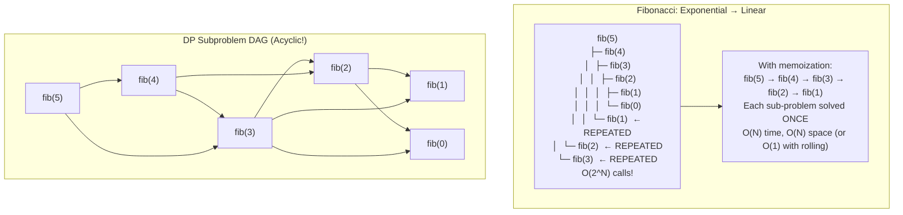

### Longest Common Subsequence: DP Table

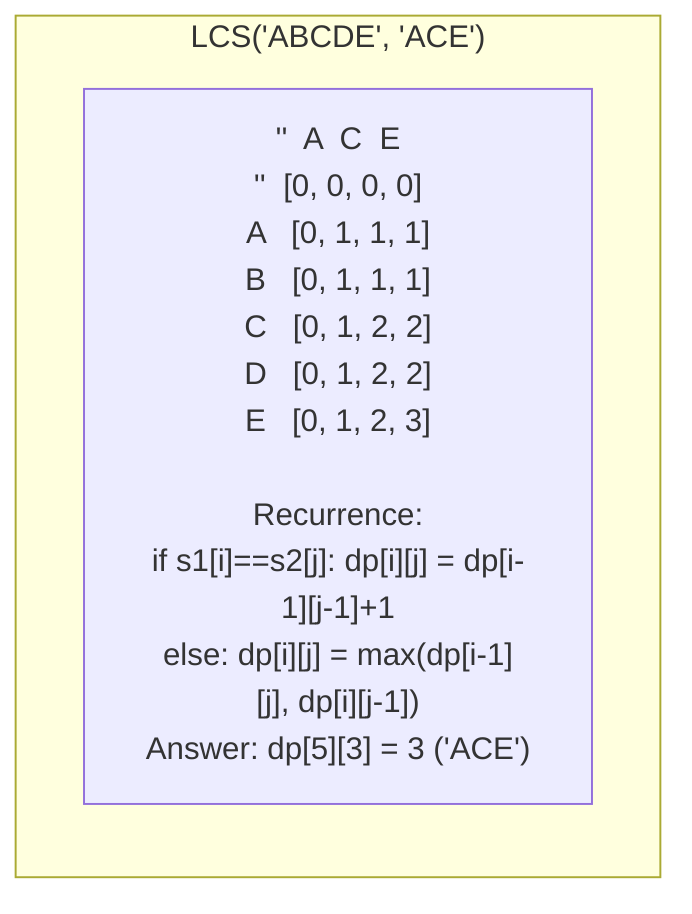

---

## 2. Knapsack Problem: Complete DP Analysis

0/1 Knapsack: n items, each with weight wᵢ and value vᵢ. Maximize total value with capacity W.

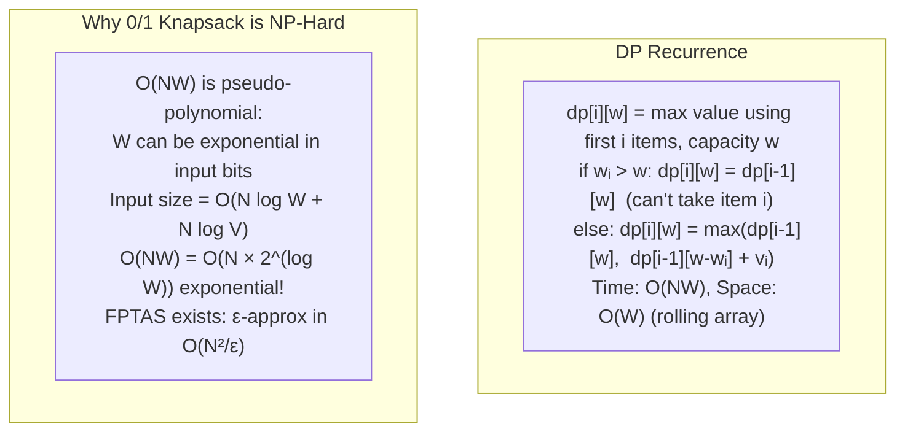

---

## 3. Network Flow: Ford-Fulkerson to Push-Relabel

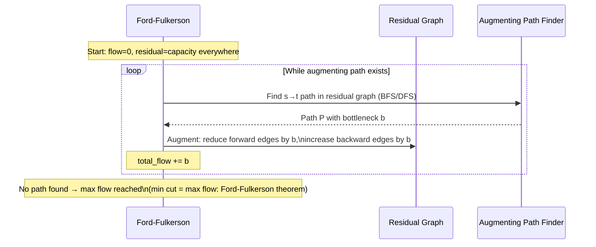

### Min Cut ↔ Max Flow Duality

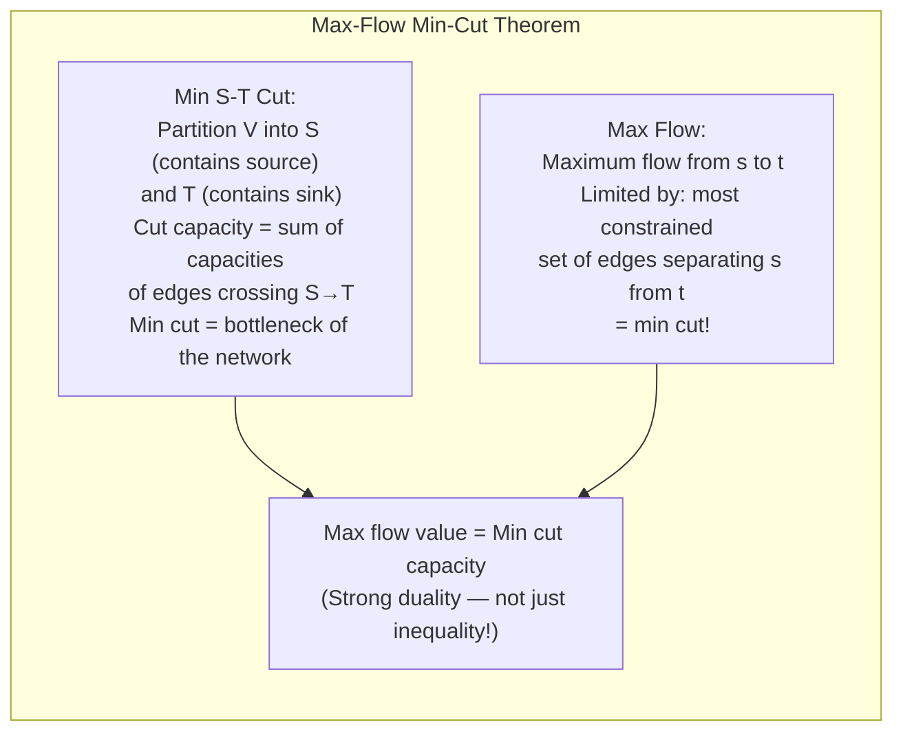

### Push-Relabel Algorithm: O(V²√E)

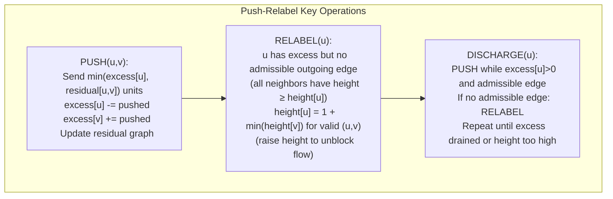

---

## 4. String Algorithms: KMP and Suffix Arrays

### KMP: Failure Function Mechanics

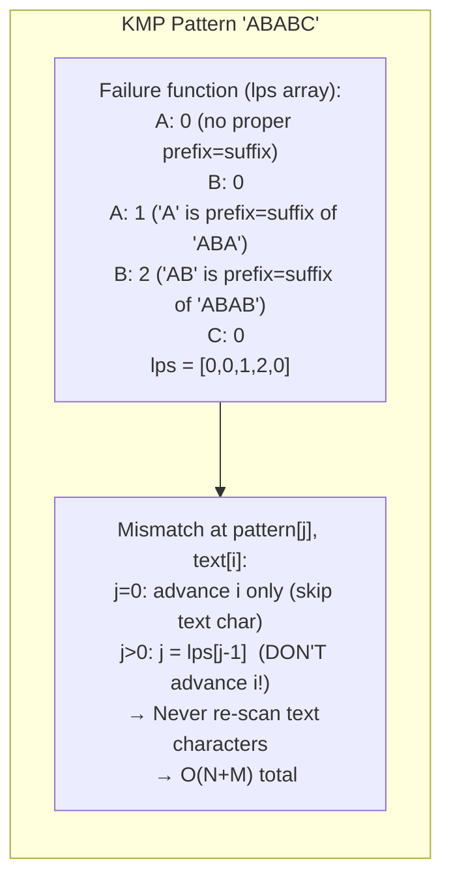

### Suffix Array: O(N log N) Construction

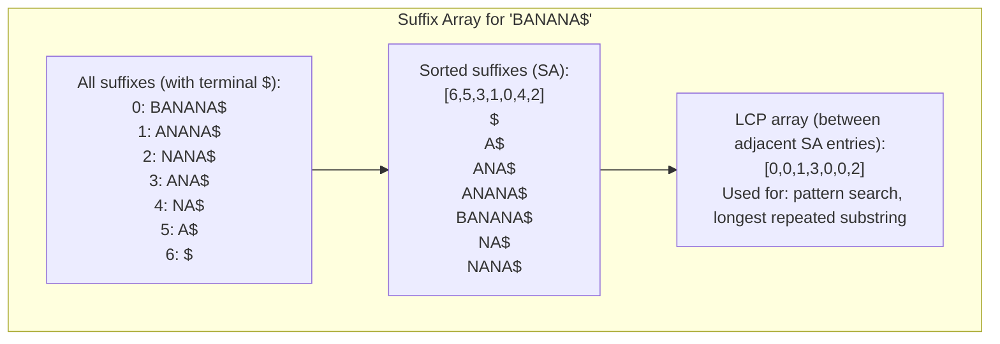

---

## 5. Computational Complexity: Reduction Mechanics

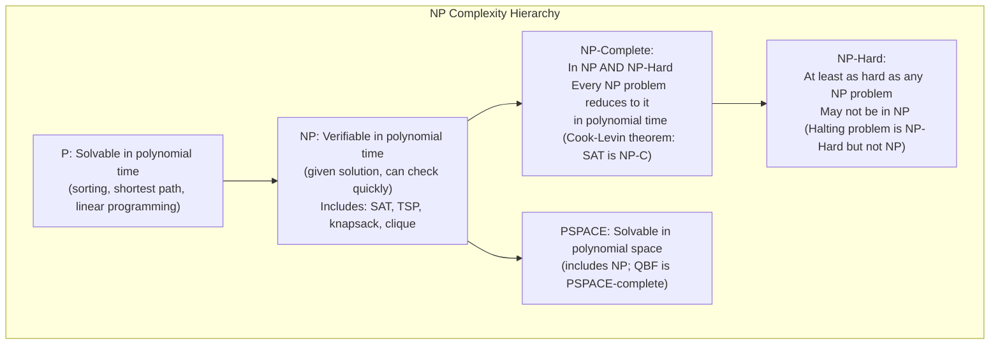

### Polynomial Reduction: 3-SAT → Independent Set

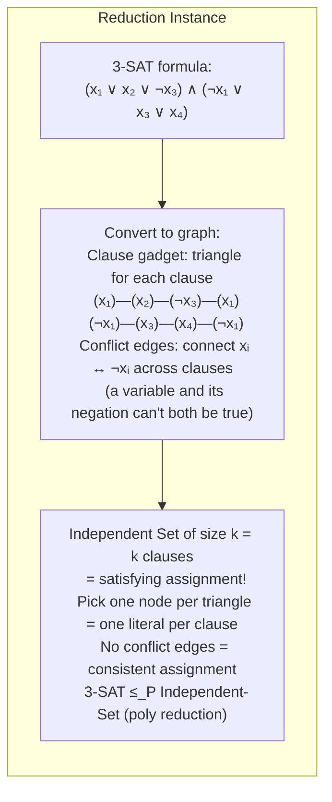

---

## 6. Randomized Algorithms: Correctness and Probability

### QuickSort Expected O(N log N)

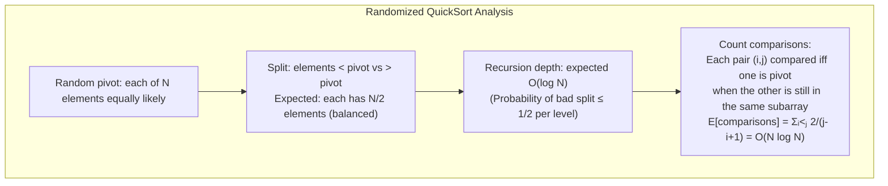

### Bloom Filter: False Positive Analysis

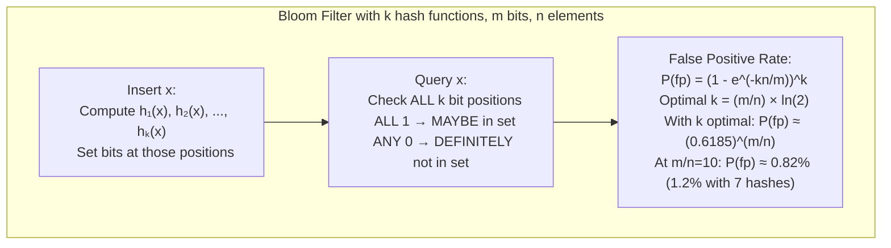

---

## 7. Amortized Analysis: Accounting Method

### Dynamic Array Push_Back

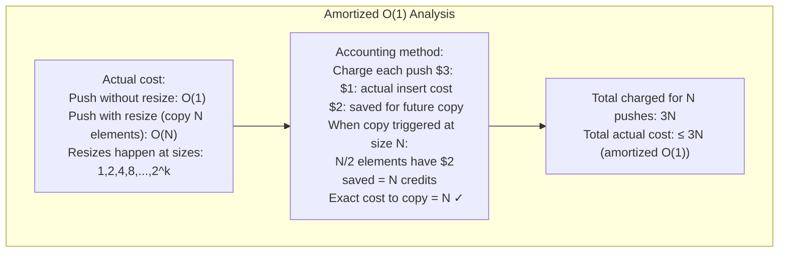

---

## 8. Approximation Algorithms: Vertex Cover and TSP

### 2-Approximation for Vertex Cover

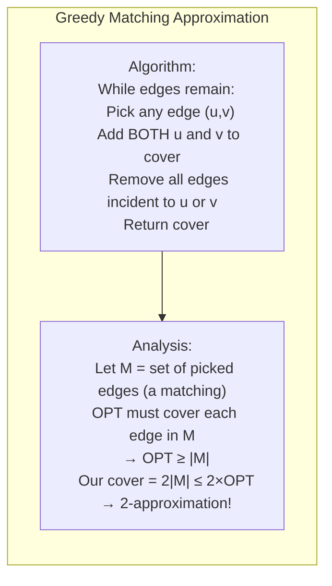

### Christofides Algorithm: 1.5-Approximation for TSP (metric)

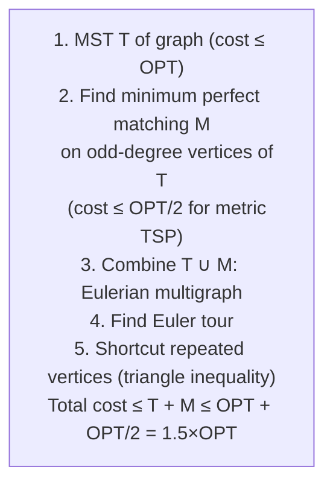

---

## 9. Competitive Programming: Classic Problem Patterns

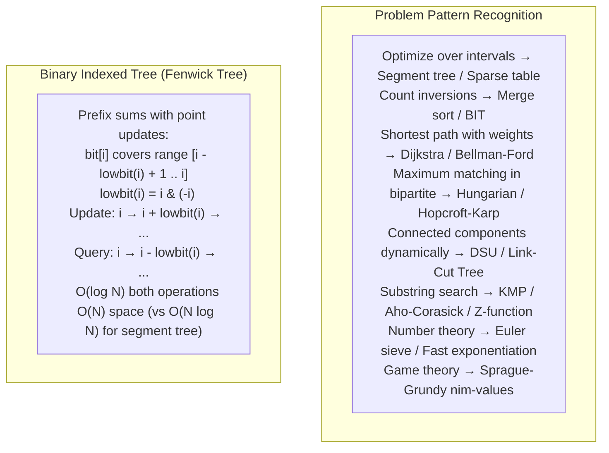

---

## 10. Computational Geometry: Convex Hull Internals

### Graham Scan: O(N log N)

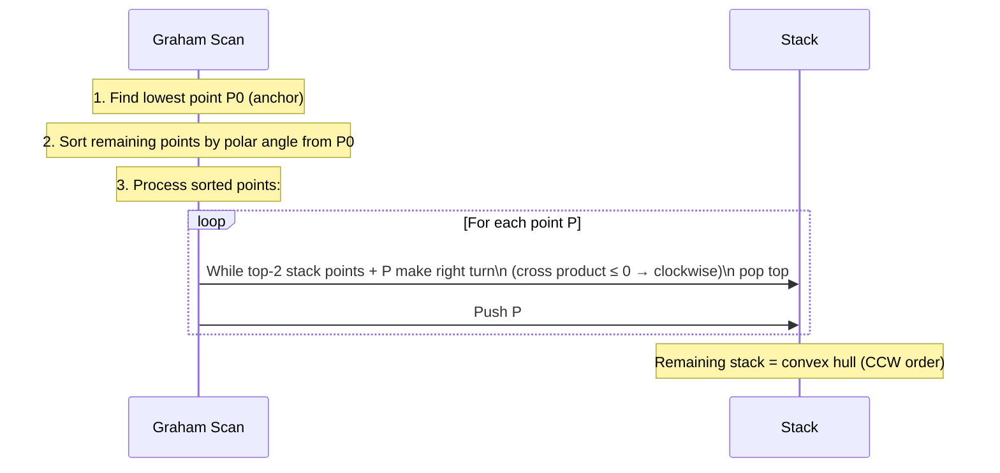

**Cross product test**: Given points A, B, C — check if they make a left turn:
```
cross = (B.x-A.x)*(C.y-A.y) - (B.y-A.y)*(C.x-A.x)
cross > 0: left turn (CCW) — keep B
cross < 0: right turn (CW) — pop B
cross = 0: collinear — depends on requirements
```

---

## Summary: Algorithm Complexity Reference

| Problem | Algorithm | Time | Space |
|---|---|---|---|
| Sorting | Merge sort | O(N log N) | O(N) |
| Pattern search | KMP | O(N+M) | O(M) |
| Max flow | Push-Relabel | O(V²√E) | O(V+E) |
| MST | Prim (binary heap) | O(E log V) | O(V) |
| SSSP (non-neg) | Dijkstra (Fibonacci heap) | O(E + V log V) | O(V) |
| SSSP (neg weights) | Bellman-Ford | O(VE) | O(V) |
| LCS | DP table | O(NM) | O(min(N,M)) |
| Knapsack | DP (pseudo-poly) | O(NW) | O(W) |
| Convex hull | Graham scan | O(N log N) | O(N) |
| Vertex cover approx | Maximal matching | O(E) | O(V) |
