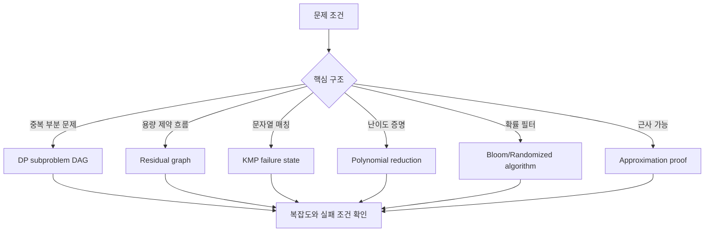
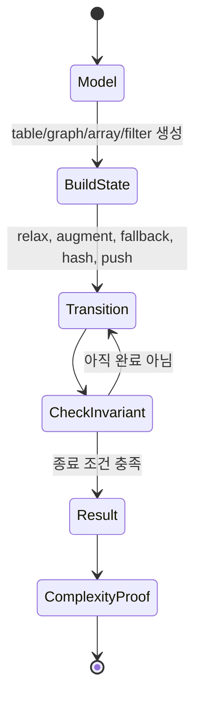

# Algorithms CS Reference 학습 및 기록 노트

## 1. 왜 필요한가? (Pain Point & Motivation)

알고리즘 CS 레퍼런스는 DP, 네트워크 플로우, 문자열 알고리즘, 계산 복잡도, 확률 알고리즘, 근사 알고리즘, 계산기하를 한 번에 다룬다. 단순 공식 목록으로 보면 범위가 너무 넓지만, 내부적으로는 모두 "상태를 어떻게 표현하고 어떤 전이가 보존되는가"라는 하나의 질문으로 묶인다.

이 문서는 원문 레퍼런스를 빠르게 복습할 수 있도록 핵심 상태, 불변식, 실패 조건 중심으로 재작성한다.

## 2. 현재 나의 상태 (Baseline)

- DP, KMP, Dijkstra, max flow, NP-complete 같은 개념 이름은 알고 있다.
- 0/1 knapsack의 `O(NW)`가 pseudo-polynomial이라는 의미를 자주 놓친다.
- Ford-Fulkerson, push-relabel, min-cut duality를 상태 변화로 설명하는 데 익숙하지 않다.
- randomized quicksort와 Bloom filter의 확률 보장을 구현 조건과 분리해 생각해야 한다.
- 근사 알고리즘의 approximation ratio 증명을 직관 수준에서만 기억하고 있다.

## 3. 도달하고 싶은 목표 (Target State)

- DP table, residual graph, failure function, reduction gadget, random filter를 모두 상태 표현으로 읽는다.
- NP-hard, NP-complete, approximation, randomized guarantee의 차이를 설명한다.
- 문제 패턴을 보고 segment tree, Fenwick tree, KMP, flow, DP 같은 도구를 연결한다.
- 알고리즘의 시간 복잡도와 함께 필요한 불변식과 입력 전제를 확인한다.
- 각 알고리즘이 왜 그 자료구조를 요구하는지 최소 예제로 검증한다.

## 4. 시스템 번역 (Data Flow)



이 레퍼런스의 data flow는 문제를 곧바로 코드로 바꾸지 않는다. 먼저 문제 구조를 식별하고, 그 구조에 맞는 상태 저장 방식을 선택한다.

## 5. 핵심 구성요소 (Building Blocks)

| 구성요소 | 내부 상태 | 핵심 보장 |
| --- | --- | --- |
| Dynamic Programming | subproblem DAG와 table | 각 상태를 한 번만 계산한다. |
| 0/1 Knapsack | item index와 capacity table | 선택/미선택 전이가 최적값을 보존한다. |
| Residual graph | 남은 capacity와 backward edge | augmenting path가 없으면 max flow다. |
| Push-relabel | excess flow와 height label | admissible edge로 flow를 밀고 막히면 relabel한다. |
| KMP | LPS/failure array | text pointer를 되돌리지 않는다. |
| Suffix array | sorted suffix index와 LCP | suffix 비교를 정렬된 순서로 재사용한다. |
| Polynomial reduction | source instance -> target instance | 답의 존재 여부를 다항 시간에 보존한다. |
| Bloom filter | bit array와 hash functions | false negative는 없고 false positive만 가능하다. |
| Approximation | lower bound와 algorithm cost | `cost <= ratio * OPT`를 증명한다. |
| Convex hull | polar sort와 stack | stack이 항상 convex boundary를 유지한다. |

## 6. 상태 전이 (State Transition)



DP는 table을 채우고, max flow는 residual graph를 바꾸며, KMP는 pattern state를 이동한다. 각 전이는 작지만, invariant가 유지되기 때문에 전체 정답이 보장된다.

## 7. 불변식 (Invariant: 절대 깨지면 안 되는 규칙)

- DP는 참조하는 하위 문제가 이미 계산되어 있어야 한다.
- Knapsack의 rolling array는 0/1 선택을 보장하려면 capacity를 역순으로 순회해야 한다.
- Flow는 capacity constraint와 flow conservation을 만족해야 한다.
- Residual graph의 backward edge는 이전 augmentation을 되돌릴 수 있어야 한다.
- KMP의 LPS 값은 prefix와 suffix가 동시에 일치하는 최대 길이를 나타내야 한다.
- Polynomial reduction은 답의 참/거짓을 보존하고 입력 크기를 다항식 안에 유지해야 한다.
- Bloom filter는 동일한 hash 함수 집합으로 insert와 query를 수행해야 한다.
- 근사 알고리즘은 반드시 OPT의 lower bound와 알고리즘 결과의 upper bound를 연결해야 한다.
- Graham scan의 stack은 항상 counter-clockwise convex boundary를 유지해야 한다.

## 8. 가장 작은 예제 (Minimal Viable Example)

```python
def knapsack_01(items, capacity):
    dp = [0] * (capacity + 1)

    for weight, value in items:
        for current in range(capacity, weight - 1, -1):
            dp[current] = max(dp[current], dp[current - weight] + value)

    return dp[capacity]
```

0/1 knapsack에서 capacity를 역순으로 순회하는 이유는 같은 item을 같은 라운드에서 두 번 쓰지 않기 위해서다. 이 작은 순서 규칙이 0/1 선택 invariant를 지킨다.

## 9. 실패 사례 (What could go wrong?)

- Knapsack rolling array를 정순으로 순회하면 unbounded knapsack처럼 같은 item을 여러 번 사용할 수 있다.
- Ford-Fulkerson에서 irrational capacity와 나쁜 path 선택을 쓰면 종료 보장이 깨질 수 있다.
- Push-relabel에서 height invariant가 잘못되면 admissible edge 판단이 틀린다.
- KMP failure function이 틀리면 일부 match를 건너뛰거나 무한 fallback이 생긴다.
- Bloom filter의 bit array가 너무 작거나 hash 수가 부적절하면 false positive rate가 급격히 커진다.
- NP-hard를 "실제로 항상 느리다"로 오해하면 작은 입력, 특수 구조, 근사/휴리스틱 가능성을 놓친다.
- Convex hull에서 collinear point 처리 정책을 정하지 않으면 boundary 포함 여부가 흔들린다.

## 10. 뇌 확장하기 (Evolution & Variants)

- DP는 LCS, edit distance, matrix chain, bitmask DP, digit DP로 확장된다.
- Flow는 Edmonds-Karp, Dinic, push-relabel, min-cost max-flow로 이어진다.
- 문자열 알고리즘은 KMP, Z-function, Aho-Corasick, suffix array, suffix automaton을 비교한다.
- Complexity는 P/NP뿐 아니라 PSPACE, approximation hardness, parameterized complexity로 확장된다.
- Randomized algorithm은 Las Vegas, Monte Carlo, hashing, sampling, sketching으로 나눈다.
- Competitive programming에서는 "질의 종류"가 segment tree, Fenwick tree, sparse table 선택을 결정한다.

## 11. 최종 체크리스트 (Definition of Done)

- [x] DP, flow, KMP, complexity, randomized, approximation 주제를 한 상태 모델로 묶었다.
- [x] 0/1 knapsack 최소 예제로 rolling array 순서 invariant를 설명했다.
- [x] max flow와 residual graph의 실패 조건을 포함했다.
- [x] Bloom filter와 randomized algorithm의 확률 보장 한계를 정리했다.
- [x] 원문 레퍼런스의 알고리즘 복잡도 표를 학습 판단 기준으로 재구성했다.

## 12. 뇌에 새기는 복습 문장 (TL;DR Blank)

알고리즘 레퍼런스를 읽을 때는 먼저 상태 표현을 찾는다. table, residual graph, failure array, bit filter가 무엇을 보존하는지 알면 복잡도와 정당성이 함께 보인다.
