# C/C++ Internals: Under the Hood

> Synthesized from: Stroustrup *The C++ Programming Language* 4th ed, Meyers *Effective C++* / *Effective Modern C++*, Lippman *C++ Primer* 5th ed, comp(9/10/18/22-23/31/43/45/53/57/78/138/198-199/242/303/318/465) C and C++ references.

---

> **Reading contract:** This document mixes ISO C/C++ rules with System V AMD64, Itanium C++ ABI, compiler, glibc, and CPU implementation examples. A language guarantee must not be inferred from an illustrated layout or timing. For every low-level claim, identify standard version, ABI, compiler and flags, library/runtime version, CPU, and measurement method; classify it as normative rule, observed implementation, or estimate. A section is complete only when those identifiers, the success invariant, and failure or undefined-behavior boundary are explicit. If the target changes, invalidate the measurement or layout until it is reproduced.

## 1. Memory Model — Object Layout in Memory

Understanding exactly where C++ objects live in memory — stack frames, heap, data segment — is the foundation of everything from performance analysis to debugging.

### Stack Frame Layout (x86-64 System V ABI)

```
Higher addresses
+------------------------+ ← previous frame's RSP (caller's stack)
| caller's local vars    |
+------------------------+
| return address (8B)    | ← pushed by CALL instruction
+------------------------+
| saved RBP (8B)         | ← PUSH RBP at function entry
+------------------------+ ← RBP points here (frame base)
| local variable a (8B)  | [RBP-8]
| local variable b (4B)  | [RBP-12]
| padding (4B)           | alignment to 16 bytes
+------------------------+
| spilled registers      | callee-saved: RBX, R12-R15
+------------------------+ ← RSP points here during function body
Lower addresses
```

**Calling convention (System V AMD64 ABI)**:
- Integer/pointer args 1-6: `RDI, RSI, RDX, RCX, R8, R9`
- Float args 1-8: `XMM0–XMM7`
- Return value: `RAX` (int/ptr), `XMM0` (float/double)
- Callee-saved: `RBX, RBP, R12-R15`
- Caller-saved: `RAX, RCX, RDX, RSI, RDI, R8-R11, XMM0–XMM7`

### Virtual Memory Segments

```
+------------------------+ 0x7FFFFFFFFFFFFFFF (128TB)
| Stack (grows down)     | 8MB default limit (ulimit -s)
| ...                    |
+------------------------+
| mmap region            | shared libs, mmap(), large malloc
| (grows down)           | /usr/lib/libc.so.6 mapped here
+------------------------+
| ...                    |
+------------------------+
| Heap (grows up)        | brk()/mmap() managed by malloc
+------------------------+
| BSS segment            | zero-initialized global/static vars
+------------------------+
| Data segment           | initialized global/static vars
+------------------------+
| Text segment           | executable code (read-only)
+------------------------+ 0x400000 (typical ELF load address)
| NULL guard page        |
+------------------------+ 0x0
```

---

## 2. C++ Object Model — vtable and vptr Layout

### Single Inheritance vtable

```c++
class Animal {
    int age;
public:
    virtual void speak();     // slot 0
    virtual void move();      // slot 1
    virtual ~Animal();        // slot 2
};

class Dog : public Animal {
    char name[16];
public:
    void speak() override;    // overrides slot 0
    // move() inherited → slot 1 unchanged
    ~Dog() override;          // overrides slot 2
};
```

```
Dog object in memory:
+--------------------+
| vptr               | → Dog vtable (8 bytes, first field)
+--------------------+
| int age            | (inherited from Animal, 4 bytes)
| [4 bytes padding]  |
+--------------------+
| char name[16]      | (Dog's own data)
+--------------------+

Dog vtable (read-only, in .rodata):
+--------------------+
| offset-to-top = 0  | (RTTI bookkeeping)
+--------------------+
| type_info* Dog     | → typeinfo for Dog
+--------------------+
| &Dog::speak        | slot 0: overridden
+--------------------+
| &Animal::move      | slot 1: inherited
+--------------------+
| &Dog::~Dog         | slot 2: overridden
+--------------------+
```

### Virtual Dispatch — Assembly Level

```asm
; dog->speak();  compiles to:
mov rax, [rdi]        ; load vptr from dog object (rdi = this)
call [rax + 0]        ; indirect call through vtable slot 0
; compare with direct call (non-virtual):
; call Dog::speak     ; direct, no indirection, inlinable
```

A typical virtual call performs a vptr load and an indirect branch, but a branch-predictor miss is not mandatory and devirtualization may remove the call. Nanosecond costs require a named CPU, compiler, flags, call-site distribution, and benchmark; the values below are illustrative estimates only.

### Multiple Inheritance Layout

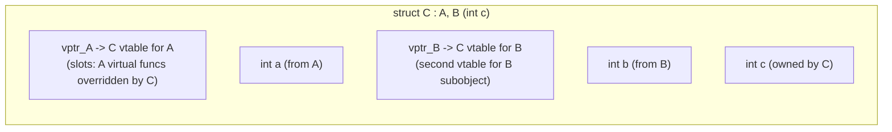

When casting `C*` to `B*`, compiler emits pointer adjustment (adds `sizeof(A)` to raw pointer) to point to B subobject. This is why `static_cast<B*>(c_ptr)` ≠ `reinterpret_cast<B*>(c_ptr)`.

---

## 3. RAII and Smart Pointer Internals

### unique_ptr — Zero-Cost Abstraction

```cpp
template<typename T, typename Deleter = std::default_delete<T>>
class unique_ptr {
    T* ptr;
    [[no_unique_address]] Deleter del;  // EBO: empty base optimization
                                         // sizeof(unique_ptr<T>) == sizeof(T*)
                                         // when Deleter is stateless (default)
public:
    ~unique_ptr() { if(ptr) del(ptr); }
    unique_ptr(unique_ptr&& o) noexcept : ptr(o.ptr), del(std::move(o.del)) {
        o.ptr = nullptr;
    }
    unique_ptr(const unique_ptr&) = delete;  // no copy
};
```

`unique_ptr<T>` is designed as a zero-overhead ownership abstraction with a stateless default deleter, but identical object size or machine code is not a language guarantee. Confirm layout and generated code for the selected deleter, ABI, compiler, and optimization level.

### shared_ptr — Control Block Layout

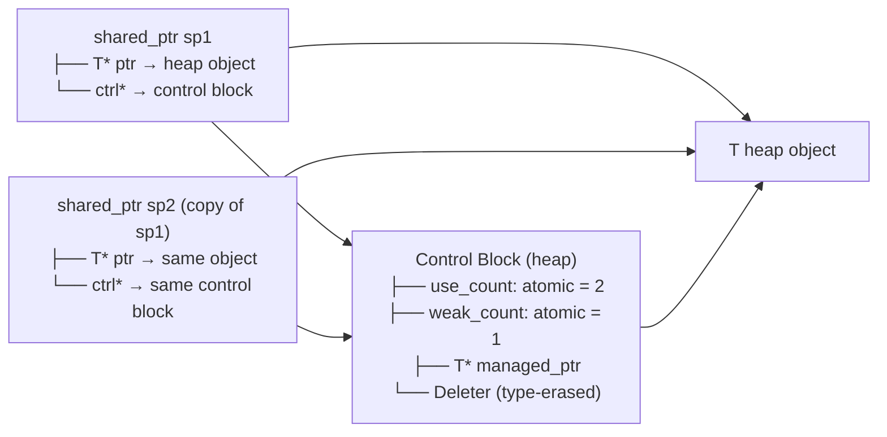

`make_shared<T>(args...)` commonly uses one allocation for the object and control block, though the standard does not prescribe their physical layout. When the strong count reaches zero, `T` is destroyed; outstanding `weak_ptr` instances can keep the combined allocation and control block alive until the weak count reaches zero.

**Atomic ref-counting cost**: `use_count` uses `std::atomic<int>`. Increment/decrement = `LOCK XADD` on x86 (atomic read-modify-write). ~5-10 ns per copy/destruction. Avoid in tight loops: prefer passing `const shared_ptr&` over copying.

---

## 4. Move Semantics — Value Categories and Rvalue References

### Value Categories

```
Expression categories:
lvalue:  has identity + not movable     int x; x = 5;  // x is lvalue
xvalue:  has identity + movable         std::move(x)   // cast to xvalue
prvalue: no identity + movable          42, f()        // pure rvalue

lvalue + xvalue = glvalue (has identity)
xvalue + prvalue = rvalue (movable)
```

### Move Constructor vs Copy — Memory Path

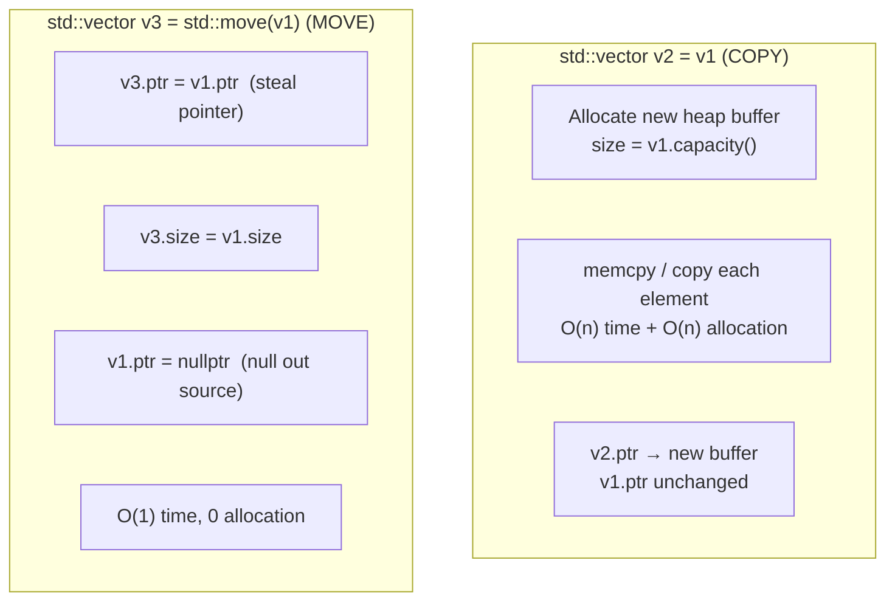

**Perfect forwarding**:
```cpp
template<typename T>
void wrapper(T&& arg) {            // T&& = forwarding reference
    inner(std::forward<T>(arg));   // preserves lvalue/rvalue category
}
// If arg is lvalue: T=T&, forward<T&>(arg) → lvalue passed
// If arg is rvalue: T=T,  forward<T>(arg)  → rvalue passed (moved)
```

Reference collapsing rules: `T& &` → `T&`, `T& &&` → `T&`, `T&& &` → `T&`, `T&& &&` → `T&&`.

---

## 5. Template Instantiation and Compile-Time Computation

### Template Instantiation Model

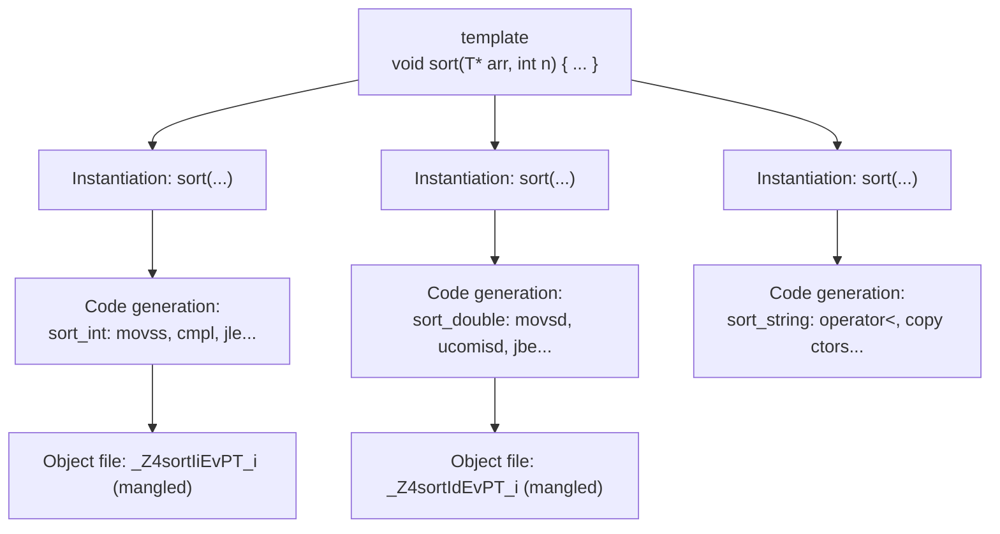

**Code bloat**: Each instantiation emits full function body. `std::vector<int>`, `std::vector<double>`, `std::vector<string>` = 3 completely separate compiled implementations. Mitigation: explicit instantiation declarations, type-erased base classes.

### Constexpr and Compile-Time Evaluation

```cpp
constexpr uint64_t fibonacci(uint64_t n) {
    if (n <= 1) return n;
    return fibonacci(n-1) + fibonacci(n-2);
}
// At compile time:
constexpr auto fib20 = fibonacci(20);  // = 6765, computed at compile time
// Assembly: mov eax, 6765  (constant folded, zero runtime cost)

// std::array with compile-time size:
template<size_t N>
constexpr std::array<uint64_t, N> make_fib_table() {
    std::array<uint64_t, N> t{};
    t[0]=0; t[1]=1;
    for(size_t i=2; i<N; i++) t[i] = t[i-1]+t[i-2];
    return t;
}
constexpr auto FIB_TABLE = make_fib_table<50>();
// Entire table in .rodata, no runtime computation
```

**Template metaprogramming** exploits the compiler's type system as an interpreter:
```cpp
template<int N> struct Factorial { 
    static constexpr int value = N * Factorial<N-1>::value; 
};
template<> struct Factorial<0> { static constexpr int value = 1; };
// Factorial<10>::value = 3628800 — computed entirely by template instantiation
```

---

## 6. Memory Allocator Internals — malloc/free/new/delete

### glibc ptmalloc2 Architecture

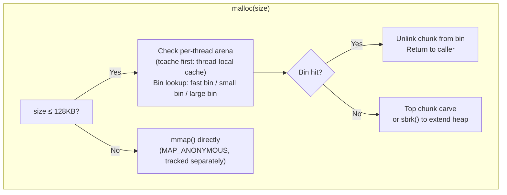

### Chunk Layout (glibc malloc)

```
+----------------------+ ← prev chunk end
| PREV_SIZE (8B)       | size of prev chunk (if prev is free)
+----------------------+ ← chunk start (returned ptr - 16)
| SIZE (8B)            | size of THIS chunk | PREV_IN_USE | IS_MMAPED | NON_MAIN
+----------------------+ ← user data pointer (returned by malloc)
| Forward ptr (8B)     | (free chunks only: next free in bin)
| Backward ptr (8B)    | (free chunks only: prev free in bin)
| User data ...        |
+----------------------+
| [next chunk header]  |
```

Minimum allocation: 32 bytes (16 header + 16 user for alignment). Requested size rounded up to 16-byte boundary. **Use-after-free**: `free()` writes fd/bk pointers into freed memory; reading after free sees these corrupted pointers.

### tcache (glibc ≥ 2.26) — Thread-Local Cache

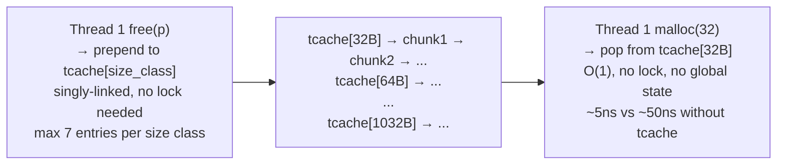

---

## 7. C++ Exceptions — Zero-Cost Exception Handling

### DWARF Unwind Tables (Itanium C++ ABI)

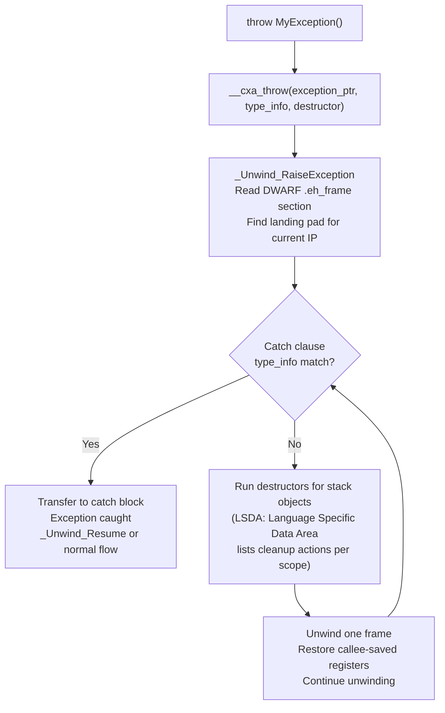

**Table-based exception handling:** Under the illustrated ABI, normal control flow usually avoids per-`try` dynamic bookkeeping, but tables increase binary size and can affect optimization and instruction-cache behavior. Throw cost depends on stack depth, cleanup work, ABI, and runtime; no fixed nanosecond value is portable.

**RAII + exceptions**: Every destructor called during stack unwinding. This is why RAII is critical — `std::unique_ptr`, `std::lock_guard` destructors guaranteed to run even during exception propagation.

---

## 8. C Memory Management — malloc vs Stack vs mmap

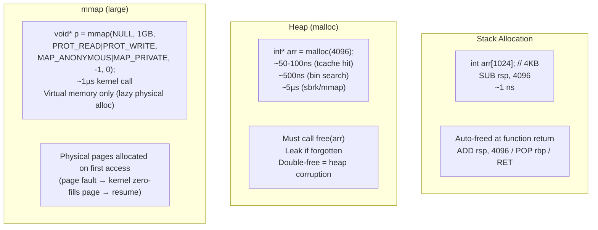

---

## 9. Undefined Behavior — What Actually Happens

### Signed Integer Overflow

```c
int x = INT_MAX;
int y = x + 1;  // UB: signed overflow
// Compiler ASSUMES this never happens → optimizes based on assumption:
// Loop: for(int i = 0; i >= 0; i++) — compiler sees i is always ≥0 (no overflow)
// → removes the loop termination check entirely (infinite loop!)
// -fsanitize=undefined catches this at runtime
```

### Strict Aliasing Violation

```c
float f = 3.14f;
int* ip = (int*)&f;         // UB: aliasing float through int*
int bits = *ip;             // compiler may return stale cached value
                             // (optimizer assumed float ptr and int ptr don't alias)

// Correct way: memcpy (portable type punning)
int bits2;
memcpy(&bits2, &f, 4);     // well-defined
// Or: __attribute__((may_alias)) (GCC extension)
```

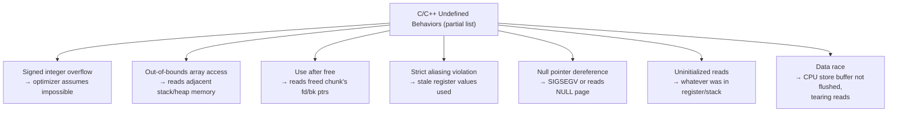

---

## 10. C++ Standard Library Containers — Internal Structures

### std::vector — Capacity Growth

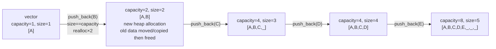

`push_back` is amortized O(1) when the implementation grows capacity geometrically. The C++ standard does not mandate a 2× or 1.5× factor; inspect the selected library version. After `reserve(n)` succeeds, insertion does not reallocate while the resulting size remains at most `capacity()`.

### std::unordered_map — Hash Table Layout

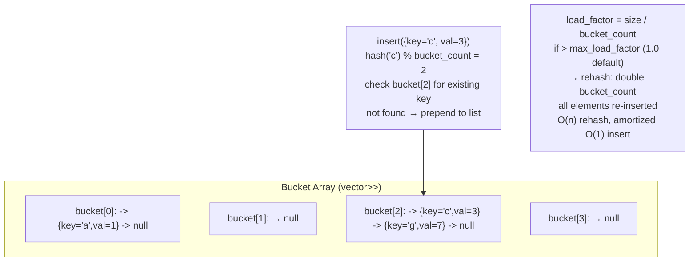

### std::map — Red-Black Tree

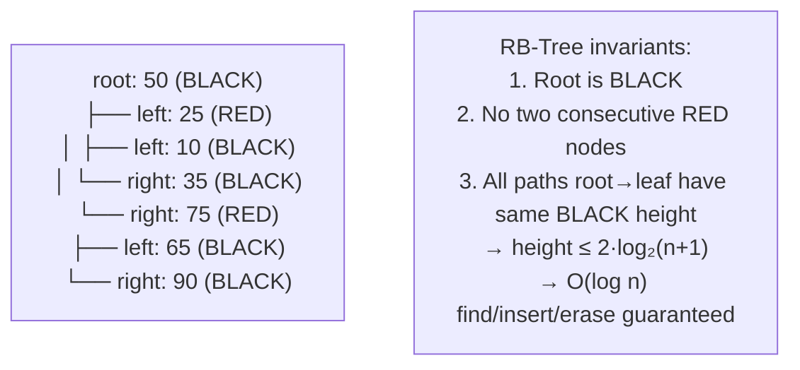

`std::map` node = `std::_Rb_tree_node<pair<const K,V>>`: 3 pointers (parent, left, right) + color bit + key + value. Per-element overhead: 5 machine words (40 bytes) plus key+value. Poor cache performance vs `std::vector` for sequential access.

---

## 11. Lock-Free Programming — Memory Ordering

### C++11 Memory Model

```cpp
std::atomic<int> flag{0};
std::atomic<int> data{0};

// Thread 1 (producer):
data.store(42, std::memory_order_relaxed);    // may reorder
flag.store(1, std::memory_order_release);      // RELEASE: all prior stores visible before this

// Thread 2 (consumer):
while(flag.load(std::memory_order_acquire) == 0) {} // ACQUIRE: no subsequent loads before this
int x = data.load(std::memory_order_relaxed); // guaranteed to see 42
```

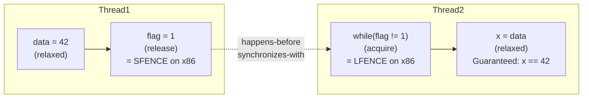

**x86 memory model:** Acquire loads and release stores commonly compile to ordinary loads and stores on x86-64, with compiler ordering constraints; the `SFENCE`/`LFENCE` labels above are conceptual and should not be read as emitted instructions. `seq_cst` operations are not universally free, and ARM/POWER instruction sequences depend on operation, compiler, and architecture version.

---

## 12. Compilation Pipeline — C++ Source to Binary

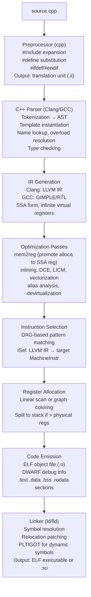

**Name mangling**: C++ symbols encoded with types for overload disambiguation:
- `void foo(int)` → `_Z3fooi`
- `void foo(double)` → `_Z3food`  
- `Foo::bar(int, float)` → `_ZN3Foo3barEif`
- `extern "C"` disables mangling (for C interop)

---

## Illustrative Performance Numbers (C++)

> These figures are hypotheses for an unspecified benchmark environment, not portable bounds. Record CPU, OS, compiler, flags, allocator, data size, contention, warm-up, and percentile before using or comparing any row.

| Operation | Cost | Notes |
|-----------|------|-------|
| Stack alloc/dealloc | ~1 ns | SUB/ADD rsp |
| malloc (tcache hit) | ~5-10 ns | thread-local, no lock |
| malloc (bin search) | ~50-100 ns | global arena lock |
| malloc (sbrk/mmap) | ~1-5 µs | syscall |
| Virtual call | ~5-10 ns | vptr load + indirect jmp |
| Inlined call | ~0 ns | zero overhead after inlining |
| shared_ptr copy | ~10-20 ns | atomic increment |
| Exception throw | ~5-50 µs | DWARF unwinding |
| std::map find | O(log n) ~100 ns (n=1M) | cache-unfriendly tree walk |
| std::unordered_map find | O(1) ~50-100 ns | hash + linked list traversal |
| std::vector push_back (amortized) | ~2-5 ns | direct memory write |
