# Cloud & AWS Internals: Hypervisors, Virtual Networks & Managed Services

> Under the Hood: How EC2 instances boot on bare metal, how S3 stores objects across failure domains, how VPCs route packets through virtual switches, how Lambda cold starts work — the exact hardware, network, and storage mechanics behind cloud infrastructure.

## Evidence boundary

AWS publishes service contracts, quotas, and selected architecture details, but not every storage layout, host implementation, timing, or control-plane algorithm shown below. Treat diagrams that name shard counts, quorum protocols, internal databases, overlay formats, or fixed latency as **illustrative models**, not verified AWS internals. A production decision is complete only when the relevant AWS documentation, Region, service tier, configuration, and an observed metric or test result are recorded.

---

## 1. Hypervisor Architecture: EC2 on Nitro

AWS Nitro is a custom hypervisor offloading I/O and security to dedicated hardware cards rather than a host OS.

This describes Nitro's public architectural direction. The CPU-overhead percentages, firmware path, boot firmware, and device details in the diagram are workload- and generation-specific assumptions; they are not portable EC2 guarantees.

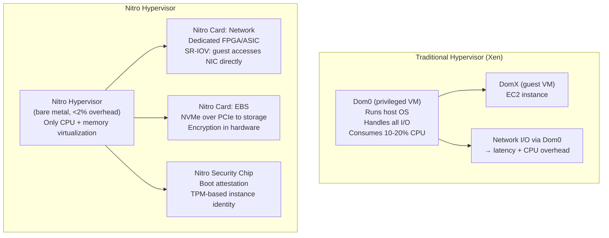

### VM Boot Sequence on Nitro

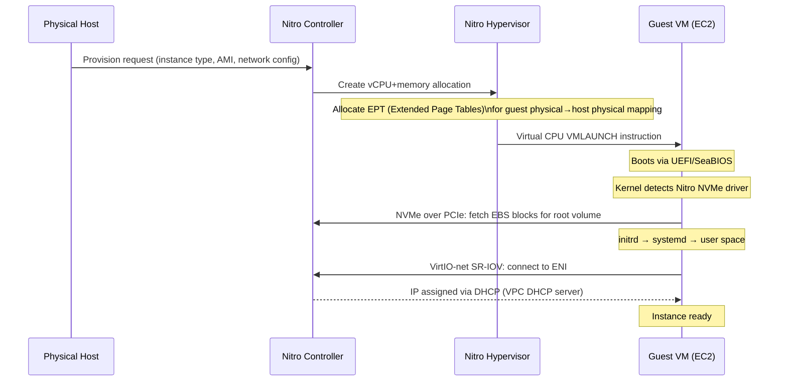

---

## 2. VPC Network Architecture: Virtual Switches and Routing

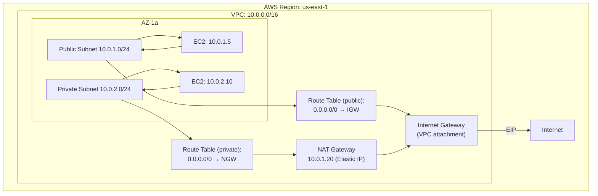

### Packet Flow: EC2 to Internet

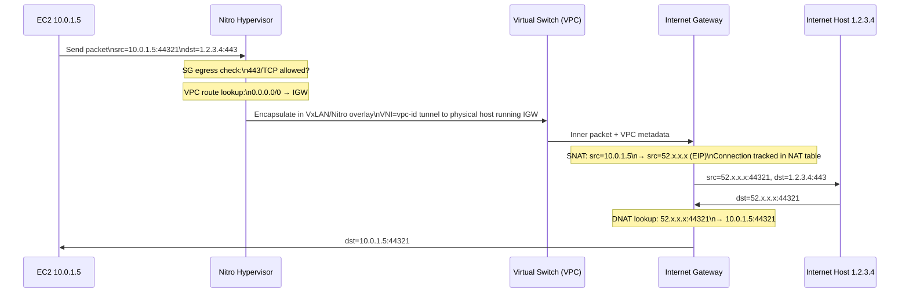

### Security Groups: Stateful Packet Inspection

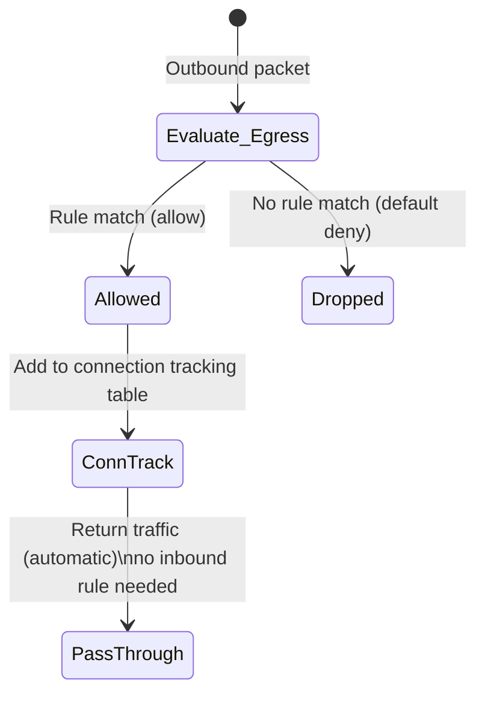

Security groups are **stateful**: response traffic for an allowed flow is tracked without requiring a symmetric rule. AWS does not contractually expose this as a Linux `conntrack` table inside the Nitro hypervisor, so that implementation detail should not be used for capacity or failure analysis.

---

## 3. S3 Internals: Object Storage Architecture

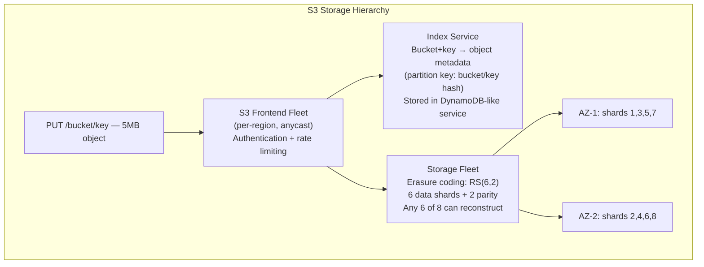

### Reed-Solomon Erasure Coding (RS 6+2)

The following `RS(6,2)` layout is a teaching example for erasure coding. S3's public durability and availability commitments do not specify this exact shard count or placement, and two lost shards do not imply tolerance of two entire Availability Zone failures.

```
Object → [d1, d2, d3, d4, d5, d6]  (data chunks)
         [p1, p2]                   (parity: p_i = linear combination of d_j over GF(2⁸))

Reconstruction: Any 6 of 8 shards sufficient.
               Solve system of linear equations over GF(2⁸)
               Tolerates: 2 simultaneous shard failures = 2 AZ failures
```

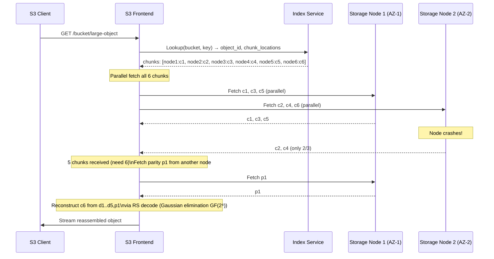

### S3 Consistency Model

Since December 2020, S3 documents strong read-after-write consistency for object PUT/DELETE and related read/list operations. The serializable metadata store described here is a hypothesis; the observable guarantee does not reveal the internal metadata implementation.

---

## 4. Lambda Cold Start Internals

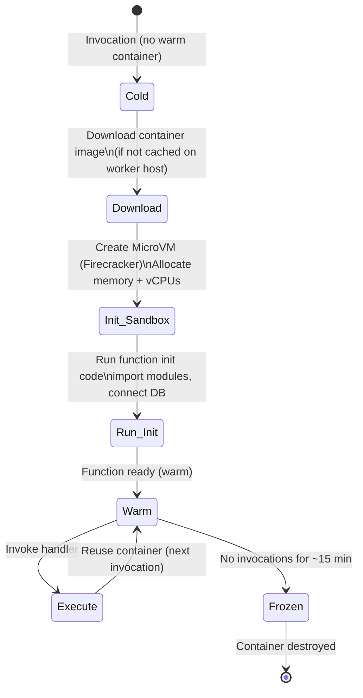

### Firecracker MicroVM

AWS Lambda uses **Firecracker** (open-source KVM-based microVM):

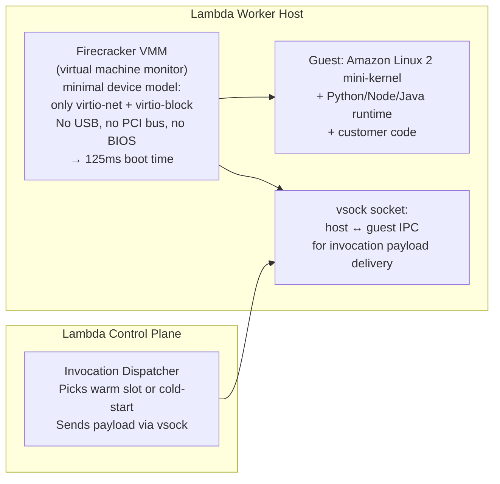

**Cold start breakdown (Python 3.11, 256MB)**:

The values below are an example measurement envelope, not an SLA. Record Region, architecture, package size, runtime version, VPC configuration, provisioned concurrency, sample count, and percentile before comparing cold starts.
- Firecracker boot: ~125ms
- Amazon Linux init: ~50ms  
- Python interpreter start: ~100ms
- Customer `import` statements: variable (0ms–2000ms)
- **Total: 250ms–2500ms** (vs warm: <1ms overhead)

---

## 5. DynamoDB Internals: Partitioning and Replication

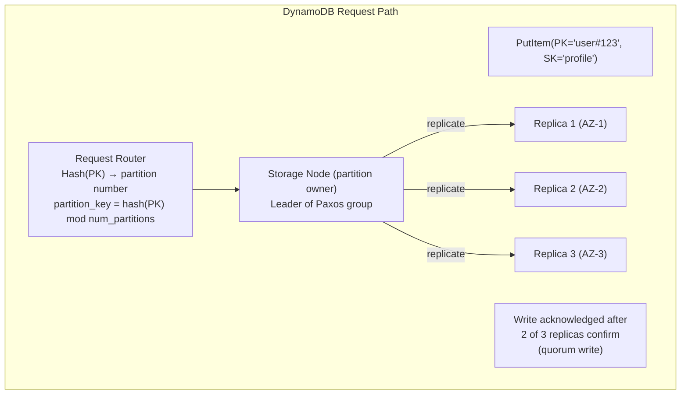

### DynamoDB LSM-Tree Storage Engine

The following LSM-tree diagram is a conceptual storage-engine model. DynamoDB does not expose a contractual per-partition LSM layout, SSTable size, Bloom-filter setting, or Paxos role assignment.

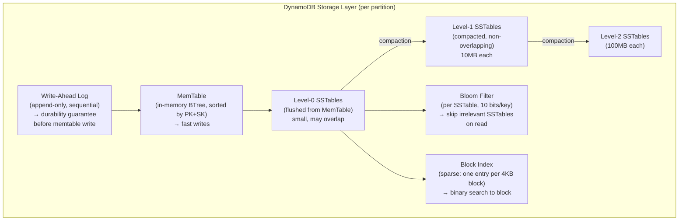

### DynamoDB Auto-Partitioning (Adaptive Capacity)

The following split algorithm is illustrative. Published per-partition throughput guidance does not mean a split occurs immediately at a fixed threshold or at the median key; adaptive capacity and partition management remain service-controlled.

```
partition_id=abc → [abc_low, abc_high]
split_point = median key in partition
all keys < median → abc_low
all keys ≥ median → abc_high
Transparent to application: router table updated atomically
```

---

## 6. EBS: Block Storage Internals

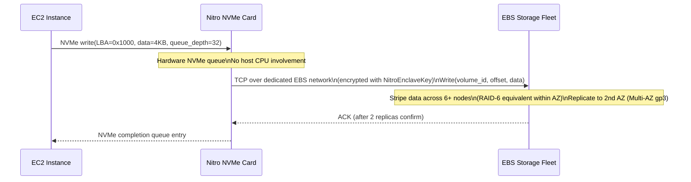

**EBS gp3 throughput**: 125 MB/s baseline, up to 1000 MB/s (provisioned). The Nitro card handles all NVMe protocol, encryption (AES-256 in hardware), and TCP networking to EBS fleet — zero host CPU for I/O.

The sequence diagram's “Replicate to 2nd AZ (Multi-AZ gp3)” line is not a general EBS property. An EBS volume is an Availability Zone resource; cross-AZ durability requires a separate mechanism such as snapshots, application replication, or a service that explicitly provides Multi-AZ storage. Throughput limits also depend on volume size, provisioned settings, instance EBS bandwidth, and I/O shape.

---

## 7. IAM Policy Evaluation Engine

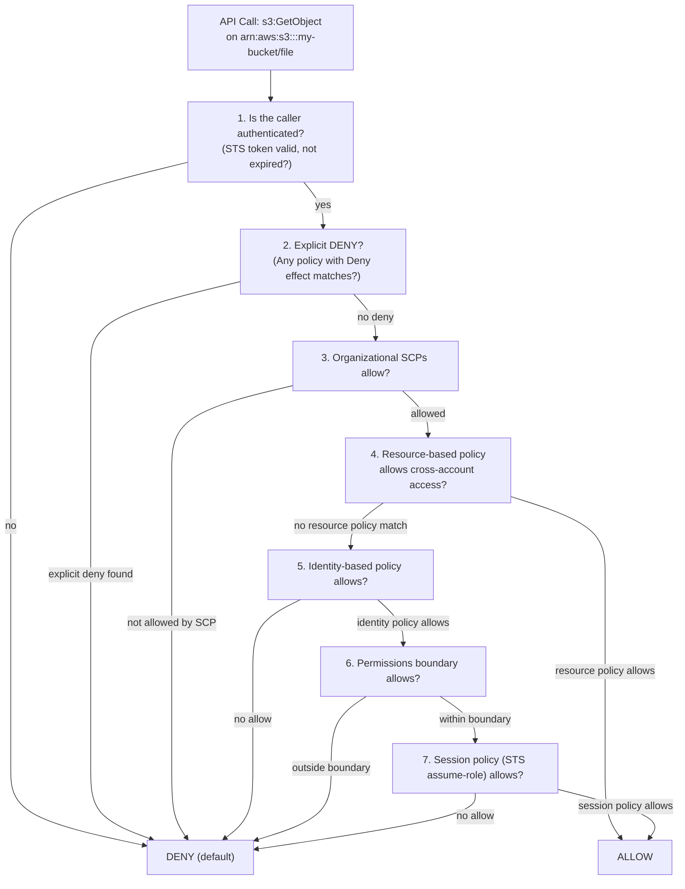

**Condition evaluation**: IAM combines condition operators and keys according to the policy grammar; multiple values, negated operators, set operators, and missing context keys change the result. Do not reduce evaluation to a universal “AND within, OR across” rule. Use the policy simulator or a denied test request with the exact principal, resource, action, and context keys.

---

## 8. RDS Multi-AZ: Synchronous Replication Internals

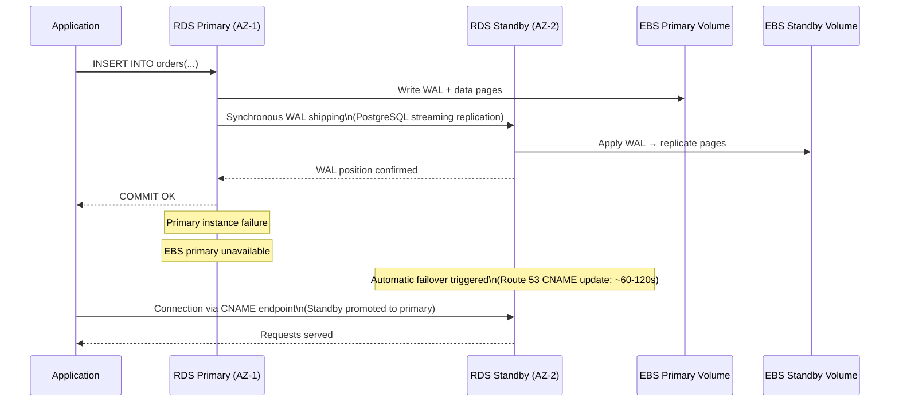

### Read Replica Architecture (Asynchronous)

Read replicas use **asynchronous** log shipping. Unlike Multi-AZ (synchronous, same-region failover), read replicas can lag minutes and are used for **read scaling**, not HA:

```
Primary → WAL chunks → replica_1 (async, may lag)
                     → replica_2 (async, may lag)
                     → replica_3 (cross-region, higher lag)
```

---

## 9. CloudFront CDN Internals: Edge Caching

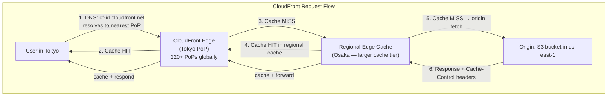

### Cache Key Composition

```
Default cache key = host + path + query string params (configured)
Vary headers (Accept-Encoding: gzip,br) → separate cache variants
CloudFront Functions: modify cache key in edge compute (sub-ms JS runtime)
Lambda@Edge: full Node.js (origin/response/request phase — 5ms max)
```

---

## 10. AWS Auto Scaling: Control Loop Mechanics

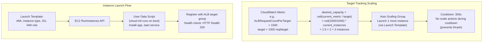

---

## 11. AWS Service Internals Summary

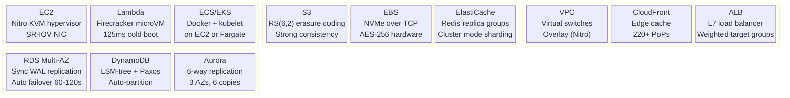

---

## AWS Shared Responsibility Model: Technical Boundaries

| Layer | AWS Responsible | Customer Responsible |
|---|---|---|
| Physical hardware | ✅ Nitro cards, BIOS, firmware | — |
| Hypervisor | ✅ Nitro hypervisor isolation | — |
| Host OS | ✅ Patching, updates | — |
| Guest OS | — | ✅ Patch EC2 AMI |
| Network ACLs | ✅ VPC infrastructure | ✅ Configure rules |
| Data at rest | ✅ Hardware AES-256 option | ✅ Enable encryption |
| IAM permissions | ✅ Policy engine | ✅ Write least-privilege policies |
| Application code | — | ✅ Vulnerabilities are yours |
