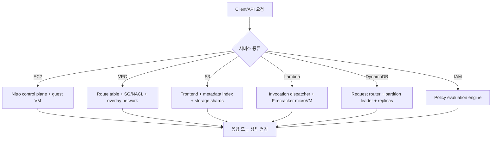
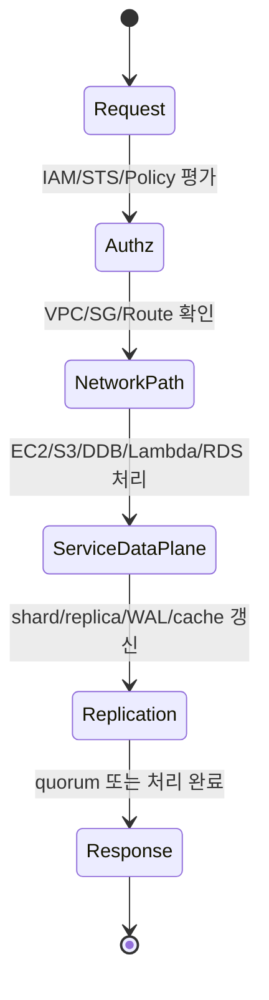
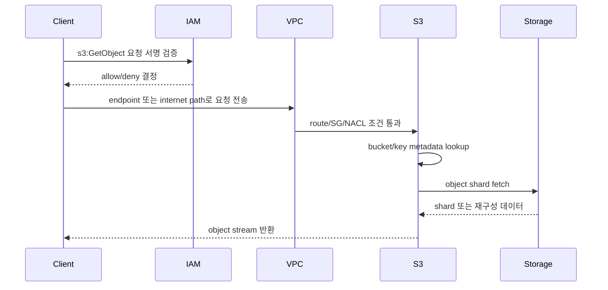

# Cloud & AWS Internals 학습 및 기록 노트

## 1. 왜 필요한가? (Pain Point & Motivation)

AWS 서비스를 "관리형"이라고만 이해하면 장애 원인, 비용, 보안 경계, 지연 시간을 설명하기 어렵다. EC2는 Nitro 하이퍼바이저와 전용 카드 위에서 실행되고, VPC는 가상 스위치와 라우팅 테이블로 패킷을 이동시키며, S3와 DynamoDB는 분산 저장소와 metadata/index 계층을 통해 내구성과 확장성을 만든다.

이 문서는 원문의 AWS 내부 동작 설명을 서비스별 data path, control plane, 실패 모드 중심으로 재작성한다.

## 2. 현재 나의 상태 (Baseline)

- EC2, VPC, S3, Lambda, DynamoDB, EBS, IAM, RDS, CloudFront, Auto Scaling의 사용법은 대략 알고 있다.
- Nitro, SR-IOV, Firecracker, erasure coding, LSM-tree 같은 내부 구현 요소가 서비스 동작과 어떻게 연결되는지 정리해야 한다.
- Security Group, IAM policy, NAT/IGW 같은 네트워크와 권한 경계를 운영 관점에서 추적하는 습관이 부족하다.
- 관리형 서비스의 보장과 고객 책임 경계를 구분해야 한다.
- 성능 수치는 workload와 리전/설정에 따라 달라질 수 있음을 문서에 반영해야 한다.

## 3. 도달하고 싶은 목표 (Target State)

- EC2 boot, VPC packet flow, S3 object read/write, Lambda cold start, DynamoDB write path를 data flow로 설명한다.
- IAM 평가 순서에서 explicit deny, SCP, identity policy, resource policy, permissions boundary의 역할을 구분한다.
- RDS Multi-AZ와 read replica의 동기/비동기 복제 차이를 운영 영향으로 연결한다.
- CloudFront cache key와 origin fetch 흐름을 이해한다.
- AWS shared responsibility model에서 AWS 책임과 고객 책임을 기술 경계로 나눠 판단한다.

## 4. 시스템 번역 (Data Flow)

AWS 서비스는 대부분 control plane과 data plane이 분리되어 있다. 설정 변경은 control plane을 거치고, 실제 패킷/블록/object/API 요청은 data plane에서 처리된다.

## 5. 핵심 구성요소 (Building Blocks)

| 구성요소 | 역할 | 주의할 점 |
| --- | --- | --- |
| Nitro Hypervisor | EC2 CPU/메모리 가상화와 격리 | I/O는 Nitro 카드로 offload된다. |
| ENI/VPC route table | instance의 네트워크 정체성과 라우팅 | subnet route와 SG/NACL이 함께 작동한다. |
| Security Group | stateful instance-level firewall | return traffic은 connection tracking에 의존한다. |
| S3 metadata index | bucket/key를 object location으로 매핑 | object data와 metadata path를 구분해야 한다. |
| Erasure coding | shard와 parity로 내구성 확보 | 복구는 여러 shard fetch와 decode가 필요하다. |
| Firecracker | Lambda/Fargate 계열 microVM 격리 | cold start는 image/runtime/init code 영향을 받는다. |
| DynamoDB partition | partition key hash 기반 저장 단위 | hot partition이 throughput 병목이 될 수 있다. |
| IAM policy engine | 요청 context와 policy를 평가 | explicit deny가 allow보다 우선한다. |
| RDS Multi-AZ | standby로 동기 복제/장애 조치 | read scaling 목적의 read replica와 다르다. |
| CloudFront cache key | edge cache 분기 기준 | header/query/cookie 설정이 hit ratio를 좌우한다. |

## 6. 상태 전이 (State Transition)

예를 들어 DynamoDB write는 요청 router가 partition leader를 찾고, leader가 replica quorum을 만족한 뒤 응답한다. S3 GET은 metadata lookup 후 object shard를 병렬 fetch한다.

## 7. 불변식 (Invariant: 절대 깨지면 안 되는 규칙)

- IAM은 explicit deny가 있으면 어떤 allow도 이를 덮을 수 없다.
- VPC packet flow는 route table, security group, network ACL, target resource 상태가 모두 맞아야 통과한다.
- S3 object key lookup과 object shard fetch는 일관된 metadata를 기준으로 수행되어야 한다.
- DynamoDB partition key 설계는 hot key를 만들지 않아야 한다.
- Lambda handler 성능을 논할 때 cold start와 warm invoke를 분리해야 한다.
- RDS Multi-AZ는 고가용성 목적이고, read replica는 읽기 확장 목적이라는 차이를 유지해야 한다.
- CloudFront cache key가 달라지면 같은 URL처럼 보여도 별도 cache entry가 될 수 있다.
- 고객이 관리하는 OS, IAM policy, 애플리케이션 취약점은 shared responsibility model에서 고객 책임이다.

## 8. 가장 작은 예제 (Minimal Viable Example)

이 흐름은 클라우드 요청을 볼 때 권한, 네트워크, 서비스 metadata, 실제 저장소 접근을 분리해서 추적해야 한다는 점을 보여준다.

## 9. 실패 사례 (What could go wrong?)

- Security Group만 보고 NACL, route table, subnet association 문제를 놓친다.
- Lambda cold start 지연을 handler 실행 시간과 섞어 보고 잘못된 최적화를 한다.
- DynamoDB partition key가 한 값으로 몰려 adaptive capacity 이전에 hot partition 병목이 생긴다.
- IAM에서 resource policy allow만 보고 SCP나 permissions boundary의 deny 효과를 놓친다.
- CloudFront cache key에 불필요한 header/cookie를 포함해 hit ratio가 급감한다.
- RDS read replica를 HA failover 대상으로 오해해 장애 복구 설계를 잘못한다.
- 관리형 서비스라는 이유로 고객 책임인 OS patch, least privilege, encryption 설정, app 보안을 생략한다.

## 10. 뇌 확장하기 (Evolution & Variants)

- EC2는 Nitro, bare metal, placement group, ENA/EFA, instance store 성능 특성으로 확장해 비교한다.
- VPC는 PrivateLink, Transit Gateway, VPC peering, NAT Gateway, Gateway Endpoint까지 data path를 추적한다.
- S3는 storage class, multipart upload, lifecycle, replication, event notification으로 확장된다.
- DynamoDB는 GSI/LSI, streams, transactions, global tables, adaptive capacity를 함께 본다.
- Lambda는 provisioned concurrency, container image, SnapStart, connection reuse를 별도 튜닝 축으로 본다.
- IAM은 SCP, permission boundary, session policy, resource policy, condition key를 조합해 평가한다.

## 11. 최종 체크리스트 (Definition of Done)

- [x] AWS 주요 서비스의 control plane과 data plane을 분리해 설명했다.
- [x] EC2/Nitro, VPC packet flow, S3, Lambda, DynamoDB, IAM, RDS, CloudFront의 핵심 내부 상태를 정리했다.
- [x] IAM explicit deny와 shared responsibility model을 불변식으로 포함했다.
- [x] S3 GET 흐름을 최소 sequence diagram으로 정리했다.
- [x] 원문에 있던 서비스별 내부 동작을 운영 실패 사례와 연결했다.

## 12. 뇌에 새기는 복습 문장 (TL;DR Blank)

클라우드 서비스는 버튼 하나처럼 보이지만 내부에서는 권한, 네트워크, metadata, 저장소, 복제 상태가 순서대로 통과한다. 장애 분석은 이 경로를 분리해서 보는 일이다.
