# Computer Architecture Internals: From Gates to Pipeline Hazards

> **Under the Hood** — How instructions flow through pipeline stages, how caches exploit spatial/temporal locality, how memory hierarchies hide latency, and how multiprocessors maintain coherence. Sources: *Computer Organization and Architecture* (Stallings, 9th ed.), *The Architecture of Computer Hardware, System Software, and Networking* (Englander), *Digital Logic and Computer Design* (Mano), *PC Hardware: A Beginner's Guide*, *Code: The Hidden Language of Computer Hardware and Software* (Petzold).

## Model assumptions

Sections 1–4 use a pedagogical five-stage, 32-bit-address RISC machine unless stated otherwise. Cache sizes, address-bit slices, latency, branch accuracy, TLB shape, reorder-buffer entries, and bandwidth are parameters of a specific microarchitecture, not architectural invariants. A numeric comparison is complete only with CPU SKU/stepping, clock policy, memory configuration, benchmark, counter names, sample count, and percentile or dispersion.

---

## 1. Instruction Pipeline: The 5-Stage RISC Model

The fundamental insight of pipelining is overlap: while one instruction executes, later instructions can be decoded or fetched. The idealized single-issue model approaches one retired instruction per cycle only after fill and in the absence of hazards, cache misses, exceptions, and multi-cycle operations.

```mermaid
flowchart LR
    subgraph CYCLE_1["Clock Cycle 1"]
        IF1["IF\nInstr 1"]
    end
    subgraph CYCLE_2["Clock Cycle 2"]
        ID2["ID\nInstr 1"]
        IF2["IF\nInstr 2"]
    end
    subgraph CYCLE_3["Clock Cycle 3"]
        EX3["EX\nInstr 1"]
        ID3["ID\nInstr 2"]
        IF3["IF\nInstr 3"]
    end
    subgraph CYCLE_4["Clock Cycle 4"]
        MEM4["MEM\nInstr 1"]
        EX4["EX\nInstr 2"]
        ID4["ID\nInstr 3"]
        IF4["IF\nInstr 4"]
    end
    subgraph CYCLE_5["Clock Cycle 5"]
        WB5["WB\nInstr 1"]
        MEM5["MEM\nInstr 2"]
        EX5["EX\nInstr 3"]
        ID5["ID\nInstr 4"]
        IF5["IF\nInstr 5"]
    end
    CYCLE_1 --> CYCLE_2 --> CYCLE_3 --> CYCLE_4 --> CYCLE_5
```

### Pipeline Register Content Between Stages

---

## 2. Pipeline Hazards: Data, Control, Structural

### Data Hazard: RAW (Read After Write)

```mermaid
sequenceDiagram
    participant IF
    participant ID
    participant EX
    participant MEM
    participant WB

    Note over IF,WB: ADD R1, R2, R3 — writes R1 in WB (cycle 5)
    Note over IF,WB: SUB R4, R1, R5 — reads R1 in ID (cycle 3) ← STALE!

    rect rgb(80, 20, 20)
        Note over ID: Read R1 before ADD writes it
        Note over ID: RAW Hazard detected
    end
    
    Note over IF,WB: STALL: Insert 2 bubble NOPs
    Note over IF,WB: OR: Forwarding from EX/MEM → EX input
```

**Forwarding (bypassing) paths:**

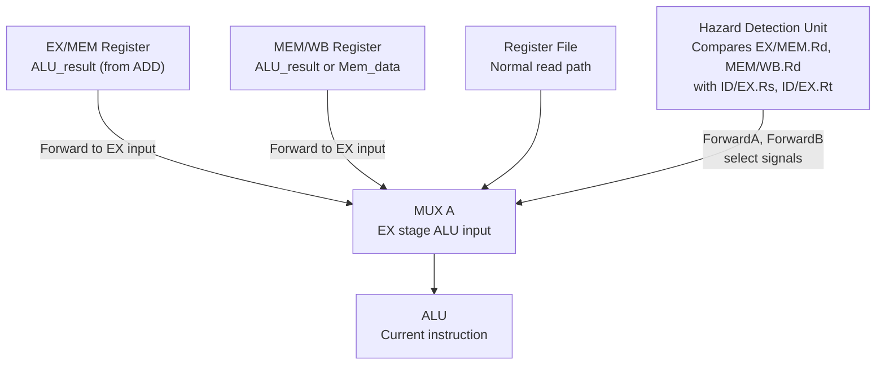

### Control Hazard: Branch Penalty

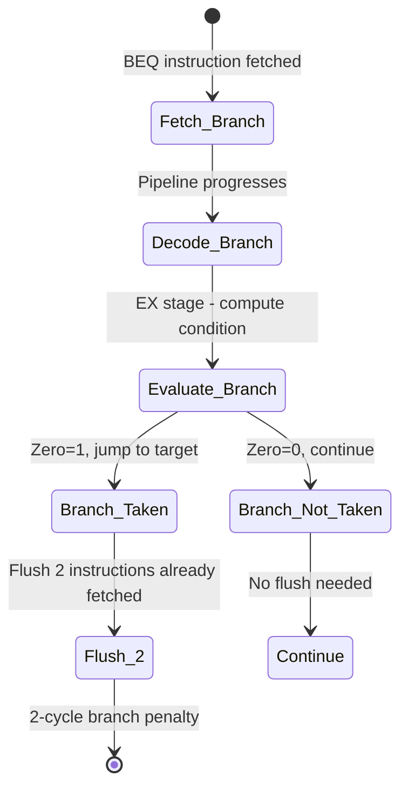

**Branch prediction strategies:**

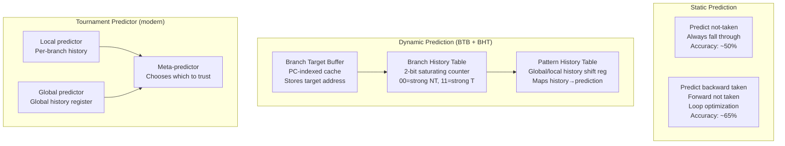

---

## 3. Cache Architecture: SRAM Sets, Ways, Tags

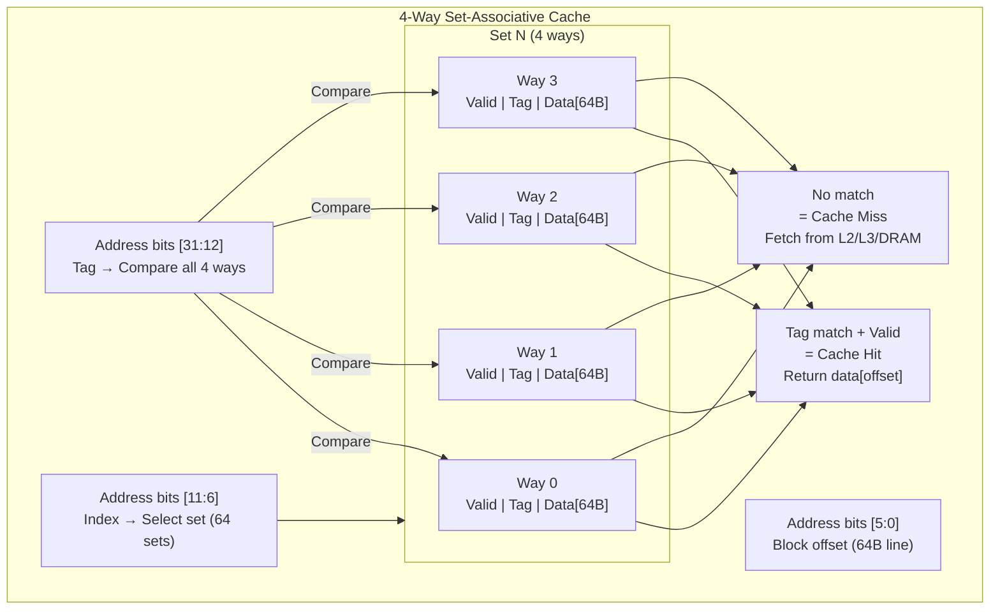

### Cache Miss Penalty and Memory Hierarchy

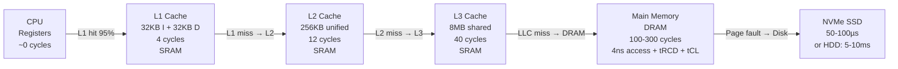

### DRAM Timing Internals: Why Access is 100+ Cycles

The diagram is one timing example. Row hits omit activate/precharge, controller queues can overlap requests, refresh and contention add delay, and CPU cycles depend on frequency; therefore `tRCD + tCL + tRP` is not a universal end-to-end load latency.

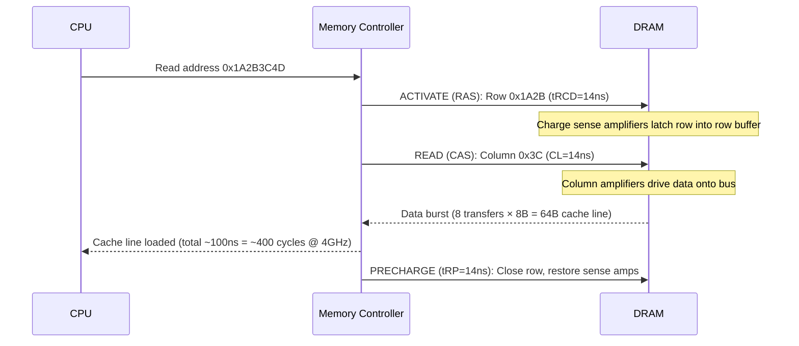

---

## 4. Virtual Memory: TLB, Page Tables, Page Faults

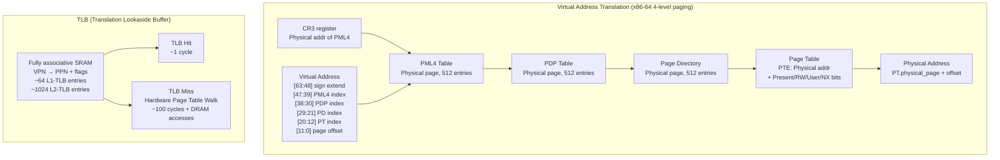

### Page Fault Handler Flow

The sequence represents a major file/swap-backed fault. Anonymous zero-fill, copy-on-write, protection violations, and already-resident file pages follow different paths; frame allocation and I/O ordering are kernel-specific. “Page fault” alone does not imply disk access.

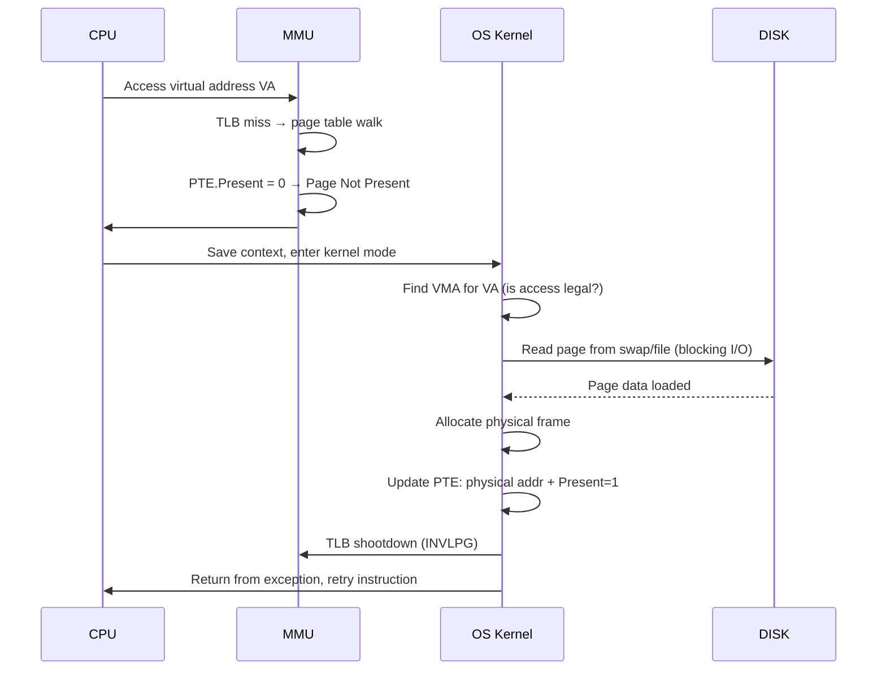

---

## 5. CPU Microarchitecture: Out-of-Order Execution Internals

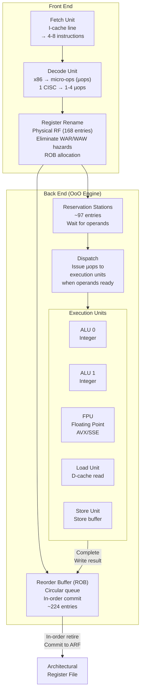

---

## 6. Multiprocessor Cache Coherence: MESI Protocol

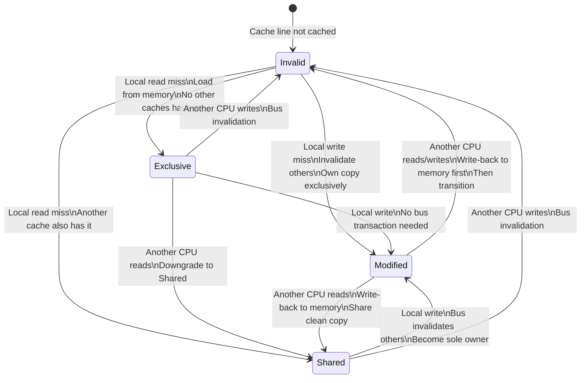

### Cache Coherence Bus Snooping

The MESI state diagram contains two edges for a read observed while in `Modified`. In the ordinary read-sharing case the owner supplies or writes back the data and moves to `Shared`; invalidation is associated with another agent obtaining write ownership. Modern systems may use directory protocols and MOESI variants rather than a shared bus.

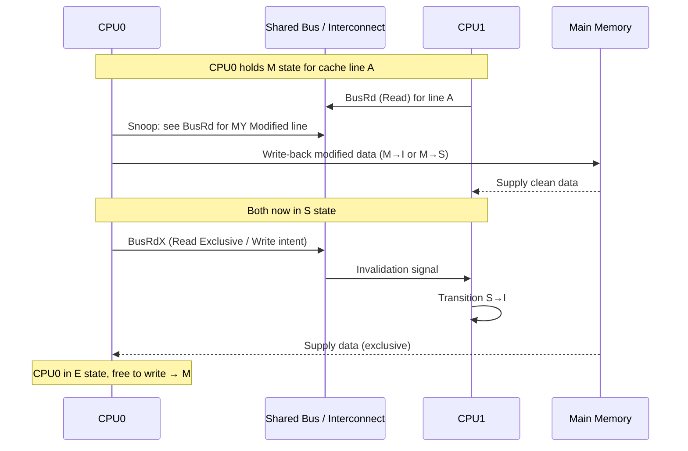

---

## 7. I/O Architecture: DMA, Interrupts, and Bus Protocols

The northbridge/southbridge topology is historical. Many current CPUs integrate the memory controller and PCIe root complex, while DMA may pass through an IOMMU; use the platform's actual block diagram before reasoning about paths or trust boundaries.

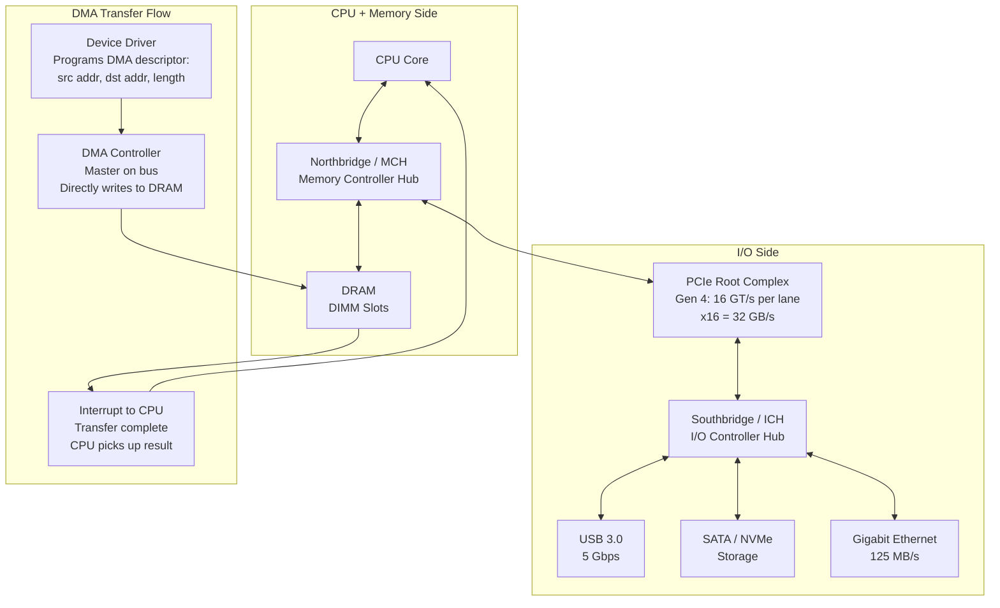

---

## 8. RISC vs. CISC: Decode Complexity Tradeoff

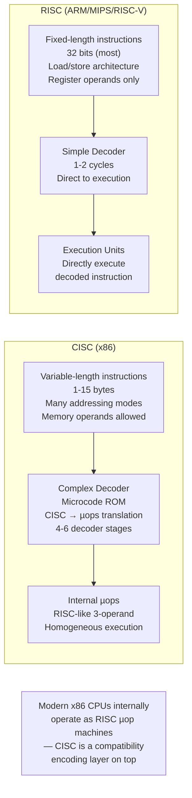

---

## 9. Floating Point: IEEE 754 Internal Representation

The implied leading `1` applies only to normal finite values. Subnormal values use an effective leading `0`; infinities and NaNs do not represent an ordinary significand.

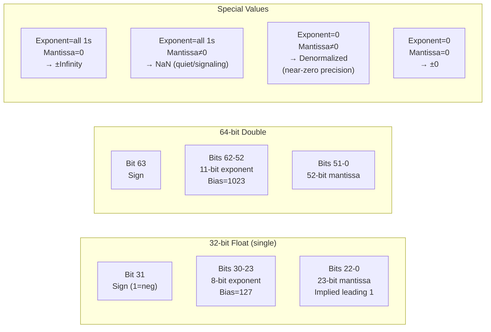

### FPU Pipeline: Fused Multiply-Add (FMA)

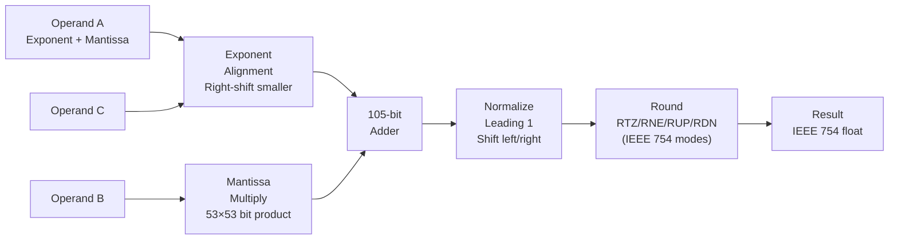

---

## 10. Computer Architecture Design Principles (Patterson & Hennessy)

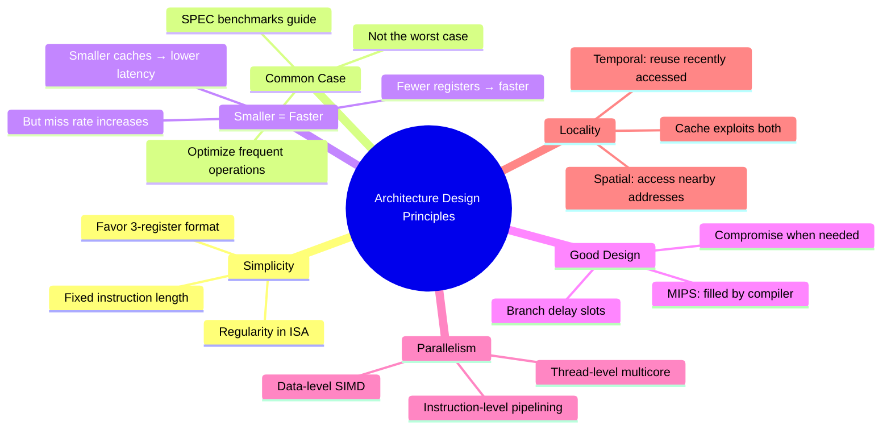

---

## 11. Modern CPU Microarchitecture Numbers (Intel Ice Lake / AMD Zen 3)

| Resource | Intel Ice Lake | AMD Zen 3 |
|----------|----------------|-----------|
| ROB entries | 352 | 256 |
| Reservation stations | 160 | 128 |
| Physical int registers | 280 | 192 |
| L1-I cache | 32KB, 8-way | 32KB, 8-way |
| L1-D cache | 48KB, 12-way | 32KB, 8-way |
| L2 cache | 512KB, 16-way | 512KB, 8-way |
| L3 cache | 12MB, 12-way | 32MB, 16-way |
| Decode width | 5-wide | 4-wide (up to 6 µops) |
| Branch predictor | TAGE-based | Hybrid TAGE |
| FMA latency | 4 cycles | 4 cycles |
| L1-D latency | 5 cycles | 4 cycles |
| DRAM latency | ~70ns | ~70ns |

Larger out-of-order windows can expose more instruction-level parallelism, but they are one trade-off among branch prediction, front-end width, execution ports, cache/memory latency, power, and workload dependency structure. Doubling a ROB does not guarantee a proportional performance gain.
