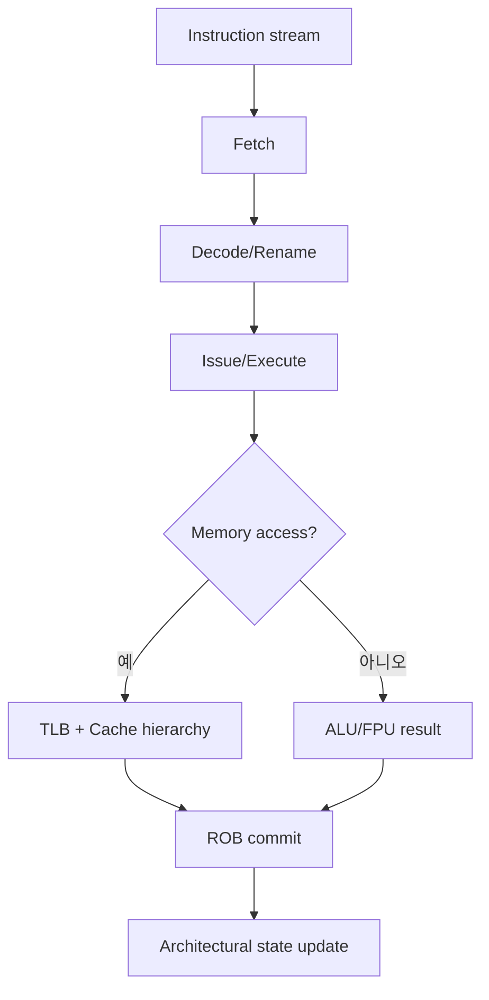
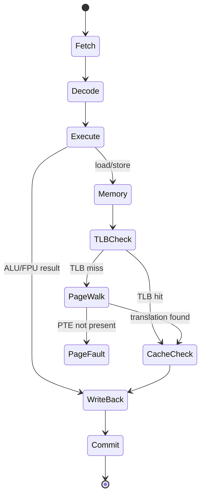
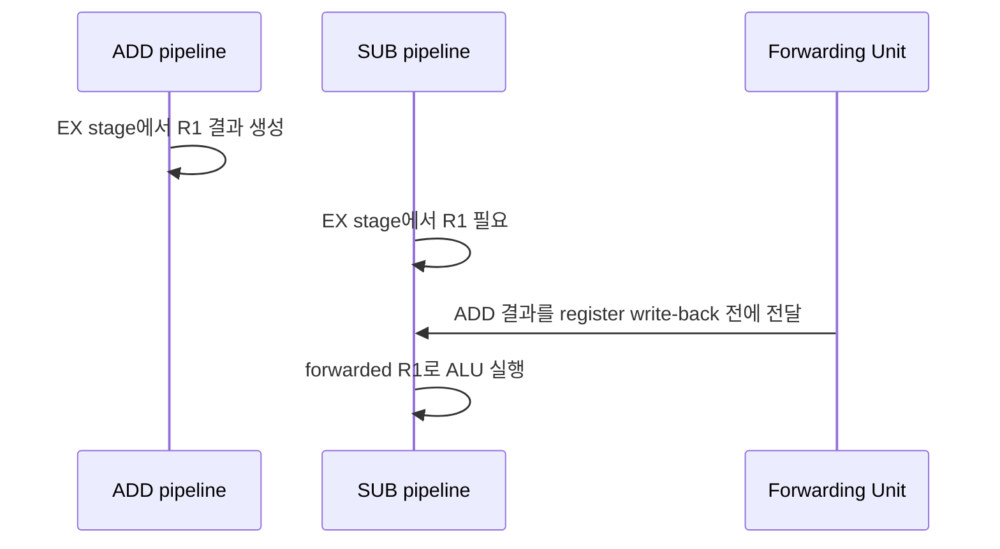

# Computer Architecture Internals 학습 및 기록 노트

## 1. 왜 필요한가? (Pain Point & Motivation)

소프트웨어 성능 문제는 종종 코드가 아니라 하드웨어 상태 전이에서 발생한다. pipeline hazard, cache miss, TLB miss, branch misprediction, memory ordering, DMA, interrupt, floating point rounding은 모두 코드 한 줄 아래에서 실행 시간을 결정한다.

이 문서는 원문의 컴퓨터 아키텍처 내부 설명을 CPU pipeline에서 memory hierarchy, virtual memory, out-of-order execution, cache coherence까지 한 흐름으로 재작성한다.

## 2. 현재 나의 상태 (Baseline)

- CPU가 instruction을 fetch/decode/execute한다는 수준은 알고 있다.
- cache hierarchy와 locality 개념은 알고 있지만 set/way/tag, miss penalty, TLB walk를 세부 흐름으로 설명하는 데 약하다.
- pipeline hazard와 forwarding, branch prediction의 관계를 다시 정리해야 한다.
- out-of-order execution, reorder buffer, register renaming은 이름은 알지만 상태 기계로 설명하기 어렵다.
- MESI, DMA, interrupt, RISC/CISC, IEEE 754를 개별 개념이 아니라 실행 경로의 일부로 연결해야 한다.

## 3. 도달하고 싶은 목표 (Target State)

- instruction이 pipeline stage와 pipeline register를 거쳐 완료되는 흐름을 설명한다.
- data/control/structural hazard와 stall, forwarding, branch prediction의 해결 방식을 구분한다.
- cache hit/miss, TLB hit/miss, page fault의 비용 차이를 추적한다.
- OoO 실행에서 rename, reservation station, ROB, in-order retire의 역할을 설명한다.
- multicore에서 MESI protocol이 cache line 소유권을 어떻게 전이시키는지 이해한다.

## 4. 시스템 번역 (Data Flow)



아키텍처 관점에서 프로그램은 명령어 stream이고, microarchitecture 관점에서 프로그램은 pipeline stage와 memory hierarchy를 통과하는 상태 전이다.

## 5. 핵심 구성요소 (Building Blocks)

| 구성요소 | 역할 | 핵심 상태 |
| --- | --- | --- |
| IF/ID/EX/MEM/WB | 5-stage pipeline의 기본 단계 | 각 stage 사이 pipeline register |
| Forwarding unit | RAW hazard 완화 | 이전 stage 결과를 EX input으로 우회 |
| Branch predictor | control hazard 완화 | branch history와 target cache |
| Set-associative cache | locality를 이용한 빠른 메모리 | tag/index/offset, valid bit, replacement state |
| TLB | virtual->physical translation cache | VPN -> PPN mapping과 권한 bit |
| Page table | 가상 주소 매핑 원장 | PTE present/RW/user/NX bit |
| Reorder Buffer | OoO 결과를 순서대로 commit | in-flight instruction entry |
| Register renaming | WAR/WAW hazard 제거 | architectural register -> physical register |
| MESI protocol | cache coherence 유지 | Modified/Exclusive/Shared/Invalid 상태 |
| DMA | CPU를 거치지 않는 장치-메모리 전송 | descriptor, bus master, completion interrupt |
| IEEE 754 | 부동소수점 표현과 rounding | sign/exponent/mantissa, special values |

## 6. 상태 전이 (State Transition)



단순한 load instruction도 실제로는 TLB lookup, cache tag compare, miss handling, possible page fault를 거칠 수 있다.

## 7. 불변식 (Invariant: 절대 깨지면 안 되는 규칙)

- Pipeline은 data dependency가 해결되지 않은 값을 읽으면 안 된다.
- Forwarding은 정확한 producer instruction의 최신 값을 consumer에게 전달해야 한다.
- Branch misprediction이 감지되면 잘못 fetch된 instruction은 architectural state를 변경하면 안 된다.
- Cache hit는 tag match와 valid bit가 모두 참이어야 한다.
- Page table 권한 bit는 user/kernel, read/write, execute 권한을 위반하면 fault를 발생시켜야 한다.
- OoO 실행은 out-of-order로 실행해도 commit은 program order를 지켜야 한다.
- MESI에서 같은 cache line을 여러 core가 동시에 Modified 상태로 보유하면 안 된다.
- DMA는 OS가 지정한 buffer 범위를 벗어나 메모리를 쓰면 안 된다.
- IEEE 754 연산은 선택된 rounding mode와 NaN/Inf 규칙을 지켜야 한다.

## 8. 가장 작은 예제 (Minimal Viable Example)

```text
1: ADD R1, R2, R3
2: SUB R4, R1, R5
```



이 예제는 pipeline 성능의 핵심을 보여준다. register file에 아직 쓰이지 않은 값을 forwarding path로 전달하면 stall 없이 RAW hazard를 해결할 수 있다.

## 9. 실패 사례 (What could go wrong?)

- Forwarding 조건을 놓치면 stale register 값을 읽어 잘못된 결과를 만든다.
- Branch misprediction flush가 누락되면 잘못된 경로의 store나 register write가 commit될 수 있다.
- Cache locality를 무시한 random access는 L1/L2 hit rate를 떨어뜨리고 DRAM latency를 드러낸다.
- TLB miss가 많은 workload는 cache hit가 높아도 page table walk 비용 때문에 느려질 수 있다.
- Recursive 또는 pointer-heavy 구조는 cache line을 잘 활용하지 못해 theoretical complexity보다 느릴 수 있다.
- MESI invalidation storm은 false sharing에서 성능 병목을 만든다.
- Floating point를 정수처럼 비교하면 NaN, rounding, denormal 때문에 예상과 다른 결과가 나온다.

## 10. 뇌 확장하기 (Evolution & Variants)

- Pipeline은 superscalar issue, speculative execution, branch prediction, micro-op cache로 확장된다.
- Cache는 inclusive/exclusive policy, write-back/write-through, prefetcher, victim cache까지 비교한다.
- Virtual memory는 huge page, copy-on-write, page cache, memory-mapped file과 연결된다.
- OoO는 ROB 크기, reservation station, load/store queue, memory disambiguation이 성능 한계를 만든다.
- Multicore는 MESI뿐 아니라 memory consistency model, fences, atomic operation까지 함께 봐야 한다.
- I/O는 polling, interrupt, DMA, MSI-X, NVMe queue pair 구조로 확장된다.

## 11. 최종 체크리스트 (Definition of Done)

- [x] Pipeline stage, hazard, forwarding, branch prediction을 상태 전이로 정리했다.
- [x] Cache, TLB, page table, page fault의 역할과 비용 차이를 분리했다.
- [x] OoO 실행의 rename, ROB, commit 규칙을 포함했다.
- [x] MESI, DMA, RISC/CISC, IEEE 754를 핵심 구성요소로 정리했다.
- [x] RAW hazard 최소 예제로 forwarding의 필요성을 설명했다.

## 12. 뇌에 새기는 복습 문장 (TL;DR Blank)

컴퓨터 아키텍처는 명령어가 실제 하드웨어 상태를 통과하는 경로다. 성능을 이해하려면 코드보다 pipeline, cache, TLB, coherence 상태를 함께 봐야 한다.
