# DevOps and Linux Internals: Under the Hood

> Synthesized from: comp(36/103-178) DevOps, Linux administration, CI/CD, shell scripting, Ansible, Terraform, monitoring, and infrastructure automation references including: Wieers *Ansible for DevOps*, Morris *Infrastructure as Code*, Turnbull *The Docker Book*, monitoring/alerting stacks, and the full Linux systems administration curriculum.

---

## 1. Linux Systemd Internals — Unit Activation Graph

systemd is PID 1 on modern Linux. It parallelizes service startup via dependency resolution and socket activation, replacing sequential SysV init scripts.

### Unit Dependency Graph and Activation

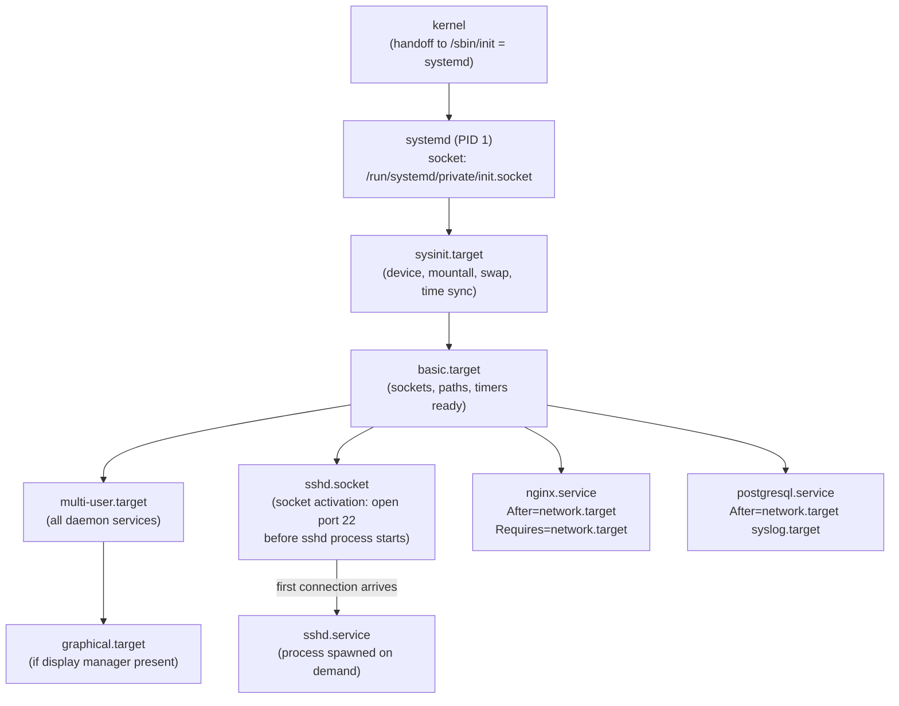

**Socket activation**: systemd creates the listening socket (`bind()`, `listen()`) BEFORE starting the service. Service inherits pre-opened file descriptor via `SD_LISTEN_FDS`. Connections queue in kernel backlog until service ready. Zero dropped connections during restarts.

### Cgroup Integration — Resource Control

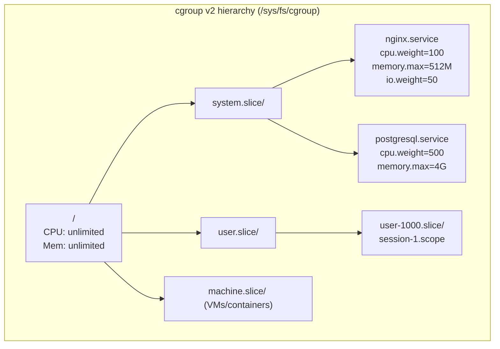

systemd maps each service to a cgroup slice. `systemctl set-property nginx.service CPUQuota=50%` → writes `50000 100000` to `cpu.max` file in cgroup → kernel CFS bandwidth controller enforces quota.

---

## 2. Linux Package Management Internals

### RPM/DNF — Transaction Processing

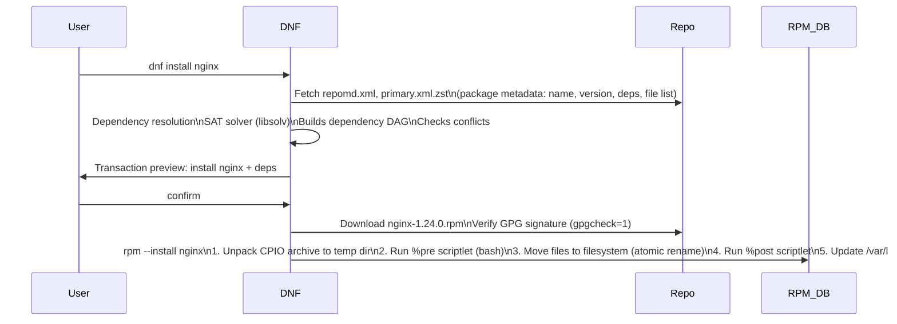

**RPM CPIO archive**: `.rpm` = lead (magic) + signature (MD5/GPG over header+payload) + header (metadata tags) + payload (CPIO archive, xz/zstd compressed). Each file in CPIO has: path, size, mode, uid/gid, checksum.

### APT/dpkg — Dependency Resolution

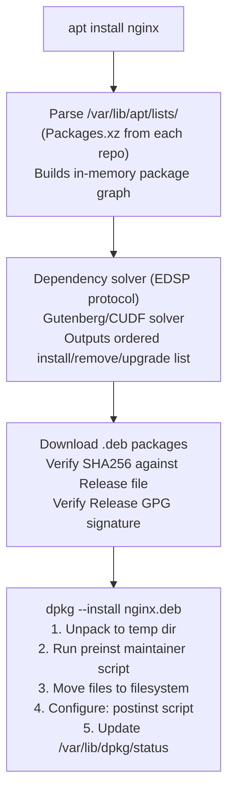

---

## 3. Ansible Internals — Task Execution Engine

### Control Flow and Module Execution

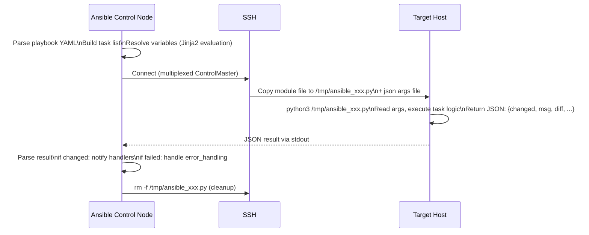

**Mitogen backend** (2-3× faster): Instead of copying Python script per task, Mitogen forks a Python interpreter on the target over SSH once and reuses it for all tasks in the play. Saves the Python startup (~50ms) and file copy overhead per task.

**Fact gathering**: `setup` module runs `facter`-like system introspection: reads `/proc`, `dmidecode`, `ip addr`, `df`, `uname` → returns JSON facts dict → stored in `hostvars[hostname]`.

### Jinja2 Template Rendering in Ansible

```
Variable precedence (lowest to highest):
role defaults → inventory file vars → inventory group_vars → inventory host_vars
→ playbook group_vars → playbook host_vars → host facts
→ play vars → task vars → extra vars (-e) → registered vars
```

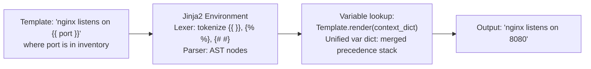

---

## 4. Terraform State and Plan Internals

### Infrastructure as Code — State Machine

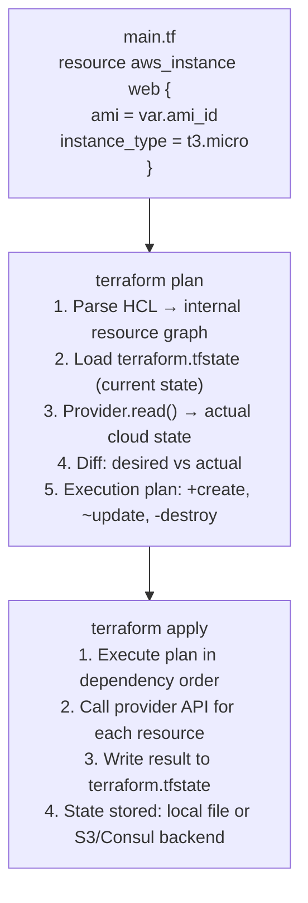

**State locking**: S3 backend uses DynamoDB table for distributed lock. `terraform apply` acquires lock → runs → releases. Prevents concurrent applies to same infrastructure (split-brain risk).

**Resource graph**: Dependencies resolved via `depends_on` + implicit refs. `aws_db_instance.db` references `aws_vpc_subnet.private.id` → subnet must be created before DB. Terraform parallelizes independent resource operations.

---

## 5. CI/CD Pipeline Internals

### Jenkins Pipeline Execution Model

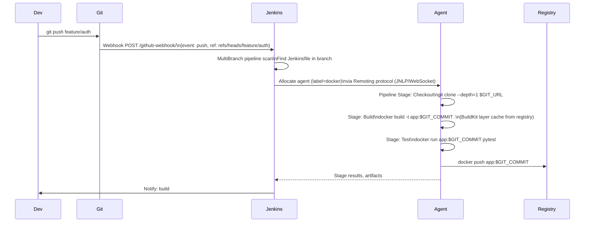

**Declarative pipeline YAML → Groovy**: Jenkins DSL parsed as Groovy scripts. `pipeline {}`, `stages {}`, `steps {}` are method calls on `WorkflowScript`. Each step executes in agent workspace directory. Environment variables scoped per stage.

---

## 6. Linux Process and Signal Internals

### fork()/exec() Implementation Detail

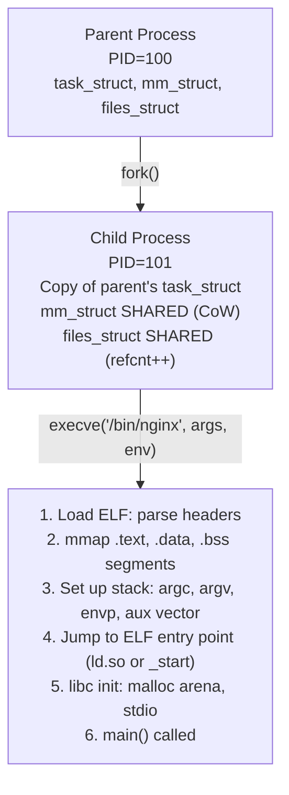

**Copy-on-Write (CoW)**: After fork(), both parent and child share same physical pages (marked read-only). On first write to shared page: page fault → kernel allocates new page, copies content, remaps PTE for writing process. Only pages actually modified are duplicated.

### Signal Delivery

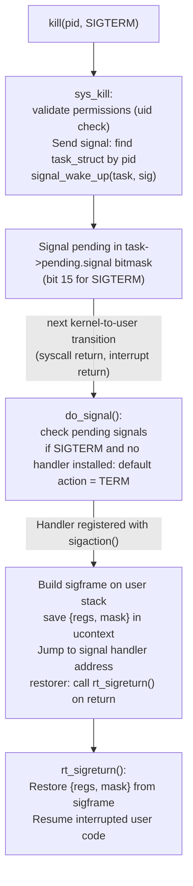

**Signal mask**: `sigprocmask(SIG_BLOCK, &set, NULL)` sets `task->blocked` bitmask. Pending signals in `task->blocked` are deferred until unblocked. `SIGKILL` and `SIGSTOP` cannot be blocked or caught.

---

## 7. Linux Shell Internals — Bash Execution

### Command Parsing and Expansion Order

```mermaid
flowchart TD
    A["Input: echo \"Hello $USER, $(date)\" > /tmp/out.txt"]
    A --> B["Tokenization:\nReserved words, operators, words\nQuote removal context tracking"]
    B --> C["Parsing: command tree\n{simple_cmd echo, args [...], redirect stdout}"]
    C --> D["Expansion (in order):\n1. Brace expansion: {a,b}c → ac bc\n2. Tilde: ~/foo → /home/user/foo\n3. Parameter: $USER → 'alice'\n4. Command subst: $(date) → fork+exec date\n5. Arithmetic: $((1+2)) → 3\n6. Word splitting on IFS=\\t\\n (after unquoted expansions)\n7. Glob/pathname: *.txt → file list\n8. Quote removal: strip remaining quotes"]
    D --> E["Execute: fork()+execve('echo', args)\nRedirect: open('/tmp/out.txt', O_WRONLY|O_CREAT|O_TRUNC)\ndup2(fd, STDOUT_FILENO)\nexecve('echo', ['echo', 'Hello alice, Thu Feb ...'], envp)"]
```

**Pipe internals**: `cmd1 | cmd2` → `pipe(fds)` → fork two children → child1: `dup2(fds[1], 1)` (write end → stdout) → `execve(cmd1)` → child2: `dup2(fds[0], 0)` (read end → stdin) → `execve(cmd2)`. Kernel pipe buffer: 64KB (adjustable via `fcntl(fd, F_SETPIPE_SZ, n)`).

---

## 8. Linux Monitoring Stack — Prometheus/Grafana Internals

### Metrics Collection Architecture

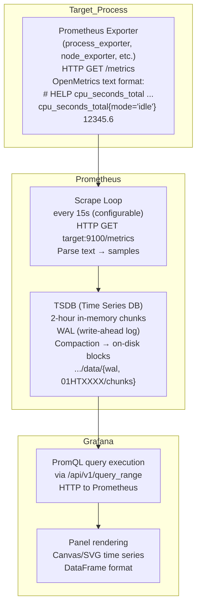

### TSDB Chunk Format

```
Chunk (2-hour window for one time series):
Header: encoding=XOR_FLOAT64, num_samples
Sample 0: t0=unix_ms, v0=float64 (raw)
Sample 1: Δt1=(t1-t0), Δv using XOR delta-of-delta encoding
...
Compression: typically 1.37 bytes/sample vs 16 bytes raw
```

**XOR delta encoding** (Gorilla compression): First sample: full 64-bit float. Subsequent samples: XOR with previous value. If XOR=0 (same value): 1 bit. Else: control bits + XOR significant bits. Achieves 10-100× compression for slowly-changing metrics.

---

## 9. Log Pipeline Internals — Fluentd/ELK Stack

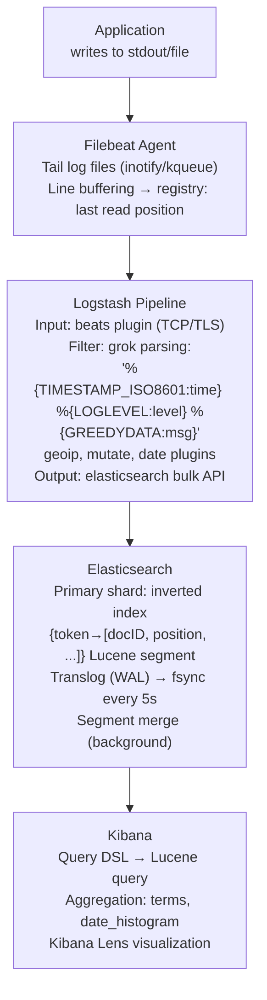

**Logstash grok**: Named regex patterns. `%{TIMESTAMP_ISO8601:time}` expands to complex datetime regex. Compiled to Java Pattern. Match → extract named groups → add to event map → pass to next filter.

---

## 10. Infrastructure Automation — Packer and Immutable Images

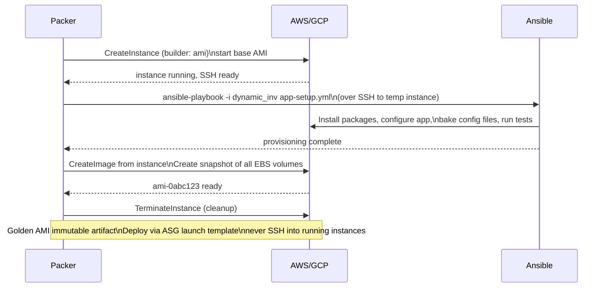

**Immutable infrastructure**: AMI baked once with all dependencies. Auto Scaling Group launches instances from AMI. On deploy: new AMI → update launch template → rolling replace (old instances terminated, new launched). No config drift, reproducible deployments.

---

## 11. Linux Performance Analysis — perf and eBPF

### perf sampling internals

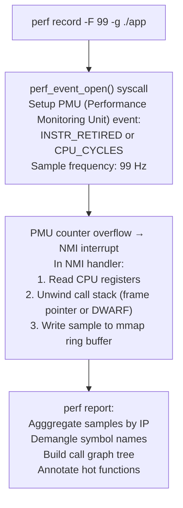

### eBPF — Kernel Extension Without Modules

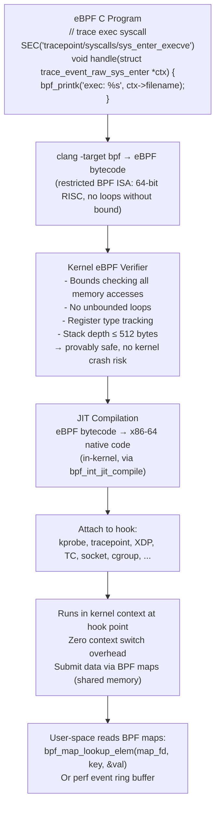

**XDP (eXpress Data Path)**: eBPF program attached to NIC driver's receive function, before SK_BUFF allocation. Can drop/redirect/pass packets at line rate (~140 Mpps on 100GbE). Used for DDoS mitigation, load balancing (Cloudflare, Facebook).

---

## 12. Container Runtime — runc and OCI Internals

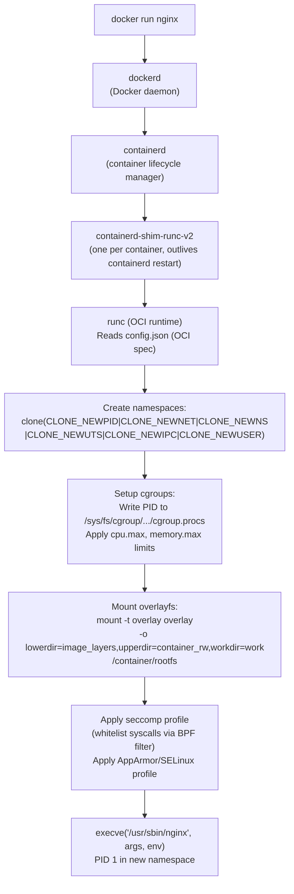

**overlayfs write path**: Any write to container filesystem → write goes to `upperdir` only. Original image layers in `lowerdir` never modified. `diff`: compare upperdir to nothing = only container-specific changes. This enables efficient layer caching (base layers shared across all containers using same image).

---

## DevOps Performance Numbers Reference

| Operation | Time | Notes |
|-----------|------|-------|
| systemd unit start (empty) | ~50-200 ms | Process spawn + D-Bus notification |
| Ansible task (SSH + Python) | ~500ms-2s | Per task overhead |
| Ansible task (Mitogen) | ~50-200 ms | Persistent Python connection |
| terraform plan (100 resources) | 5-30 s | Provider API calls |
| Docker image build (layer cache) | ~1-5 s | Only changed layers rebuilt |
| Docker image build (cold) | 30s-5 min | Full dependency install |
| Container start (cold image pull) | 10-60 s | Image layer download |
| Container start (cached) | ~0.5-2 s | overlayfs setup + execve |
| eBPF program load+verify | ~1-100 ms | Verifier complexity |
| perf record overhead | ~1-5% CPU | 99Hz sampling |
| Prometheus scrape | ~1-10 ms | HTTP + text parsing |
| Elasticsearch index write | ~1-50 ms | Translog + segment write |
| Jenkins pipeline start | ~2-10 s | Agent allocation + workspace setup |
