# Distributed Systems Internals: Consensus, Fault Tolerance & Data Consistency

> Under the Hood: How distributed systems achieve agreement, tolerate failures, and maintain consistency across unreliable networks — the exact data flows, message protocols, state machines, and mathematical guarantees.

---

## 1. The Fundamental Problem: Partial Failures

Unlike a single machine where components fail atomically (crash = stop), distributed systems experience **partial failures**: some nodes work, some don't, network partitions split components, messages arrive out of order or not at all.

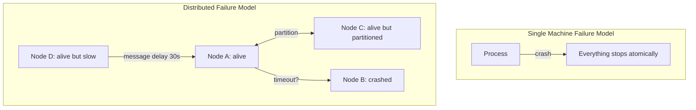

The challenge: **from Node A's perspective, Node B crashed is indistinguishable from Node B responding very slowly.** Timeouts are the only detection mechanism — but choosing the right timeout is impossible without knowing the maximum message delay.

### The Two Generals Problem (Impossibility)

No protocol can guarantee two parties reach agreement over an unreliable channel. This is a **proven impossibility** — any confirmation message itself needs confirmation, ad infinitum.

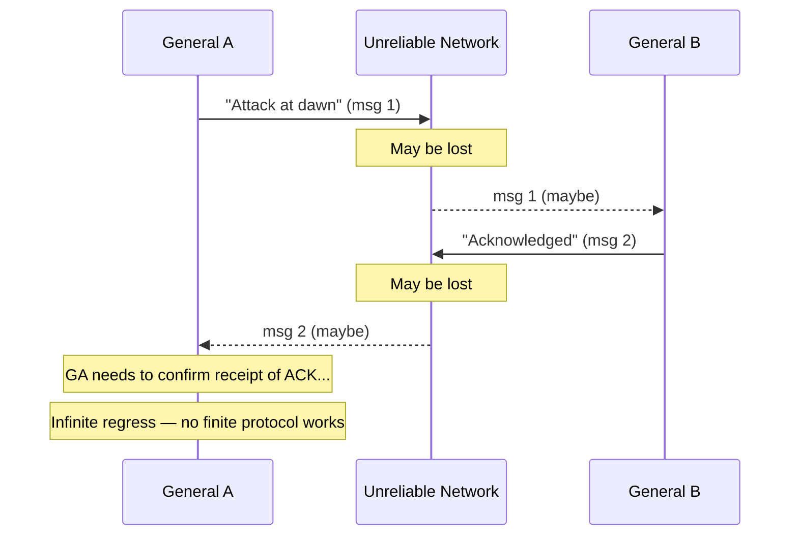

---

## 2. CAP Theorem: What You Must Sacrifice

Brewer's CAP theorem (proven formally by Gilbert & Lynch): a distributed system cannot simultaneously guarantee all three of:
- **C** — Consistency: every read sees the most recent write
- **A** — Availability: every request receives a response
- **P** — Partition tolerance: system works despite network splits

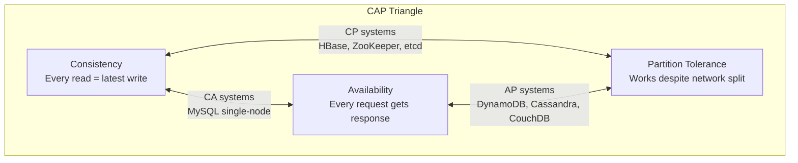

**Why P is non-negotiable in practice**: Network partitions happen. You must tolerate them. The real choice is **CP vs AP** when a partition occurs:

- **CP**: Refuse writes (return error) until partition heals → consistent but unavailable
- **AP**: Accept writes on both sides of partition → available but divergent state

---

## 3. Consensus: Paxos Internal Mechanics

Paxos achieves consensus (agreement on a single value) despite node failures. Three roles: **Proposer**, **Acceptor**, **Learner**.

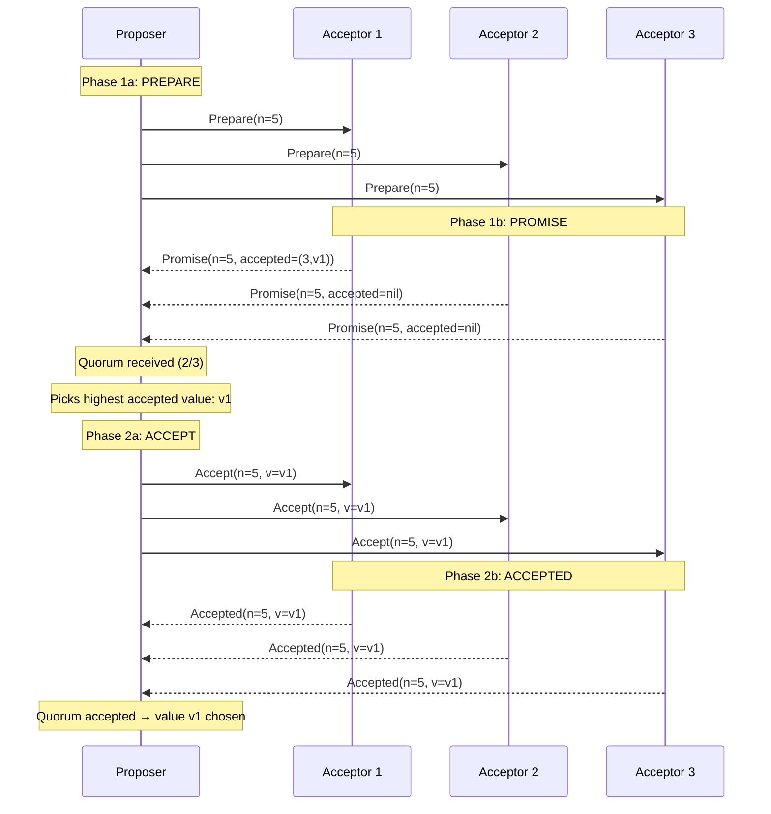

### Paxos Ballot Number Invariant

Each Acceptor stores `(maxPromised, acceptedBallot, acceptedValue)`. The invariant:
- An acceptor **never** promises to a ballot ≤ its maxPromised
- An acceptor **never** accepts a ballot ≤ its maxPromised
- If any value was accepted in a previous round, the proposer **must** propose that value

This ensures: once a value is chosen by a quorum, no future Paxos round can choose a different value.

---

## 4. Raft: Understandable Consensus

Raft decomposes consensus into three sub-problems: leader election, log replication, safety.

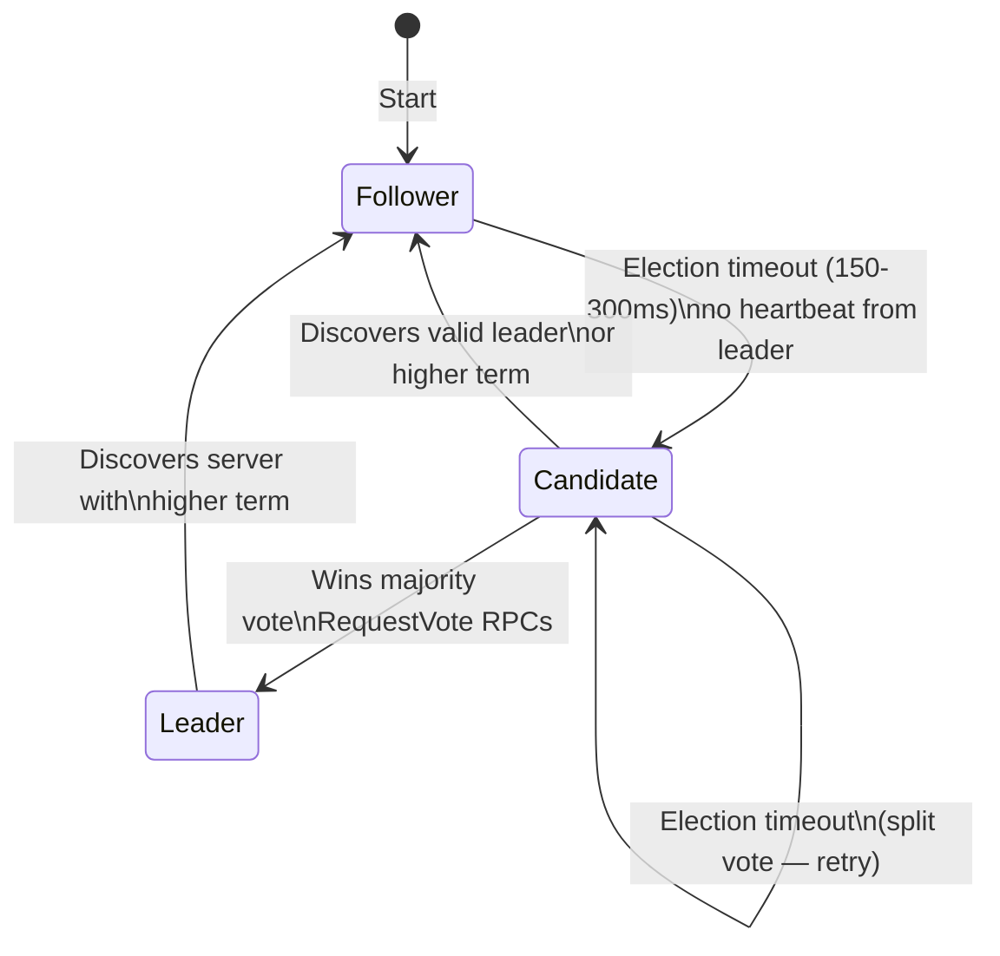

### Raft Log Replication Internal Flow

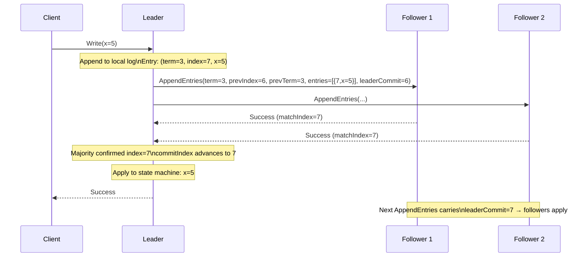

### Raft Safety: Log Matching Property

Two invariants make Raft safe:
1. **Election Safety**: At most one leader per term
2. **Log Matching**: If two logs contain an entry with same (index, term), all preceding entries are identical

The **prevIndex/prevTerm** check in AppendEntries enforces Log Matching — a follower rejects if it doesn't have a matching entry at prevIndex with prevTerm.

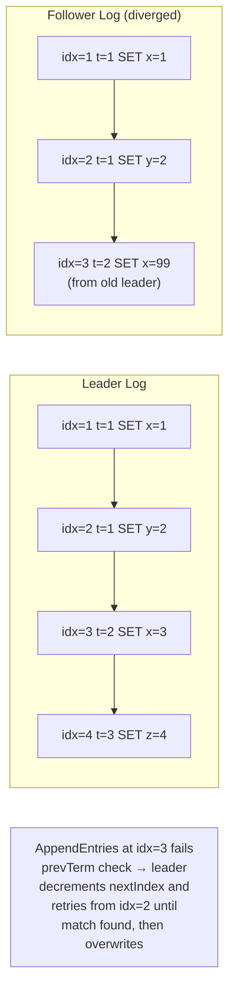

---

## 5. Distributed Transactions: Two-Phase Commit (2PC)

2PC coordinates atomic commits across multiple nodes (shards/databases).

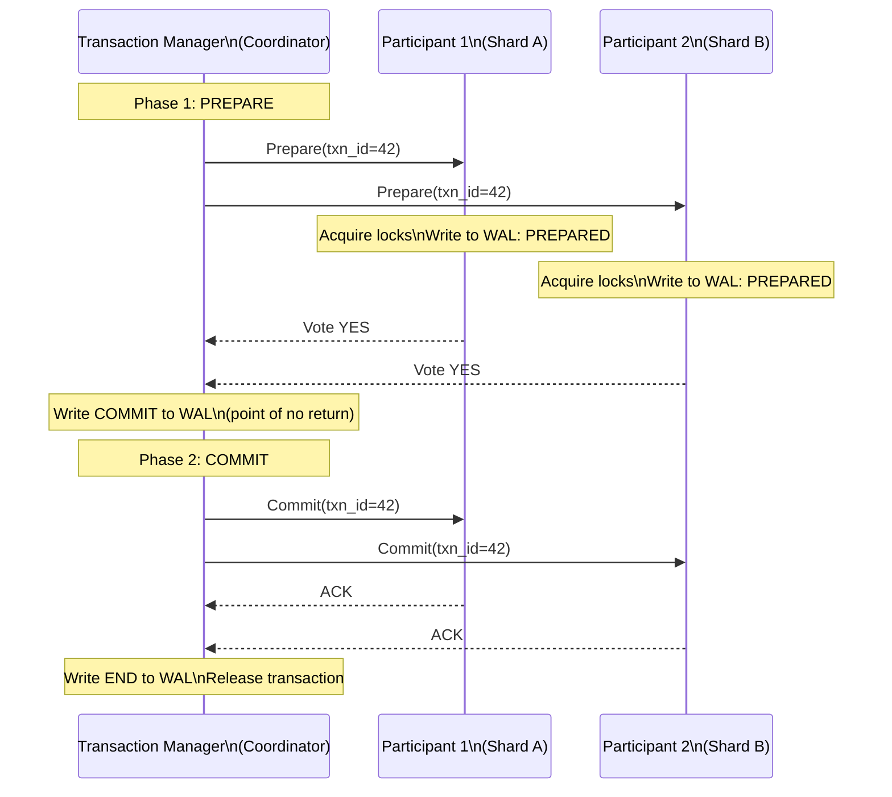

### 2PC Failure Scenarios and WAL Recovery

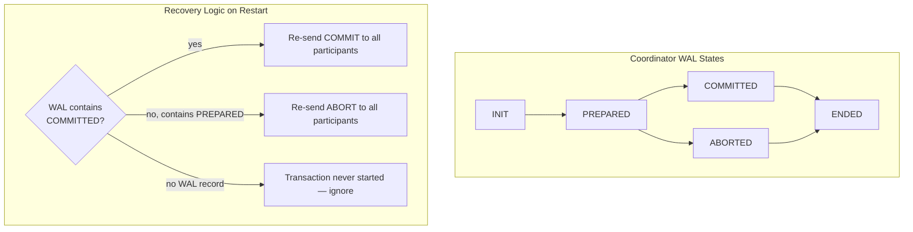

**2PC's Achilles Heel — Blocking**: If the coordinator crashes after writing COMMIT but before sending to participants, participants are **blocked indefinitely** — they hold locks but cannot commit or abort without coordinator decision. **3PC** (Three-Phase Commit) adds a pre-commit phase to reduce blocking but doesn't eliminate it under network partitions.

---

## 6. MVCC: Multi-Version Concurrency Control Internals

MVCC (used by PostgreSQL, MySQL InnoDB, CockroachDB) maintains multiple versions of each row, allowing readers and writers to not block each other.

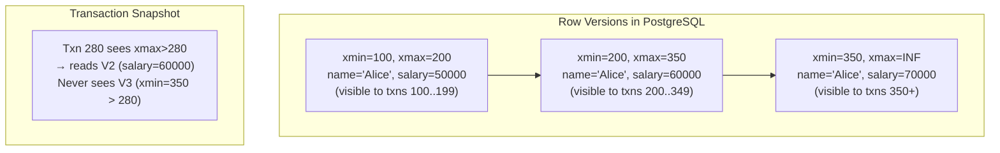

### MVCC Read Path

Each transaction receives a **snapshot** at start: `(xmin, xmax, active_xids[])`. A row version is visible if:
- `row.xmin <= snapshot.xmax` (created before snapshot)
- `row.xmin` not in `active_xids[]` (creator committed)
- `row.xmax > snapshot.xmin` OR `row.xmax` is in `active_xids[]` (not yet deleted)

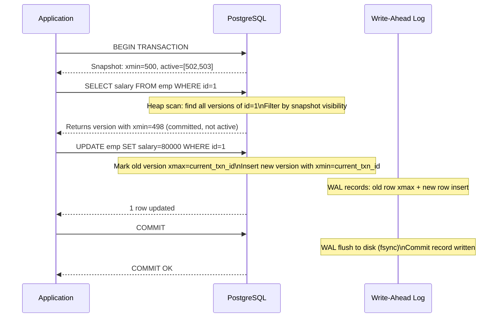

---

## 7. Vector Clocks and Causality Tracking

Vector clocks track **happened-before** relationships in distributed systems without requiring synchronized clocks.

```mermaid
flowchart LR
    subgraph "Node A"
        A1["A:[1,0,0]\nWrite x=1"]
        A2["A:[2,0,0]\nSend msg to B"]
        A3["A:[3,2,0]\nReceive from B\nmerge: max([2],[1,2,0])=[3,2,0]"]
    end
    subgraph "Node B"
        B1["B:[1,1,0]\nReceive from A\nA's clock:[2,0,0] → merge=[2,1,0]"]
        B2["B:[2,2,0]\nWrite y=5"]
        B3["B:[3,3,0]\nSend msg to A"]
    end
    A2 -->|send [2,0,0]| B1
    B3 -->|send [3,3,0]| A3
```

**Conflict detection**: Two events are concurrent (neither happened-before the other) if neither vector clock dominates the other:
- `A=[2,1,0]` vs `B=[1,2,0]` → concurrent → conflict → need merge

**DynamoDB** uses vector clocks (called "version vectors") to detect write conflicts and return multiple conflicting versions to the application for resolution.

---

## 8. Consistent Hashing and Distributed Hash Tables

Consistent hashing minimizes key remapping when nodes join/leave. The ring maps both keys and nodes to `[0, 2^32)` using the same hash function.

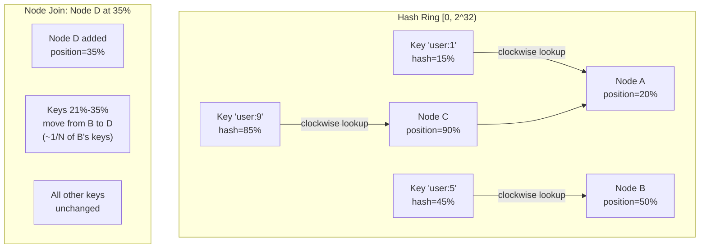

### Virtual Nodes for Load Balance

A single node gets multiple positions on the ring (virtual nodes / vnodes):

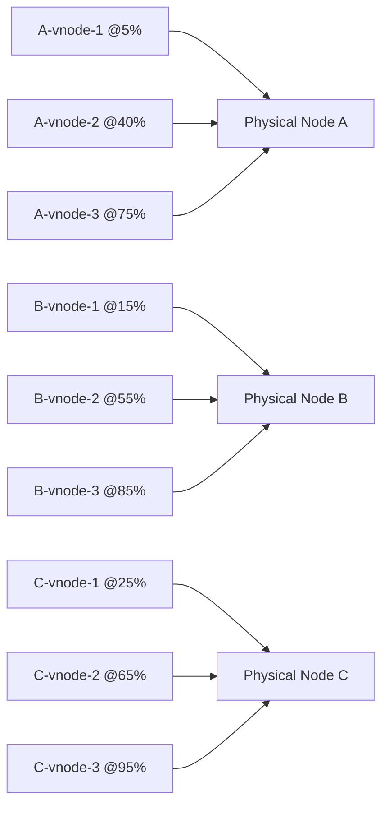

With 150 vnodes per physical node, load imbalance is <10% statistically.

---

## 9. Eventual Consistency and CRDTs

**CRDTs (Conflict-free Replicated Data Types)** allow replicas to diverge and merge without coordination, guaranteeing eventual convergence by mathematical construction.

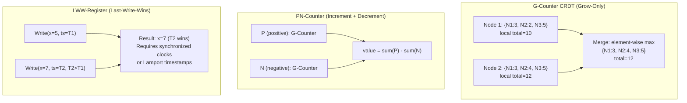

### OR-Set (Observed-Remove Set) Internals

Simple add/remove sets have the "remove wins" vs "add wins" ambiguity. OR-Set tags each add with a unique ID:

```
add("a") → {("a", uid1)}
add("a") → {("a", uid1), ("a", uid2)}
remove("a") → removes all observed uid pairs for "a"
concurrent add("a") after remove → uid3 survives (not in remove set)
```

---

## 10. Distributed Tracing: Span Propagation Internals

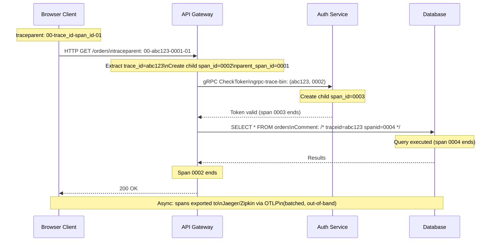

**Sampling Decision Propagation**: The `traceparent` flag byte encodes the sampling decision. If the root span decides to sample (probabilistic, 1%), all downstream services **inherit** that decision — this ensures complete traces, not partial traces.

---

## 11. Gossip Protocol: Epidemic Information Dissemination

Gossip (used by Cassandra, Consul, Redis Cluster) spreads information in O(log N) rounds.

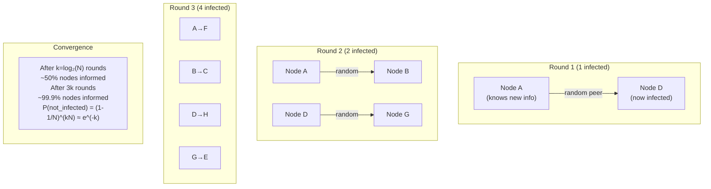

### Phi Accrual Failure Detector (Cassandra)

Instead of binary alive/dead, phi failure detector outputs a **suspicion level φ** based on inter-arrival times of heartbeats:

```
φ(t) = -log₁₀(P_later(t - t_last))
```

Where `P_later` is the probability that the next heartbeat arrives after time `t` given a Gaussian model of past inter-arrival times. φ=1 → 90% confidence of failure. φ=8 → 99.999999%.

---

## 12. Linearizability vs Serializability

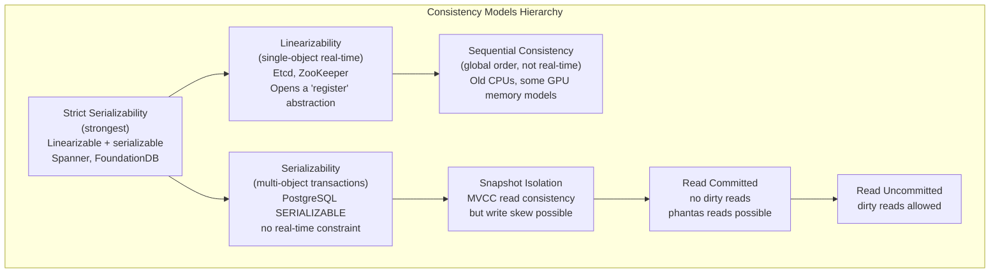

**Write Skew Example (SI allows, Serializable prevents)**:
- Txn A reads: "2 doctors on call" → decides one can go off call
- Txn B reads: "2 doctors on call" → decides one can go off call  
- Both commit → 0 doctors on call (violates invariant)
- Under SI: both pass (each read a consistent snapshot before the other's write)
- Under Serializable: one aborts (serialization conflict detected)

---

## 13. Google Spanner: TrueTime and External Consistency

Spanner achieves **external consistency** (strict serializability globally) using GPS + atomic clock hardware providing bounded time uncertainty.

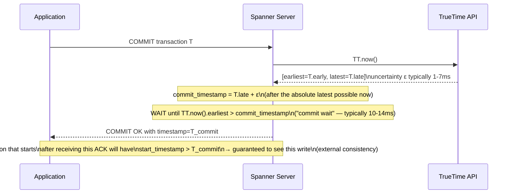

The **commit wait** is the price of external consistency: Spanner deliberately delays COMMIT acknowledgment by the TrueTime uncertainty interval to ensure no future transaction starts with a timestamp before the current commit.

---

## 14. Partition Repair: Anti-Entropy with Merkle Trees

After a network partition heals, replicas must reconcile diverged data. Merkle trees make this efficient.

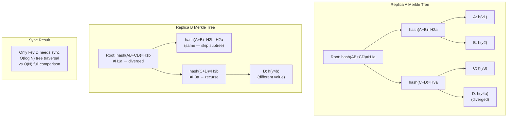

Cassandra uses Merkle trees for **repair** operations. Each node builds a Merkle tree of its token range. Tree comparison identifies diverged leaf nodes (individual keys or key ranges) that need reconciliation.

---

## 15. Distributed Lock Service: Chubby/etcd Internals

```mermaid
sequenceDiagram
    participant C1 as Client 1
    participant C2 as Client 2
    participant E as etcd Cluster
    participant L as Lease Manager

    Note over C1: Acquire distributed lock
    C1->>E: PUT /locks/resource-x\nvalue=client1-id\nLease TTL=10s (CreateLease first)
    Note over E: Raft consensus: replicate to majority
    E-->>C1: OK, lease_id=42, revision=100

    C2->>E: PUT /locks/resource-x (try)
    Note over E: Key already exists
    E-->>C2: Key exists — watch for DELETE

    Note over C1: C1 must keepalive lease
    loop every 5s
        C1->>E: LeaseKeepAlive(lease_id=42)
        E-->>C1: TTL renewed
    end

    Note over C1: C1 crashes (no more keepalive)
    Note over E: Lease 42 expires after 10s\nKey /locks/resource-x deleted
    E-->>C2: Watch event: DELETE revision=101
    C2->>E: PUT /locks/resource-x\nvalue=client2-id, new lease
    E-->>C2: OK — lock acquired
```

**Fencing Token**: The revision number (100, 101...) is a **fencing token** — monotonically increasing. C1 uses revision 100 in all downstream operations. When the lock expires and C2 gets revision 101, any downstream service that sees a C1 request with revision 100 after seeing revision 101 **rejects it** (stale request detection).

---

## Summary: Key Distributed Systems Properties

| Property | Mechanism | Cost |
|---|---|---|
| Consensus | Paxos/Raft (quorum writes) | 1 RTT for reads, 2 RTTs for writes |
| External Consistency | TrueTime commit wait | 10-14ms latency floor |
| Eventual Consistency | CRDT merge / gossip | No coordination, conflict possible |
| Distributed Txn | 2PC coordinator | Blocking on coordinator failure |
| Causality Tracking | Vector clocks | O(N) clock size |
| Fault Detection | Phi accrual / heartbeat | False positive risk on slow network |
| Partition Repair | Merkle tree anti-entropy | Background CPU/IO for tree computation |
| Distributed Lock | etcd lease + fencing | Lease expiry latency on crash |
