# Functional Programming Internals: Lambda Calculus, Type Systems & Runtime Mechanics

> Under the Hood: How closures capture environments in memory, how Haskell's lazy evaluation builds thunk chains, how monads thread state without mutation, how the Hindley-Milner type inference algorithm works — the exact heap layouts, reduction strategies, and denotational semantics behind functional programming.

---

## 1. Lambda Calculus: The Foundation

Lambda calculus is the computational model underlying all functional languages. Three constructs:

```
e ::= x          (variable)
    | λx.e       (abstraction: function)  
    | e₁ e₂      (application: call function)
```

### Beta Reduction: Function Application Mechanics

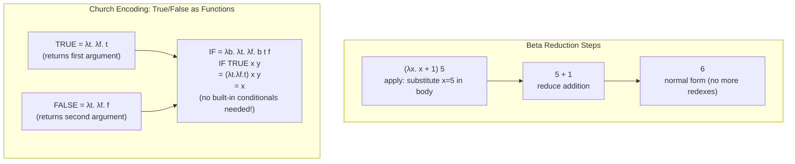

**Confluence (Church-Rosser theorem)**: Regardless of reduction order, if an expression has a normal form, all reduction paths reach the same normal form. This justifies lazy evaluation — reduce only when needed, always get the same result.

---

## 2. Closure Representation in Memory

A closure = function code pointer + captured environment (heap-allocated).

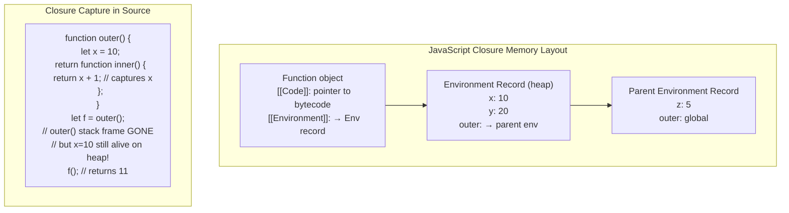

### Stack vs Heap: Escape Analysis

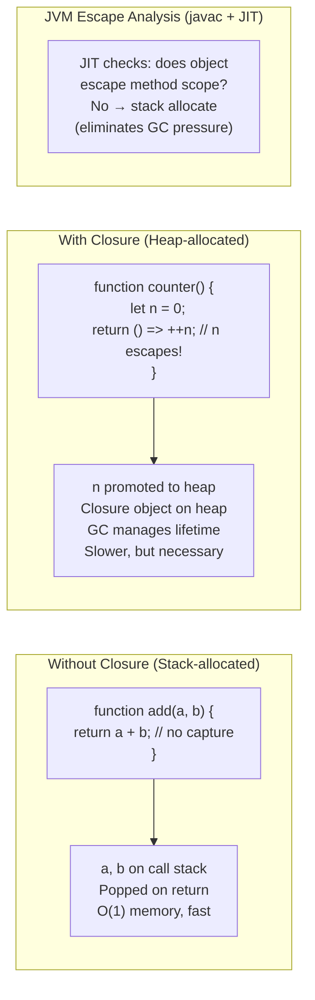

---

## 3. Haskell Lazy Evaluation: Thunk Mechanics

Haskell is **non-strict**: expressions are not evaluated until their value is needed. Unevaluated expressions are **thunks** — heap-allocated closures awaiting evaluation.

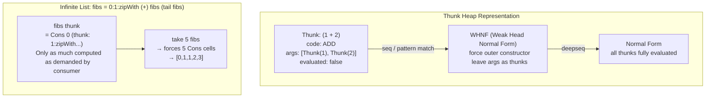

### Thunk Sharing (Graph Reduction)

Haskell uses **graph reduction** — shared thunks are updated in-place to their value after first evaluation, preventing recomputation:

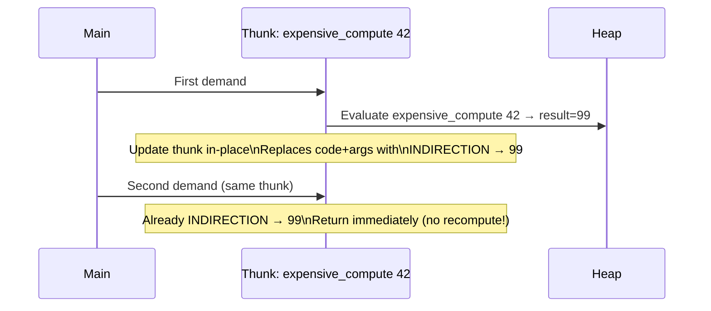

### Space Leaks from Lazy Accumulation

```
-- BAD: builds up n thunks before summing
sum [1..1000000]
= 1 + (2 + (3 + ... (999999 + 1000000)...))
-- Stack overflow or O(N) heap

-- GOOD: foldl' forces accumulator at each step
import Data.List (foldl')
foldl' (+) 0 [1..1000000]
-- Strict accumulator: O(1) heap
```

---

## 4. Hindley-Milner Type Inference Algorithm W

HM infers types without annotations using **unification**.

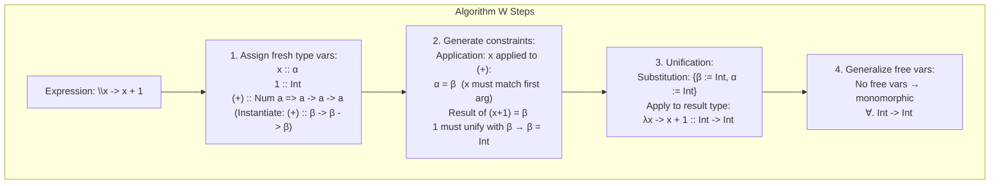

### Polymorphic Type Inference

```haskell
-- id :: a -> a  (inferred, not annotated)
id x = x
-- Fresh type var: x :: α, body :: α → infer id :: α -> α
-- Generalize: id :: ∀a. a -> a

-- map :: (a -> b) -> [a] -> [b]
map f [] = []
map f (x:xs) = f x : map f xs
-- Algorithm W infers this automatically from pattern matching
```

---

## 5. Monads: Sequencing Effects Without Mutation

A Monad is a type constructor `M` with:
- `return :: a -> M a` (wrap value)
- `(>>=) :: M a -> (a -> M b) -> M b` (bind/chain)

Satisfying three laws:
1. `return a >>= f  ≡  f a`  (left identity)
2. `m >>= return    ≡  m`    (right identity)
3. `(m >>= f) >>= g  ≡  m >>= (λx -> f x >>= g)`  (associativity)

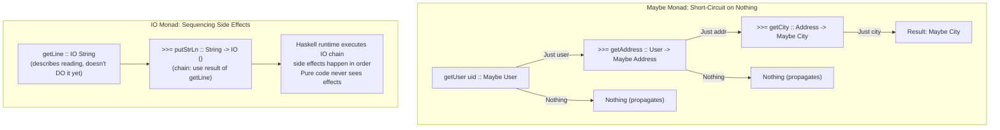

### State Monad: Threading State Without Global Variables

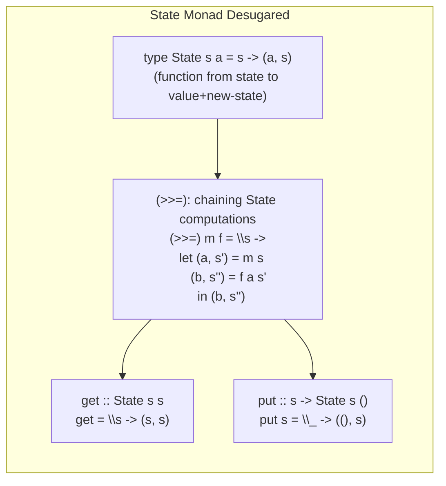

No mutable global state — the state value is **threaded through** function calls as an explicit argument, transformed at each step.

---

## 6. Algebraic Data Types and Pattern Matching Compilation

```haskell
data Tree a = Leaf | Node (Tree a) a (Tree a)

-- Pattern match compiles to jump table / decision tree
insert :: Ord a => a -> Tree a -> Tree a
insert x Leaf         = Node Leaf x Leaf
insert x (Node l v r)
  | x < v    = Node (insert x l) v r
  | x > v    = Node l v (insert x r)
  | otherwise = Node l v r
```

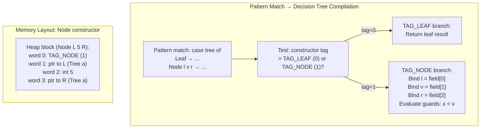

---

## 7. Purely Functional Data Structures: Persistent Immutable Trees

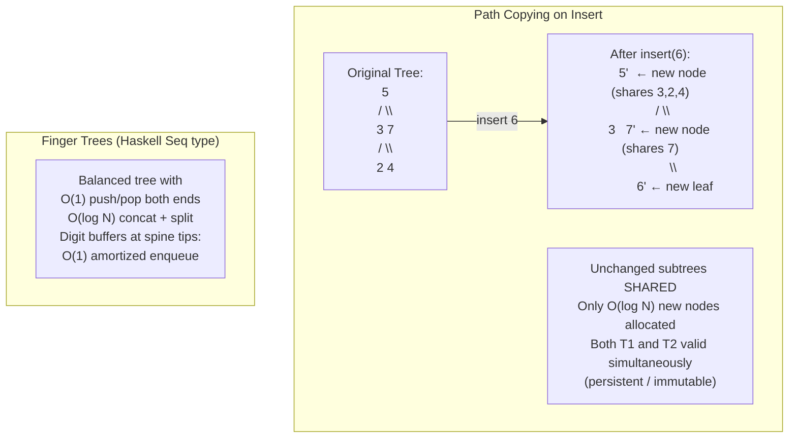

---

## 8. Category Theory Concepts in Code

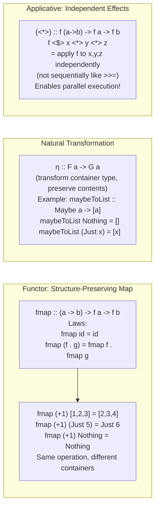

---

## 9. STM: Software Transactional Memory Internals

Haskell's STM provides composable atomic blocks without locks:

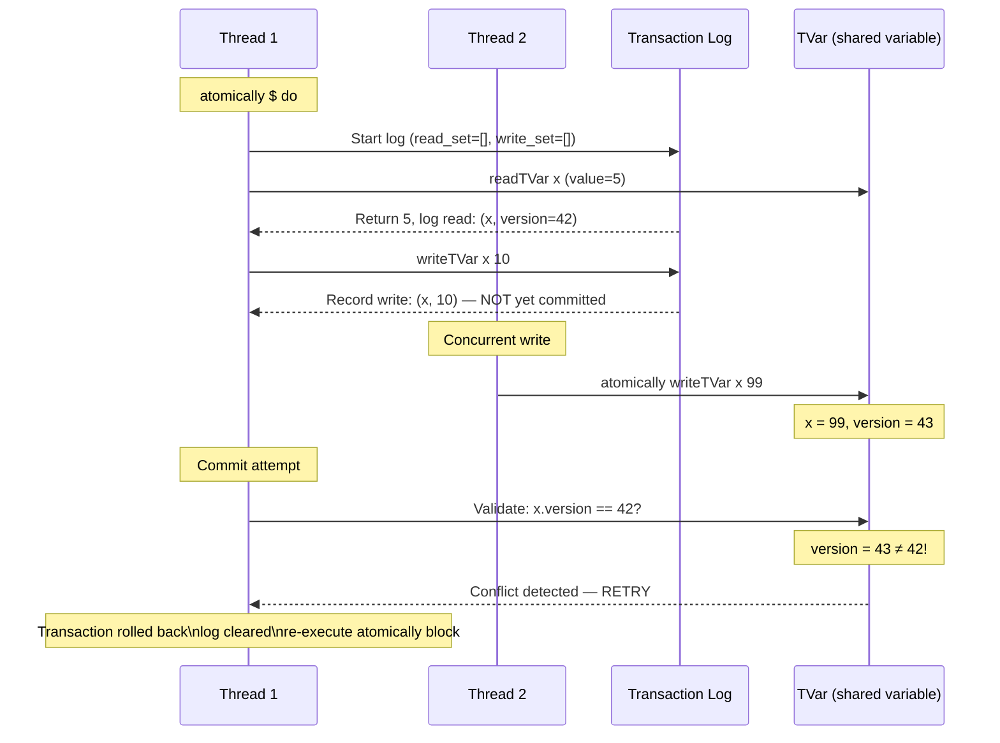

**No deadlocks possible**: STM uses optimistic concurrency — no locks acquired during transaction execution, only at commit. Retry is safe because transactions are **pure** (no observable side effects until commit).

---

## 10. Functional Reactive Programming: Signal Graph Internals

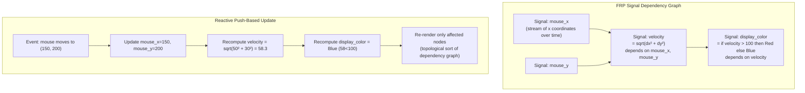

---

## 11. Tail Call Optimization: Stack Frame Elimination

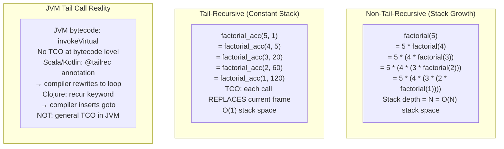

---

## 12. Effect Systems and Free Monads

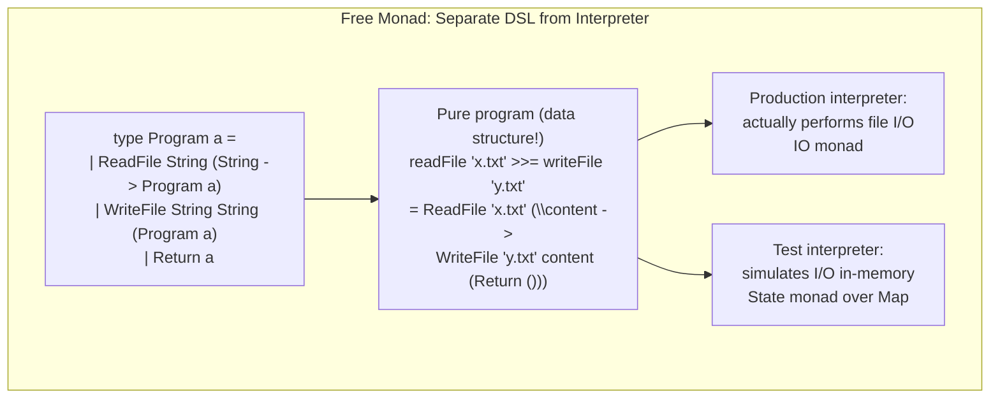

**Extensible Effects (Eff)**: The `Eff` monad generalizes Free monads to allow combining multiple effect types (Reader, Writer, State, Exception) without monad transformer stacks, using algebraic effect handlers at the call site.

---

## Summary: FP Core Mechanisms

| Concept | Runtime Mechanism | Key Property |
|---|---|---|
| Closure | Heap-allocated environment record | Captures variables beyond stack lifetime |
| Lazy thunk | Heap pointer + update-in-place | Evaluate once, memoize, enable infinite structures |
| HM type inference | Unification + substitution | O(n log n) inference, no annotations needed |
| Persistent data structure | Path copying + structural sharing | O(log N) updates, old versions preserved |
| Monad | Function composition over wrapped types | Sequencing with effects, composable |
| STM | Optimistic concurrency + transaction log | No deadlocks, composable atomic blocks |
| TCO | Replace current stack frame (goto) | O(1) stack for tail-recursive algorithms |
| Pattern matching | Tag check + field extraction + guards | Compiled to efficient decision tree |
