# Java Internals: Under the Hood

> Synthesized from: Bloch *Effective Java* 3rd ed, Oaks & Wong *Java Performance* 2nd ed, Evans & Verburg *The Well-Grounded Java Developer*, Goetz *Java Concurrency in Practice*, and comp(21/207-212/215-223/241/305/311/326/346/455/457) Java references.

## JVM/version scope

This chapter primarily describes HotSpot and mixes Java 8-era mechanisms with Java 9+ and newer collectors. JVM Specification guarantees must be separated from HotSpot implementation choices. For operational use, record JDK vendor/build, collector, heap and compressed-pointer settings, architecture, flags, warm-up state, and the diagnostic output or benchmark that supports a claim.

---

## 1. JVM Architecture — Class Loading to Execution

### JVM Runtime Areas

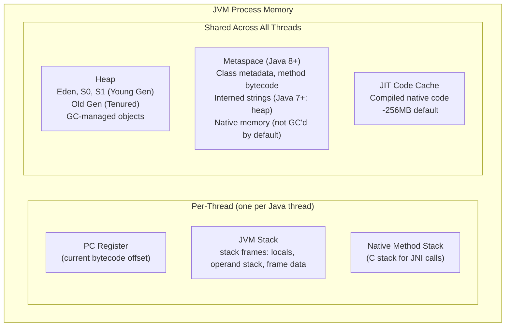

### Class Loading Lifecycle

The diagram's `rt.jar`, extension directory, and `ExtClassLoader` names describe Java 8. Java 9+ uses the module runtime image and a platform class loader; loading, linking, and initialization remain the specification-level lifecycle.

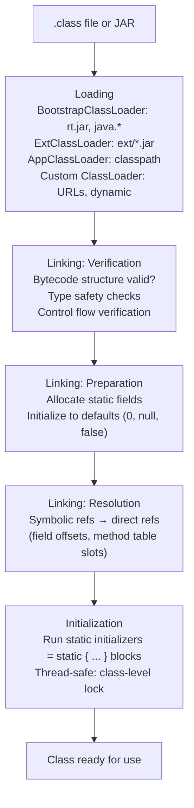

**Parent delegation model**: ClassLoader first asks parent before searching own path. Prevents class substitution attacks (can't shadow `java.lang.String`). Can be broken intentionally (e.g., OSGi, Tomcat's WebAppClassLoader loads webapp classes first).

---

## 2. JVM Stack Frame Layout

```
Stack Frame for method: int compute(int x, int y)
+---------------------------+
| Local Variable Array      |
|  [0] = this (instance)    |  (only for instance methods)
|  [1] = x (int arg)        |
|  [2] = y (int arg)        |
|  [3] = temp local int     |
+---------------------------+
| Operand Stack             |  LIFO, max depth from .class Code attr
|  (grows as opcodes push)  |
+---------------------------+
| Frame Data                |
|  constant_pool ref        |  → runtime constant pool of class
|  method return address    |  → caller's PC after return
|  exception table ptr      |  → [start_pc, end_pc, handler_pc, catch_type]
+---------------------------+
```

---

## 3. JIT Compilation — Tiered Compilation

### Execution Tiers (Java 8+ HotSpot)

Tier thresholds, inlining limits, compilation policy, and speed multipliers are HotSpot flags and workload-dependent observations, not Java guarantees. Deoptimization normally resumes in the interpreter or less-optimized compiled code at a reconstructed program state; it does not imply a method restarts from its first bytecode.

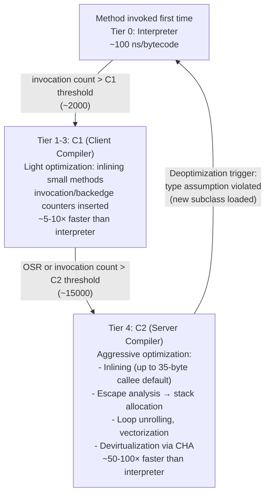

### Escape Analysis — Heap Allocation Elimination

HotSpot commonly uses scalar replacement and allocation elimination for non-escaping objects. “Stack allocation” in the diagrams is shorthand: an object may cease to exist as an allocation rather than being materialized as an ordinary stack object, and escape to a callee does not automatically require heap allocation if interprocedural optimization proves otherwise.

```java
// This code:
void process() {
    Point p = new Point(1, 2);   // escapes? NO — only used locally
    int sum = p.x + p.y;
    return sum;
}

// After escape analysis + scalar replacement:
void process() {
    int p_x = 1;   // Point fields promoted to stack scalars
    int p_y = 2;   // No heap allocation!
    int sum = p_x + p_y;
    return sum;
}
```

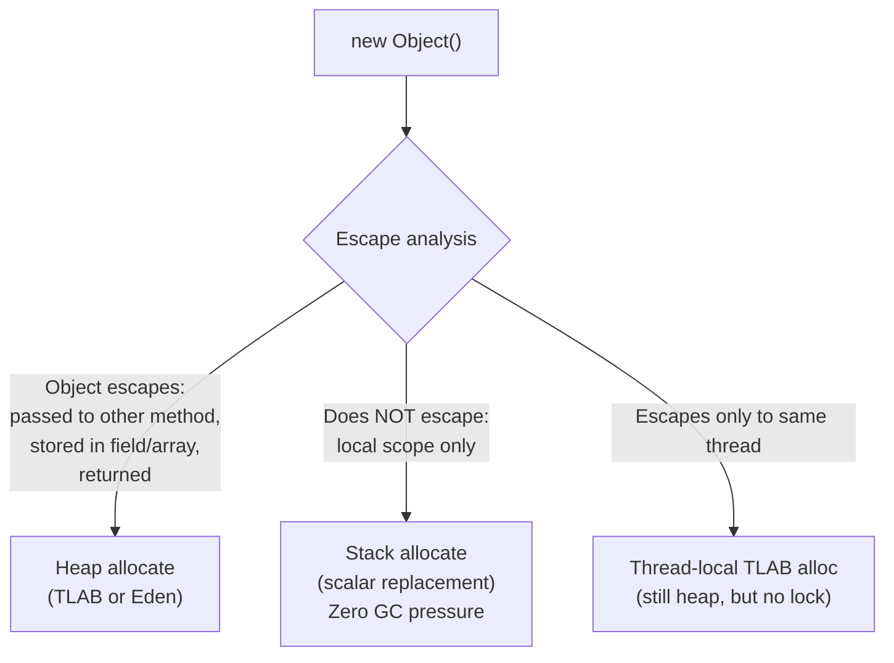

---

## 4. Garbage Collection — Generational GC

Eden/survivor/old layout and a tenure threshold of 15 describe a common generational configuration, not every collector. ZGC, Shenandoah, G1, Serial, and Parallel collectors differ by JDK release and flags; object age, region size, pause phase, and “Full GC” meaning must be read from the active collector's logs.

### Object Lifecycle Through Generations

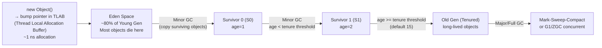

### TLAB — Thread-Local Allocation Buffer

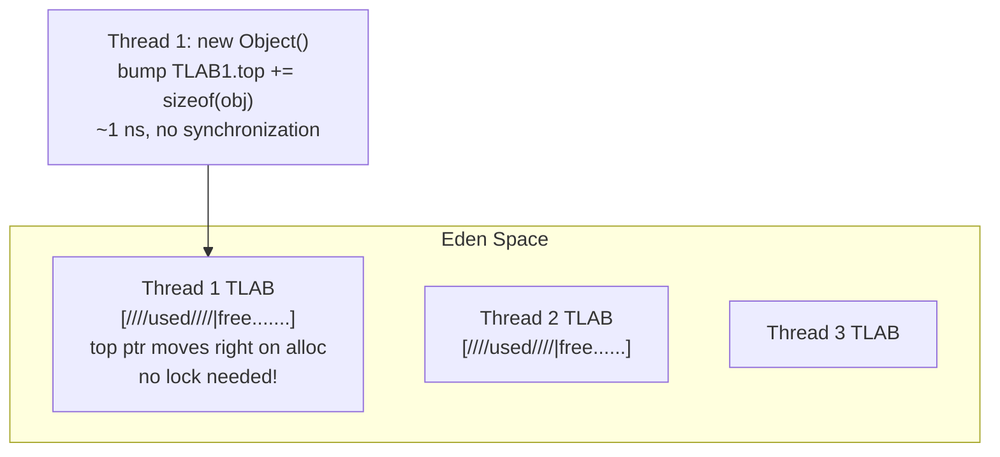

When TLAB fills: Thread requests new TLAB from Eden via CAS on Eden.top. Minor GC reclaims entire Eden+Survivors — very fast (only live objects copied, dead objects simply abandoned).

### G1 GC Architecture

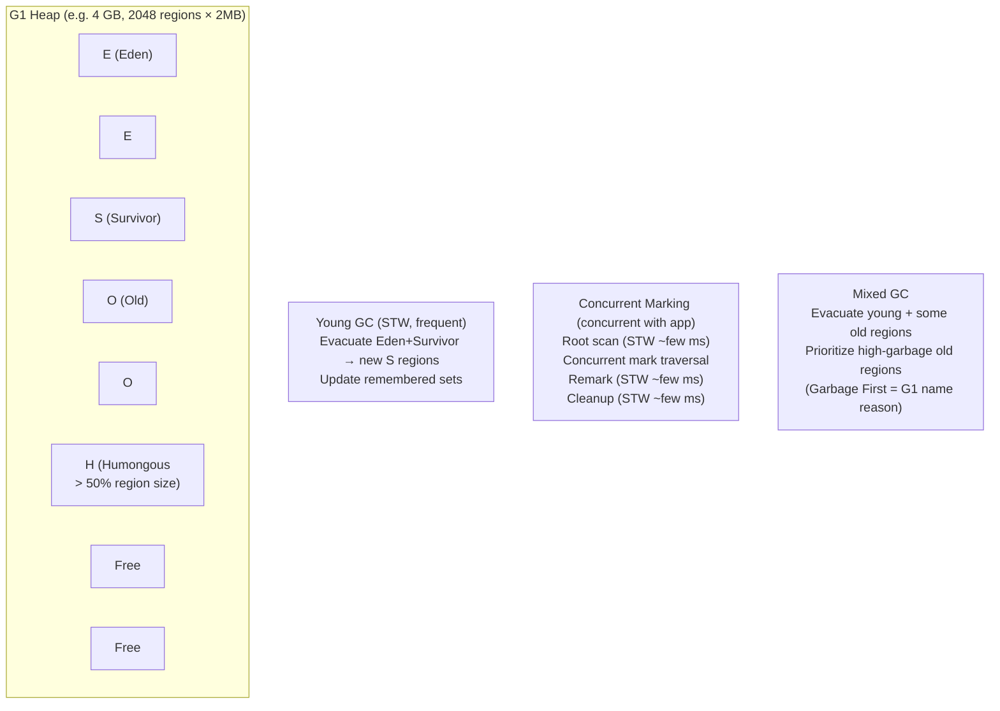

**Remembered Sets (RSet)**: Each region tracks which OTHER regions hold references INTO it. Avoids full heap scan during young GC — only scan RSets of young regions to find old→young pointers.

---

## 5. Java Memory Model (JMM) — Happens-Before

### JMM Rules

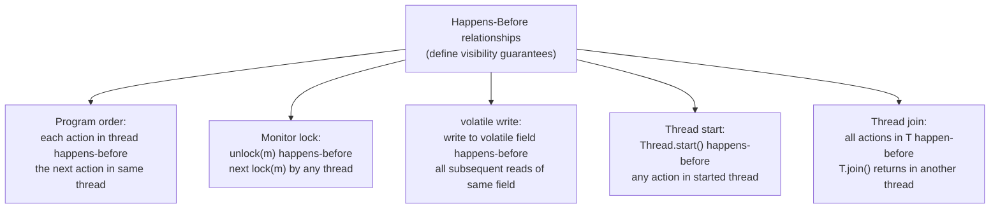

### volatile — What Hardware Does

```java
// Writer thread:
volatile int flag = 0;
data = 42;           // regular store — may buffer in store buffer
flag = 1;            // volatile store → StoreStore + StoreLoad fence on x86
                     // = MFENCE instruction (ensures store buffer flushed)

// Reader thread:
while(flag == 0) {}  // volatile load → LoadLoad + LoadStore fence
int x = data;        // guaranteed to see 42
```

On x86 (TSO): volatile load = regular load. volatile store = `LOCK XCHG` or `MFENCE`. On ARM: `DMB SY` (full barrier) for both.

The JMM specifies ordering and visibility, not exact opcodes. HotSpot chooses barriers from operation context, architecture, and JDK version; an x86 volatile store is not universally compiled to `MFENCE` or `LOCK XCHG`, and ARM may use acquire/release instructions rather than a full `DMB SY` for every access. Inspect generated code only when instruction selection itself matters.

---

## 6. Java Thread and Monitor Internals

### Object Header and Lock States

```
Object header (64-bit JVM, without compressed oops):
+--[mark word: 8 bytes]--+--[klass pointer: 8 bytes (4 with CompressedOops)]--+

Mark word states:
Unlocked:     [hash:31 | 0 | age:4 | 0 | 01]
Biased:       [thread_id:54 | epoch:2 | age:4 | 1 | 01]
Lightweight:  [stack_lock_ptr:62 | 00]
Heavyweight:  [monitor_ptr:62 | 10]
GC mark:      [...              | 11]
```

### Lock Escalation Path

Biased locking is a historical HotSpot state: it was disabled by default in JDK 15 and removed in later JDKs. On those runtimes the biased transitions and safepoint revocation shown below do not occur. Object-header layouts also depend on compressed class pointers, GC, architecture, and JDK project work.

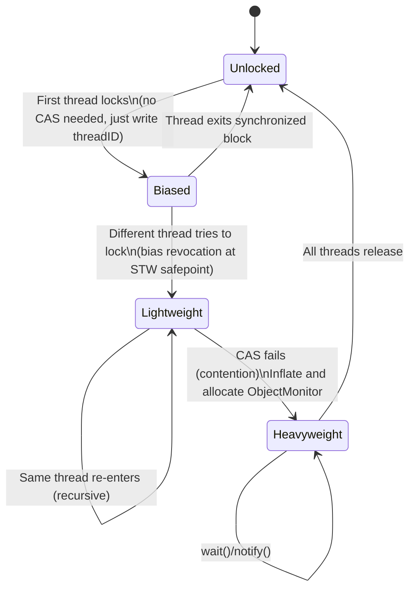

**ObjectMonitor** (heavyweight):
```c
class ObjectMonitor {
    void*   _owner;          // owning thread
    jint    _count;          // recursive lock depth
    jint    _waiters;        // threads in wait()
    ObjectWaiter* _WaitSet;  // circular list of waiting threads
    ObjectWaiter* _EntryList; // threads waiting to acquire lock
};
```

`wait()`: releases lock, moves thread to `_WaitSet`, thread parked (OS-level `pthread_cond_wait`). `notify()`: moves one thread from `_WaitSet` to `_EntryList`. `notifyAll()`: moves all.

---

## 7. Java Collections — Internal Data Structures

### HashMap Internals (Java 8+)

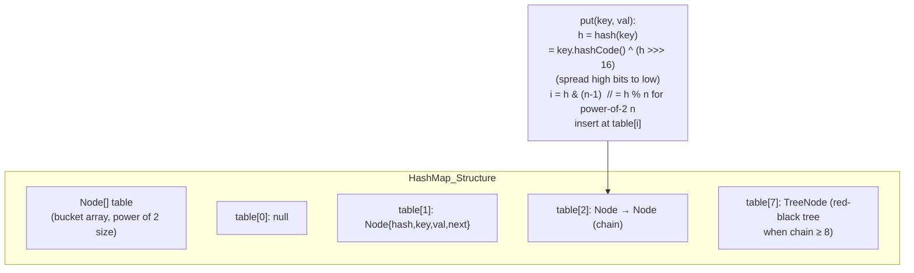

**Treeification**: When bucket chain length ≥ 8 AND table.length ≥ 64, chain converted to TreeNode (red-black tree). O(n) worst case → O(log n). Untreeified when size drops ≤ 6.

**Load factor 0.75**: Resize threshold = capacity × 0.75. Balances memory vs collision probability. At 0.75 load, expected chain length ≈ 0-1 under uniform hash distribution.

### ConcurrentHashMap (Java 8)

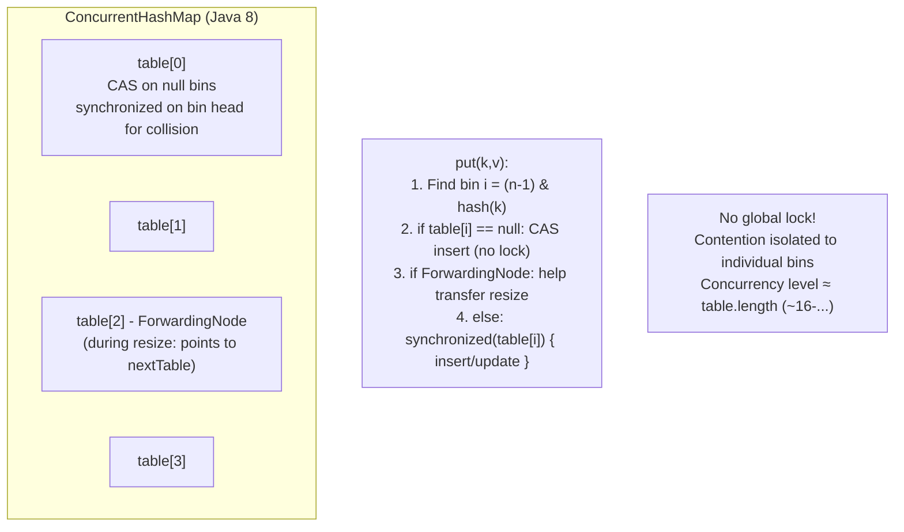

`size()` returns approximate count. Exact count uses `CounterCell[]` (striped counter, like LongAdder) to avoid contention on single counter during concurrent increments.

---

## 8. Java Serialization and Reflection Internals

### Reflection Method Invocation Path

The 15-call inflation path describes older HotSpot reflection. Modern JDKs changed core reflection implementation, notably with method-handle-based reflection in JDK 18+, so accessor generation thresholds and nanosecond figures require a specific JDK and benchmark.

```java
Method m = Foo.class.getDeclaredMethod("bar", int.class);
m.invoke(fooInstance, 42);
```

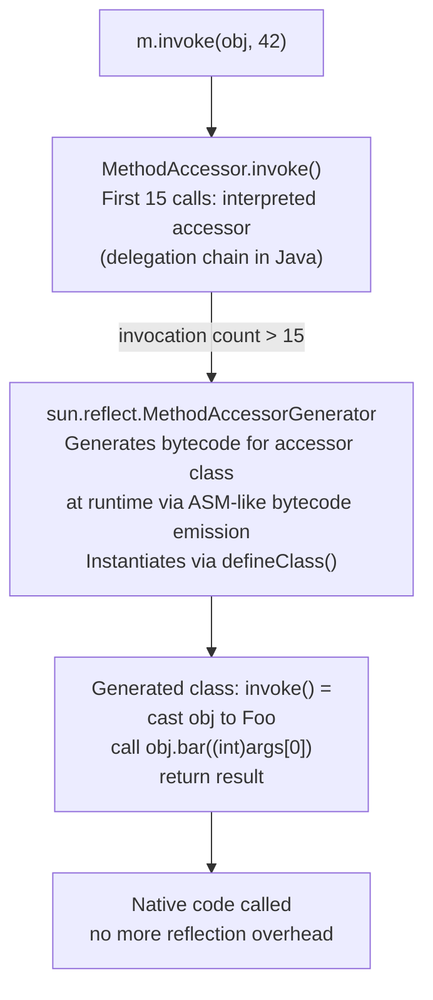

Reflection overhead: First 15 invocations ~500 ns. After JIT-compiled accessor generation: ~5-10 ns (comparable to virtual call). `MethodHandles.lookup().findVirtual()` → MethodHandle → more predictable JIT optimization than reflection.

---

## 9. JVM Safepoints and Stop-The-World

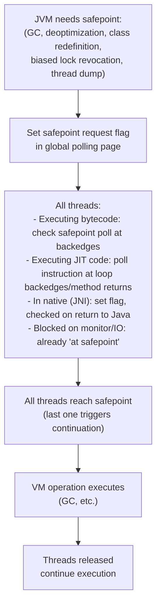

**Time-to-safepoint (TTSP)**: The delay for all threads to reach safe point. Long-running JNI code, tight loops without safepoint polls (before JDK 10 loop strip mining), or large object allocation in TLAB can extend TTSP. Symptom: `Application time: 0.0` followed by large GC pause.

---

## 10. Java NIO and Direct ByteBuffer

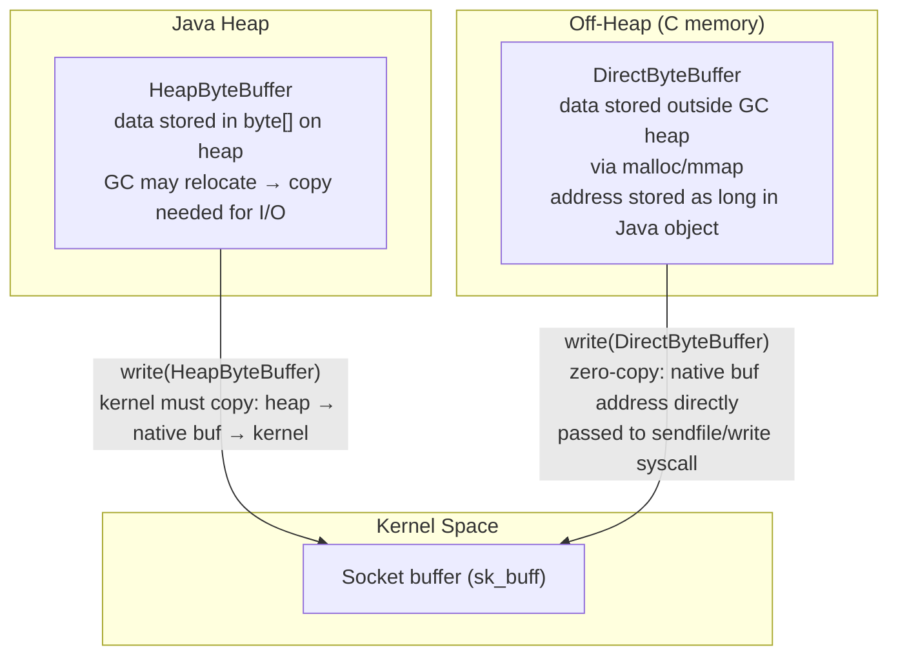

`ByteBuffer.allocateDirect(n)` obtains off-heap storage whose lifecycle is normally connected to a `Cleaner`; allocation and release paths are JDK-specific and reclamation is not prompt unless explicitly managed through supported ownership APIs. Direct buffers avoid an intermediate heap-to-native staging copy, but a normal socket `write` still copies bytes into kernel networking buffers. `sendfile` is a separate file-to-socket path, not a property of every direct-buffer write.

**Memory-mapped files** (`FileChannel.map()`): `mmap()` syscall → pages mapped directly into JVM process address space → zero-copy reads/writes via DirectByteBuffer accessing OS page cache.

---

## 11. String Interning and Compact Strings

### String Representation (Java 9+ Compact Strings)

```java
// Java 9+: String uses byte[] + coder field
class String {
    byte[] value;     // LATIN1: 1 byte/char; UTF16: 2 bytes/char
    byte coder;       // 0=LATIN1, 1=UTF16
    int hash;         // cached hashCode (0 = not computed)
}
// "hello" → value=[104,101,108,108,111], coder=0 (LATIN1)
// "日本語" → value=[...UTF16 bytes...], coder=1
```

**String pool**: Interned `String` objects live on the Java heap in modern HotSpot; the VM's StringTable is an implementation data structure and should not be described as the objects living in Metaspace. `String.intern()` returns the canonical pooled reference, and literals are resolved through the runtime constant pool when used.

```mermaid
flowchart LR
    A["String literal \"hello\"\nin bytecode (ldc opcode)"] --> B["JVM string pool lookup\n(hash → bucket → compare)"]
    B -->|"found"| C["Return existing interned\nString object reference"]
    B -->|"not found"| D["Add to pool\nReturn new String reference"]
```

---

## 12. JVM Startup and ClassData Sharing (CDS)

Java 9+ loads runtime classes from the modular runtime image rather than `rt.jar`. CDS does not universally eliminate parsing or verification, fixed-address mapping is platform/version-dependent, and startup savings must be measured for the exact archive, class path/module path, and application.

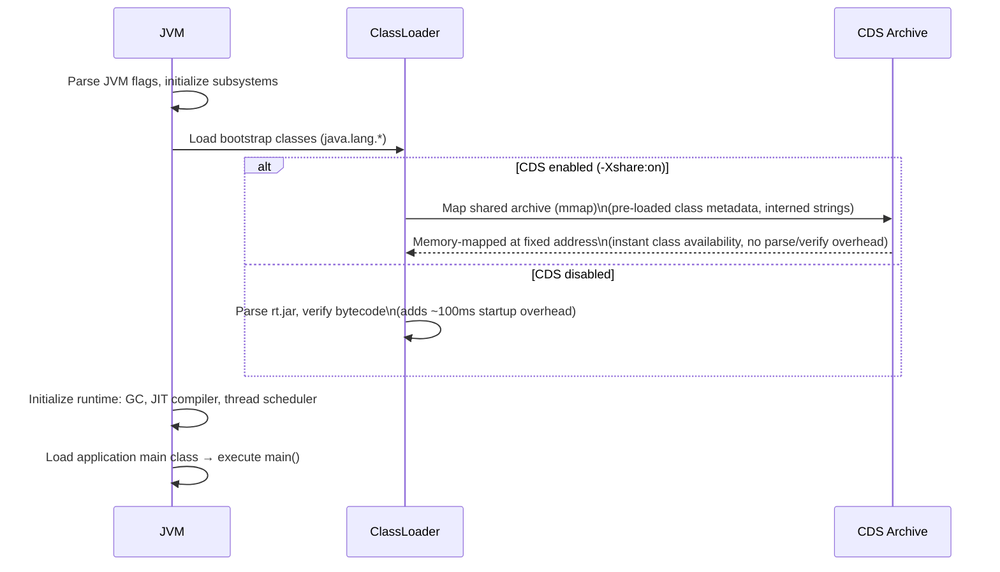

**AppCDS (Application Class-Data Sharing)**: Also archives application classes. Startup time reduction: 20-50% for typical Spring Boot apps. GraalVM Native Image takes this further — compiles entire app to native binary, eliminating JVM startup entirely.

---

## JVM Performance Numbers

These are illustrative ranges, not JVM contracts. Replace them with a reproducible JMH or application trace that records JDK build, flags, CPU/power policy, collector/heap, warm-up and compilation state, allocation/live set, contention, forks/iterations, sample count, and distribution; sub-nanosecond entries usually indicate inlining or benchmark elimination rather than a standalone call cost.

| Operation | Time | Notes |
|-----------|------|-------|
| TLAB object allocation | ~1 ns | bump pointer, no lock |
| Eden allocation (no TLAB) | ~10 ns | CAS on Eden.top |
| Minor GC (Young) | 1-50 ms | proportional to live objects in Young |
| G1 Mixed GC pause | 50-200 ms | depends on -XX:MaxGCPauseMillis |
| Full GC (old CMS) | 500ms-30s | proportional to heap size |
| ZGC/Shenandoah pause | <1-10 ms | concurrent marking |
| Virtual method call | ~5-10 ns | vtable dispatch |
| Interface method call | ~10-20 ns | itable search |
| Monomorphic JIT call | ~0-1 ns | inlined |
| synchronized block (uncontended) | ~5-20 ns | biased or thin lock |
| synchronized block (contended) | ~1-10 µs | OS mutex + context switch |
| Thread.start() | ~50-200 µs | OS thread creation |
| Class loading (cold) | ~1-50 ms | parse + verify + initialize |
| Reflection invoke (first 15x) | ~500 ns | interpreted |
| Reflection invoke (after inflate) | ~5-10 ns | JIT compiled accessor |
