# 고급 알고리즘 내부: 동적 프로그래밍, 그래프 이론 및 복잡성

> 내부적으로: DP 하위 문제 DAG가 최적의 하위 구조를 인코딩하는 방법, 네트워크 흐름 알고리즘이 증가 경로를 포화시키는 방법, NP 감소가 경도를 증명하는 방법, 무작위 알고리즘이 확률적 정확성을 보장하는 방법(정확한 반복, 그래프 변환 및 계산 모델).

---

## 1. 동적 프로그래밍: 하위 문제 DAG 및 메모

DP는 문제에 **최적 하위 구조**(최적 하위 솔루션으로 구성된 최적 솔루션) 및 **겹치는 하위 문제**(동일 하위 문제가 여러 번 해결됨)가 있을 때 작동합니다.

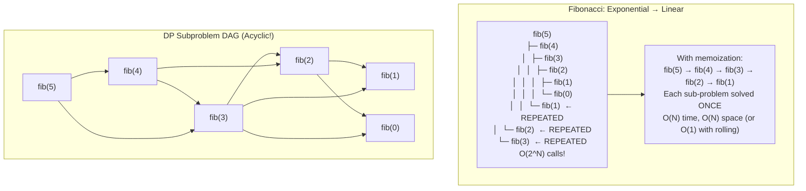

### 가장 긴 공통 부분 수열: DP 테이블

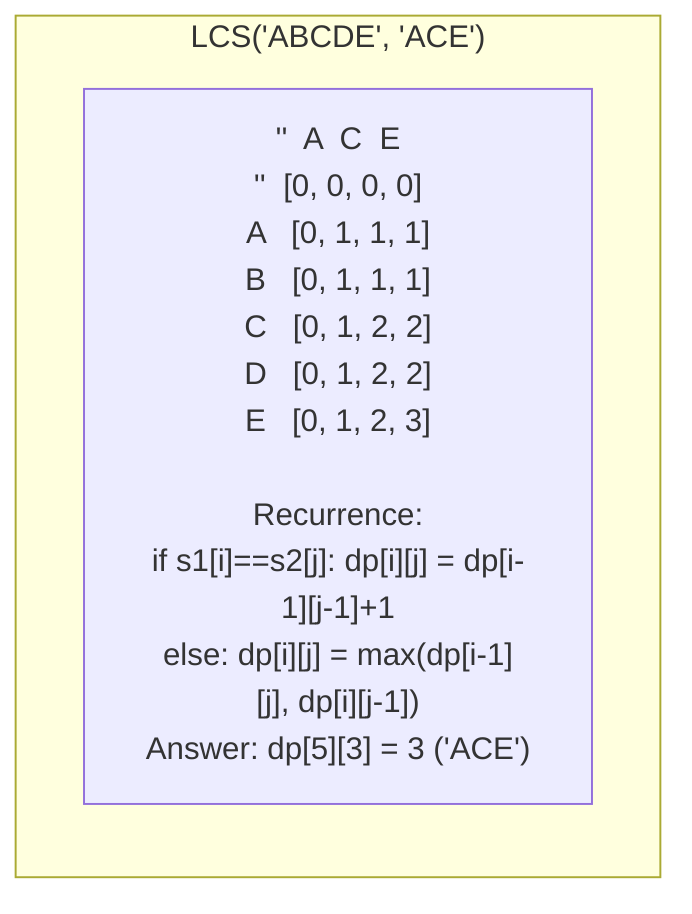

---

## 2. 배낭 문제: 완전한 DP 분석

0/1 배낭: n개 항목, 각각 무게 wᵢ 및 가치 vᵢ. 용량 W로 총 가치를 극대화합니다.

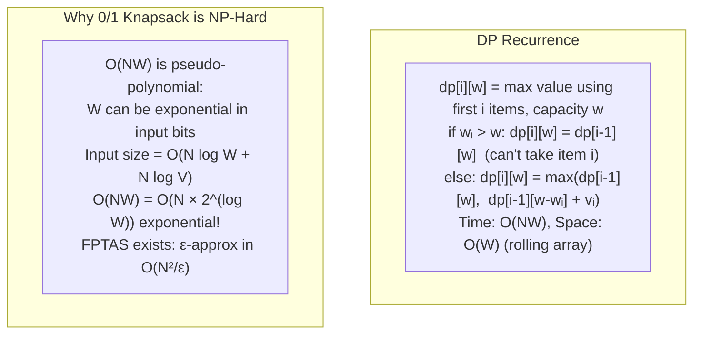

---

## 3. 네트워크 흐름: Ford-Fulkerson에서 Push-Relabel까지

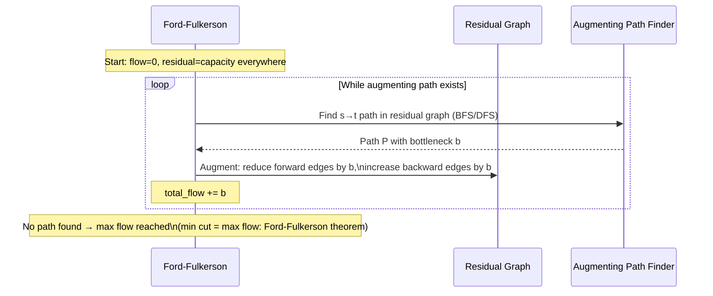

### 최소 컷 ⇔ 최대 흐름 이중성

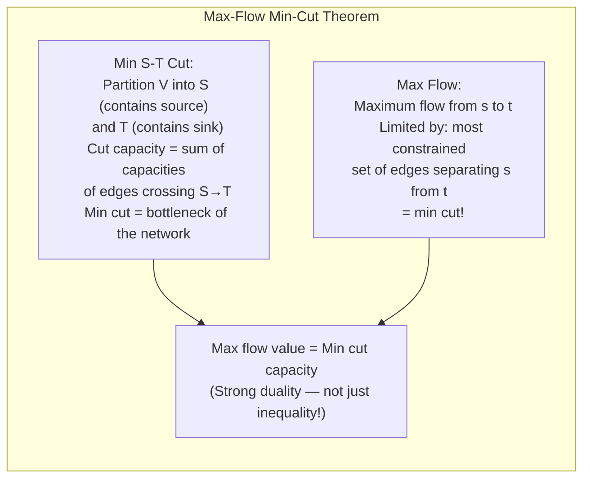

### 푸시 재레이블 알고리즘: O(V²√E)

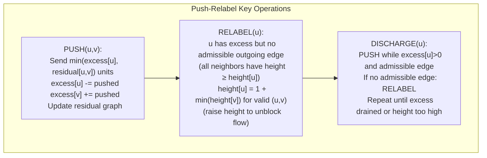

---

## 4. 문자열 알고리즘: KMP 및 접미사 배열

### KMP: 실패 기능 메커니즘

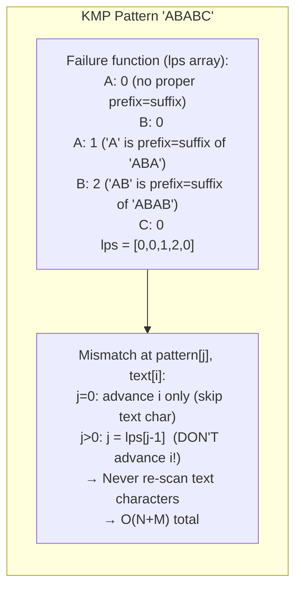

### 접미사 배열: O(N log N) 구성

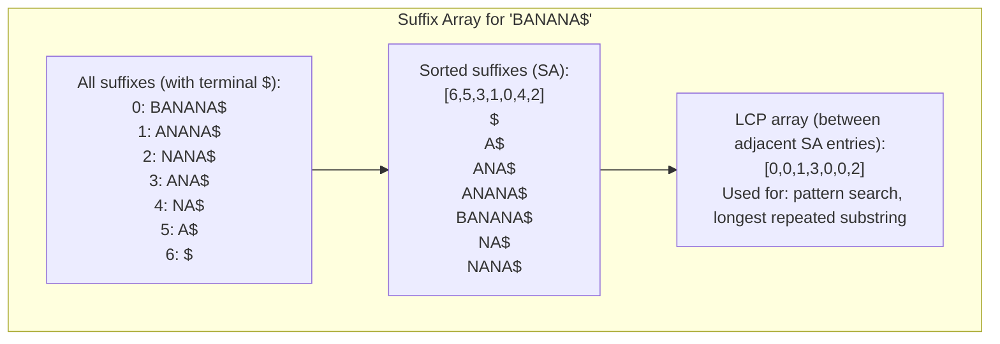

---

## 5. 계산 복잡성: 축소 메커니즘

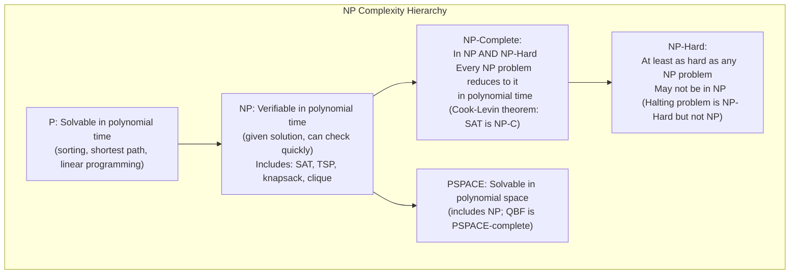

### 다항식 축소: 3-SAT → 독립 집합

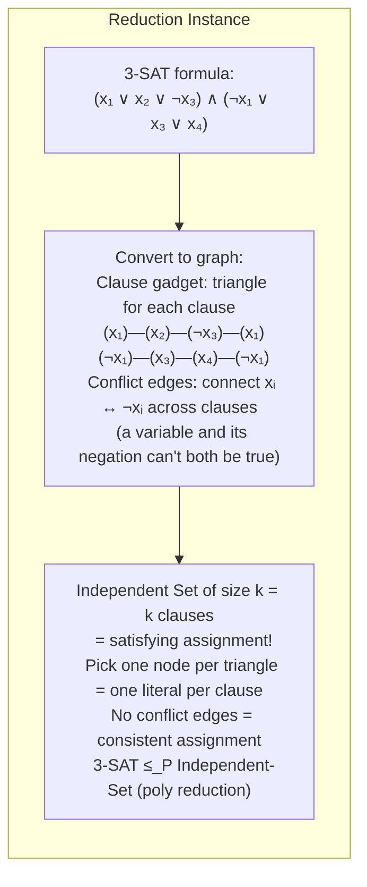

---

## 6. 무작위 알고리즘: 정확성과 확률

### QuickSort 예상 O(N log N)

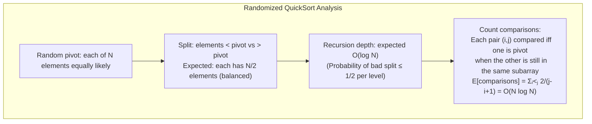

### 블룸 필터: 거짓 긍정 분석

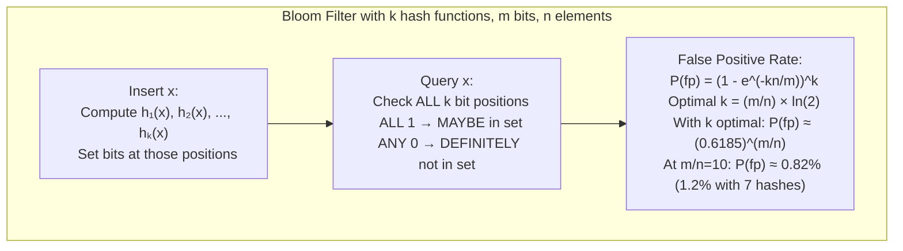

---

## 7. 상각분석: 회계처리 방법

### 동적 어레이 푸시백

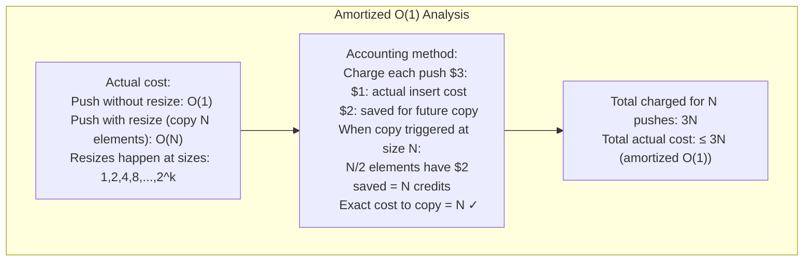

---

## 8. 근사 알고리즘: 정점 커버 및 TSP

### 2-정점 커버에 대한 근사

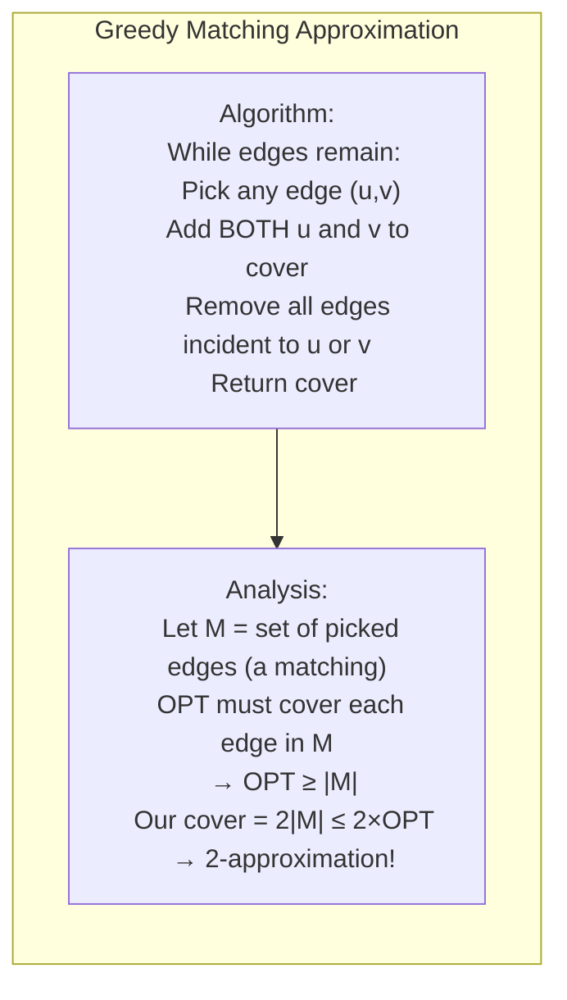

### Christofides 알고리즘: 1.5-TSP에 대한 근사치(미터법)

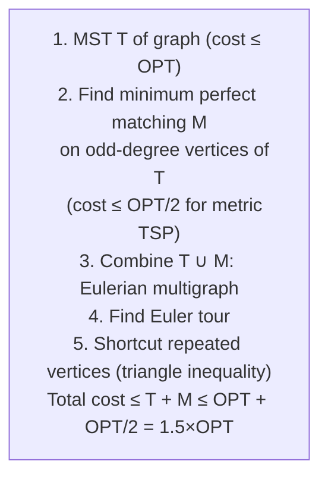

---

## 9. 경쟁 프로그래밍: 고전적인 문제 패턴

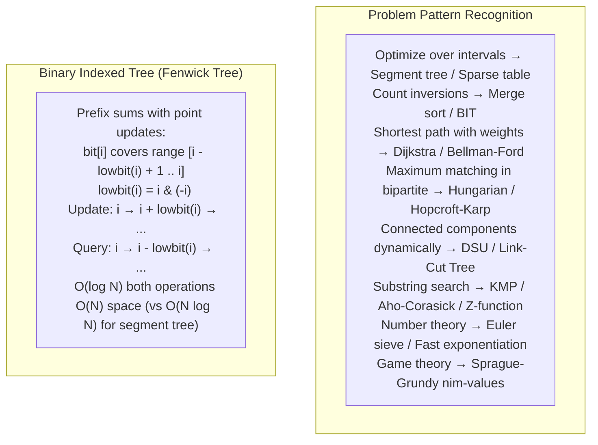

---

## 10. 계산 기하학: 볼록 껍질 내부

### 그레이엄 스캔: O(N log N)

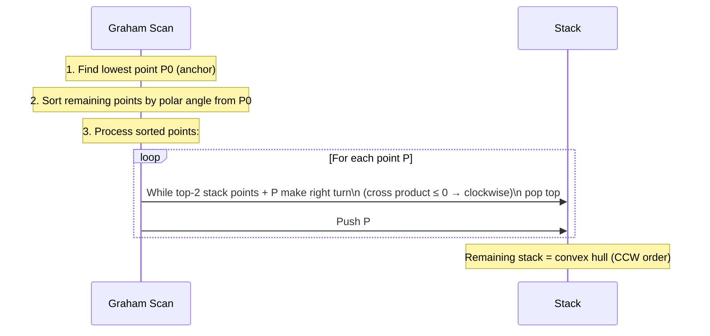

**외적 테스트**: 주어진 A, B, C 지점에서 좌회전하는지 확인합니다.
```
cross = (B.x-A.x)*(C.y-A.y) - (B.y-A.y)*(C.x-A.x)
cross > 0: left turn (CCW) — keep B
cross < 0: right turn (CW) — pop B
cross = 0: collinear — depends on requirements
```

---

## 요약: 알고리즘 복잡성 참조

| 문제 | 알고리즘 | 시간 | 공간 |
|---|---|---|---|
| 정렬 | 병합 정렬 | O(N 로그 N) | 오(엔) |
| 패턴 검색 | KMP | O(N+M) | 오(남) |
| 최대 유량 | 푸시 라벨 재지정 | O(V²√E) | O(V+E) |
| MST | 프림(바이너리 힙) | O(E로그V) | 오(V) |
| SSSP(음수가 아님) | 다익스트라(피보나치 힙) | O(E + V 로그 V) | 오(V) |
| SSSP(음의 가중치) | 벨먼-포드 | O(VE) | 오(V) |
| LCS | DP 테이블 | 오(NM) | O(최소(N,M)) |
| 배낭 | DP(유사폴리) | 오(북서) | 오(W) |
| 볼록 껍질 | 그레이엄 스캔 | O(N 로그 N) | 오(엔) |
| 정점 커버 약 | 최대 매칭 | O(E) | 오(V) |


---

## 설계적 고민

### 구조와 모델링

#### 알고리즘 선택의 구조적 프레임워크

알고리즘을 선택한다는 것은 단순히 시간 복잡도를 비교하는 것이 아니다. **문제의 구조적 특성**을 뚫고 나서, 그 특성에 맞는 알고리즘 범주를 선택하는 과정이다.

문제를 분석할 때 다음을 확인한다:
- **최적 부분 구조(Optimal Substructure)**: 하위 문제의 최적해가 전체 최적해를 구성하는가? → DP 또는 그리디 후보
- **탐욕 선택 속성(Greedy Choice Property)**: 로컬 최적이 전역 최적을 보장하는가? → 그리디 알고리즘 가능
- **중복 부분 문제(Overlapping Subproblems)**: 동일한 하위 문제가 반복 계산되는가? → DP 필수
- **문제 크기**: NP-Hard인가? → 근사 알고리즘 또는 휴리스틱 고려

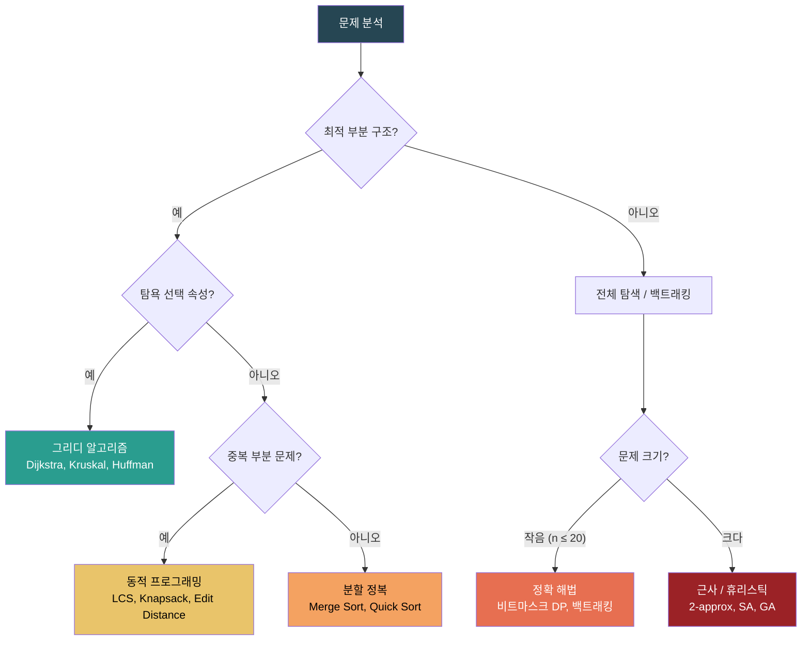

#### DP의 상태 정의: 모델링의 핵심

DP의 핵심은 **상태(state)를 어떻게 정의하는가**이다. 상태 정의가 잘못되면 상태 공간이 폭발하거나, 전이 관계를 상실하거나, 아예 DP로 풀 수 없게 된다.

예시 - 배낭 문제:
- **나쁜 상태**: `dp[i]` = i번째 물건을 넣을지 말지 → 남은 용량 정보 없음
- **좋은 상태**: `dp[i][w]` = i번째 물건까지 고려하고, 장량 w가 남았을 때의 최대 가치
- **최적화된 상태**: `dp[w]` = 롤링 배열로 공간 O(W)로 축소

### 트레이드오프와 의사결정

#### DP Bottom-up vs Top-down: 구현 전략의 선택

DP를 구현할 때 **Bottom-up(타비레이션)**과 **Top-down(메모이제이션)**의 선택은 단순한 스타일 차이가 아니다.

**Top-down(메모이제이션)**:
- 재귀적 사고가 자연스러워 직관적이다
- 필요한 부분 문제만 계산한다 (sparse한 상태 공간에 유리)
- 호출 스택 오버헤드 + 스택 오버플로우 위험 (Python 기본 재귀 한계 ~1000)

**Bottom-up(타비레이션)**:
- 스택 오버플로우 없음
- 메모리 접근 패턴이 예측 가능하여 캐시 효율적
- 모든 상태를 계산하므로 sparse한 경우 낭비
- 공간 최적화(롤링 배열)가 용이하다

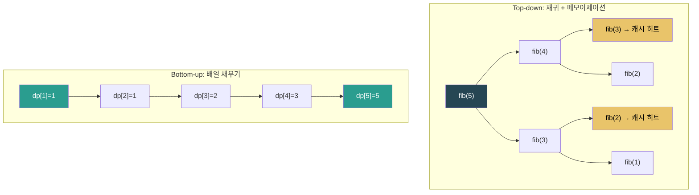

#### 그리디 vs DP: 탐욕 선택 속성의 판단

그리디 알고리즘을 적용하려면 **탐욕 선택 속성**을 증명해야 한다. 이것이 성립하지 않으면 그리디는 최적해를 보장하지 못한다.

| 문제 | 그리디 가능? | 이유 |
|------|-----------|------|
| 분할 가능 배낭 | O | 물건을 분할하면 단위 가치 높은 순서가 최적 |
| 0/1 배낭 | X | 물건 분할 불가 → 로컬 최적 ≠ 전역 최적 |
| 활동 선택 | O | 종료 시간 빠른 순서로 선택하면 최적 |
| 동전 교환 | O | 큰 동전부터 사용하면 최적 |
| 최장 공통 부분 수열 | X | 로컬에서의 매치 결정이 전역에 영향 |

핵심 통찰: 그리디는 DP의 특수 케이스다. DP가 모든 상태를 탐색하는 반면, 그리디는 "로컬 최적 = 전역 최적"이라는 추가 보장 덕분에 상태 공간을 탐색하지 않아도 된다.

#### NP-Hard 문제 처리 전략

NP-Hard 문제(예: TSP, 정점 커버, 그래프 착색)를 만났을 때, 세 가지 접근방식이 있다:

1. **정확 알고리즘**: 미트마스크 DP, 백트래킹 + 가지치기. n ≤ 20~25에서만 실용적.
2. **근사 알고리즘**: 정점 커버의 2-근사, TSP의 Christofides 1.5-근사. **보장된 근사비**가 있어 신뢰할 수 있다.
3. **휴리스틱**: 담금질(Simulated Annealing), 유전 알고리즘 등. 보장된 근사비는 없지만, 실제로 좋은 해를 찾는 경우가 많다.

```mermaid
graph TD
    NP_HARD["하운 문제(NP-Hard)"] --> SIZE{"입력 크기?"}}
    SIZE -->|"작음 (n ≤ 20)"| EXACT["정확 해법<br/>비트마스크 DP: O(2ⁿ · n²)<br/>TSP: 헬드-카프"]
    SIZE -->|"중간 (n ≤ 10⁵)"| APPROX["근사 알고리즘<br/>보장된 근사비 존재<br/>Vertex Cover: 2-approx<br/>TSP: 1.5-approx"]
    SIZE -->|"대규모 (n > 10⁵)"| HEUR["휴리스틱<br/>SA, GA, Tabu Search<br/>근사비 보장 없음<br/>실용적 최적해"]

    EXACT --> QUALITY["품질: 최적해"]
    APPROX --> QUALITY2["품질: OPT × α 이내"]
    HEUR --> QUALITY3["품질: 알 수 없음(대체로 좋음)"]

    style NP_HARD fill:#264653,color:#fff
    style EXACT fill:#2a9d8f,color:#fff
    style APPROX fill:#e9c46a,color:#000
    style HEUR fill:#e76f51,color:#fff
```

#### 이론적 복잡도 vs 실제 성능: 상수 인자의 중요성

Big-O 복잡도가 동일해도 실제 성능은 매우 다를 수 있다. 대표적인 사례:

- **Quick Sort vs Merge Sort**: 둘 다 O(n log n)이지만, Quick Sort가 보통 2-3배 빠르다. 이유는 **캐시 지역성**(in-place 파티셔닝)과 **상수 인자** 차이.
- **Fibonacci Heap vs Binary Heap**: 이론적으로 Fibonacci Heap의 decrease-key는 O(1) 상각(무한소), Binary Heap은 O(log n). 그러나 Fibonacci Heap의 상수 오버헤드가 워났 커서, n < 10⁶ 정도에서는 Binary Heap이 더 빠를 수 있다.
- **Edmonds-Karp vs Push-Relabel**: Edmonds-Karp는 O(VE²), Push-Relabel은 O(V²E)이지만, 실제로는 Push-Relabel이 더 빠른 경우가 많다.

### 리팩토링과 설계 원칙

#### Edmonds-Karp: BFS 기반 Ford-Fulkerson의 설계적 의미

Ford-Fulkerson 방법은 증가 경로를 찾아 플로우를 보내는 아이디어다. 그러나 DFS로 증가 경로를 찾으면 **종료가 보장되지 않거나**(irrational capacity일 때), 종료되더라도 지수적으로 느릴 수 있다.

Edmonds-Karp는 **BFS로 최단 증가 경로**를 찾음으로서 이 문제를 해결한다. BFS는 증가 경로의 길이가 단조 증가함을 보장하여, 전체 증가 경로 수를 O(VE)로 제한한다.

```mermaid
sequenceDiagram
    participant S as 소스(s)
    participant ALG as Edmonds-Karp
    participant T as 싱크(t)

    Note over ALG: 반복 1: BFS로 최단 증가 경로 탐색
    ALG->>S: BFS 시작
    S-->>ALG: 경로: s→a→b→t (bottleneck=3)
    Note over ALG: 경로를 따라 잔여 용량 갱신<br/>역방향 간선 추가

    Note over ALG: 반복 2: BFS로 다음 최단 증가 경로
    ALG->>S: BFS 시작
    S-->>ALG: 경로: s→c→b→t (bottleneck=2)
    Note over ALG: 잔여 용량 갱신

    Note over ALG: 반복 3: BFS → t에 도달 불가
    Note over ALG: 종료! 최대 플로우 = 5
```

이 설계는 **단순한 변경(탐색 전략만 DFS→BFS)으로 알고리즘의 복잡도 특성을 근본적으로 바꾸는** 우아한 리팩토링 사례다.

#### 알고리즘 코드의 리팩토링 원칙

알고리즘 구현에서의 리팩토링 원칙:
- **관심사 분리**: 그래프 표현(인접 리스트/행렬)과 알고리즘 로직을 분리하라
- **상태 캔슐화**: DP 상태, 방문 배열 등을 함수 매개변수로 만들어 테스트 가능성 확보
- **불변 조건 명시**: 루프 불변 조건을 주석으로 남겨라 (ex: `// 불변: dist[v]는 s에서 v까지의 최단 거리`)
- **경계 조건 먼저**: DP/재귀에서 base case를 먼저 작성하라

### 디자인 패턴 적용

#### Template Method 패턴과 그래프 탐색

BFS와 DFS는 **Template Method 패턴**의 전형적 사례다. 전체 탐색 프레임워크는 동일하지만, 다음 노드를 선택하는 전략만 다르다.

```mermaid
flowchart TD
    subgraph "그래프 탐색 Template Method"
        INIT["초기화<br/>container.add(start)"] --> LOOP{"컬테이너<br/>not empty?"}
        LOOP -->|"예"| EXTRACT["노드 추출<br/>node = container.remove()"]
        EXTRACT --> VISIT["방문 처리<br/>process(node)"]
        VISIT --> NEIGHBORS["이웃 노드 추가<br/>for n in adj[node]:<br/>  container.add(n)"]
        NEIGHBORS --> LOOP
        LOOP -->|"아니오"| DONE["탐색 완료"]
    end

    BFS["컬테이너 = Queue<br/>→ BFS (너비 우선)"]
    DFS["컬테이너 = Stack<br/>→ DFS (깊이 우선)"]
    PRIO["컬테이너 = Priority Queue<br/>→ Dijkstra / Prim"]

    BFS -.-> INIT
    DFS -.-> INIT
    PRIO -.-> INIT

    style INIT fill:#264653,color:#fff
    style EXTRACT fill:#2a9d8f,color:#fff
    style LOOP fill:#e9c46a,color:#000
    style BFS fill:#e76f51,color:#fff
    style DFS fill:#e76f51,color:#fff
    style PRIO fill:#e76f51,color:#fff
```

이 패턴을 인식하면 **컨테이너만 바꿀로써** 다양한 탐색 알고리즘을 통합된 프레임워크로 구현할 수 있다. BFS, DFS, Dijkstra, Prim이 모두 동일한 틀의 변형이라는 사실은 알고리즘 설계의 핵심 통찰이다.

#### Divide and Conquer와 알고리즘 패러다임

분할 정복은 그 자체가 디자인 패턴이다:
- **Divide**: 문제를 독립적인 하위 문제로 분할
- **Conquer**: 각 하위 문제를 재귀적으로 해결
- **Combine**: 하위 문제의 해를 병합하여 전체 해 구성

이 패러다임의 적용 조건:
- 하위 문제가 **독립적**이어야 한다 (중복 부분 문제가 있으면 DP가 더 적합)
- 병합 단계의 비용이 감당할 수준이어야 한다
- 문제의 크기가 감소하는 속도가 충분해야 한다 (Master Theorem)

```mermaid
graph TD
    subgraph "분할 정복: Merge Sort 예시"
        ORIG["[38, 27, 43, 3, 9, 82, 10]"] -->|"Divide"| LEFT["[38, 27, 43, 3]"]
        ORIG -->|"Divide"| RIGHT["[9, 82, 10]"]
        LEFT -->|"Divide"| LL["[38, 27]"]
        LEFT -->|"Divide"| LR["[43, 3]"]
        LL -->|"Conquer"| LLS["[27, 38]"]
        LR -->|"Conquer"| LRS["[3, 43]"]
        LLS -->|"Combine"| LMERGE["[3, 27, 38, 43]"]
        LRS --> LMERGE
        RIGHT -->|"Conquer+Combine"| RMERGE["[9, 10, 82]"]
        LMERGE -->|"Combine"| FINAL["[3, 9, 10, 27, 38, 43, 82]"]
        RMERGE --> FINAL
    end

    style ORIG fill:#264653,color:#fff
    style FINAL fill:#2a9d8f,color:#fff
    style LMERGE fill:#e9c46a,color:#000
    style RMERGE fill:#e9c46a,color:#000
```

분할 정복의 심층적 의미: 복잡한 문제를 **단순한 단위로 분해하고 조합하는** 것은 알고리즘만이 아니라 소프트웨어 설계 전반의 핵심 원칙이다. MapReduce는 분할 정복의 분산 시스템 확장이며, 재귀적 컴포넌트 구조는 UI 설계의 분할 정복이다.

## 연습 문제

### 1. 시스템 구조와 모델링

**문제 1-1.** 1만 개의 정점과 5만 개의 간선을 가진 소셜 네트워크 그래프가 있다. 이 그래프에서 두 사용자 간 최단 거리(홉 수)를 구하기 위해 BFS를 사용하려 한다. (a) 인접 행렬과 인접 리스트 각각으로 구현했을 때 BFS의 시간복잡도가 어떻게 달라지는가? (b) 만약 이 그래프가 100만 정점, 50만 간선의 희소 그래프로 확장된다면, Dijkstra 알고리즘을 적용할 때 인접 행렬이 왜 치명적인 병목이 되는가? (c) Floyd-Warshall은 이 경우 왜 고려 대상에서 제외되는가?

<details><summary>힌트 보기</summary>

BFS는 인접 리스트에서 O(V+E), 인접 행렬에서 O(V²)이다. 희소 그래프(E << V²)에서 인접 행렬은 존재하지 않는 간선까지 모두 탐색하므로 불필요한 연산이 발생한다. Dijkstra + 최소 힙은 O((V+E)logV)인데, 인접 행렬이면 이웃 탐색 자체가 O(V)가 되어 이점이 사라진다. Floyd-Warshall은 O(V³)으로 100만 정점에서는 메모리(V² 테이블)와 시간 모두 비현실적이다.

</details>

**문제 1-2.** 한 개발자가 "0/1 배낭 문제"를 풀기 위해 DP 상태를 `dp[i]`를 "i번째 아이템까지 고려했을 때의 최대 가치"로 정의했다. 이 정의로 구현한 결과, 무게 제한을 제대로 반영하지 못해 모든 부분집합을 탐색하는 O(2^n) 풀이가 되어버렸다. (a) 이 상태 정의의 근본적 결함은 무엇인가? (b) 올바른 DP 상태 정의 `dp[i][w]`는 어떤 의미를 가져야 하며, 왜 이것이 O(nW)의 시간복잡도를 가능하게 하는가? (c) 아이템이 10만 개이고 무게 상한이 10억일 때 이 DP 접근이 여전히 유효한가?

<details><summary>힌트 보기</summary>

`dp[i]`만으로는 "현재 남은 용량"이라는 핵심 제약 조건이 상태에 반영되지 않아, 각 아이템을 넣을지 말지의 결정이 이전 상태에 독립적으로 이루어질 수 없다. `dp[i][w]` = "처음 i개 아이템 중에서 무게 합이 w 이하가 되도록 선택했을 때의 최대 가치"로 정의하면 부분 문제의 최적성이 보장된다. 하지만 W가 매우 크면 테이블 크기가 O(nW)로 폭발하므로, 이 경우 가치 기반 DP나 분기 한정법(branch and bound), 근사 알고리즘(FPTAS)을 고려해야 한다.

</details>

**문제 1-3.** 대규모 지도 서비스에서 수백만 개의 노드와 간선을 가진 도로 네트워크를 처리해야 한다. 단일 출발점 최단 경로를 위해 Dijkstra를 사용하되, 목적지가 정해져 있는 경우 A* 알고리즘으로 전환하는 것이 유리하다고 한다. (a) A*의 휴리스틱 함수가 "admissible"해야 하는 이유를 Dijkstra의 최적성 보장과 연결하여 설명하라. (b) 휴리스틱이 실제 거리보다 크게 과대추정(overestimate)하면 어떤 문제가 발생하는가? (c) 도로 네트워크에서 유클리드 거리가 좋은 휴리스틱인 이유와, 이것이 실패하는 시나리오(예: 산악 지형, 일방통행)를 설명하라.

<details><summary>힌트 보기</summary>

A*는 `f(n) = g(n) + h(n)`에서 h(n)이 실제 최단 거리 이하(admissible)이면, 최적 경로를 찾기 전에 그 경로의 노드가 닫힌 집합에서 제외되지 않음이 보장된다. 과대추정하면 실제 최단 경로보다 먼 경로를 먼저 탐색해 비최적해를 반환할 수 있다. 유클리드 거리는 직선거리이므로 항상 실제 도로 거리 이하지만, 산악 지형에서 고도 변화, 일방통행로 등이 있으면 실제로는 훨씬 먼 우회가 필요할 수 있어 휴리스틱의 유용성(tightness)이 떨어진다.

</details>

### 2. 트레이드오프와 의사결정

**문제 2-1.** 한 회사에서 회의실 배정 시스템을 구축하려 한다. 회의 요청이 `(시작시간, 종료시간, 우선도)` 형태로 들어오며, 목표는 가능한 많은 회의를 배정하는 것이다. (a) 만약 우선도가 모두 동일하다면 그리디(종료 시간 기준 정렬)가 최적임을 증명하는 교환 논증(exchange argument)을 설명하라. (b) 우선도(가중치)가 다른 경우 그리디가 왜 실패하며, 이를 DP(가중 작업 스케줄링)로 어떻게 해결하는가? (c) 실무에서 회의 요청이 실시간으로 들어오는 온라인 세팅이라면, 어떤 접근법(온라인 알고리즘, competitive ratio)을 고려해야 하는가?

<details><summary>힌트 보기</summary>

교환 논증: 그리디 해에서 선택하지 않은 회의 x를 넣고 기존 회의 y를 빼면, y의 종료 시간 ≤ x의 종료 시간이므로 y가 x보다 유리하다. 가중치가 다르면 짧지만 높은 가치의 회의를 빠뜨릴 수 있으므로 DP가 필요하다. 온라인 세팅에서는 미래 입력을 모르므로 최적해 대비 경쟁비(competitive ratio)를 보장하는 알고리즘을 설계해야 하며, 일반적으로 최적의 절반 이상을 보장하는 것이 알려져 있다.

</details>

**문제 2-2.** 배달 서비스 회사가 매일 200개 지점을 방문하는 최적 경로를 계산해야 한다(TSP 변형). (a) 정확한 최적 해를 구하는 동적 프로그래밍 접근(Held-Karp)의 시간복잡도 O(n²·2^n)이 200개 지점에서 왜 불가능한가? (b) 2-근사 알고리즘(MST 기반)과 크리스토피데스 알고리즘(1.5-근사)의 차이를 설명하고, 실무에서 어느 것을 선택하겠는가? (c) 실제 배달 시스템에서는 교통 상황, 시간 창(time window), 차량 용량 등의 제약이 추가된다. 이때 메타휴리스틱(시뮬레이티드 어닐링, 유전 알고리즘)이 왜 현실적인 선택이 되는가?

<details><summary>힌트 보기</summary>

Held-Karp는 n=200이면 2^200개의 부분집합을 다뤄야 하므로 우주의 원자 수보다 많다. MST 기반 2-근사는 구현이 쉽고 빠르지만, 크리스토피데스는 최소 가중 완전 매칭을 추가로 계산해 더 좋은 근사비를 보장한다. 하지만 현실의 VRP(Vehicle Routing Problem)는 제약이 복잡해서 수학적 근사비 보장이 어렵고, 메타휴리스틱이 합리적 시간 내에 "충분히 좋은" 해를 제공하므로 산업계에서 널리 사용된다.

</details>

**문제 2-3.** 실시간 추천 시스템에서 사용자별 상위 K개 아이템을 추출해야 한다. 후보 아이템이 1억 개이고 지연 시간(latency) 요구사항이 50ms 이내다. (a) 전체 정렬(O(n log n)) 대신 힙 기반 top-K(O(n log K))를 사용하면 어떤 이점이 있는가? (b) K가 매우 작을 때(K=10)와 상대적으로 클 때(K=10000)에 접근 전략이 어떻게 달라지는가? (c) 분산 환경에서 각 노드가 로컬 top-K를 구한 뒤 병합하는 방식의 정확성은 보장되는가?

<details><summary>힌트 보기</summary>

힙 기반 top-K는 전체를 정렬하지 않고 크기 K의 최소 힙만 유지하면 되므로 메모리와 시간 모두 절약된다. K가 매우 작으면 O(n)에 가깝고, K가 크면 quickselect(평균 O(n))가 더 나을 수 있다. 분산 환경에서 각 노드의 로컬 top-K를 병합하면 전역 top-K가 보장된다 — 전역 top-K에 들지 못한 아이템은 어떤 노드에서도 top-K에 들 수 없기 때문이다.

</details>

### 3. 문제 해결 및 리팩토링

**문제 3-1.** Python으로 피보나치 수열의 n번째 값을 구하는 top-down DP(메모이제이션)를 구현했는데, n=10000일 때 `RecursionError: maximum recursion depth exceeded` 에러가 발생한다. (a) Python의 기본 재귀 깊이 제한은 왜 존재하며, `sys.setrecursionlimit()`으로 늘리는 것이 왜 위험한가? (b) 이 문제를 bottom-up DP로 전환하여 해결하는 구체적 방법을 설명하라. (c) bottom-up 전환 시 공간 복잡도를 O(n)에서 O(1)로 줄일 수 있는 경우의 조건은 무엇인가?

<details><summary>힌트 보기</summary>

Python의 재귀 제한은 스택 오버플로우(세그폴트)를 방지하기 위함이다. 제한을 무한히 늘리면 시스템 스택이 고갈되어 프로세스가 비정상 종료될 수 있다. Bottom-up은 반복문으로 dp[0]부터 dp[n]까지 순차적으로 채우므로 스택을 사용하지 않는다. 피보나치처럼 `dp[i]`가 `dp[i-1]`, `dp[i-2]`만 참조하면 두 변수만 유지하면 되므로 O(1) 공간이 가능하다. 일반적으로 현재 상태가 고정된 수의 이전 상태만 참조하면 슬라이딩 윈도우로 공간을 줄일 수 있다.

</details>

**문제 3-2.** 대규모 웹 크롤러 시스템에서 이미 방문한 URL을 추적하기 위해 블룸 필터를 사용하고 있다. 크롤링된 URL이 10억 개이고, 블룸 필터의 false positive rate가 1%로 설정되어 있다. (a) false positive가 발생하면 크롤러에 어떤 구체적 영향이 있는가(미수집 페이지 발생)? (b) false positive rate를 0.1%로 낮추려면 비트 배열 크기와 해시 함수 개수를 어떻게 조정해야 하는가? (c) false negative가 절대 발생하지 않는다는 블룸 필터의 특성이 이 사용 사례에서 왜 중요한가?

<details><summary>힌트 보기</summary>

False positive는 실제로 방문하지 않은 URL을 방문했다고 판단하여 크롤링을 건너뛰게 만든다 — 일부 페이지가 영원히 수집되지 않을 수 있다. 최적 해시 함수 수는 `k = (m/n) × ln2`이고, false positive rate `p ≈ (1-e^(-kn/m))^k`이므로 p를 줄이려면 m(비트 수)을 늘려야 한다. 1%→0.1%는 대략 비트 배열을 1.5배 늘리고 해시 함수를 조정한다. False negative가 없다는 것은 "이미 방문한 URL을 다시 방문"하는 중복 크롤링이 절대 발생하지 않음을 보장한다.

</details>

**문제 3-3.** 문자열 매칭 시스템에서 단순 brute-force(O(nm))를 사용하고 있는데, 패턴 길이가 1000자이고 텍스트가 10MB일 때 응답 시간이 수 초에 달한다. (a) KMP 알고리즘의 실패 함수(failure function)가 어떻게 불필요한 비교를 제거하여 O(n+m)을 달성하는가? (b) 동시에 여러 패턴을 검색해야 하는 상황(예: 금지어 필터링 100개 패턴)에서 KMP를 100번 실행하는 것과 Aho-Corasick 알고리즘을 사용하는 것의 시간복잡도 차이는? (c) 실무에서 Rabin-Karp의 롤링 해시가 더 적합한 상황은 어떤 경우인가?

<details><summary>힌트 보기</summary>

KMP의 실패 함수는 패턴의 접두사-접미사 일치 정보를 전처리하여, 불일치 시 패턴을 얼마나 건너뛸 수 있는지를 O(1)로 결정한다. Aho-Corasick은 여러 패턴을 트라이로 합쳐서 한 번의 텍스트 스캔(O(n + 총 패턴 길이 + 매칭 수))으로 모든 패턴을 동시에 검색한다. Rabin-Karp는 해시 비교를 통해 평균적으로 빠르고, 여러 패턴 길이가 동일할 때 한 번의 스캔으로 처리할 수 있으며, 구현이 단순해서 프로토타이핑에 적합하다.

</details>

### 4. 개념 간의 연결성

**문제 4-1.** 대역폭이 제한된 네트워크에서 서울 데이터센터에서 부산 데이터센터로 최대한 많은 데이터를 전송하면서 전송 비용을 최소화해야 한다. 각 링크는 용량(capacity)과 단위 비용(cost)을 가진다. (a) 이 문제가 왜 단순한 최단 경로(Dijkstra)로는 풀리지 않는가? (b) 최소 비용 최대 흐름(Min-Cost Max-Flow) 문제로 모델링하는 방법을 설명하라. (c) 이 문제에서 잔여 그래프(residual graph)의 음수 가중치 간선이 왜 등장하며, Bellman-Ford가 필요한 이유는 무엇인가?

<details><summary>힌트 보기</summary>

최단 경로는 단일 경로의 비용만 최소화하지만, 네트워크 흐름은 여러 경로에 동시에 흐름을 보내야 하며 각 간선의 용량 제한을 만족해야 한다. Min-Cost Max-Flow는 Ford-Fulkerson 프레임워크에서 증가 경로를 찾을 때 "비용이 최소인 경로"를 선택한다. 잔여 그래프에서 역방향 간선은 -cost를 가지므로(흐름을 취소하면 비용이 환급됨), 음수 간선을 처리할 수 있는 Bellman-Ford나 SPFA가 필요하다.

</details>

**문제 4-2.** 유전체 분석 시스템에서 DNA 서열의 최장 반복 부분 문자열을 찾아야 한다. 서열 길이가 100만 문자다. (a) 단순 DP(O(n²) 시간, O(n²) 공간)로 최장 공통 부분 문자열을 구하는 것이 왜 비현실적인가? (b) 접미사 배열(Suffix Array)과 LCP(Longest Common Prefix) 배열을 사용하면 어떻게 O(n log n) 시간에 해결할 수 있는가? (c) 접미사 배열 + DP를 결합하여 "최소 3번 이상 반복되는 가장 긴 부분 문자열"을 찾는 방법을 설계하라.

<details><summary>힌트 보기</summary>

n=100만일 때 O(n²)는 10^12 연산으로 현실적이지 않다. 접미사 배열은 모든 접미사를 사전순 정렬하고, LCP 배열은 인접한 접미사 간의 공통 접두사 길이를 기록한다. LCP 배열의 최댓값이 곧 최장 반복 부분 문자열의 길이다. k번 이상 반복되는 최장 부분 문자열은 LCP 배열에서 연속 k-1개 값의 최솟값의 최댓값으로 구할 수 있으며, 이는 슬라이딩 윈도우 최솟값(deque) + DP로 O(n)에 계산 가능하다.

</details>

**문제 4-3.** 한 기업의 데이터 파이프라인에서 실시간 스트리밍 데이터의 중위수(median)를 지속적으로 추적해야 한다. 데이터가 초당 10만 건씩 들어온다. (a) 매번 전체를 정렬하는 O(n log n) 접근이 왜 불가능한가? (b) 두 개의 힙(최대 힙 + 최소 힙)을 사용한 O(log n) 삽입, O(1) 중위수 조회 전략을 설명하라. (c) 이 접근을 분산 환경(10개 노드에서 각각 부분 스트림을 처리)으로 확장할 때 정확한 전역 중위수를 구하기 어려운 이유와, 이를 해결하기 위한 근사 알고리즘(예: t-digest, Q-digest)의 아이디어를 설명하라.

<details><summary>힌트 보기</summary>

누적 n이 커지면 매번 정렬은 O(n log n)이 누적되어 전체 O(n² log n)이 된다. 최대 힙(하위 절반)과 최소 힙(상위 절반)을 균형 있게 유지하면 삽입 시 O(log n), 중위수는 두 힙의 루트에서 O(1)로 구할 수 있다. 분산 환경에서는 각 노드의 로컬 중위수를 단순 평균하면 전역 중위수가 아니다. t-digest는 데이터 분포의 극단값 근처에서 더 정밀한 클러스터를 유지하여, 분위수(quantile)의 정확한 근사를 O(1) 공간에 가깝게 제공하고 머지(merge)가 가능하다.

</details>