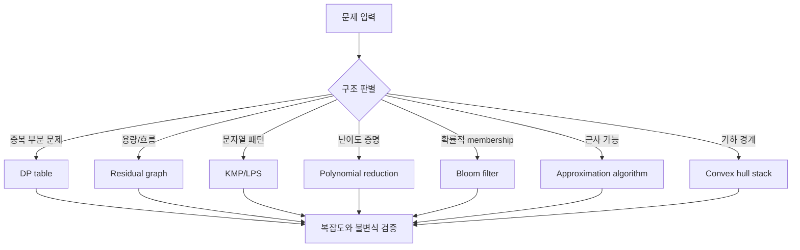
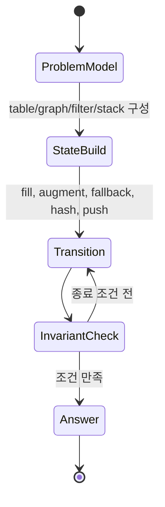

# 알고리즘 CS 레퍼런스 학습 및 기록 노트

## 1. 왜 필요한가? (Pain Point & Motivation)

알고리즘 레퍼런스는 DP, 네트워크 플로우, 문자열 알고리즘, 계산 복잡도, 확률 알고리즘, 근사 알고리즘, 계산기하를 함께 다룬다. 범위가 넓지만 공통 질문은 하나다. "어떤 상태를 저장하고, 어떤 전이를 허용하며, 어떤 불변식을 보존하는가?"

이 문서는 원문 한국어 레퍼런스를 템플릿 구조로 다시 정리해, 문제 유형별로 어떤 알고리즘 도구를 선택해야 하는지 빠르게 복습하기 위한 노트다.

## 2. 현재 나의 상태 (Baseline)

- DP, KMP, max flow, NP-complete, Bloom filter 같은 용어는 알고 있다.
- 0/1 배낭의 `O(NW)`가 입력 bit 수 기준으로 pseudo-polynomial이라는 점을 자주 놓친다.
- 네트워크 플로우에서 residual graph와 backward edge의 의미를 구현과 증명으로 동시에 설명해야 한다.
- 확률 알고리즘의 expected time, false positive, approximation ratio를 구분해야 한다.
- 문제 패턴을 보았을 때 Fenwick tree, segment tree, flow, KMP, DP를 바로 연결하는 훈련이 필요하다.

## 3. 도달하고 싶은 목표 (Target State)

- 문제 구조를 보고 DP, flow, string matching, reduction, randomized algorithm 중 어느 틀인지 판단한다.
- 각 알고리즘의 핵심 상태와 불변식을 한 문장으로 설명한다.
- 근사 알고리즘에서 lower bound와 algorithm output bound를 연결해 근사비를 증명한다.
- 확률 자료구조는 false positive/negative 가능성을 정확히 말한다.
- 계산기하와 competitive programming 패턴도 같은 상태 전이 모델로 읽는다.

## 4. 시스템 번역 (Data Flow)



## 5. 핵심 구성요소 (Building Blocks)

| 구성요소 | 상태 | 핵심 보장 |
| --- | --- | --- |
| DP DAG | 하위 문제와 의존 관계 | 각 상태를 한 번 계산한다. |
| 0/1 Knapsack | item index, capacity | 선택/미선택 전이로 최적값을 보존한다. |
| Residual graph | 남은 capacity와 reverse edge | augmenting path가 없으면 max flow다. |
| Push-relabel | excess와 height | admissible edge로 flow를 밀고 막히면 relabel한다. |
| KMP LPS | prefix/suffix 일치 길이 | text를 재스캔하지 않는다. |
| Suffix array/LCP | 정렬된 suffix index | 반복 문자열 질의를 빠르게 만든다. |
| Polynomial reduction | instance 변환 | 답의 존재 여부를 다항 시간 안에 보존한다. |
| Bloom filter | bit array와 hash 함수 | false negative 없이 membership을 근사한다. |
| Graham scan | polar-sorted point와 stack | convex boundary를 유지한다. |

## 6. 상태 전이 (State Transition)



알고리즘은 반복문이 아니라 상태 전이다. DP는 table을 채우고, max flow는 residual graph를 바꾸며, KMP는 pattern state를 되돌린다.

## 7. 불변식 (Invariant: 절대 깨지면 안 되는 규칙)

- DP는 참조하는 하위 상태가 이미 계산되어 있어야 한다.
- 0/1 knapsack의 1차원 배열은 capacity를 역순으로 순회해야 같은 item 재사용을 막는다.
- Flow는 capacity constraint와 flow conservation을 지켜야 한다.
- Residual graph의 backward edge는 기존 flow를 되돌릴 수 있어야 한다.
- KMP LPS 값은 가장 긴 proper prefix이면서 suffix인 길이를 나타내야 한다.
- Reduction은 yes/no 답을 보존하고 입력 크기를 다항식 안에 유지해야 한다.
- Bloom filter는 insert와 query에서 같은 hash 함수 집합을 써야 한다.
- Approximation proof는 `algorithm cost <= ratio * OPT`를 보여야 한다.
- Convex hull stack은 항상 반시계 boundary 조건을 유지해야 한다.

## 8. 가장 작은 예제 (Minimal Viable Example)

```python
def knapsack_01(items, capacity):
    dp = [0] * (capacity + 1)

    for weight, value in items:
        for current in range(capacity, weight - 1, -1):
            dp[current] = max(dp[current], dp[current - weight] + value)

    return dp[capacity]
```

`current`를 역순으로 순회하는 것이 핵심이다. 정순 순회를 하면 같은 item을 같은 라운드에서 다시 사용해 0/1 배낭이 아니라 unbounded knapsack처럼 동작한다.

## 9. 실패 사례 (What could go wrong?)

- DP 상태 정의에 필요한 정보가 빠지면 전이식이 맞아도 답을 복원할 수 없다.
- Ford-Fulkerson에서 path 선택이 나쁘면 매우 느려지거나 일부 조건에서 종료 문제가 생긴다.
- Push-relabel의 height invariant가 깨지면 admissible edge 판단이 틀린다.
- KMP failure function이 틀리면 match를 건너뛰거나 무한 fallback이 생길 수 있다.
- Bloom filter의 bit 수가 부족하면 false positive rate가 커진다.
- NP-hard를 "무조건 못 푼다"로 이해하면 작은 입력의 exact algorithm, 근사, 휴리스틱 선택지를 놓친다.
- Graham scan에서 collinear point 처리 정책이 없으면 경계 포함 여부가 흔들린다.

## 10. 뇌 확장하기 (Evolution & Variants)

- DP는 top-down memoization, bottom-up table, rolling array, bitmask DP로 확장된다.
- Flow는 Edmonds-Karp, Dinic, push-relabel, min-cost flow로 비교한다.
- 문자열 알고리즘은 KMP, Z-function, Aho-Corasick, suffix array를 질의 유형별로 고른다.
- Complexity는 P/NP 외에 PSPACE, approximation hardness, parameterized complexity로 확장된다.
- Randomized algorithm은 expected time, one-sided error, two-sided error를 분리해 본다.
- Competitive programming에서는 "질의가 무엇인가"가 자료구조 선택을 결정한다.

## 11. 최종 체크리스트 (Definition of Done)

- [x] DP, flow, KMP, complexity, randomized, approximation, geometry 주제를 한 노트로 묶었다.
- [x] 0/1 knapsack의 rolling array 순서 invariant를 최소 예제로 확인했다.
- [x] residual graph와 Bloom filter의 실패 조건을 포함했다.
- [x] 근사 알고리즘의 ratio 증명 관점을 정리했다.
- [x] 원문 한국어 레퍼런스를 12개 섹션 템플릿으로 재작성했다.

## 12. 뇌에 새기는 복습 문장 (TL;DR Blank)

알고리즘을 고르는 일은 이름을 외우는 일이 아니라, 문제의 상태를 어떤 구조에 저장하면 불필요한 계산을 없앨 수 있는지 찾는 일이다.
