# C/C++ 내부: 객체 수명, ABI와 실행 비용

> 다음에서 합성됨: Stroustrup *The C++ 프로그래밍 언어* 4판, Meyers *Effective C++* / *Effective Modern C++*, Lippman *C++ Primer* 5판, comp(9/10/18/22-23/31/43/45/53/57/78/138/198-199/242/303/318/465) C 및 C++ 참조.

## 적용 범위와 검증 단위

- **언어 규칙**은 사용 중인 C 또는 C++ 표준 버전으로 확인한다. 객체 수명, 정의되지 않은 동작, 예외 보장은 이 층에 속한다.
- **ABI와 코드 생성**은 대상 트리플, 호출 규약, 컴파일러 버전, 최적화 플래그에 종속된다. 아래 x86-64 그림은 System V ABI의 전형적인 비최적화 예시이지 고정 레이아웃이 아니다.
- **표준 라이브러리와 할당자**의 성장 정책, 컨테이너 표현, 캐시 비용은 구현과 버전에 따라 달라진다.
- 나노초 단위 수치나 "제로 비용" 판단은 소스만으로 확정하지 않는다. 컴파일 명령, 입력, 하드웨어, 반복 횟수와 생성 어셈블리 또는 프로파일을 증거로 남긴다.

---

## 1. 메모리 모델 — 메모리의 객체 레이아웃

스택 프레임, 동적 저장소, 정적 저장 기간 등 객체가 놓이는 방식을 구분하면 성능 분석과 디버깅의 가정을 명확히 할 수 있습니다. 다만 실제 주소와 프레임 모양은 ABI, 최적화, 인라이닝, 프레임 포인터 생략 여부에 따라 달라집니다.

### 스택 프레임 레이아웃(x86-64 시스템 V ABI)

```
Higher addresses
+------------------------+ ← previous frame's RSP (caller's stack)
| caller's local vars    |
+------------------------+
| return address (8B)    | ← pushed by CALL instruction
+------------------------+
| saved RBP (8B)         | ← PUSH RBP at function entry
+------------------------+ ← RBP points here (frame base)
| local variable a (8B)  | [RBP-8]
| local variable b (4B)  | [RBP-12]
| padding (4B)           | alignment to 16 bytes
+------------------------+
| spilled registers      | callee-saved: RBX, R12-R15
+------------------------+ ← RSP points here during function body
Lower addresses
```

**호출 규칙(System V AMD64 ABI)**:
- 정수/포인터 인수 1-6: `RDI, RSI, RDX, RCX, R8, R9`
- 부동 소수점 인수 1-8: `XMM0–XMM7`
- 반환 값: `RAX`(int/ptr), `XMM0`(float/double)
- 수신자 저장: `RBX, RBP, R12-R15`
- 발신자 저장: `RAX, RCX, RDX, RSI, RDI, R8-R11, XMM0–XMM7`

### 가상 메모리 세그먼트

```
+------------------------+ 0x7FFFFFFFFFFFFFFF (128TB)
| Stack (grows down)     | 8MB default limit (ulimit -s)
| ...                    |
+------------------------+
| mmap region            | shared libs, mmap(), large malloc
| (grows down)           | /usr/lib/libc.so.6 mapped here
+------------------------+
| ...                    |
+------------------------+
| Heap (grows up)        | brk()/mmap() managed by malloc
+------------------------+
| BSS segment            | zero-initialized global/static vars
+------------------------+
| Data segment           | initialized global/static vars
+------------------------+
| Text segment           | executable code (read-only)
+------------------------+ 0x400000 (typical ELF load address)
| NULL guard page        |
+------------------------+ 0x0
```

---

## 2. C++ 개체 모델 — vtable 및 vptr 레이아웃

### 단일 상속 vtable

```c++
class Animal {
    int age;
public:
    virtual void speak();     // slot 0
    virtual void move();      // slot 1
    virtual ~Animal();        // slot 2
};

class Dog : public Animal {
    char name[16];
public:
    void speak() override;    // overrides slot 0
    // move() inherited → slot 1 unchanged
    ~Dog() override;          // overrides slot 2
};
```

```
Dog object in memory:
+--------------------+
| vptr               | → Dog vtable (8 bytes, first field)
+--------------------+
| int age            | (inherited from Animal, 4 bytes)
| [4 bytes padding]  |
+--------------------+
| char name[16]      | (Dog's own data)
+--------------------+

Dog vtable (read-only, in .rodata):
+--------------------+
| offset-to-top = 0  | (RTTI bookkeeping)
+--------------------+
| type_info* Dog     | → typeinfo for Dog
+--------------------+
| &Dog::speak        | slot 0: overridden
+--------------------+
| &Animal::move      | slot 1: inherited
+--------------------+
| &Dog::~Dog         | slot 2: overridden
+--------------------+
```

### 가상 파견 - 조립 수준

```asm
; dog->speak();  compiles to:
mov rax, [rdi]        ; load vptr from dog object (rdi = this)
call [rax + 0]        ; indirect call through vtable slot 0
; compare with direct call (non-virtual):
; call Dog::speak     ; direct, no indirection, inlinable
```

가상 호출 오버헤드: 1개의 메모리 로드(vptr) + 1개의 간접 점프 + 분기 예측 누락(다형성 호출 사이트인 경우). 인라인 비가상 호출의 경우 ~5-10ns 대 ~0-1ns.

### 다중 상속 레이아웃

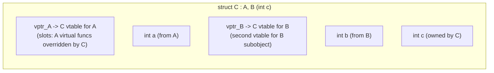

`C*`을 `B*`로 캐스팅할 때 컴파일러는 B 하위 개체를 가리키도록 포인터 조정(원시 포인터에 `sizeof(A)` 추가)을 내보냅니다. 이것이 `static_cast<B*>(c_ptr)` ≠ `reinterpret_cast<B*>(c_ptr)` 이유입니다.

---

## 3. RAII 및 스마트 포인터 내부

### Unique_ptr — 비용이 전혀 들지 않는 추상화

```cpp
template<typename T, typename Deleter = std::default_delete<T>>
class unique_ptr {
    T* ptr;
    [[no_unique_address]] Deleter del;  // EBO: empty base optimization
                                         // sizeof(unique_ptr<T>) == sizeof(T*)
                                         // when Deleter is stateless (default)
public:
    ~unique_ptr() { if(ptr) del(ptr); }
    unique_ptr(unique_ptr&& o) noexcept : ptr(o.ptr), del(std::move(o.del)) {
        o.ptr = nullptr;
    }
    unique_ptr(const unique_ptr&) = delete;  // no copy
};
```

상태 없는 기본 삭제자를 쓰는 `unique_ptr<T>`는 최적화된 빌드에서 원시 포인터와 같은 크기와 유사한 기계어로 낮아지는 경우가 많습니다. 상태 있는 삭제자, 디버그 설정, ABI 경계에서는 표현과 호출 비용이 달라질 수 있으므로 `sizeof`, 생성 어셈블리, 프로파일로 확인합니다.

### shared_ptr — 제어 블록 레이아웃

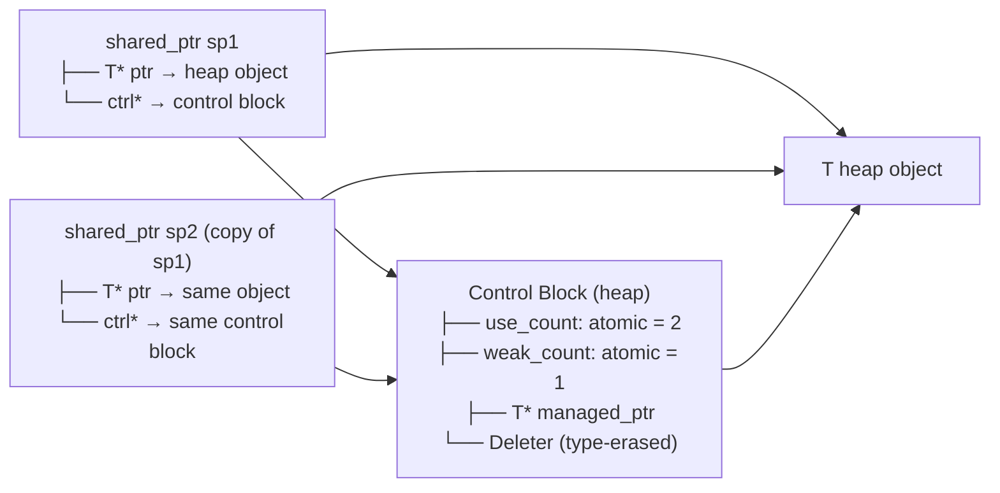

`make_shared<T>(args...)`은 T와 제어 블록 모두에 **하나의 연속 블록**을 할당합니다. → 2 대신 1 할당, 더 나은 캐시 지역성. 절충: T는 마지막 `weak_ptr`이 해제될 때까지 해제되지 않습니다(use_count=0이지만 Weak_count>0은 제어 블록을 활성 상태로 유지합니다).

**원자 참조 계산 비용**: `use_count`은 `std::atomic<int>`을(를) 사용합니다. x86에서 증가/감소 = `LOCK XADD`(원자적 읽기-수정-쓰기). 복사/파괴당 ~5-10ns. 긴밀한 루프를 피하세요. 복사보다 `const shared_ptr&` 전달을 선호하세요.

---

## 4. 이동 의미론 - 값 범주 및 Rvalue 참조

### 가치 카테고리

```
Expression categories:
lvalue:  has identity + not movable     int x; x = 5;  // x is lvalue
xvalue:  has identity + movable         std::move(x)   // cast to xvalue
prvalue: no identity + movable          42, f()        // pure rvalue

lvalue + xvalue = glvalue (has identity)
xvalue + prvalue = rvalue (movable)
```

### 생성자 이동과 복사 — 메모리 경로

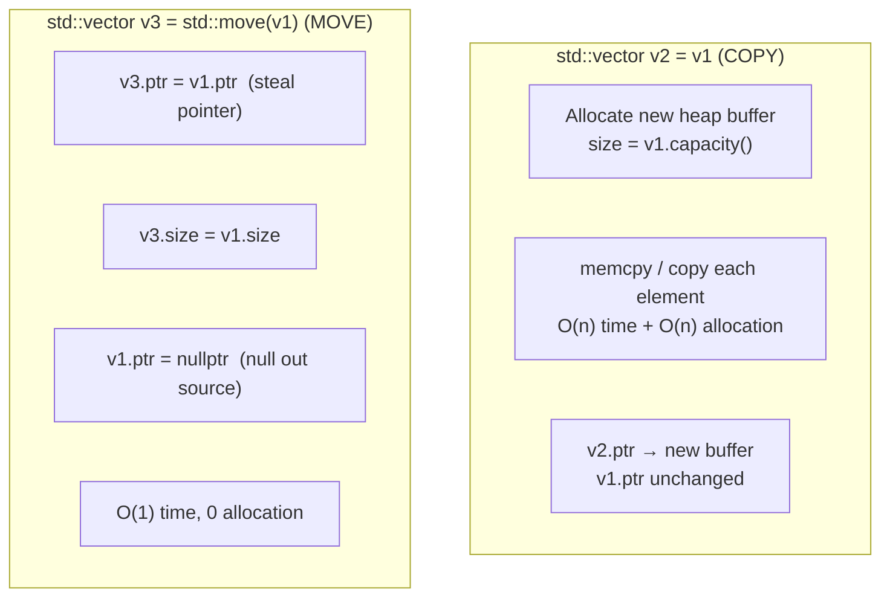

**완벽한 전달**:
```cpp
template<typename T>
void wrapper(T&& arg) {            // T&& = forwarding reference
    inner(std::forward<T>(arg));   // preserves lvalue/rvalue category
}
// If arg is lvalue: T=T&, forward<T&>(arg) → lvalue passed
// If arg is rvalue: T=T,  forward<T>(arg)  → rvalue passed (moved)
```

참조 축소 규칙: `T& &` → `T&`, `T& &&` → `T&`, `T&& &` → `T&`, `T&& &&` → `T&&`.

---

## 5. 템플릿 인스턴스화 및 컴파일 타임 계산

### 템플릿 인스턴스화 모델

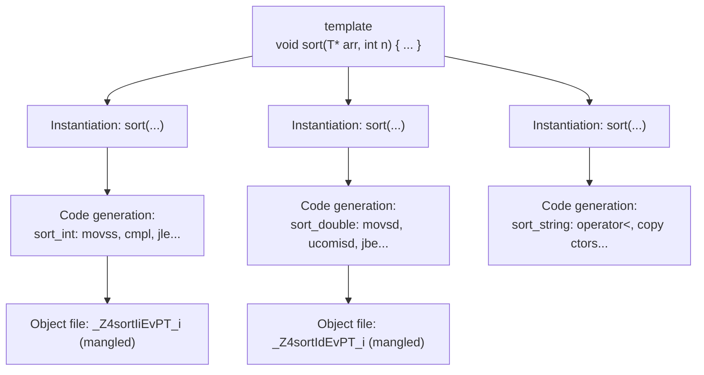

**코드 팽창**: 각 인스턴스화는 전체 기능 본문을 내보냅니다. `std::vector<int>`, `std::vector<double>`, `std::vector<string>` = 3개의 완전히 분리된 컴파일된 구현입니다. 완화: 명시적인 인스턴스화 선언, 유형이 지워진 기본 클래스.

### Constexpr 및 컴파일 타임 평가

```cpp
constexpr uint64_t fibonacci(uint64_t n) {
    if (n <= 1) return n;
    return fibonacci(n-1) + fibonacci(n-2);
}
// At compile time:
constexpr auto fib20 = fibonacci(20);  // = 6765, computed at compile time
// Assembly: mov eax, 6765  (constant folded, zero runtime cost)

// std::array with compile-time size:
template<size_t N>
constexpr std::array<uint64_t, N> make_fib_table() {
    std::array<uint64_t, N> t{};
    t[0]=0; t[1]=1;
    for(size_t i=2; i<N; i++) t[i] = t[i-1]+t[i-2];
    return t;
}
constexpr auto FIB_TABLE = make_fib_table<50>();
// Entire table in .rodata, no runtime computation
```

**템플릿 메타프로그래밍**은 컴파일러의 유형 시스템을 인터프리터로 활용합니다.
```cpp
template<int N> struct Factorial { 
    static constexpr int value = N * Factorial<N-1>::value; 
};
template<> struct Factorial<0> { static constexpr int value = 1; };
// Factorial<10>::value = 3628800 — computed entirely by template instantiation
```

---

## 6. 메모리 할당자 내부 — malloc/free/new/delete

### glibc ptmalloc2 아키텍처

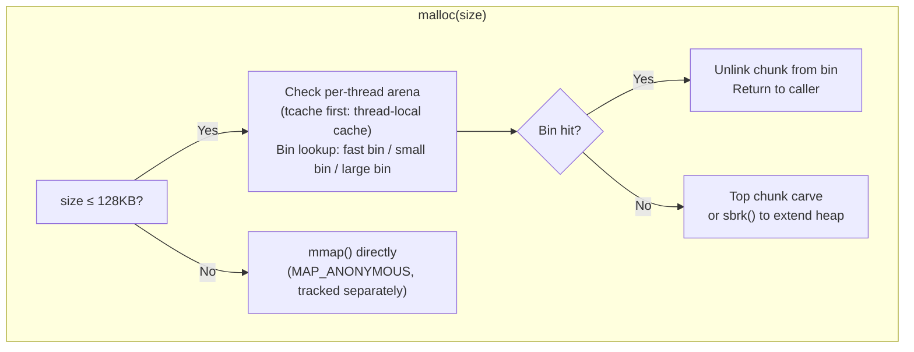

### 청크 레이아웃(glibc malloc)

```
+----------------------+ ← prev chunk end
| PREV_SIZE (8B)       | size of prev chunk (if prev is free)
+----------------------+ ← chunk start (returned ptr - 16)
| SIZE (8B)            | size of THIS chunk | PREV_IN_USE | IS_MMAPED | NON_MAIN
+----------------------+ ← user data pointer (returned by malloc)
| Forward ptr (8B)     | (free chunks only: next free in bin)
| Backward ptr (8B)    | (free chunks only: prev free in bin)
| User data ...        |
+----------------------+
| [next chunk header]  |
```

최소 할당: 32바이트(헤더 16개 + 정렬용 사용자 16명) 요청된 크기는 16바이트 경계로 반올림되었습니다. **해제 후 사용**: `free()`은 fd/bk 포인터를 해제된 메모리에 씁니다. free 후에 읽으면 이러한 손상된 포인터가 표시됩니다.

### tcache (glibc ≥ 2.26) — 스레드-로컬 캐시

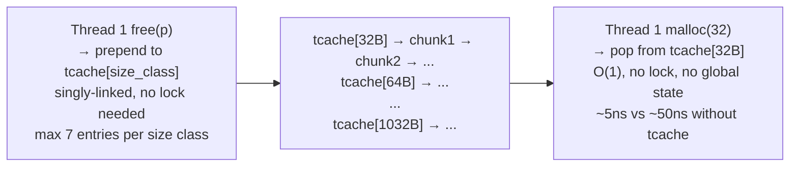

---

## 7. C++ 예외 — 비용이 전혀 들지 않는 예외 처리

### DWARF 해제 테이블(Itanium C++ ABI)

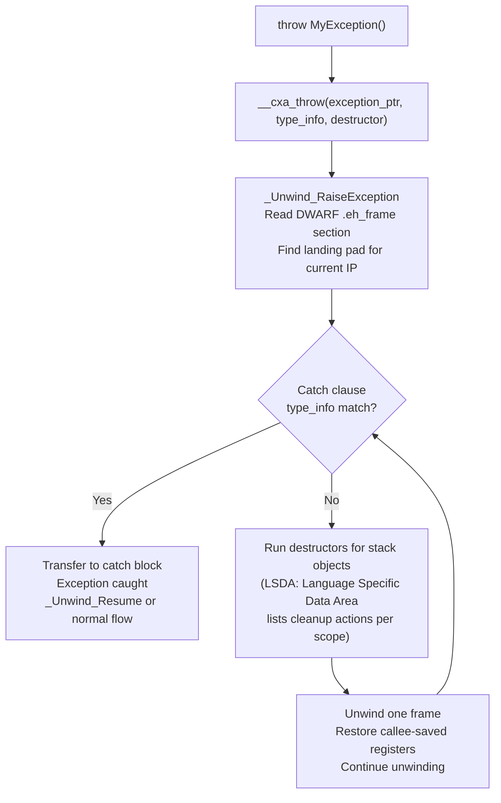

**비용 없음**: Happy 경로에는 오버헤드가 없습니다(시도 없음). `.eh_frame`/`.gcc_except_table` 읽기 전용 섹션에 저장된 예외 테이블입니다. 예외가 발생한 경우에만 지불되는 비용 — ~10,000ns(매우 느림, 정말 예외적인 경로에만 적합)

**RAII + 예외**: 정상적으로 생성이 끝난 자동 객체는 스택 언와인딩 중 역순으로 파괴됩니다. 이것이 `std::unique_ptr`, `std::lock_guard` 같은 RAII 타입이 자원 회수를 구조화하는 이유입니다. 단, 소멸 과정에서 예외가 다시 빠져나오거나 `std::terminate`, 비정상 종료가 발생하는 경로까지 일반적인 언와인딩 보장이 확장되지는 않습니다.

---

## 8. C 메모리 관리 — malloc vs 스택 vs mmap

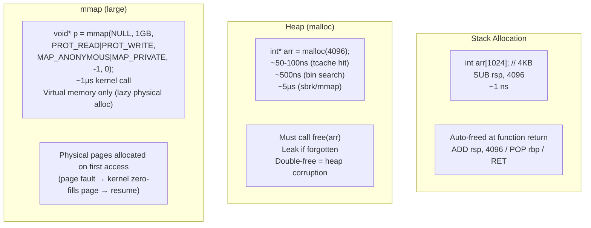

---

## 9. 정의되지 않은 동작 — 실제로 일어나는 일

### 부호 있는 정수 오버플로

```c
int x = INT_MAX;
int y = x + 1;  // UB: signed overflow
// Compiler ASSUMES this never happens → optimizes based on assumption:
// Loop: for(int i = 0; i >= 0; i++) — compiler sees i is always ≥0 (no overflow)
// → removes the loop termination check entirely (infinite loop!)
// -fsanitize=undefined catches this at runtime
```

### 엄격한 앨리어싱 위반

```c
float f = 3.14f;
int* ip = (int*)&f;         // UB: aliasing float through int*
int bits = *ip;             // compiler may return stale cached value
                             // (optimizer assumed float ptr and int ptr don't alias)

// Correct way: memcpy (portable type punning)
int bits2;
memcpy(&bits2, &f, 4);     // well-defined
// Or: __attribute__((may_alias)) (GCC extension)
```

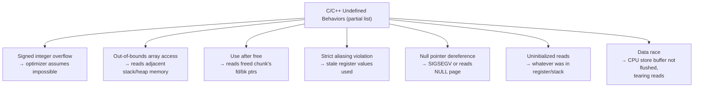

---

## 10. C++ 표준 라이브러리 컨테이너 - 내부 구조

### std::벡터 — 용량 증가

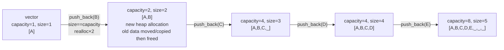

`push_back`의 상각 복잡도는 O(1)이지만 용량 증가 계수는 표준이 규정하지 않는 구현 세부다. `reserve(n)`은 요청 시점에 `n`개 이상을 담을 수 있는 용량을 확보하며, 이후 크기가 그 용량을 넘기 전까지 용량 부족으로 인한 재할당을 피할 수 있다.

### std::unordered_map — 해시 테이블 레이아웃

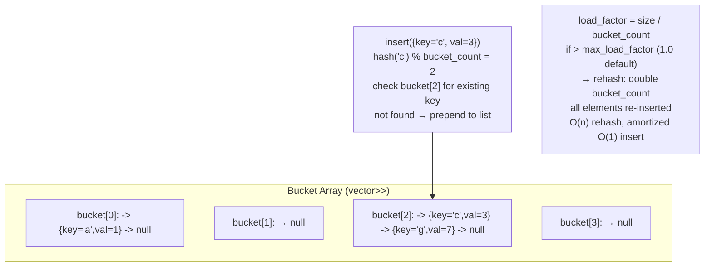

### std::map — 레드-블랙 트리

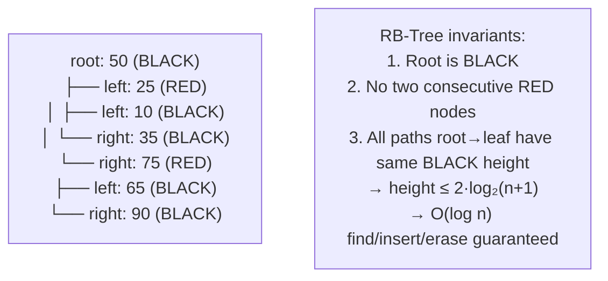

`std::map` 노드 = `std::_Rb_tree_node<pair<const K,V>>`: 포인터 3개(상위, 왼쪽, 오른쪽) + 색상 비트 + 키 + 값. 요소당 오버헤드: 5개의 기계어(40바이트) + 키+값. 순차 액세스의 경우 `std::vector`에 비해 캐시 성능이 낮습니다.

---

## 11. 잠금 없는 프로그래밍 - 메모리 순서 지정

### C++11 메모리 모델

```cpp
std::atomic<int> flag{0};
std::atomic<int> data{0};

// Thread 1 (producer):
data.store(42, std::memory_order_relaxed);    // may reorder
flag.store(1, std::memory_order_release);      // RELEASE: all prior stores visible before this

// Thread 2 (consumer):
while(flag.load(std::memory_order_acquire) == 0) {} // ACQUIRE: no subsequent loads before this
int x = data.load(std::memory_order_relaxed); // guaranteed to see 42
```

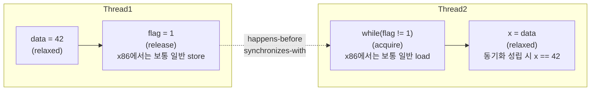

**x86 메모리 모델**은 비교적 강한 순서를 제공하므로 acquire load와 release store가 보통 일반 load/store로 컴파일된다. 그러나 연산 종류와 컴파일러에 따라 `seq_cst` 저장이나 read-modify-write에는 잠금 명령 또는 추가 직렬화 비용이 생길 수 있어 "무료"로 일반화할 수 없다. ARM/POWER에서도 acquire/release 전용 명령을 쓰거나 배리어를 조합하는 방식이 ISA와 컴파일러 버전에 따라 달라진다.

---

## 12. 컴파일 파이프라인 — C++ 소스를 바이너리로

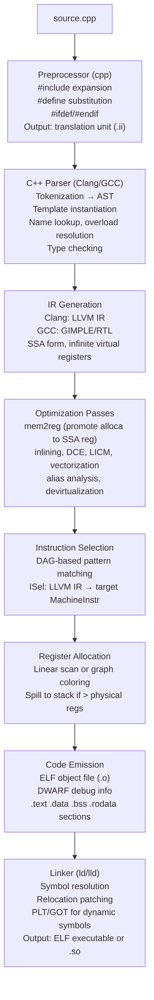

**이름 맹글링**: 과부하 명확성을 위한 유형으로 인코딩된 C++ 기호:
- `void foo(int)` → `_Z3fooi`
- `void foo(double)` → `_Z3food`  
- `Foo::bar(int, float)` → `_ZN3Foo3barEif`
- `extern "C"`은 맹글링을 비활성화합니다(C 상호 운용성의 경우).

---

## 핵심 성과 수치(C++)

| 운영 | 비용 | 메모 |
|-----------|------|-------|
| 스택 할당/해제 | ~1ns | 하위/추가 rsp |
| malloc(tcache 적중) | ~5-10ns | 스레드 로컬, 잠금 없음 |
| malloc(빈 검색) | ~50-100ns | 글로벌 경기장 잠금 |
| malloc(sbrk/mmap) | ~1~5μs | 시스템콜 |
| 가상통화 | ~5-10ns | vptr 로드 + 간접 jmp |
| 인라인 호출 | ~0ns | 인라인 후 오버헤드 없음 |
| shared_ptr 복사 | ~10-20ns | 원자 증가 |
| 예외 던지기 | ~5~50μs | 난쟁이 풀기 |
| 표준::지도 찾기 | O(log n) ~100ns(n=1M) | 캐시에 적합하지 않은 나무 산책 |
| std::unordered_map 찾기 | O(1) ~50-100ns | 해시 + 연결 목록 순회 |
| std::벡터 push_back(상환) | ~2-5ns | 직접 메모리 쓰기 |

---

## 설계적 고민

### 구조와 모델링

#### RAII: 자원 수명을 스코프에 바인딩하는 설계 가치

RAII(Resource Acquisition Is Initialization)는 C++의 가장 강력한 설계 원칙이다. **자원 획득을 객체 초기화와 결합하고, 자원 해제를 소멸자와 결합**한다. 이를 통해 다음을 보장한다:

1. **예외 안전성**: 예외가 발생해도 스택 언와인딩 시 소멸자가 호출되어 자원이 누수되지 않는다.
2. **소유권 명확화**: 자원의 소유자가 명확하여 누가 해제 책임을 지는지 코드로 표현된다.
3. **결정적 해제**: GC 기반 언어와 달리 자원 해제 시점이 예측 가능하다.

C언어에서는 RAII가 없으므로 `malloc/free` 쌍을 수동 관리해야 하며, 이는 메모리 누수와 이중 해제(double-free)의 주요 원인이다. C++의 RAII는 이 문제를 구조적으로 해결한다.

```mermaid
flowchart TD
    subgraph C_STYLE["C 스타일 - 수동 자원 관리"]
        C_ALLOC["malloc/fopen"] --> C_USE["자원 사용"]
        C_USE --> C_ERR{"에러 발생?"}
        C_ERR -->|No| C_FREE["free/fclose"]
        C_ERR -->|Yes| C_LEAK["자원 누수 위험\ngoto cleanup 패턴 필요"]
        C_LEAK --> C_CLEANUP["cleanup:\nfree/fclose"]
    end
    
    subgraph RAII_STYLE["C++ RAII - 자동 자원 관리"]
        RAII_CTOR["생성자에서 자원 획득\nunique_ptr, lock_guard, fstream"] --> RAII_USE["자원 사용"]
        RAII_USE --> RAII_SCOPE{"스코프 종료?"}
        RAII_SCOPE -->|"정상 반환"| RAII_DTOR["소멸자 자동 호출\n자원 해제 보장"]
        RAII_SCOPE -->|"예외 발생"| RAII_UNWIND["스택 언와인딩\n소멸자 자동 호출\n자원 누수 없음"]
    end
    
    C_STYLE -.->|"수동 관리\n실수 가능"| RAII_STYLE
    RAII_STYLE -.->|"언어 규칙으로\n정상 경로와 언와인딩 정리"| SAFE["명시적 소유권\n비용은 구현과 측정으로 확인"]
```

#### 스마트 포인터 선택 결정 트리

C++11의 스마트 포인터는 소유권 모델을 타입 시스템으로 표현한다. 올바른 선택을 위한 결정 트리는 다음과 같다:

- **`unique_ptr`**: 단독 소유권. 복사 불가, 이동만 가능. 가장 가벼운 스마트 포인터로 대부분의 경우 기본 선택이다. 팔 크기 오버헤드가 없다(deleter가 상태 없을 때).
- **`shared_ptr`**: 공유 소유권. 참조 카운팅 기반으로 마지막 소유자가 사라질 때 자원 해제. 원자적 연산 오버헤드와 컨트롤 블록(control block) 할당 비용이 있다.
- **`weak_ptr`**: `shared_ptr`의 순환 참조 방지. 소유권을 증가시키지 않고 관찰만 한다. 캠시, 관찰자 패턴, 트리 구조의 부모 참조에 사용한다.

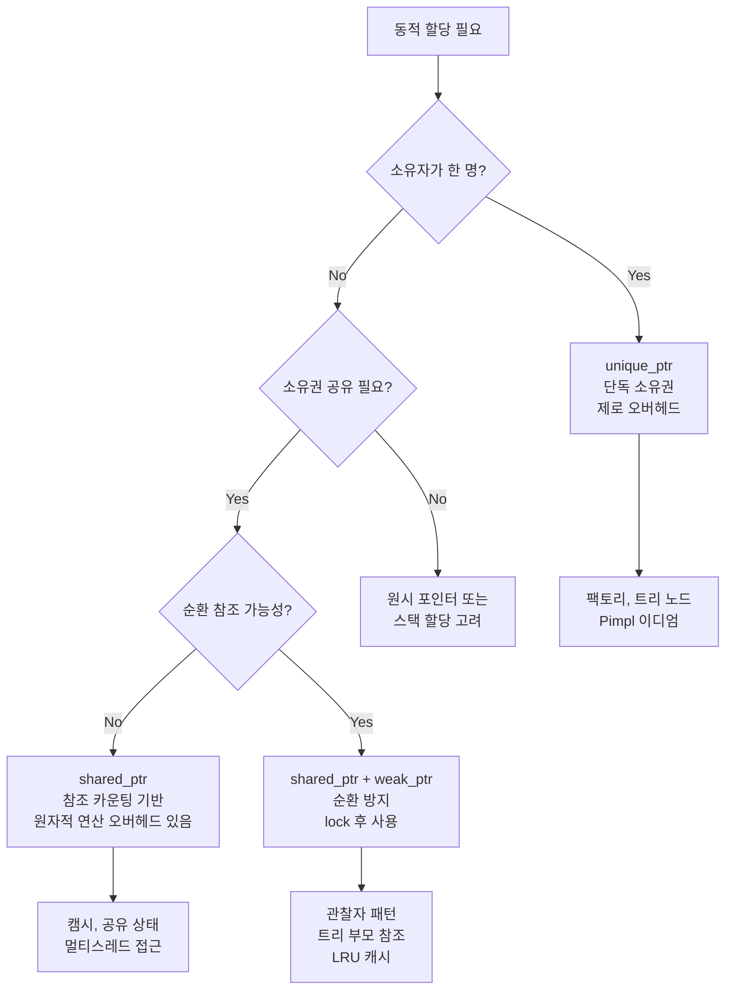

### 트레이드오프와 의사결정

#### 이동 의미론(Move Semantics): 복사 비용 제거와 소유권 명확화

C++11의 이동 의미론은 불필요한 깊은 복사(deep copy)를 제거하여 성능을 향상시키는 동시에 **소유권 이전**의 의도를 명확히 표현한다.

**설계 트레이드오프**:
- **복사(copy)**: 안전하지만 비용이 크다. `std::vector`의 복사는 모든 요소를 새 메모리에 복제한다.
- **이동(move)**: 이동 후 원본은 유효하지만 값은 해당 타입의 계약에 따라 달라진다. 포인터를 소유한 표준 컨테이너의 일반적인 이동은 상수 시간일 수 있지만, 사용자 정의 타입, 할당자 조건, 작은 버퍼 최적화에 따라 요소 단위 이동이 필요할 수 있다.

**예외 처리 vs 에러 코드** 선택도 중요한 트레이드오프이다:

| 기준 | C++ 예외 (throw/catch) | 에러 코드 (int/enum) |
|------|----------------------|---------------------|
| 정상 경로 비용 | 거의 제로 (제로 비용 예외) | 매 호출 시 검사 비용 |
| 예외 경로 비용 | 매우 높음 (DWARF unwind) | 고정 비용 |
| 코드 가독성 | 높음 (happy path 중심) | 낮음 (if 체크 반복) |
| 실시간 시스템 | 부적합 (비결정적 시간) | 적합 (예측 가능한 시간) |
| 현대 C++ 추세 | std::expected (C++23) | 계속 사용 |

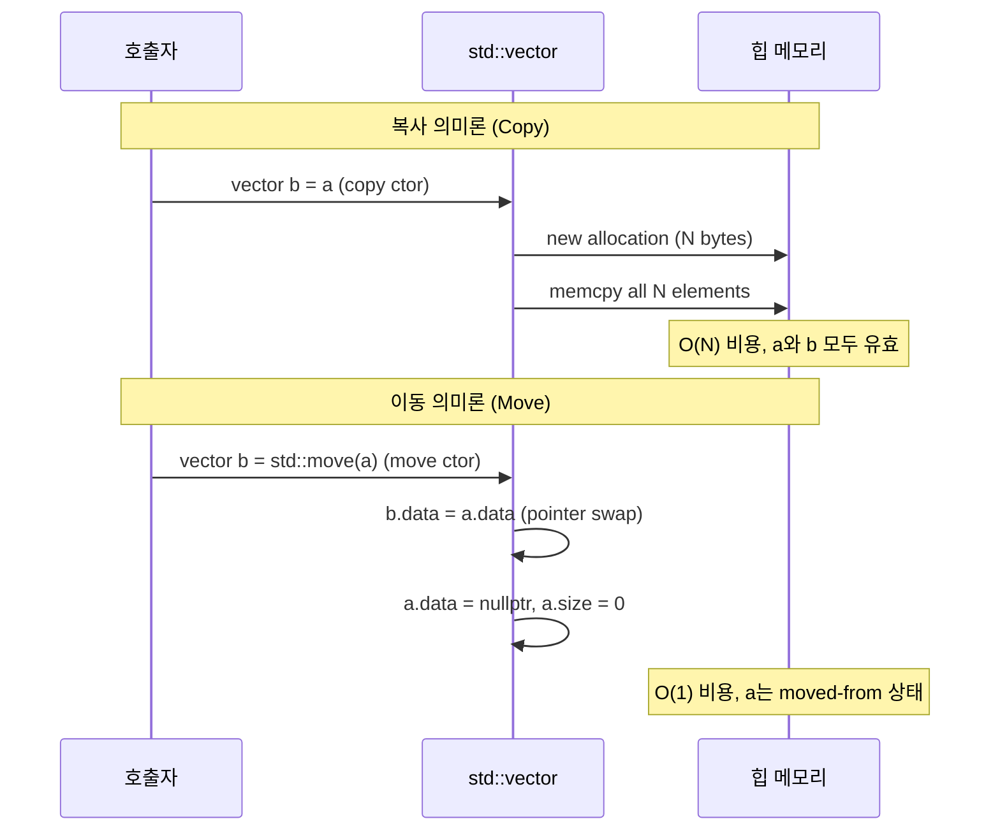

#### 템플릿 메타프로그래밍: 컴파일 타임 vs 런타임 연산

템플릿 메타프로그래밍(TMP)은 컴파일 타임에 계산을 수행하여 런타임 비용을 제거한다. C++20의 `consteval`과 `concepts`는 TMP를 더 접근 가능하게 만들었다.

| 기준 | 템플릿/constexpr | 런타임 계산 |
|------|------------------|------------|
| 실행 시점 | 컴파일 타임 | 런타임 |
| 런타임 비용 | 제로 | 정상 |
| 컴파일 시간 | 증가 | 정상 |
| 디버깅 | 매우 어려움 | 쉽음 |
| 에러 메시지 | 난해 (C++20 concepts로 개선) | 명확 |

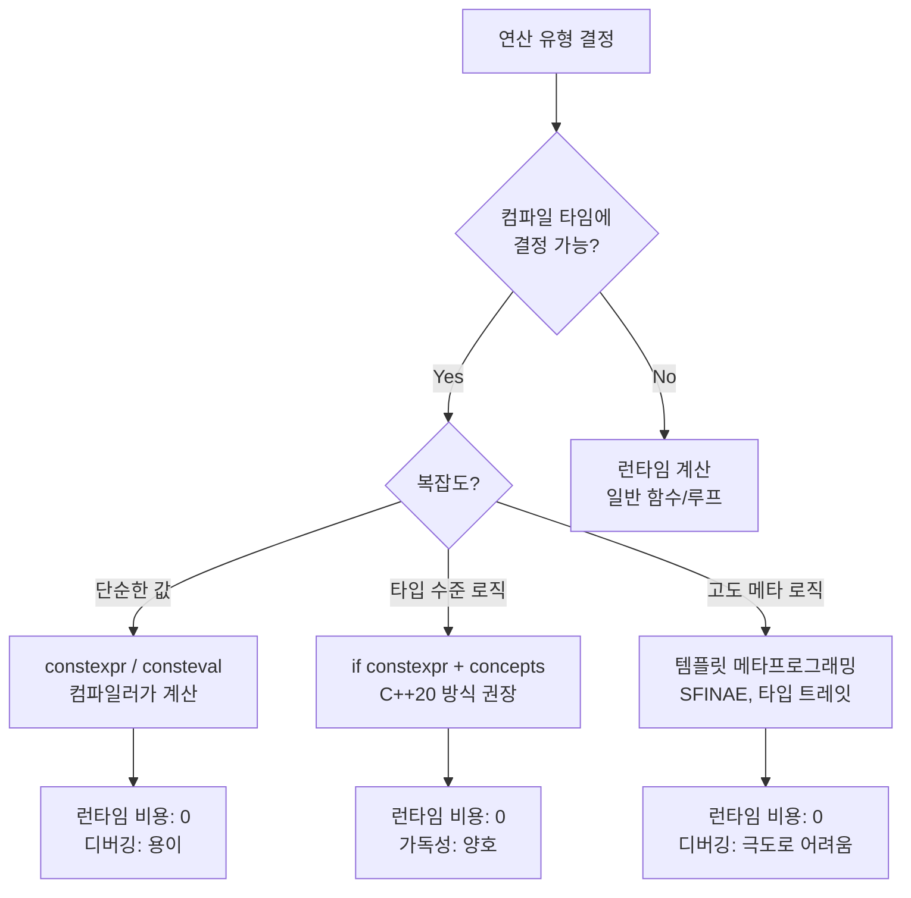

### 리팩토링과 설계 원칙

#### 예외 안전성 보장 수준과 설계 기준

C++의 예외 안전성은 세 가지 수준으로 분류된다. 코드를 작성할 때 각 함수가 어떤 수준의 보장을 제공하는지 명확히 문서화해야 한다.

1. **기본 보장(Basic Guarantee)**: 예외 발생 시 자원 누수 없음. 객체는 유효하지만 상태가 변경될 수 있다.
2. **강력한 보장(Strong Guarantee)**: 예외 발생 시 상태가 원래대로 되돌아간다 (commit-or-rollback). `copy-and-swap` 이디엄으로 구현한다.
3. **무예외 보장(Nothrow Guarantee)**: 예외를 절대 던지지 않는다. `noexcept` 지정. 소멸자, 이동 생성자, swap은 반드시 이 수준이어야 한다.

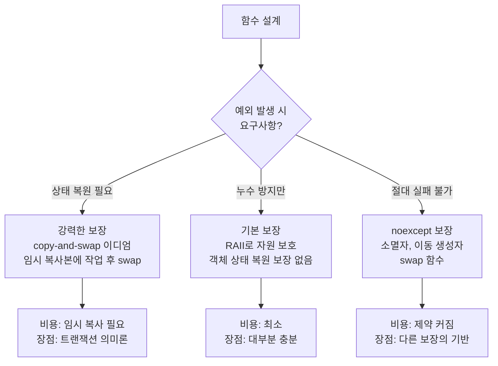

### 디자인 패턴 적용

#### C++ 표준 라이브러리와 시스템 설계에서 발견되는 패턴들

C++의 언어 기능과 표준 라이브러리에는 다양한 디자인 패턴이 녹아 있다:

- **RAII 가드(Scope Guard)**: `lock_guard`, `unique_lock`, `fstream`은 모두 RAII 패턴의 구현체다. 생성자에서 자원 획득, 소멸자에서 해제를 보장한다.
- **Pimpl 이디엄(Bridge 패턴)**: 구현 세부를 `unique_ptr<Impl>`로 숨겨 컴파일 의존성을 줄인다. ABI 안정성을 확보하고 컴파일 시간을 단축한다.
- **CRTP(Curiously Recurring Template Pattern)**: 정적 다형성. `class Derived : public Base<Derived>`로 가상 함수 호출 없이 다형성을 구현한다. vtable 오버헤드를 제거한다.
- **팅탉 패턴(Mixin via Templates)**: 다중 상속 없이 기능을 조합한다. 정책(policy) 클래스를 템플릿 파라미터로 전달하여 컴파일 타임에 행동을 결정한다.
- **방문자 패턴(Visitor via std::variant + std::visit)**: C++17의 `std::variant`와 `std::visit`를 사용하면 타입 안전한 방문자 패턴을 구현할 수 있다.

```mermaid
classDiagram
    class Widget {
        -pImpl: unique_ptr~WidgetImpl~
        +Widget()
        +~Widget()
        +doWork() void
    }
    
    class WidgetImpl {
        -data: vector~int~
        -cache: unordered_map
        +doWorkImpl() void
    }
    
    class LockGuard {
        -mutex_ref: mutex&
        +LockGuard(m: mutex&)
        +~LockGuard()
    }
    
    class UniquePtr~T~ {
        -ptr: T*
        +UniquePtr(raw: T*)
        +~UniquePtr()
        +operator->() T*
        +release() T*
        +reset(p: T*) void
    }
    
    Widget --> WidgetImpl: Pimpl 이디엄\n컴파일 방화벽\nABI 안정성
    Widget --> UniquePtr~WidgetImpl~: RAII 소유권\n자동 해제 보장
    LockGuard --> LockGuard: RAII 가드\n스코프 종료 시 자동 unlock


## 연습 문제

### 1. 시스템 구조와 모델링

**문제 1.** 대형 게임 엔진 팀이 캐릭터 AI 컴포넌트를 설계하고 있다. 기획자는 `CharacterAI` 클래스가 `Pathfinding`, `CombatBehavior`, `DialogueSystem`의 기능을 모두 갖추길 원한다. 한 개발자는 세 클래스를 모두 상속받는 다중 상속을 제안했고, 다른 개발자는 각 기능을 멤버 객체로 구성(Composition)하자고 했다. 두 접근의 구조적 차이를 분석하고, 다이아몬드 상속 문제가 발생하는 시나리오를 구체적으로 설명하라.

<details>
<summary>힌트 보기</summary>

- C++ 다중 상속 시 `virtual` 상속과 vtable 구조 변화를 고려하라
- 다이아몬드 문제: A → B, A → C, D → B+C 구조에서 A의 인스턴스가 2개 생기는 이유
- Composition의 경우 각 컴포넌트의 생명주기가 독립적으로 관리됨을 분석하라
- `has-a` vs `is-a` 관계가 설계 선택에 어떤 영향을 미치는지 생각해보라

</details>

**문제 2.** 임베디드 시스템 팀이 센서 데이터 처리 라이브러리를 작성하고 있다. 팀원 A는 모든 처리 함수를 전역 함수로 작성했고, 팀원 B는 `SensorProcessor` 클래스에 정적/인스턴스 메서드로 캡슐화했다. 팀원 C는 네임스페이스로 전역 함수들을 구조화했다. 세 가지 방식이 **스택/힙 메모리**, **링크 단위(translation unit)**, **ODR(One Definition Rule)** 관점에서 어떻게 다른지 비교하라.

<details>
<summary>힌트 보기</summary>

- 전역 함수는 BSS/data 세그먼트, 클래스 인스턴스는 스택 또는 힙에 위치
- 정적 멤버 함수는 `this` 포인터 없이 호출 가능 — 실질적으로 전역 함수와 같은 어셈블리 생성
- 네임스페이스는 이름 충돌 방지이지 캡슐화가 아님 (내부 상태 없음)
- ODR: 동일 정의가 여러 TU에 존재할 때의 문제, `inline`과 `static` 키워드의 역할

</details>

**문제 3.** 네트워크 라이브러리에서 `Buffer` 클래스가 힙 메모리를 관리한다. 복사 생성자와 이동 생성자를 모두 정의했는데, `std::vector<Buffer>` 에 push_back 시 성능 프로파일러가 예상보다 많은 복사가 발생한다고 보고했다. RAII, 이동 시맨틱, `noexcept` 선언이 어떻게 상호작용하는지 분석하고, 문제의 근본 원인을 설명하라.

<details>
<summary>힌트 보기</summary>

- `std::vector` 재할당 시 이동 생성자를 사용하려면 반드시 `noexcept` 선언 필요
- `noexcept` 없는 이동 생성자는 강한 예외 보증을 깨뜨릴 수 있어 `std::move_if_noexcept`가 복사를 선택
- Rule of Five: 소멸자/복사생성자/이동생성자/복사대입/이동대입 중 하나 정의 시 나머지도 명시적으로 관리 필요

</details>

### 2. 트레이드오프와 의사결정

**문제 4.** 실시간 음성 처리 시스템에서 10ms마다 오디오 버퍼를 처리해야 한다. 팀은 `std::shared_ptr`를 사용한 자동 메모리 관리와 원시 포인터(raw pointer) + 수동 관리 중 선택해야 한다. 레퍼런스 카운팅의 원자적 연산이 10ms 실시간 요구사항에 미치는 영향을 분석하고, 이 맥락에서 어떤 선택이 적합한지 근거를 제시하라.

<details>
<summary>힌트 보기</summary>

- `shared_ptr` 복사/해제 시 `std::atomic` 증감 발생 — 멀티코어에서 캐시 라인 경쟁 유발 가능
- 실시간 시스템에서는 메모리 할당/해제 자체도 비결정론적 (힙 단편화, OS 개입)
- 대안: 커스텀 풀 할당자(pool allocator) + `unique_ptr` 또는 `arena allocator`
- 안전성(메모리 누수 방지) vs 예측 가능한 지연 시간(determinism) 트레이드오프 고려

</details>

**문제 5.** 고성능 시뮬레이션 프레임워크에서 `update()` 가 매 프레임 10,000번 호출되는 `Entity` 클래스 계층이 있다. 현재 가상 함수(virtual)를 사용한 다형성 구조인데 프로파일러가 vtable 간접 참조로 인한 캐시 미스를 지적했다. CRTP(Curiously Recurring Template Pattern)를 적용한 정적 다형성으로 전환하면 어떤 이점과 비용이 발생하는지 설계 관점에서 평가하라.

<details>
<summary>힌트 보기</summary>

- vtable 간접 참조: `entity->update()` → vtable 조회 → 실제 함수 → 컴파일러가 인라인 불가
- CRTP: `template<typename Derived> class Base { void update() { static_cast<Derived*>(this)->updateImpl(); } }` — 컴파일 타임 결정
- CRTP의 비용: 각 파생 클래스마다 별도 타입 인스턴스화 → 코드 크기 증가 (code bloat)
- 런타임 다형성(heterogeneous container)이 필요한 경우 CRTP 단독으로는 한계

</details>

**문제 6.** 멀티스레드 서버 애플리케이션에서 공유 설정(config) 객체에 빈번한 읽기와 가끔씩의 쓰기가 발생한다. 팀은 `std::mutex`, `std::shared_mutex`, lock-free 원자적 참조(atomic reference) 세 가지 동기화 전략을 검토 중이다. 각 전략의 읽기/쓰기 성능, 기아 현상(starvation), 구현 복잡도를 비교하고 이 시나리오에 가장 적합한 선택을 제안하라.

<details>
<summary>힌트 보기</summary>

- `std::mutex`: 읽기도 exclusive lock — 동시 읽기 불가로 병목 발생
- `std::shared_mutex`: 다수 동시 읽기(shared_lock) + 단독 쓰기(unique_lock) — 읽기 많은 경우 적합
- 작가 기아(writer starvation): 지속적 읽기로 쓰기 잠금이 계속 밀리는 현상
- lock-free atomic: `std::atomic<std::shared_ptr<Config>>` — 가장 낮은 지연이지만 ABA 문제 고려

</details>

### 3. 문제 해결 및 리팩토링

**문제 7.** 다음 코드에서 메모리 안전 문제를 찾아라. 레거시 C++ 코드베이스에서 발견된 함수다:
```cpp
std::string* processData(const char* input) {
    std::string* result = new std::string(input);
    if (result->empty()) {
        return nullptr;  // 메모리 누수
    }
    transform(result);  // 예외 가능성
    return result;
}
```
이 코드의 문제점을 모두 식별하고, 현대 C++ 관용구(idiom)로 완전히 재작성하라.

<details>
<summary>힌트 보기</summary>

- `result->empty()` 분기에서 `new`로 할당한 메모리를 `delete` 없이 `nullptr` 반환 → 누수
- `transform(result)` 예외 발생 시 `result` 메모리 해제 없음 → 예외 안전성 위반
- 수정 방향: `std::unique_ptr<std::string>` 또는 `std::optional<std::string>` 반환
- 더 나아가 값으로 반환 + NRVO 최적화 활용 (`std::string` 직접 반환)

</details>

**문제 8.** 신입 개발자가 다음과 같이 작성한 템플릿 코드가 특정 타입에서 링크 오류를 발생시킨다:
```cpp
// math.h
template<typename T>
T square(T x);

// math.cpp
template<typename T>
T square(T x) { return x * x; }
```
`square<double>` 호출 시 링크 오류가 발생하는 이유를 C++ 템플릿 인스턴스화 모델 관점에서 설명하고, 세 가지 해결 방법을 제시하라.

<details>
<summary>힌트 보기</summary>

- 템플릿은 컴파일 타임에 인스턴스화됨 → 정의가 같은 TU(Translation Unit)에 있어야 함
- `math.cpp`에서만 정의 → 다른 TU에서 `square<double>` 호출 시 인스턴스화 불가
- 해결 1: 헤더에 전체 정의 포함 (가장 일반적)
- 해결 2: `math.cpp`에 명시적 인스턴스화 `template double square<double>(double);`
- 해결 3: `export` 모듈 (C++20)

</details>

**문제 9.** 대규모 C++ 프로젝트에서 빌드 시간이 45분으로 증가했다. 코드 분석 결과 헤더 파일에 과도한 `#include`가 있고, 일부 클래스는 완전한 타입 대신 전방 선언(forward declaration)으로 충분한 곳에도 헤더를 포함하고 있었다. Pimpl 이디엄이 어떻게 빌드 시간을 줄이는지 설명하고, 어떤 상황에서 Pimpl 적용이 오히려 역효과를 낳는지도 논하라.

<details>
<summary>힌트 보기</summary>

- Pimpl: 구현 세부사항을 별도 `.cpp`로 이동 → 공개 헤더에서 `#include` 제거 → 의존 파일 재컴파일 감소
- 전방 선언 가능 조건: 포인터나 참조만 사용하는 경우, 크기/멤버 접근 불필요한 경우
- 역효과: 힙 할당 강제 (스택 할당 불가) → 캐시 미스 증가, 함수 호출당 포인터 역참조 오버헤드
- 언제 부적합: 내부 타입이 자주 노출되어야 하는 경우, 성능 임계 컴포넌트

</details>

### 4. 개념 간의 연결성

**문제 10.** 현대 JIT 컴파일러(JVM, V8)는 핫 코드를 기계어로 컴파일할 때 C++ 컴파일러처럼 인라인 확장과 상수 전파를 수행한다. C++ `constexpr`/`inline` 최적화와 JIT 인라인의 근본적 차이는 무엇이며, C++의 템플릿 메타프로그래밍이 JIT 최적화와 어떤 공통 목표를 공유하는지 설명하라.

<details>
<summary>힌트 보기</summary>

- C++ 컴파일 타임: 타입 정보 완전 가용, 인라인 결정 정적 → 바이너리 크기 대가
- JIT: 런타임 프로파일 기반 최적화 → 실제 실행 경로 특화 가능 (adaptive optimization)
- 공통 목표: 간접 참조(indirection) 제거, 반복 계산 컴파일 타임으로 이동
- 차이: C++는 모든 타입에 대한 인스턴스화 필요 vs JIT는 실제 관찰된 타입만 최적화

</details>

**문제 11.** Rust의 소유권 시스템과 C++의 RAII/스마트 포인터는 모두 메모리 안전을 목표로 한다. 그러나 C++ 코드베이스에서 여전히 `use-after-free`와 `double-free` 버그가 발생한다. 두 언어의 메모리 안전 메커니즘이 **컴파일러 보증** 관점에서 어떻게 다른지 분석하고, C++에서 Rust 수준의 보증을 달성하기 어려운 근본 이유를 설명하라.

<details>
<summary>힌트 보기</summary>

- Rust borrow checker: 컴파일 타임에 소유권/생명주기를 완전히 추적 — 런타임 오버헤드 제로
- C++ `unique_ptr`: 소유권 이동을 표현하지만 컴파일러가 강제하지 않음 (여전히 `get()` 노출, 수동 raw ptr 혼용 가능)
- C++의 근본 한계: 기존 C 코드와의 호환성 유지, `void*` 캐스팅, 산술 포인터
- Rust의 비용: 학습 곡선, FFI 경계에서의 unsafe 블록

</details>

**문제 12.** 운영체제 커널 개발자가 C++ 예외(`try/catch`)를 사용하지 않고 에러 처리를 설계해야 한다. `errno` 기반 C 스타일, `std::expected<T,E>` (C++23), 커스텀 `Result<T,E>` 타입 세 가지 접근을 비교하고, 커널 컨텍스트에서 예외 메커니즘이 금지되는 기술적 이유를 설명하라.

<details>
<summary>힌트 보기</summary>

- C++ 예외: 스택 언와인딩을 위한 런타임 지원(`libgcc_s`, DWARF 메타데이터) 필요 → 커널 환경 부적합
- `errno`: 스레드 로컬 전역 변수 — 망각 가능, 체인 불가
- `std::expected<T,E>`: 함수형 에러 전파 (`and_then`, `transform`), 타입 시스템에 에러 표현 내재
- 커널에서 예외 금지 이유: 인터럽트 핸들러, NMI 컨텍스트에서 스택 언와인딩 불가능

</details>
