# 클라우드 및 AWS 내부: 하이퍼바이저, 가상 네트워크 및 관리형 서비스

> 내부 내용: 공개된 AWS 자료와 일반적인 분산 시스템 모델을 바탕으로 EC2, S3, VPC, Lambda의 동작을 설명합니다. 공개되지 않은 구현 세부는 확정된 사실처럼 다루지 않습니다.

## 적용 범위와 확인 항목

- 서비스 한도, 가격, 할인율, 지원 기능은 리전과 계정, 구매 옵션, 확인 날짜에 따라 달라진다. 설계 승인 전 AWS 공식 문서와 Service Quotas에서 다시 확인한다.
- `최대`, `무제한`, `최적` 대신 요구 처리량, 지연시간 백분위, 내구성 목표, RTO/RPO, 월 비용 상한을 수치로 적는다.
- 아키텍처 선택에는 정상 경로뿐 아니라 재시도, 중복 이벤트, 부분 실패, 리전 장애, 할당량 초과 시 동작을 포함한다.
- 성능·비용 예시는 비교 출발점이다. 같은 리전과 워크로드로 부하 시험하고 Cost Explorer 또는 CUR의 실제 사용량으로 결론을 갱신한다.

---

## 1. 하이퍼바이저 아키텍처: Nitro의 EC2

AWS Nitro System은 경량 하이퍼바이저와 전용 카드 등 여러 구성 요소로 가상화, I/O, 보안 기능을 분리한다. 카드 구성과 제공 기능은 인스턴스 세대에 따라 달라지므로 아래 그림은 개념 모델로 읽는다.

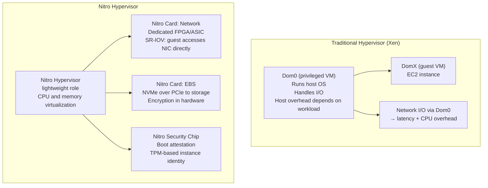

### Nitro의 VM 부팅 순서

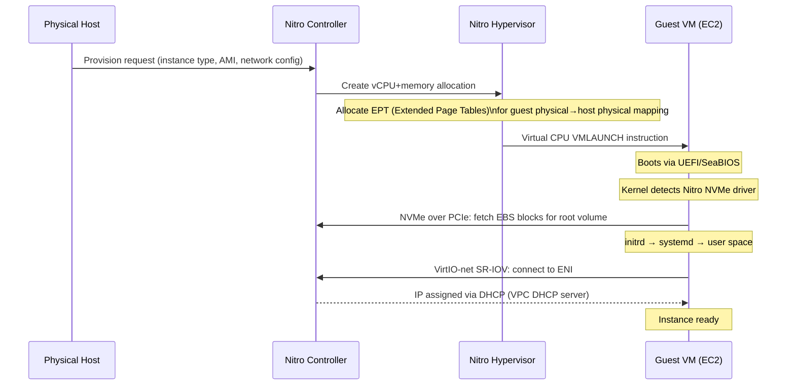

---

## 2. VPC 네트워크 아키텍처: 가상 스위치 및 라우팅

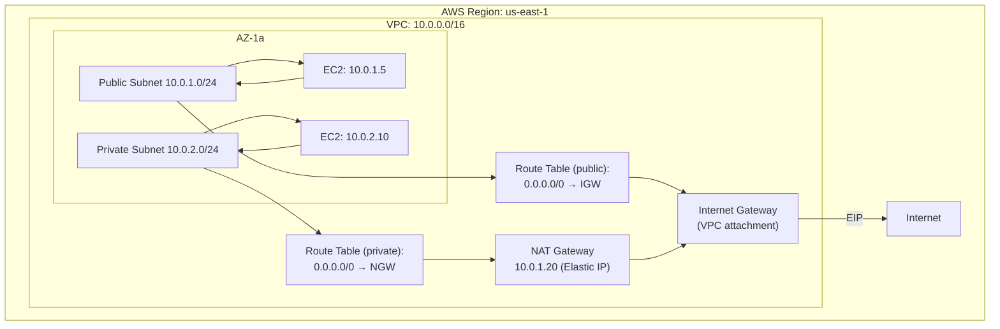

### 패킷 흐름: EC2에서 인터넷으로

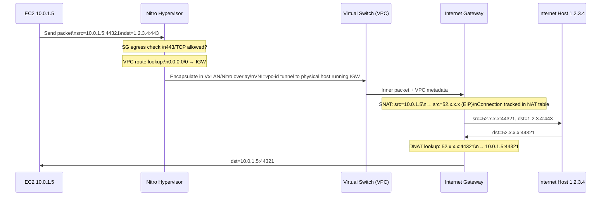

### 보안 그룹: 상태 저장 패킷 검사

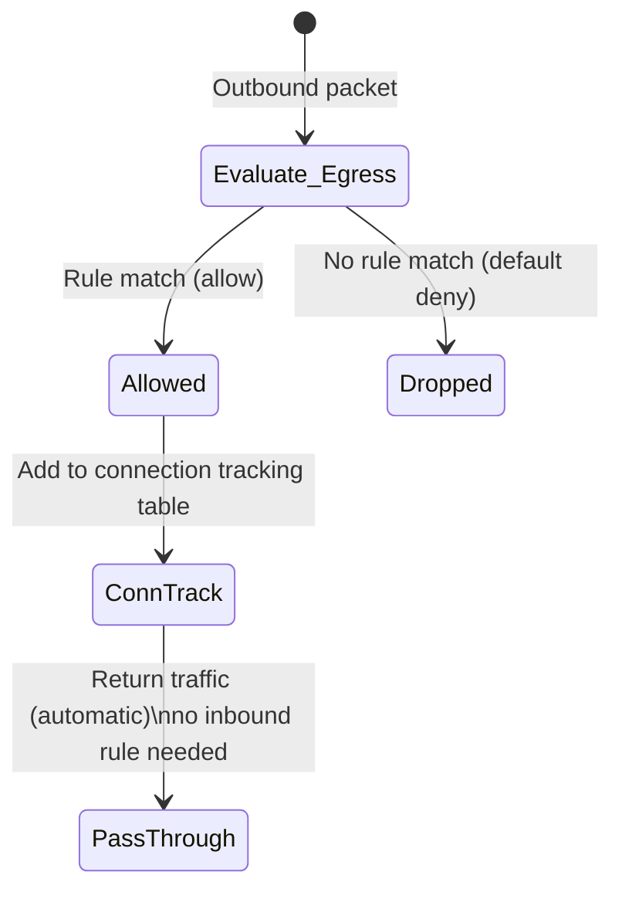

SG는 **상태 저장**(Nitro 하이퍼바이저의 Linux conntrack 테이블을 통한 연결 추적) — 인바운드 규칙은 반환 트래픽이 아닌 새 연결에 대해서만 확인됩니다.

---

## 3. S3 내부: 개체 스토리지 아키텍처

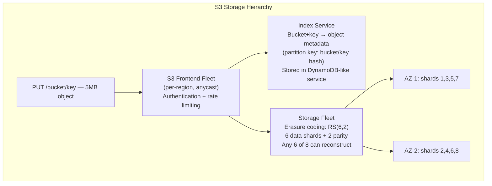

### 리드 솔로몬 삭제 코딩(RS 6+2)

S3는 객체를 6개의 데이터 청크로 분할하고 GF(2⁸)를 통한 리드 솔로몬 코딩을 사용하여 2개의 패리티 청크를 계산합니다.

```
Object → [d1, d2, d3, d4, d5, d6]  (data chunks)
         [p1, p2]                   (parity: p_i = linear combination of d_j over GF(2⁸))

Reconstruction: Any 6 of 8 shards sufficient.
               Solve system of linear equations over GF(2⁸)
               Tolerates: 2 simultaneous shard failures = 2 AZ failures
```

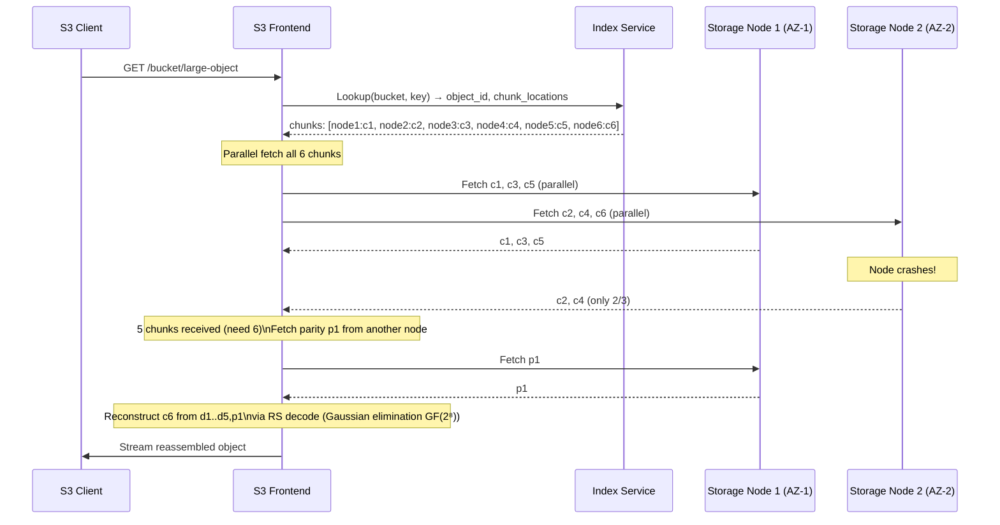

### S3 일관성 모델

2020년 12월부터 S3는 모든 작업에 대해 **강력한 쓰기 후 읽기 일관성**을 제공합니다. 내부적으로 이는 직렬화 가능한 메타데이터 저장소를 사용하는 인덱스 서비스에 의해 달성됩니다. PUT 후 GET은 보장된 새 객체를 확인합니다(이전에는 덮어쓰기에 대해 최종 일관성만 유지).

---

## 4. Lambda 콜드 스타트 내부

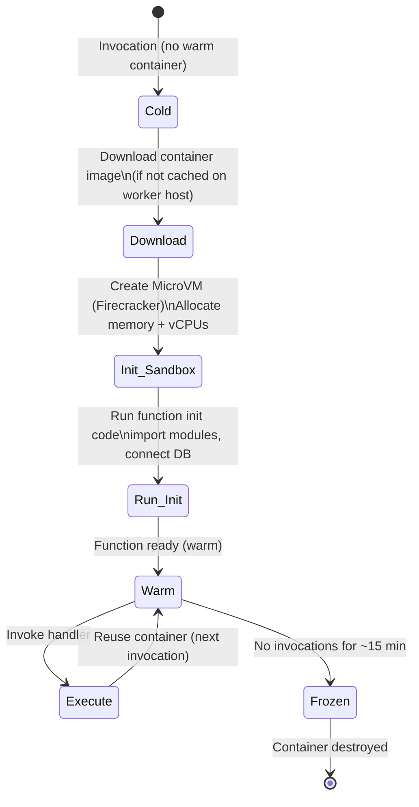

### 폭죽 MicroVM

AWS Lambda는 **Firecracker**(오픈 소스 KVM 기반 microVM)를 사용합니다.

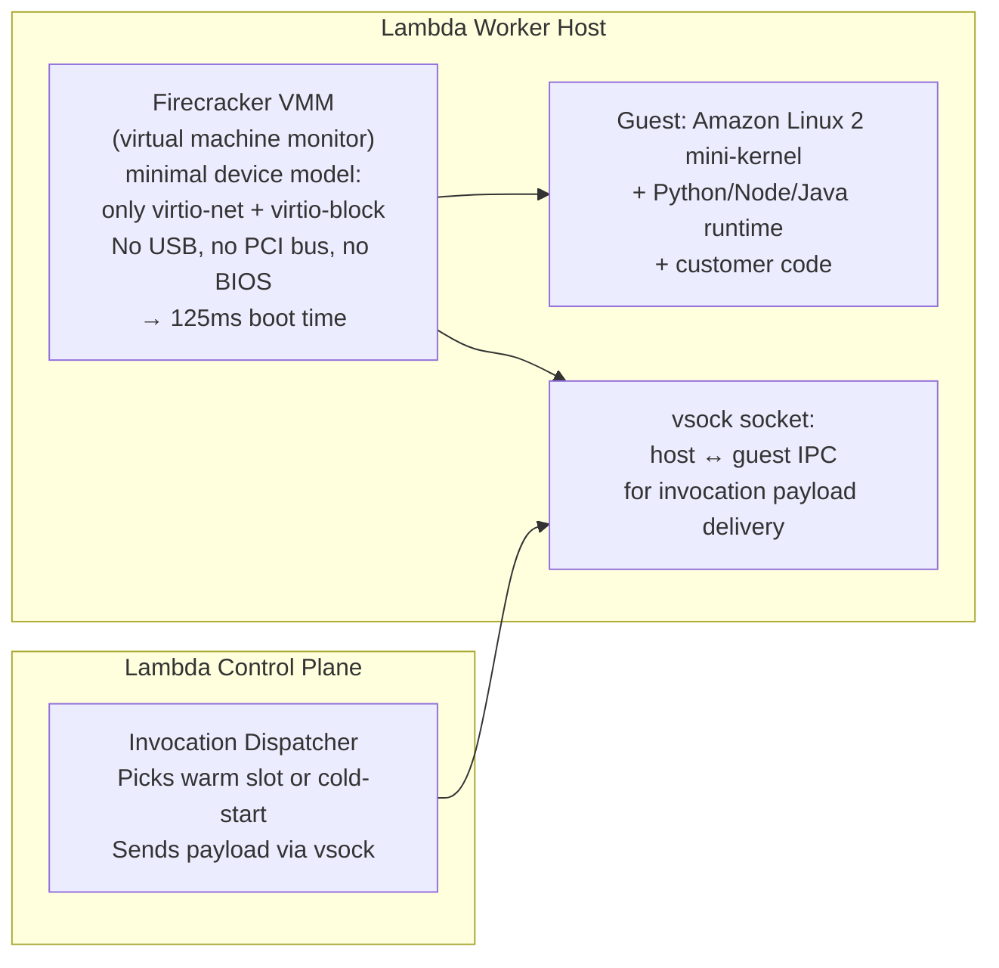

**콜드 스타트 분석(Python 3.11, 256MB)**:
- 폭죽 부팅: ~125ms
- Amazon Linux 초기화: ~50ms  
- Python 인터프리터 시작: ~100ms
- 고객 `import` 문: 가변(0ms~2000ms)
- **총계: 250ms~2500ms**(웜 대비: <1ms 오버헤드)

---

## 5. DynamoDB 내부: 파티셔닝 및 복제

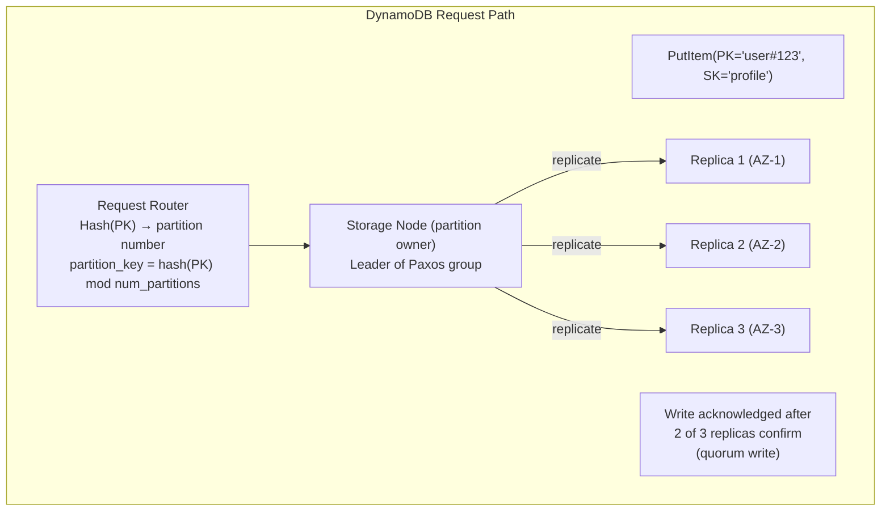

### DynamoDB LSM-트리 스토리지 엔진

각 DynamoDB 파티션은 내부적으로 LSM 트리(Log-Structured Merge-Tree)를 사용합니다.

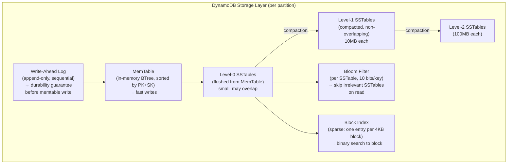

### DynamoDB 자동 파티셔닝(적응형 용량)

파티션이 1000WCU/s 또는 3000RCU/s를 초과하면 DynamoDB는 파티션을 분할합니다.

```
partition_id=abc → [abc_low, abc_high]
split_point = median key in partition
all keys < median → abc_low
all keys ≥ median → abc_high
Transparent to application: router table updated atomically
```

---

## 6. EBS: 블록 스토리지 내부

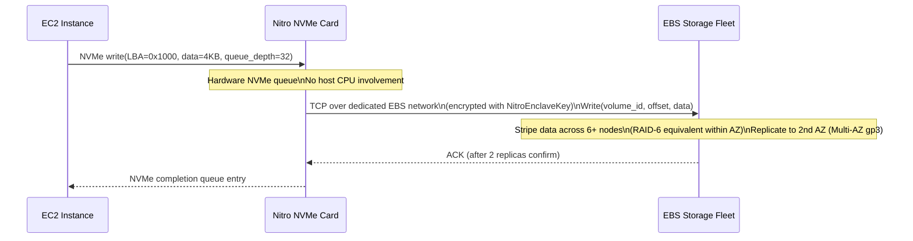

**EBS gp3 처리량**: 125MB/s 기준, 최대 1000MB/s(프로비저닝) Nitro 카드는 모든 NVMe 프로토콜, 암호화(하드웨어의 AES-256) 및 EBS 플릿에 대한 TCP 네트워킹을 처리하며 I/O용 호스트 CPU는 없습니다.

---

## 7. IAM 정책 평가 엔진

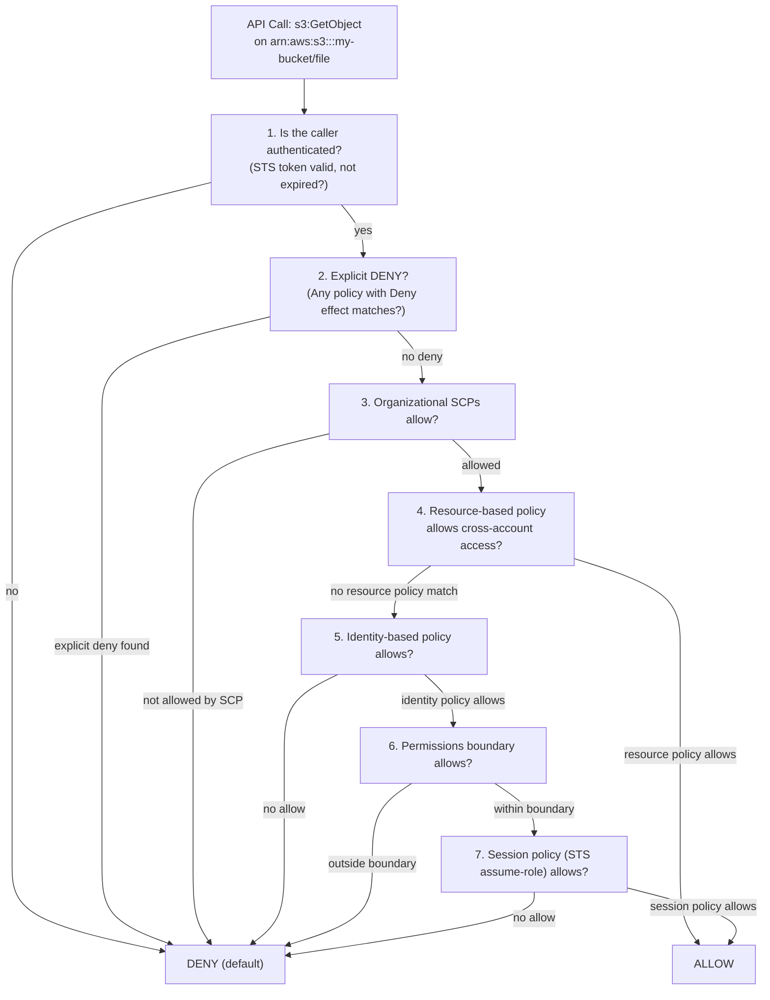

**조건 평가**: IAM 조건은 Condition 블록 내에서 AND를 사용하거나 여러 Condition 요소에 걸쳐 평가됩니다. `aws:RequestedRegion`, `aws:SourceVpc`, `aws:CurrentTime`는 서비스 제어 플레인에 의해 평가 시 삽입된 컨텍스트 키입니다.

---

## 8. RDS 다중 AZ: 동기식 복제 내부

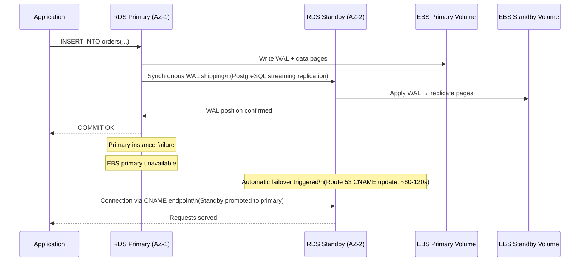

### 읽기 전용 복제본 아키텍처(비동기)

읽기 복제본은 **비동기** 로그 전달을 사용합니다. 다중 AZ(동기식, 동일 리전 장애 조치)와 달리 읽기 전용 복제본은 몇 분 정도 지연될 수 있으며 HA가 아닌 **읽기 확장**에 사용됩니다.

```
Primary → WAL chunks → replica_1 (async, may lag)
                     → replica_2 (async, may lag)
                     → replica_3 (cross-region, higher lag)
```

---

## 9. CloudFront CDN 내부: 엣지 캐싱

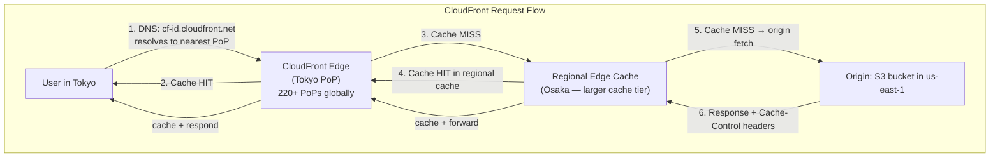

### 캐시 키 구성

```
Default cache key = host + path + query string params (configured)
Vary headers (Accept-Encoding: gzip,br) → separate cache variants
CloudFront Functions: modify cache key in edge compute (sub-ms JS runtime)
Lambda@Edge: full Node.js (origin/response/request phase — 5ms max)
```

---

## 10. AWS Auto Scaling: 제어 루프 메커니즘

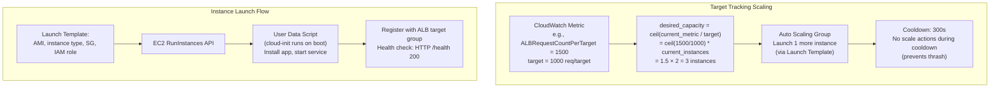

---

## 11. AWS 서비스 내부 요약

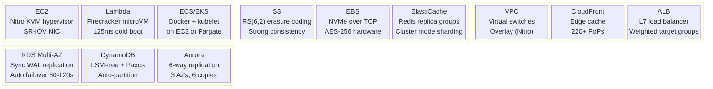

---

## AWS 공동 책임 모델: 기술 경계

| 레이어 | AWS 책임 | 고객 책임 |
|---|---|---|
| 물리적 하드웨어 | ✅ 니트로 카드, BIOS, 펌웨어 | — |
| 하이퍼바이저 | ✅ Nitro 하이퍼바이저 격리 | — |
| 호스트 OS | ✅ 패치, 업데이트 | — |
| 게스트 OS | — | ✅ EC2 AMI 패치 |
| 네트워크 ACL | ✅ VPC 인프라 | ✅ 규칙 구성 |
| 미사용 데이터 | ✅ 하드웨어 AES-256 옵션 | ✅ 암호화 활성화 |
| IAM 권한 | ✅ 정책 엔진 | ✅ 최소 권한 정책 작성 |
| 애플리케이션 코드 | — | ✅ 취약점은 당신의 것입니다 |


---

## 설계적 고민

### 구조와 모델링

AWS 아키텍처 설계의 출발점은 **컴퓨팅 모델 선택**이다. 서버리스(Lambda), 컨테이너(ECS/EKS), VM(EC2)은 각각 운영 복잡도와 제어 수준의 스펙트럼에서 서로 다른 위치를 차지한다.

**서버리스(Lambda) vs 컨테이너(ECS/EKS) vs VM(EC2)**: Lambda는 운영 복잡도가 거의 없지만, 실행 시간 15분 제한, 메모리 10GB 제한, 콜드 스타트(125ms~수초) 등의 제약이 있다. ECS/EKS는 컨테이너 수준의 제어를 제공하면서 인프라 관리를 추상화하고, EC2는 완전한 제어를 제공하지만 OS 패치, 스케일링, 장애 복구 모두 사용자 책임이다.

설계 판단의 핵심은 **워크로드의 특성**이다. 이벤트 기반의 간헐적 호출에는 Lambda를 우선 비교할 수 있다. 장시간 실행되거나 상태를 유지하는 서비스에는 ECS/EKS 같은 컨테이너 선택지를 함께 평가한다. GPU, 특수 커널, 호스트 수준 제어가 필요한 워크로드에서는 해당 요구를 지원하는 EC2 인스턴스와 다른 관리형 서비스의 지원 범위를 비교한다.

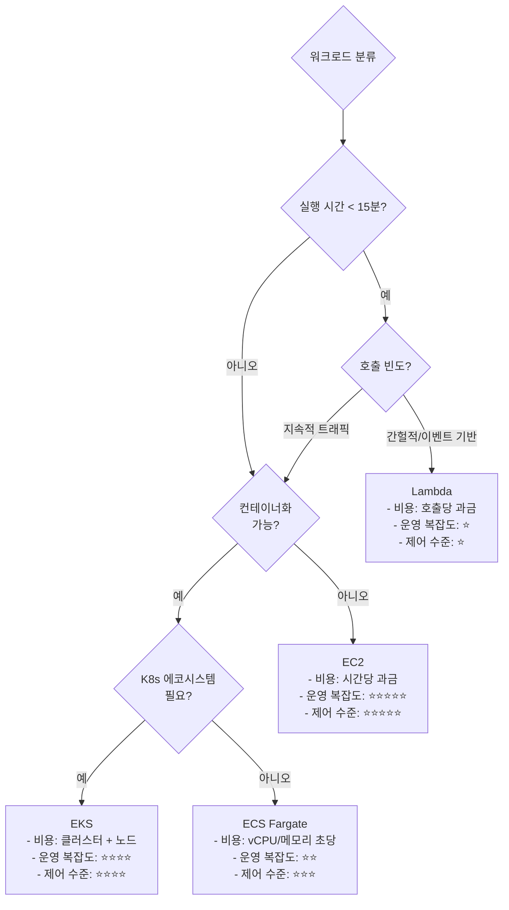

**VPC 네트워크 설계**: VPC 설계는 AWS 아키텍처의 기초이며, 초기 설계 실수는 나중에 수정하기 극히 어렵다. CIDR 블록 크기, 서브넷 분리 전략, AZ 배치가 핵심 결정 사항이다.

퍼블릭 서브넷에는 ALB/NLB와 NAT Gateway만 배치하고, 모든 애플리케이션과 데이터베이스는 프라이빗 서브넷에 둔다. 보안 그룹(Security Group)은 **상태 저장(stateful)** L4 방화벽으로 인바운드 허용 시 아웃바운드 응답이 자동 허용된다. NACL은 **상태 비저장(stateless)** 서브넷 수준 방화벽으로, 인바운드와 아웃바운드를 각각 명시해야 한다.

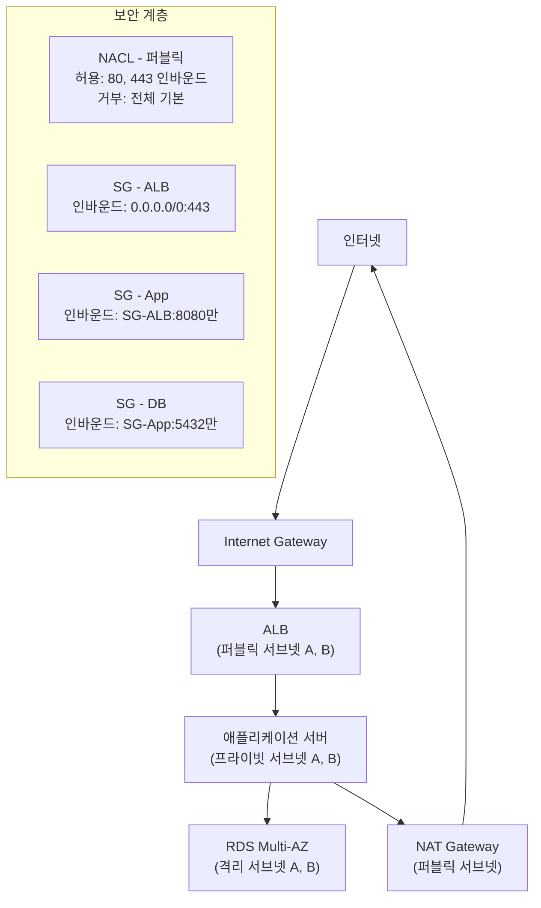

### 트레이드오프와 의사결정

**S3 vs EBS vs EFS 스토리지 선택**: AWS의 세 가지 스토리지 서비스는 각각 오브젝트, 블록, 파일 스토리지로 근본적인 데이터 접근 패턴이 다르다. 잘못된 선택은 성능 병목이나 비용 폭증으로 직결된다.

S3는 **오브젝트 스토리지**로 HTTP API를 통해 접근한다. AWS가 공개한 내구성 설계 목표와 일관성 모델을 제공하지만, 요청률·객체 크기·계정별 할당량은 별도로 확인해야 한다. EBS는 **블록 스토리지**로 EC2에 연결해 파일시스템이나 원시 블록 장치로 사용한다. io2 Block Express의 IOPS 한도는 볼륨 크기, 인스턴스, 리전과 현재 서비스 사양을 함께 확인한다. EFS는 여러 컴퓨팅 자원에서 마운트할 수 있는 관리형 파일 스토리지이며, 공유 파일 의미론과 지연시간 요구가 맞을 때 후보가 된다.

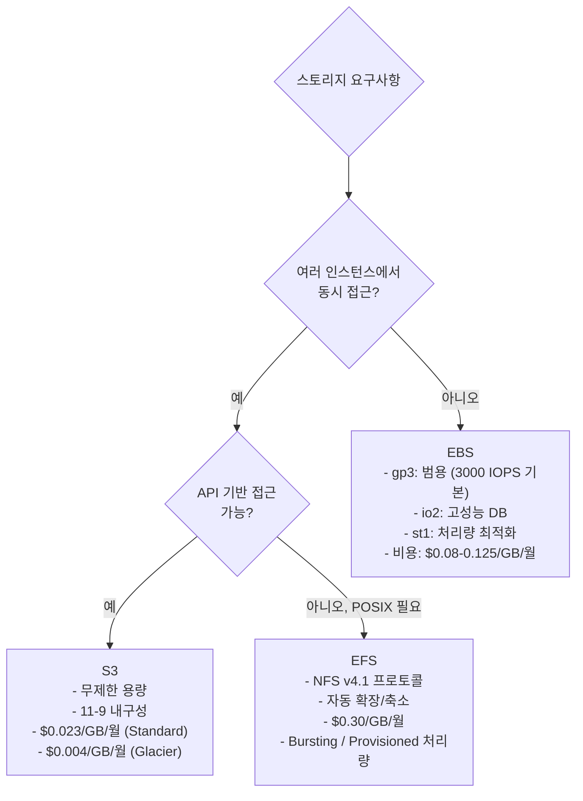

**RDS vs DynamoDB 데이터베이스 선택**: 관계형 vs NoSQL의 선택은 **데이터 접근 패턴**에 의해 결정되어야 한다. RDS(PostgreSQL/MySQL)는 JOIN, 관계형 트랜잭션, 유연한 쿼리가 중요한 경우의 후보다. DynamoDB는 파티션 키와 접근 패턴을 사전에 설계할 수 있고 관리형 수평 확장이 필요할 때 후보가 되며, 처리량·파티션·계정 할당량과 핫 키 위험을 함께 검토한다.

DynamoDB의 핵심 제약은 **파티션 키 설계**이다. 핫 파티션이 발생하면 프로비저닝된 용량이 남아도 쓰로틀링이 발생한다. 반면 RDS는 읽기 레플리카로 수평 확장이 가능하지만, 쓰기는 단일 마스터로 제한된다(Aurora는 Multi-Writer 옵션 제공).

| 기준 | RDS (PostgreSQL) | DynamoDB |
|------|-----------------|----------|
| 데이터 모델 | 정규화된 관계형 | 비정규화 키-값/문서 |
| 쿼리 유연성 | SQL (임의 JOIN, 서브쿼리) | PK/SK 기반 제한적 쿼리 |
| 지연시간 | ~5-20ms | ~1-5ms (DAX: <1ms) |
| 확장성 | 수직 확장 + 읽기 레플리카 | 관리형 수평 확장, 할당량과 파티션 제약 존재 |
| 비용 모델 | 인스턴스 시간 기반 | 요청 + 스토리지 기반 |
| 트랜잭션 | 완전한 ACID | 제한적 (25개 항목) |

### 리팩토링과 설계 원칙

**비용 최적화 설계 원칙**: 비용 상위 항목은 계정과 워크로드마다 다르므로 CUR 또는 Cost Explorer에서 서비스·리전·태그별 지출을 먼저 확인한다. 그 결과를 바탕으로 Reserved Instances, Savings Plans, Spot Instance와 아키텍처 변경의 절감액 및 제약을 비교한다.

**Reserved vs On-Demand vs Spot 인스턴스 전략**: 안정적인 기본 수요에는 약정형 할인, 변동 수요에는 On-Demand, 중단을 견디는 작업에는 Spot을 조합할 수 있다. 할인율과 손익분기점은 계약 기간, 선결제, 인스턴스 유연성, 리전의 현재 가격으로 계산하며 혼합 비율은 수요 예측 오차와 중단 복구 시간을 포함해 결정한다.

Spot Instance의 핵심 설계 원칙은 **중단 내성(Interruption Tolerance)**이다. 2분 전 경고에 대비하여 체크포인팅, 상태 외부화, 다중 인스턴스 타입/AZ 분산이 필수적이다.

```mermaid
flowchart LR
    subgraph CostStrategy["인스턴스 비용 최적화 전략"]
        direction TB
        BASE["기본 워크로드\n(24/7 상시 가동)"] --> RI["Reserved Instance\n1-3년 약정\n최대 72% 할인\n전체 비용의 60-70%"]
        PEAK["예측 가능한 피크"] --> OD["On-Demand\n약정 없음\n정가 과금\n전체 비용의 20-30%"]
        BATCH["배치/내결함성\n워크로드"] --> SPOT["Spot Instance\n최대 90% 할인\n2분 중단 경고\n전체 비용의 5-10%"]
    end

    subgraph SpotDesign["Spot 설계 원칙"]
        SPOT --> S1["다중 인스턴스 타입\nc5.xlarge + m5.xlarge"]
        SPOT --> S2["다중 AZ 분산\nus-east-1a + 1b + 1c"]
        SPOT --> S3["체크포인팅\nS3에 중간 상태 저장"]
        SPOT --> S4["Spot Fleet\n용량 최적화 전략"]
    end
```

**리소스 태깅 원칙**: 비용 가시성을 위해 조직이 소유하는 태그 스키마와 예외 목록을 정의한다. 예를 들어 `Environment`, `Team`, `Service`, `CostCenter`를 요구하되 태깅을 지원하지 않는 리소스와 AWS가 생성하는 리소스를 구분한다. SCP로 생성을 차단하기 전에는 서비스별 태그 지원, 초기 생성 요청의 태그 전달, 비상 운영 경로를 시험한다.

### 디자인 패턴 적용

**다중 계정 전략(Multi-Account Strategy)**: AWS Well-Architected Framework에서 권장하는 패턴으로, 워크로드를 환경별·팀별로 별도 AWS 계정에 격리한다. 이는 보안 경계(blast radius 최소화), 비용 분리, 서비스 할당량(quota) 격리의 세 가지 이점을 동시에 제공한다.

AWS Organizations + Control Tower를 사용하여 계정 팩토리를 구축하고, SSO(IAM Identity Center)로 통합 접근 관리를 한다. 네트워크는 Transit Gateway로 허브-스포크(Hub-Spoke) 토폴로지를 구성하여 계정 간 통신을 중앙 제어한다.

```mermaid
flowchart TD
    ORG["AWS Organization\n(관리 계정)"] --> CT["Control Tower\n(가드레일 + 계정 팩토리)"]
    
    CT --> SEC["보안 계정\n- GuardDuty 위임 관리자\n- Security Hub 집계\n- CloudTrail 로그 아카이브"]
    CT --> LOG["로그 아카이브 계정\n- 중앙 CloudTrail\n- VPC Flow Logs\n- Config 기록"]
    CT --> SHARED["공유 서비스 계정\n- CI/CD 파이프라인\n- 공통 ECR 레지스트리\n- DNS (Route53)"]
    CT --> PROD["프로덕션 계정\n- 워크로드 격리\n- 전용 VPC\n- 엄격한 SCP"]
    CT --> STAGE["스테이징 계정"]
    CT --> DEV["개발 계정\n- 느슨한 SCP\n- 비용 한도 알림"]
    
    SHARED --> |"Transit Gateway"| PROD
    SHARED --> |"Transit Gateway"| STAGE
    SHARED --> |"Transit Gateway"| DEV
```

**이벤트 기반 아키텍처(Event-Driven Architecture)**: SNS(Fan-out), SQS(Buffering), EventBridge(Routing)는 생산자와 소비자의 시간적·배포 결합도를 낮출 수 있다. 이벤트 스키마, 순서, 중복 처리, 재시도와 장애 복구 계약은 여전히 공유되므로 완전한 분리를 전제하지 않는다.

이 패턴의 핵심 원칙은 **최소 한 번 전달(At-Least-Once Delivery)**과 **멱등성(Idempotency)**이다. SQS는 메시지를 최소 한 번 전달하므로, 소비자는 중복 메시지를 안전하게 처리할 수 있어야 한다. DynamoDB의 조건부 쓰기(conditional write)나 S3의 `If-None-Match` 헤더를 활용한 멱등성 구현이 필수적이다.

```mermaid
flowchart LR
    PRODUCER["주문 서비스\n(이벤트 생산자)"] --> SNS["SNS Topic\n(Fan-out)"]
    
    SNS --> SQS1["SQS - 결제 큐\n(버퍼링 + 재시도)"]
    SNS --> SQS2["SQS - 재고 큐"]
    SNS --> SQS3["SQS - 알림 큐"]
    SNS --> EB["EventBridge\n(규칙 기반 라우팅)"]
    
    SQS1 --> PAY["결제 서비스\n(Lambda)"]
    SQS2 --> INV["재고 서비스\n(ECS)"]
    SQS3 --> NOTIF["알림 서비스\n(Lambda)"]
    EB --> AUDIT["감사 서비스\n(Kinesis → S3)"]
    
    SQS1 --> |"처리 실패 5회"| DLQ["Dead Letter Queue\n(수동 검토)"]
```

## 연습 문제

### 1. 시스템 구조와 모델링

**문제 1-1.** 3-tier 웹 애플리케이션을 AWS VPC 위에 배포해야 한다. Public Subnet에 ALB, Private Subnet에 EC2 애플리케이션 서버, Isolated Subnet에 RDS를 배치하는 구조를 설계하시오. NAT Gateway의 배치 위치와 Security Group/NACL 규칙을 각 계층별로 정의하고, Private Subnet의 EC2가 외부 API를 호출해야 하는 경우 트래픽 흐름이 어떻게 되는지 단계별로 설명하시오.

<details><summary>힌트 보기</summary>

NAT Gateway는 Public Subnet에 배치하고, Private Subnet의 라우팅 테이블에 `0.0.0.0/0 → NAT GW` 규칙을 추가한다. EC2 → NAT GW → IGW → 인터넷 경로로 나간다. Security Group은 ALB(80/443 인바운드), EC2(ALB 보안 그룹에서 오는 필요한 포트), RDS(애플리케이션 보안 그룹에서 오는 DB 포트)처럼 최소 권한으로 연결한다. Isolated Subnet은 기본 인터넷 경로가 없다는 뜻이다. VPC 엔드포인트, 피어링, Transit Gateway, 관리 채널과 DNS 경로가 있으면 외부 서비스와 통신할 수 있으므로 라우팅 테이블과 네트워크 정책을 함께 점검한다.

</details>

**문제 1-2.** S3 + CloudFront + Lambda@Edge를 조합하여 정적 웹사이트를 배포한다고 가정하자. 사용자의 HTTP 요청이 엣지 로케이션에 도달한 뒤 Origin Shield를 거쳐 S3 버킷에서 콘텐츠를 가져오는 전체 경로를 설명하시오. Lambda@Edge가 Viewer Request/Origin Request 각 단계에서 수행할 수 있는 역할(인증, URL 리라이트, A/B 테스트 등)을 구체적 예시와 함께 설명하시오.

<details><summary>힌트 보기</summary>

요청 흐름: 사용자 → 가장 가까운 CloudFront Edge Location → Viewer Request 트리거(인증/헤더 조작) → 캐시 확인 → 캐시 미스 시 Origin Shield(지역 캐시 계층) → Origin Request 트리거(URL 리라이트) → S3 Origin. Origin Shield는 여러 엣지의 캐시 미스를 하나로 모아 S3에 대한 요청을 줄인다. Lambda@Edge 제한사항(리전 고정, 콜드 스타트, 실행 시간 제한)도 고려하라.

</details>

**문제 1-3.** AWS의 멀티 계정 환경에서 Organizations, Control Tower, SCPs(Service Control Policies), Transit Gateway를 조합하여 기업의 개발/스테이징/프로덕션 환경을 격리하는 아키텍처를 설계하시오. 각 계정 간 네트워크 통신이 필요한 경우(예: 공유 CI/CD 파이프라인, 중앙 로깅)의 네트워크 라우팅을 Transit Gateway로 어떻게 구성하는지 설명하시오.

<details><summary>힌트 보기</summary>

Control Tower가 Landing Zone을 생성하며, 각 OU(Organizational Unit)별로 SCP를 적용한다. 프로덕션 OU에는 엄격한 SCP(리전 제한, 루트 사용자 금지), 개발 OU에는 느슨한 SCP를 적용한다. Transit Gateway는 허브 역할로 각 VPC를 연결하고, 라우팅 테이블로 트래픽을 제어한다. 공유 서비스 계정에 ECR, CI/CD, DNS를 중앙화하고 RAM(Resource Access Manager)으로 공유한다.

</details>

### 2. 트레이드오프와 의사결정

**문제 2-1.** 다음 세 가지 시나리오에 가장 적합한 AWS 컴퓨팅 서비스를 선택하고 그 이유를 설명하시오: (A) 월 100만 건 REST API 요청, 평균 응답 시간 200ms 이하 필요, (B) 월 10억 건 이미지 리사이징 배치 처리, 각 작업 30초 소요, (C) 24/7 WebSocket 연결을 유지해야 하는 실시간 채팅 서버. Lambda, ECS Fargate, EC2 중 각 시나리오에서 비용, 콜드 스타트 영향, 연결 유지 측면을 분석하시오.

<details><summary>힌트 보기</summary>

(A) 월 100만 건은 Lambda가 적합(요청당 과금, 유휴 시 비용 0). 콜드 스타트 영향은 Provisioned Concurrency로 완화. (B) 10억 건 × 30초 = 8,333시간 컴퓨팅, Lambda 15분 제한 내지만 비용이 매우 높아짐. ECS Fargate로 Spot 콘테이너를 활용해 비용을 절감하거나, EC2 Spot 인스턴스로 더 저렴하게 처리. (C) WebSocket은 장시간 연결 유지가 필수이므로 Lambda(15분 제한)는 부적합. EC2나 ECS Fargate로 서버를 상시 유지해야 한다.

</details>

**문제 2-2.** 다음 세 가지 데이터베이스 요구사항에 적합한 RDS 구성을 선택하고 그 이유를 설명하시오: (A) 결제 시스템으로 데이터 손실이 절대 없어야 하고 AZ 장애 시에도 자동 장애 조치가 되어야 함, (B) 읽기 집약적 인 분석 대시보드로 쓰기 부하는 미미하지만 복잡한 집계 쿼리가 빈번함, (C) 개발/테스트 환경으로 업무 시간에만 사용되며 비용 최소화가 최우선. Multi-AZ, Read Replica, Aurora Serverless v2를 비교하시오.

<details><summary>힌트 보기</summary>

(A) Multi-AZ: 동기식 복제로 RPO ≈ 0, 자동 장애 조치(failover) 60-120초. (B) Read Replica: 읽기 전용 복제본을 1-15개 생성하여 집계 쿼리 부하를 분산. 비동기 복제이므로 약간의 라그 발생. (C) Aurora Serverless v2: 사용량에 따라 ACU가 자동 조절, 비사용 시 0 ACU로 축소(단, v2는 최소 0.5 ACU). 개발 환경에서는 야간/주말 유휴 시 비용이 극적으로 절감된다.

</details>

**문제 2-3.** 마이크로서비스 간 통신에서 동기 호출(API Gateway + Lambda)과 비동기 메시징(SQS + SNS)의 트레이드오프를 분석하시오. 주문 처리 시스템에서 “주문 생성 → 결제 → 재고 차감 → 알림 발송” 흐름 중 어떤 구간을 동기로, 어떤 구간을 비동기로 설계할지 근거를 제시하시오.

<details><summary>힌트 보기</summary>

주문 생성 → 결제는 동기(사용자가 결제 성공/실패를 즉시 확인해야 함). 결제 성공 후 재고 차감과 알림은 비동기(SQS/SNS) 가능 — 사용자에게 즈각적 응답이 필요하지 않으며 일시적 실패를 재시도할 수 있다. 비동기 패턴은 결합도를 낮추지만 디버깅/추적이 복잡해지고, 최종 일관성(eventual consistency)만 보장된다는 트레이드오프가 있다.

</details>

### 3. 문제 해결 및 리팩토링

**문제 3-1.** 보안 감사에서 S3 버킷이 퍼블릭에 노출되어 민감한 고객 데이터가 유출된 것으로 발견되었다. 즉각적인 대응 조치와 함께, Bucket Policy, ACL, S3 Block Public Access, Macie, CloudTrail 로그 분석을 조합하여 재발 방지 체계를 설계하시오. 이 사고가 발생한 근본 원인(예: IAM 정책 과다 허용, 레거시 ACL 미제거)을 추적하는 방법도 설명하시오.

<details><summary>힌트 보기</summary>

즉각 대응: Block Public Access 활성화, 문제 버킷 정책을 Deny All로 교체, CloudTrail에서 `PutBucketPolicy`/`PutBucketAcl` 이벤트를 검색하여 권한 변경 이력 추적. 재발 방지: 계정 수준 S3 Block Public Access 강제, SCP로 `s3:PutBucketPolicy` 제한, Macie로 민감 데이터 자동 탐지, Config Rule로 퍼블릭 버킷 자동 차단. S3 ACL은 레거시이므로 "Bucket owner enforced"로 완전 비활성화하는 것이 바람직하다.

</details>

**문제 3-2.** 단일 AZ에 모든 EC2 인스턴스와 RDS를 배포한 상황에서 해당 AZ에 장애가 발생하여 전체 서비스가 다운되었다. 이 상황을 Multi-AZ ALB + Auto Scaling Group + RDS Multi-AZ로 재설계하여 고가용성을 확보하는 전략을 제시하시오. AZ 장애 시 자동 복구가 되는 흐름을 단계별로 설명하시오.

<details><summary>힌트 보기</summary>

ALB는 2개 이상 AZ에 걸쳐 생성하며, 비정상 AZ의 타겟을 자동 제외(Cross-Zone Load Balancing). ASG는 복수 AZ에 걸쳐 인스턴스를 분산 배치하고, 한 AZ 장애 시 다른 AZ에서 자동으로 인스턴스를 증설한다. RDS Multi-AZ는 동기식 대기 복제본으로 장애 시 DNS 엔드포인트를 자동 전환한다. Health Check의 `interval`, `unhealthy threshold` 설정이 발견 시간(detection time)을 결정한다.

</details>

**문제 3-3.** AWS Lambda 함수가 간헐적으로 호출될 때 콜드 스타트로 인해 첨 요청 응답 시간이 5초 이상 걸리는 문제가 발생했다. 콜드 스타트의 내부 과정(microVM 생성, 런타임 초기화, 코드 로딩)을 분석하고, Provisioned Concurrency, SnapStart(Java), 코드 최적화(패키지 크기 축소, 지연 초기화)를 통한 해결 전략을 제시하시오.

<details><summary>힌트 보기</summary>

콜드 스타트 단계: Firecracker microVM 생성 → 런타임 다운로드 → 코드 로딩 → 전역 초기화 코드 실행 → 핸들러 호출. Provisioned Concurrency는 사전에 microVM을 따뜻하게 유지하여 콜드 스타트를 제거하지만 비용이 발생한다. SnapStart는 JVM 초기화 후 메모리 스냅샷을 저장하여 Java의 콜드 스타트를 90%+ 단축한다. 패키지 크기 줄이기(tree-shaking, 불필요 의존성 제거)도 코드 로딩 시간을 단축한다.

</details>

### 4. 개념 간의 연결성

**문제 4-1.** 이미지 처리 파이프라인에서 SQS + Lambda + DLQ(Dead Letter Queue)를 조합하여 내결함성(Fault Tolerance)을 확보하는 아키텍처를 설계하시오. 사용자가 이미지를 업로드하면 리사이징된 후 S3에 저장되는 전체 흐름을 설계하되, 이미지가 손상되어 리사이징이 실패하는 경우의 재시도/DLQ 처리 흐름도 설명하시오.

<details><summary>힌트 보기</summary>

흐름: S3 업로드 이벤트 → SQS 에 메시지 푸시 → Lambda가 폴링하여 이미지 리사이징 → 성공 시 S3 저장 + 메시지 삭제. 실패 시 Visibility Timeout 후 메시지가 다시 보이며 재시도. `maxReceiveCount`(e.g., 5회) 초과 시 DLQ로 이동. DLQ의 메시지는 CloudWatch 알람으로 모니터링하고, 수동 검토 또는 별도 Lambda로 원인 분석 후 Redrive(SQS DLQ Redrive 기능)한다.

</details>

**문제 4-2.** 트래픽이 급증하는 이커머스 사이트에서 CloudWatch Metrics + Auto Scaling + Spot Instances를 조합하여 비용 효율적으로 자동 확장하는 아키텍처를 설계하시오. Spot 인스턴스가 중단(interrupt)될 때 서비스 가용성을 유지하는 전략(혼합 인스턴스 정책, Capacity Rebalancing)을 포함하시오.

<details><summary>힌트 보기</summary>

ASG Mixed Instances Policy로 On-Demand(기본 용량, e.g., 30%) + Spot(확장 용량, e.g., 70%)을 혼합한다. CloudWatch에서 Target Tracking Scaling(CPU 60% 목표)이나 Step Scaling을 설정한다. Spot 중단 대응: Capacity Rebalancing이 2분 사전 경고를 받아 대체 인스턴스를 선제적으로 기동. 여러 인스턴스 타입을 혼합(m5.large, m5a.large, m6i.large)하여 Spot 풀 부족 위험을 분산한다.

</details>

**문제 4-3.** AWS Well-Architected Framework의 다섯 가지 필러(운영 우수성, 보안, 안정성, 성능 효율성, 비용 최적화)가 서로 충돌하는 구체적 상황을 제시하시오. 예를 들어, 보안 필러의 요구사항(모든 트래픽 암호화, 엄격한 접근 통제)이 성능 필러(낮은 레이턴시, 높은 스루풋)나 비용 필러와 충돌할 때 어떻게 균형을 잡는지 실제 아키텍처 결정 사례로 설명하시오.

<details><summary>힌트 보기</summary>

충돌 예시: KMS 암호화는 보안을 높이지만 API 호출 비용과 레이턴시를 증가시킨다. Multi-AZ는 안정성을 높이지만 비용이 2배가 된다. 군형 전략: 데이터 분류별로 암호화 수준을 차등화(PII만 KMS, 나머지는 SSE-S3), 비용에 민감한 환경은 단일 AZ + S3 교차 리전 백업으로 타협. WAR(Well-Architected Review)를 정기적으로 수행하여 결정 근거를 문서화한다.

</details>
