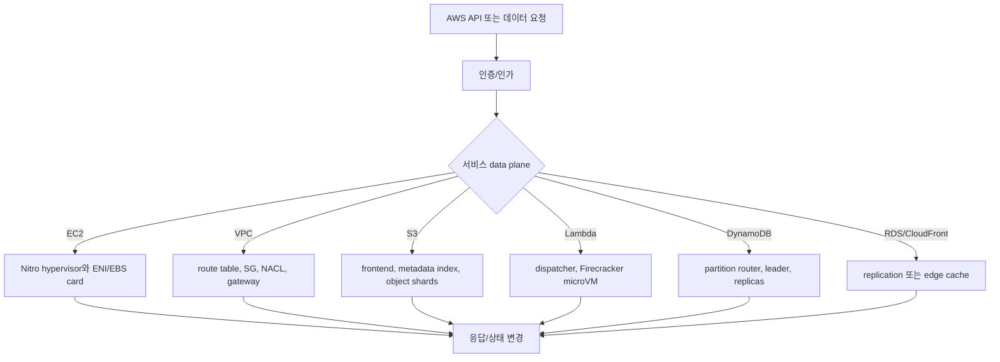
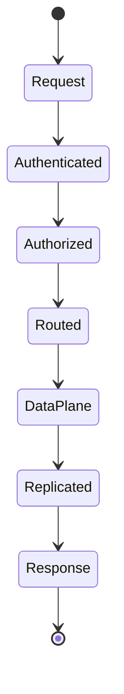
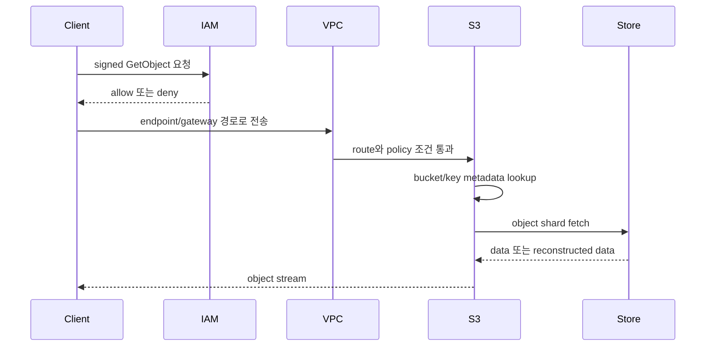

# 클라우드 및 AWS 내부 동작 학습 및 기록 노트

## 1. 왜 필요한가? (Pain Point & Motivation)

AWS 서비스는 버튼 하나로 생성되지만 내부에서는 하이퍼바이저, 가상 네트워크, 분산 저장소, 정책 평가 엔진, 복제 프로토콜이 함께 움직인다. EC2 인스턴스 부팅, VPC 패킷 라우팅, S3 object 저장, Lambda cold start, DynamoDB partitioning을 이해하지 못하면 장애 분석과 비용 최적화가 추측에 머문다.

이 문서는 원문 한국어 AWS 내부 설명을 서비스별 data path와 운영 불변식 중심으로 재작성한다.

## 2. 현재 나의 상태 (Baseline)

- EC2, VPC, S3, Lambda, DynamoDB, EBS, IAM, RDS, CloudFront, Auto Scaling의 사용법은 알고 있다.
- Nitro, Firecracker, erasure coding, LSM-tree, quorum replication 같은 내부 개념을 서비스 동작과 연결해야 한다.
- 네트워크 문제를 볼 때 route table, SG, NACL, NAT/IGW, endpoint를 순서대로 추적하는 습관이 부족하다.
- IAM 평가 순서와 explicit deny 우선순위를 운영 규칙으로 정리해야 한다.
- 관리형 서비스에서도 고객 책임 영역이 남는다는 점을 명확히 해야 한다.

## 3. 도달하고 싶은 목표 (Target State)

- EC2 boot path와 Nitro offload 구조를 설명한다.
- VPC packet이 security group, route table, gateway를 거치는 경로를 추적한다.
- S3 object write/read가 metadata index와 storage shard를 통해 처리되는 방식을 이해한다.
- Lambda cold start를 image/runtime/init code/handler 실행으로 분리한다.
- DynamoDB partition key, RDS Multi-AZ, CloudFront cache key, Auto Scaling control loop를 운영 관점으로 해석한다.

## 4. 시스템 번역 (Data Flow)

AWS 요청은 권한, 네트워크, 서비스 data plane, 복제/저장 계층을 차례로 지나간다. 장애 분석도 이 순서로 분해해야 한다.

## 5. 핵심 구성요소 (Building Blocks)

| 구성요소 | 역할 | 운영상 확인할 점 |
| --- | --- | --- |
| Nitro | EC2 격리와 I/O offload | ENA/EBS/NVMe 경로와 instance type 특성 |
| ENI | VPC 안의 network identity | IP, subnet, SG, route 연결 |
| Security Group | stateful firewall | 새 연결과 return traffic 구분 |
| Internet/NAT Gateway | public/private subnet egress | route table과 SNAT/DNAT |
| S3 Frontend/Index | auth, rate limit, key metadata lookup | object data path와 metadata path 분리 |
| Firecracker | Lambda microVM 격리 | cold start와 warm reuse 차이 |
| DynamoDB Partition | PK hash 기반 저장 단위 | hot partition, adaptive capacity |
| IAM Engine | policy와 context 평가 | explicit deny 우선 |
| RDS Multi-AZ | 동기 복제와 failover | read replica와 목적 구분 |
| CloudFront Edge | cache hit/miss와 origin fetch | cache key 구성 |

## 6. 상태 전이 (State Transition)

예를 들어 S3 GET은 IAM 평가 후 bucket/key metadata를 찾고, 필요한 shard를 fetch하거나 복구한 뒤 client로 stream한다. DynamoDB write는 partition leader와 replica quorum 상태가 응답 조건이 된다.

## 7. 불변식 (Invariant: 절대 깨지면 안 되는 규칙)

- IAM explicit deny는 모든 allow보다 우선한다.
- VPC 통신은 route table, SG/NACL, gateway/endpoint가 모두 맞아야 성공한다.
- S3 object metadata와 shard location은 일관된 상태로 조회되어야 한다.
- DynamoDB partition key는 트래픽이 한 partition에 몰리지 않도록 설계해야 한다.
- Lambda 성능 측정은 cold start, init duration, handler duration을 분리해야 한다.
- RDS Multi-AZ는 HA이고 read replica는 read scaling이라는 목적 차이를 유지해야 한다.
- CloudFront cache key가 달라지면 같은 origin object도 다른 cache entry가 된다.
- 고객은 OS patch, IAM least privilege, application security, data classification을 직접 책임진다.

## 8. 가장 작은 예제 (Minimal Viable Example)

이 예제는 클라우드 요청을 한 계층으로 보지 않고 권한, 네트워크, metadata, 저장소 접근으로 분해해야 함을 보여준다.

## 9. 실패 사례 (What could go wrong?)

- Security Group만 확인하고 route table, NACL, subnet association 문제를 놓친다.
- NAT Gateway 비용과 병목을 고려하지 않고 모든 private subnet egress를 몰아넣는다.
- Lambda import 시간이 길어 cold start를 키우는데 handler 코드만 최적화한다.
- DynamoDB partition key가 낮은 cardinality를 가져 hot partition을 만든다.
- IAM resource policy allow만 보고 SCP, boundary, session policy 제한을 놓친다.
- CloudFront cache key에 불필요한 cookie/header를 포함해 hit ratio를 낮춘다.
- RDS read replica를 자동 failover 대상처럼 설계한다.

## 10. 뇌 확장하기 (Evolution & Variants)

- EC2는 Nitro, placement group, EBS optimized, ENA/EFA, instance store 성능을 함께 비교한다.
- VPC는 PrivateLink, Transit Gateway, VPC Peering, Gateway Endpoint로 확장해 data path를 추적한다.
- S3는 multipart upload, replication, lifecycle, event notification과 연결한다.
- DynamoDB는 GSI/LSI, transactions, streams, global tables를 partition 관점으로 본다.
- Lambda는 provisioned concurrency, SnapStart, container image, connection reuse로 cold start를 완화한다.
- IAM은 condition key와 policy simulator를 사용해 의도한 권한 경계를 검증한다.

## 11. 최종 체크리스트 (Definition of Done)

- [x] EC2/Nitro, VPC, S3, Lambda, DynamoDB, IAM, RDS, CloudFront를 data path 중심으로 정리했다.
- [x] shared responsibility model의 고객 책임을 불변식에 포함했다.
- [x] S3 GET 흐름을 최소 sequence diagram으로 설명했다.
- [x] 운영 실패 사례를 네트워크, 권한, 저장소, 캐시, 복제 관점으로 분리했다.
- [x] 원문 한국어 AWS 내부 문서를 템플릿 형식으로 재작성했다.

## 12. 뇌에 새기는 복습 문장 (TL;DR Blank)

AWS 장애 분석은 서비스 이름을 보는 일이 아니라 요청이 권한, 네트워크, data plane, 복제 계층 중 어디에서 멈췄는지 찾는 일이다.
