# 컴파일러 내부: 소스에서 기계 코드까지

> **고급** — Dragon Book의 단계가 소스 텍스트를 실행 가능한 바이너리로 변환하는 방법: 렉서 DFA 상태 머신, 파서 LR 오토마타, 유형 확인 환경, IR 낮추기, 데이터 흐름 분석 및 그래프 색상 지정을 통한 레지스터 할당. 출처: *컴파일러: 원리, 기법 및 도구*(Aho/Lam/Sethi/Ullman, 2판 — "Dragon Book"), *프로그래밍 언어 화용론*(Scott), *프로그래밍 언어의 개념*(Sebesta).

## 읽는 기준

- **이론 층**은 문법, 의미론, 데이터 흐름 방정식과 계산 복잡도를 다룬다. **구현 층**은 특정 LLVM, GCC, HotSpot, V8 릴리스의 파이프라인과 휴리스틱을 다룬다.
- 패스 순서, JIT 티어, 레지스터 할당기는 버전·타깃·최적화 수준에 따라 바뀐다. 도구 이름이 나온 설명은 고정 규칙이 아니라 조사할 구현 사례로 읽는다.
- 성능 주장은 컴파일러 버전, 대상 트리플, 플래그, 입력 프로그램, 워밍업 조건과 함께 측정한다. 생성 IR, 최적화 기록, 어셈블리를 재현 증거로 남긴다.
- `항상`, `무료`, `최적`은 언어 의미와 비용 모델로 증명된 경우에만 사용한다. 그렇지 않으면 관찰 결과와 가능한 원인을 분리한다.

---

## 1. 컴파일러 파이프라인: 엔드투엔드 단계 아키텍처

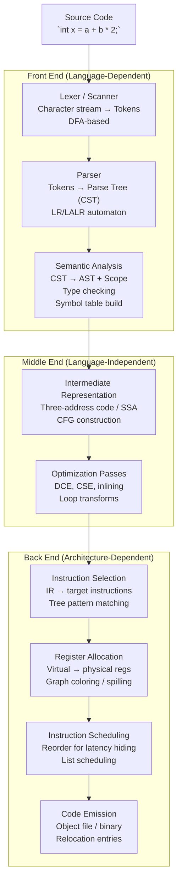

---

## 2. 어휘 분석: DFA 상태 머신 내부

어휘 분석기는 정규식에서 컴파일된 결정론적 유한 자동 장치를 사용하여 문자 스트림을 토큰 스트림으로 변환합니다.

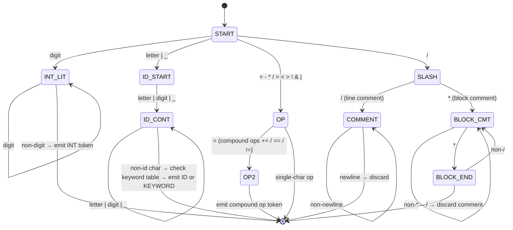

### 최대 뭉크 법칙과 역추적

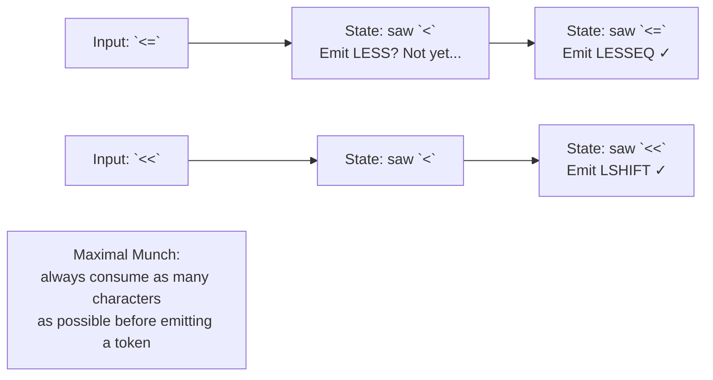

---

## 3. 구문 분석: LR(1) Automaton 및 Shift-Reduce 결정

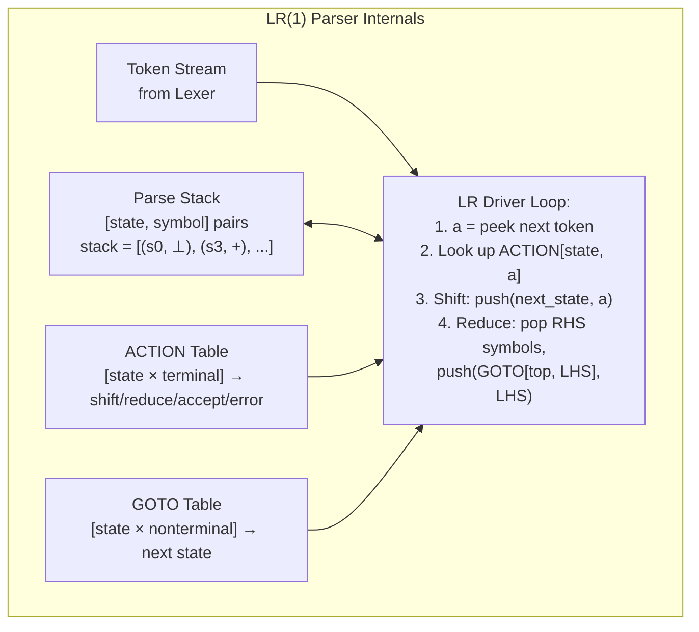

### 충돌 해결: 이동/감소, 감소/감소

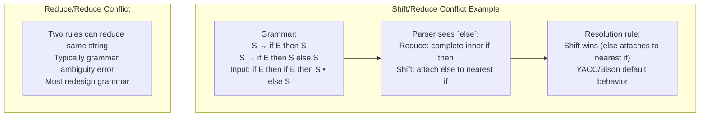

---

## 4. 기호표: 범위 및 유형 환경

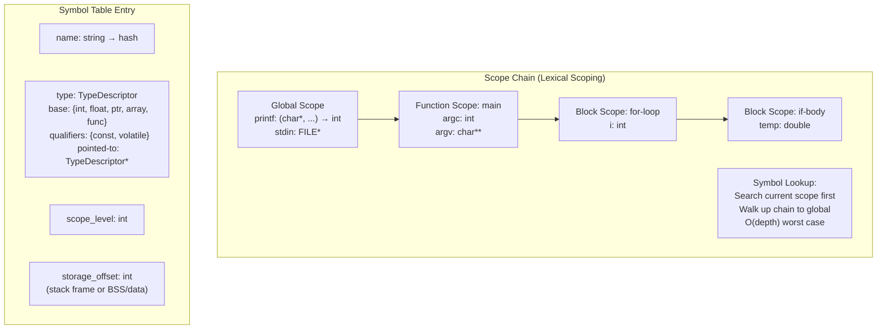

---

## 5. 3개 주소 코드 및 SSA 양식

### 3개 주소 코드(TAC) 생성

출처: `x = a + b * 2`

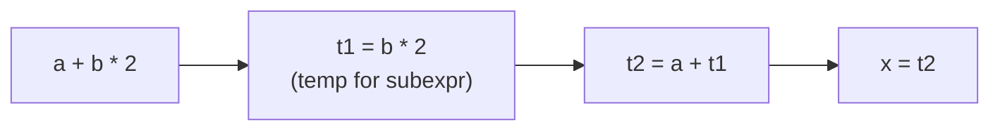

```
Generated TAC:
  t1 = b * 2
  t2 = a + t1
  x  = t2
```

### SSA(정적 단일 할당) 양식

모든 변수는 정확히 한 번만 할당됩니다. 제어 흐름 조인 포인트의 Φ 기능.

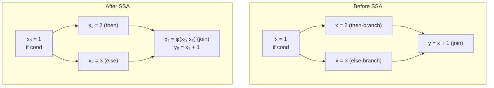

### 제어 흐름 그래프(CFG)

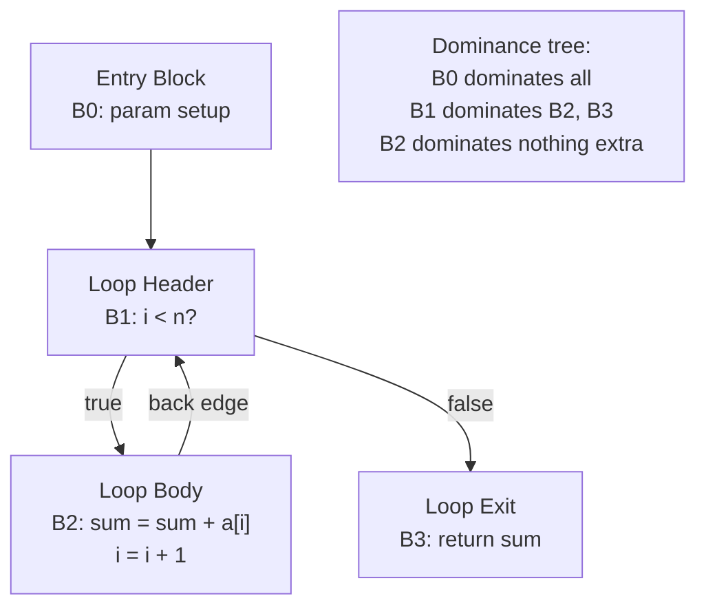

---

## 6. 데이터 흐름 분석: 활성 및 도달 정의

### 활동성 분석(역방향 데이터 흐름)

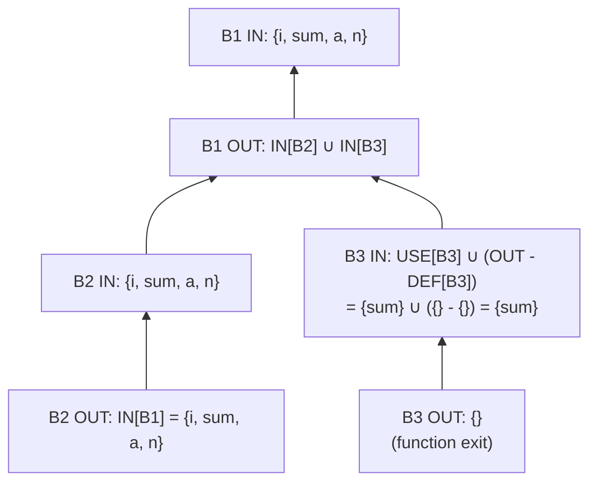

**알고리즘**: 반복 고정 소수점 — 모든 LIVE_OUT = ∅로 시작하고 변경 사항이 없을 때까지 뒤로 전파합니다. 레지스터 수명(간섭)을 결정하기 위해 레지스터 할당자가 사용합니다.

---

## 7. 레지스터 할당: 그래프 컬러링

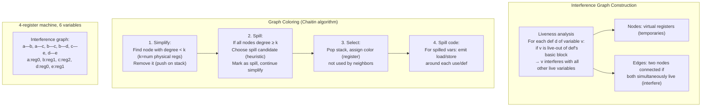

### 통합: MOV 명령어 제거

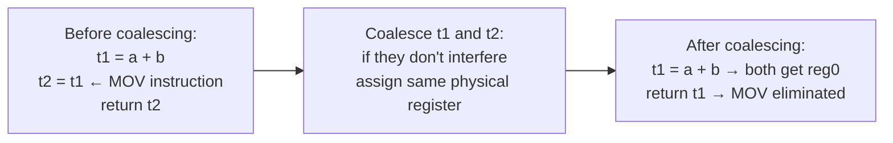

---

## 8. 최적화: 루프 변환

### 루프 불변 코드 모션(LICM)

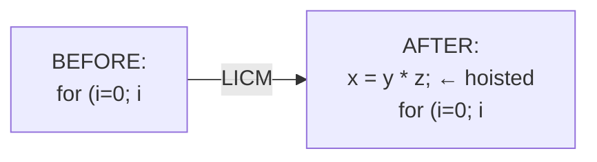

### 루프 풀기

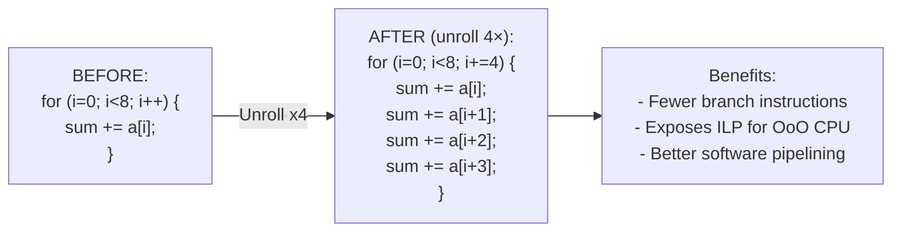

### 루프 타일링(캐시 최적화)

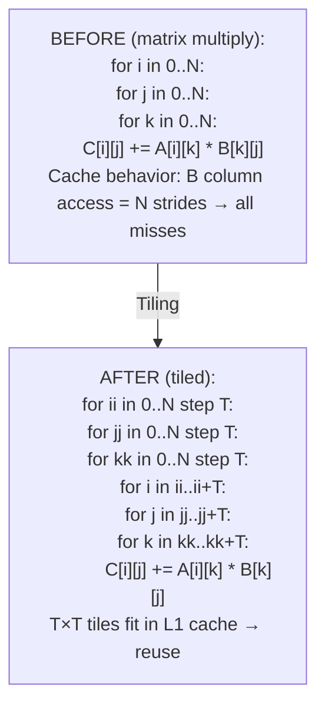

---

## 9. 코드 생성: 트리 패턴 매칭을 통한 명령어 선택

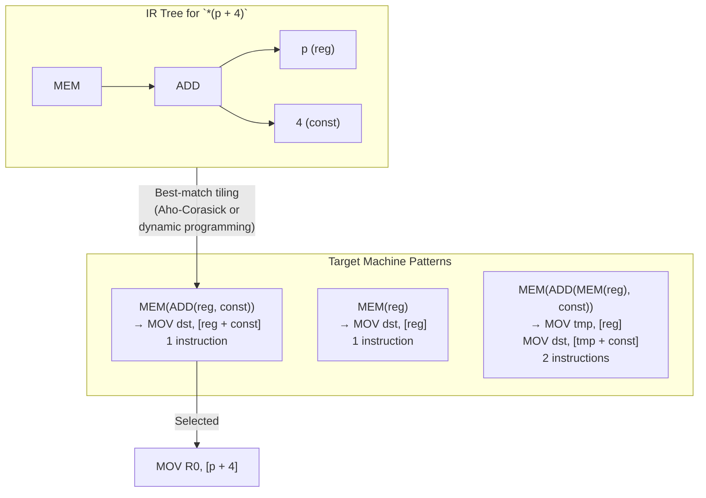

---

## 10. 링커 및 로더 내부

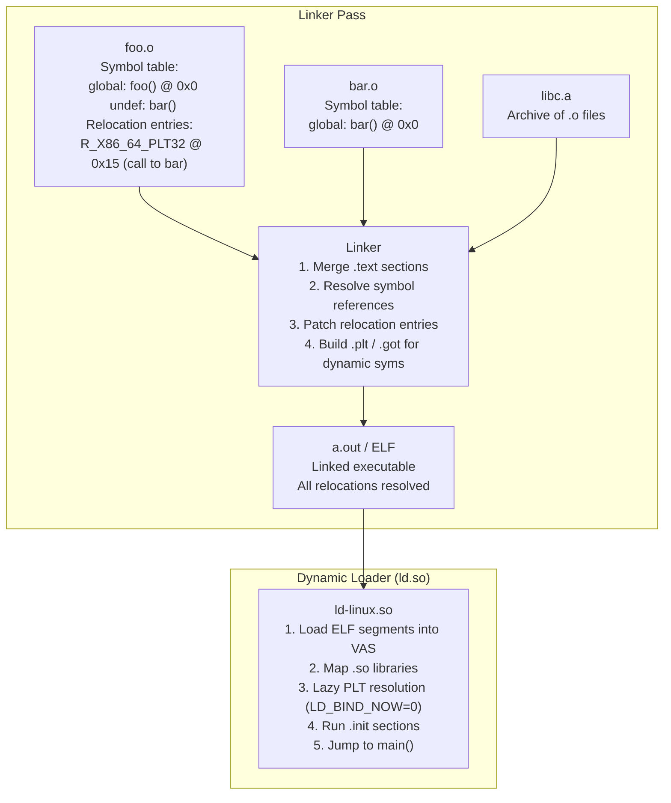

### ELF 파일 구조

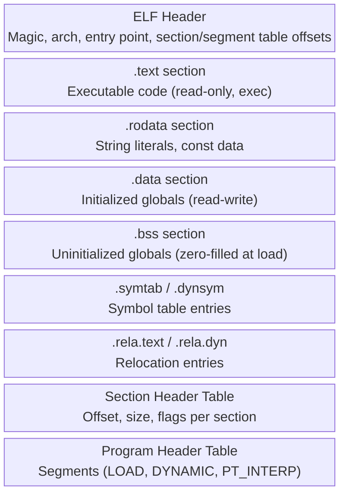

---

## 11. JIT 컴파일: 동적 코드 생성

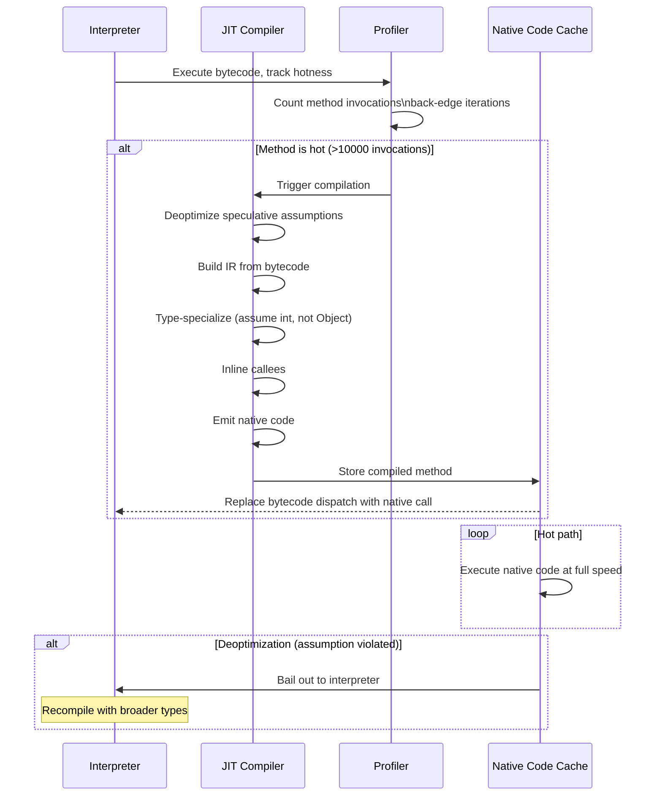

---

## 12. 언어 기능 → 컴파일러 메커니즘 매핑

| 언어 기능 | 컴파일러 메커니즘 |
|---|---|
| 변수 | 심볼 테이블 항목 + 스택 프레임 슬롯 또는 레지스터 |
| 유형 확인 | 유형 환경 + 하위 유형 격자 순회 |
| 함수 호출 | 활성화 기록(프레임), 호출 규칙(cdecl/fastcall) |
| 클로저/람다 | 클로저 레코드: 함수 ptr + 캡처된 환경 힙 할당 |
| 제네릭(C++ 템플릿) | 단일화: 컴파일 타임에 유형별로 인스턴스화 |
| 제네릭(Java/C#) | 유형 삭제: 단일 바이트코드, 런타임 캐스트 |
| 가상 파견 | vtable: 함수 포인터 배열, 동적 디스패치 |
| 예외 | 비용이 없는 테이블(DWARF .eh_frame), 던지면 풀기 |
| `async/await` | 상태 머신 변환: locals → 구조체 필드 |
| 쓰레기 수거 | Safepoint, 스택 맵, 쓰기 장벽 |
| SIMD 벡터화 | 자동 벡터화기: 루프 → `vmovups`, `vaddps` 지침 |

---

## 설계적 고민

### 구조와 모델링

#### SSA(Static Single Assignment) 형태의 설계적 가치

SSA는 중간 표현(IR)의 핵심 설계 철학으로, **각 변수가 정확히 한 번만 정의되는** 속성을 강제한다. 이 단순한 규칙이 수많은 최적화 pass를 단순화한다.

**SSA가 제공하는 설계적 이점**:
1. **정의-사용 체인(def-use chain) 자동 구성**: 각 변수가 한 번만 정의되므로, 어떤 정의가 어떤 사용에 도달하는지 명확하다.
2. **상수 전파(constant propagation) 단순화**: 변수가 재정의되지 않으므로 값이 상수인지 즉시 판단 가능하다.
3. **죽은 코드 제거(DCE) 용이**: 정의된 변수의 사용처가 없으면 안전하게 제거할 수 있다.
4. **레지스터 할당 용이**: 각 SSA 변수가 고유하므로 수명 분석이 직관적이다.

**phi 함수**: SSA의 핵심 메커니즘. 제어 흐름 합류점에서 어떤 경로에서 왔는지에 따라 값을 선택한다. 예를 들어 `x3 = phi(x1, x2)`는 if/else 분기 후 어떤 경로로 왔는지에 따라 x1 또는 x2를 선택한다.

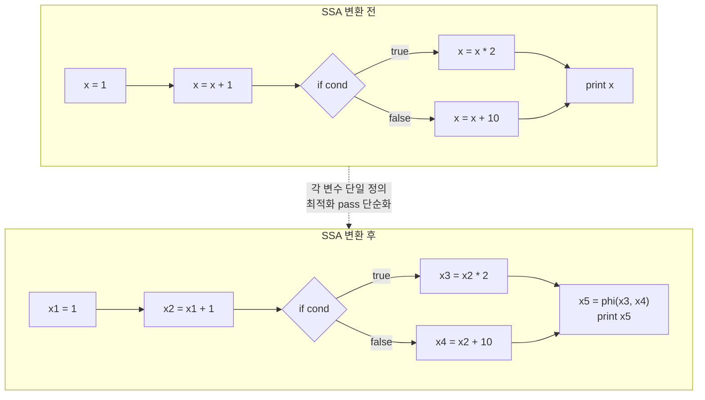

#### 인터프리터 vs JIT vs AOT 컴파일: 시작 시간 vs 최적화 수준

컴파일러 설계의 가장 근본적인 결정은 **코드를 언제 기계어로 변환하는가**이다. 각 접근 방식은 서로 다른 트레이드오프를 가진다.

| 기준 | 인터프리터 | JIT 컴파일 | AOT 컴파일 |
|------|-----------|---------|---------|
| 시작 시간 | 즉시 | 워밍업 필요 | 즉시 (pre-compiled) |
| 최대 성능 | 낮음 | 매우 높음 | 높음 |
| 런타임 정보 활용 | 제한적 | 최대 (PGO) | 불가 |
| 메모리 사용량 | 적음 | 많음 (code cache) | 적음 |
| 배포 복잡도 | 낮음 | 중간 | 높음 (플랫폼별 빌드) |
| 대표 언어 | Python, Ruby | Java, JS(V8) | C, C++, Rust, Go |

```mermaid
flowchart LR
    subgraph INTERP["인터프리터"]
        I_SRC["소스 코드"] --> I_PARSE["파싱"] --> I_EXEC["즉시 실행\n바이트코드 디스패치"]
    end
    
    subgraph JIT["JIT 컴파일"]
        J_SRC["바이트코드"] --> J_PROF["프로파일링\n핫스팟 감지"]
        J_PROF --> J_OPT["최적화 컴파일\n타입 특수화"]
        J_OPT --> J_NATIVE["네이티브 코드\n실행"]
    end
    
    subgraph AOT["AOT 컴파일"]
        A_SRC["소스 코드"] --> A_COMP["컴파일 타임\n전체 최적화"]
        A_COMP --> A_BIN["네이티브 바이너리\n즉시 실행"]
    end
    
    INTERP -.->|"시작 빠름\n성능 낮음"| JIT
    JIT -.->|"시작 느림\n런타임 최적화"| AOT
    AOT -.->|"시작 빠름\n정적 최적화만"| INTERP
```

### 트레이드오프와 의사결정

#### 레지스터 할당: 그래프 채색 vs 선형 스캔 알고리즘 선택

레지스터 할당은 컴파일러 백엔드의 핵심 단계로, 무한한 가상 레지스터를 유한한 물리 레지스터에 매핑한다. 두 가지 주요 알고리즘의 트레이드오프는 다음과 같다:

- **그래프 채색(Graph Coloring) 계열**: 간섭 그래프와 휴리스틱을 사용해 물리 레지스터를 배정한다. 최적 채색 문제의 난도와 실제 휴리스틱의 비용을 구분해야 하며 코드 품질도 프로그램에 따라 달라진다.
- **선형 스캔(Linear Scan) 계열**: 생존 구간을 순서대로 처리해 컴파일 지연을 줄이는 데 유리하다. 정렬과 구간 표현을 포함한 비용 및 spill 품질은 구현에 따라 달라진다.

실제 GCC, LLVM, HotSpot, V8은 단일 교과서 알고리즘 이름만으로 설명되지 않는다. 릴리스, 백엔드, 컴파일 티어와 플래그를 고정한 뒤 해당 소스와 디버그 출력을 확인한다.

```mermaid
flowchart TD
    A["레지스터 할당 알고리즘 선택"] --> B{"컴파일 속도 우선?"}
    B -->|"예 - JIT 컴파일러"| LS["선형 스캔\nO(n log n)\n더 많은 spill\n빠른 컴파일"]
    B -->|"아니오 - AOT 컴파일러"| GC["그래프 채색\nO(n^2) 이상\n적은 spill\n최적에 근접"]
    
    LS --> LS_USE["사용처: V8 C1, HotSpot C1\n빠른 시작이 중요한 환경"]
    GC --> GC_USE["사용처: GCC, LLVM, HotSpot C2\n최대 성능이 중요한 환경"]
    
    LS --> HYBRID["하이브리드 접근\nJIT에서 선형 스캔으로 시작\n핫 메서드만 그래프 채색으로 재컴파일"]
    GC --> HYBRID
```

#### 타입 시스템 설계: 정적 vs 동적 vs 점진적 타이핑

타입 시스템은 컴파일러 설계의 가장 근본적인 결정 중 하나다. **었마나 많은 정보를 컴파일 타임에 확인할 것인가**가 핵심 질문이다.

| 기준 | 정적 타이핑 | 동적 타이핑 | 점진적 타이핑 |
|------|-----------|-----------|------------|
| 타입 검사 시점 | 컴파일 타임 | 런타임 | 선택적 컴파일 타임 |
| 안전성 | 높음 | 낮음 | 중간 |
| 유연성 | 낮음 | 높음 | 높음 |
| 최적화 수준 | 높음 (타입 정보 활용) | 낮음 | 중간 |
| 대표 언어 | Java, C++, Rust | Python, Ruby, JS | TypeScript, Python+mypy |

```mermaid
flowchart TD
    A["언어 설계 결정"] --> B{"타입 시스템?"}
    B -->|"정적"| STATIC["컴파일 타임 타입 검사\n타입 정보로 최적화"]
    B -->|"동적"| DYNAMIC["런타임 타입 태그\n모든 값에 타입 정보 포함"]
    B -->|"점진적"| GRADUAL["선택적 어노테이션\nAny 타입으로 탈출구 제공"]
    
    STATIC --> S_OPT["최적화 높음\n타입 삭제 unboxing\n인라이닝 devirtualization"]
    DYNAMIC --> D_OPT["최적화 제한\nJIT으로 보완\n타입 피드백 수집"]
    GRADUAL --> G_OPT["타입 있는 부분 최적화\nAny 부분은 동적 처리"]
```

### 리팩토링과 설계 원칙

#### 최적화 Pass 순서 결정: 어떤 최적화를 먼저 수행할 것인가

컴파일러 최적화 파이프라인의 핵심 설계 결정은 **pass 순서**다. 각 최적화 pass는 다른 pass의 효과를 활성화하거나 제한할 수 있어 순서가 중요하다.

**대표적인 최적화 순서 예시**:
1. **인라이닝 배치**: 호출자 컨텍스트에서 추가 최적화 기회를 열 수 있지만, 비용 모델과 코드 크기에 따라 여러 지점에서 반복하거나 생략한다.
2. **상수 전파/접기**: 인라이닝 후 더 많은 상수가 보이므로 인라이닝 다음에 수행한다.
3. **죽은 코드 제거(DCE)**: 상수 전파가 사용되지 않는 코드를 만들므로 그 다음에 수행한다.
4. **루프 최적화**: LICM(루프 불변 코드 이동), 루프 언롤링, 벡터화를 수행한다.
5. **피홀 최적화**: 최종 단계에서 명령어 수준 세부 조정을 수행한다.

```mermaid
flowchart TD
    SRC["소스 IR"] --> INLINE["① 인라이닝\n함수 호출 제거\n최적화 범위 확대"]
    INLINE --> CONST["② 상수 전파/접기\n인라인된 코드의\n상수 파라미터 평가"]
    CONST --> DCE["③ 죽은 코드 제거\n사용되지 않는\n코드 제거"]
    DCE --> LOOP["④ 루프 최적화\nLICM, 언롤링\n인덱스 변수 단순화"]
    LOOP --> ALIAS["⑤ 에일리어스 분석\n포인터 관계 파악\n메모리 접근 최적화"]
    ALIAS --> REGALLOC["⑥ 레지스터 할당\n가상 레지스터 → 물리"]
    REGALLOC --> PEEPHOLE["⑦ 피홀 최적화\n명령어 패턴 매칭\n레듘던트 명령어 제거"]
    PEEPHOLE --> EMIT["네이티브 코드 출력"]
    
    INLINE -.->|"인라이닝이 다른\n모든 최적화를 활성화"| CONST
```

### 디자인 패턴 적용

#### 컴파일러 내부 설계에서 발견되는 패턴들

컴파일러는 복잡한 소프트웨어 시스템으로, 다양한 디자인 패턴이 내재되어 있다:

- **방문자 패턴(Visitor)**: AST 순회의 핵심 패턴. 타입 검사, 코드 생성, 최적화 등 서로 다른 연산을 AST 노드 구조 변경 없이 추가할 수 있다.
- **파이프라인 패턴(Pipeline)**: 컴파일러의 전체 구조. 렉서 → 파서 → 시맨틱 분석 → IR 생성 → 최적화 → 코드 생성이 순차적 단계로 연결된다.
- **전략 패턴(Strategy)**: 레지스터 할당 알고리즘 선택. 동일한 인터페이스 뒤에 그래프 채색과 선형 스캔을 교체 가능하게 배치한다.
- **프록시/데코레이터 패턴**: 최적화 pass 관리자. 각 pass를 래핑하여 전후 조건 검사, 디버깅 출력, 타이밍 측정을 추가한다.
- **플라이웨이트 패턴(Flyweight)**: SSA 변수의 내부 표현. 동일한 상수 값이나 타입 정보를 공유하여 메모리를 절약한다.

```mermaid
classDiagram
    class ASTVisitor {
        <<interface>>
        +visitBinaryExpr(node) Result
        +visitUnaryExpr(node) Result
        +visitLiteral(node) Result
        +visitVarDecl(node) Result
    }
    
    class TypeChecker {
        +visitBinaryExpr(node) Type
        +visitLiteral(node) Type
        -inferType(left, right) Type
    }
    
    class CodeGenerator {
        +visitBinaryExpr(node) IR
        +visitLiteral(node) IR
        -emitInstruction(op, args) IR
    }
    
    class Optimizer {
        +visitBinaryExpr(node) ASTNode
        +visitLiteral(node) ASTNode
        -foldConstants(left, right) Literal
    }
    
    class PassManager {
        -passes: List~OptimizationPass~
        +addPass(pass: OptimizationPass)
        +runAll(ir: IR) IR
        -verifyAfterEach(ir: IR) bool
    }
    
    ASTVisitor <|.. TypeChecker
    ASTVisitor <|.. CodeGenerator
    ASTVisitor <|.. Optimizer
    PassManager --> PassManager: 파이프라인 패턴\n각 pass를 순차적 실행\npass간 순서 의존성 관리


## 연습 문제

### 1. 시스템 구조와 모델링

**문제 1-1.** JavaScript V8 엔진은 코드 실행 시 `Ignition` 인터프리터 → `Sparkplug` 베이스라인 컴파일러 → `Maglev` 중간 컴파일러 → `TurboFan` 최적화 컴파일러로 단계적으로 전환한다. 웹 애플리케이션에서 자주 실행되는 `renderList()` 함수가 Ignition에서 TurboFan까지 승격되는 조건을 설명하라. TurboFan이 최적화한 네이티브 코드가 다시 Ignition으로 **역최적화(deoptimization)**되는 상황은 어떤 경우에 발생하는가?

<details><summary>힌트 보기</summary>

V8은 함수 호출 빈도를 카운트하여 "핫(hot)" 함수를 식별한다. Sparkplug는 Ignition 바이트코드를 빠르게 1:1 네이티브 코드로 변환하고(최적화 없음), Maglev는 간단한 최적화(SSA 변환, 기본 레지스터 할당)를 수행한다. TurboFan은 인라이닝, 이스케이프 분석, 타입 특수화 등 적극적 최적화를 수행한다. **역최적화** 발생 조건: TurboFan이 가정한 타입(예: "이 변수는 항상 정수")이 위반되면(hidden class 변경, `undefined` 전달 등) 네이티브 코드를 버리고 Ignition으로 복귀한다. `--trace-deopt` 플래그로 확인 가능.

</details>

**문제 1-2.** 다음 코드를 SSA(Static Single Assignment) 형태로 변환하라:
```
x = 1
if (condition) {
    x = x + 2
} else {
    x = x * 3
}
y = x + 1
```
SSA 변환 후 각 변수에 고유한 번호를 부여하고, 합류 지점(merge point)에서 `φ`(phi) 노드가 어디에 필요한지 설명하라. SSA가 컴파일러 최적화(상수 전파, 사류 코드 제거)에 왜 유리한지 설명하라.

<details><summary>힌트 보기</summary>

SSA 변환:
```
x1 = 1
if (condition) {
    x2 = x1 + 2      // then 블록
} else {
    x3 = x1 * 3      // else 블록
}
x4 = φ(x2, x3)       // 합류 지점에서 phi 노드
y1 = x4 + 1
```
`φ` 노드는 제어 흐름에 따라 `x2` 또는 `x3` 중 하나를 선택한다. SSA의 장점: 각 변수가 정확히 한 번만 정의되므로, def-use 체인 분석이 간단해진다. 상수 전파(constant propagation) 시 `x1 = 1`이므로 `x2 = 3`, `x3 = 3`으로 확정할 수 있고, 두 브랜치 모두 3이면 `φ` 노드 자체를 상수 3으로 대체할 수 있다.

</details>

**문제 1-3.** LLVM 컴파일러 파이프라인은 프론트엔드(Clang) → LLVM IR → 최적화 패스 → 백엔드(타겹 어셈블리)로 구성된다. Rust, Swift, C++ 등 다양한 언어가 동일한 LLVM IR를 공유하는 것이 어떤 아키텍처적 이점을 제공하는지 설명하라. 특히 백엔드 구현(x86, ARM, RISC-V 등)과 최적화 패스를 언어 간에 공유할 수 있는 이유를 기술하라.

<details><summary>힌트 보기</summary>

LLVM의 핵심 설계는 **3단계 분리(three-phase design)**다. 프론트엔드는 언어별 의미를 LLVM IR로 낮추고, 중간 계층은 공통 분석과 변환을 제공하며, 백엔드는 타깃별 명령 선택과 코드 생성을 담당한다. 이 분리는 N개 언어와 M개 타깃의 결합 수를 줄이지만 비용을 없애지는 않는다. 언어별 런타임·ABI·메타데이터와 타깃별 lowering을 구현하고, 공통 패스가 각 언어의 의미를 보존하는지 검증해야 한다.

</details>

### 2. 트레이드오프와 의사결정

**문제 2-1.** 세 가지 애플리케이션 유형이 있다: (A) AWS Lambda에 배포되는 서버리스 함수(cold start가 중요), (B) 3개월간 계속 실행되는 거래소 매칭 엔진, (C) 데이터 과학자가 작성하는 일회성 분석 스크립트. 각 상황에 Rust AOT 컴파일, JVM JIT 컴파일, Python 인터프리터 중 어떤 실행 모델이 유리한지 근거를 들어 설명하라.

<details><summary>힌트 보기</summary>

(A) 서버리스에서는 배포 크기, 초기화 작업, 런타임과 플랫폼에 따라 AOT 바이너리가 콜드 스타트에 유리할 수 있다. Rust와 JVM 네이티브 이미지, 일반 JVM을 같은 메모리 설정과 호출 경로에서 측정한다. (B) 장기 실행 서버에서는 프로파일 기반 JIT가 이점을 낼 수 있지만 처리량, 워밍업 시간, 메모리 사용량을 함께 비교한다. (C) 스크립트 작업에서는 개발 속도와 라이브러리 생태계가 중요한 선택 기준이 될 수 있으며, Python 확장 라이브러리의 네이티브 실행 여부까지 프로파일로 확인한다.

</details>

**문제 2-2.** 짧은 컴파일 지연을 우선하는 JIT 티어가 선형 스캔 계열을, 코드 품질에 더 많은 시간을 쓸 수 있는 최적화 티어가 그래프 기반 또는 다른 전역 할당기를 검토한다고 가정하자. 두 선택을 컴파일 시간, spill, 생성 코드 품질의 트레이드오프 관점에서 설명하라. 특정 JVM이나 GCC가 어느 알고리즘을 쓰는지는 버전과 티어를 고정해 별도로 조사하라.

<details><summary>힌트 보기</summary>

최적 그래프 채색은 NP-완전이지만 실제 할당기는 휴리스틱과 단순화를 사용하므로 하나의 O(n²) 비용으로 고정할 수 없다. 선형 스캔 계열은 생존 구간 정렬 비용과 구간 스캔 비용을 부담하며 일반적으로 낮은 컴파일 지연을 목표로 한다. JIT에서는 컴파일 시간이 사용자 지연과 CPU 예산에 직접 포함되므로 빠른 티어와 최적화 티어를 나누기도 한다. 코드 품질 차이는 고정된 5%나 3배가 아니라 프로그램과 레지스터 압력에 따라 달라진다. 비교 시 컴파일 시간, spill/reload 수, 코드 크기, 실행 시간을 같은 입력에서 측정한다.

</details>

**문제 2-3.** 새로운 프로그래밍 언어를 설계하려 한다. 타입 시스템을 정적 타이핑(Rust/Go 처럼)으로 할지, 동적 타이핑(Python/JavaScript 처럼)으로 할지, 점진적 타이핑(TypeScript 처럼)으로 할지 결정해야 한다. 각 선택이 컴파일러 설계(타입 추론 엔진, 최적화 가능 범위)와 런타임 성능(타입 검사 오버헤드, 최적화 여지)에 미치는 영향을 비교하라.

<details><summary>힌트 보기</summary>

**정적 타이핑**: 컴파일 시 모든 타입을 알으므로 업코드/타입 검사 오버헤드 제로, Monomorphization으로 제네릭을 특수화하여 인라이닝 가능. 단, 컴파일 시간 증가와 유연성 감소. **동적 타이핑**: 런타임에 타입 태그를 검사해야 하므로 오버헤드 있으나, JIT가 타입 피드백으로 특수화 가능. 개발 속도 높음. **점진적 타이핑**: TypeScript처럼 컴파일 시 타입 검사하지만 출력은 동적 언어(JS). 계층적 추론이 필요하여 컴파일러가 복잡해지만, 도입 장벽이 낮다.

</details>

### 3. 문제 해결 및 리팩토링

**문제 3-1.** 다음 코드는 성능이 중요한 행렬 곱셈 루프이다:
```c
for (int i = 0; i < N; i++) {
    double scale = computeScale(config);  // config는 루프 내에서 불변
    for (int j = 0; j < N; j++) {
        result[i][j] = matrix[i][j] * scale;
    }
}
```
`computeScale(config)` 호출이 루프 내 불변 계산(loop-invariant computation)임에도 N번 반복 실행된다. LICM(Loop-Invariant Code Motion) 최적화가 이를 어떻게 처리하는지 설명하고, 컴파일러가 `computeScale`이 순수 함수(pure function)인지 확인할 수 없을 때 이 최적화가 제한되는 이유를 설명하라.

<details><summary>힌트 보기</summary>

LICM는 루프 내 불변 식을 루프 전으로 이동한다: `double scale = computeScale(config); for (int i ...) { ... }`. 그러나 컴파일러는 `computeScale`이 전역 변수를 수정하거나, I/O를 수행하거나, `config`가 가리키는 데이터가 변경될 수 있는지 **엘리어싱 분석(alias analysis)**을 수행해야 한다. C/C++의 포인터 엘리어싱 문제로 컴파일러가 보수적으로 판단하면 LICM이 적용되지 않는다. `__attribute__((pure))` 또는 `__attribute__((const))`로 함수 속성을 명시하면 컴파일러가 안전하게 LICM을 수행할 수 있다.

</details>

**문제 3-2.** 대규모 C++ 프로젝트에서 `-O2`로 컴파일한 후 바이너리 크기가 예상보다 3배 커졌다. 프로파일링 결과 템플릿 인스턴시에이션과 공격적 인라이닝이 주원인이었다. 컴파일러의 인라이닝 휴리스틱(함수 크기, 호출 빈도, 핸번 함수 여부)을 설명하고, PGO(Profile-Guided Optimization)가 이 문제를 어떻게 완화하는지 전체 워크플로우를 기술하라.

<details><summary>힌트 보기</summary>

컴파일러는 정적 휴리스틱으로 인라이닝을 결정한다: 함수 본문이 작으면(보통 명령어 100개 이하) 인라인, 호출 횟수가 많을 것으로 추정되면(루프 내 호출) 인라인. 하지만 정적 분석으로는 실제 호출 빈도를 알 수 없어 cold 함수도 인라인하면 code bloat가 발생한다. **PGO 워크플로우**: (1) `-fprofile-generate`로 컴파일, (2) 대표적 워크로드로 실행하여 프로파일 수집, (3) `-fprofile-use`로 재컴파일. PGO는 실제 호출 빈도 데이터로 hot 함수만 선택적으로 인라인하여 code bloat을 줄이고 성능을 10~30% 향상시킨다.

</details>

**문제 3-3.** GCC로 컴파일한 C 프로그램이 `-O0`에서는 정상 동작하지만 `-O2`에서는 예상과 다른 결과를 낸다. 원인을 조사했더니 strict aliasing 룰을 위반하는 코드(`float` 포인터를 `int*`로 캐스팅하여 읽기)가 있었다. C/C++의 strict aliasing 룰이 무엇이며, 컴파일러가 이 규칙을 기반으로 어떤 최적화를 수행하는지 설명하라.

<details><summary>힌트 보기</summary>

Strict aliasing 룰: 서로 다른 타입의 포인터는 동일 메모리를 가리키지 않는다고 컴파일러가 가정한다(예외: `char*`). `float* fp = &val; int* ip = (int*)fp; int bits = *ip;`는 UB(undefined behavior)이다. 컴파일러는 `*fp`와 `*ip`가 동일 메모리를 가리키지 않는다고 가정하여, `*fp`를 레지스터에 캐싱하고 `*ip`의 쓰기를 무시하거나 재정렬할 수 있다. `-O0`에서는 모든 메모리 접근이 실제로 수행되므로 우연히 동작하지만, `-O2`에서는 최적화로 인해 깨진다. 해결책: `memcpy`로 대체하거나, `-fno-strict-aliasing` 플래그 사용.

</details>

### 4. 개념 간의 연결성

**문제 4-1.** Rust의 제네릭(`Vec<T>`, `fn process<T: Serialize>(t: T)`)과 Java의 제네릭(`List<T>`, `<T extends Serializable> void process(T t)`)이 컴파일되는 방식을 비교하라. Rust/C++의 Monomorphization(타입별 코드 생성)과 Java의 타입 소거(Type Erasure)가 컴파일 시간, 바이너리 크기, 런타임 성능에 미치는 영향을 다각적으로 분석하라.

<details><summary>힌트 보기</summary>

**Monomorphization** (Rust/C++): `Vec<i32>`와 `Vec<String>`은 각각 별도의 기계어 코드로 생성된다. 장점: 타입별 특화로 인라이닝, SIMD 등 최적화 가능, 런타임 타입 검사 없음. 단점: 타입이 많으면 코드 바이너리가 폭발적으로 증가(code bloat), 컴파일 시간 증가. **타입 소거** (Java): `List<Integer>`와 `List<String>`은 컴파일 후 모두 `List<Object>`가 된다. 장점: 바이너리 하나만 생성, 런타임 호환성 유지. 단점: `instanceof`로 제네릭 타입 확인 불가, 박싱/언박싱 오버헤드, 타입별 최적화 불가.

</details>

**문제 4-2.** JVM이 `new` 키워드로 생성한 객체를 힙 대신 스택에 할당할 수 있는 조건을 데이터 흐름 분석과 탈출 분석(Escape Analysis) 관점에서 설명하라. 다음 코드에서 어떤 객체가 스택 할당 대상이 될 수 있고, 어떤 객체는 불가능한지 판단하라:
```java
public int compute(int x) {
    Point p = new Point(x, x+1);    // (A)
    List<Point> list = new ArrayList<>();  // (B)
    list.add(p);
    return p.getX() + p.getY();
}
```

<details><summary>힌트 보기</summary>

탈출 분석은 객체 참조가 메서드 스코프를 이탈하는지 추적한다. (A) `Point p`: `p.getX()`와 `p.getY()`만 호출되고 반환값은 primitive이므로, **`list.add(p)` 호출로 GlobalEscape**된다. 그러나 JIT가 `list.add(p)`와 `list` 사용을 인라이닝한 후, `list`도 이탈하지 않음을 증명하면 `p`도 NoEscape로 판단되어 **Scalar Replacement**(필드를 지역 변수로 분해)가 가능하다. (B) `ArrayList`: 마찬가지로 메서드를 이탈하지 않으면 제거될 수 있다. 핵심은 JIT의 인라이닝 범위이다. `-XX:+PrintEscapeAnalysis`로 확인 가능.

</details>

**문제 4-3.** 타입 추론 시스템이 있는 언어(Rust, Haskell, TypeScript)에서 컴파일러가 `let x = vec![1, 2, 3]`같은 코드의 타입을 추론하는 내부 메커니즘(Hindley-Milner 타입 추론, 단일화/통합 알고리즘)을 설명하라. Rust의 타입 추론이 함수 경계를 넘지 못하는(함수 시그니처 타입 명시 필수) 이유와, 이 제한이 컴파일러 성능과 오류 메시지 품질에 미치는 영향을 논하라.

<details><summary>힌트 보기</summary>

HM 계열 타입 추론은 제약 생성과 **통합(unification)**을 사용하지만 Rust의 타입 시스템 전체를 순수 HM으로 설명할 수는 없다. `let x = vec![1, 2, 3]`에서는 매크로 확장, 정수 리터럴 기본값, 제네릭 제약을 거쳐 구체 타입을 추론한다. 함수 경계의 명시성은 컴파일 시간만이 아니라 공개 API 안정성, 지역적 오류 메시지, 별도 컴파일과 증분 빌드에 유리하다. 전역 추론을 일률적으로 O(n³)이라 단정하지 말고, 선택한 타입 시스템과 제약 해결 알고리즘의 실제 최악·평균 비용을 따로 분석한다.

</details>
