# 컴퓨터 아키텍처 내부: 게이트에서 파이프라인 위험까지

> **고급** — 파이프라인 단계를 통해 명령이 흐르는 방식, 캐시가 공간/시간적 지역성을 활용하는 방식, 메모리 계층이 대기 시간을 숨기는 방식, 멀티프로세서가 일관성을 유지하는 방식입니다. 출처: *컴퓨터 조직 및 아키텍처*(Stallings, 9판), *컴퓨터 하드웨어, 시스템 소프트웨어 및 네트워킹의 아키텍처*(영국), *디지털 논리 및 컴퓨터 디자인*(Mano), *PC 하드웨어: 초보자 가이드*, *코드: 컴퓨터 하드웨어 및 소프트웨어의 숨겨진 언어*(Petzold).

---

## 1. 명령 파이프라인: 5단계 RISC 모델

파이프라이닝에 대한 기본적인 통찰: 하나의 명령이 실행되는 동안 다음 명령은 디코딩되고 그 다음 명령은 가져옵니다. 처리량은 점근적으로 1명령/사이클에 접근합니다.

```mermaid
flowchart LR
    subgraph CYCLE_1["Clock Cycle 1"]
        IF1["IF\nInstr 1"]
    end
    subgraph CYCLE_2["Clock Cycle 2"]
        ID2["ID\nInstr 1"]
        IF2["IF\nInstr 2"]
    end
    subgraph CYCLE_3["Clock Cycle 3"]
        EX3["EX\nInstr 1"]
        ID3["ID\nInstr 2"]
        IF3["IF\nInstr 3"]
    end
    subgraph CYCLE_4["Clock Cycle 4"]
        MEM4["MEM\nInstr 1"]
        EX4["EX\nInstr 2"]
        ID4["ID\nInstr 3"]
        IF4["IF\nInstr 4"]
    end
    subgraph CYCLE_5["Clock Cycle 5"]
        WB5["WB\nInstr 1"]
        MEM5["MEM\nInstr 2"]
        EX5["EX\nInstr 3"]
        ID5["ID\nInstr 4"]
        IF5["IF\nInstr 5"]
    end
    CYCLE_1 --> CYCLE_2 --> CYCLE_3 --> CYCLE_4 --> CYCLE_5
```

### 파이프라인은 단계 간 콘텐츠 등록

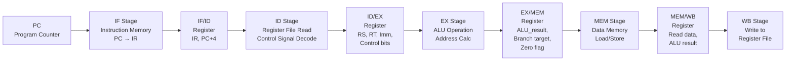

---

## 2. 파이프라인 위험: 데이터, 제어, 구조

### 데이터 위험: RAW(쓰기 후 읽기)

```mermaid
sequenceDiagram
    participant IF
    participant ID
    participant EX
    participant MEM
    participant WB

    Note over IF,WB: ADD R1, R2, R3 — writes R1 in WB (cycle 5)
    Note over IF,WB: SUB R4, R1, R5 — reads R1 in ID (cycle 3) ← STALE!

    rect rgb(80, 20, 20)
        Note over ID: Read R1 before ADD writes it
        Note over ID: RAW Hazard detected
    end
    
    Note over IF,WB: STALL: Insert 2 bubble NOPs
    Note over IF,WB: OR: Forwarding from EX/MEM → EX input
```

**전달(우회) 경로:**

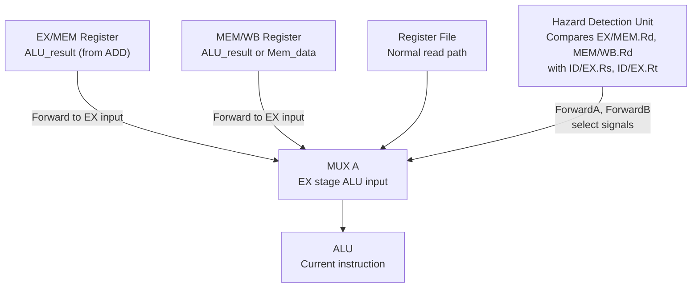

### 통제 위험: 지점 페널티

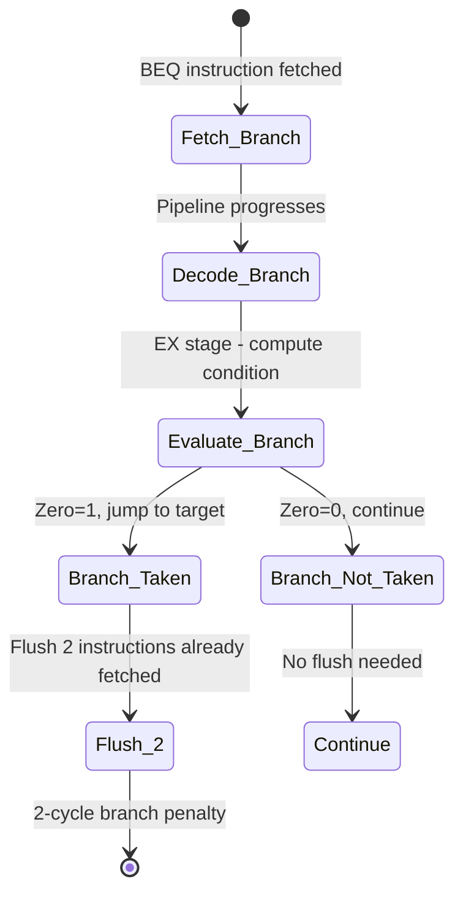

**분기 예측 전략:**

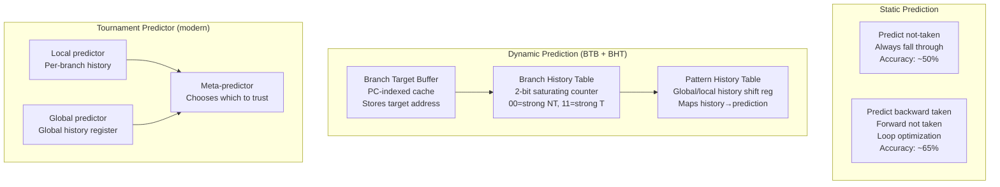

---

## 3. 캐시 아키텍처: SRAM 세트, 방식, 태그

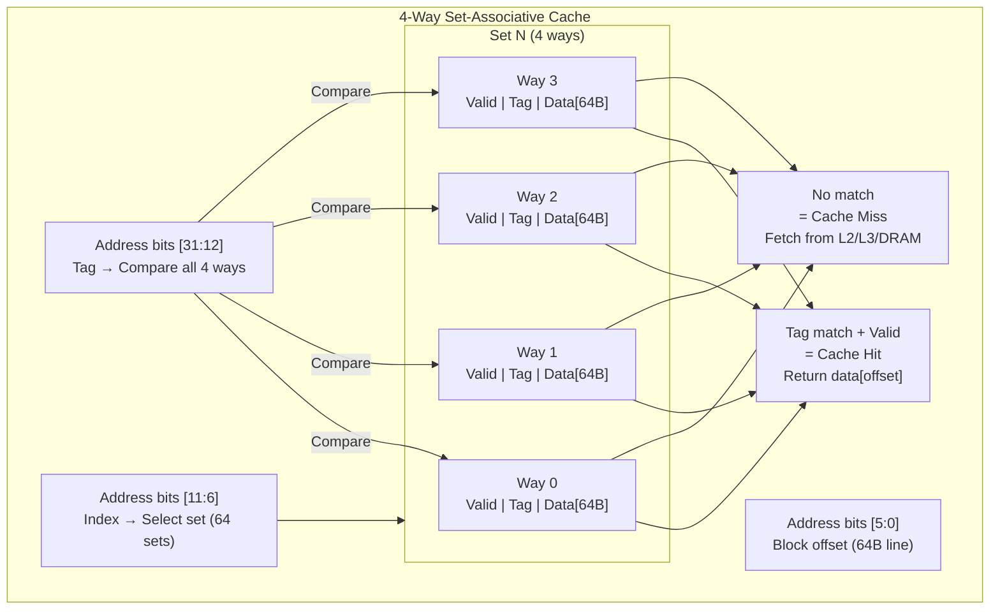

### 캐시 미스 페널티 및 메모리 계층 구조

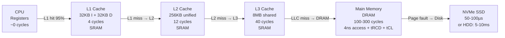

### DRAM 타이밍 내부: 액세스가 100사이클 이상인 이유

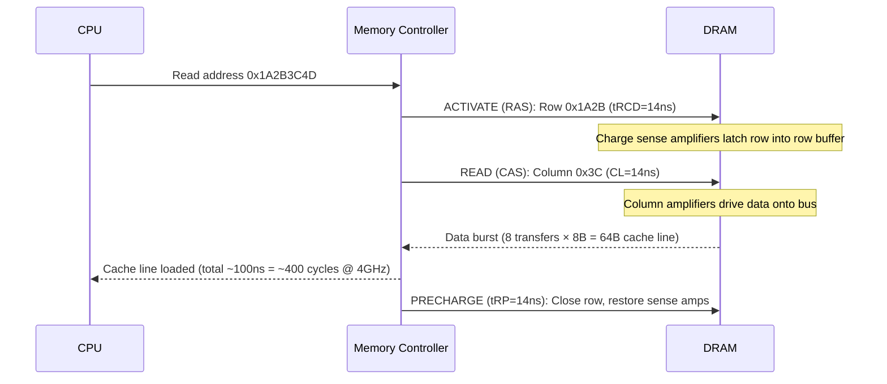

---

## 4. 가상 메모리: TLB, 페이지 테이블, 페이지 폴트

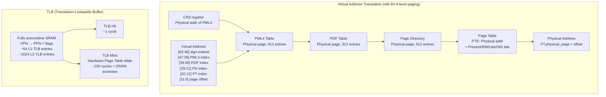

### 페이지 오류 처리기 흐름

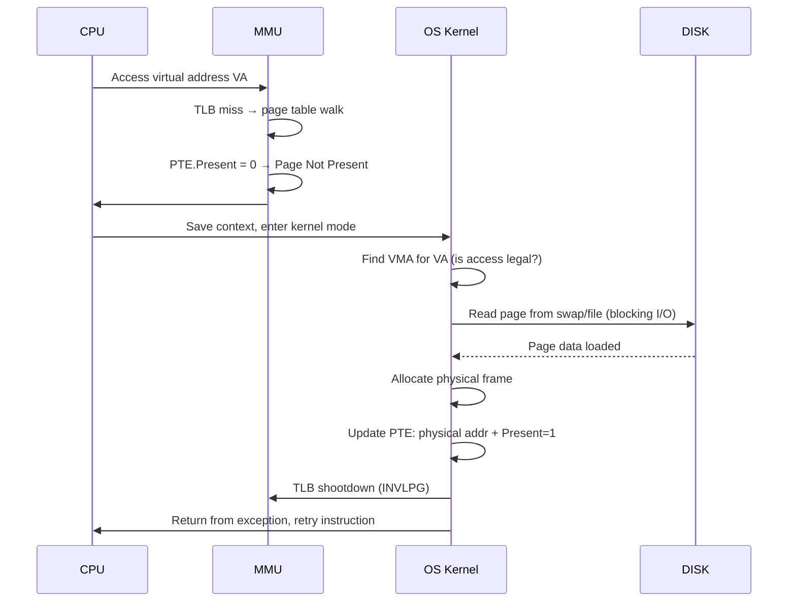

---

## 5. CPU 마이크로아키텍처: 비순차적 실행 내부

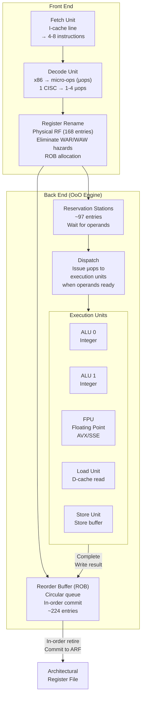

---

## 6. 다중 프로세서 캐시 일관성: MESI 프로토콜

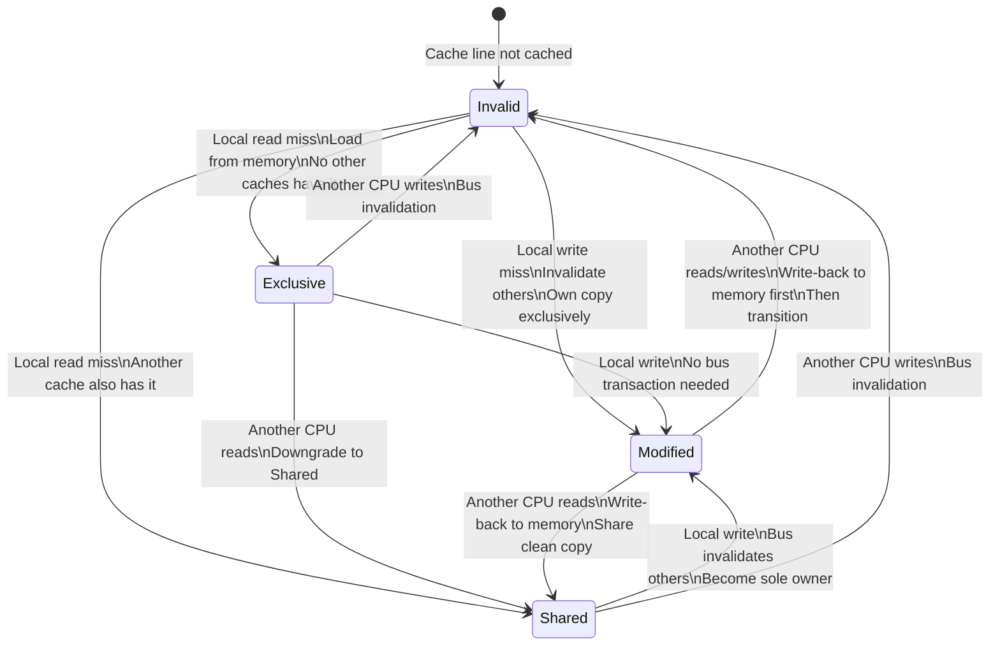

### 캐시 일관성 버스 스누핑

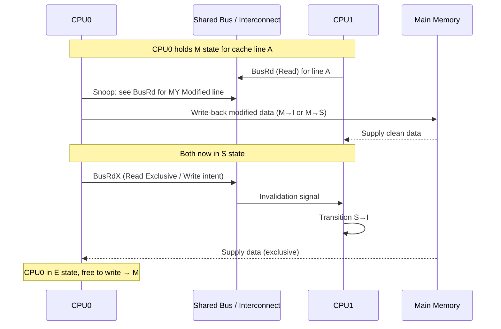

---

## 7. I/O 아키텍처: DMA, 인터럽트, 버스 프로토콜

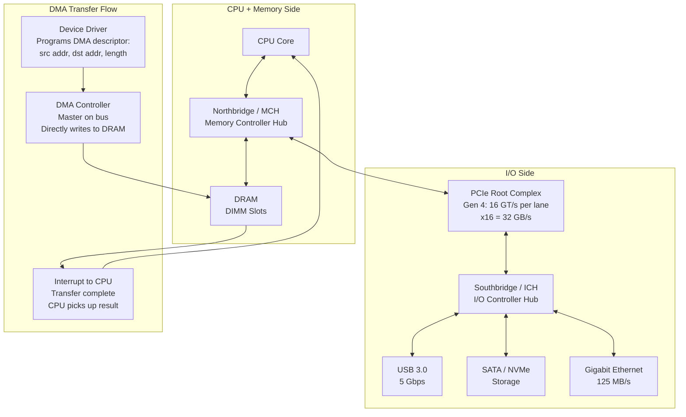

---

## 8. RISC 대 CISC: 디코딩 복잡성 절충

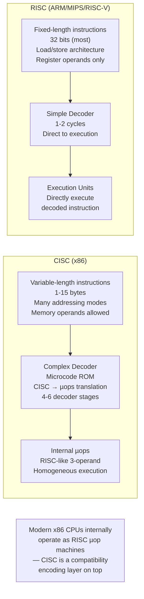

---

## 9. 부동 소수점: IEEE 754 내부 표현

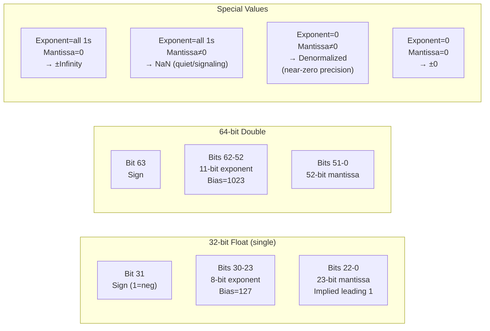

### FPU 파이프라인: 융합 곱셈-덧셈(FMA)

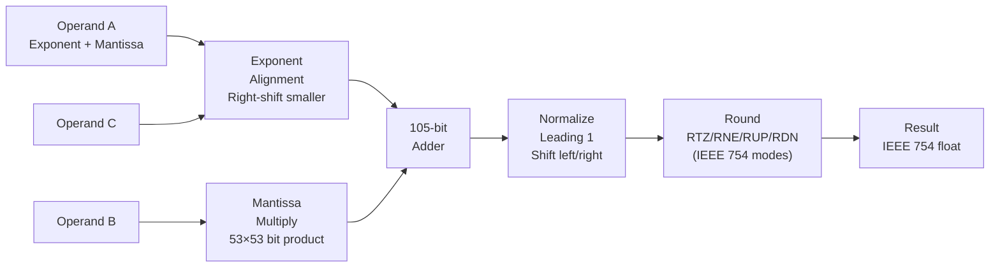

---

## 10. 컴퓨터 아키텍처 설계 원칙(Patterson & Hennessy)

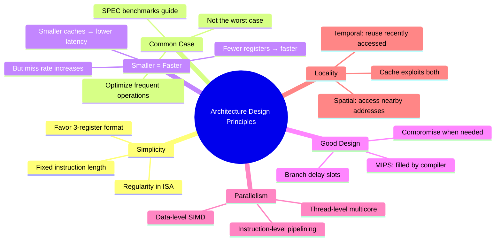

---

## 11. 최신 CPU 마이크로아키텍처 수치(Intel Ice Lake / AMD Zen 3)

| 자원 | 인텔 아이스 레이크 | AMD 젠 3 |
|----------|----------------|-----------|
| ROB 항목 | 352 | 256 |
| 예약 스테이션 | 160 | 128 |
| 물리적 정수 레지스터 | 280 | 192 |
| L1-I 캐시 | 32KB, 8방향 | 32KB, 8방향 |
| L1-D 캐시 | 48KB, 12방향 | 32KB, 8방향 |
| L2 캐시 | 512KB, 16방향 | 512KB, 8방향 |
| L3 캐시 | 12MB, 12방향 | 32MB, 16방향 |
| 디코드 폭 | 5폭 | 4와이드(최대 6μops) |
| 분기 예측자 | TAGE 기반 | 하이브리드 태그 |
| FMA 대기 시간 | 4주기 | 4주기 |
| L1-D 대기 시간 | 5주기 | 4주기 |
| DRAM 대기 시간 | ~70ns | ~70ns |

비순차적 창 크기(ROB, RS, 물리적 레지스터)의 끊임없는 개선은 순차 코드에서 ILP를 추출하는 주요 수단입니다. ROB 크기가 두 배가 될 때마다 루프 반복, 함수 호출 및 독립적인 명령문 시퀀스 전반에 걸쳐 더 많은 병렬성이 노출됩니다.


---

## 설계적 고민

### 구조와 모델링

컴퓨터 아키텍처의 가장 근본적인 구조 결정은 **CISC vs RISC 명령어 집합 설계**입니다. CISC(x86)는 하나의 복잡한 명령어로 많은 작업을 수행하여 코드 밀도가 높지만, 디코딩이 복잡하고 파이프라인 설계가 어렵습니다. RISC(ARM, RISC-V)는 단순하고 균일한 명령어로 파이프라인 효율이 높지만, 동일 작업에 더 많은 명령어가 필요합니다.

현대 x86 프로세서(Intel/AMD)는 내부적으로 CISC 명령어를 μops(마이크로 연산)로 분해하여 RISC 스타일 파이프라인에서 실행합니다. 이는 "외부는 CISC, 내부는 RISC"라는 하이브리드 접근입니다.

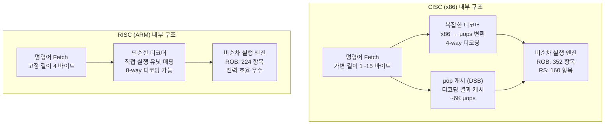

**캐시 계층 구조 설계**는 메모리 벽(Memory Wall) 문제를 해결하기 위한 핵심 아키텍처 결정입니다. L1 캐시는 지연 시간을 최소화(4~5 사이클)하기 위해 작게(32~48KB) 설계하고, L3 캐시는 적중률을 높이기 위해 크게(32MB+) 설계합니다. 각 레벨 간의 크기-지연 시간 트레이드오프가 전체 시스템 성능을 결정합니다.

### 트레이드오프와 의사결정

**분기 예측 전략**은 파이프라인 깊이와 직접 연관된 핵심 의사결정입니다. 파이프라인이 깊을수록(Intel: 14~20 스테이지) 분기 예측 실패 비용이 커지며, 예측 정확도가 전체 성능을 좌우합니다.

```mermaid
flowchart LR
    subgraph "분기 예측 전략 비교"
        STATIC["정적 예측\n항상 taken 또는 not-taken\n정확도: ~60%\n하드웨어 비용: 최소"]
        BIMODAL["2-bit 포화 카운터\nSN→WN→WT→ST 상태 전이\n정확도: ~85%\nBHT 테이블 크기 의존"]
        GSHARE["Gshare\n전역 히스토리 XOR PC\n정확도: ~93%\n이력 패턴 인식"]
        TAGE["TAGE 예측기\n다중 히스토리 길이 테이블\n정확도: ~97%\n현대 Intel/AMD 사용"]
        STATIC -->|"개선"| BIMODAL -->|"개선"| GSHARE -->|"개선"| TAGE
    end
```

**메모리 일관성 모델** 선택도 아키텍처의 중요한 트레이드오프입니다. Sequential Consistency(SC)는 프로그래머에게 직관적이지만 하드웨어 최적화를 제한합니다. Total Store Order(TSO, x86)는 Store-Load 재정렬만 허용하여 적절한 타협점을 제공합니다. Relaxed 모델(ARM, RISC-V)은 최대한의 재정렬을 허용하여 성능은 높지만 프로그래머가 명시적 메모리 배리어를 삽입해야 합니다.

| 모델 | 허용되는 재정렬 | 하드웨어 | 프로그래밍 난이도 |
|---|---|---|---|
| SC (Sequential Consistency) | 없음 | 성능 제한 큼 | 쉬움 |
| TSO (x86) | Store→Load만 | 적절한 타협 | 중간 |
| Relaxed (ARM/RISC-V) | 모든 재정렬 가능 | 최대 성능 | 어려움 (barrier 필수) |

### 리팩토링과 설계 원칙

아키텍처 설계에서 **"Smaller is Faster"** 원칙은 캐시, 레지스터 파일, TLB 등 모든 스토리지 구조에 적용됩니다. 그러나 너무 작으면 미스율이 증가하여 오히려 성능이 떨어지므로, 워크로드 특성에 맞는 최적점을 찾아야 합니다.

```mermaid
flowchart TD
    subgraph "NUMA 아키텍처 최적화 설계"
        CPU0["CPU 0 (소켓 0)\n코어 0~7\nL3: 16MB"]
        CPU1["CPU 1 (소켓 1)\n코어 8~15\nL3: 16MB"]
        RAM0["DRAM 노드 0\n로컬 접근: ~70ns"]
        RAM1["DRAM 노드 1\n로컬 접근: ~70ns"]
        QPI["QPI/UPI 인터커넥트\n원격 접근: ~140ns\n(2배 지연)"]
        CPU0 -->|"로컬"| RAM0
        CPU1 -->|"로컬"| RAM1
        CPU0 <-->|"원격"| QPI <-->|"원격"| CPU1
    end
    subgraph "NUMA 인식 소프트웨어 설계 원칙"
        P1["원칙 1: 데이터 지역성\n스레드가 접근하는 데이터를\n동일 NUMA 노드에 할당"]
        P2["원칙 2: 스레드 핀닝\nnumactl --cpubind로\n스레드를 특정 소켓에 고정"]
        P3["원칙 3: 메모리 인터리빙\n균등 접근 패턴이면\n--interleave=all 사용"]
        P4["원칙 4: 거짓 공유 방지\n캐시 라인(64B) 경계 정렬\n패딩으로 독립 변수 분리"]
        P1 --> P2 --> P3 --> P4
    end
```

**파이프라인 해저드 해결**은 아키텍처 리팩토링의 핵심입니다. 데이터 해저드(RAW, WAR, WAW)는 포워딩과 레지스터 리네이밍으로, 제어 해저드는 분기 예측과 투기적 실행으로, 구조적 해저드는 자원 복제로 해결합니다. 각 해결책은 트랜지스터 비용과 전력 소비를 증가시키므로, 워크로드 분석에 기반한 선택이 필요합니다.

### 디자인 패턴 적용

컴퓨터 아키텍처에서 반복적으로 등장하는 디자인 패턴은 **캐싱**, **예측**, **병렬화**, **계층화**입니다.

```mermaid
flowchart TD
    subgraph "아키텍처 디자인 패턴"
        CACHE_PAT["캐싱 패턴\n느린 자원 앞에 빠른 버퍼 배치\nL1/L2/L3, TLB, BTB, μop 캐시\n시간적/공간적 지역성 활용"]
        PRED_PAT["예측 패턴\n결과를 기다리지 않고 추측 실행\n분기 예측, 프리페치, 투기적 실행\n예측 실패 시 롤백 메커니즘 필수"]
        PARA_PAT["병렬화 패턴\n독립적 작업을 동시에 실행\nILP(파이프라인), DLP(SIMD), TLP(멀티코어)\n암달의 법칙이 상한 결정"]
        HIER_PAT["계층화 패턴\n속도-용량 트레이드오프 분산\n레지스터→L1→L2→L3→DRAM→SSD→HDD\n각 레벨이 다음의 캐시 역할"]
        CACHE_PAT --- PRED_PAT
        PARA_PAT --- HIER_PAT
    end
```

**big.LITTLE 패턴**(ARM의 DynamIQ)은 이기종 멀티코어 설계 패턴입니다. 고성능 코어(Cortex-X4)와 고효율 코어(Cortex-A520)를 결합하여, 고부하 작업은 빅 코어에서, 백그라운드 작업은 리틀 코어에서 실행합니다. 스케줄러가 작업 특성에 따라 적절한 코어에 배치하며, 이는 성능/와트 비율을 극대화합니다.

**Tomasulo 알고리즘 패턴**은 비순차 실행의 근간입니다. 예약 스테이션(RS)이 명령어와 피연산자를 버퍼링하고, 피연산자가 준비되면 실행 유닛에 발행합니다. 레지스터 리네이밍으로 WAR/WAW 해저드를 제거하고, 공통 데이터 버스(CDB)로 결과를 방송합니다. 이 패턴은 1967년 제안되었지만 현대 CPU의 핵심 원리로 여전히 사용됩니다.

---

## 연습 문제

### 1. 시스템 구조와 모델링

**문제 1-1.** 임베디드 시스템 팀이 센서 데이터 처리 파이프라인을 설계하고 있습니다. 5단계 RISC 파이프라인에서 연속된 세 개의 명령이 다음과 같을 때:

```
LW  R1, 0(R2)    # 메모리에서 로드
ADD R3, R1, R4   # R1 사용
SW  R3, 4(R2)    # R3 사용
```

데이터 포워딩(바이패스) 없이 실행하면 몇 사이클의 스톨이 발생하며, 포워딩을 적용하면 어떻게 달라지는지 파이프라인 타이밍 다이어그램으로 모델링하시오. 또한 로드-유즈 해저드가 포워딩만으로 완전히 해결되지 않는 이유를 설명하시오.

<details><summary>힌트 보기</summary>

LW 명령의 결과는 MEM 단계 끝에 나옵니다. ADD는 EX 단계 시작에 R1이 필요합니다. 포워딩은 EX→EX, MEM→EX 경로를 제공하지만, **LW의 MEM 단계와 ADD의 EX 단계가 동일 사이클**에 있으면 MEM 결과를 EX 시작으로 전달할 수 없어 최소 1사이클 스톨(로드 인터락)이 필수입니다.

</details>

**문제 1-2.** 서버 CPU의 캐시 계층을 설계할 때, L1 캐시를 명령 캐시(I-cache)와 데이터 캐시(D-cache)로 분리하는 하버드 아키텍처를 채택했습니다. 그러나 JIT 컴파일러가 런타임에 코드를 생성하여 데이터 영역에 쓴 뒤 실행하려 합니다. 이 시나리오에서 어떤 일관성 문제가 발생하며, 운영체제와 하드웨어 각각이 이를 어떻게 해결하는지 설명하시오.

<details><summary>힌트 보기</summary>

D-cache에 기록된 새 코드가 I-cache에 반영되지 않으면 구버전 명령이 실행됩니다. ARM에서는 `DC CVAU`(데이터 캐시 클린)→`IC IVAU`(명령 캐시 무효화) 시퀀스가 필요하며, x86은 강한 캐시 일관성 모델이라 이 문제가 덜 드러나지만 `CLFLUSH` 계열 명령이 존재합니다.

</details>

**문제 1-3.** MESI 프로토콜을 사용하는 4코어 시스템에서 코어 0이 캐시 라인 X를 Modified 상태로 보유하고 있습니다. 코어 1이 동일 주소를 읽으려 할 때, 버스 스누핑 방식과 디렉토리 기반 방식 각각에서 상태 전이 과정을 단계별로 모델링하시오. 코어 수가 64개로 증가했을 때 각 방식의 확장성 차이는 무엇인가요?

<details><summary>힌트 보기</summary>

버스 스누핑: 코어 1이 BusRd 발행 → 모든 코어가 스누핑 → 코어 0이 Flush(라인 제공) → 코어 0: M→S, 코어 1: I→S. 디렉토리 방식: 코어 1이 홈 노드에 요청 → 디렉토리가 M 소유자(코어 0)에 Intervention 전송 → 코어 0이 데이터 전달. 64코어에서 브로드캐스트 스누핑은 O(N) 트래픽이지만 디렉토리는 O(1) 메시지(포인트-투-포인트)입니다.

</details>

### 2. 트레이드오프와 의사결정

**문제 2-1.** 모바일 AP 설계팀이 분기 예측기 구조를 결정해야 합니다. 2비트 포화 카운터 기반 전역 히스토리(GHR) 예측기와 TAGE(TAgged GEometric) 예측기 사이에서 선택할 때, 다음 워크로드 특성별로 어떤 예측기가 유리한지 분석하시오: (a) 규칙적인 루프 중심 DSP 코드, (b) 가상 함수 호출이 빈번한 객체지향 애플리케이션, (c) 전력 예산이 500mW로 제한된 IoT 디바이스. 각 선택의 트레이드오프를 설명하시오.

<details><summary>힌트 보기</summary>

GHR 예측기는 면적·전력이 작지만 복잡한 분기 패턴 정확도가 낮습니다(~92%). TAGE는 여러 히스토리 길이를 기하급수적으로 인덱싱하여 정확도가 높지만(~97%), 테이블 수와 태그 비교로 면적과 전력이 큽니다. (a)는 GHR로 충분, (b)는 TAGE 필수, (c)는 GHR이 적합합니다.

</details>

**문제 2-2.** 데이터센터 서버에서 64KB L1 D-cache를 설계할 때, 4-way set associative(접근 지연 3사이클)와 8-way set associative(접근 지연 4사이클) 중 선택해야 합니다. SPEC CPU2017 벤치마크에서 4-way의 미스율이 5%, 8-way가 3%일 때, 미스 패널티가 20사이클이라면 어떤 구성이 평균 메모리 접근 시간(AMAT) 관점에서 유리한지 계산하고, 실제 결정 시 고려해야 할 추가 요소를 설명하시오.

<details><summary>힌트 보기</summary>

AMAT = 히트 시간 + 미스율 × 미스 패널티. 4-way: 3 + 0.05 × 20 = 4.0사이클. 8-way: 4 + 0.03 × 20 = 4.6사이클. 단순 AMAT에선 4-way가 유리하지만, L2 미스 패널티(>100사이클)를 고려한 다단계 AMAT, 워크로드의 작업 세트 크기, 전력 소비(비교기 수 증가), 물리적 인덱싱 방식(VIPT 제약) 등이 실제 결정에 영향을 줍니다.

</details>

**문제 2-3.** RISC-V 기반 프로세서를 설계하면서, 부동소수점 연산에 IEEE 754 단정밀도(32비트)와 bfloat16(16비트)을 모두 지원하려 합니다. 딥러닝 추론 워크로드에서 bfloat16을 사용할 때의 정밀도 손실 패턴과, 이것이 허용 가능한 이유를 IEEE 754의 지수/가수 비트 배분 관점에서 설명하시오. 반대로 bfloat16이 부적절한 워크로드 유형을 제시하시오.

<details><summary>힌트 보기</summary>

bfloat16은 지수 8비트(FP32와 동일 범위) + 가수 7비트(FP32의 23비트 대비 정밀도 감소)입니다. 딥러닝에서는 가중치의 대략적 크기(범위)가 정밀한 값보다 중요하여 허용됩니다. 그러나 **과학 시뮬레이션**, **금융 계산** 등 가수 정밀도가 결과 정확도에 직접 영향을 주는 워크로드에서는 부적절합니다.

</details>

### 3. 문제 해결 및 리팩토링

**문제 3-1.** 프로파일링 결과, 멀티스레드 애플리케이션에서 특정 공유 카운터 변수에 대한 원자적 증가 연산(`lock xadd`)이 전체 실행 시간의 40%를 차지합니다. perf stat에서 해당 캐시 라인의 HITM(Modified 히트) 비율이 85%로 나타났습니다. 이 **거짓 공유(false sharing)** 또는 **진짜 공유(true sharing)** 문제를 어떻게 구별하며, 각 경우에 대한 해결 전략을 제시하시오.

<details><summary>힌트 보기</summary>

같은 캐시 라인의 다른 변수도 접근되면 거짓 공유(→ `__attribute__((aligned(64)))` 또는 패딩으로 분리), 같은 변수만 접근되면 진짜 공유(→ 스레드별 로컬 카운터 + 주기적 합산, 또는 CRDT 카운터 도입)입니다. `perf c2c`로 경합 원인을 정확히 식별할 수 있습니다.

</details>

**문제 3-2.** 가상 메모리 시스템에서 TLB 미스율이 비정상적으로 높아 성능이 저하되고 있습니다. 해당 애플리케이션은 16GB 메모리 맵 데이터베이스를 랜덤 접근합니다. 4KB 기본 페이지를 사용 중일 때, TLB 엔트리 수(1536개)로 커버 가능한 주소 범위를 계산하고, 이 문제를 **Huge Page(2MB/1GB)**로 해결할 때의 이점과 잠재적 부작용(내부 단편화, 메모리 압축 방해, 커널 할당 지연)을 분석하시오.

<details><summary>힌트 보기</summary>

4KB × 1536 = 6MB 커버 → 16GB 대비 극히 작아 TLB 스래싱 발생. 2MB 휴지 페이지: 1536 × 2MB = 3GB 커버로 대폭 개선. 그러나 2MB 연속 물리 메모리 확보 필요(메모리 단편화 시 할당 실패), 실제 사용량이 적은 경우 내부 단편화, 그리고 커널의 메모리 컴팩션/마이그레이션이 대형 페이지에서 더 어려워집니다.

</details>

**문제 3-3.** 비순차 실행 프로세서에서 Spectre v1(경계 검사 우회) 취약점이 발견되었습니다. 다음 코드에서 공격이 어떻게 동작하는지 마이크로아키텍처 수준에서 설명하고, 소프트웨어(lfence 삽입)와 하드웨어(투기적 로드 제한) 각 완화 방법의 성능 비용을 비교하시오.

```c
if (x < array1_size) {
    y = array2[array1[x] * 256];
}
```

<details><summary>힌트 보기</summary>

분기 예측기가 조건을 참으로 예측 → 경계를 넘는 x로 `array1[x]`를 투기적 로드 → 비밀 바이트를 인덱스로 `array2`에 접근 → 투기적 실행이 롤백되어도 캐시 상태(array2의 어떤 라인이 적재됨)는 남음 → 캐시 타이밍 사이드 채널로 비밀 바이트 추출. `lfence`는 직렬화하여 투기적 실행 차단(분기 후 파이프라인 플러시, 성능 10~30% 저하), 하드웨어 방식(SLH: Speculative Load Hardening)은 마스킹으로 추가 레이턴시 1~2사이클.

</details>

### 4. 개념 간의 연결성

**문제 4-1.** 캐시 일관성 프로토콜(MESI)과 메모리 일관성 모델(TSO, 약한 순서)은 서로 다른 문제를 해결합니다. 4코어 시스템에서 스핀락을 구현할 때, MESI가 캐시 간 데이터 동기화를 보장하더라도 메모리 일관성 모델에 따라 **스토어 버퍼**로 인해 다른 코어가 잠금 해제를 관찰하지 못하는 시나리오를 구성하시오. 이 문제가 x86(TSO)과 ARM(약한 순서) 각각에서 어떻게 나타나고 해결되는지 비교하시오.

<details><summary>힌트 보기</summary>

MESI는 '캐시 라인 값의 단일 복사본' 문제를 해결하고, 메모리 일관성 모델은 '서로 다른 주소에 대한 연산의 관찰 순서'를 규정합니다. x86 TSO에서는 Store→Load만 재배치 가능하여 `mfence`나 `lock` prefix로 해결. ARM에서는 Store→Store, Load→Load도 재배치 가능하여 `dmb ish`(데이터 메모리 배리어)가 필수입니다.

</details>

**문제 4-2.** 가상 메모리의 주소 변환(TLB + 페이지 테이블 워크)이 캐시 접근과 어떻게 상호작용하는지 분석하시오. VIPT(Virtually Indexed, Physically Tagged) L1 캐시에서 캐시 인덱스 비트가 페이지 오프셋 범위를 초과할 때 발생하는 **앨리어싱 문제**를 설명하고, 이것이 L1 캐시 크기를 (way 수 × 페이지 크기)로 제한하는 이유를 유도하시오.

<details><summary>힌트 보기</summary>

VIPT에서 인덱스의 하위 비트가 페이지 오프셋(4KB = 12비트) 내에 있으면 가상 인덱스 = 물리 인덱스이므로 앨리어싱이 없습니다. 하지만 인덱스가 12비트를 넘으면 같은 물리 주소가 다른 세트에 매핑될 수 있습니다. L1 크기 ≤ way수 × 4KB를 지키면 인덱스 비트가 오프셋 범위 내에 유지되어 안전합니다. 예: 4-way, 64B 라인 → 최대 16KB/way → L1 = 64KB.

</details>

**문제 4-3.** 최신 서버 CPU(예: AMD Zen 4)의 마이크로아키텍처에서 명령 파이프라인, 캐시 계층, 비순차 실행 엔진, 분기 예측이 어떻게 협력하여 IPC(Instructions Per Cycle)를 높이는지 end-to-end로 추적하시오. 특히 L1I 캐시 미스 → μop 캐시 히트 경로와, BTB 미스 시의 프론트엔드 스톨이 백엔드 ROB 활용률에 미치는 영향을 연결하여 설명하시오.

<details><summary>힌트 보기</summary>

프론트엔드: 분기 예측(BTB)→ 페치(L1I 또는 μop 캐시)→ 디코드. L1I 미스 시 μop 캐시에서 디코딩된 명령 직접 공급(디코드 단계 우회). BTB 미스 시 프론트엔드가 잘못된 경로를 페치하여 파이프라인 플러시 → ROB가 비어감(백엔드 유휴). Zen 4: 6-와이드 디스패치, 320-엔트리 ROB, ~5.7 GHz. IPC 향상은 프론트엔드 대역폭(공급)과 백엔드 실행 폭(소비)의 균형에 달려 있습니다.

</details>