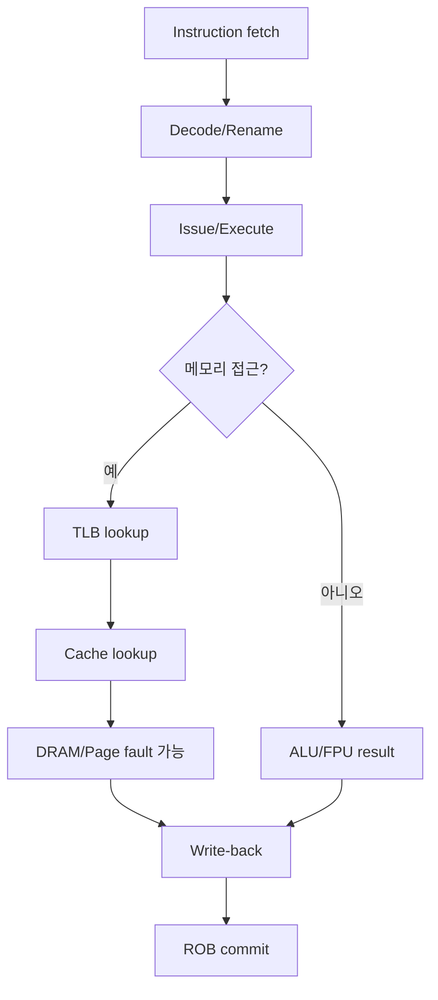
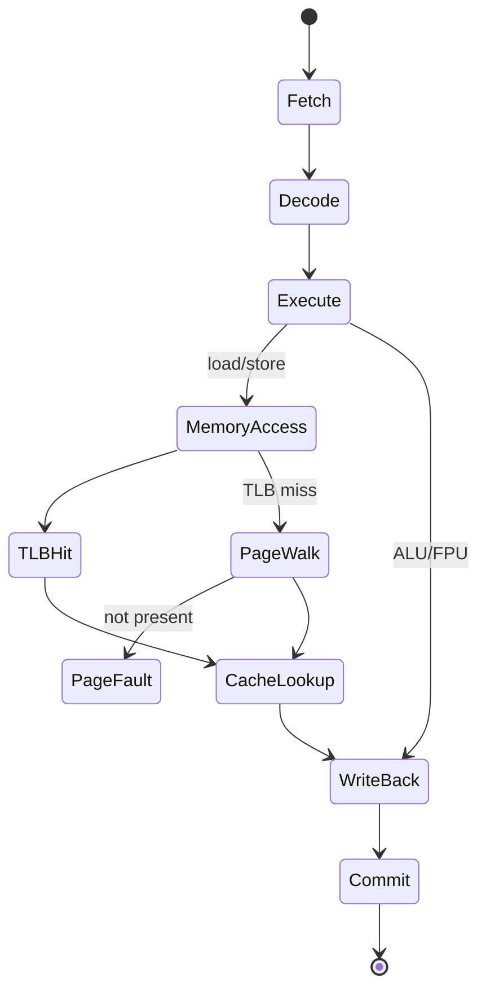
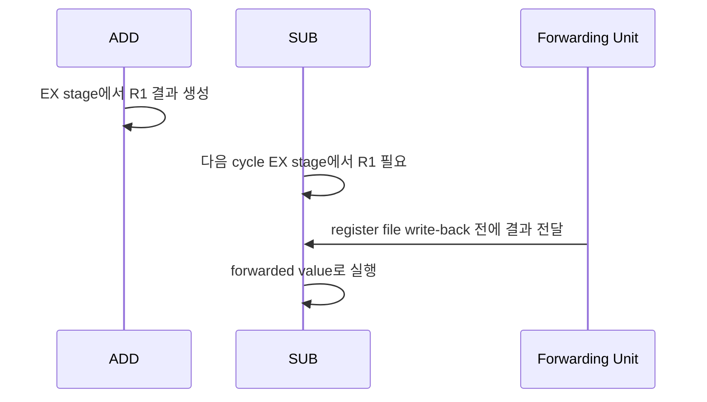

# 컴퓨터 아키텍처 내부 동작 학습 및 기록 노트

## 1. 왜 필요한가? (Pain Point & Motivation)

프로그램 성능과 정확성은 소스 코드만으로 결정되지 않는다. 명령어 pipeline, forwarding, branch prediction, cache/TLB miss, page fault, out-of-order execution, MESI coherence, DMA, floating point rounding 같은 하드웨어 상태가 실행 결과와 지연 시간을 만든다.

이 문서는 원문 한국어 컴퓨터 아키텍처 문서를 하드웨어 상태 전이와 소프트웨어 관측 지점 중심으로 재작성한다.

## 2. 현재 나의 상태 (Baseline)

- CPU가 명령어를 fetch/decode/execute한다는 기본 흐름은 알고 있다.
- pipeline hazard, forwarding, branch prediction을 각각은 알고 있지만 하나의 상태 흐름으로 연결해야 한다.
- cache hit/miss, TLB miss, page fault의 비용 차이를 더 명확히 구분해야 한다.
- OoO 실행에서 register renaming, reservation station, ROB의 역할이 아직 추상적이다.
- MESI, DMA, RISC/CISC, IEEE 754를 소프트웨어 성능 분석과 연결하는 훈련이 필요하다.

## 3. 도달하고 싶은 목표 (Target State)

- instruction 하나가 pipeline stage와 memory hierarchy를 거치는 경로를 설명한다.
- RAW hazard를 stall 또는 forwarding으로 해결하는 방식을 이해한다.
- cache tag/index/offset, TLB, page table walk, page fault를 순서대로 추적한다.
- OoO 실행이 program order commit으로 architectural state를 보존하는 이유를 설명한다.
- multicore 환경에서 cache coherence와 false sharing 문제를 해석한다.

## 4. 시스템 번역 (Data Flow)



컴퓨터 아키텍처를 이해한다는 것은 명령어가 register, pipeline register, cache line, page table, ROB entry를 거쳐 architectural state로 확정되는 과정을 보는 것이다.

## 5. 핵심 구성요소 (Building Blocks)

| 구성요소 | 역할 | 핵심 상태 |
| --- | --- | --- |
| Pipeline stage | IF/ID/EX/MEM/WB 처리 | stage 사이 pipeline register |
| Hazard detection | dependency 충돌 탐지 | producer/consumer register 비교 |
| Forwarding | 아직 write-back 전인 값을 전달 | EX/MEM, MEM/WB bypass path |
| Branch predictor | control hazard 비용 완화 | history table, target buffer |
| Cache | locality 기반 빠른 접근 | tag/index/offset, valid/dirty bit |
| TLB | 주소 변환 cache | VPN -> PPN과 권한 bit |
| Page table | 가상 메모리 mapping | present/RW/user/NX bit |
| ROB | OoO 결과를 순서대로 확정 | in-flight instruction entry |
| MESI | cache line 소유권 관리 | Modified/Exclusive/Shared/Invalid |
| DMA | 장치가 직접 메모리에 접근 | descriptor, completion interrupt |
| IEEE 754 | 부동소수점 표현 | sign, exponent, mantissa, NaN/Inf |

## 6. 상태 전이 (State Transition)



load instruction 하나도 TLB, page table, cache, DRAM, page fault 경로 중 어디를 타느냐에 따라 비용이 크게 달라진다.

## 7. 불변식 (Invariant: 절대 깨지면 안 되는 규칙)

- dependency가 해결되지 않은 값을 consumer instruction이 읽으면 안 된다.
- branch misprediction으로 잘못 가져온 instruction은 commit 전에 제거되어야 한다.
- cache hit는 tag match와 valid bit가 동시에 참이어야 한다.
- page table permission은 권한 위반 시 fault를 발생시켜야 한다.
- OoO 실행은 실행 순서를 바꿔도 commit은 program order를 지켜야 한다.
- 같은 cache line을 여러 core가 동시에 Modified 상태로 가질 수 없다.
- DMA는 OS/IOMMU가 허용한 메모리 범위 안에서만 수행되어야 한다.
- IEEE 754 연산은 rounding mode와 NaN/Inf/denormal 규칙을 지켜야 한다.

## 8. 가장 작은 예제 (Minimal Viable Example)

```text
ADD R1, R2, R3
SUB R4, R1, R5
```



RAW hazard는 `SUB`가 `ADD` 결과를 register file에 쓰기 전에 필요로 하는 상황이다. Forwarding은 이 값을 우회 경로로 전달해 stall을 줄인다.

## 9. 실패 사례 (What could go wrong?)

- forwarding 조건이 빠지면 stale register 값을 읽는다.
- branch flush가 늦으면 잘못된 경로의 store가 architectural state에 반영될 수 있다.
- pointer chasing 자료구조는 cache line locality가 나빠 실제 성능이 크게 떨어진다.
- TLB miss가 많으면 cache hit가 좋아도 page table walk 비용이 드러난다.
- false sharing은 다른 변수를 쓰는 core들이 같은 cache line 때문에 서로 invalidation을 유발하는 문제다.
- floating point 비교에서 NaN과 rounding을 무시하면 테스트가 불안정해진다.

## 10. 뇌 확장하기 (Evolution & Variants)

- Pipeline은 superscalar issue, speculative execution, micro-op cache, vector pipeline으로 확장된다.
- Cache는 replacement policy, write policy, prefetcher, cache inclusivity를 함께 본다.
- Virtual memory는 huge page, copy-on-write, mmap, page cache와 연결된다.
- OoO는 ROB 크기, reservation station, load/store queue, memory disambiguation이 성능 한계를 만든다.
- Multicore는 cache coherence뿐 아니라 memory consistency model과 fence까지 고려해야 한다.
- I/O는 interrupt, polling, DMA, MSI-X, NVMe queue pair 구조로 확장된다.

## 11. 최종 체크리스트 (Definition of Done)

- [x] 파이프라인과 hazard 해결 방식을 상태 전이로 정리했다.
- [x] cache, TLB, page table, page fault를 실행 경로에 포함했다.
- [x] OoO 실행, ROB commit, MESI, DMA, IEEE 754를 핵심 구성요소로 정리했다.
- [x] RAW hazard 최소 예제로 forwarding을 설명했다.
- [x] 원문 한국어 컴퓨터 아키텍처 문서를 12개 섹션 템플릿으로 재작성했다.

## 12. 뇌에 새기는 복습 문장 (TL;DR Blank)

아키텍처 성능 분석은 코드 줄 수가 아니라 명령어가 pipeline, cache, TLB, coherence 상태를 어떻게 통과하는지 추적하는 일이다.
