# 데이터 마이닝 및 빅 데이터 내부

> 소스 합성: Hadoop MapReduce 내부, Spark RDD/DAG 실행, Flink 스트리밍, 열 저장소 압축, LSM 트리 및 데이터 마이닝 알고리즘을 다루는 데이터 마이닝 및 빅 데이터 참고서(comp 234–240, 268–290, 310, 436–438, 441, 446, 448, 453–454, 488).


## 범위와 검증 계약

이 문서는 분산 데이터 처리와 데이터 마이닝의 내부 경로를 비교하기 위한 개념 지도이며, 특정 배포판의 최신 운영 기본값을 보장하는 런북이 아닙니다.

- **범위:** HDFS/MapReduce, Spark, Flink, Kafka, 열 지향 포맷, LSM 계열 저장소와 대표 분석 알고리즘을 다룹니다. 관리형 서비스나 플러그인의 동작은 이름과 버전이 명시된 경우에만 해당합니다.
- **버전·환경 전제:** 128MB 블록, 복제 계수 3, 100MB 버퍼, 32KB 네트워크 버퍼, 64MB 멤테이블, 4KB 블록, Bloom filter의 bits/key와 오류율 같은 값은 설명용 설정 예시입니다. 적용 전 제품·배포판·버전·설정 키·하드웨어·저장소·내구성 정책을 기록해야 합니다.
- **사실·예시·추론:** 데이터 흐름과 알고리즘 불변식은 명시된 시스템 모델 안의 설명이고, 다이어그램의 용량·처리량·압축률은 예시입니다. 최적화 효과와 병목 원인은 측정 전까지 가설로 취급합니다.
- **보장 범위:** off-heap과 zero-copy는 객체 할당이나 복사 경로를 줄일 수 있을 뿐 GC, 복사, 네이티브 메모리 위험의 부재를 뜻하지 않습니다. Kafka의 exactly-once도 트랜잭션 경계와 지원되는 source/sink 안의 보장이며 외부 데이터베이스 반영에는 멱등성 또는 별도 원자성 설계가 필요합니다.
- **완료 기준:** 데이터셋·스키마·파티션·동시성·캐시 상태를 고정하고 실행 계획, 스캔 바이트, shuffle/spill, GC, checkpoint와 복구 결과를 전후 비교해야 성능 또는 내결함성 주장을 완료로 판정합니다.

---

## 1. Hadoop MapReduce — 실행 내부

```mermaid
flowchart TD
    subgraph "MapReduce Pipeline"
        Input["HDFS Input Files\n(128MB blocks)"]
        IS["InputSplit\n(logical split ≤ 1 block)\n→ 1 Map task per split"]
        Map["Map Tasks (parallel)\nmap(k1,v1) → list(k2,v2)\nrun on same DataNode as block\n(data locality)"]
        Buffer["In-memory Sort Buffer\n(io.sort.mb=100MB default)\nSpillThreshold=0.80\n→ sorted runs spilled to disk"]
        Combine["Combiner (optional)\nlocal reduce-like aggregation\nbefore shuffle\n→ reduces network traffic"]
        Shuffle["Shuffle + Sort\nHTTP fetch from Map outputs\n→ merge-sort by key\n(external merge sort)\nGrouped by key for Reduce"]
        Reduce["Reduce Tasks\nreduce(k2, list(v2)) → list(k3,v3)"]
        Output["HDFS Output\n(replication factor=3)"]
    end

    Input --> IS --> Map --> Buffer --> Combine --> Shuffle --> Reduce --> Output

    subgraph "HDFS Block Layout"
        NN["NameNode\n- fsimage: namespace tree\n- edit log: recent mutations\n- block→DataNode mapping (in-memory)\n- heartbeat every 3s\n- block report every 6h"]
        DN["DataNode × N\n- store 128MB block files\n- block scanner: CRC32 verify\n- pipeline write: client → DN1 → DN2 → DN3"]
        NN <-->|"RPC"| DN
    end
```

### MapReduce Shuffle 심층 분석

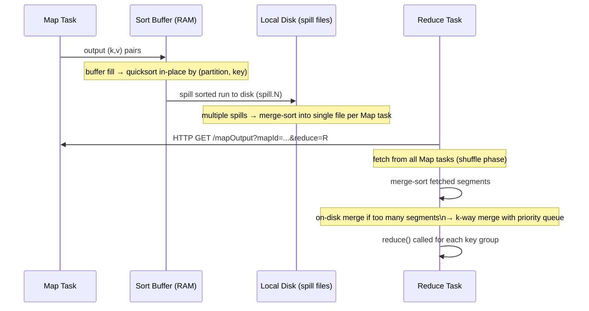

---

## 2. Apache Spark — RDD, DAG 및 실행

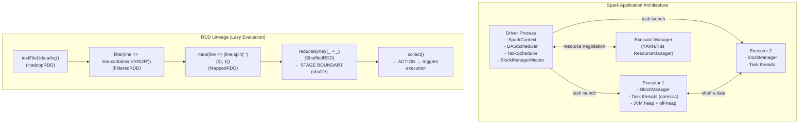

### DAG 스케줄러 — 단계 분할

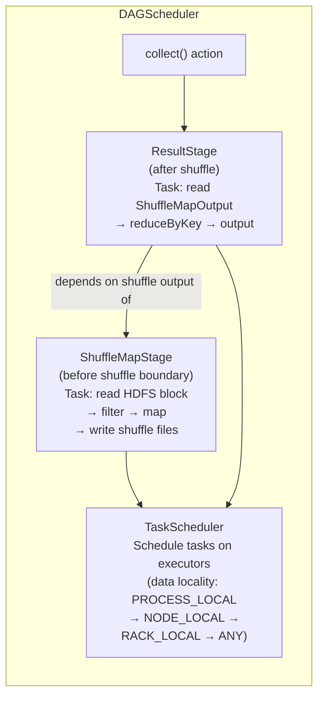

### 셔플 내부(정렬 기반)

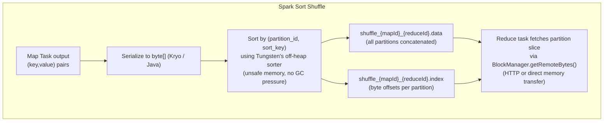

---

## 3. Spark Tungsten — 오프힙 바이너리 형식

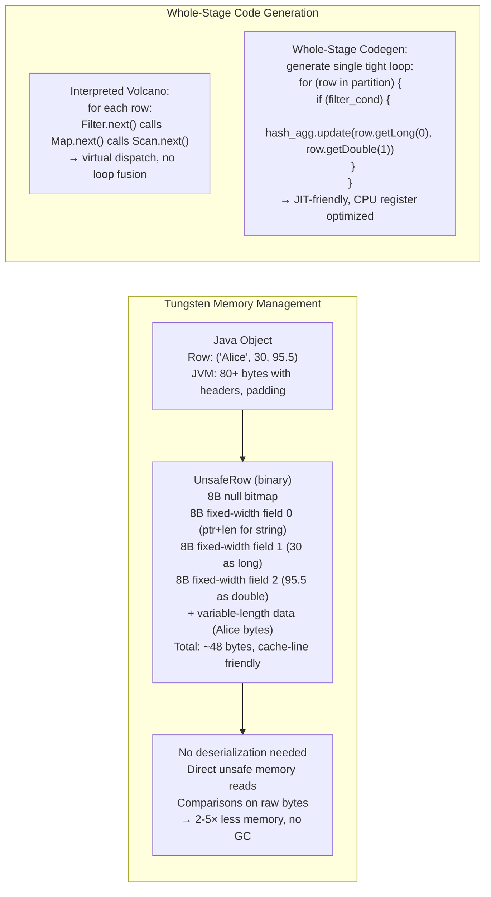

---

## 4. Apache Flink — 스트리밍 실행 내부

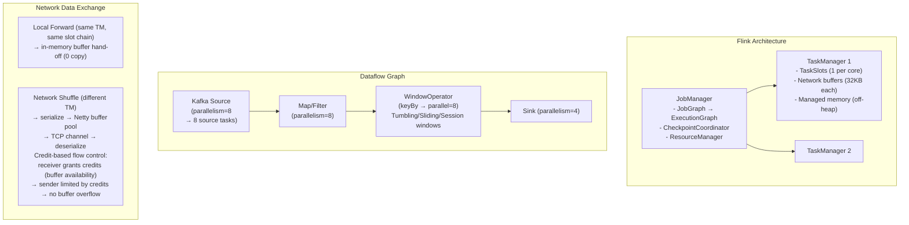

### Flink 체크포인트 - Chandy-Lamport 알고리즘

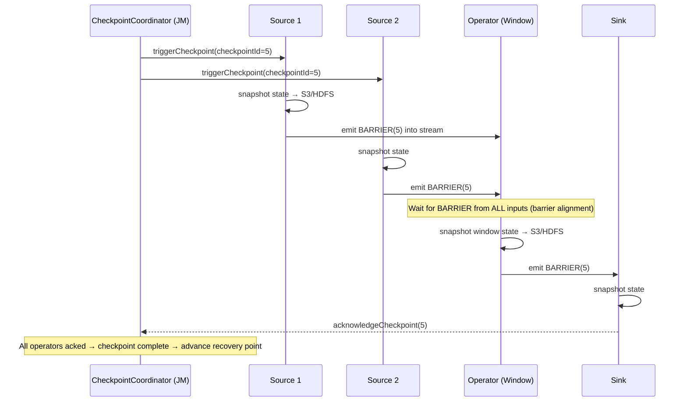

---

## 5. LSM 트리 - 경로 내부 쓰기

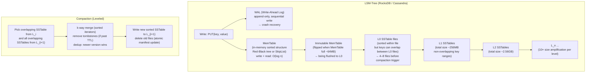

### SSTable 블룸 필터 + 인덱스

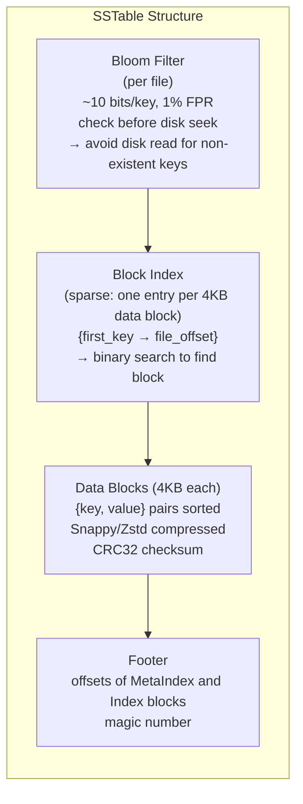

---

## 6. 열 저장소 — 압축 및 벡터화된 실행

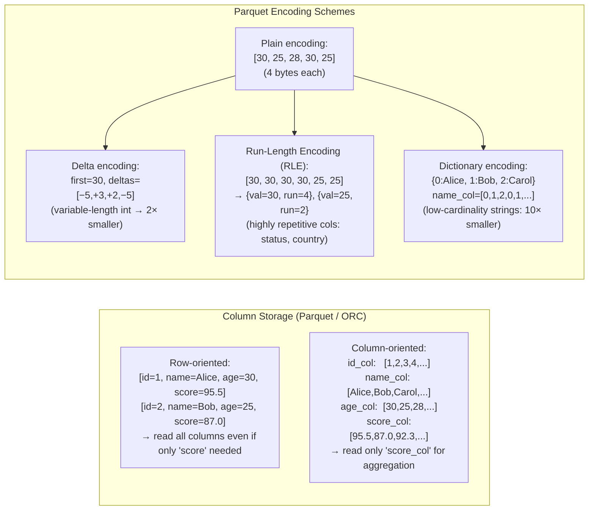

### 벡터화된 쿼리 실행

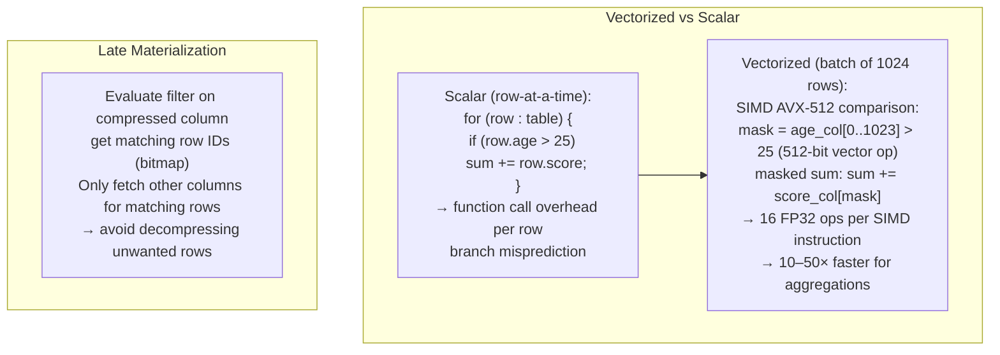

---

## 7. 빈번한 항목 집합 마이닝 - Apriori & FP-Growth

```mermaid
flowchart TD
    subgraph "Apriori Algorithm"
        D["Transaction database\nT1: {milk, bread, beer}\nT2: {milk, bread}\nT3: {bread, beer, diapers}"]
        C1["C1 (candidate 1-itemsets):\n{milk:2, bread:3, beer:2, diapers:1}"]
        L1["L1 (freq 1-itemsets, minSup=2):\n{milk:2, bread:3, beer:2}"]
        C2["C2 (candidate 2-itemsets from L1):\n{milk,bread}, {milk,beer}, {bread,beer}"]
        L2["L2 (freq 2-itemsets):\n{milk,bread:2}, {bread,beer:2}"]
        Prune["Anti-monotone pruning:\nif {milk,beer,bread} has subset {milk,beer} not freq\n→ prune (all subsets must be frequent)"]
    end
    D --> C1 --> L1 --> C2 --> L2 --> Prune

    subgraph "FP-Growth (no candidate generation)"
        FPTree["FP-Tree:\ncompressed prefix tree\nheader table → linked list per item\nTwo DB scans: 1. freq items 2. build tree"]
        ConditionalDB["Conditional Pattern Base:\nfor each freq item β:\n  extract all paths to β\n  form conditional FP-tree\n  mine recursively"]
        FPTree --> ConditionalDB
    end
```

---

## 8. K-평균 군집화 — Lloyd의 알고리즘 내부

```mermaid
flowchart TD
    subgraph "K-Means Iteration"
        Init["Initialize k centroids\n(K-means++: D² weighted sampling\n→ spread-out initialization)"]
        Assign["Assignment step:\nfor each point x_i:\n  c(x_i) = argmin_k ‖x_i - μ_k‖²\n(nearest centroid)\nO(n·k·d) per iteration"]
        Update["Update step:\nμ_k = (1/|C_k|) Σ_{x∈C_k} x\n(mean of assigned points)"]
        Converge["Convergence:\ncentroids change < ε\nor max_iter reached\nObjective: minimize inertia\n= Σ_i min_k ‖x_i - μ_k‖²"]
    end
    Init --> Assign --> Update --> Converge
    Update -->|"not converged"| Assign

    subgraph "Distributed K-Means (Spark MLlib)"
        Partitions["Partitions: data distributed across executors"]
        LocalSum["Local aggregation:\neach partition sums points per cluster\n→ (cluster_id, sum_vector, count)"]
        GlobalReduce["Driver reduces partial sums:\nμ_k = Σ(local_sum_k) / Σ(local_count_k)"]
        Broadcast["Broadcast new centroids to all executors"]
        Partitions --> LocalSum --> GlobalReduce --> Broadcast --> LocalSum
    end
```

---

## 9. 연관 규칙 마이닝 - 신뢰도 및 상승도

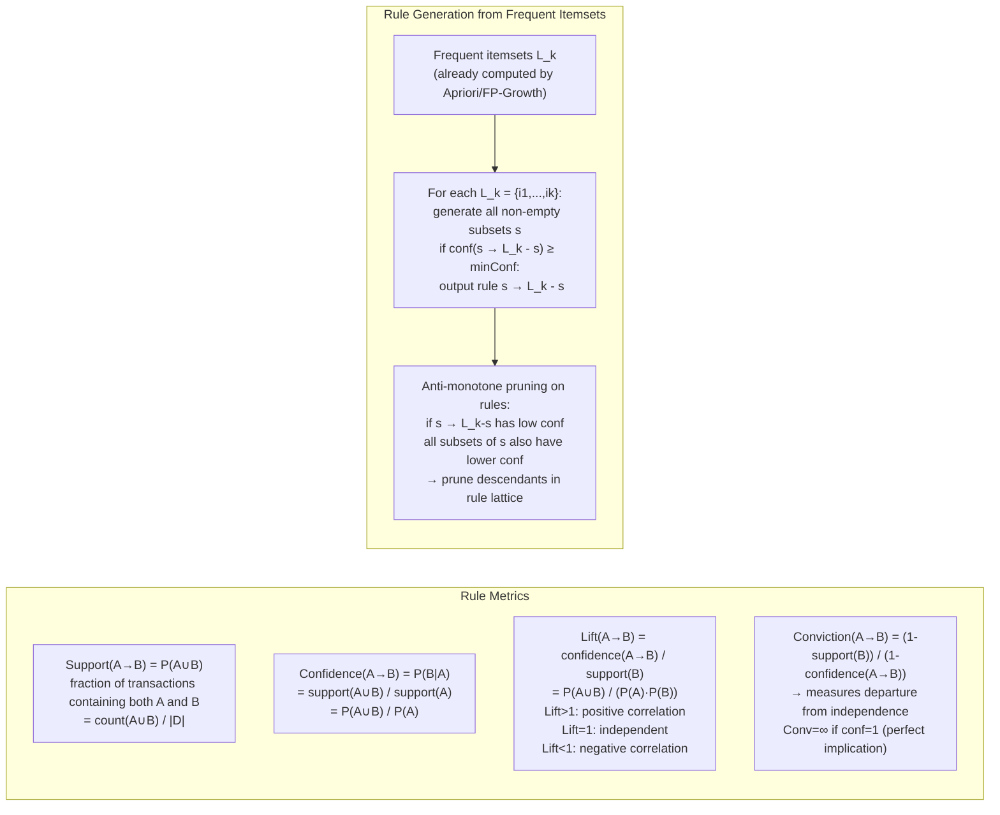

---

## 10. 스트리밍 데이터 - 저장소 샘플링 및 최소 카운트 스케치

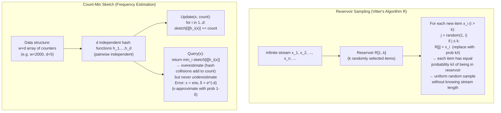

---

## 11. HDFS 쓰기 경로 — 3× 복제 파이프라인

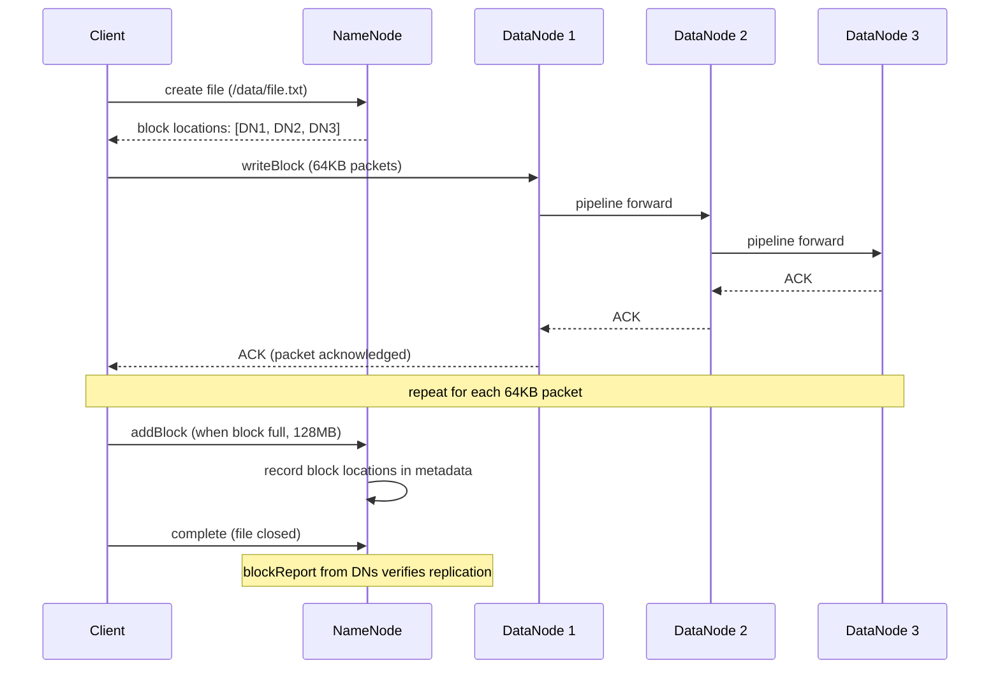

---

## 12. 데이터 웨어하우스 — 스타 스키마 및 쿼리 최적화

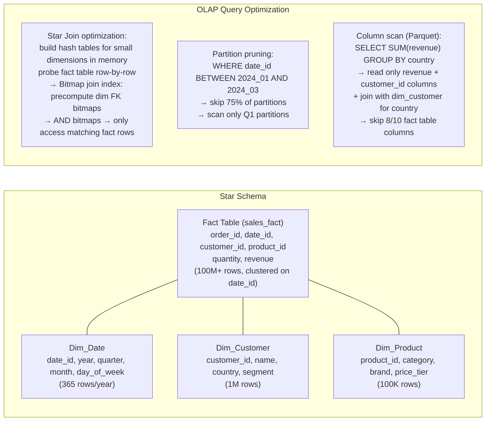

---

## 13. PageRank — 반복 그래프 계산

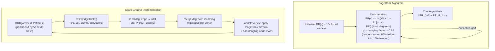

---

## 14. 성능 수치

```mermaid
block-beta
  columns 2
  block:hadoop_perf["Hadoop MapReduce"]:1
    h1["Map task startup: ~1–2s (JVM launch)"]
    h2["Shuffle I/O: bottleneck for large jobs"]
    h3["Sort buffer: io.sort.mb=100–512MB per task"]
    h4["Typical job: minutes to hours"]
  end
  block:spark_perf["Apache Spark"]:1
    s1["Task startup: ~10ms (JVM reuse)"]
    s2["In-memory cache: 10–100× faster than disk"]
    s3["Shuffle: ~50–200ms for 100M rows"]
    s4["Tungsten off-heap: 2–5× less memory than Java objs"]
  end
  block:lsm_perf["LSM-Tree (RocksDB)"]:1
    l1["Write: ~100K–1M ops/sec (sequential WAL)"]
    l2["Point read: ~100–500K ops/sec"]
    l3["Compaction write amp: 10–30× leveled"]
    l4["Bloom filter FPR: 1% at 10 bits/key"]
  end
  block:col_perf["Column Store"]:1
    c1["Scan 1B rows, 1 column: ~1–10s (Parquet+Spark)"]
    c2["Dictionary encoding: 10× compression for strings"]
    c3["SIMD vectorized filter: 50–200M rows/sec per core"]
    c4["Late materialization: 5–10× vs row scan"]
  end
```

---

## 주요 내용

- **MapReduce 셔플**은 주요 I/O 비용입니다. 결합기는 로컬 사전 집계를 수행하여 네트워크 바이트를 줄입니다. Spill 파일은 Reduce 전에 외부 k-way 병합을 사용하여 병합 정렬됩니다.
- **Spark DAG**는 셔플 경계에서 단계로 분할됩니다. 단계 내의 작업은 완전히 파이프라인됩니다(연산자 간 직렬화 없음). 텅스텐 오프힙 행으로 GC 일시중지 방지
- **LSM-Tree**는 읽기 증폭을 희생하면서 무작위 쓰기를 순차 I/O(MemTable → WAL → 정렬된 SSTable 파일)로 변환하여 높은 쓰기 처리량을 달성합니다(여러 레벨을 확인해야 함).
- SSTable의 **블룸 필터**는 포인트 쿼리 누락을 O(레벨) 대신 O(1) I/O로 만듭니다. 키당 10비트는 ~1%의 거짓 긍정 비율을 제공합니다.
- **열 저장소 + 사전 인코딩**은 카디널리티가 낮은 열(국가, 상태, 범주)에 가장 효과적입니다. 단조롭게 증가하는 타임스탬프에 대한 델타 인코딩; 반복되는 값에 대한 RLE
- **FP-Growth**는 압축된 접두사 트리를 구축하고 조건부 데이터베이스를 반복적으로 마이닝하여 Apriori의 기하급수적인 후보 생성을 방지합니다. 밀도가 높은 데이터 세트의 경우 훨씬 더 빠릅니다.
- **Flink 체크포인트**는 Chandy-Lamport 장벽 주입을 사용합니다. 장벽은 데이터 흐름 그래프를 통해 흐릅니다. 모든 입력의 장벽이 도착하면 운영자는 상태를 스냅샷합니다(정렬된 체크포인트).


---

## 설계적 고민

### 구조와 모델링

빅데이터 시스템 설계의 출발점은 **데이터 처리 패러다임의 선택**이다. 배치 처리와 스트림 처리는 단순한 도구 차이가 아니라, 데이터의 완전성(completeness)과 실시간성(timeliness) 사이의 근본적 트레이드오프를 반영한다.

**MapReduce vs Spark: 디스크 기반 vs 인메모리 처리**: MapReduce는 각 단계(Map → Shuffle → Reduce)의 중간 결과를 HDFS 디스크에 기록한다. 이는 극도의 내결함성을 제공하지만, 반복적 알고리즘(ML, 그래프 처리)에서 I/O 병목이 심각하다. Spark는 중간 결과를 메모리에 유지(RDD/DataFrame)하여 반복 작업에서 10-100배 빠르지만, 셔플 단계에서는 여전히 디스크를 사용한다.

Spark의 핵심 설계 결정은 **지연 평가(Lazy Evaluation)**이다. 변환(map, filter, join)은 즉시 실행되지 않고 DAG로 기록되며, 액션(collect, save)이 호출될 때 비로소 최적화된 실행 계획이 생성된다. 이를 통해 Catalyst 옵티마이저가 전체 DAG를 분석하여 술어 밀어내기(predicate pushdown), 프로젝션 가지치기(projection pruning) 등의 최적화를 적용한다.

```mermaid
flowchart TD
    subgraph MR["MapReduce 실행 모델"]
        INPUT1["HDFS 입력"] --> MAP1["Map 단계\n(디스크 읽기)"]
        MAP1 --> |"디스크 쓰기"| SHUFFLE1["Shuffle\n(네트워크 전송)"]
        SHUFFLE1 --> |"디스크 읽기"| REDUCE1["Reduce 단계"]
        REDUCE1 --> |"디스크 쓰기"| OUTPUT1["HDFS 출력"]
        OUTPUT1 --> |"다음 MR 잡\n(디스크 읽기)"| MAP2["Map 단계 2"]
    end

    subgraph SPARK["Spark 실행 모델"]
        INPUT2["HDFS/S3 입력"] --> STAGE1["Stage 1\n(파이프라인 실행\n메모리 유지)"]
        STAGE1 --> |"셔플 (디스크)"| STAGE2["Stage 2\n(메모리 유지)"]
        STAGE2 --> |"메모리 캐시"| STAGE3["Stage 3\n(반복 접근 최적화)"]
        STAGE3 --> OUTPUT2["출력"]
    end
```

**배치 처리 vs 스트림 처리(Lambda/Kappa 아키텍처)**: Lambda 아키텍처는 배치 레이어(정확한 전체 재계산)와 스피드 레이어(실시간 근사 처리)를 병행하고, 서빙 레이어에서 두 결과를 합친다. 정확성과 실시간성을 모두 달성하지만, 동일한 로직을 두 시스템(Spark + Flink)에 중복 구현해야 하는 **코드 이중화** 문제가 있다.

Kappa 아키텍처는 모든 처리를 스트림으로 통합한다. Kafka를 불변 이벤트 로그로 사용하고, 재처리가 필요하면 오프셋을 되감아 전체 스트림을 재실행한다. 코드 이중화를 제거하지만, 대규모 히스토리 재처리 시 시간과 비용이 크다.

```mermaid
flowchart TD
    subgraph Lambda["Lambda 아키텍처"]
        SRC1["데이터 소스"] --> KAFKA1["Kafka"]
        KAFKA1 --> BATCH["배치 레이어\n(Spark)\n- 전체 재계산\n- 높은 정확도\n- 높은 지연"]
        KAFKA1 --> SPEED["스피드 레이어\n(Flink)\n- 실시간 근사치\n- 낮은 지연\n- 근사 정확도"]
        BATCH --> SERVING["서빙 레이어\n(배치 + 실시간 결합)"]
        SPEED --> SERVING
    end

    subgraph Kappa["Kappa 아키텍처"]
        SRC2["데이터 소스"] --> KAFKA2["Kafka\n(불변 이벤트 로그)"]
        KAFKA2 --> STREAM["스트림 처리\n(Flink)\n- 단일 코드베이스\n- 재처리: 오프셋 리셋"]
        STREAM --> VIEW["서빙 뷰"]
    end
```

### 트레이드오프와 의사결정

**OLAP vs OLTP: 분석용 vs 트랜잭션용 데이터 모델 차이**: OLTP(Online Transaction Processing)는 개별 레코드의 빠른 읽기/쓰기(포인트 쿼리)에 최적화되어 있다. 행 기반 저장, B-Tree 인덱스, 정규화된 스키마를 사용한다. OLAP(Online Analytical Processing)는 대량의 레코드를 집계하는 분석 쿼리에 최적화되어 있다. 열 기반 저장, 비정규화된 스타 스키마, 비트맵 인덱스를 사용한다.

핵심 트레이드오프는 **쓰기 최적화 vs 읽기 최적화**이다. OLTP의 행 기반 저장은 하나의 레코드를 한 번에 쓸 수 있어 INSERT가 빠르지만, 단일 열의 집계(SUM, AVG)를 위해 전체 행을 읽어야 한다. OLAP의 열 기반 저장은 필요한 열만 읽어 I/O를 대폭 줄이지만, 전체 행의 INSERT는 각 열 파일에 분산 기록해야 하므로 느리다.

```mermaid
flowchart LR
    subgraph OLTP_MODEL["OLTP 데이터 모델"]
        direction TB
        ROW["행 기반 저장\n| id | name | amount | date |\n| 1  | Kim  | 5000   | 2025 |\n| 2  | Lee  | 3000   | 2025 |"]
        ROW --> BTREE["B-Tree 인덱스\n- 포인트 쿼리 O(log N)\n- 범위 스캔 효율적"]
        BTREE --> NORM["정규화 스키마\n- 3NF / BCNF\n- 중복 최소화\n- JOIN 필요"]
    end

    subgraph OLAP_MODEL["OLAP 데이터 모델"]
        direction TB
        COL["열 기반 저장\n| id: [1,2,3,...] |\n| amount: [5000,3000,...] |\n필요한 열만 읽기"]
        COL --> COMP["압축\n- RLE, Dictionary\n- 10-100× 압축률\n- 벡터화 실행"]
        COMP --> STAR["스타 스키마\n- Fact + Dimension 테이블\n- 비정규화\n- 사전 집계(Cube)"]
    end
```

**데이터 레이크 vs 데이터 웨어하우스 vs 레이크하우스**: 데이터 아키텍처의 진화는 각 접근의 한계를 극복하려는 시도에서 비롯된다.

데이터 웨어하우스(Redshift, BigQuery)는 정형 데이터에 대한 빠른 분석 쿼리를 제공하지만, 비정형 데이터(로그, 이미지)를 저장하기 어렵고, 스토리지 비용이 높다. 데이터 레이크(S3 + Hive)는 모든 형태의 원시 데이터를 저비용으로 저장하지만, 스키마 관리가 느슨하여 **데이터 늪(Data Swamp)**으로 전락하기 쉽고, ACID 트랜잭션을 지원하지 않는다.

레이크하우스(Delta Lake, Apache Iceberg, Apache Hudi)는 두 접근의 장점을 결합한다. 데이터 레이크의 저비용 저장(S3/HDFS) 위에 ACID 트랜잭션, 스키마 진화(Schema Evolution), 타임 트래블(Time Travel)을 추가한다.

| 기준 | 데이터 웨어하우스 | 데이터 레이크 | 레이크하우스 |
|------|----------------|-------------|------------|
| 데이터 형태 | 정형 데이터만 | 정형 + 비정형 | 정형 + 비정형 |
| ACID 트랜잭션 | ✅ 완전 지원 | ❌ 없음 | ✅ Delta/Iceberg |
| 스키마 관리 | 엄격 (Schema-on-Write) | 느슨 (Schema-on-Read) | 유연 (Schema Evolution) |
| 쿼리 성능 | ⚡ 매우 빠름 | 🐢 느림 (full scan) | ⚡ 빠름 (Z-order, 통계) |
| 비용 | 💰💰💰 | 💰 | 💰💰 |
| 동시 쓰기 | ✅ | ⚠️ 충돌 위험 | ✅ (OCC) |

### 리팩토링과 설계 원칙

**파티셔닝 전략: 시간 기반 vs 해시 기반 vs 범위 기반**: 대규모 데이터셋의 파티셔닝 전략은 쿼리 성능에 직접적 영향을 미친다. 잘못된 파티셔닝은 데이터 스큐(skew)를 유발하여 특정 파티션에 부하가 집중되고, 전체 처리 시간이 가장 느린 파티션에 의해 결정된다.

시간 기반 파티셔닝(`dt=2025-03-03`)은 시계열 데이터의 범위 쿼리에 최적이다. 최근 데이터 조회가 빈번한 패턴에서 파티션 프루닝이 효과적이다. 해시 기반 파티셔닝(`hash(user_id) % N`)은 데이터를 균등 분산하여 스큐를 방지하지만, 범위 쿼리가 불가능하다. 범위 기반 파티셔닝(`price: 0-100, 100-500, 500+`)은 범위 쿼리에 효과적이지만, 데이터 분포가 불균일하면 스큐가 발생한다.

```mermaid
flowchart TD
    DATA["대규모 데이터셋"] --> Q{"주요 쿼리 패턴?"}
    
    Q -->|"시간 범위 쿼리\n(최근 7일 데이터)"| TIME["시간 기반 파티셔닝\ndt=2025-03-01/\ndt=2025-03-02/\n장점: 파티션 프루닝\n단점: 최신 파티션 핫스팟"]
    
    Q -->|"포인트 쿼리\n(특정 사용자)"| HASH["해시 기반 파티셔닝\nhash(user_id) % 256\n장점: 균등 분산\n단점: 범위 쿼리 불가"]
    
    Q -->|"범위 + 균등 분산"| COMPOSITE["복합 파티셔닝\n1차: 시간 (일별)\n2차: 해시 (사용자)\n장점: 유연한 쿼리\n단점: 파티션 수 폭증"]
```

**소규모 파일 문제(Small File Problem) 리팩토링**: 스트림 처리 파이프라인이 분 단위로 파일을 생성하면, HDFS/S3에 수백만 개의 소규모 파일이 축적되어 NameNode 메모리 압박과 쿼리 성능 저하를 유발한다. 이를 해결하는 설계 원칙은 **주기적 컴팩션(Compaction)**이다.

Delta Lake의 `OPTIMIZE` 명령, Hudi의 Compaction, Iceberg의 `rewrite_data_files`가 소규모 파일을 병합하여 최적 크기(128MB-1GB)로 재구성한다. Z-ordering이나 Hilbert 곡선을 적용하여 자주 필터링되는 열 기준으로 데이터를 정렬하면, 파티션 프루닝 효과가 극대화된다.

### 디자인 패턴 적용

**메디에이터 패턴(Mediator Pattern)과 쿼리 엔진**: 빅데이터 에코시스템에서 Presto/Trino 같은 연합 쿼리 엔진은 메디에이터 패턴의 전형적 적용이다. 다양한 데이터 소스(HDFS, S3, MySQL, Elasticsearch, Kafka)를 직접 연결하지 않고, 중앙 쿼리 엔진이 통합 SQL 인터페이스를 제공한다.

이 패턴의 핵심 이점은 **데이터 이동 최소화**이다. 데이터를 하나의 저장소로 복사하지 않고, 원본 위치에서 직접 쿼리한다. Trino의 커넥터 아키텍처는 각 데이터 소스에 대한 어댑터를 제공하여, 사용자는 데이터의 물리적 위치를 의식하지 않고 `SELECT * FROM hive.logs JOIN mysql.users` 같은 크로스-소스 조인을 실행할 수 있다.

```mermaid
flowchart TD
    USER["분석가\n(SQL 쿼리)"] --> TRINO["Trino 쿼리 엔진\n(메디에이터)\n- 분산 실행 계획\n- 비용 기반 최적화\n- 메모리 내 처리"]
    
    TRINO --> HIVE["Hive Connector\n(S3 Parquet)"]
    TRINO --> MYSQL["MySQL Connector\n(사용자 메타데이터)"]
    TRINO --> ES["Elasticsearch Connector\n(로그 검색)"]
    TRINO --> KAFKA_C["Kafka Connector\n(실시간 이벤트)"]
    TRINO --> ICEBERG["Iceberg Connector\n(레이크하우스)"]
    
    HIVE --> S3["S3"]
    MYSQL --> RDS["RDS"]
    ES --> ES_CLUSTER["ES 클러스터"]
    KAFKA_C --> KAFKA_BROKER["Kafka"]
    ICEBERG --> S3
```

**Slowly Changing Dimensions(SCD) 패턴**: 데이터 웨어하우스에서 차원(Dimension) 데이터의 변경 이력을 관리하는 핵심 패턴이다. 고객의 주소가 변경되었을 때, 과거 주문은 이전 주소와, 새 주문은 현재 주소와 연결되어야 한다.

SCD Type 1은 단순 덮어쓰기(이력 없음), Type 2는 새 행 추가(유효 기간 열로 이력 관리), Type 3은 이전/현재 값을 별도 열에 저장한다. 레이크하우스 환경에서는 Delta Lake의 MERGE(upsert) + 타임 트래블로 SCD Type 2를 효율적으로 구현할 수 있다.

```mermaid
flowchart LR
    subgraph SCD_TYPE2["SCD Type 2 구현"]
        direction TB
        CHANGE["변경 이벤트\n고객 주소 변경"] --> MERGE_OP["MERGE INTO dim_customer"]
        MERGE_OP --> CLOSE["기존 행 마감\nend_date = 2025-03-03\nis_current = false"]
        MERGE_OP --> INSERT["새 행 삽입\nstart_date = 2025-03-03\nend_date = 9999-12-31\nis_current = true"]
    end

    subgraph QUERY["쿼리 시점 선택"]
        Q_NOW["현재 주소 조회\nWHERE is_current = true"]
        Q_PAST["과거 주소 조회\nWHERE order_date\nBETWEEN start_date AND end_date"]
        Q_TRAVEL["타임 트래블\nSELECT * FROM delta.`/path`\nTIMESTAMP AS OF '2025-01-01'"]
    end
```

## 연습 문제

### 1. 시스템 구조와 모델링

**문제 1-1.** Lambda 아키텍처에서 동일한 데이터가 배치 레이어(Hadoop MapReduce)와 스피드 레이어(Kafka Streams)에서 동시에 처리되어 서빙 레이어에서 병합되는 전체 흐름을 설명하시오. 배치 레이어의 결과(배치 뷰)와 스피드 레이어의 결과(실시간 뷰)를 서빙 레이어에서 병합할 때 발생하는 데이터 일관성 문제와 해결 방안을 분석하시오.

<details><summary>힌트 보기</summary>

배치 레이어는 전체 데이터를 주기적으로 재계산하여 정확한 배치 뷰를 생성한다. 스피드 레이어는 실시간으로 도착하는 데이터를 근사치로 집계하여 실시간 뷰를 업데이트한다. 서빙 레이어는 일단 실시간 뷰를 반환하고, 배치 뷰가 완성되면 더 정확한 값으로 대체한다. 일관성 문제: 배치 완료 전까지 실시간 뷰의 근사치와 배치 뷰의 정확한 값이 공존한다. Kappa 아키텍처는 스피드 레이어만으로 단순화하는 대안이다.

</details>

**문제 1-2.** Apache Spark에서 사용자가 제출한 작업(Job)이 Stage와 Task로 분해되는 과정을 설명하시오. 특히 셔플(Shuffle) 연산(예: `groupByKey`, `reduceByKey`, `join`)이 Stage 경계를 만드는 이유를 데이터의 물리적 재분배 수요 측면에서 설명하시오. `reduceByKey`와 `groupByKey`의 셔플 크기 차이도 분석하시오.

<details><summary>힌트 보기</summary>

Spark는 RDD/DataFrame의 리니지(lineage)를 분석하여 DAG를 구성한다. 셔플이 필요한 지점에서 Stage를 분리하는데, 이는 셔플 전의 모든 Task가 완료되어야 다음 Stage가 시작될 수 있기 때문이다(Barrier). 각 Stage 내의 Task는 데이터 파티션별로 병렬 실행된다. `reduceByKey`는 맵 측에서 combiner로 미리 집계하여 셔플 데이터를 줄이지만, `groupByKey`는 모든 데이터를 셔플하므로 네트워크 I/O가 훨씬 크다.

</details>

**문제 1-3.** 데이터 웨어하우스에서 ETL 파이프라인이 원본 데이터 소스(OLTP DB, API, 파일)에서 데이터를 추출(Extract)하고, 변환(Transform)한 후, 데이터 웨어하우스에 적재(Load)하는 전체 흐름을 설계하시오. Airflow로 DAG를 구성할 때 작업 간 의존성, 실패 재시도 전략, 먱등성(idempotency)을 어떻게 보장하는지 설명하시오.

<details><summary>힌트 보기</summary>

Airflow DAG은 작업(태스크) 간 의존성을 방향 비순환 그래프로 정의한다. 추출 → 변환 → 적재 각 단계를 Sensor/Operator로 구현한다. 재시도는 `retries` + `retry_delay`로 설정하며, 멱등성은 `UPSERT`(MERGE INTO)로 보장하여 동일 DAG을 여러 번 실행해도 결과가 동일하도록 한다. Backfill 시 execution_date 파라미터로 처리 범위를 제어한다. ELT 패턴(로드 후 데이터 레이크 내에서 변환)과의 차이도 고려하라.

</details>

### 2. 트레이드오프와 의사결정

**문제 2-1.** 다음 두 시나리오에 적합한 메시지 큐 시스템을 선택하고 근거를 제시하시오: (A) 사용자 행동 이벤트 로그를 30일간 보관하며 언제든지 특정 시점부터 재생(replay)해야 하는 이벤트 스트리밍 파이프라인, (B) 이미지 리사이징 작업을 워커들에게 분배하고 처리 완료 후 메시지를 삭제하는 단순 작업 큐. Kafka와 RabbitMQ의 로그 보관 정책, 컨슈머 그룹, 메시지 순서 보장 측면을 비교하시오.

<details><summary>힌트 보기</summary>

(A) Kafka: 로그를 디스크에 영구 보관(`retention.ms=30d`)하고 오프셋 기반으로 특정 시점부터 재생 가능. 파티션 내 메시지 순서 보장. 컨슈머 그룹으로 병렬 소비 + 오프셋 커밋으로 Exactly-Once 처리 가능. (B) RabbitMQ: 메시지 처리 후 ACK하면 큐에서 삭제되는 전통적 작업 큐 패턴에 적합. 라우팅 키, 우선순위 큐, TTL 등 유연한 메시지 라우팅 지원. 하지만 재생 기능이 없다.

</details>

**문제 2-2.** 데이터 웨어하우스 설계에서 스타 스키마와 스노우플레이크 스키마를 비교하시오. 전자상거래 분석 시스템에서 "기간별 카테고리별 매출액" 집계 쿼리를 실행할 때, 각 스키마에서 필요한 JOIN 수와 복잡도를 구체적으로 비교하시오. 데이터 중복과 저장 공간, 쿼리 성능, ETL 복잡도 측면의 트레이드오프를 분석하시오.

<details><summary>힌트 보기</summary>

스타 스키마: 팩트 테이블을 중심으로 비정규화된 차원 테이블이 직접 연결. "기간별 카테고리별 매출" = `fact_sales JOIN dim_date JOIN dim_category`(2회 JOIN). 데이터 중복이 있지만(카테고리명 반복) 쿼리가 단순하고 빠르다. 스노우플레이크: 차원을 정규화하여 중복을 제거. 동일 쿼리에 `fact_sales JOIN dim_product JOIN dim_subcategory JOIN dim_category JOIN dim_date`(4회 JOIN). 저장 공간 절약 대신 쿼리 복잡도와 성능 저하. OLAP용도에는 스타 스키마가 대체로 선호된다.

</details>

**문제 2-3.** 실시간 데이터 처리에서 이벤트 시간(event time) 기반 처리와 처리 시간(processing time) 기반 처리의 트레이드오프를 분석하시오. IoT 센서 데이터가 네트워크 지연으로 5분 늦게 도착하는 상황에서, Watermark 메커니즘이 지늨 데이터를 어떻게 처리하는지 Flink/Spark Structured Streaming의 동작을 비교하시오.

<details><summary>힌트 보기</summary>

이벤트 시간 기반: 데이터가 실제 발생한 시각으로 윈도우를 구성. 정확한 결과를 얻지만 지나간 데이터(late data)를 처리해야 한다. Watermark는 "이 시간까지의 데이터는 모두 도착했다"라는 추정치로, Watermark 이후 도착한 데이터는 버려지거나 별도 처리된다. Flink는 이벤트 시간 처리가 1등 시민(WatermarkStrategy), Spark Structured Streaming은 `withWatermark()`으로 Watermark를 설정하며 Append/Update/Complete 모드에 따라 동작이 다르다.

</details>

### 3. 문제 해결 및 리팩토링

**문제 3-1.** Spark 작업에서 `groupByKey` 연산 후 특정 키의 파티션에 데이터가 수백 배로 많이 쏠리는 "Data Skew" 문제가 발생했다. 일부 Executor는 몇 분 만에 완료되지만 한 개의 Executor가 몇 시간째 실행 중이다. 이 문제의 근본 원인을 진단하고, Salting 기법, Broadcast Join, AQE(Adaptive Query Execution)를 활용한 해결 전략을 제시하시오.

<details><summary>힌트 보기</summary>

Data Skew는 특정 키(예: `country=US`)의 데이터가 다른 키보다 압도적으로 많을 때 발생한다. Salting: 쏠린 키에 랜덤 접두사(salt)를 붙여 `US_0`, `US_1`, ... `US_9`으로 분산 → 10개 파티션으로 나눐 → 처리 후 salt를 제거하여 재집계. 작은 테이블과 JOIN 시는 Broadcast Join으로 셔플 자체를 회피. Spark 3.x AQE는 실행 중 파티션 크기를 감지하여 자동으로 쏠린 파티션을 분할(Skew Join Optimization)한다.

</details>

**문제 3-2.** 데이터 레이크에서 분석가가 수십억 건 테이블에 `SELECT * FROM events WHERE date = '2025-03-01'` 쿼리를 실행했더니 전체 데이터를 스캔하여 30분이 걸리고 비용이 $200 발생했다. Parquet 컨럼 형식, 파티션 프루닝, Z-Order 클러스터링을 조합하여 이 문제를 해결하는 전략을 제시하시오. 각 기법이 데이터 스캔을 어떻게 줄이는지 구체적으로 설명하시오.

<details><summary>힌트 보기</summary>

Parquet 커럼 형식: 필요한 카럼만 읽으므로 `SELECT *` 대신 `SELECT col1, col2`로 바꾸면 I/O가 대폭 감소. 파티션 프루닝: `date` 카럼으로 파티션하면 `date = '2025-03-01'` 조건으로 해당 파티션 디렉토리만 스캔하여 스캔 대상 파티션과 바이트 수가 줄어드는 범위에서 빨라질 수 있으며, 개선 폭은 실행 계획과 측정으로 확인해야 한다. Z-Order: 자주 함께 필터링하는 커럼들의 값을 물리적으로 인접하게 정렬하여 min/max 통계기반 data skipping을 극대화한다. Delta Lake/Iceberg의 파일 레벨 통계 정보가 이를 가능하게 한다.

</details>

**문제 3-3.** 스트리밍 데이터 파이프라인에서 Kafka 컨슈머가 떨어졌다가 복구된 후, 오프셋이 꼬여서 일부 메시지가 중복 처리되거나 누락되는 문제가 발생했다. Kafka의 오프셋 커밋 전략(`auto.offset.reset`, `enable.auto.commit`)과 Exactly-Once 시맨틱스(`idempotent producer`, `transactional API`)를 활용한 해결 전략을 제시하시오.

<details><summary>힌트 보기</summary>

`auto.offset.reset=earliest`는 오프셋이 없을 때 처음부터 읽고, `latest`는 최신부터 읽는다. `enable.auto.commit=true`는 주기적 커밋으로 처리 전 커밋되면 누락, 처리 후 커밋 전 크래시되면 중복. 해결: `enable.auto.commit=false`로 설정하고 처리 완료 후 수동 커밋. Exactly-Once는 `idempotent=true`(생산자 중복 방지) + Transactional API(소비-생산 원자 처리)로 구현. 소비자 측에서도 멱등한 처리(DB upsert)가 필수적이다.

</details>

### 4. 개념 간의 연결성

**문제 4-1.** Delta Lake와 Spark Structured Streaming을 결합하여 ACID 트랜잭션을 지원하는 데이터 레이크에 실시간 스트림 데이터를 Upsert(MERGE INTO)하는 아키텍처를 설계하시오. Kafka에서 CDC(Change Data Capture) 이벤트를 수신하여 Delta 테이블에 INSERT/UPDATE/DELETE를 실시간으로 반영하는 전체 흐름을 설명하고, 기존 배치 ETL 대비 이 접근법의 장단점을 분석하시오.

<details><summary>힌트 보기</summary>

흐름: OLTP DB → Debezium(CDC) → Kafka 토픽 → Spark Structured Streaming `readStream` → `foreachBatch`에서 `MERGE INTO delta_table USING batch ON key = key WHEN MATCHED THEN UPDATE WHEN NOT MATCHED THEN INSERT`. Delta Lake의 트랜잭션 로그(Δ log)가 ACID를 보장하고, 타임 트래블로 과거 시점 조회도 가능하다. 배치 ETL 대비 데이터 신선도(freshness)가 분 단위로 개선되지만, 스트리밍 파이프라인의 운영 복잡도와 실패 처리가 단점이다.

</details>

**문제 4-2.** NoSQL 데이터베이스(Cassandra 또는 HBase)에서 Bloom Filter와 LSM Tree가 어떻게 결합되어 디스크 I/O를 최소화하는지 설명하시오. 존재하지 않는 키를 조회할 때 Bloom Filter가 없다면 몇 번의 디스크 읽기가 필요한지 LSM Tree의 계층 구조(Memtable → L0 → L1 → ... SSTable)와 연결하여 분석하시오.

<details><summary>힌트 보기</summary>

LSM Tree는 쓰기를 Memtable(메모리)에 먼저 수행하고, 가득 차면 SSTable로 디스크에 플러시한다. 읽기 시에는 Memtable → L0 SSTable → L1 SSTable → ... 순서로 검색해야 한다. 존재하지 않는 키는 모든 레벨을 탐색해야 하므로 최악의 경우 디스크 읽기가 레벨 수만큼 발생한다. Bloom Filter는 각 SSTable에 대해 "이 키가 여기에 존재할 수 있는지"를 확률적으로 판단하여, "확실히 없음"인 SSTable을 건너뛴다. False Positive는 있지만 False Negative는 없다.

</details>

**문제 4-3.** 데이터 레이크하우스 아키텍처에서 Trino(분산 SQL 엔진)가 여러 데이터 소스(Hive/S3, MySQL, Elasticsearch, Kafka)를 커넥터를 통해 연합 쿼리(Federated Query)하는 아키텍처를 설계하시오. S3의 대용량 로그 데이터와 MySQL의 사용자 정보를 JOIN하는 쿼리에서 성능 병목이 발생하는 지점과 최적화 전략(Predicate Pushdown, Dynamic Filtering)을 설명하시오.

<details><summary>힌트 보기</summary>

Trino는 카탈로그(Connector) 추상화를 통해 다양한 소스에 SQL을 실행한다. S3 로그(10TB) JOIN MySQL 사용자(1MB): MySQL에서 먼저 필터링된 작은 결과를 가져오고(Predicate Pushdown), 이를 Broadcast Join으로 S3 스캔에 적용하는 것이 핵심. Dynamic Filtering은 빌드 측 JOIN 키를 미리 수집하여 프로브 측 스캔을 줄인다. 데이터 로컨리티(data locality)가 없으므로 네트워크 전송이 병목이 될 수 있다. Iceberg/Delta Lake의 파일 레벨 통계가 Predicate Pushdown을 더욱 효과적으로 만든다.

</details>