# 데이터 구조 내부: 내부

> 소스 합성: 모든 주요 데이터 구조에 대한 메모리 레이아웃, 포인터 메커니즘, 캐시 동작, 상각 복잡성 및 알고리즘 불변성을 다루는 데이터 구조 참고서(comp 180–186, 189, 191–192, 213, 241–243).

---

## 1. 동적 배열 — 상각 성장 메커니즘

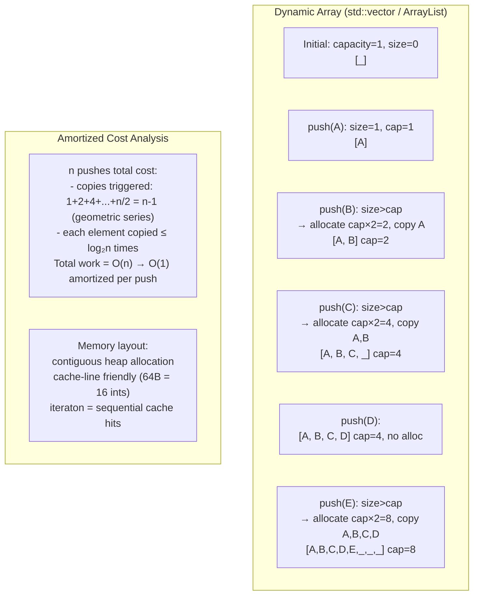
```mermaid
flowchart TD
    subgraph "Dynamic Array (std::vector / ArrayList)"
        Initial["Initial: capacity=1, size=0\n[_]"]
        Push1["push(A): size=1, cap=1\n[A]"]
        Push2["push(B): size>cap\n→ allocate cap×2=2, copy A\n[A, B] cap=2"]
        Push3["push(C): size>cap\n→ allocate cap×2=4, copy A,B\n[A, B, C, _] cap=4"]
        Push4["push(D):\n[A, B, C, D] cap=4, no alloc"]
        Push5["push(E): size>cap\n→ allocate cap×2=8, copy A,B,C,D\n[A,B,C,D,E,_,_,_] cap=8"]
    end

    subgraph "Amortized Cost Analysis"
        Total["n pushes total cost:\n- copies triggered: 1+2+4+...+n/2 = n-1 (geometric series)\n- each element copied ≤ log₂n times\nTotal work = O(n) → O(1) amortized per push"]
        Memory["Memory layout:\ncontiguous heap allocation\ncache-line friendly (64B = 16 ints)\niteraton = sequential cache hits"]
    end
```

---

## 2. 연결 목록 — 메모리 및 포인터 해부

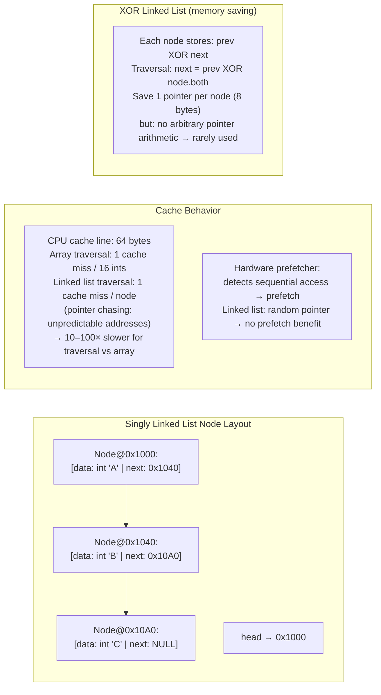
```mermaid
flowchart LR
    subgraph "Singly Linked List Node Layout"
        Node1["Node@0x1000:\n[data: int 'A' | next: 0x1040]"]
        Node2["Node@0x1040:\n[data: int 'B' | next: 0x10A0]"]
        Node3["Node@0x10A0:\n[data: int 'C' | next: NULL]"]
        Head["head → 0x1000"]
        Node1 --> Node2 --> Node3
    end

    subgraph "Cache Behavior"
        CacheLine["CPU cache line: 64 bytes\nArray traversal: 1 cache miss / 16 ints\nLinked list traversal: 1 cache miss / node\n(pointer chasing: unpredictable addresses)\n→ 10–100× slower for traversal vs array"]
        Prefetch["Hardware prefetcher:\ndetects sequential access → prefetch\nLinked list: random pointer → no prefetch benefit"]
    end

    subgraph "XOR Linked List (memory saving)"
        XOR["Each node stores: prev XOR next\nTraversal: next = prev XOR node.both\nSave 1 pointer per node (8 bytes)\nbut: no arbitrary pointer arithmetic → rarely used"]
    end
```

---

## 3. 해시 테이블 - 충돌 해결 및 조사

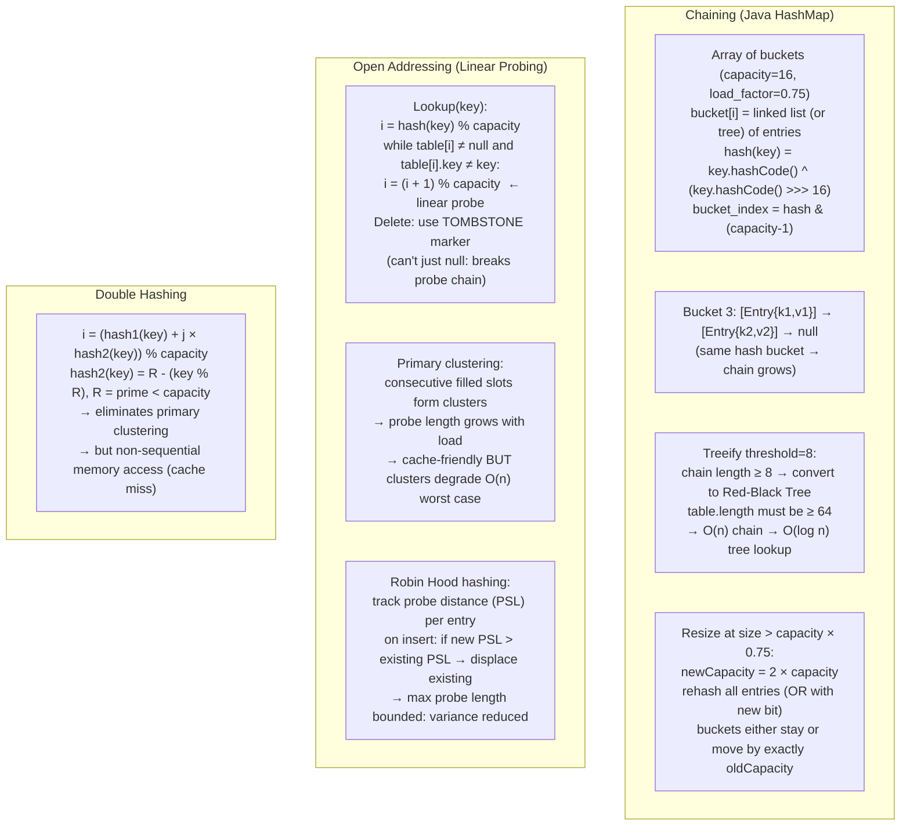
```mermaid
flowchart TD
    subgraph "Chaining (Java HashMap)"
        HT["Array of buckets (capacity=16, load_factor=0.75)\nbucket[i] = linked list (or tree) of entries\nhash(key) = key.hashCode() ^ (key.hashCode() >>> 16)\nbucket_index = hash & (capacity-1)"]
        Chain["Bucket 3: [Entry{k1,v1}] → [Entry{k2,v2}] → null\n(same hash bucket → chain grows)"]
        Tree["Treeify threshold=8:\nchain length ≥ 8 → convert to Red-Black Tree\ntable.length must be ≥ 64\n→ O(n) chain → O(log n) tree lookup"]
        Resize["Resize at size > capacity × 0.75:\nnewCapacity = 2 × capacity\nrehash all entries (OR with new bit)\nbuckets either stay or move by exactly oldCapacity"]
    end

    subgraph "Open Addressing (Linear Probing)"
        LP["Lookup(key):\ni = hash(key) % capacity\nwhile table[i] ≠ null and table[i].key ≠ key:\n  i = (i + 1) % capacity  ← linear probe\nDelete: use TOMBSTONE marker\n(can't just null: breaks probe chain)"]
        Cluster["Primary clustering:\nconsecutive filled slots form clusters\n→ probe length grows with load\n→ cache-friendly BUT clusters degrade O(n) worst case"]
        Robin["Robin Hood hashing:\ntrack probe distance (PSL) per entry\non insert: if new PSL > existing PSL → displace existing\n→ max probe length bounded: variance reduced"]
    end

    subgraph "Double Hashing"
        DH["i = (hash1(key) + j × hash2(key)) % capacity\nhash2(key) = R - (key % R), R = prime < capacity\n→ eliminates primary clustering\n→ but non-sequential memory access (cache miss)"]
    end
```

---

## 4. 이진 검색 트리 — 구조적 특성

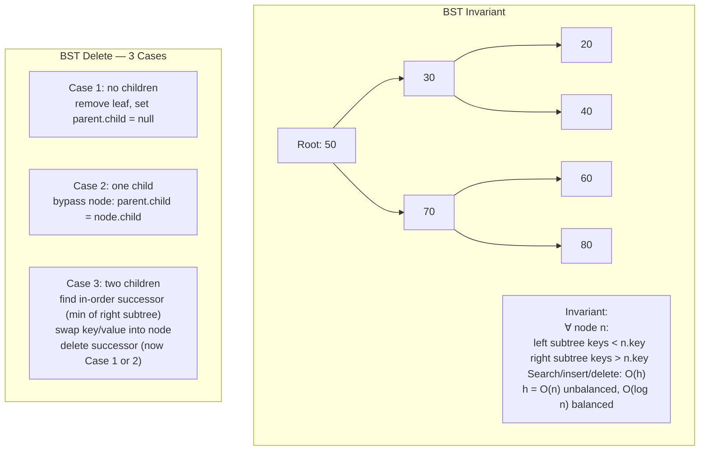
```mermaid
flowchart TD
    subgraph "BST Invariant"
        Root2["Root: 50"]
        L1["30"]
        R1["70"]
        L2["20"]
        L3["40"]
        R2["60"]
        R3["80"]
        Root2 --> L1 & R1
        L1 --> L2 & L3
        R1 --> R2 & R3
        Note1["Invariant:\n∀ node n:\n  left subtree keys < n.key\n  right subtree keys > n.key\nSearch/insert/delete: O(h)\nh = O(n) unbalanced, O(log n) balanced"]
    end

    subgraph "BST Delete — 3 Cases"
        Case1["Case 1: no children\nremove leaf, set parent.child = null"]
        Case2["Case 2: one child\nbypass node: parent.child = node.child"]
        Case3["Case 3: two children\nfind in-order successor (min of right subtree)\nswap key/value into node\ndelete successor (now Case 1 or 2)"]
    end
```

---

## 5. 레드-블랙 트리 — 회전 및 재조정

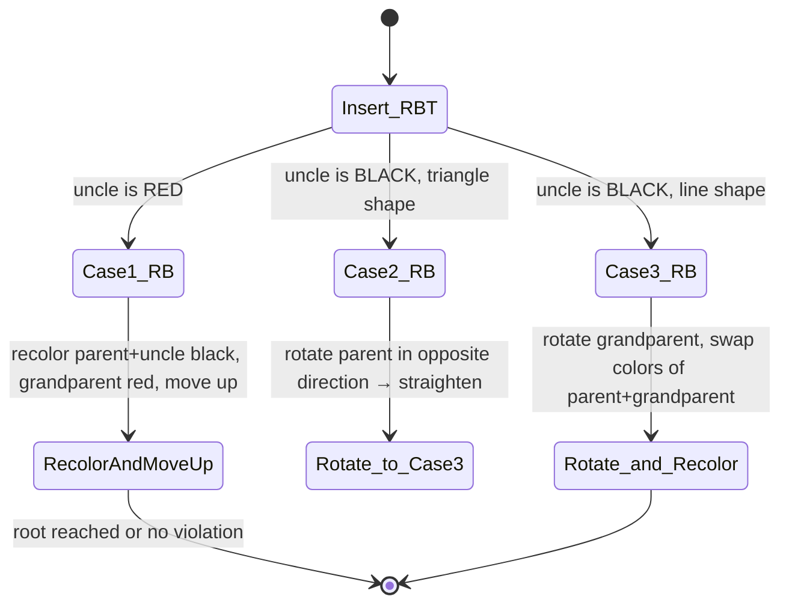
```mermaid
stateDiagram-v2
    [*] --> Insert_RBT
    Insert_RBT --> Case1_RB : uncle is RED
    Case1_RB --> RecolorAndMoveUp : recolor parent+uncle black, grandparent red, move up
    
    Insert_RBT --> Case2_RB : uncle is BLACK, triangle shape
    Case2_RB --> Rotate_to_Case3 : rotate parent in opposite direction → straighten
    
    Insert_RBT --> Case3_RB : uncle is BLACK, line shape
    Case3_RB --> Rotate_and_Recolor : rotate grandparent, swap colors of parent+grandparent
    
    RecolorAndMoveUp --> [*] : root reached or no violation
    Rotate_and_Recolor --> [*]
```

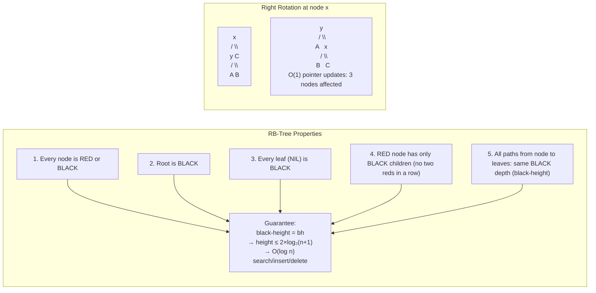
```mermaid
flowchart LR
    subgraph "RB-Tree Properties"
        P1["1. Every node is RED or BLACK"]
        P2["2. Root is BLACK"]
        P3["3. Every leaf (NIL) is BLACK"]
        P4["4. RED node has only BLACK children (no two reds in a row)"]
        P5["5. All paths from node to leaves: same BLACK depth (black-height)"]
        Guarantee["Guarantee:\nblack-height = bh\n→ height ≤ 2×log₂(n+1)\n→ O(log n) search/insert/delete"]
    end

    subgraph "Right Rotation at node x"
        Before["    x\n   / \\\n  y   C\n / \\\nA   B"]
        After["  y\n / \\\nA   x\n   / \\\n  B   C\nO(1) pointer updates: 3 nodes affected"]
    end
    P1 & P2 & P3 & P4 & P5 --> Guarantee
```

---

## 6. AVL 트리 - 균형 요소 및 회전

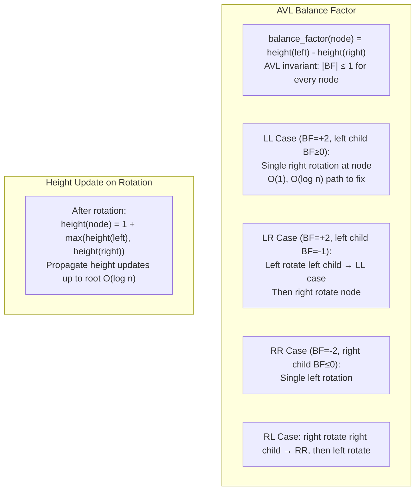
```mermaid
flowchart TD
    subgraph "AVL Balance Factor"
        BF["balance_factor(node) = height(left) - height(right)\nAVL invariant: |BF| ≤ 1 for every node"]
        LL["LL Case (BF=+2, left child BF≥0):\nSingle right rotation at node\nO(1), O(log n) path to fix"]
        LR["LR Case (BF=+2, left child BF=-1):\nLeft rotate left child → LL case\nThen right rotate node"]
        RR["RR Case (BF=-2, right child BF≤0):\nSingle left rotation"]
        RL["RL Case: right rotate right child → RR, then left rotate"]
    end

    subgraph "Height Update on Rotation"
        Update["After rotation:\nheight(node) = 1 + max(height(left), height(right))\nPropagate height updates up to root O(log n)"]
    end
```

---

## 7. B-트리 — 온디스크 구조

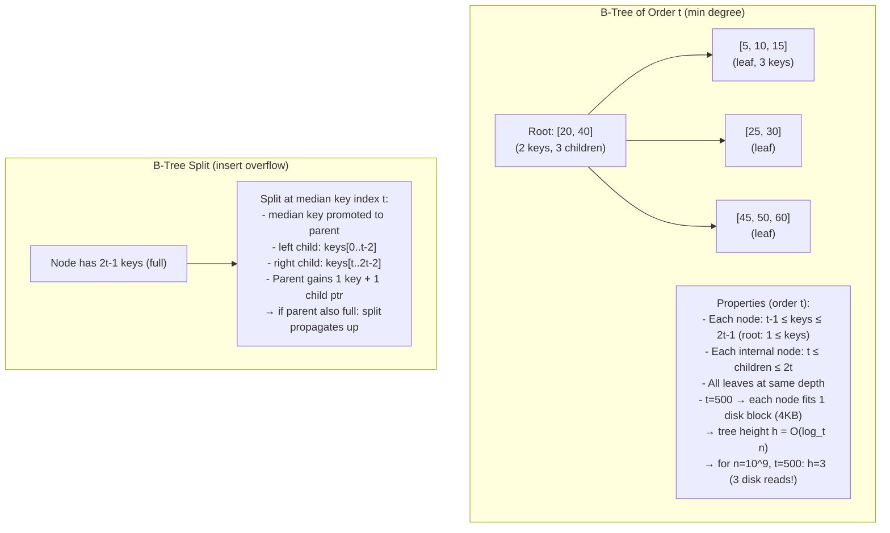
```mermaid
flowchart TD
    subgraph "B-Tree of Order t (min degree)"
        Root3["Root: [20, 40]\n(2 keys, 3 children)"]
        N1["[5, 10, 15]\n(leaf, 3 keys)"]
        N2["[25, 30]\n(leaf)"]
        N3["[45, 50, 60]\n(leaf)"]
        Root3 --> N1 & N2 & N3

        Props["Properties (order t):\n- Each node: t-1 ≤ keys ≤ 2t-1 (root: 1 ≤ keys)\n- Each internal node: t ≤ children ≤ 2t\n- All leaves at same depth\n- t=500 → each node fits 1 disk block (4KB)\n  → tree height h = O(log_t n)\n  → for n=10^9, t=500: h=3 (3 disk reads!)"]
    end

    subgraph "B-Tree Split (insert overflow)"
        Full["Node has 2t-1 keys (full)"]
        Split["Split at median key index t:\n- median key promoted to parent\n- left child: keys[0..t-2]\n- right child: keys[t..2t-2]\n- Parent gains 1 key + 1 child ptr\n→ if parent also full: split propagates up"]
        Full --> Split
    end
```

---

## 8. 힙 — 배열 표현 및 Heapify

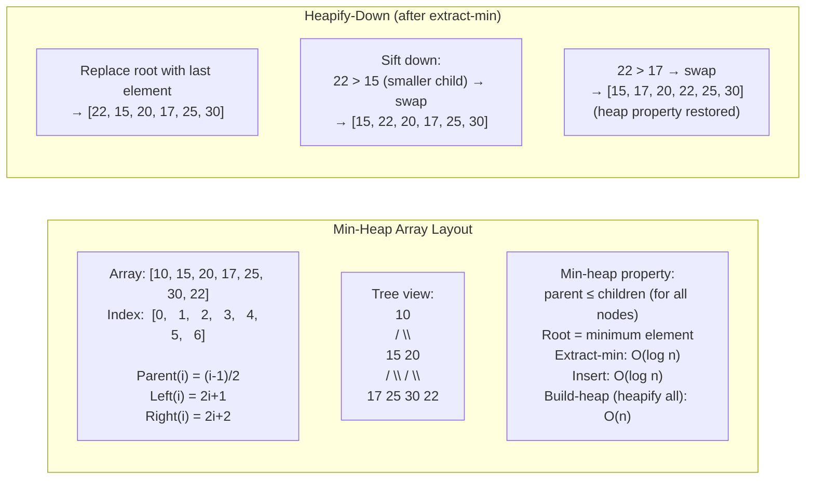
```mermaid
flowchart LR
    subgraph "Min-Heap Array Layout"
        Arr["Array: [10, 15, 20, 17, 25, 30, 22]\nIndex:  [0,   1,   2,   3,   4,   5,   6]\n\nParent(i) = (i-1)/2\nLeft(i) = 2i+1\nRight(i) = 2i+2"]
        Tree["Tree view:\n        10\n       /  \\\n      15   20\n     / \\ / \\\n   17 25 30 22"]
        Props2["Min-heap property:\nparent ≤ children (for all nodes)\nRoot = minimum element\nExtract-min: O(log n)\nInsert: O(log n)\nBuild-heap (heapify all): O(n)"]
    end

    subgraph "Heapify-Down (after extract-min)"
        Step1["Replace root with last element\n→ [22, 15, 20, 17, 25, 30]"]
        Step2["Sift down:\n22 > 15 (smaller child) → swap\n→ [15, 22, 20, 17, 25, 30]"]
        Step3["22 > 17 → swap\n→ [15, 17, 20, 22, 25, 30]\n(heap property restored)"]
    end
```

---

## 9. 건너뛰기 목록 - 확률적 균형 조정

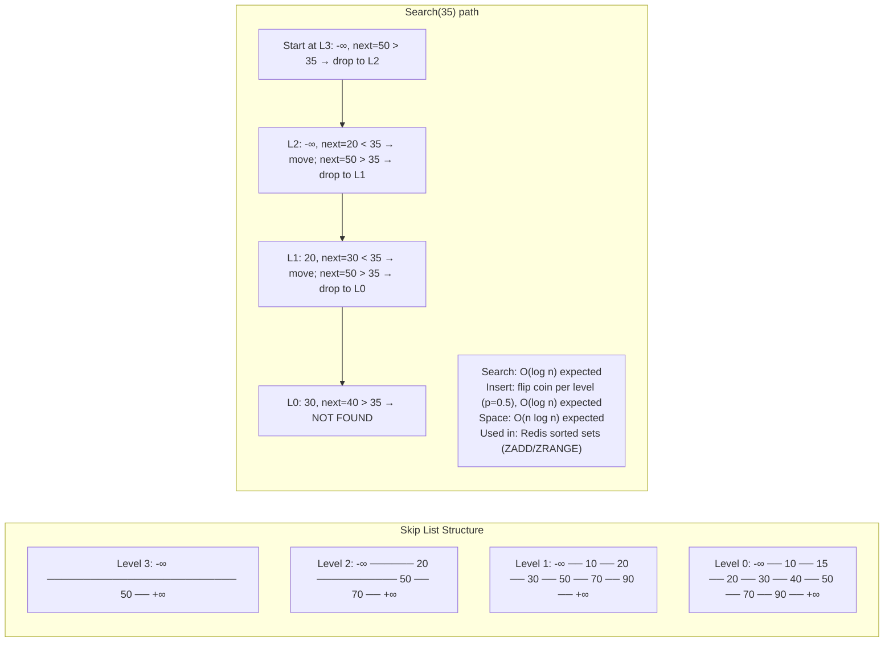
```mermaid
flowchart LR
    subgraph "Skip List Structure"
        L3["Level 3: -∞ ────────────────────────── 50 ── +∞"]
        L2["Level 2: -∞ ────── 20 ─────────── 50 ── 70 ── +∞"]
        L1["Level 1: -∞ ── 10 ── 20 ── 30 ── 50 ── 70 ── 90 ── +∞"]
        L0["Level 0: -∞ ── 10 ── 15 ── 20 ── 30 ── 40 ── 50 ── 70 ── 90 ── +∞"]
    end

    subgraph "Search(35) path"
        S1["Start at L3: -∞, next=50 > 35 → drop to L2"]
        S2["L2: -∞, next=20 < 35 → move; next=50 > 35 → drop to L1"]
        S3["L1: 20, next=30 < 35 → move; next=50 > 35 → drop to L0"]
        S4["L0: 30, next=40 > 35 → NOT FOUND"]
        S1 --> S2 --> S3 --> S4
        Complexity["Search: O(log n) expected\nInsert: flip coin per level (p=0.5), O(log n) expected\nSpace: O(n log n) expected\nUsed in: Redis sorted sets (ZADD/ZRANGE)"]
    end
```

---

## 10. Trie — 문자열 접두사 작업

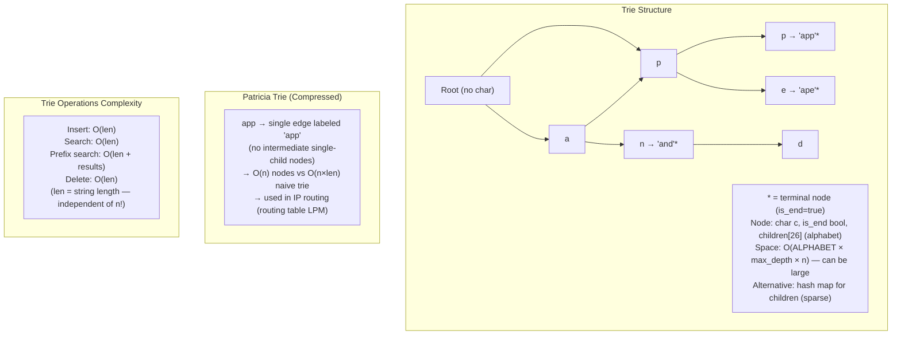
```mermaid
flowchart TD
    subgraph "Trie Structure"
        Root4["Root (no char)"]
        A["a"]
        P["p"]
        Ap["p → 'app'*"]
        Ape["e → 'ape'*"]
        An["n → 'and'*"]
        D["d"]
        Root4 --> A & P
        A --> P & An
        P --> Ap & Ape
        An --> D
        Note2["* = terminal node (is_end=true)\nNode: char c, is_end bool, children[26] (alphabet)\nSpace: O(ALPHABET × max_depth × n) — can be large\nAlternative: hash map for children (sparse)"]
    end

    subgraph "Patricia Trie (Compressed)"
        P1["app → single edge labeled 'app'\n(no intermediate single-child nodes)\n→ O(n) nodes vs O(n×len) naive trie\n→ used in IP routing (routing table LPM)"]
    end

    subgraph "Trie Operations Complexity"
        Ops["Insert: O(len)\nSearch: O(len)\nPrefix search: O(len + results)\nDelete: O(len)\n(len = string length — independent of n!)"]
    end
```

---

## 11. 서로소 집합 합집합(Union-Find)

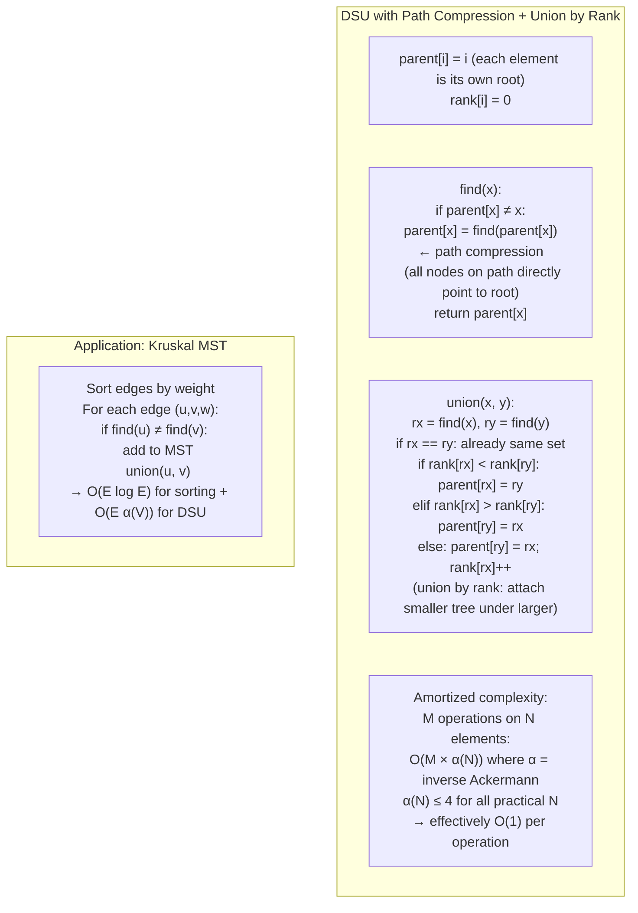
```mermaid
flowchart TD
    subgraph "DSU with Path Compression + Union by Rank"
        Init["parent[i] = i (each element is its own root)\nrank[i] = 0"]
        Find["find(x):\nif parent[x] ≠ x:\n  parent[x] = find(parent[x])  ← path compression\n  (all nodes on path directly point to root)\nreturn parent[x]"]
        Union2["union(x, y):\nrx = find(x), ry = find(y)\nif rx == ry: already same set\nif rank[rx] < rank[ry]: parent[rx] = ry\nelif rank[rx] > rank[ry]: parent[ry] = rx\nelse: parent[ry] = rx; rank[rx]++\n(union by rank: attach smaller tree under larger)"]
        Complexity2["Amortized complexity:\nM operations on N elements:\nO(M × α(N)) where α = inverse Ackermann\nα(N) ≤ 4 for all practical N\n→ effectively O(1) per operation"]
    end

    subgraph "Application: Kruskal MST"
        Kruskal["Sort edges by weight\nFor each edge (u,v,w):\n  if find(u) ≠ find(v):\n    add to MST\n    union(u, v)\n→ O(E log E) for sorting + O(E α(V)) for DSU"]
    end
```

---

## 12. 세그먼트 트리 - 범위 쿼리 내부

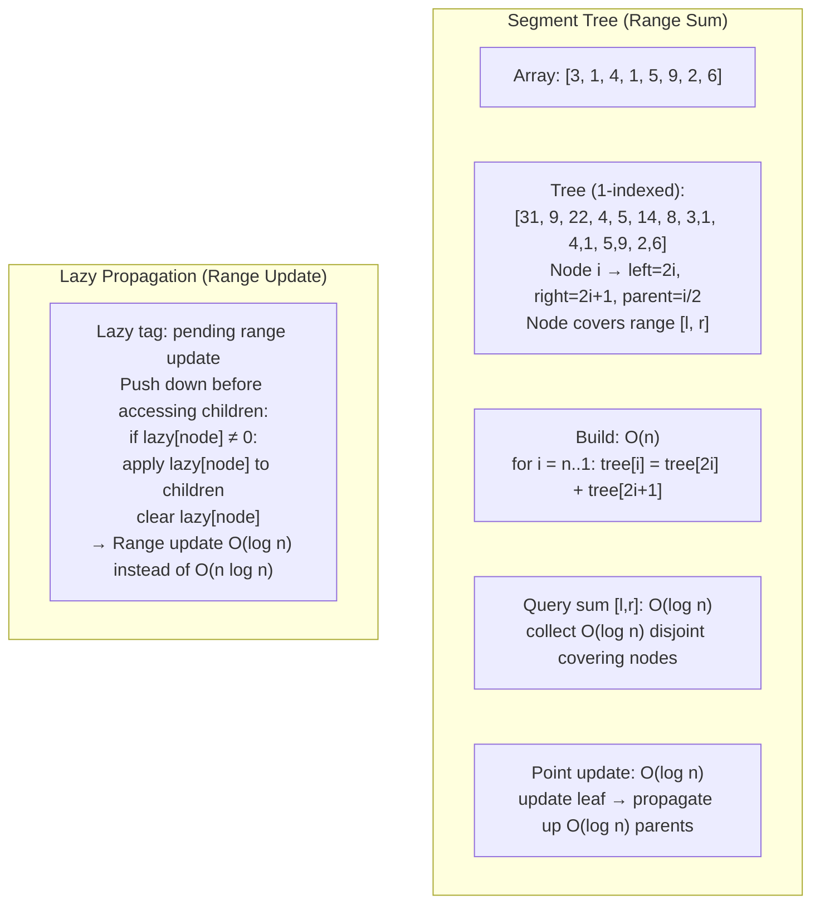
```mermaid
flowchart TD
    subgraph "Segment Tree (Range Sum)"
        Array["Array: [3, 1, 4, 1, 5, 9, 2, 6]"]
        Tree3["Tree (1-indexed):\n[31, 9, 22, 4, 5, 14, 8, 3,1, 4,1, 5,9, 2,6]\nNode i → left=2i, right=2i+1, parent=i/2\nNode covers range [l, r]"]
        Build["Build: O(n)\nfor i = n..1: tree[i] = tree[2i] + tree[2i+1]"]
        Query["Query sum [l,r]: O(log n)\ncollect O(log n) disjoint covering nodes"]
        Update3["Point update: O(log n)\nupdate leaf → propagate up O(log n) parents"]
    end

    subgraph "Lazy Propagation (Range Update)"
        Lazy["Lazy tag: pending range update\nPush down before accessing children:\nif lazy[node] ≠ 0:\n  apply lazy[node] to children\n  clear lazy[node]\n→ Range update O(log n) instead of O(n log n)"]
    end
```

---

## 13. 그래프 표현 - 인접 목록과 행렬

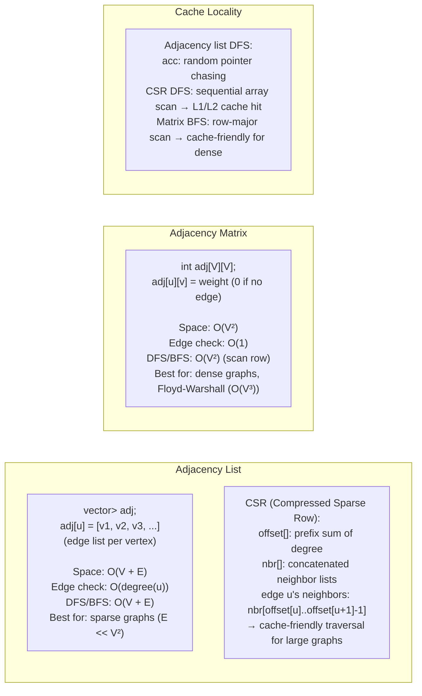
```mermaid
flowchart LR
    subgraph "Adjacency List"
        AL["vector<vector<int>> adj;\nadj[u] = [v1, v2, v3, ...]\n(edge list per vertex)\n\nSpace: O(V + E)\nEdge check: O(degree(u))\nDFS/BFS: O(V + E)\nBest for: sparse graphs (E << V²)"]
        CSR["CSR (Compressed Sparse Row):\noffset[]: prefix sum of degree\nnbr[]: concatenated neighbor lists\nedge u's neighbors: nbr[offset[u]..offset[u+1]-1]\n→ cache-friendly traversal for large graphs"]
    end

    subgraph "Adjacency Matrix"
        AM["int adj[V][V];\nadj[u][v] = weight (0 if no edge)\n\nSpace: O(V²)\nEdge check: O(1)\nDFS/BFS: O(V²) (scan row)\nBest for: dense graphs, Floyd-Warshall (O(V³))"]
    end

    subgraph "Cache Locality"
        CL["Adjacency list DFS:\nacc: random pointer chasing\nCSR DFS: sequential array scan → L1/L2 cache hit\nMatrix BFS: row-major scan → cache-friendly for dense"]
    end
```

---

## 14. 메모리 사용량 및 성능 요약

```mermaid
block-beta
  columns 2
  block:lookup["Lookup Performance"]:1
    l1["Array (index): O(1), cache-line hit"]
    l2["Hash table (avg): O(1), but cache miss on chain"]
    l3["BST (balanced): O(log n), pointer chase"]
    l4["Skip list: O(log n) expected, multiple levels"]
  end
  block:insert_del["Insert/Delete"]:1
    i1["Array (end): O(1) amortized"]
    i2["Array (middle): O(n) shift"]
    i3["Linked list (with ptr): O(1)"]
    i4["Red-Black / AVL: O(log n) + O(1) rotations"]
  end
  block:memory["Memory Overhead per Element"]:1
    m1["Array: 0 extra bytes (contiguous)"]
    m2["Linked list: 8B next pointer (+ heap header ~16B)"]
    m3["Hash table: load factor × array size overhead"]
    m4["RB-Tree node: color bit + 3 pointers = ~32B extra"]
  end
  block:special["Special Structures"]:1
    sp1["Segment tree: 4n array (bit twiddling)"]
    sp2["DSU: 2n arrays (parent + rank)"]
    sp3["Bloom filter: m bits, k hashes (0 false negatives)"]
    sp4["Skip list: O(n log n) expected space"]
  end
```

---

## 주요 내용

- **동적 배열 상각 O(1)** 푸시는 용량이 두 배로 늘어나 사본 수가 기하학적 계열로 제한됨을 의미하기 때문에 작동합니다(총 사본 ≤ 2n).
- **해시 테이블 연결과 개방형 주소 지정**: 연결은 높은 부하율을 더 잘 처리합니다. 개방형 주소 지정(로빈 후드/선형 프로브)은 캐시 지역성이 더 우수하지만 삭제 시 주의가 필요합니다(삭제 표시).
- **Red-Black 트리**는 색상을 사용하여 대략적인 균형을 인코딩합니다(완전 BST 대비 최대 2배 높이). 삽입/삭제당 O(1) 회전 vs AVL의 O(log n) 회전
- **B-트리 노드 크기**는 디스크 블록/OS 페이지(4KB 또는 16KB)와 일치하도록 조정됩니다. 각 I/O는 수백 개의 키가 있는 하나의 노드를 가져옵니다. 10억 레코드 인덱스의 경우 트리 높이는 3-4 이하로 유지됩니다.
- Redis의 **건너뛰기 목록**은 기하학적으로 감소하는 확률로 각 노드가 여러 정렬된 연결 목록에 참여하도록 하여 O(log n) 범위 쿼리를 달성합니다. 균형 잡힌 BST보다 구현이 더 간단합니다.
- **세그먼트 트리 지연 전파**는 각 노드에 보류 중인 태그를 저장하여 범위 업데이트를 연기합니다. 하위 노드에 액세스할 때만 푸시되고 범위 업데이트는 O(log n)으로 유지됩니다.
- **경로 압축 + 순위별 결합을 사용한 Union-Find**는 역 Ackermann 함수로 인해 작업당 거의 O(1)을 달성합니다. 트리 높이는 실질적으로 4로 제한됩니다.

---

## 설계적 고민

### 구조와 모델링

자료구조를 선택한다는 것은 단순히 "어떤 연산이 빠른가"를 넘어, **메모리 레이아웃과 하드웨어 특성까지 고려한 구조적 결정**이다. 동일한 시간 복잡도를 가진 두 자료구조도 실제 성능은 수십 배 차이가 날 수 있다.

#### 배열 vs 링크드 리스트: 캐시 지역성의 결정적 차이

이론적으로 링크드 리스트의 삽입/삭제는 O(1)이고 배열은 O(n)이다. 그러나 현대 CPU에서 배열이 압도적으로 유리한 경우가 많다. 그 핵심은 **캐시 라인(cache line)** 에 있다. CPU는 메모리를 64바이트 단위의 캐시 라인으로 가져오며, 배열은 연속 메모리이므로 하나의 캐시 라인에 여러 원소가 적재된다. 반면 링크드 리스트는 각 노드가 힙의 임의 위치에 흩어져 있어 **포인터 체이싱(pointer chasing)** 마다 캐시 미스가 발생한다.

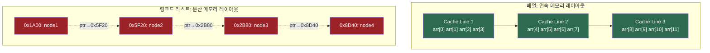
```mermaid
graph TD
    subgraph "배열: 연속 메모리 레이아웃"
        A1["Cache Line 1<br/>arr[0] arr[1] arr[2] arr[3]"] --> A2["Cache Line 2<br/>arr[4] arr[5] arr[6] arr[7]"]
        A2 --> A3["Cache Line 3<br/>arr[8] arr[9] arr[10] arr[11]"]
    end

    subgraph "링크드 리스트: 분산 메모리 레이아웃"
        L1["0x1A00: node1"] -.->|"ptr→0x5F20"| L2["0x5F20: node2"]
        L2 -.->|"ptr→0x2B80"| L3["0x2B80: node3"]
        L3 -.->|"ptr→0x8D40"| L4["0x8D40: node4"]
    end

    style A1 fill:#2d6a4f,color:#fff
    style A2 fill:#2d6a4f,color:#fff
    style A3 fill:#2d6a4f,color:#fff
    style L1 fill:#9b2226,color:#fff
    style L2 fill:#9b2226,color:#fff
    style L3 fill:#9b2226,color:#fff
    style L4 fill:#9b2226,color:#fff
```

실제 벤치마크에서 100만 개 원소의 순회(traverse) 시, 배열은 링크드 리스트 대비 **10~50배** 빠르다. 이 격차는 원소 크기가 작을수록(int, pointer) 더 극명해진다. 따라서 "삽입/삭제가 잦다"는 이유만으로 링크드 리스트를 선택하는 것은 위험하며, **접근 패턴(순차 vs 랜덤)과 원소 크기**를 함께 고려해야 한다.

#### 해시 테이블의 load factor 0.75: 왜 이 숫자인가

Java HashMap의 기본 load factor는 0.75이다. 이 값은 **공간 효율성과 충돌 확률 사이의 최적점**에 해당한다. load factor가 높아지면 메모리는 절약되지만 충돌 체인이 길어져 탐색이 O(n)에 수렴한다. 반대로 낮추면 메모리 낭비가 심해진다.

생일 문제(birthday problem) 분석에 따르면, 버킷 수 m에 대해 n개 키를 삽입할 때 적어도 하나의 충돌이 발생할 확률은 n ≈ √(πm/2)에서 50%를 넘는다. load factor 0.75에서는 평균 체인 길이가 약 1.5로, O(1) 기대 시간을 유지하면서도 버킷의 75%를 활용하는 균형점이 된다.

### 트레이드오프와 의사결정

#### B-Tree가 데이터베이스 인덱스의 표준인 이유

해시 인덱스는 O(1) 탐색이 가능하지만, 데이터베이스의 핵심 인덱스 구조는 여전히 B-Tree(또는 B+Tree)이다. 이유는 **디스크 I/O 모델에서의 최적성**에 있다.

디스크는 바이트 단위가 아니라 **페이지(4KB~16KB)** 단위로 읽는다. B-Tree는 하나의 노드를 정확히 하나의 디스크 페이지에 맞추어, 한 번의 I/O로 수백 개의 키를 비교할 수 있다. 10억 개의 레코드도 3~4회의 디스크 읽기만으로 탐색이 가능하다.

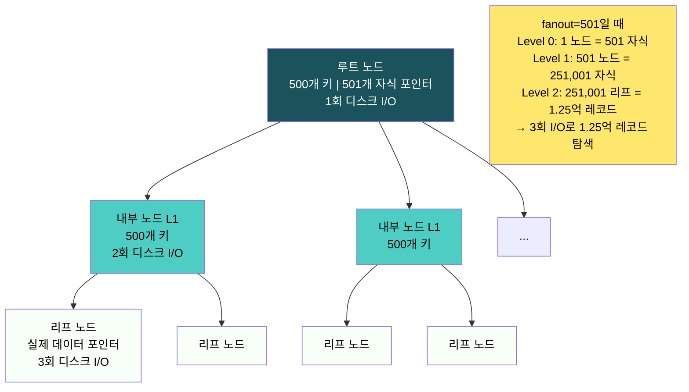
```mermaid
graph TD
    ROOT["루트 노드<br/>500개 키 | 501개 자식 포인터<br/>1회 디스크 I/O"]
    ROOT --> INT1["내부 노드 L1<br/>500개 키<br/>2회 디스크 I/O"]
    ROOT --> INT2["내부 노드 L1<br/>500개 키"]
    ROOT --> INT3["..."]
    INT1 --> LEAF1["리프 노드<br/>실제 데이터 포인터<br/>3회 디스크 I/O"]
    INT1 --> LEAF2["리프 노드"]
    INT2 --> LEAF3["리프 노드"]
    INT2 --> LEAF4["리프 노드"]

    NOTE["fanout=501일 때<br/>Level 0: 1 노드 = 501 자식<br/>Level 1: 501 노드 = 251,001 자식<br/>Level 2: 251,001 리프 = 1.25억 레코드<br/>→ 3회 I/O로 1.25억 레코드 탐색"]

    style ROOT fill:#1a535c,color:#fff
    style INT1 fill:#4ecdc4,color:#000
    style INT2 fill:#4ecdc4,color:#000
    style LEAF1 fill:#f7fff7,color:#000
    style LEAF2 fill:#f7fff7,color:#000
    style LEAF3 fill:#f7fff7,color:#000
    style LEAF4 fill:#f7fff7,color:#000
    style NOTE fill:#ffe66d,color:#000
```

또한 B-Tree는 **범위 쿼리**를 자연스럽게 지원한다. 리프 노드가 정렬되어 있고 연결 리스트로 이어져 있어, `WHERE price BETWEEN 100 AND 500` 같은 쿼리에서 순차 스캔이 가능하다. 해시 인덱스는 이것이 불가능하다.

#### Redis가 Sorted Set에 Skip List를 선택한 이유

Redis의 Sorted Set은 B-Tree 대신 **Skip List**를 사용한다. Antirez(Redis 창시자)가 밝힌 이유는 다음과 같다:

1. **구현 단순성**: B-Tree의 노드 분할/병합 로직은 복잡하고 버그 유발 가능성이 높다. Skip List는 동전 던지기(랜덤 레벨)만으로 균형을 유지한다.
2. **동시성 친화**: 락-프리(lock-free) 또는 세밀한 락 구현이 B-Tree보다 훨씬 쉽다. Skip List에서는 인접 노드의 포인터만 CAS로 업데이트하면 된다.
3. **범위 쿼리 지원**: ZRANGEBYSCORE 등 범위 연산에서 리프 레벨의 순차 탐색이 가능하다.

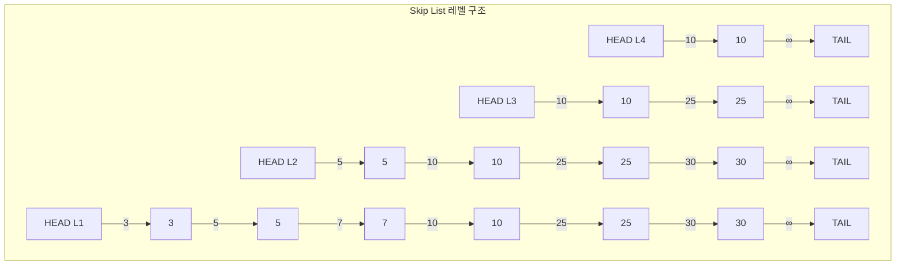
```mermaid
flowchart LR
    subgraph "Skip List 레벨 구조"
        direction LR
        H4["HEAD L4"] -->|"10"| N10_4["10"] -->|"∞"| T4["TAIL"]
        H3["HEAD L3"] -->|"10"| N10_3["10"] -->|"25"| N25_3["25"] -->|"∞"| T3["TAIL"]
        H2["HEAD L2"] -->|"5"| N5_2["5"] -->|"10"| N10_2["10"] -->|"25"| N25_2["25"] -->|"30"| N30_2["30"] -->|"∞"| T2["TAIL"]
        H1["HEAD L1"] -->|"3"| N3_1["3"] -->|"5"| N5_1["5"] -->|"7"| N7_1["7"] -->|"10"| N10_1["10"] -->|"25"| N25_1["25"] -->|"30"| N30_1["30"] -->|"∞"| T1["TAIL"]
    end
```

### 리팩토링과 설계 원칙

#### Union-Find 경로 압축: 복잡성을 수용한 설계 결정

Union-Find(Disjoint Set Union, DSU)는 단순한 배열 두 개(`parent[]`, `rank[]`)로 구현되지만, **경로 압축(path compression)** 과 **순위별 결합(union by rank)** 이라는 두 가지 최적화가 성능을 극적으로 변화시킨다.

경로 압축 없이는 최악의 경우 트리 높이가 O(n)이 되어 find 연산이 O(n)이다. 경로 압축만 적용하면 O(log n), 순위별 결합과 함께 적용하면 **O(α(n))** ≈ O(1)이 된다. 여기서 α는 역 아커만 함수로, 실질적으로 4를 넘지 않는다.

이 설계 결정의 핵심은 **단순성을 약간 희생하여 극적인 성능 향상을 얻는 것**이다. 경로 압축 코드는 단 한 줄(`parent[x] = find(parent[x])`)이지만, 이 한 줄이 최악 O(n) → 거의 O(1)로의 전환을 만든다.

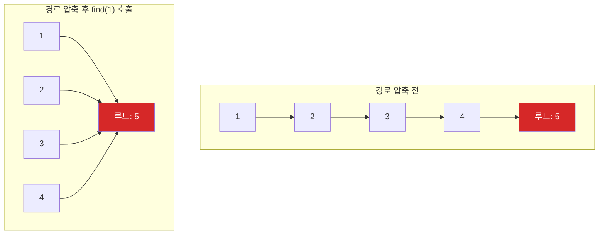
```mermaid
graph TD
    subgraph "경로 압축 전"
        A1["1"] --> A2["2"] --> A3["3"] --> A4["4"] --> A5["루트: 5"]
    end

    subgraph "경로 압축 후 find(1) 호출"
        B1["1"] --> B5["루트: 5"]
        B2["2"] --> B5
        B3["3"] --> B5
        B4["4"] --> B5
    end

    style A5 fill:#d62828,color:#fff
    style B5 fill:#d62828,color:#fff
```

#### 자료구조 선택의 리팩토링 가이드라인

시스템 성장에 따라 자료구조를 교체해야 할 시점이 온다. 이때 핵심은 **인터페이스를 유지하면서 내부 구현만 교체**하는 것이다. 예를 들어 초기에 HashMap으로 시작한 캐시가 LRU 정책이 필요해지면 LinkedHashMap으로, 더 정교한 만료 정책이 필요하면 Caffeine 라이브러리로 점진 교체할 수 있다.

설계 원칙: **추상화 경계(abstraction boundary)를 명확히** 하고, 자료구조의 구현을 인터페이스 뒤에 숨겨라. Java의 `Map` 인터페이스가 좋은 예로, `HashMap`, `TreeMap`, `ConcurrentHashMap` 모두 동일 인터페이스를 구현한다.

### 디자인 패턴 적용

#### 전략 패턴(Strategy Pattern)과 자료구조 교체

자료구조의 선택을 **런타임 전략**으로 분리하면, 워크로드 특성에 따라 동적으로 최적의 구현을 선택할 수 있다. 이는 데이터베이스의 쿼리 옵티마이저가 통계 정보에 따라 인덱스 스캔과 풀 스캔을 선택하는 것과 동일한 원리이다.

```mermaid
flowchart TD
    CLIENT["클라이언트 코드"] -->|"interface: SortedCollection"| STRATEGY{"워크로드 분석"}}
    STRATEGY -->|"읽기 집중<br/>범위 쿼리 다수"| BTREE["B-Tree 구현"]
    STRATEGY -->|"쓰기 집중<br/>동시성 높음"| SKIPLIST["Skip List 구현"]
    STRATEGY -->|"데이터 크기 작음<br/>< 1000개"| SORTED_ARR["정렬 배열 구현"]

    BTREE -->|"성능 특성"| B_PERF["읽기: O(log n)<br/>쓰기: O(log n) + 분할 비용<br/>캐시: 우수(노드 크기 = 페이지)"]
    SKIPLIST -->|"성능 특성"| S_PERF["읽기: O(log n) 기대<br/>쓰기: O(log n) + 간단한 포인터<br/>동시성: CAS 기반 락-프리"]
    SORTED_ARR -->|"성능 특성"| A_PERF["읽기: O(log n) 이진탐색<br/>쓰기: O(n) 시프트<br/>캐시: 최고(연속 메모리)"]
```

#### Composite 패턴과 트리 기반 자료구조

B-Tree, 세그먼트 트리, Trie 등 트리 기반 자료구조는 본질적으로 **Composite 패턴**을 따른다. 리프 노드와 내부 노드가 동일한 인터페이스(Node)를 구현하며, 내부 노드는 자식 노드들의 컬렉션을 가진다.

이 패턴의 설계적 의미:
- **재귀적 분할**: 문제를 하위 문제로 자연스럽게 분할 (세그먼트 트리의 구간 분할)
- **균일한 처리**: `query(node, range)` 함수가 리프든 내부 노드든 동일한 시그니처로 동작
- **지연 전파(Lazy Propagation)**: 내부 노드에 `pending` 태그를 두어 업데이트를 연기하는 것은 Decorator 패턴의 변형

```mermaid
graph TD
    subgraph "Composite 패턴: 세그먼트 트리"
        ROOT_SEG["Node: sum=36<br/>range=[0,7]"] --> LEFT["Node: sum=10<br/>range=[0,3]"]
        ROOT_SEG --> RIGHT["Node: sum=26<br/>range=[4,7]"]
        LEFT --> LL["Leaf: val=1<br/>[0,0]"]
        LEFT --> LR["Leaf: val=9<br/>[1,1]... 생략"]
        RIGHT --> RL["Node: sum=11<br/>[4,5]"]
        RIGHT --> RR["Node: sum=15<br/>[6,7]"]
    end

    style ROOT_SEG fill:#264653,color:#fff
    style LEFT fill:#2a9d8f,color:#fff
    style RIGHT fill:#2a9d8f,color:#fff
    style LL fill:#e9c46a,color:#000
    style LR fill:#e9c46a,color:#000
    style RL fill:#e76f51,color:#fff
    style RR fill:#e76f51,color:#fff
```

이러한 구조적 유사성을 인식하면, 새로운 트리 기반 자료구조를 설계할 때 **검증된 패턴을 재사용**할 수 있다. 예를 들어 세그먼트 트리의 지연 전파 메커니즘은 B-Tree의 쓰기 지연(write-behind) 최적화와 동일한 원리이며, 이는 **"비용이 큰 연산을 마지막 순간까지 미룬다"** 는 공통 설계 원칙에서 비롯된다.

## 연습 문제

### 1. 시스템 구조와 모델링

**문제 1-1.** 소셜 네트워크 서비스에서 사용자 1억 명의 친구 관계를 저장해야 한다. 평균 친구 수는 150명이다. (a) 친구 관계를 인접 행렬로 저장할 때 메모리 사용량은 얼마인가? 이것이 왜 비현실적인가? (b) 인접 리스트로 전환했을 때 메모리는 얼마로 줄어드는가? (c) "두 사용자가 친구인가?"라는 쿼리의 응답 시간이 인접 행렬에서 O(1)인 반면 인접 리스트에서 O(d)인데, 이 문제를 어떻게 해결할 수 있는가?

힌트 보기

인접 행렬은 10^8 × 10^8 = 10^16 비트 = 약 10PB의 메모리가 필요하다. 인접 리스트는 간선 수 × 2 × (node ID 크기) ≈ 10^8 × 150 × 8B ≈ 120GB로 대폭 줄어든다. 친구 여부를 O(1)에 확인하려면 인접 리스트의 각 사용자 친구 목록을 해시 셋으로 저장하거나, 블룸 필터를 사용하여 근사적 O(1) 확인을 수행할 수 있다.

**문제 1-2.** 검색 엔진의 자동완성 기능을 구현해야 한다. 사용자가 "프로그"라고 입력하면 "프로그래밍", "프로그래머", "프로그래시브" 등을 제안해야 한다. 검색 사전에는 1억 개의 단어가 있고, 각 단어마다 검색 빈도수가 있다. (a) Trie 단독으로 구현하면 단어 목록은 얻을 수 있지만 "검색 빈도수 상위 5개"를 얻으려면 어떤 추가 설계가 필요한가? (b) Trie + 해시 테이블을 조합하는 설계를 제안하라. 트라이 노드에 어떤 정보를 추가하면 범위 쿼리를 효율적으로 처리할 수 있는가? (c) 사전이 실시간으로 업데이트되는 경우(신조어 추가), Trie의 동시성 문제를 어떻게 해결할 수 있는가?

힌트 보기

Trie의 각 노드에 해당 접두사로 시작하는 단어들의 빈도수 상위 K개를 캐시해두면 O(접두사 길이)만으로 결과를 반환할 수 있다. 해시 테이블은 단어 → 빈도수 매핑을 담당한다. Trie 노드에 힙(트리)을 저장하여 상위 K개를 빠르게 추출할 수도 있다. 동시성은 copy-on-write 트라이나 concurrent-safe 해시맵으로 대응하며, 실무에서는 일정 주기로 트라이를 재구성하는 배치 방식도 많이 사용된다.

**문제 1-3.** 데이터베이스의 B-Tree 인덱스 구조에서 루트에서 리프 노드까지의 경로 길이가 항상 동일하다. 100만 개의 키를 저장하는 B-Tree(order=100)의 높이는 얼마인가? (a) 디스크 I/O 관점에서 이 높이가 왜 중요한지 설명하라. (b) 동일한 100만 개의 키를 AVL 트리에 저장하면 높이가 얼마이며, 디스크 I/O 성능에 어떤 영향이 있는가? (c) SSD 환경에서 B-Tree의 이점이 감소하는 이유와, LSM-Tree가 대안이 되는 이유는 무엇인가?

힌트 보기

B-Tree(order=100)의 높이 h ≈ log₅₀(10^6) ≈ 3이다. 디스크 I/O는 높이에 비례하므로 3번의 I/O로 검색 가능하다. AVL 트리는 높이 ≈ log₂(10^6) ≈ 20으로 20번 I/O가 필요하다. SSD는 랜덤 읽기가 빠르지만 쓰기가 비싸고 쓰기 증폭(write amplification) 문제가 있다. B-Tree의 in-place 업데이트는 쓰기 증폭을 유발하므로, append-only인 LSM-Tree가 SSD의 쓰기 특성에 더 적합하다.

### 2. 트레이드오프와 의사결정

**문제 2-1.** Redis의 Sorted Set은 내부적으로 Skip List를 사용한다. 당신이 Redis의 설계자라면, Sorted Set을 B-Tree로 구현할 수도 있었다. (a) 동시성(concurrency) 관점에서 Skip List가 B-Tree보다 유리한 이유는 무엇인가? (b) 구현 복잡도 측면에서 Skip List의 장점은? (c) 범위 쿼리(`ZRANGEBYSCORE`) 성능에서 두 자료구조는 어떻게 비교되며, 어떤 상황에서 B-Tree가 더 나을 수 있는가?

힌트 보기

Skip List는 삽입/삭제 시 로컬 영역만 수정하면 되어 lock-free 구현이 가능하지만, B-Tree는 노드 분할/병합이 상위 노드까지 전파되어 넓은 범위의 잠금이 필요하다. Skip List는 포인터 연산만으로 구현되어 코드가 단순하다. 범위 쿼리는 둘 다 O(log n + k)이지만, B-Tree는 캐시 지역성(cache locality)이 높아 디스크 기반 대규모 데이터에서 유리하다.

**문제 2-2.** Java HashMap의 기본 load factor는 0.75이다. 당신의 동료가 성능 튜닝을 위해 load factor를 0.5로 낮추자고 제안한다. 다른 동료는 0.9로 높이자고 한다. (a) load factor 0.5로 낮추면 충돌은 줄지만 어떤 비용이 증가하는가? 구체적 수치로 설명하라. (b) load factor 0.9로 높이면 어떤 단계에서 성능 저하가 발생하며, Java 8의 트리화(treeification) 메커니즘이 이를 어떻게 완화하는가? (c) 실무에서 언제 0.75가 아닌 다른 값을 사용해야 하는 구체적 시나리오를 제시하라.

힌트 보기

0.5로 낮추면 절반밖에 차지 않아도 리사이징이 발생하여 메모리 낭비가 2배 가까이 된다. 예: 1000개 요소 저장 시 0.75면 배열 크기 1334, 0.5면 2000이 필요. 0.9로 높이면 충돌 체인이 길어져 O(n) 탐색이 발생하지만, Java 8에서는 체인 길이가 8을 넘으면 레드블랙 트리로 전환되어 O(log n)으로 보장된다. 메모리가 극도로 제한된 임베디드 시스템에서는 높은 load factor가, 레이턴시가 극히 중요한 실시간 시스템에서는 낮은 load factor가 적합하다.

**문제 2-3.** 온라인 게임 리더보드 시스템에서 상위 100명의 점수를 실시간으로 유지해야 한다. 유저는 1000만 명이고, 점수 업데이트가 초당 10만 건 발생한다. (a) 정렬된 배열로 유지하면 업데이트마다 O(n) 삽입이 왜 문제인가? (b) 힙 또는 균형 이진 탐색 트리로 어떻게 개선할 수 있는가? (c) "내 순위가 몇 위인가?" 쿼리도 필요하다면, 어떤 자료구조가 순위 조회와 업데이트를 모두 O(log n)에 지원하는가?

힌트 보기

정렬된 배열에서 삽입은 요소 이동이 필요해 O(n)이다. 최소 힙으로 상위 K를 유지하면 삽입 O(log K)이지만 "내 순위"를 구할 수 없다. 순위 조회까지 필요하면 order-statistic tree(Red-Black tree + size 필드)나 Skip List + 각 레벨별 span 정보를 활용하면 삽입과 순위 쿼리 모두 O(log n)이다. Redis의 ZRANK가 정확히 이 방식이다.

### 3. 문제 해결 및 리팩토링

**문제 3-1.** 대규모 소셜 그래프(1억 노드, 10억 간선)에서 Union-Find로 연결 컴포넌트를 구하는 작업이 예상보다 느리다는 보고가 있다. 동료가 작성한 코드를 보니 `find(x)`가 단순히 부모 포인터를 따라가는 구현이다. (a) 경로 압축(path compression) 없이 최악의 경우 `find`의 시간복잡도는? (b) 경로 압축만 적용한 경우와 경로 압축 + 랭크 합치기(union by rank)를 동시에 적용한 경우의 상각 비용(amortized cost) 차이를 설명하라. (c) 새로운 친구 관계가 실시간으로 추가될 때, Union-Find의 `union` 연산이 동시성 문제를 어떻게 일으킬 수 있으며, lock-free Union-Find의 아이디어는?

힌트 보기

경로 압축 없이 트리가 선형(skewed)으로 되면 find는 O(n)이다. 경로 압축만 적용하면 상각 O(log n), 경로 압축 + 랭크 합치기를 함께 사용하면 상각 O(α(n)) ≈ O(1)이다(α는 역 아커만 함수). 동시성은 CAS(Compare-And-Swap) 연산으로 부모 포인터를 원자적으로 갱신하는 lock-free 구현이 가능하지만, 랭크 업데이트에서 race condition이 발생할 수 있어 relaxed rank 방식을 사용한다.

**문제 3-2.** 세그먼트 트리로 배열의 구간 최솟값을 구하는 시스템이 있다. 현재 업데이트 연산이 단일 값 변경일 때는 O(log n)으로 잘 동작하지만, "구간 [l, r]의 모든 값에 x를 더해라"는 연산이 추가되자 업데이트가 O(n)이 되어버렸다. (a) 왜 단순 구간 업데이트가 O(n)이 되는가? (b) Lazy Propagation을 설계하여 이를 O(log n)으로 개선하는 원리를 설명하라. (c) Lazy Propagation의 `push_down` 시점이 잘못되면 어떤 오류가 발생하는가?

힌트 보기

구간 업데이트 시 해당 범위의 모든 리프 노드를 다 방문해야 하므로 O(n)이다. Lazy Propagation은 하위 노드에 즉시 전파하지 않고, 노드에 `lazy` 태그를 남기고 나중에 실제로 해당 노드를 방문할 때 전파한다. 이로써 업데이트도 O(log n)에 처리된다. push_down을 쿼리 전에 하지 않으면 오래된 lazy 값이 적용되지 않아 잘못된 결과를 반환한다.

**문제 3-3.** 캐시 시스템에서 LRU 캐시를 HashMap + 이중 연결 리스트로 구현했는데, 특정 키의 접근 빈도가 극단적으로 높은 "핫 키(hot key)" 문제가 발생하고 있다. LRU는 이 키를 계속 헤드로 이동시키는데 실제로는 불필요한 작업이다. (a) 이 상황에서 LFU(Least Frequently Used) 캐시가 왜 더 적합한가? (b) LFU를 O(1) 삽입/삭제/조회로 구현하기 위해 힙 + 해시 테이블 대신 어떤 자료구조 조합을 사용하는가? (c) LRU와 LFU 각각이 실패하는 액세스 패턴을 예를 들어 설명하라.

힌트 보기

LFU는 자주 접근되는 키를 빈도수로 보호하므로 hot key가 불필요하게 움직이지 않는다. O(1) LFU는 빈도수별 이중 연결 리스트 + 빈도수 → 리스트 헤드 해시맵 + 키 → 노드 해시맵의 3중 구조를 사용한다. LRU는 한 번 경험한 대량 스캔(예: 전체 DB 스캔)이 캐시를 오염시킨다. LFU는 과거 인기였지만 더 이상 접근하지 않는 키가 높은 빈도수 때문에 축출되지 않는 문제(캐시 오염)가 있다.

### 4. 개념 간의 연결성

**문제 4-1.** 데이터베이스 시스템에서 "사용자명이 'kim'으로 시작하고 나이가 25~35인 사람을 찾아라"라는 쿼리가 있다. (a) B-Tree 인덱스는 범위 쿼리에 강하고 해시 인덱스는 등호 쿼리에 강하다. 이 쿼리를 효율적으로 처리하기 위한 복합 인덱스 전략을 설계하라. (b) 커버링 인덱스(covering index)를 적용하면 어떤 추가 이점이 있는가? (c) 인덱스가 많아지면 쓰기 성능에 어떤 영향이 있으며, 쓰기 부하가 높은 테이블에서는 어떻게 타협하는가?

힌트 보기

`(username, age)` 복합 B-Tree 인덱스를 만들면 username 접두사 검색과 age 범위 검색을 한 번의 인덱스 스캔으로 처리할 수 있다. 커버링 인덱스는 인덱스만으로 쿼리를 만족시켜 테이블 데이터 페이지 접근을 없애 I/O를 더 줄인다. 하지만 인덱스가 많으면 행 삽입/업데이트마다 여러 인덱스를 갱신해야 하므로 쓰기 비용이 증가한다. 쓰기 많은 테이블은 인덱스를 최소화하고, 읽기 많은 테이블에 인덱스를 집중한다.

**문제 4-2.** LRU 캐시와 LFU 캐시를 모두 힙과 해시 테이블의 조합으로 구현할 수 있다고 하지만, 내부 구조는 크게 다르다. (a) LRU는 HashMap + 이중 연결 리스트로 O(1) 연산이 가능한데, 단순히 최소 힙으로 구현하면 왜 O(1)이 안 되는가? (b) LFU에서 같은 빈도수를 가진 항목들 중 가장 오래된 것을 제거하는 방법을 O(1)에 수행하는 자료구조 설계를 제시하라. (c) CDN(Content Delivery Network)에서 LRU를 쓰는 것과 LFU를 쓰는 것, 그리고 두 가지를 결합한 ARC(Adaptive Replacement Cache)의 아이디어를 비교 설명하라.

힌트 보기

LRU에서 최소 힙을 쓰면 "접근 시 우선순위 갱신"이 O(log n)이라 O(1)이 안 된다. 이중 연결 리스트는 노드를 제거하고 헤드로 이동하는 것이 O(1)이다. LFU의 O(1) 구현은 빈도수별로 도움 리스트(doubly-linked list)를 두고, 각 리스트 내에서 삽입 순서로 정렬하여 tail이 가장 오래된 것이다. ARC는 LRU와 LFU 각각의 크기를 적응적으로 조절하여 워크로드 변화에 대응한다.

**문제 4-3.** 수십억 건의 로그 데이터를 저장하는 데이터베이스에서 "최근 1시간 내 오류 로그 건수"와 "특정 서버 ID의 로그 조회"를 모두 빠르게 처리해야 한다. (a) B-Tree 인덱스만으로는 왜 부족한가? (b) B-Tree 인덱스(timestamp 범위 쿼리)와 해시 인덱스(server_id 등호 쿼리)를 조합하는 전략을 설계하라. (c) 이 데이터가 시간이 지날수록 접근 빈도가 낮아지는 특성을 고려할 때, 파티셔닝과 인덱스를 어떻게 결합해야 하는가?

힌트 보기

B-Tree는 timestamp 범위는 효율적이지만 server_id 등호 쿼리는 별도 인덱스가 필요하다. `(timestamp)` B-Tree + `(server_id)` 해시 인덱스, 또는 `(server_id, timestamp)` 복합 인덱스를 사용한다. 로그는 시간 기반 파티셔닝(예: 일별, 주별)을 적용하면 오래된 파티션은 인덱스 없이 아카이브하고, 최신 파티션에만 인덱스를 유지하여 저장 공간과 쓰기 성능을 최적화한다.

