# 데이터베이스 시스템 내부: 내부

> 다음에서 합성됨: Elmasri & Navathe *Fundamentals of Database Systems* 6판, Korotkevitch *Pro SQL Server Internals* 2판, MySQL 데이터베이스 설계 참조 및 지원 comp(85/230/305-322) 데이터베이스 참조.

---

## 1. 스토리지 엔진 아키텍처 — 페이지, 익스텐트 및 버퍼 풀

모든 관계형 데이터베이스는 **페이지 기반** 추상화 계층을 통해 스토리지를 관리합니다. 페이지 구조를 이해하는 것은 모든 성능 분석의 기초입니다.

### InnoDB 페이지 레이아웃(기본값 16KB)

```
+------------------+ offset 0
| File Header      | 38 bytes: page type, LSN, space_id, page_no, checksum
+------------------+
| Page Header      | 56 bytes: slot count, free space, garbage ptr, level
+------------------+
| Infimum Record   | virtual lower bound record (fixed)
+------------------+
| User Records     | actual row data (grows toward free space)
|   ↓              |
+------------------+
| Free Space       | unallocated area between records and directory
|   ↑              |
+------------------+
| Page Directory   | 2-byte slots, each points to record (grows upward)
| (Slot Array)     | binary searchable: O(log n) slot scan
+------------------+
| File Trailer     | 8 bytes: LSN checksum verification
+------------------+ offset 16383
```

페이지 유형: `FIL_PAGE_INDEX`(B+트리 노드), `FIL_PAGE_UNDO_LOG`, `FIL_PAGE_INODE`, `FIL_PAGE_IBUF_BITMAP`, `FIL_PAGE_TYPE_SYS`, `FIL_PAGE_BLOB`.

### 버퍼 풀 아키텍처

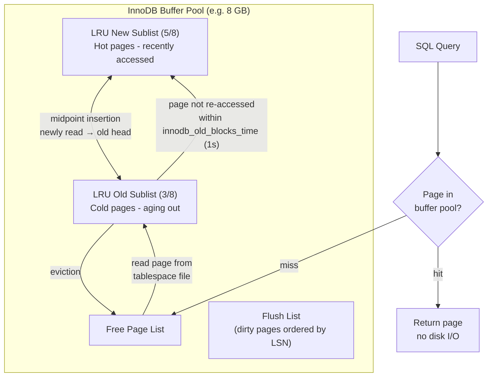

**이중 쓰기 버퍼**: 더티 페이지를 테이블스페이스로 플러시하기 전에 InnoDB는 이를 이중 쓰기 버퍼(2MB, 128페이지)에 순차적으로 씁니다. 이는 충돌 중에 부분 페이지 쓰기(찢어진 페이지)로부터 보호합니다. 페이지 체크섬이 실패하면 복구는 이중 쓰기에서 읽습니다.

---

## 2. B+Tree 인덱스 내부

### 노드 구조 및 분할 알고리즘

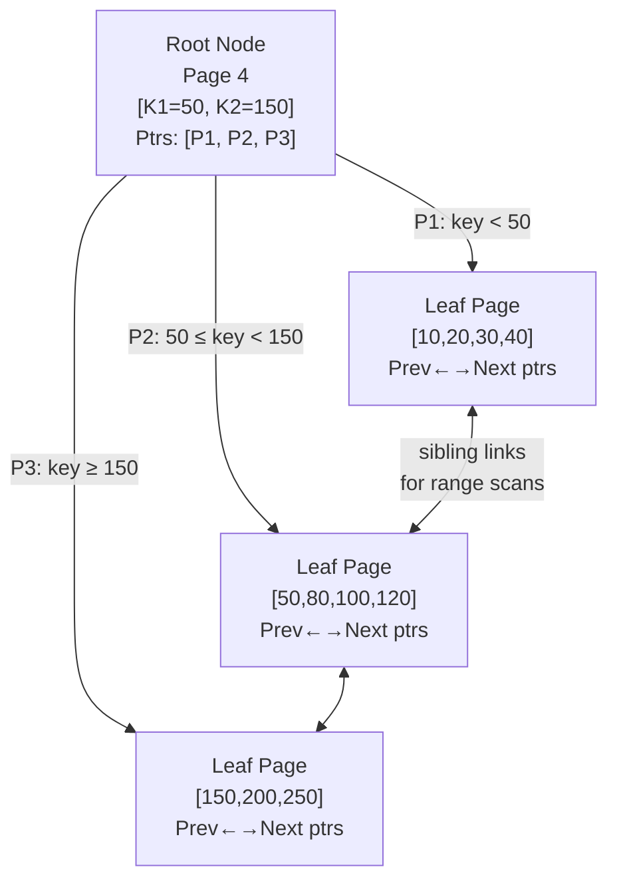

### INSERT 시 페이지 분할

리프 페이지가 용량에 도달하면(업데이트 공간을 남겨두기 위한 채우기 비율 ~69%):

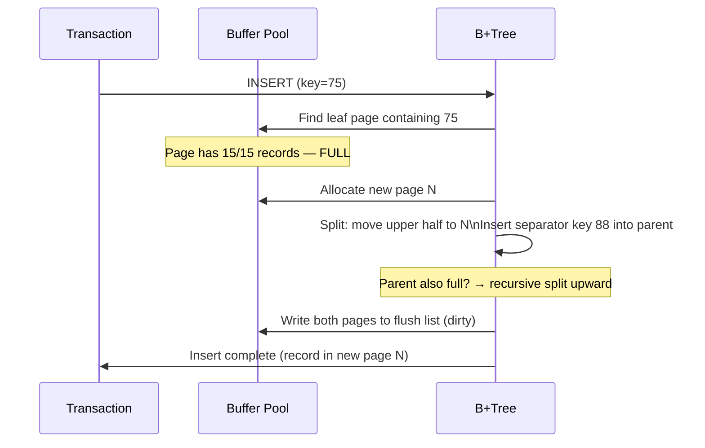

**클러스터형 인덱스**(InnoDB 기본 키): B+Tree 리프에 저장된 전체 행입니다. 물리적 주문 = PK 주문. 조각화는 무작위 PK 삽입 시 발생합니다(UUID PK = 최악의 경우).

**보조 색인**: 리프는 `(secondary_key, primary_key)`을 저장합니다. 포인트 조회: 보조 인덱스 B+Tree → PK 값 → 클러스터형 인덱스 B+Tree(2개의 B+Tree 순회 = "북마크 조회").

### 인덱스 채우기 비율 및 조각화

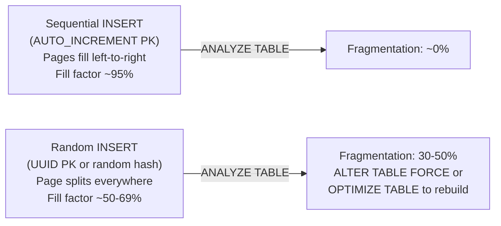

---

## 3. InnoDB MVCC — 실행 취소 로그 체인

MVCC(Multi-Version Concurrency Control)를 사용하면 리더가 작성자를 차단하지 않습니다. 모든 행 버전은 실행 취소 로그를 통해 연결됩니다.

### 행 버전 체인

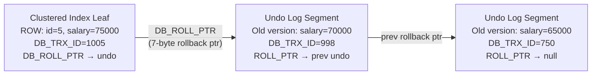

### 읽기 보기 메커니즘

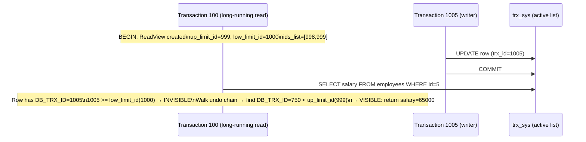

**스레드 제거**: 백그라운드 스레드(`srv_purge_coordinator_thread`)는 활성 ReadView에 로그가 필요하지 않은 경우 실행 취소 로그를 정리합니다. 장기 실행 트랜잭션은 제거를 방지합니다. → 실행 취소 테이블스페이스가 무제한으로 커집니다(전형적인 `ibdata1` 팽창 문제).

---

## 4. 트랜잭션 로그(WAL) 및 충돌 복구

### 미리 쓰기 로깅 프로토콜

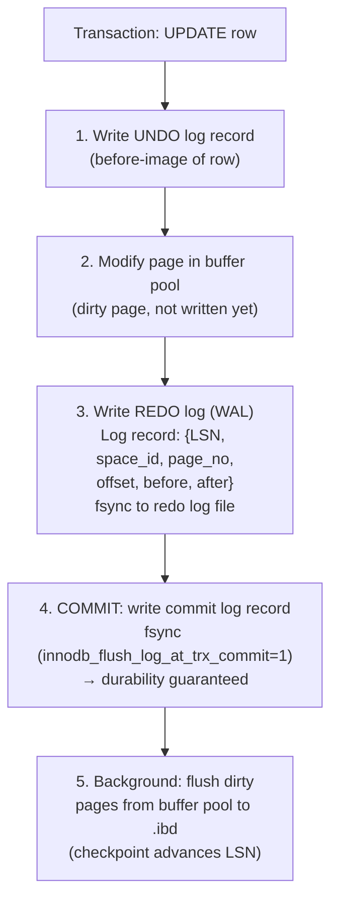

**LSN(Log Sequence Number)**: 리두 로그에 대한 바이트 오프셋을 단조롭게 증가시킵니다. 모든 페이지 헤더는 `FIL_PAGE_LSN` = 마지막 수정 LSN을 저장합니다. `page_LSN < checkpoint_LSN`이 있는 페이지는 내구성이 보장됩니다.

### 충돌 복구 — ARIES 알고리즘

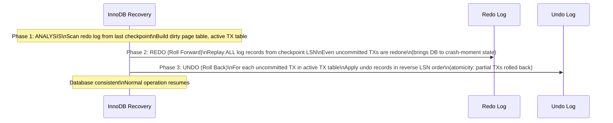

---

## 5. 쿼리 실행 파이프라인

### 쿼리 수명 주기

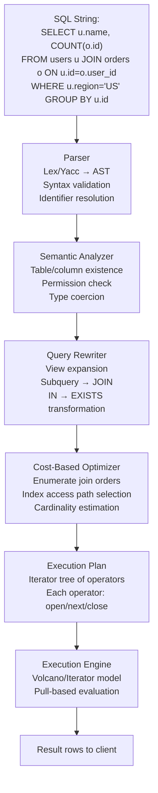

### 비용 기반 최적화 도구 — 지수 선택

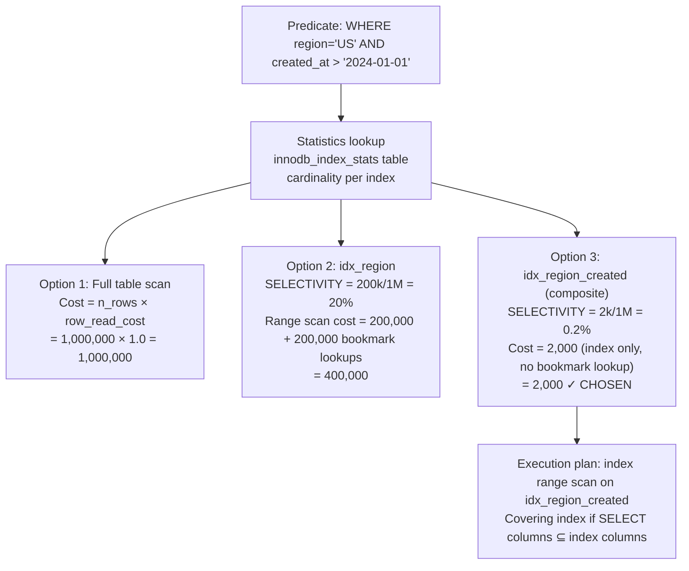

### 화산 반복자 모델

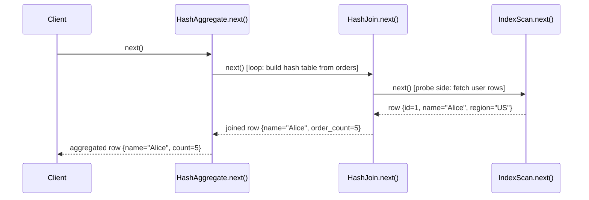

**해시 조인 내부**: 빌드 단계에서는 더 작은 테이블을 메모리 내 해시 테이블(`hash(join_key) → bucket → row`)로 읽습니다. 프로브 단계는 더 큰 테이블을 읽고, 조인 키를 해시하고, 버킷을 프로브합니다. 해시 테이블이 `join_buffer_size`을 초과하면 → 디스크로 유출됩니다(파티션을 통한 그레이스 해시 조인).

---

## 6. SQL Server 저장소 내부(Pro SQL Server 내부)

### 데이터 페이지(8KB)

```
+-------------------+ 0
| Page Header       | 96 bytes: pageID, type, freeCount, slotCount, nextPage, prevPage
+-------------------+
| Row 0             | Variable-length: null bitmap + fixed cols + var-length ptr array + var data
| Row 1             |
| ...               |
| Row N             |
+-------------------+
| Free Space        |
+-------------------+
| Row Offset Array  | 2 bytes per row, grows from bottom
| [N offset]        | slot[i] = byte offset of row i within page
+-------------------+ 8191
```

### 행 구조(가변 길이)

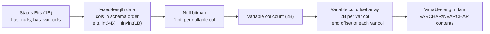

**전달된 레코드**: UPDATE가 행 크기를 페이지 용량 이상으로 늘리면 행이 새 페이지로 이동됩니다. 원래 슬롯은 8바이트 전달 포인터를 갖습니다. 힙 스캔은 전달 포인터를 따르므로 성능이 저하됩니다. 수정: `ALTER TABLE REBUILD`(클러스터형 인덱스)는 전달된 레코드를 제거합니다.

### SQL Server 잠금 계층 구조

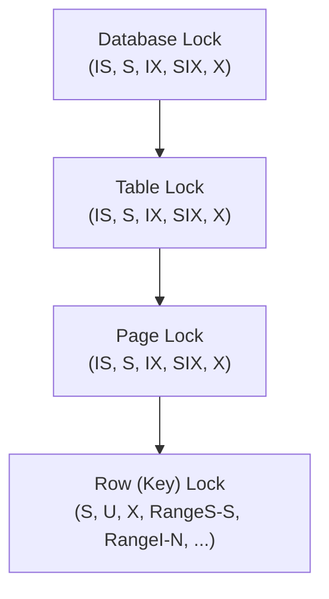

**잠금 에스컬레이션**: SQL Server는 잠금 수가 트랜잭션당 ~5000을 초과하는 경우 메모리 오버헤드를 줄이기 위해 행/페이지 잠금을 테이블 잠금으로 에스컬레이션합니다. 차단을 유발할 수 있습니다. `ALTER TABLE ... SET (LOCK_ESCALATION = DISABLE)`로 비활성화하세요.

**NOLOCK 힌트 / READ UNCOMMITTED**: 공유 잠금을 획득하지 않고 페이지를 읽습니다 → 더티 읽기가 가능합니다(커밋되지 않은 데이터, 팬텀 행, 비행 중에 롤백된 데이터도 확인).

---

## 7. 트랜잭션 격리 수준 및 이상 방지

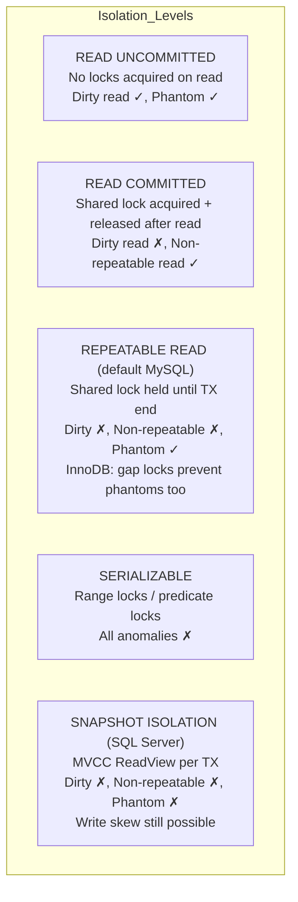

**간격 잠금(InnoDB RR)**: 레코드 앞의 간격을 잠가서 INSERT가 범위에 들어가는 것을 방지합니다. `WHERE id BETWEEN 10 AND 20`인 경우 해당 범위의 모든 간격에 대한 간격 잠금이 동시 INSERT를 방지합니다. 전체 직렬화 가능 격리 없이 팬텀을 제거합니다.

**교착 상태 감지**: 각 잠금 관리자는 "대기 그래프"를 유지합니다. 백그라운드 스레드는 DFS(주기 감지)를 실행합니다. 주기가 발견되면 피해자 선택: 가장 작은 트랜잭션(실행 취소 로그 크기 기준)이 롤백됩니다. `INFORMATION_SCHEMA.INNODB_TRX`에 교착 상태 정보가 기록되었습니다.

---

## 8. 인덱스 유형 및 액세스 패턴

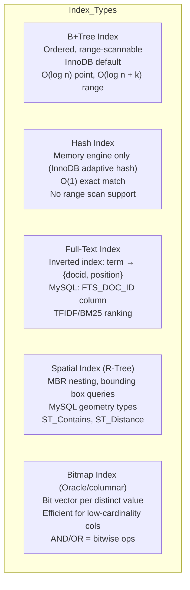

### 커버링 인덱스 - 북마크 조회 제거

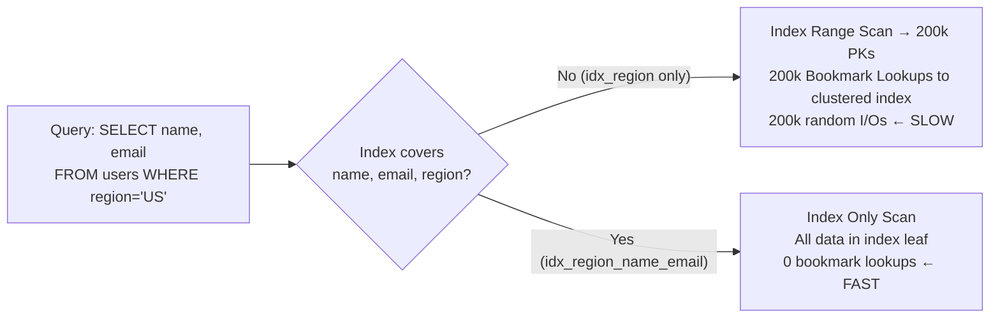

---

## 9. 조인 알고리즘 - 메모리 및 CPU 경로

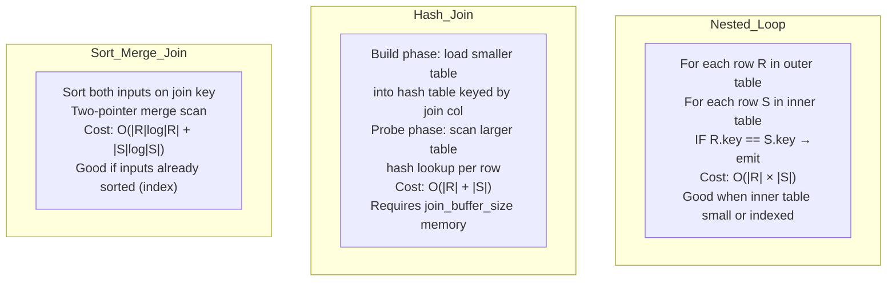

**중첩 루프 차단**(MySQL 8.0 이전): `join_buffer_size` 청크로 외부 테이블을 읽고, 청크당 한 번씩 내부 테이블을 스캔합니다. 내부 테이블 읽기를 `|outer|`에서 `|outer| / buffer_chunk_size`로 줄입니다.

**해시 방지 조인**(NOT IN / NOT EXISTS의 경우): 하위 쿼리 결과에서 해시 세트를 구축합니다. 각 프로브 행에 대해 일치하는 해시가 없는 경우에만 내보냅니다.

---

## 10. 쓰기 경로 - 체크포인트 및 Redo 로그 주기

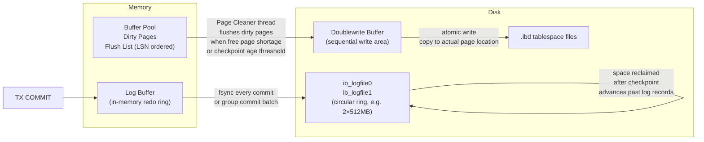

**체크포인트 기간**: `innodb_log_file_size × 2 × 0.75` = 강제 플러시 전 최대 더티 데이터. 리두 로그가 가득 차면(체크포인트 기간 = 로그 크기) 체크포인트가 완료되는 동안 모든 쓰기가 STALL됩니다. 증상: 오류 로그에 "InnoDB: page_cleaner: 1000ms 의도한 루프에 5000ms가 걸렸습니다."

---

## 11. 내부 파티셔닝

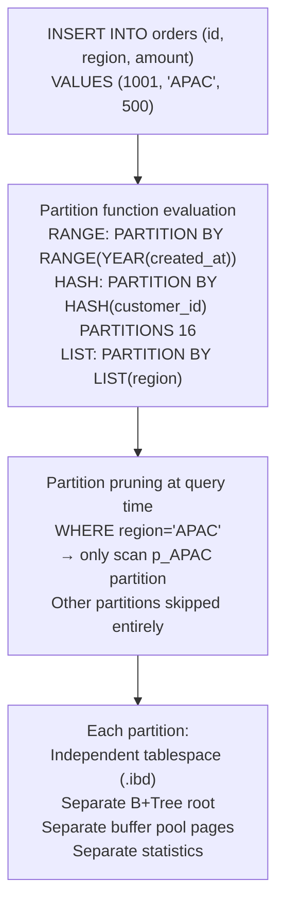

파티션 정리에는 WHERE 절에 **파티션 열의 조건자**가 필요합니다. 정리하지 않으면 모든 파티션이 스캔됩니다. 파티션되지 않은 테이블보다 나쁩니다(내려갈 B+트리 루트가 더 많음). 파티션 키는 모든 고유/기본 키의 일부여야 합니다.

---

## 12. 열 저장소와 행 저장소 내부

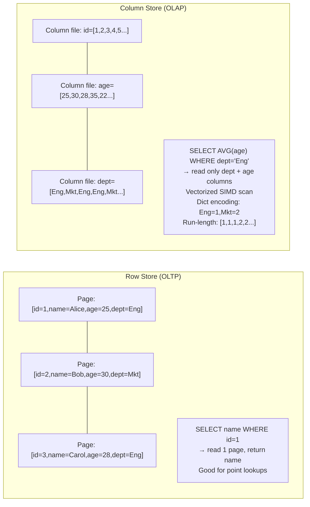

**사전 인코딩**: 문자열 열 값을 정수 코드로 바꿉니다. `dept` 열은 `uint8` 배열, 사전: `{0: "Engineering", 1: "Marketing"}`로 저장됩니다. 카디널리티가 낮은 열의 경우 압축 비율은 10-100x입니다.

**벡터화된 실행**: SIMD(AVX-256: 명령어당 8 × 32비트 연산)를 사용하여 한 번에 1024개 행을 처리합니다. 열형 레이아웃을 사용하면 메모리에 연속된 한 열의 모든 값 → CPU 프리페치가 효율적이며 L1/L2 캐시가 활용됩니다.

---

## 데이터베이스 성능 수치 참조

| 운영 | 이노DB | SQL 서버 | 메모 |
|-----------|--------|------------|-------|
| 버퍼 풀 적중 | ~100ns | ~100ns | DRAM 액세스 |
| NVMe SSD에서 페이지 읽기 | ~50μs | ~50μs | 순차: ~10 µs |
| B+트리포인트 조회(3레벨) | 3 × 50μs = 150μs | 비슷한 | 캐시는 가장 많은 비용을 절약할 수 있습니다 |
| 전체 테이블 스캔(1M 행) | 0.5~5초 | 비슷한 | I/O 대역폭에 따라 다름 |
| 해시 조인(2 × 1M 행) | 1~10초 | 비슷한 | 메모리가 없으면 디스크로 유출 |
| 인덱스 재구축(1억 행) | 10~60분 | 비슷한 | 온라인 재구축: 더 길어짐 |
| 체크포인트 플러시 스톨 | 0~5초 | 0~5초 | 로그 파일 크기를 통해 조정 가능 |
| 행 잠금 획득 | ~1μs | ~1μs | 메모리 내 해시 조회 |
| 교착상태 감지 | ~1ms | ~1ms | DFS 주기 감지 |

---

## 요약 - 데이터 흐름 맵

```mermaid
flowchart TD
    SQL["SQL Query arrives"] --> PARSE["Parse → AST"]
    PARSE --> OPT["Cost-based optimizer\nStatistics → access path"]
    OPT --> EXEC["Iterator execution tree\nVolcano pull model"]
    EXEC --> BP["Buffer Pool lookup\n(page granularity)"]
    BP -->|"miss"| DISK["Disk read\n.ibd page → buffer pool"]
    BP -->|"hit"| ROW["Row extraction\nslot array → row offset\nnull bitmap → field values"]
    ROW -->|"MVCC"| UNDO["Undo chain walk\nReadView visibility check"]
    UNDO --> RESULT["Return row to iterator"]
    
    WRITE["DML: INSERT/UPDATE/DELETE"] --> UNDOW["Write undo log"]
    UNDOW --> MODP["Modify buffer pool page\n(dirty)"]
    MODP --> REDOW["Append redo log record"]
    REDOW --> COMMIT["COMMIT → fsync redo log"]
    COMMIT --> BGFLUSH["Background: page cleaner\nflushes dirty pages"]
```

모든 바이트의 전체 수명 주기: SQL 텍스트 → AST → 비용 추정 계획 → 반복자 풀 → 버퍼 풀 페이지 → MVCC 실행 취소 체인 → 필드 바이트. 쓰기 시: 실행 취소 로그(이미지 전) → 더티 페이지(메모리 내) → 다시 실행 로그(WAL, 내구성) → .ibd로 백그라운드 플러시. WAL 보장은 기반입니다. 실제 데이터 페이지가 디스크에 있는지 여부에 관계없이 다시 실행 로그가 fsync되는 순간 데이터는 내구성이 있습니다.


---

## 설계적 고민

### 구조와 모델링

#### 데이터베이스 저장 계층 구조: 디스크 중심 설계

데이터베이스의 모든 설계 결정은 그 근본이 **디스크 I/O는 메모리 접근보다 10만 배 느리다**라는 사실에서 출발한다. 이 물리적 제약이 버퍼 풀, WAL, B+Tree 등 모든 핵심 구조의 존재 이유를 설명한다.

저장 계층의 구조를 보면, SQL 쿼리가 디스크의 물리적 데이터에 도달하기까지 여러 추상화 계층을 거친다. 각 계층은 상위 계층에게 **더 높은 수준의 추상화**를 제공하며, 이는 단순한 소프트웨어 계층화가 아니라 **성능 특성이 다른 매체간의 다리** 역할을 한다.

```mermaid
graph TD
    SQL["클라이언트 SQL 쿼리"] --> PARSER["파서 / 노멀라이저"]
    PARSER --> OPTIMIZER["비용 기반 옵티마이저<br/>통계 정보 + 접근 경로 선택"]
    OPTIMIZER --> EXECUTOR["실행 엔진<br/>반복자 모델 / 벡터화 실행"]
    EXECUTOR --> BUFFER["버퍼 풀 매니저<br/>페이지 단위 캐시"]
    BUFFER -->|"미스"| DISK["디스크 I/O<br/>4KB~16KB 페이지 단위 읽기"]
    BUFFER -->|"히트"| ROW["행 추출 / MVCC 언두 체인"]

    WRITE["쓰기 경로"] --> UNDO["언두 로그 기록"]
    UNDO --> DIRTY["버퍼 풀 더티 페이지"]
    DIRTY --> WAL["리두 로그(WAL) fsync"]
    WAL --> BG["백그라운드 플러시"]

    style SQL fill:#264653,color:#fff
    style OPTIMIZER fill:#2a9d8f,color:#fff
    style BUFFER fill:#e9c46a,color:#000
    style DISK fill:#e76f51,color:#fff
    style WAL fill:#f4a261,color:#000
```

#### 정규화 vs 역정규화: 데이터 모델링의 근본적 긴장

정규화는 데이터 중복을 제거하여 **쓰기 이상 현상(write anomaly)**을 방지하지만, 읽기 시 JOIN이 필요해져 성능이 떨어진다. 역정규화는 읽기를 빠르게 하지만 데이터 일관성 유지 비용이 증가한다.

실무에서의 결정 기준:
- **쓰기 비율 > 30%**: 정규화 유지 (일관성 우선)
- **읽기 비율 > 90%**: 역정규화 고려 (대시보드, 리포트)
- **하이브리드**: OLTP는 정규화, OLAP 뷰는 역정규화 (CQRS 패턴)

### 트레이드오프와 의사결정

#### WAL vs Shadow Paging: 복구 전략의 근본적 선택

데이터베이스 복구의 두 가지 근본 접근방식은 **WAL(Write-Ahead Logging)**과 **Shadow Paging**이다.

**WAL**은 데이터를 수정하기 전에 변경 사항을 로그에 먼저 기록한다. 커밋 시점에는 로그만 fsync하면 되므로 순차 쓰기(sequential write) 한 번으로 내구성을 보장한다. 실제 데이터 페이지는 백그라운드에서 비동기적으로 플러시된다.

**Shadow Paging**은 수정된 페이지를 새 위치에 쓰고, 커밋 시 페이지 테이블의 포인터를 원자적으로 전환한다. 별도의 로그가 필요 없지만, 랜덤 쓰기가 발생하고 가비지 콜렉션이 필요하다.

```mermaid
flowchart LR
    subgraph "WAL 접근방식"
        direction TB
        W1["트랜잭션 시작"] --> W2["변경 사항 → 리두 로그 기록<br/>순차 쓰기(append-only)"]
        W2 --> W3["COMMIT: 리두 로그 fsync<br/>→ 내구성 보장"]
        W3 --> W4["백그라운드: 더티 페이지 플러시<br/>랜덤 I/O(지연 가능)"]
    end

    subgraph "Shadow Paging 접근방식"
        direction TB
        S1["트랜잭션 시작"] --> S2["수정 페이지 → 새 위치에 복사-쓰기<br/>랜덤 I/O"]
        S2 --> S3["COMMIT: 페이지 테이블 포인터 전환<br/>원자적 스와프"]
        S3 --> S4["구 페이지 GC 필요<br/>공간 회수 비용 높음"]
    end

    style W2 fill:#2d6a4f,color:#fff
    style W3 fill:#2d6a4f,color:#fff
    style S2 fill:#9b2226,color:#fff
    style S3 fill:#9b2226,color:#fff
```

대부분의 현대 RDBMS(InnoDB, PostgreSQL)가 WAL을 선택한 이유는 **쓰기 성능**에 있다. WAL은 순차 쓰기로 로그를 기록하므로 HDD/SSD 모두에서 최적의 쓰기 성능을 달성한다. SQLite는 버전 3.7부터 WAL 모드를 도입하여 동시 읽기 성능을 크게 개선했다.

#### MVCC vs 잠금 기반 동시성 제어

동시성 제어의 두 가지 접근방식은 **MVCC**와 **잠금 기반(Lock-based)**이다.

**PostgreSQL의 MVCC**: 각 행에 `xmin`(creation txn ID)과 `xmax`(deletion txn ID)를 두어, 읽기 트랜잭션은 자신의 스냅샷 시점의 데이터만 본다. **읽기가 쓰기를 차단하지 않으며**, 쓰기가 읽기를 차단하지 않는다.

**MySQL/InnoDB의 MVCC + 잠금**: InnoDB도 MVCC를 사용하지만, 언두 로그 체인을 통해 구 버전을 재구성한다. PostgreSQL과 달리 구 버전이 동일 테이블스페이스에 있지 않으므로 VACUUM이 필요 없지만, 긴 트랜잭션에서 언두 체인이 길어지면 성능이 저하된다.

```mermaid
sequenceDiagram
    participant T1 as 트랜잭션 T1<br/>(읽기)
    participant DB as 데이터베이스
    participant T2 as 트랜잭션 T2<br/>(쓰기)

    Note over DB: row X: value=100, xmin=10, xmax=∞
    T1->>DB: BEGIN (snapshot txn_id=50)
    T2->>DB: BEGIN (txn_id=51)
    T2->>DB: UPDATE X SET value=200
    Note over DB: row X: value=100, xmin=10, xmax=51<br/>new version: value=200, xmin=51, xmax=∞
    T1->>DB: SELECT value FROM X
    Note over T1: snapshot=50 → xmin=10 < 50 ✔, xmax=51 > 50 ✔<br/>구 버전(100) 보임
    DB-->>T1: value = 100 (스냅샷 일관성)
    T2->>DB: COMMIT
    T1->>DB: SELECT value FROM X
    DB-->>T1: value = 100 (Repeatable Read)
```

#### B+Tree 인덱스 vs Hash 인덱스: 언제 어떤 것을 선택하는가

| 기준 | B+Tree 인덱스 | Hash 인덱스 |
|------|------------|------------|
| 포인트 조회 | O(log n) | O(1) |
| 범위 쿼리 | 지원 (리프 순차 스캔) | **불가** |
| ORDER BY | 자연 지원 | 불가 |
| LIKE 'abc%' | 접두사 검색 가능 | 불가 |
| 디스크 I/O | 노드 크기 = 페이지 | 버킷 분산 |
| 동시성 | 페이지 수준 락 | 버킷 수준 락 |

대부분의 실무 워크로드에서 B+Tree가 선호되는 이유는 **다용도성**에 있다. Hash 인덱스는 `=` 조건에만 유용하지만, B+Tree는 동등, 범위, 정렬, 접두사 검색을 모두 지원한다. MySQL InnoDB는 아예 Hash 인덱스를 지원하지 않는다(Adaptive Hash Index는 내부 캐시 목적).

### 리팩토링과 설계 원칙

#### 클러스터드 vs 비클러스터드 인덱스: 물리적 배치의 설계적 의미

**클러스터드 인덱스(Clustered Index)**는 데이터의 물리적 저장 순서를 인덱스 키 순서로 정렬한다. 테이블당 하나만 존재할 수 있다(InnoDB는 PK가 클러스터드 인덱스).

**비클러스터드 인덱스(Secondary Index)**는 리프 노드에 실제 데이터 대신 **PK 포인터**를 저장한다. 따라서 비클러스터드 인덱스 탐색 후 실제 데이터를 얻으려면 **클러스터드 인덱스를 다시 탐색(bookmark lookup)**해야 한다.

이 설계는 중요한 의미를 가진다:
- **PK는 짧을수록 좋다**: 모든 보조 인덱스가 PK를 저장하므로, PK가 길면 보조 인덱스 크기가 비례하여 증가한다
- **자연 증가 PK가 유리**: 순차 삽입은 B+Tree의 바로 다음 리프에 추가되어 페이지 분할이 최소화된다
- **잔돔 삽입(UUID PK)은 페이지 분할을 유발**: B+Tree의 임의 위치에 삽입되어 하나가득 찬 페이지를 분할해야 한다

```mermaid
graph TD
    subgraph "클러스터드 인덱스 (InnoDB PK)"
        CI_ROOT["B+Tree 루트"] --> CI_L1["리프: PK 1-100<br/>실제 행 데이터 저장"]
        CI_ROOT --> CI_L2["리프: PK 101-200<br/>실제 행 데이터 저장"]
    end

    subgraph "보조 인덱스 (name 컨럼)"
        SI_ROOT["B+Tree 루트"] --> SI_L1["리프: 'Alice'→PK=42<br/>'Bob'→PK=7"]
        SI_L1 -.->|"북마크 룩업"| CI_ROOT
    end

    style CI_L1 fill:#2d6a4f,color:#fff
    style CI_L2 fill:#2d6a4f,color:#fff
    style SI_L1 fill:#e9c46a,color:#000
```

#### 인덱스 설계의 리팩토링 신호

다음 직관들은 인덱스 리팩토링이 필요하다는 신호이다:
- 슬로우 쿼리 로그에서 **filesort** 또는 **Using temporary**가 빈번하게 나타남
- **커버링 인덱스(covering index)**로 전환 가능한 쿼리가 있음 (bookmark lookup 제거)
- 복합 인덱스의 컨럼 순서가 쿼리 패턴과 불일치 (레프트모스트 프리픽스 원칙 위반)

### 디자인 패턴 적용

#### Iterator 패턴과 Volcano 실행 모델

대부분의 관계형 데이터베이스 실행 엔진은 **Volcano(Iterator) 모델**을 사용한다. 각 연산자(Scan, Filter, Join, Sort)가 `open()`, `next()`, `close()` 인터페이스를 구현하는 **Iterator 패턴**이다.

이 패턴의 장점:
- **지연 평가(lazy evaluation)**: 행을 한 개씩 당겨오므로 전체 결과를 메모리에 올릴 필요 없음
- **조합 가능성**: 어떤 연산자든 `next()` 가 행을 반환하므로 자유롭게 조합 가능
- **다형성**: 새 연산자 추가가 쉽고, 기존 연산자를 수정할 필요 없음

```mermaid
flowchart BT
    SCAN["테이블 스캔<br/>next() → row"] --> FILTER["필터<br/>WHERE age > 25<br/>next() → 조건 맞는 row"]
    FILTER --> JOIN["해시 조인<br/>next() → 조인된 row"]
    SCAN2["인덱스 스캔<br/>next() → row"] --> JOIN
    JOIN --> SORT["정렬<br/>next() → 정렬된 row"]
    SORT --> PROJECT["프로젝션<br/>SELECT name, age<br/>next() → 최종 결과"]

    style SCAN fill:#264653,color:#fff
    style SCAN2 fill:#264653,color:#fff
    style FILTER fill:#2a9d8f,color:#fff
    style JOIN fill:#e9c46a,color:#000
    style SORT fill:#f4a261,color:#000
    style PROJECT fill:#e76f51,color:#fff
```

#### Proxy 패턴과 버퍼 풀

버퍼 풀은 **Proxy 패턴**의 전형적 사례다. 실행 엔진은 디스크에 직접 접근하지 않고, 버퍼 풀을 통해 페이지를 요청한다. 버퍼 풀이 **디스크의 프록시**로서 동작하는 것이다.

LRU(Least Recently Used) 교체 정책만으로는 부족하다. 전체 테이블 스캔이 버퍼 풀보다 크면 LRU가 오염된다. InnoDB는 **Young/Old subdivision**을 사용하여 전체 스캔이 핵심 페이지를 밀어내지 못하도록 한다.

```mermaid
graph LR
    subgraph "버퍼 풀 LRU 구조 (InnoDB)"
        direction LR
        NEW["헤드(Young)<br/>자주 접근된 페이지<br/>새로 프로모션된 페이지"] --> MID["중간점<br/>5/8 위치"]
        MID --> OLD["테일(Old)<br/>오래된 페이지<br/>스캔으로 유입된 페이지"]
        OLD --> EVICT["축출 → 디스크"]
    end

    NEW_PAGE["새 페이지 요청"] -->|"미스"| MID
    NEW_PAGE -->|"두 번째 접근 시"| NEW

    style NEW fill:#2d6a4f,color:#fff
    style OLD fill:#9b2226,color:#fff
    style EVICT fill:#6c757d,color:#fff
```

이 설계는 **적응적 프록시(Adaptive Proxy)** 패턴으로, 접근 패턴에 따라 캐시 정책을 동적으로 조정한다. 단순한 Proxy를 넘어 **도메인 지식이 내장된 프록시**가 데이터베이스 성능의 핵심이다.

---

## 연습 문제

### 1. 시스템 구조와 모델링

**문제 1-1.** 당신은 전자상거래 서비스의 DBA다. 주문 테이블에 동시에 수백 개의 트랜잭션이 UPDATE를 수행하고 있다. PostgreSQL의 MVCC 환경에서, 트랜잭션 A가 `SELECT`로 읽은 행을 트랜잭션 B가 `UPDATE`한 직후 트랜잭션 A가 같은 행을 다시 `SELECT`했다. Repeatable Read 격리 수준에서 트랜잭션 A는 어떤 값을 보게 되며, 그 이유는 무엇인가? 만약 Read Committed였다면 결과가 어떻게 달라지는가?

<details><summary>힌트 보기</summary>

MVCC에서 각 트랜잭션은 시작 시점의 **스냅샷**을 기반으로 데이터를 읽는다. Repeatable Read는 트랜잭션 시작 시점의 스냅샷을 고정하고, Read Committed는 **각 쿼리 시작 시점**마다 새로운 스냅샷을 생성한다. `xmin`, `xmax` 필드를 통해 행의 가시성이 결정되는 메커니즘을 떠올려보라.

</details>

**문제 1-2.** 서버가 트랜잭션 도중 갑자기 전원이 꺼졌다. WAL(Write-Ahead Logging)과 ARIES 복구 프로토콜을 사용하는 데이터베이스에서, 재시작 시 어떤 3단계 복구 과정이 일어나는가? 만약 WAL의 마지막 체크포인트 이후 커밋 레코드가 기록된 트랜잭션과 커밋되지 않은 트랜잭션이 섞여 있다면, 각각 어떻게 처리되는가?

<details><summary>힌트 보기</summary>

ARIES 복구는 **분석(Analysis) → 재실행(Redo) → 취소(Undo)** 3단계로 진행된다. 분석 단계에서 마지막 체크포인트부터 WAL 끝까지 스캔하여 dirty page 목록과 활성 트랜잭션 목록을 구성한다. Redo는 체크포인트 이후 **모든** 변경을 재적용하고(커밋 여부 무관), Undo는 커밋되지 않은 트랜잭션의 변경을 역순으로 되돌린다.

</details>

**문제 1-3.** WAL에서 커밋 레코드가 디스크에 기록되는 시점이 왜 중요한가? 트랜잭션이 `COMMIT` 명령을 실행했지만, WAL 커밋 레코드가 디스크에 `fsync`되기 전에 시스템이 크래시되었다면 이 트랜잭션의 상태는 어떻게 되는가? `synchronous_commit = off` 설정을 사용하면 어떤 트레이드오프가 발생하는지 설명하라.

<details><summary>힌트 보기</summary>

WAL의 핵심 원칙은 **Write-Ahead**: 데이터 페이지를 수정하기 전에 반드시 로그를 먼저 기록해야 한다. 커밋의 "공식적" 완료는 WAL 커밋 레코드가 디스크에 영구화된 시점이다. `fsync` 전에 크래시되면 해당 트랜잭션은 **커밋되지 않은 것**으로 간주되어 Undo 대상이 된다. `synchronous_commit = off`는 지연 시간(latency)과 내구성(durability) 사이의 트레이드오프다.

</details>

### 2. 트레이드오프와 의사결정

**문제 2-1.** 전자상거래 주문 테이블에서 `주문일시` 기준 범위 검색과 `주문 상태`별 필터링이 동시에 빈번하다. B+Tree 인덱스와 Hash 인덱스 중 어떤 것을 선택해야 하며, 왜 Hash 인덱스가 이 경우에 부적합한가? 복합 인덱스 `(주문일시, 주문상태)` vs `(주문상태, 주문일시)`의 선택은 쿼리 패턴에 따라 어떻게 달라지는가?

<details><summary>힌트 보기</summary>

Hash 인덱스는 **등치 검색(=)**에만 사용 가능하고 범위 검색(`BETWEEN`, `<`, `>`)을 지원하지 않는다. B+Tree는 정렬된 구조이므로 범위 검색에 효율적이다. 복합 인덱스에서 **선행 컬럼**이 범위 조건에 사용되면 후행 컬럼의 인덱스 활용이 제한된다(Index Skip Scan 제외). 카디널리티와 쿼리 패턴을 함께 고려하라.

</details>

**문제 2-2.** 소셜 미디어 뉴스피드 시스템을 설계하고 있다. 사용자 프로필, 게시글, 좋아요, 댓글 테이블이 있다. 정규화된 설계(3NF)에서는 뉴스피드 한 페이지를 렌더링하기 위해 5개 이상의 JOIN이 필요하다. 비정규화하여 뉴스피드 전용 테이블을 만들 경우 어떤 이점과 위험이 있는가? 어떤 상황에서 정규화를 유지하고, 어떤 상황에서 비정규화가 정당화되는가?

<details><summary>힌트 보기</summary>

정규화는 **데이터 무결성**과 **갱신 이상(update anomaly)** 방지에 유리하고, 비정규화는 **읽기 성능**에 유리하다. 비정규화의 위험은 데이터 불일치(사용자가 이름을 바꾸면 뉴스피드 테이블의 모든 관련 행 업데이트 필요)와 저장 공간 증가다. 읽기/쓰기 비율, 데이터 일관성 요구 수준, 캐시 전략의 가용성을 기준으로 판단하라.

</details>

**문제 2-3.** IoT 센서 데이터 수집 시스템이 초당 10만 건의 쓰기를 처리해야 한다. 전통적인 B+Tree 기반 스토리지 엔진(InnoDB)과 LSM-Tree 기반 엔진(RocksDB) 중 어떤 것이 적합하며, 그 이유는 무엇인가? LSM-Tree의 쓰기 증폭(Write Amplification)과 읽기 증폭(Read Amplification) 트레이드오프를 설명하고, compaction 전략(Size-Tiered vs Leveled)이 이 트레이드오프에 어떻게 영향을 미치는지 분석하라.

<details><summary>힌트 보기</summary>

B+Tree는 **랜덤 I/O**가 발생하여 쓰기 시 해당 페이지를 찾아가 수정해야 한다. LSM-Tree는 모든 쓰기를 **순차적 I/O**로 변환(memtable → SSTable flush)하여 쓰기 처리량이 높다. 그러나 읽기 시 여러 레벨의 SSTable을 검색해야 하므로 읽기가 느려진다. Size-Tiered compaction은 쓰기 증폭이 낮지만 공간 증폭이 크고, Leveled compaction은 반대 특성을 보인다.

</details>

### 3. 문제 해결 및 리팩토링

**문제 3-1.** 운영 중인 시스템에서 두 트랜잭션이 서로의 자원을 기다리며 데드락이 발생했다. 트랜잭션 A는 `계좌 #1 → 계좌 #2` 순서로 잠금을 획득하고, 트랜잭션 B는 `계좌 #2 → 계좌 #1` 순서로 잠금을 획득한다. 이 데드락을 해결하기 위한 3가지 접근법(잠금 순서 강제, 타임아웃, MVCC 활용)을 비교하고, 금융 시스템에서 가장 적합한 접근법과 그 이유를 설명하라.

<details><summary>힌트 보기</summary>

**잠금 순서 강제**: 모든 트랜잭션이 계좌 ID 오름차순으로 잠금을 획득하면 순환 대기를 원천 차단한다. **타임아웃**: `innodb_lock_wait_timeout`으로 대기 시간 제한 후 롤백한다. **MVCC 활용**: `SELECT ... FOR UPDATE` 대신 낙관적 잠금(버전 컬럼)을 사용하여 충돌 시 재시도한다. 금융 시스템에서는 **정확성**이 최우선이므로 잠금 순서 강제가 가장 예측 가능하다.

</details>

**문제 3-2.** 대규모 사용자 테이블에서 UUID v4를 기본키로 사용하고 있다. 시간이 지남에 따라 INSERT 성능이 급격히 저하되었고, `SHOW ENGINE INNODB STATUS`에서 페이지 분할(page split)이 빈번하게 관측된다. 왜 이 현상이 발생하는지 B+Tree의 구조적 관점에서 설명하고, UUID v7(ULIDv2)이나 ULID로 전환하면 어떻게 개선되는지 설명하라. AUTO_INCREMENT 대신 UUID 계열을 사용해야 하는 정당한 이유는 무엇인가?

<details><summary>힌트 보기</summary>

InnoDB의 클러스터드 인덱스는 기본키 순서로 데이터를 물리적으로 정렬한다. UUID v4는 **무작위** 값이므로 새 행이 B+Tree의 임의 위치에 삽입되어 빈번한 페이지 분할을 유발한다. UUID v7/ULID는 **시간 기반 접두사**가 있어 단조 증가하므로 순차 삽입에 가까워진다. UUID의 정당성: 분산 환경에서 중앙 ID 생성기 없이 고유 ID 생성, 샤딩 시 ID 충돌 방지, 보안(ID 예측 불가).

</details>

**문제 3-3.** 다음 쿼리가 운영 환경에서 5초 이상 걸린다: `SELECT * FROM orders WHERE user_id = ? AND status = 'SHIPPED' AND created_at > '2025-01-01' ORDER BY created_at DESC LIMIT 20`. `EXPLAIN` 결과, `type: ALL`(풀 테이블 스캔)이 나타났다. 인덱스 `idx_user_status (user_id, status)`가 존재함에도 옵티마이저가 인덱스를 사용하지 않는 이유를 추론하고, 이 쿼리에 최적화된 인덱스를 설계하라. 커버링 인덱스(Covering Index) 전략까지 고려하라.

<details><summary>힌트 보기</summary>

기존 인덱스 `(user_id, status)`는 `created_at` 범위 조건과 `ORDER BY`를 커버하지 못한다. 인덱스를 사용하더라도 `created_at` 필터링과 정렬을 위해 **filesort**가 필요하여 옵티마이저가 비용상 풀 스캔을 선택할 수 있다. 최적 인덱스는 `(user_id, status, created_at)` — 등치 조건 컬럼을 선행에, 범위/정렬 컬럼을 후행에 배치한다. 커버링 인덱스는 `SELECT`에 필요한 모든 컬럼을 인덱스에 포함하여 테이블 액세스를 제거하는 전략이다.

</details>

### 4. 개념 간의 연결성

**문제 4-1.** 시스템이 크래시된 후 복구되는 전체 과정을 WAL, MVCC, 체크포인트 개념을 연결하여 설명하라. 구체적으로: (1) 체크포인트가 WAL의 복구 시작점을 어떻게 결정하는가? (2) Redo 단계에서 MVCC의 다중 버전 행들은 어떻게 처리되는가? (3) Undo 단계에서 롤백된 트랜잭션의 행 버전은 어떻게 정리되는가? 이 세 개념이 없다면 각각 어떤 문제가 발생하는지도 설명하라.

<details><summary>힌트 보기</summary>

**체크포인트**는 특정 시점에 dirty page를 디스크에 기록하고 WAL에 체크포인트 레코드를 남겨, 복구 시 이 지점부터 재생하면 된다(이전 로그는 불필요). **WAL**은 모든 변경의 영구적 기록으로, 크래시 후 데이터 페이지에 반영되지 않은 변경을 재실행한다. **MVCC**의 다중 버전 중 커밋된 버전만 유효하며, Undo 단계에서 미커밋 트랜잭션의 버전은 삭제된다. 체크포인트 없이는 WAL 전체를 처음부터 재생해야 하고, WAL 없이는 크래시 시 데이터 손실, MVCC 없이는 동시성 제어가 잠금에만 의존한다.

</details>

**문제 4-2.** 1TB 이상의 로그 테이블을 운영하고 있다. 시간 기반 파티셔닝(월별)과 B+Tree 인덱스를 함께 적용하려 한다. (1) 파티셔닝이 쿼리 성능에 미치는 영향(파티션 프루닝)과 인덱스와의 상호작용을 설명하라. (2) 글로벌 인덱스 vs 로컬 인덱스의 트레이드오프는 무엇인가? (3) 오래된 파티션을 DROP하는 것이 DELETE보다 효율적인 이유를 스토리지 엔진 관점에서 설명하라.

<details><summary>힌트 보기</summary>

**파티션 프루닝**: WHERE 절의 파티션 키 조건으로 불필요한 파티션을 아예 스캔하지 않는다. **로컬 인덱스**는 각 파티션 내에서만 유효하여 파티션 관리(DROP/ADD)가 쉽지만 크로스 파티션 쿼리가 느리다. **글로벌 인덱스**는 모든 파티션을 아우르지만 파티션 변경 시 인덱스 재구성이 필요하다. `DROP PARTITION`은 메타데이터만 변경하여 O(1)이지만, `DELETE`는 각 행을 찾아 삭제하고 인덱스를 업데이트하며 WAL에 기록하여 O(N)이다.

</details>

**문제 4-3.** 마이크로서비스 환경에서 주문 서비스와 재고 서비스가 분리되어 있다. 주문 생성 시 재고 차감이 원자적으로 이루어져야 한다. (1) 2PC(Two-Phase Commit)를 사용할 경우 데이터베이스 WAL과 어떻게 연관되는가? (2) Saga 패턴으로 대체할 경우, 보상 트랜잭션이 실패하면 어떻게 되는가? (3) Outbox 패턴을 사용하여 로컬 트랜잭션과 이벤트 발행을 보장하는 방법을 WAL의 원자적 기록 보장 개념과 연결하여 설명하라.

<details><summary>힌트 보기</summary>

**2PC**에서 각 참여자의 prepare 단계는 WAL에 prepare 레코드를 기록하여 크래시 후에도 투표 결과를 복구할 수 있게 한다. **Saga**의 보상 트랜잭션 실패 시에는 재시도 큐(dead letter queue), 수동 개입, 또는 멱등성 보장이 필요하다. **Outbox 패턴**은 비즈니스 데이터와 이벤트를 **같은 로컬 트랜잭션**으로 기록하여 WAL의 원자성을 활용 — 트랜잭션이 커밋되면 둘 다 보장되고, 롤백되면 둘 다 취소된다. 별도의 CDC(Change Data Capture) 프로세스가 Outbox 테이블을 읽어 메시지 브로커로 발행한다.

</details>