# DevOps 및 Linux 내부: 내부

> 합성: comp(36/103-178) DevOps, Linux 관리, CI/CD, 쉘 스크립팅, Ansible, Terraform, 모니터링 및 Wieers *Ansible for DevOps*, Morris *Infrastructure as Code*, Turnbull *The Docker Book*, 모니터링/경고 스택 및 전체 Linux 시스템 관리 커리큘럼을 포함한 인프라 자동화 참조.

---

## 1. Linux Systemd 내부 — 유닛 활성화 그래프

systemd는 최신 Linux에서 PID 1입니다. 종속성 해결 및 소켓 활성화를 통해 서비스 시작을 병렬화하고 순차적 SysV 초기화 스크립트를 대체합니다.

### 단위 의존성 그래프 및 활성화

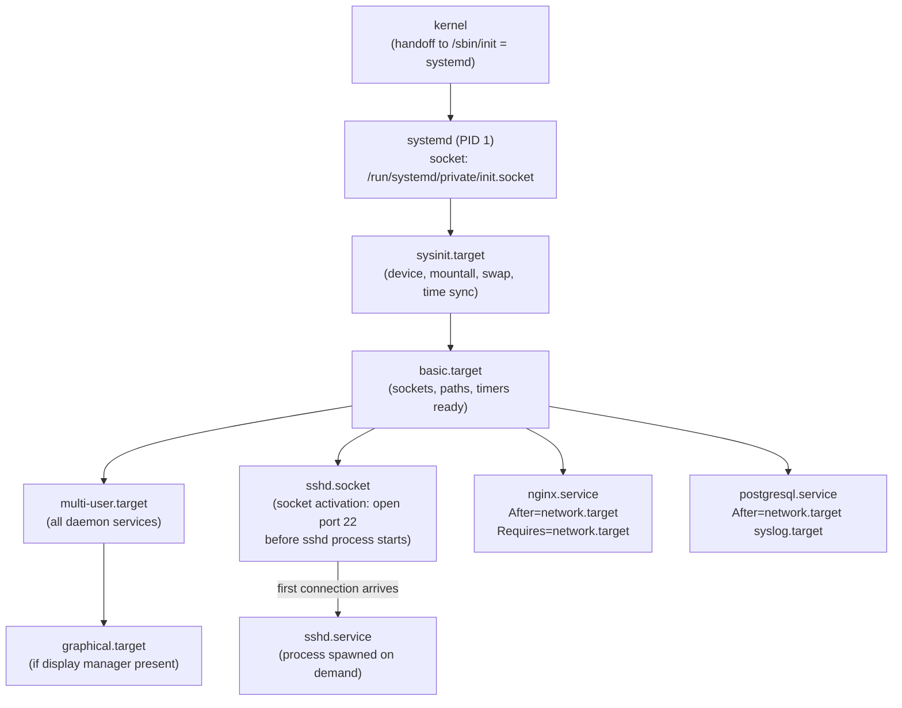

**소켓 활성화**: systemd는 서비스를 시작하기 전에 청취 소켓(`bind()`, `listen()`)을 생성합니다. 서비스는 `SD_LISTEN_FDS`를 통해 미리 열린 파일 설명자를 상속합니다. 서비스가 준비될 때까지 커널 백로그에 연결 대기열이 있습니다. 다시 시작하는 동안 연결이 끊겼습니다.

### Cgroup 통합 — 리소스 제어

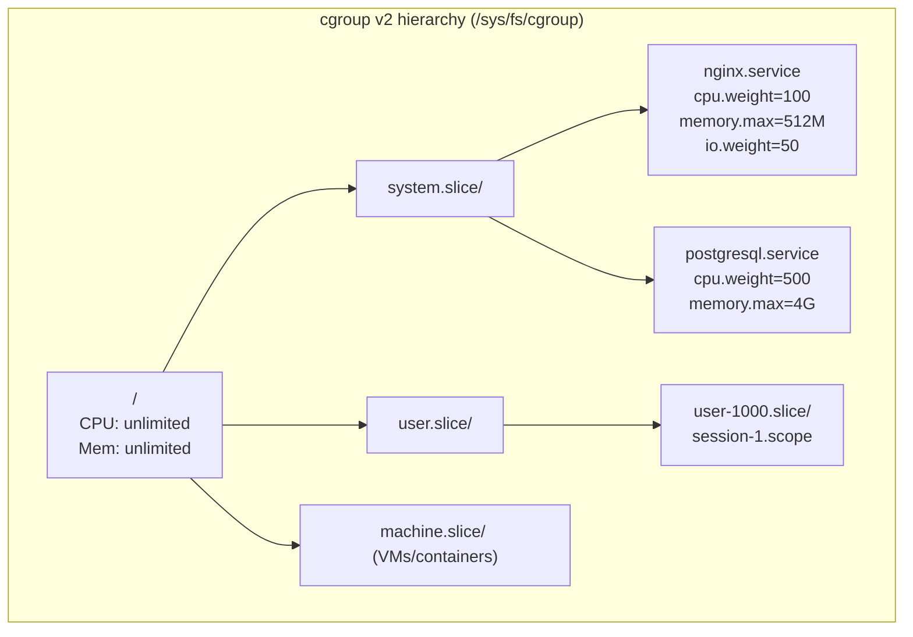

systemd는 각 서비스를 cgroup 슬라이스에 매핑합니다. `systemctl set-property nginx.service CPUQuota=50%` → `50000 100000`을 cgroup의 `cpu.max` 파일에 기록 → 커널 CFS 대역폭 컨트롤러가 할당량을 적용합니다.

---

## 2. Linux 패키지 관리 내부

### RPM/DNF — 거래 처리

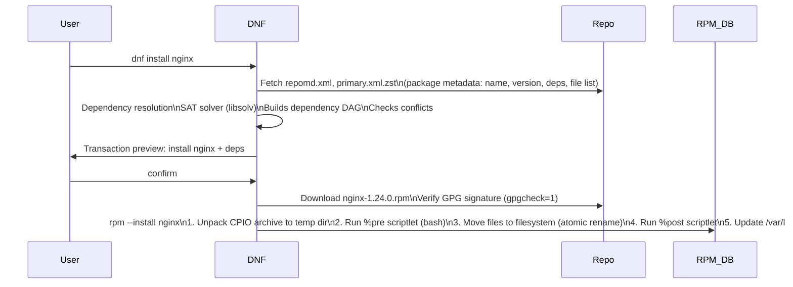

**RPM CPIO 아카이브**: `.rpm` = 리드(매직) + 서명(헤더+페이로드를 통한 MD5/GPG) + 헤더(메타데이터 태그) + 페이로드(CPIO 아카이브, xz/zstd 압축). CPIO의 각 파일에는 경로, 크기, 모드, uid/gid, 체크섬이 있습니다.

### APT/dpkg — 종속성 해결

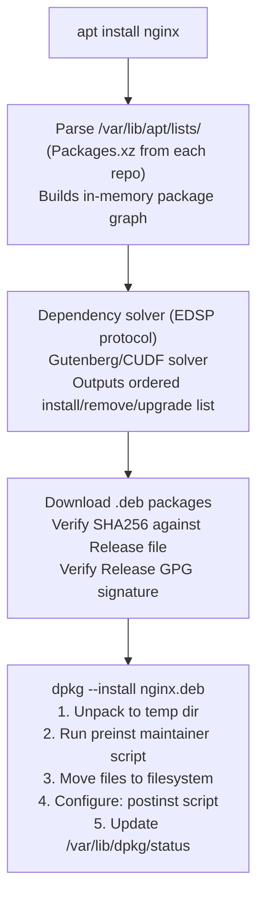

---

## 3. Ansible 내부 — 작업 실행 엔진

### 제어 흐름 및 모듈 실행

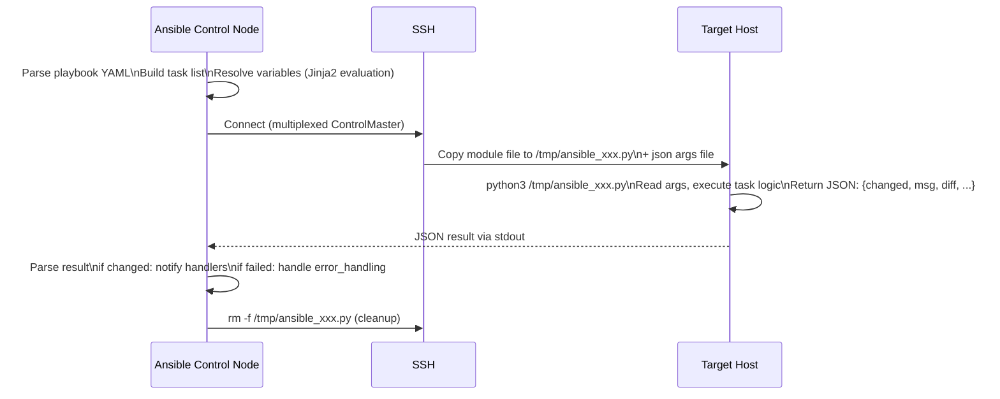

**Mitogen 백엔드**(2-3배 더 빠름): 작업당 Python 스크립트를 복사하는 대신 Mitogen은 SSH를 통해 대상에서 Python 인터프리터를 한 번 포크하고 이를 플레이의 모든 작업에 재사용합니다. 작업당 Python 시작(~50ms) 및 파일 복사 오버헤드를 절약합니다.

**사실 수집**: `setup` 모듈은 `facter`과 유사한 시스템 검사를 실행합니다. `/proc`, `dmidecode`, `ip addr`, `df`, `uname`을 읽고 → JSON 사실 dict를 반환 → `hostvars[hostname]`에 저장됩니다.

### Ansible에서 Jinja2 템플릿 렌더링

```
Variable precedence (lowest to highest):
role defaults → inventory file vars → inventory group_vars → inventory host_vars
→ playbook group_vars → playbook host_vars → host facts
→ play vars → task vars → extra vars (-e) → registered vars
```

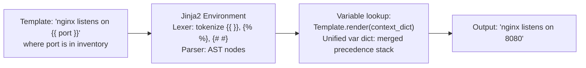

---

## 4. Terraform 상태 및 계획 내부

### 코드형 인프라 — 상태 머신

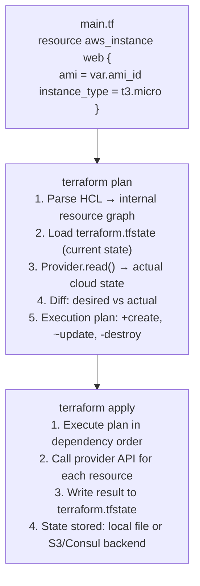

**상태 잠금**: S3 백엔드는 분산 잠금을 위해 DynamoDB 테이블을 사용합니다. `terraform apply`은 잠금을 획득 → 실행 → 해제합니다. 동일한 인프라에 대한 동시 적용을 방지합니다(분할 브레인 위험).

**리소스 그래프**: `depends_on` + 암시적 참조를 통해 종속성이 해결되었습니다. `aws_db_instance.db` 참조 `aws_vpc_subnet.private.id` → DB 이전에 서브넷이 생성된다. Terraform은 독립적인 리소스 작업을 병렬화합니다.

---

## 5. CI/CD 파이프라인 내부

### Jenkins 파이프라인 실행 모델

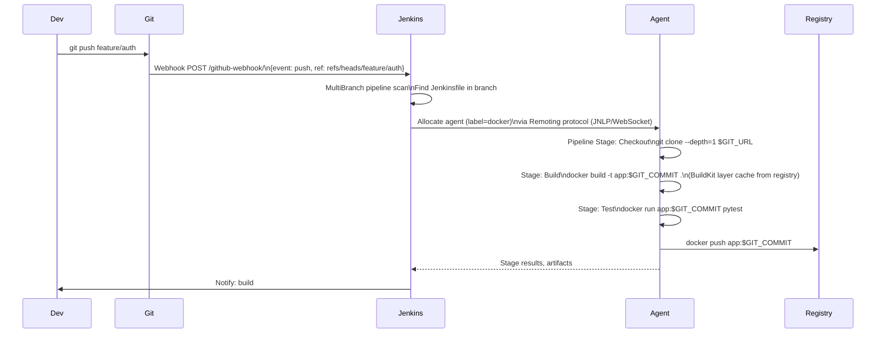

**선언적 파이프라인 YAML → Groovy**: Jenkins DSL이 Groovy 스크립트로 구문 분석되었습니다. `pipeline {}`, `stages {}`, `steps {}`는 `WorkflowScript`에 대한 메서드 호출입니다. 각 단계는 에이전트 작업 영역 디렉터리에서 실행됩니다. 단계별로 범위가 지정된 환경 변수입니다.

---

## 6. Linux 프로세스 및 신호 내부

### fork()/exec() 구현 세부 사항

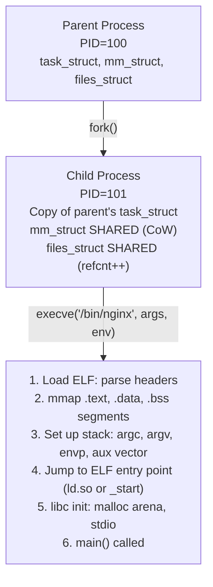

**CoW(기록 시 복사)**: fork() 이후 상위 및 하위 모두 동일한 물리적 페이지를 공유합니다(읽기 전용으로 표시됨). 공유 페이지에 처음 쓸 때: 페이지 오류 → 커널이 새 페이지를 할당하고, 콘텐츠를 복사하고, 쓰기 프로세스를 위해 PTE를 다시 매핑합니다. 실제로 수정된 페이지만 복제됩니다.

### 신호 전달

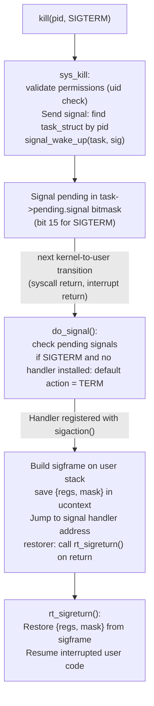

**신호 마스크**: `sigprocmask(SIG_BLOCK, &set, NULL)`은 `task->blocked` 비트마스크를 설정합니다. `task->blocked`에 보류 중인 신호는 차단이 해제될 때까지 연기됩니다. `SIGKILL` 및 `SIGSTOP`은(는) 차단하거나 잡을 수 없습니다.

---

## 7. Linux 셸 내부 — Bash 실행

### 명령 구문 분석 및 확장 순서

```mermaid
flowchart TD
    A["Input: echo \"Hello $USER, $(date)\" > /tmp/out.txt"]
    A --> B["Tokenization:\nReserved words, operators, words\nQuote removal context tracking"]
    B --> C["Parsing: command tree\n{simple_cmd echo, args [...], redirect stdout}"]
    C --> D["Expansion (in order):\n1. Brace expansion: {a,b}c → ac bc\n2. Tilde: ~/foo → /home/user/foo\n3. Parameter: $USER → 'alice'\n4. Command subst: $(date) → fork+exec date\n5. Arithmetic: $((1+2)) → 3\n6. Word splitting on IFS=\\t\\n (after unquoted expansions)\n7. Glob/pathname: *.txt → file list\n8. Quote removal: strip remaining quotes"]
    D --> E["Execute: fork()+execve('echo', args)\nRedirect: open('/tmp/out.txt', O_WRONLY|O_CREAT|O_TRUNC)\ndup2(fd, STDOUT_FILENO)\nexecve('echo', ['echo', 'Hello alice, Thu Feb ...'], envp)"]
```

**파이프 내부**: `cmd1 | cmd2` → `pipe(fds)` → 두 하위 항목 포크 → 하위 1: `dup2(fds[1], 1)`(쓰기 종료 → 표준 출력) → `execve(cmd1)` → 하위 2: `dup2(fds[0], 0)`(읽기 종료 → 표준 입력) → `execve(cmd2)`. 커널 파이프 버퍼: 64KB(`fcntl(fd, F_SETPIPE_SZ, n)`을 통해 조정 가능)

---

## 8. Linux 모니터링 스택 - Prometheus/Grafana 내부

### 측정항목 수집 아키텍처

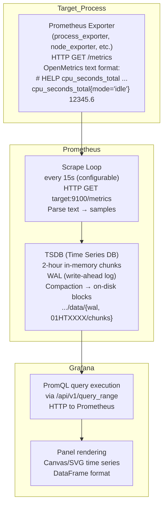

### TSDB 청크 형식

```
Chunk (2-hour window for one time series):
Header: encoding=XOR_FLOAT64, num_samples
Sample 0: t0=unix_ms, v0=float64 (raw)
Sample 1: Δt1=(t1-t0), Δv using XOR delta-of-delta encoding
...
Compression: typically 1.37 bytes/sample vs 16 bytes raw
```

**XOR 델타 인코딩**(Gorilla 압축): 첫 번째 샘플: 전체 64비트 부동 소수점. 후속 샘플: 이전 값과 XOR. XOR=0(동일한 값)인 경우: 1비트. 그렇지 않은 경우: 제어 비트 + XOR 유효 비트. 천천히 변화하는 측정항목에 대해 10~100배 압축을 달성합니다.

---

## 9. 로그 파이프라인 내부 — Fluentd/ELK 스택

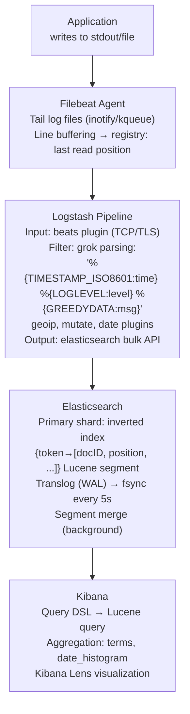

**Logstash grok**: 명명된 정규식 패턴입니다. `%{TIMESTAMP_ISO8601:time}`은 복잡한 날짜/시간 정규식으로 확장됩니다. Java 패턴으로 컴파일되었습니다. 일치 → 명명된 그룹 추출 → 이벤트 맵에 추가 → 다음 필터로 전달합니다.

---

## 10. 인프라 자동화 — 패커 및 불변 이미지

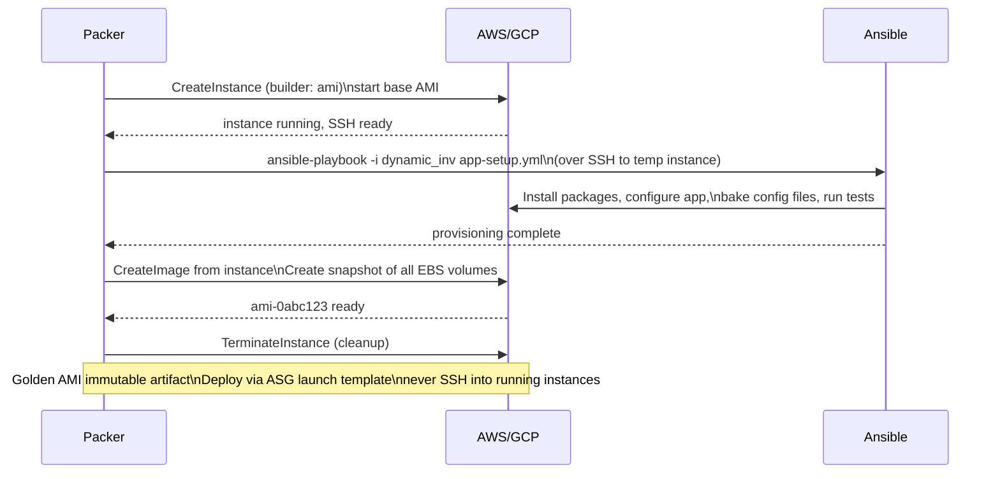

**불변 인프라**: 모든 종속성과 함께 AMI가 한 번만 구워졌습니다. Auto Scaling 그룹은 AMI에서 인스턴스를 시작합니다. 배포 시: 새 AMI → 시작 템플릿 업데이트 → 롤링 교체(이전 인스턴스가 종료되고 새로 시작됨). 구성 드리프트가 없으며 배포가 재현 가능합니다.

---

## 11. Linux 성능 분석 - 성능 및 eBPF

### 성능 샘플링 내부

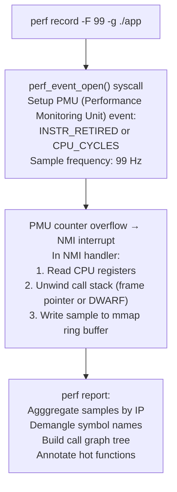

### eBPF — 모듈 없는 커널 확장

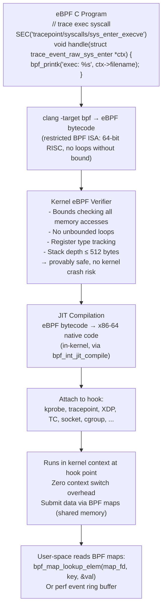

**XDP(eXpress Data Path)**: SK_BUFF 할당 전 NIC 드라이버의 수신 기능에 연결된 eBPF 프로그램입니다. 회선 속도(100GbE에서 최대 140Mpps)로 패킷을 삭제/리디렉션/통과할 수 있습니다. DDoS 완화, 로드 밸런싱(Cloudflare, Facebook)에 사용됩니다.

---

## 12. 컨테이너 런타임 - runc 및 OCI 내부

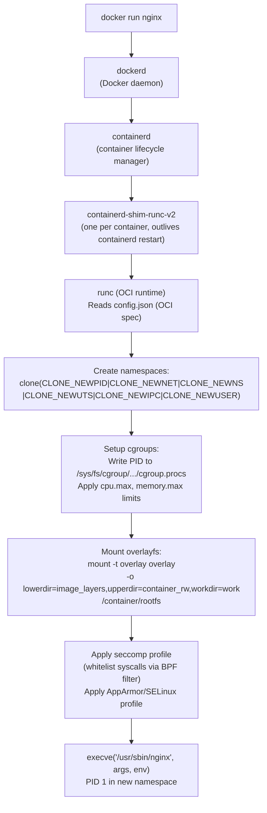

**overlayfs 쓰기 경로**: 컨테이너 파일 시스템에 대한 모든 쓰기 → 쓰기는 `upperdir`에만 적용됩니다. `lowerdir`의 원본 이미지 레이어는 수정되지 않았습니다. `diff`: upperdir을 아무것도 아닌 것과 비교합니다 = 컨테이너별 변경 사항만 비교합니다. 이를 통해 효율적인 레이어 캐싱(동일한 이미지를 사용하여 모든 컨테이너에서 공유되는 기본 레이어)이 가능합니다.

---

## DevOps 성능 수치 참조

| 운영 | 시간 | 메모 |
|-----------|------|-------|
| systemd 장치 시작(비어 있음) | ~50-200ms | 프로세스 생성 + D-Bus 알림 |
| Ansible 작업(SSH + Python) | ~500ms-2s | 작업별 오버헤드 |
| Ansible 작업(Mitogen) | ~50-200ms | 지속적인 Python 연결 |
| Terraform 계획(100개 리소스) | 5~30초 | 공급자 API 호출 |
| Docker 이미지 빌드(레이어 캐시) | ~1~5초 | 변경된 레이어만 다시 작성됨 |
| Docker 이미지 빌드(콜드) | 30초~5분 | 전체 종속성 설치 |
| 컨테이너 시작(콜드 이미지 풀) | 10~60초 | 이미지 레이어 다운로드 |
| 컨테이너 시작(캐시됨) | ~0.5-2초 | overlayfs 설정 + execve |
| eBPF 프로그램 로드+확인 | ~1~100ms | 검증기 복잡성 |
| 성능 기록 오버헤드 | ~1-5% CPU | 99Hz 샘플링 |
| 프로메테우스 긁힌 | ~1-10ms | HTTP + 텍스트 구문 분석 |
| Elasticsearch 인덱스 쓰기 | ~1~50ms | Translog + 세그먼트 쓰기 |
| 젠킨스 파이프라인 시작 | ~2-10초 | 에이전트 할당 + 작업 공간 설정 |


---

## 설계적 고민

### 구조와 모델링

DevOps 시스템을 설계할 때 가장 근본적인 질문은 **인프라를 어떤 패러다임으로 관리할 것인가**이다. GitOps와 전통적 CI/CD는 단순한 도구 선택이 아니라 인프라 관리의 철학적 차이를 반영한다.

**GitOps vs 전통적 CI/CD 파이프라인**: GitOps는 Git 저장소를 단일 진실 공급원(Single Source of Truth)으로 삼아 선언적으로 인프라 상태를 정의한다. ArgoCD나 Flux가 Git 상태와 클러스터 상태의 차이를 감지하고 자동으로 수렴(reconcile)시킨다. 반면 전통적 CI/CD(Jenkins, GitHub Actions)는 명령적(imperative) 파이프라인으로, 각 단계에서 무엇을 **해야 하는지**를 순서대로 기술한다.

핵심 차이는 **드리프트 감지**에 있다. GitOps에서는 누군가 `kubectl edit`로 직접 클러스터를 수정하면 ArgoCD가 이를 Out-of-Sync로 감지하고 Git 상태로 되돌린다. 전통적 CI/CD에서는 파이프라인 외부의 수동 변경을 감지할 메커니즘이 없어 **구성 드리프트(Configuration Drift)**가 축적된다.

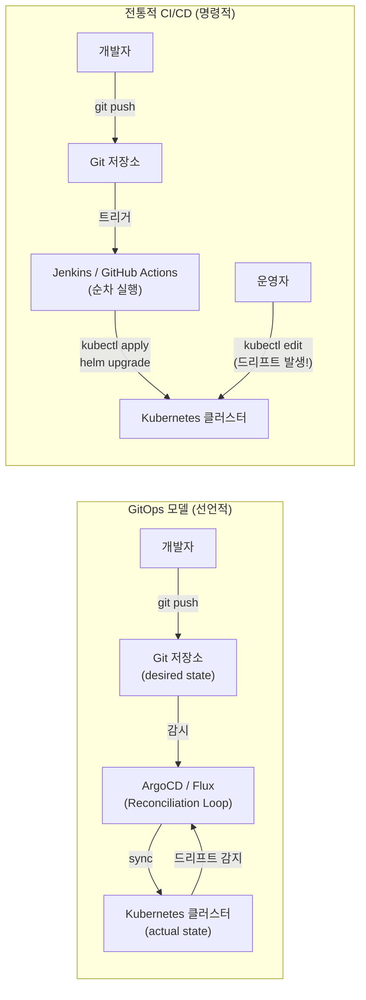

**불변 인프라(Immutable Infrastructure) vs 뮤터블 인프라**: 불변 인프라는 서버를 한 번 프로비저닝하면 절대 변경하지 않고, 업데이트가 필요하면 새 이미지를 빌드하여 교체한다. HashiCorp의 Packer로 AMI를 굽고, Terraform으로 배포하는 패턴이 대표적이다. 뮤터블 인프라는 Ansible/Chef로 기존 서버에 패치를 적용하는 방식이다.

불변 인프라의 핵심 이점은 **재현성(Reproducibility)**이다. 모든 서버가 동일한 이미지에서 시작하므로 "내 머신에서는 되는데" 문제가 원천적으로 차단된다. 그러나 이미지 빌드 시간(5-15분)이 필요하고, 핫픽스 배포가 느려지는 트레이드오프가 존재한다.

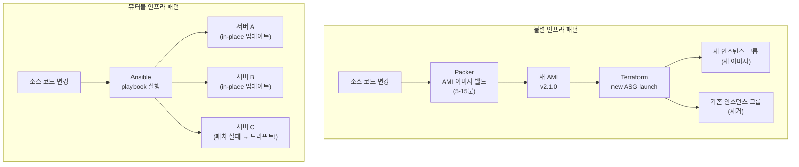

### 트레이드오프와 의사결정

**Ansible(절차적) vs Terraform(선언적) IaC 선택 기준**: 두 도구는 종종 경쟁 관계로 인식되지만, 실제로는 **관심사의 레이어가 다르다**. Terraform은 인프라 프로비저닝(VM, 네트워크, 로드밸런서 생성)에 최적화되어 있고, Ansible은 구성 관리(패키지 설치, 설정 파일 배포)에 강하다.

Terraform의 `terraform plan`은 현재 상태(state file)와 원하는 상태(HCL 코드)의 차이를 계산하여 **실행 계획을 미리 보여준다**. 이는 프로덕션 변경의 위험을 크게 줄인다. 반면 Ansible은 멱등성을 모듈 수준에서 보장하지만, 전체 플레이북의 결과를 미리 볼 수 없다(`--check` 모드는 근사값일 뿐이다).

실무에서 가장 효과적인 패턴은 **Terraform + Ansible 조합**이다: Terraform이 EC2 인스턴스를 생성하고, Ansible이 해당 인스턴스 내부를 구성한다. 혹은 Terraform + cloud-init으로 불변 인프라를 구현하면 Ansible 자체가 불필요해진다.

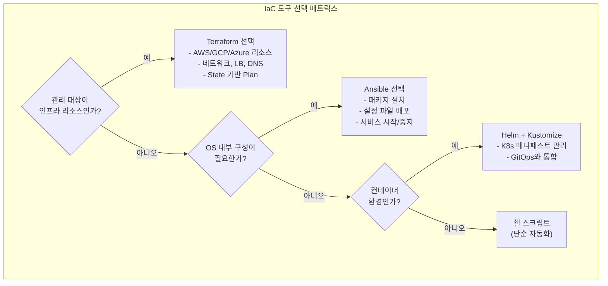

**배포 전략 선택**: Blue/Green, Canary, Rolling 배포는 각각 고유한 트레이드오프를 가진다. Blue/Green은 즉시 롤백이 가능하지만 리소스를 2배 사용한다. Canary는 점진적으로 트래픽을 전환하여 위험을 최소화하지만 복잡한 트래픽 라우팅이 필요하다. Rolling은 리소스 효율적이지만 배포 중 구/신 버전이 공존하여 호환성 문제가 발생할 수 있다.

| 전략 | 롤백 속도 | 리소스 비용 | 위험도 | 복잡도 |
|------|----------|-----------|-------|-------|
| Blue/Green | ⚡ 즉시 (DNS/LB 전환) | 💰💰 2배 인프라 | ✅ 낮음 | 중간 |
| Canary | ⏱️ 수초 (가중치 조정) | 💰 점진적 추가 | ✅ 매우 낮음 | 높음 |
| Rolling | ⏱️ 수분 (역순 롤링) | 💰 최소 | ⚠️ 중간 | 낮음 |

### 리팩토링과 설계 원칙

**Observability 3 기둥의 설계 원칙**: 메트릭, 로그, 분산 트레이스는 시스템의 관찰 가능성을 구성하는 세 가지 기둥이다. 그러나 각 기둥의 데이터 특성과 비용 구조가 근본적으로 다르기 때문에, 통합 설계 시 **데이터 흐름 아키텍처**를 신중하게 결정해야 한다.

메트릭(Prometheus)은 **시계열 데이터**로, 집계와 알림에 최적화되어 있다. 카디널리티가 낮고 저장 비용이 저렴하다. 로그(Loki/Elasticsearch)는 **이벤트 스트림**으로, 디버깅과 감사에 사용된다. 구조화된 로그(JSON)를 사용하면 검색 효율이 크게 향상된다. 분산 트레이스(Jaeger/Tempo)는 **요청 단위의 인과 관계**를 추적하며, 마이크로서비스 간 병목을 식별하는 데 필수적이다.

핵심 설계 원칙은 **상관관계(Correlation)**이다. 메트릭의 이상 탐지 → 해당 시간대 로그 검색 → 문제 요청의 트레이스 추적으로 이어지는 흐름을 위해, 모든 데이터에 공통 라벨(service, namespace, pod)과 trace_id를 삽입해야 한다.

```mermaid
flowchart TD
    APP["애플리케이션"] --> |"stdout/stderr"| AGENT["Fluent Bit / OTel Collector"]
    
    AGENT --> METRICS["Prometheus\n- 시계열 집계\n- 낮은 카디널리티\n- 알림 규칙"]
    AGENT --> LOGS["Loki / Elasticsearch\n- 이벤트 스트림\n- 구조화 JSON\n- 전문 검색"]
    AGENT --> TRACES["Jaeger / Tempo\n- 요청 인과관계\n- 서비스 맵\n- 지연 분석"]
    
    METRICS --> GRAFANA["Grafana\n통합 대시보드"]
    LOGS --> GRAFANA
    TRACES --> GRAFANA
    
    GRAFANA --> |"메트릭 이상 감지"| ALERT["Alert → 로그 검색 → 트레이스 추적\n(trace_id로 상관관계 연결)"]
```

**로그 파이프라인 리팩토링**: 초기에 모든 로그를 Elasticsearch에 저장하는 설계에서, 비용 폭증 시점에 리팩토링이 필요하다. 핵심 원칙은 **로그 계층화(Log Tiering)**이다: 에러/경고 로그는 Elasticsearch(검색 최적화)에, 대량의 접근 로그는 Loki(S3 기반 저비용)에, 감사 로그는 S3 Glacier(장기 보관)에 라우팅한다.

### 디자인 패턴 적용

**사이드카 패턴(Sidecar Pattern)과 서비스 메시**: Kubernetes 환경에서 관찰 가능성, 보안, 트래픽 관리를 애플리케이션 코드와 분리하는 핵심 패턴이다. Envoy 프록시를 사이드카로 주입하여 mTLS, 서킷 브레이커, 리트라이, 분산 트레이싱을 애플리케이션 수정 없이 적용한다.

이 패턴의 트레이드오프는 **리소스 오버헤드**이다. 각 Pod에 사이드카가 추가되면 메모리(~50-100MB)와 CPU가 추가로 소비되며, P99 지연시간이 ~1-3ms 증가한다. 대규모 클러스터(1000+ Pod)에서 이 오버헤드는 무시할 수 없다.

Istio의 Ambient Mesh 모드는 이 문제를 해결하기 위해 사이드카 대신 노드 수준의 ztunnel + L7 waypoint 프록시를 사용한다. 이는 사이드카 패턴에서 **앰비언트 패턴으로의 설계 진화**를 보여준다.

```mermaid
flowchart TD
    subgraph SidecarModel["사이드카 패턴 (Istio 기본)"]
        POD1["Pod A"]
        APP1["App 컨테이너"] --> ENVOY1["Envoy Sidecar\n+50-100MB 메모리\n+1-3ms 지연"]
        ENVOY1 --> |"mTLS"| ENVOY2["Envoy Sidecar"]
        ENVOY2 --> APP2["App 컨테이너"]
        POD2["Pod B"]
    end

    subgraph AmbientModel["앰비언트 패턴 (Istio Ambient)"]
        ZTUN1["ztunnel\n(노드 수준 L4 프록시)"]
        APPA["Pod A - App만"] --> ZTUN1
        ZTUN1 --> |"L4 mTLS"| ZTUN2["ztunnel"]
        ZTUN2 --> APPB["Pod B - App만"]
        ZTUN1 -.-> |"L7 필요 시"| WAYPOINT["Waypoint Proxy\n(공유 L7 프록시)"]
    end
```

**파이프라인 패턴(Pipeline Pattern)**: CI/CD 파이프라인 자체를 설계할 때, 각 단계를 독립적이고 멱등한 파이프라인 스테이지로 구성하는 것이 핵심이다. 빌드 → 테스트 → 보안 스캔 → 배포 각 단계는 입력/출력이 명확하고, 실패 시 해당 단계만 재실행할 수 있어야 한다.

```mermaid
flowchart LR
    SRC["소스 코드\n(Git)"] --> BUILD["빌드 단계\n- 컴파일\n- Docker 이미지 빌드\n- 아티팩트 해시 생성"]
    BUILD --> TEST["테스트 단계\n- 단위 테스트\n- 통합 테스트\n- 커버리지 게이트"]
    TEST --> SCAN["보안 스캔\n- SAST (SonarQube)\n- 컨테이너 CVE\n- 의존성 감사"]
    SCAN --> STAGE["스테이징 배포\n- Canary 1%\n- 스모크 테스트\n- 메트릭 검증"]
    STAGE --> PROD["프로덕션 배포\n- 점진적 롤아웃\n- 자동 롤백 조건\n- 배포 완료 알림"]
    
    TEST -->|"실패"| NOTIFY1["알림 + 차단"]
    SCAN -->|"Critical CVE"| NOTIFY2["알림 + 차단"]
    STAGE -->|"메트릭 이상"| ROLLBACK["자동 롤백"]
```

## 연습 문제

### 1. 시스템 구조와 모델링

**문제 1-1.** 개발자가 애플리케이션 코드를 수정하고 `git push`를 실행한 순간부터, Argo CD가 Kubernetes 클러스터의 실제 상태를 Git 저장소에 선언된 매니페스트와 일치시키기까지의 전체 Reconciliation 루프를 단계별로 설명하시오. 특히 Argo CD가 "OutOfSync" 상태를 감지하는 메커니즘과, 자동 동기화(Auto-Sync)가 활성화된 경우와 비활성화된 경우 각각의 흐름 차이를 비교하시오.

<details><summary>힌트 보기</summary>

Argo CD는 주기적으로(기본 3분) Git 저장소를 폴링하거나 Webhook을 통해 변경을 감지한다. 감지 후 `desired state`(Git)와 `live state`(클러스터)를 비교하여 Diff를 생성한다. Auto-Sync가 켜져 있으면 자동으로 `kubectl apply`에 해당하는 동기화를 수행하고, 꺼져 있으면 사용자가 수동으로 Sync 버튼을 눌러야 한다. Health Check와 Sync Wave/Hook도 고려하라.

</details>

**문제 1-2.** Prometheus가 메트릭을 수집(Pull 방식)하여 TSDB에 저장하고, Grafana가 이를 시각화하며, Alertmanager가 임계값 초과 시 Slack/PagerDuty로 알림을 발송하는 전체 경로를 설명하시오. 이때 Prometheus의 `scrape_interval`, `evaluation_interval`, Alertmanager의 `group_wait`, `group_interval`, `repeat_interval` 각 설정이 알림 지연 시간에 미치는 영향을 분석하시오.

<details><summary>힌트 보기</summary>

최악의 경우 알림 지연은 `scrape_interval + evaluation_interval + group_wait`의 합이 된다. 각 단계에서 Pull 기반 메트릭 수집 → PromQL 규칙 평가 → `for` 절 대기(pending → firing) → Alertmanager 그룹화 → 라우팅 → 수신자 발송 순서로 진행된다. 각 타이머의 기본값과 트레이드오프(빈번한 스크래핑은 정확하지만 부하 증가)를 고려하라.

</details>

**문제 1-3.** Jenkins/GitHub Actions 같은 CI 시스템에서 Docker 이미지를 빌드하고 레지스트리에 Push한 뒤, Argo CD가 이 새 이미지를 감지하여 Kubernetes 배포를 업데이트하는 전체 GitOps 파이프라인을 설계하시오. 이미지 태그 전략(latest vs semantic versioning vs Git SHA)에 따라 Argo CD의 동기화 동작이 어떻게 달라지는지 설명하시오.

<details><summary>힌트 보기</summary>

`latest` 태그는 이미지 내용이 바뀌어도 매니페스트에서 태그가 동일하므로 Argo CD가 변경을 감지하지 못한다. Git SHA 기반 태그를 사용하면 CI가 매니페스트 파일의 이미지 태그를 업데이트 → Git commit → Argo CD가 Diff 감지 → 동기화 흐름이 자연스럽게 동작한다. Argo CD Image Updater나 Kustomize 이미지 오버라이드 방식도 대안이다.

</details>

### 2. 트레이드오프와 의사결정

**문제 2-1.** 당신의 팀은 신규 결제 기능을 프로덕션에 릴리스해야 한다. Blue/Green 배포와 Canary 배포 전략을 비교할 때, 롤백 소요 시간, 인프라 비용(동시에 유지해야 하는 환경 수), 위험 노출 범위(전체 사용자 vs 일부 사용자), 데이터베이스 마이그레이션 호환성 측면에서 각각의 장단점을 분석하시오. 결제 기능처럼 금전적 손실 위험이 큰 경우 어떤 전략이 더 적합하며, 그 이유는 무엇인가?

<details><summary>힌트 보기</summary>

Blue/Green은 즉시 전환/롤백이 가능하지만 인프라를 2배로 유지해야 한다. Canary는 트래픽의 1-5%만 먼저 노출하므로 위험이 분산되지만 롤백이 점진적이다. 결제 기능은 금전 손실 위험이 크므로 Canary의 점진적 노출이 안전할 수 있으나, 롤백 속도가 중요하다면 Blue/Green의 즉시 전환도 고려해야 한다. DB 스키마 변경이 있다면 두 버전이 동시에 동작해야 하므로 Expand-Contract 마이그레이션이 필수이다.

</details>

**문제 2-2.** Terraform(선언적 IaC)과 Ansible(절차적 구성 관리)을 비교하시오. AWS에서 VPC, 서브넷, EC2 인스턴스를 프로비저닝하는 작업과, EC2 내부에 Nginx를 설치하고 설정 파일을 배포하는 작업 각각에 어떤 도구가 더 적합한가? 두 도구를 함께 사용하는 경우 책임 경계를 어떻게 나눌 것인지 설계하시오.

<details><summary>힌트 보기</summary>

Terraform은 인프라 리소스의 생명주기(생성, 수정, 삭제)를 State 파일로 추적하며 선언적으로 관리한다. Ansible은 서버 내부 구성(패키지 설치, 파일 배포, 서비스 시작)에 강하다. 함께 사용 시 Terraform이 인프라를 프로비저닝하고 IP/호스트명을 출력 → Ansible의 동적 인벤토리로 전달 → Ansible이 OS 구성을 담당하는 패턴이 일반적이다. 불변 인프라 패턴에서는 Packer로 AMI를 미리 구워서 Terraform만으로 해결하는 접근도 있다.

</details>

**문제 2-3.** 모놀리식 CI/CD 파이프라인(모든 서비스를 하나의 파이프라인에서 빌드/배포)과 마이크로서비스별 독립 파이프라인 중 어떤 접근이 적합한지 판단하시오. 팀 규모가 5명인 스타트업과 200명인 대기업 각각의 상황에서 파이프라인 분리의 장단점(빌드 시간, 독립 배포 가능성, 파이프라인 유지보수 부담)을 비교하시오.

<details><summary>힌트 보기</summary>

스타트업(5명)은 모놀리식 파이프라인이 유지보수 부담이 적고 충분하다. 대기업(200명)은 서비스 간 독립 배포가 필수이므로 서비스별 파이프라인이 필요하지만, 공통 빌드 단계(보안 스캔, 린트)는 공유 라이브러리로 추출해야 한다. Monorepo vs Polyrepo 전략에 따라서도 파이프라인 설계가 달라진다.

</details>

### 3. 문제 해결 및 리팩토링

**문제 3-1.** 팀의 CI/CD 파이프라인이 평균 30분 이상 소요되어 개발자 생산성이 크게 저하되고 있다. 파이프라인 분석 결과, Docker 이미지 빌드(12분), 통합 테스트(10분), npm 의존성 설치(5분), 보안 스캔(3분)이 순차 실행되고 있다. 이 파이프라인을 10분 이하로 단축하기 위한 구체적인 최적화 전략(테스트 병렬화, Docker 레이어 캐싱, npm 캐시, 단계 병렬 실행 등)을 제시하시오.

<details><summary>힌트 보기</summary>

Docker 빌드는 멀티스테이지 빌드 + BuildKit 캐시 마운트 + 레이어 순서 최적화(변경 빈도 낮은 레이어를 앞에)로 단축한다. npm install은 `node_modules` 캐시를 CI 캐시 스토리지에 저장한다. 통합 테스트는 테스트 분할(test splitting)로 여러 runner에 병렬 실행한다. 독립적인 단계(보안 스캔, 테스트)는 Fan-out으로 동시 실행한다. 전체 아키텍처로는 빌드 → [테스트 | 보안 스캔] (병렬) → 배포 순서로 재구성한다.

</details>

**문제 3-2.** 운영팀이 프로덕션 서버에 직접 SSH 접속하여 설정 파일을 수동으로 수정하는 관행("Snowflake Server")이 있다. 이로 인해 서버 간 설정 불일치(Configuration Drift)가 발생하고, 장애 복구 시 동일 환경을 재현할 수 없다. 이 상황을 불변 인프라(Immutable Infrastructure) + GitOps 패턴으로 전환하기 위한 단계별 마이그레이션 계획을 수립하시오.

<details><summary>힌트 보기</summary>

1단계: 현재 서버 설정을 Ansible로 코드화(현상 고정). 2단계: Packer로 골든 AMI/이미지를 빌드하는 파이프라인 구축. 3단계: Terraform으로 인프라를 코드로 관리하고, 변경 시 서버를 수정하지 않고 새 이미지로 교체(Blue/Green). 4단계: SSH 접근을 차단하고, 모든 변경을 Git PR → CI/CD → 자동 배포 경로로만 허용. 5단계: Drift Detection 도구로 선언 상태와 실제 상태의 불일치를 지속 감시한다.

</details>

**문제 3-3.** Kubernetes 클러스터에서 특정 Pod이 CrashLoopBackOff 상태에 빠져 반복 재시작되고 있다. `kubectl describe pod`에서 OOMKilled(Out Of Memory)가 확인된다. 이 문제의 근본 원인을 진단하고, Resource Requests/Limits 설정, HPA(Horizontal Pod Autoscaler), VPA(Vertical Pod Autoscaler)를 조합하여 해결하는 전략을 설계하시오.

<details><summary>힌트 보기</summary>

OOMKilled는 컨테이너의 메모리 사용량이 `resources.limits.memory`를 초과했음을 의미한다. 먼저 실제 메모리 사용 패턴을 Prometheus/Metrics Server로 분석한다. Requests는 스케줄러의 노드 배치 기준이고, Limits는 cgroups의 실제 제한이다. Limits를 너무 낮게 설정했다면 상향 조정하되, 메모리 누수가 원인이라면 애플리케이션 프로파일링이 필요하다. VPA는 자동으로 적절한 리소스 값을 추천하고, HPA는 Pod 수를 늘려 부하를 분산한다.

</details>

### 4. 개념 간의 연결성

**문제 4-1.** eBPF를 활용하여 커널 수준에서 애플리케이션의 레이턴시, 에러율, TCP 재전송 등을 관찰하고, 이 데이터를 Prometheus 메트릭으로 노출하는 관찰 가능성(Observability) 파이프라인을 설계하시오. 애플리케이션 코드를 전혀 수정하지 않고도 이것이 가능한 이유를 eBPF의 커널 훅(kprobe, tracepoint, XDP) 메커니즘과 연결하여 설명하시오.

<details><summary>힌트 보기</summary>

eBPF 프로그램은 커널의 kprobe(함수 진입/종료), tracepoint(사전 정의 이벤트), XDP(네트워크 패킷 최초 수신 시점) 등에 부착된다. 예를 들어 `tcp_sendmsg` kprobe로 TCP 전송 지연을, `sock:inet_sock_set_state`로 연결 상태 변화를 추적할 수 있다. Cilium Hubble이나 bpftrace가 이를 Prometheus exporter 형태로 노출한다. 이 방식은 사이드카 프록시 없이도 L3/L4 수준 관찰이 가능하여 성능 오버헤드가 매우 낮다.

</details>

**문제 4-2.** 마이크로서비스 장애가 발생했을 때, 분산 트레이싱(OpenTelemetry), 로그 집계(ELK 스택 또는 Loki), 메트릭(Prometheus)이라는 관찰 가능성의 세 가지 축(Three Pillars)을 교차 분석하여 근본 원인을 찾아가는 과정을 구체적인 시나리오와 함께 설명하시오. Trace ID를 매개로 세 시스템 간 상관관계를 연결하는 방법은 무엇인가?

<details><summary>힌트 보기</summary>

시나리오: API 응답 시간 급증 알림 수신(메트릭) → Grafana에서 레이턴시 스파이크 확인 → 해당 시간대 Trace를 검색하여 느린 Span 식별(트레이싱) → 해당 Span의 Trace ID로 로그 검색 → DB 연결 타임아웃 에러 발견(로그). 핵심은 모든 요청에 Trace ID를 전파(W3C Trace Context)하고, 로그에 Trace ID를 포함시켜 세 시스템을 연결하는 것이다. Grafana의 Exemplar 기능이 메트릭 → 트레이스 연결을 자동화한다.

</details>

**문제 4-3.** Kubernetes의 서비스 메시(Istio/Linkerd)가 제공하는 mTLS, 트래픽 관리, 관찰 가능성 기능과, GitOps(Argo CD)를 통한 선언적 배포 관리를 결합하여 제로 트러스트 보안 모델을 구현하는 아키텍처를 설계하시오. 서비스 메시의 사이드카 주입이 GitOps의 선언적 매니페스트 관리와 어떻게 충돌하거나 보완하는지 분석하시오.

<details><summary>힌트 보기</summary>

Istio의 사이드카 주입은 MutatingAdmissionWebhook으로 Pod 생성 시 자동으로 Envoy를 추가한다. 이는 Git에 저장된 매니페스트(사이드카 없음)와 실제 클러스터 상태(사이드카 있음)가 달라져 Argo CD가 항상 "OutOfSync"로 표시하는 문제를 일으킬 수 있다. 해결책은 Argo CD의 `ignoreDifferences` 설정이나, Istio Ambient 모드(사이드카 없는 메시)로 전환하는 것이다. PeerAuthentication, AuthorizationPolicy를 Git으로 관리하여 보안 정책도 GitOps로 선언한다.

</details>
