# 분산 시스템 내부: 합의, 내결함성 및 데이터 일관성

> 내부적으로: 분산 시스템이 신뢰할 수 없는 네트워크 전반에서 합의를 달성하고, 오류를 허용하고, 일관성을 유지하는 방법(정확한 데이터 흐름, 메시지 프로토콜, 상태 시스템 및 수학적 보장).

---

## 1. 근본적인 문제: 부분적인 실패

구성 요소가 원자적으로 실패(충돌 = 중지)되는 단일 시스템과 달리 분산 시스템은 **부분 오류**를 경험합니다. 즉, 일부 노드는 작동하고 일부는 작동하지 않으며, 네트워크 파티션이 구성 요소를 분할하고, 메시지가 순서에 맞지 않게 도착하거나 전혀 도착하지 않습니다.

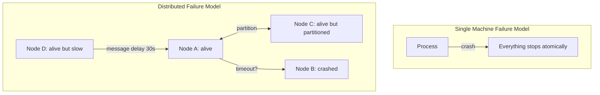

과제: **노드 A의 관점에서 보면 노드 B 충돌은 매우 느리게 응답하는 노드 B와 구별할 수 없습니다.** 시간 초과는 유일한 감지 메커니즘이지만 최대 메시지 지연을 알지 못하면 올바른 시간 초과를 선택하는 것은 불가능합니다.

### 두 장군 문제(불가능)

어떤 프로토콜도 두 당사자가 신뢰할 수 없는 채널을 통해 합의에 도달한다고 보장할 수 없습니다. 이는 **입증된 불가능**입니다. 모든 확인 메시지 자체에는 무한한 확인이 필요합니다.

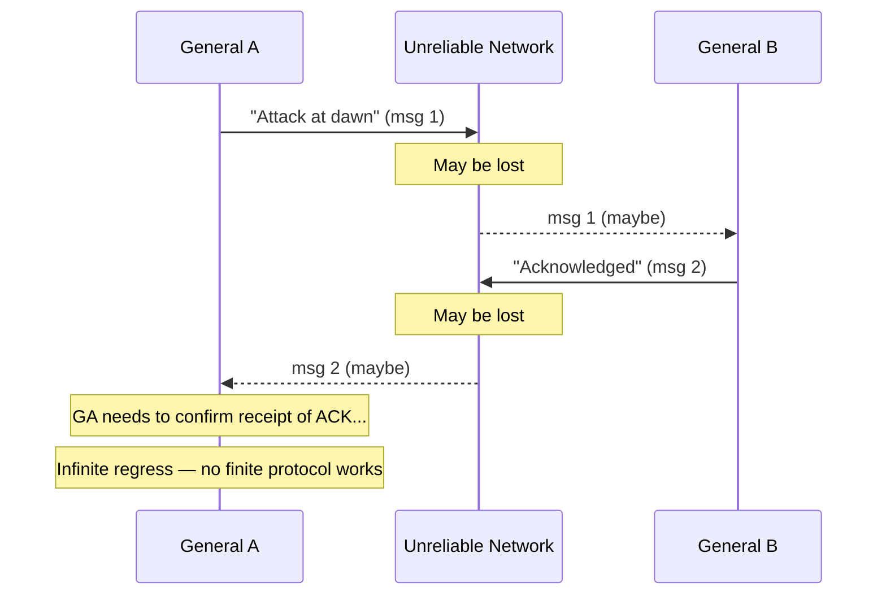

---

## 2. CAP 정리: 희생해야 하는 것

Brewer의 CAP 정리(Gilbert & Lynch에 의해 공식적으로 입증됨): 분산 시스템은 다음 세 가지를 동시에 보장할 수 없습니다.
- **C** — 일관성: 모든 읽기에는 가장 최근 쓰기가 표시됩니다.
- **A** — 가용성: 모든 요청은 응답을 받습니다.
- **P** — 파티션 허용 오차: 네트워크 분할에도 불구하고 시스템이 작동합니다.

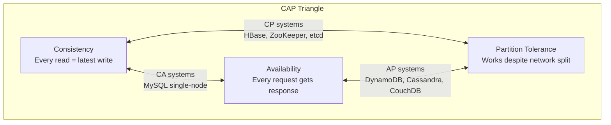

**실제로 P가 협상 불가능한 이유**: 네트워크 파티션이 발생합니다. 당신은 그들을 용인해야합니다. 파티션이 발생할 때 실제 선택은 **CP 대 AP**입니다.

- **CP**: 파티션이 복구될 때까지 쓰기 거부(오류 반환) → 일관성은 있지만 사용할 수 없음
- **AP**: 파티션 양쪽에서 쓰기 허용 → 사용 가능하지만 서로 다른 상태

---

## 3. 합의: Paxos 내부 역학

Paxos는 노드 장애에도 불구하고 합의(단일 값에 대한 합의)를 달성합니다. 세 가지 역할: **제안자**, **수락자**, **학습자**.

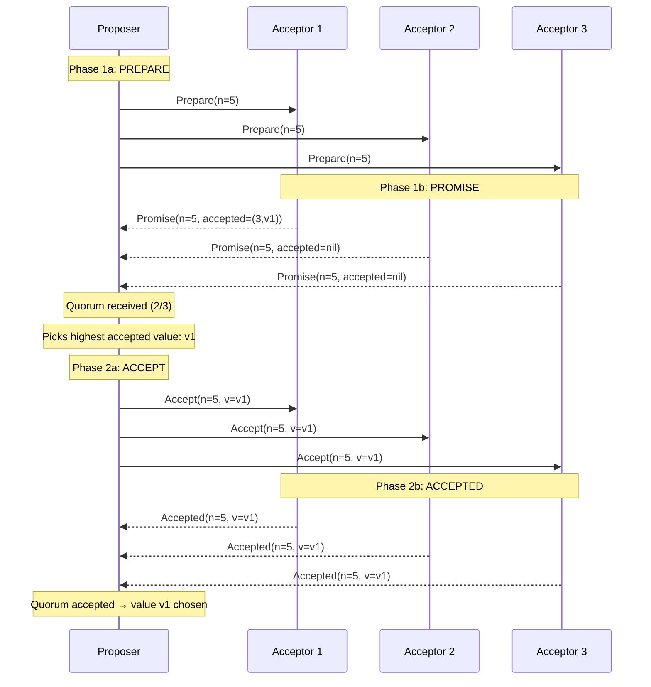

### Paxos 투표용지 번호 불변

각 Acceptor는 `(maxPromised, acceptedBallot, acceptedValue)`을 저장합니다. 불변성:
- 수락자는 **결코** 투표용지에 대해 약속하지 않음 ≤ 해당 maxPromised
- 수락자는 **절대** 투표용지를 수락하지 않습니다. ≤ maxPromised
- 이전 라운드에서 어떤 값이 승인된 경우 제안자는 **반드시** 해당 값을 제안해야 합니다.

이를 통해 쿼럼에서 값이 선택되면 향후 Paxos 라운드에서 다른 값을 선택할 수 없습니다.

---

## 4. 뗏목: 이해할 수 있는 합의

Raft는 합의를 리더 선택, 로그 복제, 안전이라는 세 가지 하위 문제로 분해합니다.

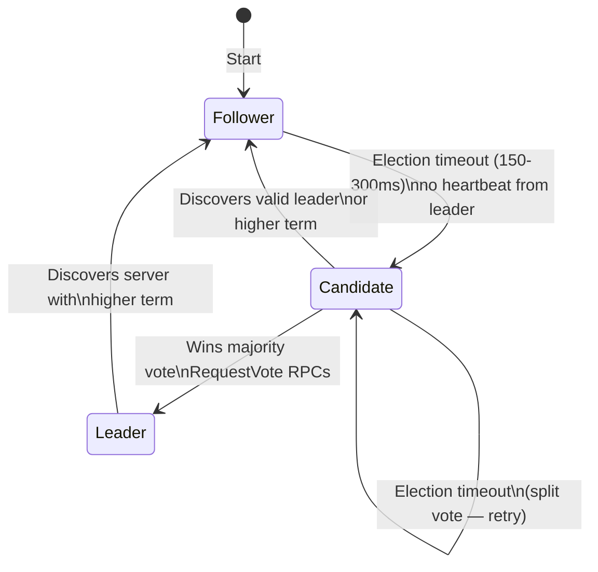

### Raft 로그 복제 내부 흐름

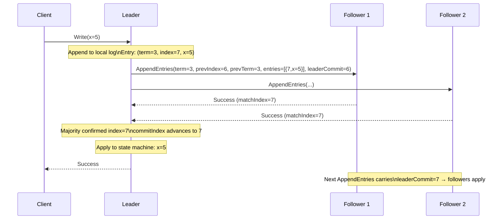

### 뗏목 안전: 로그 일치 속성

Raft를 안전하게 만드는 두 가지 불변성:
1. **선거 안전**: 임기당 최대 1명의 지도자
2. **로그 일치**: 두 개의 로그에 동일한 항목(색인, 용어)이 포함된 경우 이전 항목은 모두 동일합니다.

AppendEntries의 **prevIndex/prevTerm** 검사는 로그 일치를 시행합니다. 팔로어는 prevIndex에 prevTerm과 일치하는 항목이 없는 경우 거부합니다.

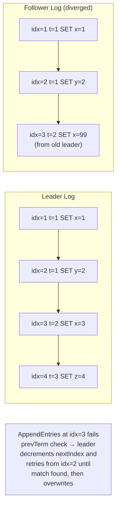

---

## 5. 분산 트랜잭션: 2단계 커밋(2PC)

2PC는 여러 노드(샤드/데이터베이스)에 걸쳐 원자적 커밋을 조정합니다.

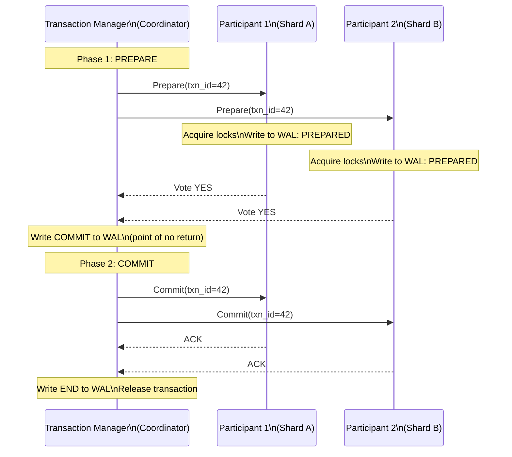

### 2PC 장애 시나리오 및 WAL 복구

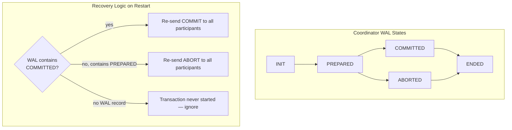

**2PC의 아킬레스 건 — 차단**: COMMIT를 작성한 후 참가자에게 보내기 전에 코디네이터가 충돌하는 경우 참가자는 **무기한 차단**됩니다. 즉, 잠금을 유지하지만 코디네이터의 결정 없이는 커밋하거나 중단할 수 없습니다. **3PC**(3단계 커밋)는 차단을 줄이기 위해 사전 커밋 단계를 추가하지만 네트워크 파티션에서 이를 제거하지는 않습니다.

---

## 6. MVCC: 다중 버전 동시성 제어 내부

MVCC(PostgreSQL, MySQL InnoDB, CockroachDB에서 사용)는 각 행의 여러 버전을 유지 관리하여 판독기와 기록기가 서로를 차단하지 않도록 합니다.

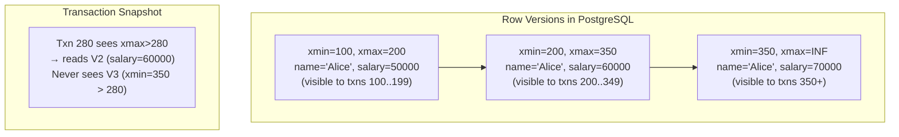

### MVCC 읽기 경로

각 트랜잭션은 시작 시 **스냅샷**을 받습니다: `(xmin, xmax, active_xids[])`. 다음과 같은 경우 행 버전이 표시됩니다.
- `row.xmin <= snapshot.xmax`(스냅샷 이전에 생성됨)
- `row.xmin`이(가) `active_xids[]`에 없음(작성자가 커밋됨)
- `row.xmax > snapshot.xmin` 또는 `row.xmax`은(는) `active_xids[]`에 있습니다(아직 삭제되지 않음).

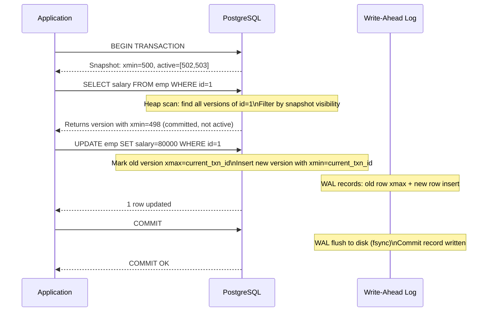

---

## 7. 벡터 클럭 및 인과관계 추적

벡터 클록은 동기화된 클록 없이도 분산 시스템에서 **이전에 발생한 일** 관계를 추적합니다.

```mermaid
flowchart LR
    subgraph "Node A"
        A1["A:[1,0,0]\nWrite x=1"]
        A2["A:[2,0,0]\nSend msg to B"]
        A3["A:[3,2,0]\nReceive from B\nmerge: max([2],[1,2,0])=[3,2,0]"]
    end
    subgraph "Node B"
        B1["B:[1,1,0]\nReceive from A\nA's clock:[2,0,0] → merge=[2,1,0]"]
        B2["B:[2,2,0]\nWrite y=5"]
        B3["B:[3,3,0]\nSend msg to A"]
    end
    A2 -->|send [2,0,0]| B1
    B3 -->|send [3,3,0]| A3
```

**충돌 감지**: 벡터 클록이 다른 벡터 클록을 지배하지 않는 경우 두 이벤트가 동시에 발생합니다(다른 이벤트보다 먼저 발생하지 않음).
- `A=[2,1,0]` 대 `B=[1,2,0]` → 동시 → 충돌 → 병합 필요

**DynamoDB**는 벡터 시계("버전 벡터"라고 함)를 사용하여 쓰기 충돌을 감지하고 해결을 위해 충돌하는 여러 버전을 애플리케이션에 반환합니다.

---

## 8. 일관된 해싱 및 분산 해시 테이블

일관된 해싱은 노드 가입/탈퇴 시 키 재매핑을 최소화합니다. 링은 동일한 해시 함수를 사용하여 키와 노드를 모두 `[0, 2^32)`에 매핑합니다.

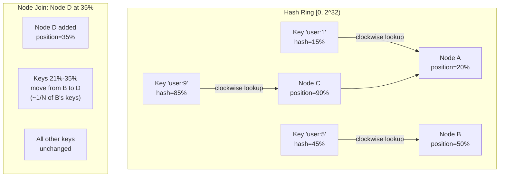

### 로드 밸런싱을 위한 가상 노드

단일 노드는 링에서 여러 위치를 얻습니다(가상 노드/vnode):

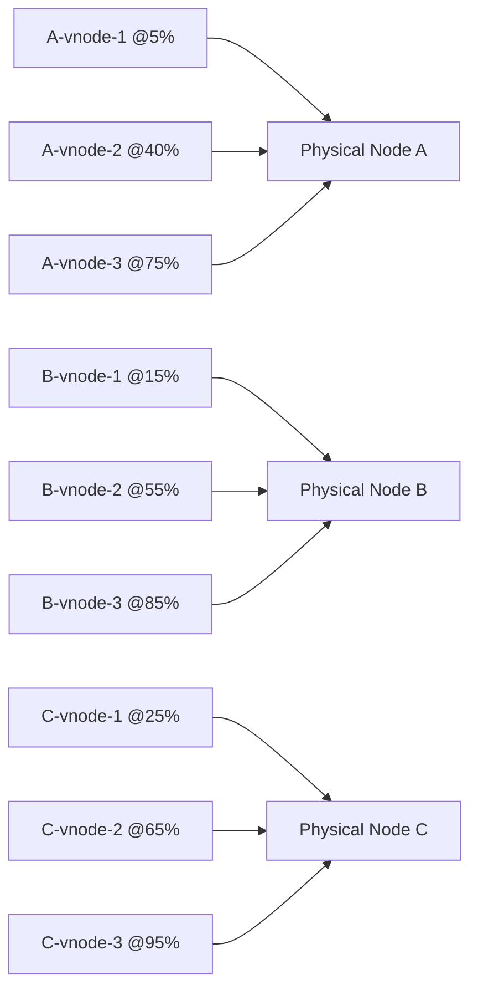

물리적 노드당 vnode가 150개인 경우 로드 불균형은 통계적으로 10% 미만입니다.

---

## 9. 최종 일관성 및 CRDT

**CRDT(충돌 없는 복제 데이터 유형)**은 복제본이 조정 없이 분기 및 병합되도록 허용하여 수학적 구성을 통한 최종 수렴을 보장합니다.

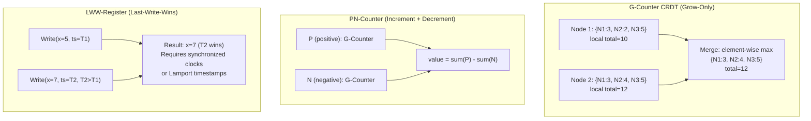

### OR-Set(관찰-제거 세트) 내부

단순한 추가/제거 세트에는 "승리 제거"와 "승 추가"가 모호합니다. OR-Set 태그는 각각 고유한 ID로 추가됩니다.

```
add("a") → {("a", uid1)}
add("a") → {("a", uid1), ("a", uid2)}
remove("a") → removes all observed uid pairs for "a"
concurrent add("a") after remove → uid3 survives (not in remove set)
```

---

## 10. 분산 추적: 범위 전파 내부

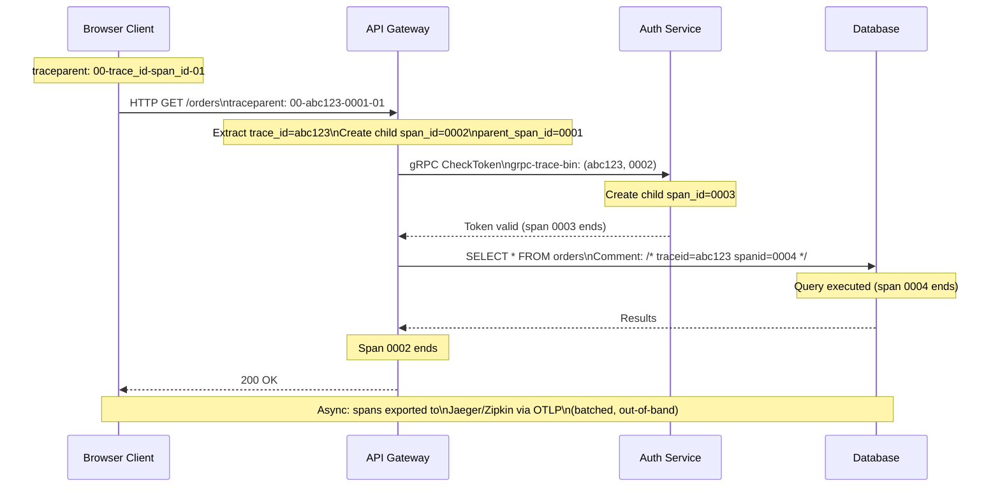

**샘플링 결정 전파**: `traceparent` 플래그 바이트는 샘플링 결정을 인코딩합니다. 루트 범위가 샘플링(확률적, 1%)을 결정하면 모든 다운스트림 서비스는 해당 결정을 **상속**합니다. 이렇게 하면 부분 추적이 아닌 완전한 추적이 보장됩니다.

---

## 11. 가십 프로토콜: 전염병 정보 유포

Gossip(Cassandra, Consul, Redis Cluster에서 사용)은 O(log N) 라운드로 정보를 퍼뜨립니다.

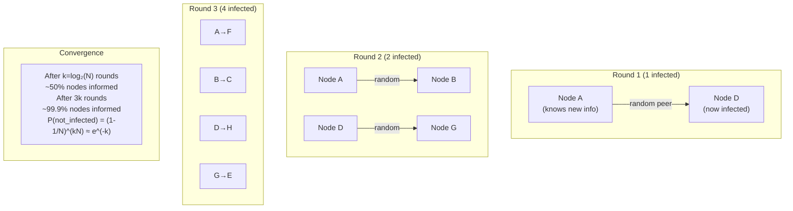

### Phi 발생 실패 감지기(Cassandra)

바이너리 활성/비활성 대신 phi 오류 감지기는 하트비트의 도착 간 시간을 기반으로 **의심 수준 ψ**을 출력합니다.

```
φ(t) = -log₁₀(P_later(t - t_last))
```

여기서 `P_later`은(는) 과거 도착 간 시간의 가우스 모델을 고려하여 `t` 시간 이후에 다음 하트비트가 도착할 확률입니다. Φ=1 → 90% 실패 신뢰도. Φ=8 → 99.999999%.

---

## 12. 선형성 vs 직렬성

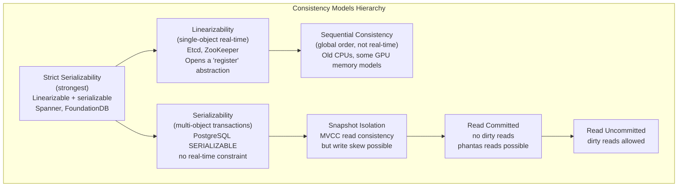

**쓰기 왜곡 예(SI 허용, 직렬화 방지)**:
- Txn A는 "2명의 의사가 통화 중"이라고 읽습니다. → 한 명은 통화를 중단할 수 있다고 결정합니다.
- Txn B는 "2명의 의사가 통화 중"이라고 읽습니다. → 한 명은 통화를 중단할 수 있다고 결정합니다.  
- 둘 다 커밋 → 통화 중인 의사 0명(불변 위반)
- SI에서: 두 가지 모두 통과(각각 상대방이 쓰기 전에 일관된 스냅샷을 읽음)
- 직렬화 가능: 하나가 중단됨(직렬화 충돌이 감지됨)

---

## 13. Google Spanner: TrueTime 및 외부 일관성

Spanner는 제한된 시간 불확실성을 제공하는 GPS + 원자 시계 하드웨어를 사용하여 **외부 일관성**(전 세계적으로 엄격한 직렬화 가능성)을 달성합니다.

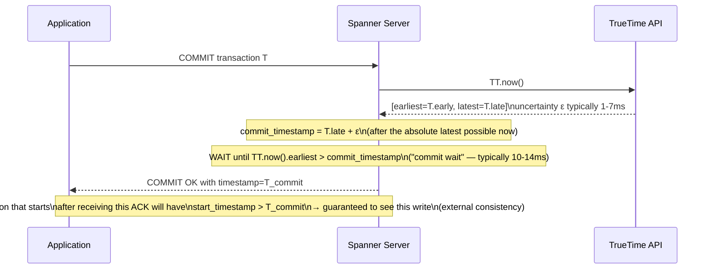

**커밋 대기**는 외부 일관성의 대가입니다. Spanner는 현재 커밋 이전의 타임스탬프로 향후 트랜잭션이 시작되지 않도록 TrueTime 불확실성 간격으로 COMMIT 확인을 의도적으로 지연합니다.

---

## 14. 파티션 복구: 머클 트리를 이용한 안티엔트로피

네트워크 파티션이 복구된 후 복제본은 분산된 데이터를 조정해야 합니다. 머클 트리는 이를 효율적으로 만듭니다.

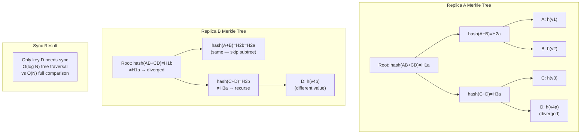

Cassandra는 **수리** 작업에 Merkle 트리를 사용합니다. 각 노드는 토큰 범위의 머클 트리를 구축합니다. 트리 비교는 조정이 필요한 분기된 리프 노드(개별 키 또는 키 범위)를 식별합니다.

---

## 15. 분산 잠금 서비스: Chubby/etcd 내부

```mermaid
sequenceDiagram
    participant C1 as Client 1
    participant C2 as Client 2
    participant E as etcd Cluster
    participant L as Lease Manager

    Note over C1: Acquire distributed lock
    C1->>E: PUT /locks/resource-x\nvalue=client1-id\nLease TTL=10s (CreateLease first)
    Note over E: Raft consensus: replicate to majority
    E-->>C1: OK, lease_id=42, revision=100

    C2->>E: PUT /locks/resource-x (try)
    Note over E: Key already exists
    E-->>C2: Key exists — watch for DELETE

    Note over C1: C1 must keepalive lease
    loop every 5s
        C1->>E: LeaseKeepAlive(lease_id=42)
        E-->>C1: TTL renewed
    end

    Note over C1: C1 crashes (no more keepalive)
    Note over E: Lease 42 expires after 10s\nKey /locks/resource-x deleted
    E-->>C2: Watch event: DELETE revision=101
    C2->>E: PUT /locks/resource-x\nvalue=client2-id, new lease
    E-->>C2: OK — lock acquired
```

**펜싱 토큰**: 개정 번호(100, 101...)는 **펜싱 토큰**이며 단조롭게 증가합니다. C1은 모든 다운스트림 작업에서 개정 100을 사용합니다. 잠금이 만료되고 C2가 수정 버전 101을 받으면 수정 버전 101을 본 후 수정 버전 100이 포함된 C1 요청을 본 모든 다운스트림 서비스는 **거부**합니다(오래된 요청 감지).

---

## 요약: 주요 분산 시스템 속성

| 부동산 | 메커니즘 | 비용 |
|---|---|---|
| 합의 | Paxos/Raft(쿼럼 쓰기) | 읽기용 RTT 1개, 쓰기용 RTT 2개 |
| 외부 일관성 | TrueTime 커밋 대기 | 10~14ms 지연 시간 바닥 |
| 최종 일관성 | CRDT 병합/가십 | 조정 없음, 충돌 가능 |
| 분산형 트랜잭션 | 2PC 코디네이터 | 코디네이터 실패 시 차단 |
| 인과관계 추적 | 벡터 시계 | O(N) 시계 크기 |
| 결함 감지 | 피 발생/심장박동 | 느린 네트워크의 거짓 긍정 위험 |
| 파티션 수리 | 머클 트리 반엔트로피 | 트리 계산을 위한 백그라운드 CPU/IO |
| 분산 잠금 | etcd 임대 + 펜싱 | 충돌 시 임대 만료 대기 시간 |


---

## 설계적 고민

### 구조와 모델링

#### 분산 시스템의 근본 모델: CAP 정리의 실무적 해석

CAP 정리는 "Consistency, Availability, Partition Tolerance 중 두 가지만 선택할 수 있다"고 흔히 요약되지만, 실무에서의 해석은 더 정교하다. 네트워크 파티션은 **선택이 아니라 현실**이다. 따라서 진짜 선택은 **파티션 발생 시 Consistency를 우선할지(CP), Availability를 우선할지(AP)**이다.

파티션이 없는 정상 상태에서는 대부분의 시스템이 CA를 모두 제공한다. CAP의 진정한 의미는 **장애 발생 시 어떤 특성을 희생할 것인가**에 대한 설계 결정이다.

```mermaid
graph TD
    CAP["분산 시스템 설계 결정"]
    CAP --> CP["쁨력한 일관성 (CP)"]
    CAP --> AP["고가용성 (AP)"]

    CP --> ZK["ZooKeeper<br/>합의 기반 읽기/쓰기<br/>파티션 시 소수 노드 거부"]
    CP --> ETCD["etcd<br/>Raft 합의<br/>리더 없으면 쓰기 불가"]
    CP --> SPANNER["Google Spanner<br/>TrueTime + 2PC<br/>외부 일관성"]

    AP --> CASS["Cassandra<br/>튲너블 일관성<br/>R+W>N 시 강력한 일관성"]
    AP --> DYNAMO["DynamoDB<br/>최종 일관성 기본<br/>강력한 일관성 옵션"]
    AP --> RIAK["Riak<br/>CRDT 기반 병합<br/>충돌 자동 해소"]

    style CP fill:#264653,color:#fff
    style AP fill:#e76f51,color:#fff
    style ZK fill:#2a9d8f,color:#fff
    style ETCD fill:#2a9d8f,color:#fff
    style SPANNER fill:#2a9d8f,color:#fff
    style CASS fill:#f4a261,color:#000
    style DYNAMO fill:#f4a261,color:#000
    style RIAK fill:#f4a261,color:#000
```

#### 일관성 스펙트럼: 선형적 일관성부터 최종 일관성까지

일관성은 이진적(binary)이 아니라 **스펙트럼**이다. 강한 것부터 약한 것 순으로:

1. **Linearizability(선형적 일관성)**: 모든 연산이 단일 시점에 원자적으로 발생한 것처럼 보임. Google Spanner이 TrueTime으로 달성.
2. **Sequential Consistency**: 모든 프로세스가 동일한 순서를 관찰. ZooKeeper의 쓰기 후 읽기.
3. **Causal Consistency**: 인과 관계가 있는 연산만 순서 보장. MongoDB 3.6+.
4. **Eventual Consistency(최종 일관성)**: 충분한 시간이 지나면 모든 노드가 동일한 값을 반환. DynamoDB 기본 모드.

선택 기준:
- **금융 거래, 재고 관리**: Linearizability 필수 (돈이나 수량은 정확해야 함)
- **소셜 미디어 피드**: Eventual Consistency 충분 (좋아요 수가 잠시 다를 수 있음)
- **협업 도구**: Causal Consistency 적합 (내가 쓴 문서의 변경은 좌시 보여야 함)

### 트레이드오프와 의사결정

#### Paxos vs Raft: 완전성 vs 이해 가능성

**Paxos**는 Lamport가 증명한 합의 알고리즘으로, 이론적 완전성이 매우 높다. 그러나 논문 자체가 난해하고, 실제 구현은 Multi-Paxos 확장이 필요하며, 각 구현체마다 세부 사항이 다르다.

**Raft**는 "이해 가능한 합의"를 목표로 설계되었다. 리더 선출과 로그 복제를 명확히 분리하여, 구현자가 한 번에 하나의 문제만 집중할 수 있다. etcd, CockroachDB, TiKV 등 현대 시스템들이 Raft를 선택하는 이유다.

```mermaid
sequenceDiagram
    participant F as 팔로워 A
    participant L as 리더
    participant F2 as 팔로워 B
    participant F3 as 팔로워 C

    Note over L: Term 1 리더로 선출됨
    L->>F: AppendEntries(log[1]: SET x=1)
    L->>F2: AppendEntries(log[1]: SET x=1)
    L->>F3: AppendEntries(log[1]: SET x=1)
    F-->>L: ACK
    F2-->>L: ACK
    Note over L: 과반수(2/3) ACK 수신 → 커밋
    L->>F: Commit log[1]
    L->>F2: Commit log[1]
    L->>F3: Commit log[1] (지연 도달)

    Note over L: 리더 장애 발생!
    Note over F,F3: 선거 타임아웃 후 새 선거
    F2->>F: RequestVote(Term 2)
    F2->>F3: RequestVote(Term 2)
    F-->>F2: 투표
    F3-->>F2: 투표
    Note over F2: Term 2 새 리더로 선출
```

설계적 교훈: **완벽한 이론보다 이해하고 구현할 수 있는 시스템이 실무에서 더 많은 가치를 만든다.** Paxos의 좋은 구현체는 소수이지만, Raft의 좋은 구현체는 수십 개다.

#### 2PC vs Saga: 동기 트랜잭션 vs 비동기 보상 트랜잭션

**2PC(Two-Phase Commit)**는 코디네이터가 모든 참여자에게 prepare → commit/abort를 지시한다. 강력한 일관성을 보장하지만, 코디네이터 장애 시 모든 참여자가 **차단(blocking)** 된다는 치명적 약점이 있다.

**Saga**는 각 서비스가 로컬 트랜잭션을 실행하고, 실패 시 **보상 트랜잭션(compensating transaction)**을 실행하여 되돌린다. 차단이 없지만, 중간 상태가 외부에 노출되는 **격리 부족** 문제가 있다.

```mermaid
flowchart TD
    subgraph "2PC: 동기 트랜잭션"
        COORD["코디네이터"] -->|"1. PREPARE"| P1["주문 서비스<br/>OK"]
        COORD -->|"1. PREPARE"| P2["결제 서비스<br/>OK"]
        COORD -->|"1. PREPARE"| P3["재고 서비스<br/>OK"]
        P1 -->|"2. COMMIT"| DONE1["✓ 커밋"]
        P2 -->|"2. COMMIT"| DONE2["✓ 커밋"]
        P3 -->|"2. COMMIT"| DONE3["✓ 커밋"]
    end

    subgraph "Saga: 비동기 보상"
        S1["주문 생성"] -->|"OK"| S2["결제 처리"]
        S2 -->|"OK"| S3["재고 차감"]
        S3 -->|"FAIL"| C3["보상: 재고 복원"]
        C3 --> C2["보상: 결제 취소"]
        C2 --> C1["보상: 주문 취소"]
    end

    style COORD fill:#264653,color:#fff
    style S1 fill:#2a9d8f,color:#fff
    style S2 fill:#2a9d8f,color:#fff
    style S3 fill:#e76f51,color:#fff
    style C1 fill:#9b2226,color:#fff
    style C2 fill:#9b2226,color:#fff
    style C3 fill:#9b2226,color:#fff
```

선택 기준:
- **강력한 일관성 필수**: 2PC (금융 이체, 주문-결제 원자성)
- **고가용성 우선**: Saga (마이크로서비스, 장시간 실행 트랜잭션)
- **하이브리드**: 최소 단위는 2PC로 보장하고, 전체 플로우는 Saga로 오케스트레이션

### 리팩토링과 설계 원칙

#### 이벤트 소싱 + CQRS의 설계적 의미

이벤트 소싱(Event Sourcing)은 상태를 직접 저장하지 않고, **상태를 변경하는 이벤트의 시퀀스**를 저장한다. CQRS(Command Query Responsibility Segregation)는 쓰기(커맨드)와 읽기(쿼리)의 모델을 분리한다.

이 조합의 설계적 의미:
- **감사 추적(Audit Trail)**: 모든 변경 이력이 이벤트로 영구 보존
- **상태 재생성**: 임의 시점의 상태를 이벤트 리플레이로 재구성 가능
- **시간 여행(Time Travel)**: 디버깅, 비즈니스 분석에 유용
- **읽기 모델 최적화**: 쿼리용 데이터 모델을 용도에 맞게 자유롭게 설계

대가는 **복잡성**이다. 이벤트 스토어, 스냅샷, 프로젝션 관리, 업사이팅(upcasting) 등 추가적인 인프라가 필요하며, 이벤트 스키마 변경 시 모든 이벤트의 마이그레이션이 필요할 수 있다.

```mermaid
flowchart LR
    subgraph "커맨드 쪽 (쓰기)"
        CMD["주문 커맨드"] --> AGG["주문 Aggregate<br/>비즈니스 규칙 검증"]
        AGG --> ES["이벤트 스토어<br/>OrderCreated<br/>ItemAdded<br/>PaymentReceived"]
    end

    subgraph "쿼리 쪽 (읽기)"
        ES -->|"이벤트 발행"| PROJ["프로젝션<br/>이벤트 → 읽기 모델"]
        PROJ --> VIEW1["주문 목록 뷰<br/>비정규화된 읽기 최적화"]
        PROJ --> VIEW2["대시보드 뷰<br/>집계/통계 데이터"]
        PROJ --> VIEW3["검색 인덱스<br/>Elasticsearch"]
    end

    style CMD fill:#264653,color:#fff
    style AGG fill:#2a9d8f,color:#fff
    style ES fill:#e9c46a,color:#000
    style VIEW1 fill:#e76f51,color:#fff
    style VIEW2 fill:#e76f51,color:#fff
    style VIEW3 fill:#e76f51,color:#fff
```

#### 분산 시스템 리팩토링: 단일 노드 → 분산 전환 시점

단일 노드에서 분산 시스템으로 전환하는 결정은 신중해야 한다. 분산 시스템은 **근본적으로 더 복잡하며**, 네트워크 파티션, 부분 장애, 클럭 드리프트 등 단일 노드에서는 존재하지 않는 문제를 도입한다.

전환 신호:
- 단일 노드의 수직 스케일링(CPU/RAM)이 한계에 도달
- 가용성 요구사항이 단일 노드로는 충족 불가능 (99.99%+)
- 지리적으로 분산된 사용자 기반으로 지연 시간 요구사항 존재

원칙: **"분산 시스템은 마지막 수단이다"** - 단일 노드로 문제를 해결할 수 있다면 그렇게 해라.

### 디자인 패턴 적용

#### Observer 패턴과 이벤트 기반 아키텍처

분산 시스템의 이벤트 기반 아키텍처는 **Observer 패턴**의 확장이다. 이벤트 발행자(producer)와 구독자(consumer)가 분리되어, 느슨한 결합(loose coupling)을 달성한다.

Kafka를 중심으로 한 이벤트 기반 아키텍처에서의 패턴 적용:

```mermaid
flowchart TD
    subgraph "이벤트 기반 아키텍처 (Observer 패턴 확장)"
        P1["주문 서비스<br/>(발행자)"] -->|"OrderCreated"| KAFKA["Kafka 토픽<br/>orders.events"]
        P2["결제 서비스<br/>(발행자)"] -->|"PaymentCompleted"| KAFKA

        KAFKA -->|"구독"| C1["재고 서비스<br/>(구독자)"]
        KAFKA -->|"구독"| C2["알림 서비스<br/>(구독자)"]
        KAFKA -->|"구독"| C3["분석 서비스<br/>(구독자)"]

        C1 -.->|"무관"| P1
        C2 -.->|"무관"| P1
    end

    style KAFKA fill:#264653,color:#fff
    style P1 fill:#2a9d8f,color:#fff
    style P2 fill:#2a9d8f,color:#fff
    style C1 fill:#e76f51,color:#fff
    style C2 fill:#e76f51,color:#fff
    style C3 fill:#e76f51,color:#fff
```

이 패턴의 핵심 설계 결정:
- **이벤트 순서 보장 범위**: Kafka는 파티션 내에서만 순서 보장. 전역 순서가 필요하면 단일 파티션 사용(성능 희생)
- **At-least-once vs Exactly-once**: 카프카 트랜잭션 + 멱등성 소비자로 실용적 exactly-once 달성
- **이벤트 스키마 버전 관리**: Avro/Protobuf 스키마 레지스트리로 진화 관리

#### Sidecar 패턴과 서비스 메시

서비스 메시(Istio, Linkerd)는 **Sidecar 패턴**을 통해 네트워크 관심사(TLS, 로드 밸런싱, 서킷 브레이커, 추적)를 애플리케이션 코드에서 분리한다.

이는 **분산 시스템의 AOP(Aspect-Oriented Programming)**라 할 수 있다:
- 비즈니스 로직과 인프라 관심사의 분리
- 애플리케이션 언어에 독립적인 네트워크 정책 적용
- 중앙화된 관찰 가능성(observability) 확보

다만 대가가 있다: 모든 트래픽이 사이드카 프록시를 거치므로 **추가 레이턴시(~1ms)**가 발생하고, 운영 복잡성이 증가한다. **P99 레이턴시가 민감한 시스템**에서는 신중한 평가가 필요하다.
---

## 연습 문제

### 1. 시스템 구조와 모델링

**문제 1-1.** Raft 합의 클러스터에서 리더가 로그 엔트리를 커밋하는 과정에서, 5노드 클러스터 중 노드 3과 4에 네트워크 파티션이 발생했습니다(리더는 노드 1이고, 노드 2와만 통신 가능). 이 상황에서 (a) 현재 리더가 커밋을 진행할 수 있는지, (b) 파티션된 노드 3과 4가 새 리더를 선출할 수 있는지, (c) 파티션이 복구된 뒤 로그 상태 통합 과정을 단계별로 모델링하시오.

<details><summary>힌트 보기</summary>

(a) 리더(노드 1) + 노드 2 = 2노드로 과반수(3) 미달성 → 커밋 불가. (b) 노드 3+4 = 2노드로 역시 과반수 미달성 → 선출 불가. 이것이 CAP에서 일관성(CP)을 선택한 시스템의 가용성 희생입니다. (c) 복구 시 더 높은 텀의 리더 로그가 우선하며, 능덕 팔로워는 리더의 로그를 복제합니다.

</details>

**문제 1-2.** 벡터 클럭을 사용하여 3개 노드(A, B, C)의 인과 관계를 추적하는 시스템에서, 다음 이벤트 시퀀스 후 각 노드의 벡터 클럭 값을 계산하시오:

```
초기: A=[0,0,0], B=[0,0,0], C=[0,0,0]
1. A가 로컬 쓰기 수행
2. A가 B에게 메시지 전송
3. B가 로컬 쓰기 수행
4. B가 C에게 메시지 전송
5. A가 C에게 메시지 전송 (단계 1의 값 포함)
6. C가 로컬 쓰기 수행
```

단계 6 완료 후 C의 벡터 클럭에서 어떤 인과 관계를 파악할 수 있으며, 반대로 파악할 수 **없는** 관계는 무엇인지 설명하시오.

<details><summary>힌트 보기</summary>

단계별: 1) A=[1,0,0]. 2) B는 A의 클럭 [1,0,0]을 수신. 3) B=max([1,0,0],[0,0,0])=[1,0,0] 후 B의 쓰기 → B=[1,1,0]. 4) C는 B의 [1,1,0] 수신. 5) C는 A의 [1,0,0] 수신 → max([1,1,0],[1,0,0])=[1,1,0]. 6) C의 쓰기 → C=[1,1,1]. C는 A의 쓰기→B의 쓰기 인과 관계를 알지만, A의 쓰기와 B의 쓰기 사이의 **직접** 인과 관계 여부는 벡터 클럭만으로는 판단할 수 없습니다.

</details>

**문제 1-3.** 2PC(두 단계 커밋) 프로토콜에서 코디네이터가 모든 참여자로부터 `VOTE_COMMIT`을 받은 뒤 `GLOBAL_COMMIT`을 전송하는 도중에 장애가 발생했습니다. 참여자 중 일부는 COMMIT을 받았고 일부는 받지 못했습니다. (a) 이 교착 상태(in-doubt)에서 참여자들이 독립적으로 커밋/롤백을 결정할 수 없는 이유, (b) 3PC가 이 문제를 완화하는 방법, (c) 실무에서 3PC 대신 2PC + 타임아웃 + WAL 로그를 사용하는 이유를 설명하시오.

<details><summary>힌트 보기</summary>

(a) COMMIT을 받지 못한 참여자는 코디네이터가 ABORT을 보냈는지 COMMIT을 보냈는지 알 수 없음(불확실성). 독단적 롤백은 이미 COMMIT한 노드와 불일치를 유발. (b) 3PC는 pre-commit 단계를 추가하여 모든 참여자가 COMMIT 의도를 알게 한 후 실제 커밋. (c) 3PC는 네트워크 파티션에서 양쪽이 모두 COMMIT하는 치명적 문제가 있고, 추가 라운드로 레이턴시 증가. 실무에서는 WAL로 코디네이터 복구 후 트랜잭션 완료하는 방식이 더 간단하고 신뢰성 있습니다.

</details>

### 2. 트레이드오프와 의사결정

**문제 2-1.** 전자상거래 플랫폼이 사용자 세션 저장소를 설계합니다. CAP 정리에 의해 네트워크 파티션 시 CP(Paxos/Raft 기반)와 AP(Dynamo 스타일 최종 일관성) 중 하나를 선택해야 합니다. 다음 시나리오 각각에 적합한 선택과 그 이유를 설명하시오: (a) 장바구니 데이터로 구매 결정 직전에 '재고 수량'을 표시하는 경우, (b) '최근 본 상품' 추천 목록을 표시하는 경우, (c) 결제 시점에 재고를 차감하는 경우.

<details><summary>힌트 보기</summary>

(a) 재고 표시는 약간의 불일치가 허용됨("대략 남음") → AP 적합. (b) 추천은 실시간성도 낮고 불일치 영향 적음 → AP 적합. (c) 재고 차감은 초과 판매 시 손실 → CP 필수. 실제로 많은 시스템은 **하이브리드**: 읽기 경로는 캐시/AP, 쓰기 경로는 강한 일관성을 적용합니다.

</details>

**문제 2-2.** 일관된 해싱 링에서 노드 추가/제거 시 키 재분배 비율을 K/N(키 수/노드 수)으로 최소화합니다. 그러나 가상 노드(virtual node) 수를 결정할 때 다음 트레이드오프를 분석하시오: 가상 노드가 적으면(10개) 로드 불균형이 심하고, 많으면(1000개) 메모리 사용량과 라우팅 테이블 탐색 시간이 증가합니다. Cassandra와 DynamoDB가 선택한 값과 그 근거를 조사하시오.

<details><summary>힌트 보기</summary>

가상 노드 수가 적으면 해시 공간에서 노드 간 간격이 불균등해져 hot spot 발생. Cassandra는 num_tokens=256(기본)을 사용하다가 3.0에서 토큰 범위 기반으로 변경. DynamoDB는 파티션을 고정 크기로 분할하고 열 기반 분산. 핵심은 **워크로드 접근 패턴**(열 키 분포)을 고려하여 열맰 해싱인지, 일관된 해싱인지, 레인지 파티셔닝인지 선택하는 것입니다.

</details>

**문제 2-3.** 분산 잠금 서비스를 구현할 때, Redis 단일 노드 기반 잠금(SETNX + TTL)과 ZooKeeper 기반 잠금(임시 순서형 znode)을 비교합니다. GC 일시 정지(stop-the-world)가 발생하여 클라이언트가 TTL 동안 잠금을 갱신하지 못하는 시나리오를 두 방식에서 각각 분석하고, Martin Kleppmann이 제안한 **펜싱 토큰** 방식이 이 문제를 어떻게 완화하는지 설명하시오.

<details><summary>힌트 보기</summary>

Redis: GC 일시정지 > TTL 시 잠금 만료 → 다른 클라이언트가 잠금 획득 → 두 클라이언트가 동시에 임계 영역 진입(안전성 위반). ZooKeeper: 세션 에페머럴 노드로 자동 잠금 해제(더 안전). 펜싱 토큰: 잠금 획득 시 단조증가 토큰 발급 → 자원 접근 시 토큰 제시 → 자원 서버가 최신 토큰 확인. 만료된 잠금의 토큰은 거부됩니다.

</details>

### 3. 문제 해결 및 리팩토링

**문제 3-1.** 마이크로서비스 환경에서 서비스 A→B→C→D 호출 체인의 레이턴시가 간헐적으로 P99 2초를 초과합니다. 분산 추적(Jaeger/Zipkin)을 도입하여 분석한 결과, C→D 구간에서 P50은 10ms이지만 P99는 1800ms입니다. 이 **테일 레이턴시** 문제의 원인 가설을 3가지 제시하고, 각 가설에 맞는 분산 추적 데이터 분석 방법과 해결 전략을 제안하시오.

<details><summary>힌트 보기</summary>

가설 1: D 서비스의 GC 일시정지 → 추적 스팬의 타임스탬프와 D 서비스 GC 로그 상관분석. 가설 2: D의 DB 커넥션 풀 고갈 → 느린 요청의 대기 시간 패턴 확인. 가설 3: D의 특정 엔드포인트만 느림 → 트레이스 태그로 엔드포인트별 레이턴시 히스토그램 생성. 해결: 서킷 브레이커, 타임아웃 튜닝, 벌크헤드 제거.

</details>

**문제 3-2.** 협업 편집 애플리케이션에서 CRDT(Conflict-free Replicated Data Type)를 사용하여 동시 편집을 처리하고 있습니다. 두 사용자가 동시에 같은 문서의 서로 다른 위치에 텍스트를 삽입할 때, G-Counter(성장만 가능한 카운터)로는 이 문제를 해결할 수 없는 이유와, 대신 RGA(Replicated Growable Array) 또는 YATA CRDT가 텍스트 연산을 어떻게 모델링하는지 설명하시오. 또한 삭제 연산에서 발생하는 **텀스톤(tombstone)** 누적 문제와 해결 전략을 제시하시오.

<details><summary>힌트 보기</summary>

G-Counter는 증가만 가능하고 위치 개념이 없어 텍스트 연산 부적합. RGA/YATA는 각 문자에 고유 ID(노드 ID + 시퀀스)를 부여하고, 삽입 위치를 좌측 문자 ID로 지정. 동시 삽입 시 전체 순서로 결정적 병합. Tombstone 누적은 GC 주기를 두어 모든 레플리카가 삭제를 본 후 제거하는 조정된 가비지 커렉션으로 해결합니다.

</details>

**문제 3-3.** 머클 트리를 사용한 안티엔트로피 복구에서, 1억 개 키-값 쌍을 저장하는 두 레플리카 간의 데이터 동기화를 수행합니다. 전체 데이터 전송 대신 머클 트리 비교로 차이점만 전송하는 과정을 단계별로 설명하시오. 트리 깊이가 d일 때 최악의 경우(단일 키 다름) 네트워크 전송량을 O 표기법으로 유도하고, Cassandra 실제 구현에서의 최적화 전략을 설명하시오.

<details><summary>힌트 보기</summary>

루트부터 해시 비교 → 다르면 자식 노드로 재귀적 탐색 → 리프 노드에서 실제 다른 키만 전송. 최악: O(d + 다른 키 수). 단일 키만 다르면 루트부터 리프까지 d개 노드 해시 비교 + 1개 키-값 전송 = O(d). Cassandra는 머클 트리를 SSTable 단위로 구성하고, 안티엔트로피 주기를 동적으로 조절하며, 스트리밍 복구로 메모리 사용량을 제한합니다.

</details>

### 4. 개념 간의 연결성

**문제 4-1.** Google Spanner는 TrueTime API(원자 시계 + GPS 기반, 불확실성 구간 [어림시각, 늦음시각])를 사용하여 외부 일관성(external consistency)을 달성합니다. 이것이 기존 Paxos 합의만으로는 달성할 수 없는 이유, 벡터 클럭과의 차이점, 그리고 'commit-wait' 전략이 성능에 미치는 영향(TrueTime 불확실성 구간 7ms를 기다려야 함)을 분석하시오. AWS, Azure가 이 접근법을 채택하지 않는 이유는 무엇일까요?

<details><summary>힌트 보기</summary>

Paxos는 **단일 값** 합의(순서 부여는 Multi-Paxos로 확장)이지만, 서로 다른 Paxos 그룹 간 트랜잭션 순서를 맞추지 못합니다. 벡터 클럭은 논리적 인과만 추적하고 실제 시간을 반영하지 않습니다. TrueTime은 **물리적 시간 구간**을 제공하여 트랜잭션 T1의 commit-wait가 T2 시작 전에 완료됨을 보장합니다. AWS/Azure는 전용 원자 시계/GPS 인프라가 없어 하이브리드 논리적 클럭(HLC)을 대안으로 사용합니다.

</details>

**문제 4-2.** 선형성(linearizability)과 직렬성(serializability)은 종종 혼동됩니다. 다음 시나리오에서 각 속성이 충족되는지 판단하시오:

```
초기상태: x=0, y=0
T1: write(x,1) → write(y,1)
T2: read(y)=1  → read(x)=0
```

이 실행 이력이 (a) 선형적인지, (b) 직렬적인지, (c) 둘 다 만족하는 **strict serializable**인지 판단하고, CockroachDB와 같은 NewSQL이 strict serializability를 달성하기 위해 사용하는 기법을 설명하시오.

<details><summary>힌트 보기</summary>

T2가 y=1을 읽었으므로 T1의 write(y)가 완료된 후입니다. 그런데 T2가 x=0을 읽었으므로 T1의 write(x)=1을 보지 못했습니다. (a) 선형적이지 않음: 실시간 순서상 T1의 x 쓰기가 y 쓰기보다 먼저인데, y=1을 보고 x=0을 본다는 것은 모순. (b) 직렬적: T2→T1 순서로 직렬화 가능(하지만 T1의 y 쓰기를 보는 문제). 실제로 이것은 **snapshot isolation anomaly**입니다. CockroachDB는 타임스탬프 기반 MVCC + 클럭 동기화로 strict serializability를 달성합니다.

</details>

**문제 4-3.** 가십 프로토콜, CRDT, 벌터 클럭은 모두 **분산 상태 수렴**을 다루지만 서로 다른 보장을 제공합니다. 100노드 클러스터에서 노드 방금 리스트(IP 차단 목록)를 모든 노드에 전파해야 할 때, 세 방식 각각의 장단점을 분석하시오. 특히 (a) 수렴 속도, (b) 일시적 불일치 동안의 보안 위험, (c) 네트워크 대역폭 사용량을 비교하시오.

<details><summary>힌트 보기</summary>

가십: 팬아웃(O(N²) 메시지)이지만 확률적 수렴(O(logN) 라운드). 실시간 차단이 아니라면 수 초 지연 허용 가능. CRDT(OR-Set): 노드 추가만 있으면 G-Set으로 충분. 충돌 없이 병합되지만 전체 상태 전송 시 대역폭 큼. 벡터 클럭: 인과적 순서 보장하지만 N개 노드로 클럭 크기 O(N). 보안에는 리더 기반 브로드캐스트(즉시 적용)가 더 적합할 수 있습니다.

</details>