# Docker 및 Kubernetes 내부: 내부

> 소스 합성: Docker 엔진 아키텍처, 컨테이너 런타임 내부, Kubernetes 제어 플레인 역학 및 네트워크/스토리지 하위 시스템을 다루는 컨테이너 오케스트레이션 참고서(comp 244, 380, 398–417).

---

## 1. 컨테이너 런타임 아키텍처

### `docker run`에서 프로세스까지

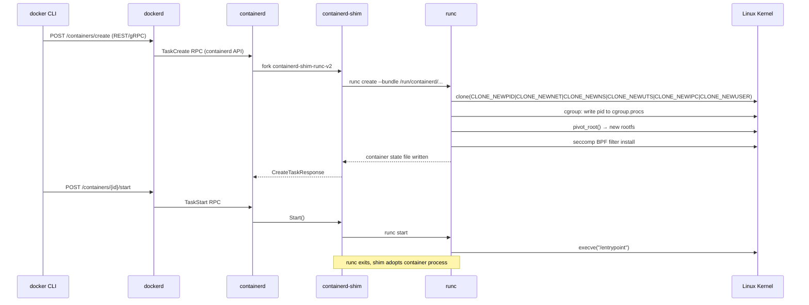

### OCI 번들 레이아웃

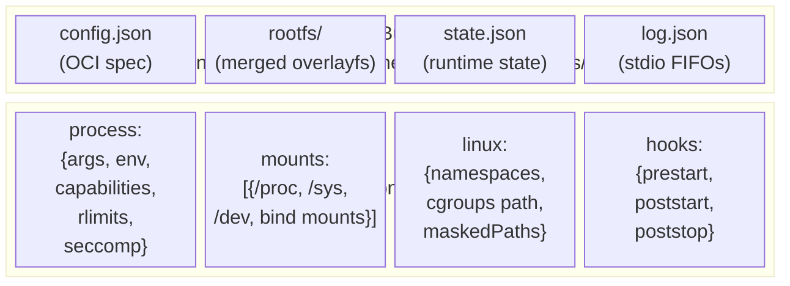

---

## 2. 네임스페이스 및 Cgroup 내부

### Linux 네임스페이스 — 각각의 격리 대상

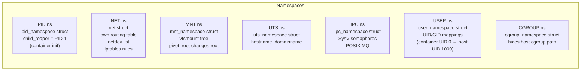

### cgroup v2 리소스 제어

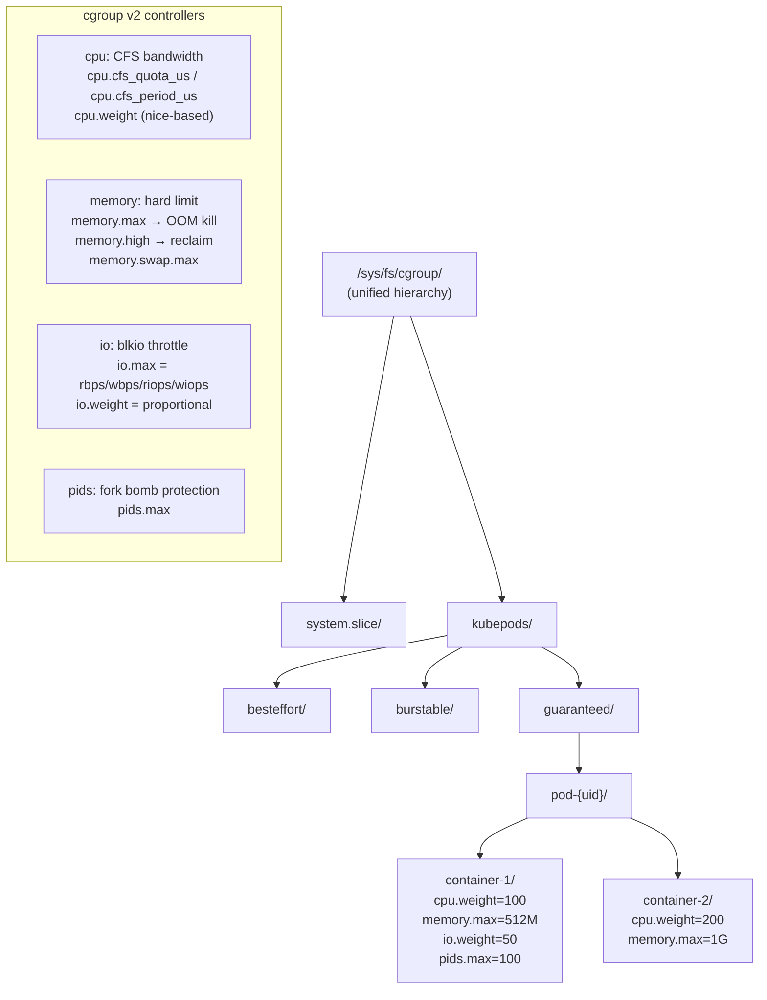

---

## 3. OverlayFS - 컨테이너 이미지 레이어

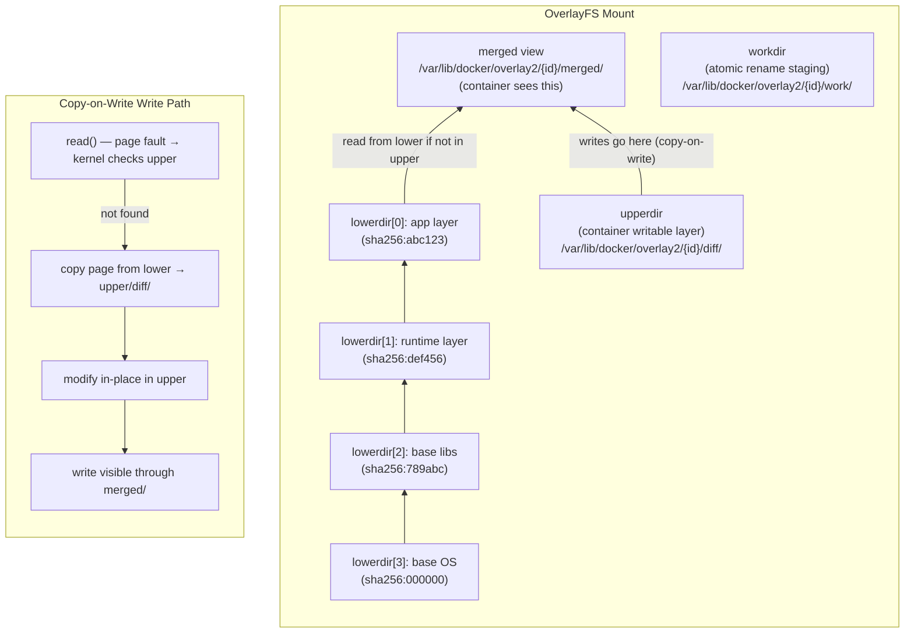

### 이미지 레이어 저장소

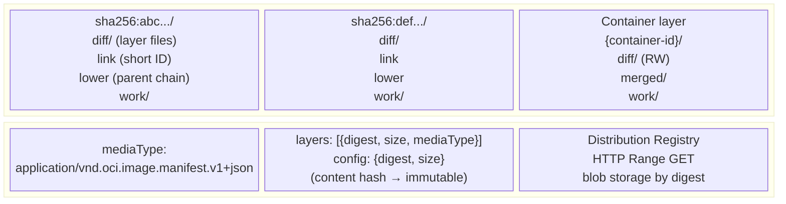

---

## 4. 컨테이너 네트워킹 - CNI 내부

### veth 쌍 + 브리지(Docker 브리지/플란넬 VXLAN)

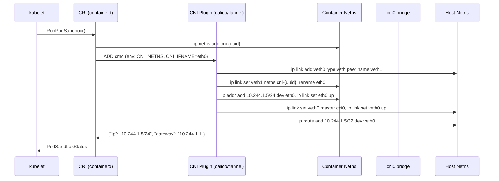

### 노드 간 패킷 흐름(VXLAN 오버레이)

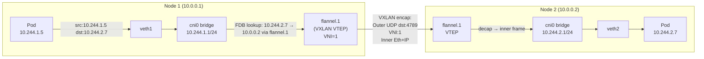

---

## 5. 쿠버네티스 아키텍처 - 컨트롤 플레인 내부

### 구성요소 상호작용 맵

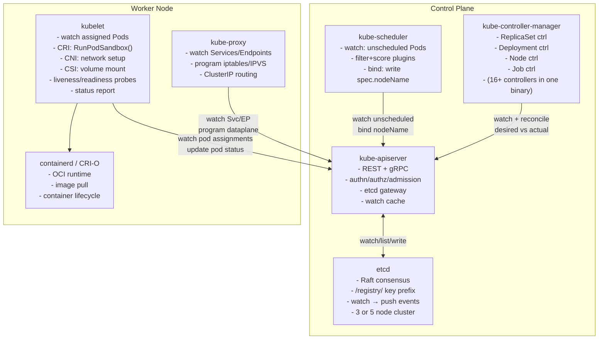

### etcd Raft 쓰기 경로

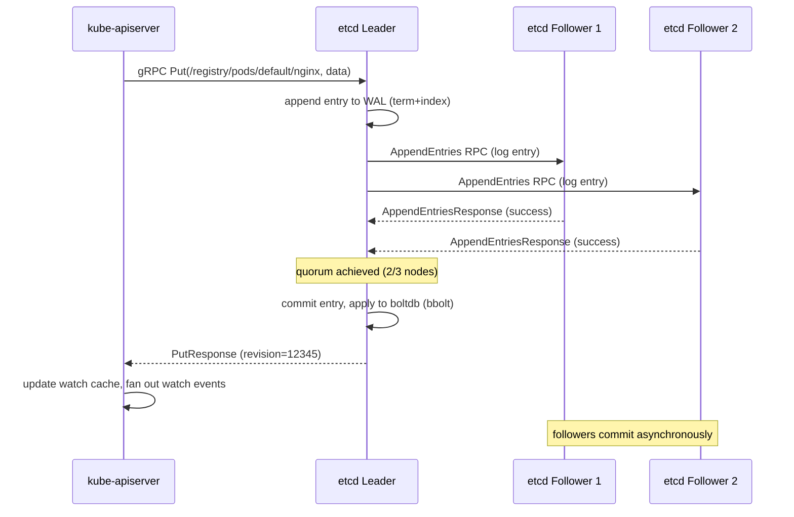

---

## 6. 포드 수명 주기 - 상태 머신

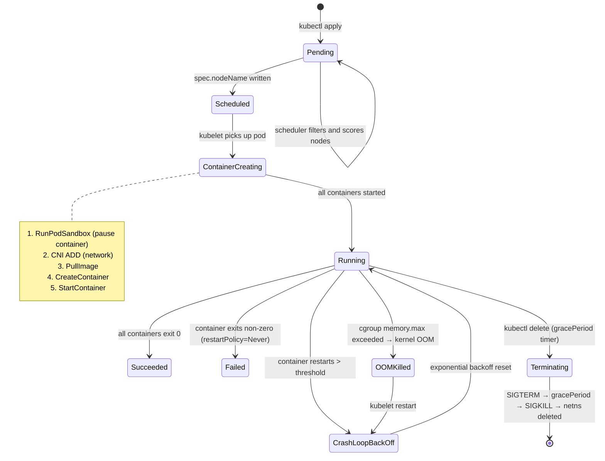

---

## 7. kube-scheduler — 필터 + 점수 파이프라인

```mermaid
flowchart TD
    Watch["Watch: unscheduled Pod\n(spec.nodeName == \"\")"]
    Queue["PriorityQueue\n(sorted by Priority class)"]
    Snapshot["Cluster Snapshot\n(cached node/pod state)"]

    Filter["Filter Plugins (run in parallel per node)"]
    F1["NodeUnschedulable\n(node.spec.unschedulable)"]
    F2["NodeResourcesFit\n(cpu/mem requests vs allocatable)"]
    F3["NodeAffinity\n(requiredDuringScheduling)"]
    F4["PodTopologySpread\n(zone/host spread constraints)"]
    F5["TaintToleration\n(node taints vs pod tolerations)"]
    F6["VolumeBinding\n(PVC → PV affinity)"]

    Score["Score Plugins (0–100 per node)"]
    S1["LeastAllocated\n(prefer underutilized nodes)"]
    S2["NodeAffinity\n(preferred weights)"]
    S3["InterPodAffinity\n(co-location scoring)"]
    S4["ImageLocality\n(image already pulled?)"]

    Bind["Bind: write spec.nodeName via API"]

    Watch --> Queue --> Snapshot
    Snapshot --> Filter
    Filter --> F1 & F2 & F3 & F4 & F5 & F6
    F1 & F2 & F3 & F4 & F5 & F6 -->|"feasible nodes"| Score
    Score --> S1 & S2 & S3 & S4
    S1 & S2 & S3 & S4 -->|"weighted sum → top node"| Bind
```

---

## 8. kube-proxy — 서비스 → 포드 패킷 라우팅

### iptables 모드(기본값)

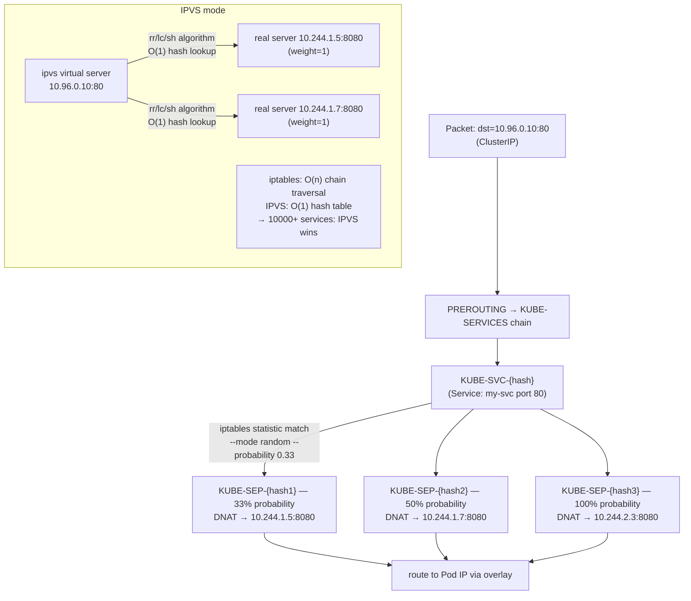

---

## 9. 수평형 포드 자동 크기 조정기 - 제어 루프

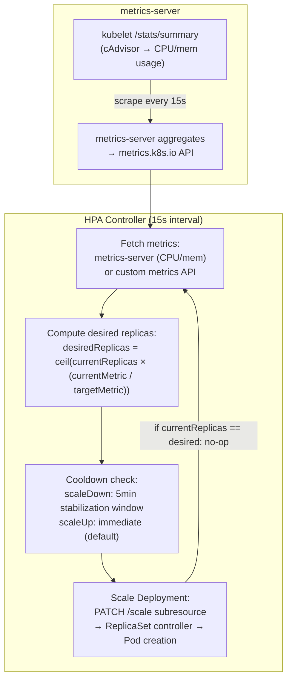

---

## 10. 영구 볼륨 — CSI 드라이버 내부

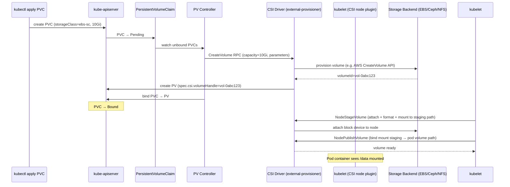

---

## 11. Kubernetes RBAC — 권한 부여 내부

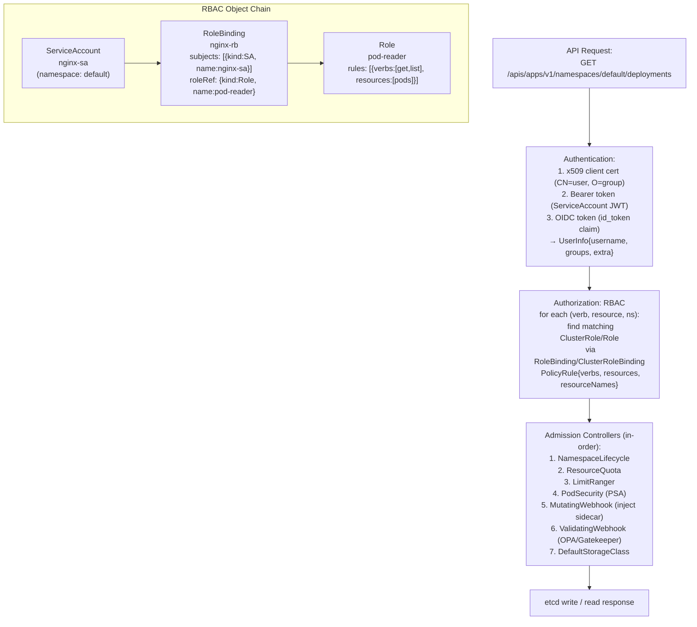

---

## 12. StatefulSet — 순차적 배포 내부

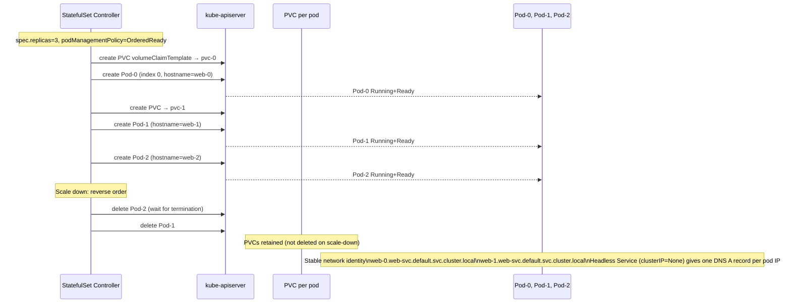

---

## 13. Docker BuildKit — 레이어 캐시 내부

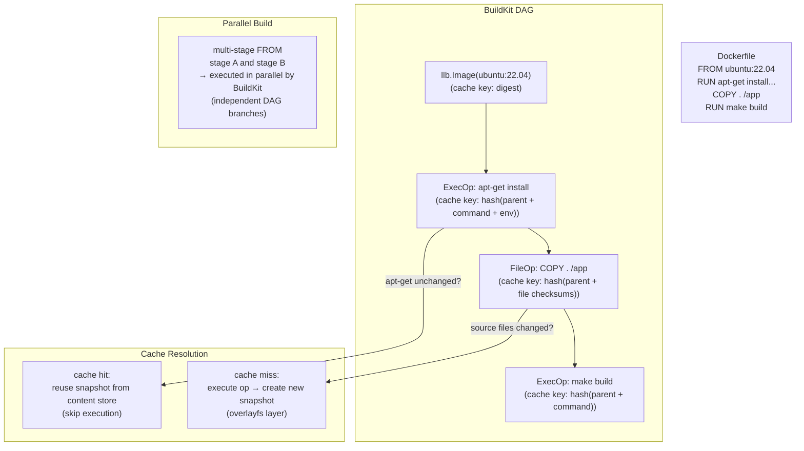

---

## 14. Kubernetes 네트워크 정책 - eBPF / iptables 시행

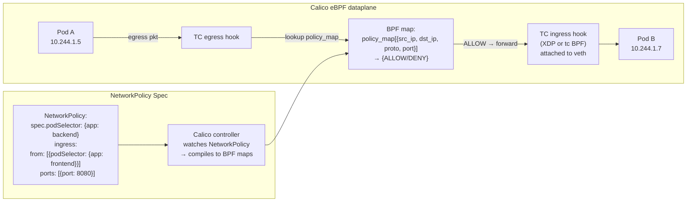

---

## 15. 성능 특성 요약

```mermaid
block-beta
  columns 2
  block:startup["Container Startup Latency"]:1
    s1["runc create + start: ~100–300ms"]
    s2["Image pull (cached): 0ms"]
    s3["Image pull (1GB, 1Gbps): ~8s"]
    s4["Pod ready (pre-pulled): ~500ms–2s"]
  end
  block:net["Network Overhead"]:1
    n1["veth pair: ~5μs additional latency"]
    n2["VXLAN overhead: +50 bytes/pkt, ~10μs"]
    n3["iptables: O(n) rules; 10k svcs → ms delay"]
    n4["IPVS: O(1) hash; 10k svcs → μs"]
  end
  block:sched["Scheduler Throughput"]:1
    sc1["kube-scheduler: ~1000 pods/sec\n(single-threaded bind)"]
    sc2["Filter: parallel goroutine per node"]
    sc3["Score: parallel goroutine per node"]
    sc4["Preemption: O(pods × nodes)"]
  end
  block:etcd_perf["etcd Performance"]:1
    e1["Write latency: ~1–5ms (fsync WAL)"]
    e2["Read (linearizable): ~1ms"]
    e3["Watch fanout: ~10k watchers/obj"]
    e4["Recommended: <8GB data, SSD required"]
  end
```

---

## 주요 내용

- **runc**는 6개의 네임스페이스 플래그로 `clone()`을 호출하는 OCI 런타임입니다. Containerd-shim은 runc 종료 후에도 유지되어 컨테이너 프로세스 수명 주기를 소유합니다.
- **OverlayFS** 쓰기 중 복사는 하위 계층의 모든 파일에 먼저 쓰기를 수행하면 전체 inode가 `upperdir`에 복사됨을 의미합니다. 대용량 파일에는 일회성 복사 패널티가 발생합니다.
- **etcd Raft**에는 모든 쓰기에 대해 쿼럼(⌊n/2⌋+1)이 필요합니다. 3노드 클러스터는 1개의 오류를 허용합니다. 모든 k8s 상태는 이 경로를 통해 직렬화됩니다.
- **kube-scheduler filter/score**는 노드당 병렬 고루틴으로 플러그인 체인을 실행합니다. 바인딩은 유일한 직렬 단계입니다.
- **kube-proxy iptables 모드** 확장성이 좋지 않음: n 서비스에 대한 O(n) 체인 순회; IPVS는 O(1) 조회를 위해 커널 해시 테이블을 사용합니다.
- **CSI 볼륨**에는 포드당 3개의 RPC가 필요합니다. ControllerPublishVolume(연결), NodeStageVolume(스테이징으로 포맷/마운트), NodePublishVolume(포드에 바인딩 마운트)
- **HPA**는 원하는 = ceil(현재 × 실제/목표)를 계산합니다. 안정화 창은 폭증하는 측정항목의 스래싱을 방지합니다.


---

## 설계적 고민

컨테이너와 오케스트레이션은 **인프라스트럭처를 코드로 정의하는 패러다임**이다. 모든 선택 — 격리 수준, 워크로드 타입, 설정 관리, 템플릿 전략 — 에는 명확한 트레이드오프가 존재하며, 이 절에서는 설계자 관점에서 그 균형점을 분석한다.

### 구조와 모델링

#### 컨테이너 vs VM: 격리 수준(cgroup/namespace) vs 부팅 시간

컨테이너와 VM은 모두 워크로드 격리를 제공하지만 근본적으로 다른 추상화 수준에서 동작한다. VM은 하드웨어 수준 격리(Hypervisor)를 제공하여 강력한 보안 경계를 만들지만, 부팅 시간과 리소스 오버헤드가 크다. 컨테이너는 커널 수준 격리(cgroup + namespace)로 경량화되지만, 커널을 공유하므로 격리 수준이 낮다.

설계 결정 기준:
- **멀티 테넌트**: VM 필수 (커널 익스플로잇 격리)
- **마이크로서비스**: 컨테이너 선호 (빠른 스케일링)
- **레거시 애플리케이션**: VM 선호 (게스트 OS 독립성)
- **CI/CD 파이프라인**: 컨테이너 필수 (매 빌드마다 환경 재현)

```mermaid
flowchart TD
    subgraph "격리 기술 비교"
        subgraph VM["가상 머신"]
            VM_App["애플리케이션"] --> GuestOS["게스트 OS\n전체 커널"]
            GuestOS --> Hypervisor["하이퍼바이저\n하드웨어 에뮬레이션"]
            Hypervisor --> HW["호스트 하드웨어"]
        end
        subgraph Container["컨테이너"]
            C_App["애플리케이션"] --> Runtime["컨테이너 런타임\n(runc)"]
            Runtime --> Kernel["호스트 커널 공유\ncgroup + namespace"]
        end
    end

    VM -->|"격리 수준"| VM_Iso["✅ 강력한 격리\n커널 익스플로잇 방어\n❌ 부팅 30초∼분\n❌ RAM 512MB+ 오버헤드"]
    Container -->|"격리 수준"| C_Iso["❌ 커널 공유 (escape 위험)\n✅ 부팅 100∼300ms\n✅ 메모리 오버헤드 최소\n✅ 밀도 높음"]
```

#### Deployment vs StatefulSet vs DaemonSet: 워크로드 유형별 선택

Kubernetes는 다양한 워크로드 컨트롤러를 제공하며, 각각은 특정 운영 패턴에 맞춤화되어 있다. 잘못된 컨트롤러 선택은 데이터 손실, 서비스 중단, 불필요한 복잡도로 이어진다.

```mermaid
flowchart TD
    WorkloadType{"워크로드 특성?"}

    WorkloadType -->|"무상태\n수평 확장"| Deployment["✅ Deployment\n예: 웹 서버, API 서버\n롤링 업데이트"]
    WorkloadType -->|"상태 유지\n안정적 ID 필요"| StatefulSet["✅ StatefulSet\n예: DB, Kafka, ZooKeeper\n순서대로 배포/종료"]
    WorkloadType -->|"모든 노드에\n정확히 1개 필요"| DaemonSet["✅ DaemonSet\n예: 로그 수집, 모니터링 에이전트\n노드 추가 시 자동 배치"]
    WorkloadType -->|"일회성/주기적\n배치 작업"| Job["✅ Job / CronJob\n예: 데이터 마이그레이션, 백업\n완료 까지 재시도"]

    Deployment --> D_Detail["특성:\n- ReplicaSet 기반 스케일링\n- Pod 간 교환 가능 (interchangeable)\n- PVC 공유 가능 (ReadWriteMany)"]
    StatefulSet --> S_Detail["특성:\n- 안정적 네트워크 ID (pod-0, pod-1, ...)\n- 순서대로 생성/삭제\n- 개별 PVC 자동 생성"]
```

### 트레이드오프와 의사결정

#### 사이드카 패턴(Istio/Envoy): 애플리케이션 투명성 vs 자원 오버헤드

사이드카 패턴은 애플리케이션 코드 수정 없이 관심사(mTLS, 트래픽 관리, 관측)를 주입한다. 하지만 파드당 사이드카 컨테이너가 추가되며, 이는 메모리·CPU·레이턴시 오버헤드로 이어진다.

| 기준 | 사이드카 적용 | 라이브러리 직접 구현 |
|---|---|---|
| CPU 오버헤드 | ~0.5–2% per request | 0% (in-process) |
| 메모리 | ~50–100MB per sidecar | 0 (애플리케이션 내) |
| 레이턴시 | +0.3–1ms p50 | 0 (loopback 없음) |
| 코드 침투성 | 없음 (투명) | 높음 (직접 의존) |
| 언어 독립성 | 완전 (프록시 기반) | 언어별 라이브러리 필요 |
| 디버깅 | 어려움 (프록시 레이어 추가) | 쉬움 (in-process) |

```mermaid
flowchart LR
    subgraph "사이드카 패턴 리소스 영향"
        Pod["파드"] --> App["애플리케이션\nCPU: 500m, Mem: 256Mi"]
        Pod --> Sidecar["사이드카 (Envoy)\nCPU: 100m, Mem: 64Mi"]
        Pod --> InitContainer["이닛 컨테이너\niptables 규칙 설정"]

        Total["파드당 총 리소스:\nCPU: 600m, Mem: 320Mi\n사이드카 비율: ~20%"]
    end

    Sidecar -->|"트래픽 경로"| Intercept["모든 인바운드/아웃바운드\niptables REDIRECT → 15001/15006"]
```

#### ConfigMap vs Secret vs PVC: 설정/민감정보/영구저장소 분리 설계

Kubernetes에서 데이터는 성격에 따라 다른 추상화로 관리된다. 이 분리는 보안, 수명 주기, 접근 패턴의 차이에 기반한다.

```mermaid
flowchart TD
    subgraph "데이터 유형별 저장소 선택"
        Data{"데이터 성격?"}

        Data -->|"일반 설정\n(DB URL, 플래그)"| ConfigMap["✅ ConfigMap\n평문 저장 (etcd)\n환경변수/볼륨 마운트\n파드 재시작 없이 갱신 가능"]
        Data -->|"민감 정보\n(API 키, 비밀번호)"| Secret["✅ Secret\nbase64 인코딩 (etcd 암호화 권장)\nRBAC 접근 제어\ntmpfs 마운트 (디스크 미기록)"]
        Data -->|"영구 데이터\n(DB 파일, 로그)"| PVC["✅ PersistentVolumeClaim\nCSI 드라이버 기반\n파드 재스케줄링 시 유지\nStorageClass로 동적 프로비저닝"]
    end

    ConfigMap --> CM_Warn["⚠ 주의: 1MB 크기 제한\n민감 데이터 저장 금지"]
    Secret --> S_Warn["⚠ 주의: External Secrets Operator 권장\nVault/AWS SSM 연동"]
    PVC --> PVC_Warn["⚠ 주의: RWO vs RWX 접근 모드\n노드 친화성(Node Affinity)"]
```

### 리팩토링과 설계 원칙

#### Helm vs Kustomize: 템플릿 패키지 vs 패치 오버레이

Kubernetes 매니페스트 관리는 두 가지 철학으로 나뉘다:

**Helm**: 템플릿 엔진 방식. Go 템플릿으로 매니페스트를 생성하며, `values.yaml`로 환경별 설정을 주입한다. 차트 패키지로 배포/롤백/버전 관리가 가능하다.

**Kustomize**: 패치 오버레이 방식. 기본 YAML에 환경별 패치를 적용한다. 템플릿 없이 순수 YAML을 유지하며, `kubectl`에 내장되어 있다.

```mermaid
flowchart TD
    subgraph "매니페스트 관리 전략"
        Helm["헬 (Helm)"] --> HelmPro["✅ 장점:\n- 패키지 생태계 풍부\n- 롤백/버전 관리\n- 의존성 관리\n- 훅/테스트 지원"]
        Helm --> HelmCon["❌ 단점:\n- Go 템플릿 복잡도\n- 엔진 디버깅 어려움\n- 보안 위험 (Tiller 제거됨)\n- 런더링 결과 예측 어려움"]

        Kustomize["커스터마이즈 (Kustomize)"] --> KPro["✅ 장점:\n- 순수 YAML 유지\n- kubectl 내장\n- 학습 곡선 낮음\n- GitOps 친화적"]
        Kustomize --> KCon["❌ 단점:\n- 롤백/버전 관리 없음\n- 복잡한 파라미터화 어려움\n- 패키지 배포/공유 불편\n- 훅/테스트 미지원"]
    end

    HelmPro -->|"적합 상황"| HelmUse["오픈소스 차트 배포\n복잡한 파라미터화\n다양한 환경 관리"]
    KPro -->|"적합 상황"| KUse["내부 프로젝트\n간단한 환경 차이\nGitOps 워크플로"]
```

### 디자인 패턴 적용

#### 운영 패턴: 블루/그린, 카나리아, 롤링 업데이트 전략

배포 전략은 애플리케이션의 가용성 요구사항과 위험 허용도에 따라 결정된다. Kubernetes는 네이티브로 롤링 업데이트를 지원하며, 블루/그린과 카나리아 전략은 서비스 메시나 Ingress 설정으로 구현한다.

```mermaid
flowchart LR
    subgraph "배포 전략 비교"
        subgraph Rolling["롤링 업데이트"]
            R1["파드 v1 → v2 순차 교체\nmaxSurge: 25%\nmaxUnavailable: 25%"]
        end
        subgraph BlueGreen["블루/그린"]
            BG1["블루(현재) 100% 트래픽\n그린(새로운) 0% 트래픽"]
            BG2["전환: 서비스 셀렉터 변경\n그린 100%, 블루 0%"]
            BG1 --> BG2
        end
        subgraph Canary["카나리아"]
            CA1["신버전: 5% 트래픽"]
            CA2["모니터링 + 점진적 증가"]
            CA3["신버전: 100% 트래픽"]
            CA1 --> CA2 --> CA3
        end
    end

    Rolling -->|"특성"| R_Detail["✅ 가장 단순\n✅ 리소스 효율적\n❌ 롤백 느림\n❌ 혹합 버전 구간 존재"]
    BlueGreen -->|"특성"| BG_Detail["✅ 즉시 전환/롤백\n✅ 버전 혼재 없음\n❌ 2배 리소스 필요\n❌ DB 스키마 호환성"]
    Canary -->|"특성"| CA_Detail["✅ 위험 최소화\n✅ 실 트래픽 검증\n❌ 구현 복잡도\n❌ 모니터링 필수"]
```

**설계 원칙 정리**: Docker와 Kubernetes의 설계적 고민은 **"자동화의 범위"**와 **"추상화의 대가"**를 정하는 과정이다. 더 많은 추상화는 운영 편의성을 높이지만 디버깅 복잡도와 리소스 오버헤드를 동반한다. 성공적인 플랫폼 설계는 팀의 운영 성숙도에 맞춰 적절한 추상화 수준을 선택하고, 점진적으로 복잡도를 높여가는 접근이다.

## 연습 문제

### 1. 시스템 구조와 모델링

**문제 1-1. Pod → Service → Ingress 네트워크 경로 추적**

당신은 `frontend`(Nginx, 포트 80)와 `backend`(Spring Boot, 포트 8080) 두 개의 Deployment를 운영하고 있다. 외부 사용자가 `https://app.example.com/api/users`로 요청을 보내면, 이 요청이 최종적으로 backend Pod의 컨테이너까지 도달하는 전체 경로를 추적해야 한다.

(1) 외부 요청이 Ingress Controller → Ingress 규칙 → Service → Pod로 전달되는 과정에서, 각 단계마다 어떤 Kubernetes 리소스가 관여하고 어떤 네트워크 변환(DNAT, iptables 규칙 등)이 발생하는지 구체적으로 설명하라.
(2) `ClusterIP`, `NodePort`, `LoadBalancer` 타입의 Service가 이 경로에서 각각 어떤 역할을 할 수 있는지, 그리고 Ingress가 이들과 어떻게 다른 계층에서 동작하는지 비교하라.
(3) backend Service의 `targetPort`와 Pod의 `containerPort`가 불일치할 때 발생하는 증상과, `kubectl describe svc`, `kubectl get endpoints`로 이를 진단하는 방법을 서술하라.

<details><summary>힌트 보기</summary>

Ingress Controller(보통 Nginx나 Traefik)는 L7 로드밸런서로서 Host/Path 기반 라우팅을 수행한다. Service는 L4 수준에서 kube-proxy가 iptables/IPVS 규칙을 통해 ClusterIP → Pod IP로 DNAT한다. Ingress → Service 연결에서 Service는 실제로 프록시 역할이 아니라 Endpoint 목록을 제공하는 역할만 할 수 있다(`nginx.ingress.kubernetes.io/service-upstream` 설정에 따라 다름). `targetPort`가 틀리면 Endpoints 오브젝트에 Pod IP는 있지만 실제 연결이 거부되는 현상이 나타난다.

</details>

**문제 1-2. Kubernetes Reconciliation Loop 동작 모델링**

운영팀이 `replicas: 3`으로 설정된 Deployment의 YAML을 `replicas: 5`로 수정하여 `kubectl apply`를 실행했다. 이 변경이 실제로 2개의 새로운 Pod가 특정 노드에서 실행 상태가 되기까지의 전체 Reconciliation 과정을 모델링하라.

(1) `kubectl apply` 이후 API Server → etcd 저장 → Controller Manager의 Deployment Controller → ReplicaSet Controller → Scheduler → Kubelet 순서로 이벤트가 전파되는 과정을 시간 순서대로 설명하라.
(2) 이 과정에서 '선언적(Declarative)' 모델의 핵심인 'Desired State vs Current State 비교'가 구체적으로 어느 컴포넌트에서 어떻게 수행되는지 명시하라.
(3) Scheduler가 2개의 새 Pod를 배치할 때 고려하는 요소(리소스 요청, nodeAffinity, taint/toleration, PodAntiAffinity 등)와, 만약 적합한 노드가 없을 때 Pod가 어떤 상태에 머무르는지 설명하라.

<details><summary>힌트 보기</summary>

Kubernetes의 모든 컨트롤러는 **Watch → Diff → Act** 루프를 따른다. Deployment Controller는 ReplicaSet의 replica 수를 조정하고, ReplicaSet Controller는 실제 Pod 수와 desired를 비교하여 부족분만큼 Pod 오브젝트를 생성한다(이 시점에서 Pod의 `spec.nodeName`은 비어 있다). Scheduler는 `nodeName`이 비어 있는 Pod를 감시하다가 Filtering → Scoring 과정을 거쳐 노드를 배정한다. 적합한 노드가 없으면 Pod는 `Pending` 상태로 남고, `kubectl describe pod`의 Events에 `FailedScheduling` 이벤트가 기록된다.

</details>

**문제 1-3. Container Runtime과 Pod 생명주기의 계층 구조**

개발팀이 "Docker 대신 containerd를 사용하면 뭐가 달라지나요?"라고 질문했다. Kubernetes v1.24 이후 dockershim이 제거된 맥락에서, 컨테이너 런타임의 계층 구조와 Pod 생명주기의 관계를 설명해야 한다.

(1) CRI(Container Runtime Interface) → containerd → runc(OCI Runtime)의 3계층 구조에서 각 계층의 책임과 인터페이스 경계를 설명하라.
(2) Pod 내에 2개의 컨테이너와 1개의 initContainer가 있을 때, Kubelet이 이들을 생성하는 순서와 Pause 컨테이너(인프라 컨테이너)의 역할을 서술하라.
(3) `livenessProbe` 실패 시 컨테이너가 재시작되는 과정에서, Pod IP가 유지되는 이유를 Pause 컨테이너와 Linux 네임스페이스의 관계로 설명하라.

<details><summary>힌트 보기</summary>

Docker를 사용할 때는 Kubelet → dockershim → dockerd → containerd → runc 경로였지만, dockershim 제거 후에는 Kubelet → CRI → containerd → runc로 단순화되었다. Pause 컨테이너는 Pod의 네트워크 네임스페이스를 소유하고, 다른 컨테이너들은 이 네임스페이스를 공유한다. 따라서 앱 컨테이너가 재시작되어도 네트워크 네임스페이스는 Pause 컨테이너가 유지하므로 Pod IP는 변하지 않는다.

</details>

### 2. 트레이드오프와 의사결정

**문제 2-1. Deployment vs StatefulSet 선택 기준**

인프라팀에서 다음 두 워크로드를 Kubernetes에 배포해야 한다:
- **워크로드 A**: Redis Cluster (3 master + 3 replica, 각 노드가 고유한 ID와 slot 범위를 가짐)
- **워크로드 B**: Nginx 기반 정적 파일 서버 (수평 확장 필요, 상태 없음)

(1) 각 워크로드에 Deployment와 StatefulSet 중 어떤 것을 선택해야 하는지, 그리고 그 이유를 Pod 이름 안정성, 스토리지 바인딩, 순서 보장 측면에서 설명하라.
(2) Redis Cluster를 StatefulSet으로 배포할 때, `volumeClaimTemplates`와 Headless Service(`clusterIP: None`)가 왜 필요한지, 그리고 Pod가 재생성될 때 데이터가 어떻게 보존되는지 설명하라.
(3) StatefulSet의 `podManagementPolicy: Parallel` vs `OrderedReady`가 Redis Cluster 초기 부트스트랩과 롤링 업데이트에 각각 어떤 영향을 미치는지 분석하라.

<details><summary>힌트 보기</summary>

StatefulSet은 `pod-name-0`, `pod-name-1`처럼 순서가 보장된 안정적인 네트워크 ID를 제공한다. Redis Cluster에서 각 노드는 `redis-0.redis-headless.ns.svc.cluster.local`과 같은 고정 DNS로 서로를 인식해야 하므로 StatefulSet + Headless Service가 필수다. `volumeClaimTemplates`는 Pod마다 독립적인 PVC를 생성하여 Pod가 재스케줄링되어도 같은 PV에 다시 바인딩된다. Nginx처럼 상태가 없는 워크로드는 Deployment가 적합하며, Pod 이름이 바뀌어도 Service가 로드밸런싱하므로 문제없다.

</details>

**문제 2-2. Helm 차트 vs Kustomize 멀티 환경 관리 전략**

DevOps팀이 dev/staging/production 3개 환경에 동일한 마이크로서비스를 배포해야 한다. 환경별로 replica 수, 리소스 제한, 환경변수, 이미지 태그가 다르다. Helm과 Kustomize 두 가지 방식을 검토 중이다.

(1) Helm의 `values-dev.yaml` / `values-prod.yaml` 오버라이드 방식과, Kustomize의 `base` + `overlays/dev`, `overlays/prod` 패치 방식의 구조적 차이를 설명하라.
(2) 다음 시나리오에서 각 도구의 장단점을 비교하라: (a) 제3자 오픈소스 차트를 커스터마이징해야 할 때, (b) GitOps 파이프라인에서 변경 사항을 리뷰할 때, (c) 새로운 환경을 빠르게 추가해야 할 때.
(3) "Helm으로 템플릿을 생성하고 Kustomize로 환경별 패치를 적용한다"는 하이브리드 전략의 장점과 주의점을 실제 CI/CD 파이프라인 관점에서 논하라.

<details><summary>힌트 보기</summary>

Helm은 Go 템플릿 기반으로 `{{ .Values.replicas }}`처럼 변수를 치환하는 방식이라 유연하지만, 템플릿이 복잡해지면 가독성이 급격히 떨어진다. Kustomize는 순수 YAML 패치(Strategic Merge Patch, JSON Patch)로 동작하여 `kubectl diff`로 변경 사항을 명확히 볼 수 있다. 제3자 차트는 Helm이 유리하고(차트 저장소 에코시스템), GitOps 리뷰는 Kustomize가 유리하다(렌더링된 YAML이 그대로 보임). 하이브리드 접근(`helm template | kustomize`)은 두 장점을 취하지만, 파이프라인 복잡도가 증가하고 Helm의 릴리스 관리 기능을 잃는다.

</details>

**문제 2-3. 리소스 요청/제한 설정의 트레이드오프**

프로덕션 클러스터에서 Java 기반 마이크로서비스의 리소스 설정을 최적화해야 한다. 현재 설정은 `requests.memory: 256Mi, limits.memory: 512Mi, requests.cpu: 100m, limits.cpu: 500m`이지만, 빈번한 OOMKilled와 CPU Throttling이 발생하고 있다.

(1) `requests`와 `limits`의 차이가 Scheduler 배치 결정과 런타임 동작에 각각 어떻게 영향을 미치는지 설명하라. 특히 CPU throttling이 발생하는 메커니즘(CFS quota)을 서술하라.
(2) Java 애플리케이션에서 JVM 힙 메모리와 컨테이너 memory limit의 관계를 설명하고, `-XX:MaxRAMPercentage`를 적절히 설정하지 않았을 때 OOMKilled가 발생하는 이유를 분석하라.
(3) QoS 클래스(Guaranteed, Burstable, BestEffort)가 노드의 메모리 압박 상황에서 Pod 축출 순서에 어떤 영향을 미치는지, 그리고 프로덕션 워크로드에 어떤 QoS 클래스를 권장하는지 논하라.

<details><summary>힌트 보기</summary>

CPU `limits`는 CFS(Completely Fair Scheduler) 기반 quota를 설정하여, 500m = 100ms 주기 중 50ms만 CPU를 사용할 수 있다. 트래픽 급증 시 이 quota를 초과하면 throttling이 발생한다. 메모리는 압축 불가능 리소스이므로 limit 초과 시 OOMKilled된다. JVM은 힙 외에도 메타스페이스, 스레드 스택, NIO 버퍼 등을 사용하므로 `MaxRAMPercentage`를 75% 정도로 설정하여 비힙 메모리 여유를 확보해야 한다. Guaranteed QoS(requests == limits)는 축출 우선순위가 가장 낮아 프로덕션에 권장된다.

</details>

### 3. 문제 해결 및 리팩토링

**문제 3-1. CrashLoopBackOff 체계적 진단 절차**

새로 배포한 서비스의 Pod가 `CrashLoopBackOff` 상태에 빠져 있다. `kubectl get pods`의 RESTARTS 카운트가 계속 증가하고, 서비스가 전혀 응답하지 않는다.

(1) CrashLoopBackOff의 백오프 메커니즘(10s → 20s → 40s → ... → 5min 상한)을 설명하고, 이 상태가 의미하는 것이 "컨테이너가 시작 직후 반복적으로 종료된다"임을 명확히 하라.
(2) 다음 진단 명령어들을 순서대로 실행하면서 각 단계에서 확인할 수 있는 정보를 설명하라: `kubectl describe pod`, `kubectl logs --previous`, `kubectl get events --sort-by=.metadata.creationTimestamp`.
(3) 다음 각 원인별 CrashLoopBackOff의 특징적인 로그 패턴과 해결 방법을 제시하라: (a) 잘못된 CMD/ENTRYPOINT, (b) 환경변수 누락으로 인한 앱 시작 실패, (c) ConfigMap/Secret 마운트 실패, (d) readinessProbe와 livenessProbe 설정 오류.

<details><summary>힌트 보기</summary>

`describe pod`에서 `Last State: Terminated, Exit Code`를 확인한다. Exit Code 1은 앱 에러, 137은 OOMKilled(128+9=SIGKILL), 139는 SIGSEGV다. `logs --previous`는 이전 크래시된 컨테이너의 로그를 보여준다. ConfigMap/Secret 마운트 실패 시 컨테이너 자체가 시작되지 않으므로 Events에서 `FailedMount`를 확인한다. livenessProbe의 `initialDelaySeconds`가 너무 짧으면 앱이 완전히 시작되기 전에 kill되어 CrashLoopBackOff처럼 보일 수 있다.

</details>

**문제 3-2. 스테이트리스 서비스의 로컬 세션 저장 안티패턴 리팩토링**

레거시 웹 애플리케이션이 사용자 세션을 로컬 파일시스템(`/tmp/sessions/`)에 저장하고 있다. Kubernetes에서 Deployment로 배포하고 replica를 3으로 늘렸더니, 사용자가 로그인 후 간헐적으로 세션이 유실되는 문제가 발생했다.

(1) 이 문제가 발생하는 근본 원인을 Service의 로드밸런싱과 Pod의 독립적인 파일시스템 관점에서 설명하라.
(2) 다음 3가지 해결 방안의 장단점을 비교하라: (a) Service에 `sessionAffinity: ClientIP` 설정, (b) 세션 저장소를 외부 Redis로 변경, (c) JWT 기반 stateless 인증으로 전환.
(3) 외부 Redis 방식을 선택할 경우, Redis 연결 정보를 ConfigMap과 Secret으로 분리하여 관리하는 YAML 구조와, 앱에서 환경변수로 주입받는 Deployment 설정을 설계하라.

<details><summary>힌트 보기</summary>

Service의 기본 로드밸런싱은 라운드로빈이므로, 같은 사용자의 연속 요청이 다른 Pod로 분산된다. 각 Pod의 `/tmp/sessions/`는 독립적이므로 세션이 유실된다. `sessionAffinity: ClientIP`는 임시 해결이지만 Pod가 재시작되면 세션이 사라지고, NAT 뒤의 사용자들이 같은 Pod에 몰리는 문제가 있다. Redis 방식이 가장 일반적이며, 연결 URL은 ConfigMap에, 비밀번호는 Secret에 저장하고 `env[].valueFrom.configMapKeyRef/secretKeyRef`로 주입한다.

</details>

**문제 3-3. 이미지 Pull 실패와 레지스트리 문제 해결**

프로덕션 배포 중 새 버전의 이미지로 업데이트했더니 Pod가 `ImagePullBackOff` 상태에 빠졌다. 이전 버전의 Pod는 정상 동작 중이다.

(1) `ImagePullBackOff`와 `ErrImagePull`의 차이를 설명하고, 일반적인 원인(이미지 태그 오류, 프라이빗 레지스트리 인증 실패, 네트워크 문제)별 진단 방법을 서술하라.
(2) `imagePullSecrets`의 동작 원리와, Secret이 올바르게 설정되었는지 확인하는 방법(`kubectl get secret -o jsonpath`)을 설명하라.
(3) `imagePullPolicy: Always` vs `IfNotPresent` vs `Never`가 각각 어떤 상황에 적합한지, 그리고 `:latest` 태그를 프로덕션에서 사용하면 안 되는 이유를 구체적으로 논하라.

<details><summary>힌트 보기</summary>

`ErrImagePull`은 첫 시도 실패, `ImagePullBackOff`는 반복 실패 후 백오프 대기 상태다. `describe pod`의 Events에서 구체적 에러 메시지(401 Unauthorized, manifest unknown, timeout 등)를 확인한다. `imagePullSecrets`는 Pod spec에 지정하며, `kubectl create secret docker-registry`로 생성한다. `:latest` 태그는 immutable하지 않아 같은 태그로 다른 이미지가 푸시될 수 있고, `IfNotPresent` 정책에서 노드마다 캐시된 이미지가 달라 불일치가 발생한다.

</details>

### 4. 개념 간의 연결성

**문제 4-1. HPA + VPA + KEDA: 다차원 오토스케일링 전략**

e-커머스 플랫폼에서 다음 두 가지 스케일링 요구사항이 있다:
- **API 서버**: HTTP 요청량에 비례하여 Pod를 확장해야 한다 (평소 10 RPS → 세일 기간 1000 RPS).
- **주문 처리 워커**: Kafka 토픽의 consumer lag에 비례하여 확장해야 한다 (lag 0이면 1 Pod, lag 10000이면 20 Pod).

(1) API 서버에 HPA(CPU/메모리 기반)를 적용할 때의 한계를 설명하고, custom metrics(예: `http_requests_per_second`)를 Prometheus Adapter로 연동하는 아키텍처를 설계하라.
(2) 주문 처리 워커에 KEDA(Kubernetes Event-Driven Autoscaler)를 적용하여 Kafka lag 기반 스케일링을 구현하는 방법을 `ScaledObject` 리소스 관점에서 설명하라. KEDA가 HPA를 내부적으로 생성하는 메커니즘도 포함하라.
(3) VPA(Vertical Pod Autoscaler)와 HPA를 동시에 사용할 때 발생할 수 있는 충돌(VPA가 리소스를 늘리면 HPA 메트릭이 변하는 피드백 루프)과, 이를 해결하기 위한 권장 패턴(VPA는 requests만 조정, HPA는 custom metrics 사용)을 설명하라.

<details><summary>힌트 보기</summary>

HPA는 기본적으로 CPU/메모리 메트릭으로 동작하지만, `metrics.k8s.io` API를 통해 custom/external metrics도 지원한다. Prometheus Adapter는 Prometheus에 수집된 메트릭을 Kubernetes Custom Metrics API로 변환한다. KEDA는 외부 이벤트 소스(Kafka, RabbitMQ, AWS SQS 등)를 감시하여 HPA를 자동 생성/관리하며, `minReplicaCount: 0`으로 설정하면 이벤트가 없을 때 Pod를 0으로 축소할 수 있다(HPA 단독으로는 불가). VPA와 HPA의 충돌을 피하려면 VPA를 `UpdateMode: Off`로 두고 추천값만 참조하거나, HPA를 CPU가 아닌 custom metrics로 구동한다.

</details>

**문제 4-2. Istio 사이드카 + mTLS + PodDisruptionBudget: 무중단 롤링 배포**

프로덕션 서비스에 Istio 서비스 메시가 적용되어 있고, 무중단 롤링 배포를 보장해야 한다. 현재 배포 시 약 2-3초간 503 에러가 간헐적으로 발생한다.

(1) Istio의 Envoy 사이드카가 앱 컨테이너보다 늦게 준비되거나 먼저 종료될 때 발생하는 트래픽 유실 문제를 설명하고, `holdApplicationUntilProxyStarts`와 `EXIT_ON_ZERO_ACTIVE_CONNECTIONS` 설정의 역할을 서술하라.
(2) mTLS(mutual TLS)가 활성화된 환경에서 롤링 업데이트 중 새 Pod와 기존 Pod 간의 인증서 교환이 어떻게 이루어지는지, 그리고 Citadel(istiod)의 인증서 발급 지연이 트래픽에 미치는 영향을 분석하라.
(3) PodDisruptionBudget(`minAvailable: 80%`)과 Deployment의 `maxUnavailable`, `maxSurge` 설정이 어떻게 상호작용하여 무중단을 보장하는지, 그리고 `preStop` 훅에서 `sleep 5`를 넣는 패턴이 왜 필요한지 설명하라.

<details><summary>힌트 보기</summary>

503 에러의 주요 원인은 사이드카 라이프사이클과 앱 컨테이너 라이프사이클의 불일치다. Pod 종료 시 Kubernetes는 Service의 Endpoints에서 Pod를 제거하고 SIGTERM을 동시에 보내는데, Endpoints 전파에 시간이 걸려 이미 종료 중인 Pod로 트래픽이 라우팅될 수 있다. `preStop: sleep 5`는 이 전파 지연 동안 Pod가 트래픽을 계속 처리하게 한다. PDB는 voluntary disruption(롤링 업데이트 포함)에서 동시에 종료되는 Pod 수를 제한하여, `maxUnavailable`과 함께 최소 가용 Pod 수를 보장한다. Istio의 mTLS 인증서는 istiod가 자동 발급하며, 새 Pod 시작 시 인증서 발급까지 약간의 지연이 있을 수 있다.

</details>

**문제 4-3. Docker 멀티스테이지 빌드 + Kubernetes 보안 컨텍스트 + 네트워크 정책의 통합 보안**

보안팀의 감사에서 다음 문제들이 지적되었다: (a) 프로덕션 컨테이너 이미지에 빌드 도구와 소스코드가 포함되어 있다, (b) 컨테이너가 root로 실행되고 있다, (c) 모든 Pod가 서로 통신할 수 있다.

(1) Docker 멀티스테이지 빌드로 빌드 아티팩트만 포함하는 최소 이미지를 만드는 전략과, `distroless` 또는 `scratch` 베이스 이미지의 보안상 이점을 설명하라.
(2) Kubernetes `securityContext`에서 `runAsNonRoot: true`, `readOnlyRootFilesystem: true`, `allowPrivilegeEscalation: false`, `capabilities.drop: [ALL]`을 설정하는 것이 각각 어떤 공격 벡터를 방어하는지 설명하라.
(3) NetworkPolicy로 "기본 거부(default deny) + 명시적 허용" 패턴을 구현하여, frontend → backend(8080 포트만)만 허용하고 나머지 통신을 차단하는 정책을 설계하라. CNI 플러그인(Calico, Cilium)이 NetworkPolicy 지원에 필수인 이유도 설명하라.

<details><summary>힌트 보기</summary>

멀티스테이지 빌드에서 `FROM golang:1.21 AS builder` → `FROM gcr.io/distroless/static` 패턴으로 빌드 의존성을 제거한다. distroless 이미지는 셸조차 없어 `kubectl exec`으로 침투해도 할 수 있는 것이 극히 제한된다. `readOnlyRootFilesystem`은 컨테이너 내 악성 파일 쓰기를 방지하고(임시 파일은 emptyDir 볼륨 마운트로 해결), `allowPrivilegeEscalation: false`는 setuid 바이너리를 통한 권한 상승을 막는다. NetworkPolicy는 기본적으로 아무것도 없으면 전체 허용이므로, `spec.podSelector: {}` + `policyTypes: [Ingress, Egress]`로 default deny를 먼저 설정한 후 필요한 트래픽만 허용한다. 기본 kubenet CNI는 NetworkPolicy를 지원하지 않으므로 Calico나 Cilium이 필요하다.

</details>