# 기능적 프로그래밍 내부: 람다 미적분학, 유형 시스템 및 런타임 메커니즘

> 내부 내용: 람다 계산법과 타입 이론의 모델을 출발점으로, 클로저·지연 평가·효과 표현이 여러 런타임에서 어떻게 구현될 수 있는지 설명합니다.

## 모델과 구현을 구분하는 기준

- 람다 계산법, 정리, 타입 규칙은 형식 체계의 가정 아래 설명한다. JavaScript, GHC, JVM 등의 객체 배치는 특정 구현과 최적화 수준에 종속된다.
- `순수`, `참조 투명`, `총 함수`를 구분한다. 같은 입력의 같은 결과만으로 외부 효과 부재나 종료를 자동으로 보장하지 않는다.
- 클로저와 썽크를 무조건 힙 할당으로 보지 않는다. 이스케이프 분석, 인라이닝, unboxing 후의 실제 할당은 컴파일러 출력과 프로파일로 확인한다.
- 효과 타입과 ADT가 표현을 제한해도 외부 I/O, 동시성, 역직렬화 경계의 검증은 남는다. 완료 기준은 타입 검사와 런타임 불변식 검사를 함께 통과하는 것이다.

---

## 1. 람다 미적분학: 기초

람다 계산법은 함수형 언어를 설명하는 핵심 계산 모델 중 하나입니다. 다음은 타입이 없는 순수 람다 계산법의 세 가지 구성입니다.

```
e ::= x          (variable)
    | λx.e       (abstraction: function)  
    | e₁ e₂      (application: call function)
```

### 베타 감소: 함수 적용 메커니즘

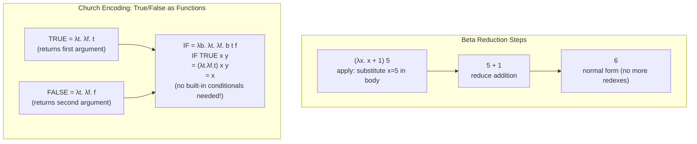

**합류(Church-Rosser 정리)**: 두 축소 경로가 각각 결과에 도달하면 다시 합류할 수 있으므로 정규형이 존재할 때 유일하다. 그러나 임의의 평가 전략이 반드시 종료한다는 뜻은 아니다. 정상 순서가 정규형을 찾는 성질과 실제 언어의 비엄격 의미론, 효과·예외를 별도로 구분해야 한다.

---

## 2. 메모리에서의 클로저 표현

개념적으로 클로저는 실행 코드와 캡처 환경의 조합이다. 환경의 스택·힙 배치 또는 제거 여부는 이스케이프 분석과 런타임 표현에 달려 있다.

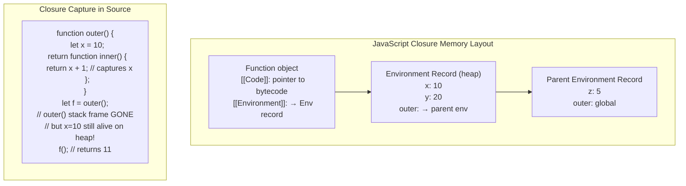

### 스택 vs 힙: 이스케이프 분석

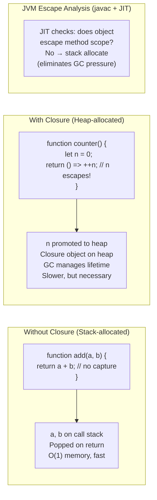

---

## 3. 하스켈 지연 평가: 썽크 메커니즘

Haskell의 비엄격 의미론에서는 값이 필요해질 때까지 계산을 미룰 수 있다. GHC 같은 구현은 평가되지 않은 계산을 썽크로 표현할 수 있지만 strictness 분석과 최적화로 썽크 생성이나 힙 할당을 제거하기도 한다.

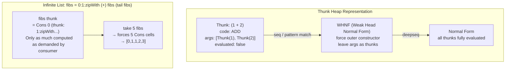

### 썽크 공유(그래프 축소)

Haskell은 **그래프 감소**를 사용합니다. 공유 썽크는 첫 번째 평가 후 해당 값으로 업데이트되어 재계산을 방지합니다.

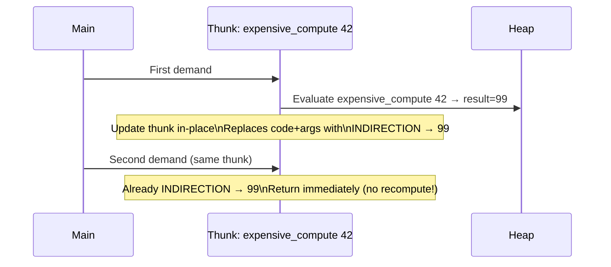

### 게으른 축적으로 인한 공간 누수

```
-- BAD: builds up n thunks before summing
sum [1..1000000]
= 1 + (2 + (3 + ... (999999 + 1000000)...))
-- Stack overflow or O(N) heap

-- GOOD: foldl' forces accumulator at each step
import Data.List (foldl')
foldl' (+) 0 [1..1000000]
-- Strict accumulator: O(1) heap
```

---

## 4. Hindley-Milner 유형 추론 알고리즘 W

HM은 **통합**을 사용하여 주석 없이 유형을 추론합니다.

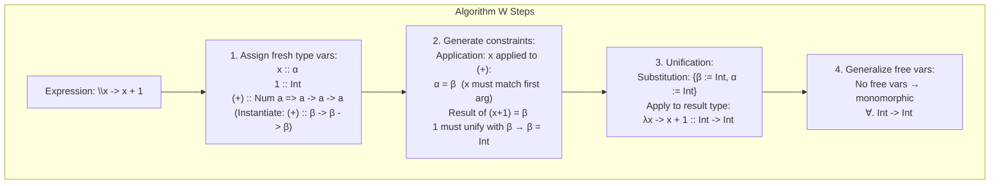

### 다형성 유형 추론

```haskell
-- id :: a -> a  (inferred, not annotated)
id x = x
-- Fresh type var: x :: α, body :: α → infer id :: α -> α
-- Generalize: id :: ∀a. a -> a

-- map :: (a -> b) -> [a] -> [b]
map f [] = []
map f (x:xs) = f x : map f xs
-- Algorithm W infers this automatically from pattern matching
```

---

## 5. 모나드: 돌연변이 없는 시퀀싱 효과

모나드는 다음을 포함하는 유형 생성자 `M`입니다.
- `return :: a -> M a`(랩 값)
- `(>>=) :: M a -> (a -> M b) -> M b` (바인드/체인)

세 가지 법칙을 충족합니다.
1. `return a >>= f  ≡  f a` (왼쪽 신원)
2. `m >>= return    ≡  m` (올바른 신원)
3. `(m >>= f) >>= g  ≡  m >>= (λx -> f x >>= g)`(연관성)

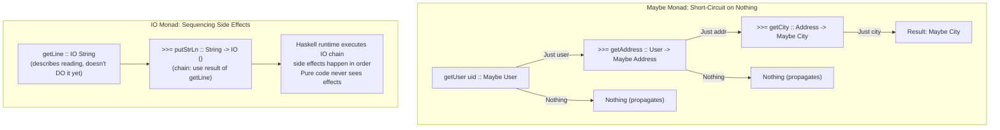

### 상태 모나드: 전역 변수가 없는 스레딩 상태

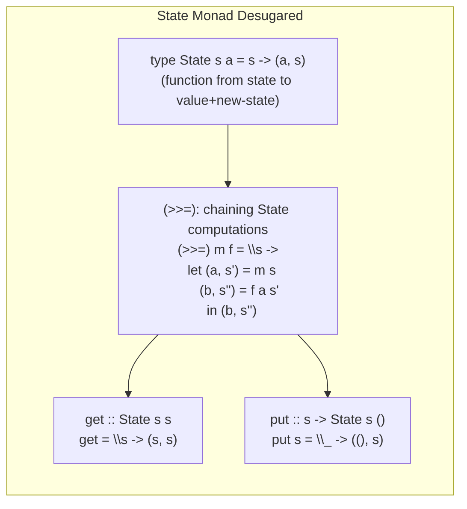

변경할 수 있는 전역 상태가 없습니다. 상태 값은 명시적 인수로 함수 호출을 통해 **스레딩**되어 각 단계에서 변환됩니다.

---

## 6. 대수적 데이터 유형 및 패턴 일치 컴파일

```haskell
data Tree a = Leaf | Node (Tree a) a (Tree a)

-- Pattern match compiles to jump table / decision tree
insert :: Ord a => a -> Tree a -> Tree a
insert x Leaf         = Node Leaf x Leaf
insert x (Node l v r)
  | x < v    = Node (insert x l) v r
  | x > v    = Node l v (insert x r)
  | otherwise = Node l v r
```

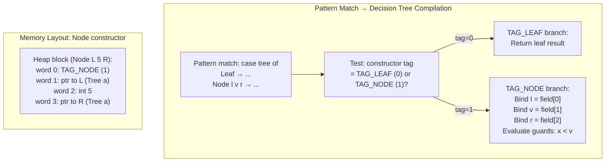

---

## 7. 순수하게 기능적인 데이터 구조: 영속적 불변 트리

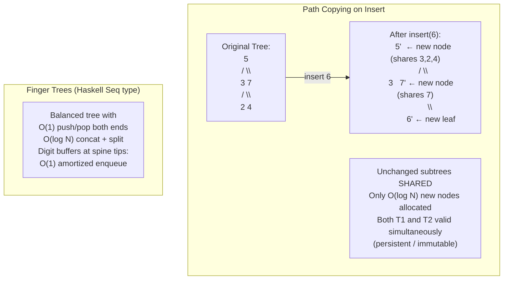

---

## 8. 코드의 범주 이론 개념

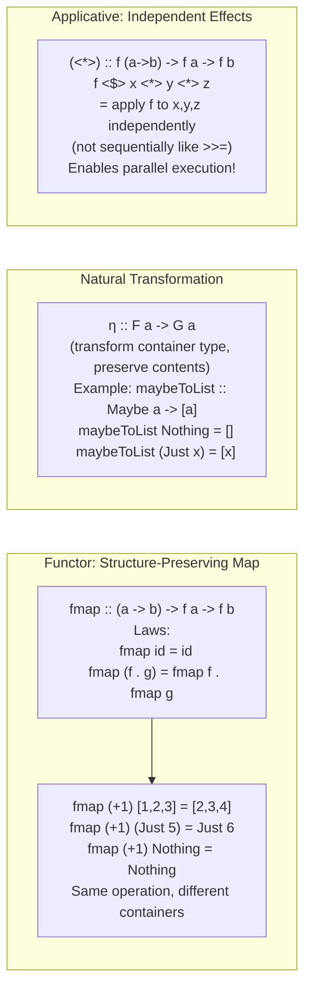

---

## 9. STM: 소프트웨어 트랜잭션 메모리 내부

Haskell의 STM은 잠금 없이 구성 가능한 원자 블록을 제공합니다.

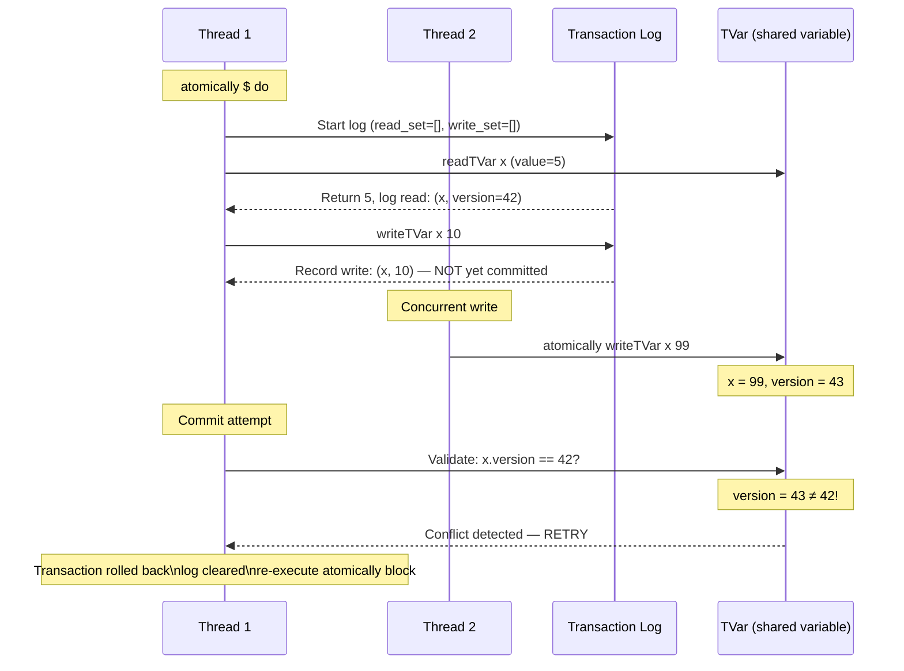

**교착 상태 없음**: STM은 낙관적 동시성을 사용합니다. 즉, 트랜잭션 실행 중에 잠금을 획득하지 않고 커밋 시에만 획득합니다. 트랜잭션은 **순수**(커밋할 때까지 관찰 가능한 부작용이 없음)이므로 재시도는 안전합니다.

---

## 10. 기능적 반응형 프로그래밍: 신호 그래프 내부

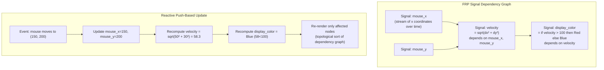

---

## 11. 테일 콜 최적화: 스택 프레임 제거

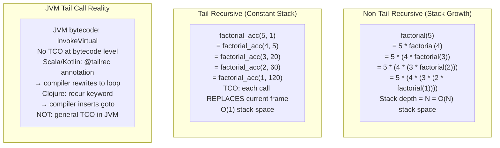

---

## 12. 효과 시스템과 무료 모나드

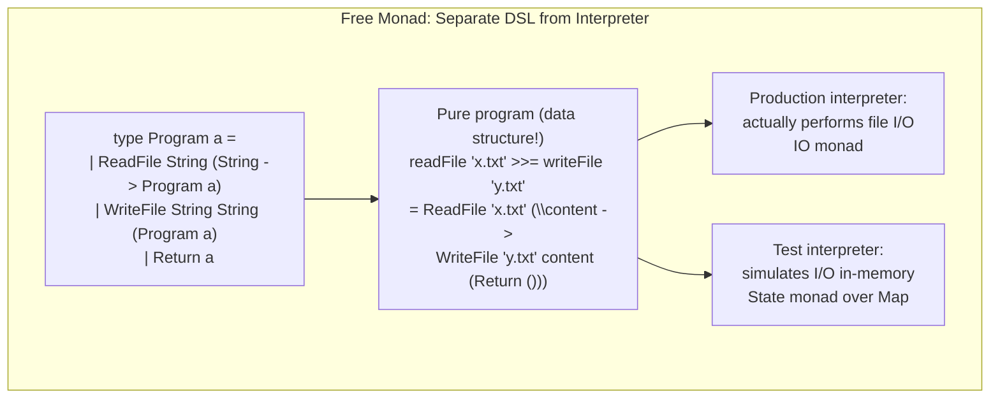

**확장 가능한 효과(Eff)**: `Eff` 모나드는 호출 사이트에서 대수 효과 처리기를 사용하여 모나드 변환기 스택 없이 여러 효과 유형(Reader, Writer, State, Exception)을 결합할 수 있도록 무료 모나드를 일반화합니다.

---

## 요약: FP 핵심 메커니즘

| 개념 | 런타임 메커니즘 | 주요 속성 |
|---|---|---|
| 폐쇄 | 힙 할당 환경 레코드 | 스택 수명 이후의 변수 캡처 |
| 게으른 썽크 | 힙 포인터 + 내부 업데이트 | 한 번 평가하고, 메모하고, 무한 구조 활성화 |
| HM 유형 추론 | 통일+대체 | O(n log n) 추론, 주석이 필요하지 않음 |
| 영구 데이터 구조 | 경로 복사 + 구조 공유 | O(log N) 업데이트, 이전 버전 보존 |
| 모나드 | 래핑된 유형에 대한 함수 구성 | 효과를 사용한 시퀀싱, 구성 가능 |
| STM | 낙관적 동시성 + 트랜잭션 로그 | 교착 상태 없음, 구성 가능한 원자 블록 |
| 총소유비용 | 현재 스택 프레임 바꾸기(goto) | 꼬리 재귀 알고리즘을 위한 O(1) 스택 |
| 패턴 매칭 | 태그 확인 + 필드 추출 + 가드 | 효율적인 의사결정 트리로 컴파일 |


---

## 설계적 고민

함수형 프로그래밍의 설계 철학은 **부수 효과의 격리**와 **합성 가능성(composability)**을 추구한다. 이 철학은 순수 함수, 불변 데이터, 타입 시스템, 평가 전략이라는 네 가지 축을 중심으로 구체화된다. 각 선택은 명확한 트레이드오프를 수반하며, 이 절에서는 설계자 관점에서 그 균형점을 분석한다.

### 구조와 모델링

#### 순수 함수 + 불변성: 테스트 가능성과 병렬화 용이성

순수 함수는 관찰 가능한 외부 상태를 바꾸지 않고 같은 명시적 입력에 같은 결과를 제공한다. 표현식을 그 값으로 바꿔도 프로그램 의미가 유지되는 참조 투명성은 등식 추론을 돕지만, 자동 병렬화의 안전성과 성능은 종료성·자원 사용·평가 전략까지 검토해야 한다.

불변성과 순수성이 결합되면 **시간적 결합(temporal coupling)**이 제거된다. 함수 호출 순서가 결과에 영향을 주지 않으므로 병렬화, 캐싱, 지연 평가가 모두 안전해진다. 반면 성능 비용이 존재한다: 모든 변경이 새 객체 생성을 요구하며, 이는 GC 압력과 메모리 사용량 증가로 이어진다.

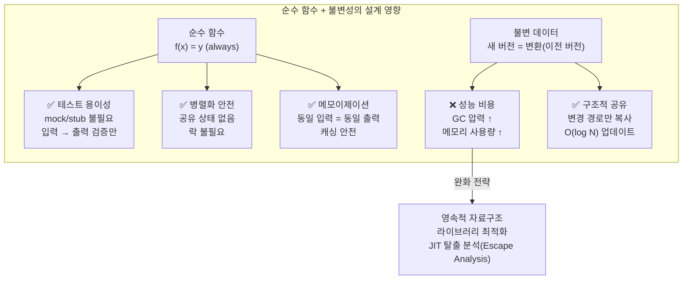

#### 대수적 데이터 타입(ADT): 도메인 모델링의 정밀함

ADT는 **합타입(Sum Type)**과 **곱타입(Product Type)**의 조합으로 도메인을 정밀하게 모델링한다. OOP의 클래스 계층구조와 달리, ADT는 "가능한 상태의 집합"을 타입 수준에서 명시적으로 정의한다.

- **곱타입**: `data User = User { name: String, age: Int }` — 모든 필드 동시 존재
- **합타입**: `data Result = Success Value | Failure Error` — 하나의 변형만 존재

핵심 설계 가치는 **도메인에서 허용하지 않는 상태의 표현 범위를 줄이는 것**이다. `String | null` 대신 `Maybe String`을 사용하면 값 부재를 명시적으로 처리하게 할 수 있다. 다만 잘못된 문자열 값이나 외부 입력까지 막으려면 스마트 생성자와 경계 검증이 추가로 필요하다.

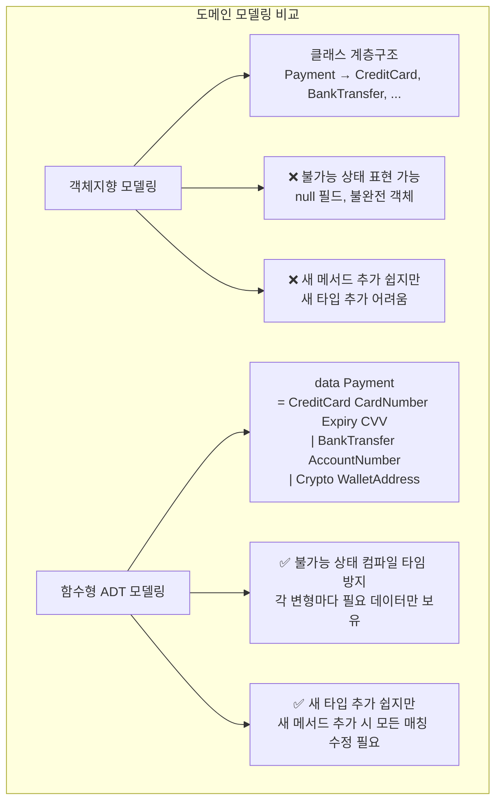

### 트레이드오프와 의사결정

#### 모나드: Maybe/Either/IO를 통한 부수 효과 격리 설계

모나드는 "프로그래밍가능한 세미콜론"으로, 부수 효과를 타입 시스템 안에서 명시적으로 추적한다. 핵심 설계 결정은 **효과의 명시성**과 **합성 용이성** 사이의 균형이다.

- **Maybe/Option**: `null` 대신 "부재"를 타입으로 표현 → NullPointerException 원천 차단
- **Either/Result**: 성공/실패를 타입으로 표현 → 예외 스택 해제 대신 명시적 오류 전파
- **IO**: 입출력을 타입으로 캡슐화 → 순수 영역과 불순수 영역의 명확한 경계

트레이드오프: 모나드는 강력하지만 **학습 곡선이 가파르고**, 모나드 변환기 스택은 **성능 오버헤드와 디버그 불투명성**을 동반한다.

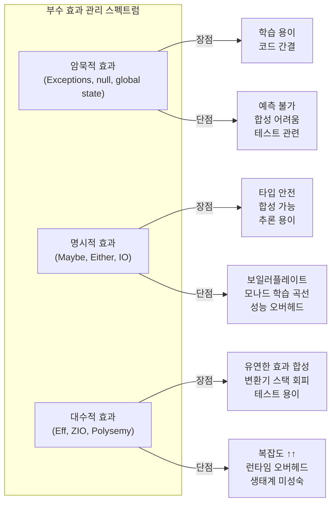

#### 지연 평가(Lazy Evaluation) vs 즉시 평가: 무한 자료구조와 메모리

지연 평가는 "필요할 때까지 계산을 미룬다"는 전략이다. 이를 통해 무한 자료구조, 불필요한 계산 회피, 모듈성 향상이 가능하다. 하지만 메모리 누수(space leak), 디버깅 난이도, 성능 예측의 어려움이라는 대가가 따른다.

Haskell은 기본 지연 평가를 채택했지만, `BangPatterns`나 `seq`로 엄격 평가를 강제할 수 있다. Scala는 기본 즉시 평가이지만 `lazy val`과 `LazyList`로 선택적 지연을 제공한다. 이 설계 스펙트럼에서 "기본값"을 어디에 둘 것인가가 핵심 의사결정이다.

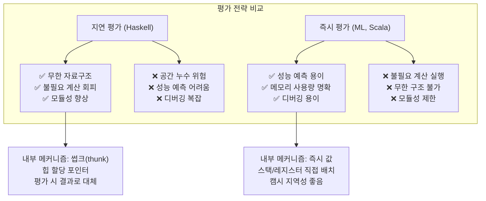

### 리팩토링과 설계 원칙

#### 함수 합성 vs OOP 상속: 재사용성 접근 방식 비교

OOP는 상속을 통해 코드를 재사용하지만, 깊은 계층구조는 "취약한 기반 클래스 문제(Fragile Base Class Problem)"를 일으킨다. 함수형 프로그래밍은 **함수 합성(Function Composition)**으로 재사용성을 달성한다. 작은 함수를 조합하여 복잡한 동작을 구성하며, 각 함수는 독립적으로 테스트/이해/교체 가능하다.

리팩토링 전략:
- **상속 → 합성**: `class B extends A` → `const b = compose(a, extraLogic)`
- **템플릿 메서드 → 고차 함수**: `abstract method` → `f: (A) => B` 파라미터
- **상태 관리 → 불변 변환**: `this.state = newState` → `newState = f(oldState)`

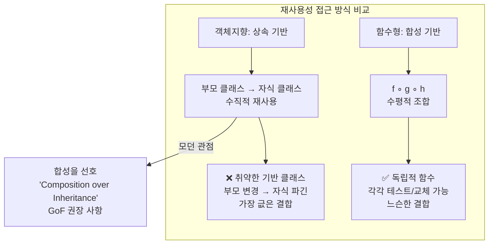

### 디자인 패턴 적용

#### 모나드 패턴의 실전 적용: Railway Oriented Programming

모나드의 가장 실용적인 디자인 패턴은 **Railway Oriented Programming(ROP)**이다. Either 모나드를 사용하여 성공 경로와 실패 경로를 타입 안전하게 분리한다. 각 단계는 `Success` 또는 `Failure`를 반환하며, 실패 시 이후 단계를 자동 건너뛴다.

이 패턴은 예외 처리의 대안으로:
- **명시적 오류 전파**: try-catch 없이 타입으로 오류 추적
- **합성 가능성**: 여러 단계를 `flatMap`/`>>=`로 자연스럽게 연결
- **테스트 용이성**: 각 단계 독립 테스트, 전체 파이프라인 통합 테스트

```mermaid
flowchart LR
    subgraph "Railway Oriented Programming"
        Input["입력 데이터"] --> Validate

        Validate["검증\nvalidate()"] -->|"✅ Success"| Transform["변환\ntransform()"]
        Validate -->|"❌ Failure"| ErrTrack1["실패 트랙"]

        Transform -->|"✅ Success"| Save["저장\nsave()"]
        Transform -->|"❌ Failure"| ErrTrack2["실패 트랙"]

        Save -->|"✅ Success"| Notify["알림\nnotify()"]
        Save -->|"❌ Failure"| ErrTrack3["실패 트랙"]

        Notify -->|"✅ Success"| Output["최종 결과"]
        Notify -->|"❌ Failure"| ErrTrack4["실패 트랙"]

        ErrTrack1 --> FinalErr["오류 처리"]
        ErrTrack2 --> FinalErr
        ErrTrack3 --> FinalErr
        ErrTrack4 --> FinalErr
    end
```

**설계 원칙 정리**: 함수형 프로그래밍의 설계적 고민은 결국 "복잡도를 어디에 둘 것인가"에 대한 반복적 의사결정이다. 타입 시스템에 놓으면 컴파일러가 검증하지만 학습 비용이 늘고, 런타임에 놓으면 유연하지만 오류 발견이 늦어진다. 도메인의 복잡도와 안전성 요구에 따라 적절한 지점을 선택하는 것이 성숙한 함수형 설계의 핵심이다.

## 연습 문제

### 1. 시스템 구조와 모델링

**문제 1-1. 모나드 체이닝의 내부 실행 메커니즘**

웹 애플리케이션에서 사용자 프로필을 조회하는 다음 Haskell 코드가 있다. 각 단계에서 `Nothing`이 반환될 수 있다.

```haskell
getUserProfile :: UserId -> Maybe Profile
getUserProfile uid = do
  user    <- findUser uid          -- Maybe User
  email   <- getEmail user         -- Maybe Email
  prefs   <- getPreferences email  -- Maybe Preferences
  return (Profile user email prefs)
```

(1) `do` 표기법(do-notation)은 내부적으로 `>>=` (bind) 연산으로 변환(desugar)된다. 위 코드가 변환된 `>>=` 체인을 명시적으로 작성하고, `findUser`가 `Nothing`을 반환했을 때 나머지 연산이 실행되지 않는 메커니즘을 설명하라.  
(2) 같은 패턴을 Scala의 `Option`과 `flatMap`으로 구현하라. `for` comprehension과 `flatMap` 체인의 관계를 설명하라.  
(3) JavaScript/TypeScript에서 `Maybe` 모나드가 없을 때 같은 패턴을 `?.` (optional chaining)과 `??` (nullish coalescing)으로 구현할 수 있는가? 모나드 체이닝과의 표현력 차이는 무엇인가?

<details><summary>힌트 보기</summary>

`Maybe`의 `>>=`는 `Nothing >>= f = Nothing`, `Just x >>= f = f x`로 정의된다. `findUser`가 `Nothing`이면 즉시 `Nothing`이 전파되어 이후 `getEmail`, `getPreferences`는 호출되지 않는다. Scala의 `for` comprehension은 `flatMap`/`map` 체인으로 변환된다. `?.`는 프로퍼티 접근에는 유용하지만, 임의의 함수 합성이나 에러 정보 전달(Either 모나드)을 표현하기 어렵다.

</details>

**문제 1-2. 순수 함수 + 불변 데이터와 React 재렌더링 최적화**

React 애플리케이션에서 대규모 상태 트리를 관리하고 있다. 상태 업데이트 시 spread 연산자로 새 객체를 생성하고, `React.memo`로 불필요한 재렌더링을 방지하려 한다.

```jsx
const newState = {
  ...state,
  user: { ...state.user, name: 'Alice' }
};
```

(1) 불변 업데이트(spread/`Object.assign`)가 React의 `shouldComponentUpdate`(또는 `React.memo`)에서 "얕은 비교(shallow comparison)"를 가능하게 하는 원리를 설명하라. 참조(reference) 동일성이 왜 중요한가?  
(2) 상태 트리가 깊어질수록(5단계 이상 중첩) 불변 업데이트 코드가 복잡해지는 문제를 Immer 라이브러리의 "프록시(Proxy) 기반 가상 뮤테이션"이 어떻게 해결하는지 설명하라. 함수형 관점에서 Immer의 `produce`는 어떤 역할을 하는가?  
(3) 불변 데이터 구조를 사용하면 "이전 상태로의 되돌리기(undo)"와 "시간 여행 디버깅(time-travel debugging)"이 쉬워지는 이유를 구조적 공유(structural sharing)와 연결하여 설명하라.

<details><summary>힌트 보기</summary>

불변 업데이트는 변경된 부분만 새 참조를 생성하고, 변경되지 않은 부분은 기존 참조를 유지한다. `React.memo`는 `===`로 props를 비교하므로, 참조가 같으면 재렌더링을 스킵한다. Immer의 `produce`는 내부적으로 Proxy를 사용하여 뮤테이션처럼 보이는 코드를 실행하되, 실제로는 불변 업데이트된 새 객체를 반환한다. 구조적 공유 덕분에 각 상태 스냅샷은 변경되지 않은 부분을 공유하여 메모리 효율적이다.

</details>

**문제 1-3. 대수적 효과(Algebraic Effects)의 구조적 이해**

Haskell의 `IO` 모나드나 Scala의 ZIO에서는 부수 효과(side effect)를 타입 레벨에서 추적한다. 최근에는 대수적 효과(Algebraic Effects)라는 개념이 OCaml 5.0, Unison 등에서 도입되고 있다.

(1) 전통적인 모나드 기반 효과 처리에서 "모나드 트랜스포머 스택(Monad Transformer Stack)"이 깊어질 때 발생하는 합성 문제를 구체적인 예시로 설명하라.  
(2) 대수적 효과가 이 합성 문제를 어떻게 해결하는가? "효과를 정의하는 코드"와 "효과를 핸들링하는 코드"의 분리가 주는 이점을 설명하라.  
(3) React의 Suspense와 대수적 효과의 관계를 논하라. Dan Abramov가 "React는 일종의 대수적 효과 시스템"이라고 설명한 맥락은 무엇인가?

<details><summary>힌트 보기</summary>

모나드 트랜스포머를 쌓으면 `StateT (ReaderT (ExceptT IO))`처럼 복잡해지고, 중간에 새로운 효과를 추가하면 전체 스택을 재구성해야 한다. 대수적 효과에서는 함수가 "이런 효과가 필요하다"고 선언만 하고, 호출자가 핸들러를 제공한다 (의존성 주입과 유사). React Suspense에서 컴포넌트가 `throw promise`하면 상위의 `Suspense` 경계가 이를 "핸들링"하는 구조가 대수적 효과의 throw/handle 패턴과 유사하다.

</details>

### 2. 트레이드오프와 의사결정

**문제 2-1. 지연 평가(Lazy Evaluation)의 양날의 검**

Haskell에서 다음 코드는 무한 리스트를 사용하지만 정상적으로 동작한다.

```haskell
take 10 (filter even [1..])  -- [2,4,6,8,10,12,14,16,18,20]
```

그러나 다음 코드는 예상치 못한 메모리 문제를 일으킨다.

```haskell
foldl (+) 0 [1..1000000]  -- 스택 오버플로우 가능
```

(1) 첫 번째 코드가 무한 리스트를 처리할 수 있는 이유를 지연 평가의 "필요할 때만 계산" 원리로 설명하라. 이를 가능하게 하는 thunk의 개념은 무엇인가?  
(2) `foldl`에서 thunk가 누적되어 메모리 문제를 일으키는 과정을 단계별로 보이고, `foldl'` (strict fold)가 이 문제를 해결하는 방식을 설명하라.  
(3) 지연 평가가 디버깅을 어렵게 만드는 이유를 "실행 순서의 비예측성"과 "space leak"의 관점에서 논하라. 이것이 Scala가 기본적으로 엄격 평가(strict evaluation)를 선택한 이유와 어떤 관련이 있는가?

<details><summary>힌트 보기</summary>

지연 평가에서 `[1..]`는 thunk(미평가 계산)의 연쇄로 존재하며, `take 10`이 요구하는 만큼만 평가된다. `foldl (+) 0 [1..n]`는 `(((...(0+1)+2)+3)...)`라는 거대한 thunk 트리를 먼저 만든 뒤 마지막에 평가하므로 O(n) 공간이 필요하다. `foldl'`는 각 단계에서 `seq`로 중간 결과를 강제 평가한다. 디버거에서 중단점을 설정해도 thunk가 언제 평가될지 예측하기 어려워 실행 흐름 추적이 힘들다.

</details>

**문제 2-2. 불변 데이터 구조의 은행 계좌 잔액 업데이트**

동시 사용자 10만 명이 접속하는 은행 시스템에서 계좌 잔액을 업데이트해야 한다. 함수형 프로그래밍 팀은 "불변 데이터 구조 + 이벤트 소싱"을 제안하고, 기존 팀은 "가변 데이터 + 락(lock)"을 주장한다.

(1) 불변 데이터로 잔액 업데이트를 처리한다는 것은 구체적으로 어떤 의미인가? 잔액이 "변경"되는 것이 아니라 "새 상태가 생성"되는 과정을 설명하라.  
(2) 10만 명이 동시에 같은 계좌에 입금할 때, 불변 데이터 기반 시스템에서 정합성(consistency)을 어떻게 보장하는가? Compare-and-Swap(CAS) 또는 STM(Software Transactional Memory)과의 관계를 논하라.  
(3) 불변 데이터 구조의 "구조적 공유"가 매 업데이트마다 전체 복사를 피하는 방법을 트라이(trie) 기반 영속 자료구조로 설명하라. 이 방식의 성능 특성(시간/공간 복잡도)은 가변 배열 대비 어떠한가?

<details><summary>힌트 보기</summary>

불변 업데이트는 기존 잔액 `balance_v1 = 1000`에서 새 상태 `balance_v2 = 1100`을 생성하며, `balance_v1`은 그대로 유지된다(이벤트 소싱의 기반). 동시 접근 시 CAS 연산으로 원자적 상태 전이를 보장하거나, STM으로 트랜잭셔널 메모리를 사용한다. Clojure의 영속 벡터는 32-way trie로 구현되어 업데이트 시 변경된 경로만 새로 생성하므로 O(log32 n) 시간/공간이 소요된다.

</details>

**문제 2-3. 함수형 에러 처리 vs 예외 처리 — 팀 도입 전략**

Java 팀이 Kotlin으로 마이그레이션하면서 `Either<Error, Success>` 패턴과 Arrow 라이브러리 도입을 검토하고 있다. 시니어 개발자 일부는 "try-catch로 충분하다"고 반대한다.

(1) `Either`를 사용한 에러 처리가 try-catch 대비 가지는 이점을 "타입 안전성", "합성 가능성", "명시적 에러 전파" 측면에서 설명하라.  
(2) try-catch의 "보이지 않는 제어 흐름(invisible control flow)" 문제란 무엇인가? 함수 시그니처만으로 실패 가능성을 알 수 없는 것이 왜 대규모 시스템에서 문제가 되는가?  
(3) 팀 전체가 함수형 에러 처리에 익숙하지 않을 때, 점진적 도입 전략을 제안하라. `sealed class`로 에러 타입을 먼저 모델링하고, 기존 try-catch 코드와 공존시키는 방법은?

<details><summary>힌트 보기</summary>

`Either<Error, Success>`는 반환 타입에 실패 가능성을 인코딩하므로 호출자가 반드시 에러를 처리해야 한다. try-catch는 함수 시그니처에 드러나지 않으므로(checked exception 제외) 에러 핸들링을 빼먹기 쉽다. 점진적 도입으로는 새 코드에만 `Either`를 적용하고, 레거시와의 경계에서 `runCatching` 등으로 변환하는 어댑터 패턴을 사용한다.

</details>

### 3. 문제 해결 및 리팩토링

**문제 3-1. 명령형 루프를 트랜스듀서 패턴으로 최적화**

다음 명령형 JavaScript 코드를 함수형으로 리팩토링했지만, 대용량 데이터에서 성능이 3배 느려졌다.

```javascript
// 명령형 (빠름)
const result = [];
for (let i = 0; i < data.length; i++) {
  if (data[i].active) {
    const transformed = data[i].value * 2;
    if (transformed > 100) result.push(transformed);
  }
}

// 함수형 (느림)
const result = data
  .filter(d => d.active)
  .map(d => d.value * 2)
  .filter(v => v > 100);
```

(1) 함수형 버전이 느린 이유를 "중간 배열 생성"과 "다중 순회" 관점에서 설명하라. 100만 개 요소에 대해 메모리 할당이 몇 번 발생하는가?  
(2) 트랜스듀서(Transducer) 패턴이 이 문제를 어떻게 해결하는가? "합성 가능한 리듀서(composable reducer)"의 개념을 설명하고, `filter`와 `map`을 하나의 리듀싱 함수로 합성하는 방법을 보여라.  
(3) Java의 Stream API와 Kotlin의 `Sequence`가 이 문제를 지연 평가로 어떻게 해결하는가? "중간 연산(intermediate operation)"과 "최종 연산(terminal operation)"의 구분이 왜 중요한가?

<details><summary>힌트 보기</summary>

`.filter().map().filter()`는 3번 순회하며 2개의 중간 배열을 생성한다. 트랜스듀서는 변환 함수를 리듀서 레벨에서 합성하여 단일 순회로 모든 변환을 적용한다. `transduce(compose(filter(pred1), map(fn), filter(pred2)), append, [], data)`와 같은 형태. Java Stream의 `.filter().map()`은 중간 연산이 지연되어 `.collect()` 등 최종 연산 시 한 번에 실행된다.

</details>

**문제 3-2. 공유 가변 상태 안티패턴 → STM 리팩토링**

Java로 구현된 재고 관리 시스템에서, 여러 스레드가 동시에 재고를 갱신하면 간헐적으로 데이터 불일치가 발생한다. 기존 팀은 모든 접근에 `synchronized`를 추가하여 해결하려 했으나, 성능이 급격히 저하되었다.

```java
class Inventory {
    private Map<String, Integer> stock = new HashMap<>();
    
    public synchronized void updateStock(String itemId, int delta) {
        stock.put(itemId, stock.getOrDefault(itemId, 0) + delta);
    }
    
    public synchronized int getStock(String itemId) {
        return stock.getOrDefault(itemId, 0);
    }
}
```

(1) "모든 것에 `synchronized`를 붙이면 된다"는 접근이 왜 안티패턴인가? 락 경합(lock contention), 데드락 위험, 합성 불가능성(non-composability) 측면에서 설명하라.  
(2) 공유 변경을 `ConcurrentHashMap`의 원자적 복합 연산 또는 불변 스냅샷 교체로 제한하는 리팩토링 방법을 제시하라. `ConcurrentHashMap.compute()`가 키 단위 원자성을 제공하지만 구현 내부가 보편적으로 lock-free인 것은 아닌 이유를 설명하라.  
(3) Clojure의 STM(Software Transactional Memory)이나 Haskell의 `TVar`를 사용하면 이 문제를 어떻게 해결할 수 있는가? STM의 "낙관적 동시성(optimistic concurrency)"과 락 기반 "비관적 동시성(pessimistic concurrency)"을 비교하라.

<details><summary>힌트 보기</summary>

전체 객체에 대한 synchronized는 읽기-읽기도 직렬화하여 불필요한 경합을 유발한다. `ConcurrentHashMap.compute(key, (k, v) -> v + delta)`는 키 레벨에서 원자적으로 동작한다. STM은 트랜잭션 시작 시 스냅샷을 읽고, 커밋 시 충돌이 없으면 적용하며, 충돌 시 자동 재시도한다. 이는 락 획득 순서를 관리할 필요가 없어 합성이 가능하다.

</details>

**문제 3-3. 콜백 지옥에서 모나딕 합성으로의 리팩토링**

Node.js 코드에서 중첩된 콜백이 5단계 이상 깊어져 가독성과 에러 처리가 심각하게 저하되었다.

```javascript
readFile('config.json', (err, config) => {
  if (err) return handleError(err);
  connectDB(config.db, (err, db) => {
    if (err) return handleError(err);
    db.query('SELECT * FROM users', (err, users) => {
      if (err) return handleError(err);
      sendEmail(users[0].email, (err, result) => {
        if (err) return handleError(err);
        console.log('Done:', result);
      });
    });
  });
});
```

(1) 이 코드의 문제를 "에러 처리 중복", "합성 불가능성", "제어 흐름의 비선형성" 측면에서 분석하라.  
(2) Promise 체이닝으로 리팩토링하고, Promise가 함수형의 어떤 패턴(모나드)과 구조적으로 유사한지 설명하라. `.then()`과 `>>=` (bind)의 대응 관계를 보여라.  
(3) async/await가 do-notation의 역할과 어떻게 유사한지 설명하고, `Result` 모나드를 결합한 `neverthrow` 라이브러리와 같은 접근이 TypeScript에서 어떤 추가적인 안전성을 제공하는지 논하라.

<details><summary>힌트 보기</summary>

콜백은 각 단계가 독립적으로 에러를 처리해야 하고, 중간에 로직을 삽입/제거하기 어렵다. `Promise.then(f)`은 `Maybe.>>=(f)`과 유사하게, 이전 결과가 성공이면 `f`를 적용하고 실패면 전파한다. `async/await`는 Haskell의 do-notation처럼 모나딕 체이닝을 명령형 스타일로 작성하게 해준다. `neverthrow`의 `ResultAsync`는 비동기 + 에러 타입을 합성한 모나드이다.

</details>

### 4. 개념 간의 연결성

**문제 4-1. 함수 합성 + 모나드 + 이펙트 시스템: 테스트 가능한 부수 효과**

Scala ZIO나 Haskell IO Monad로 부수 효과를 타입에 인코딩하면 프로덕션 코드와 테스트 코드에서 다른 "인터프리터"를 사용할 수 있다.

```scala
// ZIO 예시
trait UserRepository {
  def findUser(id: UserId): ZIO[Any, DBError, User]
}

// 프로덕션: 실제 DB 접근
class LiveUserRepository extends UserRepository { ... }
// 테스트: 인메모리 구현
class TestUserRepository extends UserRepository { ... }
```

(1) 부수 효과를 타입에 인코딩한다는 것은 구체적으로 무엇을 의미하는가? `ZIO[R, E, A]`의 세 타입 파라미터(환경, 에러, 성공값)가 각각 어떤 정보를 표현하는가?  
(2) 이 패턴이 테스트에서 어떤 이점을 제공하는가? Mock 프레임워크(Mockito 등)를 사용하는 것과 비교하여 "환경 타입(R)"으로 의존성을 관리하는 방식의 장점을 설명하라.  
(3) 이 패턴을 TypeScript에서 구현한다면 어떤 형태가 되는가? `fp-ts`의 `ReaderTaskEither`와 ZIO의 대응 관계를 설명하라.

<details><summary>힌트 보기</summary>

`ZIO[R, E, A]`는 "환경 R을 필요로 하고, E로 실패하거나 A로 성공하는 계산"을 표현한다. 테스트에서 R의 테스트 구현을 제공하면 외부 시스템 없이 비즈니스 규칙을 검사할 수 있다. 환경 타입은 선언된 의존성의 제공 여부를 컴파일 시점에 확인하는 데 도움을 준다. `ReaderTaskEither<R, E, A>`도 환경·실패·성공 채널을 나타내는 구조적 유사성이 있지만 취소, 자원 안전성, 동시성, 런타임 의미까지 동일하다고 보지는 않는다.

</details>

**문제 4-2. 커링 + 부분 적용 + Redux 미들웨어 체인**

Redux의 `applyMiddleware` 함수가 미들웨어를 합성하는 과정을 분석하라.

```javascript
// 미들웨어 시그니처
const logger = store => next => action => {
  console.log('dispatching', action);
  const result = next(action);
  console.log('next state', store.getState());
  return result;
};
```

(1) 미들웨어의 3중 화살표 함수 `store => next => action => { ... }`는 커링의 어떤 특성을 활용하는가? 각 인자가 언제, 어디서 전달되는지 `applyMiddleware`의 실행 과정과 함께 설명하라.  
(2) `applyMiddleware(logger, thunk, analytics)`에서 세 미들웨어가 `compose` 함수로 합성되는 과정을 단계별로 추적하라. 함수 합성의 방향(`compose`의 오른쪽에서 왼쪽 실행)이 미들웨어 실행 순서와 어떻게 연결되는가?  
(3) 이 패턴이 Express.js의 미들웨어 체인, Koa의 양파 모델(onion model)과 구조적으로 어떻게 다른가? 커링 기반 합성의 장점과 한계를 논하라.

<details><summary>힌트 보기</summary>

`store`는 `applyMiddleware`가 스토어 생성 시 한 번 전달하고, `next`는 체인의 다음 미들웨어(또는 원본 `dispatch`)이며, `action`은 실제 디스패치 시 전달된다. `compose(f, g, h)(x)`는 `f(g(h(x)))`이므로, 미들웨어 체인은 바깥→안쪽→다시 바깥 순서로 실행된다. Express는 `next()` 콜백으로 제어를 전달하고, Koa는 `async` 기반으로 자연스러운 양파 구조를 형성한다.

</details>

**문제 4-3. 렌즈(Lens) + 불변 데이터 + 상태 관리**

함수형 프로그래밍에서 렌즈(Lens)는 중첩된 불변 데이터 구조의 특정 부분에 접근하고 업데이트하는 "함수형 게터/세터"이다.

```typescript
// 예: 깊이 중첩된 상태
type AppState = {
  user: {
    profile: {
      address: {
        city: string;
      };
    };
  };
};
```

(1) 이 구조에서 `city`를 업데이트하려면 spread 연산자로 4단계를 풀어야 한다. Lens를 사용하면 이 문제가 어떻게 해결되는가? `view`, `set`, `over` 연산의 역할을 설명하라.  
(2) Lens의 합성(composition)이 어떻게 동작하는가? `userLens.profile.address.city`와 같은 합성이 내부적으로 어떤 함수 합성을 수행하는지 설명하라.  
(3) Lens 패턴과 Immer의 `produce`, MobX의 `observable`이 같은 문제를 다른 방식으로 해결하는 것임을 비교 분석하라. 각각의 트레이드오프는 무엇인가?

<details><summary>힌트 보기</summary>

Lens는 `get: S → A`와 `set: (S, A) → S` 함수의 쌍으로, `view`는 값을 읽고, `set`은 불변 업데이트를 수행하며, `over`는 함수를 적용한 결과로 업데이트한다. 두 Lens를 합성하면 getter와 setter가 연쇄적으로 합성된다. Immer는 Proxy로 뮤테이션을 감지하여 자동 불변 업데이트를, MobX는 Observable로 변경을 추적하여 반응형 업데이트를 제공한다. Lens는 가장 순수하지만 학습 곡선이 높다.

</details>
