# Java 내부: JVM 실행 모델과 성능 경계

> 다음에서 합성됨: Bloch *Effective Java* 3판, Oaks & Wong *Java Performance* 2판, Evans & Verburg *The Well-Grounded Java Developer*, Goetz *Java Concurrency in Practice* 및 comp(21/207-212/215-223/241/305/311/326/346/455/457) 자바 참조.

## 적용 범위와 증거

- Java 언어·JVM 명세의 보장과 HotSpot/OpenJDK의 구현을 구분한다. 클래스 로더, JIT, GC, 객체 배치는 JDK 배포판과 버전에 따라 달라진다.
- 아래 시간·메모리 수치는 설명용 예시다. JDK 버전, GC, 힙, 워밍업, CPU와 OS를 고정한 JMH 또는 운영 프로파일 없이는 현재 시스템의 수치로 사용하지 않는다.
- GC 선택과 플래그는 시작 가설이다. 목표 처리량, p99 지연, 최대 RSS, 할당률을 정한 뒤 GC 로그와 JFR로 성공 여부를 판정한다.
- 동시성의 완료 증거는 "동작해 보임"이 아니라 happens-before 관계, 데이터 레이스 부재, 취소·종료 경로와 부하 조건에서의 관찰 결과다.

---

## 1. JVM 아키텍처 — 실행을 위한 클래스 로딩

### JVM 런타임 영역

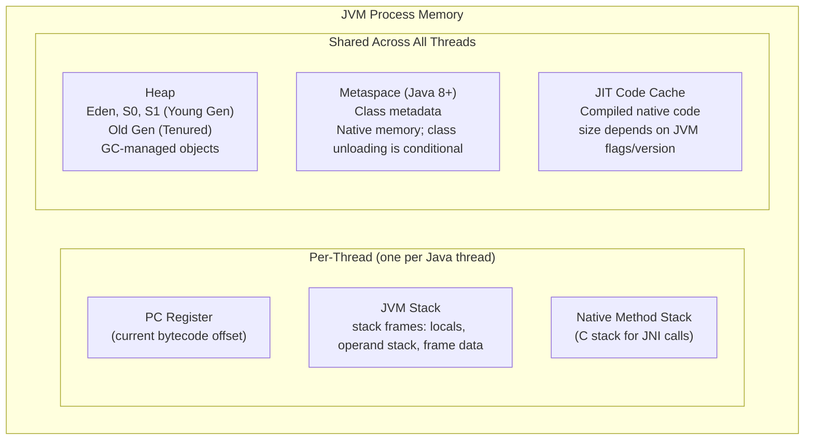

### 클래스 로딩 라이프사이클

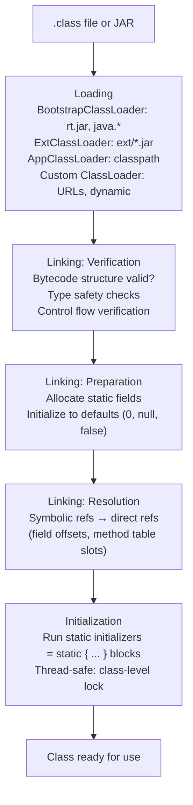

**상위 위임 모델**: ClassLoader는 자신의 경로를 검색하기 전에 먼저 상위에 묻습니다. 클래스 대체 공격을 방지합니다(`java.lang.String`을 섀도우할 수 없음). 의도적으로 중단될 수 있습니다(예: OSGi, Tomcat의 WebAppClassLoader는 웹앱 클래스를 먼저 로드합니다).

---

## 2. JVM 스택 프레임 레이아웃

```
Stack Frame for method: int compute(int x, int y)
+---------------------------+
| Local Variable Array      |
|  [0] = this (instance)    |  (only for instance methods)
|  [1] = x (int arg)        |
|  [2] = y (int arg)        |
|  [3] = temp local int     |
+---------------------------+
| Operand Stack             |  LIFO, max depth from .class Code attr
|  (grows as opcodes push)  |
+---------------------------+
| Frame Data                |
|  constant_pool ref        |  → runtime constant pool of class
|  method return address    |  → caller's PC after return
|  exception table ptr      |  → [start_pc, end_pc, handler_pc, catch_type]
+---------------------------+
```

---

## 3. JIT 컴파일 — 계층형 컴파일

### 실행 계층(Java 8+ HotSpot)

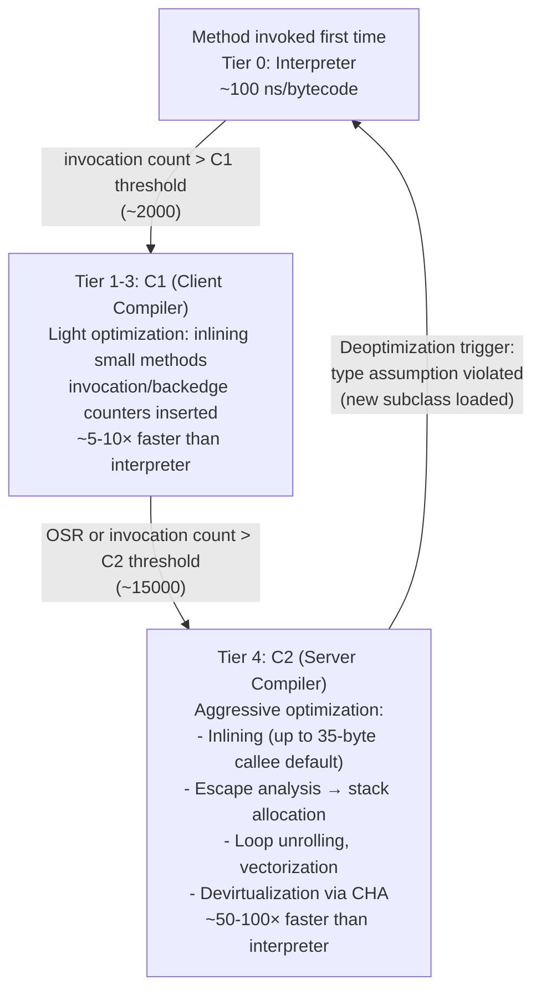

### 이스케이프 분석 - 힙 할당 제거

```java
// This code:
void process() {
    Point p = new Point(1, 2);   // escapes? NO — only used locally
    int sum = p.x + p.y;
    return sum;
}

// After escape analysis + scalar replacement:
void process() {
    int p_x = 1;   // Point fields promoted to stack scalars
    int p_y = 2;   // No heap allocation!
    int sum = p_x + p_y;
    return sum;
}
```

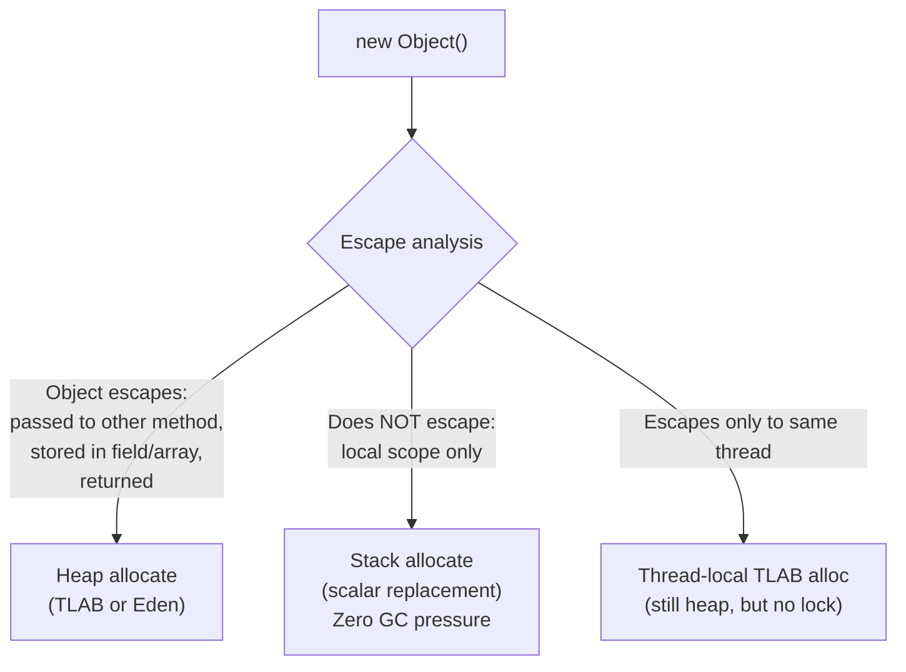

---

## 4. 가비지 컬렉션 — 세대별 GC

### 세대를 통한 객체 수명주기

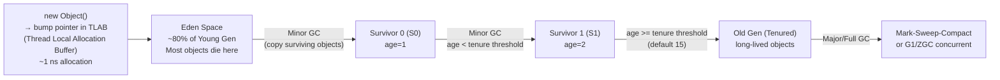

### TLAB — 스레드-로컬 할당 버퍼

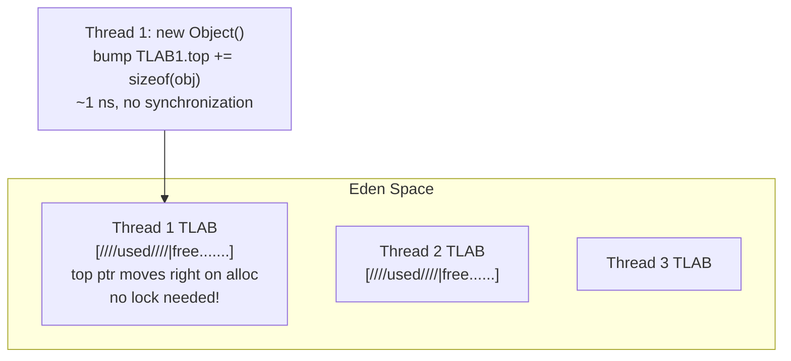

TLAB가 채워지는 경우: 스레드는 Eden.top의 CAS를 통해 Eden에서 새 TLAB를 요청합니다. 마이너 GC는 전체 Eden+Survivor를 매우 빠르게 회수합니다(라이브 객체만 복사되고, 죽은 객체는 버려짐).

### G1 GC 아키텍처

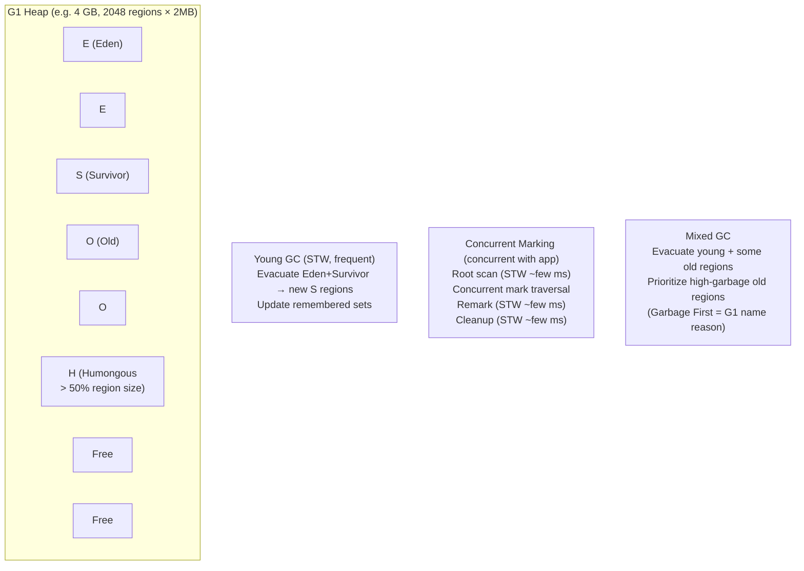

**기억 세트(RSet)**: 각 지역은 다른 지역이 해당 지역에 대한 참조를 보유하고 있는지 추적합니다. Young GC 동안 전체 힙 스캔을 피합니다. Old→young 포인터를 찾기 위해 Young 영역의 RSet만 스캔합니다.

---

## 5. JMM(Java 메모리 모델) — 발생 전

### JMM 규칙

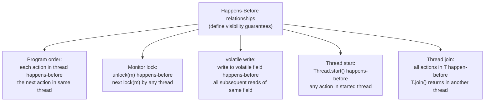

### 휘발성 — 하드웨어의 역할

```java
// Writer thread:
volatile int flag = 0;
data = 42;           // regular store — may buffer in store buffer
flag = 1;            // volatile store → StoreStore + StoreLoad fence on x86
                     // = MFENCE instruction (ensures store buffer flushed)

// Reader thread:
while(flag == 0) {}  // volatile load → LoadLoad + LoadStore fence
int x = data;        // guaranteed to see 42
```

Java `volatile`의 acquire/release 및 동기화 순서를 어떤 명령으로 구현하는지는 ISA, JDK와 연산 문맥에 따라 달라진다. x86에서는 volatile load가 일반 load와 유사할 수 있지만 store와 StoreLoad 순서에는 별도 직렬화가 필요할 수 있다. ARM도 전용 acquire/release 명령 또는 선택적 배리어를 사용할 수 있으므로 고정된 명령 하나로 일반화하지 않는다.

---

## 6. Java 스레드 및 모니터 내부

### 객체 헤더 및 잠금 상태

```
Object header (64-bit JVM, without compressed oops):
+--[mark word: 8 bytes]--+--[klass pointer: 8 bytes (4 with CompressedOops)]--+

Mark word states:
Unlocked:     [hash:31 | 0 | age:4 | 0 | 01]
Biased:       [thread_id:54 | epoch:2 | age:4 | 1 | 01]
Lightweight:  [stack_lock_ptr:62 | 00]
Heavyweight:  [monitor_ptr:62 | 10]
GC mark:      [...              | 11]
```

### 에스컬레이션 경로 잠금

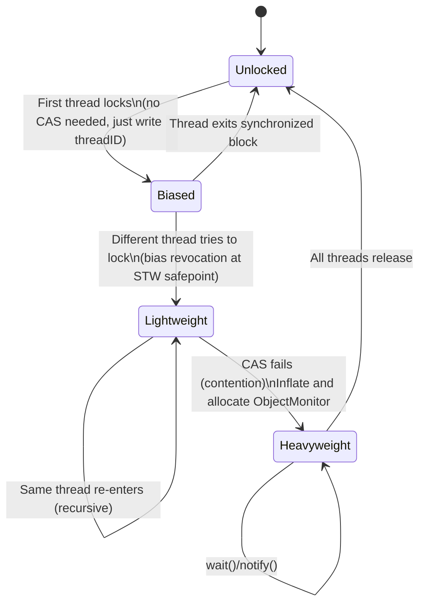

**ObjectMonitor**(헤비급):
```c
class ObjectMonitor {
    void*   _owner;          // owning thread
    jint    _count;          // recursive lock depth
    jint    _waiters;        // threads in wait()
    ObjectWaiter* _WaitSet;  // circular list of waiting threads
    ObjectWaiter* _EntryList; // threads waiting to acquire lock
};
```

`wait()`: 잠금을 해제하고 스레드를 `_WaitSet`로 이동하고 스레드를 주차합니다(OS 수준 `pthread_cond_wait`). `notify()`: 하나의 스레드를 `_WaitSet`에서 `_EntryList`로 이동합니다. `notifyAll()`: 모두 이동합니다.

---

## 7. Java 컬렉션 - 내부 데이터 구조

### HashMap 내부(Java 8+)

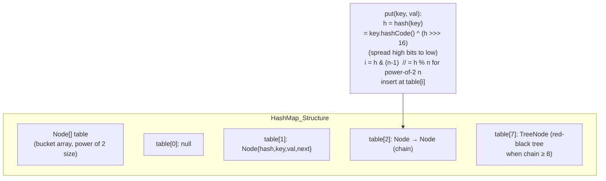

**트리화**: 특정 OpenJDK `HashMap` 구현은 버킷 길이와 테이블 크기 임곗값을 사용해 트리 노드로 전환한다. `8`, `64`, `6`은 Java API 계약이 아니라 구현 상수이므로 사용 중인 JDK 소스로 확인한다. 트리화 이후 비용도 키 비교 가능성, 해시 분포와 충돌 형태에 따라 달라진다.

**부하 계수 0.75**: 크기 조정 임계값 = 용량 × 0.75. 메모리와 충돌 확률의 균형을 맞춥니다. 0.75 로드에서 균일한 해시 분포 하에서 예상되는 체인 길이는 0-1입니다.

### ConcurrentHashMap(자바 8)

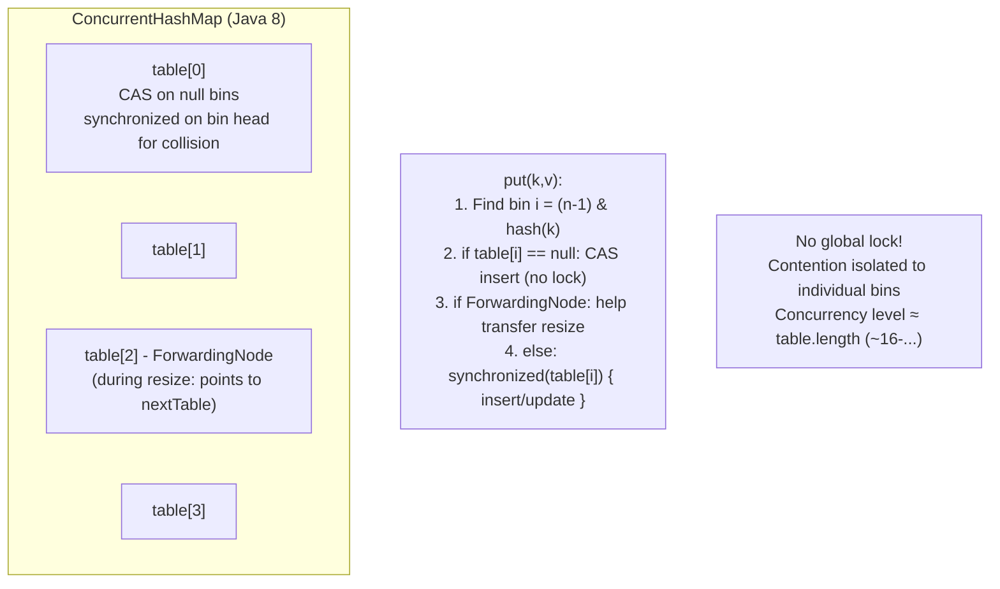

`size()`은 대략적인 개수를 반환합니다. 정확한 개수는 `CounterCell[]`(LongAdder와 같은 스트라이프 카운터)을 사용하여 동시 증가 중에 단일 카운터에 대한 경합을 방지합니다.

---

## 8. Java 직렬화 및 반사 내부

### 리플렉션 메서드 호출 경로

```java
Method m = Foo.class.getDeclaredMethod("bar", int.class);
m.invoke(fooInstance, 42);
```

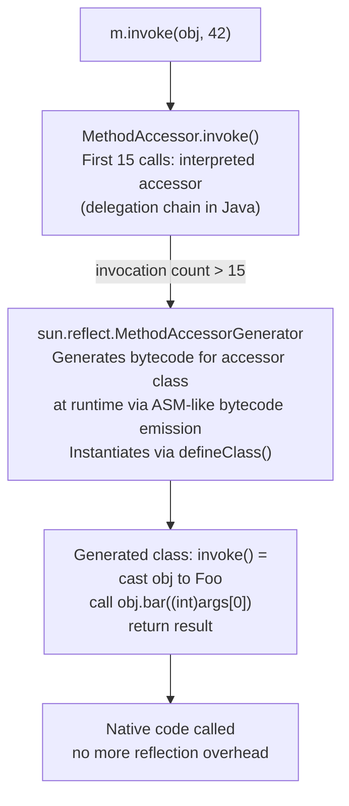

리플렉션 호출 경로와 최적화는 JDK 버전에 따라 바뀌었다. "처음 15회 후 접근자 생성"과 고정 나노초 수치는 특정 과거 구현의 관찰값일 수 있으므로 현재 JDK의 구현 계약으로 사용하지 않는다. `MethodHandle`과 리플렉션은 실제 호출 형태, 접근 검사, 워밍업을 고정한 JMH 결과와 생성 코드로 비교한다.

---

## 9. JVM Safepoint 및 Stop-The-World

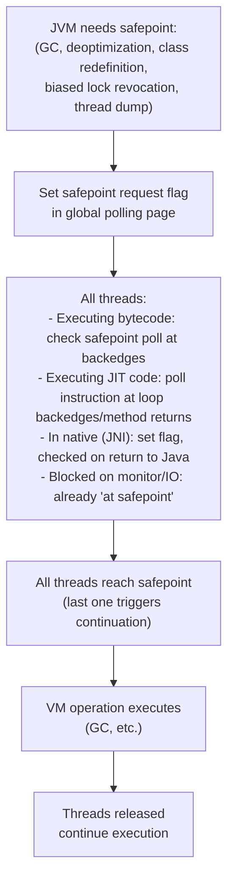

**Time-to-safepoint(TTSP)**: 모든 스레드가 안전 지점에 도달하는 데 걸리는 시간입니다. 장기 실행 JNI 코드, safepoint 폴링이 없는 긴밀한 루프(JDK 10 루프 스트립 마이닝 이전) 또는 TLAB의 대규모 객체 할당은 TTSP를 확장할 수 있습니다. 증상: `Application time: 0.0`에 이어 대규모 GC 일시중지가 발생합니다.

---

## 10. Java NIO 및 Direct ByteBuffer

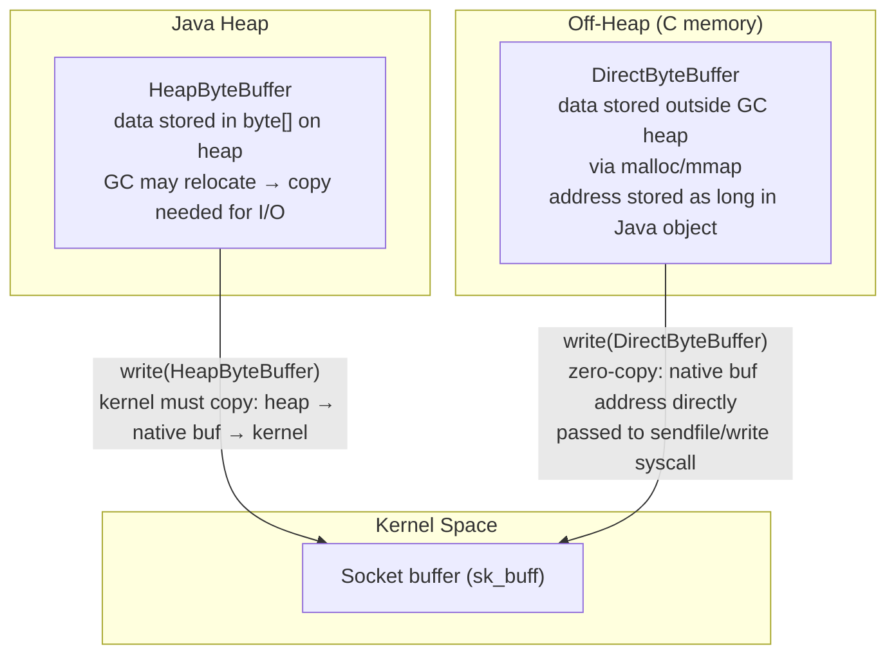

C의 `ByteBuffer.allocateDirect(n)` → `Unsafe.allocateMemory(n)` → `malloc(n)`. 주소는 `DirectByteBuffer`에 `long address`로 저장됩니다. GC는 이를 재배치할 수 없습니다(힙 외부). `DirectByteBuffer` GC'd → `Cleaner`(PhantomReference) 콜백이 `free()`을 호출하면 해제됩니다.

**메모리 매핑된 파일** (`FileChannel.map()`): `mmap()` syscall → JVM 프로세스 주소 공간에 직접 매핑된 페이지 → OS 페이지 캐시에 액세스하는 DirectByteBuffer를 통한 제로 복사 읽기/쓰기.

---

## 11. 문자열 인터닝과 압축 문자열

### 문자열 표현(Java 9+ 컴팩트 문자열)

```java
// Java 9+: String uses byte[] + coder field
class String {
    byte[] value;     // LATIN1: 1 byte/char; UTF16: 2 bytes/char
    byte coder;       // 0=LATIN1, 1=UTF16
    int hash;         // cached hashCode (0 = not computed)
}
// "hello" → value=[104,101,108,108,111], coder=0 (LATIN1)
// "日本語" → value=[...UTF16 bytes...], coder=1
```

**문자열 풀**(인턴 문자열): 메타스페이스의 해시 테이블(Java 7+: 힙). `String.intern()`은 풀에 문자열을 추가합니다. 문자열 리터럴은 클래스 로드 시 자동으로 인턴됩니다.

```mermaid
flowchart LR
    A["String literal \"hello\"\nin bytecode (ldc opcode)"] --> B["JVM string pool lookup\n(hash → bucket → compare)"]
    B -->|"found"| C["Return existing interned\nString object reference"]
    B -->|"not found"| D["Add to pool\nReturn new String reference"]
```

---

## 12. JVM 시작 및 ClassData 공유(CDS)

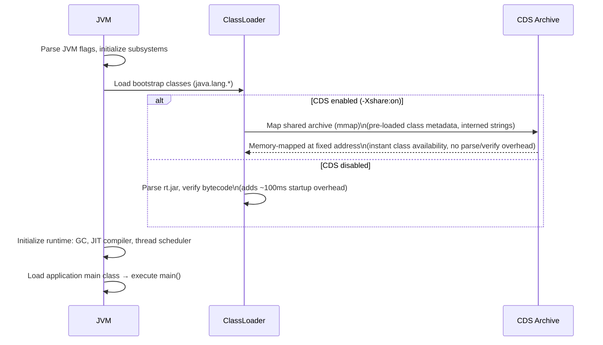

**AppCDS(애플리케이션 클래스-데이터 공유)**는 애플리케이션 클래스 메타데이터 일부를 공유 아카이브에서 재사용할 수 있게 한다. 시작 시간과 RSS 개선 폭은 클래스 수, 아카이브 생성 방식과 배포 환경에서 측정한다. GraalVM Native Image는 애플리케이션 일부를 사전 컴파일해 전통적인 JVM의 클래스 로딩·JIT 워밍업을 줄이지만 런타임 초기화와 네이티브 이미지 고유 비용까지 제거하지는 않는다.

---

## JVM 성능 수치

| 작업 | 예시 비용 | 측정 전제 |
|-----------|------|-------|
| TLAB 객체 할당 | ~1ns | 범프 포인터, 잠금 없음 |
| Eden 할당(TLAB 없음) | ~10ns | Eden.top의 CAS |
| 마이너 GC(영) | 1~50ms | Young의 살아있는 물체에 비례 |
| G1 혼합 GC 일시중지 | 50-200ms | -XX:MaxGCPauseMillis에 따라 다름 |
| 전체 GC(기존 CMS) | 500ms~30초 | 힙 크기에 비례 |
| ZGC/셰넌도어 일시 중지 | <1~10ms | 동시 마킹 |
| 가상 메소드 호출 | ~5-10ns | vtable 파견 |
| 인터페이스 메소드 호출 | ~10-20ns | itable 검색 |
| 단형 JIT 호출 | ~0-1ns | 인라인 |
| 동기화된 블록(경합 없음) | ~5-20ns | 편향되거나 얇은 잠금 |
| 동기화된 블록(경합) | ~1~10μs | OS 뮤텍스 + 컨텍스트 스위치 |
| Thread.start() | ~50~200μs | OS 스레드 생성 |
| 클래스 로딩(콜드) | ~1~50ms | 구문 분석 + 확인 + 초기화 |
| 반사 호출(처음 15x) | ~500ns | 통역 |
| 반사 호출(워밍업 후) | 구현별 상이 | JDK 버전, 호출 형태와 접근 검사 기록 |

이 표는 서로 다른 환경에서 달라질 수 있는 크기 순서 예시다. 설계 임곗값으로 쓰기 전에 같은 하드웨어와 JDK에서 워밍업·포크·분포를 포함해 다시 측정한다.


---

## 설계적 고민

### 구조와 모델링

#### GC 선택: 워크로드에 따른 가비지 컬렉터 아키텍처 결정

JVM의 가비지 컬렉터 선택은 단순한 설정 변경이 아니라 **시스템 아키텍처 수준의 의사결정**이다. 각 GC는 서로 다른 설계 철학을 반영하며, 애플리케이션의 지연 시간 요구사항, 처리량 목표, 메모리 풋프린트에 따라 최적의 선택이 달라진다.

- **SerialGC**: 단일 스레드로 동작하며, 설계가 가장 단순하다. 임베디드 시스템이나 힙이 수백 MB 이하인 마이크로서비스에 적합하다. Stop-the-World 시간이 길지만 스레드 동기화 오버헤드가 없다.
- **G1GC**: 힙을 리전(region) 단위로 분할하고, 가비지가 많은 리전을 우선 수집한다. 예측 가능한 일시정지 시간(-XX:MaxGCPauseMillis)을 목표로 설계되어, 범용 서버 애플리케이션의 기본 선택지다.
- **ZGC**: 대부분의 작업을 동시 수행해 짧은 일시정지를 목표로 한다. 컬러드 포인터와 배리어의 세부 구현은 JDK 세대에 따라 달라지며, 특정 지연시간 상한은 배포 환경의 SLO와 측정으로 확인한다.
- **Shenandoah**: ZGC와 유사한 저지연 목표를 가지지만, 브룩스 포인터(Brooks pointer) 기반의 다른 구현 방식을 사용한다. OpenJDK에서 개발되어 더 넓은 플랫폼 지원을 제공한다.

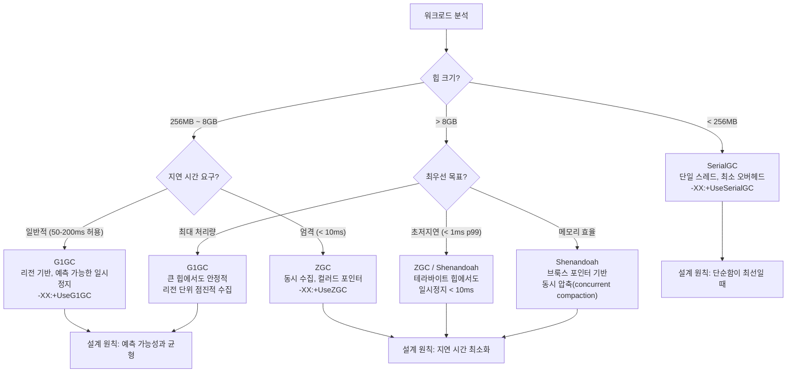

#### JIT 티어링: 빠른 시작과 최고 성능 사이의 균형

JVM의 JIT 컴파일 시스템은 **적응적 최적화(adaptive optimization)** 모델을 채택한다. 인터프리터에서 시작하여 핫스팟을 감지하면 점진적으로 더 공격적인 최적화를 적용한다. 이 설계는 "시작은 빠르게, 실행은 최적화하여"라는 상충하는 목표를 동시에 달성한다.

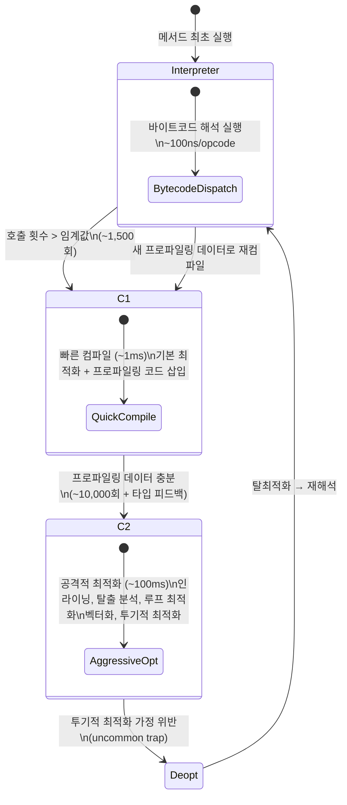

### 트레이드오프와 의사결정

#### Java 메모리 모델(JMM): happens-before 규칙과 동시성 설계

JMM은 멀티스레드 프로그램의 **가시성(visibility)**과 **순서(ordering)** 보장을 정의한다. 설계자가 동시성 코드를 작성할 때 반드시 이해해야 하는 핵심 규칙은 happens-before 관계다. 이 규칙을 위반하면 데이터 레이스가 발생하고, 이는 플랫폼과 JIT 최적화 수준에 따라 비결정적으로 나타나 디버깅이 극도로 어렵다.

**흔한 위반 패턴과 올바른 설계**:

1. **Double-Checked Locking 없는 싱글턴**: `volatile` 없이 인스턴스 필드를 사용하면 부분 초기화된 객체를 다른 스레드가 참조할 수 있다.
2. **비동기 플래그**: `boolean running = true`를 스레드 종료 신호로 사용할 때, `volatile` 선언 없이는 JIT가 루프 불변(loop-invariant)으로 최적화하여 스레드가 영원히 종료되지 않을 수 있다.
3. **ConcurrentHashMap의 복합 연산**: `map.containsKey()` → `map.put()`은 원자적이지 않다. `computeIfAbsent()`를 사용해야 한다.

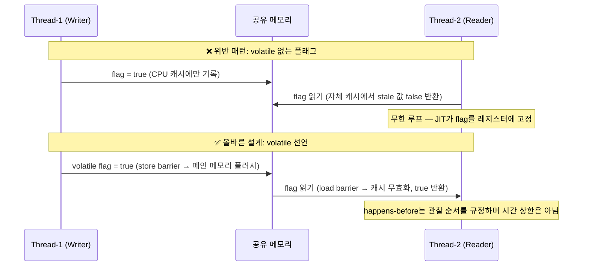

#### 가상 스레드(Project Loom) vs 플랫폼 스레드: I/O 집약 vs CPU 집약

Java 21의 가상 스레드는 JVM이 관리하는 경량 스레드로, OS 스레드와 1:1 매핑되는 플랫폼 스레드와 근본적으로 다른 설계 결정이다. 핵심 트레이드오프는 다음과 같다:

- **I/O 집약적 워크로드**: 가상 스레드가 압도적으로 유리하다. 수백만 개의 동시 연결을 처리할 수 있으며, 블로킹 I/O 호출 시 캐리어 스레드에서 자동으로 언마운트되어 다른 가상 스레드가 실행된다.
- **CPU 집약적 워크로드**: 가상 스레드의 이점이 제한적이다. CPU 코어 수 이상의 스레드를 생성해도 컨텍스트 스위칭만 증가할 뿐 처리량이 향상되지 않는다.
- **주의사항**: `synchronized` 블록 내에서 블로킹 I/O를 수행하면 캐리어 스레드가 고정(pinning)되어 가상 스레드의 장점이 사라진다. `ReentrantLock`으로 대체해야 한다.

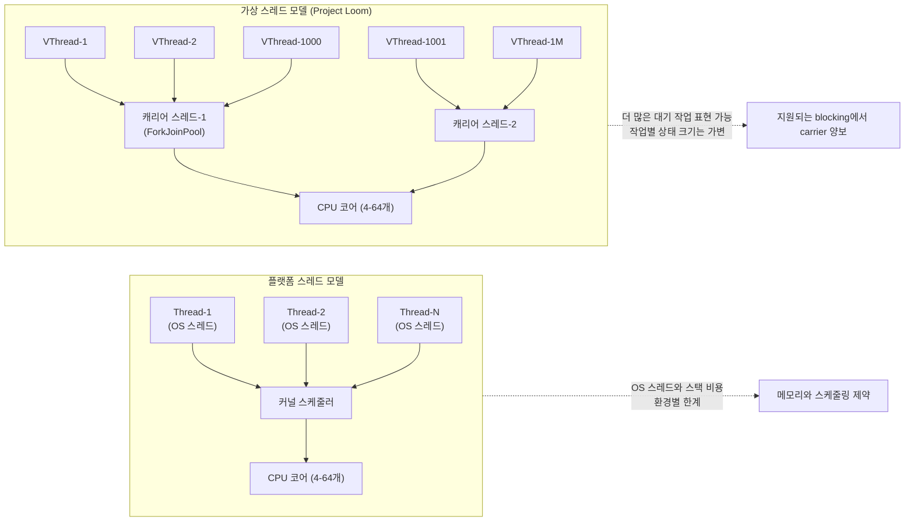

### 리팩토링과 설계 원칙

#### Optional 설계: null 대신 Optional — 의도와 오용 패턴

Java 8에서 도입된 `Optional`은 **값이 없을 수 있음을 타입 시스템으로 명시**하는 설계 도구다. 그러나 잘못된 사용은 오히려 코드 품질을 떨어뜨린다. 설계 원칙은 다음과 같다:

**올바른 사용 원칙**:
1. **반환 타입에만 사용**: 메서드가 값을 반환하지 않을 수 있음을 명시한다.
2. **필드, 파라미터, 컬렉션 원소에 사용 금지**: Optional을 감싸면 불필요한 힙 할당이 발생하고 직렬화 문제가 생긴다.
3. **`Optional.get()` 직접 호출 금지**: `isPresent()` + `get()` 패턴은 null 체크와 다를 바 없다. `orElse()`, `map()`, `flatMap()`을 사용한다.

```mermaid
flowchart TD
    A["메서드 반환값이 null 가능?"] -->|Yes| B{"호출자가 빈 값을\n처리해야 하는가?"}
    A -->|No| C["일반 반환 타입 사용"]
    
    B -->|"명시적 처리 강제"| D["Optional<T> 반환"]
    B -->|"기본값 존재"| E["기본값 직접 반환\n(Optional 불필요)"]
    
    D --> F{"사용 패턴"}
    F -->|"✅ 올바름"| G["map/flatMap/orElse\n함수형 체이닝"]
    F -->|"❌ 안티패턴"| H["isPresent + get\n= null 체크와 동일"]
    F -->|"❌ 안티패턴"| I["Optional을 필드에 저장\n= 불필요한 래핑 + 직렬화 실패"]
    F -->|"❌ 안티패턴"| J["Optional<List<T>>\n= 빈 리스트를 반환하라"]
```

### 디자인 패턴 적용

#### JVM 내부 설계에서 발견되는 패턴들

JVM 자체의 설계에는 다양한 GoF 디자인 패턴이 적용되어 있다. 이를 이해하면 JVM의 내부 동작을 더 깊이 파악할 수 있고, 애플리케이션 설계에도 동일한 원칙을 적용할 수 있다.

- **전략 패턴(Strategy)**: GC 알고리즘 선택. JVM은 동일한 인터페이스(GC 정책) 뒤에 SerialGC, G1GC, ZGC 등 서로 다른 전략을 교체 가능하게 구현한다. `-XX:+UseG1GC` 플래그 하나로 전체 메모리 관리 전략이 교체된다.
- **관찰자 패턴(Observer)**: JMX MBean 알림 시스템. GC 이벤트, 스레드 데드락 감지 등이 발생하면 등록된 리스너에게 통지한다.
- **플라이웨이트 패턴(Flyweight)**: String Pool과 Integer Cache(-128~127). 동일한 값의 객체를 공유하여 메모리를 절약한다.
- **템플릿 메서드 패턴(Template Method)**: ClassLoader의 `loadClass()` 메서드. 클래스 로딩의 전체 흐름(위임 → 찾기 → 정의)은 고정되어 있고, `findClass()`만 하위 클래스에서 오버라이드한다.
- **프록시 패턴(Proxy)**: 동적 프록시(`java.lang.reflect.Proxy`)와 JIT 디옵티마이제이션 스텁. 실제 메서드 호출을 가로채어 추가 동작(프로파일링, 접근 제어)을 삽입한다.

```mermaid
classDiagram
    class GCPolicy {
        <<interface>>
        +collect(region) void
        +shouldCollect() boolean
        +getMaxPauseMillis() long
    }
    
    class SerialGC {
        +collect(region) void
        -markSweepCompact()
    }
    
    class G1GC {
        +collect(region) void
        -mixedCollection()
        -youngCollection()
        -predictPauseTime() long
    }
    
    class ZGC {
        +collect(region) void
        -concurrentMark()
        -concurrentRelocate()
        -loadBarrier() Reference
    }
    
    class JVM_Runtime {
        -gcPolicy: GCPolicy
        +setGCPolicy(policy: GCPolicy)
        +allocate(size: long) Object
        +triggerGC() void
    }
    
    GCPolicy <|.. SerialGC
    GCPolicy <|.. G1GC
    GCPolicy <|.. ZGC
    JVM_Runtime --> GCPolicy: strategy 패턴\n런타임에 교체 가능

## 연습 문제

### 1. 시스템 구조와 모델링

**문제 1-1.** 당신은 Spring Boot 애플리케이션의 시작 시간이 예상보다 오래 걸리는 상황을 디버깅하고 있다. `.class` 파일이 클래스 로더에 의해 로딩된 후, 바이트코드 검증기를 거쳐, JIT 컴파일러(C1 → C2)에 의해 네이티브 코드로 변환되는 전체 과정을 설명하라. 특히 애플리케이션 시작 직후에는 C1 컴파일러가 주로 동작하고, 충분한 프로파일링 데이터가 쌓인 후에야 C2가 개입하는 이유는 무엇인가?

<details><summary>힌트 보기</summary>

C1은 빠른 컴파일 속도를 우선시하고, C2는 최적화 품질을 우선시한다. JVM은 **계층형 컴파일(Tiered Compilation)** 전략을 사용하여 인터프리터 → C1(레벨 1~3) → C2(레벨 4)로 점진적으로 전환한다. C2가 효과적으로 최적화하려면 메서드 호출 빈도, 분기 확률 등 프로파일링 데이터가 필요하므로, 시작 직후에는 C1이 "워밍업" 역할을 담당한다. `-XX:+PrintCompilation` 플래그로 컴파일 로그를 확인할 수 있다.

</details>

**문제 1-2.** G1GC를 사용하는 서비스에서 힙 크기를 8GB로 설정하고, `-XX:MaxGCPauseMillis=200`을 지정했다. 운영 중 Humongous Object(리전 크기의 50% 이상인 객체)가 빈번하게 할당되면서, Young GC → Mixed GC → Full GC로 전환되는 빈도가 급격히 증가했다. G1GC의 리전 기반 메모리 구조에서 Humongous Object 할당이 GC 성능에 어떤 영향을 미치며, `MaxGCPauseMillis` 설정과 어떻게 상충하는가?

<details><summary>힌트 보기</summary>

Humongous Object는 연속된 여러 리전을 점유하므로 힙 단편화를 유발한다. G1GC는 예측 모델에 기반하여 목표 정지 시간을 맞추려 하지만, Humongous 할당이 많으면 Old 리전이 빠르게 차서 Mixed GC 빈도가 증가한다. `-XX:G1HeapRegionSize`를 늘려 Humongous 임계값을 높이거나, 객체 풀링으로 대형 객체 할당을 줄이는 전략을 고려해야 한다. Full GC는 G1GC에서 최후의 수단이며, 발생 시 STW(Stop-The-World) 시간이 급증한다.

</details>

**문제 1-3.** JVM의 클래스 로딩은 Bootstrap → Extension → Application 클래스 로더로 이어지는 위임 모델(Parent Delegation Model)을 따른다. 한 개발 팀이 톰캣 기반 웹 애플리케이션에서 서로 다른 버전의 라이브러리를 사용하는 두 WAR 파일을 배포했는데, 클래스 충돌이 발생했다. 톰캣의 클래스 로더 계층 구조가 표준 위임 모델과 어떻게 다르며, 이 차이가 라이브러리 격리에 어떤 역할을 하는가?

<details><summary>힌트 보기</summary>

톰캣은 표준 위임 모델을 **반전(inverse)**시킨다. 각 웹 애플리케이션마다 고유한 `WebAppClassLoader`가 있으며, 부모에게 먼저 위임하는 대신 자신의 `WEB-INF/lib`와 `WEB-INF/classes`를 먼저 탐색한다(단, `java.*`와 같은 핵심 패키지는 예외). 이를 통해 WAR 간 라이브러리 버전 격리가 가능하다. 문제가 발생한다면 `shared/lib` 경로에 공통 라이브러리가 잘못 배치된 경우를 의심해야 한다.

</details>

### 2. 트레이드오프와 의사결정

**문제 2-1.** 금융 결제 API를 개발하고 있다. 요구사항은 99th percentile 응답 시간 10ms 이하, 초당 처리량 50,000 TPS, 힙 크기 32GB이다. ZGC, G1GC, ParallelGC 세 가지 GC 중 어떤 것을 선택하겠는가? 각 GC의 STW 특성, 처리량, 메모리 오버헤드를 비교하여 근거를 제시하라.

<details><summary>힌트 보기</summary>

ZGC는 STW를 수 밀리초 이내로 유지하지만 약간의 처리량 감소와 메모리 오버헤드(컬러 포인터용 추가 메모리)가 있다. ParallelGC는 처리량이 가장 높지만 STW가 수백 밀리초에 달할 수 있다. G1GC는 두 특성의 중간이다. 99p 10ms 요구사항이 있으므로 ZGC가 유력하지만, 32GB 힙에서 ZGC의 메모리 매핑 오버헤드(힙의 3배까지 가상 메모리 예약)를 고려해야 한다. 실제로는 부하 테스트를 통한 검증이 필수적이다.

</details>

**문제 2-2.** 기존에 Thread-per-request 모델로 동작하는 HTTP 서버(최대 200개 플랫폼 스레드)를 Project Loom의 가상 스레드로 전환하려 한다. 동시 연결 수가 10,000개로 증가할 때 어떤 이점이 있는가? 그리고 기존 코드에 `synchronized` 블록과 `ThreadLocal`이 광범위하게 사용되고 있다면, 전환 시 어떤 문제가 발생하며 어떻게 대응해야 하는가?

<details><summary>힌트 보기</summary>

가상 스레드는 캐리어 스레드(플랫폼 스레드) 위에서 스케줄링되며, I/O 블로킹 시 캐리어를 해제하여 다른 가상 스레드가 실행될 수 있다. 그러나 `synchronized` 블록 안에서 블로킹하면 캐리어 스레드가 **고정(pinning)**되어 전체 처리량이 급감한다. `ReentrantLock`으로 교체하면 pinning을 피할 수 있다. `ThreadLocal`은 가상 스레드마다 복사되므로 메모리 낭비가 심해질 수 있으며, `ScopedValue`(JEP 429)로의 전환을 고려해야 한다.

</details>

**문제 2-3.** 마이크로서비스 아키텍처에서 서비스 간 통신에 gRPC를 사용하고 있다. 직렬화/역직렬화 성능이 중요한 상황에서, 기본 Protobuf 직렬화 대신 Java 네이티브 직렬화(Serializable)를 사용하면 어떤 문제가 발생하는가? JVM의 ObjectOutputStream 내부 동작과 보안 취약점 관점에서 설명하라.

<details><summary>힌트 보기</summary>

Java 네이티브 직렬화는 `ObjectOutputStream`이 객체 그래프를 순회하며 리플렉션을 통해 필드를 읽는다. 이 과정은 Protobuf의 코드 생성 기반 직렬화보다 10~100배 느리다. 또한 역직렬화 시 `readObject()`를 통해 임의 코드 실행이 가능한 **역직렬화 공격**(Apache Commons Collections 가젯 체인 등)의 위험이 있다. JEP 290(역직렬화 필터)으로 완화할 수 있지만, 근본적으로 Protobuf/Avro 같은 스키마 기반 직렬화를 사용하는 것이 안전하다.

</details>

### 3. 문제 해결 및 리팩토링

**문제 3-1.** Java 7 환경의 레거시 시스템에서 `HashMap`을 멀티스레드 환경에서 동기화 없이 사용하고 있었다. 운영 중 특정 스레드가 CPU 100%를 점유하며 무한 루프에 빠지는 현상이 발생했다. Java 7의 `HashMap` 리사이징 과정에서 연결 리스트의 순서가 역전되면서 어떻게 순환 참조가 발생하는지 설명하고, `ConcurrentHashMap`의 세그먼트 락(Java 7) 또는 CAS + 동기화(Java 8+) 방식이 이 문제를 어떻게 해결하는지 분석하라.

<details><summary>힌트 보기</summary>

Java 7의 `HashMap.resize()`는 연결 리스트를 **헤드 삽입(head insertion)**으로 재배치한다. 두 스레드가 동시에 리사이징하면 노드 A→B가 B→A로 역전되면서 A→B→A 순환 참조가 생긴다. `get()` 호출 시 이 순환 리스트를 무한 순회한다. Java 8에서는 **테일 삽입(tail insertion)**으로 변경하여 순환을 방지했고, `ConcurrentHashMap`은 Java 8부터 각 버킷 단위로 `synchronized` + CAS를 사용하여 세밀한 동시성 제어를 제공한다.

</details>

**문제 3-2.** 다음 코드가 반복 호출되는 핫 경로에 있다:
```java
String result = "";
for (int i = 0; i < 10000; i++) {
    result = result + data[i] + ",";
}
```
이 코드의 성능 문제를 JIT 컴파일러의 인라이닝, 이스케이프 분석, String pool 관점에서 분석하라. `StringBuilder`로 전환하면 JVM 내부에서 어떤 차이가 발생하는가?

<details><summary>힌트 보기</summary>

각 `+` 연산은 컴파일러에 의해 `new StringBuilder().append(result).append(data[i]).append(",").toString()`으로 변환된다. 루프 내에서 매번 새로운 `StringBuilder`가 생성되고 `toString()`이 새 `String` 객체를 만든다. JIT가 이를 최적화하려 해도, 루프 경계를 넘는 이스케이프 분석은 제한적이다. 루프 밖에서 `StringBuilder`를 한 번 생성하면 객체 할당이 1회로 줄고, JIT가 `append()` 호출을 인라이닝하여 내부 배열 복사로 최적화할 수 있다.

</details>

**문제 3-3.** 프로덕션 환경에서 `-Xmx4g`로 설정된 서비스가 `OutOfMemoryError: Metaspace`를 발생시켰다. 힙 메모리는 여유가 있는 상태다. 이 서비스는 동적 프록시와 CGLIB를 광범위하게 사용하는 Spring AOP 기반이다. Metaspace 영역이 무엇을 저장하며, 왜 동적 프록시 사용이 Metaspace 고갈을 유발할 수 있는지 설명하라. 어떻게 진단하고 해결하겠는가?

<details><summary>힌트 보기</summary>

Metaspace는 클래스 메타데이터(클래스 구조, 메서드 바이트코드, 상수 풀 등)를 네이티브 메모리에 저장한다. CGLIB는 런타임에 바이트코드를 생성하여 새로운 클래스를 만드는데, 이 클래스들이 Metaspace를 점유한다. 캐싱 없이 매번 새 프록시 클래스를 생성하면 Metaspace가 고갈된다. `jcmd <pid> VM.classloader_stats`로 로드된 클래스 수를 확인하고, `-XX:MaxMetaspaceSize`를 설정하며, 프록시 클래스 캐싱 전략을 검토해야 한다.

</details>

### 4. 개념 간의 연결성

**문제 4-1.** 다음은 Double-Checked Locking 기반 싱글턴 패턴이다:
```java
public class Singleton {
    private static Singleton instance;
    public static Singleton getInstance() {
        if (instance == null) {
            synchronized (Singleton.class) {
                if (instance == null) {
                    instance = new Singleton();
                }
            }
        }
        return instance;
    }
}
```
Java Memory Model(JMM)에서 `volatile` 키워드 없이 이 패턴이 깨지는 이유를 명령어 재정렬(instruction reordering) 관점에서 설명하라. `instance = new Singleton()`이 실제로 어떤 단계로 분해되며, 다른 스레드가 "부분 초기화된" 객체를 볼 수 있는 시나리오를 구체적으로 기술하라.

<details><summary>힌트 보기</summary>

`instance = new Singleton()`은 (1) 메모리 할당, (2) 생성자 실행(필드 초기화), (3) `instance` 참조에 주소 할당의 3단계로 분해된다. JMM은 `synchronized` 블록 밖의 읽기에 대해 happens-before 관계를 보장하지 않으므로, 컴파일러나 CPU가 (2)와 (3)의 순서를 바꿀 수 있다. 스레드 B가 (3) 이후 (2) 이전에 `instance`를 읽으면 non-null이지만 필드가 초기화되지 않은 객체를 사용하게 된다. `volatile`은 StoreStore + LoadLoad 메모리 배리어를 삽입하여 이 재정렬을 금지한다.

</details>

**문제 4-2.** `CompletableFuture`를 사용하여 I/O 집약 작업(외부 API 호출)과 CPU 집약 작업(데이터 변환)을 파이프라인으로 조합하는 시스템을 설계하고 있다. Project Loom의 가상 스레드가 도입된 환경에서, I/O 작업과 CPU 작업 각각에 어떤 스레드 풀(또는 실행 모델)을 할당해야 하는가? `CompletableFuture.supplyAsync(task, executor)`의 executor를 어떻게 구성할지 구체적인 설계를 제시하라.

<details><summary>힌트 보기</summary>

I/O 집약 작업은 가상 스레드(`Executors.newVirtualThreadPerTaskExecutor()`)에 적합하다. 가상 스레드는 블로킹 I/O에서 캐리어를 해제하므로 수천 개의 동시 I/O를 효율적으로 처리한다. 반면 CPU 집약 작업은 물리 코어 수에 바인딩된 `ForkJoinPool` 또는 `Executors.newFixedThreadPool(Runtime.getRuntime().availableProcessors())`이 적합하다. 가상 스레드로 CPU 작업을 실행하면 캐리어 스레드 경쟁만 증가하고 이점이 없다. 파이프라인은 `.thenApplyAsync(cpuTask, cpuPool)`과 `.thenComposeAsync(ioTask, virtualPool)`로 분리한다.

</details>

**문제 4-3.** 대규모 이벤트 소싱 시스템에서 매초 수만 건의 이벤트를 직렬화하여 Kafka에 전송하고 있다. `record` 클래스(Java 16+)로 이벤트를 정의했을 때, JVM의 이스케이프 분석(Escape Analysis)이 이 레코드 객체들을 스택 할당(Scalar Replacement)할 수 있는 조건은 무엇인가? 그리고 직렬화를 위해 객체를 외부로 전달하는 순간 이스케이프 분석이 무효화되는 이유와 이에 대한 대안을 설명하라.

<details><summary>힌트 보기</summary>

이스케이프 분석은 객체가 메서드 스코프를 벗어나지 않을 때(NoEscape) 힙 대신 스택에 할당하거나 필드를 지역 변수로 분해(Scalar Replacement)할 수 있다. 그러나 Kafka Producer에 객체를 전달하면 메서드 경계를 넘으므로(GlobalEscape) 반드시 힙에 할당된다. 대안으로는 (1) 직렬화 로직을 인라이닝 가능한 작은 메서드로 분리하여 JIT가 더 넓은 범위에서 이스케이프를 분석하게 하거나, (2) 객체 생성 자체를 피하고 `ByteBuffer`에 직접 직렬화하는 zero-copy 접근을 사용할 수 있다.

</details>
