# 수학적 컴퓨팅 내부: 수치 방법, 선형 대수학 및 최적화

> 내부 정보: 부동 소수점 산술이 정밀도를 잃는 방법, 행렬 분해가 선형 시스템을 인수하는 방법, 경사하강법이 손실 환경을 탐색하는 방법, FFT가 O(N²)를 O(N log N)으로 줄이는 방법, 수치 통합이 오류를 누적하는 방법 — 정확한 알고리즘, 수학적 보장 및 계산 역학.

---

## 1. 부동 소수점 연산: IEEE 754 내부

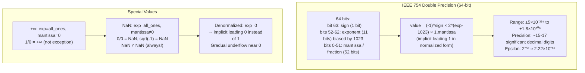

### 치명적인 취소

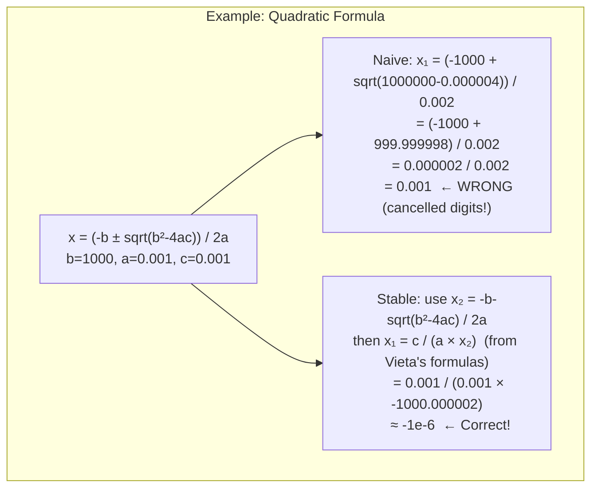

**머신 엡실론**: 부동 소수점에서 `1.0 + ε ≠ 1.0`에 해당하는 가장 작은 ε입니다. 복식의 경우 ε ⁻ 2.22×10⁻¹⁶입니다. 1e16을 1.0에 추가하면 1e16이 됩니다(1은 손실됩니다!).

---

## 2. 행렬 분해: LU, QR, SVD

### LU 분해(가우스 소거)

인수 행렬 A = L × U 여기서 L은 하부 삼각, U는 상부 삼각입니다. O(N³)의 정/역 치환을 통해 Ax = b를 해결하는 데 사용됩니다.

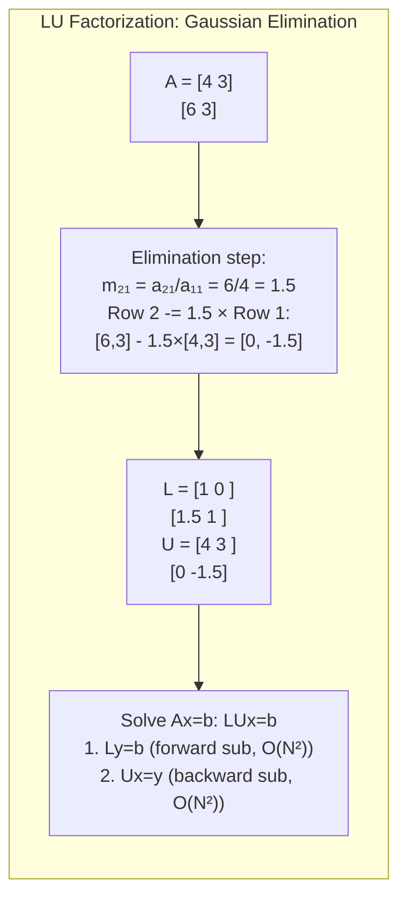

### 부분 피벗: 수치 안정성

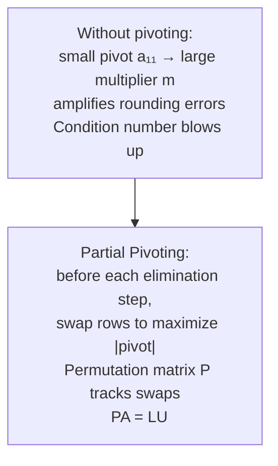

### SVD: 특이값 분해

A = U × Σ × Vᵀ — 기본 행렬 분해:

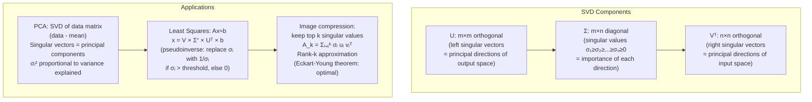

---

## 3. 고속 푸리에 변환: 나비 네트워크

DFT: `X[k] = Σₙ₌₀ᴺ⁻¹ x[n] × e^(-2πi×k×n/N)` — 순진하게 O(N²).

FFT(Cooley-Tukey)는 **분할 및 정복**을 통해 O(N log N)으로 감소합니다.

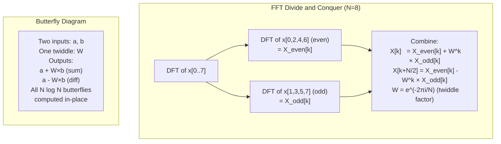

### FFT 메모리 액세스 패턴

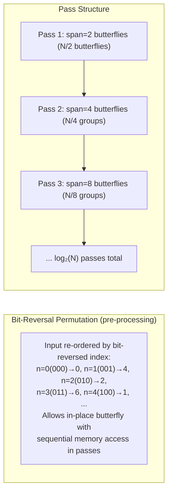

---

## 4. 수치 적분: 오류 분석

### 사다리꼴 법칙과 심슨의 법칙

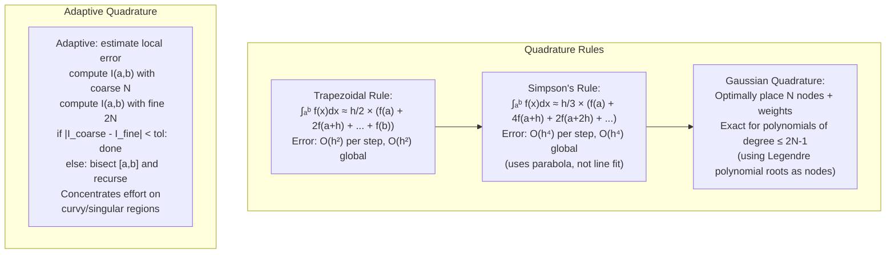

---

## 5. 선형 계획법: 단순 방법 내부

`Ax ≤ b, x ≥ 0`에 따라 `cᵀx`을(를) 최적화합니다.

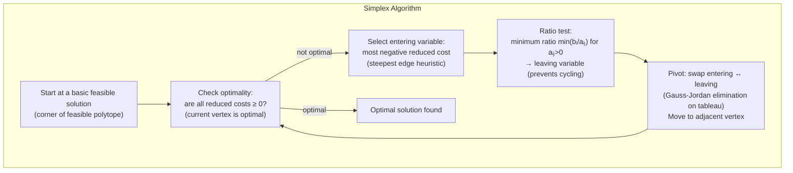

**최악의 경우와 평균적인 경우**: 심플렉스는 최악의 경우(Klee-Minty 큐브)에서는 지수적이지만 실제로는 다항식입니다. 내부점 방법(IPM)은 이론상 다항식 O(N³·⁵)이지만 희소 LP의 경우 실제로는 단순형이 더 빠른 경우가 많습니다.

---

## 6. 경사하강법: 손실 환경 탐색

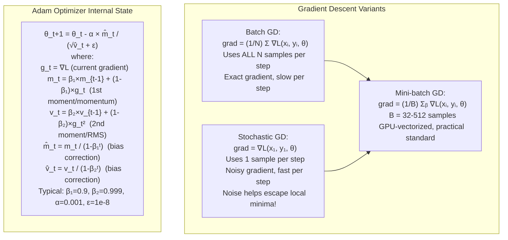

### 학습률 예약

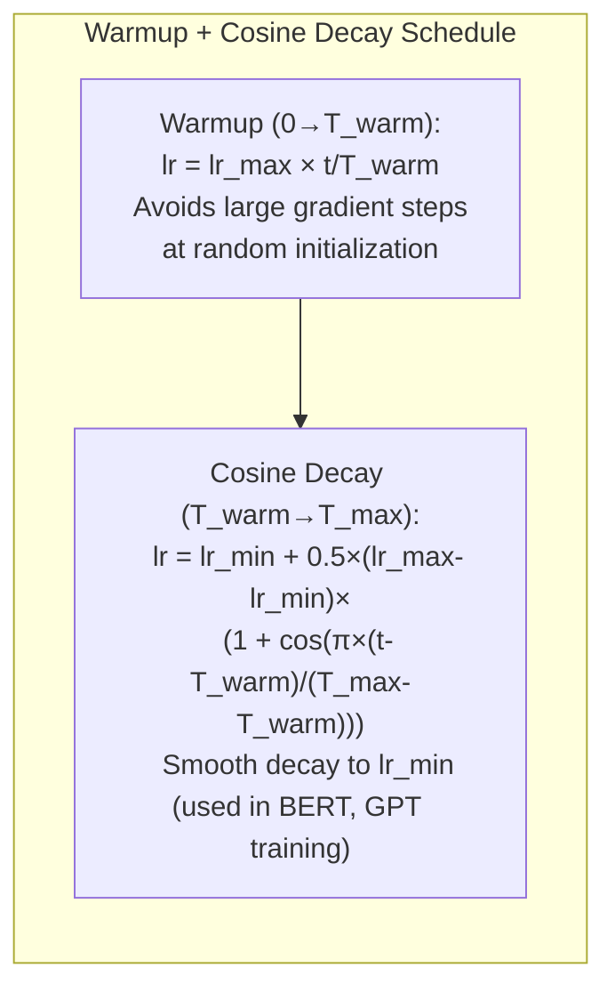

---

## 7. 몬테카를로 방법: 수렴 및 분산 감소

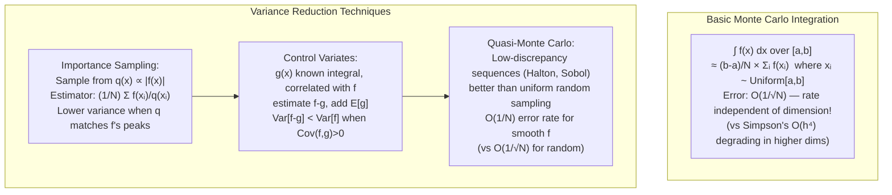

---

## 8. 그래프 알고리즘: 수학적 기초

### 최단 경로: Dijkstra 및 Bellman-Ford

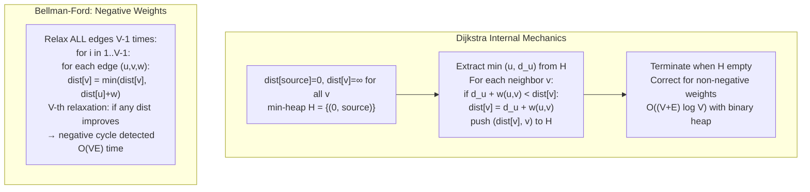

### 최대 흐름: Ford-Fulkerson 및 보강 경로

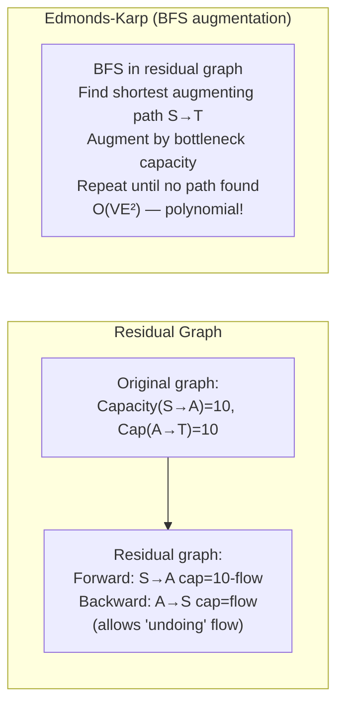

---

## 9. 고유값: 거듭제곱 반복 및 QR 알고리즘

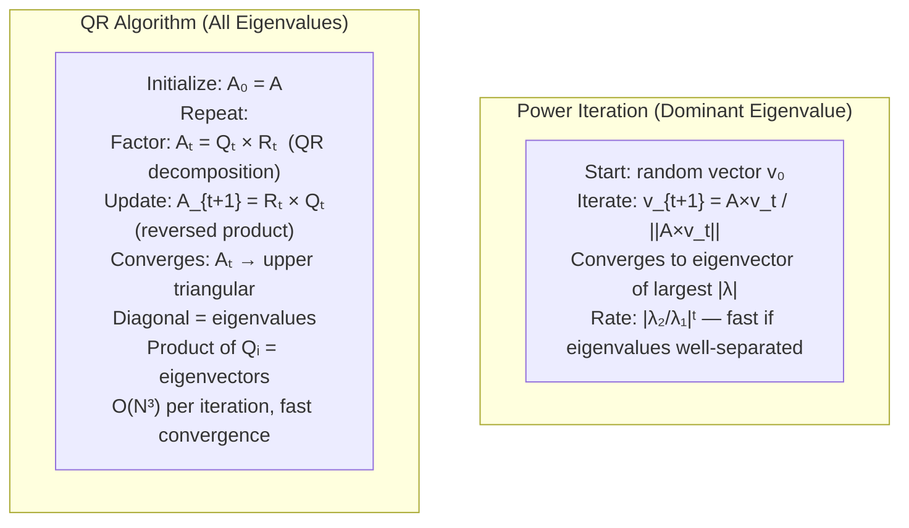

---

## 10. 정보 이론 기초

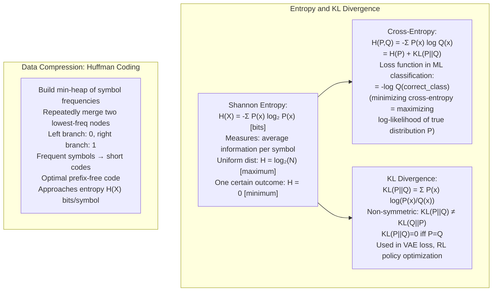

---

## 11. 수치적 안정성: 조건수

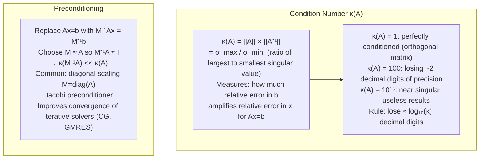

---

## 요약: 수학적 컴퓨팅 속성

| 알고리즘 | 복잡성 | 수치 문제 | 완화 |
|---|---|---|---|
| 가우스 소거 | O(N3) | 피벗 폭발 | 부분 피버팅 |
| FFT | O(N 로그 N) | 반올림 축적 | 이중 정밀도 |
| 공액 그라디언트 | O(N√κ) 반복 | κ 큰 → 느린 수렴 | 사전 조정 |
| 전력 반복 | O(이터당 N²) | λ₁₁₁₁이면 느림 | 디플레이션 |
| QR 고유값 | O(이터당 N³) | 비 에르미트 → 복소수 eig | 헤센베르그 감소 |
| 몬테카를로 | O(1/√N) | f²에 비례하는 분산 | 중요도 샘플링 |
| 역전파 | O(N 매개변수) | 사라지는/폭발하는 그라디언트 | 레이어 표준, 그라디언트 클립 |


---

## 설계적 고민

### 구조와 모델링

수학적 컴퓨팅의 구조 설계에서 가장 근본적인 결정은 **수 표현(Number Representation)** 선택입니다. IEEE 754 부동소수점은 넓은 범위를 표현할 수 있지만 정밀도 손실이 불가피합니다. 고정소수점은 정밀하지만 범위가 제한되고, 임의 정밀도(MPFR) 연산은 정확하지만 속도가 느립니다.

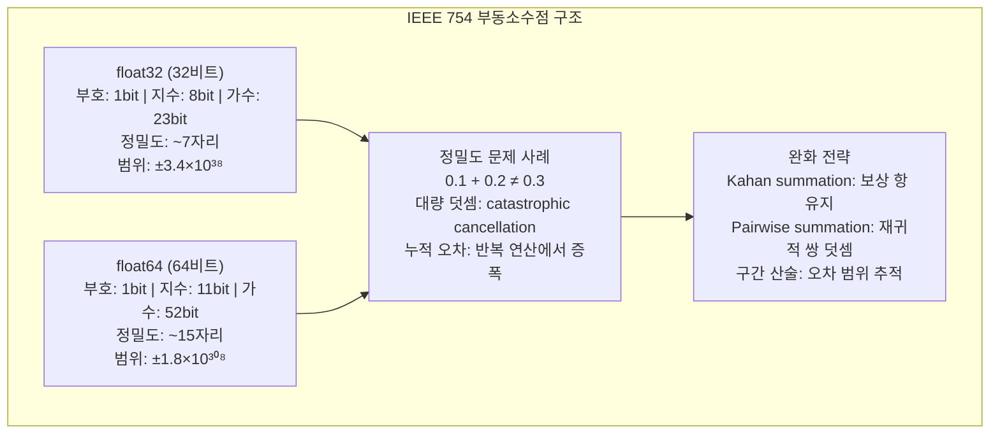

**선형 대수 연산 구조**에서는 BLAS(Basic Linear Algebra Subprograms) 레벨 선택이 성능을 좌우합니다. Level 1(벡터-벡터, O(N))은 메모리 대역폭 제한적이고, Level 2(행렬-벡터, O(N²))는 캐시 재사용이 낮으며, Level 3(행렬-행렬, O(N³))은 캐시 블로킹으로 최고 성능을 달성합니다. 따라서 알고리즘을 설계할 때 BLAS Level 3 연산(GEMM)으로 관리할 수 있도록 데이터 레이아웃을 설계해야 합니다.

### 트레이드오프와 의사결정

**확률적 알고리즘 vs 결정적 알고리즘**은 수학적 컴퓨팅의 핵심 트레이드오프입니다. 결정적 알고리즘은 정확한 답을 보장하지만 복잡도가 높을 수 있고, 확률적 알고리즘은 정확성을 확률적으로 보장하되 훨씬 빠를 수 있습니다.

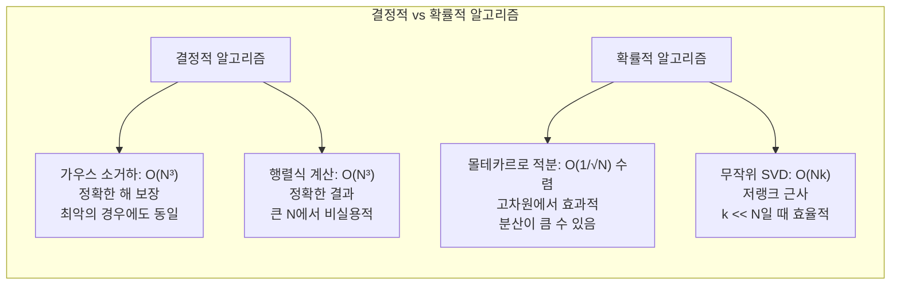

**암호학 수학 기반** 선택도 중요한 의사결정입니다. RSA는 소인수분해의 난도에 기반하여 키 크기가 2048~4096비트로 크고, ECC(Elliptic Curve)는 이산 로그 문제에 기반하여 256비트로도 RSA-3072에 해당하는 보안 강도를 제공합니다. 양자 내성 암호학(Post-Quantum)은 격자(Lattice) 문제 등 새로운 수학적 기반을 필요로 합니다.

| 수학적 기반 | 난해 문제 | 키 크기 (128bit 보안) | 양자 내성 |
|---|---|---|---|
| 소인수분해 (RSA) | 큰 수의 소인수분해 | 3072 bit | ✗ (Shor 알고리즘) |
| 이산 로그 (ECC) | 타원 곡선 이산 로그 | 256 bit | ✗ |
| 격자 기반 (Kyber) | LWE (Learning with Errors) | 800~1568 byte | ✓ |
| 해시 기반 (SPHINCS+) | 해시 함수 난해성 | ~41KB | ✓ |

### 리팩토링과 설계 원칙

**수치적 안정성(Numerical Stability)**은 수학적 컴퓨팅 소프트웨어의 핵심 설계 원칙입니다. 동일한 수학적 결과를 내는 여러 알고리즘 중에서도, 수치적으로 안정적인 방망을 선택해야 합니다. 예를 들어, 정규 방정식 `A^T A x = A^T b`를 직접 푸는 것보다 QR 분해를 통해 푸는 것이 조건수 측면에서 훨씬 안정적입니다.

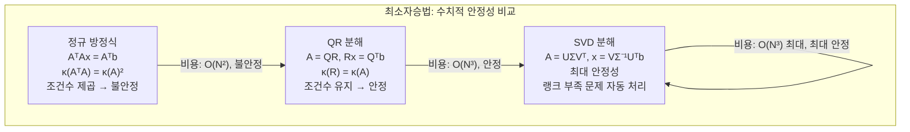

**근사 알고리즘 vs 정확 알고리즘** 선택은 NP-난해 문제의 실무 처리에서 핵심입니다. TSP(Traveling Salesman Problem) 같은 문제에서 정확 해는 O(N!)이지만, 2-opt나 Christofides 알고리즘은 다항식 시간에 최적해의 1.5배 이내 근사해를 보장합니다. 실무에서는 문제 크기와 품질 요구사항에 따라 적절한 근사비를 선택해야 합니다.

### 디자인 패턴 적용

수학적 컴퓨팅에서 반복적으로 등장하는 디자인 패턴은 **분할 정복(Divide & Conquer)**, **반복적 정제(Iterative Refinement)**, **전조건화(Preconditioning)**입니다.

```mermaid
flowchart TD
    subgraph "수학적 컴퓨팅 디자인 패턴"
        DC["분할 정복 패턴\nFFT: O(N²) → O(N log N)\n행렬 곱셈(Strassen): O(N³) → O(N²·⁸)\n큰 문제를 작은 하위 문제로 분해"]
        IR["반복적 정제 패턴\n초기 근사해 계산 후\n잔차(residual) 계산\n보정항 반복 적용\n단정밀도 → 배정밀도 효과"]
        PRECOND["전조건화 패턴\nAx=b → M⁻¹Ax=M⁻¹b\nκ(M⁻¹A) << κ(A)\n반복 솔버 수렴 속도 개선\nJacobi, ILU, AMG"]
        SPARSE["희소 행렬 패턴\nCSR/CSC 저장 형식\nO(N²) 저장 → O(nnz) 저장\n희소성 보존 연산"]
        DC --- IR
        PRECOND --- SPARSE
    end
```

**자동 미분(Automatic Differentiation)** 패턴은 딥러닝의 핵심입니다. 수치 미분은 반올림 오차가 있고, 기호 미분은 복잡한 함수에 적용하기 어렵습니다. 자동 미분은 코드로 표현된 함수의 연산 그래프에 연쇄 법칙을 적용하여 정확한 기울기를 계산합니다. Forward mode는 입력 수가 적을 때, Reverse mode(역전파)는 출력 수가 적을 때 효율적입니다.

**그래디언트 기반 최적화** 패턴도 수학적 컴퓨팅의 핵심입니다. 경사 하강법(Gradient Descent)의 확장인 Adam, AdaGrad, RMSProp 등은 학습률을 적응적으로 조절합니다. L-BFGS는 2차 도함수 정보를 근사하여 더 빠른 수렴을 제공하지만 메모리 사용량이 많습니다. 미니배치 SGD는 노이즈가 정규화 효과를 제공하여 일반화 성능이 우수합니다.

**불확실성 정량화(Uncertainty Quantification)**는 수치 결과의 신뢰도를 판단하는 핵심 설계 원칙입니다. 몰테카를로 적분의 신뢰 구간, 부트스트랩에 의한 분산 추정, 베이지안 추론의 사후 분포 등이 대표적입니다. 수치적 결과만 제시하는 것이 아니라, 그 결과의 신뢰도까지 함께 보고하는 것이 견고한 설계입니다.

**혼합 정밀도 연산(Mixed Precision)** 전략은 GPU 컴퓨팅의 핵심 설계 패턴입니다. FP16으로 연산 속도와 메모리 효율을 높이되, 누적 연산(accumulation)은 FP32로 수행하여 정밀도를 유지합니다. Loss Scaling 기법으로 FP16의 언더플로우 문제를 해결합니다.

**텐서 분해(Tensor Decomposition)** 패턴은 고차원 데이터를 효율적으로 처리하는 핵심 기법입니다. CP 분해는 텐서를 랭크-1 텐서들의 합으로 표현하여 파라미터 수를 O(N^d)에서 O(dNR)로 줄입니다. Tucker 분해는 코어 텐서와 인자 행렬들의 곱으로 표현하여 더 유연한 근사를 제공합니다. 신경망 가중치 압축, 추천 시스템, 신호 처리 등에서 메모리와 계산량을 크게 절감합니다.

**수치 적분(Numerical Quadrature)** 설계에서는 적분 구간과 피적분 함수의 특성에 따라 전략이 달라집니다. 가우스 구적법(Gaussian Quadrature)은 N개의 점으로 2N-1차 다항식까지 정확히 적분하여, 등간격 뉴턴-코츠 공식보다 지수적으로 우수한 수렴률을 보입니다. 적응적 구적법(Adaptive Quadrature)은 오차 추정에 기반하여 구간을 동적으로 분할하며, 특이점 근처에서 자동으로 격자를 세밀화합니다.

**몬테카를로 방법**은 고차원 적분에서 차원의 저주를 극복하는 유일한 범용 전략입니다. 수렴률 O(1/√N)은 차원에 무관하며, 분산 감소 기법(중요도 샘플링, 안티테틱 변량, 층화 샘플링)으로 효율을 높입니다. 준난수(Quasi-random) 시퀀스(Sobol, Halton)를 사용하면 O(1/N)에 가까운 수렴률을 달성할 수 있어, 금융공학의 파생상품 가격 결정이나 컴퓨터 그래픽스의 전역 조명 계산에 핵심적으로 사용됩니다.

**고유값 문제(Eigenvalue Problem)**의 수치적 해법은 행렬 크기와 구조에 따라 설계가 달라집니다. 작은 밀집 행렬에는 QR 알고리즘이 표준이며, 대규모 희소 행렬에는 Lanczos(대칭) 또는 Arnoldi(비대칭) 반복법이 적합합니다. 행렬을 명시적으로 저장하지 않고 행렬-벡터 곱만 있으면 되므로, 수백만 차원의 고유값 문제도 처리할 수 있습니다.

이러한 수학적 컴퓨팅의 설계 패턴과 트레이드오프에 대한 깊은 이해는 단순히 알고리즘을 구현하는 것을 넘어, 문제의 수학적 구조를 활용하여 최적의 성능과 정확도를 달성하는 설계자 관점의 역량을 길러줍니다.

---

## 연습 문제

### 1. 시스템 구조와 모델링

**문제 1-1.** 과학 시뮬레이션 팀이 이중 진자(double pendulum)의 운동 방정식을 4차 Runge-Kutta 방법으로 수치 적분하고 있다. 시뮬레이션을 장시간 돌리면 에너지 보존 법칙이 위반되어 진자의 에너지가 점점 증가하는 현상이 관찰된다. 왜 이런 현상이 발생하며, 에너지를 보존하는 수치 적분기(symplectic integrator)는 어떤 수학적 구조를 활용하여 이 문제를 해결하는가?

<details><summary>힌트 보기</summary>

일반적인 Runge-Kutta 방법은 해밀토니안 시스템의 **심플렉틱 구조(symplectic structure)**를 보존하지 않는다. 위상 공간에서의 부피 보존(Liouville 정리)과 심플렉틱 적분기(Störmer-Verlet, leapfrog)가 어떻게 에너지를 장시간 유사하게 유지하는지 생각해보라. 4차 RK의 국소 오차 O(h⁵)와 전역 오차 누적 패턴을 비교하라.

</details>

**문제 1-2.** 금융 파생상품의 가격을 몬테카를로 시뮬레이션으로 산출하는 시스템에서, 10만 개의 경로를 생성했음에도 결과의 표준 오차가 요구 정밀도(0.01%)를 충족하지 못한다. 의사난수 대신 Sobol 준난수 시퀀스로 교체했을 때 수렴 속도가 O(1/√N)에서 O(1/N)에 가까워지는 이유를 수학적으로 설명하고, 이 방법이 실패할 수 있는 상황은 무엇인가?

<details><summary>힌트 보기</summary>

준난수(Quasi-random) 시퀀스의 핵심은 **불일치도(discrepancy)**가 낮다는 것이다. Koksma-Hlawka 부등식에서 적분 오차가 함수의 총변동(variation)과 시퀀스의 불일치도의 곱으로 바운드된다는 점을 활용하라. 고차원(수백 차원 이상)에서 Sobol 시퀀스의 효과가 감소하는 이유와 차원 축소 기법(Brownian bridge)의 역할을 생각해보라.

</details>

**문제 1-3.** 딥러닝 프레임워크에서 행렬 곱셈 A×B를 구현할 때, 나이브한 3중 for 루프 대신 BLAS의 DGEMM을 호출하면 10배 이상 빨라진다. 단순히 "라이브러리가 최적화되어 있다"를 넘어서, DGEMM이 활용하는 메모리 계층 구조(캐시 라인, TLB)와 타일링(blocking) 전략이 어떻게 산술 강도(arithmetic intensity)를 높이는지 루프틸 모델(roofline model) 관점에서 설명하라.

<details><summary>힌트 보기</summary>

루프틸 모델에서 **산술 강도 = FLOPs / 메모리 전송 바이트**이다. 나이브 구현은 O(N³) 연산에 O(N³) 메모리 접근이 필요하지만, B×B 크기의 타일로 블로킹하면 O(N³/B) 메모리 접근으로 줄어든다. L1/L2 캐시에 타일이 맞도록 B를 선택하는 전략과, SIMD 벡터화가 피크 FLOPS에 도달하는 조건을 생각해보라.

</details>

### 2. 트레이드오프와 의사결정

**문제 2-1.** 실시간 물리 엔진에서 강체(rigid body)의 충돌 응답을 계산하기 위해 연립 일차방정식을 풀어야 한다. 직접법(LU 분해)과 반복법(Conjugate Gradient)중 어느 것을 선택해야 하는가? 프레임당 16ms 내에 수천 개의 접촉점을 처리해야 하는 제약 조건에서, 행렬의 희소성, 조건수, 그리고 "대략적이지만 빠른" 해의 수용 가능 여부를 기준으로 의사결정 과정을 설명하라.

<details><summary>힌트 보기</summary>

물리 엔진의 접촉 행렬은 **매우 희소(sparse)**하고 크기가 동적으로 변한다. LU 분해의 O(n³) 비용 vs CG의 O(n·k) 비용(k=반복 횟수)을 비교하라. 게임 물리에서는 정확한 해보다 시각적으로 자연스러운 결과가 중요하므로, 조기 종료(early termination)와 warm starting(이전 프레임의 해를 초기값으로 사용)이 어떤 역할을 하는지 생각해보라.

</details>

**문제 2-2.** 머신러닝 팀이 1억 개의 파라미터를 가진 모델을 학습시키는데, FP32에서 FP16 혼합 정밀도로 전환하여 학습 속도를 2배 높이려 한다. 그러나 전환 후 학습이 발산(diverge)하는 현상이 발생했다. FP16의 표현 범위(6.1×10⁻⁵ ~ 65504)와 그래디언트의 크기 분포를 고려할 때, 발산의 원인과 Loss Scaling 기법이 이를 해결하는 메커니즘을 IEEE 754 관점에서 설명하라.

<details><summary>힌트 보기</summary>

FP16의 최소 양의 정규화 수는 약 6.1×10⁻⁵이다. 많은 그래디언트 값이 이 범위 아래로 떨어져 **언더플로우로 0이 되는 현상**이 핵심이다. Loss Scaling은 손실 값에 큰 스케일 팩터(예: 1024)를 곱하여 역전파 시 그래디언트를 FP16 표현 범위로 끌어올리고, 가중치 업데이트 전에 다시 나누는 방식이다. Dynamic Loss Scaling이 스케일 팩터를 자동 조절하는 방법도 설명할 수 있어야 한다.

</details>

**문제 2-3.** 기상 예측 시스템에서 편미분 방정식(PDE)을 유한 차분법으로 이산화할 때, 시간 스텝 Δt와 공간 격자 Δx의 비율을 잘못 설정하면 수치 해가 폭발적으로 발산한다. CFL(Courant-Friedrichs-Lewy) 조건이 안정성을 보장하는 수학적 원리를 설명하고, 암묵적(implicit) 방법이 CFL 제한을 완화하면서도 각 시간 스텝마다 연립 방정식을 풀어야 하는 추가 비용이 발생하는 트레이드오프를 분석하라.

<details><summary>힌트 보기</summary>

CFL 조건은 **수치적 의존 영역이 물리적 의존 영역을 포함**해야 한다는 원리이다. 파동 방정식에서 c·Δt/Δx ≤ 1이어야 명시적 방법이 안정적이다. 암묵적 방법(Crank-Nicolson 등)은 무조건 안정적이지만, 각 스텝에서 대규모 희소 연립방정식을 풀어야 한다. 멀티그리드(multigrid) 솔버가 이 비용을 O(N)으로 줄이는 방법을 생각해보라.

</details>

### 3. 문제 해결 및 리팩토링

**문제 3-1.** 추천 시스템 팀이 사용자-아이템 행렬(100만×50만, 희소율 99.9%)에 SVD를 적용하여 잠재 요인을 추출하려 한다. 전체 SVD를 계산하면 메모리가 부족하고, 절단 SVD(truncated SVD)를 사용해도 시간이 너무 오래 걸린다. 이 상황에서 랜덤화 SVD(Randomized SVD)가 어떻게 O(mn·k) 복잡도로 상위 k개 특이값을 근사하는지 설명하고, 근사 품질을 보장하는 오버샘플링 파라미터의 역할은 무엇인가?

<details><summary>힌트 보기</summary>

랜덤화 SVD의 핵심은 **랜덤 프로젝션으로 행렬의 열 공간을 근사**하는 것이다. 가우시안 랜덤 행렬 Ω를 곱해 Y=AΩ를 구하고, Y의 QR 분해로 Q를 얻은 뒤, 작은 행렬 B=Q^T·A에 정확한 SVD를 적용한다. 오버샘플링(k+p개 열 사용)이 특이값 갭이 작을 때 근사 품질을 개선하는 이유와, power iteration이 스펙트럼 감쇠가 느린 행렬에서 효과적인 이유를 설명하라.

</details>

**문제 3-2.** 레거시 과학 계산 코드에서 큰 조밀 행렬의 역행렬 A⁻¹을 직접 계산하여 Ax=b를 x=A⁻¹b로 풀고 있다. 이 방식이 수치적으로 왜 위험한지(조건수 증폭, 불필요한 연산량) 설명하고, LU 분해 + 전방/후방 대입으로 리팩토링할 때의 이점을 정량적으로 비교하라. 또한, 같은 A에 대해 여러 개의 우변 벡터 b₁, b₂, ..., bₖ가 있을 때 어떤 전략이 최적인가?

<details><summary>힌트 보기</summary>

역행렬 계산은 O(n³) 연산과 O(n²) 추가 메모리가 필요하며, 결과 행렬의 각 원소에 반올림 오차가 누적된다. **LU 분해는 한 번(O(2n³/3))만 수행하면, 각 우변에 대해 O(n²) 전방/후방 대입만으로 해를 구할 수 있다.** 부분 피벗(partial pivoting)이 수치 안정성에 미치는 영향과, Cholesky 분해가 대칭 양정치 행렬에서 2배 빠른 이유를 설명하라.

</details>

**문제 3-3.** 신호 처리 파이프라인에서 FFT를 사용하여 주파수 분석을 하고 있는데, 입력 신호의 길이가 2의 거듭제곱이 아닌 경우(예: 1000 샘플) 성능이 급격히 저하된다. 제로 패딩(zero-padding)으로 길이를 1024로 맞추면 스펙트럼에 어떤 영향이 있는가? 또한 Bluestein 알고리즘이 임의 길이에 대해 O(N log N) 복잡도를 유지하는 원리를 설명하라.

<details><summary>힌트 보기</summary>

제로 패딩은 **주파수 해상도를 높이는 것이 아니라 주파수 축의 보간(interpolation)**을 수행한다. DTFT의 더 촘촘한 샘플링이지, 새로운 주파수 정보가 추가되는 것은 아니다. Bluestein 알고리즘(Chirp-Z Transform)은 DFT를 **합성곱(convolution)으로 변환**하여, 길이 M의 FFT 두 번(M은 2의 거듭제곱으로 올림)으로 계산하는 방법이다.

</details>

### 4. 개념 간의 연결성

**문제 4-1.** SVD(특이값 분해)는 추천 시스템(협업 필터링), 자연어 처리(LSA/LSI), 이미지 압축, 주성분 분석(PCA)에 모두 사용된다. 이 네 가지 응용에서 SVD가 수행하는 공통된 수학적 역할은 무엇이며, 각 응용에서 "특이값의 크기 순 감소"가 의미하는 바는 어떻게 다른가? SVD와 고유값 분해의 관계(A^T A의 고유값 = A의 특이값의 제곱)가 이 연결성의 핵심인 이유를 설명하라.

<details><summary>힌트 보기</summary>

SVD의 공통 역할은 **데이터의 가장 중요한 변동 방향을 추출하는 저랭크 근사**이다. Eckart-Young 정리에 의해 프로베니우스 노름 기준 최적의 랭크-k 근사를 제공한다. 추천 시스템에서는 잠재 선호 요인, NLP에서는 의미적 차원, 이미지에서는 시각적 패턴, PCA에서는 분산 최대화 방향이다. A^T A와 AA^T의 고유벡터가 각각 V와 U를 구성하는 관계를 설명하라.

</details>

**문제 4-2.** 경사하강법(Gradient Descent), 뉴턴 방법(Newton's Method), L-BFGS는 모두 최적화 문제를 풀지만, 수렴 속도와 계산 비용이 크게 다르다. 이 세 방법이 각각 목적 함수의 어떤 정보(0차/1차/2차 미분)를 활용하는지, 그리고 이 정보의 추가적인 활용이 수렴 차수(선형/초선형/2차)를 어떻게 결정하는지 정보 이론과 연결하여 설명하라. 딥러닝에서 2차 방법이 잘 쓰이지 않는 이유는 무엇인가?

<details><summary>힌트 보기</summary>

경사하강법은 1차 정보(기울기)만 사용하여 **선형 수렴**, 뉴턴 방법은 2차 정보(헤시안)를 추가로 사용하여 **2차 수렴**을 달성한다. L-BFGS는 헤시안을 m개의 벡터 쌍으로 근사하여 O(md) 메모리와 연산으로 초선형 수렴을 제공한다. 딥러닝의 파라미터 수가 수억 개일 때 n×n 헤시안의 저장/역행렬 계산이 불가능한 점, 그리고 SGD의 노이즈가 오히려 날카로운 극소점을 탈출하는 데 도움이 되는 점을 생각해보라.

</details>

**문제 4-3.** 수치적 안정성(numerical stability), 조건수(condition number), IEEE 754 부동소수점 표현은 서로 밀접하게 연결되어 있다. 조건수가 10⁸인 선형 시스템을 FP64(약 15자리 정밀도)로 풀 때 결과에서 몇 자리의 유효 숫자를 신뢰할 수 있는지 설명하라. 같은 문제를 FP32로 풀면 어떤 일이 발생하는가? 반복적 정제(iterative refinement)가 이 상황을 어떻게 개선하는지, 그리고 이 기법이 혼합 정밀도 연산과 어떻게 결합되는지 설명하라.

<details><summary>힌트 보기</summary>

**유효 숫자 손실 ≈ log₁₀(조건수)**이다. 조건수 10⁸이면 약 8자리의 유효 숫자를 잃으므로, FP64의 15자리에서 약 7자리만 신뢰할 수 있다. FP32의 7자리 정밀도에서는 거의 모든 유효 숫자를 잃는다. 반복적 정제는 잔차 r=b-Ax̃를 높은 정밀도로 계산하여 보정 벡터를 구하는 방법으로, FP32로 LU 분해 + FP64로 잔차 계산의 혼합 정밀도 전략이 효율과 정확도를 모두 달성하는 원리를 설명하라.

</details>