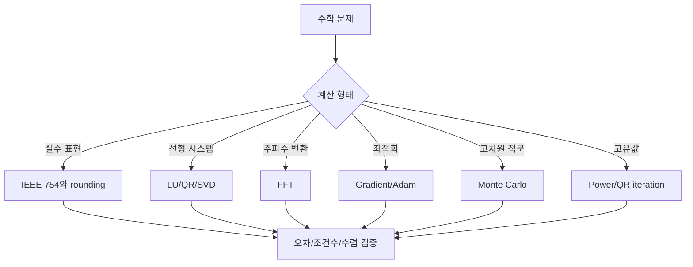
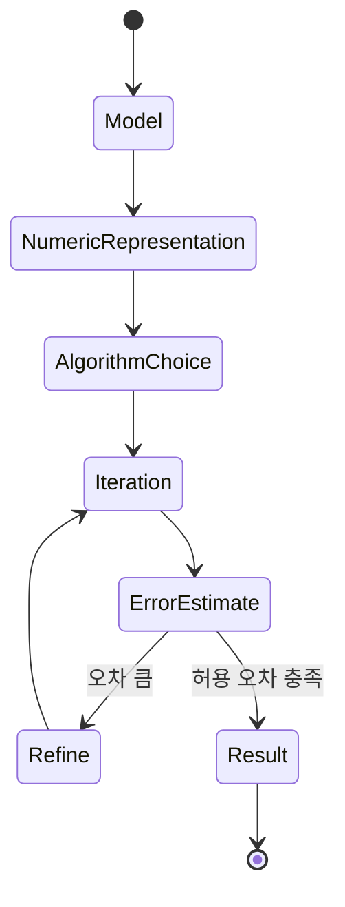

# 수학적 컴퓨팅 내부 동작 학습 및 기록 노트

## 1. 왜 필요한가? (Pain Point & Motivation)

수학적 컴퓨팅은 수식을 코드로 옮기는 일이 아니다. IEEE 754 부동소수점은 정밀도를 잃고, 행렬 분해는 조건수에 민감하며, FFT는 메모리 배치와 butterfly 전이를 요구하고, Monte Carlo는 분산을 관리해야 한다. 같은 수학식이라도 구현 방식에 따라 오차가 누적되거나 결과가 발산할 수 있다.

이 문서는 원문 한국어 수학/과학 컴퓨팅 문서를 수치 안정성, 상태 전이, 알고리즘 선택 기준 중심으로 재작성한다.

## 2. 현재 나의 상태 (Baseline)

- IEEE 754, LU/QR/SVD, FFT, gradient descent, Monte Carlo의 이름과 큰 용도는 알고 있다.
- catastrophic cancellation, condition number, pivoting, preconditioning의 실제 의미를 더 명확히 해야 한다.
- 정확 알고리즘, 근사 알고리즘, 확률 알고리즘의 선택 기준이 아직 섞여 있다.
- BLAS level, cache blocking, sparse matrix layout 같은 성능 요소를 수학 알고리즘과 연결해야 한다.
- 결과값뿐 아니라 오차 범위와 신뢰도를 함께 보고하는 습관이 필요하다.

## 3. 도달하고 싶은 목표 (Target State)

- 부동소수점 표현 한계와 rounding error가 결과에 미치는 영향을 설명한다.
- 선형 시스템에서 LU, QR, SVD를 안정성과 비용 기준으로 선택한다.
- FFT가 DFT의 `O(N^2)` 계산을 `O(N log N)` butterfly 전이로 줄이는 구조를 이해한다.
- Gradient descent, Adam, Monte Carlo, eigenvalue solver의 내부 상태를 추적한다.
- 조건수와 수치 안정성을 근거로 알고리즘 리팩토링 방향을 제안한다.

## 4. 시스템 번역 (Data Flow)



수학적 컴퓨팅의 data flow는 문제를 수치 표현으로 바꾸고, 계산 과정의 오차와 수렴 조건을 계속 확인하는 흐름이다.

## 5. 핵심 구성요소 (Building Blocks)

| 구성요소 | 내부 상태 | 핵심 질문 |
| --- | --- | --- |
| IEEE 754 | sign/exponent/mantissa | 표현 가능한 범위와 정밀도는 충분한가? |
| Catastrophic cancellation | 가까운 두 수의 차 | 유효 숫자가 사라지는가? |
| LU factorization | `PA = LU` | pivoting으로 안정성을 확보했는가? |
| QR factorization | orthogonal `Q`, triangular `R` | least squares를 안정적으로 풀 수 있는가? |
| SVD | singular values/vectors | rank deficiency와 low-rank approximation을 다룰 수 있는가? |
| FFT | bit-reversal과 butterfly | in-place 전이와 twiddle factor가 맞는가? |
| Quadrature | 구간별 오차 추정 | adaptive refinement가 필요한가? |
| Gradient descent/Adam | parameter, gradient, moments | 학습률과 moment 상태가 수렴을 돕는가? |
| Monte Carlo | random samples와 variance | 표준오차가 요구 정확도 안에 드는가? |
| Condition number | `σ_max / σ_min` | 입력 오차가 해에 얼마나 증폭되는가? |

## 6. 상태 전이 (State Transition)



FFT의 iteration은 butterfly pass이고, gradient descent의 iteration은 parameter update이며, Monte Carlo의 iteration은 sample accumulation이다. 각 단계는 결과뿐 아니라 오차 추정 상태를 함께 갱신해야 한다.

## 7. 불변식 (Invariant: 절대 깨지면 안 되는 규칙)

- 부동소수점 결과는 정확한 실수 계산과 다르며 rounding error를 포함한다.
- 가까운 두 큰 수를 빼는 식은 안정적인 equivalent formulation이 있는지 확인한다.
- LU는 작은 pivot으로 인한 오차 증폭을 피하려면 partial pivoting을 사용해야 한다.
- Least squares는 `A^T A`를 직접 푸는 것보다 QR/SVD가 수치적으로 더 안전하다.
- FFT 입력 길이, bit-reversal, twiddle factor 순서가 일관되어야 한다.
- Gradient method는 learning rate가 너무 크면 발산할 수 있다.
- Monte Carlo 결과는 표본 수와 variance에 따른 신뢰 구간을 함께 제시해야 한다.
- Condition number가 큰 문제는 더 높은 정밀도, preconditioning, 안정적 분해를 검토해야 한다.

## 8. 가장 작은 예제 (Minimal Viable Example)

```python
def kahan_sum(values):
    total = 0.0
    correction = 0.0

    for value in values:
        adjusted = value - correction
        next_total = total + adjusted
        correction = (next_total - total) - adjusted
        total = next_total

    return total
```

Kahan summation은 작은 보정항을 유지해 누적 덧셈의 rounding error를 줄인다. 수학적으로 같은 합이라도 계산 순서와 보정 상태가 결과 정밀도를 바꾼다.

## 9. 실패 사례 (What could go wrong?)

- `0.1 + 0.2 == 0.3`처럼 부동소수점을 정확한 십진수로 가정한다.
- 이차방정식 근의 공식에서 큰 수끼리 빼 catastrophic cancellation을 만든다.
- `A^T A x = A^T b`를 직접 풀어 조건수를 제곱으로 악화시킨다.
- FFT에서 2의 거듭제곱 길이만 가정하고 임의 길이 입력 성능 저하를 설명하지 못한다.
- Gradient descent learning rate를 크게 잡아 loss가 발산한다.
- Monte Carlo 표본 평균만 보고 표준오차나 신뢰구간을 보고하지 않는다.
- FP16 혼합 정밀도에서 loss scaling 없이 gradient underflow가 발생한다.

## 10. 뇌 확장하기 (Evolution & Variants)

- 선형대수는 BLAS level, cache blocking, sparse CSR/CSC, iterative solver로 확장된다.
- 수치 적분은 trapezoidal, Simpson, Gaussian quadrature, adaptive quadrature를 함수 특성에 맞춰 고른다.
- 최적화는 SGD, Adam, L-BFGS, Newton method를 gradient 정보와 비용으로 비교한다.
- Eigenvalue 문제는 dense QR, power iteration, Lanczos, Arnoldi로 행렬 구조에 맞춰 선택한다.
- Monte Carlo는 importance sampling, control variates, quasi-Monte Carlo로 variance를 줄인다.
- 혼합 정밀도는 FP16/BF16 연산과 FP32 accumulation, loss scaling을 함께 설계한다.

## 11. 최종 체크리스트 (Definition of Done)

- [x] IEEE 754, 선형대수 분해, FFT, 최적화, Monte Carlo를 상태 전이 관점으로 정리했다.
- [x] Kahan summation 최소 예제로 rounding error 완화 구조를 설명했다.
- [x] 조건수, cancellation, pivoting, preconditioning을 불변식과 실패 사례에 포함했다.
- [x] 정확도, 성능, 메모리, 수렴성의 트레이드오프를 확장 방향으로 정리했다.
- [x] 원문 한국어 수학적 컴퓨팅 문서를 12개 섹션 템플릿으로 재작성했다.

## 12. 뇌에 새기는 복습 문장 (TL;DR Blank)

수학적 컴퓨팅에서 정답은 수식만으로 결정되지 않는다. 표현 정밀도, 조건수, 알고리즘 전이, 오차 추정이 함께 맞아야 신뢰할 수 있는 결과가 된다.
