# 마이크로서비스 내부: 내부

> 소스 합성: 서비스 메시, API 게이트웨이, 서비스 간 통신, 분산 추적, 서비스 검색 및 탄력성 패턴을 다루는 마이크로서비스 참조 서적(comp 107, 112, 147–151, 163–164, 370).

---

## 1. 서비스 메시 아키텍처 - 데이터 플레인과 제어 플레인

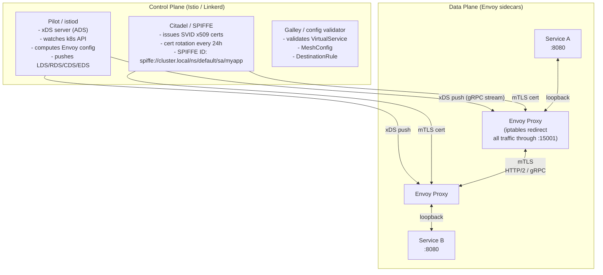

### iptables 트래픽 차단

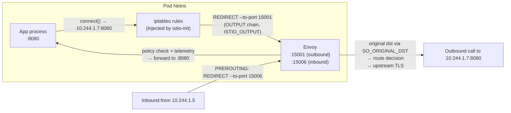

---

## 2. Envoy xDS — 동적 구성 프로토콜

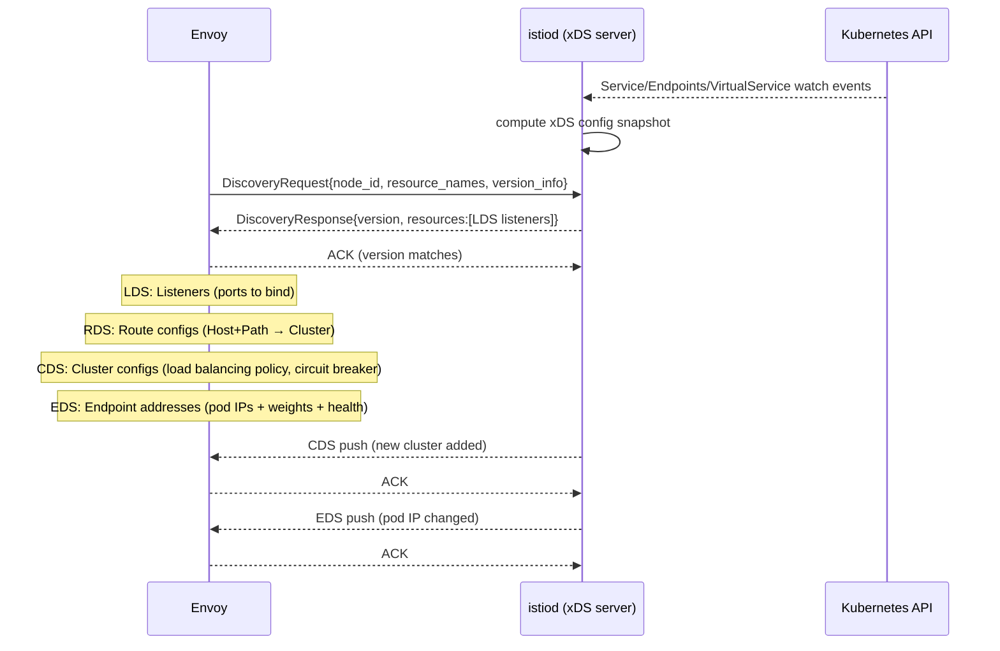

---

## 3. API 게이트웨이 - 요청 처리 파이프라인

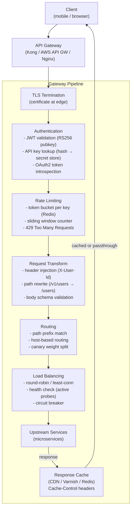

### 토큰 버킷 속도 제한기 내부

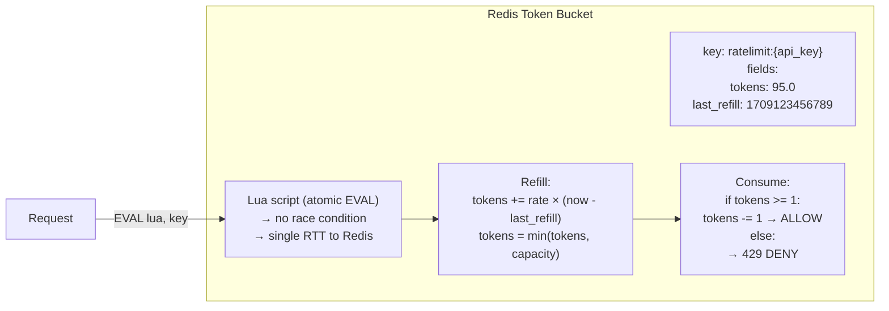

---

## 4. 서비스 검색 — 클라이언트측 vs 서버측

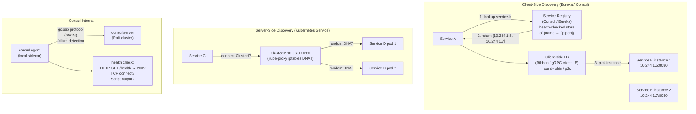

---

## 5. gRPC 내부 — 전송 및 프로토콜 버퍼

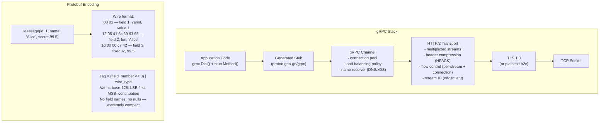

### gRPC 스트리밍 — 역압 흐름

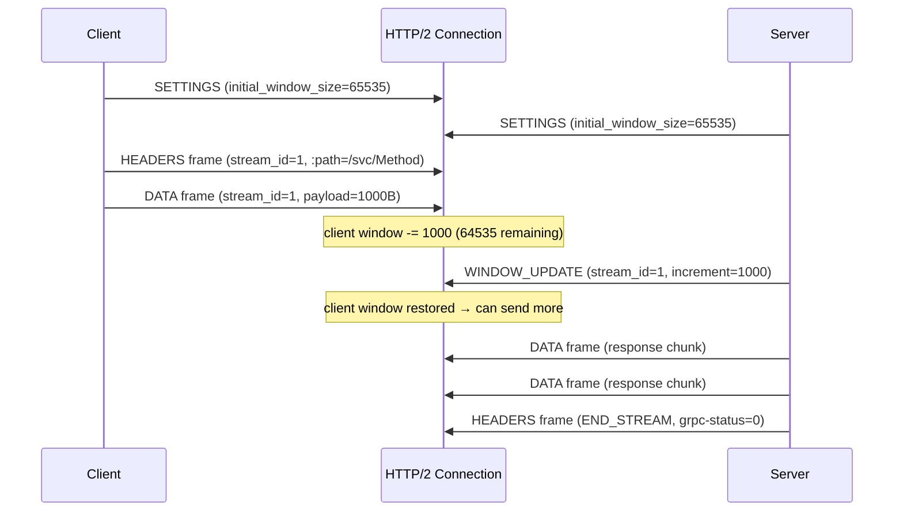

---

## 6. 분산 추적 — OpenTelemetry 내부

```mermaid
flowchart TD
    subgraph "Trace Propagation"
        Req["HTTP Request\nW3C Trace Context headers:\ntraceparent: 00-{traceId}-{spanId}-01\ntracestate: vendor-specific"]
        SvcA["Service A\n- extract context\n- start span (spanId=aaaa)\n- inject into outbound headers"]
        SvcB["Service B\n- extract parent spanId=aaaa\n- start child span (spanId=bbbb)\n- record attributes+events"]
        SvcC["Service C\n- child span (spanId=cccc)"]

        Req --> SvcA -->|"HTTP with traceparent"| SvcB -->|"gRPC metadata"| SvcC
    end

    subgraph "OTLP Export Pipeline"
        SDK["OTel SDK\n- Tracer → start/end spans\n- SpanProcessor (BatchSpanProcessor)\n- in-memory ring buffer"]
        Collector["OTel Collector\n- receives OTLP (gRPC/HTTP)\n- tail sampling processor\n- batch exporter"]
        Backend["Jaeger / Zipkin / Tempo\n- trace storage\n- span index\n- dependency graph"]
        SDK -->|"OTLP gRPC (async batch)"| Collector
        Collector -->|"Jaeger Thrift / OTLP"| Backend
    end

    subgraph "Span Data Model"
        Span["Span {\n  traceId: 128-bit\n  spanId: 64-bit\n  parentSpanId: 64-bit\n  name: 'GET /users'\n  kind: CLIENT/SERVER/PRODUCER/CONSUMER\n  startTime, endTime (UnixNano)\n  attributes: {http.method, http.status_code}\n  events: [{name, timestamp, attrs}]\n  status: OK / ERROR\n}"]
    end
```

---

## 7. 회로 차단기 - 상태 머신 내부

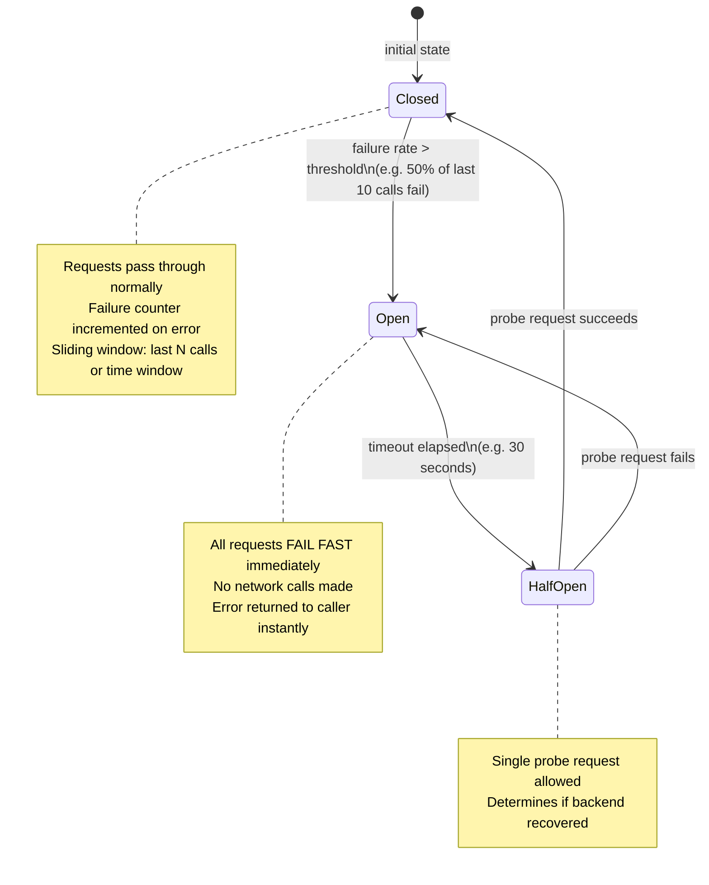

### Resilience4j 슬라이딩 윈도우

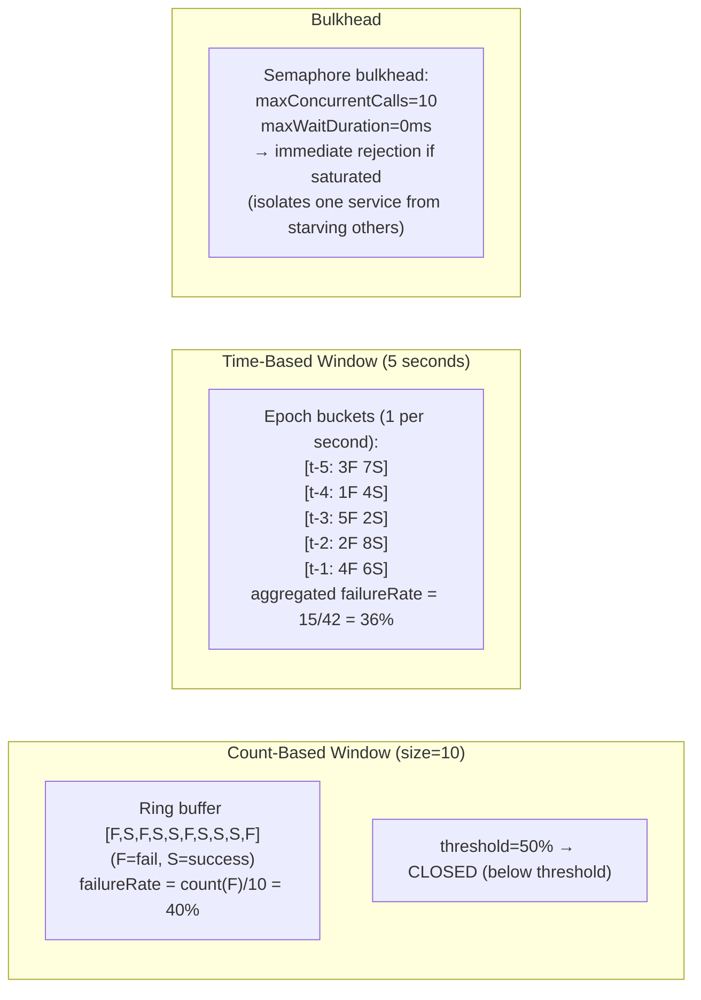

---

## 8. 사가 패턴 - 분산 트랜잭션 내부

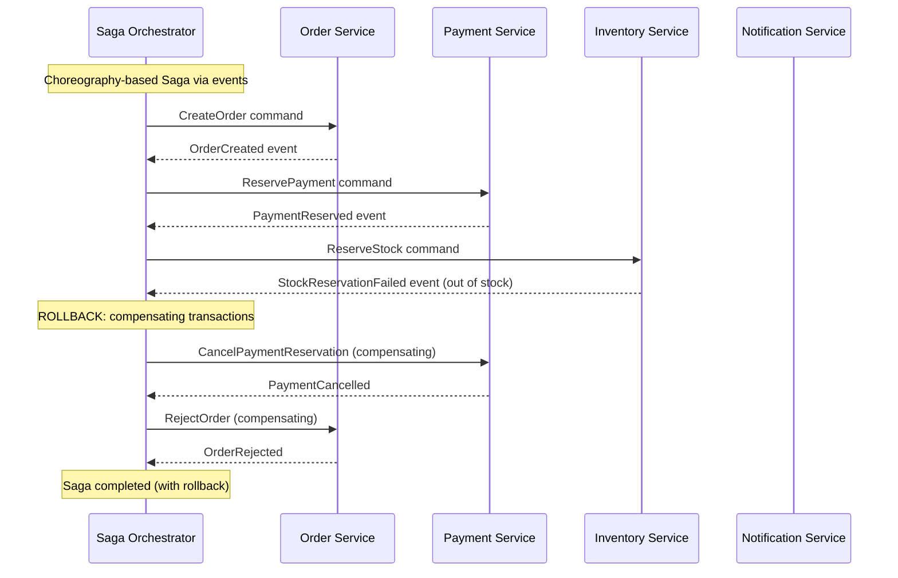

### 사가 vs 2PC 비교

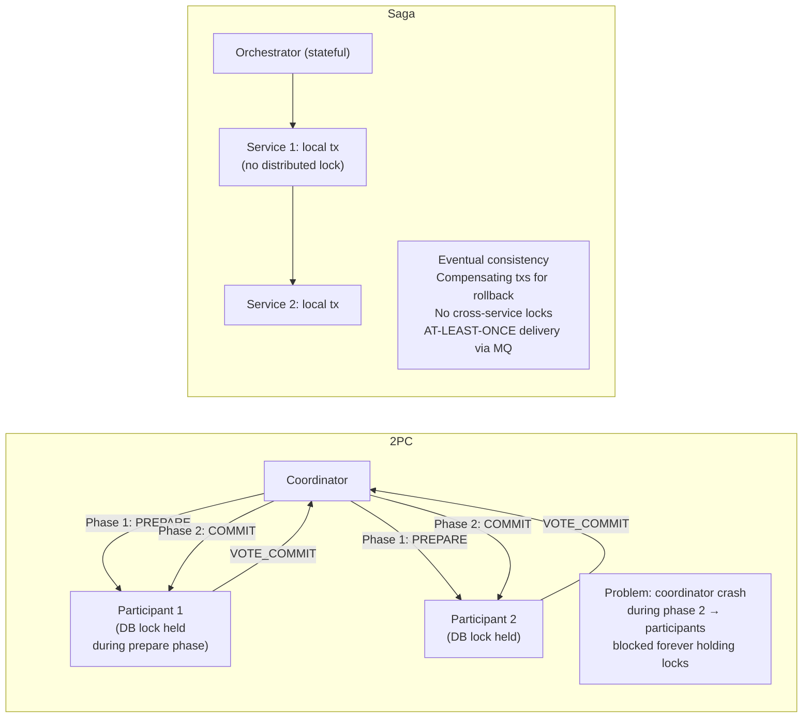

---

## 9. 이벤트 중심 마이크로서비스 — 발신함 패턴

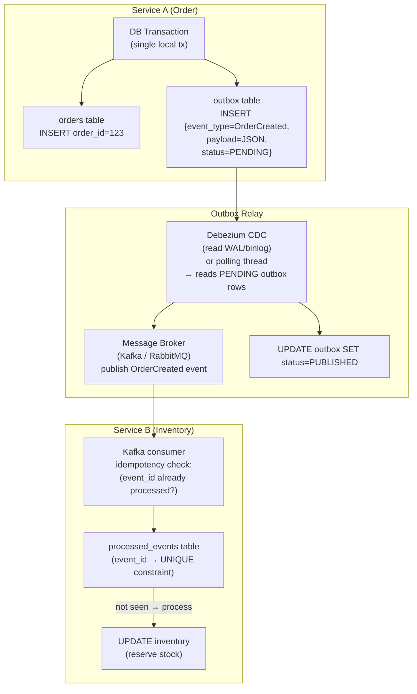

---

## 10. CQRS — 명령 쿼리 책임 분리

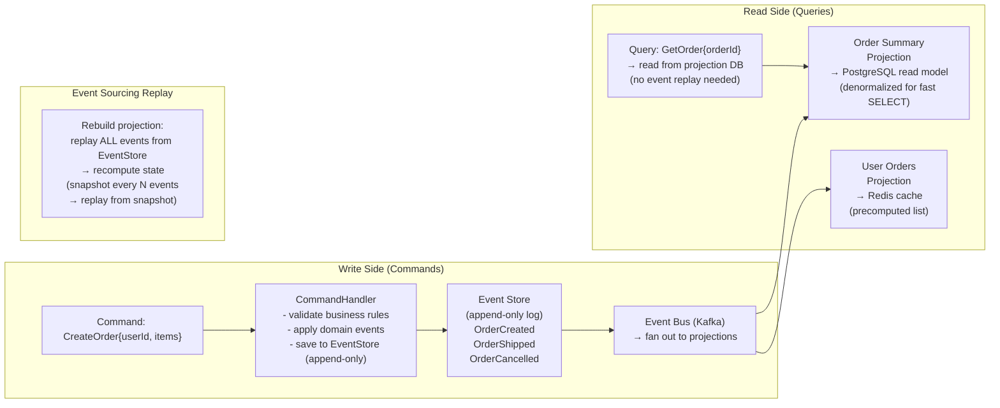

---

## 11. 상태 확인 및 활동성 내부

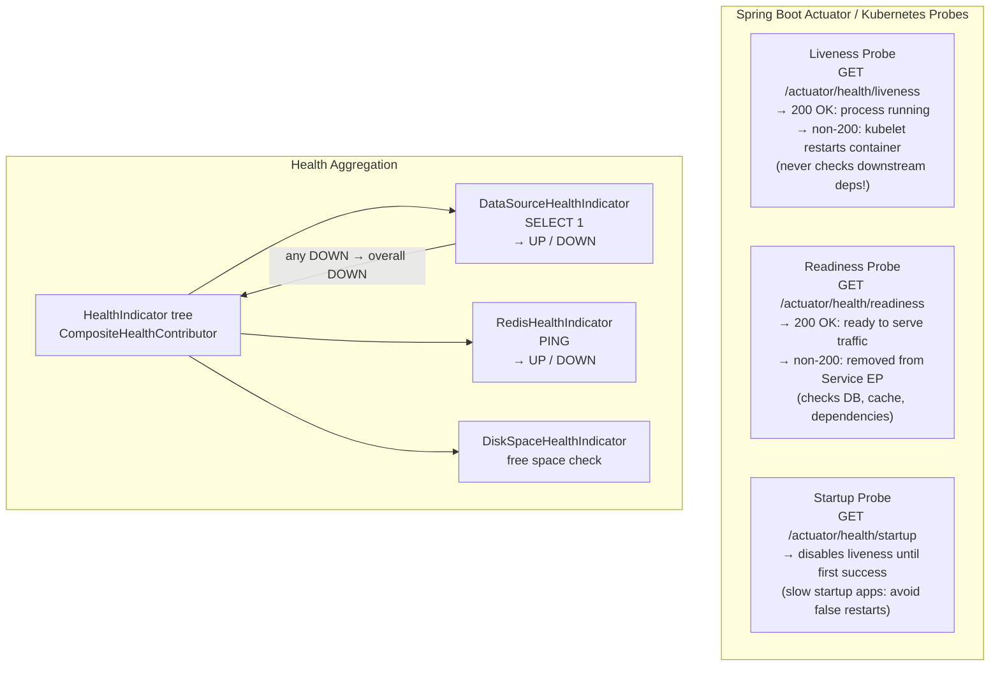

---

## 12. 서비스 메시 mTLS - 인증서 수명 주기

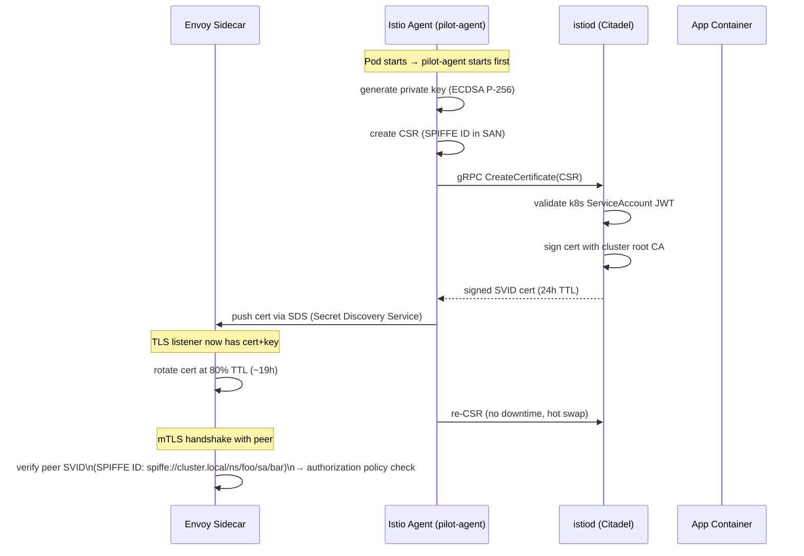

---

## 13. 성능 및 오버헤드 요약

```mermaid
block-beta
  columns 2
  block:sidecar["Sidecar Proxy Overhead"]:1
    s1["CPU: ~0.5–2% per request (Envoy)"]
    s2["Memory: ~50–100MB per sidecar"]
    s3["Latency: +0.3–1ms p50 (local loopback)"]
    s4["p99 latency: +2–5ms (mTLS handshake amortized)"]
  end
  block:discovery["Service Discovery Latency"]:1
    d1["Consul health check: 10s interval default"]
    d2["DNS TTL: 5–30s (stale pods visible)"]
    d3["k8s Endpoints update: ~1–5s after pod ready"]
    d4["xDS push to Envoy: ~1–3s after EP change"]
  end
  block:grpc["gRPC vs REST"]:1
    g1["Protobuf encoding: 3–10x smaller than JSON"]
    g2["HTTP/2 multiplexing: 1 TCP conn, N streams"]
    g3["gRPC streaming: server push (no polling)"]
    g4["gRPC latency: ~10–50% lower than REST/JSON"]
  end
  block:saga["Saga Overhead"]:1
    sa1["Outbox polling: 100ms–1s delay (CDC faster)"]
    sa2["Compensating tx: idempotency check O(1) with index"]
    sa3["Event store replay: O(events) — snapshot every 100 events"]
    sa4["2PC lock hold: entire prepare+commit round trip"]
  end
```

---

## 주요 내용

- **Envoy 차단**은 iptables `REDIRECT`(`TPROXY` 아님)을 사용합니다. 모든 트래픽 경로는 로컬 호스트 포트 15001/15006을 통해 이루어집니다. `SO_ORIGINAL_DST`는 실제 대상을 복구합니다.
- **xDS 푸시 프로토콜**은 delta-xDS 스트림을 사용하므로 변경된 리소스만 전송됩니다. Envoy는 각 버전에 대해 ACK를 보냅니다. NACK 롤백
- **Protobuf varint 인코딩**은 대부분의 필드에 대해 필드 번호 + 연결 유형을 단일 바이트로 압축합니다. 일반적인 메시지는 동등한 JSON보다 3~10배 작습니다.
- **회로 차단기 반 개방**은 정확히 하나의 프로브 요청을 허용합니다. 다른 모든 요청은 프로브가 성공할 때까지 여전히 빠른 실패 상태를 유지합니다.
- **Saga 보상 트랜잭션**은 멱등성이 있어야 합니다. 오케스트레이터는 재시도 시 명령을 다시 보낼 수 있습니다(Kafka에서 한 번 이상 전달).
- **Outbox 패턴**은 동일한 로컬 트랜잭션에서 DB 쓰기 + 이벤트 게시 원자성을 만들어 정확히 한 번만 전달되도록 보장합니다. Debezium CDC는 거의 0에 가까운 오버헤드로 WAL을 읽습니다.
- **CQRS 프로젝션**은 이벤트 저장소 재생에서 다시 작성됩니다. N 이벤트마다 스냅샷을 생성하면 재생 시간이 O(모든 이벤트)에서 O(스냅샷 이후 이벤트)로 단축됩니다.


---

## 설계적 고민

마이크로서비스 아키텍처는 **분산 시스템의 복잡도를 의도적으로 수용하는 설계**이다. 모노리스의 단순함을 포기하는 대신 독립적 배포, 기술 다양성, 장애 격리를 얻는다. 하지만 모든 선택에는 비용이 있으며, 이 절에서는 그 트레이드오프를 분석한다.

### 구조와 모델링

#### 서비스 경계 설계: DDD Bounded Context 기반 분리

마이크로서비스 분리의 가장 어려운 결정은 **"어디에서 자를 것인가"**이다. 잘못된 경계는 서비스 간 높은 결합도, 빈번한 네트워크 호출, 분산 모노리스(Distributed Monolith)를 초래한다.

DDD의 Bounded Context는 효과적인 가이드라인을 제공한다:
- **언어적 경계**: 동일 용어가 다른 의미를 가지면 별도 컨텍스트 (예: "주문"이 결제와 배송에서 다른 의미)
- **데이터 소유권**: 각 서비스는 자신의 데이터를 독점 소유하며, 다른 서비스는 API로만 접근
- **변경 범위**: 한 컨텍스트 내 변경이 다른 컨텍스트에 영향을 주지 않아야 함

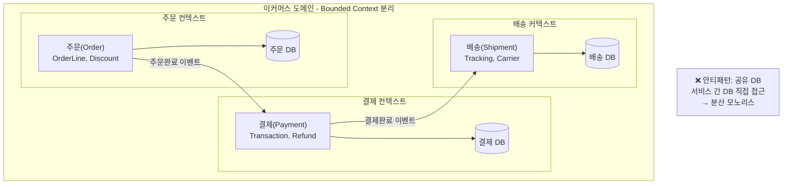

#### API Gateway: 단일 진입점 vs 병목 위험

API Gateway는 클라이언트에게 단일 진입점을 제공하여 라우팅, 인증, 속도 제한, 프로토콜 변환을 중앙화한다. 하지만 **단일 장애점(SPOF)**과 **병목 위험**이 동시에 발생한다.

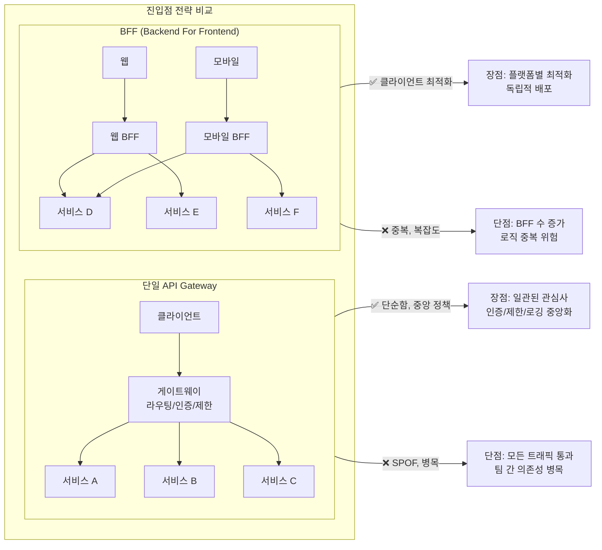

### 트레이드오프와 의사결정

#### Saga 패턴 vs 2PC: 장기 실행 트랜잭션의 비동기 보상

분산 트랜잭션에서 "일관성"을 어떻게 보장할 것인가는 핵심 설계 결정이다. 2PC(Two-Phase Commit)는 강한 일관성을 보장하지만 락 보유 시간이 길고 가용성이 낮아진다. Saga는 최종 일관성(Eventual Consistency)을 채택하여 가용성을 높이지만 보상 로직의 복잡도가 증가한다.

| 기준 | 2PC | Saga (Choreography) | Saga (Orchestration) |
|---|---|---|---|
| 일관성 | 강한 일관성 (ACID) | 최종 일관성 | 최종 일관성 |
| 락 보유 | 전체 prepare→commit | 없음 | 없음 |
| 가용성 | 낮음 (코디네이터 SPOF) | 높음 | 중간 (오케스트레이터 SPOF) |
| 복잡도 | 코디네이터 필요 | 이벤트 체인 관리 | 중앙 오케스트레이터 |
| 보상 로직 | 자동 롤백 | 명시적 보상 TX 필수 | 명시적 보상 TX 필수 |

```mermaid
sequenceDiagram
    participant Client
    participant Orchestrator as Saga 오케스트레이터
    participant OrderSvc as 주문 서비스
    participant PaymentSvc as 결제 서비스
    participant InventorySvc as 재고 서비스

    Client->>Orchestrator: 주문 요청
    Orchestrator->>OrderSvc: 주문 생성
    OrderSvc-->>Orchestrator: ✅ 성공
    Orchestrator->>PaymentSvc: 결제 요청
    PaymentSvc-->>Orchestrator: ❌ 실패 (잔액 부족)

    Note over Orchestrator: 보상 트랜잭션 시작
    Orchestrator->>OrderSvc: 주문 취소 (보상 TX)
    OrderSvc-->>Orchestrator: ✅ 보상 완료
    Orchestrator-->>Client: 주문 실패 응답
```

#### CQRS + 이벤트 소싱: 읽기/쓰기 분리의 복잡도 비용

CQRS(Command Query Responsibility Segregation)는 읽기 모델과 쓰기 모델을 분리하여 각각 독립적으로 최적화한다. 이벤트 소싱과 결합하면 완전한 이력 추적과 시간 여행(Time Travel) 디버깅이 가능하다. 하지만 **복잡도가 매우 높아지며**, 대부분의 CRUD 애플리케이션에는 과도한 설계이다.

도입 판단 기준:
- **도입 적합**: 읽기/쓰기 비율 10:1 이상, 복잡한 쿼리 요구사항, 감사 로그 필수
- **도입 비적합**: 단순 CRUD, 상태 변경 빈도 낮음, 팀 규모 작음

```mermaid
flowchart TD
    subgraph "CQRS + 이벤트 소싱 아키텍처"
        Command["명령 (Command)\n상태 변경 요청"] --> EventStore["이벤트 저장소\n불변 이벤트 시퀀스"]
        EventStore --> Projection["프로젝션 업데이트\n이벤트 → 읽기 모델 반영"]
        Projection --> ReadModel["읽기 모델\n쿼리 최적화 든러마라이즈드 분"]

        Query["조회 (Query)\n데이터 읽기 요청"] --> ReadModel

        EventStore --> Replay["이벤트 리플레이\n상태 재구성"]
        EventStore --> Snapshot["스냅샷\nN 이벤트마다 체크포인트"]
    end

    ReadModel -->|"✅ 장점"| CQRS_Pro["읽기/쓰기 독립 확장\n완전한 감사 이력\n시간 여행 디버깅"]
    ReadModel -->|"❌ 단점"| CQRS_Con["최종 일관성 지연\n프로젝션 복잡도\n이벤트 스키마 진화 난이도"]
```

### 리팩토링과 설계 원칙

#### 서비스 메시(Istio) 도입: 복잡도 비용 vs 가시성/제어 이득

서비스 메시는 애플리케이션 코드 수정 없이 트래픽 관리, mTLS, 관측 가능성을 제공한다. 하지만 사이드카 프록시의 리소스 소비, 운영 복잡도, 디버깅 난이도를 동반한다.

리팩토링 관점에서 서비스 메시는 **관심사 분리(Separation of Concerns)의 극단적 적용**이다:
- 애플리케이션 코드에서 네트워크 관심사 제거
- 인프라와 비즈니스 로직의 명확한 경계
- 단, 인프라 복잡도가 새로운 장애점이 될 수 있음

```mermaid
flowchart TD
    subgraph "서비스 메시 도입 판단"
        Start{"서비스 수 > 10?"}
        Start -->|"예"| Q2{"팀이 메시 운영 가능?"}
        Start -->|"아니오"| NoMesh["서비스 메시 불필요\n라이브러리 레벨 충분"]

        Q2 -->|"예"| Q3{"보안 요구사항\n(mTLS 필수)?"}
        Q2 -->|"아니오"| LightMesh["경량 대안 고려\nLinkerd (Envoy 대신 경량 프록시)"]

        Q3 -->|"예"| FullMesh["✅ Istio 도입\n사이드카 프록시 + 컨트롤 플레인"]
        Q3 -->|"아니오"| PartialMesh["부분 도입\n관측만 또는 트래픽 관리만"]
    end
```

### 디자인 패턴 적용

#### 서킷 브레이커, Outbox 패턴, 스트랭글러 피그 패턴 적용

마이크로서비스의 핵심 디자인 패턴들은 분산 시스템의 본질적 어려움을 해결한다:

- **서킷 브레이커**: 연쇄 장애 방지 — 실패하는 서비스 호출을 차단하여 전체 시스템 보호
- **Outbox 패턴**: 원자적 메시지 발행 — DB 쓰기와 이벤트 발행을 동일 트랜잭션으로 보장
- **스트랭글러 피그**: 첐나리아 릴리즈(Canary Release) — 새 버전을 일부 트래픽에만 노출하여 안전하게 배포

```mermaid
stateDiagram-v2
    [*] --> Closed: 초기 상태
    Closed --> Open: 실패 임계값 초과\n(예: 5회 연속 실패)
    Open --> HalfOpen: 타이머 만료\n(예: 30초)
    HalfOpen --> Closed: 프로브 성공\n트래픽 복원
    HalfOpen --> Open: 프로브 실패\n다시 차단

    state Closed {
        [정상] : 모든 요청 통과\n실패 카운터 모니터링
    }
    state Open {
        [차단] : 모든 요청 즉시 실패\nfallback 응답 반환
    }
    state HalfOpen {
        [테스트] : 1개 프로브 요청만 허용\n나머지 즉시 실패
    }
```

**설계 원칙 정리**: 마이크로서비스 설계의 본질은 "어디에 복잡도를 놓을 것인가"이다. 복잡도는 사라지지 않고 이동한다 — 코드에서 인프라로, 동기에서 비동기로, 로컨에서 네트워크로. 성공적인 마이크로서비스는 팀의 운영 능력과 도메인 복잡도를 정직하게 평가하고, 필요한 만큼만 복잡하게 만드는 팀이 구축한다.

## 연습 문제

### 1. 시스템 구조와 모델링

**문제 1-1. API Gateway + 서비스 메시(Istio)의 요청 흐름**

전자상거래 플랫폼에서 사용자가 브라우저에서 "상품 상세 페이지"를 요청했다. 이 요청은 API Gateway → Envoy sidecar → Product Service → Envoy sidecar → Review Service로 흐른다. 시스템에는 Istio 서비스 메시가 설정되어 있다.

(1) API Gateway와 서비스 메시(Istio/Envoy sidecar)가 각각 담당하는 책임을 구분하라. API Gateway가 처리하는 관심사(인증, 라우팅, 속도 제한)와 서비스 메시가 처리하는 관심사(mTLS, 로드밸런싱, 관측성)는 어떻게 다른가?  
(2) Product Service가 Review Service를 호출할 때, 요청이 "Product의 Envoy sidecar → Review의 Envoy sidecar → Review Service"로 흐르는 이유는 무엇인가? sidecar 패턴이 애플리케이션 코드에서 네트워크 관심사를 분리하는 방법을 설명하라.  
(3) 만약 Review Service가 응답 지연을 일으키면, Istio의 트래픽 정책(timeout, retry, circuit breaker)이 어떻게 Product Service를 보호하는가? 이 정책이 애플리케이션 코드가 아닌 인프라 레벨에서 적용되는 것의 장단점을 논하라.

<details><summary>힌트 보기</summary>

API Gateway는 외부 트래픽의 진입점(north-south traffic)이고, 서비스 메시는 내부 서비스 간 통신(east-west traffic)을 관리한다. Envoy sidecar는 각 Pod에 주입되어 투명한 프록시(transparent proxy)로 동작하므로, 애플리케이션은 단순히 `http://review-service`로 요청하면 된다. 인프라 레벨 정책은 애플리케이션 코드 수정 없이 적용 가능하지만, 비즈니스 로직에 맞는 세밀한 제어가 어려울 수 있다.

</details>

**문제 1-2. Saga 패턴(Choreography)의 보상 트랜잭션**

온라인 쇼핑몰에서 주문 프로세스가 다음 4단계로 구성된다: 주문 생성 → 결제 처리 → 재고 차감 → 배송 요청. 각 단계는 별도의 마이크로서비스이며, Choreography 기반 Saga로 구현되어 있다.

결제까지 성공했지만, 재고 차감 서비스에서 "재고 부족"으로 실패했다.

(1) Choreography 기반 Saga에서 각 서비스가 이벤트를 발행하고 구독하는 흐름을 다이어그램으로 설명하라. 중앙 코디네이터 없이 어떻게 전체 트랜잭션의 진행 상태를 추적하는가?  
(2) 재고 차감 실패 시 발행되는 보상 이벤트가 결제 서비스와 주문 서비스에 어떻게 전파되어 각각 "결제 취소"와 "주문 취소"를 수행하는가? 보상 트랜잭션이 실패하면 어떻게 되는가?  
(3) Choreography와 Orchestration 방식의 Saga를 비교하라. 서비스 수가 10개 이상으로 늘어날 때, 각 방식의 복잡성이 어떻게 변화하며 어떤 상황에서 어떤 방식이 적합한가?

<details><summary>힌트 보기</summary>

Choreography에서 각 서비스는 성공/실패 이벤트를 발행하고, 관심 있는 서비스가 이를 구독한다. 재고 실패 시 `InventoryFailed` 이벤트가 발행되면, 결제 서비스가 이를 구독하여 환불을 수행하고, 주문 서비스가 주문 상태를 취소로 변경한다. 보상 실패 시 재시도 + 데드 레터 큐로 처리한다. Choreography는 서비스 수가 늘면 이벤트 흐름 파악이 어려워지고, Orchestration은 중앙 코디네이터가 복잡성을 흡수하지만 단일 장애점이 될 수 있다.

</details>

**문제 1-3. 이벤트 소싱과 CQRS의 시스템 구조**

은행 계좌 서비스에서 이벤트 소싱(Event Sourcing)과 CQRS(Command Query Responsibility Segregation)를 도입했다. 입금/출금 명령이 이벤트로 저장되고, 조회용 뷰(Read Model)는 별도의 프로젝션으로 구성된다.

(1) 이벤트 소싱에서 "현재 잔액"은 저장되지 않고 이벤트 스트림을 리플레이하여 계산된다. 이 접근의 장점(감사 추적, 시간 여행)과 이벤트 스트림이 길어질 때의 성능 문제를 설명하라. 스냅샷(snapshot) 패턴은 이 문제를 어떻게 해결하는가?  
(2) CQRS에서 명령(Command) 모델과 조회(Query) 모델이 분리되면, 쓰기 직후 읽기에서 "아직 반영되지 않은 데이터"를 읽는 최종적 일관성(eventual consistency) 문제가 발생한다. 이를 사용자 경험 측면에서 어떻게 완화하는가?  
(3) 이벤트 스키마가 시간이 지나면서 변경될 때(예: 필드 추가/삭제), 과거 이벤트를 어떻게 처리하는가? 이벤트 업캐스팅(upcasting)과 이벤트 버전 관리 전략을 설명하라.

<details><summary>힌트 보기</summary>

이벤트 소싱은 상태 대신 상태 변화의 기록을 저장한다. 스냅샷은 특정 시점의 상태를 저장하여 리플레이 시 모든 이벤트를 처음부터 재생하지 않도록 한다. 최종적 일관성은 "내가 방금 쓴 내용 읽기(read-your-own-writes)" 패턴이나 UI에서의 낙관적 업데이트(optimistic update)로 완화한다. 이벤트 업캐스팅은 이전 버전 이벤트를 새 버전으로 변환하는 매퍼를 두어 하위 호환성을 유지한다.

</details>

### 2. 트레이드오프와 의사결정

**문제 2-1. 서비스 경계 설계: 모놀리스 우선 vs 마이크로서비스 우선**

스타트업이 전자상거래 플랫폼을 구축한다. 도메인은 "사용자-주문-상품-결제" 4개 영역이다. 현재 개발 팀은 3명이지만, 1년 후 30명으로 확장 예정이다.

(1) 3명 팀이 처음부터 4개 마이크로서비스로 시작할 때 발생하는 문제를 "운영 오버헤드", "분산 시스템 복잡성", "도메인 이해 부족" 측면에서 설명하라.  
(2) "모놀리스 우선(Monolith First)" 전략에서 모듈 경계를 깔끔하게 유지하면서도 나중에 서비스로 분리할 수 있도록 설계하는 방법을 제안하라. 내부 모듈 간 통신을 인터페이스로 추상화하는 것이 왜 중요한가?  
(3) 팀이 30명으로 성장한 후, 어떤 신호(signal)를 기준으로 서비스 분리를 결정해야 하는가? 콘웨이의 법칙(Conway's Law)이 이 결정에 어떤 영향을 미치는가?

<details><summary>힌트 보기</summary>

3명이 4개 서비스를 운영하면 한 사람이 여러 서비스의 배포/모니터링/장애 대응을 담당해야 한다. 도메인 경계가 불명확한 초기에 잘못 나눈 서비스는 잦은 동기 호출과 분산 트랜잭션으로 이어진다. 모듈 간 인터페이스 추상화는 나중에 네트워크 호출로 교체할 수 있는 "접합점(seam)"을 만든다. 콘웨이의 법칙에 따라 팀 구조가 시스템 구조에 반영되므로, 팀 분리 시점이 서비스 분리 시점의 좋은 지표가 된다.

</details>

**문제 2-2. 동기 REST vs 비동기 메시지 큐: 통신 방식 선택**

마이크로서비스 아키텍처에서 두 가지 시나리오가 있다:
- **시나리오 A**: 사용자가 상품 페이지에서 "재고 확인" 버튼을 클릭하면 실시간으로 재고 수를 표시해야 한다.
- **시나리오 B**: 주문이 완료되면 사용자에게 확인 이메일을 발송해야 한다.

(1) 각 시나리오에 동기 REST와 비동기 메시지 큐(예: Kafka) 중 어떤 방식이 적합한가? 선택의 근거를 "응답 시간 요구사항", "결합도", "실패 시 재시도" 측면에서 설명하라.  
(2) 시나리오 A에서 재고 서비스가 일시적으로 장애를 겪을 때, 동기 호출의 한계와 이를 보완하는 캐싱, Circuit Breaker, Fallback 전략을 설명하라.  
(3) 시나리오 B에서 Kafka를 사용할 때, "최소 한 번 전달(at-least-once delivery)"로 인해 이메일이 중복 발송될 수 있다. 멱등성(idempotency)을 어떻게 보장하는가?

<details><summary>힌트 보기</summary>

실시간 응답이 필요한 재고 확인은 동기 REST가 적합하고, 즉시 응답이 필요 없는 이메일 발송은 비동기 메시지 큐가 적합하다. Circuit Breaker는 장애 서비스에 대한 호출을 차단하고 fallback(예: 캐시된 재고 수)을 반환한다. 멱등성은 이메일 발송 전 "이미 발송했는지" 체크(예: 주문 ID 기반 중복 검사 테이블)하거나, Kafka의 consumer offset 관리로 보장한다.

</details>

**문제 2-3. 서비스 간 데이터 일관성 전략**

주문 서비스가 주문을 생성할 때, 재고 서비스의 재고를 차감하고 결제 서비스의 결제를 처리해야 한다. 모놀리스에서는 단일 DB 트랜잭션으로 처리했지만, 마이크로서비스에서는 각 서비스가 별도 DB를 가진다.

(1) 분산 환경에서 2PC(Two-Phase Commit)를 사용하면 왜 "느리고 깨지기 쉬운" 시스템이 되는가? CAP 정리와 연결하여 설명하라.  
(2) Saga 패턴과 Outbox 패턴을 조합하여 최종적 일관성(eventual consistency)을 달성하는 구체적인 설계를 제안하라.  
(3) "비즈니스적으로 최종적 일관성을 허용할 수 있는가?"라는 질문이 기술 선택보다 먼저 와야 하는 이유를 설명하라. 강한 일관성(strong consistency)이 반드시 필요한 비즈니스 시나리오의 예를 들어라.

<details><summary>힌트 보기</summary>

2PC는 코디네이터 장애 시 참여자가 블로킹 상태에 빠지며, 네트워크 파티션에서 가용성을 희생한다. Outbox 패턴은 로컬 DB에 이벤트를 테이블에 기록하고, CDC(Change Data Capture)로 메시지 큐에 발행하여 DB 쓰기와 메시지 발행의 원자성을 보장한다. 항공 좌석 예약이나 금융 결제처럼 이중 판매/이중 차감이 허용되지 않는 영역에서는 강한 일관성이 필요하다.

</details>

### 3. 문제 해결 및 리팩토링

**문제 3-1. 동기 체인의 연쇄 장애 해결**

마이크로서비스 시스템에서 서비스 A → B → C → D의 동기 호출 체인이 있다. 평상시 각 서비스의 응답 시간은 50ms이므로 전체 200ms다. 그런데 서비스 D의 DB가 느려져 응답 시간이 5초로 증가했고, 연쇄적으로 A, B, C 모두 응답 지연을 겪고 있다. 결국 A의 스레드 풀이 고갈되어 다른 요청도 처리하지 못하게 되었다.

(1) 이 상황을 "연쇄 장애(cascading failure)"라고 하는 이유를 설명하고, 스레드 풀 고갈이 다른 무관한 요청에까지 영향을 미치는 메커니즘을 분석하라.  
(2) Timeout, Circuit Breaker, Bulkhead(격벽 패턴)를 각각 적용하여 내성(resilience)을 확보하는 방법을 설명하라. 이 세 가지가 어떻게 상호 보완적인가?  
(3) 더 근본적인 해결책으로, A→D의 동기 체인 중 일부를 비동기 메시지 큐로 전환하는 리팩토링을 제안하라. 어떤 기준으로 동기와 비동기를 구분해야 하는가?

<details><summary>힌트 보기</summary>

D의 지연이 C의 스레드를 블로킹하고, C의 지연이 B의 스레드를 블로킹하는 연쇄 효과가 발생한다. Timeout은 무한 대기를 방지하고, Circuit Breaker는 장애 서비스로의 호출 자체를 차단하며, Bulkhead는 스레드 풀을 분리하여 한 서비스의 장애가 다른 서비스에 영향을 주지 않게 한다. 실시간 응답이 필요한 호출만 동기로 유지하고, 후속 처리(알림, 로깅 등)는 비동기로 전환한다.

</details>

**문제 3-2. 분산 모놀리스(Distributed Monolith) 안티패턴 탈출**

마이크로서비스를 도입한 스타트업에서, 8개 서비스가 모두 하나의 PostgreSQL 데이터베이스를 공유하고 있다. 서비스 간 데이터 접근은 직접 SQL 조인으로 이루어진다. 최근 스키마 변경 시 8개 서비스를 동시에 배포해야 하는 상황이 반복되고 있다.

(1) 이 상태가 "마이크로서비스"가 아닌 "분산 모놀리스"인 이유를 "독립적 배포 불가", "데이터 결합도", "장애 격리 실패" 측면에서 설명하라.  
(2) "DB per Service" 패턴으로 마이그레이션하는 구체적인 단계를 제안하라. 공유 테이블을 각 서비스의 소유로 분리하고, 기존 JOIN을 API 호출 또는 이벤트 기반 데이터 복제로 대체하는 전략은?  
(3) 마이그레이션 과정에서 "이중 쓰기(dual write)" 문제가 발생할 수 있다. Outbox 패턴과 CDC(Change Data Capture)를 활용하여 이 문제를 어떻게 안전하게 처리하는가?

<details><summary>힌트 보기</summary>

공유 DB는 스키마 변경 시 모든 서비스에 영향을 주어 독립 배포의 핵심 이점을 무효화한다. 마이그레이션은 (1) 읽기 전용 접근을 API로 전환 → (2) 쓰기를 소유 서비스로 이전 → (3) 물리적 DB 분리의 순서로 진행한다. 이중 쓰기(DB에 쓰고 이벤트도 발행)는 하나는 성공하고 하나는 실패할 수 있으므로, Outbox 테이블에 이벤트를 기록한 뒤 CDC(Debezium 등)로 메시지 큐에 발행하는 패턴이 안전하다.

</details>

**문제 3-3. 서비스 디스커버리 장애 대응**

Kubernetes 환경에서 서비스 디스커버리를 CoreDNS에 의존하고 있다. 갑자기 CoreDNS Pod가 OOM(Out of Memory)으로 재시작되면서, 수십 개 서비스가 서로를 찾지 못해 대규모 장애가 발생했다.

(1) DNS 기반 서비스 디스커버리의 단일 장애점(Single Point of Failure) 문제를 설명하라. CoreDNS가 장애를 겪으면 왜 이미 통신 중이던 서비스까지 영향을 받는가? (DNS TTL과 캐싱의 관계)  
(2) 이 장애를 예방하기 위한 다층 방어 전략(CoreDNS 고가용성 설정, 클라이언트 측 캐싱, 서비스 메시의 서비스 디스커버리 보완)을 제안하라.  
(3) Consul, Eureka 같은 전용 서비스 디스커버리 시스템이 DNS보다 어떤 이점을 제공하는가? 반면 Kubernetes 네이티브 디스커버리를 유지하는 것의 장점은?

<details><summary>힌트 보기</summary>

DNS 레코드는 TTL이 만료되면 재조회가 필요하므로, CoreDNS 장애 시 새로운 연결 수립이 불가능하고 기존 캐시도 만료되면 영향을 받는다. CoreDNS를 PodDisruptionBudget + 높은 replica 수로 고가용성을 확보하고, ndots 설정 최적화와 node-local DNS 캐시를 도입한다. Consul은 헬스 체크 통합, 서비스 태깅 등 풍부한 기능을 제공하지만, Kubernetes 네이티브는 추가 인프라 없이 Service 리소스만으로 동작하는 단순성이 장점이다.

</details>

### 4. 개념 간의 연결성

**문제 4-1. DDD Bounded Context + Kafka: Anti-Corruption Layer 설계**

전자상거래 시스템에서 주문 컨텍스트(Order Context)의 `OrderPlaced` 이벤트가 Kafka를 통해 배송 컨텍스트(Shipping Context)로 전달된다. 주문 컨텍스트의 `Order`에는 `items`, `totalAmount`, `customerId`가 있지만, 배송 컨텍스트의 `Shipment`에는 `packages`, `weight`, `destinationAddress`가 필요하다.

(1) 배송 컨텍스트가 주문 컨텍스트의 `Order` 모델을 그대로 사용하면 왜 문제가 되는가? "모델 오염(model corruption)"과 "컨텍스트 간 결합도" 관점에서 설명하라.  
(2) Anti-Corruption Layer(ACL)가 `OrderPlaced` 이벤트를 `ShipmentRequested` 이벤트로 변환하는 구체적인 설계를 제안하라. ACL은 어느 컨텍스트에 위치해야 하며, 스키마 변환 로직을 어떻게 관리하는가?  
(3) 주문 컨텍스트가 이벤트 스키마를 변경하면(예: `items` 필드명을 `orderLines`로 변경), ACL이 이를 어떻게 흡수하여 배송 컨텍스트에 영향을 주지 않게 하는가? 이벤트 스키마 진화(schema evolution) 전략과의 관계를 논하라.

<details><summary>힌트 보기</summary>

다른 컨텍스트의 모델을 직접 사용하면 해당 컨텍스트의 변경이 곧바로 전파되어 독립적 진화가 불가능하다. ACL은 소비자 컨텍스트(배송) 측에 위치하여 외부 이벤트를 자신의 도메인 언어로 번역한다. Kafka Schema Registry와 Avro/Protobuf의 호환성 규칙(backward/forward compatibility)을 활용하여 스키마 진화를 안전하게 관리하고, ACL이 변환 어댑터 역할을 한다.

</details>

**문제 4-2. 서비스 메시 + 분산 트레이싱: 장애 병목 서비스 특정**

프로덕션 환경에서 주문 완료 API의 P99 응답 시간이 갑자기 5초로 증가했다. 시스템은 Istio 서비스 메시와 Jaeger 분산 트레이싱이 설정되어 있고, 관련 서비스는 API Gateway → Order → Payment → Inventory → Notification 5개이다.

(1) Jaeger에서 trace ID를 조회하여 각 서비스의 span을 분석할 때, 병목이 되는 서비스를 10초 내에 특정하는 절차를 단계별로 설명하라. span의 시작 시각과 지속 시간(duration)을 어떻게 해석하는가?  
(2) Istio의 Envoy sidecar가 자동으로 생성하는 트레이싱 헤더(`x-request-id`, `x-b3-traceid`)가 분산 트레이싱을 가능하게 하는 메커니즘을 설명하라. 애플리케이션 코드에서 헤더를 전파(propagate)하지 않으면 어떤 문제가 발생하는가?  
(3) 트레이싱 데이터의 샘플링 비율(예: 1%)을 설정하는 이유와, 100% 샘플링의 비용을 설명하라. 장애 상황에서만 샘플링을 100%로 올리는 동적 샘플링 전략은 어떻게 구현하는가?

<details><summary>힌트 보기</summary>

Jaeger UI에서 가장 긴 span을 찾으면 병목 서비스를 특정할 수 있다. 한 trace 내에서 각 span은 부모-자식 관계로 구성되므로, 자식 span의 duration이 부모 span의 대부분을 차지하면 그 서비스가 병목이다. Envoy는 요청에 트레이싱 헤더를 자동 주입하지만, 애플리케이션이 하위 서비스 호출 시 이 헤더를 전파하지 않으면 trace가 끊어진다. 100% 샘플링은 스토리지와 네트워크 비용이 크므로, Istio의 텔레메트리 설정이나 OpenTelemetry Collector에서 동적으로 비율을 조정한다.

</details>

**문제 4-3. 마이크로서비스 + 도메인 이벤트 + 읽기 모델 최적화**

상품 카탈로그 서비스에서 상품 정보가 변경되면, 검색 서비스의 Elasticsearch 인덱스, 추천 서비스의 Redis 캐시, 분석 서비스의 ClickHouse 테이블이 모두 업데이트되어야 한다.

(1) 상품 서비스가 3개 소비자에게 직접 API를 호출하여 동기적으로 업데이트하면 어떤 문제가 발생하는가? 결합도, 성능, 장애 전파 측면에서 분석하라.  
(2) 도메인 이벤트(`ProductUpdated`)를 Kafka에 발행하고 각 소비자가 독립적으로 구독하는 구조로 전환하라. 이 설계가 "시간적 결합(temporal coupling)"을 어떻게 제거하는가?  
(3) 소비자마다 다른 속도로 이벤트를 처리할 때, Kafka의 consumer group과 파티셔닝이 어떻게 도움이 되는가? 한 소비자의 장애가 다른 소비자에 영향을 미치지 않는 이유를 설명하라.

<details><summary>힌트 보기</summary>

동기 호출은 가장 느린 소비자의 응답 시간이 전체 응답 시간을 결정하고, 하나라도 장애 시 전체가 실패한다. 이벤트 기반 구조에서 상품 서비스는 이벤트를 발행하기만 하면 되므로 소비자의 존재를 알 필요가 없다(느슨한 결합). 각 소비자는 독립된 consumer group으로 별도의 offset을 관리하므로, 한 소비자가 느리거나 장애가 나도 다른 소비자의 처리에 영향을 주지 않는다.

</details>