# 기타 CS 주제 — 내부: 그래픽, 게임 엔진, IoT, SRE 및 DevOps 내부

> **초점**: 내부 메커니즘 - 도구 사용 방법이 아니라 게임 엔진이 ECS를 구현하는 방법, GPU가 셰이더 파이프라인을 실행하는 방법, Terraform이 상태를 추적하는 방법, SRE 오류 예산이 자동화된 결정을 내리는 방법.

---

## 1. 실시간 그래픽: GPU 렌더링 파이프라인 내부

### 래스터화 파이프라인

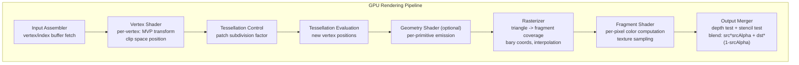

### 깊이 버퍼 및 Early-Z

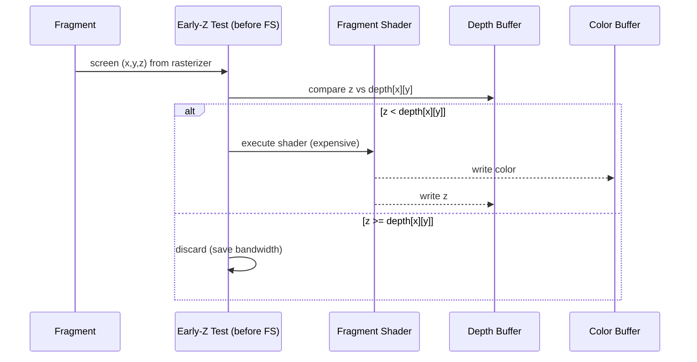

**Early-Z**는 셰이더 실행 전에 조각을 거부합니다. — 엄청난 성능 향상입니다. 셰이더가 깊이를 쓰거나 `discard`을 호출하면 깨집니다.

### 디퍼드 렌더링과 포워드 렌더링 비교

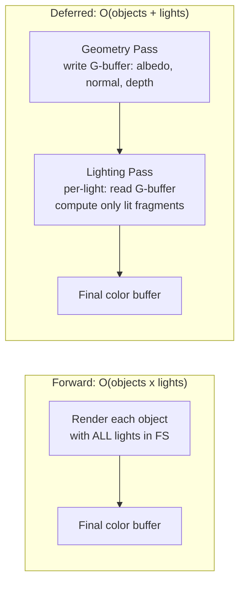

**G-버퍼 레이아웃**(MRT — 다중 렌더 타겟):
- RT0: 알베도(RGB) + 거칠기(A)
- RT1: 월드 노멀(RGB) + 금속성(A)
- RT2: 깊이(32비트 부동 소수점)
- RT3: 발광(RGB) + AO(A)

### 레이 트레이싱: BVH 탐색

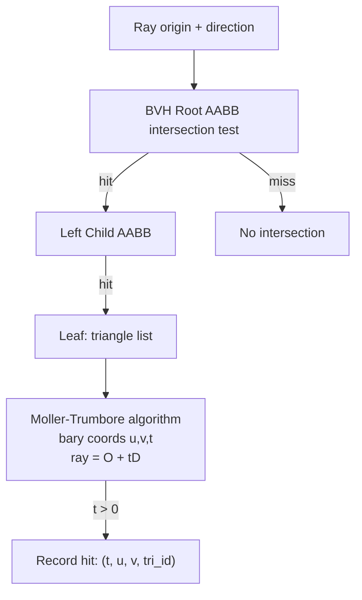

NVIDIA RTX는 하드웨어 BVH 탐색을 위해 **RT 코어**를 사용합니다. 즉, 셰이더 프로세서에서 트리 워크를 오프로드하는 고정 기능 장치입니다. BVH 빌드는 SAH(Surface Area Heuristic)를 통한 O(N log N)입니다.

---

## 2. 게임 엔진 아키텍처: ECS 및 물리학

### 엔터티-구성 요소-시스템 데이터 레이아웃

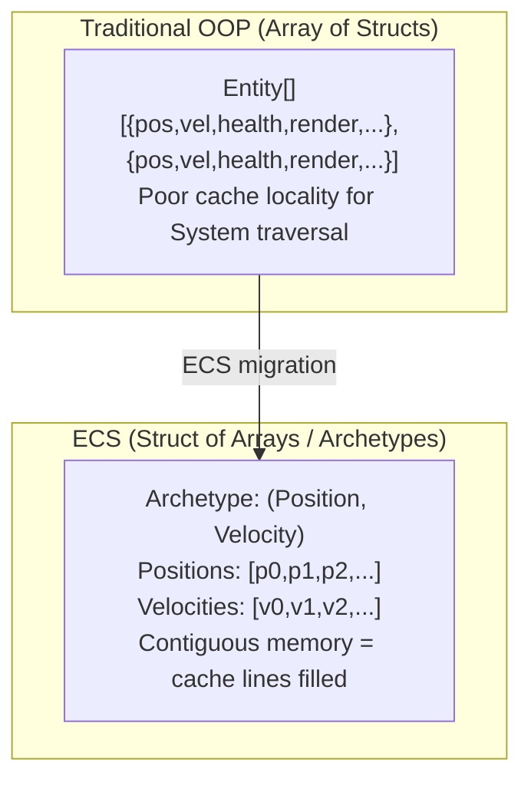

**아키타입** = 고유한 구성요소 유형 세트입니다. 동일한 구성 요소 세트를 가진 엔터티는 원형 테이블을 공유합니다. 엔터티 간 구성 요소 이동 = **아키타입 변경**(memcpy 행을 새 테이블로 이동)

### 물리 엔진: 넓은 단계 → 좁은 단계

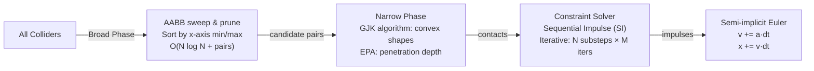

**GJK(Gilbert-Johnson-Keerthi)**: **Minkowski 차분 공간**에서 단체를 구축하여 볼록한 모양의 겹침을 감지합니다. 원점이 Minkowski 차이 내부에 있으면 모양이 겹칩니다.

### 게임 루프 타이밍

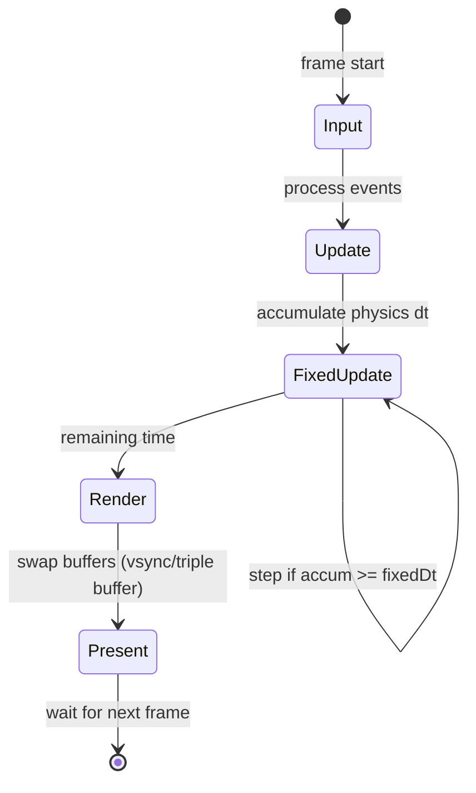

고정 시간 간격(일반적으로 50Hz)은 렌더링에서 물리적 안정성을 분리합니다. **보간 알파** = `accum / fixedDt`는 모든 FPS에서 부드러운 렌더링을 위해 마지막 두 물리 상태를 혼합합니다.

---

## 3. IoT 아키텍처: 엣지 컴퓨팅 및 프로토콜 내부

### MQTT 프로토콜 내부

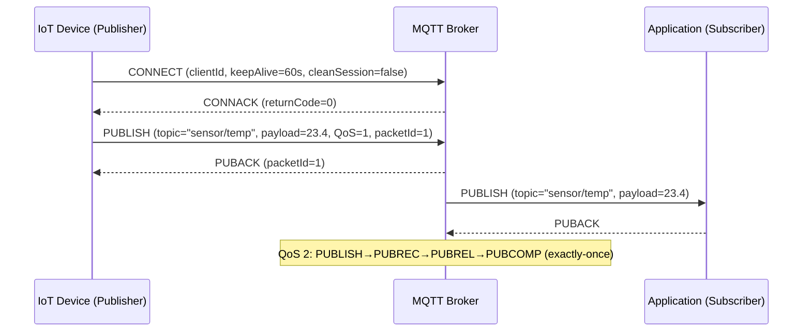

**QoS 수준**:
- QoS 0: 최대 1회(실행 후 잊어버리기, ACK 없음)
- QoS 1: 최소 한 번(PUBACK, 중복될 수 있음)
- QoS 2: 정확히 한 번(4-메시지 핸드셰이크, 저장 및 전달)

### 엣지 컴퓨팅: 데이터 파이프라인

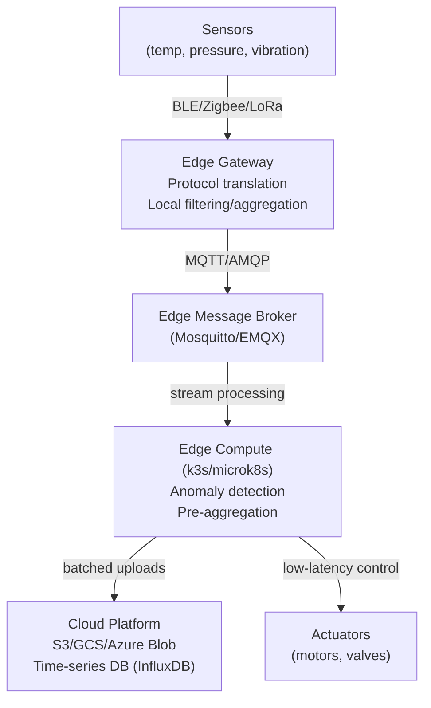

**로컬 루프 대기 시간**: 에지-액추에이터 < 10ms. 클라우드 왕복: 50~200ms — 실시간 제어에는 너무 느립니다.

### 제한된 장치의 TLS

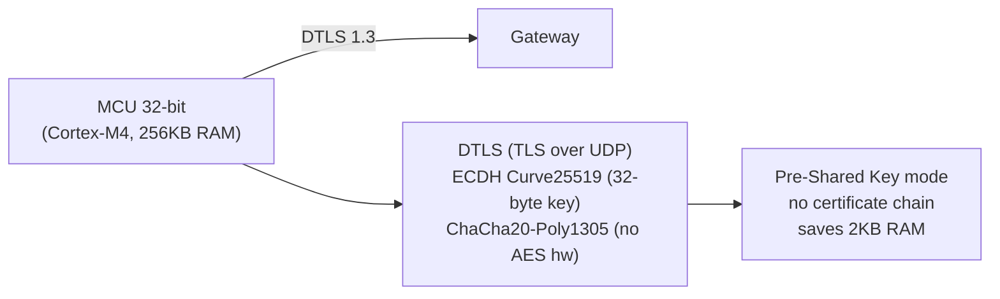

제한된 장치는 PSK와 함께 **DTLS**(데이터그램 TLS)를 사용하여 인증서 구문 분석 오버헤드를 방지합니다. ChaCha20은 AES 하드웨어 가속이 없는 장치에서 선호됩니다.

---

## 4. 코드형 인프라: Terraform 상태 머신 내부

### Terraform 계획/수명주기 적용

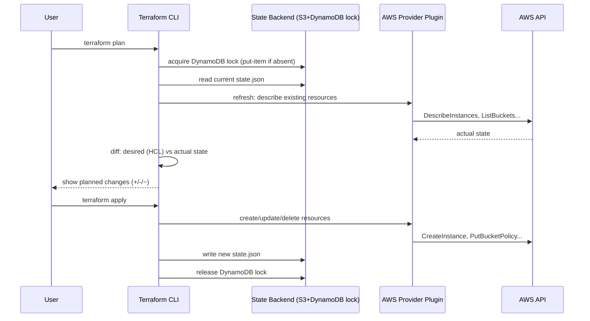

### 종속성 그래프 및 병렬성

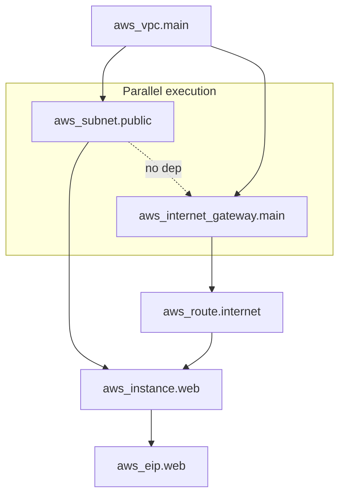

Terraform은 리소스의 DAG를 구축하고 종속성이 허용되는 경우 **병렬**을 적용합니다. `depends_on` 메타 인수는 암시적 종속성이 참조로 캡처되지 않을 때 명시적 가장자리를 강제합니다.

### 상태 파일 구조

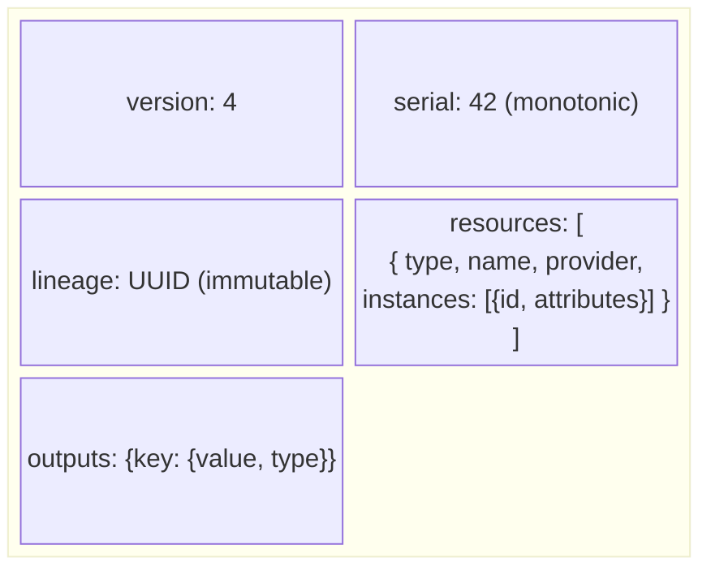

`serial` 적용할 때마다 증가 — **낙관적 잠금**에 사용됩니다. 원격 시리얼 > 로컬 시리얼인 경우 적용이 거부됩니다(다른 사람이 먼저 수정함).

---

## 5. Ansible: 푸시 기반 구성 내부

### 모듈 실행 메커니즘

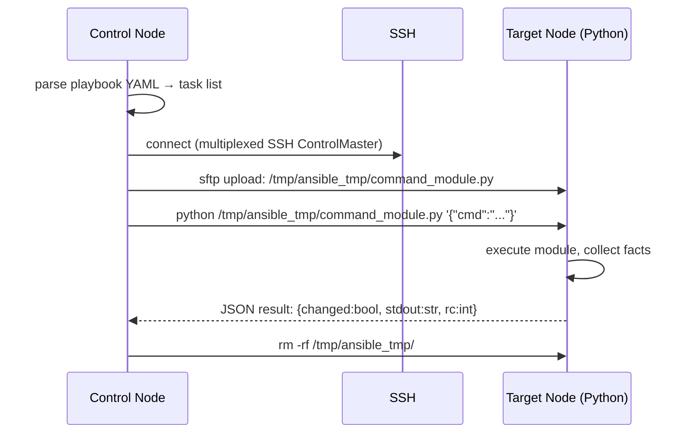

Ansible은 **에이전트가 없습니다** — Python 모듈 파일은 대상에 SCP로 지정되고 실행되며 작업별로 정리됩니다. 이는 Python을 대상에서 사용할 수 있어야 함을 의미합니다(SSH를 직접 사용하는 `raw` 모듈 제외).

### 멱등성 및 검사 모드

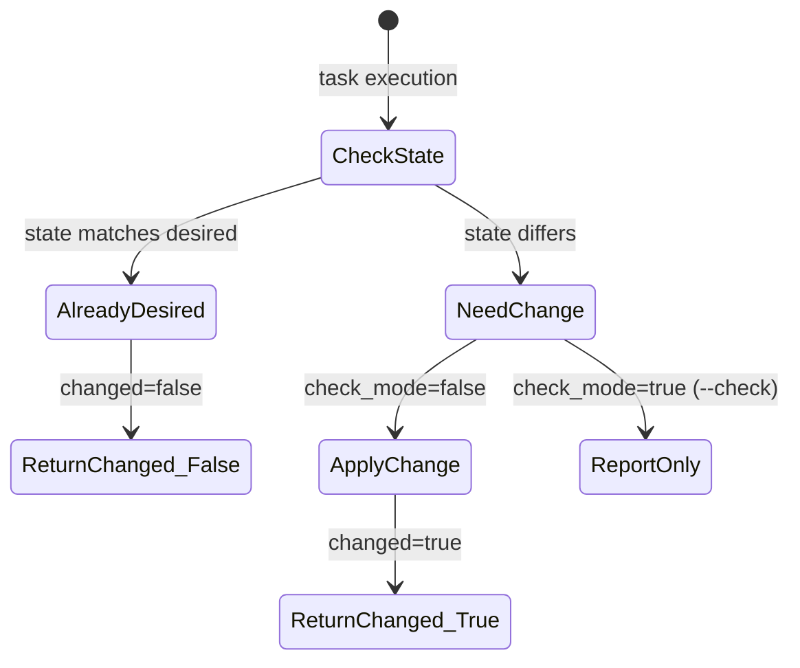

모듈은 멱등성 `get_state` → 비교 → `set_state` 논리를 구현해야 합니다. `--check` 모드는 `get_state` + 비교만 실행하고 전체 플레이북을 테스트 실행합니다.

---

## 6. SRE: 오류 예산, SLO 및 내부 알림

### SLO 오류 예산 메커니즘

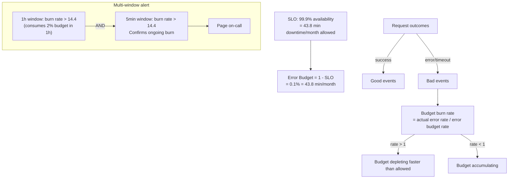

**다중 창 경고**(Google의 접근 방식): 짧은 창은 빠른 굽기를 감지하고, 긴 창은 오탐 없이 느린 굽기를 감지합니다.

### Prometheus 알림 규칙 평가

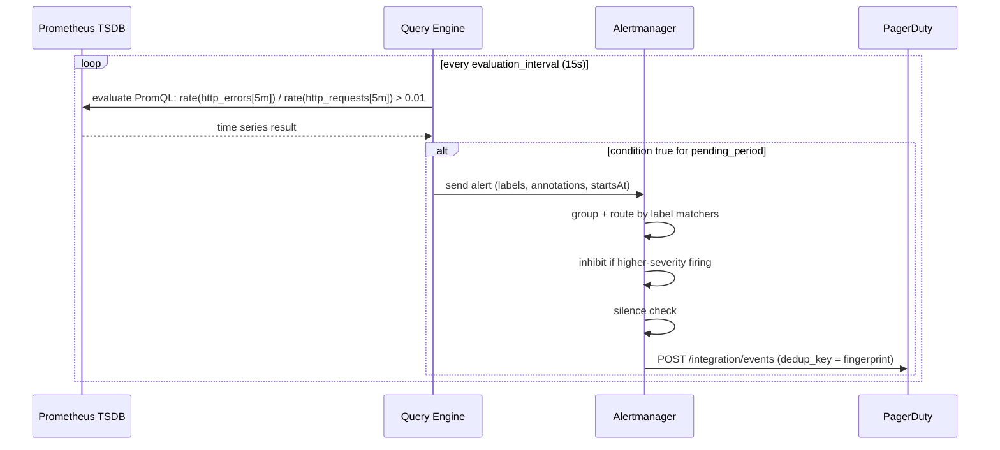

**핑거프린팅**: 경고 ID = 모든 라벨 키/값 쌍의 해시입니다. Alertmanager는 중복 제거 및 그룹화를 위해 지문을 사용합니다.

### 분산 추적: OpenTelemetry 컨텍스트 전파

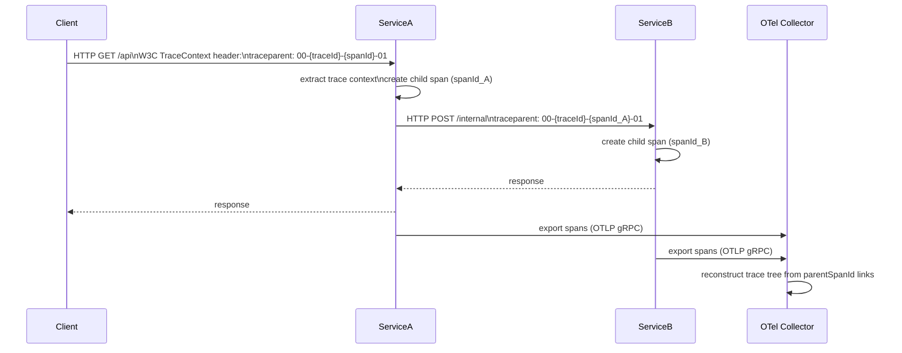

`traceId`(128비트)은 전체 요청 트리에 걸쳐 있습니다. `spanId`(64비트)은 한 서비스의 작업 단위를 식별합니다. `parentSpanId`는 하위 항목을 상위 항목에 연결하여 트리 재구성을 가능하게 합니다.

---

## 7. 테스트 방법론: 속성 기반 및 돌연변이 테스트 내부

### 속성 기반 테스트(QuickCheck / 가설)

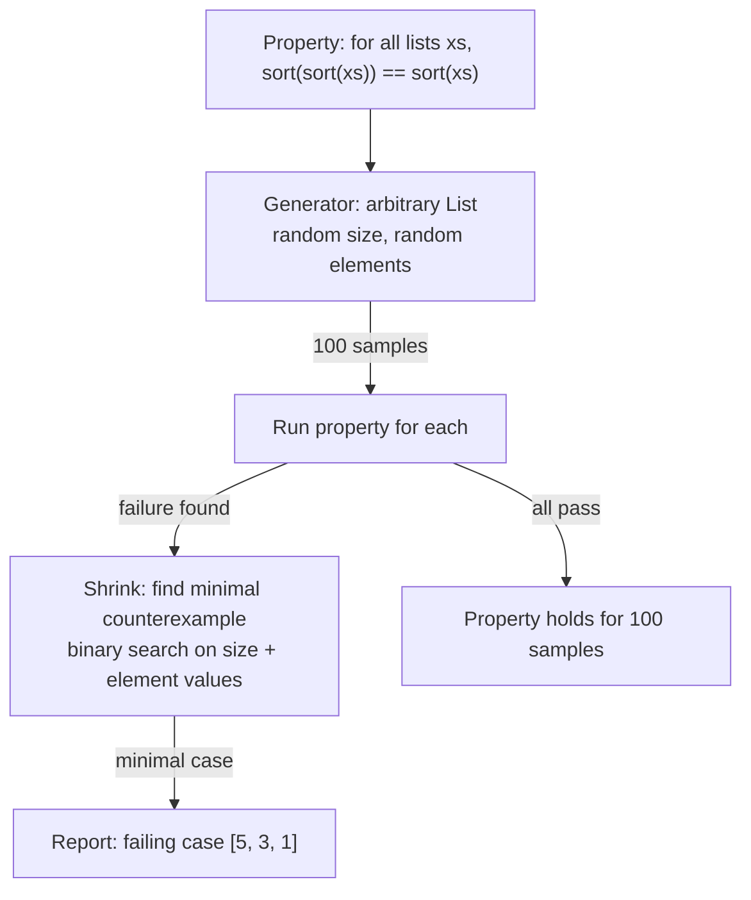

**축소**는 핵심 혁신입니다. QuickCheck는 무작위 오류를 보고할 뿐만 아니라 이를 가장 작은 반례로 최소화하여 버그를 디버깅할 수 있도록 만듭니다.

### 돌연변이 테스트 내부

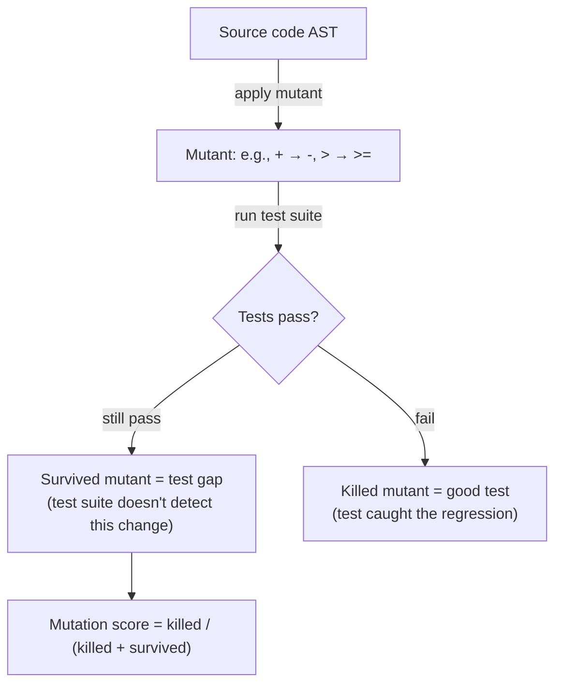

돌연변이 테스트 결과 **거짓 신뢰도**가 드러났습니다. 어설션이 정확한 값을 확인하지 않는 경우 100% 계통 적용 범위는 여전히 높은 생존 돌연변이율을 가질 수 있습니다.

---

## 8. 컴퓨터 그래픽: 셰이더 컴파일 및 SPIR-V

### GLSL → SPIR-V → 네이티브 ISA

```mermaid
flowchart TD
    GLSL["GLSL / HLSL source"] -->|glslangValidator| SPIRV["SPIR-V binary\n(vendor-neutral IR)"]
    SPIRV -->|driver compilation| ISA["GPU ISA\n(PTX→SASS for NVIDIA\nGCN for AMD\nEU ISA for Intel)"]
    SPIRV -->|optimization passes| SPIRV_Opt["spirv-opt: dead code elim\nvector width optimization"]
    SPIRV --> Vulkan["Vulkan VkShaderModule"]
    SPIRV --> Metal["SPIR-V Cross → MSL (Metal)"]
    SPIRV --> WebGPU["Naga → WGSL (WebGPU)"]
```

**SPIR-V**는 GPU 프로그램용 명시적 유형 시스템을 갖춘 레지스터 기반 SSA IR입니다. 백엔드 드라이버 컴파일에서 프런트엔드 언어를 분리하므로 하나의 셰이더가 여러 플랫폼을 대상으로 할 수 있습니다.

### 컴퓨팅 셰이더 스레드 계층 구조(CUDA/Vulkan 컴퓨팅)

```mermaid
block-beta
    columns 1
    block:hierarchy:1
        columns 1
        g["Grid: 3D array of thread groups"]
        b["Thread Group (workgroup): 64–256 threads\nshared local memory (LDS) ~48KB"]
        t["Thread (lane): executes shader\nregisters: 32–255 per thread"]
        w["Warp (SIMD32/SIMD64): 32/64 threads\nexecute in lockstep (SIMT)"]
    end
```

**워프 발산**: 워프의 스레드가 서로 다른 분기(`if (threadId % 2)`)를 취하는 경우 두 경로 모두 마스크된 비활성 레인을 사용하여 순차적으로 실행됩니다. 최악의 경우 활용도는 50%입니다.

---

## 9. 데이터베이스 내부: 쿼리 최적화 프로그램 및 실행 엔진

### 쿼리 최적화: 비용 기반 최적화 도구

```mermaid
flowchart TD
    SQL["SELECT * FROM orders o JOIN customers c ON o.cust_id = c.id WHERE c.country='US'"] --> Parse["Parse -> AST"]
    Parse --> Bind["Bind -> resolve table/column refs"]
    Bind --> Transform["Logical Plan: Filter -> Join -> Scan"]
    Transform --> Enumerate["Plan Enumeration\nDP: enumerate join orderings\nO(3^N) with pruning"]
    Enumerate --> CostModel["Cost Model\nI/O cost: #pages x seq_cost\nCPU cost: #rows x cpu_cost\nStats: table cardinality, column NDV, histograms"]
    CostModel --> BestPlan["Best Physical Plan\n(NestLoop vs HashJoin vs MergeJoin)\n(SeqScan vs IndexScan)"]
```

**통계**는 비용 추정을 유도합니다: `pg_statistic` 히스토그램, 가장 일반적인 값(MCV) 및 null 분수. 오래된 통계 → 잘못된 카디널리티 추정 → 잘못된 계획.

### 화산/반복자 실행 모델

```mermaid
sequenceDiagram
    participant Parent as HashAggregate
    participant Child as HashJoin
    participant L as SeqScan (orders)
    participant R as IndexScan (customers)

    Parent->>Child: next()
    Child->>L: next() [build phase: read all right side]
    L-->>Child: tuple
    Child->>R: next()
    R-->>Child: tuple
    Child->>Child: probe hash table
    Child-->>Parent: matched tuple
    Parent->>Parent: update hash group aggregate
```

**풀 모델(화산)**: 각 연산자는 하위 항목에 대해 `next()`을 호출합니다. 간단하지만 함수 호출 오버헤드가 높습니다. 벡터화된 실행(DuckDB, ClickHouse)은 `next()` 호출당 1024개 행의 배치를 처리합니다.

---

## 10. 애자일 및 소프트웨어 엔지니어링 프로세스 내부

### Git 분기 전략: 내부 메커니즘

```mermaid
flowchart LR
    subgraph "Trunk-Based Development"
        Main["main branch"] -->|short-lived| FB["feature branch\n(< 2 days)"]
        FB -->|PR + merge| Main
        Main -->|tag| Release["Release tag"]
    end
    subgraph "Gitflow"
        GF_Main["main"] ---|sync| GF_Dev["develop"]
        GF_Dev --> GF_Feature["feature/x"]
        GF_Dev --> GF_Release["release/1.2"]
        GF_Release --> GF_Main
        GF_Main --> GF_Hotfix["hotfix/y"]
        GF_Hotfix --> GF_Main
        GF_Hotfix --> GF_Dev
    end
```

### CI/CD 파이프라인 실행 그래프

```mermaid
flowchart TD
    Push["git push"] -->|webhook| CI["CI Server\n(Jenkins/GitLab CI/GitHub Actions)"]
    CI --> Checkout["checkout + cache restore"]
    Checkout --> Parallel{parallel jobs}
    Parallel --> Lint["lint + static analysis"]
    Parallel --> UnitTest["unit tests"]
    Parallel --> Build["build artifact"]
    Lint & UnitTest --> IntTest["integration tests\n(docker-compose up)"]
    IntTest & Build --> Package["package Docker image\ndocker build + push registry"]
    Package -->|tag=main| StagingDeploy["deploy to staging\nkubectl rollout"]
    StagingDeploy --> E2E["e2e tests (Playwright)"]
    E2E -->|manual approval| ProdDeploy["deploy to production\nblue/green or canary"]
```

---

## 11. 운영 체제 스케줄링: 실시간 및 멀티 코어

### 멀티 코어 캐시 일관성(MESI 프로토콜)

```mermaid
stateDiagram-v2
    [*] --> Invalid: cache line not present
    Invalid --> Exclusive: CPU reads, no other has it
    Exclusive --> Modified: CPU writes (no bus traffic)
    Modified --> Shared: another CPU reads (write-back + share)
    Exclusive --> Shared: another CPU reads
    Shared --> Modified: CPU writes (invalidate others)
    Shared --> Invalid: another CPU writes
    Modified --> Invalid: another CPU writes (must evict)
```

**거짓 공유**: 서로 다른 CPU에 의해 수정된 동일한 캐시 라인(64B)의 두 변수 → 지속적인 MESI 상태 전환 → 실행 직렬화. 수정: `__cacheline_aligned` / `@Contended` 주석.

### NUMA 메모리 액세스 패턴

```mermaid
flowchart LR
    subgraph "NUMA Node 0"
        CPU0["CPU 0–15\nL3 Cache 30MB"]
        RAM0["Local DRAM\n64GB\n~50ns latency"]
    end
    subgraph "NUMA Node 1"
        CPU1["CPU 16–31\nL3 Cache 30MB"]
        RAM1["Remote DRAM\n64GB\n~100ns latency (QPI/xGMI)"]
    end
    CPU0 -->|local| RAM0
    CPU0 -->|remote 2× slower| RAM1
    CPU1 -->|local| RAM1
```

`numactl --membind=0`은 로컬 NUMA 노드에 할당을 고정합니다. 교차 NUMA 할당으로 Java GC 오버헤드가 40~60% 증가합니다. JVM의 NUMA 인식 할당자(`-XX:+UseNUMAInterleaving`)가 이를 완화합니다.

---

## 요약: 기타 CS 내부 맵

```mermaid
mindmap
  root((Misc CS Internals))
    Graphics
      Rasterization pipeline stages
      G-buffer deferred rendering
      BVH ray traversal hardware
      SPIR-V cross-platform IR
      Warp divergence SIMT
    Game Engines
      ECS archetype memory layout
      GJK Minkowski difference
      Fixed timestep physics loop
      Interpolation rendering
    IoT
      MQTT QoS 3 levels
      DTLS constrained devices
      Edge compute local latency
    DevOps/IaC
      Terraform DAG parallelism
      State serial optimistic lock
      Ansible agentless SSH module
    SRE
      Error budget burn rate
      Multi-window alerting
      OTel trace context propagation
    Testing
      QuickCheck shrinking
      Mutation testing survivors
    Database
      Cost-based optimizer statistics
      Volcano pull model
      Vectorized batch execution
    OS/Multi-core
      MESI cache coherence protocol
      False sharing cache lines
      NUMA topology memory latency
```


---

## 설계적 고민

### 구조와 모델링

시스템 설계에서 **API 설계 패러다임 선택**은 전체 아키텍처를 결정하는 근본적 구조 결정입니다. REST는 리소스 중심의 직관적 인터페이스를 제공하지만 오버페칭/언더페칭 문제가 있고, GraphQL은 클라이언트가 필요한 데이터만 요청할 수 있지만 N+1 쿼리 문제와 복잡한 캠싱이 있습니다. gRPC는 바이너리 프로토콜로 최고 성능을 제공하지만 브라우저 직접 호출이 어렵습니다.

```mermaid
flowchart TD
    subgraph "API 설계 패러다임 비교"
        REST_API["REST\n- 리소스 중심 (URL + HTTP Method)\n- JSON 응답\n- 캐싱 용이 (HTTP 캐시)\n- 오버페칭 문제"]
        GQL["GraphQL\n- 단일 엔드포인트 (POST /graphql)\n- 클라이언트 주도 쿼리\n- 캐싱 복잡 (persisted query)\n- N+1 문제 (DataLoader 필요)"]
        GRPC["gRPC\n- Protobuf 바이너리 (10배 작은 페이로드)\n- HTTP/2 스트리밍\n- 양방향 스트리밍\n- 브라우저 지원 제한 (gRPC-Web)"]
        REST_API --> USE_REST["적합: 공개 API, CRUD, 브라우저 직접 호출"]
        GQL --> USE_GQL["적합: 복잡한 UI, 모바일 앱, BFF"]
        GRPC --> USE_GRPC["적합: 마이크로서비스 간, 실시간 스트리밍"]
    end
```

**메시지 큐 아키텍처** 선택도 시스템 구조에 큰 영향을 미칩니다. Kafka는 이벤트 스트리밍/로그 기반으로 재생(replay)이 가능하고, RabbitMQ는 전통적 메시지 브로커로 복잡한 라우팅을 지원하며, SQS는 완전 관리형으로 운영 부담이 없습니다.

### 트레이드오프와 의사결정

**캐싱 전략 선택**은 데이터 일관성과 성능 사이의 핵심 트레이드오프입니다. Cache-Aside는 애플리케이션이 캐시와 DB를 직접 관리하여 유연하지만, 캐시 무효화 로직이 복잡해질 수 있습니다. Write-Through는 일관성을 보장하지만 쓰기 지연이 증가하고, Write-Behind는 쓰기 성능이 높지만 데이터 손실 위험이 있습니다.

```mermaid
flowchart TD
    subgraph "Cache-Aside (가장 많이 사용)"
        CA_READ["읽기: App→Cache 조회"]
        CA_READ -->|"Hit"| CA_HIT["캐시 데이터 반환"]
        CA_READ -->|"Miss"| CA_MISS["DB 조회 → 캐시 저장 → 반환"]
        CA_WRITE["쓰기: DB 저장 → 캐시 삭제\n(다음 읽기 시 재적재)"]
    end
    subgraph "Write-Through"
        WT_WRITE["쓰기: Cache + DB 동시 저장\n일관성 보장\n쓰기 지연 증가"]
    end
    subgraph "Write-Behind (Write-Back)"
        WB_WRITE["쓰기: Cache에만 저장\n비동기로 DB 반영\n쓰기 성능 최대\n캐시 장애 시 데이터 손실 위험"]
    end
```

**직렬화 형식 선택**도 성능과 상호운용성 사이의 트레이드오프입니다.

| 형식 | 압축률 | 스키마 진화 | 사람 가독성 | 적합한 사용처 |
|---|---|---|---|---|
| JSON | 낮음 | 유연 (schemaless) | ✓ 높음 | 공개 API, 설정 파일 |
| Protobuf | 높음 (~10x 작음) | 엄격 (.proto) | ✗ 바이너리 | 마이크로서비스 간 통신 |
| MessagePack | 중간 (~2x 작음) | 유연 | ✗ 바이너리 | 실시간 메시징 |
| Avro | 높음 | 파일 내 스키마 포함 | ✗ 바이너리 | Kafka, 데이터 파이프라인 |

### 리팩토링과 설계 원칙

**기술 부체 관리**는 코드 품질과 개발 속도 사이의 핵심 설계 원칙입니다. 의도적 기술 부체(빠른 출시를 위한 의식적 선택)와 뵄도적 기술 부체(설계 부족 또는 이해 부족)를 구분해야 합니다.

```mermaid
flowchart TD
    subgraph "기술 부체 4사분면"
        Q1["의도적 + 신중한\n✓ 전략적 부체\n'빠른 출시 위해 비시뉴는 테스트 보류'\n상환 계획 필수"]
        Q2["의도적 + 무모한\n⚠ 위험한 부체\n'거의 되겠지 나중에 고치자'\n상환 비용 급증"]
        Q3["뵄도적 + 신중한\n✓ 학습 부체\n'더 나은 방법이 있었는데'\n카드바이 리뷰로 완화"]
        Q4["뵄도적 + 무모한\n❌ 최악의 부체\n'대충 돌아가니까'\n지속적 교육 필요"]
    end
```

리팩토링 시기 결정은 "고통의 문턴"이 넘어가기 전에 정기적으로 수행하는 것이 중요합니다. Boy Scout Rule("캔프장을 띄날 때 왔을 때보다 깨끗하게")을 적용하여, 변경하는 코드 주변의 작은 개선을 지속적으로 수행하면 기술 부체가 자연스럽게 관리됩니다.

### 디자인 패턴 적용

시스템 설계에서 자주 사용되는 디자인 패턴은 **Circuit Breaker**, **CQRS**, **Event Sourcing**, **Saga** 등입니다.

```mermaid
flowchart TD
    subgraph "Circuit Breaker 패턴"
        CLOSED["🟢 Closed 상태\n정상 요청 전달\n실패 횟수 카운팅"]
        OPEN["🔴 Open 상태\n요청 즉시 실패 반환\n다운스트림 보호\n타이머 대기"]
        HALF["🟡 Half-Open 상태\n제한적 요청 전달\n성공 시 Closed 복귀\n실패 시 Open 복귀"]
        CLOSED -->|"실패 임계값 초과"| OPEN
        OPEN -->|"타이머 만료"| HALF
        HALF -->|"성공"| CLOSED
        HALF -->|"실패"| OPEN
    end
    subgraph "CQRS + Event Sourcing 패턴"
        CMD["명령(Command)\n상태 변경 요청"] --> AGGREGATE["애그리거트\n비즈니스 규칙 검증"]
        AGGREGATE --> EVENTS["이벤트 저장소\n모든 상태 변경 기록\n시간 역행 가능"]
        EVENTS --> PROJ["프로젝션\n읽기 전용 모델 생성"]
        QUERY["조회(Query)"] --> READ_DB["읽기 DB\n조회 최적화\n비정규화 허용"]
    end
```

**Saga 패턴**은 분산 트랜잭션을 관리하는 패턴입니다. 각 서비스의 로컬 트랜잭션을 순서대로 실행하고, 실패 시 보상 트랜잭션(compensating transaction)을 역순으로 실행합니다. Choreography 방식은 이벤트 기반으로 서비스 간 결합도가 낮지만 흐름을 추적하기 어렵고, Orchestration 방식은 중앙 조정자가 있어 흐름이 명확하지만 단일 장애점이 될 수 있습니다.

**Strangler Fig 패턴**은 레거시 시스템을 점진적으로 마이그레이션하는 패턴입니다. 새로운 기능은 새 시스템에 구현하고, 프록시/라우터로 트래픽을 점진적으로 전환합니다. 빅뱅 전환 없이 리스크를 최소화하며 레거시 시스템을 교체할 수 있습니다.

**Bulkhead 패턴**은 서비스의 장애 격리를 위한 패턴입니다. 선박의 격벽처럼, 서비스의 리소스(스레드 풀, 커넥션 풀)를 격리하여 하나의 다운스트림 서비스가 전체 시스템 리소스를 고갈시키지 릻합니다. Resilience4j의 Bulkhead는 세마포어 기반과 스레드 풀 기반 두 가지 구현을 제공합니다.

**Sidecar 패턴**은 서비스 메시의 핵심 패턴입니다. 로깅, 모니터링, 서비스 디스커버리, mTLS 같은 크로스커팅 관심사를 별도의 침란 카 컨테이너로 분리하여, 애플리케이션 코드를 순수하게 비즈니스 로직에만 집중할 수 있게 합니다. Istio/Envoy 같은 서비스 메시가 대표적인 구현체입니다.

**Backend for Frontend(BFF) 패턴**은 각 프론트엔드 플랫폼(웹, 모바일, IoT)에 최적화된 전용 API 계층을 제공하는 패턴입니다. 범용 API 게이트웨이가 모든 클라이언트의 요구사항을 처리하면 API가 비대해지고, 특정 클라이언트에 불필요한 데이터를 전송하게 됩니다. BFF는 클라이언트별 데이터 집계, 변환, 프로토콜 변환을 담당하여 클라이언트-서버 간 결합도를 낮추고 각 플랫폼의 UX를 최적화합니다. GraphQL Federation과 결합하면 하위 서비스의 스키마를 통합하면서도 플랫폼별 쿼리 최적화가 가능합니다.

---

## 연습 문제

### 1. 시스템 구조와 모델링

**문제 1-1.** 오픈 월드 RPG 게임에서 ECS(Entity Component System) 아키텍처를 사용하여 10만 개의 엔티티를 관리하고 있다. 각 엔티티에 Position, Velocity, Health, Render 컴포넌트가 있을 때, "움직이면서 데미지를 받는 적 캐릭터"를 처리하는 시스템은 어떤 컴포넌트 조합을 쿼리해야 하는가? 전통적 OOP 상속 계층(GameObject → Character → Enemy) 대비 ECS의 데이터 지향 설계가 CPU 캐시 히트율에서 유리한 이유를 메모리 레이아웃 관점에서 설명하라.

<details><summary>힌트 보기</summary>

OOP 상속은 각 객체가 **힙에 분산 할당**되어 포인터를 따라가며 접근해야 한다(cache miss). ECS의 Archetype 기반 저장소는 **같은 컴포넌트 조합을 가진 엔티티들의 데이터를 연속된 배열(SoA, Structure of Arrays)**로 저장한다. MovementSystem이 Position과 Velocity만 순회할 때, 불필요한 Health/Render 데이터를 캐시 라인에 올리지 않아 대역폭을 절약한다는 점을 설명하라.

</details>

**문제 1-2.** IoT 시스템에서 수천 개의 센서가 MQTT 프로토콜로 브로커에 데이터를 전송하고, 브로커가 이를 시계열 DB(InfluxDB)와 스트림 처리 엔진(Apache Flink)으로 라우팅한다. 센서 데이터의 QoS 레벨(0: at most once, 1: at least once, 2: exactly once)에 따라 시스템의 처리량과 지연시간이 어떻게 변하며, 엣지 컴퓨팅 노드에서 사전 집계(pre-aggregation)를 수행하면 전체 아키텍처에 어떤 변화가 생기는가?

<details><summary>힌트 보기</summary>

MQTT QoS 2는 4단계 핸드셰이크(PUBLISH → PUBREC → PUBREL → PUBCOMP)가 필요하여 **지연시간이 QoS 0 대비 3-4배 증가**한다. 엣지에서 1초 단위 평균/최대값으로 집계하면 네트워크 트래픽이 1/N로 줄지만, 원본 데이터의 세밀한 이상 패턴(spike)을 놓칠 수 있다. 엣지의 이상 탐지 모델이 이 트레이드오프를 어떻게 완화하는지 생각해보라.

</details>

**문제 1-3.** Terraform으로 AWS 인프라를 관리할 때, 상태 파일(terraform.tfstate)에 현재 인프라의 실제 상태가 기록된다. 팀원 A가 EC2 인스턴스를 콘솔에서 수동으로 삭제하고, 팀원 B가 `terraform plan`을 실행했을 때 Terraform은 어떤 판단을 내리는가? 상태 파일과 실제 인프라, 그리고 코드(desired state) 세 가지 사이의 불일치를 Terraform이 어떻게 해결하는지, 상태 머신의 관점에서 설명하라.

<details><summary>힌트 보기</summary>

Terraform의 3자 비교: **코드(desired) vs 상태 파일(last known) vs 실제(actual)**. `terraform refresh`가 실제 인프라를 조회하여 상태 파일을 업데이트하면, 상태 파일에서 해당 리소스가 삭제된다. 이후 plan에서 코드에는 존재하지만 상태에는 없으므로 **재생성(create)**을 제안한다. `terraform import`와 `lifecycle { prevent_destroy }`가 이런 드리프트를 방지하는 방법도 함께 생각해보라.

</details>

### 2. 트레이드오프와 의사결정

**문제 2-1.** SRE 팀이 서비스의 SLO를 "월간 가용률 99.95%"로 설정했다. 이는 월 21.6분의 다운타임 예산을 의미한다. 현재 남은 오류 예산이 5분인 상황에서, 새로운 기능 배포(과거 평균 장애 시간: 3분)를 승인할 것인가? 오류 예산 정책(error budget policy)이 이 의사결정을 자동화하는 메커니즘을 설명하고, 오류 예산이 소진되었을 때 개발팀과 운영팀 사이의 권한 이동이 어떻게 일어나는지 서술하라.

<details><summary>힌트 보기</summary>

오류 예산 = SLO - 실제 가용률. 남은 5분에 기대 장애 시간 3분을 투입하면 **예산의 60%를 소비**하므로, 정책에 따라 카나리아 배포(1% 트래픽)로 위험을 줄이거나 배포를 보류할 수 있다. 예산 소진 시 기능 동결(feature freeze)이 발동되어 운영팀이 안정성 작업에 집중하는 거버넌스 구조를 설명하라. Burn rate alert(1시간 동안 예산의 2% 이상 소비 시 경고)의 역할도 생각해보라.

</details>

**문제 2-2.** 데이터베이스 쿼리 최적화 프로그램이 `SELECT * FROM orders JOIN customers ON orders.customer_id = customers.id WHERE orders.total > 1000`을 처리할 때, Nested Loop Join, Hash Join, Sort-Merge Join 중 어느 것을 선택할지 결정해야 한다. orders 테이블이 1000만 행, customers 테이블이 10만 행이고, customer_id에 인덱스가 있을 때 각 조인 전략의 비용을 비교하고, 옵티마이저가 통계 정보(카디널리티, 히스토그램)를 기반으로 어떻게 최적 계획을 선택하는지 설명하라.

<details><summary>힌트 보기</summary>

Nested Loop: 외부 1000만 × 내부 인덱스 룩업 O(log n) = **O(10⁷ × 17) ≈ 1.7억 I/O**. Hash Join: 작은 테이블(customers)로 해시 테이블 빌드 O(10⁵) + 큰 테이블 프로브 O(10⁷) = **O(10⁷)**. WHERE 조건의 선택도(selectivity)가 먼저 적용되면(total > 1000인 행이 1%라면) 중간 결과가 10만 행으로 줄어 Nested Loop이 유리해질 수 있다. 통계의 부정확성이 잘못된 계획 선택으로 이어지는 사례를 생각해보라.

</details>

**문제 2-3.** 게임 엔진에서 셰이더를 GLSL로 작성하고 SPIR-V로 컴파일하여 Vulkan에서 실행한다. 셰이더를 런타임에 컴파일하면 첫 프레임에서 버벅거림(shader stutter)이 발생하고, 사전 컴파일된 파이프라인 캐시를 사용하면 초기 로딩 시간이 증가한다. 이 트레이드오프를 해결하기 위해 비동기 파이프라인 컴파일과 우버셰이더(uber-shader) 전략은 각각 어떤 방식으로 문제를 완화하며, 각 접근법의 한계는 무엇인가?

<details><summary>힌트 보기</summary>

비동기 컴파일은 **셰이더가 준비될 때까지 폴백 셰이더(간단한 버전)를 사용**하여 프레임 드랍을 방지하지만, 전환 순간 시각적 팝인(pop-in)이 발생할 수 있다. 우버셰이더는 모든 기능을 하나의 셰이더에 넣고 `#ifdef`나 specialization constant로 분기하여 조합 폭발을 줄이지만, GPU의 레지스터 압력이 증가하고 점유율(occupancy)이 떨어진다. Vulkan의 VkPipelineCache와 드라이버별 캐시 호환성 문제도 함께 생각해보라.

</details>

### 3. 문제 해결 및 리팩토링

**문제 3-1.** Ansible로 100대의 서버를 구성 관리하고 있는데, 플레이북 실행 시간이 45분이나 걸린다. `serial: 1`로 설정되어 있어 서버를 하나씩 순차 처리하고, 각 태스크마다 SSH 연결을 새로 맺고 있다. 실행 시간을 10분 이내로 줄이기 위해 어떤 리팩토링 전략을 적용할 수 있는가? `strategy: free`, `pipelining`, `async/poll`, `mitogen` 등의 기법이 각각 어떤 병목을 해결하는지 설명하라.

<details><summary>힌트 보기</summary>

`serial: 1` → `serial: 10` 또는 기본값(전체 병렬)으로 변경하면 **병렬도가 100배 증가**한다. `pipelining = True`는 각 모듈 실행마다 SSH 연결을 재사용하여 연결 오버헤드를 제거한다. `strategy: free`는 빠른 호스트가 느린 호스트를 기다리지 않게 한다. Mitogen은 SSH 위에서 Python 인터프리터를 재사용하여 모듈 전송/실행 오버헤드를 3-7배 줄인다. 각 기법의 **멱등성(idempotency) 보장 여부**도 확인해야 한다.

</details>

**문제 3-2.** 레거시 프로젝트의 테스트 스위트가 5000개의 단위 테스트로 구성되어 있지만, 코드 커버리지 85%에도 불구하고 프로덕션에서 엣지 케이스 버그가 빈번하게 발생한다. 돌연변이 테스트(mutation testing)를 적용했더니 돌연변이 점수(mutation score)가 35%에 불과했다. 이 결과가 의미하는 바를 설명하고, 돌연변이 점수를 높이기 위해 기존 테스트를 어떻게 개선해야 하는가? 속성 기반 테스트(property-based testing)가 이 상황에서 어떤 보완적 역할을 하는가?

<details><summary>힌트 보기</summary>

돌연변이 점수 35%는 **코드의 65%를 변형(조건 반전, 연산자 교체 등)해도 테스트가 통과한다**는 의미로, 어설션이 약하거나 테스트가 특정 경로만 검증하고 있다. `assertEquals(result != null)` 같은 약한 어설션을 `assertEquals(result, expectedValue)`로 강화해야 한다. 속성 기반 테스트(Hypothesis, QuickCheck)는 "모든 입력에 대해 f(sort(x)) == sort(f(x))" 같은 불변 속성을 무작위 입력으로 검증하여, 개발자가 예상하지 못한 엣지 케이스를 자동으로 발견한다.

</details>

**문제 3-3.** 모놀리식 애플리케이션의 CFS(Completely Fair Scheduler) 기반 리눅스 서버에서, CPU 바운드 배치 작업과 지연 민감한 API 서버가 같은 호스트에서 실행되고 있다. API 응답 지연의 P99가 500ms를 초과하는 문제가 발생했다. cgroup v2와 CPU 대역폭 제어(cpu.max)를 사용하여 배치 작업의 CPU 사용을 제한하는 방법을 설명하고, nice 값 조정만으로는 왜 충분하지 않은지 CFS의 가중치 기반 스케줄링 관점에서 분석하라.

<details><summary>힌트 보기</summary>

nice 값은 CFS에서 **가상 런타임(vruntime)의 진행 속도를 조절**할 뿐, 절대적인 CPU 시간 상한을 설정하지 않는다. 다른 경쟁 프로세스가 없으면 nice 19인 프로세스도 100% CPU를 사용한다. `cpu.max = "50000 100000"`은 100ms 주기 중 최대 50ms만 사용하도록 **하드 리밋**을 설정한다. cgroup v2의 `cpu.weight`(프로포셔널 셰어)와 `cpu.max`(절대 상한)의 차이, 그리고 cpuset으로 특정 코어를 격리하는 전략을 비교하라.

</details>

### 4. 개념 간의 연결성

**문제 4-1.** GPU 렌더링 파이프라인의 래스터화(삼각형 → 프래그먼트), 머신러닝의 행렬 곱셈(GEMM), 그리고 과학 시뮬레이션의 스텐실 연산은 모두 GPU에서 실행되지만 계산 패턴이 다르다. 각 워크로드가 GPU의 SIMT(Single Instruction, Multiple Threads) 실행 모델과 메모리 계층(레지스터 → 공유 메모리 → L2 캐시 → 글로벌 메모리)을 어떻게 다르게 활용하며, 하나의 GPU가 이 세 가지 워크로드를 효율적으로 처리할 수 있는 아키텍처적 이유는 무엇인가?

<details><summary>힌트 보기</summary>

래스터화는 **프래그먼트별 독립 처리**(embarrassingly parallel), GEMM은 **타일 기반 공유 메모리 활용**(데이터 재사용 극대화), 스텐실 연산은 **이웃 데이터 접근 패턴**(halo exchange). GPU의 SM(Streaming Multiprocessor)이 워프(32 스레드) 단위로 스케줄링하면서 메모리 지연을 스레드 전환으로 숨기는 방식이 세 패턴 모두에 효과적인 이유를 설명하라. 각 워크로드의 산술 강도(arithmetic intensity)와 루프틸 모델에서의 위치를 비교하라.

</details>

**문제 4-2.** 애자일 프로세스의 스프린트 회고, SRE의 포스트모템(Post-mortem), 그리고 돌연변이 테스트의 피드백 루프는 모두 "실패로부터 학습하는 시스템"이라는 공통된 메타 패턴을 공유한다. 각각이 어떤 종류의 실패를 감지하고, 어떤 메커니즘으로 개선 조치를 시스템에 반영하는지 비교하라. 이 세 가지가 결합된 팀에서 "지속적 개선의 선순환"이 어떻게 작동하는지 구체적 시나리오로 설명하라.

<details><summary>힌트 보기</summary>

스프린트 회고는 **프로세스/협업 실패** 감지("추정이 부정확했다"), 포스트모템은 **시스템/운영 실패** 감지("모니터링이 없어서 늦게 발견했다"), 돌연변이 테스트는 **테스트 품질 실패** 감지("코드를 변경해도 테스트가 통과했다"). 시나리오: 포스트모템에서 발견된 장애 원인이 테스트 부족 → 돌연변이 테스트로 테스트 강화 → 회고에서 "테스트 작성 시간 확보" 프로세스 개선 → 다음 스프린트에서 장애 감소의 흐름을 구성해보라.

</details>

**문제 4-3.** Terraform의 선언적 인프라 관리, Ansible의 구성 관리, 그리고 Kubernetes의 선언적 워크로드 관리는 모두 "원하는 상태(desired state)를 선언하면 시스템이 현재 상태와의 차이를 계산하여 수렴시킨다"는 공통 패턴을 따른다. 그러나 각각의 수렴 메커니즘(convergence mechanism)은 근본적으로 다르다. Terraform의 plan-apply 2단계 모델, Ansible의 push 기반 태스크 실행, Kubernetes의 컨트롤러 루프(watch-diff-act)의 차이를 설명하고, 이 세 도구가 함께 사용될 때 "상태 관리의 계층 구조"가 어떻게 형성되는지 서술하라.

<details><summary>힌트 보기</summary>

Terraform은 **API 호출로 인프라 리소스를 생성/삭제**하며 상태 파일로 추적한다(1회성 수렴). Ansible은 **SSH로 각 서버에 접속하여 모듈을 실행**하며 상태 파일이 없다(매번 현재 상태를 확인). Kubernetes는 **컨트롤러가 지속적으로 루프를 돌며 실제 상태를 원하는 상태로 수렴**시킨다(지속적 수렴). 계층: Terraform이 VPC/VM을 생성 → Ansible이 VM 내부를 구성 → K8s가 워크로드를 관리. 각 계층의 수렴 주기(Terraform: 수동/CI, Ansible: 수동/cron, K8s: 초 단위)의 차이와 이것이 장애 복구 속도에 미치는 영향을 설명하라.

</details>