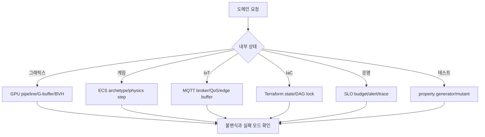
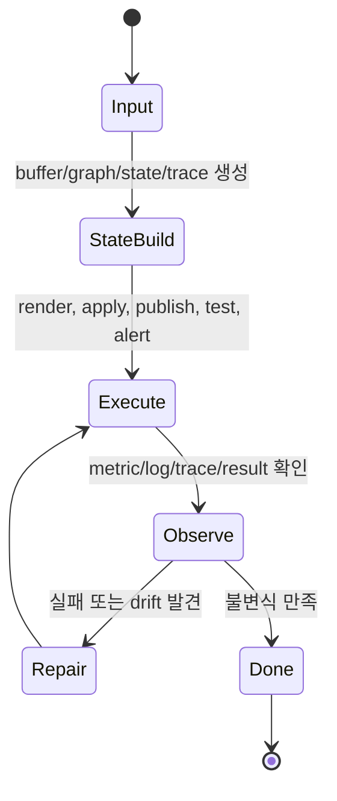
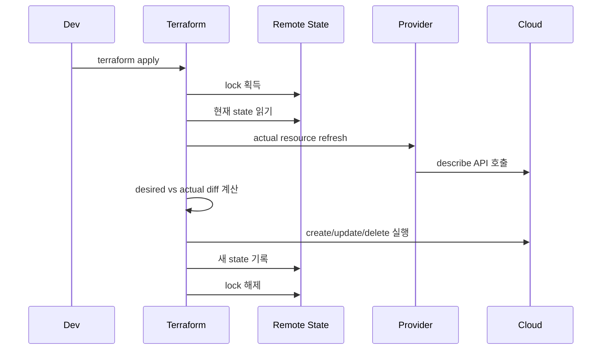

# 기타 CS 내부 동작 학습 및 기록 노트

## 1. 왜 필요한가? (Pain Point & Motivation)

기타 CS 문서는 그래픽스, 게임 엔진, IoT, IaC, SRE, 테스트, 셰이더 컴파일, 데이터베이스 실행 엔진, CI/CD, OS 스케줄링처럼 서로 멀어 보이는 주제를 한데 모은다. 공통점은 모두 "도구 사용법"이 아니라 내부 상태가 어떻게 흐르고 실패가 어디서 생기는지를 다룬다는 점이다.

이 문서는 원문 한국어 통합 레퍼런스를 시스템 내부 메커니즘과 운영 판단 기준 중심으로 재작성한다.

## 2. 현재 나의 상태 (Baseline)

- GPU 렌더링, ECS, MQTT, Terraform, Ansible, SLO, OpenTelemetry, property-based testing 같은 개념은 개별적으로 알고 있다.
- 각 도구가 어떤 상태 파일, queue, buffer, graph, trace context를 유지하는지 한눈에 연결하기 어렵다.
- 운영 도구의 멱등성, 잠금, 오류 예산, 알림 중복 제거 같은 불변식을 더 명확히 해야 한다.
- 그래픽스/게임/IoT와 DevOps/SRE/테스트를 같은 내부 상태 관점으로 읽는 기준이 부족하다.

## 3. 도달하고 싶은 목표 (Target State)

- GPU pipeline, ECS archetype, MQTT QoS, Terraform state, Ansible idempotency, SLO burn rate를 상태 전이로 설명한다.
- 도구의 "성공 조건"과 "깨지면 장애가 되는 불변식"을 구분한다.
- 테스트 품질을 line coverage가 아니라 property와 mutation score 관점으로 평가한다.
- Observability에서 trace context, alert fingerprint, metric window의 역할을 이해한다.
- 복잡한 시스템을 buffer, graph, queue, state file, cache line 같은 상태 단위로 분해한다.

## 4. 시스템 번역 (Data Flow)

## 5. 핵심 구성요소 (Building Blocks)

| 구성요소 | 내부 상태 | 확인할 규칙 |
| --- | --- | --- |
| GPU pipeline | vertex, fragment, depth, color buffer | shader와 depth test 순서가 성능을 좌우한다. |
| Deferred rendering | G-buffer | 메모리 사용량과 조명 계산 비용을 맞바꾼다. |
| ECS | archetype table, component array | system traversal이 cache-friendly해야 한다. |
| Physics loop | fixed timestep, accumulator | 물리와 렌더링 시간을 분리한다. |
| MQTT | broker session, packet id, QoS state | QoS 1은 중복 가능, QoS 2는 handshake 비용이 있다. |
| Terraform | state.json, lock, resource DAG | 실제 상태와 desired state diff가 기준이다. |
| Ansible | module result, changed flag | idempotency가 유지되어야 한다. |
| SRE | error budget, burn rate | 짧은 창과 긴 창을 함께 봐야 한다. |
| OpenTelemetry | traceId, spanId, parentSpanId | context propagation이 끊기면 trace tree가 깨진다. |
| Mutation testing | killed/survived mutant | survived mutant는 테스트 공백이다. |

## 6. 상태 전이 (State Transition)

Terraform은 desired state와 actual state의 diff를 실행 그래프로 바꾸고, SRE는 metric을 burn rate로 바꾸며, GPU는 vertex input을 fragment/color output으로 바꾼다.

## 7. 불변식 (Invariant: 절대 깨지면 안 되는 규칙)

- Depth buffer와 blending 순서가 잘못되면 렌더링 결과가 깨진다.
- ECS system은 필요한 component가 같은 archetype에 연속 배치된다는 전제를 갖는다.
- MQTT QoS 수준은 중복 가능성과 처리 비용을 명확히 반영해야 한다.
- Terraform state lock 없이 동시에 apply하면 state drift나 resource 충돌이 생길 수 있다.
- Ansible module은 같은 desired state를 반복 적용해도 불필요한 변경을 만들면 안 된다.
- SLO alert는 error budget burn을 기준으로 해야 노이즈와 늦은 탐지를 줄일 수 있다.
- Trace context는 service boundary를 넘어 전파되어야 한다.
- Property-based test는 generator와 shrinker가 의미 있는 반례를 만들어야 한다.
- Mutation testing에서 survived mutant는 반드시 검토 대상이다.

## 8. 가장 작은 예제 (Minimal Viable Example)

이 예제의 핵심은 IaC도 선언 파일만 보는 것이 아니라 remote state, 실제 cloud resource, provider refresh 결과를 함께 비교한다는 점이다.

## 9. 실패 사례 (What could go wrong?)

- Shader에서 `discard`를 사용해 Early-Z 최적화가 깨지고 overdraw 비용이 커진다.
- ECS에서 component 변경이 잦아 archetype 이동 비용이 과도해진다.
- MQTT QoS 1 메시지를 idempotent하게 처리하지 않아 중복 이벤트가 상태를 오염시킨다.
- Terraform state를 수동 수정하거나 lock 없이 동시에 apply한다.
- Ansible task가 매번 `changed=true`를 반환해 배포 파이프라인이 불필요하게 흔들린다.
- Alert가 단일 짧은 window만 보고 울려 오탐이 증가한다.
- Trace header를 전달하지 않아 분산 요청이 여러 개의 끊어진 trace로 보인다.
- 테스트가 line coverage는 높지만 mutation survivor를 놓쳐 실제 회귀를 잡지 못한다.

## 10. 뇌 확장하기 (Evolution & Variants)

- 그래픽스는 rasterization, deferred rendering, ray tracing, compute shader로 확장해 비교한다.
- 게임 엔진은 ECS, physics solver, asset streaming, job system을 함께 본다.
- IoT는 MQTT, CoAP, DTLS, edge inference, offline buffer 전략으로 확장된다.
- IaC는 Terraform, Pulumi, CloudFormation, Ansible의 state 관리 방식 차이를 비교한다.
- SRE는 SLI/SLO, error budget policy, incident response, canary rollback으로 확장된다.
- 테스트는 example-based, property-based, fuzzing, mutation testing을 목적별로 조합한다.

## 11. 최종 체크리스트 (Definition of Done)

- [x] 그래픽스, 게임, IoT, IaC, SRE, 테스트, DB/CI 주제를 내부 상태 기준으로 정리했다.
- [x] Terraform apply 흐름을 최소 sequence diagram으로 설명했다.
- [x] 멱등성, state lock, trace context, error budget 같은 운영 불변식을 포함했다.
- [x] mutation testing과 property-based testing의 실패 판단 기준을 정리했다.
- [x] 원문 한국어 기타 CS 문서를 12개 섹션 템플릿으로 재작성했다.

## 12. 뇌에 새기는 복습 문장 (TL;DR Blank)

서로 다른 CS 도구도 내부를 보면 buffer, graph, queue, state, trace를 전이시키는 시스템이다. 상태 불변식을 알면 장애와 성능 병목을 찾을 수 있다.
