# 기계 학습 및 AI 내부: 내부

> 소스 합성: 신경망 역전파 역학, 경사하강법 최적화 프로그램, 변환기 주의 내부, 컨볼루셔널 네트워크 계산을 다루는 ML/AI 참고서(comp 8, 195–196, 224–225, 233, 254–255, 263, 280, 371, 434, 444, 449–450, 458, 469) 그래프 및 GPU 메모리 관리.

---

## 1. 신경망 정방향 전달 — 계산 그래프

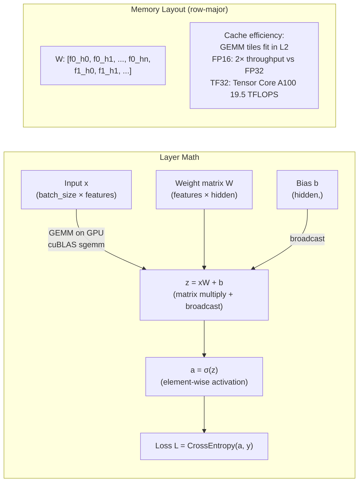

### 텐서 코어 GEMM 파이프라인

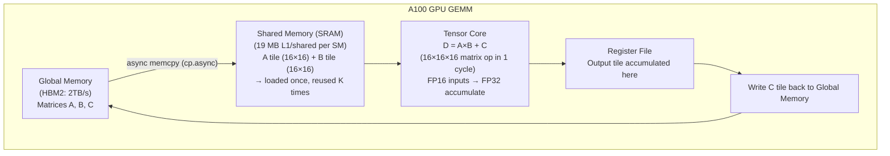

---

## 2. 역전파 — 연쇄 규칙 메커니즘

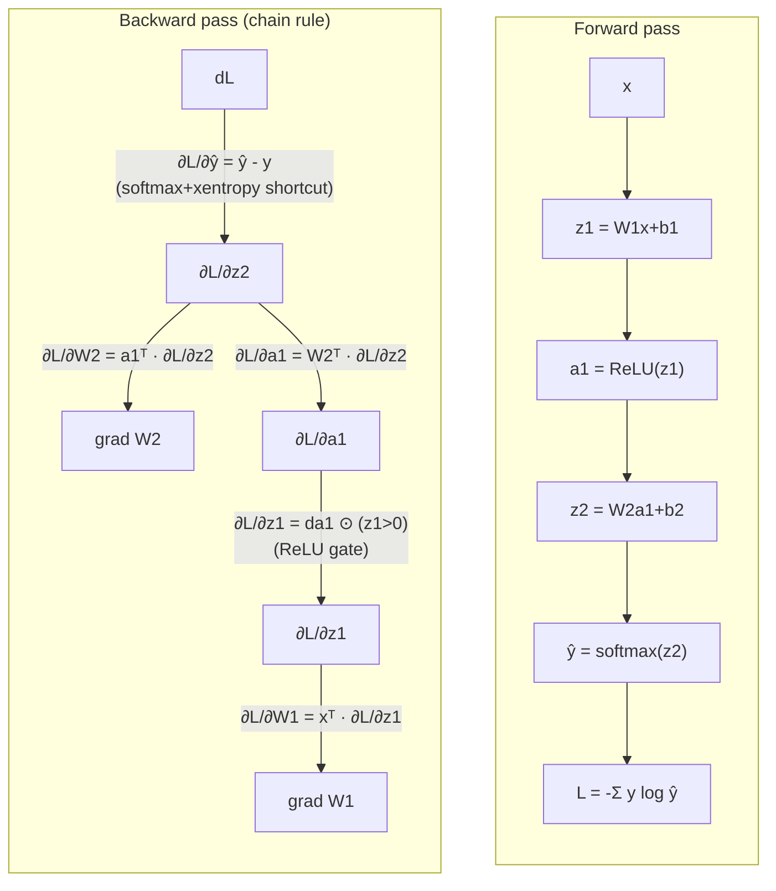

### Autograd 테이프(PyTorch)

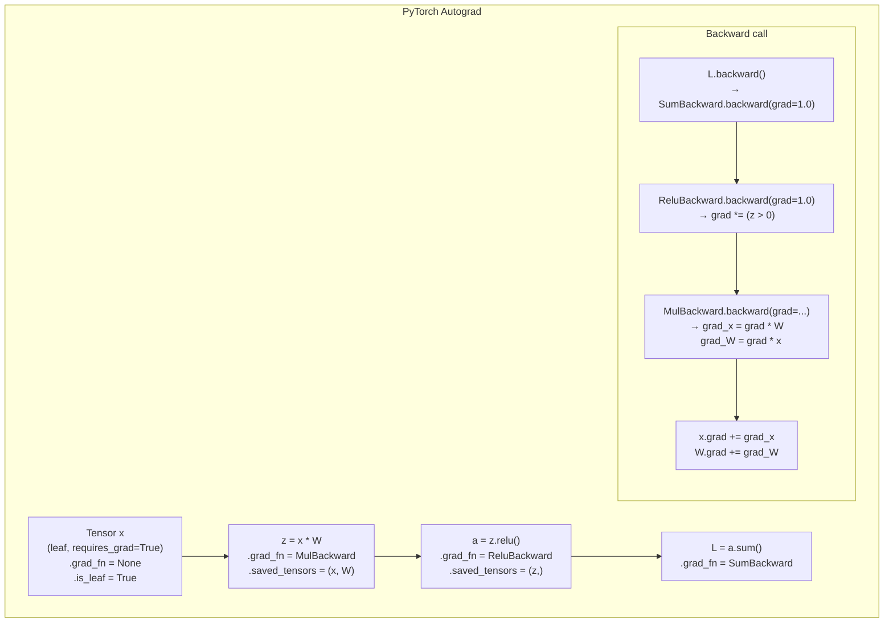

---

## 3. 경사하강법 최적화 도구 — 내부 상태

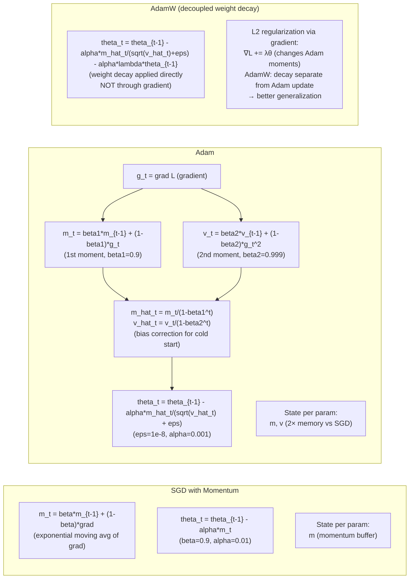

---

## 4. Transformer — Self-Attention 내부 요소

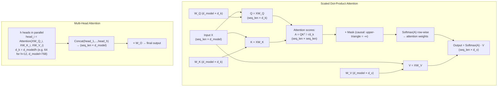

### FlashAttention — 메모리 효율적인 타일링

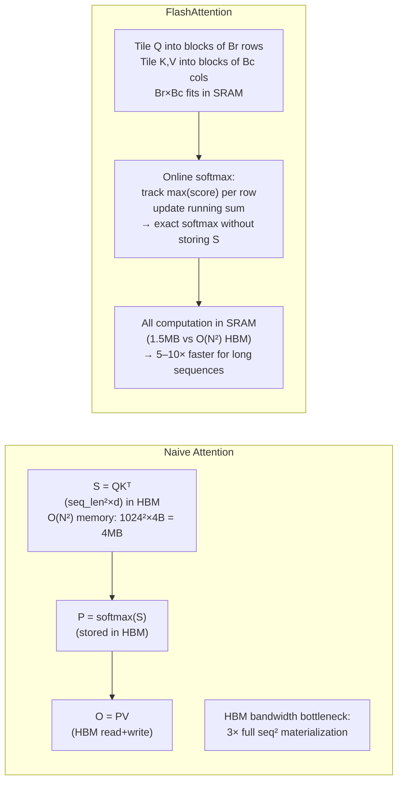

---

## 5. 컨볼루셔널 신경망 — 계산 경로

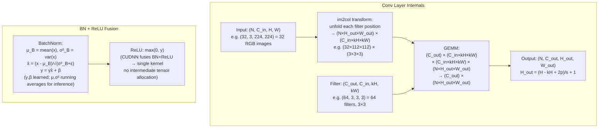

---

## 6. GPU 메모리 계층 구조 및 텐서 관리

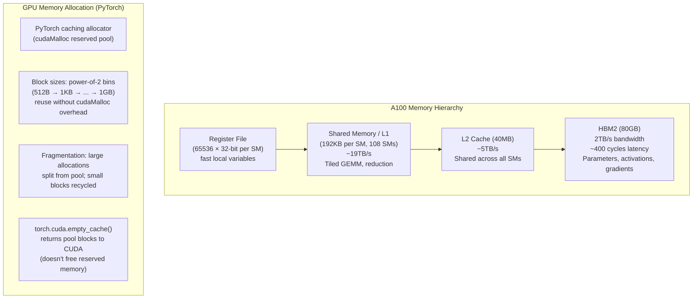

### 혼합 정밀 훈련(FP16 + FP32)

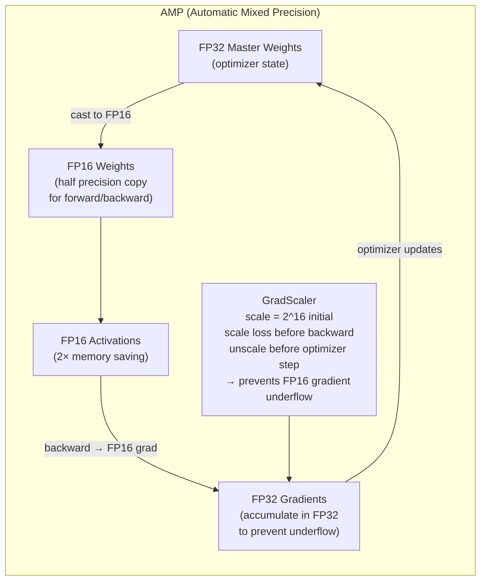

---

## 7. 대규모 언어 모델 - KV 캐시 내부

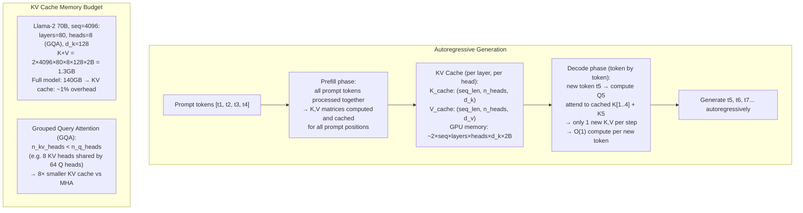

---

## 8. 컨벌루션 역전파 - 기울기 흐름

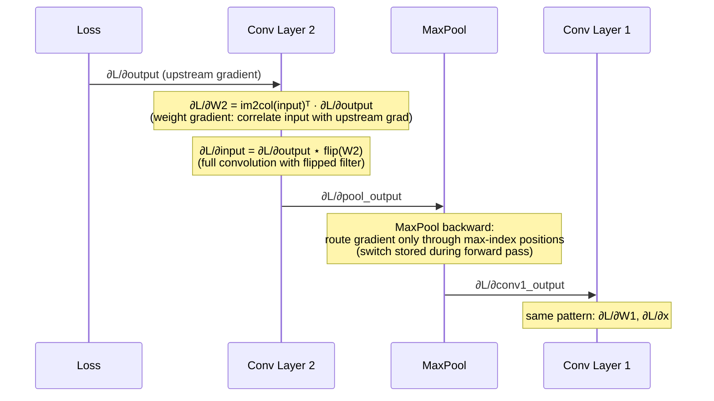

---

## 9. 의사결정 트리 및 랜덤 포레스트 내부

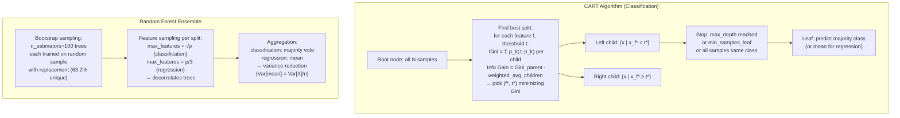

---

## 10. 지원 벡터 머신 - 커널 트릭 내부

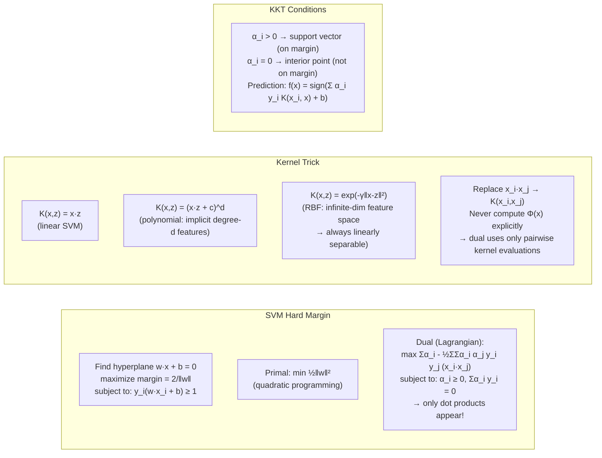

---

## 11. 임베딩 공간 — Word2Vec Skip-gram 내부

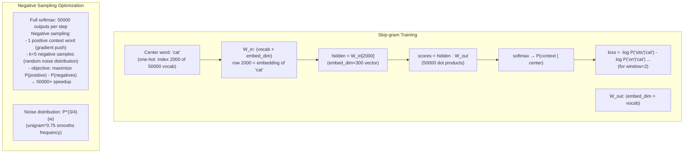

---

## 12. 모델 양자화 - INT8 / INT4 내부

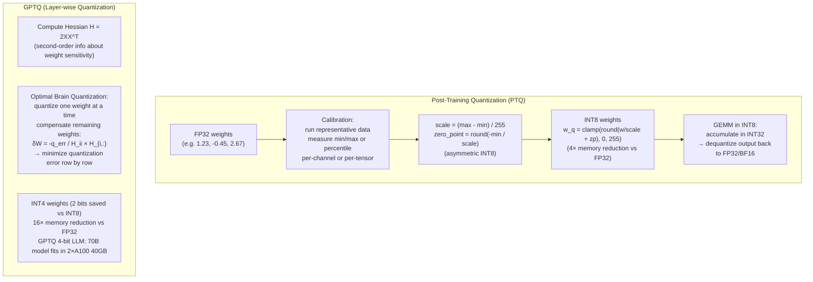

---

## 13. 훈련 파이프라인 - 데이터 흐름

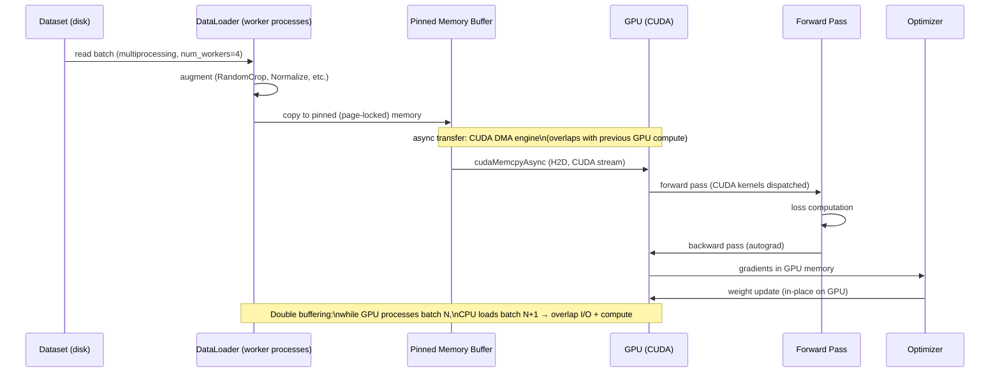

---

## 14. 성능 수치

```mermaid
block-beta
  columns 2
  block:gpu_compute["GPU Compute (A100 SXM)"]:1
    g1["FP16 Tensor Core: 312 TFLOPS"]
    g2["BF16 Tensor Core: 312 TFLOPS"]
    g3["INT8 Tensor Core: 624 TOPS"]
    g4["FP32 (non-TC): 19.5 TFLOPS"]
  end
  block:model_size["Typical Model Sizes"]:1
    m1["BERT-base: 110M params, 440MB FP32"]
    m2["GPT-2 (1.5B): 6GB FP32, 3GB FP16"]
    m3["Llama-2 70B: 280GB FP32, 140GB FP16, 35GB INT4"]
    m4["ViT-L/16: 307M params, 1.2GB FP32"]
  end
  block:training["Training Throughput"]:1
    t1["A100 (FP16): ~2000 tokens/sec (GPT-2)"]
    t2["FlashAttention 2: 70% of peak A100 MFU"]
    t3["DDP 8-GPU: ~7.5× speedup (communication overhead)"]
    t4["Gradient accumulation: simulate 8× batch with 1 GPU"]
  end
  block:inference["Inference Latency"]:1
    i1["KV cache reuse: O(1) per new token"]
    i2["Prefill bottleneck: compute-bound (GEMM)"]
    i3["Decode bottleneck: memory-bound (KV cache BW)"]
    i4["Speculative decoding: 2–4× speedup (draft model)"]
  end
```

---

## 주요 내용

- **Autograd 테이프**는 정방향 전달 중에 `grad_fn` 노드의 DAG를 구축합니다. `.backward()`은 저장된 텐서를 사용하여 각 노드에 체인 규칙을 적용하여 역순으로 탐색합니다.
- **Adam은 매개변수(m, v)당 2개의 순간 버퍼를 유지합니다** — 메모리 비용은 가중치(가중치 + m + v)의 3배이고 SGD는 1배입니다. AdamW는 모멘트 추정의 오염을 방지하기 위해 L2 붕괴를 분리합니다.
- **FlashAttention**은 온라인 소프트맥스를 타일링하고 실행하여 HBM에서 O(N²) 어텐션 매트릭스를 구체화하는 것을 방지합니다. 이는 긴 시퀀스(>2K 토큰)에 중요합니다.
- **KV 캐시**는 O(1) 디코드 단계를 가능하게 합니다. 메모리는 시퀀스 길이에 따라 선형적으로 증가합니다. GQA는 KV 헤드를 줄여 추론 시 캐시 메모리를 절약합니다.
- **INT8 GEMM**은 오버플로를 방지하기 위해 INT32에 누적된 다음 역양자화됩니다. 스케일/영점은 텐서당보다 더 나은 정확도를 위해 채널별로 계산됩니다.
- **im2col + GEMM**은 컨볼루션이 실제로 구현되는 방식입니다. 슬라이딩 윈도우 작업을 대규모 행렬 곱셈으로 변환하여 Tensor Core 가속을 활성화합니다.
- Word2Vec의 **음수 샘플링**은 O(vocab) 소프트맥스를 O(k) 시그모이드 평가로 대체합니다. 한계는 수학적으로 동일하지만 훈련 속도는 10,000배 더 빠릅니다.


---

## 설계적 고민

### 구조와 모델링

ML 시스템 설계에서 가장 근본적인 구조적 결정은 **학습 패러다임의 선택**이다. 배치 학습과 온라인 학습은 데이터 파이프라인, 모델 아키텍처, 인프라 요구사항 전반에 걸쳐 근본적으로 다른 설계를 요구한다.

**배치 학습 vs 온라인 학습**: 배치 학습(Batch Learning)은 전체 데이터셋을 모아 주기적으로(일/주 단위) 모델을 재학습한다. 학습 데이터의 분포가 안정적이고, 높은 정확도가 요구되는 경우에 적합하다. 반면 온라인 학습(Online Learning)은 데이터가 도착할 때마다 점진적으로 모델을 업데이트한다. 실시간 추천, 사기 탐지, 주가 예측처럼 데이터 분포가 빠르게 변하는(concept drift) 환경에서 필수적이다.

배치 학습의 핵심 한계는 **데이터-모델 지연(Data-Model Lag)**이다. 일일 배치로 학습하면, 오늘 발생한 새로운 패턴은 내일 모델에 반영된다. 금융 사기처럼 공격 패턴이 시간 단위로 진화하는 도메인에서 이 지연은 치명적이다. 온라인 학습은 이 지연을 최소화하지만, **재현성(Reproducibility)**이 어렵고, 악의적 데이터에 의한 모델 오염(model poisoning) 위험이 있다.

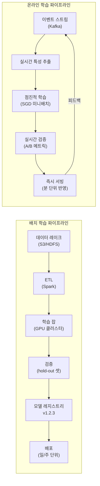

**특성 공학 vs 딥러닝 표현 학습**: 전통적 ML에서 도메인 전문가가 수동으로 특성을 설계하는 특성 공학(Feature Engineering)과, 딥러닝이 원시 데이터에서 자동으로 표현을 학습하는 표현 학습(Representation Learning)은 근본적으로 다른 접근이다.

특성 공학은 데이터가 적을 때(수천~수만 건), 해석 가능성이 중요할 때, 도메인 지식이 풍부할 때 우위를 가진다. 테이블 데이터에서 XGBoost + 수동 특성이 딥러닝보다 여전히 우수한 성능을 보이는 경우가 많다. 반면 딥러닝 표현 학습은 대규모 비정형 데이터(이미지, 텍스트, 음성)에서 인간이 설계할 수 없는 복잡한 패턴을 포착한다.

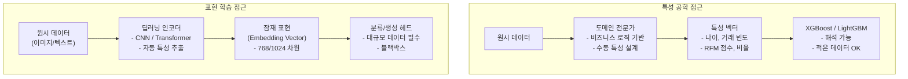

### 트레이드오프와 의사결정

**편향-분산 트레이드오프(Bias-Variance Tradeoff)**: 모델 복잡도 선택의 핵심 원리이다. 편향(Bias)이 높으면 모델이 데이터의 패턴을 충분히 포착하지 못하고(과소적합), 분산(Variance)이 높으면 훈련 데이터의 노이즈까지 학습하여 새로운 데이터에 일반화하지 못한다(과적합).

실무에서 이 트레이드오프를 관리하는 핵심 전략은 **정규화(Regularization)**이다. L1(Lasso)은 희소 모델을 만들어 특성 선택 효과를 제공하고, L2(Ridge)는 가중치를 작게 유지하여 과적합을 억제한다. Dropout은 딥러닝에서 앙상블 효과를 시뮬레이션하며, Early Stopping은 검증 손실이 증가하기 시작하는 시점에서 학습을 중단한다.

모델 복잡도 선택은 **데이터 양에 비례**해야 한다. 데이터가 적으면(수천 건) 선형 모델이나 얕은 트리가 적합하고, 데이터가 풍부하면(수백만 건) 딥러닝의 높은 모델 용량이 빛을 발한다.

```mermaid
flowchart LR
    subgraph BiasVariance["편향-분산 스펙트럼"]
        direction TB
        HIGH_BIAS["높은 편향\n(과소적합)\n- 선형 회귀\n- 얕은 트리"] --> SWEET["최적점\n(편향과 분산의 균형)\n- 교차 검증으로 탐색\n- 정규화 강도 튜닝"]
        SWEET --> HIGH_VAR["높은 분산\n(과적합)\n- 깊은 신경망\n- 정규화 없는 트리"]
    end

    subgraph Strategies["과적합 방지 전략"]
        REG["정규화"] --> L1["L1 (Lasso)\n특성 선택 효과"]
        REG --> L2["L2 (Ridge)\n가중치 축소"]
        REG --> DROP["Dropout\n뉴런 무작위 제거"]
        REG --> ES["Early Stopping\n검증 손실 모니터링"]
        REG --> AUG["데이터 증강\n효과적 데이터 증가"]
    end
```

**모델 서빙 아키텍처**: 학습된 모델을 프로덕션에 배포하는 방식은 워크로드 특성에 따라 크게 세 가지로 나뉜다. 배치 추론은 대량 데이터를 주기적으로 처리하고, 실시간 추론은 개별 요청에 밀리초 단위로 응답하며, 엣지 배포는 모델을 디바이스에 직접 탑재한다.

배치 추론은 처리량이 중요하고 지연시간 요구가 느슨한 경우(추천 목록 사전 계산, 보고서 생성)에 적합하다. 실시간 추론은 사용자 상호작용에 즉시 응답해야 하는 경우(검색 랭킹, 사기 탐지)에 필수적이며, GPU 서빙 인프라(TensorRT, Triton)의 비용이 크다. 엣지 배포는 네트워크 지연이 허용되지 않거나(자율주행), 프라이버시가 중요한(on-device AI) 경우에 선택한다.

| 서빙 방식 | 지연시간 | 처리량 | 비용 | 적용 사례 |
|----------|---------|--------|------|---------|
| 배치 추론 | 분~시간 | 매우 높음 | 💰 (Spot GPU) | 추천 사전계산, ETL |
| 실시간 추론 | 1-100ms | 중간 | 💰💰💰 (상시 GPU) | 검색 랭킹, 사기 탐지 |
| 엣지 배포 | <10ms | 낮음 | 💰💰 (디바이스) | 자율주행, 모바일 AI |

### 리팩토링과 설계 원칙

**MLOps 파이프라인 설계 원칙**: ML 시스템의 기술 부채는 전통 소프트웨어보다 훨씬 빠르게 축적된다. 코드는 전체 시스템의 5%에 불과하고, 데이터 수집, 검증, 특성 저장소, 모니터링이 나머지 95%를 차지한다. MLOps의 핵심은 이 전체 파이프라인을 **재현 가능하고 자동화**하는 것이다.

Google의 MLOps 성숙도 모델에서 Level 0(수동)은 노트북에서 모델을 학습하고 수동으로 배포한다. Level 1(ML 파이프라인 자동화)은 학습-검증-배포 파이프라인을 자동화한다. Level 2(CI/CD + CT)는 코드 변경뿐 아니라 데이터 변경과 모델 성능 저하에도 자동으로 재학습을 트리거한다.

```mermaid
flowchart TD
    subgraph MLOps["MLOps 파이프라인 (Level 2)"]
        DATA["데이터 소스\n(DB, API, 스트림)"] --> VALIDATE["데이터 검증\n- 스키마 검사\n- 분포 이동 탐지\n- Great Expectations"]
        VALIDATE --> FEATURE["특성 저장소\n(Feast / Tecton)\n- 오프라인: 학습용\n- 온라인: 서빙용"]
        FEATURE --> TRAIN["학습 파이프라인\n(Kubeflow / Vertex AI)\n- 하이퍼파라미터 최적화\n- 분산 학습"]
        TRAIN --> EVAL["모델 평가\n- A/B 테스트 기준\n- 공정성 메트릭\n- 슬라이스별 성능"]
        EVAL --> REGISTRY["모델 레지스트리\n(MLflow / Weights & Biases)\n- 버전 관리\n- 계보(lineage) 추적"]
        REGISTRY --> DEPLOY["모델 서빙\n(Seldon / Triton)\n- Canary 배포\n- Shadow 모드"]
        DEPLOY --> MONITOR["모니터링\n- 예측 분포 드리프트\n- 데이터 드리프트\n- 성능 지표 추적"]
        MONITOR -->|"성능 저하 감지"| TRAIN
    end
```

**모델 재학습 트리거 설계**: 재학습을 언제 트리거할지는 MLOps의 핵심 설계 결정이다. 단순 스케줄 기반(매주 월요일)은 구현이 간단하지만, 데이터 분포가 갑자기 변해도 다음 스케줄까지 대응하지 못한다. 성능 기반 트리거(온라인 메트릭이 임계값 이하로 떨어지면 재학습)가 더 효과적이지만, 모니터링 인프라와 라벨 수집 지연이 필요하다.

### 디자인 패턴 적용

**Two-Tower 모델 패턴**: 대규모 추천 시스템에서 검색 후보(수백만)를 효율적으로 필터링하기 위한 핵심 패턴이다. 사용자 타워와 아이템 타워를 독립적으로 인코딩하여 각각의 임베딩을 생성하고, 내적(dot product)으로 유사도를 계산한다.

이 패턴의 핵심 이점은 **서빙 시 효율성**이다. 아이템 임베딩은 오프라인에서 미리 계산하여 ANN(Approximate Nearest Neighbor) 인덱스(FAISS, ScaNN)에 저장하고, 서빙 시에는 사용자 임베딩만 실시간으로 계산하여 밀리초 내에 후보를 검색한다.

```mermaid
flowchart TD
    subgraph TwoTower["Two-Tower 추천 아키텍처"]
        USER["사용자 특성\n- 프로필, 히스토리\n- 세션 컨텍스트"] --> UTOWER["사용자 타워\n(DNN 인코더)"]
        UTOWER --> UEMB["사용자 임베딩\n(128차원)"]
        
        ITEM["아이템 특성\n- 메타데이터\n- 콘텐츠 특성"] --> ITOWER["아이템 타워\n(DNN 인코더)"]
        ITOWER --> IEMB["아이템 임베딩\n(128차원)"]
        
        IEMB --> |"오프라인 인덱싱"| ANN["ANN 인덱스\n(FAISS / ScaNN)\n수백만 아이템"]
        UEMB --> |"실시간 쿼리"| ANN
        ANN --> TOP_K["Top-K 후보\n(~100개)"]
        TOP_K --> RANKER["랭킹 모델\n(정밀 스코어링)"]
        RANKER --> RESULT["최종 추천 결과\n(10-20개)"]
    end
```

**Teacher-Student 증류 패턴(Knowledge Distillation)**: 대형 모델(Teacher)의 지식을 소형 모델(Student)에 전이하여, 프로덕션에서 낮은 지연시간과 적은 리소스로 서빙하는 패턴이다. GPT-4 수준의 모델을 직접 서빙하는 대신, Student 모델을 증류하여 비용을 10-100배 절감한다.

증류의 핵심은 Teacher의 **소프트 라벨(soft label)**을 사용하는 것이다. 하드 라벨(정답만)이 아닌, Teacher의 출력 확률 분포(logits)를 타겟으로 학습하면 클래스 간 유사성 정보까지 전달된다. 온도(Temperature) 파라미터로 소프트 라벨의 부드러움을 조절한다.

```mermaid
flowchart LR
    INPUT["입력 데이터"] --> TEACHER["Teacher 모델\n(BERT-Large, 340M params)\n높은 정확도, 느린 추론"]
    INPUT --> STUDENT["Student 모델\n(DistilBERT, 66M params)\n빠른 추론, 목표: 97% 성능"]
    
    TEACHER --> SOFT["Soft Labels\n(확률 분포, T=4)\nex: [0.7, 0.2, 0.1]"]
    SOFT --> LOSS["증류 손실\nKL Divergence\n(Teacher vs Student)"]
    
    INPUT --> HARD["Hard Labels\n(정답)\nex: [1, 0, 0]"]
    HARD --> CE["교차 엔트로피\n손실"]
    
    LOSS --> TOTAL["총 손실 = α·증류 + (1-α)·CE"]
    CE --> TOTAL
    TOTAL --> STUDENT
```

## 연습 문제

### 1. 시스템 구조와 모델링

**문제 1-1.** 딥러닝 모델의 학습 루프 전체를 단계별로 설명하시오: 데이터 로더가 디스크에서 배치를 읽어 GPU 메모리로 전송하는 과정, 전처리/증강(augmentation), 순전파(forward pass)로 예측값 계산, 손실 함수 계산, 역전파(backpropagation)로 그라디언트 계산, 옵티마이저(SGD/Adam)가 가중치를 업데이트하는 전체 흐름을 설명하시오. 데이터 로더의 prefetch/num_workers 설정이 GPU 활용률에 미치는 영향도 분석하시오.

<details><summary>힌트 보기</summary>

GPU가 연산 중일 때 CPU가 다음 배치를 미리 준비(prefetch)해야 GPU 유휴 시간이 최소화된다. num_workers는 데이터 로딩 병렬 프로세스 수이다. 순전파는 입력 → 각 레이어의 선형 변환 + 활성화 함수 → 출력으로 진행. 역전파는 체인 룰로 손실에 대한 각 파라미터의 그라디언트를 계산한다. Adam은 1차/2차 모멘트를 저장하므로 파라미터당 2배의 추가 메모리가 필요하다. 이 전체 루프가 한 epoch의 모든 배치에 대해 반복된다.

</details>

**문제 1-2.** MLOps 파이프라인의 각 단계를 연결하여 전체 아키텍처를 설계하시오: 실험 추적(MLflow로 하이퍼파라미터/메트릭 기록) → 모델 레지스트리(버전 관리, 승인 프로세스) → CI/CD(모델 테스트 자동화) → 모델 서빙(Triton Inference Server로 배치) → 모니터링(Evidently로 데이터/모델 드리프트 감지). 각 단계의 입력/출력과 자동화 트리거를 명시하시오.

<details><summary>힌트 보기</summary>

MLflow는 실험별로 파라미터, 메트릭, 아티팩트(모델 파일)를 기록한다. 모델 레지스트리는 "Staging" → "Production" 상태 전이를 관리한다. CI/CD는 레지스트리에 새 모델이 등록되면 자동으로 A/B 테스트나 카나리 배포를 트리거한다. Triton은 모델 형식(ONNX, TensorRT, PyTorch)을 동적으로 로드하고, Dynamic Batching으로 추론 스루풋을 최적화한다. Evidently는 입력 데이터 분포 변화(data drift)와 예측 성능 저하(model drift)를 감지하여 재학습을 트리거한다.

</details>

**문제 1-3.** GPU에서 딥러닝 모델을 학습할 때, 계산 그래프(Computational Graph)가 어떻게 구성되고 실행되는지 설명하시오. PyTorch의 동적 그래프(Define-by-Run)와 TensorFlow의 정적 그래프(Define-and-Run) 방식의 차이가 디버깅 편의성과 최적화 가능성에 미치는 영향을 분석하시오.

<details><summary>힌트 보기</summary>

PyTorch는 연산을 실행하면서 동시에 그래프를 구성(Eager Mode)하므로 Python 디버거로 직접 값을 확인할 수 있어 디버깅이 쉽다. 반면 전체 그래프를 보고 최적화(operator fusion, constant folding)하기 어렵다. TensorFlow는 그래프를 먼저 정의한 후 실행하므로 XLA 컴파일러가 전체 그래프를 분석하여 최적화할 수 있지만 디버깅이 덤 직관적이다. PyTorch 2.0의 `torch.compile`은 Eager Mode의 편의성을 유지하면서 그래프 컴파일을 추가한 절충안이다.

</details>

### 2. 트레이드오프와 의사결정

**문제 2-1.** 사기 탐지 시스템(밀리초 단위 응답 필요)과 월간 고객 이탈 예측(야간 배치 처리 가능) 각각에 적합한 모델 서빙 아키텍처를 설계하시오. 배치 추론 vs 실시간 추론의 차이(레이턴시, 스루풋, 비용, 인프라 복잡도)를 비교하고, 각 시나리오에서 모델 크기와 정확도 간의 트레이드오프를 분석하시오.

<details><summary>힌트 보기</summary>

실시간 사기 탐지: REST API/gRPC 엔드포인트 + GPU 서버 상시 운영 + 모델 최적화(TensorRT, ONNX Runtime, 양자화)로 p99 레이턴시 < 50ms 목표. 모델이 너무 크면 경량 모델로 증류하거나 Feature Store + 경량 모델 조합 고려. 배치 이탈 예측: Spark/Airflow로 스케줄링, 대량 데이터를 한 번에 처리, 레이턴시 제약 없으므로 더 큰 모델 사용 가능, 비용 효율적(배치 시간에만 GPU 사용).

</details>

**문제 2-2.** 테이블 형 데이터(예: 은행 거래 내역, 50개 특성)와 이미지 데이터(예: 제품 사진 분류) 각각에서 특성 공학(Feature Engineering) 기반 접근법(XGBoost + 수동 특성 설계)과 딥러닝 종단간(End-to-End) 접근법의 적합성을 비교하시오. 각 접근법의 해석 가능성(interpretability), 데이터 요구량, 개발 기간 측면에서의 트레이드오프를 분석하시오.

<details><summary>힌트 보기</summary>

테이블 형 데이터: XGBoost/LightGBM + 수동 특성 공학이 대부분의 대회에서 딥러닝을 이긴다(Kaggle 타비러 데이터 실험 결과). SHAP/LIME으로 해석 가능성이 높고, 소량 데이터에서도 잘 작동한다. 이미지 데이터: CNN/ViT가 자동으로 특성을 학습하므로 수동 특성 설계가 불필요하고 성능도 우수하지만, 데이터와 컴퓨팅 요구량이 크다. 테이블 데이터에 딥러닝을 적용할 때는 TabNet, FT-Transformer 같은 특화 모델을 고려하라.

</details>

**문제 2-3.** LLM 서빙에서 모델 크기와 응답 질 간의 트레이드오프를 분석하시오. 70B 파라미터 모델을 직접 서빙하는 것과, 7B 모델을 특정 도메인에 파인튜닝하여 서빙하는 것의 비용, 레이턴시, 정확도 측면을 비교하시오. 양자화(Quantization), 증류(Knowledge Distillation), LoRA와 같은 최적화 기법들의 역할도 포함하시오.

<details><summary>힌트 보기</summary>

70B 모델: GPU VRAM 140GB+ 필요(FP16), 테스템 병렬이나 vLLM PagedAttention으로 추론 성능 최적화 필요. 비용이 매우 높지만 범용 능력이 우수. 7B + 파인튜닝: LoRA/QLoRA로 적은 GPU로 학습 가능, 특정 도메인에서 70B에 근접한 성능 달성 가능, VRAM 16GB 내에서 INT4 양자화로 서빙 가능. 증류는 70B의 지식을 7B에 전이하는 중간 전략이다. 비용 대비 성능 ROI를 기준으로 판단한다.

</details>

### 3. 문제 해결 및 리팩토링

**문제 3-1.** ML 팀이 모델을 학습한 후 프로덕션에 배포했더니 성능이 급격히 저하되었다. 조사 결과, 학습 시 사용한 특성 전처리 파이프라인과 서빙 시 사용하는 파이프라인이 달라 "Training-Serving Skew"가 발생했다. 이 문제의 근본 원인을 분석하고, 특성 저장소(Feature Store)를 도입하여 해결하는 방법을 설계하시오.

<details><summary>힌트 보기</summary>

Training-Serving Skew의 주요 원인: (1) 학습 시 Python 함수로 전처리하고, 서빙 시 Java/Go로 재구현하면서 미세한 차이 발생, (2) 학습 시점의 통계값(평균, 표준편차)이 서빙 시점에 다름, (3) 특성 계산 로직의 중복 구현. Feature Store(Feast, Tecton)는 학습과 서빙에서 동일한 특성 정의와 특성값을 사용하도록 보장한다. 오프라인 저장소(배치 특성)와 온라인 저장소(실시간 특성)를 분리하여 관리한다.

</details>

**문제 3-2.** 배치 정규화(Batch Normalization)를 사용한 모델이 학습 시에는 정확도 95%였지만, 추론 시 배치 크기가 1인 경우 정확도가 88%로 떨어졌다. 이 성능 저하의 근본 원인을 Batch Normalization의 학습/추론 모드 차이에서 분석하고, Layer Normalization이나 Group Normalization으로 대체하는 전략을 제시하시오.

<details><summary>힌트 보기</summary>

Batch Normalization은 학습 시 미니배치의 평균/분산으로 정규화하지만, 추론 시에는 학습 중 축적된 running mean/variance를 사용한다. 배치 크기가 1이면 학습 시의 미니배치 통계와 running statistics 간 괴리가 상대적으로 커진다. Layer Normalization은 하나의 샘플 내 모든 채널/피처에 대해 정규화하므로 배치 크기에 의존하지 않는다. Transformer에서 Layer Norm이 표준인 이유도 이 특성 때문이다. 모델을 `model.eval()` 모드로 전환했는지도 확인해야 한다.

</details>

**문제 3-3.** 대형 언어 모델(LLM)을 서빙할 때, GPU 메모리(VRAM) 부족으로 13B 모델을 단일 24GB GPU에 로드할 수 없는 상황이다. FP16 → INT8 → INT4 양자화의 원리와 정확도 손실을 분석하고, KV Cache 압축, Flash Attention, PagedAttention(vLLM) 같은 메모리 최적화 기법들을 조합하여 VRAM 부족 문제를 해결하는 전략을 제시하시오.

<details><summary>힌트 보기</summary>

13B 모델 FP16 ≈ 26GB VRAM 필요. INT8 양자화 → ≈13GB, INT4(GPTQ/AWQ) → ≈7GB로 축소. 단, 양자화는 정확도 손실이 있으며 INT4에서 더 컜. AWQ(Activation-aware Weight Quantization)는 활성화 분포를 고려하여 손실을 최소화한다. KV Cache는 디코딩 시 이전 토큰의 Key/Value를 저장하는데, 긴 시퀀스에서 VRAM을 대량 소금한다. PagedAttention은 OS의 가상 메모리처럼 KV Cache를 비연속 페이지로 관리하여 낭비를 줄인다.

</details>

### 4. 개념 간의 연결성

**문제 4-1.** LLM 서빙 시 디코딩 단계에서 Transformer의 Self-Attention과 KV Cache가 어떻게 결합되어 작동하는지 설명하시오. 새로운 토큰을 생성할 때마다 이전 토큰들의 Key-Value를 재계산하지 않고 캐시에서 재사용하는 최적화가 없다면 추론 비용이 어떻게 변하는지 계산하시오. Multi-Head Attention의 헤드 수, 시퀀스 길이, 임베딩 차원이 KV Cache 크기에 미치는 영향도 분석하시오.

<details><summary>힌트 보기</summary>

KV Cache 없이 n번째 토큰 생성 시: 모든 이전 n-1개 토큰의 K, V를 재계산 → O(n²) 복잡도. KV Cache 사용 시: 새 토큰의 Q만 계산하고 캐시된 K, V와 Attention 수행 → O(n). KV Cache 크기 = 2(키+밸류) × 레이어 수 × 헤드 수 × 헤드 차원 × 시퀀스 길이 × 배치 크기. GQA(Grouped Query Attention)는 KV 헤드 수를 줄여 KV Cache를 압축한다(Llama 2 70B가 사용).

</details>

**문제 4-2.** 의료 데이터를 활용한 모델 학습에서 연합 학습(Federated Learning)과 차분 프라이버시(Differential Privacy)를 결합하는 아키텍처를 설계하시오. 여러 병원의 환자 데이터를 중앙 서버에 전송하지 않고도 글로벌 모델을 학습할 수 있는 이유를 설명하고, 차분 프라이버시의 엁실론(ε)이 모델 성능에 미치는 영향을 분석하시오.

<details><summary>힌트 보기</summary>

연합 학습: 각 병원이 로컬 데이터로 모델을 학습 → 그라디언트(또는 모델 파라미터 차이)만 중앙 서버로 전송 → 중앙에서 집계(FedAvg) → 업데이트된 글로벌 모델을 각 병원에 배포. 원데이터는 각 병원을 떠나지 않는다. 차분 프라이버시는 그라디언트에 노이즈를 추가하여 개별 데이터 포인트의 영향을 제한한다. ε이 작을수록 프라이버시 보호가 강하지만 노이즈가 커져 수렴 속도와 최종 성능이 떨어진다.

</details>

**문제 4-3.** 추천 시스템에서 Two-Tower 모델(사용자 타워 + 아이템 타워)과 ANN(Approximate Nearest Neighbor) 검색을 결합하는 아키텍처를 설계하시오. 수백만 개의 아이템 중에서 실시간으로 Top-K를 반환해야 하는 상황에서, 오프라인 인덱싱(FAISS/ScaNN)과 온라인 리랜킹을 분리하는 이유와 각 단계의 레이턴시 예산을 로그하시오.

<details><summary>힌트 보기</summary>

Two-Tower: 사용자/아이템을 독립적으로 임베딩 공간에 매핑. 아이템 임베딩은 오프라인으로 미리 계산하여 ANN 인덱스(FAISS IVF-PQ, HNSW 등)에 저장. 요청 시 사용자 임베딩만 실시간 계산(~5ms) → ANN 검색으로 Top-100 후보 추출(~10ms) → 리랜킹 모델(교차 특성 고려)이 Top-20으로 정제(~20ms). 리랜킹을 분리하는 이유는 수백만 개 전체에 복잡한 모델을 적용하면 레이턴시가 수 초로 치솟기 때문이다.

</details>