# Android 및 모바일 내부: 바인더 IPC, ART 런타임 및 렌더링 파이프라인

> 내부 내용: Android의 Binder IPC가 커널 메모리를 통해 메서드 호출을 전송하는 방법, ART가 DEX를 네이티브 코드로 컴파일하는 방법, SurfaceFlinger 합성기가 프레임 생성을 조정하는 방법, Jetpack Compose의 재구성 엔진이 상태 변경을 추적하는 방법(정확한 커널 인터페이스, JIT 파이프라인, 렌더링 데이터 흐름).

---

## 1. 안드로이드 아키텍처: 레이어 스택

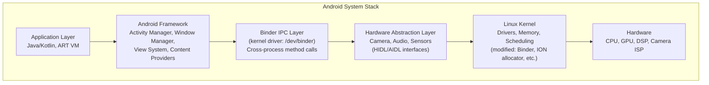

---

## 2. 바인더 IPC: 커널 수준 메시지 전달

바인더는 Android의 기본 IPC 메커니즘입니다. 모든 크로스 프로세스 호출(활동→서비스, 앱→시스템 서비스)은 바인더 커널 드라이버를 통과합니다.

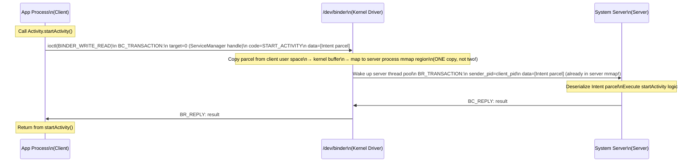

### 바인더 메모리 매핑(Zero-Copy 설계)

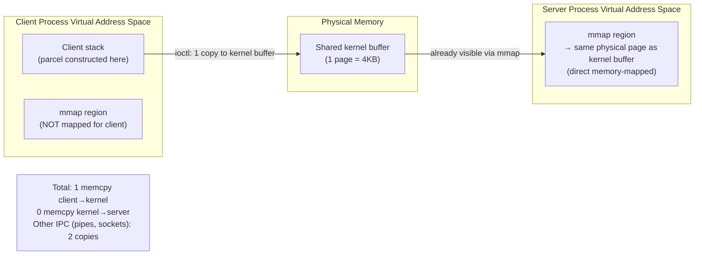

---

## 3. ART: Android 런타임 JIT 및 AOT

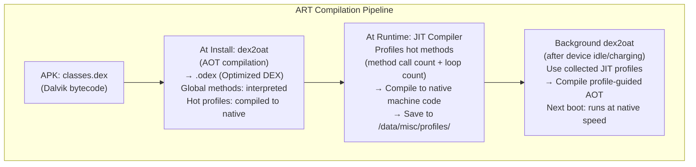

### DEX 바이트코드를 네이티브로: 메소드 JIT 파이프라인

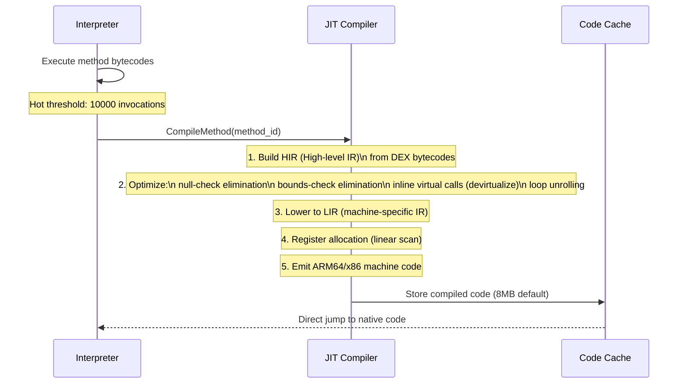

---

## 4. 안드로이드 뷰 시스템: 측정/레이아웃/그리기

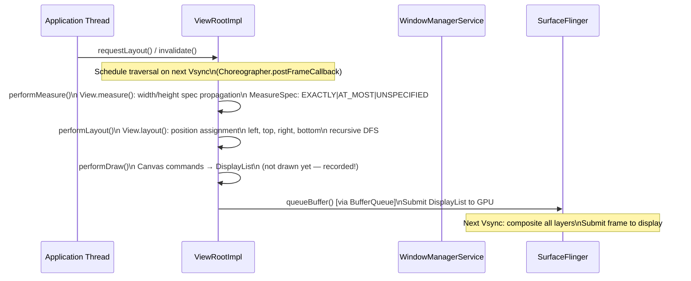

### DisplayList 기록과 실행 비교

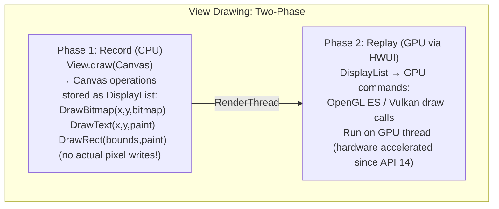

---

## 5. SurfaceFlinger: 디스플레이 합성기

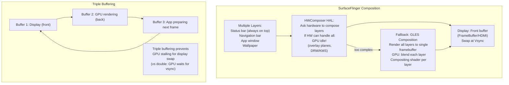

---

## 6. Jetpack Compose: 재구성 엔진

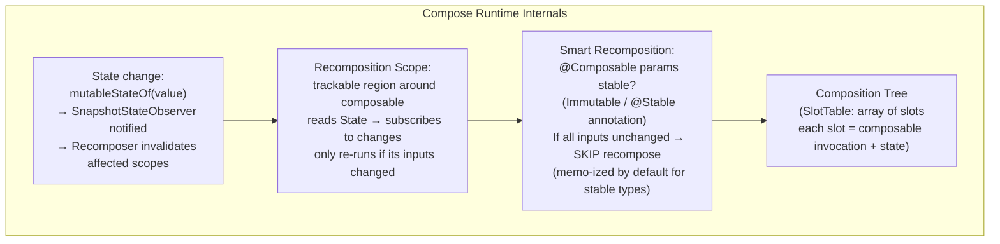

### 슬롯 테이블 메모리 레이아웃 작성

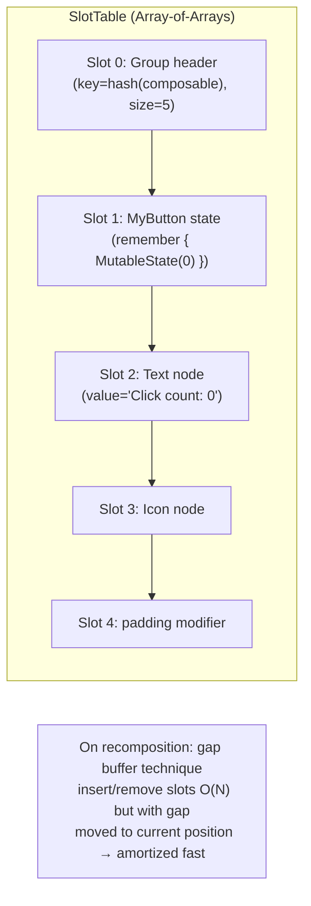

---

## 7. 안드로이드 메모리 관리: zRAM과 Low Memory Killer

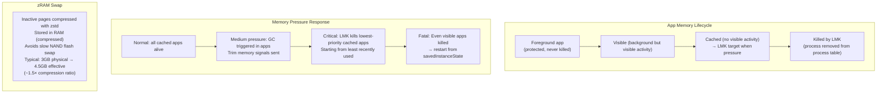

---

## 8. Dalvik/DEX 형식 내부

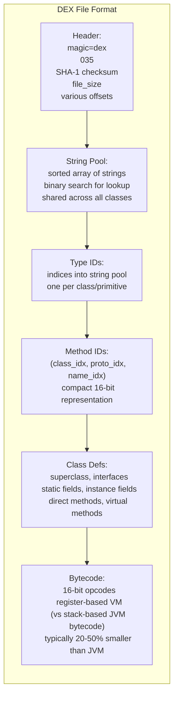

---

## 9. 카메라 파이프라인: ISP 및 HAL3

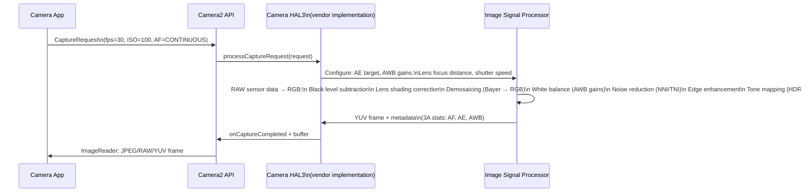

---

## 10. 블루투스/WiFi 저수준 스택

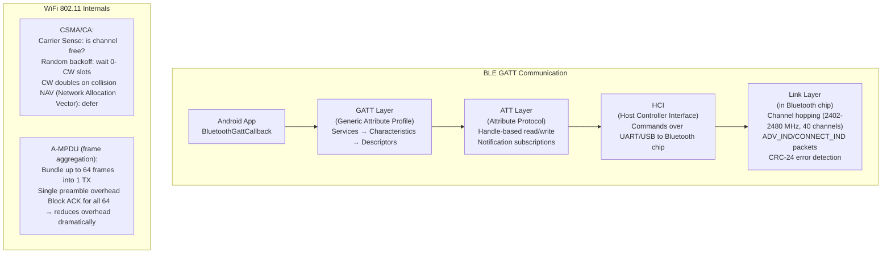

---

## 요약: Android 내부 데이터 흐름

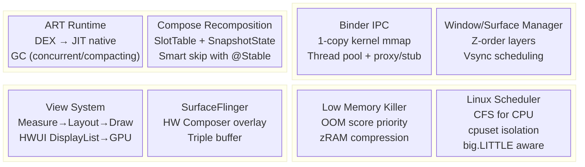


---

## 설계적 고민

### 구조와 모델링

안드로이드 앱 아키텍처의 구조 설계는 **UI 컴포넌트 단위 선택**에서 시작됩니다. Activity는 안드로이드의 기본 화면 단위이지만 생명주기가 복잡하고, Fragment는 화면 내 모듈화를 가능하게 하지만 라이프사이클 관리가 더 복잡해집니다. Jetpack Compose는 선언적 UI로 컴포지션 기반의 현대적 접근을 제공합니다.

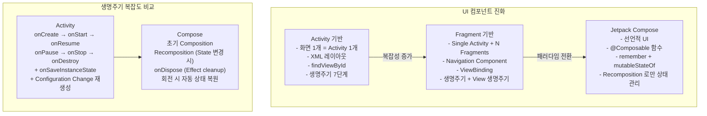

**앱 아키텍처 모델링**에서는 데이터 흐름의 방향성과 의존성 규칙이 핵심입니다. Clean Architecture의 핵심 원칙은 의존성이 항상 내부(도메인) 방향으로 향해야 한다는 것입니다. UI 레이어는 도메인 레이어를 의존하지만, 도메인 레이어는 UI를 알지 못합니다.

### 트레이드오프와 의사결정

**ViewModel + LiveData vs StateFlow** 선택은 반응형 UI 상태 관리의 핵심 의사결정입니다. LiveData는 생명주기 인식이 자동으로 메모리 누수를 방지하지만, Kotlin Flow 생태계와의 통합이 어렵습니다. StateFlow는 코루틴과 자연스럽게 통합되고 테스트가 용이하지만, `repeatOnLifecycle`을 명시적으로 사용해야 생명주기 안전성을 보장할 수 있습니다.

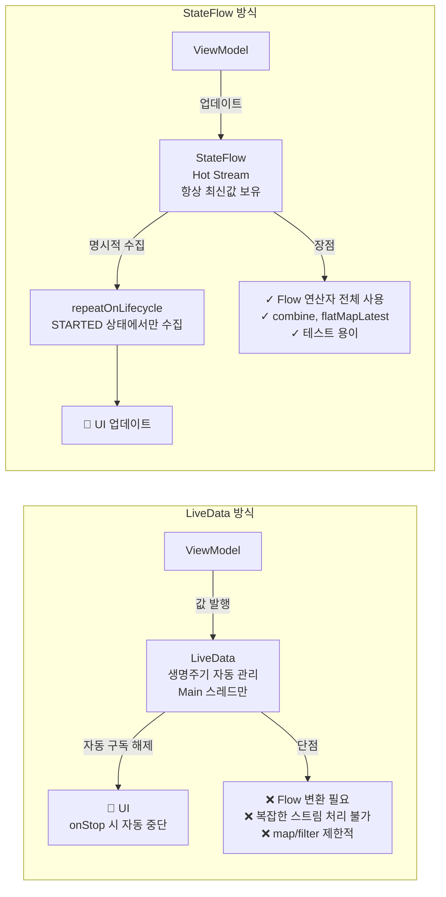

**백그라운드 작업 전략** 선택도 중요한 트레이드오프입니다.

| 방식 | 수명 | 생명주기 인식 | 적합한 작업 | 주의점 |
|---|---|---|---|---|
| Thread/Handler | 직접 관리 | ✗ | 단순 백그라운드 | 메모리 누수 위험 |
| Coroutine | viewModelScope | ✓ | 네트워크/DB | 취소 처리 필수 |
| WorkManager | 앱 종료 후도 | ✓ | 주기적/보장성 | 제약조건 설정 |
| Foreground Service | 사용자 인지 | ✓ | 장시간 작업 | 알림 필수 |

### 리팩토링과 설계 원칙

**메모리 누수 방지**는 안드로이드 리팩토링의 핵심 원칙입니다. Context 누수는 가장 흔한 문제로, Activity Context를 싱글톤이나 장기 생존 객체에서 참조하면 Activity가 GC되지 못합니다. Application Context를 사용하거나 WeakReference를 활용해야 합니다.

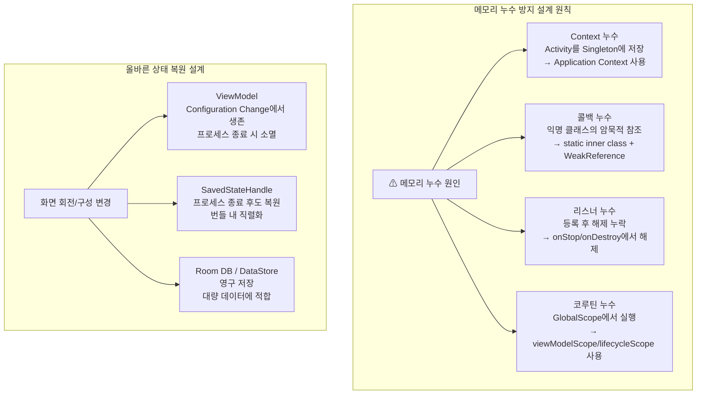

**단방향 데이터 플로우(UDF)**는 현대 안드로이드 설계의 핵심 원칙입니다. 상태는 ViewModel에서 관리하고, UI는 상태를 관찰(observe)만 하며, 사용자 이벤트는 Intent로 ViewModel에 전달됩니다. 이를 통해 상태 변경 추적이 용이해지고, 타임트래블 디버깅이 가능해집니다.

### 디자인 패턴 적용

안드로이드 앱 아키텍처 패턴은 MVC에서 MVI로 진화해왔으며, 각 패턴은 특정 문제를 해결하기 위해 등장했습니다.

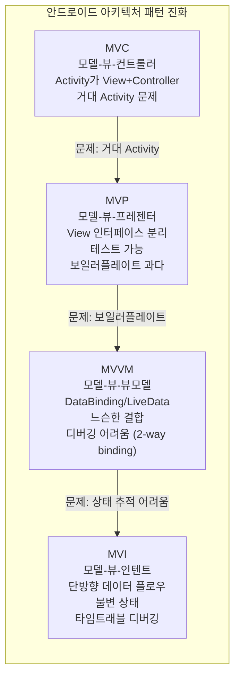

**Repository 패턴**은 데이터 소스를 추상화하는 핵심 패턴입니다. ViewModel은 데이터가 네트워크에서 오는지, 로컬 DB에서 오는지 알 필요가 없습니다. Repository가 오프라인 우선 전략, 캐시 무효화, 데이터 동기화를 담당합니다.

**Dependency Injection(Hilt/Dagger)**은 안드로이드에서 느슨한 결합을 실현하는 핵심 패턴입니다. Hilt는 Android 생명주기에 맞춰 자동으로 스코프를 관리하며(`@HiltViewModel`, `@AndroidEntryPoint`), 테스트 시 모듈 교체(`@TestInstallIn`)로 의존성을 쉽게 교체할 수 있습니다.

**Navigation Component 설계 패턴**은 Fragment 기반 네비게이션의 복잡성을 해결합니다. NavGraph로 화면 전환을 선언적으로 정의하고, Safe Args로 타입 안전한 인자 전달을 보장합니다. Deep Link도 NavGraph에 선언적으로 등록하여 외부에서 특정 화면으로 직접 진입할 수 있습니다.

**Compose에서의 상태 호이스팅(State Hoisting)** 패턴은 상태를 상위 Composable로 올려 단방향 데이터 플로우를 구현합니다. 상태를 소유하는 Composable과 상태를 표시하는 Composable을 분리하여 재사용성과 테스트 용이성을 높입니다. 이는 React의 "lifting state up" 원칙과 동일한 개념입니다.

## 연습 문제

### 1. 시스템 구조와 모델링

**문제 1-1.** 사용자가 안드로이드 앱에서 홈 버튼을 누르면 앱이 백그라운드로 전환됩니다. 이때 Activity의 생명주기 콜백이 `onPause → onStop → onSaveInstanceState` 순서로 호출되는 과정을 설명하세요. 시스템 메모리가 부족하여 백그라운드 앱의 프로세스가 종료된 후, 사용자가 다시 앱으로 돌아왔을 때 `onCreate(savedInstanceState)` → `onRestoreInstanceState`를 통한 상태 복원 과정을 단계별로 설명하세요. `ViewModel`이 이 과정에서 살아남는 이유와, `SavedStateHandle`이 필요한 이유도 함께 분석하세요.

<details><summary>힌트 보기</summary>

`onSaveInstanceState`에 `Bundle`로 저장된 데이터는 시스템이 프로세스를 종료하더라도 유지됩니다. `ViewModel`은 Configuration Change(화면 회전)에서는 살아남지만, 프로세스 종료 시에는 소멸됩니다. `SavedStateHandle`은 `ViewModel` 내에서 프로세스 종료에서도 복원 가능한 상태를 관리합니다. `Bundle`에 저장할 수 있는 데이터 크기 제한(~500KB)과 직렬화 비용도 고려해야 합니다.

</details>

**문제 1-2.** Jetpack Compose의 재구성(Recomposition) 메커니즘에서, 상태(State)가 변경되면 어떤 Composable 함수만 재구성되는지 결정하는 smart recomposition의 원리를 설명하세요. 다음 코드에서 `count` 상태가 변경될 때, `Header`와 `Footer` Composable도 재구성되는지 판단하고 그 이유를 설명하세요:

```kotlin
@Composable
fun Screen() {
    var count by remember { mutableStateOf(0) }
    Header(title = "고정 제목")
    Counter(count = count, onIncrement = { count++ })
    Footer(text = "고정 텍스트")
}
```

<details><summary>힌트 보기</summary>

Compose 컴파일러는 각 Composable 호출을 고유 키로 추적합니다. `Header`와 `Footer`는 입력 파라미터가 변경되지 않았으므로("고정 제목", "고정 텍스트"는 안정적 타입), Compose는 이전 호출과 비교하여 스킵합니다. `Counter`만 `count` 파라미터가 변경되었으므로 재구성됩니다. 안정적(stable) 타입 여부가 스킵 판단의 핵심이며, `@Stable` 또는 `@Immutable` 어노테이션으로 커스텀 타입의 안정성을 보장할 수 있습니다.

</details>

**문제 1-3.** Android에서 Binder IPC를 통해 앱과 시스템 서비스(예: ActivityManagerService) 간 통신이 이루어집니다. 앱이 `startActivity(intent)`를 호출했을 때, Binder 드라이버를 통해 AMS에 요청이 전달되고, 새 Activity가 생성되기까지의 IPC 흐름을 설명하세요. Binder가 일반적인 소켓 IPC 대비 효율적인 이유(커널 메모리 매핑, 데이터 복사 최소화)도 분석하세요.

<details><summary>힌트 보기</summary>

Binder는 프로세스 간 데이터를 전달할 때 커널 주소 공간과 수신 프로세스의 주소 공간을 동일한 물리 페이지에 매핑하여, 데이터 복사를 1회로 줄입니다(일반 IPC는 송신→커널→수신으로 2회 복사). `Parcel` 객체에 직렬화된 데이터가 Binder 드라이버(`/dev/binder`)를 통해 AMS 프로세스로 전달되고, AMS가 새 Activity의 프로세스 할당, 생명주기 관리를 수행합니다.

</details>

### 2. 트레이드오프와 의사결정

**문제 2-1.** 복잡한 상태 전환이 많은 실시간 채팅 앱과 단순 CRUD 형태의 메모 앱을 각각 개발한다고 가정합니다. MVVM(Model-View-ViewModel)과 MVI(Model-View-Intent) 아키텍처 중 각 앱에 더 적합한 패턴은 무엇인지 근거와 함께 설명하세요. 채팅 앱에서 MVI의 단방향 데이터 플로우와 불변 상태(immutable state)가 디버깅과 상태 추적에 어떤 이점을 주는지 분석하세요.

<details><summary>힌트 보기</summary>

MVI는 상태를 단일 불변 객체(`data class ChatState(messages, isTyping, connectionStatus, error)`)로 관리하므로, 어떤 시점의 화면 상태든 하나의 객체로 완전히 표현됩니다. Intent(사용자 액션) → Reducer(상태 변환) → State(새 상태) → View(렌더링) 흐름이 단방향이므로 타임트래블 디버깅이 가능합니다. MVVM은 양방향 바인딩이 가능하여 단순 CRUD에서 보일러플레이트가 적지만, 복잡한 상태에서는 여러 LiveData/StateFlow 간 조합이 어려워질 수 있습니다.

</details>

**문제 2-2.** 안드로이드 앱에서 로컬 데이터 저장소를 선택해야 합니다. Room(SQLite), Realm, Proto DataStore 각각이 적합한 시나리오를 제시하세요: (1) 복잡한 관계형 쿼리가 필요한 오프라인 우선 앱, (2) 실시간 동기화가 중요한 협업 도구, (3) 사용자 설정값과 온보딩 상태 같은 단순 키-값 저장. 각 솔루션의 성능, 데이터 모델링 유연성, 학습 곡선 트레이드오프를 비교하세요.

<details><summary>힌트 보기</summary>

Room은 SQL 기반으로 복잡한 JOIN, 집계 쿼리에 강하며, Flow/LiveData 통합이 우수합니다. Realm은 객체 지향 데이터 모델로 스키마가 클래스에 직접 매핑되며, MongoDB Atlas Device Sync와 연동한 실시간 동기화가 내장되어 있습니다. Proto DataStore는 Protocol Buffers 기반으로 타입 안전하고, SharedPreferences의 비동기/타입 안전 대안입니다. (1)→Room, (2)→Realm, (3)→Proto DataStore가 일반적인 선택입니다.

</details>

**문제 2-3.** Jetpack Compose로 완전히 새로 작성할지, 기존 View 시스템 위에 점진적으로 Compose를 도입할지 결정해야 합니다. 팀의 학습 곡선, 기존 코드베이스 크기, XML 레이아웃의 Compose 호환성(`ComposeView`, `AndroidView`), 테스트 전략의 변화를 고려하여 각 접근법의 트레이드오프를 분석하세요.

<details><summary>힌트 보기</summary>

완전 재작성은 기술 부채 없이 일관된 코드베이스를 얻지만, 개발 기간이 길고 기존 기능의 회귀 테스트가 필요합니다. 점진적 도입은 `ComposeView`로 기존 XML 레이아웃 내에 Compose를 삽입하거나, `AndroidView`로 Compose 내에서 기존 View를 사용할 수 있어 위험이 적습니다. 테스트에서는 Espresso(View)와 Compose Testing(`ComposeTestRule`)이 혼재하게 됩니다. 새 기능은 Compose로, 기존 화면은 리팩토링 시 점진적으로 전환하는 하이브리드 전략이 일반적입니다.

</details>

### 3. 문제 해결 및 리팩토링

**문제 3-1.** 레거시 안드로이드 앱에서 `Fragment`가 `Activity`의 참조를 직접 필드로 보유하고 있어, 화면 회전 시 이전 Activity가 GC되지 않는 메모리 누수가 발생합니다. 다음 문제 코드를 분석하고, ViewModel로 UI 로직을 분리하여 누수를 해결하는 리팩토링 방안을 제시하세요:

```kotlin
class MyFragment : Fragment() {
    private var activity: MainActivity? = null
    override fun onAttach(context: Context) {
        super.onAttach(context)
        activity = context as MainActivity  // 누수 원인
    }
    // activity 참조를 통해 데이터 접근
}
```

<details><summary>힌트 보기</summary>

Configuration Change(화면 회전) 시 Activity가 재생성되지만, Fragment가 이전 Activity 참조를 계속 보유하면 GC가 수거할 수 없습니다. 해결: (1) 데이터 관련 로직을 `ViewModel`로 이동하여 Activity/Fragment 생명주기와 분리, (2) Activity의 메서드가 필요한 경우 인터페이스를 정의하고 `onAttach`/`onDetach`에서 설정/해제, (3) `viewLifecycleOwner`를 사용하여 View의 생명주기에 맞춰 관찰. `LeakCanary`로 메모리 누수를 자동 감지하는 것도 필수입니다.

</details>

**문제 3-2.** 메인 스레드(UI 스레드)에서 네트워크 API를 동기적으로 호출하여 ANR(Application Not Responding, 5초 초과) 에러가 발생했습니다. 이 코드를 Kotlin Coroutine의 `Dispatchers.IO`를 사용하여 비동기로 전환하고, ViewModel에서 `viewModelScope`를 활용한 구조화된 동시성(Structured Concurrency) 패턴으로 리팩토링하세요. 코루틴이 ViewModel의 `onCleared()`에서 자동 취소되는 메커니즘도 설명하세요.

<details><summary>힌트 보기</summary>

`viewModelScope`는 `ViewModel`의 `onCleared()` 시 자동으로 취소되는 `CoroutineScope`입니다. `viewModelScope.launch { val data = withContext(Dispatchers.IO) { api.fetchData() }; _state.value = data }` 패턴으로 IO 스레드에서 네트워크 호출, 메인 스레드에서 UI 업데이트를 수행합니다. 구조화된 동시성은 부모 코루틴이 취소되면 모든 자식 코루틴도 함께 취소되어, Activity/Fragment 종료 시 네트워크 요청이 자동으로 정리됩니다.

</details>

**문제 3-3.** RecyclerView에서 대량의 이미지를 로드할 때 스크롤이 버벅거리고 OOM(OutOfMemoryError)이 간헐적으로 발생합니다. 이미지 로딩 라이브러리(Coil/Glide)의 메모리 캐시 + 디스크 캐시 전략, `RecyclerView.setItemViewCacheSize`와 `setHasFixedSize(true)`의 역할, 그리고 bitmap 다운샘플링(`inSampleSize`)으로 메모리 사용량을 최적화하는 방법을 설명하세요.

<details><summary>힌트 보기</summary>

Glide/Coil은 원본 이미지를 ImageView 크기에 맞게 다운샘플링하여 메모리 사용량을 줄이고, LRU 메모리 캐시와 디스크 캐시로 재로딩을 방지합니다. `setHasFixedSize(true)`는 아이템 변경 시 전체 RecyclerView 레이아웃 재계산을 스킵합니다. 빠른 스크롤 시 보이지 않는 아이템의 이미지 로딩을 취소(`Lifecycle` 인식)하고, placeholder 이미지를 먼저 보여주는 전략이 체감 성능을 높입니다.

</details>

### 4. 개념 간의 연결성

**문제 4-1.** 오프라인 우선(Offline-First) 앱을 설계하면서 WorkManager, Kotlin Coroutine, Room DB를 조합하여 다음 데이터 흐름을 구현하려 합니다: "사용자가 오프라인에서 데이터를 수정 → Room에 로컬 저장 + 동기화 대기열에 추가 → 네트워크 복구 시 WorkManager가 백그라운드 동기화 실행 → 서버 응답으로 로컬 DB 업데이트". 각 컴포넌트의 역할과 충돌 해결(conflict resolution) 전략을 설계하세요.

<details><summary>힌트 보기</summary>

Room은 로컬 데이터 저장과 `pending_sync` 플래그로 동기화 대기 항목을 추적합니다. WorkManager는 `NetworkType.CONNECTED` 제약 조건으로 네트워크 가용 시에만 동기화 작업을 실행하며, `ExistingWorkPolicy.KEEP`으로 중복 작업을 방지합니다. Coroutine은 WorkManager의 `CoroutineWorker` 내에서 비동기 API 호출을 수행합니다. 충돌 해결은 last-write-wins, 서버 우선, 또는 사용자에게 충돌 해결 UI를 보여주는 방식 중 선택합니다.

</details>

**문제 4-2.** Jetpack Compose + Kotlin Flow + Room을 결합하여 반응형 데이터 파이프라인을 구축하려 합니다. Room DAO가 `Flow<List<Todo>>`를 반환하고, ViewModel이 이를 `StateFlow`로 변환하며, Compose UI가 `collectAsState()`로 관찰하는 전체 흐름에서, 데이터베이스 레코드가 변경되면 UI가 자동으로 업데이트되는 메커니즘을 단계별로 설명하세요. `stateIn(SharingStarted.WhileSubscribed(5000))`의 5000ms 타임아웃이 Configuration Change 시 불필요한 재쿼리를 방지하는 원리도 분석하세요.

<details><summary>힌트 보기</summary>

Room은 내부적으로 `InvalidationTracker`를 사용하여 테이블 변경을 감지하고, 해당 테이블을 관찰하는 Flow에 새로운 쿼리 결과를 emit합니다. `stateIn(SharingStarted.WhileSubscribed(5000))`은 마지막 구독자가 사라진 후 5초간 업스트림 Flow를 유지합니다. 화면 회전 시 ViewModel은 유지되지만 Compose가 잠시 구독을 해제했다가 재구독하는데, 5초 이내이므로 Flow가 유지되어 DB 재쿼리가 발생하지 않습니다.

</details>

**문제 4-3.** Android에서 앱 시작 시간(Cold Start)을 최적화하기 위해 App Startup 라이브러리, Baseline Profiles, R8 최적화가 어떻게 협력하는지 설명하세요. ContentProvider 기반 초기화가 앱 시작을 느리게 만드는 이유, Baseline Profile이 JIT 컴파일 지연을 줄이는 원리, R8의 코드 축소/난독화가 DEX 파일 크기와 클래스 로딩 속도에 미치는 영향을 연결하여 분석하세요.

<details><summary>힌트 보기</summary>

많은 라이브러리가 `ContentProvider.onCreate()`에서 자동 초기화되어 `Application.onCreate()` 이전에 실행되므로, 앱 시작이 느려집니다. App Startup 라이브러리는 단일 `ContentProvider`로 초기화를 통합하고 지연 초기화를 지원합니다. Baseline Profile은 앱의 핫 경로 메서드를 AOT 컴파일하여 첫 실행 시 JIT 컴파일 오버헤드를 제거합니다. R8은 사용하지 않는 코드를 제거(Tree Shaking)하고, 클래스/메서드명을 축소하여 DEX 크기를 줄이고 클래스 로딩 속도를 높입니다.

</details>
