# 네트워킹 내부

> 합성: Forouzan *Data Communications and Networking* 4th ed, Comer *Computer Networks and Internets* 5th ed, Barrett & Silverman *SSH: The Definitive Guide*, Bourke *Server Load Balancing* 및 지원 comp(24/28/37/38/344-355/467/496/501) 참조.

---

> **읽기 계약:** 이 문서는 네트워크 표준의 개념 흐름과 특정 Linux·OpenSSH·로드밸런서 구현을 함께 설명합니다. RFC의 규범 요구, 커널 버전별 함수·자료구조, 공급자 기본값, 구성 예와 벤치마크를 같은 사실로 취급하지 않습니다. 재사용 시 RFC·Linux·OpenSSH·TLS·HTTP·BGP 구현 버전, 네임스페이스·오프로딩 설정, 토폴로지와 측정 환경을 식별합니다. 패킷 경로는 캡처·추적 또는 공식 소스로 확인하고, 성공 조건·타임아웃·재전송·보안 실패가 기록된 뒤 완료합니다. 조건이 달라지면 수치와 경로를 미확정 상태로 되돌립니다.

## 1. Linux 네트워크 스택 — sk_buff 흐름

전통적인 Linux 소켓 경로는 `struct sk_buff`를 핵심 패킷 메타데이터로 사용하지만, 하나의 패킷이 항상 단일 힙 객체로만 존재하는 것은 아닙니다. 복제·분할·GSO/GRO 조각과 XDP 같은 우회 경로가 있으며 함수명과 필드는 커널 버전에 따라 달라집니다.

```c
struct sk_buff {
    struct sk_buff     *next, *prev;   // doubly-linked in queue
    struct sock        *sk;            // owning socket (NULL for forwarded)
    struct net_device  *dev;           // ingress/egress NIC
    unsigned char      *head;          // start of allocated buffer
    unsigned char      *data;          // start of current payload (moves as headers added/stripped)
    unsigned char      *tail;          // end of payload
    unsigned char      *end;           // end of allocated buffer
    __u32              len;            // total payload length
    __u16              protocol;       // ETH_P_IP, ETH_P_IPV6, ETH_P_ARP ...
    // ... transport header, network header, mac header pointers ...
};
```

### TX 경로(사용자 공간 쓰기 → 연결)

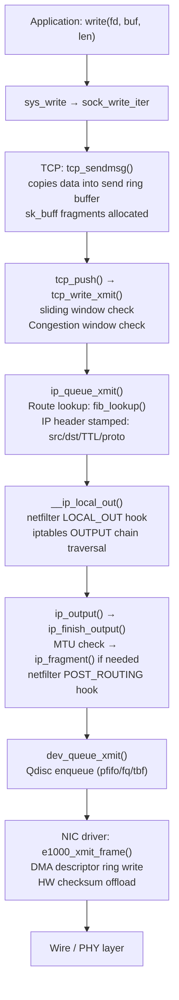

### RX 경로(와이어 → 소켓 버퍼)

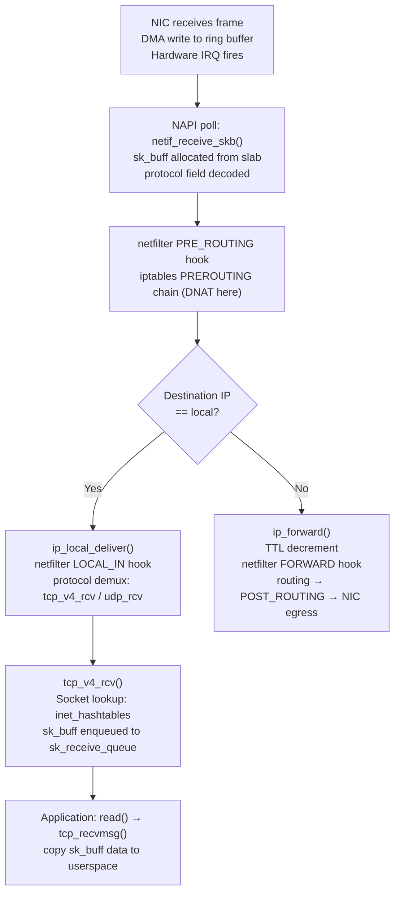

---

## 2. TCP 상태 머신 및 혼잡 제어

### TCP 전체 상태 머신

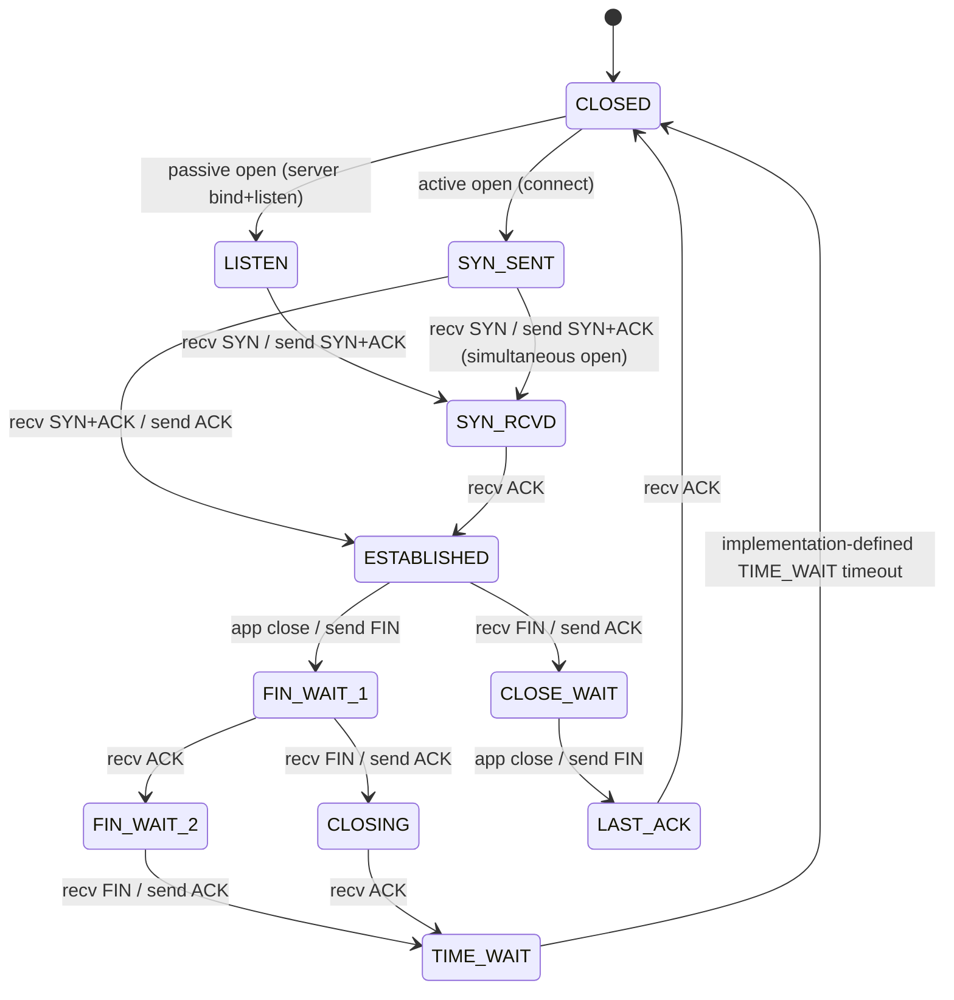

### TCP 3방향 핸드셰이크 - 커널 메모리 할당 타임라인

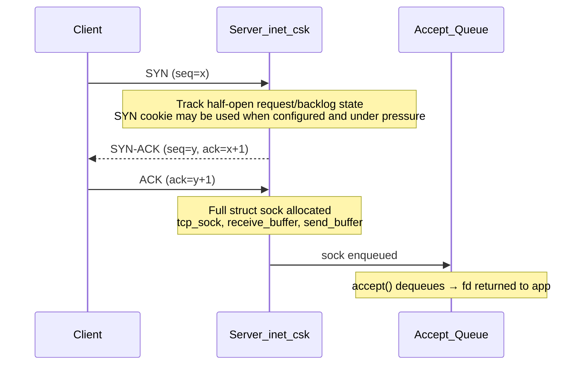

### 혼잡 제어 — CUBIC Window Evolution

```mermaid
flowchart LR
    A["Slow Start\ncwnd grows per acknowledged data\n(approximately exponential by RTT)"] -->|cwnd >= ssthresh| B["Congestion Avoidance\nCUBIC model: W(t) = C·(t-K)³ + Wmax\nK depends on Wmax, C, and multiplicative decrease"]
    B -->|packet loss (3 dup ACKs)| C["Fast Recovery\nssthresh = cwnd × β(0.7)\nEnter CUBIC recovery probe"]
    C -->|new ACK| B
    B -->|RTO timeout| D["Slow Start\ncwnd = 1 MSS\nssthresh = cwnd/2"]
    D --> A

    style A fill:#2d4a22,color:#fff
    style B fill:#1a3a5c,color:#fff
    style C fill:#5c2d1a,color:#fff
    style D fill:#4a1a1a,color:#fff
```

**CUBIC 수식 분석**:
- `C` = 0.4(배율 인수)
- `Wmax` = 마지막 정체 이벤트의 창 크기
- 표준 CUBIC 모델의 `K`는 `Wmax`, `C`와 곱셈 감소 후의 간격, 즉 보통 `1-β` 항에 의해 정해집니다. 기호 정의와 구현 버전을 확인합니다.
- `t=K`에서 창은 Wmax와 같습니다. K를 넘어서면 초선형으로 성장합니다.
- `β` = 0.7 (곱셈 감소 인자, Reno의 0.5보다 덜 공격적)

**BBR(병목 대역폭 및 RTT)** — 대역폭을 직접 조사합니다.
```
BtlBw = max delivery rate over RTprop window
pacing_rate = BtlBw × pacing_gain
cwnd = BtlBw × RTprop × cwnd_gain
```
BBR은 STARTUP·DRAIN·PROBE_BW·PROBE_RTT 계열 상태로 대역폭과 RTT 모델을 갱신합니다. 손실 처리와 상태 세부사항은 BBR 버전에 따라 다르므로 "손실에 반응하지 않는다"는 절대적 설명으로 사용하지 않습니다.

---

## 3. IP 계층 - 헤더 처리 및 라우팅

### IPv4 헤더 메모리 레이아웃

```
 0                   1                   2                   3
 0 1 2 3 4 5 6 7 8 9 0 1 2 3 4 5 6 7 8 9 0 1 2 3 4 5 6 7 8 9 0 1
+-+-+-+-+-+-+-+-+-+-+-+-+-+-+-+-+-+-+-+-+-+-+-+-+-+-+-+-+-+-+-+-+
|Version|  IHL  |    DSCP   |ECN|         Total Length          |
+-+-+-+-+-+-+-+-+-+-+-+-+-+-+-+-+-+-+-+-+-+-+-+-+-+-+-+-+-+-+-+-+
|         Identification        |Flags|      Fragment Offset    |
+-+-+-+-+-+-+-+-+-+-+-+-+-+-+-+-+-+-+-+-+-+-+-+-+-+-+-+-+-+-+-+-+
|  Time to Live |    Protocol   |         Header Checksum       |
+-+-+-+-+-+-+-+-+-+-+-+-+-+-+-+-+-+-+-+-+-+-+-+-+-+-+-+-+-+-+-+-+
|                       Source Address                          |
+-+-+-+-+-+-+-+-+-+-+-+-+-+-+-+-+-+-+-+-+-+-+-+-+-+-+-+-+-+-+-+-+
|                    Destination Address                        |
+-+-+-+-+-+-+-+-+-+-+-+-+-+-+-+-+-+-+-+-+-+-+-+-+-+-+-+-+-+-+-+-+
```

- **IHL**(인터넷 헤더 길이): 4비트 필드 × 4 = 헤더 크기(바이트)(최소 20, 최대 60)
- **DSCP/ECN**: 차별화된 서비스 — IP_TOS는 대기열 우선 순위에 매핑됩니다. ECN 비트는 드롭 없이 신호 혼잡을 발생시킵니다.
- **식별 + 플래그 + 조각 오프셋**: 조각화 재조립 — 커널은 `ipq` 해시 테이블의 조각을 추적합니다. 재조립 타이머는 30초 후에 작동됩니다.

### FIB(전달 정보 베이스) Trie 조회

Linux는 라우팅 테이블을 O(log2W) LPM에 대한 **LC-trie**(레벨 압축 트리)로 저장합니다.

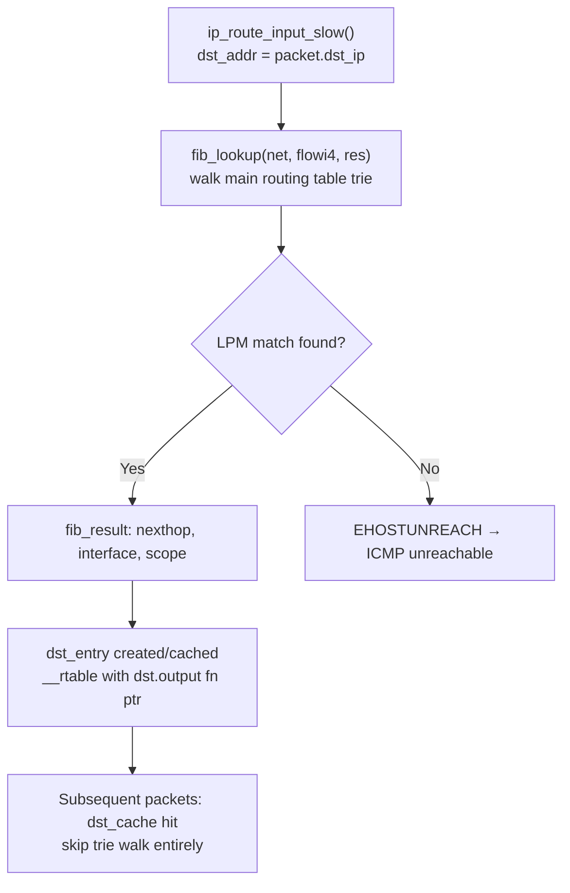

### IPv6 확장 헤더 체인

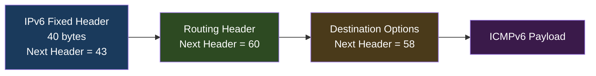

IPv6은 중간 라우터(소스 조각만)에서 조각화를 제거합니다(경로 MTU 검색 필수). 헤더 체크섬이 없습니다(전송 계층에 위임됨). NDP(Neighbor Discovery Protocol)는 ICMPv6 유형 135/136을 사용하여 ARP를 대체합니다.

---

## 4. ARP 확인 — 메모리 구조

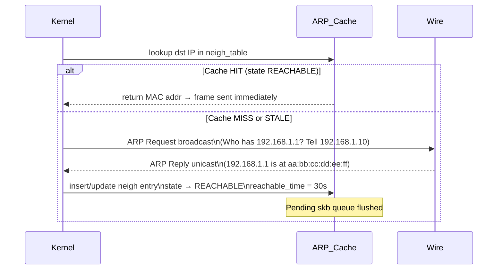

커널의 `struct neighbour`:
```c
struct neighbour {
    __u8            primary_key[4];  // IP address
    u8              ha[ALIGN(MAX_ADDR_LEN, sizeof(unsigned long))]; // MAC
    unsigned long   confirmed;        // jiffies of last confirmation
    atomic_t        refcnt;
    struct neigh_ops *ops;            // ops->output fn: arp_send or direct
    // NUD state machine: INCOMPLETE→REACHABLE→STALE→DELAY→PROBE→FAILED
};
```

---

## 5. DNS 확인 체인

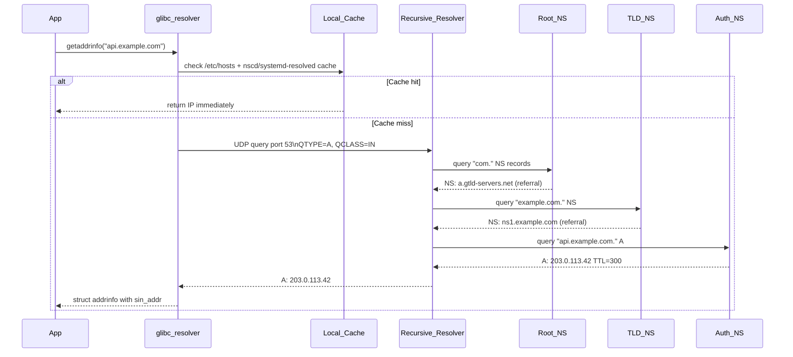

DNS 메시지 연결 형식(RFC 1035):
```
Header (12 bytes): ID(16) | QR|Opcode|AA|TC|RD|RA|Z|RCODE | QDCOUNT | ANCOUNT | NSCOUNT | ARCOUNT
Question: QNAME (labels) | QTYPE (2) | QCLASS (2)
Answer RR: NAME | TYPE | CLASS | TTL(32) | RDLENGTH | RDATA
```

DNSSEC는 **RRSIG**, **DNSKEY**, 부모 영역의 **DS**, **NSEC/NSEC3**를 사용합니다. 일반적인 분리에서는 KSK가 DNSKEY RRset을 서명하고 ZSK가 다른 RRset을 서명하지만 운영 방식은 달라질 수 있습니다. 검증기는 신뢰 앵커에서 DS와 자식 DNSKEY의 일치를 따라가며 각 RRset의 RRSIG를 검증합니다.

---

## 6. Netfilter / iptables 후크 아키텍처

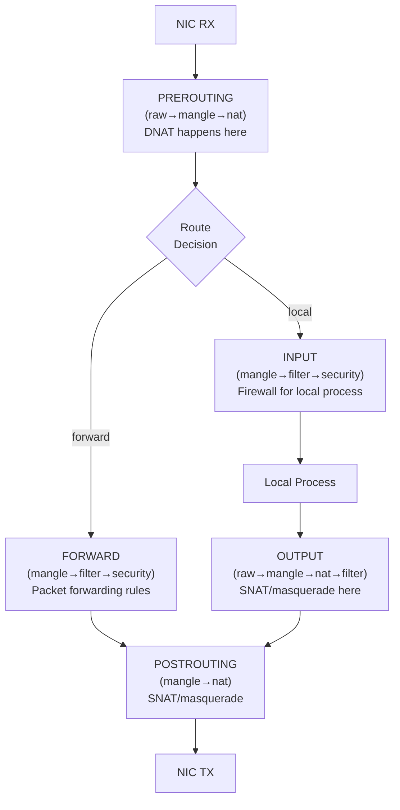

**연결 추적(conntrack)** — 해시 테이블에 저장된 각 TCP/UDP 흐름:
```
nf_conntrack_tuple: {src_ip, src_port, dst_ip, dst_port, proto, netns}
State: NEW → ESTABLISHED → RELATED → INVALID
```
NAT는 sk_buff IP/TCP 헤더를 수정하고 체크섬을 증분식으로 다시 계산하여 패킷을 다시 작성합니다(RFC 1624 1의 보완 증분 업데이트).

**nftables**는 레지스터 기반 VM을 사용하여 iptables를 대체합니다.
```
rule → list of expressions → each expression operates on registers r0..r15
verdict: accept / drop / jump / goto / return / continue
```

---

## 7. SSH 프로토콜 내부 - 암호화 핸드셰이크

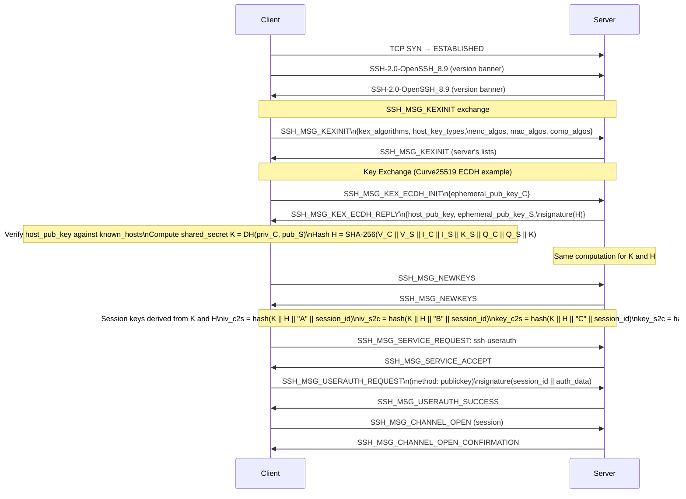

### SSH 패킷 와이어 형식(NEWKEYS 이후)

```
uint32 packet_length       // length of (padding_length + payload + random_padding)
byte   padding_length      // random padding to align to cipher block size
byte[n] payload            // SSH message (compressed if negotiated)
byte[m] random_padding     // random bytes
byte[mac_len] MAC          // HMAC-SHA2-256(sequence_number || unencrypted_packet)
```

SSH 패킷에서 암호화되는 필드와 길이 노출, MAC 입력·순서는 협상한 암호와 MAC 조합에 따라 다릅니다. AES-CTR+MAC, Encrypt-then-MAC, ChaCha20-Poly1305 같은 AEAD를 하나의 와이어 규칙으로 합치지 말고 해당 RFC와 협상 결과를 기준으로 해석합니다.

---

## 8. TLS 1.3 핸드셰이크 내부

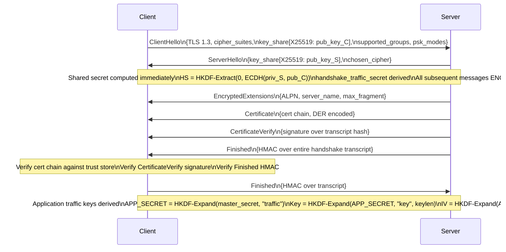

**0-RTT 재개**: 클라이언트는 이전 세션의 PSK 및 ticket_age_add를 저장합니다. 다시 연결하면 서버가 응답하기 전에 resumption_master_secret으로 암호화된 early_data를 보냅니다. 서버는 수락하거나 거부해야 합니다. 재생 방지 캐시로 완화된 재생 취약성입니다.

---

## 9. 로드 밸런싱 알고리즘 - 내부 결정 경로

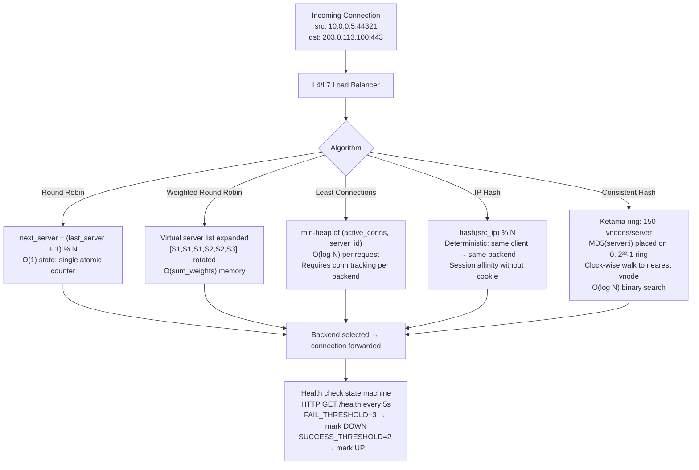

### DSR(직접 서버 반환) 대 NAT 모드

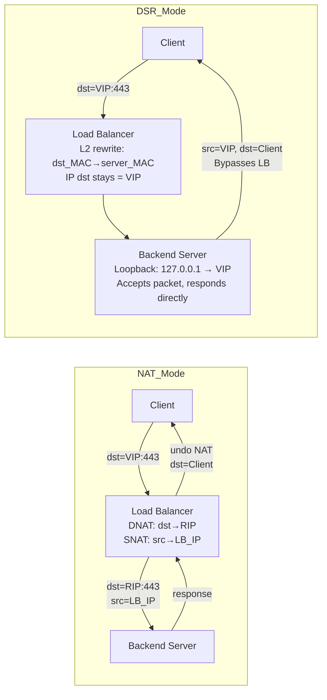

DSR은 반환 경로 병목 현상을 제거합니다. LB는 수신만 처리합니다. 동일한 L2 도메인의 모든 백엔드와 루프백(ARP'd 아님)에 구성된 VIP가 필요합니다.

---

## 10. Linux 네트워크 네임스페이스 내부

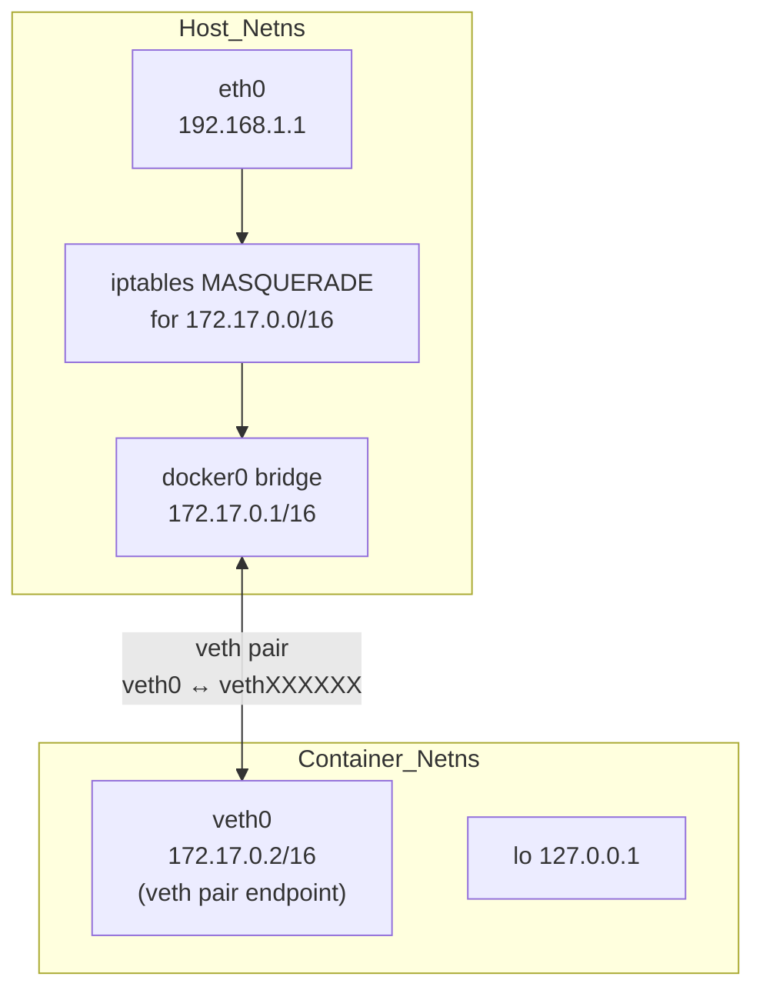

`struct net`(네트워크 네임스페이스)에는 다음이 포함됩니다.
- 라우팅 테이블(`net->ipv4.fib_main`)
- ARP 테이블(`net->ipv4.neigh_table`)
- 소켓 테이블(`net->ipv4.tcp_death_row`)
- iptables/nftables 규칙 세트
- 네트워크 기기 목록(`net->dev_base_head`)

`ip netns add foo` → `clone(CLONE_NEWNET)` → 새 `struct net` 할당됨 → `/proc/self/ns/net` 심볼릭 링크가 생성되었습니다. 컨테이너 런타임의 `unshare(CLONE_NEWNET)`는 프로세스를 새 네임스페이스로 이동합니다.

---

## 11. 무선 네트워크 내부(802.11)

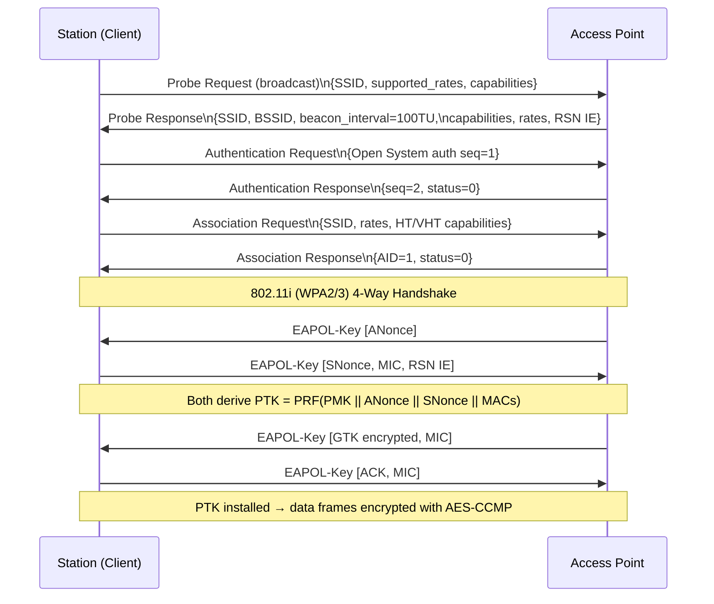

**OFDM 채널 인코딩**(802.11n/ac/ax):
- 데이터를 부반송파로 분할합니다(예: 20MHz 802.11n의 경우 데이터 52개 + 파일럿 4개)
- 각 부반송파 BPSK/QPSK/16-QAM/64-QAM/256-QAM/1024-QAM 변조
- IFFT는 주파수 영역을 시간 영역으로 변환 → 순환 프리픽스 추가 → RF
- MCS 인덱스 인코딩: 변조 × 코딩 속도 × 공간_스트림 → 처리량

---

## 12. BGP 경로 선택 내부

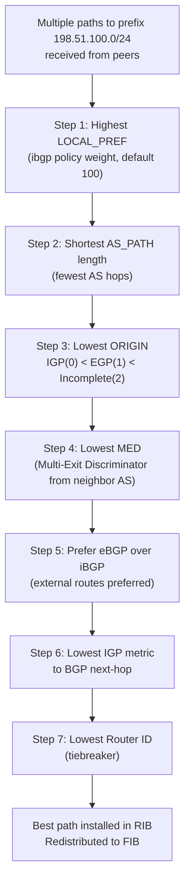

BGP UPDATE 메시지는 다음을 전달합니다.
- **WITHDRAWN ROUTES**: 접두사에 더 이상 연결할 수 없습니다.
- **경로 속성**: ORIGIN, AS_PATH, NEXT_HOP, MED, LOCAL_PREF, COMMUNITY, LARGE_COMMUNITY
- **NLRI**: 네트워크 계층 연결성 정보(접두사)

BGP 세션 상태 머신: `IDLE → CONNECT → ACTIVE → OPENSENT → OPENCONFIRM → ESTABLISHED`. Keepalive 타이머(기본값 60초)는 세션을 유지합니다. 보류 시간(180초)이 만료되면 중단됩니다.

---

## 13. TCP/UDP 체크섬 계산

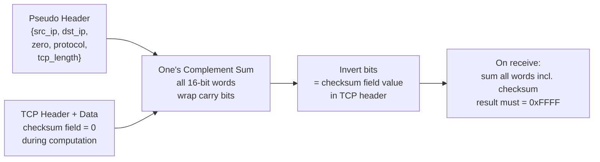

하드웨어 체크섬 오프로드(`NETIF_F_IP_CSUM`): NIC는 하드웨어에서 TCP/UDP 체크섬을 계산합니다. 커널은 `skb->ip_summed = CHECKSUM_PARTIAL`을 설정하고 부분 의사 헤더 체크섬을 작성합니다. NIC는 전용 하드웨어 로직을 사용하여 페이로드를 통해 이를 완료하여 CPU 주기를 확보합니다.

---

## 14. HTTP/2 프레임 다중화 내부

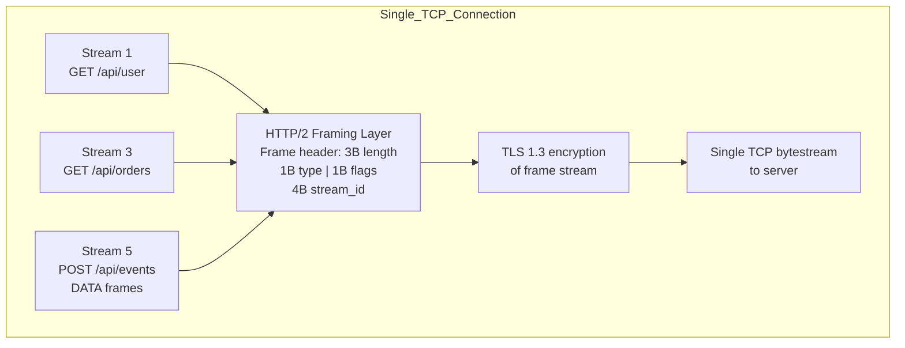

**HPACK 헤더 압축**:
- 정적 테이블: 사전 정의된 헤더 이름/값 쌍 61개(예: 인덱스 2 = `:method: GET`)
- 동적 테이블: 최근에 본 헤더의 LRU 캐시, SETTINGS를 통해 협상된 최대 크기
- 리터럴 문자열에 적용되는 허프만 인코딩
- 결과: `Content-Type: application/json` 같은 헤더 → 이전에 본 경우 1-2바이트

**흐름 제어**: 스트림별 및 연결별 기간. `WINDOW_UPDATE` 프레임이 수신 창에 추가됩니다. 각 DATA 프레임은 둘 다에서 공제됩니다. 느린 스트림이 빠른 스트림을 차단하는 것을 방지합니다.

---

## 네트워크 스택 성능 수치

> 아래 값은 커널·NIC·오프로딩·CPU·MTU·토폴로지·부하가 없는 예시 범위입니다. 용량 계획이나 회귀 판정에는 같은 환경의 p50/p95/p99, 손실률과 동시 연결 수를 함께 측정합니다.

| 운영 | 일반적인 지연 시간 | 메모 |
|-----------|-----------------|-------|
| L1 ARP 캐시 적중 → TX | ~5μs | NIC DMA + 드라이버 경로 |
| TCP 루프백(동일 호스트) | ~10~30μs | 유닉스 소켓을 통한 커널 우회 ~1μs |
| LAN 왕복(GbE) | ~100-200μs | 스위칭 패브릭 포함 |
| WAN RTT(대륙 간) | ~60-150ms | 빛의 속도가 제한됨 |
| DNS 조회(재귀적, 콜드) | 20-200ms | 리졸버 체인 순회 |
| TLS 1.3 핸드셰이크(웜) | 1 RTT + 암호화폐 | ~1-3ms LAN |
| iptables 규칙(선형 스캔) | O(N) 규칙 | 10,000개 규칙 = ~100μs 오버헤드 |
| nftables 규칙(해시/맵) | O(1) 일반 | 집합 기반 매칭 |
| TCP 연결 설정 | 1.5RTT | SYN + SYN-ACK + ACK + 데이터 |

---

## 요약 - 주요 내부 매핑

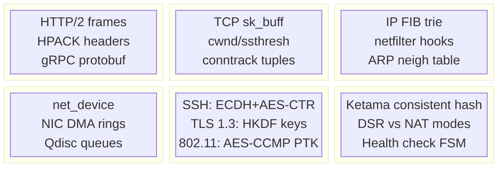

모든 바이트는 애플리케이션 버퍼 → 소켓 전송 큐 → TCP 분할 → IP 헤더 스탬핑 → 넷필터 후크 → QDisc → NIC DMA 링 → 와이어를 순회합니다. 수신 측에서 정확한 역방향 경로: DMA → NAPI 폴 → 프로토콜 demux → sk_receive_queue → 사용자 공간 복사. 이 전체 sk_buff 수명 주기(메모리 내 위치, 어떤 커널 기능이 이를 변경하는지, 어떤 후크가 이를 가로채는지)를 이해하는 것이 모든 Linux 네트워크 성능 분석 및 문제 해결의 기초입니다.


---

## 설계적 고민

### 구조와 모델링

네트워크 프로토콜 설계의 근본 모델은 **계층화(Layering)**다. OSI 7계층 모델은 각 계층이 하위 계층의 서비스만 사용하고 상위 계층에 서비스를 제공하는 엄격한 추상화 경계를 정의한다. 그러나 현실의 프로토콜 스택은 이 순수한 계층 모델을 위반하는 경우가 많다.

**HTTP/3/QUIC**는 이 계층 위반의 대표 사례다. 전통적으로 HTTP는 TCP 위에 있었지만, QUIC은 UDP 위에서 TCP의 신뢰성·흐름 제어·TLS를 통합 구현한다. 이는 L4(TCP)의 HOL(Head-of-Line) 블로킹 문제를 L7에서 해결하기 위한 의도적인 계층 위반이다.

```mermaid
flowchart TB
    subgraph TRAD["전통적 HTTP 스택"]
        direction TB
        HTTP1["HTTP/1.1, HTTP/2"]
        TLS_T["TLS 1.2/1.3"]
        TCP_T["TCP"]
        IP_T["IP"]
        HTTP1 --> TLS_T --> TCP_T --> IP_T
    end

    subgraph QUIC_S["HTTP/3 스택 (QUIC)"]
        direction TB
        HTTP3["HTTP/3"]
        QUIC["QUIC\n(신뢰성 + 흐름제어 + TLS 1.3 통합)"]
        UDP_Q["UDP"]
        IP_Q["IP"]
        HTTP3 --> QUIC --> UDP_Q --> IP_Q
    end

    TRAD -->|"문제: TCP HOL 블로킹\n하나의 패킷 손실이\n모든 스트림 차단"| PROBLEM["설계 문제"]
    PROBLEM -->|"해결: 계층 통합\nQUIC이 스트림별 독립 복구"| QUIC_S
```

TCP와 UDP의 구조적 츨이는 **신뢰성을 어느 계층에서 책임지는가**라는 설계 선택에서 비롯된다. TCP는 커널이 신뢰성을 보장하고, UDP는 애플리케이션에 신뢰성 책임을 위임한다. QUIC은 그 중간 — 애플리케이션 레벨에서 신뢰성을 구현하되 커널 TCP의 제약을 우회한다.

### 트레이드오프와 의사결정

#### TCP vs UDP: 신뢰성 vs 지연

프로토콜 선택은 애플리케이션의 **손실 허용도(loss tolerance)**와 **지연 민감도(latency sensitivity)**에 의해 결정된다.

- **실시간 게임**: UDP 선호. 50ms 단위 네트워크 틱에서 TCP 재전송(~200ms RTO)은 치명적. 1-2프레임 손실은 보간 가능.
- **금융 거래**: TCP 필수. 단 하나의 주문도 손실되면 안 된다. 지연보다 정확성이 우선.
- **HTTP/3 (QUIC)**: UDP 위에 신뢰성 구현. TCP의 HOL 블로킹 해결 + 0-RTT 연결 재개 가능.
- **DNS**: 기본 UDP(512B 미만). DNSSEC/대형 응답은 TCP 폴백. 단순 조회에 3-way 핸드셸이크는 과대한 오버헤드.

```mermaid
flowchart TD
    START{"애플리케이션 요구사항"}

    START -->|"패킷 손실 허용?"| LOSS_OK{"손실 허용"}
    START -->|"패킷 손실 불가?"| LOSS_NO{"신뢰성 필수"}

    LOSS_OK -->|"최소 지연 우선"| UDP_PICK["UDP\n(게임, VoIP, 실시간 스트리밍)"]
    LOSS_OK -->|"부분 신뢰성 필요"| QUIC_PICK["QUIC/UDP\n(스트림별 독립 복구)"]

    LOSS_NO -->|"단순 요청-응답"| TCP_PICK["TCP\n(HTTP/1.1, HTTP/2, DB 연결)"]
    LOSS_NO -->|"대량 동시 스트림"| QUIC_PICK2["QUIC/HTTP3\n(HOL 블로킹 해결)"]
```

#### DNS TTL: 캐싱 효율 vs 변경 전파 속도

DNS TTL 설정은 **캐싱에 의한 성능 향상**과 **변경 사항의 빠른 전파** 사이의 전형적인 트레이드오프다. TTL을 높이면(3600초) 리줄버 부하가 줄고 클라이언트 응답이 빨라지지만, DNS 레코드 변경 시 전 세계 전파에 최대 1시간이 걸린다. TTL을 낮추면(60초) 장애 시 빠른 페일오버가 가능하지만 리줄버 부하가 급증한다.

**실무 전략**: 평상시 TTL=300초, 계획된 마이그레이션 전 TTL을 60초로 낮추고 전파 후 복규. Cloudflare/AWS Route53은 낮은 TTL이라도 Anycast와 엣지 캐시로 성능 저하를 완화한다.

#### L4 vs L7 로드밸런서: 처리 비용 vs 라우팅 유연성

```mermaid
flowchart LR
    subgraph L4["트러스트종량 L4 로드밸런서"]
        L4_LB["IP + Port 기반 분배\n• 패킷 내용 미해석\n• 처리량: ~10Gbps+\n• DSR(Direct Server Return) 가능\n• 예: IPVS, NLB, HAProxy TCP"]
    end

    subgraph L7["애플리케이션 L7 로드밸런서"]
        L7_LB["HTTP 헤더/URL 기반 분배\n• TLS 종단, 쿠키/세션 인식\n• A/B 테스트, 카나리 배포\n• 처리량: ~1-2Gbps\n• 예: Envoy, nginx, ALB"]
    end

    CLIENT["클라이언트"] --> L4_LB & L7_LB
    L4_LB -->|"장점: 높은 처리량\n단점: 컨텍스트 무지"| BACKEND["백엔드 서버"]
    L7_LB -->|"장점: 지능형 라우팅\n단점: TLS/HTTP 파싱 비용"| BACKEND
```

**실무 아키텍처**에서는 2단계 로드밸런싱이 일반적이다. L4(IPVS/NLB)로 1차 분배 후, 각 백엔드 그룹 앞에 L7(Envoy/nginx)를 두어 컨텍스트 기반 라우팅을 수행한다. Netflix, Google 모두 이 패턴을 사용한다.

### 리팩토링과 설계 원칙

#### NAT의 설계적 문제점과 IPv6로의 진화

**NAT(Network Address Translation)**은 IPv4 주소 고갈을 해결하기 위한 임시 방편이었지만, 인터넷의 근본 설계 원칙인 **end-to-end 원칙**을 파괴했다.

- **연결 상태 유지**: NAT 장비가 모든 활성 연결의 매핑 테이블을 유지해야 한다 → 상태적(stateful) 병목
- **P2P 통신 불가**: 내부 호스트가 외부에서 접근 불가능 → STUN/TURN/ICE 같은 NAT 트래버실 기술 필요
- **프로토콜 간섭**: FTP, SIP 등 페이로드에 IP를 포함하는 프로토콜이 NAT 뒤에서 깨짐

**IPv6**는 이 문제들을 원래 설계 의도대로 해결한다. 128비트 주소로 NAT 자체가 불필요해지며, 모든 디바이스가 고유 전역 주소를 가진다.

```mermaid
flowchart TD
    subgraph NAT_WORLD["IPv4 + NAT 세계"]
        PRIV["사설 IP (192.168.x.x)"]
        NAT_BOX["NAT 장비\n• 연결 매핑 테이블 유지\n• 상태적 병목\n• end-to-end 원칙 파괴"]
        PUB["공인 IP (1개)"]
        WORKAROUND["NAT 트래버실:\nSTUN / TURN / ICE\nUPnP / NAT-PMP"]
        PRIV --> NAT_BOX --> PUB
        NAT_BOX -.-> WORKAROUND
    end

    subgraph IPV6_WORLD["IPv6 세계"]
        GLOBAL["고유 전역 주소\n(2^128 주소 공간)"]
        E2E["진정한 end-to-end 연결\n• NAT 불필요\n• P2P 직접 통신\n• 프로토콜 순수성 보존"]
        GLOBAL --> E2E
    end

    NAT_WORLD -->|"설계 부채 누적"| LESSON["설계 교훈:\n임시 방편이 영구적 복잡성이 될 수 있다\n→ 근본적 해결(IPv6) 설계의 가치"]
    IPV6_WORLD -->|"원래 설계 복원"| LESSON
```

이는 소프트웨어 엔지니어링에서 말하는 **기술 부채(technical debt)**의 네트워크 버전이다. NAT라는 임시 해결책이 30년 넓게 인터넷의 복잡성을 누적시켰다.

#### HTTP 버전 진화: 병목 해결의 역사

HTTP의 각 버전은 이전 버전의 구체적인 병목을 해결하기 위해 등장했다:

| 버전 | 핵심 병목 | 해결 방법 | 새로운 문제 |
|--------|------------|------------|------------|
| HTTP/1.0 | 연결당 1 요청 | - | 연결 오버헤드 |
| HTTP/1.1 | 연결 오버헤드 | Keep-Alive, 파이프라이닝 | HOL 블로킹(응답 순서 강제) |
| HTTP/2 | 응답 순서 HOL | 멀티플렉싱(스트림) | TCP HOL 블로킹 |
| HTTP/3 | TCP HOL 블로킹 | QUIC(UDP 기반) | UDP 차단/뮿습 문제 |

각 세대는 하위 계층의 제약을 상위에서 우회하거나, 아예 계층 구조를 재설계하는 방식으로 발전했다. 이는 소프트웨어 설계에서도 **레이어드 아키텍처의 병목을 레이어 통합으로 해결**하는 패턴과 일치한다.

### 디자인 패턴 적용

#### 네트워크 스택의 책임 연쇄 패턴 (Chain of Responsibility)

네트워크 패킷 처리는 **책임 연쇄(Chain of Responsibility)** 패턴의 전형적 적용이다. 리눅스 커널의 Netfilter 훅 체인(PREROUTING → INPUT → FORWARD → OUTPUT → POSTROUTING)에서 각 훅은 패킷을 검사하고 ACCEPT, DROP, 또는 다음 훅으로 전달한다.

```mermaid
flowchart LR
    subgraph NETFILTER["리눅스 Netfilter 훅 체인"]
        PRE["PREROUTING\n• DNAT\n• conntrack"]
        ROUTE{"라우팅 결정"}
        INPUT["INPUT\n• 방화벽 필터링\n• 로컬 전달"]
        FWD["FORWARD\n• 포워딩 정책"]
        OUTPUT["OUTPUT\n• 로컬 생성 패킷"]
        POST["POSTROUTING\n• SNAT/MASQUERADE"]

        PRE --> ROUTE
        ROUTE -->|"로컬"| INPUT
        ROUTE -->|"포워드"| FWD
        INPUT --> OUTPUT
        FWD --> POST
        OUTPUT --> POST
    end
```

이 체인 구조의 설계 가치는 **각 훅이 독립적으로 모듈을 등록/해제**할 수 있다는 점이다. iptables, conntrack, NAT, 사용자 정의 모듈이 모두 동일한 훅 인터페이스에 연결된다. **개방-폐쇄 원칙(OCP)**의 커널 네트워크 적용이다.

#### 연결 풀링: 프록시 + 플라이웨이트 패턴

데이터베이스 연결 풀링은 **Object Pool** 패턴의 전형적 적용이며, 로드밸런서의 연결 재활용은 **Flyweight** 패턴과 유사하다. TCP 3-way 핸드셸이크의 비용(~1.5RTT)을 상각하면, 연결을 생성하고 버리는 것이 아니라 풀에서 재사용하는 것이 성능에 결정적이다.

HTTP/1.1의 `Keep-Alive`는 연결 풀링의 프로토콜 레벨 구현이고, HTTP/2의 단일 연결 멀티플렉싱은 풀링의 극단적 형태 — **연결 1개를 극한까지 재활용**하는 것이다.

---

## 연습 문제

### 1. 시스템 구조와 모델링

**문제 1-1. HTTPS 연결 수립의 전체 흐름**

사용자가 브라우저에서 `https://api.example.com/data`를 입력했다. 첫 번째 요청이 도착하기까지 TCP 3-way handshake, TLS 1.3 handshake, HTTP/2 멀티플렉싱이 순차적으로 수행된다.

- TCP 3-way handshake(SYN → SYN-ACK → ACK)의 각 단계에서 클라이언트와 서버의 **상태 전이**를 서술하라.
- TLS 1.3에서 handshake가 1-RTT로 줄어든 이유를 TLS 1.2의 2-RTT와 비교하여 설명하라. 0-RTT 모드의 작동 원리와 **보안 위험(replay attack)**은 무엇인가?
- HTTP/2 멀티플렉싱이 HTTP/1.1의 **Head-of-Line Blocking** 문제를 어떻게 해결하는지, 그리고 TCP 계층에서 여전히 남아있는 HoL Blocking 문제는 무엇인지 설명하라.

<details><summary>힌트 보기</summary>

TCP 상태: 클라이언트 SYN_SENT → ESTABLISHED, 서버 LISTEN → SYN_RECEIVED → ESTABLISHED. TLS 1.3은 ClientHello에 키 공유(key_share)를 포함하여 서버가 ServerHello와 함께 암호화를 시작할 수 있다. 0-RTT는 이전 세션의 PSK(Pre-Shared Key)로 첫 메시지를 암호화하지만, 공격자가 이 데이터를 재전송(replay)할 수 있어 먱등성(idempotent)이 보장된 요청에만 사용해야 한다. HTTP/2는 단일 TCP 연결 위에 여러 스트림을 독립적으로 다중화하지만, TCP 자체의 패킷 손실 시 모든 스트림이 차단된다 — 이것이 HTTP/3(QUIC)의 동기이다.

</details>

**문제 1-2. DNS 재귀 조회 전체 흐름**

클라이언트가 `api.shop.example.com`을 조회할 때, DNS 시스템의 각 구성 요소가 어떻게 동작하는지 추적하라.

- **Stub Resolver** → **Recursive Resolver** → **Root Nameserver** → **TLD(.com) Nameserver** → **Authoritative Nameserver** 각각의 역할과 반환 데이터를 서술하라.
- Recursive Resolver가 이미 `example.com`의 NS 레코드를 캐시하고 있다면, 전체 흐름이 어떻게 달라지는가?
- DNS 응답의 TTL(Time-To-Live)이 0으로 설정된 레코드가 있다면, 이것은 어떤 용도로 사용되며 어떤 성능 영향이 있는가?

<details><summary>힌트 보기</summary>

Stub Resolver는 OS의 `/etc/resolv.conf`에 설정된 Recursive Resolver에 질의한다. Recursive Resolver는 캐시에 없으면 Root(`.`)에서 시작하여 하향식으로 조회한다. Root는 `.com` 네임서버를, `.com` TLD는 `example.com`의 authoritative NS를, authoritative NS는 `api.shop.example.com`의 실제 IP를 반환한다. `example.com` NS가 캐시되어 있으면 Root/TLD 조회를 건너뛴다. TTL=0은 항상 최신 데이터를 반환하지만(동적 DNS, 로드 밸런싱 등), 매번 전체 조회가 필요하므로 지연 시간이 증가한다.

</details>

**문제 1-3. TCP 상태 변화와 4-way 종료 흐름**

웹 서버에서 `netstat -an | grep TIME_WAIT` 명령을 실행하니 `TIME_WAIT` 상태의 소켓이 수천 개 존재한다.

- TCP 4-way 종료 과정(FIN → ACK → FIN → ACK)에서 각 단계의 상태 전이(`ESTABLISHED` → `FIN_WAIT_1` → `FIN_WAIT_2` → `TIME_WAIT` → `CLOSED`)를 서술하라.
- `TIME_WAIT`이 2MSL(Maximum Segment Lifetime) 동안 유지되는 **설계 이유** 두 가지를 설명하라.
- 대량의 `TIME_WAIT`이 서버 성능에 미치는 영향과, `SO_REUSEADDR`/`tcp_tw_reuse` 설정의 역할을 설명하라.

<details><summary>힌트 보기</summary>

능동 종료 측(먼저 FIN을 보낸 측)이 `TIME_WAIT`에 진입한다. 2MSL 대기 이유: ① 마지막 ACK이 손실되었을 때 상대방의 FIN 재전송에 응답 ② 이전 연결의 지연된 패킷이 새 연결에 혼입되는 것을 방지. 대량 TIME_WAIT은 소켓 자원을 점유하지만 메모리 소바은 적다. `SO_REUSEADDR`는 TIME_WAIT 상태의 소켓을 재사용 가능하게 하고, `tcp_tw_reuse`는 아웃바운드 연결에 TIME_WAIT 소켓 재활용을 허용한다.

</details>

### 2. 트레이드오프와 의사결정

**문제 2-1. 실시간 멀티플레이어 게임: TCP vs UDP**

당신은 100명이 동시에 접속하는 실시간 멀티플레이어 FPS 게임의 네트워크 아키텍처를 설계하고 있다. 플레이어의 위치/동작 데이터는 초당 60회 전송되어야 한다.

- TCP를 사용할 경우 패킷 손실 시 **재전송대기**가 후속 패킷을 막는 HoL Blocking이 왜 심각한 문제인지 설명하라.
- UDP + 애플리케이션 계층 재전송을 선택할 경우, 어떤 데이터는 재전송하고 어떤 데이터는 버리는 것이 합리적인가? (예: 위치 데이터 vs 채팅 메시지 vs 피격 판정)
- 이 게임에서 QUIC(UDP 기반)을 사용하면 어떤 이점이 있으며, 여전히 순수 UDP를 선호하는 이유는 무엇인가?

<details><summary>힌트 보기</summary>

TCP의 순서 보장/재전송은 패킷 리오더링 대기 시간을 만든다. 16ms 프레임 간격에서 200ms 재전송 대기는 12프레임 지연을 의미한다. UDP에서는 위치 데이터는 최신 값만 중요하므로 손실 시 버리고, 채팅/피격 판정은 신뢰성이 필요하므로 애플리케이션 레벨 ACK/재전송을 구현한다. QUIC은 스트림별 독립적 HoL 처리가 가능하지만, 게임 서버는 전통적으로 최소 오버헤드의 순수 UDP를 선호한다 — QUIC의 핸드셰이크/암호화 오버헤드가 불필요하기 때문이다.

</details>

**문제 2-2. CDN의 DNS TTL 설정 전략**

대규모 CDN 서비스를 운영하고 있다. 전 세계 여러 엣지 서버로 트래픽을 분산하기 위해 DNS TTL 설정을 고민 중이다.

- TTL을 **60초**로 설정하는 것과 **86,400초(24시간)**로 설정하는 것 각각의 **장단점**을 장애 복구 속도, DNS 조회 비용, 사용자 경험 관점에서 분석하라.
- 평상시 TTL=86400을 사용하다가 장애 발생 시 TTL=60으로 전환하는 전략이 있다. 이 전략의 **한계**는 무엇인가?
- Cloudflare나 AWS CloudFront 같은 CDN이 DNS TTL 대신 **Anycast**를 사용하는 이유를 설명하라.

<details><summary>힌트 보기</summary>

TTL=60은 레코드 변경이 1분 내 전파되어 장애 복구가 빠르지만, 매 60초마다 DNS 조회가 발생하여 지연이 증가하고 DNS 서버 부하가 높다. TTL=86400은 캐시 효율이 높지만 장애 시 최대 24시간 동안 나쁜 레코드가 캐시된다. TTL을 동적 전환하는 전략의 한계는 “이미 캐시된 높은 TTL 레코드”가 만료될 때까지 전환 효과가 없다는 점이다. Anycast는 동일 IP를 전 세계에 광고하여 BGP 라우팅이 자동으로 가장 가까운 서버로 연결하므로 DNS TTL에 의존하지 않는다.

</details>

**문제 2-3. 로드 밸런싱 알고리즘 선택**

전자상거래 사이트의 로드 밸런서가 4대의 백엔드 서버로 트래픽을 분산한다. 두 서버는 CPU 8코어, 나머지 두 서버는 CPU 4코어이다. 사용자는 로그인 후 장바구니에 상품을 담고 결제하는 세션을 유지한다.

- **Round Robin** vs **Weighted Round Robin** vs **Least Connections** vs **IP Hash** 중 이 시나리오에 가장 적합한 알고리즘을 선택하고 근거를 제시하라.
- IP Hash를 선택하면 세션 유지 문제는 해결되지만, 어떤 새로운 문제가 발생하는가?
- 세션 유지와 로드 밸런싱 유연성을 모두 달성하기 위한 **세션 외부화**(Redis 등) 전략을 설명하라.

<details><summary>힌트 보기</summary>

서버 사양이 다르므로 Weighted Round Robin이 Round Robin보다 적절하다(8코어 서버에 2배 가중치). 세션 유지가 필요하므로 Least Connections도 좋은 선택이다. IP Hash는 세션 지속성을 보장하지만, 특정 IP 대역(대기업 NAT 등)에서 들어오는 트래픽이 한 서버에 집중되는 **핵신 불균형** 문제가 있다. 최선의 해결책은 세션을 Redis 같은 외부 저장소에 저장하여 어떤 서버에 라우팅되든 세션을 읽을 수 있게 하는 것이다.

</details>

### 3. 문제 해결 및 리팩토링

**문제 3-1. HTTP/1.1 성능 병목 단계적 해결**

웹 애플리케이션이 하나의 페이지를 렌더링하기 위해 80개의 HTTP 요청(CSS, JS, 이미지 등)을 보내야 한다. 현재 HTTP/1.1을 사용 중이며, 페이지 로드가 느리다는 불만이 있다.

- HTTP/1.1에서 80개 요청을 처리할 때 브라우저가 사용하는 **우회적 최적화 방법**(domain sharding, sprite sheet, bundling)과 그 한계를 설명하라.
- HTTP/2로 업그레이드하면 위 최적화들이 오히려 **역효과**를 낼 수 있는 것은 어떤 것이며 왜인가?
- HTTP/3(QUIC)로의 마이그레이션이 추가로 해결하는 문제는 무엇이며, 마이그레이션 시 고려해야 할 **호환성 문제**는 무엇인가?

<details><summary>힌트 보기</summary>

HTTP/1.1 브라우저는 도메인당 6개 연결 제한이 있어 domain sharding으로 여러 도메인에 자원을 분산한다. HTTP/2는 단일 연결에서 모든 요청을 멀티플렉싱하므로 domain sharding은 오히려 연결 수를 늘려 성능을 저하시킨다(각 도메인별 TLS 핸드셰이크 비용). HTTP/3는 QUIC을 사용해 TCP 계층 HoL Blocking을 제거하지만, UDP 443 포트를 차단하는 방화벽/기업 프록시가 있을 수 있으므로 TCP fallback이 필수이다.

</details>

**문제 3-2. NAT 환경에서 P2P 연결 실패 해결**

P2P 화상통화 애플리케이션을 개발했지만, 두 사용자 모두 가정용 공유기(NAT) 뒤에 있어 직접 연결이 되지 않는다.

- NAT 뒤의 호스트가 외부에서 접속을 받을 수 없는 **기술적 이유**를 NAT의 매핑 테이블 동작 관점에서 설명하라.
- **STUN** 서버가 NAT의 공인 IP/포트를 발견하는 과정과, **hole punching** 기법으로 두 NAT를 통과하는 원리를 서술하라.
- Symmetric NAT 환경에서는 hole punching이 실패한다. 이 때 **TURN** 서버가 필요한 이유와, TURN 사용 시 성능/비용 트레이드오프를 설명하라.

<details><summary>힌트 보기</summary>

NAT는 내부→외부 패킷에 대해 매핑(private IP:port → public IP:port)을 생성하지만, 외부에서 먼저 들어오는 패킷은 매핑이 없어 드롭된다. STUN은 외부 서버를 통해 자신의 공인 IP:port를 확인하고, 양쪽이 동시에 상대의 공인 주소로 패킷을 보내 NAT 매핑을 생성하는 것이 hole punching이다. Symmetric NAT는 목적지마다 다른 포트를 할당하므로 STUN으로 예측이 불가능하다. TURN은 모든 트래픽을 릴레이 서버 경유로 전달하여 확실하지만, 서버 대역폭/비용이 증가하고 지연이 늘어난다. WebRTC의 ICE는 STUN을 먼저 시도하고 실패 시 TURN으로 fallback하는 전략이다.

</details>

**문제 3-3. DNS 장애로 인한 서비스 중단 대응**

마이크로서비스 아키텍처에서 서비스 A가 서비스 B의 도메인(`service-b.internal`)을 DNS로 조회하여 통신한다. 내부 DNS 서버가 30초간 장애를 겪었고, 그 동안 서비스 A의 요청이 모두 실패했다.

- DNS 장애가 서비스 통신 실패로 이어진 이유를 분석하라. 서비스 A의 DNS 캐시 TTL이 어떤 역할을 했는가?
- 이 문제를 해결하기 위한 방법을 3가지 이상 제시하라. (힌트: 클라이언트 측 캐싱, 서비스 디스커버리, health check)
- Service Mesh(Istio/Envoy)가 이 유형의 DNS 의존성 문제를 어떻게 우회하는지 설명하라.

<details><summary>힌트 보기</summary>

DNS TTL이 짧거나 캐시가 만료된 상태였다면, 새 요청마다 DNS 조회가 필요해 실패한다. 해결책: ① 클라이언트 측 DNS 캐싱을 강화하여 TTL 만료 시에도 stale 레코드를 사용(serve-stale) ② 여러 DNS 서버를 설정하여 failover ③ 서비스 디스커버리(Consul, etcd)로 DNS 의존성을 대체 ④ health check + circuit breaker로 장애 서비스 우회. Envoy 프록시는 DNS를 자체 해석하고 엔드포인트를 직접 관리하므로 외부 DNS 장애에 덮 강건하다.

</details>

### 4. 개념 간의 연결성

**문제 4-1. BGP + Anycast: CDN의 글로벌 트래픽 라우팅**

Cloudflare는 전 세계 300개 이상의 데이터 센터에서 **동일한 IP 주소**로 서비스를 제공한다. 한국의 사용자와 브라질의 사용자가 같은 IP로 접속하지만 다른 서버에 도달한다.

- **Anycast**의 동작 원리를 BGP 라우팅 관점에서 설명하라. 동일 IP가 여러 AS(Autonomous System)에서 광고될 때, 라우터는 어떤 기준으로 경로를 선택하는가?
- Anycast는 UDP 프로토콜(DNS)에서 잘 동작하지만, TCP에서는 **라우팅 변경 시 연결이 끊어지는 문제**가 있다. CDN이 TCP Anycast를 성공적으로 사용할 수 있는 이유를 설명하라.
- Anycast 기반 CDN에서 특정 데이터 센터가 장애로 다운되면, 이미 연결된 TCP 세션은 어떻게 되는가?

<details><summary>힌트 보기</summary>

BGP에서 동일 IP를 여러 PoP(엣지)이 광고하면, 라우터는 AS path 길이, local preference, MED 등으로 최적 경로를 선택해 가장 가까운(네트워크 혹 수 기준) 서버로 전달한다. TCP에서 Anycast가 작동하는 이유는 BGP 라우팅이 대체로 안정적이고, 연결 수명 동안 경로가 변경되는 일이 드물기 때문이다. 하지만 장애 시 BGP 철회(withdrawal)가 전파되면 해당 PoP의 TCP 연결은 끊어지고 클라이언트는 재연결 시 다른 PoP로 라우팅된다.

</details>

**문제 4-2. TCP BBR + QUIC: 동영상 스트리밍 성능 최적화**

YouTube에서 4K 동영상을 스트리밍할 때, 네트워크 경로에 0.1% 패킷 손실률과 50ms RTT가 있는 상황을 가정하라.

- 전통적인 TCP 혼잡 제어(CUBIC)가 패킷 손실을 **네트워크 혼잡의 신호**로 해석하는 반면, Google의 BBR(Bottleneck Bandwidth and RTT)은 어떻게 다르게 동작하는가?
- HTTP/3(QUIC)에서 BBR을 사용할 때, TCP + CUBIC 대비 동영상 스트리밍 품질이 나아지는 **구체적인 메커니즘**을 설명하라.
- BBR이 다른 TCP 흐름과 공존할 때 발생하는 **공정성 문제**를 설명하라.

<details><summary>힌트 보기</summary>

CUBIC은 패킷 손실을 혼잡 신호로 보고 윈도를 대폭 감소시키지만, BBR은 병목 대역폭과 RTT를 지속적으로 측정하여 최적 전송률을 유지한다. 0.1% 손실에 CUBIC은 윈도를 급격히 줄이지만 BBR은 거의 영향을 받지 않는다. QUIC + BBR은 스트림별 독립적 혼잡 제어로 동영상 스트림이 다른 스트림의 손실에 영향받지 않는다. 다만 BBR은 손실을 무시하고 전송률을 유지하므로, 손실 기반 알고리즘(CUBIC)의 흐름을 압도하는 공정성 문제가 있다.

</details>

**문제 4-3. 마이크로서비스 통신에서 gRPC + Protocol Buffers의 역할**

REST API(JSON over HTTP/1.1)로 통신하는 마이크로서비스 시스템에서 내부 서비스 간 통신 지연이 문제가 되고 있다.

- **gRPC(HTTP/2 + Protocol Buffers)**로 전환할 때 얻는 성능 이점을 직렬화 크기, 연결 효율성, 타입 안전성 관점에서 설명하라.
- gRPC의 4가지 통신 패턴(Unary, Server Streaming, Client Streaming, Bidirectional Streaming) 중 **실시간 주식 가격 피드**에 가장 적합한 것은 무엇이며 왜인가?
- gRPC가 브라우저 클라이언트와 통신하는 데 **적합하지 않은 이유**와 gRPC-Web이 이를 어떻게 해결하는지 설명하라.

<details><summary>힌트 보기</summary>

Protocol Buffers는 바이너리 직렬화로 JSON 대비 크기가 60~80% 작고 파싱 속도가 수십 배 빠르다. HTTP/2 멀티플렉싱으로 단일 연결을 재사용하고, 스키마(.proto)로 타입 안전성을 보장한다. 주식 가격 피드는 Server Streaming이 적합하다 — 클라이언트가 한 번 구독하면 서버가 지속적으로 가격 업데이트를 push한다. 브라우저는 HTTP/2 프레이밍을 직접 제어할 수 없으므로 순수 gRPC를 사용할 수 없다. gRPC-Web은 중간 프록시(Envoy)가 HTTP/2 ↔ HTTP/1.1 변환을 수행하여 이 문제를 해결한다.

</details>
