# 운영 체제 내부: 커널 데이터 구조 및 스케줄링

> **내부적으로** — 커널이 프로세스를 관리하고, 스레드를 예약하고, 메모리를 처리하고, I/O 요청을 서비스하는 방법입니다. task_struct의 내부, CFS 스케줄러, 가상 메모리 영역, 페이지 오류 처리, VFS inode/dentry 캐시 및 시스템 호출 디스패치. 출처: *Linux 커널 이해*(Bovet & Cesati), *운영 체제 개념*(Silberschatz/Galvin — "Dinosaur Book"), *Linux 프로그래밍 인터페이스*(Kerrisk), *UNIX 운영 체제 학습*.

---

> **읽기 계약:** 이 문서는 Linux 중심 운영체제 학습 노트이며, 인용 서적의 출간 시점과 현재 커널의 자료구조가 다를 수 있습니다. `task_struct`, 스케줄러, VMA, 페이지 폴트, SLUB와 `io_uring` 설명에는 커널 버전·아키텍처·설정이 필요합니다. 교과서 모델, 특정 소스 트리의 구현 사실, 나노초·크기 예시를 분리합니다. 호출 경로는 대상 커널 태그의 소스 또는 추적으로 확인하고, 전제·상태 전이·오류 반환·복구 조건과 측정 환경이 기록된 뒤 완료합니다. 업그레이드로 심볼이나 불변식이 바뀌면 기존 도식을 미확정으로 돌립니다.

## 1. Linux 커널 프로세스 모델: task_struct

Linux의 각 태스크는 `task_struct`로 표현되지만 필드 수와 배치는 커널 구성과 버전에 따라 달라집니다. 사용자 관점의 프로세스와 스레드는 태스크가 공유하는 `mm_struct`·파일·시그널·thread-group 관계로 구분합니다.

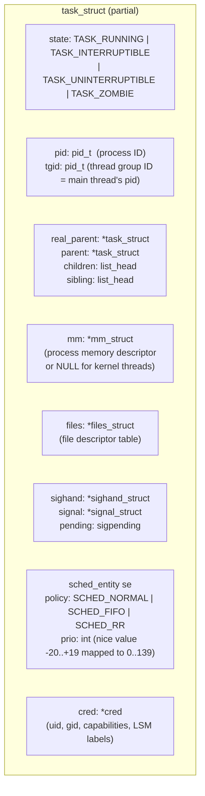

### 프로세스 상태 머신

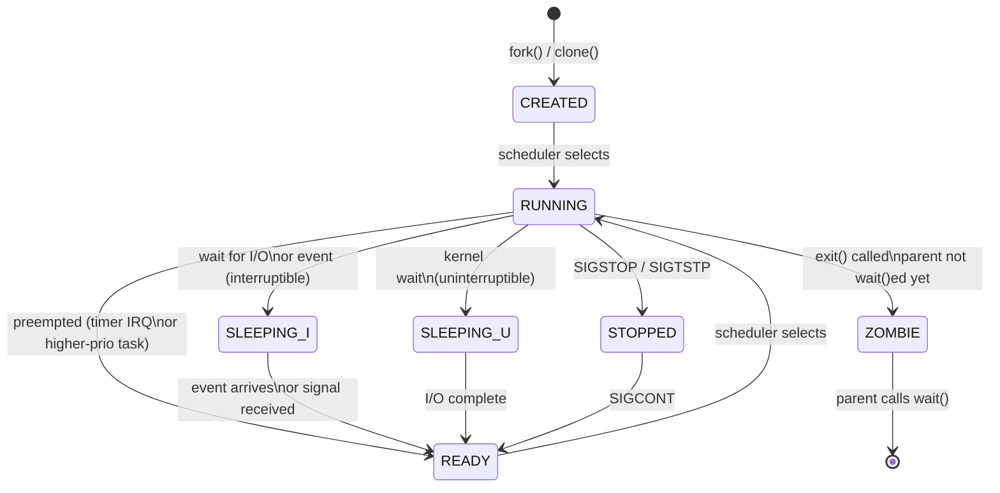

> **상태 해석:** Linux의 `TASK_RUNNING`은 실행 중과 실행 가능 큐 대기를 모두 포함하므로, 위의 RUNNING과 READY 구분은 설명용 상태이지 서로 다른 `task_struct` 상태값이 아닙니다. 종료·정지·수면 상태와 전이는 대상 커널의 상태 비트와 대기 API를 기준으로 확인합니다.

---

## 2. CFS 스케줄러: 완전히 공정한 스케줄러 내부

> **버전 주의:** 아래 red-black tree와 고정 튜너블 값은 특정 CFS 세대의 단순화입니다. 최신 Linux는 EEVDF 선택 로직 등으로 변경되었고 기본 지연·최소 단위도 커널 설정과 CPU 수에 따라 달라질 수 있습니다.

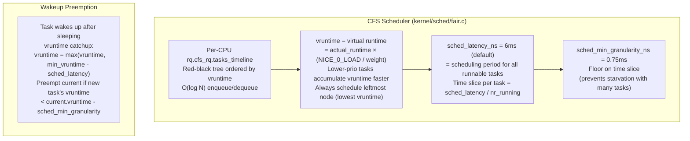

### CFS 타이머 인터럽트 흐름

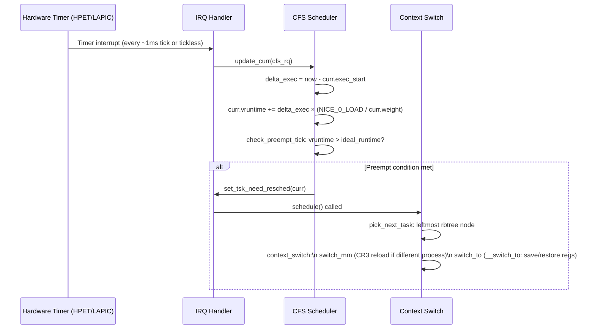

---

## 3. 가상 메모리: mm_struct 및 VMA 트리

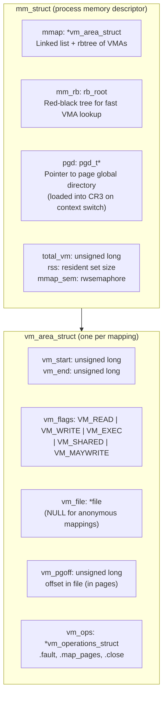

### 프로세스 주소 공간 레이아웃(x86-64 Linux)

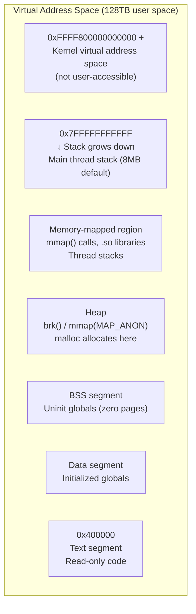

---

## 4. 페이지 오류 처리기: 요구 페이징 내부

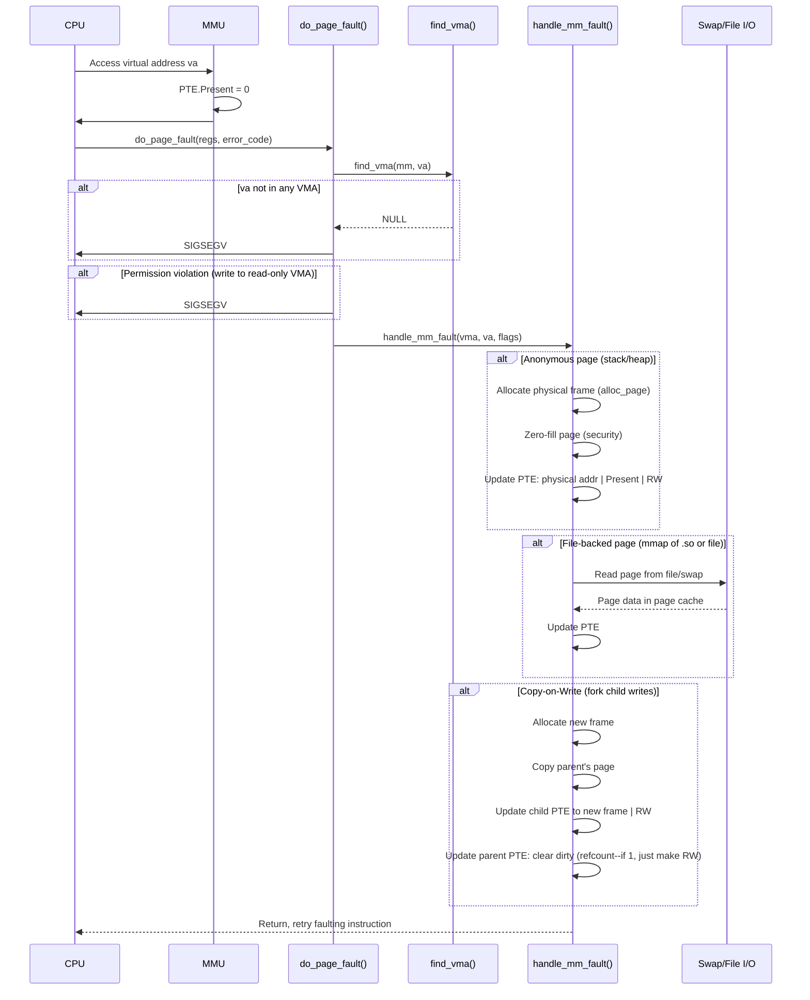

---

## 5. 파일 시스템: VFS Inode/Dentry 캐시

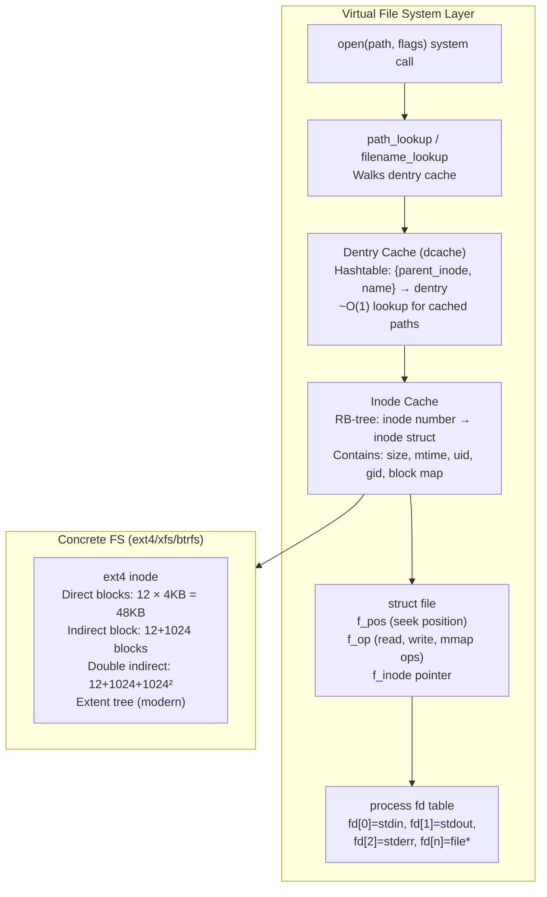

### read() 시스템 호출: Syscall에서 디스크까지의 경로

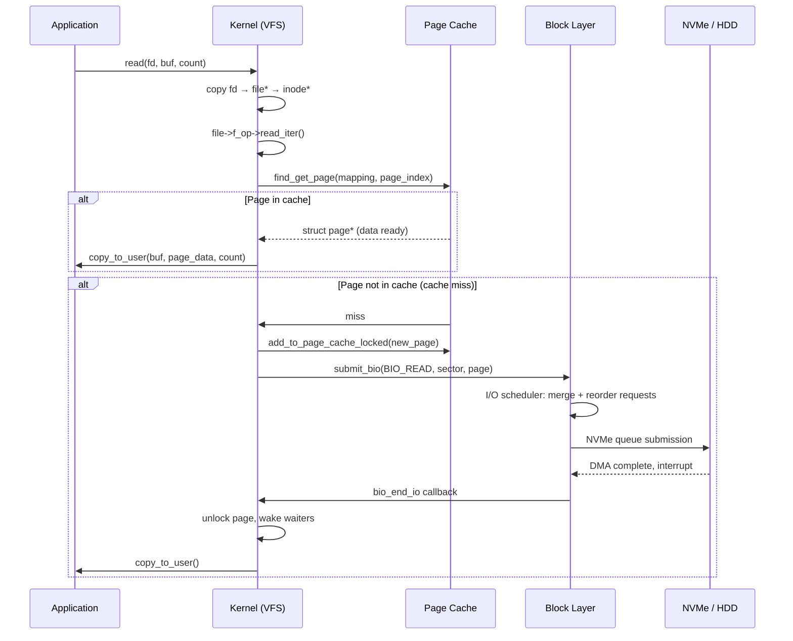

---

## 6. 시스템 콜 디스패치: 사용자 공간 → 커널

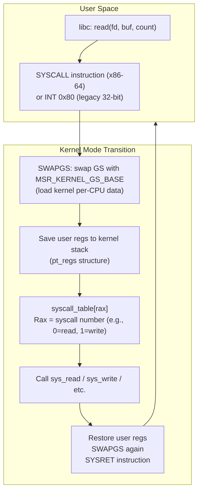

### VDSO(Virtual Dynamic Shared Object)를 통한 Syscall 항목

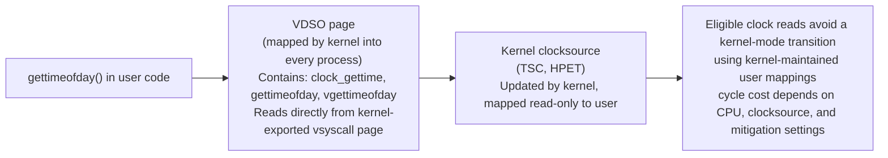

---

## 7. IPC 메커니즘: 파이프, 소켓, 공유 메모리

```mermaid
flowchart TD
    subgraph PIPE["Anonymous Pipe"]
        WRITE_END["fd[1]: write end\nfile→inode→pipe_inode_info"]
        RING_BUF["Kernel ring buffer\n65536 bytes (16 pages)\nCircular buffer of struct pipe_buffer"]
        READ_END["fd[0]: read end\nBlocks in TASK_INTERRUPTIBLE if empty"]
        WRITE_END --> RING_BUF --> READ_END
    end
    subgraph SOCKET["Unix Domain Socket"]
        SRV_SOCK["Server socket\nunix_proto_ops\nbind path in /tmp/"]
        CLI_SOCK["Client socket\nconnect() to path"]
        SK_BUFF["sk_buff chain\nSocket kernel buffer\nskmem_alloc"]
        SRV_SOCK <--> SK_BUFF <--> CLI_SOCK
    end
    subgraph SHM["POSIX Shared Memory"]
        SHM_OPEN["shm_open(): creates tmpfs file\nin /dev/shm/"]
        MMAP_BOTH["Both processes mmap() same file\nPTEs in both mm_structs\npoint to same physical pages"]
        SEM["sem_post/wait\nfutex in shared memory\nfor synchronization"]
        SHM_OPEN --> MMAP_BOTH --> SEM
    end
```

---

## 8. Linux 커널 동기화 기본 요소

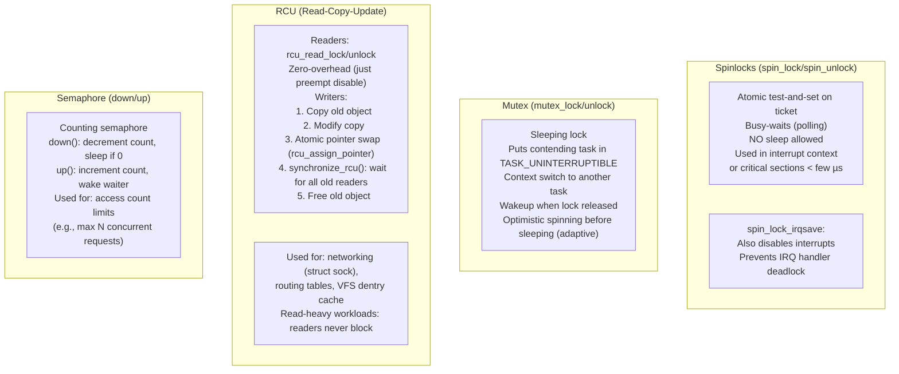

---

## 9. 메모리 할당자: slab/slub 할당자 내부

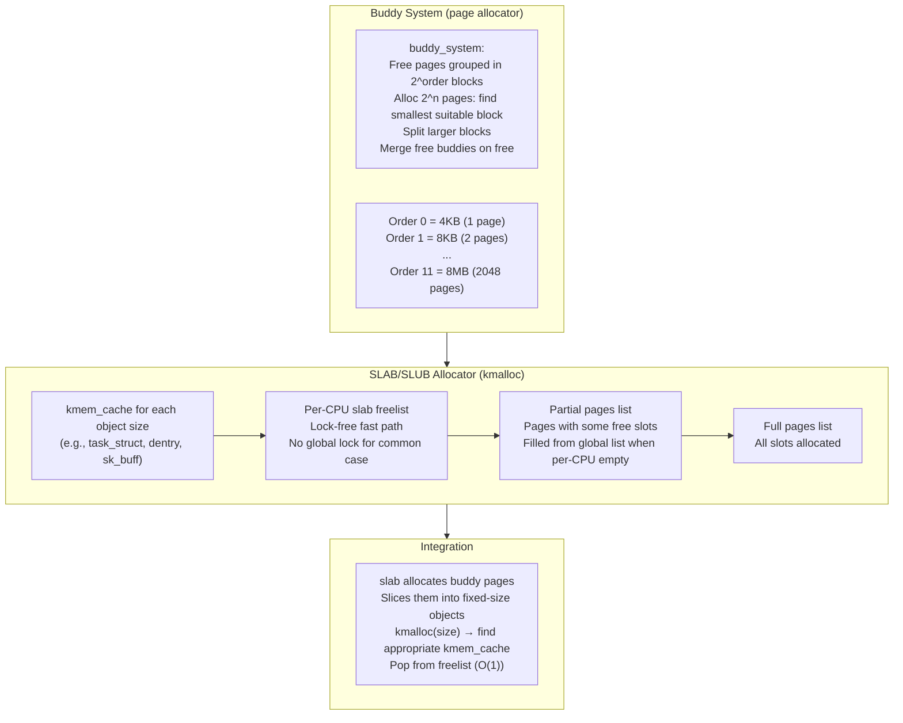

---

## 10. 프로세스 생성: fork() 및 exec() 내부

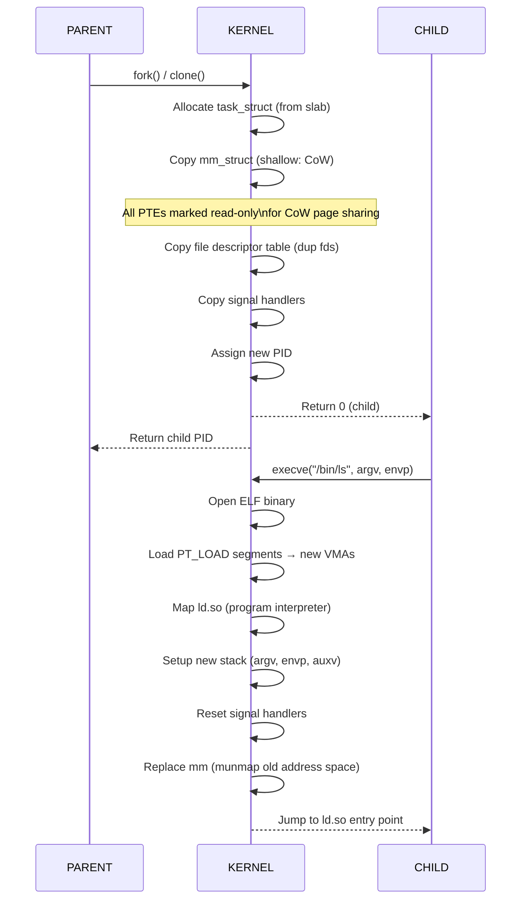

---

## 11. Linux 스케줄링 클래스(우선순위)

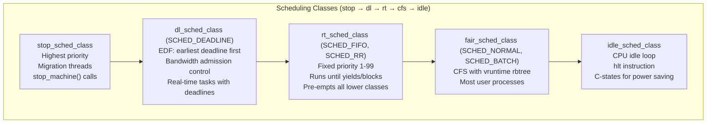

---

## 12. 커널 모듈 로딩: insmod 내부

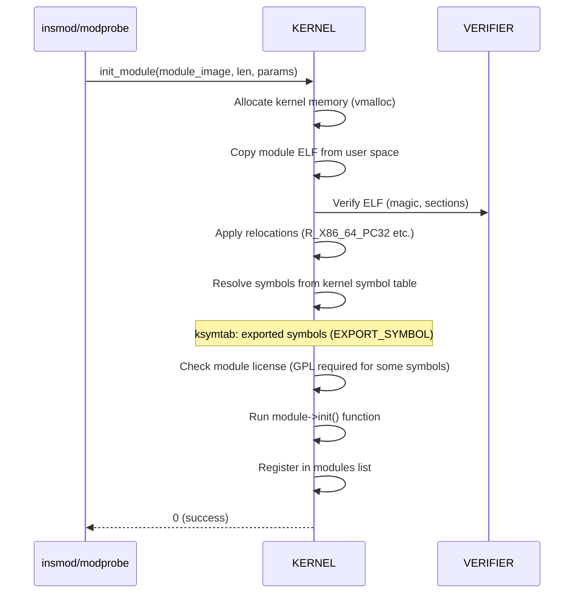


---

## 설계적 고민

### 구조와 모델링

운영체제 설계에서 가장 근본적인 구조적 선택은 **커널 아키텍처**다. 모놀리식 커널과 마이크로커널은 시스템 설계의 양 극단을 대표하며, 이 선택이 전체 OS의 성능·안정성·유지보수성을 결정한다.

**모놀리식 커널(Linux)**은 파일시스템, 네트워크 스택, 디바이스 드라이버, 스케줄러가 모두 동일한 주소 공간(Ring 0)에서 실행된다. 함수 호출 하나로 서브시스템 간 통신이 가능하므로 오버헤드가 극도로 낮다. 반면 하나의 드라이버 버그가 전체 커널을 크래시시킬 수 있다.

**마이크로커널(Minix, QNX, seL4)**은 최소한의 기능(IPC, 스케줄링, 메모리 관리)만 커널에 두고 나머지를 사용자 공간 서버로 분리한다. 드라이버 크래시가 커널에 영향을 주지 않지만, 모든 서비스 간 통신이 IPC를 거치므로 컨텍스트 스위칭 비용이 누적된다.

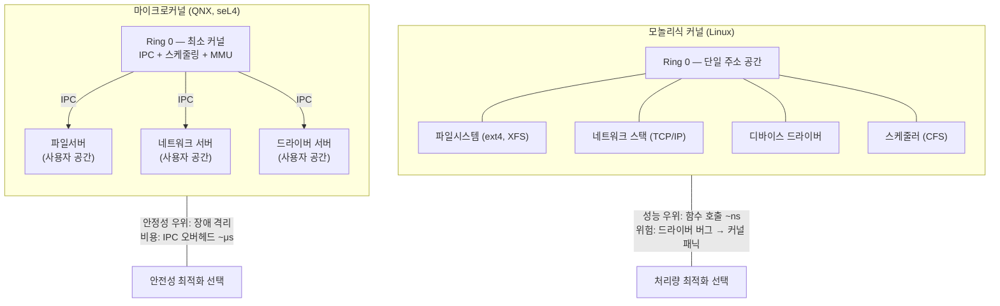

실제로 Linux는 모놀리식이지만 **커널 모듈(loadable kernel module)** 메커니즘으로 유연성을 확보했고, macOS(XNU)는 Mach 마이크로커널 위에 BSD 서브시스템을 모놀리식으로 올린 **하이브리드** 접근을 취한다. 이는 순수한 이론적 선택이 아니라 실용적 타협의 결과다.

### 트레이드오프와 의사결정

#### CFS vs MLFQ: 공평성(fairness) vs 반응성(responsiveness)

CPU 스케줄러 설계는 "누구에게 CPU를 줄 것인가"라는 자원 분배 문제의 핵심이다. Linux의 **CFS(Completely Fair Scheduler)**는 가상 런타임(vruntime)을 기반으로 모든 프로세스에 가중치 비례 CPU 시간을 부여한다. 레드-블랙 트리로 O(log N) 시간에 다음 태스크를 선택하며, 수학적으로 공평한 분배를 보장한다.

반면 전통적인 **MLFQ(Multi-Level Feedback Queue)**는 I/O 바운드 작업에 높은 우선순위를 부여하여 대화형 반응성을 극대화한다. 짧은 CPU 버스트 후 I/O를 기다리는 프로세스가 자연스럽게 상위 큐로 올라간다.

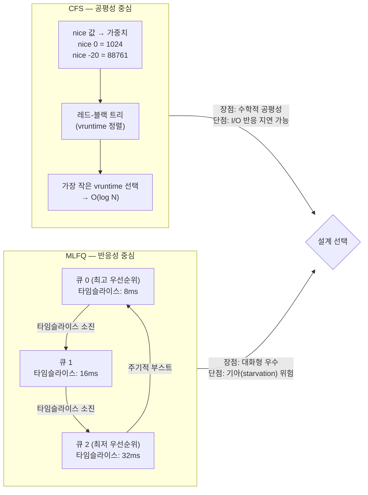

CFS가 Linux의 기본 스케줄러가 된 이유는 서버 워크로드에서의 공평성 보장과, nice 값 기반 가중치로 우선순위 차별화가 가능하기 때문이다. 그러나 데스크톱 환경에서는 여전히 `sched_autogroup`이나 `SCHED_DEADLINE` 같은 보완 메커니즘이 필요하다.

#### fork()+exec() 분리 설계: UNIX 철학의 정수

`fork()`와 `exec()`를 분리한 것은 UNIX 설계에서 가장 우아한 결정 중 하나다. 프로세스 **생성**과 프로그램 **실행**을 독립적인 연산으로 분리함으로써, fork()와 exec() 사이에서 파일 디스크립터 조작, 환경 변수 설정, 시그널 마스크 변경 등 임의의 설정이 가능하다. 이것이 셸 파이프라인(`|`), 리다이렉션(`>`, `<`), 백그라운드 실행(`&`)의 기반이다.

#### LRU vs Clock(NRU): 페이지 교체의 실용적 타협

이론적 최적(Bélády's OPT)은 미래를 알아야 하므로 불가능하다. **순수 LRU**는 모든 메모리 접근마다 타임스탬프를 갱신해야 하므로 하드웨어 비용이 과다하다. Linux의 **Clock 알고리즘(Two-handed clock)**은 접근 비트(PTE의 Accessed bit)만으로 근사 LRU를 구현하며, Active/Inactive 리스트로 워킹셋을 추적한다.

### 리팩토링과 설계 원칙

#### 동기 I/O → 비동기 I/O → io_uring: 진화의 설계 논리

리눅스 I/O 모델의 진화는 "시스템 콜 오버헤드 제거"라는 하나의 설계 목표를 향한 점진적 리팩토링이다.

1. **동기 블로킹 I/O**: `read()`/`write()` — 가장 단순하지만 스레드가 블로킹되어 자원 낭비
2. **select/poll/epoll**: 이벤트 기반 멀티플렉싱 — 블로킹은 해결했지만 여전히 매 I/O마다 시스템 콜
3. **AIO(POSIX)**: 커널 비동기 I/O — 제한적이고 일관성 없는 API
4. **io_uring**: 공유 링과 배치 제출로 시스템 콜 수를 줄입니다. 일반 모드에는 `io_uring_enter()` 등이 필요할 수 있고, 조건을 갖춘 SQPOLL·등록 리소스 경로에서 제출 호출을 더 줄일 수 있습니다.

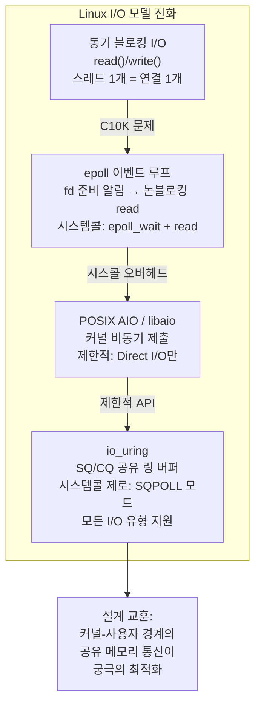

`io_uring`은 Submission Queue와 Completion Queue를 공유해 여러 작업의 제출·완료 비용을 상각합니다. `SQPOLL`도 초기 설정, 깨우기, 등록되지 않은 자원과 일부 작업에서 시스템 콜이 필요할 수 있으므로 "단 한 번도 호출하지 않는다"는 보장이 아닙니다. 완료 조건은 지원 opcode, 권한, 폴링 상태와 실제 시스템 콜 추적으로 확인합니다.

### 디자인 패턴 적용

#### fork()+exec() 분리 — 팩토리 + 전략 패턴의 결합

UNIX의 프로세스 생성 모델은 GoF 디자인 패턴으로 분석하면 **Factory Method**(fork: 프로세스 생성)와 **Strategy**(exec: 실행 전략 교체)의 조합이다. fork()로 생성된 자식 프로세스는 exec() 전까지 부모의 완전한 복제본이므로, 그 사이에 어떤 전략이든 주입할 수 있다.

```mermaid
flowchart TD
    subgraph PATTERN["fork/exec — 디자인 패턴 관점"]
        FORK["fork() — Factory Method\n프로세스 '생성' 담당\n부모의 복제본 생산"]
        BETWEEN["fork ~ exec 사이 설정\n— Strategy 주입 지점 —\n• dup2(): fd 리다이렉션\n• setenv(): 환경 변수\n• sigprocmask(): 시그널\n• setuid(): 권한 변경"]
        EXEC["exec() — Strategy Pattern\n프로세스 '행동' 교체\n새 프로그램 이미지 로드"]

        FORK --> BETWEEN --> EXEC
    end

    subgraph SHELL["셸 파이프라인 적용 예시"]
        CMD["$ ls -la | grep .md | wc -l"]
        P1["fork() → pipe() 설정 → exec(ls)"]
        P2["fork() → stdin=pipe[0] → exec(grep)"]
        P3["fork() → stdin=pipe[0] → exec(wc)"]
        CMD --> P1 & P2 & P3
    end
```

#### 커널의 옵저버 패턴: notifier chain

리눅스 커널의 `notifier_chain`은 전형적인 **Observer 패턴**이다. CPU 핫플러그, 네트워크 디바이스 상태 변경, 메모리 압박 같은 시스템 이벤트에 대해 여러 서브시스템이 콜백을 등록한다. `blocking_notifier_call_chain()`이 이벤트를 모든 구독자에게 순차 전파한다. 이 설계가 커널 서브시스템 간 결합도를 낮추면서도 이벤트 기반 협조를 가능하게 한다.

#### VFS 계층: 어댑터 패턴의 커널 구현

Linux VFS(Virtual File System)는 ext4, XFS, NFS, procfs 등 이질적인 파일시스템을 **단일 인터페이스**(`inode_operations`, `file_operations`)로 추상화하는 **Adapter 패턴**의 대규모 적용이다. 사용자 공간은 `open()`/`read()`/`write()`만 호출하고, VFS가 실제 파일시스템 구현으로 디스패치한다. 새 파일시스템을 추가할 때 커널의 나머지 코드를 수정할 필요가 없다 — **개방-폐쇄 원칙(OCP)**의 교과서적 적용이다.

---

## 연습 문제

### 1. 시스템 구조와 모델링

**문제 1-1. 셸 파이프라인의 fork → pipe → exec 흐름**

당신은 셸에서 `cat /var/log/syslog | grep error | wc -l` 명령을 실행했다. 이 파이프라인은 세 개의 프로세스가 파이프로 연결되어 동시에 실행되어야 한다.

- 셸이 이 파이프라인을 구현하기 위해 `fork()`, `pipe()`, `dup2()`, `exec()`를 **어떤 순서로 호출**해야 하는지 단계별로 서술하라.
- 두 번째 프로세스(`grep`)의 표준 입력(fd 0)과 표준 출력(fd 1)이 각각 어떤 파이프의 어떤 끝(read-end, write-end)에 연결되는지 **파일 디스크립터 번호**와 함께 설명하라.
- 파이프라인 중 `grep`이 먼저 종료된다면, `cat` 프로세스에는 어떤 일이 발생하며 그 이유는 무엇인가?

<details><summary>힌트 보기</summary>

셸은 파이프라인의 각 `|`마다 `pipe()` 시스템 호출로 파이프 한 쌍을 먼저 생성한다. 그 후 각 명령어에 대해 `fork()`로 자식 프로세스를 만들고, 자식 내부에서 `dup2()`로 파이프의 read-end/write-end를 적절한 fd(0 또는 1)로 복제한 뒤 `exec()`를 호출한다. `grep`이 먼저 종료하면 해당 파이프의 read-end가 닫히므로, `cat`이 write할 때 `SIGPIPE` 시그널을 받는다.

</details>

**문제 1-2. 4-Level 페이지 테이블과 TLB 워크**

x86-64 시스템에서 가상 주소 `0x00007FFF12345678`을 물리 주소로 변환하려 한다. 이 시스템은 4-level 페이지 테이블(PML4 → PDPT → PD → PT)을 사용하고, TLB에는 해당 매핑이 없다고 가정한다.

- 가상 주소 48비트를 PML4 인덱스(9비트), PDPT 인덱스(9비트), PD 인덱스(9비트), PT 인덱스(9비트), 페이지 오프셋(12비트)으로 분해하라.
- TLB 미스 발생 시 하드웨어 페이지 워커가 CR3 레지스터부터 시작하여 물리 메모리를 **몇 번 접근**해야 최종 물리 주소를 얻는가?
- 만약 PDPT 엔트리에서 `Present` 비트가 0이라면, 커널은 이 상황을 어떻게 처리하는가?

<details><summary>힌트 보기</summary>

48비트 가상 주소를 상위부터 9-9-9-9-12비트로 쪼개면 각 페이지 테이블 레벨의 인덱스와 최종 오프셋을 얻는다. TLB 미스 시 하드웨어는 CR3(PML4 물리 주소) → PML4 엔트리 → PDPT 엔트리 → PD 엔트리 → PT 엔트리까지 총 4번 메모리를 접근해 PFN(Page Frame Number)을 얻고, 여기에 12비트 오프셋을 더해 최종 물리 주소를 계산한다. `Present=0`이면 **페이지 폴트(#PF)**가 발생하고 커널 핸들러가 호출된다.

</details>

**문제 1-3. task_struct와 프로세스 상태 전이**

리눅스 커널에서 하나의 프로세스는 `task_struct` 구조체로 표현된다. 한 웹 서버 프로세스가 클라이언트 요청을 `accept()` 시스템 호출로 대기 중이다.

- 이 프로세스의 현재 상태(`TASK_RUNNING`, `TASK_INTERRUPTIBLE`, `TASK_UNINTERRUPTIBLE` 등)는 무엇이며, 왜 그 상태에 있는가?
- 클라이언트 연결이 도착하면 이 프로세스의 상태가 어떤 순서로 전이되는지 서술하라.
- `TASK_UNINTERRUPTIBLE` 상태의 프로세스는 `kill -9`로도 종료할 수 없다. 이 상태가 존재하는 설계 이유는 무엇인가?

<details><summary>힌트 보기</summary>

`accept()`로 대기 중인 프로세스는 `TASK_INTERRUPTIBLE` 상태이다(시그널로 깨울 수 있음). 연결 도착 시 커널이 대기 큐에서 프로세스를 깨우면 `TASK_RUNNING`(runqueue에 진입)으로 전이되고, 스케줄러에 의해 CPU를 할당받으면 실제 실행된다. `TASK_UNINTERRUPTIBLE`은 디스크 I/O 같은 짧은 커널 경로에서 데이터 무결성을 보장하기 위해 시그널 전달을 차단하는 상태이다.

</details>

### 2. 트레이드오프와 의사결정

**문제 2-1. 웹 서버 아키텍처 선택: 멀티프로세스 vs 멀티스레드 vs 이벤트 기반**

당신은 초당 10,000개의 동시 연결을 처리해야 하는 웹 서버를 설계하고 있다. 다음 세 가지 아키텍처를 비교하라:

- **Apache prefork** (멀티프로세스): 연결당 하나의 자식 프로세스
- **Apache worker** (멀티스레드): 프로세스당 여러 스레드, 스레드당 하나의 연결
- **Nginx** (이벤트 기반): 단일/소수 워커 프로세스에서 epoll 이벤트 루프

10,000 동시 연결 상황에서 각 아키텍처의 **메모리 사용량**, **컨텍스트 스위칭 오버헤드**, **C10K 문제 대응력**을 분석하고, 어떤 워크로드에서 어떤 아키텍처가 최선인지 근거를 제시하라.

<details><summary>힌트 보기</summary>

prefork는 프로세스당 수 MB 메모리가 필요하므로 10,000 연결 시 수십 GB가 된다. worker 모델은 스레드 스택(보통 8MB, 조정 가능)과 동기화 오버헤드가 문제다. Nginx의 이벤트 루프는 연결당 수 KB(커넥션 구조체)만 소비하므로 C10K에 적합하다. 다만 CPU 집약적 작업(동영상 트랜스코딩 등)은 이벤트 루프를 차단하므로, 이런 워크로드에는 멀티프로세스/스레드가 유리할 수 있다.

</details>

**문제 2-2. CFS vs MLFQ: 혼합 워크로드 스케줄링**

하나의 서버에서 다음 두 가지 작업이 동시에 실행 중이다:

- **동영상 인코딩 프로세스** (CPU 집약적, 장시간 실행)
- **웹 서버 프로세스** (I/O 집약적, 짧은 CPU 버스트 후 네트워크 대기)

Linux의 CFS(Completely Fair Scheduler)와 전통적인 MLFQ(Multi-Level Feedback Queue) 각각이 이 혼합 워크로드를 어떻게 처리하는지 비교하라. 특히:

- CFS의 `vruntime` 메커니즘이 CPU 집약적 프로세스와 I/O 집약적 프로세스에 어떻게 다른 대우를 하는가?
- MLFQ에서 I/O 집약적 프로세스는 왜 높은 우선순위 큐에 머무르는 경향이 있는가?
- 웹 서버의 **응답 지연 시간(latency)** 관점에서 어떤 스케줄러가 더 유리한가?

<details><summary>힌트 보기</summary>

CFS에서 I/O 집약적 프로세스는 CPU를 적게 사용하므로 `vruntime`이 천천히 증가한다. 따라서 깨어날 때마다 레드-블랙 트리에서 왼쪽(가장 작은 vruntime)에 위치하여 빠르게 CPU를 할당받는다. MLFQ에서는 타임 슬라이스를 다 쓰지 않고 자발적으로 CPU를 반납하는 I/O 집약적 프로세스가 강등되지 않으므로 높은 우선순위를 유지한다. 두 스케줄러 모두 I/O 프로세스에 유리하지만, CFS는 공정성(fairness)을, MLFQ는 반응성(responsiveness)을 더 강조한다.

</details>

**문제 2-3. Swap 공간 설계: 성능과 안정성의 균형**

8GB RAM을 가진 리눅스 서버에서 데이터베이스와 캐시 서버를 함께 운영하고 있다. 시스템 관리자가 swap 공간을 어떻게 구성할지 고민 중이다:

- swap을 **완전히 비활성화**하면 어떤 위험이 있는가?
- swap을 **RAM의 2배(16GB)**로 설정하면 데이터베이스 성능에 어떤 영향을 미치는가?
- `vm.swappiness` 값을 10으로 낮추는 것과 60(기본값)으로 유지하는 것의 차이는 무엇인가?

<details><summary>힌트 보기</summary>

swap 비활성화 시 메모리 부족 상황에서 OOM Killer가 바로 프로세스를 종료한다. 과도한 swap은 데이터베이스의 핫 데이터가 디스크로 쫓겨나 성능이 급격히 저하되는 **swap storm**을 유발할 수 있다. `swappiness`는 커널이 익명 페이지(프로세스 메모리)를 swap out할 의향을 조절한다. 낮은 값은 파일 캐시를 먼저 회수하고, 높은 값은 익명 페이지도 적극적으로 swap한다. 데이터베이스 서버는 보통 낮은 swappiness를 권장한다.

</details>

### 3. 문제 해결 및 리팩토링

**문제 3-1. Zombie 프로세스 대량 발생 디버깅**

운영 중인 서버에서 `ps aux | grep Z` 명령 실행 결과 좀비 프로세스가 3,000개 이상 쌓여 있다. 서버의 PID 공간이 고갈되어 새 프로세스를 생성할 수 없는 상황이 발생했다.

- 좀비 프로세스가 발생하는 **정확한 메커니즘**을 `task_struct`의 생명주기와 연결하여 설명하라.
- 부모 프로세스가 `wait()`/`waitpid()`를 호출하지 않는 것이 원인이라면, 부모 프로세스를 수정할 수 없는 상황에서 **즉시 좀비를 제거**할 수 있는 방법은 무엇인가?
- 장기적으로 이 문제를 방지하기 위한 코드 수준의 해결책을 두 가지 이상 제시하라.

<details><summary>힌트 보기</summary>

자식 프로세스가 종료되면 `exit_state = EXIT_ZOMBIE`로 전이되고, `task_struct`에 종료 코드만 남긴 채 대부분의 리소스를 해제한다. 부모가 `wait()`로 회수해야 `task_struct`가 완전히 삭제된다. 즉시 해결은 부모 프로세스를 `kill`하는 것이다 — 좀비의 부모가 죽으면 `init(PID 1)`이 새 부모가 되어 자동으로 `wait()`한다. 장기적으로는 ① `SIGCHLD` 시그널 핸들러에서 `waitpid(-1, ..., WNOHANG)` 루프 ② `signal(SIGCHLD, SIG_IGN)` 설정(리눅스에서 자동 회수) ③ 더블 포크 기법 등이 있다.

</details>

**문제 3-2. OOM Killer 대응 전략**

프로덕션 서버에서 갑자기 핵심 데이터베이스 프로세스가 OOM Killer에 의해 종료되었다. `dmesg`에 다음 로그가 남아 있다:

```
Out of memory: Kill process 12345 (postgres) score 850 or sacrifice child
```

- OOM Killer가 프로세스를 선택하는 **oom_score 계산 기준**은 무엇인가?
- `/proc/[pid]/oom_score_adj` 값을 `-1000`으로 설정하면 어떤 효과가 있으며, 이것의 **위험성**은 무엇인가?
- OOM Killer가 발동하기 전에 문제를 예방하기 위한 **cgroup 메모리 제한** 설정 방법과, 제한 초과 시 동작을 설명하라.

<details><summary>힌트 보기</summary>

`oom_score`는 프로세스의 RSS(물리 메모리 사용량), 스왑 사용량, 자식 프로세스 메모리 등을 종합하여 0~1000 범위로 계산된다. 점수가 높을수록 종료 대상이 된다. `oom_score_adj=-1000`은 해당 프로세스를 OOM Killer 대상에서 완전히 제외하지만, 모든 프로세스를 보호하면 실제 OOM 시 커널 패닉이 발생할 수 있다. cgroup v2의 `memory.max`로 프로세스 그룹별 메모리 상한을 설정하면, 해당 그룹 내에서만 OOM이 발생하여 시스템 전체에 영향을 주지 않는다.

</details>

**문제 3-3. 파일 디스크립터 누수 추적**

장시간 운영 중인 서버 프로세스에서 `Too many open files` 에러가 발생하기 시작했다. `ls /proc/[pid]/fd | wc -l` 결과 열린 파일 디스크립터가 65,000개에 육박한다.

- 이 프로세스가 어떤 종류의 파일 디스크립터를 누수하고 있는지 **진단하는 방법**을 설명하라 (`/proc/[pid]/fd`, `lsof`, `strace` 활용).
- 소켓 파일 디스크립터 누수가 원인이라면, 코드에서 어떤 패턴이 이 문제를 유발했을 가능성이 높은가?
- 이 문제를 구조적으로 방지하기 위한 프로그래밍 패턴(RAII, `defer`, `try-with-resources` 등)을 설명하라.

<details><summary>힌트 보기</summary>

`ls -la /proc/[pid]/fd`로 각 fd가 어떤 파일/소켓/파이프를 가리키는지 심볼릭 링크를 확인한다. `lsof -p [pid]`로 더 상세한 정보를 얻고, `strace -e trace=open,close,socket,connect -p [pid]`로 열기/닫기 호출 패턴을 추적한다. 흔한 원인은 에러 경로에서 `close()`를 호출하지 않는 코드(예: 예외 발생 시 early return)이다. C++의 RAII(`unique_ptr<FILE, fclose>`), Go의 `defer fd.Close()`, Java의 `try-with-resources`가 구조적 해결책이다.

</details>

### 4. 개념 간의 연결성

**문제 4-1. mmap + Copy-on-Write: fork() 후 메모리 공유와 분리**

리눅스에서 `fork()`를 호출하면 자식 프로세스는 부모의 전체 주소 공간을 복사하는 것처럼 보이지만, 실제로는 **Copy-on-Write(CoW)** 기법을 사용한다. 다음 시나리오를 분석하라:

- 부모 프로세스가 1GB를 `MAP_PRIVATE`로 매핑하고 실제 페이지가 상주한 상태에서 `fork()`를 호출했다고 가정한다. fork 직후 공유 가능한 데이터 페이지와 새로 필요한 페이지 테이블·커널 메타데이터를 구분해 물리 메모리 변화를 설명하라. `MAP_SHARED` 또는 아직 fault되지 않은 매핑이면 결론이 어떻게 달라지는지도 적어라.
- 자식 프로세스가 매핑된 영역의 한 페이지(4KB)를 수정하면, 커널 내부에서 어떤 일이 순서대로 발생하는가? (페이지 폴트 → CoW 처리 흐름)
- `fork()` + `exec()` 패턴에서 CoW가 성능상 **결정적으로 중요한 이유**를 exec()의 동작과 연결하여 설명하라.

<details><summary>힌트 보기</summary>

fork 직후에는 부모와 자식이 **동일한 물리 페이지**를 공유하며, 해당 페이지 테이블 엔트리는 read-only로 표시된다. 물리 메모리 추가 사용은 거의 0이다. 자식이 한 페이지를 수정하면: ① 쓰기 시도 → ② read-only이므로 페이지 폴트 발생 → ③ 커널이 CoW임을 인식 → ④ 새 물리 페이지를 할당하고 원본을 복사 → ⑤ 자식의 페이지 테이블을 새 페이지로 업데이트하고 write 권한 부여. `fork()+exec()`에서는 exec()가 주소 공간 전체를 새 프로그램으로 교체하므로, fork 시 1GB를 복사하는 것은 완전한 낭비다 — CoW 덕분에 복사 비용이 0에 가깝다.

</details>

**문제 4-2. io_uring + eBPF: 커널-유저 공간 경계 최소화**

고성능 패킷 처리 시스템을 설계하고 있다. 전통적인 `read()`/`write()` 시스템 호출은 매 호출마다 유저→커널→유저 컨텍스트 전환이 발생한다.

- `io_uring`이 **공유 링 버퍼(SQ/CQ)**를 통해 시스템 호출 횟수를 줄이는 메커니즘을 설명하라.
- `eBPF`가 **커널 공간에서 직접 패킷을 처리**(XDP)하여 유저 공간 전환을 회피하는 원리를 설명하라.
- 두 기술을 결합하면 전통적인 `select()`/`poll()` 기반 서버 대비 어떤 성능 이점을 얻을 수 있는지, 그리고 이 조합이 적합하지 **않은** 워크로드는 무엇인지 분석하라.

<details><summary>힌트 보기</summary>

`io_uring`은 유저와 커널이 공유하는 메모리 매핑 링 버퍼(Submission Queue, Completion Queue)를 사용한다. 유저는 SQ에 요청을 배치(batch)로 넣고, `io_uring_enter()` 한 번으로 여러 I/O를 제출할 수 있다(혹은 커널 폴링 모드에서는 시스콜 없이도). eBPF의 XDP(eXpress Data Path)는 NIC 드라이버 직후, 커널 네트워크 스택 진입 **전에** 패킷을 처리하므로 sk_buff 할당조차 없다. 두 기술 모두 커널-유저 전환 최소화가 핵심이다. 다만 복잡한 비즈니스 로직이 필요한 애플리케이션 계층 처리에는 eBPF의 제한된 명령어 세트가 부적합하다.

</details>

**문제 4-3. 가상 메모리 + 프로세스 격리: 컨테이너의 메모리 네임스페이스**

Docker 컨테이너는 리눅스의 namespace와 cgroup을 활용하여 프로세스를 격리한다. 다음 시나리오를 분석하라:

- 호스트에서 실행 중인 컨테이너 내부 프로세스의 가상 주소 `0x400000`과 호스트의 다른 프로세스의 가상 주소 `0x400000`이 **서로 다른 물리 메모리**를 가리키는 이유를 페이지 테이블 관점에서 설명하라.
- cgroup의 `memory.max`를 512MB로 설정했을 때, 컨테이너 내부 프로세스가 600MB를 할당하려고 하면 어떤 일이 발생하는가?
- PID namespace 내부에서 `fork()`를 호출하면, 호스트와 컨테이너 내부에서 보이는 PID가 다른 이유를 namespace의 계층 구조와 연결하여 설명하라.

<details><summary>힌트 보기</summary>

각 프로세스는 독립적인 페이지 테이블을 가지므로, 동일한 가상 주소라도 CR3 레지스터가 다르면 다른 물리 페이지로 매핑된다. 컨테이너의 격리는 새로운 메커니즘이 아니라 기존 가상 메모리의 자연스러운 확장이다. cgroup `memory.max` 초과 시 커널은 해당 cgroup 내에서 메모리 회수를 시도하고, 실패하면 cgroup 내부 OOM Killer가 발동한다. PID namespace는 계층적이므로 자식 namespace의 PID 1은 부모 namespace에서 다른 PID(예: 5678)로 보인다 — 하나의 프로세스가 namespace 계층마다 다른 PID를 가진다.

</details>
