# 프로그래밍 언어 — 내부: 런타임, 유형 시스템 및 컴파일 내부

> **초점**: 구문이나 API 사용이 아니라 언어 런타임이 고루틴을 예약하는 방법, 컴파일러가 제네릭을 단일화하는 방법, CPS가 일시 중단 코루틴을 변환하는 방법, 유형 추론이 다형성 호출 사이트에 제약 조건을 전파하는 방법에 대해 설명합니다.

---

## 1. Go 런타임: 고루틴 스케줄러 내부

Go의 런타임은 M:N 그린 스레드 스케줄링을 구현합니다. 즉, 작업 도용 스케줄러(GMP 모델)를 사용하여 M OS 스레드에 N개의 고루틴이 다중화됩니다.

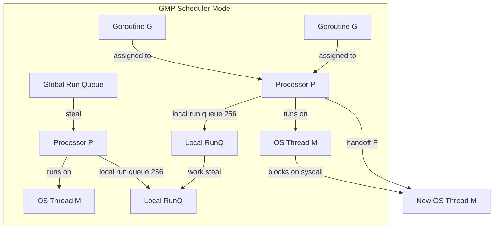

### 고루틴 스택 성장

고루틴은 2KB 스택으로 시작합니다(OS 스레드 2MB 대비). 스택이 용량을 초과하면 런타임은 **스택 복사**를 수행합니다.

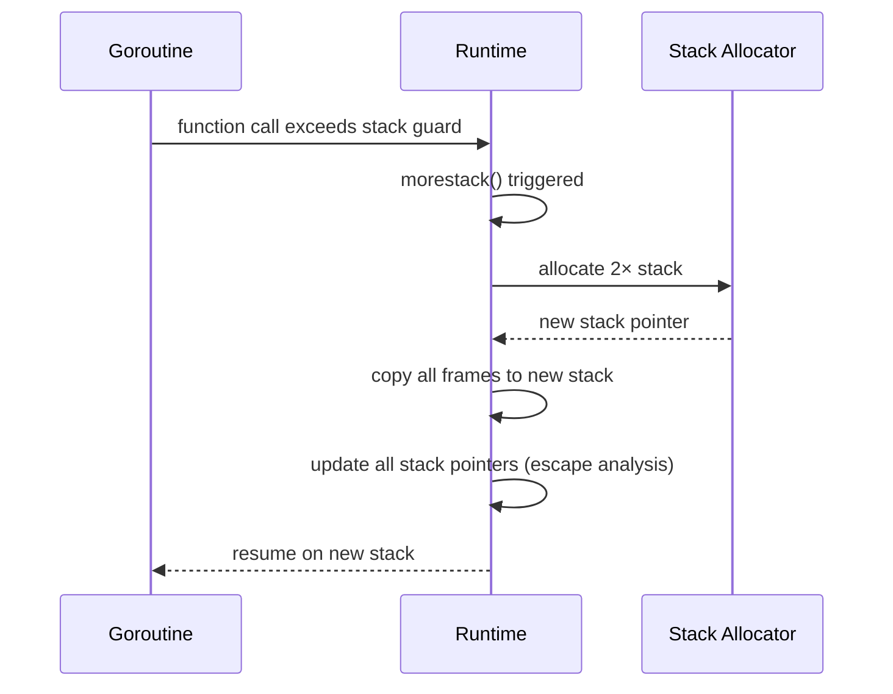

스택 프레임은 **주소에 고정되지 않습니다** — 스택의 모든 포인터는 복사 시 다시 작성됩니다. 이것이 Go가 이스케이프되는 변수를 스택하기 위한 원시 내부 포인터를 금지하는 이유입니다.

### 고루틴 상태 머신

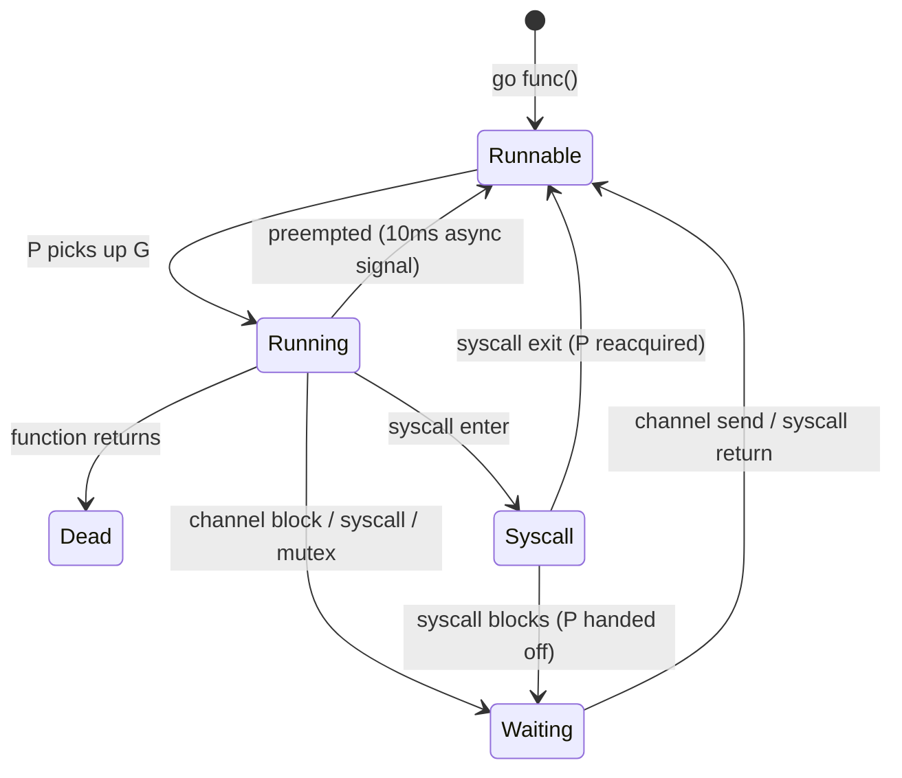

### 작업 훔치기 알고리즘

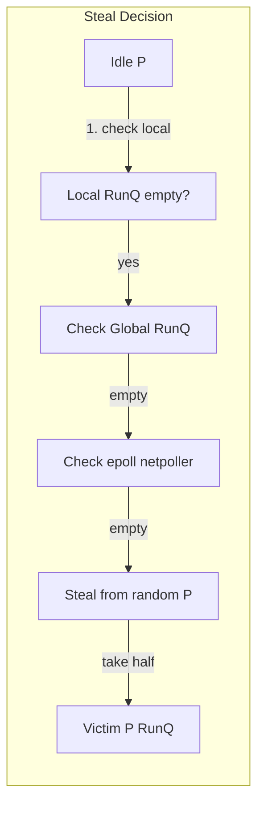

도둑질은 피해자의 로컬 실행 대기열의 **절반**을 차지하므로 공정성을 보장하면서 경합을 줄입니다. 글로벌 실행 큐는 기아를 방지하기 위해 61번째 스케줄링 틱마다 확인됩니다.

### 채널 내부: hchan 구조

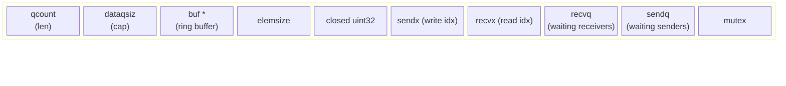

**직접 전송 최적화**: 수신자가 `recvq`에서 차단되면 발신자는 데이터를 **수신자의 스택에 직접** 복사한 다음(버퍼 우회) 수신자를 깨웁니다. 추가 복사본은 없습니다.

---

## 2. Go Garbage Collector: 삼색 동시 표시

Go는 mutator가 실행되는 동안 불변성을 유지하기 위해 쓰기 장벽이 있는 **동시 3색 표시 및 스윕** GC를 사용합니다.

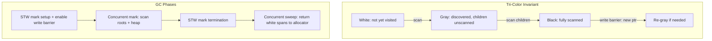

**Dijkstra 쓰기 장벽**: 모든 포인터에 `*slot = ptr`을 씁니다. `*slot`이 검은색이고 `ptr`가 흰색이면 음영은 `ptr` 회색입니다. 이는 회색 중간 없이 흑색→백색 참조를 보장하지 않습니다.

GOGC=100은 라이브 힙이 두 배가 될 때 GC가 트리거됨을 의미합니다. GC 타겟: `goal = live * (1 + GOGC/100)`.

---

## 3. Rust: 소유권, 빌림 검사기, 제로 비용 추상화

### 유형 시스템 상태로서의 소유권

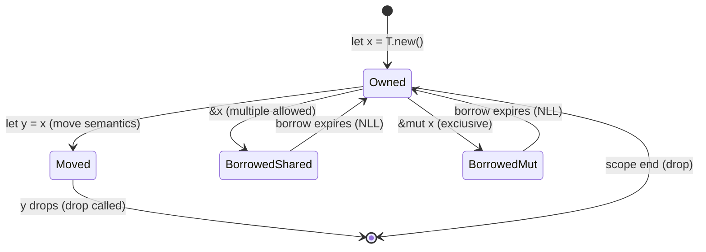

**NLL(Non-Lexical Lifetimes)**: 대여는 범위 종료가 아니라 **마지막 사용** 시 종료됩니다. 빌림 검사기는 AST가 아닌 MIR(중간 수준 IR) 제어 흐름 그래프에서 작동합니다.

### 단일화 대 동적 디스패치

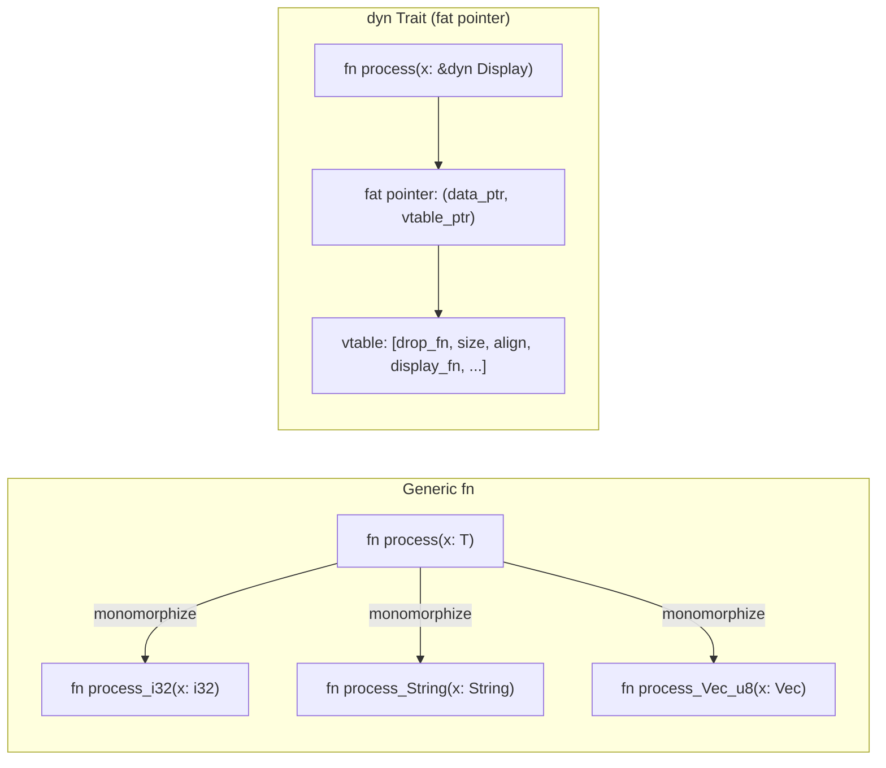

단일화: **런타임 비용 제로**, 코드 팽창, 인라인. `dyn Trait`: 하나의 복사본, vtable을 통한 간접 참조, 인라인을 방지합니다.

### 메모리 레이아웃: 스택 대 힙

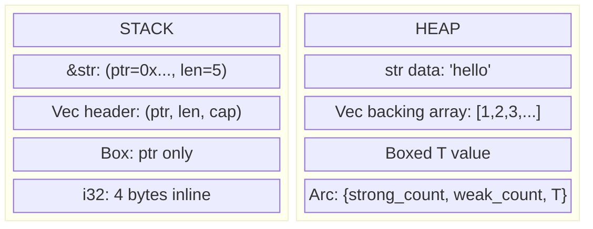

`String` = 힙 할당 UTF-8. `&str` = 임의의 문자열 데이터에 팻 포인터(ptr + len)를 쌓습니다. `Vec<T>` = 스택에 (ptr, len, cap) 헤더가 있는 힙 버퍼.

### LLVM IR 파이프라인

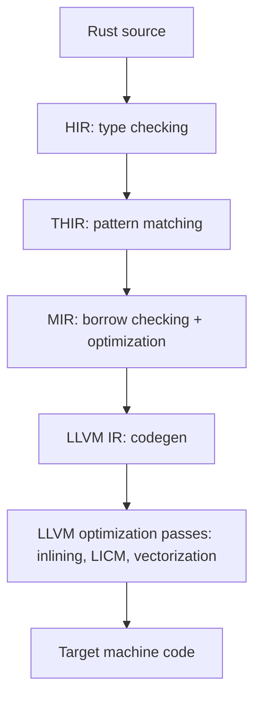

MIR은 핵심 단계입니다. **명시적인 하락이 있는 제어 흐름 그래프**입니다. 모든 변수 하락이 명시적으로 이루어지므로 빌림 검사기가 복잡한 제어 흐름을 이해하지 않고도 안전성을 확인할 수 있습니다.

---

## 4. 스칼라: 유형 시스템, JVM 컴파일 및 암시적

### 변형 및 고급 유형

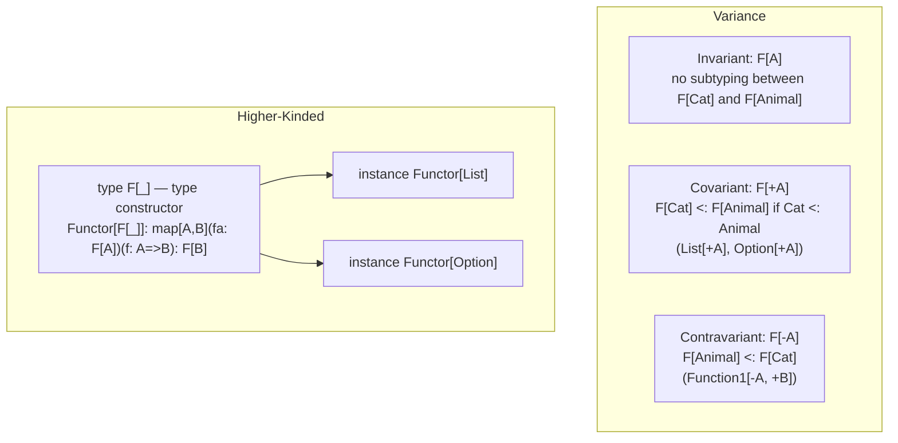

**Liskov 대체**는 분산을 결정합니다. 공변 위치(반환 유형, 읽기 전용 컨테이너)는 `+A`을 허용합니다. 반공변 위치(함수 매개변수)에는 `-A`이 필요합니다.

### 암시적 해결 알고리즘

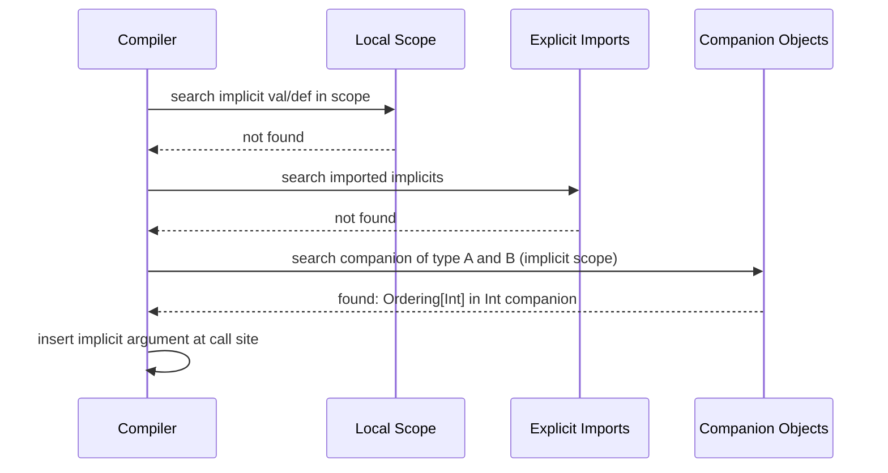

암시적 검색은 **결정적**이지만 암시적 체인이 순환을 형성하는 경우 분기될 수 있습니다. Scala 3(Dotty)에서는 명확성과 더 나은 오류 메시지를 위해 암시적을 `given`/`using`로 대체했습니다.

### Scala JVM 바이트코드: 특성 및 믹스인

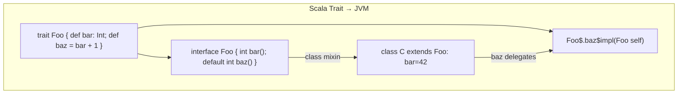

구체적인 메소드가 있는 특성은 `default` 메소드(JVM 8+)를 사용하여 Java 인터페이스로 컴파일됩니다. 복잡한 다이아몬드 상속의 경우 **정적 전달자**가 생성됩니다.

---

## 5. Kotlin: CPS 변환으로서의 코루틴

### 연속-패스 스타일 변환

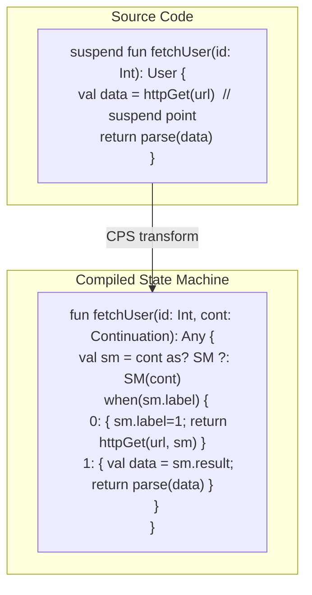

각 `suspend` 호출 사이트는 **상태 기계 레이블**이 됩니다. `Continuation` 개체는 정지 기간 동안 지역 변수를 보유합니다. 재개 시 실행은 올바른 `when` 분기로 이동합니다.

### 코루틴 연속 객체 메모리 레이아웃

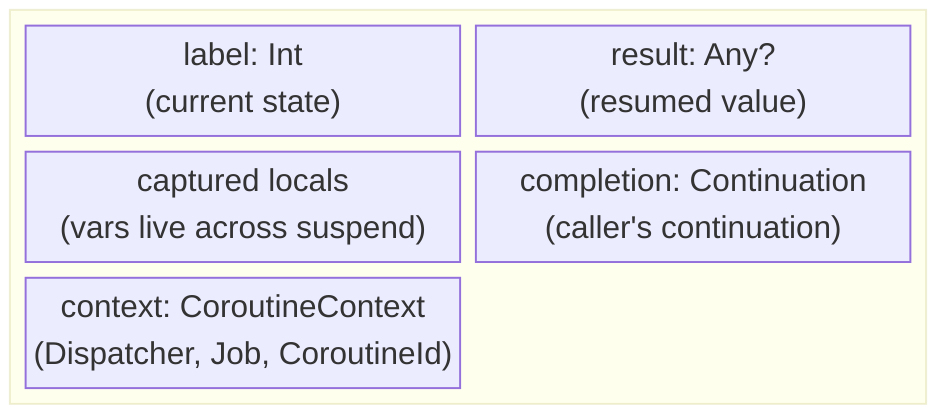

힙 할당 연속 객체는 각 정지에서 스택 프레임을 대체합니다. 이것은 **스택리스 코루틴**입니다. 코루틴당 전용 OS 스택이 없습니다(확장 가능한 스택이 있는 Go 고루틴과 다름).

### 디스패처 및 스레드 매핑

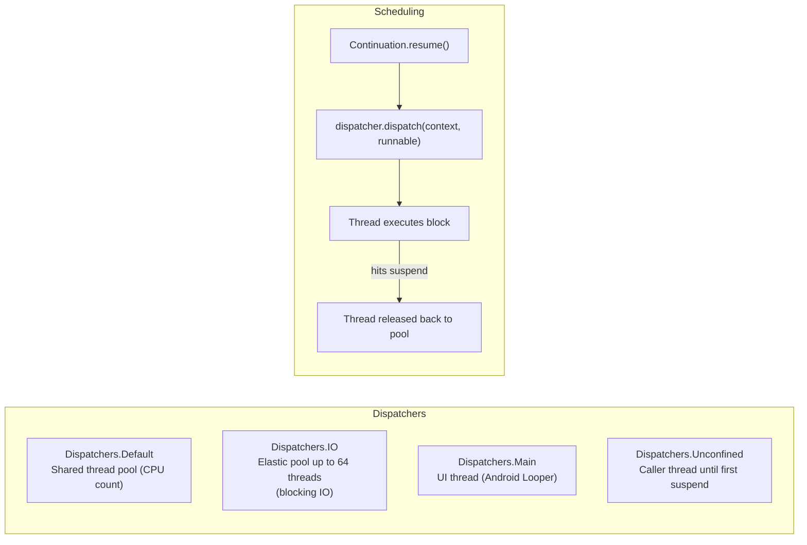

`withContext(Dispatchers.IO)`은 현재 코루틴을 일시 중단하고, IO 스레드 풀로 디스패치하고, 완료 시 원래 디스패처를 다시 시작합니다. 호출자에서 **스레드 차단 없음**.

### 구조화된 동시성 및 작업 트리

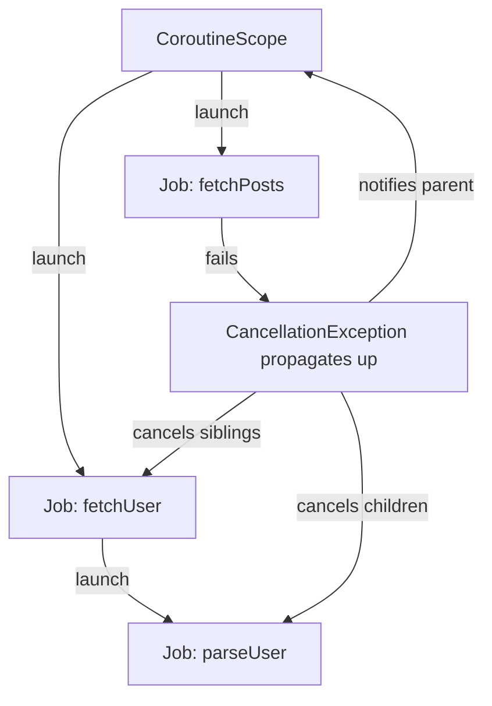

취소는 **협조적**입니다. 코루틴은 `isActive`을 확인하거나 취소를 인식하는 정지 함수를 호출해야 합니다. 상위 작업이 실패하면 모든 하위 항목이 취소됩니다(구조화된 동시성).

---

## 6. JVM 내부: HotSpot JIT 컴파일

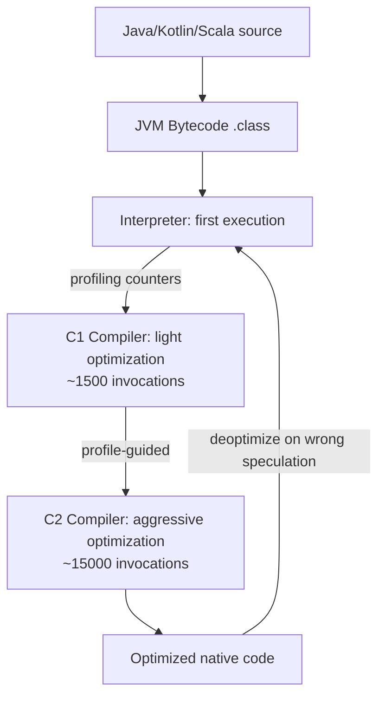

C2의 **추측적 최적화**:
- **인라이닝**: 프로필에 구현이 하나만 표시되는 경우 가상 호출이 탈가상화됨
- **이스케이프 분석**: 개체가 이스케이프 방법을 사용하지 않으면 스택에 유지됩니다.
- **루프 풀기 + 벡터화**: 배열 작업을 위한 SIMD 내장 함수
- **Null 검사 제거**: 프로필이 Null이 아님을 확인한 후 중복된 Null 검사를 제거합니다.

### JVM 메모리 레이아웃

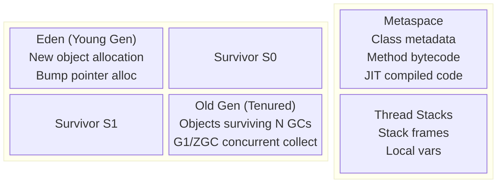

---

## 7. Go vs Rust vs JVM: 런타임 비교

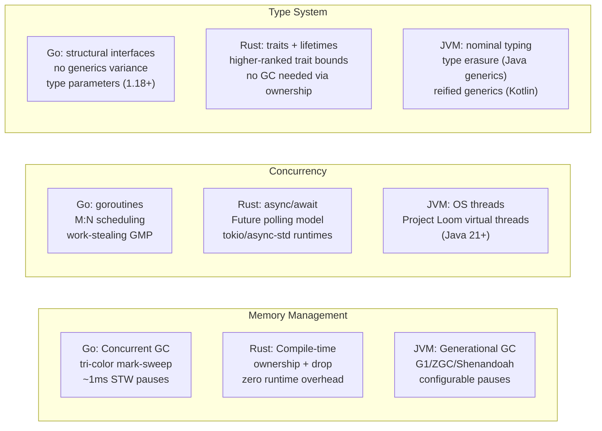

### 비동기/대기 및 고루틴: 핵심 차이점

```mermaid
sequenceDiagram
    participant RustFuture as Rust Future (Stackless)
    participant GoRoutine as Go Goroutine (Stackful)

    Note over RustFuture: poll() returns Poll::Pending
    RustFuture->>RustFuture: stores state in Future struct (heap)
    RustFuture->>RustFuture: registers Waker with reactor
    Note over RustFuture: Thread returns to event loop

    Note over GoRoutine: goroutine blocks on channel/syscall
    GoRoutine->>GoRoutine: goroutine stack preserved (2KB–nMB)
    GoRoutine->>GoRoutine: P handed to another goroutine
    Note over GoRoutine: OS thread may park or handle another G
```

Rust 선물은 **폴링 기반, 제로 스택**입니다. 명시적으로 박스화하지 않는 한 정지 당 할당이 없습니다. Go 고루틴은 **스택에서 연속**됩니다. 작성이 더 간단하고(동기화되어 보임), 고루틴 기준이 더 높습니다.

---

## 8. 기능적 언어 런타임: Haskell GHC 및 OCaml

### GHC: 지연 평가 및 썽크 메커니즘

```mermaid
flowchart TD
    subgraph "Thunk Lifecycle"
        T_created["Thunk created: closure ptr + env"] -->|first force| T_eval["Evaluate: enter closure"]
        T_eval -->|result| T_value["Update thunk to Value (WHNF)"]
        T_value -->|subsequent force| T_value
    end
    subgraph "Heap Object Layout"
        HO["Info Table Ptr | Payload..."]
        IT["Info Table: entry code | GC info | arity | srt"]
        HO --> IT
    end
```

**WHNF(약한 헤드 정규 형식)**: 가장 바깥쪽 생성자에서 평가가 중지됩니다. — `_`이 썽크인 경우에도 `Just _`은 WHNF입니다. 전체 NF 평가에는 `deepseq`이 필요합니다.

### GHC 런타임 시스템(RTS) 스케줄러

```mermaid
flowchart LR
    HEC1["HEC 1 (OS Thread)\nHaskell Execution Context"] --> RunQ1[Spark Queue]
    HEC2["HEC 2 (OS Thread)"] --> RunQ2[Spark Queue]
    RunQ1 -->|work steal| RunQ2
    HEC1 -->|STM transaction| TLog[Transaction Log]
    TLog -->|commit: validate| STMHeap[STM Heap vars]
    TLog -->|conflict: retry| TLog
```

GHC의 `par`/`seq` 스파크 풀은 추측적 병렬 처리를 가능하게 합니다. **STM(소프트웨어 트랜잭션 메모리)** 런타임은 낙관적 동시성을 사용합니다. 즉, 각 트랜잭션은 읽기/쓰기를 기록하고, 커밋 시 원자적으로 유효성을 검사하고, 충돌 시 재시도합니다.

---

## 9. 언어 기능: 패턴 매칭 컴파일

모든 ML 계열 언어는 O(1) 디스패치를 위한 **의사결정 트리**에 일치하는 패턴을 컴파일합니다.

```mermaid
flowchart TD
    Match["match expr with\n| (0, _) -> A\n| (_, 0) -> B\n| (x, y) -> C"] -->|compile| DT["Decision Tree"]
    DT --> T1["test expr.0 == 0?"]
    T1 -->|yes| A["return A"]
    T1 -->|no| T2["test expr.1 == 0?"]
    T2 -->|yes| B["return B"]
    T2 -->|no| C["return C(x, y)"]
```

컴파일러는 생성자 밀도에 따라 **스위치 디스패치**(정수 태그)와 **if-chain** 중에서 선택합니다. 열거형의 Rust `match`은 판별 태그로 색인이 지정된 점프 테이블로 컴파일됩니다.

### 대수적 데이터 유형 메모리 레이아웃(Rust/Haskell)

```mermaid
block-beta
    columns 2
    block:rust_enum:1
        columns 1
        r_label["Rust: enum Option<T>"]
        r_none["None: discriminant=0, no payload"]
        r_some["Some(T): discriminant=1, T inline"]
        r_opt["niche optimization: &T None=0x0"]
    end
    block:haskell_adt:1
        columns 1
        h_label["Haskell: data Maybe a"]
        h_nothing["Nothing: info_ptr → Nothing_info, tag=0"]
        h_just["Just a: info_ptr → Just_info, a=thunk_ptr"]
    end
```

Rust는 **틈새 최적화**를 적용합니다. `Option<&T>`은 널 포인터를 `None`로 사용합니다 — `&T`와 동일한 크기, 판별이 필요하지 않습니다.

---

## 10. 유형 추론: 알고리즘 W/HM 통합

```mermaid
sequenceDiagram
    participant TC as Type Checker
    participant Env as Type Environment
    participant Uni as Unifier

    TC->>TC: generate fresh type var α for unknown
    TC->>Env: lookup variable → τ
    TC->>TC: instantiate polymorphic type (fresh vars)
    TC->>Uni: add constraint: τ1 = τ2
    Uni->>Uni: unify: walk structure recursively
    Uni->>Uni: occurs check: α ≠ F(α) (prevents infinite types)
    Uni-->>TC: substitution σ
    TC->>TC: generalize: ∀α. τ (if α free in τ, not in env)
    TC-->>TC: principal type derived
```

**통합**은 `unify(List α, List Int)` → `α := Int`의 핵심 작업입니다. 통합 실패 = 유형 오류입니다. 발생 확인으로 `α = List α`(무한 유형)이 방지됩니다.

### 랭크 2 다형성(Rust/Haskell HRTB)

```mermaid
flowchart TD
    R1["Rank-1: ∀a. a → a\nType var instantiated at call site by caller"]
    R2["Rank-2: (∀a. a → a) → Int\nCallee receives a polymorphic function\nMust work for ANY a, not a specific one"]
    R1 -->|subsumes| R2
    R2 -->|Rust syntax| HRTB["for<'a> Fn(&'a T) -> &'a U\nHigher-Ranked Trait Bound"]
```

Rust는 클로저가 특정 추론 수명뿐만 아니라 **모든 수명** 동안 작동해야 함을 표현하기 위해 HRTB를 사용합니다.

---

## 11. 교차 언어: 상호 운용성과 FFI 역학

```mermaid
sequenceDiagram
    participant Rust
    participant CRuntime as C ABI (cdecl/SysV)
    participant Python as Python (CPython)

    Rust->>CRuntime: #[no_mangle] extern "C" fn foo()
    CRuntime->>Python: ctypes.CDLL → dlopen + dlsym
    Python->>Python: convert Python int → c_int (boxing)
    Python->>CRuntime: call via function pointer
    CRuntime->>Rust: stack frame in C calling convention
    Rust-->>CRuntime: return value
    CRuntime-->>Python: unbox to Python int
```

**PyO3 (Rust‐Python)**: Python API 호출 시 GIL을 보유해야 합니다. `pyo3::Python<'py>` 토큰은 GIL이 유지되는 컴파일 타임 증거입니다. 안전한 Rust는 유형 수준에서 GIL 버그를 방지합니다.

**JNI(Java←C/Rust)**: JNIEnv 포인터가 네이티브에 전달되었습니다. 모든 Java 객체 참조는 직접 힙 포인터가 아닌 핸들(JNI 로컬/글로벌 참조)입니다. GC는 객체를 이동할 수 있습니다. JNI 심판이 이를 고정합니다.

---

## 요약: 언어 런타임 내부 맵

```mermaid
mindmap
  root((Language Runtimes))
    Go
      GMP scheduler M:N
      Work-stealing local runq
      Growable goroutine stacks
      Tri-color concurrent GC
      hchan direct send optimization
    Rust
      Ownership = compile-time GC
      MIR borrow checker CFG
      Monomorphization zero-cost
      LLVM backend optimization
      Async stackless Future polling
    Kotlin/JVM
      CPS transform suspend fns
      Continuation state machine
      Structured concurrency Job tree
      HotSpot C1/C2 JIT tiers
      G1/ZGC generational GC
    Scala/JVM
      Variance +A/-A type system
      Implicit resolution scope chain
      Trait → default method bytecode
      Higher-kinded type parameters
    Haskell/GHC
      Lazy thunk force + update
      WHNF evaluation strategy
      STM optimistic concurrency
      Spark pool parallel HEC
```


---

## 설계적 고민

프로그래밍 언어 설계는 본질적으로 **트레이드오프의 연속**이다. 타입 시스템의 엄격함, 메모리 관리 전략, 평가 전략, 분기 처리 방식 등 모든 결정은 개발자 경험, 런타임 성능, 안전성 사이의 균형을 찾는 과정이다.

### 구조와 모델링

#### 정적 타이핑 vs 동적 타이핑: 컴파일 타임 안전성 vs 개발 유연성

타입 시스템은 언어 설계의 가장 근본적인 분기점이다. 정적 타이핑은 컴파일 타임에 타입 오류를 포착하여 런타임 안전성을 보장하지만, 개발 초기 프로토타이핑 속도를 저하시킬 수 있다. 반면 동적 타이핑은 빠른 반복 개발을 가능하게 하지만, 타입 오류가 런타임까지 지연된다.

현대 언어들은 이 이분법을 극복하려 한다. TypeScript의 점진적 타이핑(Gradual Typing), Python의 타입 힌트, Kotlin의 타입 추론 등은 두 세계의 장점을 결합하려는 시도다. 핵심 설계 질문은 "타입 검사의 비용을 **언제** 지불할 것인가"이다.

```mermaid
flowchart TD
    subgraph "타입 시스템 스펙트럼"
        Static["정적 타이핑\n(Rust, Haskell, Java)"]
        Gradual["점진적 타이핑\n(TypeScript, Python+mypy)"]
        Dynamic["동적 타이핑\n(Python, Ruby, JS)"]
    end

    Static -->|"컴파일 타임 오류 검출\n리팩토링 안전성 ↑"| CompileTime["비용 지불 시점:\n컴파일 타임"]
    Gradual -->|"선택적 타입 검사\n점진적 마이그레이션"| Hybrid["비용 지불 시점:\n혼합"]
    Dynamic -->|"빠른 프로토타이핑\n런타임 유연성"| Runtime["비용 지불 시점:\n런타임"]

    CompileTime -->|"장점"| SA["IDE 지원 ↑\n자동 리팩토링\n문서 역할"]
    CompileTime -->|"단점"| SD["보일러플레이트 ↑\n학습 곡선 ↑\n컴파일 시간 ↑"]
    Runtime -->|"장점"| DA["개발 속도 ↑\n메타프로그래밍\nDSL 용이"]
    Runtime -->|"단점"| DD["런타임 오류 ↑\n대규모 유지보수 ↓\n성능 오버헤드"]
```

#### 값 타입 vs 참조 타입: 메모리 레이아웃과 성능 영향

값 타입은 스택에 인라인 배치되어 캐시 지역성이 뛰어나고 GC 압력이 없다. 참조 타입은 힙 할당과 간접 참조를 수반하지만 다형성과 공유를 자연스럽게 지원한다. 이 선택은 데이터의 크기, 수명, 공유 패턴에 따라 결정된다.

```mermaid
flowchart LR
    subgraph "값 타입 (Value Type)"
        Stack["스택 메모리"] --> Inline["인라인 배치\nstruct Point { x: i32, y: i32 }"]
        Inline --> CacheHit["캐시 히트율 ↑\n연속 메모리 레이아웃"]
        CacheHit --> NoGC["GC 불필요\n스코프 종료 시 즉시 해제"]
    end
    subgraph "참조 타입 (Reference Type)"
        Heap["힙 메모리"] --> Indirect["포인터 간접 참조\nclass Node { val: int, next: Node }"]
        Indirect --> CacheMiss["캐시 미스 가능성 ↑\n분산된 메모리 레이아웃"]
        CacheMiss --> GCNeeded["GC 필요\n도달 가능성 분석"]
    end
```

### 트레이드오프와 의사결정

#### 가비지 컬렉션 전략: 참조 카운팅 vs 추적 GC vs 영역 기반

메모리 관리 전략은 언어의 성격을 결정짓는다. 참조 카운팅(RC)은 결정론적 해제를 제공하지만 순환 참조 문제와 카운터 업데이트 오버헤드가 존재한다. 추적 GC(Tracing GC)는 순환 참조를 자동 처리하지만 일시 정지(Stop-the-World)가 발생한다. Rust의 소유권 시스템은 컴파일 타임에 메모리 수명을 결정하여 런타임 GC를 완전히 제거한다.

각 전략의 핵심 트레이드오프:
- **참조 카운팅**: 실시간성 ↑, 순환 참조 취약, 멀티스레드 시 원자적 카운터 비용
- **Mark-and-Sweep**: 처리량 ↑, 일시 정지 존재, 세대별 GC로 완화
- **소유권/빌림(Rust)**: 런타임 비용 0, 학습 곡선 ↑↑, 특정 패턴 구현 난이도 ↑

```mermaid
flowchart TD
    GC["메모리 관리 전략 선택"]
    GC --> RC["참조 카운팅\n(Swift, Python, Obj-C)"]
    GC --> Tracing["추적 GC\n(Java, Go, C#)"]
    GC --> Ownership["소유권 시스템\n(Rust)"]
    GC --> Manual["수동 관리\n(C, C++)"]

    RC --> RC_Pro["✅ 결정론적 해제\n✅ 짧은 지연 시간\n✅ 메모리 사용량 예측 가능"]
    RC --> RC_Con["❌ 순환 참조 (weak ref 필요)\n❌ 원자적 카운터 오버헤드\n❌ 캐시라인 더티 빈번"]

    Tracing --> Tr_Pro["✅ 순환 참조 자동 처리\n✅ 할당 비용 낮음 (bump alloc)\n✅ 높은 처리량"]
    Tracing --> Tr_Con["❌ STW 일시 정지\n❌ 메모리 오버헤드 (2배 힙)\n❌ 비결정적 해제 타이밍"]

    Ownership --> Own_Pro["✅ 런타임 비용 제로\n✅ 데이터 경쟁 컴파일 타임 방지\n✅ 예측 가능한 성능"]
    Ownership --> Own_Con["❌ 학습 곡선 가파름\n❌ 자기참조 구조 구현 어려움\n❌ 컴파일 시간 ↑"]
```

### 리팩토링과 설계 원칙

#### 클로저와 스코프 체인: 함수형 언어 설계에서의 의미

클로저는 "코드와 데이터의 통합"이라는 함수형 프로그래밍의 핵심 원칙을 구현한다. 렉시컬 스코프 체인을 통해 자유 변수를 캡처하는 방식은 언어마다 다르며, 이 설계 선택이 성능과 의미론에 깊은 영향을 미친다.

**캡처 방식의 설계 결정**:
- **값 캡처(Copy)**: C++ `[=]`, Rust `move` — 클로저가 독립적 소유권을 가짐
- **참조 캡처(Borrow)**: C++ `[&]`, Java의 effective final — 원본과 공유
- **변경 가능 캡처**: Python의 nonlocal, JavaScript의 var — 부작용 가능

리팩토링 관점에서 클로저는 **전략 패턴의 경량 대안**으로 기능한다. 인터페이스를 정의하고 구현 클래스를 만드는 대신, 함수를 일급 객체로 전달하여 동일한 유연성을 달성한다.

```mermaid
flowchart TD
    subgraph "클로저 캡처 메커니즘"
        Lexical["렉시컬 스코프 탐색"]
        Lexical --> FreeVar["자유 변수 식별"]
        FreeVar --> CaptureDecision{"캡처 방식?"}
        CaptureDecision -->|"값 복사"| ValueCap["스택 → 클로저 환경 복사\n독립적 수명\n스레드 안전"]
        CaptureDecision -->|"참조 캡처"| RefCap["환경 레코드 힙 승격\n원본과 공유\n수명 관리 필요"]
        CaptureDecision -->|"이동 캡처"| MoveCap["소유권 이전\n원본 사용 불가\nRust move 시맨틱"]
    end
```

### 디자인 패턴 적용

#### 패턴 매칭 vs if-else 체인: 타입 안전 분기의 설계 가치

패턴 매칭은 단순한 분기 문법이 아니라 **대수적 데이터 타입(ADT)과 결합된 타입 시스템 기능**이다. 컴파일러는 패턴의 완전성(exhaustiveness)을 검사하여 누락된 케이스를 컴파일 타임에 감지한다. 이는 if-else 체인에서는 불가능한 안전성 보장이다.

패턴 매칭이 디자인 패턴에 미치는 영향:
- **방문자 패턴 대체**: 봉인된 타입 + 패턴 매칭은 Visitor 패턴의 보일러플레이트를 제거한다
- **상태 패턴 간소화**: enum 기반 상태 머신을 패턴 매칭으로 명확하게 표현
- **옵셔널 처리**: null 대신 Option/Maybe 타입으로 명시적 부재 표현

```mermaid
flowchart TD
    subgraph "패턴 매칭 기반 설계"
        ADT["sealed interface Shape"] --> Circle["Circle(r)"]
        ADT --> Rect["Rect(w, h)"]
        ADT --> Triangle["Triangle(a, b, c)"]

        Match["when(shape)"] --> MC["is Circle → π·r²"]
        Match --> MR["is Rect → w·h"]
        Match --> MT["is Triangle → Heron 공식"]

        Compiler["컴파일러 완전성 검사"] -->|"새 Shape 추가 시"| Error["⚠ 컴파일 오류:\n미처리 케이스 감지"]
    end

    subgraph "if-else 체인 (비교)"
        IfElse["if (shape instanceof Circle)"] --> ElseIf["else if (shape instanceof Rect)"]
        ElseIf --> Else["else // Triangle?"]
        Else --> NoCheck["❌ 완전성 미검사\n새 타입 추가 시 런타임 오류 가능"]
    end
```

**설계 원칙 정리**: 프로그래밍 언어의 내부 설계는 "안전성 ↔ 유연성", "성능 ↔ 추상화", "명시성 ↔ 간결성"이라는 세 축의 텐션 위에 존재한다. 최선의 언어란 없으며, 문제 도메인에 맞는 트레이드오프 지점을 선택하는 것이 핵심이다.

## 연습 문제

### 1. 시스템 구조와 모델링

**문제 1-1. 클로저의 환경 캡처와 루프 변수 문제**

다음 JavaScript 코드를 실행하면 개발자는 0, 1, 2가 순서대로 출력되길 기대했지만, 실제로는 `3, 3, 3`이 출력된다.

```javascript
for (var i = 0; i < 3; i++) {
  setTimeout(function() { console.log(i); }, 100);
}
```

(1) 클로저가 `var`로 선언된 `i`를 캡처할 때 "값"이 아닌 "환경(변수 바인딩)"을 캡처한다는 것은 구체적으로 어떤 의미인가?  
(2) `let`으로 변경하면 문제가 해결되는 이유를 블록 스코프와 클로저 환경 캡처의 관계로 설명하라.  
(3) `let`을 사용하지 않고 IIFE(즉시 실행 함수)로 해결하는 방법은 클로저의 어떤 성질을 이용하는 것인가?

<details><summary>힌트 보기</summary>

`var`는 함수 스코프이므로 루프 전체에서 하나의 `i` 바인딩만 존재한다. 클로저는 변수의 **현재 값**이 아닌 **변수 자체에 대한 참조**를 캡처한다. `let`은 블록 스코프이므로 매 반복마다 새로운 `i` 바인딩이 생성되어 각 클로저가 서로 다른 바인딩을 참조한다. IIFE는 새로운 함수 스코프를 만들어 매개변수로 값을 "복사"하는 효과를 낸다.

</details>

**문제 1-2. 코루틴 vs 스레드: Go의 M:N 스케줄링 모델**

Go 언어로 구현된 웹 서버가 동시에 10,000개의 요청을 처리하고 있다. 시스템의 CPU 코어는 8개이며, Go 런타임은 기본적으로 `GOMAXPROCS=8`로 설정되어 있다.

(1) Go의 goroutine이 OS 스레드 위에서 스케줄링되는 M:N 모델(G-M-P 모델)에서 G, M, P 각각의 역할은 무엇이며, 10,000개의 goroutine이 8개의 OS 스레드 위에서 어떻게 효율적으로 실행되는가?  
(2) 만약 goroutine 하나가 시스템 콜(예: 파일 I/O)로 블로킹되면, M:N 스케줄러는 해당 상황을 어떻게 처리해 나머지 goroutine의 진행을 보장하는가?  
(3) Java의 Virtual Thread(Project Loom)와 Go의 goroutine 스케줄링 모델의 유사점과 차이점을 논하라.

<details><summary>힌트 보기</summary>

G(Goroutine)는 경량 실행 단위, M(Machine)은 OS 스레드, P(Processor)는 논리적 프로세서(실행 컨텍스트)이다. P는 로컬 런큐를 가지며 G를 M에 할당한다. 시스템 콜로 M이 블로킹되면 P는 해당 M에서 분리(handoff)되어 유휴 M이나 새로운 M에 붙어 다른 G를 계속 실행한다. Java Virtual Thread도 유사한 캐리어 스레드 개념을 사용하지만, JVM의 기존 `synchronized` 블록과의 호환성 문제(pinning)가 있다.

</details>

**문제 1-3. 타입 추론 엔진의 동작 방식**

다음 Kotlin 코드에서 개발자가 타입을 명시하지 않았음에도 컴파일러가 올바르게 타입을 추론한다.

```kotlin
val items = listOf(1, 2, 3)
val doubled = items.map { it * 2 }
val result = doubled.filter { it > 3 }.joinToString(", ")
```

(1) 컴파일러의 타입 추론 엔진이 `items`, `doubled`, `result` 각각의 타입을 결정하기 위해 어떤 정보를 사용하는가?  
(2) 양방향 타입 추론(bidirectional type inference)에서 "위에서 아래로(top-down)" 흐르는 정보와 "아래에서 위로(bottom-up)" 흐르는 정보가 각각 어떤 역할을 하는가?  
(3) 타입 추론이 실패하는 대표적인 상황은 무엇이며, 이때 명시적 타입 어노테이션이 왜 필요한가?

<details><summary>힌트 보기</summary>

Bottom-up: 리터럴 `1, 2, 3`으로부터 `Int` 추론 → `listOf`의 반환 타입 `List<Int>` 결정. Top-down: `map`의 람다에서 `it`의 타입을 수신 객체 `List<Int>`로부터 `Int`로 결정. 오버로딩된 메서드에 람다를 전달하거나, 빈 컬렉션을 반환할 때 등 문맥 정보가 부족하면 추론이 실패한다.

</details>

### 2. 트레이드오프와 의사결정

**문제 2-1. TypeScript 점진적 타이핑 도입의 위험성**

당신은 10만 줄 규모의 JavaScript 레거시 프로젝트에 TypeScript를 도입하는 리드 개발자이다. 팀은 첫 단계로 모든 `.js` 파일을 `.ts`로 변환하고 컴파일 오류가 나는 곳에 `any`를 붙이는 전략을 채택했다. 3개월 후, 코드베이스의 40%에 `any`가 남아있고 새로운 버그가 `any` 경계에서 집중적으로 발생하고 있다.

(1) `any` 타입이 "타입 안전성의 구멍"으로 작용하는 구체적인 메커니즘은 무엇인가? `any`가 다른 타입으로 전파되는 경로를 예시로 설명하라.  
(2) 이 상황을 개선하기 위해 `unknown` 타입, strict 컴파일러 옵션, ESLint 규칙을 조합한 점진적 강화 전략을 제안하라.  
(3) "처음부터 `strict: true`로 시작했어야 한다"는 의견에 대해, 10만 줄 레거시 프로젝트의 현실적 제약을 고려하여 반론하라.

<details><summary>힌트 보기</summary>

`any`는 모든 타입에 할당 가능하고, `any`로부터 모든 연산이 허용된다. 함수의 매개변수가 `any`이면 반환 타입도 `any`로 추론되어 "any 전염"이 발생한다. `unknown`은 타입 가드 없이는 연산이 불가하여 안전한 대안이 된다. 레거시 코드에 `strict: true`를 적용하면 수천 개의 컴파일 오류가 발생하여 팀의 생산성이 마비되므로, 모듈 단위로 점진적으로 strict를 적용하는 전략이 현실적이다.

</details>

**문제 2-2. 고빈도 거래 시스템의 언어 선택**

금융 회사에서 세 가지 시스템을 새로 구축해야 한다:
- **시스템 A**: 주식 고빈도 거래(HFT) — μs(마이크로초) 단위 지연이 수익에 직접 영향
- **시스템 B**: 내부 마이크로서비스 API 서버 — 빠른 개발 주기와 동시성 처리 중요
- **시스템 C**: 야간 배치 처리 — 수 TB의 거래 데이터를 분석/집계하는 파이프라인

(1) Rust, Go, Java 중 각 시스템에 가장 적합한 언어를 선택하고, GC 유무, 동시성 모델, 에코시스템 성숙도 측면에서 근거를 제시하라.  
(2) "시스템 A에 Go를 써도 되지 않을까?"라는 팀원의 질문에 대해, GC의 Stop-the-World가 HFT 시스템에 미치는 영향을 정량적으로 설명하라.  
(3) 세 시스템에 모두 같은 언어를 사용하는 "표준화" 전략의 장단점을 논하라.

<details><summary>힌트 보기</summary>

Rust: GC 없이 소유권 시스템으로 메모리 관리 → 예측 가능한 지연(HFT에 적합). Go: 경량 goroutine과 빠른 컴파일 → API 서버에 적합하지만 GC STW가 μs 단위에서 문제. Java: 방대한 빅데이터 에코시스템(Spark, Flink, Hadoop) → 배치 처리에 강점. 표준화는 인력 유연성과 코드 재사용에 유리하지만, 각 도메인의 최적 도구를 포기하는 비용이 발생한다.

</details>

**문제 2-3. 동적 타이핑 vs 정적 타이핑 — 스타트업의 선택**

5명 규모의 스타트업이 MVP를 3개월 내에 출시해야 한다. CTO는 Python을 주장하고, 시니어 개발자는 TypeScript를 주장한다.

(1) MVP 속도, 유지보수성, 향후 팀 확장(50명)을 고려했을 때 각 선택의 트레이드오프를 분석하라.  
(2) "Python으로 시작하고 나중에 TypeScript로 전환하면 된다"는 전략의 실현 가능성과 숨겨진 비용을 논하라.  
(3) 두 언어의 장점을 결합할 수 있는 하이브리드 전략(예: Python 백엔드 + TypeScript 프론트엔드)의 가능성과 복잡성을 평가하라.

<details><summary>힌트 보기</summary>

Python은 프로토타이핑 속도에서 우위이지만, 코드베이스가 커지면 타입 관련 런타임 오류가 기하급수적으로 증가한다. TypeScript는 초기 설정 비용이 있지만 팀이 커질 때 타입 시스템이 "자동 문서화"와 "리팩토링 안전망" 역할을 한다. 언어 전환은 기술 부채의 일시 상환이며, 실질적으로 재작성에 가깝다.

</details>

### 3. 문제 해결 및 리팩토링

**문제 3-1. PHP 레거시 코드의 전역 상태 제거**

다음 PHP 코드는 전역 변수에 의존하여 단위 테스트가 불가능하다.

```php
$db = new PDO('mysql:host=localhost;dbname=shop', 'root', 'password');
$config = parse_ini_file('/etc/app/config.ini');

function getDiscountedPrice($productId) {
    global $db, $config;
    $stmt = $db->prepare('SELECT price FROM products WHERE id = ?');
    $stmt->execute([$productId]);
    $price = $stmt->fetchColumn();
    return $price * (1 - $config['discount_rate']);
}
```

(1) 이 코드가 테스트 불가능한 이유를 "숨겨진 의존성(hidden dependency)"의 관점에서 설명하라.  
(2) 의존성 주입(Dependency Injection)을 적용하여 이 함수를 테스트 가능하도록 리팩토링한 코드를 작성하고, 목(Mock) 객체를 사용한 테스트 시나리오를 설계하라.  
(3) 수백 개의 함수가 `global`을 사용하는 레거시 시스템에서 점진적으로 DI를 도입하는 전략(예: Service Locator → DI Container 순차 전환)을 제안하라.

<details><summary>힌트 보기</summary>

함수 시그니처만으로는 `$db`와 `$config`에 대한 의존을 알 수 없어 테스트 시 이들을 교체할 수 없다. DI로 전환하면 `function getDiscountedPrice(PDO $db, array $config, int $productId)`처럼 의존성을 명시적으로 전달한다. 점진적 전환으로는 먼저 Service Locator 패턴으로 전역 변수를 하나의 레지스트리에 모은 뒤, PSR-11 호환 DI 컨테이너로 이동하는 방법이 있다.

</details>

**문제 3-2. Python 해시 가능 객체의 중복 제거 문제**

다음 Python 코드에서 `set`에 동일한 내용의 `Point` 객체를 넣었지만 중복이 제거되지 않는다.

```python
class Point:
    def __init__(self, x, y):
        self.x = x
        self.y = y

points = {Point(1, 2), Point(1, 2), Point(3, 4)}
print(len(points))  # 기대: 2, 실제: 3
```

(1) `__eq__`와 `__hash__`를 오버라이드하지 않았을 때 Python이 객체 동등성을 어떻게 판단하는가? 기본 `__hash__`는 무엇을 기반으로 하는가?  
(2) `__eq__`만 오버라이드하고 `__hash__`를 오버라이드하지 않으면 어떤 문제가 발생하는가? Python 3에서 이 경우 `__hash__`는 어떻게 되는가?  
(3) 이 문제를 해결하는 올바른 구현을 작성하고, `dataclass`의 `frozen=True`가 이 문제를 어떻게 자동으로 해결하는지 설명하라.

<details><summary>힌트 보기</summary>

기본 `__hash__`는 `id()` (객체의 메모리 주소)를 기반으로 하므로 같은 내용이라도 다른 객체이면 다른 해시값을 가진다. Python 3에서 `__eq__`를 오버라이드하면 `__hash__`가 자동으로 `None`으로 설정되어 해시 불가능(unhashable)해진다. `@dataclass(frozen=True)`는 `__eq__`와 `__hash__`를 필드 기반으로 자동 생성하고, 불변성도 보장한다.

</details>

**문제 3-3. 메모리 누수를 일으키는 이벤트 리스너 패턴**

SPA(Single Page Application)에서 컴포넌트가 마운트될 때 `window`에 이벤트 리스너를 등록하고, 언마운트 시 제거하지 않는 코드가 반복되고 있다. 사용자가 페이지를 오래 사용할수록 메모리 사용량이 지속적으로 증가한다.

(1) 이벤트 리스너가 제거되지 않으면 왜 GC가 관련 객체를 수거하지 못하는가? 클로저와 참조 그래프의 관점에서 설명하라.  
(2) React의 `useEffect` 클린업, Vue의 `onUnmounted`, 그리고 `AbortController`를 사용하여 이 문제를 체계적으로 해결하는 패턴을 제시하라.  
(3) WeakRef와 FinalizationRegistry가 이러한 메모리 누수 방지에 어떤 역할을 할 수 있는가?

<details><summary>힌트 보기</summary>

이벤트 리스너의 콜백 함수(클로저)가 컴포넌트 인스턴스를 참조하면, `window` → 리스너 → 클로저 → 컴포넌트 참조 체인이 형성되어 GC 루트로부터 도달 가능한 상태가 유지된다. `useEffect`의 반환 함수에서 `removeEventListener`를 호출하거나, `AbortController`의 `signal`을 `addEventListener`에 전달하면 일괄 해제가 가능하다. `WeakRef`는 약한 참조로 GC를 허용하지만, 이벤트 리스너 자체의 등록/해제 문제는 별도로 관리해야 한다.

</details>

### 4. 개념 간의 연결성

**문제 4-1. 패턴 매칭 + 대수적 데이터 타입으로 JSON 파서 에러 처리**

Rust로 JSON 파서를 구현하고 있다. 파싱 과정에서 발생할 수 있는 오류를 다음과 같이 모델링했다.

```rust
enum ParseError {
    UnexpectedToken { expected: String, found: String, line: usize },
    UnterminatedString { start_line: usize },
    InvalidNumber { value: String },
    MaxDepthExceeded { depth: usize },
}
```

(1) 이 `enum`이 대수적 데이터 타입(ADT)의 합 타입(sum type)에 해당하는 이유를 설명하고, `match` 표현식으로 모든 에러 케이스를 처리하는 코드를 작성하라. 새로운 에러 타입을 추가하면 컴파일러가 어떻게 미처리 케이스를 감지하는가?  
(2) `Option`과 `Result` 체이닝(`and_then`, `map_err`)을 사용하여 여러 파싱 단계를 연결하는 파이프라인을 설계하라. 이 방식이 예외 기반 에러 처리(try-catch)보다 유리한 점은 무엇인가?  
(3) 같은 문제를 Java의 sealed interface + switch expression 또는 TypeScript의 discriminated union으로 구현할 때, Rust의 `enum` + `match`와 비교하여 어떤 표현력 차이가 있는가?

<details><summary>힌트 보기</summary>

ADT의 합 타입은 "이 중 하나"를 표현하며, `match`는 모든 변형(variant)을 처리해야 한다(exhaustive check). `and_then`은 이전 결과가 `Ok`일 때만 다음 단계를 실행하므로 에러가 자동 전파된다. Java의 sealed interface는 패턴 매칭을 지원하지만 `switch`에서 destructuring이 제한적이다. TypeScript의 discriminated union은 `kind` 필드로 분기하지만 런타임 타입 정보가 없다.

</details>

**문제 4-2. 메모리 모델 + GC: Dart/Flutter의 세대별 GC 전략**

Flutter 앱에서 리스트를 스크롤할 때 간헐적으로 프레임 드랍이 발생한다. 프로파일러를 확인하니 GC가 주기적으로 실행되면서 16ms 프레임 예산을 초과하는 것으로 보인다.

(1) Dart VM의 세대별 GC에서 young space(new space)와 old space의 구분 기준은 무엇이며, Flutter의 위젯 트리 재구성(rebuild)이 young space의 객체 할당과 어떤 관련이 있는가?  
(2) "위젯은 불변(immutable)이고 매 프레임 재생성된다"라는 Flutter의 설계 철학이 GC에 유리한 이유를 설명하라. Young GC의 "살아있는 객체만 복사" 전략과의 관계를 논하라.  
(3) 프레임 드랍을 줄이기 위해 `const` 위젯 사용, 불필요한 재빌드 방지(`RepaintBoundary`, `ValueListenableBuilder`), 그리고 `Isolate`를 활용한 무거운 연산 분리 전략을 각각 설명하고, 이들이 GC 부하와 어떻게 연결되는지 분석하라.

<details><summary>힌트 보기</summary>

Young space의 객체는 대부분 단명(short-lived)하여 minor GC로 빠르게 수거된다. Flutter의 불변 위젯은 매 프레임 생성되고 바로 폐기되므로 young space에서 효율적으로 처리된다("약한 세대 가설"). `const` 위젯은 컴파일 타임에 한 번만 생성되어 GC 대상이 아니다. `Isolate`는 별도의 힙을 가지므로 메인 Isolate의 GC에 영향을 주지 않는다.

</details>

**문제 4-3. 동시성 모델 + 타입 시스템: Rust의 Send/Sync 트레이트**

Rust로 멀티스레드 웹 서버를 구현하는 팀에서, 한 개발자가 `Rc<RefCell<Vec<String>>>`을 스레드 간에 공유하려다 컴파일 오류가 발생했다.

(1) `Rc`가 `Send` 트레이트를 구현하지 않는 이유를 참조 카운팅의 원자성(atomicity) 관점에서 설명하라. `Arc`로 교체하면 해결되는 이유는 무엇인가?  
(2) `RefCell`이 `Sync` 트레이트를 구현하지 않는 이유를 설명하고, 멀티스레드 환경에서 내부 가변성(interior mutability)을 제공하는 대안(`Mutex`, `RwLock`)과 비교하라.  
(3) 이러한 컴파일 타임 동시성 안전성 보장이 Go, Java, Python의 동시성 모델과 비교하여 어떤 장단점이 있는가?

<details><summary>힌트 보기</summary>

`Rc`의 참조 카운터는 비원자적(non-atomic) 연산으로 증감하므로 여러 스레드에서 동시에 접근하면 데이터 레이스가 발생한다. `Arc`는 원자적 연산(`AtomicUsize`)을 사용한다. `RefCell`은 런타임에 단일 스레드 내에서만 빌림 규칙을 검사하므로, 멀티스레드에서는 `Mutex`(배타적 접근)나 `RwLock`(읽기 공유/쓰기 배타)이 필요하다. Go/Java/Python은 런타임에 경쟁 상태를 감지하지만 Rust는 컴파일 타임에 방지한다.

</details>