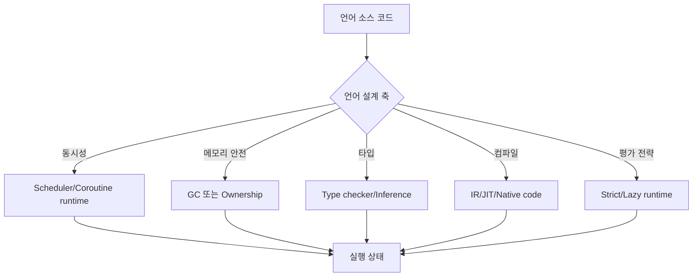
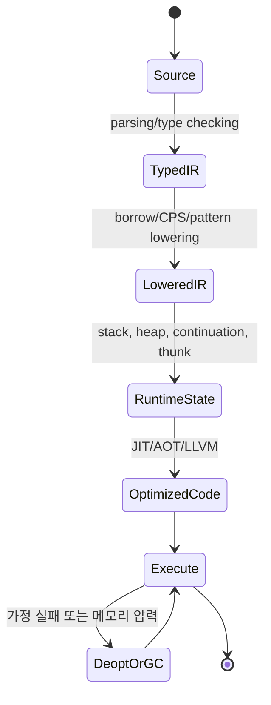

# 프로그래밍 언어 내부 동작 학습 및 기록 노트

## 문서 범위와 검증 계약

- **범위**: Go, Rust, Kotlin/Scala 및 JVM의 대표 구현을 비교하는 학습용 개요다. 언어 명세가 보장하는 의미와 특정 런타임·컴파일러 버전의 구현 전략을 구분한다.
- **전제**: 별도 표기가 없는 다이어그램과 의사 코드는 개념을 설명하기 위한 축약이다. 스택 크기, 스케줄링 주기, JIT 임계값, GC 일시 정지 및 메모리 배치는 버전·플래그·하드웨어·부하에 따라 달라진다.
- **근거 상태**: 언어 규칙은 해당 버전의 명세, 구현 세부는 릴리스에 맞는 소스와 공식 문서, 성능 수치는 동일 조건의 벤치마크로 확인해야 한다. 이 문서의 수치는 크기 감각을 위한 예시이지 SLA나 보장이 아니다.
- **실패/재시도**: 실험이 재현되지 않으면 오류와 버전·옵션을 먼저 기록하고 한 변수만 바꿔 재시도한다. 스케줄러·GC 동작을 추측으로 확정하거나 성공할 때까지 조건을 바꾸는 방식은 피한다.
- **완료 증거**: 결론에는 언어/런타임 버전, 빌드 모드, 실행 명령, 하드웨어, 입력 부하, 반복 횟수와 원시 측정값을 남긴다. 비교 실습은 같은 의미와 같은 측정 조건을 확인해야 완료로 본다.

## 1. 왜 필요한가? (Pain Point & Motivation)

프로그래밍 언어의 차이는 문법보다 런타임과 타입 시스템에서 크게 드러난다. Go는 goroutine을 M:N 스케줄링하고, Rust는 safe Rust와 sound한 unsafe/FFI 경계라는 전제에서 소유권과 borrow checker로 메모리 안전성을 제공하며, Kotlin coroutine은 suspend 함수를 state machine으로 낮춘다. Scala/JVM/Haskell/OCaml도 각각 type system, JIT, lazy evaluation, pattern matching compilation에서 다른 내부 메커니즘을 갖는다.

이 문서는 원문 한국어 프로그래밍 언어 내부 문서를 런타임 상태, 타입 계약, 컴파일 lowering 중심으로 재작성한다.

## 2. 현재 나의 상태 (Baseline)

- Go goroutine, Rust ownership, Kotlin coroutine, JVM JIT, Haskell thunk 같은 개념 이름은 알고 있다.
- stackful coroutine과 stackless coroutine, GC와 ownership, monomorphization과 dynamic dispatch의 차이를 더 명확히 해야 한다.
- 타입 추론, variance, higher-kinded type, implicit/given resolution을 컴파일러 상태로 이해해야 한다.
- 언어별 동시성 모델이 실제 메모리와 scheduler에 어떤 부담을 주는지 비교가 필요하다.

## 3. 도달하고 싶은 목표 (Target State)

- Go GMP scheduler와 goroutine stack growth를 설명한다.
- Rust ownership/borrow state와 monomorphization/dyn dispatch trade-off를 구분한다.
- Kotlin suspend 함수가 Continuation 기반 state machine으로 변환되는 과정을 이해한다.
- JVM HotSpot JIT의 interpreter, C1, C2, deoptimization 흐름을 설명한다.
- Haskell thunk, STM, pattern matching decision tree, Hindley-Milner inference를 내부 구조로 읽는다.

## 4. 시스템 번역 (Data Flow)



언어 내부를 이해한다는 것은 source syntax가 어떤 runtime object, scheduler state, type constraint, machine code로 바뀌는지 추적하는 일이다.

## 5. 핵심 구성요소 (Building Blocks)

| 구성요소 | 언어/런타임 | 핵심 상태 |
| --- | --- | --- |
| GMP scheduler | Go | G, M, P, local/global run queue |
| Tri-color GC | Go/JVM 등 | white/gray/black object set |
| Ownership/Borrow | Rust | owned, moved, shared borrow, mutable borrow |
| Monomorphization | Rust/C++ 계열 | generic type별 함수 복제 |
| Trait object | Rust | data pointer + vtable pointer |
| Continuation state machine | Kotlin | label, result, captured locals |
| HotSpot tiered JIT | JVM | interpreter profile, C1, C2 compiled code |
| Variance/implicit | Scala | type parameter position, implicit scope |
| Thunk | Haskell | closure + environment + update state |
| Algorithm W | ML 계열 | type variable, constraint, unifier |

## 6. 상태 전이 (State Transition)



Kotlin coroutine은 suspend point마다 label이 있는 continuation으로 바뀌고, Rust는 MIR에서 borrow checking을 수행하며, JVM은 profile을 쌓은 뒤 hot method를 native code로 컴파일한다.

## 7. 불변식 (Invariant: 절대 깨지면 안 되는 규칙)

- Go 런타임은 blocking syscall에서 P를 다른 M에 넘길 수 있지만, 외부 자원 고갈이나 런타임 제약까지 개별 goroutine의 진행을 보장하지는 않는다.
- 동시 GC의 write barrier는 갱신 중인 참조 때문에 도달 가능한 객체를 놓치지 않아야 한다. 실제 Go의 hybrid barrier 등은 런타임별 규칙을 따르므로 단순한 black→white 금지만을 모든 GC의 불변식으로 쓰지 않는다.
- safe Rust에서는 동일한 값에 대한 ordinary shared borrow와 exclusive mutable borrow의 유효 범위가 충돌하면 안 된다. `unsafe`, FFI, 내부 가변성과 동적 검사는 별도 경계를 확인한다.
- `dyn Trait` 호출은 vtable contract와 object lifetime이 맞아야 한다.
- Kotlin coroutine cancellation은 협조적이며 parent Job이 취소되면 child도 취소되어야 한다.
- JVM speculative optimization은 가정이 깨지면 안전하게 deoptimize되어야 한다.
- Type inference는 infinite type을 막기 위해 occurs check를 수행해야 한다.
- Lazy evaluation의 thunk는 첫 평가 뒤 결과로 update되어 중복 평가를 줄여야 한다.

## 8. 가장 작은 예제 (Minimal Viable Example)

```kotlin
suspend fun loadUser(id: Int): User {
    val raw = httpGet(id)
    return parse(raw)
}
```

```text
컴파일 후 개념 모델:
state 0: httpGet(id, continuation)를 호출하고 suspend
state 1: 재개되면 raw 결과를 꺼내 parse(raw)를 반환
```

이 예제는 `suspend`가 OS thread를 붙잡는 것이 아니라 continuation 객체에 local state와 다음 실행 위치를 저장한다는 점을 보여준다.

## 9. 실패 사례 (What could go wrong?)

- Go goroutine을 무제한 생성하고 channel/mutex 대기 상태를 관리하지 않아 scheduler와 heap이 압박된다.
- Rust에서 dynamic dispatch를 과도하게 사용해 inlining과 monomorphization 이점을 잃는다.
- Kotlin coroutine에서 blocking I/O를 `Dispatchers.Default`에서 실행해 CPU pool을 막는다.
- JVM JIT 최적화 결과를 영구적인 성능 보장처럼 보고 warmup과 deoptimization을 무시한다.
- Scala implicit/given scope가 복잡해져 의도하지 않은 instance가 선택된다.
- Haskell lazy evaluation에서 thunk가 과도하게 쌓여 space leak이 발생한다.
- 타입 추론 오류를 런타임 오류처럼 생각해 컴파일 단계의 constraint 실패 원인을 놓친다.

## 10. 뇌 확장하기 (Evolution & Variants)

- Go는 scheduler trace, escape analysis, GC pacing, channel profiling으로 확장해 본다.
- Rust는 async Future polling, pinning, unsafe boundary, lifetime elision을 함께 학습한다.
- Kotlin은 structured concurrency, Flow, dispatcher, Android main looper와 연결한다.
- JVM은 GC 종류, virtual threads, invokedynamic, escape analysis를 함께 본다.
- Functional runtime은 laziness, STM, algebraic data type layout, pattern matching compilation으로 확장한다.
- Type system은 HM inference, variance, higher-ranked type, dependent type 방향으로 넓힌다.

## 11. 최종 체크리스트 (Definition of Done)

- [x] Go, Rust, Scala, Kotlin, JVM, 함수형 언어 런타임을 내부 상태 기준으로 비교했다.
- [x] coroutine state machine 최소 예제로 stackless suspend 모델을 설명했다.
- [x] GC, ownership, JIT, type inference, lazy evaluation의 불변식을 정리했다.
- [x] 언어별 실패 사례를 scheduler, dispatch, blocking, deopt, thunk 관점으로 나눴다.
- [x] 원문 한국어 프로그래밍 언어 문서를 12개 섹션 템플릿으로 재작성했다.

## 12. 뇌에 새기는 복습 문장 (TL;DR Blank)

언어의 진짜 차이는 문법이 아니라 실행 상태를 누가 관리하는가에 있다. GC, ownership, coroutine, JIT, type checker가 각각 다른 방식으로 안전성과 성능을 만든다.
