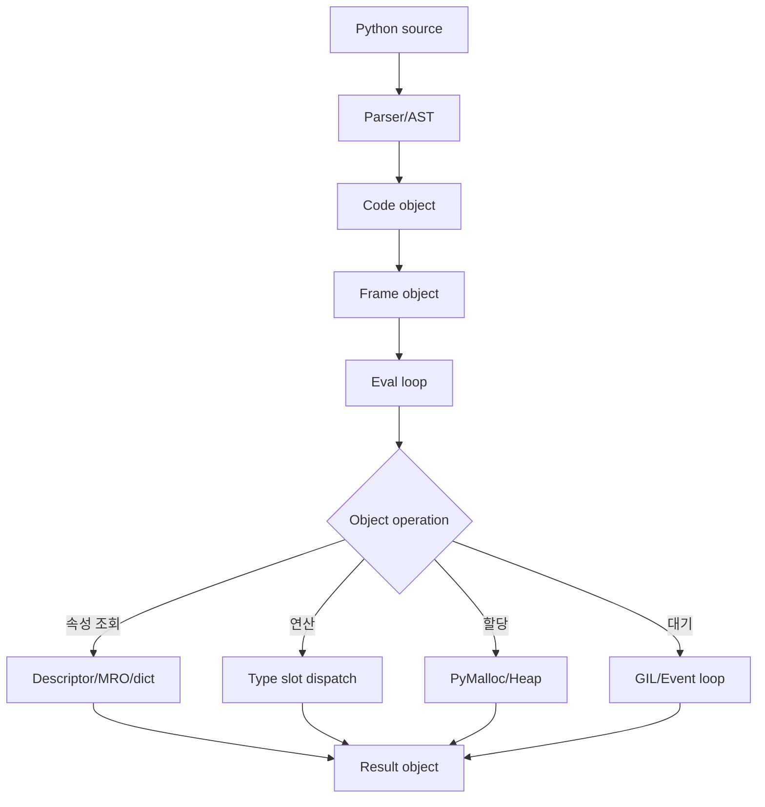
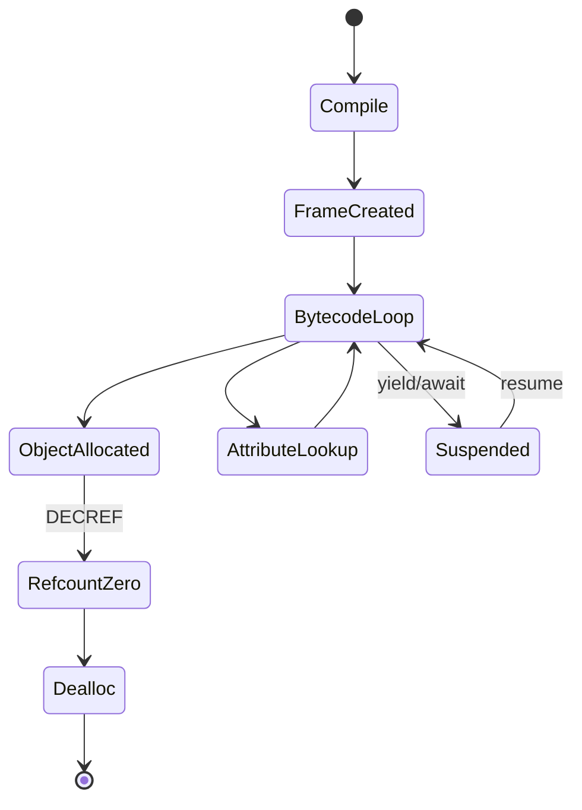

# Python 내부 동작 학습 및 기록 노트

## 1. 왜 필요한가? (Pain Point & Motivation)

Python 코드는 간결하지만 CPython 내부에서는 모든 값이 `PyObject`이고, 참조 카운팅과 순환 GC가 객체 수명을 관리하며, 바이트코드 평가 루프가 opcode를 실행한다. GIL, PyMalloc, descriptor protocol, generator frame, compact dict, import cache 같은 내부 구조를 이해하면 성능 병목과 메모리 누수를 더 정확히 설명할 수 있다.

이 문서는 원문 한국어 Python 내부 문서를 CPython runtime 상태와 실행 흐름 중심으로 재작성한다.

## 2. 현재 나의 상태 (Baseline)

- Python 문법, list/dict, class, generator, async/await, import 사용법은 알고 있다.
- `PyObject`, `ob_refcnt`, `ob_type`, reference counting의 실제 의미를 더 명확히 해야 한다.
- GIL이 왜 존재하고 CPU-bound Python thread에 어떤 영향을 주는지 설명해야 한다.
- descriptor lookup, bound method 생성, dict compact layout, import cache가 성능에 어떤 영향을 주는지 정리해야 한다.
- NumPy가 왜 순수 Python loop보다 빠른지 CPython overhead 관점으로 연결해야 한다.

## 3. 도달하고 싶은 목표 (Target State)

- 모든 Python 값이 heap object이고 type pointer를 통해 동작이 dispatch됨을 설명한다.
- reference counting과 cyclic GC의 역할을 구분한다.
- source -> AST -> code object -> frame -> eval loop 흐름을 이해한다.
- GIL과 multiprocessing/asyncio/C extension의 관계를 구분한다.
- descriptor, generator, dict, import, PyMalloc이 성능과 메모리 사용에 미치는 영향을 판단한다.

## 4. 시스템 번역 (Data Flow)



Python 실행은 high-level statement가 아니라 opcode와 `PyObject` 조작의 연속이다. 성능 문제는 보통 이 조작 횟수와 객체 할당 수에서 나온다.

## 5. 핵심 구성요소 (Building Blocks)

| 구성요소 | 역할 | 핵심 상태 |
| --- | --- | --- |
| `PyObject` | 모든 객체의 공통 헤더 | `ob_refcnt`, `ob_type` |
| Reference counting | 즉시 수명 관리 | `Py_INCREF`, `Py_DECREF` |
| Cyclic GC | 순환 참조 회수 | generation list, `gc_refs` |
| Code object | 컴파일된 바이트코드 | `co_code`, `co_consts`, `co_varnames` |
| Frame object | 실행 중인 호출 상태 | locals, value stack, instruction pointer |
| GIL | CPython 내부 공유 상태 보호 | bytecode 실행권 |
| PyMalloc | 작은 객체 allocator | arena, pool, block |
| Descriptor protocol | 속성 조회와 method binding | `__get__`, `__set__` |
| Generator/coroutine | frame suspension | `f_lasti`, value stack |
| Compact dict | hash index와 dense entries | insertion order, load factor |
| Import system | module cache와 loader | `sys.modules`, `sys.meta_path` |

## 6. 상태 전이 (State Transition)



Generator는 frame을 버리지 않고 `yield` 지점에서 중단한다. `next()`가 호출되면 같은 frame의 instruction pointer와 value stack을 복원해 이어서 실행한다.

## 7. 불변식 (Invariant: 절대 깨지면 안 되는 규칙)

- 모든 live object는 참조 수 또는 GC reachability로 도달 가능해야 한다.
- `Py_DECREF` 후 refcount가 0이 되면 객체는 더 이상 접근되면 안 된다.
- 순환 참조는 reference counting만으로 회수되지 않으므로 cyclic GC가 필요하다.
- GIL이 보호하는 CPython 내부 상태는 동시에 여러 thread가 변경하면 안 된다.
- Descriptor lookup 순서는 data descriptor, instance dict, non-data descriptor, class attribute 순서를 지켜야 한다.
- Dict lookup은 hash와 key equality를 모두 확인해야 한다.
- Import는 `sys.modules` cache를 통해 같은 module object를 재사용해야 한다.
- CPU-bound 순수 Python thread가 여러 개여도 GIL 때문에 동시에 bytecode를 실행하지 못한다.

## 8. 가장 작은 예제 (Minimal Viable Example)

```python
class User:
    @property
    def name(self):
        return "alice"


user = User()
print(user.name)
```

```text
user.name 조회 순서:
1. type(user).__mro__에서 "name" 검색
2. property 객체는 __get__과 __set__을 가진 data descriptor
3. instance __dict__보다 descriptor가 우선
4. property.__get__(user, User)가 호출되어 "alice" 반환
```

이 예제는 Python의 속성 접근이 단순 dict lookup이 아니라 descriptor protocol과 MRO를 거치는 동적 dispatch임을 보여준다.

## 9. 실패 사례 (What could go wrong?)

- 순환 참조가 있는 객체에 `__del__`이나 외부 리소스가 얽혀 회수 타이밍이 예상과 달라진다.
- CPU-bound 작업을 thread로 병렬화하려고 해도 GIL 때문에 속도가 늘지 않는다.
- `str += part`를 loop에서 반복해 매번 새 문자열을 만들고 `O(n^2)` 비용을 만든다.
- 전역 변수 lookup과 attribute lookup이 hot loop 안에서 반복되어 bytecode overhead가 커진다.
- generator/coroutine frame이 참조를 유지해 큰 객체가 예상보다 오래 살아남는다.
- import top-level code가 무겁고 cold import latency가 커진다.
- dict key의 `__hash__`/`__eq__` 구현이 불안정하면 lookup 불변식이 깨진다.

## 10. 뇌 확장하기 (Evolution & Variants)

- CPython 내부는 PEP 703 no-GIL build, immortal objects, specializing interpreter 같은 변화와 함께 봐야 한다.
- 성능 개선은 cProfile, py-spy, line_profiler, tracemalloc으로 병목을 확인한 뒤 진행한다.
- CPU-bound 작업은 multiprocessing, C extension, NumPy vectorization, Numba/Cython을 비교한다.
- Async I/O는 event loop, Future, coroutine suspension, backpressure를 함께 학습한다.
- 메모리는 object graph, weakref, `__slots__`, allocator fragmentation, GC tuning으로 확장해 본다.

## 11. 최종 체크리스트 (Definition of Done)

- [x] PyObject, refcount, cyclic GC, bytecode/frame, GIL을 한 실행 흐름으로 정리했다.
- [x] descriptor lookup을 최소 예제로 설명했다.
- [x] dict/import/generator/PyMalloc/NumPy 성능 관점을 포함했다.
- [x] CPU-bound thread, 순환 참조, hot loop lookup 같은 실패 사례를 정리했다.
- [x] 원문 한국어 Python 내부 문서를 12개 섹션 템플릿으로 재작성했다.

## 12. 뇌에 새기는 복습 문장 (TL;DR Blank)

Python의 편리함은 CPython의 객체 헤더, 참조 카운팅, descriptor, eval loop가 대신 일해주기 때문에 가능하다. 성능과 메모리를 보려면 그 내부 비용을 함께 봐야 한다.
