# Python 내부: 내부 내용

> 다음에서 합성됨: Beazley *Python Essential Reference*, Ramalho *Fluent Python* 2nd ed, Martelli *Python in a Nutshell*, CPython 소스 내부 및 comp(19/20/32/44/46-47/55/61/64-65/75/77/192/202) Python 참조.

---

## 1. CPython 개체 모델 - 모든 것이 PyObject입니다.

정수부터 함수, 클래스까지 모든 Python 값은 힙에 할당된 `PyObject`입니다. 이것이 Python 런타임의 기초입니다.

### PyObject 구조

```c
// Base type — every Python object starts with this
typedef struct _object {
    Py_ssize_t ob_refcnt;      // reference count (for garbage collection)
    PyTypeObject *ob_type;     // pointer to type object (= type(obj))
} PyObject;

// Variable-length objects (lists, tuples, bytes) extend with:
typedef struct {
    PyObject ob_base;
    Py_ssize_t ob_size;        // number of items
} PyVarObject;

// Integer example:
typedef struct {
    PyObject ob_base;
    Py_ssize_t ob_digit_count; // number of 30-bit digits
    digit ob_digit[1];         // digits array (arbitrary precision!)
} PyLongObject;
```

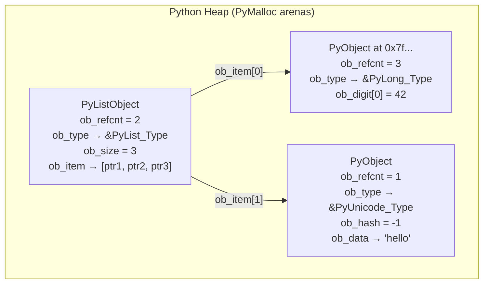
```mermaid
flowchart TD
    subgraph Heap["Python Heap (PyMalloc arenas)"]
        I1["PyObject at 0x7f...\nob_refcnt = 3\nob_type → &PyLong_Type\nob_digit[0] = 42"]
        I2["PyObject\nob_refcnt = 1\nob_type → &PyUnicode_Type\nob_hash = -1\nob_data → 'hello'"]
        L1["PyListObject\nob_refcnt = 2\nob_type → &PyList_Type\nob_size = 3\nob_item → [ptr1, ptr2, ptr3]"]
    end
    
    L1 -->|"ob_item[0]"| I1
    L1 -->|"ob_item[1]"| I2
```

### 작은 정수 캐시

CPython은 **-5에서 256** 값에 대한 정수 객체를 미리 할당합니다. `x = 5`에 대한 모든 참조는 **동일한** PyLongObject를 가리킵니다.

```python
a = 256
b = 256
a is b   # True — same object
a = 257
b = 257
a is b   # False — separate objects (outside cache range)
```

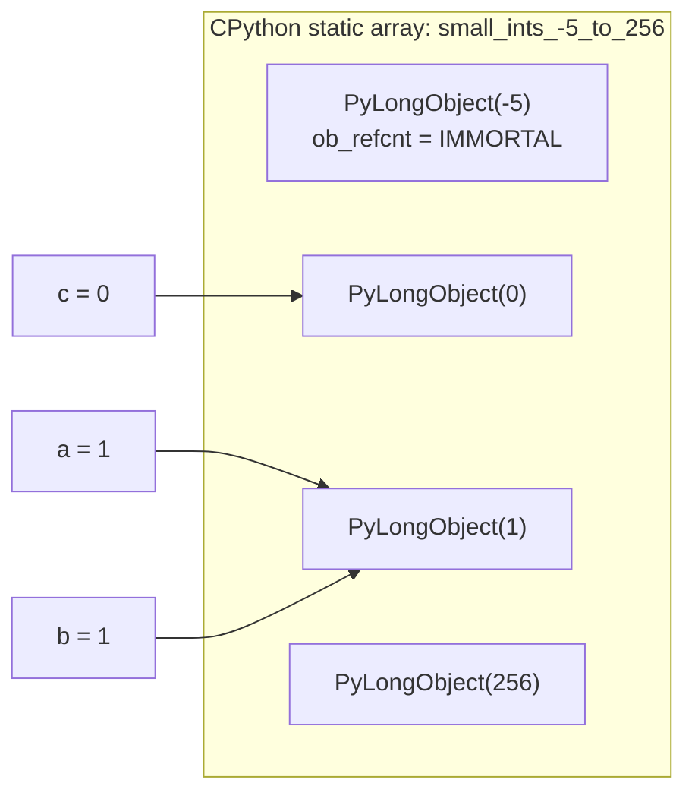
```mermaid
flowchart LR
    subgraph static_ints["CPython static array: small_ints_-5_to_256"]
        INT_5["PyLongObject(-5)\nob_refcnt = IMMORTAL"]
        INT0["PyLongObject(0)"]
        INT1["PyLongObject(1)"]
        INT256["PyLongObject(256)"]
    end
    
    A["a = 1"] --> INT1
    B["b = 1"] --> INT1
    C["c = 0"] --> INT0
```

문자열 인터닝: 짧은 식별자와 유사한 문자열(영숫자, 일반적으로 20자 이하)은 전역 dict `interned`에 인터닝됩니다. `'hello' is 'hello'` → 사실입니다. 임의 문자열: 보장되지 않습니다.

---

## 2. 참조 카운팅과 가비지 컬렉션

### Py_INCREF / Py_DECREF — 원자적 연산

```c
#define Py_INCREF(op) ((op)->ob_refcnt++)
#define Py_DECREF(op)                        \
    do {                                      \
        if (--((op)->ob_refcnt) == 0)         \
            _Py_Dealloc(op);                  \
    } while(0)
```

참조 증분을 생성하는 모든 Python 작업은 다음과 같습니다. 감소를 해제하는 모든 작업. `ob_refcnt == 0` → `_Py_Dealloc()`이 호출되면 → 객체의 `tp_dealloc` 슬롯이 호출되고 → 메모리가 `PyMalloc`으로 반환됩니다.

### 순환 가비지 수집기

참조 계산에서는 주기를 수집할 수 없습니다.

```python
a = []
b = [a]
a.append(b)   # a.ob_refcnt = 2, b.ob_refcnt = 2
del a, del b  # both drop to 1 — NOT 0 — leak!
```

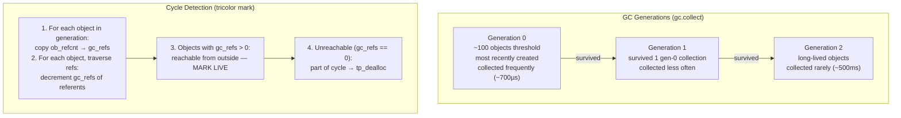
```mermaid
flowchart TD
    subgraph Generations["GC Generations (gc.collect)"]
        G0["Generation 0\n~100 objects threshold\nmost recently created\ncollected frequently (~700µs)"]
        G1["Generation 1\nsurvived 1 gen-0 collection\ncollected less often"]
        G2["Generation 2\nlong-lived objects\ncollected rarely (~500ms)"]
    end

    G0 -->|"survived"| G1
    G1 -->|"survived"| G2
    
    subgraph Algorithm["Cycle Detection (tricolor mark)"]
        SCAN["1. For each object in generation:\ncopy ob_refcnt → gc_refs\n2. For each object, traverse refs:\ndecrement gc_refs of referents"]
        SCAN --> MARK["3. Objects with gc_refs > 0:\nreachable from outside — MARK LIVE"]
        MARK --> SWEEP["4. Unreachable (gc_refs == 0):\npart of cycle → tp_dealloc"]
    end
```

**GIL 상호작용**: 순환 GC는 GIL이 유지된 상태에서 실행됩니다(월드 스톱). CPython의 대규모 2세대 컬렉션은 10~50ms 동안 일시 중지될 수 있으며 지연 시간에 민감한 앱에서 볼 수 있습니다. 완화 방법: `gc.disable()` + 수동 `gc.collect()` 예약 또는 참조 순환 방지.

---

## 3. CPython 바이트코드와 평가 루프

### 컴파일 파이프라인

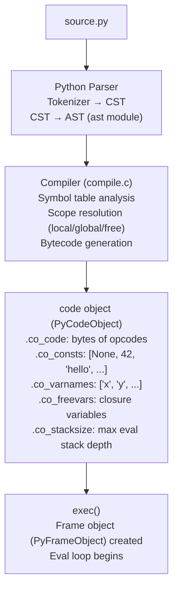
```mermaid
flowchart TD
    SRC["source.py"] --> PARSE["Python Parser\nTokenizer → CST\nCST → AST (ast module)"]
    PARSE --> COMPILE["Compiler (compile.c)\nSymbol table analysis\nScope resolution (local/global/free)\nBytecode generation"]
    COMPILE --> CO["code object (PyCodeObject)\n.co_code: bytes of opcodes\n.co_consts: [None, 42, 'hello', ...]\n.co_varnames: ['x', 'y', ...]\n.co_freevars: closure variables\n.co_stacksize: max eval stack depth"]
    CO --> EXEC["exec()\nFrame object (PyFrameObject) created\nEval loop begins"]
```

### PyCodeObject 및 PyFrameObject

```c
typedef struct {
    PyObject_HEAD
    int co_argcount;        // number of positional args
    int co_nlocals;         // number of local variables
    int co_stacksize;       // max eval stack depth needed
    PyObject *co_code;      // bytes: [opcode, arg, opcode, arg, ...]
    PyObject *co_consts;    // tuple: constants referenced by LOAD_CONST
    PyObject *co_varnames;  // tuple: local variable names
    PyObject *co_freevars;  // tuple: names from enclosing scope (closures)
    PyObject *co_filename;
    int co_firstlineno;
    PyObject *co_lnotab;    // line number table: offset → lineno mapping
} PyCodeObject;

typedef struct _frame {
    PyObject_VAR_HEAD
    struct _frame *f_back;      // caller frame (linked list)
    PyCodeObject *f_code;       // code object being executed
    PyObject **f_locals;        // local variable array
    PyObject **f_valuestack;    // base of eval stack
    PyObject **f_stacktop;      // top of eval stack (current)
    int f_lasti;                // index of last attempted instruction
    int f_lineno;               // current line number
} PyFrameObject;
```

### 바이트코드 — 디스어셈블리 예시

```python
def add(a, b):
    return a + b

import dis
dis.dis(add)
```

```
  2           0 LOAD_FAST                0 (a)    ← push locals[0] onto eval stack
              2 LOAD_FAST                1 (b)    ← push locals[1]
              4 BINARY_ADD                        ← pop 2, push result
              6 RETURN_VALUE                      ← pop and return
```

### CPython 평가 루프(ceval.c) — 단순화됨

```c
for (;;) {
    opcode = *next_instr++;
    oparg  = *next_instr++;
    
    switch(opcode) {
    case LOAD_FAST:
        PyObject *val = fastlocals[oparg];
        Py_INCREF(val);
        PUSH(val);
        break;
    case BINARY_ADD:
        PyObject *right = POP();
        PyObject *left  = TOP();
        PyObject *res   = PyNumber_Add(left, right);  // dispatch through nb_add slot
        Py_DECREF(right); Py_DECREF(left);
        SET_TOP(res);
        break;
    case RETURN_VALUE:
        return POP();
    // ... ~150 more opcodes
    }
    
    // Check for GIL release every sys.getswitchinterval() (5ms default)
    if (--eval_breaker) { check_signals(); maybe_release_GIL(); }
}
```

---

## 4. GIL — 전역 통역사 잠금

### GIL이 보호하는 것

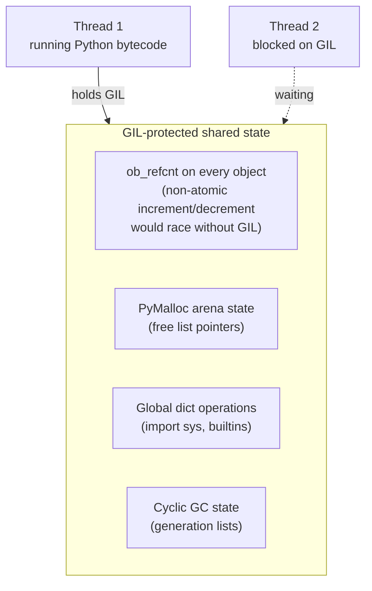
```mermaid
flowchart TD
    subgraph GIL_Protected["GIL-protected shared state"]
        RC["ob_refcnt on every object\n(non-atomic increment/decrement\nwould race without GIL)"]
        MALLOC["PyMalloc arena state\n(free list pointers)"]
        DICT["Global dict operations\n(import sys, builtins)"]
        GC["Cyclic GC state\n(generation lists)"]
    end
    
    T1["Thread 1\nrunning Python bytecode"] -->|"holds GIL"| GIL_Protected
    T2["Thread 2\nblocked on GIL"] -.->|"waiting"| GIL_Protected
```

### GIL 릴리스 메커니즘

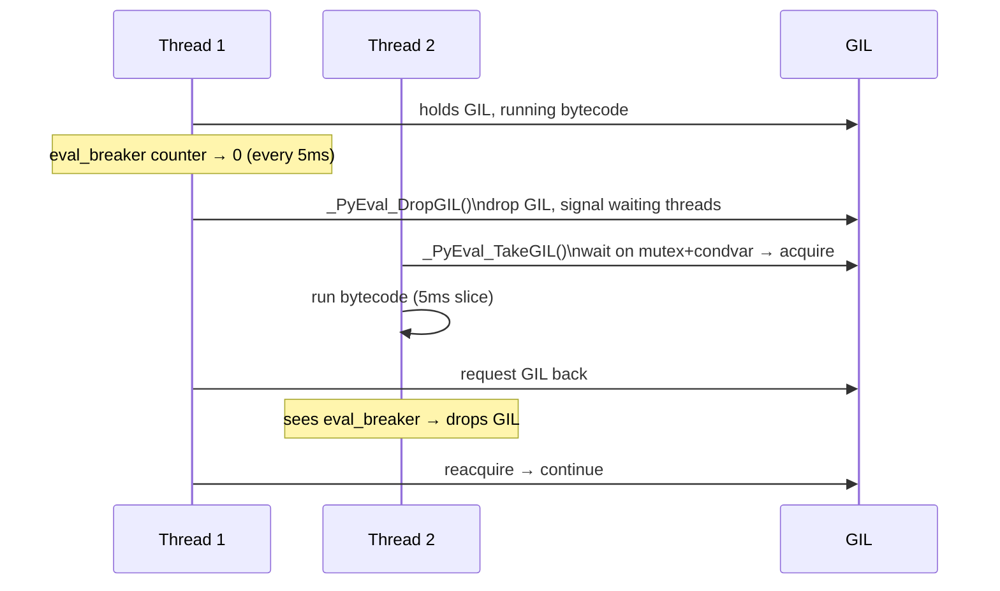
```mermaid
sequenceDiagram
    participant T1 as Thread 1
    participant T2 as Thread 2
    participant GIL

    T1->>GIL: holds GIL, running bytecode
    Note over T1: eval_breaker counter → 0 (every 5ms)
    T1->>GIL: _PyEval_DropGIL()\ndrop GIL, signal waiting threads
    T2->>GIL: _PyEval_TakeGIL()\nwait on mutex+condvar → acquire
    T2->>T2: run bytecode (5ms slice)
    T1->>GIL: request GIL back
    Note over T2: sees eval_breaker → drops GIL
    T1->>GIL: reacquire → continue
```

**GIL 프리 작업**: I/O(읽기/쓰기/소켓), numpy C 확장, ctypes 호출 — 모두 C 코드에서 GIL을 릴리스합니다. CPU 바인딩된 C 확장(hashlib, zlib 등)도 GIL을 릴리스합니다. 순수 Python 바이트코드 실행만이 GIL을 지속적으로 보유합니다.

**진정한 병렬성**: `multiprocessing` 모듈 — 별도의 프로세스, 별도의 GIL, 파이프/공유 메모리를 통해 통신합니다. PEP 703(CPython 3.13 실험적): 객체별 세분화된 잠금 및 편향된 참조 카운팅을 사용하는 GIL 없는 빌드입니다.

---

## 5. Python 메모리 관리자 — PyMalloc

### 3단계 할당자

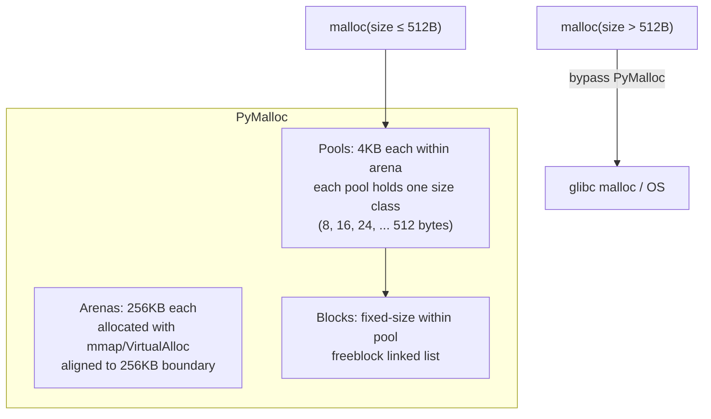
```mermaid
flowchart TD
    subgraph "PyMalloc"
        ARENAS["Arenas: 256KB each\nallocated with mmap/VirtualAlloc\naligned to 256KB boundary"]
        POOLS["Pools: 4KB each within arena\neach pool holds one size class\n(8, 16, 24, ... 512 bytes)"]
        BLOCKS["Blocks: fixed-size within pool\nfreeblock linked list"]
    end
    
    REQ["malloc(size ≤ 512B)"] --> POOLS
    REQ2["malloc(size > 512B)"] -->|"bypass PyMalloc"| GLIBC["glibc malloc / OS"]
    POOLS --> BLOCKS
```

```
Arena (256KB):
+--[pool 0: 4KB]--+--[pool 1: 4KB]--+-- ... --+--[pool 63: 4KB]--+

Pool for 32-byte size class:
+--[header: 8B]--+--[block0: 32B]--+--[block1: 32B]-- ... --+--[block126: 32B]--+
                   ↑ freeblock linked list chains free blocks
```

**usedpools[64]**: 크기 클래스당 하나씩 풀 포인터 배열입니다. `malloc(size)` → 8바이트 경계로 반올림 → `size_class = (size-1) / 8` → `pool = usedpools[size_class]` → 풀의 여유 목록에서 블록을 팝합니다.

---

## 6. 디스크립터와 속성 조회 프로토콜

### 속성 조회 알고리즘(`__getattribute__`)

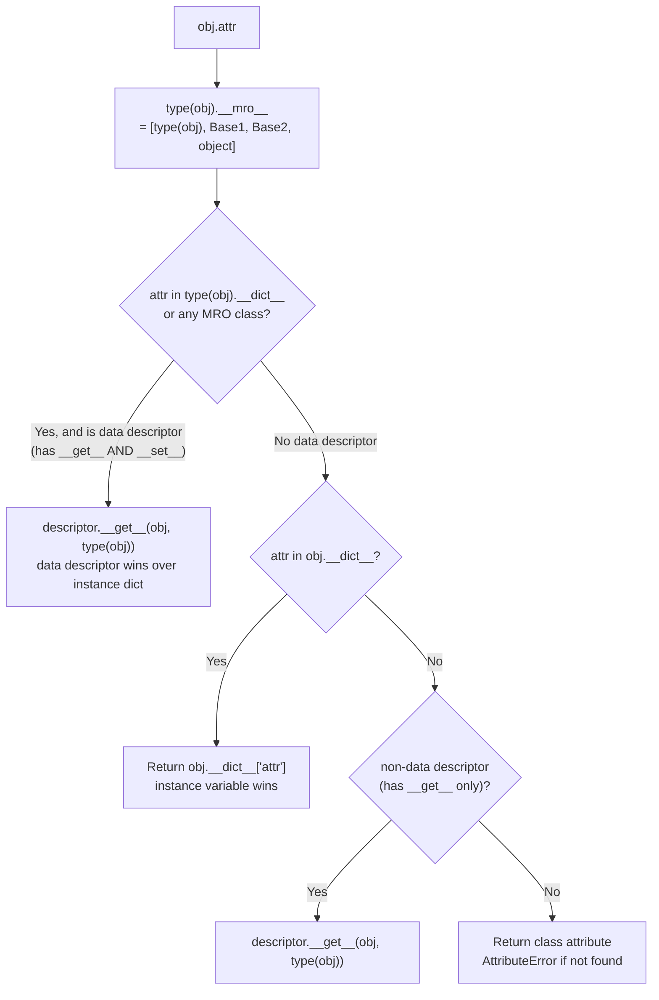
```mermaid
flowchart TD
    A["obj.attr"] --> B["type(obj).__mro__\n= [type(obj), Base1, Base2, object]"]
    B --> C{"attr in type(obj).__dict__\nor any MRO class?"}
    C -->|"Yes, and is data descriptor\n(has __get__ AND __set__)"| D["descriptor.__get__(obj, type(obj))\ndata descriptor wins over instance dict"]
    C -->|"No data descriptor"| E{"attr in obj.__dict__?"}
    E -->|"Yes"| F["Return obj.__dict__['attr']\ninstance variable wins"]
    E -->|"No"| G{"non-data descriptor\n(has __get__ only)?"}
    G -->|"Yes"| H["descriptor.__get__(obj, type(obj))"]
    G -->|"No"| I["Return class attribute\nAttributeError if not found"]
```

**속성**은 데이터 설명자입니다.
```python
class Property:
    def __init__(self, fget): self.fget = fget
    def __get__(self, obj, cls):
        if obj is None: return self          # class access → return descriptor itself
        return self.fget(obj)                # instance access → call getter
    def __set__(self, obj, val): raise AttributeError  # data descriptor (blocks instance __dict__)
```

**함수 → 바인딩된 메서드**: `function.__get__(instance, cls)`은 `(self, func)`을 래핑하는 `PyMethodObject`을 반환합니다. 모든 `obj.method` 호출은 동적으로 메소드 객체를 생성합니다(`functools.cached_property`에 의해 캐시되지 않는 한).

---

## 7. 생성기와 코루틴 내부

### 발전기 프레임 서스펜션

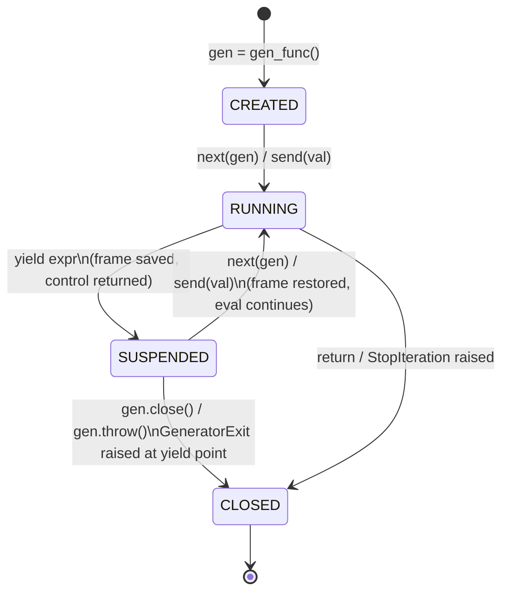
```mermaid
stateDiagram-v2
    [*] --> CREATED: gen = gen_func()
    CREATED --> RUNNING: next(gen) / send(val)
    RUNNING --> SUSPENDED: yield expr\n(frame saved, control returned)
    SUSPENDED --> RUNNING: next(gen) / send(val)\n(frame restored, eval continues)
    SUSPENDED --> CLOSED: gen.close() / gen.throw()\nGeneratorExit raised at yield point
    RUNNING --> CLOSED: return / StopIteration raised
    CLOSED --> [*]
```

`yield`이 실행될 때:
1. 프레임에 저장된 현재 `f_stacktop`
2. `f_lasti`이(가) 현재 명령어 인덱스로 업데이트되었습니다.
3. 프레임의 `f_executing` 플래그가 지워졌습니다.
4. 프레임이 해제되지 **않음** - 생성기 객체에 의해 활성 상태로 유지됨
5. `next()` 호출자에게 반환된 산출 값

`next()`이 재개되면:
1. 동일한 `PyFrameObject`이(가) `_PyEval_EvalFrameDefault()`에 다시 전달되었습니다.
2. `f_lasti`은(는) 저장된 명령에서 재개됩니다.
3. `f_valuestack`에서 복원된 평가 스택

### async/await — 이벤트 루프 통합

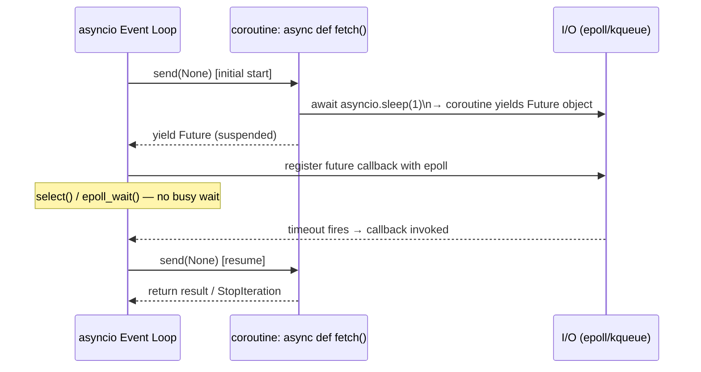
```mermaid
sequenceDiagram
    participant EL as asyncio Event Loop
    participant CO as coroutine: async def fetch()
    participant IO as I/O (epoll/kqueue)

    EL->>CO: send(None) [initial start]
    CO->>IO: await asyncio.sleep(1)\n→ coroutine yields Future object
    CO-->>EL: yield Future (suspended)
    EL->>IO: register future callback with epoll
    Note over EL: select() / epoll_wait() — no busy wait
    IO-->>EL: timeout fires → callback invoked
    EL->>CO: send(None) [resume]
    CO-->>EL: return result / StopIteration
```

`await expr`은 `GET_AWAITABLE` + `YIELD_FROM` 바이트코드로 컴파일됩니다. 코루틴 객체는 그 자체로 완료될 때까지 `__next__`이 내부 대기 가능 항목을 구동하는 반복자입니다.

---

## 8. Python의 데이터 모델 — 특수 메서드 및 슬롯

### 유형 개체 슬롯

```c
typedef struct _typeobject {
    PyObject_VAR_HEAD
    const char *tp_name;           // "int", "str", "list", ...
    Py_ssize_t tp_basicsize;       // sizeof(PyXxxObject)
    
    // Number protocol
    PyNumberMethods *tp_as_number; // nb_add, nb_sub, nb_mul, nb_truediv, ...
    
    // Sequence protocol  
    PySequenceMethods *tp_as_sequence; // sq_length, sq_item, sq_contains, ...
    
    // Mapping protocol
    PyMappingMethods *tp_as_mapping;   // mp_length, mp_subscript, ...
    
    // Core slots
    hashfunc tp_hash;       // __hash__
    reprfunc tp_repr;       // __repr__
    ternaryfunc tp_call;    // __call__
    destructor tp_dealloc;  // called when ob_refcnt → 0
    
    // Attribute access
    getattrofunc tp_getattro;  // __getattr__/__getattribute__
    setattrofunc tp_setattro;  // __setattr__/__delattr__
    
    PyObject *tp_dict;      // class __dict__
    PyObject *tp_bases;     // tuple of base classes
    PyObject *tp_mro;       // tuple: Method Resolution Order
} PyTypeObject;
```

`a + b` → `PyNumber_Add(a, b)` → `type(a)->tp_as_number->nb_add` 확인 → 구현되지 않은 경우 `type(b)->tp_as_number->nb_add`을 확인하세요. 내장 유형에 대해 우회된 특수 메소드(직접 슬롯 호출, dict 조회보다 빠릅니다).

---

## 9. 사전 내부 — 컴팩트 해시 테이블

### CPython dict(Python 3.6+ 컴팩트 레이아웃)

```
indices array (sparse):
[0]: slot=2   [1]: empty   [2]: slot=0   [3]: slot=1   ...
  ↑ 1 byte per entry (small dicts), 2 or 4 for larger

entries array (dense):
slot 0: {hash=0x..., key="name",   value="Alice"}
slot 1: {hash=0x..., key="age",    value=30}
slot 2: {hash=0x..., key="region", value="US"}
```

`d["age"]` 조회:
1. `h = hash("age")` → 예: `0x7f3a...`
2. `i = h % len(indices)` → 인덱스 배열의 인덱스
3. `slot = indices[i]` → 1(충돌 시 또는 충돌 시 LINEAR_PROBE)
4. `entries[1].hash == h` 및 `entries[1].key == "age"` → `entries[1].value` 반환

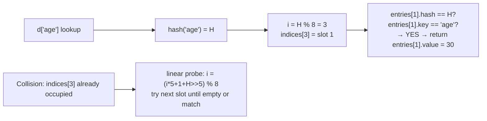
```mermaid
flowchart LR
    A["d['age'] lookup"] --> B["hash('age') = H"]
    B --> C["i = H % 8 = 3\nindices[3] = slot 1"]
    C --> D["entries[1].hash == H?\nentries[1].key == 'age'?\n→ YES → return entries[1].value = 30"]
    
    E["Collision: indices[3] already occupied"] --> F["linear probe: i = (i*5+1+H>>5) % 8\ntry next slot until empty or match"]
```

**딕셔너리 크기 조정**: `size / capacity > 2/3`일 때 `capacity * 2`로 크기를 조정합니다. 전체 인덱스 배열이 재구축되었습니다. 모든 항목이 다시 해시되었습니다. Dict는 삽입 순서를 유지하는 조밀한 항목 배열을 통해 삽입 순서(Python 3.7부터 보장됨)를 유지합니다.

---

## 10. 시스템 내부 가져오기

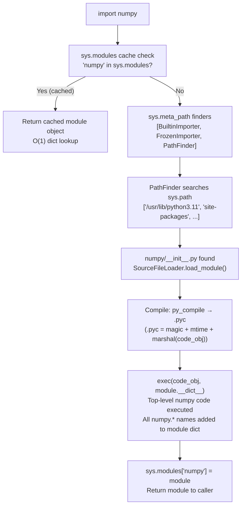
```mermaid
flowchart TD
    A["import numpy"] --> B["sys.modules cache check\n'numpy' in sys.modules?"]
    B -->|"Yes (cached)"| C["Return cached module object\nO(1) dict lookup"]
    B -->|"No"| D["sys.meta_path finders\n[BuiltinImporter, FrozenImporter, PathFinder]"]
    D --> E["PathFinder searches sys.path\n['/usr/lib/python3.11', 'site-packages', ...]"]
    E --> F["numpy/__init__.py found\nSourceFileLoader.load_module()"]
    F --> G["Compile: py_compile → .pyc\n(.pyc = magic + mtime + marshal(code_obj))"]
    G --> H["exec(code_obj, module.__dict__)\nTop-level numpy code executed\nAll numpy.* names added to module dict"]
    H --> I["sys.modules['numpy'] = module\nReturn module to caller"]
```

**.pyc 캐시**: `__pycache__/numpy.cpython-311.pyc`. 매직넘버 = 통역사 버전. 소스 mtime이 변경되지 않고 매직이 일치하는 경우 → 바이트코드를 직접 로드하고 재컴파일을 건너뜁니다. `marshal.loads()`은 .pyc 바이트에서 코드 객체를 역직렬화합니다.

---

## 11. Python 성능 내부

### 바이트코드 수준에서 프로파일링

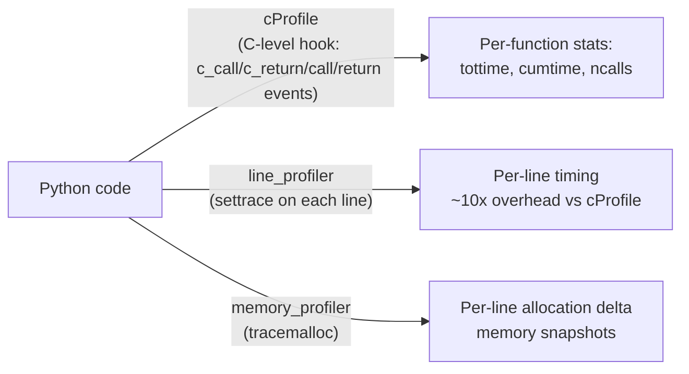
```mermaid
flowchart LR
    A["Python code"] -->|"cProfile\n(C-level hook: c_call/c_return/call/return events)"| B["Per-function stats:\ntottime, cumtime, ncalls"]
    A -->|"line_profiler\n(settrace on each line)"| C["Per-line timing\n~10x overhead vs cProfile"]
    A -->|"memory_profiler\n(tracemalloc)"| D["Per-line allocation delta\nmemory snapshots"]
```

### 일반적인 성능 패턴

| 패턴 | 왜 느린가요 | 수정 |
|---------|----------|-----|
| 루프 내 `str += str` | O(n²) — 각 연결마다 새 할당 | `''.join(list)` |
| `[x for x in gen] * N` | 열심히 실현 | 게으른 반복 |
| `.get()` 없이 루프에 `dict[key]` | KeyError 예외 경로 | `dict.get(key, default)` |
| 전역 변수 액세스 | `LOAD_GLOBAL` → 사전 조회 | 로컬에 바인딩: `g = global_var` |
| `append` 대 `extend` | 반복되는 단일 항목 삽입 | `extend`를 사용한 일괄 처리 |
| 순수 Python 루프 | ~100바이트코드/μs | numpy 벡터화 |

### NumPy — CPython 속도 저하를 우회하는 방법

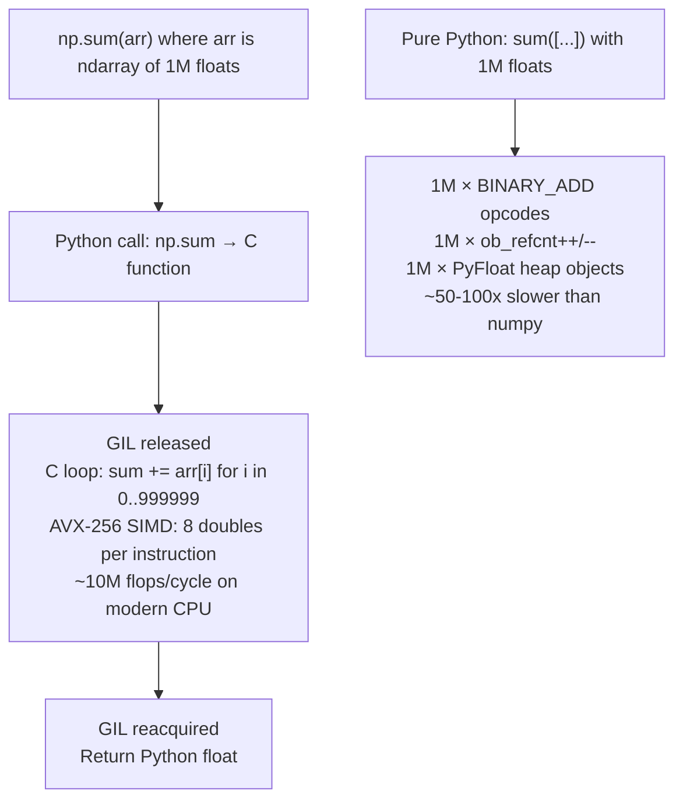
```mermaid
flowchart TD
    A["np.sum(arr) where arr is ndarray of 1M floats"] 
    A --> B["Python call: np.sum → C function"]
    B --> C["GIL released\nC loop: sum += arr[i] for i in 0..999999\nAVX-256 SIMD: 8 doubles per instruction\n~10M flops/cycle on modern CPU"]
    C --> D["GIL reacquired\nReturn Python float"]
    
    E["Pure Python: sum([...]) with 1M floats"] 
    E --> F["1M × BINARY_ADD opcodes\n1M × ob_refcnt++/--\n1M × PyFloat heap objects\n~50-100x slower than numpy"]
```

---

## Python 런타임 번호 참조

| 운영 | 시간 | 메모 |
|-----------|------|-------|
| Python 바이트코드 실행 | ~100ns/opcode | 평가 루프 반복당 |
| 함수 호출 오버헤드 | ~100-200ns | 프레임 생성 + 로컬 설정 |
| 속성 조회(dict) | ~50-100ns | LOAD_ATTR + tp_getattro |
| 메소드 호출(바운드 메소드) | ~200-300ns | __get__ + 호출 오버헤드 |
| 목록 추가 | ~50ns | 상각(용량 두 배 증가) |
| 사전 조회 | ~50-100ns | 해시 + 인덱스 + 비교 |
| GC 주기 수집(gen-0) | ~100μs | ~100개 개체 |
| GC 주기 수집(gen-2) | ~10-100ms | 수천 개의 개체 |
| 캐시된 모듈 가져오기 | ~100ns | sys.modules 사전 조회 |
| 콜드 가져오기(컴파일+실행) | 10~500ms | 최상위 코드 컴파일 + 실행 |
| 스레드 GIL 스위치 간격 | 5ms | sys.getswitchinterval() |

---

## 설계적 고민

### 구조와 모델링

#### GIL 설계 결정: CPython 단순성 vs 멀티코어 병렬성 제약

GIL(Global Interpreter Lock)은 CPython의 가장 논쟁적인 설계 결정이다. GIL은 한 번에 하나의 스레드만 파이썬 바이트코드를 실행할 수 있도록 강제한다. 이 설계의 배경과 트레이드오프를 이해하는 것이 중요하다.

**GIL이 존재하는 이유**:
1. **참조 카운팅 보호**: CPython의 메모리 관리는 참조 카운팅 기반이다. `ob_refcnt`를 원자적으로 업데이트하지 않으면 데이터 레이스가 발생한다. 객체별 락은 오버헤드가 크고 데드락 위험이 있다.
2. **C 확장 모듈 호환성**: 수만 개의 C 확장 라이브러리가 GIL이 존재한다는 가정 하에 작성되었다. GIL을 제거하면 NumPy, pandas 등 핵심 라이브러리의 대규모 수정이 필요하다.
3. **단순한 구현**: GIL 덕분에 CPython 내부 코드의 대부분이 스레드 안전성을 개별적으로 고려할 필요 없다.

**Python 3.13+ (PEP 703, free-threaded CPython)의 접근**:
- 바이어스드 참조 카운팅(biased reference counting)과 객체별 락을 도입하여 GIL 없는 CPython을 실험적으로 제공
- `--disable-gil` 플래그로 선택적 비활성화, 하위 호환성 유지

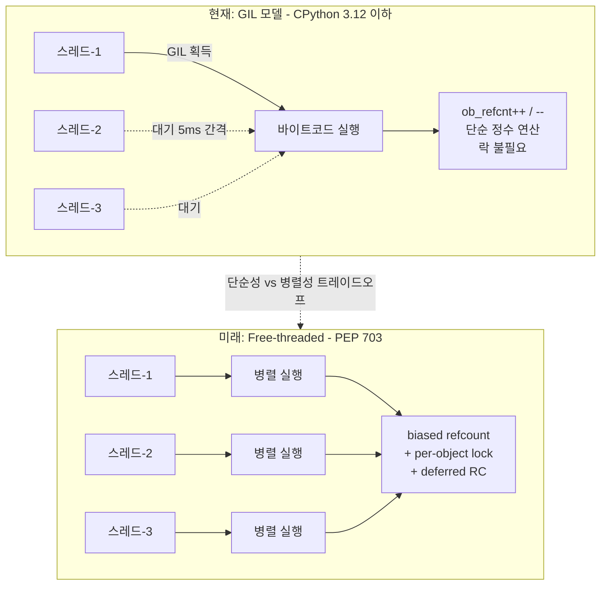
```mermaid
flowchart TD
    subgraph GIL_MODEL["현재: GIL 모델 - CPython 3.12 이하"]
        T1_G["스레드-1"] -->|"GIL 획득"| EXEC_G["바이트코드 실행"]
        T2_G["스레드-2"] -.->|"대기 5ms 간격"| EXEC_G
        T3_G["스레드-3"] -.->|"대기"| EXEC_G
        EXEC_G --> REFCNT_G["ob_refcnt++ / --\n단순 정수 연산\n락 불필요"]
    end
    
    subgraph NOGIL_MODEL["미래: Free-threaded - PEP 703"]
        T1_F["스레드-1"] --> EXEC_F1["병렬 실행"]
        T2_F["스레드-2"] --> EXEC_F2["병렬 실행"]
        T3_F["스레드-3"] --> EXEC_F3["병렬 실행"]
        EXEC_F1 --> REFCNT_F["biased refcount\n+ per-object lock\n+ deferred RC"]
        EXEC_F2 --> REFCNT_F
        EXEC_F3 --> REFCNT_F
    end
    
    GIL_MODEL -.->|"단순성 vs 병렬성 트레이드오프"| NOGIL_MODEL
```

#### 참조 카운팅 + 순환 참조 GC 병행: 왜 두 방식을 함께 쓰는가

CPython은 두 가지 GC 메커니즘을 결합한다. 이는 각 방식의 한계를 상호 보완하는 설계 결정이다.

- **참조 카운팅**: 대부분의 객체를 즉시 해제한다. 예측 가능한 메모리 해제 시점, 간단한 구현이지만 순환 참조(A->B->A)를 감지할 수 없다.
- **세대별 순환 GC**: 순환 참조를 감지하고 해제한다. 3세대(gen-0, gen-1, gen-2)로 나누어 신생 객체를 더 자주 검사한다.

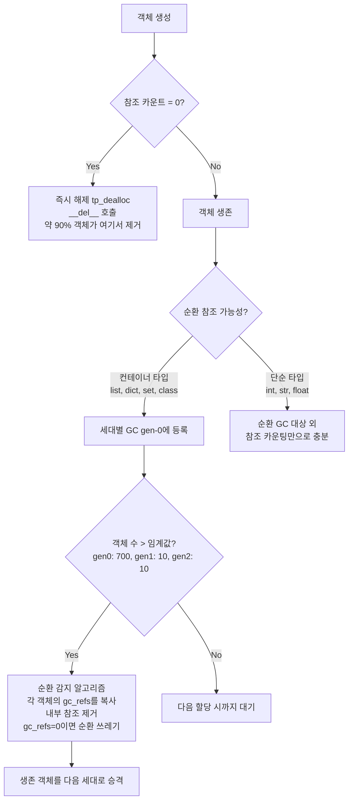
```mermaid
flowchart TD
    OBJ["객체 생성"] --> RC{"참조 카운트 = 0?"}
    RC -->|Yes| FREE["즉시 해제 tp_dealloc\n__del__ 호출\n약 90% 객체가 여기서 제거"]
    RC -->|No| ALIVE["객체 생존"]
    ALIVE --> CYCLE{"순환 참조 가능성?"}
    CYCLE -->|"컨테이너 타입\nlist, dict, set, class"| GEN0["세대별 GC gen-0에 등록"]
    CYCLE -->|"단순 타입\nint, str, float"| SKIP["순환 GC 대상 외\n참조 카운팅만으로 충분"]
    
    GEN0 --> THRESHOLD{"객체 수 > 임계값?\ngen0: 700, gen1: 10, gen2: 10"}
    THRESHOLD -->|Yes| COLLECT["순환 감지 알고리즘\n각 객체의 gc_refs를 복사\n내부 참조 제거\ngc_refs=0이면 순환 쓰레기"]
    THRESHOLD -->|No| WAIT["다음 할당 시까지 대기"]
    COLLECT --> PROMOTE["생존 객체를 다음 세대로 승격"]
```

### 트레이드오프와 의사결정

#### 동적 타이핑 vs 타입 힌트(PEP 484): 개발 속도 vs 안정성

Python의 동적 타이핑은 언어의 핵심 철학이지만, PEP 484 타입 힌트 도입으로 **선택적 정적 타입 검사**가 가능해졌다. 이는 "점진적 타이핑(gradual typing)"이라는 설계 철학을 따른다.

| 기준 | 동적 타이핑 | 타입 힌트 (mypy/pyright) |
|------|-----------|---------------------|
| 개발 속도 | 빠름 - 타입 선언 불필요 | 느림 - 사전 선언 필요 |
| 런타임 에러 | TypeError 늦은 발견 | 보통 없음 (IDE에서 사전 감지) |
| 리팩토링 안전성 | 낮음 | 높음 - 타입 변경 시 영향 추적 가능 |
| 런타임 성능 | 영향 없음 (type hint는 런타임 무시) | 영향 없음 |
| 라이브러리 호환 | 보편적 | 점진적으로 확대 중 |

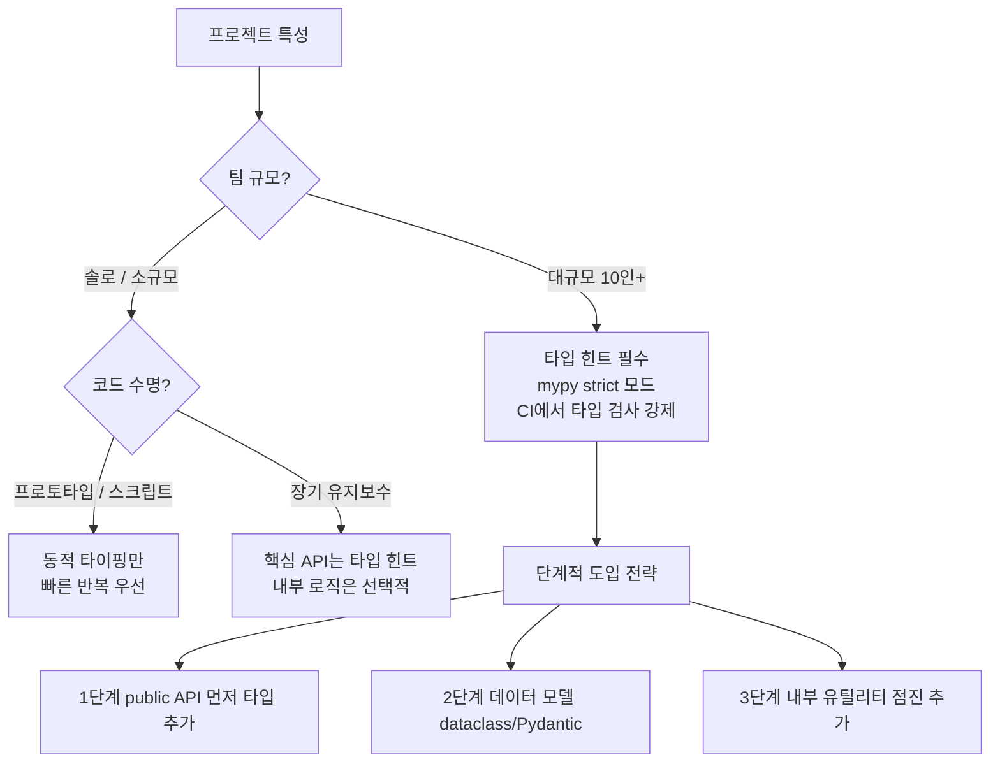
```mermaid
flowchart TD
    A["프로젝트 특성"] --> B{"팀 규모?"}
    B -->|"솔로 / 소규모"| C{"코드 수명?"}
    B -->|"대규모 10인+"| D["타입 힌트 필수\nmypy strict 모드\nCI에서 타입 검사 강제"]
    
    C -->|"프로토타입 / 스크립트"| E["동적 타이핑만\n빠른 반복 우선"]
    C -->|"장기 유지보수"| F["핵심 API는 타입 힌트\n내부 로직은 선택적"]
    
    D --> G["단계적 도입 전략"]
    G --> G1["1단계 public API 먼저 타입 추가"]
    G --> G2["2단계 데이터 모델 dataclass/Pydantic"]
    G --> G3["3단계 내부 유틸리티 점진 추가"]
```

#### 제너레이터 vs asyncio 코루틴: 지연 계산 vs 비동기 I/O 설계 분리

Python은 제너레이터(generator)와 asyncio 코루틴을 모두 `yield` 기반으로 구현하지만, **설계 목적이 근본적으로 다르다**.

- **제너레이터**: 지연 계산(lazy evaluation). 값을 필요한 시점에만 생성하여 메모리를 절약한다. ETL 파이프라인, 대용량 데이터 스트림 처리에 적합하다.
- **asyncio 코루틴**: 비동기 I/O 멀티플렉싱. 이벤트 루프가 I/O 대기 중인 코루틴을 일시정지하고 다른 코루틴을 실행한다. 웹서버, DB 연결 풀링 등 I/O 다중화에 적합하다.

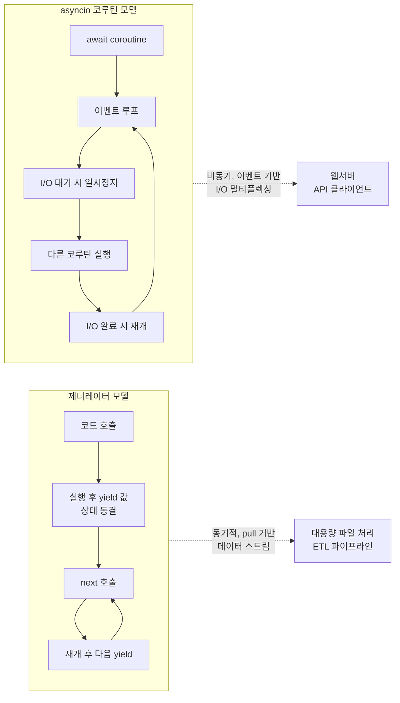
```mermaid
flowchart LR
    subgraph GENERATOR["제너레이터 모델"]
        G_CALL["코드 호출"] --> G_YIELD["실행 후 yield 값\n상태 동결"]
        G_YIELD --> G_NEXT["next 호출"]
        G_NEXT --> G_RESUME["재개 후 다음 yield"]
        G_RESUME --> G_NEXT
    end
    
    subgraph ASYNCIO["asyncio 코루틴 모델"]
        A_CALL["await coroutine"] --> A_LOOP["이벤트 루프"]
        A_LOOP --> A_IO["I/O 대기 시 일시정지"]
        A_IO --> A_SWITCH["다른 코루틴 실행"]
        A_SWITCH --> A_READY["I/O 완료 시 재개"]
        A_READY --> A_LOOP
    end
    
    GENERATOR -.->|"동기적, pull 기반\n데이터 스트림"| USE_G["대용량 파일 처리\nETL 파이프라인"]
    ASYNCIO -.->|"비동기, 이벤트 기반\nI/O 멀티플렉싱"| USE_A["웹서버\nAPI 클라이언트"]
```

### 리팩토링과 설계 원칙

#### 덕 타이핑 vs Protocol(PEP 544): 구조적 타이핑의 설계 가치

Python의 덕 타이핑("걷는 것이 오리처럼 보이고, 소리가 오리처럼 들리면 그것은 오리다")은 런타임에서 메서드 존재 여부만 확인한다. PEP 544의 `Protocol`은 이를 **정적 타입 검사 수준으로 격상**시킨다.

**설계 원칙**: ABC(Abstract Base Class)를 상속하는 명목적 타이핑(nominal typing) 대신, `Protocol`을 사용하면 외부 라이브러리의 타입도 상속 없이 호환될 수 있다. 이는 Go의 인터페이스와 유사한 철학이다.

```python
# Protocol 사용 예시
from typing import Protocol

class Readable(Protocol):
    def read(self, n: int = -1) -> bytes: ...

def process_data(source: Readable) -> None:
    data = source.read()
    # ... 처리

# 어떤 클래스든 read() 메서드만 있으면 Readable로 취급
# 상속 불필요 -> 구조적 타이핑
```

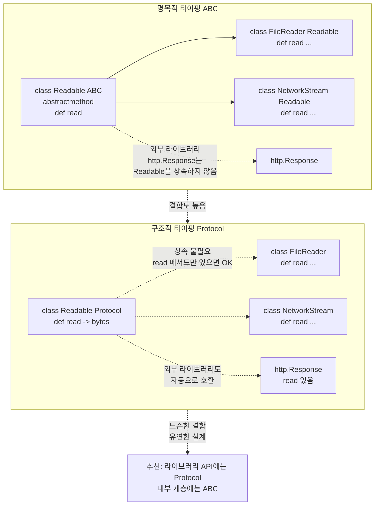
```mermaid
flowchart TD
    subgraph NOMINAL["명목적 타이핑 ABC"]
        ABC_DEF["class Readable ABC\n    abstractmethod\n    def read"] --> IMPL1["class FileReader Readable\n    def read ..."]
        ABC_DEF --> IMPL2["class NetworkStream Readable\n    def read ..."]
        ABC_DEF -.->|"외부 라이브러리\nhttp.Response는\nReadable을 상속하지 않음"| EXT["http.Response"]
    end
    
    subgraph STRUCTURAL["구조적 타이핑 Protocol"]
        PROTO_DEF["class Readable Protocol\n    def read -> bytes"] -.->|"상속 불필요\nread 메서드만 있으면 OK"| IMPL3["class FileReader\n    def read ..."]
        PROTO_DEF -.-> IMPL4["class NetworkStream\n    def read ..."]
        PROTO_DEF -.->|"외부 라이브러리도\n자동으로 호환"| EXT2["http.Response\nread 있음"]
    end
    
    NOMINAL -.->|"결합도 높음"| STRUCTURAL
    STRUCTURAL -.->|"느슨한 결합\n유연한 설계"| RESULT["추천: 라이브러리 API에는 Protocol\n내부 계층에는 ABC"]
```

### 디자인 패턴 적용

#### CPython 내부 설계에서 발견되는 패턴들

Python의 내부 동작 방식에는 다양한 디자인 패턴이 녹아 있다. 이를 이해하면 Python의 동작 원리를 더 깊이 파악할 수 있다.

- **전략 패턴(Strategy)**: 임포트 시스템의 finder/loader 체인. `sys.meta_path`에 등록된 여러 찾기(finder) 전략을 순차적으로 시도하여 모듈을 찾는다.
- **싱글턴 패턴(Singleton)**: `None`, `True`, `False`는 CPython에서 단일 인스턴스로 관리된다. 작은 정수(-5~256)도 미리 캐싱된 싱글턴이다.
- **이터레이터 패턴(Iterator)**: Python의 `for` 루프는 `__iter__()` -> `__next__()` 프로토콜을 따른다. 모든 이터러블이 동일한 인터페이스를 공유한다.
- **디스크립터 패턴(Descriptor)**: `property`, `classmethod`, `staticmethod`는 모두 디스크립터 프로토콜(`__get__`, `__set__`, `__delete__`)로 구현된다. Python OOP의 핵심 메커니즘이다.
- **체인 오브 리스폰시빌리티(Chain of Responsibility)**: 예외 처리의 `try/except` 체인. 콜 스택을 따라 올라가며 처리자를 찾는다.
- **템플릿 메서드 패턴(Template Method)**: `collections.abc`의 이터러블 클래스들. `__getitem__`만 구현하면 `__iter__`, `__contains__` 등이 자동 제공된다.

```mermaid
classDiagram
    class ImportFinder {
        <<interface>>
        +find_module(name, path) Loader
    }
    
    class BuiltinImporter {
        +find_module(name, path) Loader
        -is_builtin(name) bool
    }
    
    class FrozenImporter {
        +find_module(name, path) Loader
        -is_frozen(name) bool
    }
    
    class PathFinder {
        +find_module(name, path) Loader
        -search_sys_path() Module
        -check_path_cache() Module
    }
    
    class ImportSystem {
        -finders: List~ImportFinder~
        +import_module(name) Module
    }
    
    ImportFinder <|.. BuiltinImporter
    ImportFinder <|.. FrozenImporter
    ImportFinder <|.. PathFinder
    ImportSystem --> ImportFinder: sys.meta_path 순서대로 시도\n전략 + CoR 패턴 결합


## 연습 문제

### 1. 시스템 구조와 모델링

**문제 1-1.** 멀티스레드 Python 프로그램에서 두 스레드가 동시에 같은 리스트에 `append()` 연산을 수행하고 있다. 데이터 불일치가 발생하지 않았다면, 이는 GIL(Global Interpreter Lock)이 보호해준 결과다. GIL이 리스트의 내부 상태를 보호하는 메커니즘을 CPython의 바이트코드 실행 단위와 연결하여 설명하라. 그리고 I/O 대기 중에는 GIL이 해제되는데, 이때 리스트 접근이 발생하면 어떤 상황이 벌어지는가?

<details><summary>힌트 보기</summary>

CPython에서 GIL은 바이트코드 명령어 단위(기본 5ms 간격, `sys.getswitchinterval()`)로 스레드 간에 회전한다. `list.append()`는 단일 바이트코드 명령어(`LIST_APPEND`)로 실행되므로 GIL에 의해 원자적으로 보호된다. 그러나 `a += b` 같은 복합 연산은 여러 바이트코드로 분해되어 GIL 해제 시점에 따라 레이스 컨디션이 발생할 수 있다. I/O 대기 중 GIL 해제는 C 레벨에서 `Py_BEGIN_ALLOW_THREADS`/`Py_END_ALLOW_THREADS` 매크로로 수행되며, 이 구간에서는 Python 객체에 접근하면 안 된다.

</details>

**문제 1-2.** `asyncio` 이벤트 루프 기반 웹 스크래퍼에서 `await aiohttp.get(url)` 호출 시 내부적으로 어떤 일이 발생하는지 전체 흐름을 설명하라. 코루틴이 `await`을 만나 일시 정지되는 시점부터, 이벤트 루프가 다른 코루틴을 스케줄링하고, 소켓 응답이 도착하여 원래 코루틴이 재개되는 과정을 `Future`, `Task`, `Selector` 개념을 사용하여 기술하라.

<details><summary>힌트 보기</summary>

`await`은 코루틴을 일시 정지시키고 `Future` 객체를 이벤트 루프에 반환한다. 이벤트 루프는 `selectors` 모듈(내부적으로 epoll/kqueue)로 소켓 파일 디스크립터를 모니터링한다. 소켓이 읽기 가능 상태가 되면 이벤트 루프가 해당 `Future`의 콜백을 트리거하고, `Task`(`Future`의 서브클래스)가 코루틴의 `send()` 메서드를 호출하여 `await` 이후 지점부터 실행을 재개한다. 전체 과정이 단일 스레드에서 협력적 멀티태스킹(cooperative multitasking)으로 동작한다.

</details>

**문제 1-3.** CPython의 메모리 관리는 참조 카운팅(reference counting)과 순환 참조 수집기(cycle collector)의 이중 체계로 구성된다. `sys.getrefcount()` 호출 시 예상보다 1이 더 높은 값이 반환되는 이유를 설명하고, 순환 참조 수집기가 세대(generation 0/1/2) 기반으로 동작하는 과정을 수집 트리거 조건과 함께 설명하라.

<details><summary>힌트 보기</summary>

`sys.getrefcount(obj)`는 `obj`를 인자로 전달할 때 임시 참조가 1 증가하므로 항상 +1된 값이 반환된다. 순환 참조 수집기는 `gc` 모듈로 제어되며, 세대별로 임계값(`gc.get_threshold()` 기본 (700, 10, 10))을 초과하면 수집이 트리거된다. 0세대는 최근 할당 객체, 2세대는 오래 살아남은 객체다. 수집기는 컨테이너 객체(list, dict, tuple 등)만 추적하며, `tp_traverse`로 참조 그래프를 순회하여 도달 불가능한 순환 그룹을 제거한다.

</details>

### 2. 트레이드오프와 의사결정

**문제 2-1.** 10,000장의 고해상도 이미지에 리사이징 필터를 적용하는 CPU 집약 작업을 수행해야 한다. `threading`, `multiprocessing`, `concurrent.futures.ProcessPoolExecutor` 세 가지 접근법 중 어떤 것을 선택하겠는가? GIL이 각 접근법에 미치는 영향을 분석하고, 메모리 복사 비용과 프로세스 생성 오버헤드를 고려한 최적 전략을 제시하라.

<details><summary>힌트 보기</summary>

`threading`은 GIL에 의해 CPU 집약 작업에서 실제 병렬 처리가 불가능하다. `multiprocessing`은 프로세스별 독립 GIL로 진정한 병렬이 가능하지만, 각 프로세스에 이미지 데이터를 전달할 때 pickle 직렬화/역직렬화 비용이 크다. `ProcessPoolExecutor`는 `multiprocessing`의 고수준 래퍼로 풀 관리를 자동화한다. 최적 전략: 공유 메모리(`multiprocessing.shared_memory`)로 이미지 데이터를 전달하거나, NumPy 배열을 `fork` 후 COW(Copy-on-Write)로 공유하는 방법을 사용한다.

</details>

**문제 2-2.** 10만 줄 규모의 Python 백엔드 프로젝트에 타입 힌트와 mypy를 도입하려고 한다. 팀원 5명이 6개월간 점진적으로 적용하는 계획이다. 도입에 따른 리팩토링 비용(특히 동적 타이핑, `*args`/`**kwargs` 남용, 덕타이핑 패턴)과 장기 유지보수 이점(IDE 자동완성, 맰타임 버그 사전 방지)을 비교하라. 점진적 도입 전략은 어떻게 수립해야 하는가?

<details><summary>힌트 보기</summary>

점진적 도입 전략: (1) `mypy --strict` 대신 `--disallow-untyped-defs`만 새 코드에 적용, (2) 핵심 도메인 모듈부터 타이핑 시작, (3) `py.typed` 마커 파일로 패키지별 도입 범위 명시. 비용 측면에서는 `**kwargs`를 많이 쓰는 코드는 `TypedDict`나 `Protocol`로 변환해야 하고, 덕타이핑은 `Protocol` 클래스로 명시해야 한다. `MonkeyType`나 `pytype` 같은 자동 타입 추론 도구로 초기 마이그레이션 비용을 줄일 수 있다. 장기적으로는 런타임 TypeError가 50% 이상 감소하는 효과가 보고된다.

</details>

**문제 2-3.** 데이터 분석 파이프라인에서 Pandas DataFrame을 사용하여 5GB CSV 파일을 처리하고 있다. 메모리가 16GB인 서버에서 `pd.read_csv()`로 전체 파일을 로드하면 OOM이 발생한다. Pandas의 내부 메모리 모델(NumPy 배열 기반)과 Python 객체 오버헤드를 고려할 때, 실제 메모리 사용량이 파일 크기의 몇 배에 달하는지 설명하고, `chunksize`, `dtype` 지정, Polars, Dask 등 대안을 비교하라.

<details><summary>힌트 보기</summary>

Pandas DataFrame은 각 컬럼을 NumPy 배열로 저장하지만, 문자열 컬럼은 Python 객체(`object` dtype)로 저장되어 원본 크기의 2~10배 메모리를 사용한다. 해결책: (1) `dtype={"콜럼": "category"}`로 카디널리티 낮은 문자열 압축, (2) `chunksize=100000`으로 청크 단위 처리, (3) Polars는 Apache Arrow 기반으로 제로카피 직렬화와 레이지 스캠 지원으로 메모리 효율이 훨씬 높다, (4) Dask는 분산 처리로 싱글 머신 메모리를 초과하는 데이터도 처리 가능하다.

</details>

### 3. 문제 해결 및 리팩토링

**문제 3-1.** 다음 코드는 데이터베이스에서 100만 건의 레코드를 읽어 처리하는 코드이다:
```python
results = [transform(row) for row in db.fetch_all()]  # 100만 건 전체 로드
for item in results:
    process(item)
```
이 코드가 16GB 메모리 서버에서 `MemoryError`를 발생시켰다. 리스트 컴프리헨션 대신 `yield` 기반 제너레이터로 전환하면 메모리 사용 패턴이 어떻게 달라지는지 설명하고, `itertools.islice()`, `itertools.chain()` 등과 조합한 실전적 리팩토링 방법을 제시하라.

<details><summary>힌트 보기</summary>

리스트 컴프리헨션은 **전체 결과를 메모리에 한 번에 적재**한다. 100만 객체 자체 + 각 객체의 필드 + 리스트 내부 배열 오버헤드로 수 GB가 필요하다. 제너레이터는 `yield`로 한 번에 하나씩만 메모리에 유지하므로 O(1) 메모리로 처리할 수 있다. 리팩토링: `def fetch_gen(): for row in db.fetch_cursor(): yield transform(row)` 후 `for item in fetch_gen(): process(item)`. DB커서의 `fetchmany(size=1000)` 또는 서버 사이드 커서를 사용하면 DB 측 메모리도 보호할 수 있다.

</details>

**문제 3-2.** 다음 코드에서 메모리 누수가 발생하고 있다:
```python
class Node:
    def __init__(self, parent=None):
        self.parent = parent
        self.children = []
        if parent:
            parent.children.append(self)
    def __del__(self):
        print(f"Node deleted")
```
`Node` 객체들이 부모-자식 관계로 순환 참조를 형성하고 있어 `__del__`이 호출되지 않는다. CPython의 순환 참조 수집기가 `__del__`이 정의된 객체를 처리하는 방식(Python 3.4 전후 차이)을 설명하고, `weakref` 또는 컨텍스트 매니저로 해결하는 방법을 제시하라.

<details><summary>힌트 보기</summary>

Python 3.4 이전에는 `__del__`이 정의된 순환 참조 그룹은 **수집 불가능**(`gc.garbage`에 저장)이었다. PEP 442(Python 3.4)부터는 finalizer가 있어도 안전하게 수집하지만, 파괴 순서가 보장되지 않아 예측 불가능한 동작이 발생할 수 있다. 해결책: (1) `weakref.ref(parent)`로 부모 참조를 약한 참조로 변경하면 순환 참조가 끊긴다, (2) `weakref.finalize()`로 `__del__` 대신 클리너 콜백을 등록한다, (3) 컨텍스트 매니저 패턴으로 리소스 수명을 명시적으로 관리한다.

</details>

**문제 3-3.** Django 웹 애플리케이션에서 특정 API 엔드포인트의 응답 시간이 점점 느려지고 있다. 프로파일링 결과, `import` 문이 있는 함수가 처음 호출될 때마다 200ms의 지연이 발생하며, 이후 호출에서는 빠르다. Python의 `import` 시스템 내부 동작(`sys.modules` 캐싱, 모듈 검색 경로, `.pyc` 컴파일)을 기반으로 이 현상의 원인을 분석하고, 지연 임포트(lazy import) 패턴이 어떻게 도움이 될 수 있는지 설명하라.

<details><summary>힌트 보기</summary>

Python의 `import`는 모듈 코드를 실행(전역 스코프 코드 실행)하고 `sys.modules`에 캐싱한다. 처음 임포트 시에만 실행되고, 이후는 캐시에서 바로 반환된다. 함수 내부에 `import heavy_module`이 있으면 첫 호출에 모듈 초기화 비용이 발생한다. `.pyc` 파일이 없으면 컴파일 비용도 추가된다. 해결책: (1) 모듈 톱레벨에서 임포트하여 애플리케이션 시작 시 초기화, (2) PEP 690(지연 임포트, Python 3.12+ 실험적)을 활용, (3) `importlib.import_module()`로 제어된 시점에 로드.

</details>

### 4. 개념 간의 연결성

**문제 4-1.** 동기 Django ORM 기반 웹 애플리케이션을 `asyncio` + `aiohttp` + `asyncpg` 비동기 스택으로 마이그레이션하려 한다. Django ORM은 내부적으로 `psycopg2`(동기 드라이버)를 사용하며, 이벤트 루프 내에서 동기 호출을 하면 전체 루프가 블로킹된다. Django 4.1+의 `async` 뷰와 `sync_to_async` 래퍼의 내부 동작을 설명하고, 완전한 비동기 전환 시 어떤 구성 요소를 교체해야 하는지 전체 아키텍처를 설계하라.

<details><summary>힌트 보기</summary>

`sync_to_async`는 내부적으로 별도 스레드 풀(`asyncio.get_event_loop().run_in_executor()`)에서 동기 코드를 실행하여 이벤트 루프 블로킹을 방지한다. 그러나 이는 스레드 풀 크기에 의해 동시성이 제한된다. 완전 비동기 전환: (1) ORM → `asyncpg` + 직접 SQL 또는 SQLAlchemy 2.0 async, (2) 템플릿 렌더링 → `aiohttp.jinja2` 또는 API 전용으로 전환, (3) 미들웨어 → ASGI 호환 미들웨어로 교체, (4) 캐싱 → `aioredis`로 교체. ASGI 서버(uvicorn/daphne) 배포 필요.

</details>

**문제 4-2.** 피보나치 수열의 n번째 값을 계산하는 네 가지 구현이 있다: (A) 재귀 함수, (B) `@functools.lru_cache` 데코레이터를 적용한 재귀 함수, (C) 제너레이터(`yield`), (D) 반복문. 각 방식의 시간 복잡도와 메모리 사용 패턴(call stack 깊이, 캐시 메모리, 제너레이터 상태 크기)을 비교 분석하라. `lru_cache`의 `maxsize`가 너무 작으면 어떤 현상이 발생하는가?

<details><summary>힌트 보기</summary>

(A) 재귀: O(2^n) 시간, O(n) 스택. (B) `lru_cache` 재귀: O(n) 시간, O(n) 캐시 메모리 + O(n) 스택. `maxsize`가 n보다 작으면 캐시 축출(eviction)이 발생하여 O(2^n)으로 퇴행한다. (C) 제너레이터: O(n) 시간, O(1) 메모리(현재값과 이전값만 유지), 단 특정 인덱스 접근에는 O(n) 순회 필요. (D) 반복문: O(n) 시간, O(1) 메모리, 가장 효율적. `lru_cache`는 내부적으로 이중 연결 리스트 + 딕셔너리로 LRU를 구현하며, `cache_info()`로 hit/miss 비율을 모니터링할 수 있다.

</details>

**문제 4-3.** 마이크로서비스 아키텍처에서 외부 API 10개를 동시에 호출하고 결과를 집계해야 한다. 각 API 응답 시간은 100ms~2s로 다양하다. `asyncio.gather()` vs `asyncio.as_completed()` vs `asyncio.TaskGroup`(Python 3.11+)의 세 가지 접근법을 비교하라. 특히 하나의 API가 예외를 발생시켰을 때 각 방식이 나머지 작업을 어떻게 처리하는지 설명하라.

<details><summary>힌트 보기</summary>

`gather(*coros, return_exceptions=False)`: 모든 코루틴이 완료될 때까지 대기하며, 하나가 예외를 발생시키면 나머지는 자동 취소되지 않고 계속 실행된다(`return_exceptions=True`로 예외를 결과로 받을 수 있음). `as_completed()`: 완료 순서대로 처리할 수 있어 빠른 응답을 먼저 활용 가능하지만, 예외 처리는 개별적으로 해야 한다. `TaskGroup`(Python 3.11+): 구조화된 동시성을 제공하며, 하나가 예외를 발생시키면 **모든 태스크를 취소**한 후 `ExceptionGroup`을 발생시킨다. 이는 자원 누수를 방지하는 가장 안전한 접근이다.

</details>