# 보안 내부 요소: 암호화, 인증 및 공격 메커니즘

> 내부 정보: TLS 핸드셰이크가 키를 협상하는 방법, 해시 기능이 급증하는 방법, 버퍼 오버플로가 손상된 제어 흐름을 수행하는 방법, OAuth 토큰이 ID를 증명하는 방법(정확한 메모리 레이아웃, 상태 시스템 및 보안 메커니즘 뒤에 있는 수학적 연산).

## 문서 범위와 검증 계약

- **범위**: 방어자가 암호 프로토콜과 취약점의 원리를 이해하기 위한 학습 자료입니다. 공격 예시는 승인된 로컬 실습 환경에서만 사용하며 실제 시스템의 우회·침해 절차를 제공하지 않습니다.
- **전제**: TLS, OAuth/OIDC, 인증서, 암호 기본 요소는 알고리즘 이름만으로 안전해지지 않습니다. 프로토콜 버전, 암호 스위트, nonce·키 수명, 클라이언트 유형, 신뢰 경계와 라이브러리 설정을 명시해야 합니다.
- **근거 상태**: 표준 속성은 해당 RFC·NIST 표준·알고리즘 명세로 확인하고, 구현 완화책은 대상 OS·CPU·브라우저·라이브러리 버전에서 확인합니다. 처리량·지연·공격 비용 수치는 하드웨어와 파라미터가 없는 한 예시일 뿐입니다.
- **실패/재시도**: 인증·서명·태그 검증 실패는 기본 거부하고 민감한 평문·토큰·키를 로그에 남기지 않습니다. 네트워크 재시도는 멱등성·nonce 재사용·0-RTT replay 위험을 검토한 뒤 제한된 횟수와 백오프로 수행합니다.
- **완료 증거**: 설계 검토에는 위협 모델, 자산·행위자·신뢰 경계, 선택한 표준/버전, 키·토큰 수명, 실패 상태와 복구 경로를 남깁니다. 테스트는 정상 경로뿐 아니라 변조·만료·재생·키 회전·부분 장애가 기대대로 거부되는 로그와 결과를 포함해야 완료입니다.

---

## 1. 대칭 암호화: AES 내부 메커니즘

AES(Advanced Encryption Standard)는 10/12/14 라운드(128/192/256비트 키의 경우)를 통해 4×4바이트 **상태 매트릭스**에서 작동합니다.

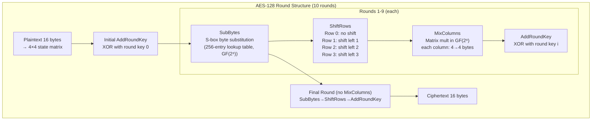

### 하위 바이트: S-Box를 GF(2⁸) 곱셈 역원으로

S-box는 임의적이지 않습니다. 각 바이트 `b`은 `b⁻¹ mod (x⁸+x⁴+x³+x+1)`(GF(2⁸)의 곱셈 역수)에 매핑된 다음 아핀 변환이 적용됩니다. 이는 다음을 제공합니다:
- **비선형성**: 단순 선형 관계를 깨고 알려진 선형·차분 분석에 대한 안전성 설계에 기여합니다. 이것만으로 모든 공격을 차단하는 것은 아닙니다.
- **확산**: 입력 비트 변화가 여러 출력 비트로 퍼지도록 설계되었습니다. “약 50%”는 많은 표본에서 관찰하는 통계적 기대이지 개별 입력의 보장이 아닙니다.

### AES-GCM: 인증된 암호화

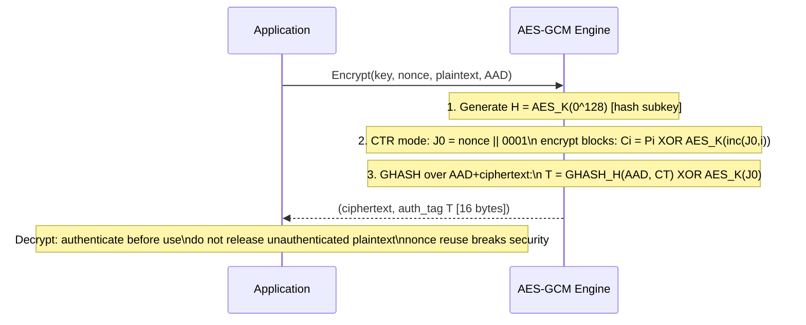

---

## 2. 공개 키 암호화: RSA 및 ECDH 내부

### RSA 키 생성 및 운영

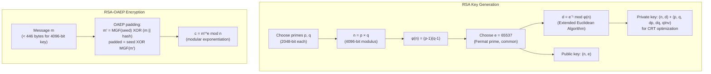

### ECDH 키 교환(Curve25519)

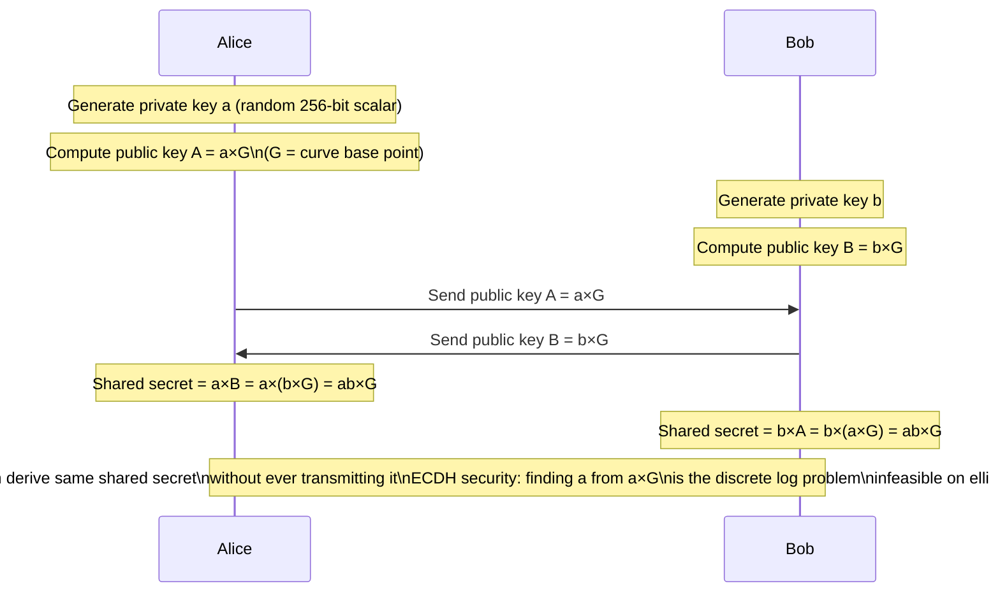

**Curve25519/X25519의 설계 특성**: 몽고메리 형태와 래더는 비밀값에 따른 분기를 줄인 구현을 만들기 쉽게 하고, 입력 처리 특성도 명확히 정의합니다. 그러나 알고리즘 선택만으로 상수 시간이나 “타이밍 채널 없음”이 보장되지는 않습니다. 실제 라이브러리의 필드 연산, 컴파일러, CPU와 키 검증을 함께 점검해야 합니다.

---

## 3. TLS 1.3 핸드셰이크: 모든 바이트 설명

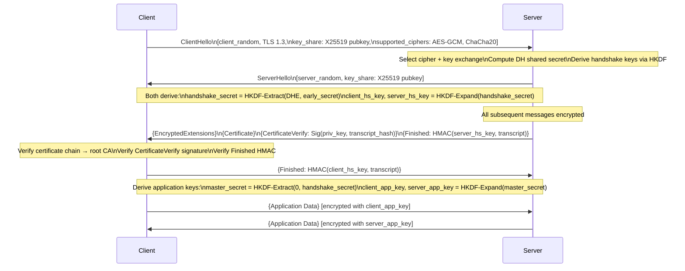

### HKDF 키 파생

TLS 1.3은 HKDF(HMAC 기반 추출 및 확장 KDF)를 사용합니다.
```
HKDF-Extract(salt, IKM) = HMAC-SHA256(salt, IKM) → PRK (pseudorandom key)
HKDF-Expand(PRK, info, L) = T(1) || T(2) || ... where T(i) = HMAC-SHA256(PRK, T(i-1)||info||i)
```

**순방향 비밀성**: TLS 1.3 연결에서 (EC)DHE가 협상되고 임시 비밀이 안전하게 폐기되면, 장기 인증 키가 나중에 유출되어도 기록된 과거 세션을 그 키만으로 복호화하기 어렵습니다. PSK-only 모드, 재개 설정, 엔드포인트 침해와 세션 키 보관은 별도 위협이므로 모든 TLS 1.3 연결이 자동으로 같은 속성을 갖는다고 가정하지 않습니다.

---

## 4. 해시 함수: SHA-256 내부

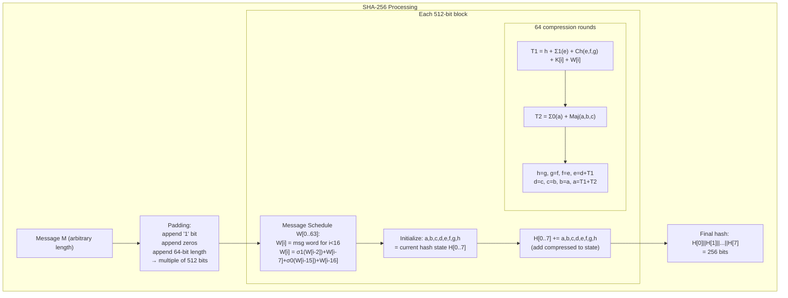

**Σ 및 σ 함수는 비트 회전 + XOR을 사용합니다**:
- `Σ0(a) = ROTR²(a) XOR ROTR¹³(a) XOR ROTR²²(a)`
- `Ch(e,f,g) = (e AND f) XOR (NOT_e AND g)` — "선택" 기능
- `Maj(a,b,c) = (a AND b) XOR (a AND c) XOR (b AND c)` — "다수" 함수

이 구조는 입력 변화가 출력 전체로 확산되도록 설계되었습니다. 무작위 함수 모델에서 기대하는 절반가량의 변화는 통계적 성질이며 특정 메시지 쌍마다 정확히 성립하는 규칙은 아닙니다.

---

## 5. 비밀번호 해싱: 왜 bcrypt/Argon2와 SHA-256을 비교해야 할까요?

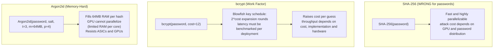

### Argon2 메모리 액세스 패턴

Argon2는 1KiB 블록으로 구성된 메모리 영역을 채우며 이전 블록 의존성을 사용해 시간-메모리 절충의 비용을 높입니다. `parallelism`에 따른 lane 병렬성은 존재하고 공격자도 제한된 절충을 시도할 수 있으므로 “병렬화 불가능”이 아니라 배포 환경에서 허용 가능한 메모리·시간 비용을 벤치마크해 선택하는 것이 핵심입니다.

---

## 6. 버퍼 오버플로: 스택 스매싱 내부

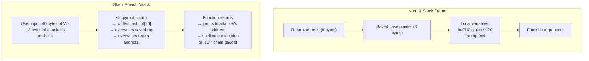

### 오버플로 중 스택 레이아웃

```
[High address]
  0x7fff1000: return address = 0x401234 (main+0x30)
  0x7ffe_fff8: saved RBP = 0x7fff2000
  0x7ffe_fff0: i = 0
  0x7ffe_ffe0: buf[0..15] = "AAAA..."
[Low address]
                         ↑
                    strcpy writes upward
After overflow:
  return address = 0x41414141 (AAAA — attacker controlled)
```

### 최신 완화 방법 및 우회 방법

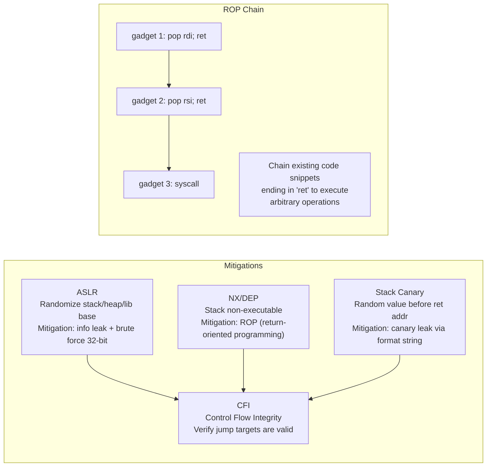

---

## 7. OAuth 2.0 / OIDC: 토큰 흐름 내부

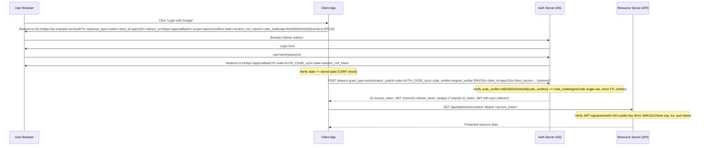

이 흐름의 JWT 형식과 15분/7일 수명은 예시입니다. Access Token은 opaque일 수도 있고 사용자 인증 사실은 OIDC ID Token과 인증 세션 맥락에서 판단합니다. 클라이언트는 `state`, PKCE, OIDC `nonce`와 redirect URI를 검증하고, Resource Server는 토큰 형식에 맞춰 서명 또는 introspection과 `iss`, `aud`, `exp`, 권한 범위를 확인해야 합니다.

### JWT 구조 및 서명 확인

```
Header: {"alg":"RS256","typ":"JWT","kid":"key-id-123"}
        → base64url encoded

Payload: {"sub":"user123","iss":"https://auth.example.com",
          "aud":"app123","exp":1709999999,"iat":1709996399,
          "scope":"openid profile"}
         → base64url encoded

Signature: RS256_sign(private_key, header.payload)
          = RSA-PKCS1v15-SHA256(private_key, base64(header)+"."+base64(payload))
          → base64url encoded

Final: header.payload.signature (3 parts separated by 2 dots)
```

---

## 8. SQL 주입: 구문 분석 트리 조작

```mermaid
flowchart TD
    subgraph "Vulnerable Code"
        CODE["query = 'SELECT * FROM users WHERE name=\'' + user_input + '\''"]
        LEGIT["user_input = 'alice'\n→ WHERE name='alice' ✓"]
        ATTACK["user_input = \"' OR '1'='1\"\n→ WHERE name='' OR '1'='1'\n→ returns ALL rows!"]
        CODE --> LEGIT
        CODE --> ATTACK
    end
    subgraph "Parameterized Query (Safe)"
        PARAM["query = 'SELECT * FROM users WHERE name=?'\nparams = [user_input]"]
        PARSE["DB parses SQL structure ONCE\nbefore substituting value"]
        SAFE["user_input = \"' OR '1'='1\"\n→ treated as literal string\n→ WHERE name = \"\\' OR \\'1\\'=\\'1\\'\"\n→ no rows returned ✓"]
        PARAM --> PARSE --> SAFE
    end
```

핵심은 드라이버의 바인딩 API로 SQL 구조와 값을 분리하는 것입니다. 서버 측 준비, 클라이언트 측 바인딩과 캐시 방식은 DB/드라이버마다 다르지만 올바른 값 파라미터는 SQL 구문으로 다시 해석되지 않습니다. 테이블명·정렬 방향 같은 식별자와 구문 조각은 보통 바인딩할 수 없으므로 허용 목록으로 선택해야 합니다.

---

## 9. 인증서 체인 검증

```mermaid
flowchart TD
    subgraph "Certificate Chain"
        LEAF["Leaf Cert: *.example.com\nPublic Key: EC P-256\nIssuer: DigiCert TLS RSA\nSignature: RSA by DigiCert TLS RSA key"]
        INT["Intermediate CA: DigiCert TLS RSA\nPublic Key: RSA 2048\nIssuer: DigiCert Global Root CA\nSignature: RSA by Root CA key"]
        ROOT["Root CA: DigiCert Global Root CA\nPublic Key: RSA 2048\nIssuer: self-signed\nTrusted: pre-installed in OS/browser"]

        LEAF --> INT --> ROOT
    end
    subgraph "Verification Steps"
        V1["1. Verify leaf cert signature\n   using intermediate CA's public key"]
        V2["2. Verify intermediate cert signature\n   using root CA's public key"]
        V3["3. Verify root cert in trusted store\n   (OS certificate bundle)"]
        V4["4. Check hostname: CN/SAN matches\n   *.example.com → valid for www.example.com"]
        V5["5. Check validity period\n   notBefore < now < notAfter"]
        V6["6. Check revocation:\n   OCSP staple or CRL download"]
        V1 --> V2 --> V3 --> V4 --> V5 --> V6
    end
```

**인증서 투명성(CT)**: 주요 브라우저의 공개 신뢰 정책은 대상 인증서에 유효한 **서명된 인증서 타임스탬프(SCT)**를 요구할 수 있습니다. 적용 시점과 로그 수는 브라우저·CA 정책에 따라 다르며 사설 PKI까지 “모든 TLS 인증서”에 동일하게 적용되지는 않습니다. CT는 오발급 탐지를 돕지만 자동 차단·철회나 완전한 은폐 방지를 단독으로 보장하지 않습니다.

---

## 10. 메모리 안전: Use-After-Free 공격

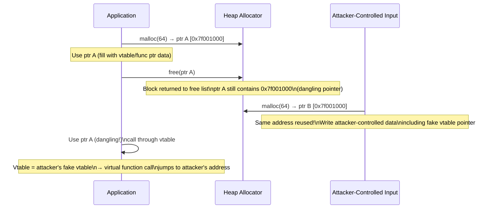

**완화**:
- **메모리 안전 언어**: safe Rust의 소유권 검사는 여러 dangling-reference 경로를 막지만 `unsafe`, FFI와 논리적 수명 오류는 별도 검토가 필요합니다.
- **AddressSanitizer**: 레드 존·섀도우 메모리로 실행된 경로의 여러 use-after-free를 탐지합니다. 오버헤드와 탐지 범위는 빌드·워크로드에 따라 측정합니다.
- **할당자 강화**: 격리(quarantine), 메타데이터 보호, 주소 다양화 같은 기능은 구현별 보조 완화책이며 UAF 자체를 제거하지 않습니다.
- **CFI**: 예상 클래스 계층 구조에 대해 vtable 호출 대상을 검증합니다.

---

## 11. 사이드 채널 공격: 타이밍 및 캐시

### Spectre(캐시 타이밍 사이드 채널)

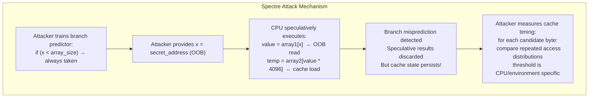

**완화의 범위**: 적절히 배치된 직렬화 명령, 인덱스 마스킹과 컴파일러 완화는 특정 추측 실행 경로를 막을 수 있습니다. `retpoline`은 주로 일부 간접 분기 표적 주입 계열을 다루며 모든 Spectre 변종이나 CPU에 대한 완전한 방어가 아닙니다. CPU 마이크로코드와 컴파일러·OS 지침을 함께 적용하고 성능 영향을 측정해야 합니다.

---

## 12. 영지식 증명: 공개하지 않고 증명하기

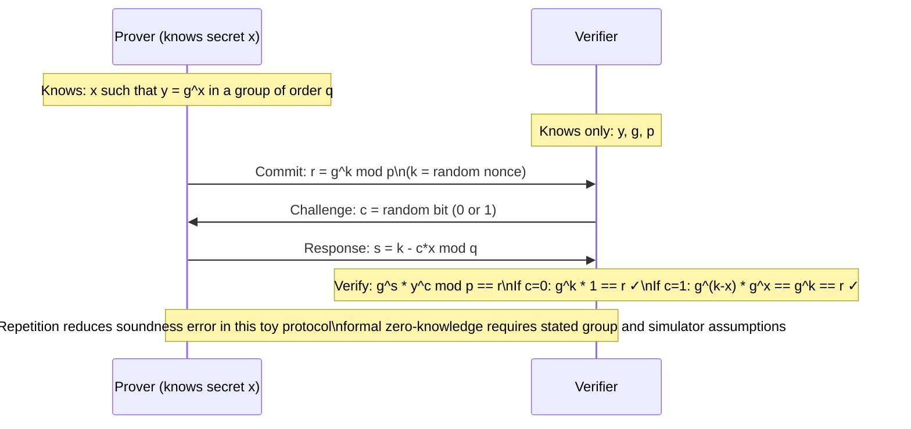

**zk-SNARK 계열**: 증명자는 관계 `C(x, w) = 1`을 만족하는 증인 `w`를 안다는 증명을 만듭니다. 증명 크기, 검증 시간, trusted setup과 양자 내성은 증명 시스템에 따라 다릅니다. 일부 시스템은 회로 크기에 대해 succinct하지만 검증 비용은 공개 입력과 곡선 연산 등에 의존하므로 보편적인 O(1)·수백 바이트로 단정하지 않습니다.

---

## 13. 키 교환 요약: 모든 HTTPS 연결에서 실제로 일어나는 일

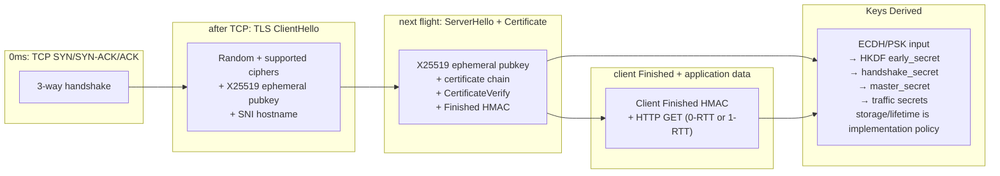

---

## 보안 속성 상호 참조

| 위협 | 메커니즘 | 국방 |
|---|---|---|
| 무차별 비밀번호 | 빠른 해시(SHA-256) | 메모리 하드 해시(Argon2id) |
| MITM 차단 | 인증 없음 | TLS 인증서 체인 확인 |
| 교통 재생 | 캡처된 토큰 재사용 | 토큰의 Nonce/타임스탬프, 짧은 TTL |
| 버퍼 오버플로 | 경계 없는 strcpy | 경계 검사 API, ASLR+NX+Canary |
| SQL 주입 | 문자열 연결 | 매개변수화된 쿼리 |
| 사용 후 무료 | C/C++ 수동 메모리 | Rust 빌림 검사기, ASan |
| 캐시 타이밍(Spectre) | 투기적 실행 | LFENCE, 리트폴린, 사이트 격리 |
| CSRF | 교차 출처 상태 변경 요청 | SameSite 쿠키, CSRF 토큰 |
| XSS | 정리되지 않은 HTML 출력 | 콘텐츠 보안 정책, 출력 인코딩 |
| 다운그레이드 공격 | TLS 버전 협상 | TLS_FALLBACK_SCSV, HSTS 사전 로드 |


---

## 설계적 고민

### 구조와 모델링

보안 시스템 설계에서 가장 근본적인 구조적 질문은 **"어디에 신뢰 경계를 설정할 것인가"**입니다. 전통적 경계 보안(perimeter security)은 내부 네트워크를 신뢰하고 외부만 차단하지만, 제로 트러스트 모델은 모든 요청을 검증 대상으로 봅니다.

**대칭키 vs 비대칭키 구조 선택**은 보안 시스템의 기초 설계를 결정합니다. 대칭 암호는 일반적으로 벌크 데이터 처리에 유리하고 공개키 기법은 인증·키 합의에 유리하지만 실제 배수는 알고리즘·하드웨어·메시지 크기에 따라 달라집니다. 모든 참여자가 서로 다른 pairwise 대칭키를 직접 관리할 때는 키 관계가 O(N²)까지 늘 수 있지만 KMS나 계층형 키 관리에서는 다른 구조가 가능합니다. TLS는 키 합의/인증과 대칭 AEAD를 조합합니다.

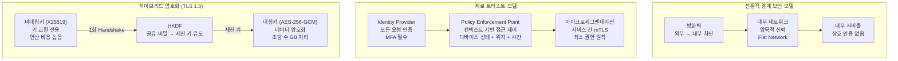

제로 트러스트에서 **Policy Decision Point(PDP)**와 **Policy Enforcement Point(PEP)**를 분리하면 정책 평가와 집행 책임을 명확히 할 수 있습니다. 다만 정책 변경은 허용/거부 결과와 지연에 직접 영향을 줄 수 있고, PDP 장애·캐시 만료·정책 배포 불일치에 대한 fail-open/fail-closed 상태와 복구 절차가 필요합니다.

### 트레이드오프와 의사결정

보안 설계에서 가장 빈번한 트레이드오프는 **JWT vs 세션 토큰** 선택입니다. JWT는 서버 측 상태가 불필요하여 수평 확장에 유리하지만, 발급 후 즉시 무효화가 어렵습니다. 세션 토큰은 서버에서 즉시 삭제 가능하지만, 세션 저장소(Redis 등)에 대한 의존성이 생깁니다.

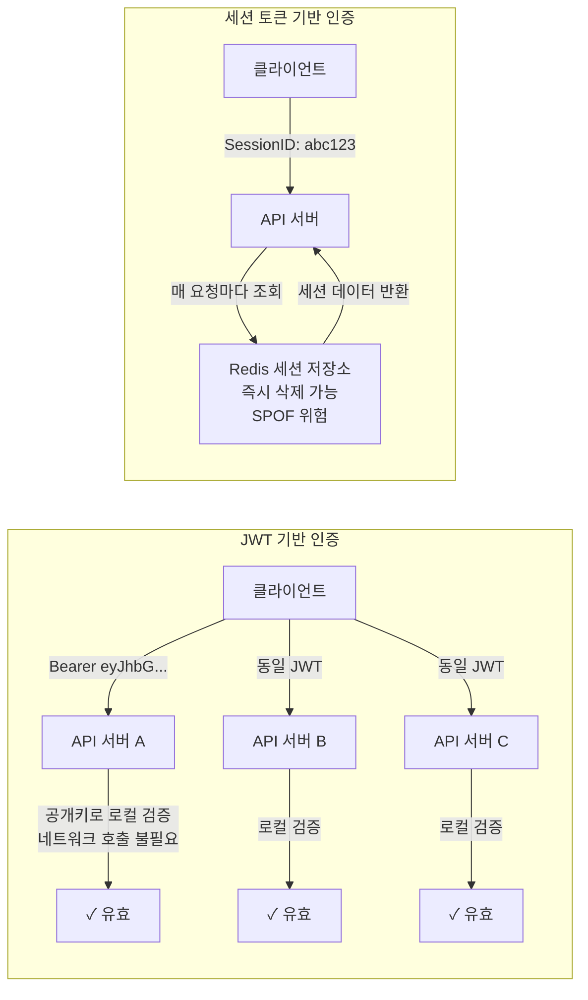

**OAuth 2.0 플로우 선택**도 중요한 의사결정입니다. Authorization Code + PKCE는 현재 가장 권장되는 방식으로, SPA와 모바일 앱 모두에서 안전합니다. Implicit Flow는 토큰이 URL fragment에 노출되어 더 이상 권장되지 않습니다. Client Credentials는 서비스 간 통신에만 적합합니다.

| 플로우 | 사용 시나리오 | 보안 수준 | Refresh Token |
|---|---|---|---|
| Authorization Code + PKCE | SPA, 모바일, 서버 앱 | 높음 | 지원 |
| Client Credentials | 서비스 간 (M2M) | 높음 | 불필요 |
| Device Authorization | IoT, CLI | 중간 | 지원 |
| Implicit (deprecated) | 레거시 SPA | 낮음 | 미지원 |

### 리팩토링과 설계 원칙

보안 아키텍처에서 **심층 방어(Defense in Depth)** 원칙은 단일 보안 레이어 실패가 전체 시스템 침해로 이어지지 않도록 다층 방어를 구축하는 것입니다. 각 레이어는 독립적으로 동작하며, 하나가 뚫려도 다음 레이어가 공격을 차단합니다.

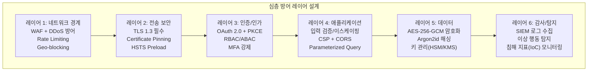

리팩토링 관점에서 보안 코드의 핵심 원칙은 **"보안 로직을 비즈니스 로직에서 분리"**하는 것입니다. 인증/인가는 미들웨어 또는 게이트웨이 레이어에서 처리하고, 개별 서비스는 이미 검증된 컨텍스트만 받아야 합니다. 이를 통해 보안 정책 변경 시 개별 서비스 코드 수정 없이 중앙에서 일괄 적용할 수 있습니다.

**최소 권한 원칙(Principle of Least Privilege)**은 리팩토링 시 항상 점검해야 할 사항입니다. 서비스 계정, API 키, IAM 역할 모두 필요한 최소한의 권한만 부여해야 합니다. 과도한 권한은 침해 발생 시 폭발 반경(blast radius)을 키웁니다.

### 디자인 패턴 적용

보안 시스템에서 자주 사용되는 디자인 패턴은 **Gateway Pattern**, **Token Relay Pattern**, **Circuit Breaker**(인증 서버 장애 대응) 등입니다.

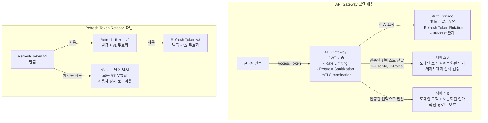

**Secure by Default 패턴**은 시스템의 기본 상태가 가장 안전한 설정이어야 한다는 원칙입니다. 새로운 API 엔드포인트는 기본적으로 인증 필수이며, 공개가 필요한 경우 명시적으로 `@Public` 어노테이션을 추가해야 합니다. CORS는 기본 차단이며, 허용 도메인을 화이트리스트로 관리합니다.

**감사 로그 패턴(Audit Trail Pattern)**도 보안 설계의 핵심입니다. 위험 기반으로 정한 인증/인가 이벤트, 민감 데이터 접근과 설정 변경을 최소 필요 정보로 기록하고 접근 제어·보존·시간 동기화를 적용합니다. 해시 체인은 사후 변조 탐지에 도움을 주지만 키 보호와 외부 체크포인트 없이 무결성을 단독 보장하지 않으며, 로그를 남겼다는 사실만으로 특정 컴플라이언스를 충족하지도 않습니다.

## 연습 문제

### 1. 시스템 구조와 모델링

**문제 1-1.** 모바일 뱅킹 앱이 OAuth 2.0 Authorization Code + PKCE 흐름을 사용하여 사용자의 계좌 정보에 접근하려 합니다. 앱이 Authorization Server에 인가 코드를 요청하고, 이를 Access Token으로 교환한 뒤, Resource Server에서 데이터를 가져오는 전체 흐름을 그려보세요. 이때 PKCE의 `code_verifier`와 `code_challenge`가 각 단계에서 어떤 역할을 하며, PKCE가 없을 경우 모바일 환경에서 어떤 공격이 가능한지 설명하세요.

<details><summary>힌트 보기</summary>

모바일 앱은 클라이언트 시크릿을 안전하게 저장할 수 없으므로, 인가 코드 가로채기(Authorization Code Interception) 공격에 취약합니다. PKCE는 앱이 생성한 `code_verifier`의 해시(`code_challenge`)를 인가 요청에 포함시키고, 토큰 교환 시 원본 `code_verifier`를 제출하여 인가 코드를 가로챈 공격자가 토큰을 획득하지 못하도록 합니다. `S256` 변환 방식과 `plain` 방식의 보안 차이도 고려해 보세요.

</details>

**문제 1-2.** 사용자가 브라우저에서 `https://bank.com`에 접속할 때, PKI(Public Key Infrastructure) 기반 인증서 체인 검증이 수행됩니다. 브라우저가 서버 인증서를 받은 후 Root CA까지 체인을 검증하고, OCSP로 인증서 폐지 여부를 확인하며, 최종적으로 세션 키를 교환하는 전체 흐름을 단계별로 설명하세요. 만약 중간 CA(Intermediate CA)의 인증서가 만료되었다면 어떤 단계에서 연결이 실패하는지도 함께 분석하세요.

<details><summary>힌트 보기</summary>

인증서 체인 검증은 서버 인증서 → 중간 CA 인증서 → Root CA 인증서 순서로 각 인증서의 서명을 상위 CA의 공개키로 검증합니다. OCSP(Online Certificate Status Protocol)는 인증서가 폐지(revoke)되지 않았는지 실시간으로 확인하며, OCSP Stapling은 서버가 OCSP 응답을 미리 가져와 TLS 핸드셰이크에 포함시켜 지연을 줄입니다. 중간 CA 만료 시 체인의 신뢰 앵커(Trust Anchor)까지 도달할 수 없어 `ERR_CERT_AUTHORITY_INVALID` 에러가 발생합니다.

</details>

**문제 1-3.** TLS 1.3 핸드셰이크에서 클라이언트와 서버가 세션 키를 협상하는 과정을 TLS 1.2와 비교하여 설명하세요. TLS 1.3이 핸드셰이크 왕복 횟수를 줄인 방법(1-RTT, 0-RTT)과, 0-RTT 재개(resumption)가 갖는 보안 위험(replay attack)은 무엇인지 분석하세요.

<details><summary>힌트 보기</summary>

일반적인 전체 핸드셰이크에서 TLS 1.3은 TLS 1.2보다 왕복을 줄일 수 있지만 재개, HelloRetryRequest, 네트워크와 인증 설정에 따라 흐름이 달라집니다. 0-RTT는 이전 세션의 PSK로 조기 데이터를 보내므로 프로토콜 자체가 전역 유일 실행을 보장하지 않습니다. 상태 변경 요청은 기본 거부하고, 허용할 경우 애플리케이션 멱등성 키·replay 방어 범위와 실패 응답을 명시합니다.

</details>

### 2. 트레이드오프와 의사결정

**문제 2-1.** 마이크로서비스 아키텍처에서 인증 토큰 방식을 선택해야 합니다. JWT(JSON Web Token)는 무상태(stateless)이므로 수평 확장에 유리하지만, 한 번 발급하면 만료 전까지 서버 측에서 즉시 무효화할 수 없습니다. 반면 서버 세션 토큰(opaque token)은 중앙 세션 스토어가 필요합니다. 다음 시나리오에서 각각 어떤 방식이 더 적합한지 근거와 함께 설명하세요: (1) 금융 앱에서 즉시 로그아웃 기능이 필수인 경우, (2) 글로벌 CDN 엣지에서 API 인가를 수행해야 하는 경우.

<details><summary>힌트 보기</summary>

JWT의 즉시 무효화 문제를 해결하는 방법으로 짧은 만료 시간 + Refresh Token 조합, 토큰 블랙리스트(Redis), Token Introspection 엔드포인트가 있습니다. 각 방법은 무상태성을 일부 포기하는 트레이드오프가 있습니다. CDN 엣지에서는 중앙 세션 스토어 접근 지연이 치명적이므로 JWT의 자체 검증(self-contained verification)이 유리하지만, 토큰 크기가 쿠키 제한에 영향을 줄 수 있습니다.

</details>

**문제 2-2.** 새로운 서비스의 TLS 인증서에 사용할 암호화 알고리즘을 선택해야 합니다. RSA-2048, RSA-4096, ECDSA P-256 중에서 선택해야 할 때, 보안 강도(비트 수준의 안전성), 서명 생성/검증 속도, 인증서 및 핸드셰이크 크기의 관점에서 각 알고리즘의 트레이드오프를 분석하세요. IoT 디바이스(제한된 컴퓨팅 자원)와 고성능 웹 서버 각각에 어떤 선택이 적합한지 판단하세요.

<details><summary>힌트 보기</summary>

ECDSA P-256은 RSA-3072과 동등한 보안 강도(128비트)를 제공하면서 키 크기가 훨씬 작습니다(256비트 vs 3072비트). 서명 생성은 ECDSA가 빠르지만, 서명 검증은 RSA가 빠릅니다(공개키 지수 e가 작으므로). 인증서 크기 차이는 대역폭이 제한된 IoT 환경에서 중요하며, TLS 핸드셰이크 패킷 수에도 영향을 줍니다.

</details>

**문제 2-3.** API 게이트웨이에서 인증/인가 처리를 중앙화할지, 각 마이크로서비스가 독립적으로 수행할지 결정해야 합니다. 보안 정책 일관성, 단일 장애점(SPOF), 서비스 자율성, 성능(추가 네트워크 홉) 관점에서 두 접근법의 트레이드오프를 분석하고, 하이브리드 전략(게이트웨이에서 인증, 서비스에서 세분화된 인가)의 장점을 설명하세요.

<details><summary>힌트 보기</summary>

게이트웨이 중앙화는 보안 정책 일관성과 관리 편의성이 높지만, 모든 트래픽이 게이트웨이를 거치므로 병목이 될 수 있습니다. 서비스별 독립 처리는 각 서비스가 도메인 특화 인가 로직을 유연하게 구현할 수 있지만, 보안 라이브러리 버전 불일치 등 일관성 문제가 발생합니다. 하이브리드 접근에서 게이트웨이는 JWT 검증과 기본 인증을 담당하고, 서비스는 JWT 클레임에 기반한 세분화된 RBAC/ABAC를 수행합니다.

</details>

### 3. 문제 해결 및 리팩토링

**문제 3-1.** 다음 코드에는 SQL Injection 취약점이 있습니다:

```java
String query = "SELECT * FROM users WHERE id = " + userId;
Statement stmt = connection.createStatement();
ResultSet rs = stmt.executeQuery(query);
```

이 코드를 Prepared Statement로 리팩토링하세요. 또한, ORM(예: JPA/Hibernate)을 사용하더라도 `@Query(nativeQuery = true)` 어노테이션으로 Raw Query를 작성할 때 여전히 SQL Injection에 취약한 이유를 설명하고, 안전한 대안을 제시하세요.

<details><summary>힌트 보기</summary>

Prepared Statement는 쿼리 구조와 데이터를 분리하여 `?` 바인딩 파라미터로 값을 전달합니다. ORM의 JPQL/HQL도 문자열 연결 방식(`"WHERE name = '" + input + "'"`)으로 작성하면 HQL Injection에 취약합니다. 안전한 방법은 `@Param` 바인딩, Criteria API, QueryDSL 등 파라미터화된 쿼리 빌더를 사용하는 것입니다. 동적 테이블명/컬럼명은 바인딩할 수 없으므로 화이트리스트 검증이 필요합니다.

</details>

**문제 3-2.** 웹 애플리케이션의 세션 쿠키가 다음과 같이 설정되어 있습니다:

```http
Set-Cookie: sessionId=abc123; Path=/
```

`Secure`, `HttpOnly`, `SameSite` 플래그가 모두 누락된 상태입니다. 각 플래그의 부재가 어떤 공격(XSS, CSRF, 중간자 공격)에 노출되는지 설명하고, 올바른 쿠키 설정으로 리팩토링하세요. `SameSite=Strict`와 `SameSite=Lax`의 차이도 비교하세요.

<details><summary>힌트 보기</summary>

`HttpOnly`가 없으면 JavaScript(`document.cookie`)로 쿠키 탈취가 가능하여 XSS 공격에 취약합니다. `Secure`가 없으면 HTTP 평문 전송으로 중간자 공격에 노출됩니다. `SameSite`가 없으면 외부 사이트에서의 크로스사이트 요청에 쿠키가 포함되어 CSRF에 취약합니다. `SameSite=Strict`는 모든 크로스사이트 요청에서 쿠키를 차단하지만, 외부 링크로 접근 시 로그인이 풀리는 UX 문제가 있어 `Lax`가 더 일반적입니다.

</details>

**문제 3-3.** 레거시 시스템에서 비밀번호가 `SHA-256(password)` 해시로 저장되어 있습니다. Salt도 적용되어 있지 않습니다. 이 시스템이 레인보우 테이블 공격에 취약한 이유를 설명하고, bcrypt 또는 Argon2로 마이그레이션하는 전략을 설계하세요. 기존 사용자의 비밀번호를 모르는 상태에서 점진적으로 마이그레이션하는 방법도 포함하세요.

<details><summary>힌트 보기</summary>

Salt가 없는 해시는 동일 비밀번호가 동일 해시값을 가지므로, 미리 계산된 레인보우 테이블로 역방향 조회가 가능합니다. 점진적 마이그레이션 전략: (1) 기존 해시를 bcrypt로 감싸기(`bcrypt(SHA-256(password))`), (2) 사용자 로그인 시 평문 비밀번호를 받아 새 bcrypt 해시로 교체, (3) DB에 `hash_version` 컬럼을 추가하여 마이그레이션 완료 여부를 추적합니다. Argon2는 메모리 하드니스(memory-hard)로 GPU 병렬 공격에 더 강력합니다.

</details>

### 4. 개념 간의 연결성

**문제 4-1.** 마이크로서비스 환경에서 제로 트러스트 아키텍처를 구현하려 합니다. 기존의 네트워크 경계 기반 보안(VPN + 방화벽)이 충분하지 않은 이유를 설명하고, mTLS(상호 TLS)와 SPIFFE/SPIRE를 사용하여 서비스 간 인증을 "네트워크 위치"가 아닌 "서비스 ID"로 전환하는 구체적인 구현 방식을 설명하세요. SPIFFE ID(`spiffe://trust-domain/workload-id`)가 X.509 인증서의 SAN(Subject Alternative Name)에 어떻게 인코딩되는지도 함께 설명하세요.

<details><summary>힌트 보기</summary>

제로 트러스트는 네트워크 내부도 신뢰하지 않는 원칙입니다. mTLS는 클라이언트와 서버 양쪽 모두 인증서를 제시하여 상호 인증합니다. SPIFFE는 워크로드에 고유 ID를 부여하는 표준이며, SPIRE는 SPIFFE ID가 포함된 X.509-SVID(SPIFFE Verifiable Identity Document)를 자동으로 발급/갱신합니다. 서비스 메시(Istio/Envoy)의 사이드카가 mTLS를 투명하게 처리하므로 애플리케이션 코드 변경이 최소화됩니다.

</details>

**문제 4-2.** 비밀번호 저장 시스템을 설계하면서 bcrypt와 Argon2의 내부 동작을 비교하려 합니다. 단순 SHA-256 해시가 레인보우 테이블 공격에 취약한 이유, Salt의 역할, 그리고 adaptive hashing(비용 인자를 조절하여 해시 계산 시간을 의도적으로 늘리는 설계)이 GPU 기반 무차별 대입 공격에 대응하는 원리를 연결하여 설명하세요. Argon2가 bcrypt보다 메모리 하드니스 측면에서 우수한 이유도 분석하세요.

<details><summary>힌트 보기</summary>

SHA-256은 빠른 해시 함수이므로 GPU로 초당 수십억 개의 해시를 계산할 수 있습니다. bcrypt는 Blowfish 키 스케줄링의 비용 인자(cost factor)를 조절하여 의도적으로 느리게 만들지만, 메모리 사용량이 고정(4KB)이어서 FPGA/ASIC 공격에 제한적입니다. Argon2는 메모리 비용(memory_cost), 시간 비용(time_cost), 병렬도(parallelism)를 독립적으로 조절할 수 있어, 대량의 메모리를 요구함으로써 GPU 병렬 공격의 경제성을 떨어뜨립니다.

</details>

**문제 4-3.** HTTPS 통신에서 대칭키 암호와 공개키 기반 인증·키 합의가 함께 사용되는 이유를 설명하세요. TLS 1.2의 정적 RSA 키 교환과 (EC)DHE, TLS 1.3의 (EC)DHE/PSK 모드를 구분하고, 협상된 트래픽 키로 AES-GCM 또는 ChaCha20-Poly1305를 사용하는 설계 근거를 분석하세요. 순방향 비밀성을 얻기 위한 모드와 키 폐기 전제도 설명하세요.

<details><summary>힌트 보기</summary>

RSA는 암호화/서명 기법이고 ECDHE는 키 합의이므로 같은 범주로 묶지 않습니다. TLS는 인증·키 합의로 공유 비밀을 만들고 KDF로 트래픽 키를 유도한 뒤 효율적인 AEAD로 데이터를 보호합니다. 성능 차이는 대상 알고리즘과 하드웨어에서 측정합니다. 임시 DHE/ECDHE와 비밀 폐기는 장기 인증키 유출에 대한 순방향 비밀성을 제공하지만 엔드포인트나 세션 키 자체가 침해된 경우까지 막지는 않습니다. 정적 RSA 키 교환은 TLS 1.3 암호 스위트에서 제거되었습니다.

</details>
