# 소프트웨어 엔지니어링 내부: 내부

> 소스 합성: 디자인 패턴 내부, 동시성 모델, 테스트 프레임워크, 빌드 시스템 및 소프트웨어 아키텍처 메커니즘을 다루는 소프트웨어 엔지니어링 참고서(comp 13, 15, 17, 67–68, 69, 76, 79, 105, 293, 323, 329, 331, 334–335, 337).

---

## 1. 디자인 패턴 - 내부 메커니즘

### 관찰자 패턴 - 이벤트 디스패치 내부

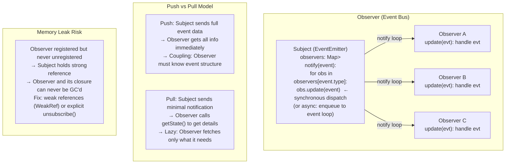
```mermaid
flowchart TD
    subgraph "Observer (Event Bus)"
        Subject["Subject (EventEmitter)\nobservers: Map<eventType, List<Observer>>\nnotify(event):\n  for obs in observers[event.type]:\n    obs.update(event)  ← synchronous dispatch\n(or async: enqueue to event loop)"]
        O1["Observer A\nupdate(evt): handle evt"]
        O2["Observer B\nupdate(evt): handle evt"]
        O3["Observer C\nupdate(evt): handle evt"]
        Subject -->|"notify loop"| O1 & O2 & O3
    end

    subgraph "Push vs Pull Model"
        Push["Push: Subject sends full event data\n→ Observer gets all info immediately\n→ Coupling: Observer must know event structure"]
        Pull["Pull: Subject sends minimal notification\n→ Observer calls getState() to get details\n→ Lazy: Observer fetches only what it needs"]
    end

    subgraph "Memory Leak Risk"
        Leak["Observer registered but never unregistered\n→ Subject holds strong reference\n→ Observer and its closure can never be GC'd\nFix: weak references (WeakRef) or explicit unsubscribe()"]
    end
```

### 전략 패턴 - 파견 메커니즘

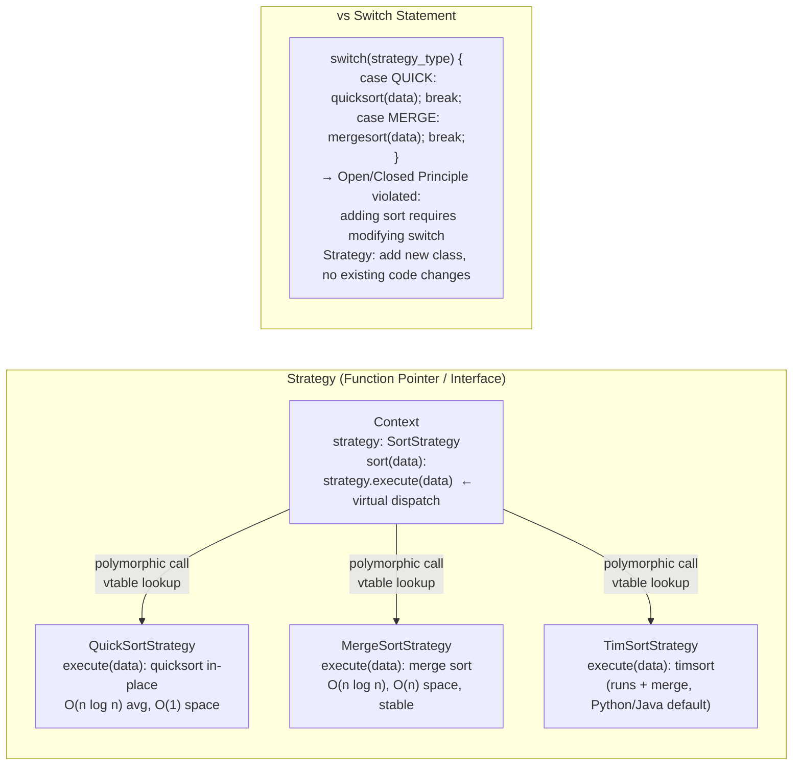
```mermaid
flowchart LR
    subgraph "Strategy (Function Pointer / Interface)"
        Context["Context\nstrategy: SortStrategy\nsort(data):\n  strategy.execute(data)  ← virtual dispatch"]
        S1["QuickSortStrategy\nexecute(data): quicksort in-place\nO(n log n) avg, O(1) space"]
        S2["MergeSortStrategy\nexecute(data): merge sort\nO(n log n), O(n) space, stable"]
        S3["TimSortStrategy\nexecute(data): timsort\n(runs + merge, Python/Java default)"]
        Context -->|"polymorphic call\nvtable lookup"| S1 & S2 & S3
    end

    subgraph "vs Switch Statement"
        Switch["switch(strategy_type) {\n  case QUICK: quicksort(data); break;\n  case MERGE: mergesort(data); break;\n}\n→ Open/Closed Principle violated:\n  adding sort requires modifying switch\nStrategy: add new class, no existing code changes"]
    end
```

---

## 2. 종속성 주입 — 내부 연결

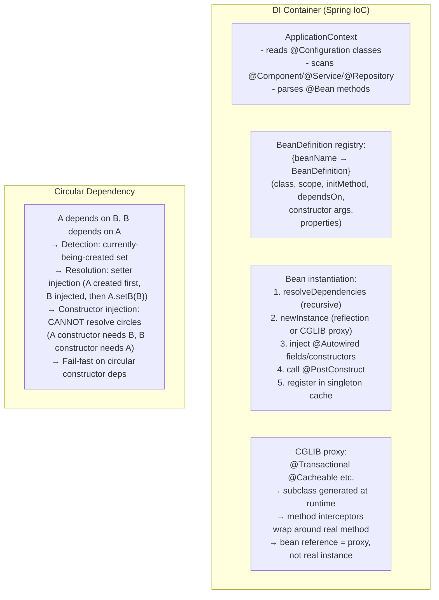
```mermaid
flowchart TD
    subgraph "DI Container (Spring IoC)"
        Config["ApplicationContext\n- reads @Configuration classes\n- scans @Component/@Service/@Repository\n- parses @Bean methods"]
        BeanDef["BeanDefinition registry:\n{beanName → BeanDefinition}\n(class, scope, initMethod, dependsOn,\n constructor args, properties)"]
        Instantiate["Bean instantiation:\n1. resolveDependencies (recursive)\n2. newInstance (reflection or CGLIB proxy)\n3. inject @Autowired fields/constructors\n4. call @PostConstruct\n5. register in singleton cache"]
        Proxy["CGLIB proxy:\n@Transactional @Cacheable etc.\n→ subclass generated at runtime\n→ method interceptors wrap around real method\n→ bean reference = proxy, not real instance"]
    end

    subgraph "Circular Dependency"
        Circ["A depends on B, B depends on A\n→ Detection: currently-being-created set\n→ Resolution: setter injection (A created first,\n  B injected, then A.setB(B))\n→ Constructor injection: CANNOT resolve circles\n  (A constructor needs B, B constructor needs A)\n→ Fail-fast on circular constructor deps"]
    end
```

---

## 3. 동시성 모델 - 스레드 내부

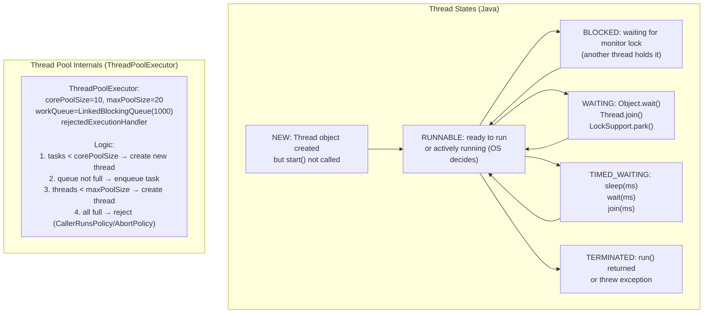
```mermaid
flowchart TD
    subgraph "Thread States (Java)"
        NEW["NEW: Thread object created\nbut start() not called"]
        RUNNABLE["RUNNABLE: ready to run\nor actively running (OS decides)"]
        BLOCKED["BLOCKED: waiting for monitor lock\n(another thread holds it)"]
        WAITING["WAITING: Object.wait()\nThread.join()\nLockSupport.park()"]
        TIMED_WAITING["TIMED_WAITING: sleep(ms)\nwait(ms)\njoin(ms)"]
        TERMINATED["TERMINATED: run() returned\nor threw exception"]
    end
    NEW --> RUNNABLE
    RUNNABLE --> BLOCKED & WAITING & TIMED_WAITING
    BLOCKED & WAITING & TIMED_WAITING --> RUNNABLE
    RUNNABLE --> TERMINATED

    subgraph "Thread Pool Internals (ThreadPoolExecutor)"
        TPE["ThreadPoolExecutor:\ncorePoolSize=10, maxPoolSize=20\nworkQueue=LinkedBlockingQueue(1000)\nrejectedExecutionHandler\n\nLogic:\n1. tasks < corePoolSize → create new thread\n2. queue not full → enqueue task\n3. threads < maxPoolSize → create thread\n4. all full → reject (CallerRunsPolicy/AbortPolicy)"]
    end
```

### Java 메모리 모델 - 발생 전

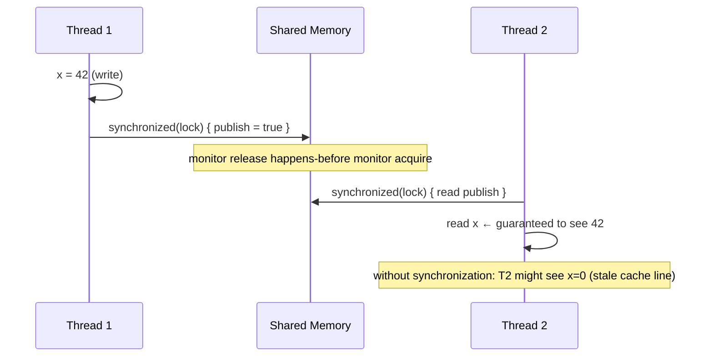
```mermaid
sequenceDiagram
    participant T1 as Thread 1
    participant Mem as Shared Memory
    participant T2 as Thread 2

    T1->>T1: x = 42 (write)
    T1->>Mem: synchronized(lock) { publish = true }
    Note over Mem: monitor release happens-before monitor acquire
    T2->>Mem: synchronized(lock) { read publish }
    T2->>T2: read x  ← guaranteed to see 42
    Note over T2: without synchronization: T2 might see x=0 (stale cache line)
```

---

## 4. 테스트 주도 개발 — 테스트 실행 내부

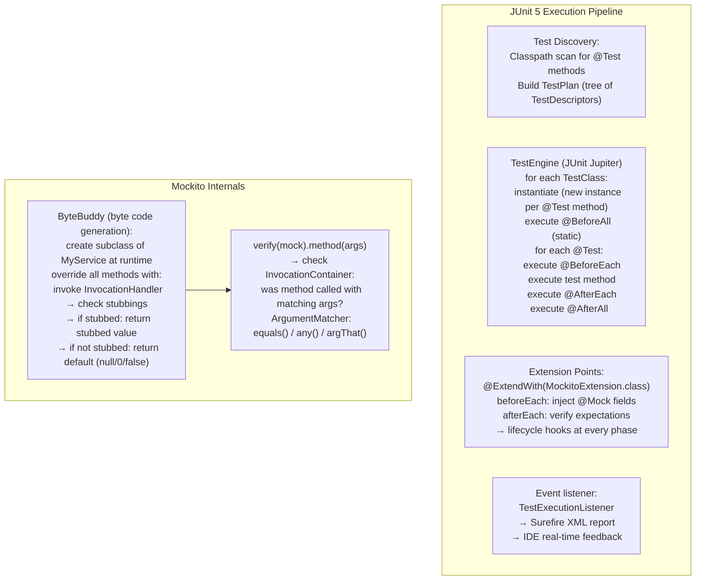
```mermaid
flowchart TD
    subgraph "JUnit 5 Execution Pipeline"
        Discovery["Test Discovery:\nClasspath scan for @Test methods\nBuild TestPlan (tree of TestDescriptors)"]
        Engine["TestEngine (JUnit Jupiter)\nfor each TestClass:\n  instantiate (new instance per @Test method)\n  execute @BeforeAll (static)\n  for each @Test:\n    execute @BeforeEach\n    execute test method\n    execute @AfterEach\n  execute @AfterAll"]
        Extensions["Extension Points:\n@ExtendWith(MockitoExtension.class)\nbeforeEach: inject @Mock fields\nafterEach: verify expectations\n→ lifecycle hooks at every phase"]
        Reporting["Event listener:\nTestExecutionListener\n→ Surefire XML report\n→ IDE real-time feedback"]
    end

    subgraph "Mockito Internals"
        ByteBuddy["ByteBuddy (byte code generation):\ncreate subclass of MyService at runtime\noverride all methods with:\n  invoke InvocationHandler → check stubbings\n  → if stubbed: return stubbed value\n  → if not stubbed: return default (null/0/false)"]
        Verify["verify(mock).method(args)\n→ check InvocationContainer:\n  was method called with matching args?\n  ArgumentMatcher: equals() / any() / argThat()"]
        ByteBuddy --> Verify
    end
```

---

## 5. 시스템 빌드 - 종속성 그래프 및 증분 빌드

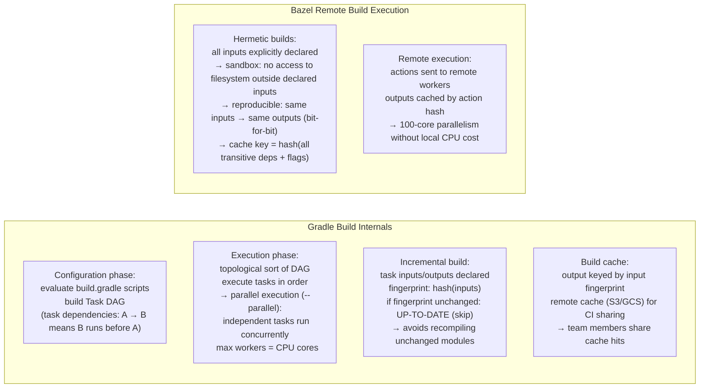
```mermaid
flowchart LR
    subgraph "Gradle Build Internals"
        Config["Configuration phase:\nevaluate build.gradle scripts\nbuild Task DAG\n(task dependencies: A → B means B runs before A)"]
        Exec["Execution phase:\ntopological sort of DAG\nexecute tasks in order\n→ parallel execution (--parallel):\n  independent tasks run concurrently\n  max workers = CPU cores"]
        Incr["Incremental build:\ntask inputs/outputs declared\nfingerprint: hash(inputs)\nif fingerprint unchanged: UP-TO-DATE (skip)\n→ avoids recompiling unchanged modules"]
        BuildCache["Build cache:\noutput keyed by input fingerprint\nremote cache (S3/GCS) for CI sharing\n→ team members share cache hits"]
    end

    subgraph "Bazel Remote Build Execution"
        Hermetic["Hermetic builds:\nall inputs explicitly declared\n→ sandbox: no access to filesystem outside declared inputs\n→ reproducible: same inputs → same outputs (bit-for-bit)\n→ cache key = hash(all transitive deps + flags)"]
        Remote["Remote execution:\nactions sent to remote workers\noutputs cached by action hash\n→ 100-core parallelism without local CPU cost"]
    end
```

---

## 6. 버전 관리 내부 — Git 개체 저장소

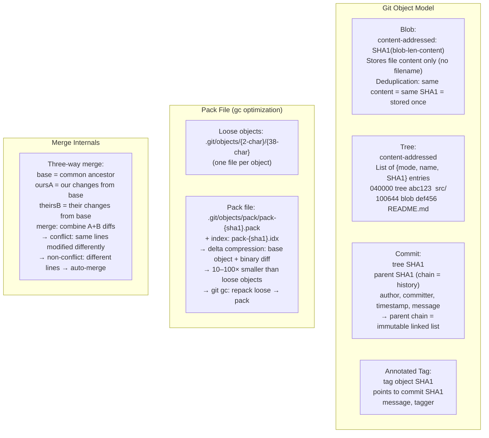
```mermaid
flowchart TD
    subgraph "Git Object Model"
        Blob["Blob:\ncontent-addressed: SHA1(blob-len-content)\nStores file content only (no filename)\nDeduplication: same content = same SHA1 = stored once"]
        Tree["Tree:\ncontent-addressed\nList of {mode, name, SHA1} entries\n040000 tree abc123  src/\n100644 blob def456  README.md"]
        Commit["Commit:\ntree SHA1\nparent SHA1 (chain = history)\nauthor, committer, timestamp, message\n→ parent chain = immutable linked list"]
        Tag["Annotated Tag:\ntag object SHA1\npoints to commit SHA1\nmessage, tagger"]
    end

    subgraph "Pack File (gc optimization)"
        Loose["Loose objects: .git/objects/{2-char}/{38-char}\n(one file per object)"]
        Pack["Pack file: .git/objects/pack/pack-{sha1}.pack\n+ index: pack-{sha1}.idx\n→ delta compression: base object + binary diff\n→ 10–100× smaller than loose objects\n→ git gc: repack loose → pack"]
    end

    subgraph "Merge Internals"
        ThreeWay["Three-way merge:\nbase = common ancestor\noursA = our changes from base\ntheirsB = their changes from base\nmerge: combine A+B diffs\n→ conflict: same lines modified differently\n→ non-conflict: different lines → auto-merge"]
    end
```

---

## 7. 견고한 원칙 — 기계적 의미

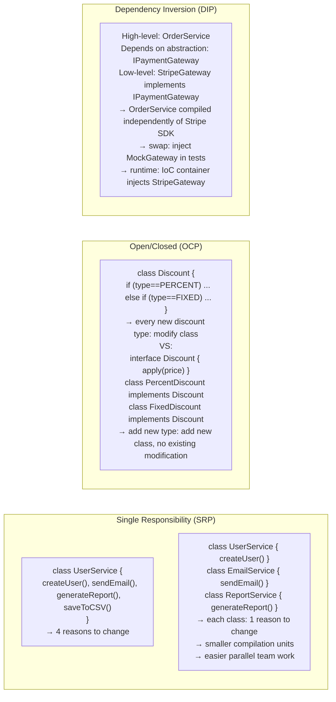
```mermaid
flowchart LR
    subgraph "Single Responsibility (SRP)"
        Before["class UserService {\n  createUser(), sendEmail(),\n  generateReport(), saveToCSV()\n}\n→ 4 reasons to change"]
        After["class UserService { createUser() }\nclass EmailService { sendEmail() }\nclass ReportService { generateReport() }\n→ each class: 1 reason to change\n→ smaller compilation units\n→ easier parallel team work"]
    end

    subgraph "Open/Closed (OCP)"
        OCP["class Discount {\n  if (type==PERCENT) ...\n  else if (type==FIXED) ...\n}\n→ every new discount type: modify class\nVS:\ninterface Discount { apply(price) }\nclass PercentDiscount implements Discount\nclass FixedDiscount implements Discount\n→ add new type: add new class, no existing modification"]
    end

    subgraph "Dependency Inversion (DIP)"
        DIP["High-level: OrderService\nDepends on abstraction: IPaymentGateway\nLow-level: StripeGateway implements IPaymentGateway\n→ OrderService compiled independently of Stripe SDK\n→ swap: inject MockGateway in tests\n→ runtime: IoC container injects StripeGateway"]
    end
```

---

## 8. 깔끔한 코드 — 순환적 복잡성

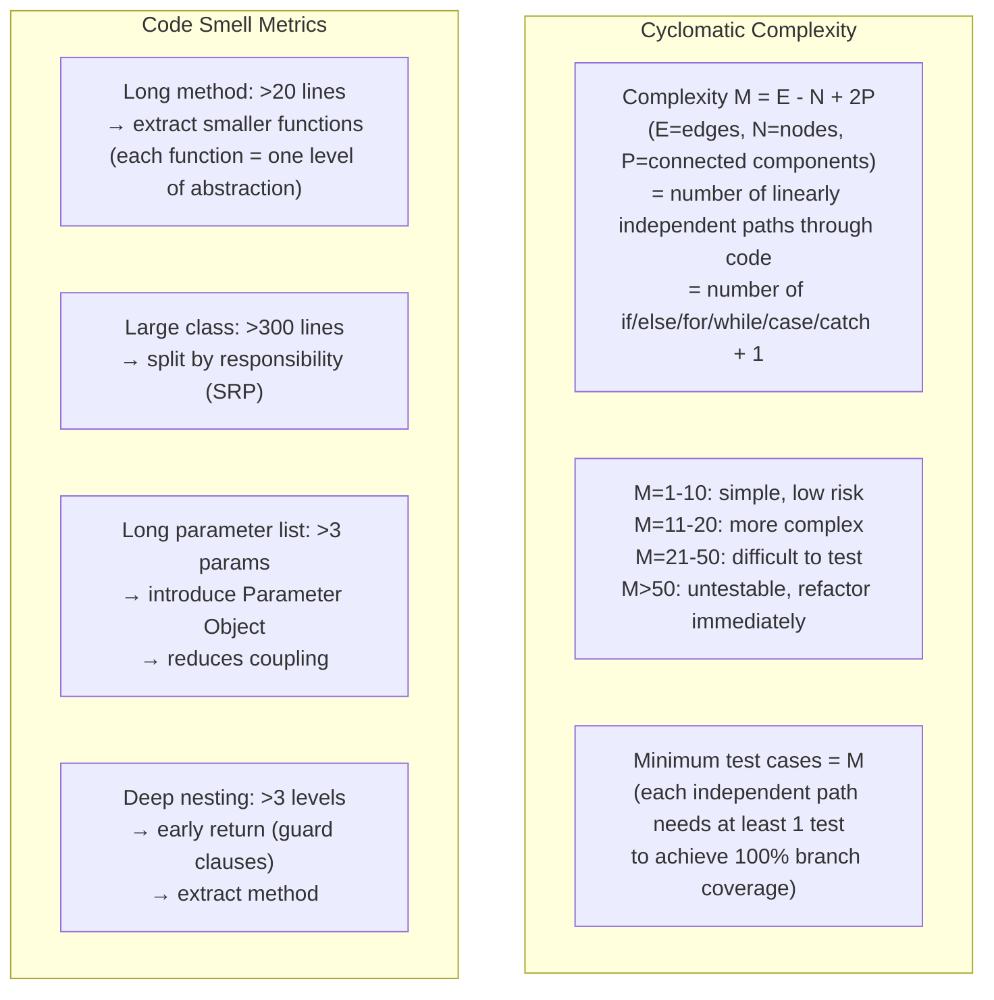
```mermaid
flowchart TD
    subgraph "Cyclomatic Complexity"
        Formula["Complexity M = E - N + 2P\n(E=edges, N=nodes, P=connected components)\n= number of linearly independent paths through code\n= number of if/else/for/while/case/catch + 1"]
        Thresholds["M=1-10: simple, low risk\nM=11-20: more complex\nM=21-50: difficult to test\nM>50: untestable, refactor immediately"]
        Test["Minimum test cases = M\n(each independent path needs at least 1 test\nto achieve 100% branch coverage)"]
    end

    subgraph "Code Smell Metrics"
        LongMethod["Long method: >20 lines\n→ extract smaller functions\n(each function = one level of abstraction)"]
        LargeClass["Large class: >300 lines\n→ split by responsibility (SRP)"]
        LongParam["Long parameter list: >3 params\n→ introduce Parameter Object\n→ reduces coupling"]
        DeepNest["Deep nesting: >3 levels\n→ early return (guard clauses)\n→ extract method"]
    end
```

---

## 9. 육각형 아키텍처 — 포트 및 어댑터 내부

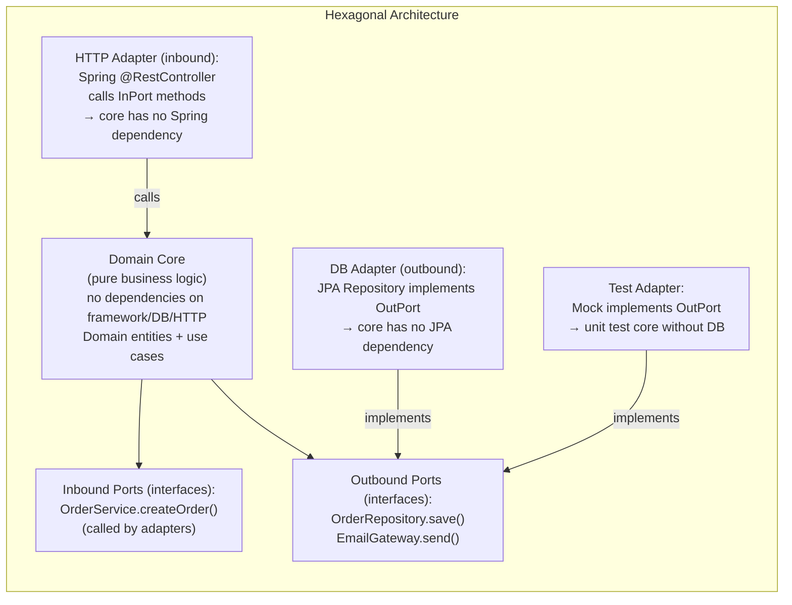
```mermaid
flowchart LR
    subgraph "Hexagonal Architecture"
        Core["Domain Core\n(pure business logic)\nno dependencies on framework/DB/HTTP\nDomain entities + use cases"]
        InPort["Inbound Ports (interfaces):\nOrderService.createOrder()\n(called by adapters)"]
        OutPort["Outbound Ports (interfaces):\nOrderRepository.save()\nEmailGateway.send()"]
        HTTPAdapt["HTTP Adapter (inbound):\nSpring @RestController\ncalls InPort methods\n→ core has no Spring dependency"]
        DBAdapt["DB Adapter (outbound):\nJPA Repository implements OutPort\n→ core has no JPA dependency"]
        TestAdapt["Test Adapter:\nMock implements OutPort\n→ unit test core without DB"]
    end
    HTTPAdapt -->|"calls"| Core
    Core --> InPort & OutPort
    DBAdapt -->|"implements"| OutPort
    TestAdapt -->|"implements"| OutPort
```

---

## 10. 반응형 프로그래밍 — 배압 내부

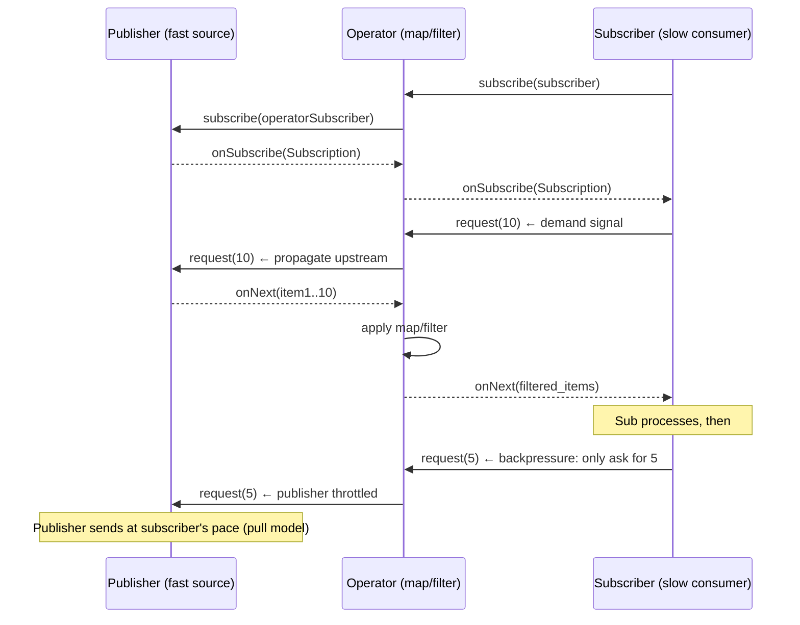
```mermaid
sequenceDiagram
    participant Pub as Publisher (fast source)
    participant Op as Operator (map/filter)
    participant Sub as Subscriber (slow consumer)

    Sub->>Op: subscribe(subscriber)
    Op->>Pub: subscribe(operatorSubscriber)
    Pub-->>Op: onSubscribe(Subscription)
    Op-->>Sub: onSubscribe(Subscription)
    
    Sub->>Op: request(10)  ← demand signal
    Op->>Pub: request(10)  ← propagate upstream
    Pub-->>Op: onNext(item1..10)
    Op->>Op: apply map/filter
    Op-->>Sub: onNext(filtered_items)
    
    Note over Sub: Sub processes, then
    Sub->>Op: request(5)  ← backpressure: only ask for 5
    Op->>Pub: request(5)  ← publisher throttled
    Note over Pub: Publisher sends at subscriber's pace (pull model)
```

### RxJava 핫 및 콜드 관찰 가능

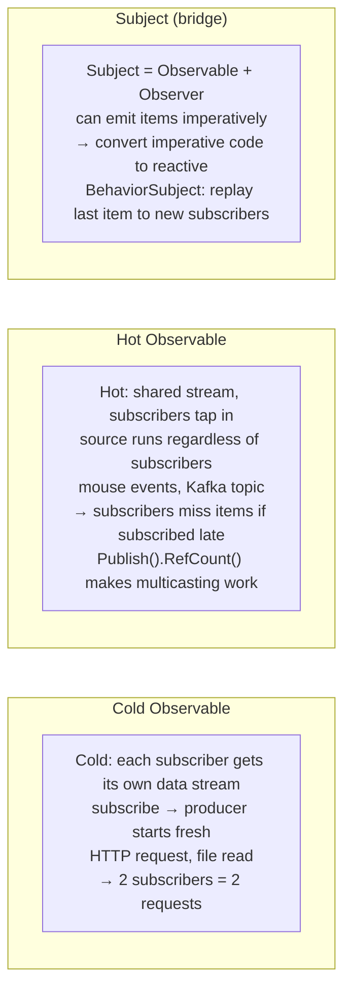
```mermaid
flowchart LR
    subgraph "Cold Observable"
        Cold["Cold: each subscriber gets its own data stream\nsubscribe → producer starts fresh\nHTTP request, file read\n→ 2 subscribers = 2 requests"]
    end
    subgraph "Hot Observable"
        Hot["Hot: shared stream, subscribers tap in\nsource runs regardless of subscribers\nmouse events, Kafka topic\n→ subscribers miss items if subscribed late\nPublish().RefCount() makes multicasting work"]
    end
    subgraph "Subject (bridge)"
        Subj["Subject = Observable + Observer\ncan emit items imperatively\n→ convert imperative code to reactive\nBehaviorSubject: replay last item to new subscribers"]
    end
```

---

## 11. 디자인 패턴 — 프록시 및 데코레이터 메모리 레이아웃

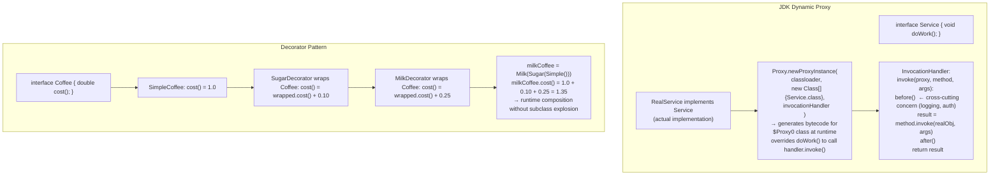
```mermaid
flowchart TD
    subgraph "JDK Dynamic Proxy"
        Interface["interface Service { void doWork(); }"]
        RealObj["RealService implements Service\n(actual implementation)"]
        Proxy2["Proxy.newProxyInstance(\n  classloader,\n  new Class[]{Service.class},\n  invocationHandler\n)\n→ generates bytecode for $Proxy0 class at runtime\noverrides doWork() to call handler.invoke()"]
        Handler["InvocationHandler:\ninvoke(proxy, method, args):\n  before()  ← cross-cutting concern (logging, auth)\n  result = method.invoke(realObj, args)\n  after()\n  return result"]
        RealObj --> Proxy2 --> Handler
    end

    subgraph "Decorator Pattern"
        Component["interface Coffee { double cost(); }"]
        Simple["SimpleCoffee: cost() = 1.0"]
        Milk["MilkDecorator wraps Coffee: cost() = wrapped.cost() + 0.25"]
        Sugar["SugarDecorator wraps Coffee: cost() = wrapped.cost() + 0.10"]
        Comp["milkCoffee = Milk(Sugar(Simple()))\nmilkCoffee.cost() = 1.0 + 0.10 + 0.25 = 1.35\n→ runtime composition without subclass explosion"]
        Component --> Simple --> Sugar --> Milk --> Comp
    end
```

---

## 12. 이벤트 소싱 및 CQRS 패턴 — 상태 재구성

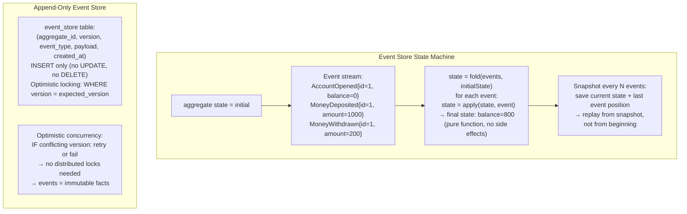
```mermaid
flowchart TD
    subgraph "Event Store State Machine"
        InitState["aggregate state = initial"]
        Events["Event stream:\nAccountOpened{id=1, balance=0}\nMoneyDeposited{id=1, amount=1000}\nMoneyWithdrawn{id=1, amount=200}"]
        Fold["state = fold(events, initialState)\nfor each event:\n  state = apply(state, event)\n→ final state: balance=800\n(pure function, no side effects)"]
        Snapshot["Snapshot every N events:\nsave current state + last event position\n→ replay from snapshot, not from beginning"]
    end
    InitState --> Events --> Fold --> Snapshot

    subgraph "Append-Only Event Store"
        WAL2["event_store table:\n(aggregate_id, version, event_type, payload, created_at)\nINSERT only (no UPDATE, no DELETE)\nOptimistic locking: WHERE version = expected_version"]
        Concurrency["Optimistic concurrency:\nIF conflicting version: retry or fail\n→ no distributed locks needed\n→ events = immutable facts"]
    end
```

---

## 주요 내용

- **관찰자 패턴** 디스패치는 기본적으로 동기식입니다. 느린 관찰자는 다른 모든 것을 차단합니다. 비동기 디스패치(이벤트 큐 + 작업자 스레드)는 게시자 처리량에서 관찰자 속도를 분리합니다.
- **DI 컨테이너 빈 라이프사이클**은 프록시를 위해 반사 + CGLIB 바이트코드 생성을 사용합니다. — `@Transactional` 메소드는 실제 인스턴스가 아닌 프록시가 호출을 가로채기 때문에 작동합니다.
- **ThreadPoolExecutor**는 코어 스레드를 먼저 채운 다음 대기열에 넣은 다음 최대 스레드까지 생성합니다. 일반적인 실수는 대기열 용량을 `Integer.MAX_VALUE`로 설정하여 최대 풀 확장을 방지하는 것입니다.
- **Git 객체**는 콘텐츠 주소가 지정됩니다(콘텐츠의 SHA-1). 커밋 전체에서 동일한 파일이 동일한 blob을 공유합니다. 팩 파일 델타 압축은 유사한 blob을 찾아 바이너리 diff만 저장합니다.
- **육각형 아키텍처**는 포트를 통해 종속성을 반전시켜 프레임워크에서 비즈니스 로직을 분리합니다. 도메인은 Spring/JPA/HTTP를 가져오지 않으므로 마이크로초 단위로 단위 테스트가 가능합니다.
- **반응성 배압**은 풀 모델입니다. 가입자는 `request(n)`을 호출하여 유량을 제어합니다. 게시자는 요청한 것보다 더 많이 내보내서는 안 됩니다(무한한 버퍼 증가 방지).
- **순환 복잡도**는 전체 분기 적용에 필요한 최소 테스트 케이스 수와 직접적으로 동일합니다. M=15인 함수는 모든 경로를 포괄하려면 최소 15개의 테스트가 필요합니다.


---

## 설계적 고민

### 구조와 모델링

#### 모놀리스 vs 마이크로서비스: 팀 규모와 복잡도 기준

시스템 아키텍처 선택은 **기술적 문제가 아니라 조직적 문제**다. Conway's Law에 따르면 시스템 구조는 조직 구조를 반영한다. 작은 팀(5-10명)이 하나의 코드베이스를 관리할 때는 모놀리스가 효율적이고, 수십 개 팀이 독립적으로 배포해야 할 때는 마이크로서비스가 필수적이다.

**모놀리스의 장점**:
- 함수 호출로 모듈 간 통신 → 네트워크 오버헤드 제로
- 데이터 일관성 유지 용이 (단일 DB 트랜잭션)
- 디버깅과 트레이싱이 단순

**마이크로서비스의 장점**:
- 독립 배포와 스케일링
- 팀별 기술 스택 독립 선택
- 장애 격리(blast radius 최소화)

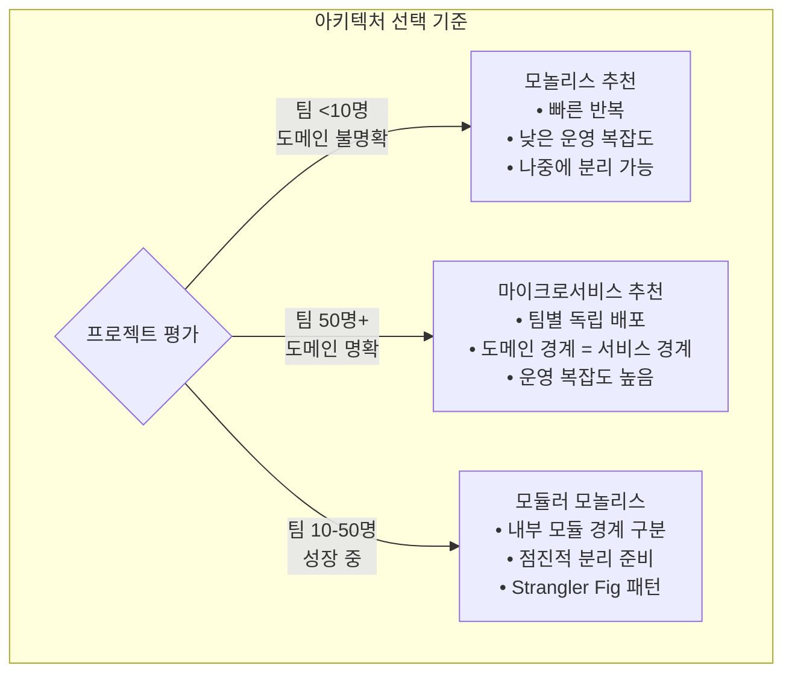
```mermaid
flowchart TD
    subgraph DECISION["아키텍처 선택 기준"]
        START{"프로젝트 평가"}

        START -->|"팀 <10명\n도메인 불명확"| MONO_REC["모놀리스 추천\n• 빠른 반복\n• 낮은 운영 복잡도\n• 나중에 분리 가능"]
        START -->|"팀 50명+\n도메인 명확"| MICRO_REC["마이크로서비스 추천\n• 팀별 독립 배포\n• 도메인 경계 = 서비스 경계\n• 운영 복잡도 높음"]
        START -->|"팀 10-50명\n성장 중"| MODULAR["모듈러 모놀리스\n• 내부 모듈 경계 구분\n• 점진적 분리 준비\n• Strangler Fig 패턴"]
    end
```

마이크로서비스의 가장 흔한 실패는 **너무 이른 도입**이다. 도메인 경계가 불명확한 상태에서 서비스를 나누면 뛸의 네트워크 호출로 분산 모놀리스(distributed monolith)가 된다 — 모놀리스의 단점과 마이크로서비스의 단점을 모두 가지는 최악의 결과.

#### 헥사고날 아키텍처: 비즈니스 로직 격리의 구조적 근거

헥사고날 아키텍처(포트/어댑터)는 **의존성 역전 원칙(DIP)**을 건축적 수준에서 적용한다. 도메인 코어가 포트(인터페이스)를 정의하고, 외부 시스템(데이터베이스, HTTP, 메시지 큐)이 어댑터를 통해 포트를 구현한다.

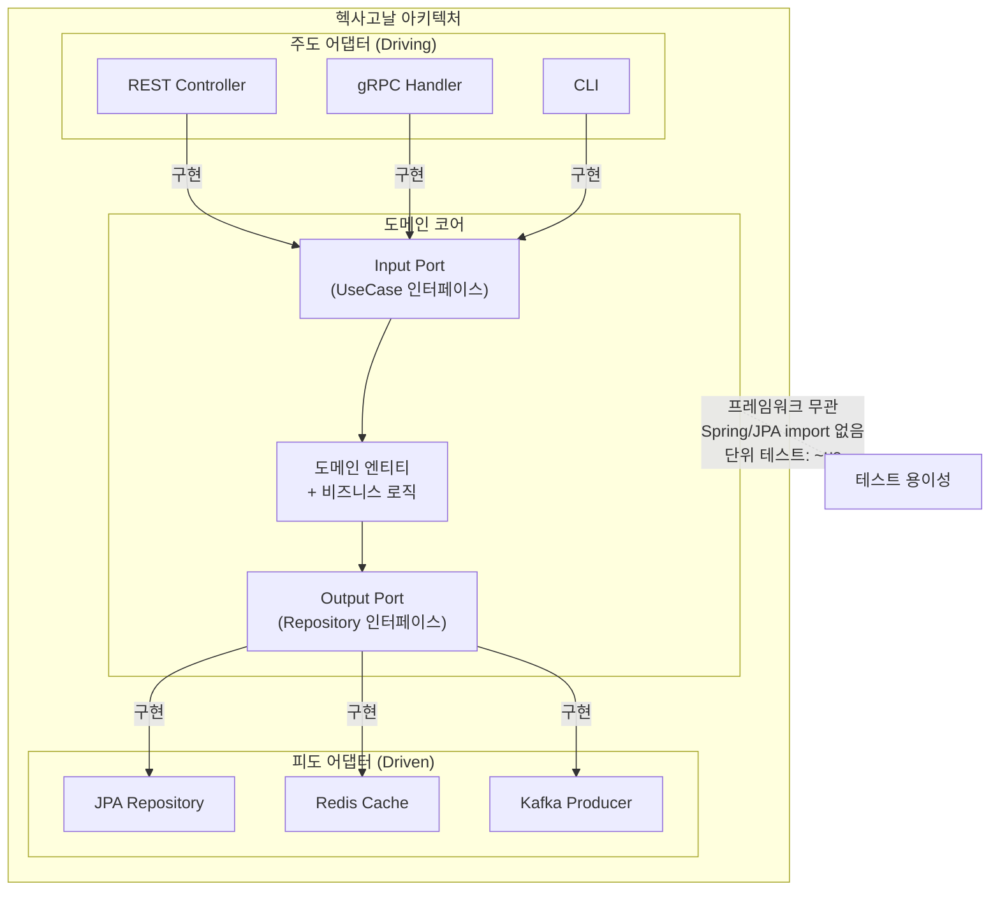
```mermaid
flowchart TD
    subgraph HEX["헥사고날 아키텍처"]
        subgraph DRIVING["주도 어댑터 (Driving)"]
            REST["REST Controller"]
            GRPC["gRPC Handler"]
            CLI["CLI"]
        end

        subgraph CORE["도메인 코어"]
            PORT_IN["Input Port\n(UseCase 인터페이스)"]
            DOMAIN["도메인 엔티티\n+ 비즈니스 로직"]
            PORT_OUT["Output Port\n(Repository 인터페이스)"]
            PORT_IN --> DOMAIN --> PORT_OUT
        end

        subgraph DRIVEN["피도 어댑터 (Driven)"]
            DB["JPA Repository"]
            REDIS["Redis Cache"]
            KAFKA["Kafka Producer"]
        end

        REST & GRPC & CLI -->|"구현"| PORT_IN
        PORT_OUT -->|"구현"| DB & REDIS & KAFKA
    end

    CORE -.-|"프레임워크 무관\nSpring/JPA import 없음\n단위 테스트: ~μs"| TEST["테스트 용이성"]
```

이 구조의 핵심 가치는 **도메인 코어가 어떤 프레임워크도 import하지 않는다**는 점이다. Spring을 Quarkus로, PostgreSQL을 MongoDB로 교체해도 도메인 코어는 변경 없다. 단위 테스트가 마이크로초 단위로 실행되므로 TDD가 자연스러워진다.

### 트레이드오프와 의사결정

#### SOLID 원칙 위반의 실제 문제 패턴

SOLID는 추상적 원칙이 아니라 **위반 시 구체적인 문제가 발생**하는 실용적 가이드라인이다.

| 원칙 | 위반 시 나타나는 증상 | 실제 예시 |
|--------|--------------------------|------------|
| **SRP** (단일 책임) | 한 변경이 여러 파일에 영향 | UserService가 인증+이메일+로깅 담당 |
| **OCP** (개방-폐쇄) | if/switch 분기문 누적 | 결제 수단 추가마다 PaymentService 수정 |
| **LSP** (리스코프 치환) | 서브클래스가 부모 계약 위반 | Square extends Rectangle에서 setWidth() 부작용 |
| **ISP** (인터페이스 분리) | 사용하지 않는 메서드 강제 구현 | FAT interface에 UnsupportedOperationException |
| **DIP** (의존성 역전) | 구체 클래스 직접 의존 | Service가 MySQL드라이버 직접 호출 |

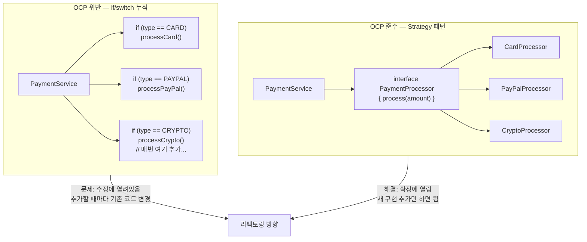
```mermaid
flowchart TD
    subgraph OCP_VIOLATION["OCP 위반 — if/switch 누적"]
        PAY_BAD["PaymentService"]
        IF1["if (type == CARD)\n  processCard()"]
        IF2["if (type == PAYPAL)\n  processPayPal()"]
        IF3["if (type == CRYPTO)\n  processCrypto()\n  // 매번 여기 추가..."]
        PAY_BAD --> IF1 & IF2 & IF3
    end

    subgraph OCP_GOOD["OCP 준수 — Strategy 패턴"]
        PAY_GOOD["PaymentService"]
        IFACE2["interface PaymentProcessor\n{ process(amount) }"]
        CARD["CardProcessor"]
        PAYPAL["PayPalProcessor"]
        CRYPTO["CryptoProcessor"]
        PAY_GOOD --> IFACE2
        IFACE2 --> CARD & PAYPAL & CRYPTO
    end

    OCP_VIOLATION -->|"문제: 수정에 열려있음\n추가할 때마다 기존 코드 변경"| REFACTOR["리팩토링 방향"]
    OCP_GOOD -->|"해결: 확장에 열림\n새 구현 추가만 하면 됨"| REFACTOR
```

#### 이벤트 소싱: 상태 저장 vs 이벤트 저장

전통적인 CRUD는 **현재 상태만 저장**한다. 잔액이 800원이면 800만 남기고 어떻게 800이 되었는지는 잎어버린다. **이벤트 소싱**은 모든 상태 변경을 불변 이벤트로 기록한다.

| 관점 | 상태 저장 (CRUD) | 이벤트 소싱 |
|--------|------------------|-------------|
| 데이터 | 현재 상태만 | 전체 이력 |
| 복잡도 | 단순 | 높음 (projection, snapshot) |
| 감사 추적 | 별도 구현 필요 | 내재적 |
| 성능 | 읽기 빠름 | 이벤트 재생 비용 |
| 디버깅 | 상태만 보임 | 시간 여행 가능 |

### 리팩토링과 설계 원칙

#### TDD: Red-Green-Refactor 사이클의 설계 가치

TDD는 테스트 기법이 아니라 **설계 방법론**이다. 테스트를 먼저 작성하면 코드의 **사용자 관점**에서 설계하게 된다. 테스트하기 어려운 코드는 결합도가 높다는 신호이므로, TDD는 느슨한 결합(loose coupling)을 자연스럽게 유도한다.

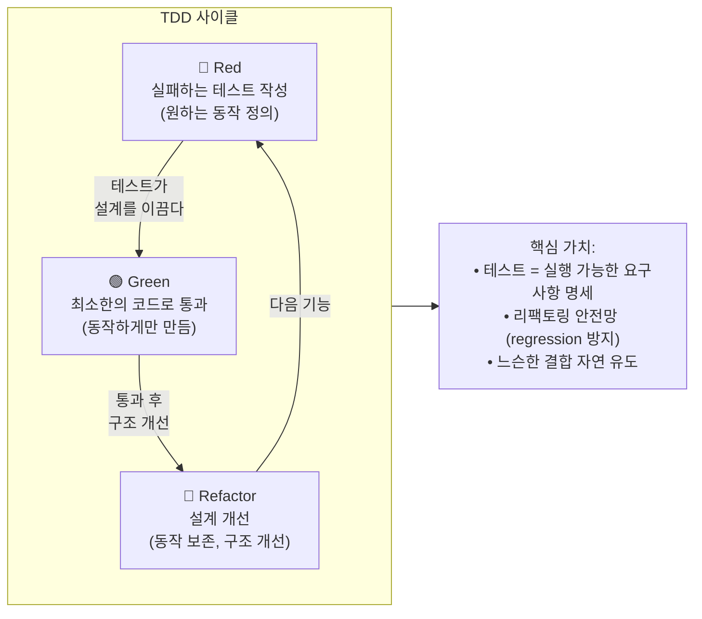
```mermaid
flowchart LR
    subgraph TDD_CYCLE["TDD 사이클"]
        RED["🔴 Red\n실패하는 테스트 작성\n(원하는 동작 정의)"]
        GREEN["🟢 Green\n최소한의 코드로 통과\n(동작하게만 만듬)"]
        REFACTOR["🔵 Refactor\n설계 개선\n(동작 보존, 구조 개선)"]
        RED -->|"테스트가\n설계를 이끔다"| GREEN
        GREEN -->|"통과 후\n구조 개선"| REFACTOR
        REFACTOR -->|"다음 기능"| RED
    end

    TDD_CYCLE --> VALUE["핵심 가치:\n• 테스트 = 실행 가능한 요구사항 명세\n• 리팩토링 안전망 (regression 방지)\n• 느슨한 결합 자연 유도"]
```

TDD의 가장 큰 오해는 "테스트 커버리지를 높이는 것"이라는 생각이다. TDD의 진정한 가치는 **리팩토링 안전망**을 제공하여 지속적인 설계 개선을 가능하게 하는 것이다. 테스트 없이 리팩토링하는 것은 안전망 없이 외줄 타는 것과 같다.

#### Strangler Fig 패턴: 모놀리스 → 마이크로서비스 전환 전략

대규모 시스템 리팩토링에서 "빅뱅 리라이트"는 거의 항상 실패한다. **Strangler Fig 패턴**은 기존 시스템을 유지하면서 점진적으로 새 시스템으로 교체하는 전략이다. 반줄 나무가 숙주 나무를 감싸며 자라는 것처럼, 새 시스템이 기존 시스템을 점진적으로 대체한다.

### 디자인 패턴 적용

#### 이벤트 소싱 + CQRS: 읽기/쓰기 모델 분리

이벤트 소싱은 흔히 **CQRS(Command Query Responsibility Segregation)**와 결합된다. 쓰기(커맨드)는 이벤트 스토어에 append하고, 읽기(쿼리)는 이벤트를 projection한 읽기 전용 모델에서 수행한다.

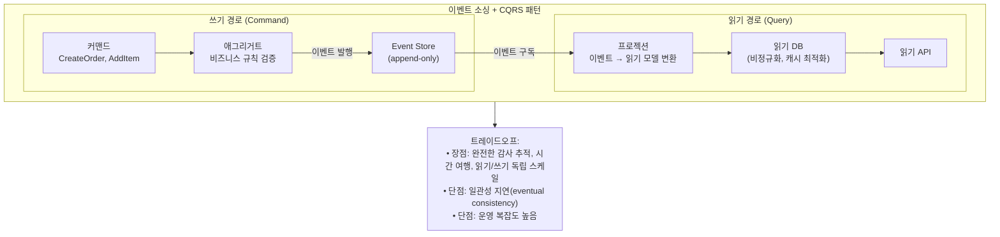
```mermaid
flowchart TD
    subgraph CQRS_ES["이벤트 소싱 + CQRS 패턴"]
        subgraph COMMAND["쓰기 경로 (Command)"]
            CMD["커맨드\nCreateOrder, AddItem"]
            AGG["애그리거트\n비즈니스 규칙 검증"]
            ES["Event Store\n(append-only)"]
            CMD --> AGG -->|"이벤트 발행"| ES
        end

        subgraph QUERY["읽기 경로 (Query)"]
            PROJ["프로젝션\n이벤트 → 읽기 모델 변환"]
            READ_DB["읽기 DB\n(비정규화, 캐시 최적화)"]
            API["읽기 API"]
            ES -->|"이벤트 구독"| PROJ --> READ_DB --> API
        end
    end

    CQRS_ES --> TRADEOFF["트레이드오프:\n• 장점: 완전한 감사 추적, 시간 여행, 읽기/쓰기 독립 스케일\n• 단점: 일관성 지연(eventual consistency)\n• 단점: 운영 복잡도 높음"]
```

#### 옵저버 패턴의 진화: 동기 → 비동기 → 리액티브 스트림

GoF의 Observer 패턴은 동기적이다. 발행자가 `notify()`를 호출하면 모든 구독자가 순차 실행된다. 느린 구독자가 전체를 차단한다.

이를 해결하는 진화 경로:

1. **동기 Observer**: `listener.onEvent(e)` 직접 호출. 단순하지만 차단 위험.
2. **이벤트 큐 + 워커**: 구독자를 별도 스레드로 분리. 비동기지만 배압 문제 발생.
3. **리액티브 스트림 (Reactive Streams)**: `Publisher.subscribe(Subscriber)`. `request(n)` 배압 제어로 생산자-소비자 속도 불일치 해결.

```mermaid
flowchart TD
    subgraph EVOLUTION["관찰자 패턴 진화"]
        SYNC_OBS["동기 Observer\nlistener.onEvent(e)\n• 단순함\n• 느린 구독자 → 전체 차단"]
        ASYNC_OBS["이벤트 큐 + 워커\nqueue.put(event)\n• 비동기\n• 무한 버퍼 위험 (OOM)"]
        REACTIVE["리액티브 스트림\npublisher.subscribe(sub)\nsub.request(n)\n• 배압 제어\n• 비동기 + 논블로킹"]

        SYNC_OBS -->|"문제: 차단"| ASYNC_OBS
        ASYNC_OBS -->|"문제: OOM"| REACTIVE
    end

    REACTIVE --> IMPL["구현체:\n• Project Reactor (Spring WebFlux)\n• RxJava\n• Kotlin Flow\n• Java 9 Flow API"]
```

리액티브 스트림의 `request(n)` 모델은 TCP의 수신 창(`WINDOW_UPDATE`)과 동일한 원리다. 생산자와 소비자의 속도 불일치를 **소비자 주도 플로우 컨트롤**로 해결하는 것이다. 이 패턴은 네트워크에서 소프트웨어로, 또 소프트웨어에서 네트워크로 영감이 순환한 설계 사례다.

---

## 연습 문제

### 1. 시스템 구조와 모델링

**문제 1-1. 헥사고날 아키텍처에서 포트/어댑터 경계 설계**

당신은 전자상거래 플랫폼의 백엔드를 담당하고 있다. 현재 주문 서비스는 MySQL에 직접 의존하는 Repository 구현체를 사용 중이며, 비즈니스 로직 내부에 `MySQLOrderRepository`가 하드코딩되어 있다. 경영진이 MongoDB로 데이터베이스를 교체하기로 결정했다.

- 헥사고날 아키텍처의 포트(인터페이스)와 어댑터(구현체) 개념을 적용하여, MySQL→MongoDB 전환 시 비즈니스 로직을 **한 줄도 수정하지 않고** 마이그레이션하려면 어떤 구조로 설계해야 하는가?
- 인바운드 포트(유스케이스)와 아웃바운드 포트(영속성)를 분리할 때, 도메인 모델이 인프라 계층의 어노테이션(`@Entity`, `@Document`)을 포함해야 하는가? 포함한다면 어떤 문제가 발생하는가?
- 테스트 관점에서, 포트/어댑터 구조가 인메모리 어댑터를 활용한 단위 테스트에 어떤 이점을 주는가?

<details><summary>힌트 보기</summary>

핵심은 **의존성 방향**이다. 도메인(내부 헥사곤)은 포트(인터페이스)만 알고, 어댑터(외부)가 포트를 구현한다. `OrderRepository` 인터페이스를 도메인 계층에 두고, `MySQLOrderAdapter`와 `MongoOrderAdapter`가 각각 이를 구현하면 DI 설정만 변경하면 된다. 도메인 모델에 JPA `@Entity` 같은 인프라 어노테이션이 있으면 도메인이 인프라에 오염되므로, 영속성 모델(Persistence Model)과 도메인 모델을 분리하고 매퍼를 두는 것이 정석이다. 테스트 시에는 `InMemoryOrderRepository`를 어댑터로 주입하면 DB 없이 도메인 로직을 검증할 수 있다.

</details>

**문제 1-2. 이벤트 소싱의 스키마 버전 관리**

쇼핑몰 서비스에서 이벤트 소싱을 도입하여 모든 주문 상태 변화를 이벤트로 저장하고 있다. 초기 설계에서 `OrderCreated` 이벤트는 `{orderId, userId, items, totalPrice}` 스키마(v1)였다. 6개월 후 비즈니스 요구사항 변경으로 `currency` 필드와 `discountCode` 필드를 추가해야 한다(v2).

- 이벤트 스토어에 이미 수백만 건의 v1 이벤트가 저장되어 있다. v2 스키마를 도입할 때, 기존 v1 이벤트를 **마이그레이션하는 방식**과 **업캐스팅(upcasting)으로 런타임 변환하는 방식**의 장단점을 비교하라.
- 이벤트 소싱에서 스키마 진화가 관계형 DB의 `ALTER TABLE`보다 근본적으로 어려운 이유는 무엇인가?
- 스냅샷(snapshot)이 스키마 버전 관리에서 어떤 역할을 하며, 스냅샷 자체의 버전 관리는 어떻게 해야 하는가?

<details><summary>힌트 보기</summary>

이벤트는 **불변(immutable)**이 원칙이므로 직접 수정할 수 없다. 마이그레이션은 모든 이벤트를 새 스키마로 다시 쓰는 것이고(안전하지만 비용 큼), 업캐스팅은 읽기 시점에 v1→v2 변환 로직을 적용하는 것이다(저장 변경 없음, 로직 복잡도 증가). 관계형 DB는 현재 상태만 저장하므로 `ALTER TABLE` 한 번이면 되지만, 이벤트 소싱은 **과거 모든 이벤트의 스키마를 영원히 이해해야** 한다. 스냅샷은 특정 시점의 집계 상태를 캐싱하여 전체 이벤트 리플레이를 피하게 해주지만, 스냅샷 자체도 버전이 필요하고 스키마 변경 시 재생성해야 할 수 있다.

</details>

**문제 1-3. DDD 바운디드 컨텍스트 간 통합 전략**

대형 이커머스 플랫폼에서 "주문(Order)" 컨텍스트와 "재고(Inventory)" 컨텍스트가 별도 팀에 의해 개발되고 있다. 주문이 확정되면 재고가 차감되어야 한다. 두 컨텍스트는 각각 독립된 데이터베이스를 사용한다.

- 동기 방식(주문 서비스가 재고 서비스 API를 직접 호출)과 비동기 방식(도메인 이벤트를 메시지 브로커로 발행)의 트레이드오프를 분석하라.
- 두 컨텍스트에서 "상품(Product)"이라는 개념이 서로 다른 속성을 가질 수 있다. 주문 컨텍스트의 Product와 재고 컨텍스트의 Product가 왜 다른 모델이어야 하며, 이를 어떻게 매핑하는가?
- 주문 확정 후 재고 차감이 실패하는 경우, Saga 패턴으로 보상 트랜잭션을 설계하라.

<details><summary>힌트 보기</summary>

동기 호출은 강한 일관성을 보장하지만, 재고 서비스 장애 시 주문도 실패한다(가용성 저하). 비동기 이벤트는 느슨한 결합과 높은 가용성을 제공하지만 최종 일관성(eventual consistency)만 보장한다. 바운디드 컨텍스트마다 같은 이름의 개념이라도 의미가 다르다(주문의 Product는 가격·수량, 재고의 Product는 SKU·위치·재고량). Anti-Corruption Layer(ACL)로 변환한다. Saga 보상: 주문확정→재고차감 실패 시 "주문취소" 보상 이벤트를 발행하여 주문 상태를 롤백한다.

</details>

### 2. 트레이드오프와 의사결정

**문제 2-1. 모놀리스 vs 마이크로서비스: 팀 규모에 따른 전환점**

스타트업 A는 개발자 5명으로 시작하여 모놀리식 아키텍처로 제품을 빠르게 출시했다. 2년 후 개발자가 50명으로 늘었고, 배포 충돌, 코드 소유권 불명확, 빌드 시간 증가 등의 문제가 발생하고 있다. CTO가 마이크로서비스 전환을 제안한다.

- 개발자 5명일 때 마이크로서비스를 도입했다면 어떤 문제가 발생했을지 구체적으로 분석하라(운영 오버헤드, 분산 트랜잭션, 디버깅 복잡도 등).
- 50명 규모에서 모놀리스를 유지할 때의 구체적인 병목점은 무엇인가? Conway의 법칙과 연결하여 설명하라.
- "모듈러 모놀리스(Modular Monolith)"가 중간 단계로서 어떤 장점을 제공하며, 마이크로서비스로의 점진적 전환을 어떻게 용이하게 하는가?

<details><summary>힌트 보기</summary>

5명이 마이크로서비스를 운영하면 서비스당 인프라 관리(배포 파이프라인, 모니터링, 서비스 디스커버리, 분산 추적)가 개발 속도를 압도한다. 분산 트랜잭션과 네트워크 장애 처리가 비즈니스 로직보다 복잡해진다. 50명에서 모놀리스는 Conway의 법칙에 의해 팀 경계와 코드 경계가 불일치하여 빈번한 머지 충돌, 의도치 않은 사이드 이펙트가 발생한다. 모듈러 모놀리스는 단일 배포 단위를 유지하면서 모듈 간 인터페이스를 명확히 정의하여, 나중에 모듈 단위로 서비스를 추출할 수 있는 준비를 한다.

</details>

**문제 2-2. TDD의 속도 트레이드오프와 기술 부채**

팀 B는 신규 프로젝트에서 TDD를 도입하려 한다. PM은 "테스트를 먼저 작성하면 초기 개발 속도가 30% 느려진다"며 반대하고, 시니어 개발자는 "TDD 없이 6개월 후 리팩토링이 불가능해진다"고 주장한다.

- TDD가 초기 속도를 늦추는 **구체적인 원인**은 무엇인가? (테스트 작성 시간 외에 설계 사고 강제, 테스트 가능한 구조로의 리팩토링 등)
- TDD를 하지 않았을 때 발생하는 기술 부채의 **복리 효과**를 시간축으로 설명하라. 어느 시점에서 TDD 팀이 비-TDD 팀의 누적 속도를 추월하는가?
- 모든 코드에 TDD를 적용하는 것이 효과적이지 않은 경우는 언제인가? (프로토타이핑, UI 레이어, 탐색적 코드 등)

<details><summary>힌트 보기</summary>

TDD는 테스트 코드 작성 자체보다 **테스트 가능한 설계를 강제**하는 데 시간이 든다(의존성 주입, 인터페이스 분리 등). 이 설계 투자가 장기적으로 변경 용이성을 보장한다. 기술 부채는 선형이 아닌 복리로 증가한다. 초기에는 빠르지만, 6개월 후 모든 변경이 예상치 못한 버그를 유발하고 회귀 테스트 비용이 기하급수적으로 증가한다. 프로토타입이나 한 번 쓰고 버릴 코드, 요구사항이 극도로 불확실한 탐색 단계에서는 TDD의 ROI가 낮다.

</details>

**문제 2-3. YAGNI 원칙과 확장성 설계의 긴장**

당신은 결제 서비스를 설계하고 있다. 현재는 신용카드 결제만 지원하면 되지만, 로드맵에 6개월 후 가상계좌, 1년 후 암호화폐 결제 지원이 예정되어 있다. 주니어 개발자는 "지금부터 결제 전략 패턴을 만들어 모든 결제 수단을 추상화하자"고 제안하고, 시니어는 "YAGNI — 지금 필요한 것만 만들어라"고 반대한다.

- YAGNI를 엄격히 적용하여 신용카드만 구현할 때, 6개월 후 가상계좌 추가 시 어떤 종류의 리팩토링이 필요한가?
- 반대로 지금부터 전략 패턴을 과도하게 설계할 때의 비용은 무엇인가? (추상화 비용, 잘못된 추상화 위험, BDUF 문제)
- "적절한 추상화 수준"을 결정하는 실용적인 기준은 무엇인가? 두 번째 결제 수단이 추가되는 시점이 왜 추상화의 적기인가?

<details><summary>힌트 보기</summary>

Rule of Three — 패턴은 세 번째 사례에서 도입하라는 경험 법칙이 있지만, 결제처럼 **명확한 로드맵**이 있는 경우는 약간의 확장 포인트(인터페이스)를 미리 두는 것이 합리적이다. 그러나 구체적인 구현은 YAGNI를 따른다. 과도한 추상화는 잘못된 일반화로 이어질 수 있다(실제로 가상계좌와 암호화폐가 같은 인터페이스로 추상화되지 않을 수 있음). 두 번째 사례가 나타나면 첫 번째와의 공통점/차이점이 명확해져 올바른 추상화 경계를 찾을 수 있다.

</details>

### 3. 문제 해결 및 리팩토링

**문제 3-1. SRP 위반 감지와 책임 분리**

다음과 같은 `UserService` 클래스가 있다:

```
class UserService {
    createUser(data) { /* DB에 사용자 저장 */ }
    updateUser(id, data) { /* 사용자 정보 수정 */ }
    deleteUser(id) { /* 사용자 삭제 */ }
    sendWelcomeEmail(user) { /* 환영 이메일 발송 */ }
    sendPasswordResetEmail(user) { /* 비밀번호 재설정 메일 */ }
    logUserAction(userId, action) { /* 사용자 활동 로그 기록 */ }
    generateUserReport(userId) { /* 사용자 활동 보고서 생성 */ }
    validateUserData(data) { /* 사용자 데이터 유효성 검증 */ }
    uploadUserAvatar(userId, file) { /* 아바타 이미지 업로드 */ }
}
```

- 이 클래스가 SRP를 위반하는 근거를 **"변경 이유(reason to change)"** 관점에서 분석하라. 각 메서드 그룹이 어떤 이해관계자(stakeholder)의 요구에 의해 변경되는가?
- 이 클래스를 SRP를 준수하도록 최소 몇 개의 클래스로 분리해야 하는가? 각 클래스의 책임을 명확히 정의하라.
- 분리 후, 원래 `UserService`를 사용하던 클라이언트 코드는 어떻게 변경되어야 하는가? 파사드 패턴으로 하위 호환성을 유지하는 전략을 설명하라.

<details><summary>힌트 보기</summary>

변경 이유별로 그룹화하면: ①사용자 CRUD(비즈니스 규칙), ②이메일 발송(커뮤니케이션 정책), ③로깅(감사 정책), ④보고서(분석 요구), ⑤데이터 검증(입력 규칙), ⑥파일 업로드(인프라 정책) — 최소 4~5개 클래스로 분리 가능하다. 이메일 정책이 바뀌어도 사용자 CRUD에 영향이 없어야 한다. 기존 코드 호환을 위해 `UserService`를 파사드로 유지하고 내부에서 분리된 서비스들에 위임하면 점진적 마이그레이션이 가능하다.

</details>

**문제 3-2. DIP 위반: 비즈니스 로직의 인프라 직접 의존**

다음 코드에서 `OrderService`는 구체적인 `MySQLOrderRepository`를 직접 생성하여 사용하고 있다:

```
class OrderService {
    constructor() {
        this.repository = new MySQLOrderRepository();
        this.emailService = new SmtpEmailService();
        this.logger = new FileLogger('/var/log/orders.log');
    }
    
    placeOrder(orderData) {
        const order = this.repository.save(orderData);
        this.emailService.sendConfirmation(order);
        this.logger.log(`Order placed: ${order.id}`);
        return order;
    }
}
```

- 이 코드가 DIP(의존성 역전 원칙)를 위반하는 구체적인 지점을 모두 찾고, 각각이 초래하는 문제를 설명하라.
- DIP를 적용하여 리팩토링한 코드를 설계하라. 생성자 주입(Constructor Injection)을 사용하여 모든 의존성을 역전시키되, 인터페이스와 구현체를 명확히 구분하라.
- 리팩토링 후, 단위 테스트에서 `OrderService.placeOrder()`를 테스트할 때 각 의존성을 어떻게 Mock으로 대체할 수 있는가?

<details><summary>힌트 보기</summary>

DIP 위반 3곳: `new MySQLOrderRepository()`, `new SmtpEmailService()`, `new FileLogger()` — 모두 상위 모듈(OrderService)이 하위 모듈(구체 클래스)에 직접 의존한다. `OrderRepository`, `EmailService`, `Logger` 인터페이스를 정의하고 생성자로 주입받으면 된다: `constructor(repository: OrderRepository, emailService: EmailService, logger: Logger)`. 테스트 시 `MockOrderRepository`, `MockEmailService`, `MockLogger`를 주입하여 DB·이메일·파일 없이 비즈니스 로직만 검증할 수 있다. 핵심은 **"구체가 아닌 추상에 의존하라"**이다.

</details>

**문제 3-3. 순환 의존성 해결과 이벤트 기반 디커플링**

마이크로서비스 환경에서 다음과 같은 순환 의존성이 발생했다: 주문 서비스(Order)가 결제 서비스(Payment)를 호출하고, 결제 서비스가 주문 서비스를 다시 호출하여 상태를 업데이트한다. 또한 알림 서비스(Notification)가 주문 서비스를 호출하여 주문 정보를 조회하고, 주문 서비스가 알림 서비스를 호출하여 알림을 트리거한다.

- 이 순환 의존성이 시스템에 미치는 구체적인 영향을 분석하라(배포 순서, 장애 전파, 데드락 가능성 등).
- 이벤트 기반 아키텍처로 전환하여 순환 의존성을 제거하는 방법을 설계하라. 어떤 서비스가 이벤트를 발행하고 어떤 서비스가 구독해야 하는가?
- 이벤트 기반으로 전환할 때 발생하는 새로운 문제(이벤트 순서 보장, 멱등성, 이벤트 유실)에 대한 해결 전략을 설명하라.

<details><summary>힌트 보기</summary>

순환 의존성은 배포 순서 문제(A를 배포하려면 B가 필요하고 B는 A가 필요), 장애 연쇄 전파, 동기 호출 시 데드락을 유발한다. 해결: Order→"OrderPlaced" 이벤트 발행 → Payment 구독하여 결제 처리 → "PaymentCompleted" 이벤트 발행 → Order 구독하여 상태 업데이트, Notification 구독하여 알림 발송. 이벤트로 단방향 흐름이 된다. 새로운 과제: 메시지 브로커의 at-least-once 전달 시 멱등성 키로 중복 처리, 이벤트 순서는 파티셔닝(orderId 기준)으로 보장, 이벤트 유실은 Outbox 패턴+폴링으로 해결한다.

</details>

### 4. 개념 간의 연결성

**문제 4-1. CQRS + DDD: 이커머스 주문 집계 설계**

이커머스 플랫폼에서 CQRS와 DDD를 결합하여 주문 시스템을 설계한다. 주문 Aggregate는 `PlaceOrder` 커맨드를 받아 `OrderPlaced` 이벤트를 발생시키고, 이 이벤트는 읽기 모델(주문 목록 뷰, 통계 대시보드)을 업데이트한다.

- 주문 Aggregate의 불변식(invariant)은 무엇인가? (예: 총 금액은 음수일 수 없다, 취소된 주문에 아이템을 추가할 수 없다 등) 커맨드 처리 시 이 불변식을 어떻게 강제하는가?
- `OrderPlaced` 이벤트가 발행된 후, 읽기 모델(Query 측)이 업데이트되기까지의 지연(eventual consistency)으로 인해 사용자가 주문 직후 주문 목록에서 자신의 주문을 볼 수 없는 문제가 발생한다. 이 UX 문제를 어떻게 해결하는가?
- 명령 측(Command)과 조회 측(Query)의 데이터 모델이 왜 다른 스키마를 가져야 하는지, 주문 목록 뷰와 통계 대시보드의 읽기 모델 차이를 예로 들어 설명하라.

<details><summary>힌트 보기</summary>

Aggregate의 불변식은 커맨드 핸들러 내에서 도메인 로직으로 검증한다 — 위반 시 이벤트를 발생시키지 않고 예외를 던진다. Eventual consistency UX 해결: ①커맨드 성공 후 클라이언트에서 낙관적 UI 업데이트(서버 응답 전에 UI 반영), ②읽기 모델 업데이트 완료까지 폴링, ③Write-through 캐시로 방금 쓴 데이터를 바로 읽기. 읽기 모델 분리 이유: 주문 목록은 `{orderId, status, date, total}` 비정규화된 플랫 구조가 효율적이고, 통계 대시보드는 `{일별매출, 카테고리별주문수}` 사전 집계된 구조가 필요하다. 하나의 쓰기 모델에서 다양한 뷰에 최적화된 여러 읽기 모델을 생성하는 것이 CQRS의 핵심이다.

</details>

**문제 4-2. CI/CD + 테스트 피라미드: 파이프라인 설계**

50명 규모의 개발팀에서 CI/CD 파이프라인을 설계한다. 현재는 모든 테스트가 E2E 테스트로만 구성되어 있어 파이프라인이 45분 걸리고, 불안정한 테스트(flaky test)로 인해 빌드가 자주 실패한다. 테스트 피라미드(단위→통합→E2E)를 적용하여 파이프라인을 재설계하려 한다.

- 현재 "역피라미드" 구조(E2E만 많음)가 초래하는 문제를 실행 시간, 실패 원인 특정 난이도, 유지보수 비용 측면에서 분석하라.
- 테스트 피라미드를 적용한 CI/CD 파이프라인 단계를 설계하라. 각 단계(단위 테스트→통합 테스트→E2E 테스트)의 실행 조건, 병렬화 전략, 실패 시 피드백 속도를 명시하라.
- 마이크로서비스 환경에서 서비스 간 통합 테스트를 어떻게 수행하는가? Consumer-Driven Contract Testing(CDC)이 전통적인 통합 테스트 대비 어떤 이점을 제공하는가?

<details><summary>힌트 보기</summary>

역피라미드 문제: E2E는 느리고(브라우저/네트워크 의존), 실패 원인 특정이 어렵고("어딘가 깨짐"), 환경 의존성으로 flaky하다. 피라미드 파이프라인: ①단위 테스트(PR마다, 병렬, 2분 이내, 실패 시 즉시 피드백) → ②통합 테스트(머지 시, 컨테이너 기반 DB/캐시, 10분 이내) → ③E2E 테스트(배포 전, 핵심 시나리오만, 20분 이내). CDC(Pact 등)는 각 서비스가 독립적으로 테스트하되, 소비자가 기대하는 API 계약을 제공자가 충족하는지 검증한다. 모든 서비스를 동시에 띄울 필요 없이 계약만 검증하므로 빠르고 안정적이다.

</details>

**문제 4-3. 클린 아키텍처 + 도메인 이벤트 + 테스트 전략의 통합**

클린 아키텍처를 적용한 주문 서비스에서, 주문 생성 시 다음과 같은 흐름이 발생한다: Controller → UseCase(PlaceOrderUseCase) → Domain(Order Aggregate) → Domain Event(OrderPlaced) → Event Handler(재고 차감, 이메일 발송) → Repository(주문 저장).

- 이 흐름에서 각 계층(Controller, UseCase, Domain, Infrastructure)이 테스트되어야 하는 방식이 어떻게 다른가? 각 계층별 적합한 테스트 종류(단위/통합/E2E)와 Mock 전략을 설명하라.
- Domain Event가 동기적으로 처리될 때와 비동기적으로 처리될 때의 트랜잭션 경계(transaction boundary) 차이를 설명하라. 주문 저장과 재고 차감이 하나의 트랜잭션에 포함되어야 하는가?
- 이벤트 핸들러가 실패할 경우(예: 이메일 서비스 장애), 주문 자체가 롤백되어야 하는가? 실패 처리 전략(재시도, Dead Letter Queue, 보상 트랜잭션)을 비즈니스 요구사항에 따라 구분하여 설계하라.

<details><summary>힌트 보기</summary>

테스트 전략: Domain은 순수 단위 테스트(Mock 없음, 도메인 로직만), UseCase는 단위 테스트(Repository Mock 주입), Infrastructure는 통합 테스트(실제 DB/메시지 브로커), Controller→E2E는 HTTP 요청 기반 통합 테스트. 동기 이벤트는 같은 트랜잭션에 포함되어 핸들러 실패 시 전체 롤백, 비동기 이벤트는 별도 트랜잭션이다. 비즈니스 관점: 이메일 실패로 주문을 롤백하면 안 된다(부수 효과). 재고 차감 실패는 주문에 영향을 줄 수 있다(핵심 비즈니스). 따라서 재고 차감은 Saga+보상 트랜잭션, 이메일은 재시도+DLQ로 분리 설계한다.
 
</details>