# 시스템 프로그래밍 내부: 메모리 모델, Syscall 및 동시성 프리미티브

> 내부 내용: CPU 메모리 모델의 저장/로드 순서, 시스템 호출이 사용자/커널 경계를 넘는 방법, 뮤텍스와 퓨텍스가 커널에서 차단을 구현하는 방법, Rust의 빌림 검사기가 컴파일 타임에 메모리 안전을 강화하는 방법, POSIX 스레드가 커널 스케줄러 엔터티에 매핑되는 방법.

---

## 1. CPU 메모리 모델: 저장/로드 순서

최신 CPU는 성능을 위해 메모리 작업 순서를 변경합니다. 프로그래머의 순차적 정신 모델은 하드웨어 현실과 일치하지 않습니다.

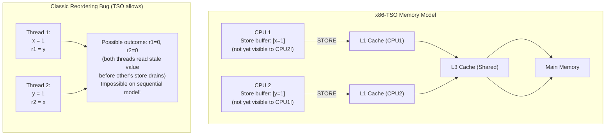

### 기억의 울타리와 장벽

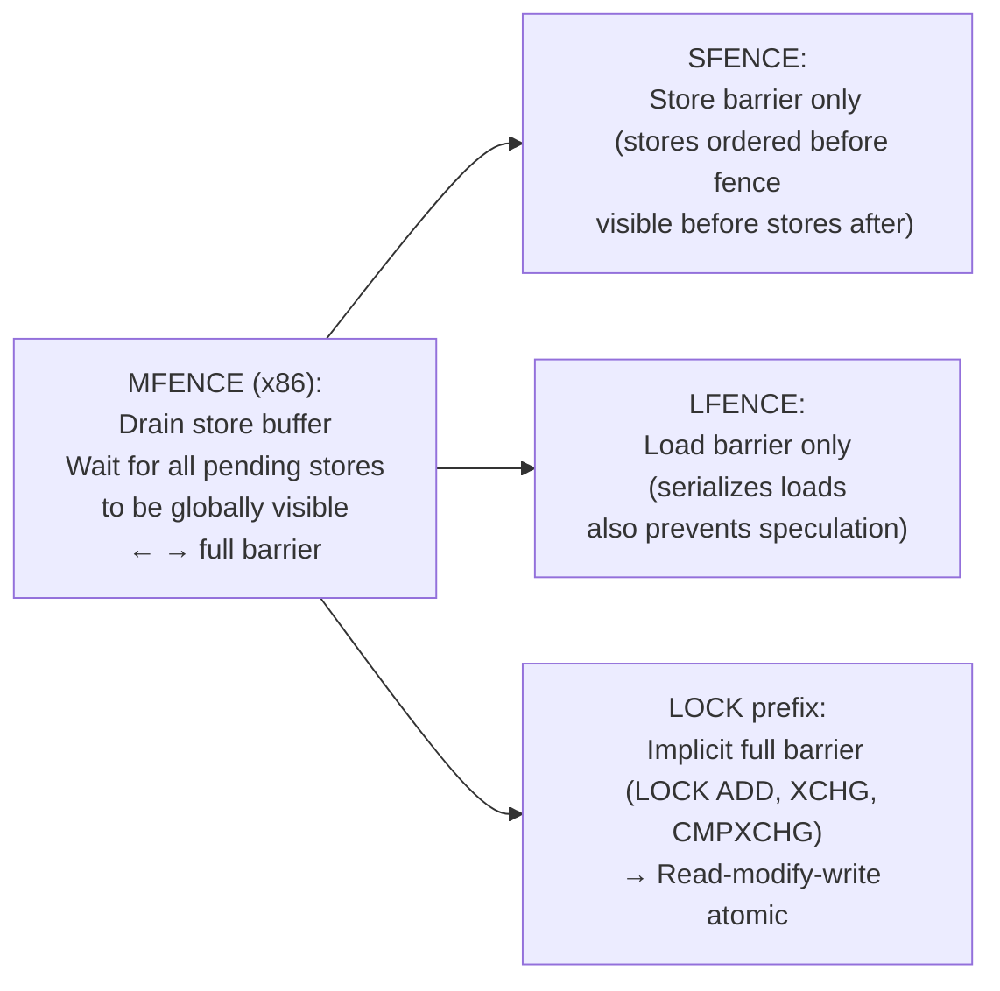

---

## 2. 시스템 호출: 사용자 공간 → 커널 크로싱

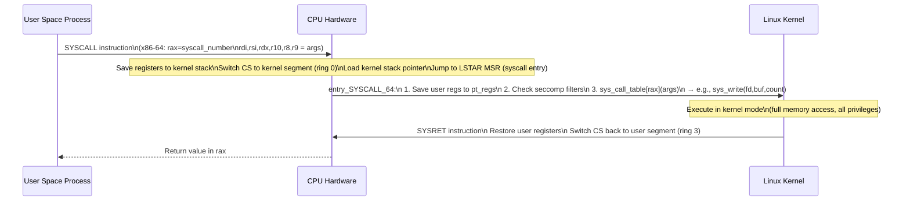

### vDSO: Syscall 오버헤드 방지

부작용 없이 자주 호출되는 syscall(gettimeofday, clock_gettime)의 경우 Linux는 **vDSO**(가상 동적 공유 개체)를 통해 커널 코드를 사용자 프로세스 주소 공간에 직접 매핑합니다.

```
gettimeofday() call in user space:
  NORMAL: SYSCALL → kernel → read clock → SYSRET (~100ns)
  vDSO:   Call vDSO function directly (no ring switch!)
          Reads time from shared memory page (mapped by kernel)
          ~10ns — 10× faster
```

---

## 3. 뮤텍스 구현: Futex

futex(빠른 사용자 공간 뮤텍스)는 경합이 없는 경우 syscall을 방지합니다.

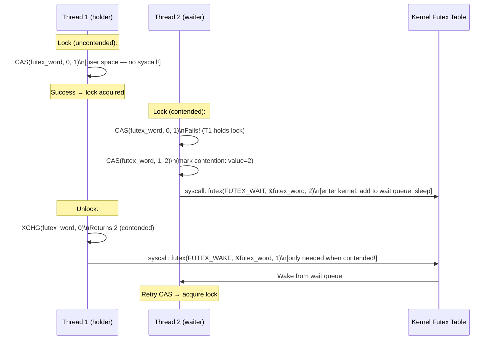

**빠른 경로**: 대기자 없이 잠금/잠금 해제 = 원자 CAS 1개 + 시스템 호출 0개.  
**느린 경로**: 경합이 발생하는 경우에만 syscall이 커널에 들어가 잠자기/깨우기를 수행합니다.

### Spinlock 대 Mutex Tradeoff

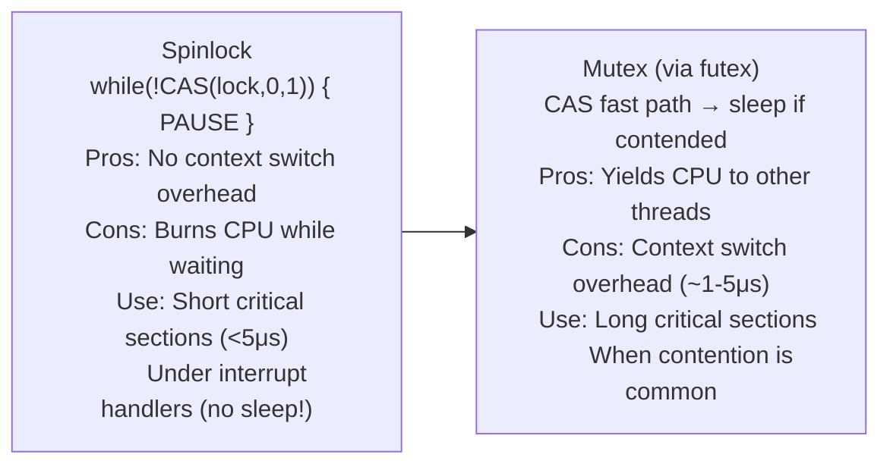

---

## 4. Rust Borrow Checker: 컴파일 타임의 소유권 규칙

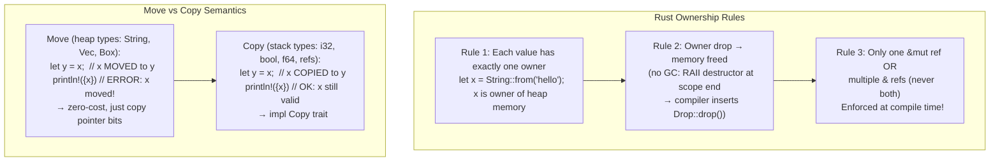

### 수명 주석: 차용 범위 적용

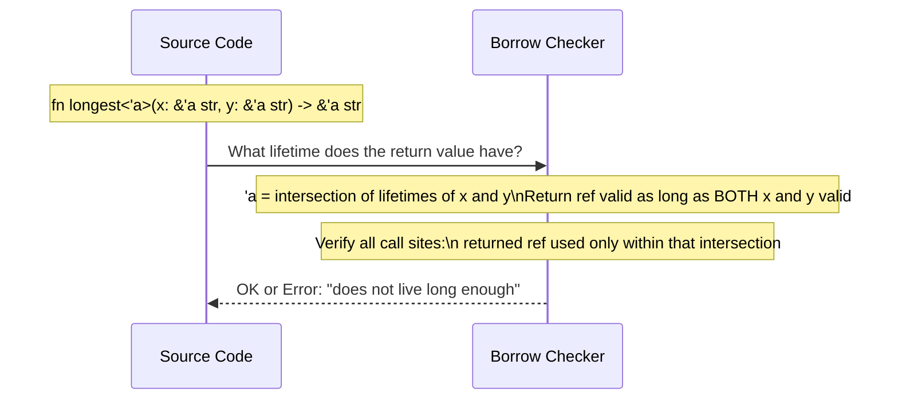

**빌림 검사기는 컴파일 타임에 제거됩니다**:
- Use-after-free: 빌림이 존재하는 동안 소유자가 삭제됨 → 컴파일 오류
- 데이터 경합: 다른 참조가 활성화된 동안 `&mut` 참조 → 컴파일 오류
- 댕글링 참조: 범위를 벗어난 값에 대한 참조 → 컴파일 오류

---

## 5. POSIX 스레드: 커널 매핑 및 스케줄링

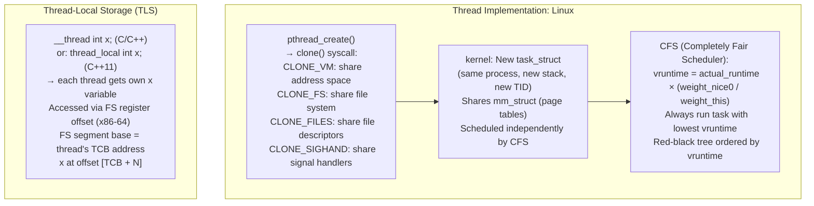

### 컨텍스트 전환: 저장되는 내용

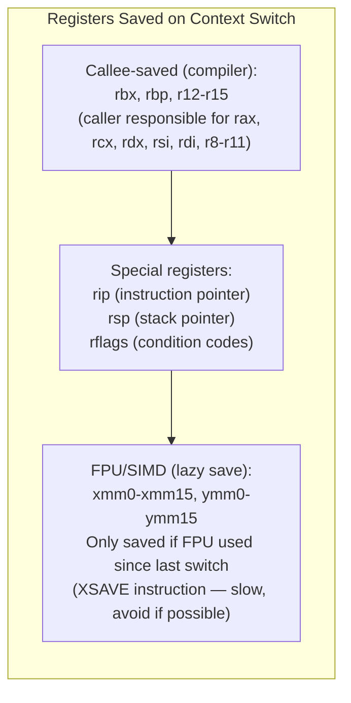

---

## 6. 메모리 할당자 내부: glibc malloc

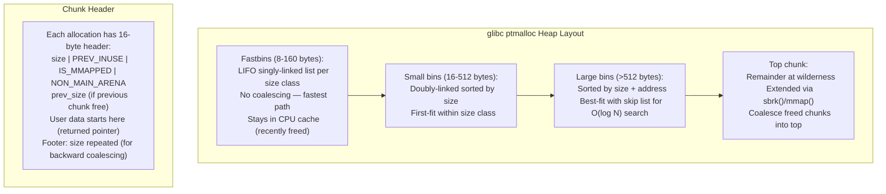

### TCMalloc: 낮은 경합을 위한 스레드 캐싱

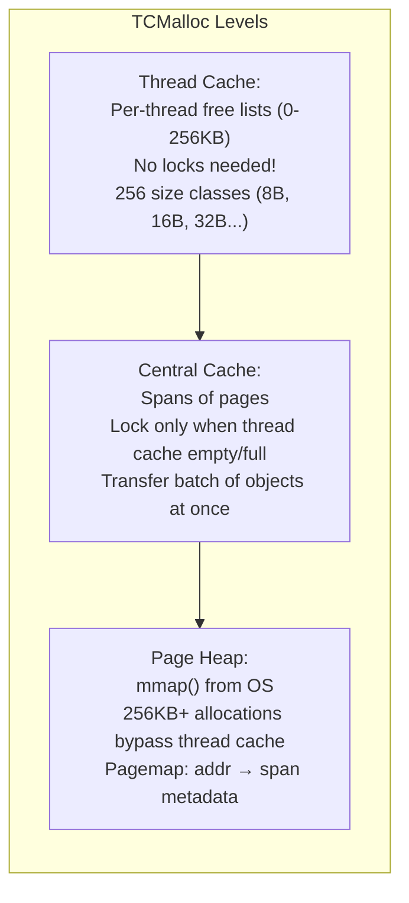

---

## 7. POSIX 파일 I/O: 커널 경로

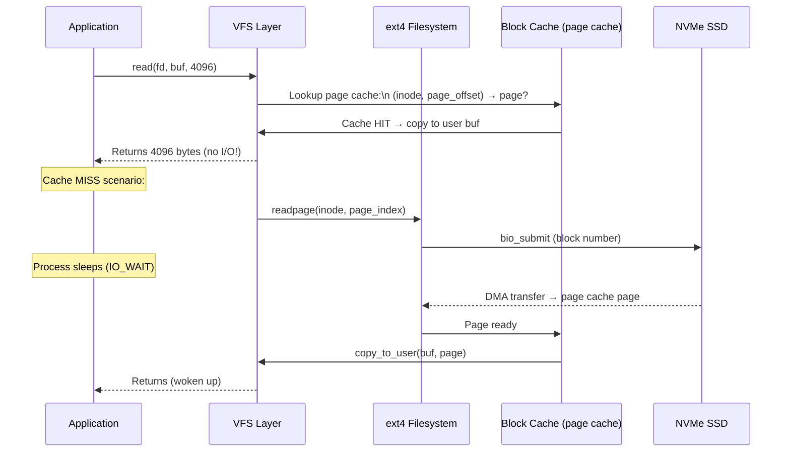

### O_DIRECT: 페이지 캐시 우회

```c
// O_DIRECT: bypass page cache entirely
fd = open("data.bin", O_RDWR | O_DIRECT);
// Requires aligned buffer (aligned to 512 or 4096 bytes)
// Transfers directly: user_buf ↔ disk (via DMA)
// Used by: databases (manage their own cache)
//          backup tools (avoid evicting hot pages)
```

---

## 8. 신호 처리: 전달 및 비동기 안전성

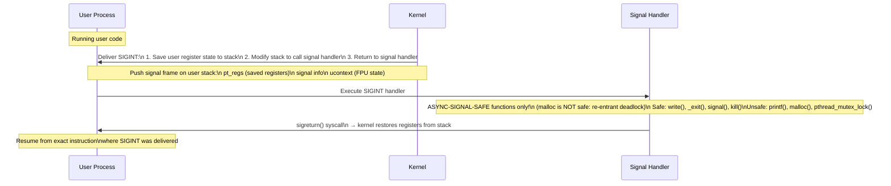

---

## 9. NUMA 아키텍처: 메모리 지역성

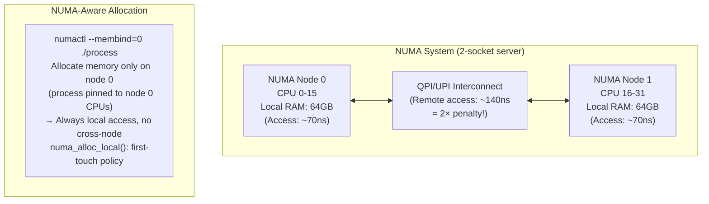

---

## 요약: 시스템 프로그래밍 기본 요소

| 원시 | 구현 | 커널 참여 |
|---|---|---|
| 뮤텍스 잠금(비경합) | 사용자 공간의 CAS | 없음(빠른 경로) |
| 뮤텍스 잠금(경합) | 퓨텍스(FUTEX_WAIT) | 예 — 프로세스가 차단되었습니다 |
| 스레드 생성 | 클론(CLONE_VM\|...) | 예 — 새 task_struct |
| 컨텍스트 전환 | 규정 저장, 규정 로드 | 예 — CFS 스케줄러 |
| 메모리 할당(<256B) | 스레드 캐시 LIFO | 없음(tcmalloc) |
| 메모리 할당(대형) | mmap(MAP_ANON) | 예 — 페이지 테이블 업데이트 |
| 파일 읽기(캐시됨) | 페이지 캐시에서 복사 | 최소 |
| 파일 읽기(캐시되지 않음) | 바이오 제출 + 수면 | 예 — I/O 스케줄러 |
| 신호 전달 | 스택 수정 → 핸들러 | 예 — 사용자 모드로 돌아가기 |
| 시스템 호출 | SYSCALL 명령어 | 예 - 링 0 전환 |


---

## 설계적 고민

### 구조와 모델링

시스템 프로그래밍의 근본 구조적 선택은 **추상화 계층 설계**다. POSIX의 "모든 것은 파일이다(Everything is a file)" 철학은 이 추상화의 정수를 보여준다. 일반 파일, 디렉토리, 디바이스, 소켓, 파이프, 프로세스 정보(`/proc`)까지 모두 파일 디스크립터(fd)로 접근한다.

이 단일 추상화의 **설계 가치**:

1. **조합성(composability)**: 셋 프로그램이 fd를 통해 자유롭게 조합된다. `ls | grep | wc`가 가능한 이유.
2. **통일 인터페이스**: `read()`/`write()`/`close()`/`ioctl()`로 모든 리소스를 조작. 새로운 API를 배울 필요 없다.
3. **리다이렉션 투명성**: `2>&1`로 stderr를 stdout으로 보내는 것이 fd 수준에서 작동.

그러나 이 추상화에는 **비용**이 있다. 네트워크 소켓은 파일처럼 `lseek()` 되지 않고, GPU는 `ioctl()` 지옥이 되며, 고성능 I/O는 `mmap()`이나 `io_uring` 같은 별도 경로를 요구한다.

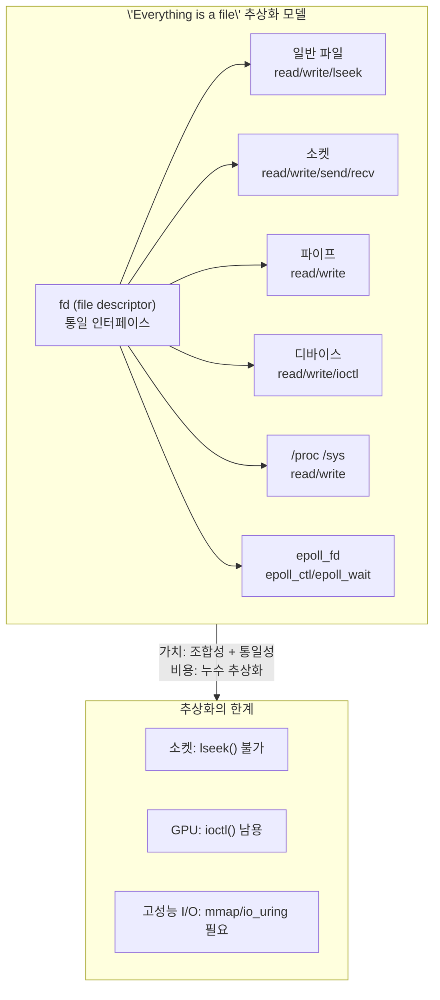

### 트레이드오프와 의사결정

#### 락-프리(lock-free) vs 락-기반: 복잡도 vs 성능

동시성 제어의 가장 근본적인 트레이드오프는 **락 기반 동기화의 단순성** vs **락-프리 알고리즘의 성능**이다.

**락 기반(Mutex/SpinLock)**:
- 장점: 논리가 단순하다. 임계 영역을 잠그고 작업하고 해제.
- 단점: **경합(contention)** 시 스레드가 블로킹되어 처리량 급감. 우선순위 역전(priority inversion), 데드락 위험.

**락-프리(CAS 기반)**:
- 장점: 어떤 스레드도 차단하지 않음. 높은 경합에서도 진행 보장(progress guarantee).
- 단점: ABA 문제, 메모리 순서(memory ordering), 검증의 어려움. **정확성 증명이 극도로 난해**.

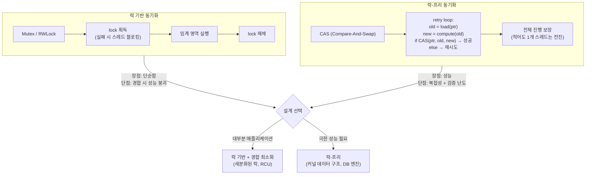

리눅스 커널의 **RCU(Read-Copy-Update)**는 이 트레이드오프의 훌륭한 타협점이다. 읽기는 락 없이 수행하고, 쓰기는 복사본을 수정한 후 모든 독자가 기존 버전 사용을 마칠 때까지 기다렸다가 교체한다. 읽기 많고 쓰기 적은 커널 데이터 구조(라우팅 테이블, 모듈 리스트)에 이상적이다.

#### Rust 소유권 모델: 컴파일 타임 안전성의 설계 가치

Rust의 소유권(ownership) 시스템은 **런타임 비용 제로로 메모리 안전성을 보장**하는 설계 혁신이다. C/C++의 use-after-free, double-free, 데이터 레이스를 컴파일러가 원천 차단한다.

- **소유권 규칙**: 각 값은 정확히 하나의 소유자를 가진다. 소유자가 스코프를 벗어나면 자동 `drop()`.
- **참조 규칙**: `&T`(불변 참조) 여러 개 OR `&mut T`(가변 참조) 단 하나. 동시 불가.
- **라이프타임**: 참조의 유효 범위를 정적으로 추적하여 dangling 참조 방지.

이 설계의 **트레이드오프**는 학습 곡선과 컴파일 시간 증가다. 그러나 시스템 프로그래밍에서 메모리 버그는 디버깅에 수일~수주가 소요되므로, 컴파일 타임 검증의 ROI는 압도적이다.

#### tcmalloc vs jemalloc vs glibc malloc: 단편화 vs 속도

메모리 할당자 선택은 **멀티스레드 성능**, **단편화**, **메모리 사용량** 사이의 3중 트레이드오프다.

| 할당자 | 핵심 전략 | 장점 | 단점 |
|---------|------------|--------|--------|
| glibc malloc | arena + bin (크기별 분류) | 범용성, 외부 의존 없음 | 높은 경합에서 느림 |
| tcmalloc | 스레드별 캠시 + 중앙 힙 | 소형 할당 초고속 | 메모리 사용량 증가 |
| jemalloc | arena 다중화 + slab | 단편화 최소화 | 소형 할당 tcmalloc보다 느림 |

tcmalloc의 스레드 로컬 캠시는 `malloc()`/`free()`에서 락을 완전히 회피한다. 256B 미만 할당은 스레드 로컬 캠시의 프리리스트에서 즉시 반환되므로 커널 개입이 전혀 없다.

### 리팩토링과 설계 원칙

#### Rust의 소유권 — 시스템 프로그래밍의 패러다임 전환

C에서 Rust로의 전환은 단순한 언어 교체가 아니라 **시스템 프로그래밍의 안전성 모델 리팩토링**이다.

- C: "프로그래머가 모든 것을 책임진다" → Valgrind, AddressSanitizer로 런타임 검증
- Rust: "컴파일러가 정적으로 증명한다" → borrow checker가 컴파일 시점에 검증

이는 소프트웨어 공학의 **"오류를 나중에 발견할수록 비용이 기하급수적으로 증가"** 원칙의 언어 수준 적용이다. 컴파일 타임 검증은 런타임 버그보다 10~100배 저렴하다.

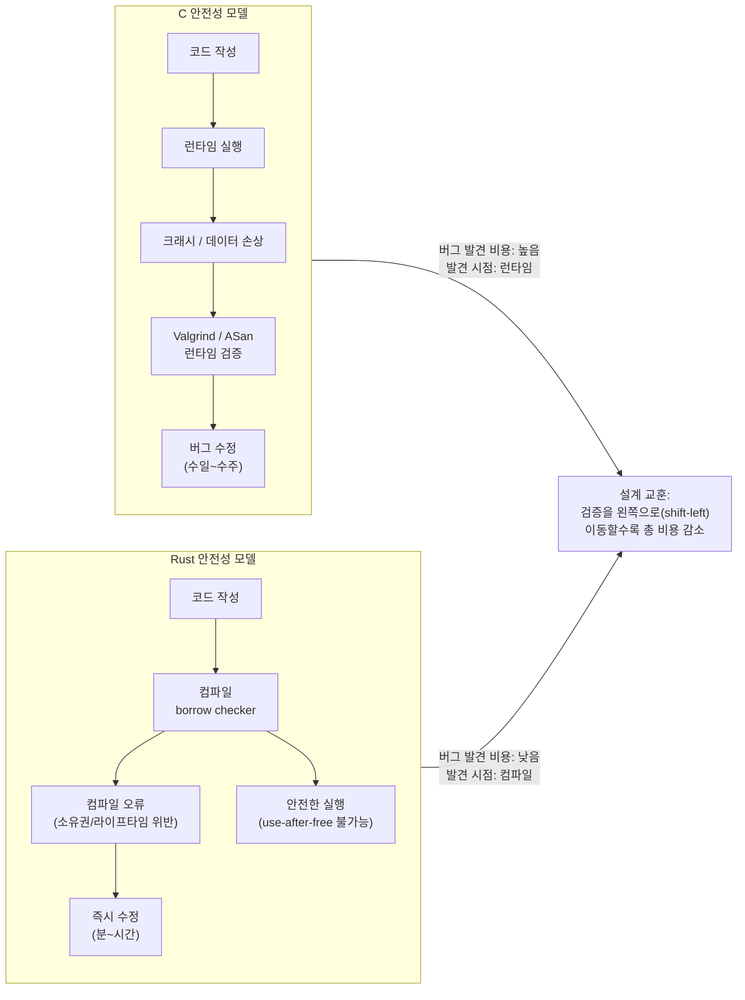

### 디자인 패턴 적용

#### 메모리 할당자의 스트래티지 패턴

메모리 할당자들은 **Strategy 패턴**의 전형적 적용이다. 동일한 인터페이스(`malloc`/`free`)를 유지하면서 내부 할당 전략만 교체한다. 애플리케이션은 `LD_PRELOAD=libtcmalloc.so` 한 줄로 할당자를 교체할 수 있다 — 코드 변경 제로.

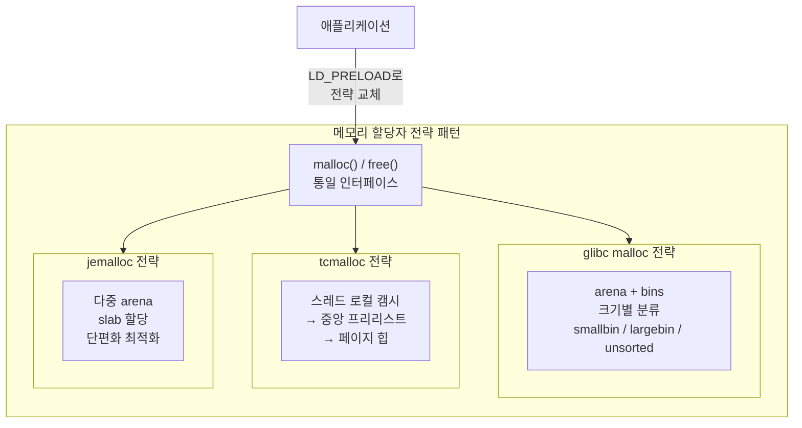

#### RAII 패턴: 리소스 수명을 스코프에 바인딩

**RAII(Resource Acquisition Is Initialization)**는 C++/Rust의 핵심 리소스 관리 패턴이다. 리소스(파일 핸들, 락, 메모리) 획득을 객체 생성에, 해제를 소멸자에 바인딩한다. 예외가 발생해도 스택 언와인딩이 소멸자를 보장하므로 리소스 누수가 구조적으로 불가능하다.

Rust의 `Drop` 트레이트, C++의 스마트 포인터(`unique_ptr`, `shared_ptr`), Go의 `defer`, Python의 컨텍스트 매니저(`with`)는 모두 RAII의 변형이다. 시스템 프로그래밍에서 리소스 누수는 공격 벡터이자 장애 원인이므로, 이 패턴의 적용은 선택이 아니라 필수다.

---

## 연습 문제

### 1. 시스템 구조와 모델링

**문제 1-1. epoll 기반 이벤트 루프의 동작 흐름**

Nginx는 단일 워커 프로세스로 수만 개의 동시 연결을 처리한다. 이 시스템의 핵심인 `epoll` 기반 이벤트 루프의 동작을 분석하라.

- `epoll_create()` → `epoll_ctl(EPOLL_CTL_ADD)` → `epoll_wait()` → 이벤트 처리의 전체 순환 흐름을 서술하고, 각 단계에서 커널 내부에서 무슨 일이 일어나는지 설명하라.
- `select()`/`poll()`과 비교하여 `epoll`이 O(1) 이벤트 알림을 달성하는 **내부 구조(ready list + 콜백)**를 설명하라.
- **Level-Triggered** vs **Edge-Triggered** 모드의 차이와, Edge-Triggered에서 부분적 읽기(partial read) 시 발생할 수 있는 **데이터 손실 위험**을 설명하라.

<details><summary>힌트 보기</summary>

`epoll_create()`는 커널에 레드-블랙 트리(eventpoll 구조체)를 생성한다. `epoll_ctl(ADD)`로 fd를 등록하면 해당 fd의 wait queue에 콜백을 등록한다. fd에 이벤트가 발생하면 콜백이 실행되어 ready list에 추가된다. `epoll_wait()`는 ready list만 반환하므로 O(1)이다(select/poll은 매번 전체 fd를 스캔하므로 O(n)). Level-Triggered는 데이터가 있는 한 계속 알리지만, Edge-Triggered는 상태 변화 시에만 알리므로 데이터를 완전히 읽지 않으면(EAGAIN까지 읽지 않으면) 남은 데이터에 대한 알림이 다시 오지 않는다.

</details>

**문제 1-2. Rust 소유권/빌림 검사기의 Data Race 방지 메커니즘**

다음 Rust 코드가 컴파일되지 않는 이유를 분석하라:

```rust
fn main() {
    let mut data = vec![1, 2, 3];
    let ref1 = &mut data;
    let ref2 = &mut data;  // 컴파일 에러!
    ref1.push(4);
    ref2.push(5);
}
```

- Rust의 균일 참조 규칙("동시에 가변 참조는 하나만, 또는 불변 참조는 여러 개")이 **data race의 3가지 필요조건** 중 어떤 것을 구조적으로 차단하는지 설명하라.
- C/C++에서 동일한 로직을 작성하면 컴파일된다. 이 코드가 멀티스레드 환경에서 실행될 때 발생할 수 있는 **구체적인 위험 시나리오**를 서술하라.
- `Arc<Mutex<T>>`를 사용하면 이 문제를 해결할 수 있다. 이때 소유권 시스템과 Mutex가 **각각 어떤 역할**을 담당하는지 설명하라.

<details><summary>힌트 보기</summary>

Data race의 3조건: ① 두 이상의 스레드가 동시 접근 ② 최소 하나가 쓰기 ③ 동기화 없음. Rust는 ①번 조건(동시 가변 접근)을 컴파일 타임에 차단한다. C/C++에서는 두 스레드가 동시에 vec을 push하면 내부 버퍼 재할당 시 use-after-free, 데이터 손상, segfault 등이 발생한다. `Arc`는 소유권의 스레드 간 공유(레퍼런스 카운팅)를 담당하고, `Mutex`는 접근 동기화를 담당한다. 컴파일러가 `Send`/`Sync` 트레잇으로 스레드 안전성을 검증한다.

</details>

**문제 1-3. 시스템 호출의 유저-커널 전환 흐름**

사용자 프로그램에서 `write(fd, buf, 1024)`를 호출했다. 이 호출이 커널에 도달하여 실제 I/O가 수행되기까지의 전체 흐름을 추적하라.

- x86-64에서 `syscall` 명령어가 실행될 때 CPU가 수행하는 **하드웨어 수준의 동작**(RIP 저장, MSR에서 엔트리 포인트 로드, 권한 전환)을 설명하라.
- `vDSO(Virtual Dynamic Shared Object)`가 `gettimeofday()` 같은 호출에 대해 커널 전환을 회피하는 원리는 무엇인가?
- `strace`로 본 시스템 호출 오버헤드가 성능에 미치는 영향을 한 웹 서버가 초당 100,000개의 요청을 처리하는 시나리오에서 추정하라.

<details><summary>힌트 보기</summary>

x86-64 `syscall` 명령: ① RCX에 리턴 주소 저장 ② R11에 RFLAGS 저장 ③ MSR(IA32_LSTAR)에서 커널 엔트리 포인트를 RIP에 로드 ④ CPL 3→0(유저→커널 모드) 전환 ⑤ 커널 스택으로 전환. vDSO는 커널이 유저 주소 공간에 매핑한 공유 라이브러리로, `gettimeofday()` 등을 커널 전환 없이 유저 공간에서 직접 읽는다. syscall 오버헤드는 약 100ns~1µs이므로 100K req/s에서 하나의 요청당 10회 syscall이면 초당 1M회, 총 ~100ms의 CPU 시간을 소비한다.

</details>

### 2. 트레이드오프와 의사결정

**문제 2-1. 공유 메모리 + mutex vs 메시지 패싱: 동시성 모델 선택**

고빈도 업데이트 카운터(100개 스레드가 초당 100만 회 증가)를 구현해야 한다. 다음 두 접근법을 비교하라:

- **C + pthread mutex**: 공유 변수를 직접 보호
- **Go 채널(CSP 모델)**: 메시지 패싱으로 간접 동기화

100개 스레드 × 초당 100만 회 증가 시나리오에서 각 모델의 **병목 지점**, **스레드 경합(contention)**, **캐시 라인 바운싱**을 분석하고, 어떤 모델이 더 적합한지 근거를 제시하라.

<details><summary>힌트 보기</summary>

이 시나리오는 단일 카운터에 초당 1억 회 접근하므로 mutex는 심각한 contention을 유발한다. 락 횟수가 많아져 스핀락→커널 futex 전환이 빈번해진다. Go 채널 모델은 모든 증가를 하나의 goroutine에 도달시켜야 하므로 메시지 패싱 오버헤드가 병목이 된다. 이 특수 케이스에는 `atomic.AddInt64`(락-프리 원자적 연산)이 양쪽 모두보다 우수하다. 다만 중간값 읽기나 복합 연산이 필요하면 다시 락이나 채널이 필요하다.

</details>

**문제 2-2. 메모리 할당자 선택: jemalloc vs tcmalloc vs glibc malloc**

세 가지 서로 다른 워크로드가 있다:

- **웹 서버**: 수천 개 동시 연결, 연결당 작은 할당(~4KB)/해제 반복
- **데이터베이스(Redis)**: 다양한 크기의 키/값 저장, 장시간 운영으로 단편화 축적
- **단기 스크립트**: 실행 후 즉시 종료, 대량 할당 후 프로세스 종료로 OS가 회수

각 워크로드에 glibc malloc, jemalloc, tcmalloc 중 어떤 할당자가 최적인지 근거를 제시하라. 특히 각 할당자의 **내부 설계(arena, thread-local cache, slab)**와 워크로드 특성의 매칭을 분석하라.

<details><summary>힌트 보기</summary>

glibc malloc은 arena별 bins 구조로 다양한 크기를 처리하지만 arena 락 경합이 있다. tcmalloc은 스레드 로컬 캐시로 작은 할당이 극히 빠르다 → 웹 서버에 적합. jemalloc은 다중 arena + slab로 단편화를 최소화한다 → Redis/Firefox가 사용. 단기 스크립트는 할당자 선택이 거의 의미 없다 — 프로세스 종료 시 OS가 전체 메모리를 회수하므로 free() 자체가 선택적이다.

</details>

**문제 2-3. 동기식 I/O vs 비동기식 I/O 선택**

데이터베이스 서버가 디스크에서 10,000개의 레코드를 읽어야 한다. 두 가지 접근을 비교하라:

- **동기식**: 스레드 풀의 각 스레드가 `pread()` blocking 호출로 하나씩 읽기
- **비동기식**: `io_uring`로 10,000개 읽기 요청을 배치 제출

각 접근의 **시스템 호출 횟수**, **컨텍스트 스위칭 총량**, **디스크 I/O 스케줄러 활용도**를 비교하고, 어떤 상황에서 동기식이 오히려 더 나은 선택인지 설명하라.

<details><summary>힌트 보기</summary>

동기식은 10,000번의 `pread` syscall + 각각 커널에서의 I/O 대기로 컨텍스트 스위칭이 빈번하다. `io_uring`은 SQ에 10,000개를 넣고 `io_uring_enter()` 1회로 제출, 커널이 배치로 처리하므로 디스크 I/O 스케줄러가 요청을 엘리베이터 알고리즘으로 최적 순서로 처리할 수 있다. 다만 순차적으로 읽어야 하는 의존성 있는 I/O(예: B-tree 트래버스)에서는 동기식이 더 간단하고 예측 가능하다.

</details>

### 3. 문제 해결 및 리팩토링

**문제 3-1. Use-After-Free 버그의 발생과 방지**

다음 C 코드에서 보안 취약점이 발생하는 시점과 이유를 분석하라:

```c
char *buf = malloc(256);
read(fd, buf, 256);
free(buf);
// ... 다른 작업 ...
printf("%s\n", buf);  // use-after-free!
```

- `free(buf)` 후 `buf` 포인터가 여전히 유효한 것처럼 보이는 이유와, 이것이 **공격자에게 어떻게 악용될 수 있는지** 설명하라.
- 동일한 로직을 Rust로 작성하면 컴파일러가 어떤 시점에서 어떤 오류를 발생시키는지, 소유권 시스템의 규칙과 연결하여 설명하라.
- C에서 이 문제를 완화하기 위한 방법(AddressSanitizer, 널 포인터 설정, 스마트 포인터 패턴)과 각각의 한계를 설명하라.

<details><summary>힌트 보기</summary>

`free()` 후 메모리는 할당자의 free list에 반환되지만 물리 주소는 유효하다. 다음 `malloc()`이 같은 영역을 할당하면 공격자가 함수 포인터 등을 주입해 임의 코드 실행(heap spray)이 가능하다. Rust에서는 `free(buf)` 후 `buf`의 소유권이 소멸되어 이후 사용이 컴파일 오류이다. C에서는 `free()` 후 `buf = NULL`로 설정하는 방어적 패턴이 있지만 모든 복사본을 널로 설정할 수는 없다. AddressSanitizer는 테스트 시에만 동작하며 2x 성능 오버헤드가 있다.

</details>

**문제 3-2. Lock Contention으로 인한 큐 처리량 붕괴**

멀티스레드 웹 서버에서 요청 큐를 mutex 기반 연결 리스트로 구현했다. 64개 코어에서 실행했지만 처리량이 단일 스레드의 10%에 불과하다.

- 락 경합이 **구체적으로 어떻게 성능을 저하**시키는지 스핀락→futex 전환, 캐시 라인 바운싱 관점에서 설명하라.
- **Michael-Scott lock-free queue**로 교체하면 성능이 향상되는 원리를 CAS(비교-교환) 연산과 연결하여 설명하라.
- Lock-free 구조의 한계점(복잡한 메모리 리클레임, ABA 문제)과 이를 해결하는 방법(hazard pointer, epoch-based reclamation)을 설명하라.

<details><summary>힌트 보기</summary>

64코어에서 단일 mutex를 두고 경쪽하면 대부분의 시간이 락 횝득/해제와 캐시 라인 트래픽(lock이 있는 캐시 라인의 배타적 전송)에 소비된다. Michael-Scott queue는 head/tail 포인터를 CAS로 원자적 교체하여 락 없이 enqueue/dequeue한다. ABA 문제는 CAS가 성공하지만 실제로는 포인터가 다른 노드를 가리키는 것으로, tagged pointer(버전 카운터를 포인터에 내장)로 해결한다. Epoch-based reclamation은 모든 스레드가 특정 epoch를 지나면 해당 epoch의 노드를 안전하게 해제하는 방식이다.

</details>

**문제 3-3. 메모리 누수 추적과 구조적 방지**

장시간 운영되는 C 서버 프로그램의 RSS(상주 메모리)가 시간이 지날수록 계속 증가하고 있다. `valgrind --leak-check=full`로 분석했더니 다음 결과가 나왔다:

```
==1234== 8,192 bytes in 1,024 blocks are definitely lost
==1234==    at malloc (vg_replace_malloc.c:380)
==1234==    by handle_request (server.c:142)
```

- `definitely lost`와 `possibly lost`의 차이를 메모리 할당자 내부 구조 관점에서 설명하라.
- `handle_request`에서 `malloc`된 메모리가 누수되는 **일반적인 코드 패턴**(early return, 예외 경로)을 제시하고 수정 방법을 설명하라.
- C++의 RAII/스마트 포인터, Rust의 소유권 시스템, Go의 GC가 각각 메모리 누수를 **어떤 수준으로** 방지하는지 비교하라.

<details><summary>힌트 보기</summary>

`definitely lost`는 할당된 메모리를 가리키는 포인터가 프로그램 어디에도 없는 경우, `possibly lost`는 포인터가 블록 내부를 가리키는 경우(할당자가 추적 불가). 흔한 누수 패턴: `if (error) return;`에서 `free()` 누락, 루프 내 매 반복 `malloc` 후 마지막 반복만 `free`. C++ RAII는 스코프 종료 시 자동 해제로 구조적 방지. Rust는 소유권 이동/드롭으로 누수가 구조적으로 불가능(순환 참조 제외). Go의 GC는 도달 불가능한 객체를 자동 회수하지만 GC pause와 메모리 오버헤드가 있다.

</details>

### 4. 개념 간의 연결성

**문제 4-1. POSIX 시그널 + 비동기 I/O: Node.js의 libuv 아키텍처**

Node.js는 단일 스레드 이벤트 루프로 동작하지만, 파일 I/O는 내부적으로 스레드 풀을 사용한다.

- 네트워크 I/O는 `epoll`/`kqueue`로 처리하면서도, 파일 I/O는 **스레드 풀로 처리하는 기술적 이유**를 리눅스 커널의 파일 시스템 AIO 지원 현황과 연결하여 설명하라.
- POSIX 시그널(`SIGPIPE`, `SIGCHLD` 등)이 이벤트 루프 내부에서 **어떻게 처리되는지**, 시그널 핸들러와 이벤트 루프의 상호작용을 설명하라.
- `io_uring`이 리눅스에서 성숙하면, libuv의 파일 I/O 스레드 풀 아키텍처가 어떻게 **변화할 수 있을지** 예측하라.

<details><summary>힌트 보기</summary>

리눅스의 POSIX AIO(`aio_read`)는 실제로는 유저 공간 스레드로 구현되어 진정한 비동기가 아니며, 일반 파일에 대한 epoll은 항상 ready를 반환하여 의미가 없다. 그래서 libuv는 스레드 풀에서 blocking I/O를 수행하고 완료를 이벤트 루프에 알린다. POSIX 시그널은 libuv가 self-pipe trick(또는 eventfd)로 이벤트 루프에 통합한다 — 시그널 핸들러에서 파이프에 쓰면 epoll이 이를 감지한다. `io_uring`이 성숙하면 파일 I/O도 SQ/CQ 링으로 비동기 처리할 수 있어 스레드 풀이 불필요해질 수 있다.

</details>

**문제 4-2. Memory Ordering + CAS: Lock-Free 스택의 ABA 문제**

다음과 같은 lock-free 스택을 CAS로 구현했다:

```
스택 상태: top → A → B → C

스레드 1: pop() 시도 - top=A, next=B를 읽음 (CAS 전에 선점)
스레드 2: pop() A, pop() B, push() A 실행 (스택: top → A → C)
스레드 1: CAS(top, A, B) 성공! → top = B 하지만 B는 이미 해제됨!
```

- 이 **ABA 문제**가 발생하는 정확한 메커니즘을 단계별로 서술하라.
- **Tagged pointer**(포인터 + 버전 카운터)가 ABA 문제를 해결하는 원리를 설명하라.
- 이 시나리오에서 `memory_order_acquire`/`memory_order_release`가 없으면 어떤 **추가적인 문제**가 발생할 수 있는지 CPU 메모리 모델 관점에서 설명하라.

<details><summary>힌트 보기</summary>

ABA: 스레드1이 A를 읽고 CAS 전에 선점되는 동안, 스레드2가 A를 빛고 B를 빝고 A를 다시 넣는다. 스레드1의 CAS(top, A, B)는 top이 여전히 A이므로 성공하지만, B는 이미 해제된 노드이다. Tagged pointer는 포인터에 단조 증가하는 버전 카운터를 붙여 CAS가 주소+버전을 함께 비교하므로 A가 같아도 버전이 다르면 실패한다. Memory ordering 없이는 CPU가 store/load를 재정렬하여 스레드1이 B의 next를 읽을 때 이전 값(C)이 아닌 쓰레기 값을 보는 것이 가능하다.

</details>

**문제 4-3. Rust 소유권 + 시스템 프로그래밍: 제로 코스트 추상화의 실제**

Rust는 “제로 코스트 추상화(zero-cost abstractions)”를 핵심 철학으로 한다. 다음 시나리오를 분석하라:

- Rust의 `Iterator` 체이닝(`.filter().map().collect()`)이 C의 수동 for 루프와 **동일한 머신 코드**를 생성하는 원리를 모노모픽화(monomorphization)와 인라이닝 관점에서 설명하라.
- `Box<dyn Trait>`를 사용하면 제로 코스트가 깨지는 이유를 vtable 동적 디스패치와 연결하여 설명하라.
- 시스템 프로그래밍 컨텍스트에서 Rust의 소유권 시스템이 C에 비해 **런타임 오버헤드 없이 안전성을 보장**하는 이유를 드롭(자동 해제)과 빌림 검사기의 컴파일 타임 검증 관점에서 설명하라.

<details><summary>힌트 보기</summary>

제네릭 `Iterator` 체이닝은 모노모피화로 치환되어 각 클로저/콜백이 콜 사이트에서 인라인된다. LLVM이 이를 C의 for 루프와 동일한 머신 코드로 최적화한다. `dyn Trait`는 모노모피화 대신 vtable을 통한 동적 디스패치를 사용하므로 간접 함수 호출 오버헤드와 인라이닝 실패가 발생한다. Rust의 소유권/Drop은 C의 `free()`와 동일한 코드를 생성하되(런타임 오버헤드 제로), 빌림 검사기가 컴파일 타임에 라이프타임 유효성을 검증하여 use-after-free/double-free를 방지한다.

</details>