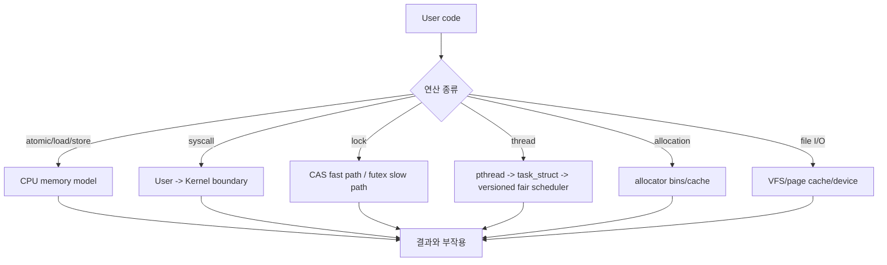
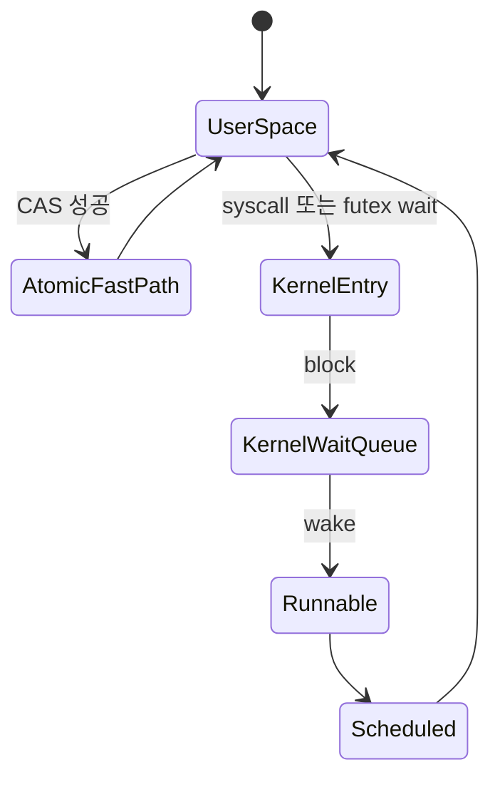

# 시스템 프로그래밍 내부 동작 학습 및 기록 노트

## 문서 범위와 검증 계약

- **범위**: 주로 x86-64 Linux, glibc 계열 환경과 safe Rust의 대표 동작을 설명하는 학습용 개요입니다. POSIX가 보장하는 인터페이스와 Linux·CPU·할당자 버전의 구현 세부를 구분합니다.
- **전제**: 레지스터 저장 순서, 스케줄러 자료구조, bin/size class, syscall·NUMA 지연과 컨텍스트 전환 비용은 커널·libc·CPU·보안 완화·부하에 따라 바뀝니다. 다이어그램은 실제 소스의 완전한 제어 흐름이 아닙니다.
- **근거 상태**: 메모리 순서는 언어와 ISA 명세, 커널 동작은 대상 커널 소스/문서와 추적으로 확인합니다. 시간·크기·배수는 조건이 없는 참조값이 아니며 벤치마크와 프로파일 결과가 있어야 사실로 사용합니다.
- **실패/재시도**: syscall·I/O·락 획득은 `errno`, 부분 완료, `EINTR`, timeout과 취소 상태를 보존합니다. 재시도 가능 오류만 멱등성과 진행 한계를 확인해 백오프하며, 무한 CAS·I/O 재시도나 오류 무시는 완료가 아닙니다.
- **완료 증거**: 실습에는 커널/libc/compiler 버전, CPU·NUMA 토폴로지, 빌드 플래그, 실행 명령, 입력 부하와 원시 trace/profile을 남깁니다. 동시성 코드는 불변식, 메모리 순서, 중복/부분 실패와 종료 조건을 검증해야 완료입니다.

## 1. 왜 필요한가? (Pain Point & Motivation)

시스템 프로그래밍은 사용자 공간 코드가 CPU, 메모리 모델, 커널, 스케줄러, allocator, 파일 시스템과 직접 만나는 영역이다. 대표적인 futex 기반 mutex는 비경합 시 사용자 공간 원자 연산으로 끝날 수 있고, 경합 시에는 적응형 스핀이나 futex wait/wake를 선택한다. 정확한 경로와 syscall 수는 mutex 속성과 구현에 따라 다르다. 같은 load/store도 CPU memory model과 fence에 따라 다른 thread에서 보이는 순서가 달라질 수 있다.

이 문서는 원문 한국어 시스템 프로그래밍 문서를 메모리 순서, syscall, futex, Rust ownership, pthread, allocator, POSIX I/O 중심으로 재작성한다.

## 2. 현재 나의 상태 (Baseline)

- syscall, mutex, thread, malloc, file I/O, Rust ownership의 기본 개념은 알고 있다.
- store buffer, memory fence, atomic RMW가 실제 동시성 버그와 어떻게 연결되는지 정리해야 한다.
- futex가 왜 빠른 mutex 구현의 핵심인지 fast path/slow path로 구분해야 한다.
- pthread가 Linux `task_struct`와 대상 커널의 fair scheduling 정책에 어떻게 매핑되는지 정리해야 한다. CFS와 EEVDF 세부는 커널 버전을 구분한다.
- allocator의 bin/cache 구조와 fragmentation, contention 문제를 이해해야 한다.

## 3. 도달하고 싶은 목표 (Target State)

- CPU memory model과 fence가 load/store ordering을 어떻게 제한하는지 설명한다.
- syscall이 user mode에서 kernel mode로 전환되는 경로를 추적한다.
- futex 기반 mutex의 uncontended/contended path를 구분한다.
- safe Rust의 borrow checking이 언어의 타입·aliasing 모델 안에서 많은 use-after-free와 data race를 배제하는 방식을 설명하고, unsafe/FFI와 Send/Sync 경계는 별도로 검토한다.
- thread scheduling, TLS, allocator, POSIX file I/O를 내부 상태와 연결한다.

## 4. 시스템 번역 (Data Flow)



시스템 프로그래밍의 data flow는 언어 런타임을 지나 CPU와 커널의 실제 상태로 내려간다.

## 5. 핵심 구성요소 (Building Blocks)

| 구성요소 | 내부 상태 | 핵심 질문 |
| --- | --- | --- |
| Store buffer | 아직 전역 가시성이 없는 store | 다른 core에서 언제 보이는가? |
| Memory fence | load/store ordering 제약 | 어떤 재정렬을 막아야 하는가? |
| Syscall entry | register args, kernel stack | 권한 경계를 안전하게 넘는가? |
| vDSO | user space에 매핑된 kernel helper | ring switch 없이 처리 가능한가? |
| Futex | user word + kernel wait queue | 경합이 있을 때만 syscall하는가? |
| Spinlock/Mutex | busy wait 또는 sleep | critical section 길이에 맞는가? |
| Borrow checker | ownership/borrow state | lifetime과 aliasing 규칙을 지키는가? |
| pthread | Linux task와 thread stack | 스케줄러 entity로 독립 실행되는가? |
| Allocator | fastbin/smallbin/thread cache | fragmentation과 lock contention을 줄이는가? |
| POSIX I/O | fd, VFS, page cache | buffered/direct/sync 의미를 구분하는가? |

## 6. 상태 전이 (State Transition)



대표적인 futex 기반 mutex는 사용자 공간 fast path와 필요 시 잠들 수 있는 slow path를 나눈다. 경합이 발생했다고 반드시 바로 sleep하거나 고정된 횟수의 syscall을 수행하는 것은 아니며, 적응형 스핀과 wait/wake 정책을 대상 구현에서 확인한다.

## 7. 불변식 (Invariant: 절대 깨지면 안 되는 규칙)

- atomic ordering은 공유 데이터의 가시성 요구와 맞아야 한다.
- syscall 인자는 커널이 검증할 수 있는 사용자 공간 주소와 권한을 가져야 한다.
- futex wait는 기대한 user word 값이 유지될 때만 sleep해야 lost wakeup을 피할 수 있다.
- spinlock은 오래 기다릴 수 있는 critical section에 쓰면 CPU를 낭비한다.
- safe Rust에서는 동일한 값에 대한 ordinary shared borrow와 exclusive mutable borrow의 유효 범위가 충돌하면 안 된다. 내부 가변성·unsafe·FFI의 별도 규칙도 확인한다.
- pthread stack과 TLS는 thread별로 독립되어야 한다.
- allocator는 free된 chunk metadata가 손상되면 임의 코드 실행 취약점으로 이어질 수 있다.
- file I/O는 page cache, fsync, rename atomicity의 의미를 정확히 구분해야 한다.

## 8. 가장 작은 예제 (Minimal Viable Example)

```c
// 개념 모델: uncontended mutex fast path
int expected = 0;
if (atomic_compare_exchange_strong_explicit(&lock_word, &expected, 1,
                                           memory_order_acquire, memory_order_relaxed)) {
    // user space에서 lock 획득, syscall 없음
} else {
    // contended: futex_wait로 kernel wait queue 진입
}
```

이 예제는 사용자 공간 원자 연산으로 lock을 얻는 fast path의 개념만 보인다. 실제 lock/unlock의 syscall 여부와 비용은 mutex 속성, 경합, 스핀·wait/wake 정책에 따라 측정해야 하며 완전한 mutex 구현은 아니다.

## 9. 실패 사례 (What could go wrong?)

- memory ordering을 명시하지 않아 한 thread의 write가 다른 thread에 예상 순서로 보이지 않는다.
- futex wait 전에 값 확인을 잘못해 wakeup을 놓친다.
- spinlock을 긴 I/O critical section에 사용해 CPU를 태운다.
- syscall error return을 확인하지 않아 partial write/read를 정상 완료로 처리한다.
- `fork` 이후 lock을 잡은 thread가 사라져 child process에서 deadlock이 생긴다.
- allocator double free나 use-after-free가 heap metadata를 오염시킨다.
- Rust의 unsafe block에서 aliasing/lifetime 규칙을 수동으로 깨뜨린다.

## 10. 뇌 확장하기 (Evolution & Variants)

- Memory model은 x86 TSO, ARM relaxed model, C/C++ atomic ordering을 비교한다.
- Synchronization은 mutex, rwlock, condition variable, semaphore, lock-free queue로 확장한다.
- I/O는 blocking, non-blocking, epoll, io_uring, direct I/O로 비교한다.
- Allocator는 glibc ptmalloc, jemalloc, tcmalloc, slab allocator를 구조별로 본다.
- Rust ownership은 Send/Sync, Pin, unsafe, FFI boundary까지 확장한다.
- Kernel boundary는 seccomp, eBPF, namespaces, cgroups와 연결된다.

## 11. 최종 체크리스트 (Definition of Done)

- [x] 메모리 모델, syscall, futex, Rust ownership, pthread, allocator, 파일 I/O를 내부 상태로 정리했다.
- [x] futex fast/slow path를 최소 예제로 설명했다.
- [x] lost wakeup, partial I/O, double free, memory ordering 실패 사례를 포함했다.
- [x] 시스템 프로그래밍의 user/kernel boundary를 data flow로 표현했다.
- [x] 원문 한국어 시스템 프로그래밍 문서를 12개 섹션 템플릿으로 재작성했다.

## 12. 뇌에 새기는 복습 문장 (TL;DR Blank)

시스템 프로그래밍은 추상 API 아래에서 CPU 순서, 커널 진입, wait queue, allocator metadata가 어떻게 움직이는지 이해하는 일이다.
