# 시스템 프로그래밍 내부: 메모리 모델, Syscall 및 동시성 프리미티브

> 내부 내용: CPU 메모리 모델의 저장/로드 순서, 시스템 호출이 사용자/커널 경계를 넘는 방법, 뮤텍스와 퓨텍스가 커널에서 차단을 구현하는 방법, Rust의 빌림 검사기가 컴파일 타임에 메모리 안전을 강화하는 방법, POSIX 스레드가 커널 스케줄러 엔터티에 매핑되는 방법.

## 문서 범위와 검증 계약

- **범위**: 주로 x86-64 Linux, glibc 계열 환경과 safe Rust의 대표 동작을 설명하는 학습용 개요입니다. POSIX가 보장하는 인터페이스와 Linux·CPU·할당자 버전의 구현 세부를 구분합니다.
- **전제**: 레지스터 저장 순서, 스케줄러 자료구조, bin/size class, syscall·NUMA 지연과 컨텍스트 전환 비용은 커널·libc·CPU·보안 완화·부하에 따라 바뀝니다. 다이어그램은 실제 소스의 완전한 제어 흐름이 아닙니다.
- **근거 상태**: 메모리 순서는 언어와 ISA 명세, 커널 동작은 대상 커널 소스/문서와 추적으로 확인합니다. 시간·크기·배수는 조건이 없는 참조값이 아니며 벤치마크와 프로파일 결과가 있어야 사실로 사용합니다.
- **실패/재시도**: syscall·I/O·락 획득은 `errno`, 부분 완료, `EINTR`, timeout과 취소 상태를 보존합니다. 재시도 가능 오류만 멱등성과 진행 한계를 확인해 백오프하며, 무한 CAS·I/O 재시도나 오류 무시는 완료가 아닙니다.
- **완료 증거**: 실습에는 커널/libc/compiler 버전, CPU·NUMA 토폴로지, 빌드 플래그, 실행 명령, 입력 부하와 원시 trace/profile을 남깁니다. 동시성 코드는 불변식, 메모리 순서, 중복/부분 실패와 종료 조건을 검증해야 완료입니다.

---

## 1. CPU 메모리 모델: 저장/로드 순서

CPU와 컴파일러는 각 메모리 모델이 허용하는 범위에서 관찰 가능한 순서를 바꿀 수 있습니다. 데이터 경쟁이 있는 코드를 소스 순서만으로 추론하지 말고 언어 원자 연산과 happens-before 규칙을 함께 사용해야 합니다.

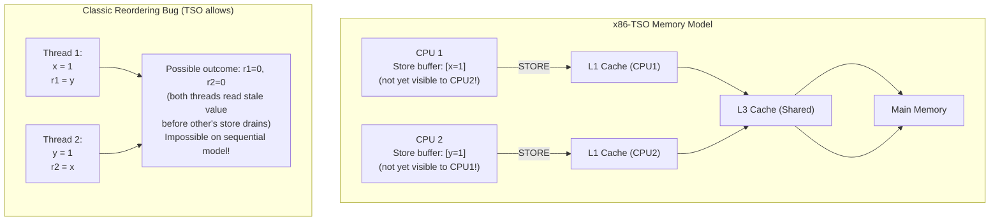

### 기억의 울타리와 장벽

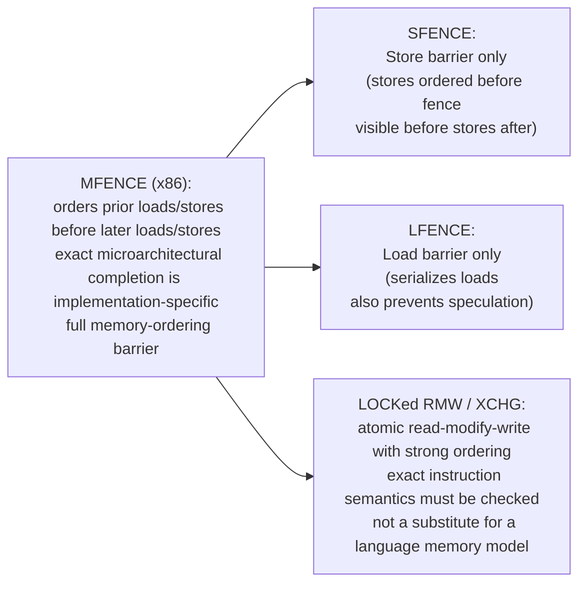

---

## 2. 시스템 호출: 사용자 공간 → 커널 크로싱

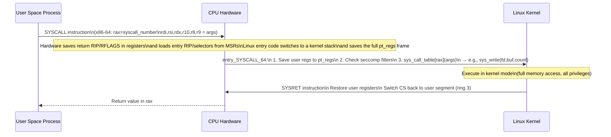

### vDSO: Syscall 오버헤드 방지

일부 시간 조회처럼 커널이 안전한 사용자 공간 구현을 제공할 수 있는 호출에서 Linux는 **vDSO**(가상 동적 공유 개체)의 사용자 공간 코드를 매핑합니다. vDSO는 “커널 코드를 직접 실행”하는 것이 아니며 clocksource·아키텍처에 따라 실제 syscall로 폴백할 수 있습니다.

```
gettimeofday() call in user space:
  NORMAL: SYSCALL → kernel → read clock → return (cost is platform-dependent)
  vDSO:   Call vDSO function directly (no ring switch!)
          Reads time from shared memory page (mapped by kernel)
          Usually cheaper; measure on the target kernel/CPU
```

---

## 3. 뮤텍스 구현: Futex

futex(빠른 사용자 공간 뮤텍스)는 경합이 없는 경우 syscall을 방지합니다.

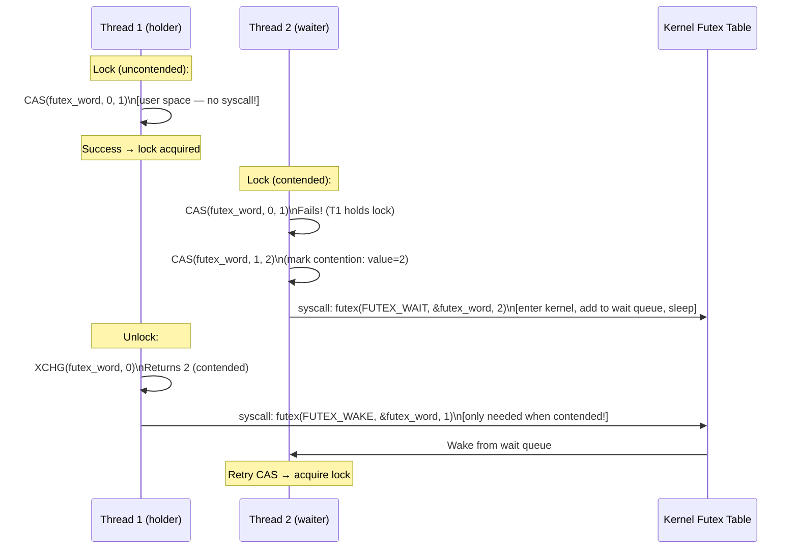

**빠른 경로**: 대표적인 futex 기반 mutex는 비경합 시 사용자 공간 원자 연산으로 끝날 수 있습니다. 정확한 연산 수는 pthread 구현과 mutex 속성에 따라 다릅니다.  
**느린 경로**: 경합 시 futex wait/wake를 사용할 수 있지만 적응형 스핀, 경쟁 상태와 wake 정책 때문에 경합 한 번당 syscall 수가 고정되는 것은 아닙니다.

### Spinlock 대 Mutex Tradeoff

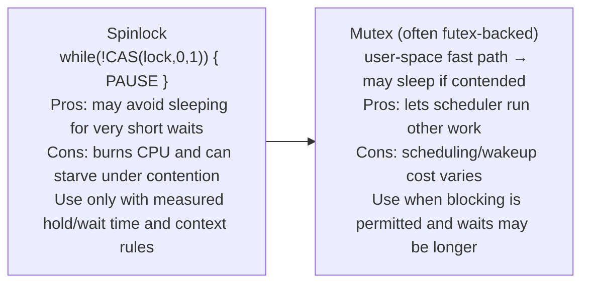

---

## 4. Rust Borrow Checker: 컴파일 타임의 소유권 규칙

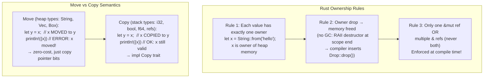

### 수명 주석: 차용 범위 적용

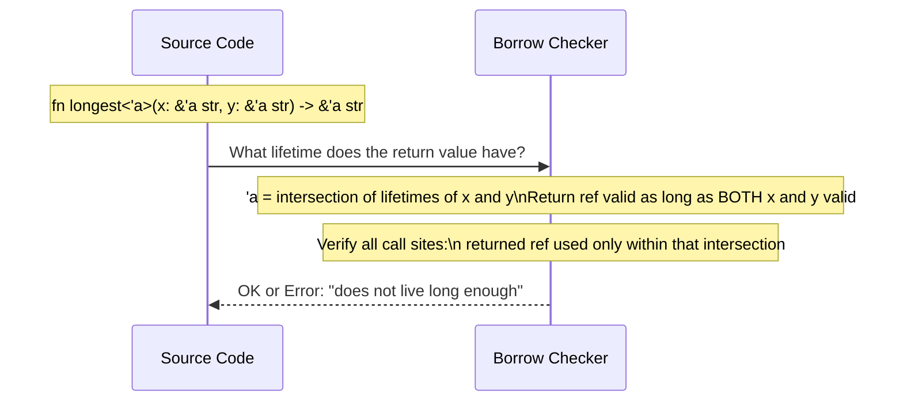

**빌림 검사는 정적 분석이며 별도 런타임 검사기를 삽입하지 않습니다**:
- Use-after-free: 빌림이 존재하는 동안 소유자가 삭제됨 → 컴파일 오류
- 데이터 경합: 다른 참조가 활성화된 동안 `&mut` 참조 → 컴파일 오류
- 댕글링 참조: 범위를 벗어난 값에 대한 참조 → 컴파일 오류

이 보장은 safe Rust와 올바른 `Send`/`Sync` 구현 범위입니다. `unsafe`, FFI, 원시 포인터, `RefCell` 같은 동적 검사와 교착·논리 경쟁은 별도 검토가 필요하고, `Drop` 실행 자체의 비용은 남습니다.

---

## 5. POSIX 스레드: 커널 매핑 및 스케줄링

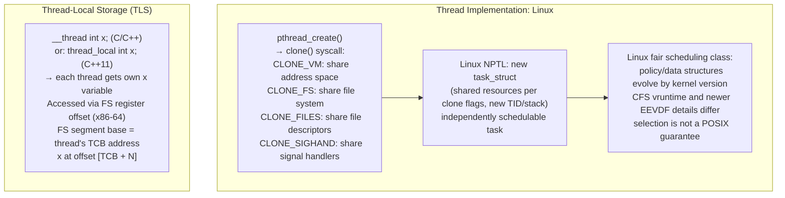

### 컨텍스트 전환: 저장되는 내용

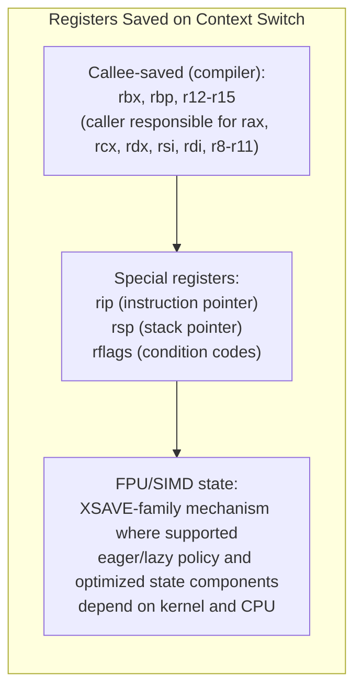

---

## 6. 메모리 할당자 내부: glibc malloc

다음 ptmalloc·TCMalloc 그림은 대표 개념도입니다. 현대 glibc의 tcache, safe-linking, bin 경계와 최신 TCMalloc의 per-CPU 캐시 등은 버전·빌드마다 다르므로 숫자를 ABI 계약으로 사용하지 않습니다.

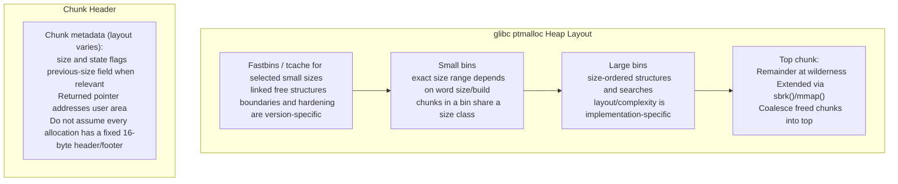

### TCMalloc: 낮은 경합을 위한 스레드 캐싱

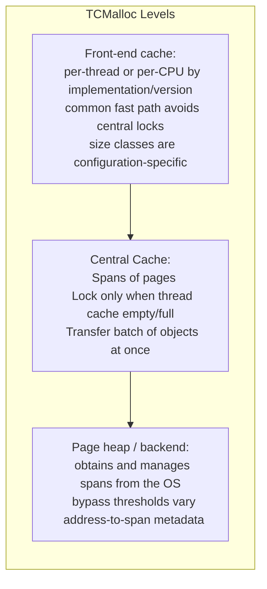

---

## 7. POSIX 파일 I/O: 커널 경로

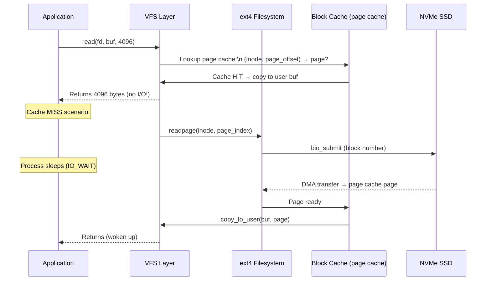

### O_DIRECT: 페이지 캐시 우회

```c
// O_DIRECT: request direct-I/O semantics; exact cache interactions are FS/device-specific
fd = open("data.bin", O_RDWR | O_DIRECT);
// Buffer/offset/length alignment requirements come from the filesystem/device
// Avoids the normal buffered page-cache path; copies/DMA mapping still depend on the stack
// Used by: databases (manage their own cache)
//          backup tools (avoid evicting hot pages)
```

---

## 8. 신호 처리: 전달 및 비동기 안전성

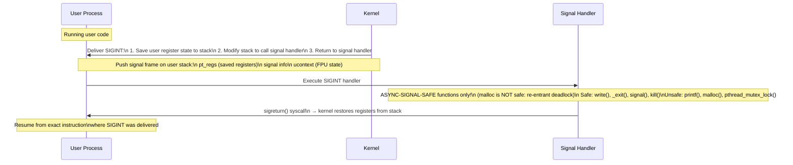

---

## 9. NUMA 아키텍처: 메모리 지역성

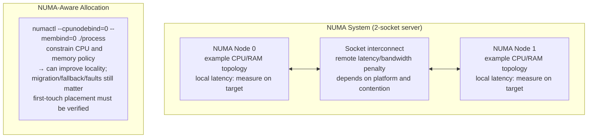

---

## 요약: 시스템 프로그래밍 기본 요소

| 원시 | 구현 | 커널 참여 |
|---|---|---|
| 뮤텍스 잠금(비경합) | 사용자 공간의 CAS | 없음(빠른 경로) |
| 뮤텍스 잠금(경합) | 퓨텍스(FUTEX_WAIT) | 예 — 프로세스가 차단되었습니다 |
| 스레드 생성 | 클론(CLONE_VM\|...) | 예 — 새 task_struct |
| 컨텍스트 전환 | 필요한 CPU/커널 상태 저장·복원 | 예 — 대상 커널 스케줄러 |
| 메모리 할당(캐시 적중) | 구현별 thread/per-CPU cache | 보통 없음(TCMalloc fast path 예) |
| 메모리 할당(대형) | mmap(MAP_ANON) | 예 — 페이지 테이블 업데이트 |
| 파일 읽기(캐시됨) | 페이지 캐시에서 복사 | 최소 |
| 파일 읽기(캐시되지 않음) | 바이오 제출 + 수면 | 예 — I/O 스케줄러 |
| 신호 전달 | 스택 수정 → 핸들러 | 예 — 사용자 모드로 돌아가기 |
| 시스템 호출 | SYSCALL 명령어 | 예 - 링 0 전환 |


---

## 설계적 고민

### 구조와 모델링

시스템 프로그래밍의 근본 구조적 선택은 **추상화 계층 설계**입니다. “모든 것은 파일이다”는 Unix 계열의 유용한 요약이지만 POSIX의 문자 그대로인 보장은 아닙니다. 일반 파일·디렉터리·여러 디바이스·소켓·파이프는 fd로 다뤄지며, `/proc`의 프로세스 정보는 Linux가 파일처럼 노출하는 의사 파일시스템입니다.

이 단일 추상화의 **설계 가치**:

1. **조합성(composability)**: 셋 프로그램이 fd를 통해 자유롭게 조합된다. `ls | grep | wc`가 가능한 이유.
2. **통일 인터페이스**: 많은 리소스가 `read()`/`write()`/`close()`를 공유하지만 `ioctl`, socket API와 장치별 계약은 여전히 배워야 합니다.
3. **리다이렉션 투명성**: `2>&1`로 stderr를 stdout으로 보내는 것이 fd 수준에서 작동.

그러나 이 추상화에는 **비용**이 있다. 네트워크 소켓은 파일처럼 `lseek()` 되지 않고, GPU는 `ioctl()` 지옥이 되며, 고성능 I/O는 `mmap()`이나 `io_uring` 같은 별도 경로를 요구한다.

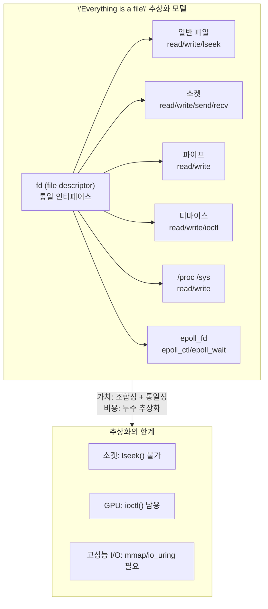

### 트레이드오프와 의사결정

#### 락-프리(lock-free) vs 락-기반: 복잡도 vs 성능

동시성 제어의 가장 근본적인 트레이드오프는 **락 기반 동기화의 단순성** vs **락-프리 알고리즘의 성능**이다.

**락 기반(Mutex/SpinLock)**:
- 장점: 논리가 단순하다. 임계 영역을 잠그고 작업하고 해제.
- 단점: **경합(contention)** 시 스레드가 블로킹되어 처리량 급감. 우선순위 역전(priority inversion), 데드락 위험.

**락-프리(CAS 기반)**:
- 장점: mutex 소유자의 중단에 전체 진행이 묶이지 않도록 설계할 수 있습니다. lock-free는 시스템 전체에서 적어도 하나의 연산이 진행한다는 성질이며 개별 스레드의 무기아를 보장하지 않습니다.
- 단점: ABA 문제, 메모리 순서(memory ordering), 검증의 어려움. **정확성 증명이 극도로 난해**.

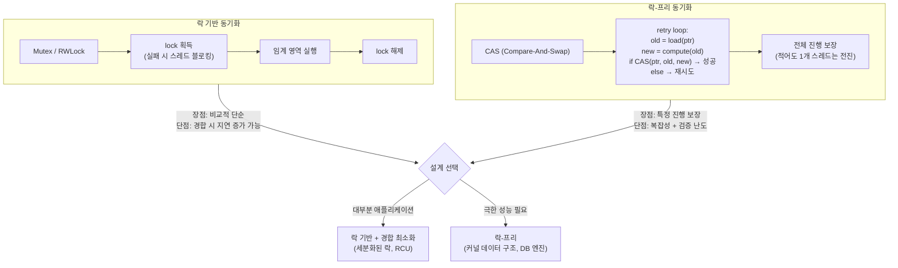

리눅스 커널의 **RCU(Read-Copy-Update)**는 읽기 측 비용을 낮추는 한 계열입니다. 갱신자는 새 버전을 게시한 뒤 grace period가 지나기 전 옛 객체를 회수하지 않습니다. 쓰기 직렬화와 메모리 순서는 별도로 필요하며, 읽기 위주 구조에 적합한지는 갱신 비용·회수 지연과 함께 평가합니다.

#### Rust 소유권 모델: 컴파일 타임 안전성의 설계 가치

safe Rust의 소유권 시스템은 별도 추적 GC 없이 많은 use-after-free, double-free와 데이터 경쟁을 컴파일 단계에서 배제합니다. 그러나 `unsafe`/FFI, 누수, 교착과 논리 오류까지 원천 차단하지 않으며 동적 디스패치·할당·참조 카운팅·drop의 실행 비용은 프로그램 선택에 따라 남습니다.

- **소유권 규칙**: 각 값은 정확히 하나의 소유자를 가진다. 소유자가 스코프를 벗어나면 자동 `drop()`.
- **참조 규칙**: `&T`(불변 참조) 여러 개 OR `&mut T`(가변 참조) 단 하나. 동시 불가.
- **라이프타임**: 참조의 유효 범위를 정적으로 추적하여 dangling 참조 방지.

이 설계의 트레이드오프에는 학습·컴파일 비용과 일부 자료구조 표현 제약이 있습니다. 투자 대비 효과는 결함 종류, FFI 비중과 팀 경험에 따라 다르므로 수정 시간·메모리 안전 결함·빌드 시간을 도입 전후로 측정합니다.

#### tcmalloc vs jemalloc vs glibc malloc: 단편화 vs 속도

메모리 할당자 선택은 **멀티스레드 성능**, **단편화**, **메모리 사용량** 사이의 3중 트레이드오프다.

| 할당자 | 핵심 전략 | 장점 | 단점 |
|---------|------------|--------|--------|
| glibc malloc | arena + tcache/bin | 기본 통합과 범용성 | 워크로드에 따라 경합·단편화 |
| TCMalloc | 구현별 per-thread/per-CPU cache + 중앙 구조 | 소형 할당 fast path | 캐시·메모리 회수 특성 확인 필요 |
| jemalloc | arena + size class/slab 계열 | 조정·관측 기능과 단편화 관리 | 설정과 워크로드별 비용 |

TCMalloc의 front-end cache 적중 경로는 중앙 잠금과 커널 호출을 피할 수 있습니다. 캐시가 per-thread인지 per-CPU인지, 대상 크기와 refill/reclaim 경로는 버전에 따라 달라지므로 고정된 256B 경계나 “항상 무잠금”으로 가정하지 않습니다.

### 리팩토링과 설계 원칙

#### Rust의 소유권 — 시스템 프로그래밍의 패러다임 전환

C에서 Rust로의 전환은 단순한 언어 교체가 아니라 **시스템 프로그래밍의 안전성 모델 리팩토링**이다.

- C: "프로그래머가 모든 것을 책임진다" → Valgrind, AddressSanitizer로 런타임 검증
- Rust: "컴파일러가 정적으로 증명한다" → borrow checker가 컴파일 시점에 검증

검증을 앞당기면 일부 결함의 피드백 시간을 줄일 수 있지만 비용이 항상 기하급수적으로 증가하거나 컴파일 오류가 런타임 결함보다 10~100배 저렴하다는 보편 법칙은 없습니다. 이 문서의 비교는 방향성 가설이며 실제 수정 리드타임과 escaped defect로 확인합니다.

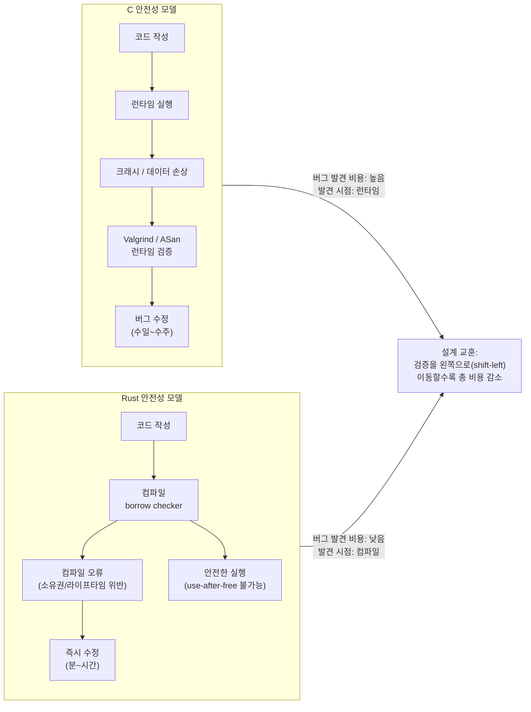

### 디자인 패턴 적용

#### 메모리 할당자의 스트래티지 패턴

메모리 할당자는 같은 `malloc`/`free` 인터페이스 뒤의 전략을 교체하는 예로 볼 수 있습니다. ELF 동적 링크 환경에서는 `LD_PRELOAD`로 바꿀 수 있는 경우도 있지만 정적 링크, setuid 보안, 컨테이너·플랫폼 ABI, 라이브러리의 자체 할당자와 할당/해제 경계 때문에 코드·빌드 변경 없이 항상 교체되는 것은 아닙니다.

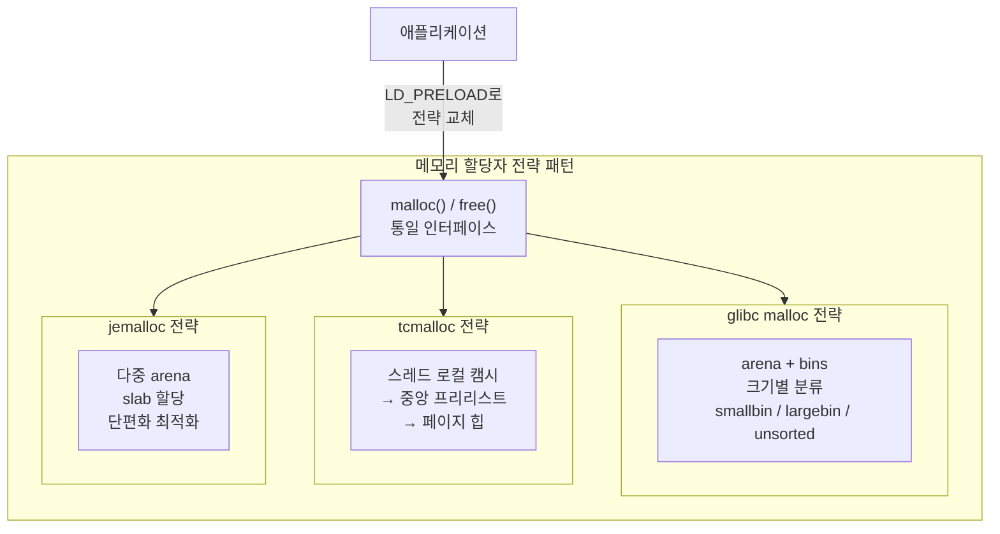

#### RAII 패턴: 리소스 수명을 스코프에 바인딩

**RAII(Resource Acquisition Is Initialization)**는 C++/Rust의 핵심 리소스 관리 패턴입니다. 리소스 획득과 해제를 객체 수명에 묶어 정상 반환과 언와인딩 경로의 정리를 돕습니다. 프로세스 중단, 의도적 leak/forget, 참조 순환, 소멸자 오류와 외부 리소스 계약까지 제거하지 않으므로 “누수 불가능”을 보장하지 않습니다.

Rust의 `Drop` 트레이트, C++의 스마트 포인터(`unique_ptr`, `shared_ptr`), Go의 `defer`, Python의 컨텍스트 매니저(`with`)는 모두 RAII의 변형이다. 시스템 프로그래밍에서 리소스 누수는 공격 벡터이자 장애 원인이므로, 이 패턴의 적용은 선택이 아니라 필수다.

---

## 연습 문제

### 1. 시스템 구조와 모델링

**문제 1-1. epoll 기반 이벤트 루프의 동작 흐름**

Nginx는 단일 워커 프로세스로 수만 개의 동시 연결을 처리한다. 이 시스템의 핵심인 `epoll` 기반 이벤트 루프의 동작을 분석하라.

- `epoll_create()` → `epoll_ctl(EPOLL_CTL_ADD)` → `epoll_wait()` → 이벤트 처리의 전체 순환 흐름을 서술하고, 각 단계에서 커널 내부에서 무슨 일이 일어나는지 설명하라.
- `select()`/`poll()`과 비교하여 `epoll`이 등록 집합 전체의 반복 스캔을 피하는 **내부 구조(관심 집합 + ready list + 콜백)**를 설명하고, 반환 비용이 준비된 이벤트 수에 의존함을 논하라.
- **Level-Triggered** vs **Edge-Triggered** 모드의 차이와, Edge-Triggered에서 `EAGAIN`까지 읽지 않을 때 새 edge가 없어 처리가 정체될 위험을 설명하라. 커널이 남은 바이트를 즉시 버리는 “데이터 손실”과는 구분하라.

<details><summary>힌트 보기</summary>

`epoll_create1()`은 커널 eventpoll 인스턴스를 만들고 `epoll_ctl(ADD)`는 관심 fd와 wait-queue 콜백을 등록합니다. 준비된 fd는 ready list에 연결되고 `epoll_wait()`는 최대 요청 개수만큼 반환합니다. 따라서 전체 등록 집합을 매번 선형 복사·스캔하는 비용을 피하지만 등록·준비 이벤트·wake-up 비용까지 보편적인 O(1)이라고 부르지는 않습니다. Edge-Triggered에서는 nonblocking fd를 `EAGAIN`까지 처리해야 하며, 그렇지 않으면 데이터가 남아도 새 전이가 없어 대기할 수 있습니다.

</details>

**문제 1-2. Rust 소유권/빌림 검사기의 Data Race 방지 메커니즘**

다음 Rust 코드가 컴파일되지 않는 이유를 분석하라:

```rust
fn main() {
    let mut data = vec![1, 2, 3];
    let ref1 = &mut data;
    let ref2 = &mut data;  // 컴파일 에러!
    ref1.push(4);
    ref2.push(5);
}
```

- Rust의 균일 참조 규칙("동시에 가변 참조는 하나만, 또는 불변 참조는 여러 개")이 **data race의 3가지 필요조건** 중 어떤 것을 구조적으로 차단하는지 설명하라.
- C/C++에서 동일한 로직을 작성하면 컴파일된다. 이 코드가 멀티스레드 환경에서 실행될 때 발생할 수 있는 **구체적인 위험 시나리오**를 서술하라.
- `Arc<Mutex<T>>`를 사용하면 이 문제를 해결할 수 있다. 이때 소유권 시스템과 Mutex가 **각각 어떤 역할**을 담당하는지 설명하라.

<details><summary>힌트 보기</summary>

Data race의 3조건: ① 두 이상의 스레드가 동시 접근 ② 최소 하나가 쓰기 ③ 동기화 없음. Rust는 ①번 조건(동시 가변 접근)을 컴파일 타임에 차단한다. C/C++에서는 두 스레드가 동시에 vec을 push하면 내부 버퍼 재할당 시 use-after-free, 데이터 손상, segfault 등이 발생한다. `Arc`는 소유권의 스레드 간 공유(레퍼런스 카운팅)를 담당하고, `Mutex`는 접근 동기화를 담당한다. 컴파일러가 `Send`/`Sync` 트레잇으로 스레드 안전성을 검증한다.

</details>

**문제 1-3. 시스템 호출의 유저-커널 전환 흐름**

사용자 프로그램에서 `write(fd, buf, 1024)`를 호출했다. 이 호출이 커널에 도달하여 실제 I/O가 수행되기까지의 전체 흐름을 추적하라.

- x86-64에서 `syscall` 명령어가 실행될 때 CPU가 수행하는 **하드웨어 수준의 동작**(RIP 저장, MSR에서 엔트리 포인트 로드, 권한 전환)을 설명하라.
- `vDSO(Virtual Dynamic Shared Object)`가 `gettimeofday()` 같은 호출에 대해 커널 전환을 회피하는 원리는 무엇인가?
- `strace`로 본 시스템 호출 오버헤드가 성능에 미치는 영향을 한 웹 서버가 초당 100,000개의 요청을 처리하는 시나리오에서 추정하라.

<details><summary>힌트 보기</summary>

x86-64 `syscall`은 RCX/R11에 반환 상태를 두고 MSR의 엔트리와 선택자 정보를 사용해 권한을 전환합니다. 하드웨어가 일반 인터럽트처럼 전체 프레임이나 커널 RSP를 자동 저장하는 것은 아니며 Linux 진입 코드가 안전한 스택으로 전환합니다. vDSO 경로는 지원 조건에서 전환을 피하지만 폴백할 수 있습니다. 고정된 100ns~1µs를 곱하지 말고 대상 커널에서 tracing 자체의 오버헤드를 분리해 syscall별 지연 분포와 CPU 시간을 측정합니다.

</details>

### 2. 트레이드오프와 의사결정

**문제 2-1. 공유 메모리 + mutex vs 메시지 패싱: 동시성 모델 선택**

고빈도 업데이트 카운터(100개 스레드가 초당 100만 회 증가)를 구현해야 한다. 다음 두 접근법을 비교하라:

- **C + pthread mutex**: 공유 변수를 직접 보호
- **Go 채널(CSP 모델)**: 메시지 패싱으로 간접 동기화

100개 스레드 × 초당 100만 회 증가 시나리오에서 각 모델의 **병목 지점**, **스레드 경합(contention)**, **캐시 라인 바운싱**을 분석하고, 어떤 모델이 더 적합한지 근거를 제시하라.

<details><summary>힌트 보기</summary>

이 시나리오는 단일 카운터에 초당 1억 회 접근하므로 mutex는 심각한 contention을 유발한다. 락 횟수가 많아져 스핀락→커널 futex 전환이 빈번해진다. Go 채널 모델은 모든 증가를 하나의 goroutine에 도달시켜야 하므로 메시지 패싱 오버헤드가 병목이 된다. 이 특수 케이스에는 `atomic.AddInt64`(락-프리 원자적 연산)이 양쪽 모두보다 우수하다. 다만 중간값 읽기나 복합 연산이 필요하면 다시 락이나 채널이 필요하다.

</details>

**문제 2-2. 메모리 할당자 선택: jemalloc vs tcmalloc vs glibc malloc**

세 가지 서로 다른 워크로드가 있다:

- **웹 서버**: 수천 개 동시 연결, 연결당 작은 할당(~4KB)/해제 반복
- **데이터베이스(Redis)**: 다양한 크기의 키/값 저장, 장시간 운영으로 단편화 축적
- **단기 스크립트**: 실행 후 즉시 종료, 대량 할당 후 프로세스 종료로 OS가 회수

각 워크로드에 glibc malloc, jemalloc, TCMalloc 중 어떤 후보가 적합한지 가설을 세우고 벤치마크 계획을 제시하라. “최적”은 처리량뿐 아니라 p99 지연, RSS, 단편화, 메모리 반환과 운영 관측성을 같은 부하에서 비교해 결정한다.

<details><summary>힌트 보기</summary>

glibc malloc은 arena별 bins 구조로 다양한 크기를 처리하지만 arena 락 경합이 있다. tcmalloc은 스레드 로컬 캐시로 작은 할당이 극히 빠르다 → 웹 서버에 적합. jemalloc은 다중 arena + slab로 단편화를 최소화한다 → Redis/Firefox가 사용. 단기 스크립트는 할당자 선택이 거의 의미 없다 — 프로세스 종료 시 OS가 전체 메모리를 회수하므로 free() 자체가 선택적이다.

</details>

**문제 2-3. 동기식 I/O vs 비동기식 I/O 선택**

데이터베이스 서버가 디스크에서 10,000개의 레코드를 읽어야 한다. 두 가지 접근을 비교하라:

- **동기식**: 스레드 풀의 각 스레드가 `pread()` blocking 호출로 하나씩 읽기
- **비동기식**: `io_uring`로 10,000개 읽기 요청을 배치 제출

각 접근의 **시스템 호출 횟수**, **컨텍스트 스위칭 총량**, **디스크 I/O 스케줄러 활용도**를 비교하고, 어떤 상황에서 동기식이 오히려 더 나은 선택인지 설명하라.

<details><summary>힌트 보기</summary>

단순 동기 구현은 최대 10,000회의 `pread`와 대기/스케줄링 비용을 만들 수 있습니다. `io_uring`은 여러 SQE를 배치해 진입 횟수를 줄일 수 있지만 링 용량, SQPOLL, 커널 버전과 제출/완료 방식에 따라 한 번의 syscall로 모두 처리된다고 보장할 수 없습니다. 장치·파일시스템 스케줄링도 “엘리베이터 최적 순서”로 단정하지 말고 queue depth, IOPS, latency와 CPU를 측정합니다.

</details>

### 3. 문제 해결 및 리팩토링

**문제 3-1. Use-After-Free 버그의 발생과 방지**

다음 C 코드에서 보안 취약점이 발생하는 시점과 이유를 분석하라:

```c
char *buf = malloc(256);
read(fd, buf, 256);
free(buf);
// ... 다른 작업 ...
printf("%s\n", buf);  // use-after-free!
```

- `free(buf)` 후 `buf` 포인터가 여전히 유효한 것처럼 보이는 이유와, 이것이 **공격자에게 어떻게 악용될 수 있는지** 설명하라.
- 동일한 로직을 Rust로 작성하면 컴파일러가 어떤 시점에서 어떤 오류를 발생시키는지, 소유권 시스템의 규칙과 연결하여 설명하라.
- C에서 이 문제를 완화하기 위한 방법(AddressSanitizer, 널 포인터 설정, 스마트 포인터 패턴)과 각각의 한계를 설명하라.

<details><summary>힌트 보기</summary>

`free()` 후 포인터 값은 남아 있어도 그 저장 영역의 객체 수명은 끝나며 접근은 정의되지 않은 동작입니다. 같은 가상 주소가 재할당되어 공격자 입력이 놓이면 제어 데이터 손상으로 이어질 수 있지만 악용 가능성은 배치와 완화책에 달립니다. Rust에서는 소유 값을 `drop(buf)`한 뒤 사용하면 컴파일 오류가 납니다. C의 NULL 대입은 해당 별칭만 보호합니다. AddressSanitizer는 계측된 실행 경로에서 탐지하며 운영 적용 여부와 오버헤드는 빌드·워크로드별로 다릅니다.

</details>

**문제 3-2. Lock Contention으로 인한 큐 처리량 붕괴**

멀티스레드 웹 서버에서 요청 큐를 mutex 기반 연결 리스트로 구현했다. 64개 코어에서 실행했지만 처리량이 단일 스레드의 10%에 불과하다.

- 락 경합이 **구체적으로 어떻게 성능을 저하**시키는지 스핀락→futex 전환, 캐시 라인 바운싱 관점에서 설명하라.
- **Michael-Scott lock-free queue**로 교체하면 성능이 향상되는 원리를 CAS(비교-교환) 연산과 연결하여 설명하라.
- Lock-free 구조의 한계점(복잡한 메모리 리클레임, ABA 문제)과 이를 해결하는 방법(hazard pointer, epoch-based reclamation)을 설명하라.

<details><summary>힌트 보기</summary>

64코어에서 단일 mutex를 두고 경쪽하면 대부분의 시간이 락 횝득/해제와 캐시 라인 트래픽(lock이 있는 캐시 라인의 배타적 전송)에 소비된다. Michael-Scott queue는 head/tail 포인터를 CAS로 원자적 교체하여 락 없이 enqueue/dequeue한다. ABA 문제는 CAS가 성공하지만 실제로는 포인터가 다른 노드를 가리키는 것으로, tagged pointer(버전 카운터를 포인터에 내장)로 해결한다. Epoch-based reclamation은 모든 스레드가 특정 epoch를 지나면 해당 epoch의 노드를 안전하게 해제하는 방식이다.

</details>

**문제 3-3. 메모리 누수 추적과 구조적 방지**

장시간 운영되는 C 서버 프로그램의 RSS(상주 메모리)가 시간이 지날수록 계속 증가하고 있다. `valgrind --leak-check=full`로 분석했더니 다음 결과가 나왔다:

```
==1234== 8,192 bytes in 1,024 blocks are definitely lost
==1234==    at malloc (vg_replace_malloc.c:380)
==1234==    by handle_request (server.c:142)
```

- `definitely lost`와 `possibly lost`의 차이를 메모리 할당자 내부 구조 관점에서 설명하라.
- `handle_request`에서 `malloc`된 메모리가 누수되는 **일반적인 코드 패턴**(early return, 예외 경로)을 제시하고 수정 방법을 설명하라.
- C++의 RAII/스마트 포인터, Rust의 소유권 시스템, Go의 GC가 각각 메모리 누수를 **어떤 수준으로** 방지하는지 비교하라.

<details><summary>힌트 보기</summary>

`definitely lost`는 Valgrind가 블록 시작을 가리키는 도달 가능한 포인터를 찾지 못한 경우이고, `possibly lost`는 내부 포인터 등 때문에 확정하지 못한 분류입니다. early return과 소유권 이전 실패를 단일 cleanup 경로, RAII 또는 소유 타입으로 다룹니다. C++/Rust도 순환 소유, `mem::forget`, 전역 캐시, FFI로 자원을 누수할 수 있고 Go GC도 도달 가능한 논리적 누수와 외부 핸들을 회수하지 못하므로 RSS와 자원 수명 테스트가 필요합니다.

</details>

### 4. 개념 간의 연결성

**문제 4-1. POSIX 시그널 + 비동기 I/O: Node.js의 libuv 아키텍처**

Node.js는 단일 스레드 이벤트 루프로 동작하지만, 파일 I/O는 내부적으로 스레드 풀을 사용한다.

- 네트워크 I/O는 `epoll`/`kqueue`로 처리하면서도, 파일 I/O는 **스레드 풀로 처리하는 기술적 이유**를 리눅스 커널의 파일 시스템 AIO 지원 현황과 연결하여 설명하라.
- POSIX 시그널(`SIGPIPE`, `SIGCHLD` 등)이 이벤트 루프 내부에서 **어떻게 처리되는지**, 시그널 핸들러와 이벤트 루프의 상호작용을 설명하라.
- `io_uring`이 리눅스에서 성숙하면, libuv의 파일 I/O 스레드 풀 아키텍처가 어떻게 **변화할 수 있을지** 예측하라.

<details><summary>힌트 보기</summary>

리눅스의 POSIX AIO(`aio_read`)는 실제로는 유저 공간 스레드로 구현되어 진정한 비동기가 아니며, 일반 파일에 대한 epoll은 항상 ready를 반환하여 의미가 없다. 그래서 libuv는 스레드 풀에서 blocking I/O를 수행하고 완료를 이벤트 루프에 알린다. POSIX 시그널은 libuv가 self-pipe trick(또는 eventfd)로 이벤트 루프에 통합한다 — 시그널 핸들러에서 파이프에 쓰면 epoll이 이를 감지한다. `io_uring`이 성숙하면 파일 I/O도 SQ/CQ 링으로 비동기 처리할 수 있어 스레드 풀이 불필요해질 수 있다.

</details>

**문제 4-2. Memory Ordering + CAS: Lock-Free 스택의 ABA 문제**

다음과 같은 lock-free 스택을 CAS로 구현했다:

```
스택 상태: top → A → B → C

스레드 1: pop() 시도 - top=A, next=B를 읽음 (CAS 전에 선점)
스레드 2: pop() A, pop() B, push() A 실행 (스택: top → A → C)
스레드 1: CAS(top, A, B) 성공! → top = B 하지만 B는 이미 해제됨!
```

- 이 **ABA 문제**가 발생하는 정확한 메커니즘을 단계별로 서술하라.
- **Tagged pointer**(포인터 + 버전 카운터)가 ABA 문제를 해결하는 원리를 설명하라.
- 이 시나리오에서 `memory_order_acquire`/`memory_order_release`가 없으면 어떤 **추가적인 문제**가 발생할 수 있는지 CPU 메모리 모델 관점에서 설명하라.

<details><summary>힌트 보기</summary>

ABA: 스레드 1이 A와 next=B를 읽은 사이 스레드 2가 A와 B를 pop하고 A를 다시 push하면 주소만 비교하는 CAS는 중간 변화를 놓칠 수 있습니다. Tagged pointer는 주소와 충분히 넓은 세대 값을 함께 비교하지만 wraparound와 원자 폭을 검토해야 합니다. acquire/release는 게시된 노드의 초기화 가시성과 연산 순서를 세우는 문제이고, 해제된 B를 안전하게 만드는 메모리 회수 기법은 아닙니다. Hazard pointer나 epoch reclamation으로 수명을 별도로 보장해야 합니다.

</details>

**문제 4-3. Rust 소유권 + 시스템 프로그래밍: 제로 코스트 추상화의 실제**

Rust는 “제로 코스트 추상화(zero-cost abstractions)”를 핵심 철학으로 한다. 다음 시나리오를 분석하라:

- Rust의 `Iterator` 체이닝이 모노모픽화와 인라이닝으로 수동 루프와 유사하게 최적화될 수 있는 조건을 설명하고, 실제 머신 코드·벤치마크로 확인하는 방법을 제시하라.
- `Box<dyn Trait>`가 보통 vtable 간접 디스패치와 힙 할당을 도입하는 이유와, 탈가상화·기존 박싱으로 비용이 달라질 수 있는 조건을 설명하라.
- safe Rust의 소유권 검사가 별도 런타임 borrow checker 없이 안전 속성을 제공하는 범위와, `Drop`·할당·동기화 비용이 여전히 남는 이유를 설명하라.

<details><summary>힌트 보기</summary>

제네릭 iterator adaptor는 모노모픽화되고 최적화기가 루프 융합·인라이닝을 할 수 있지만 최적화 수준, panic/alias 조건과 adaptor에 따라 수동 C 루프와 동일한 코드를 보장하지 않습니다. `dyn Trait` 호출도 구체 타입이 증명되면 탈가상화될 수 있습니다. 소유권 검사는 정적이지만 `Drop`은 실제 정리 코드를 실행하고 `Box`, `Arc`, 락 등 선택한 추상화의 비용은 남습니다. 결론은 생성된 어셈블리와 동일 입력의 분포 측정으로 뒷받침합니다.

</details>
