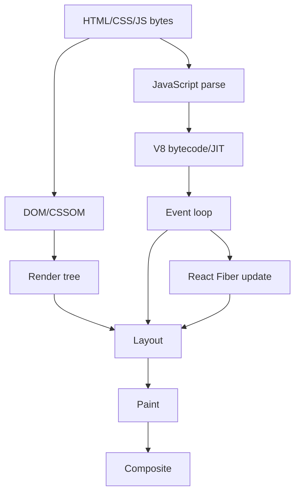
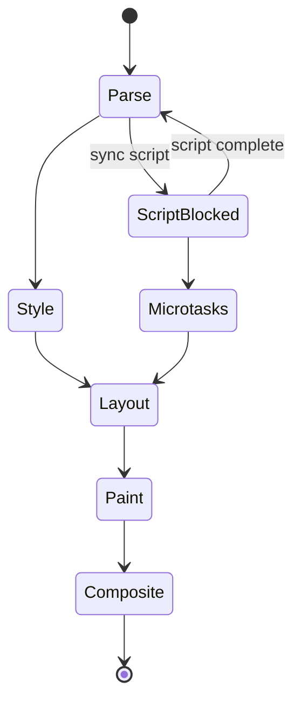

# 웹 및 프론트엔드 내부 동작 학습 및 기록 노트

## 읽기 범위와 검증 기준

이 문서는 브라우저와 프런트엔드 런타임의 대표 경로를 설명하며, 표준의 요구사항과 특정 엔진·프레임워크 버전의 구현 세부 사항을 구분합니다.

- **범위:** HTML/CSS/이벤트 루프의 표준 모델, V8과 브라우저 렌더러의 대표 구현, React의 조정 과정을 다룹니다. 엔진 이름이 없는 수치나 자료구조는 설명용 예시입니다.
- **실행 전제:** 브라우저·V8·React 버전, OS와 기기, refresh rate, 네트워크·캐시 상태, 번들러와 빌드 모드를 고정해야 합니다. 상태 수, scheduler slice, bundle 크기와 Web Vitals 값은 이 전제 없이 일반화하지 않습니다.
- **근거 구분:** 명세가 요구하는 관찰 가능 동작은 계약이고, 엔진 내부 파이프라인은 버전별 구현이며, 성능 원인과 최적화 효과는 profile 전까지 가설입니다.
- **불확실성:** CSR·SSR·SSG, memoization, preload와 virtualization의 효과는 콘텐츠, 캐시, hydration, 사용자 기기와 상호작용에 따라 방향과 크기가 달라질 수 있습니다.
- **완료 기준:** 동일한 사용자 흐름에서 trace, long task, network waterfall, render count, 메모리와 사용자 지표의 분포를 전후 비교하고 접근성·오류 경계·저속망 회귀가 없을 때 개선 완료로 판정합니다.

## 1. 왜 필요한가? (Pain Point & Motivation)

웹 성능과 UI 버그는 HTML/CSS/JavaScript 문법만으로 설명되지 않는다. 브라우저는 HTML을 DOM으로 파싱하고, CSSOM과 합쳐 render tree를 만들며, layout, paint, composite 단계로 화면을 만든다. JavaScript는 event loop와 microtask queue 위에서 실행되고, V8은 type feedback을 기반으로 JIT 최적화와 deoptimization을 반복한다. React는 Fiber tree와 scheduler로 렌더링 작업을 쪼갠다.

이 문서는 원문 한국어 웹/프론트엔드 내부 문서를 브라우저 엔진, JS 런타임, React 조정 알고리즘 중심으로 재작성한다.

## 2. 현재 나의 상태 (Baseline)

- DOM, CSS, JavaScript, Promise, React component 사용법은 알고 있다.
- Critical rendering path와 reflow/repaint/composite 차이를 성능 분석에 연결해야 한다.
- microtask가 rendering을 굶길 수 있다는 점을 event loop 순서로 설명해야 한다.
- V8 hidden class, inline cache, TurboFan deoptimization을 고수준으로만 알고 있다.
- React Fiber의 render phase와 commit phase, concurrent rendering의 차이를 정리해야 한다.

## 3. 도달하고 싶은 목표 (Target State)

- HTML parsing부터 composite까지 화면이 만들어지는 경로를 설명한다.
- event loop에서 call stack, microtask, requestAnimationFrame, render, macrotask 순서를 구분한다.
- V8 JIT pipeline에서 parser, Ignition, Sparkplug, TurboFan, deopt의 역할을 이해한다.
- object shape와 inline cache가 속성 접근 최적화에 미치는 영향을 설명한다.
- React Fiber tree, lane priority, render/commit phase를 상태 전이로 읽는다.

## 4. 시스템 번역 (Data Flow)



프론트엔드 data flow는 네트워크, 파서, JS 런타임, 스타일 계산, 레이아웃, GPU 합성까지 이어진다.

## 5. 핵심 구성요소 (Building Blocks)

| 구성요소 | 역할 | 핵심 상태 |
| --- | --- | --- |
| HTML tokenizer | byte stream을 token으로 변환 | tokenizer state |
| DOM/CSSOM | 문서와 스타일 규칙 트리 | node, selector, rule cascade |
| Layout | box size와 position 계산 | geometry tree |
| Paint | draw command 생성 | layer/display list |
| Composite | GPU layer 합성 | transform/opacity/layer state |
| Event loop | JS 작업 순서 관리 | call stack, microtask, macrotask |
| Promise | 비동기 결과 상태 | pending/fulfilled/rejected |
| V8 hidden class | object property layout | shape/map transition |
| TurboFan | speculative optimized code | type feedback, guard |
| React Fiber | interruptible render unit | child/sibling/return, effect list |

## 6. 상태 전이 (State Transition)



동기 `<script>`는 HTML parser를 멈출 수 있고, microtask queue가 비워지지 않으면 `requestAnimationFrame`과 렌더링 단계가 실행되지 못한다.

## 7. 불변식 (Invariant: 절대 깨지면 안 되는 규칙)

- DOM을 변경하는 script는 parser와 rendering pipeline의 순서를 바꿀 수 있다.
- Layout을 유발하는 read/write가 반복되면 layout thrashing이 생긴다.
- Microtask queue는 render 이전에 모두 비워지므로 무한 microtask를 만들면 화면이 멈춘다.
- Promise는 settled 이후 상태가 바뀌면 안 된다.
- V8 최적화는 guard가 깨지면 deoptimize되어 올바른 의미를 유지해야 한다.
- 같은 shape를 공유하려면 객체 property 추가 순서가 안정적이어야 한다.
- React의 concurrent 기능을 사용하는 render 작업은 중단·재시작될 수 있다. Commit의 DOM mutation 단계는 중간 상태를 노출하지 않도록 동기적으로 처리되며 모든 render가 항상 중단 가능한 것은 아니다.
- list reconciliation은 key가 안정적이어야 최소 DOM 변경이 가능하다.

## 8. 가장 작은 예제 (Minimal Viable Example)

```javascript
Promise.resolve().then(() => {
  console.log("microtask");
});

requestAnimationFrame(() => {
  console.log("requestAnimationFrame: before paint");
});

setTimeout(() => {
  console.log("macrotask");
}, 0);
```

```text
부분 순서:
1. 현재 task 종료 후 microtask checkpoint에서 Promise callback 처리
2. 다음 timer task 선택과 rendering opportunity의 상대 순서는 고정하지 않음
3. Rendering opportunity가 있으면 requestAnimationFrame callback은 그 프레임의 paint 전에 실행
4. 백그라운드 탭에서는 requestAnimationFrame 실행이 지연되거나 일시 중지될 수 있음
```

이 예제의 Promise callback은 현재 task 뒤의 microtask checkpoint에서 처리된다. `requestAnimationFrame`과 timer callback 사이에는 여기서 보장할 수 있는 고정 순서가 없으며, microtask가 계속 추가되면 다음 task와 rendering이 지연될 수 있다.

## 9. 실패 사례 (What could go wrong?)

- loop 안에서 DOM write와 layout read를 번갈아 수행해 강제 동기 layout이 반복된다.
- 무한 microtask 재귀로 RAF와 paint가 실행되지 않는다.
- 객체 property 추가 순서가 제각각이라 hidden class가 분기되고 inline cache가 polymorphic해진다.
- React list에서 index를 key로 사용해 reorder 시 state가 잘못 붙는다.
- render phase에서 side effect를 실행해 concurrent rendering에서 중복 실행 문제가 생긴다.
- CSS selector와 large DOM이 결합되어 style recalculation 비용이 커진다.

## 10. 뇌 확장하기 (Evolution & Variants)

- Rendering pipeline은 layout containment, layer promotion, compositing-only animation으로 최적화할 수 있다.
- JavaScript runtime은 hidden class, inline cache, garbage collection, event loop backpressure를 함께 본다.
- React는 Fiber, lanes, Suspense, transitions, server components로 확장해 이해한다.
- Web performance는 Core Web Vitals, long task, INP, CLS, LCP와 연결한다.
- Frontend architecture는 hydration, streaming SSR, service worker cache, module bundling으로 확장된다.

## 11. 최종 체크리스트 (Definition of Done)

- [x] 브라우저 렌더링 파이프라인과 event loop를 상태 전이로 정리했다.
- [x] V8 JIT, hidden class, deoptimization을 핵심 구성요소에 포함했다.
- [x] React Fiber의 render/commit phase 불변식을 설명했다.
- [x] microtask 순서 최소 예제로 rendering starvation 가능성을 보였다.
- [x] 원문 한국어 웹/프론트엔드 문서를 12개 섹션 템플릿으로 재작성했다.

## 12. 뇌에 새기는 복습 문장 (TL;DR Blank)

웹 성능은 JavaScript 실행 시간만이 아니라 DOM/CSSOM, layout, paint, composite, event loop, JIT, React scheduler가 함께 만드는 결과다.
