# 웹 및 프런트엔드 내부: 브라우저 엔진, JavaScript 런타임 및 React 조정

> 내부 내용: 브라우저가 HTML을 렌더링 트리로 구문 분석하는 방법, JavaScript 이벤트 루프가 마이크로태스크와 매크로태스크를 처리하는 방법, React의 조정자가 가상 DOM 트리를 비교하는 방법, V8 JIT 컴파일 핫 기능(최신 웹 개발의 이면에 있는 정확한 파이프라인, 데이터 구조 및 스케줄링 메커니즘).

---

## 1. 브라우저 렌더링 파이프라인: 중요 경로

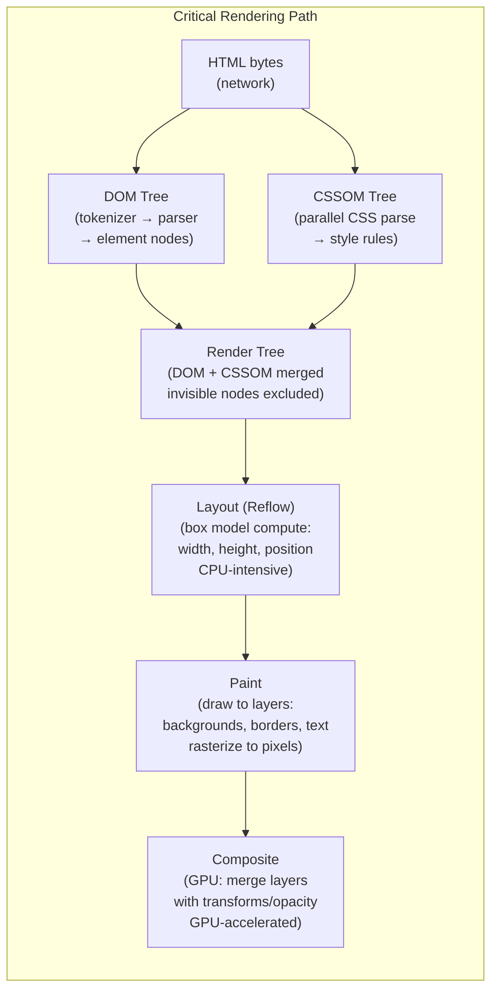

### HTML 토크나이저 상태 머신

HTML 토크나이저는 ~80개의 상태를 갖는 상태 머신입니다. 상황에 맞는 규칙으로 인해 HTML을 정규식으로 구문 분석할 수는 없습니다.

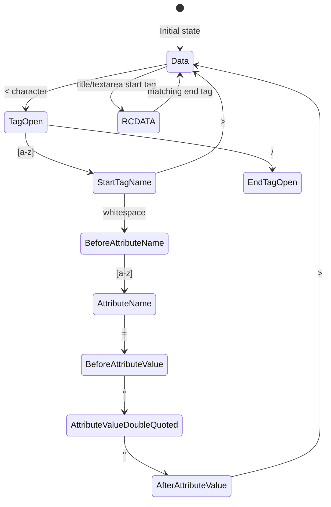

**스크립트 차단**: 파서가 `<script>` 태그(`async`/`defer` 없음)를 발견하면 **HTML 구문 분석을 일시 중지**하고 스크립트를 실행한 다음(DOM을 수정할 수 있음) 다시 시작합니다. 이것이 바로 `<body>` 끝에 있는 `<script>`이 성능에 중요한 이유입니다.

---

## 2. 자바스크립트 이벤트 루프: 마이크로태스크 vs 매크로태스크

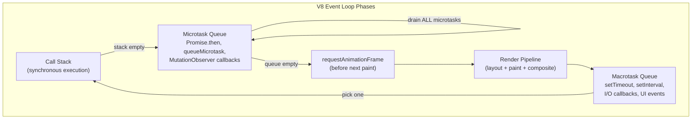

### 마이크로태스크 기아의 예

```javascript
// This BLOCKS rendering indefinitely:
function infiniteMicrotasks() {
    Promise.resolve().then(infiniteMicrotasks);
    // Microtask queue never empties → RAF never runs → page freezes
}

// Correct: yield to macrotask queue
function yieldToRender(callback) {
    setTimeout(callback, 0);  // or: scheduler.postTask()
}
```

### 내부 상태 머신 약속

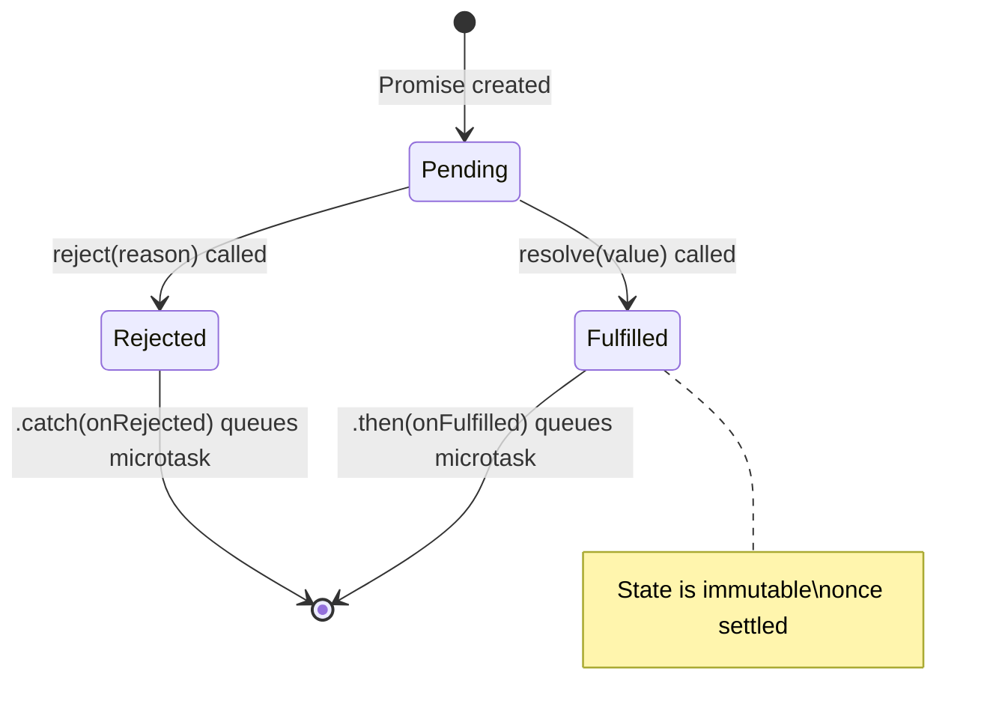

---

## 3. V8 JIT 컴파일 파이프라인

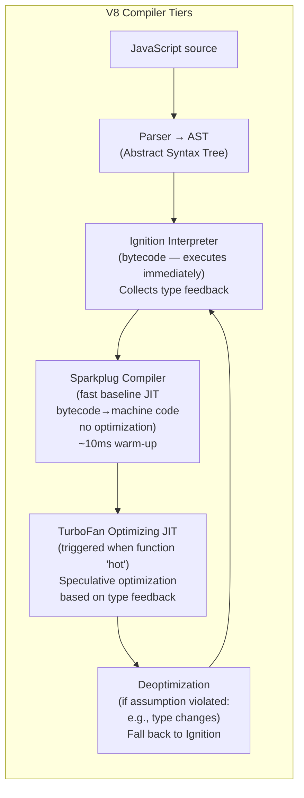

### TurboFan 추측 최적화

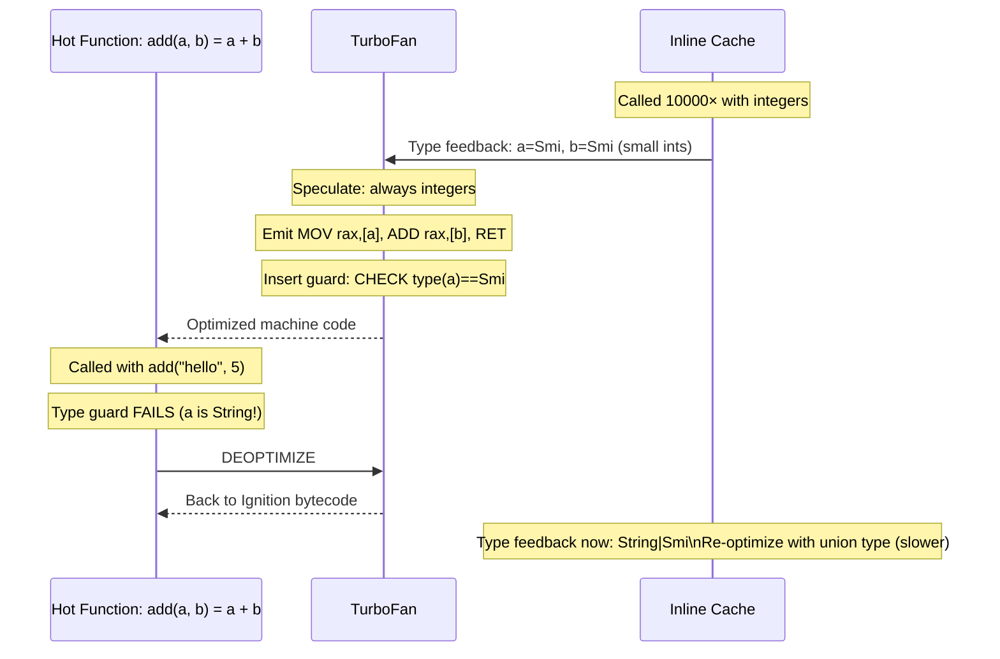

### 숨겨진 클래스(모양/지도)

V8은 동일한 속성 레이아웃을 가진 객체에 **숨겨진 클래스**(모양)를 할당하여 속성 액세스를 최적화합니다.

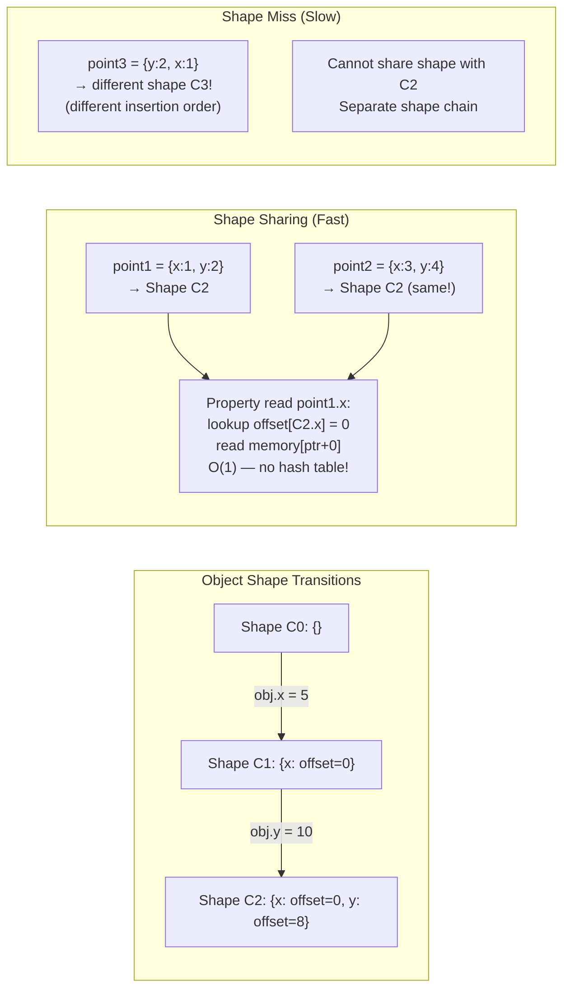

---

## 4. React 조정: 파이버 아키텍처

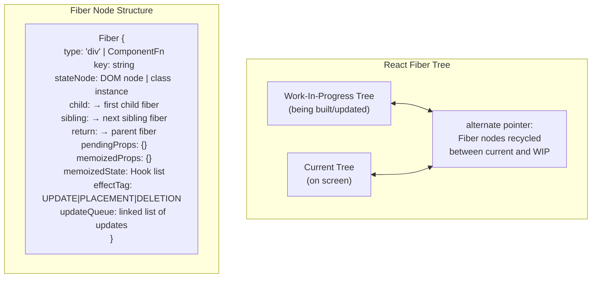

### 조정: 차이 알고리즘

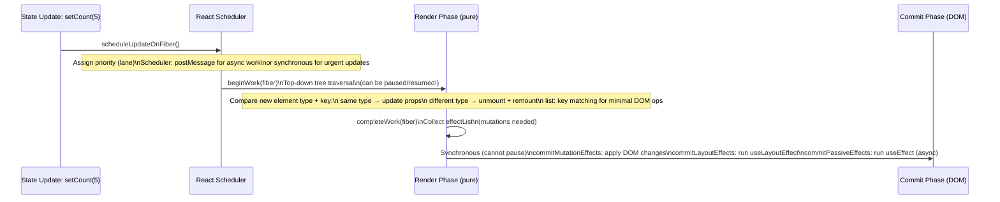

### 동시 모드: 시간 분할

React 18 동시 모드는 **스케줄러**를 사용하여 렌더링 작업을 5ms 조각으로 나눕니다.

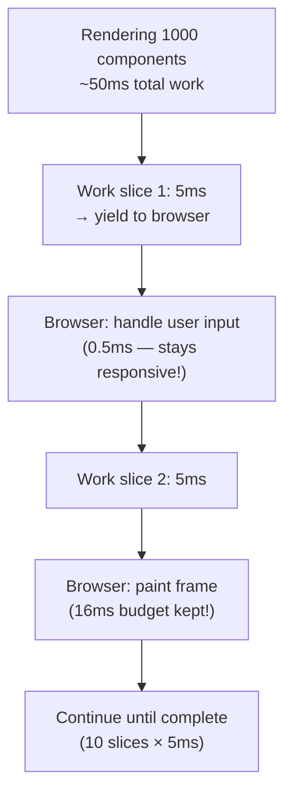

---

## 5. 가상 DOM 차이점: 주요 알고리즘

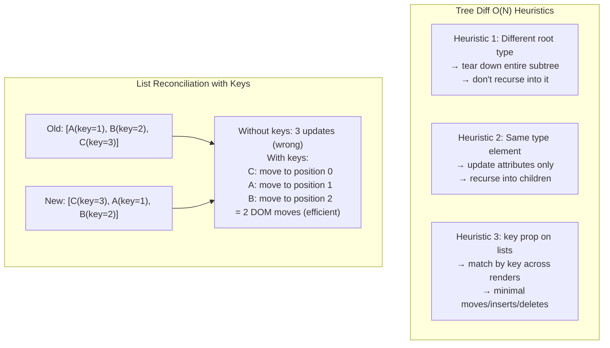

---

## 6. CSS 캐스케이드 및 특이성 계산

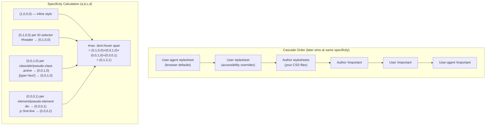

---

## 7. 웹 성능: 중요한 리소스 로딩

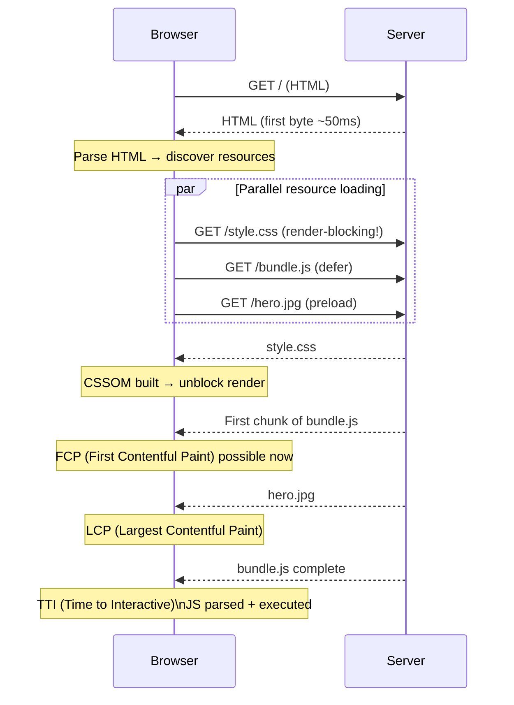

### 핵심 웹 바이탈 내부 트리거

| 미터법 | 트리거 | 측정 |
|---|---|---|
| LCP | 가장 큰 이미지/텍스트 블록이 그려짐 | `PerformanceObserver` 유형 `largest-contentful-paint` |
| FID/INP | 입력 이벤트 → 브라우저 응답 지연 | `PerformanceEventTiming.processingStart - startTime` |
| CLS | 레이아웃 변경: 사용자 상호 작용 없이 요소가 이동합니다 | `LayoutShift.value = impact_fraction × distance_fraction` |

---

## 8. 서비스 워커: 가로채기 내부 요소 가져오기

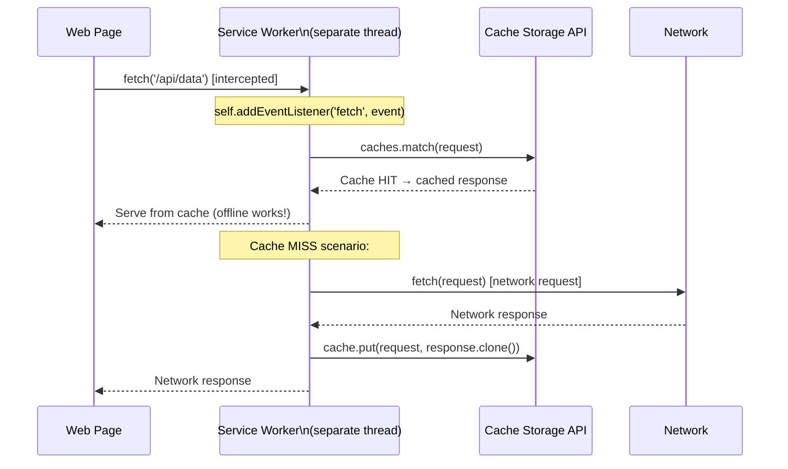

**서비스 워커 수명 주기** — 페이지와 별도로 페이지 로드 시 지속됩니다.
```
Install → Activate → Idle → Fetch/Message
(new SW waits for old clients to close before activating)
```

---

## 9. WebAssembly: 실행 모델

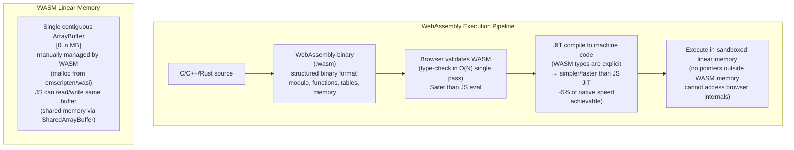

---

## 10. HTTP/2 다중화 및 HOL 차단

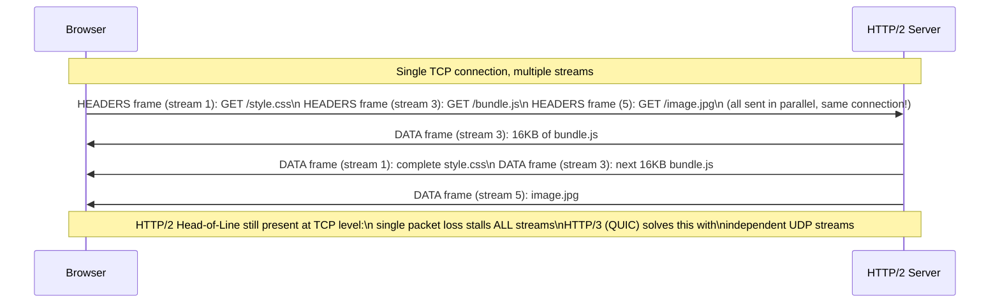

---

## 11. WebSocket: 프레임 프로토콜 내부

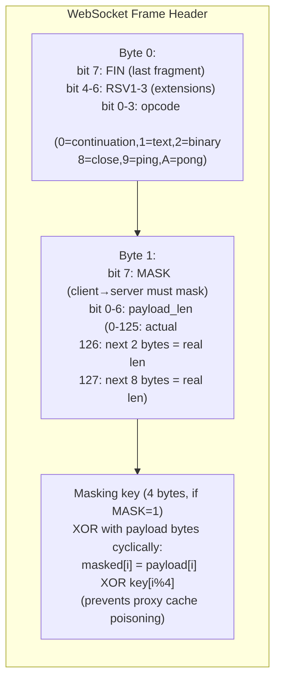

---

## 프론트엔드 아키텍처 요약

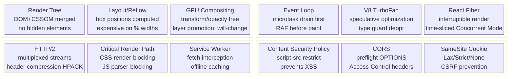


---

## 설계적 고민

### 구조와 모델링

프론트엔드 아키텍처의 근본적 구조 결정은 **렌더링 전략 선택**입니다. CSR(Client-Side Rendering), SSR(Server-Side Rendering), SSG(Static Site Generation), ISR(Incremental Static Regeneration)은 각각 다른 성능 프로파일과 개발 복잡도를 가집니다.

CSR은 초기 로딩이 느리지만 이후 페이지 전환이 빠르고, SSR은 TTFB(Time to First Byte)가 빠르나 서버 부하가 증가합니다. SSG는 빌드 타임에 모든 페이지를 생성하여 CDN에서 직접 제공하므로 가장 빠르지만, 데이터 변경 시 재빌드가 필요합니다. ISR은 SSG의 장점을 유지하면서 `revalidate` 주기로 페이지를 갱신합니다.

```mermaid
flowchart TD
    subgraph "CSR (Create React App)"
        CSR_REQ["브라우저 요청"] --> CSR_HTML["빈 HTML + JS 번들\n(FCP 지연)"]
        CSR_HTML --> CSR_JS["JS 다운로드/파싱/실행\n(TTI 지연)"]
        CSR_JS --> CSR_API["API 호출 → 데이터 fetch"]
        CSR_API --> CSR_RENDER["DOM 렌더링 완료\n(LCP 매우 늦음)"]
    end
    subgraph "SSR (Next.js getServerSideProps)"
        SSR_REQ["브라우저 요청"] --> SSR_SRV["서버에서 데이터 fetch\n+ HTML 생성"]
        SSR_SRV --> SSR_HTML["완성된 HTML 전송\n(FCP 빠름)"]
        SSR_HTML --> SSR_HYD["Hydration: JS 이벤트 바인딩\n(TTI = FCP + Hydration)"]
    end
    subgraph "SSG + ISR (Next.js)"
        SSG_BUILD["빌드 타임 HTML 생성"] --> SSG_CDN["CDN 캐시 배포\n(TTFB 최소)"]
        SSG_CDN --> SSG_REQ["사용자 요청 → CDN 직접 응답"]
        SSG_REQ -->|"stale-while-revalidate"| SSG_REVAL["백그라운드 재생성\n(revalidate: 60s)"]
    end
```

**상태 관리 아키텍처** 또한 핵심 구조 결정입니다. 상태를 어디에 위치시킬 것인지에 따라 컴포넌트 간 결합도, 디버깅 용이성, 성능이 크게 달라집니다. 로컬 상태(`useState`)는 단일 컴포넌트 내에서만 유효하고, 전역 상태(Redux/Zustand)는 앱 전체에서 공유되며, 서버 상태(React Query/SWR)는 캐시 무효화와 동기화 전략이 핵심입니다.

### 트레이드오프와 의사결정

**마이크로 프론트엔드 vs 모놀리식 SPA**는 조직 규모와 배포 주기에 따른 핵심 의사결정입니다. 마이크로 프론트엔드는 팀 독립성과 독립 배포를 가능하게 하지만, 공유 상태 관리, 스타일 충돌, 번들 중복, 라우팅 통합 등의 복잡도가 크게 증가합니다.

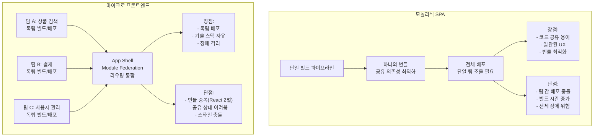

**번들 최적화 전략**에서의 트레이드오프도 중요합니다. 코드 스플리팅은 초기 로딩을 줄이지만 라우트 전환 시 추가 네트워크 요청이 발생합니다. 트리 쉐이킹은 사용하지 않는 코드를 제거하지만 사이드 이펙트가 있는 모듈은 제거할 수 없습니다. 레이지 로딩은 필요한 시점에 로드하지만 사용자 경험에 지연을 줄 수 있어 `prefetch` 힌트와 함께 사용해야 합니다.

| 전략 | 초기 로딩 | 후속 탐색 | 개발 복잡도 | 적합한 케이스 |
|---|---|---|---|---|
| 코드 스플리팅 | ✓ 감소 | △ 추가 요청 | 중간 | 대규모 SPA |
| 트리 쉐이킹 | ✓ 감소 | 영향 없음 | 낮음 | ESM 기반 라이브러리 |
| 레이지 로딩 | ✓ 대폭 감소 | △ 지연 가능 | 중간 | 비핵심 기능 |
| Prefetch/Preload | 영향 없음 | ✓ 빠름 | 낮음 | 예측 가능한 네비게이션 |

### 리팩토링과 설계 원칙

프론트엔드 리팩토링의 핵심 원칙은 **관심사 분리(Separation of Concerns)**입니다. UI 로직, 비즈니스 로직, 데이터 접근 로직을 명확히 분리하면 테스트와 유지보수가 용이해집니다. Custom Hook 패턴은 React에서 이 원칙을 실현하는 핵심 수단입니다.

```mermaid
flowchart TD
    subgraph "리팩토링 전: 거대 컴포넌트"
        BEFORE["ProductPage 컴포넌트\n- API 호출 로직\n- 상태 관리 로직\n- 에러 처리 로직\n- UI 렌더링 로직\n- 이벤트 핸들러\n(500줄 이상)"]
    end
    subgraph "리팩토링 후: 관심사 분리"
        HOOK["useProduct() Hook\n- API 호출 + 캐싱\n- 로딩/에러 상태\n- 낙관적 업데이트"]
        LOGIC["useProductLogic() Hook\n- 비즈니스 규칙\n- 유효성 검증\n- 상태 변환"]
        UI["ProductPage 컴포넌트\n- 순수 UI 렌더링만\n- Props 기반\n(100줄 이하)"]
        PARTS["하위 컴포넌트들\n- ProductCard\n- PriceDisplay\n- ReviewList"]
        HOOK --> UI
        LOGIC --> UI
        UI --> PARTS
    end
```

**웹 컴포넌트 vs 프레임워크 컴포넌트**도 설계 원칙과 연관된 결정입니다. 웹 컴포넌트(Custom Elements + Shadow DOM)는 웹 표준이므로 프레임워크에 종속되지 않지만, 생태계와 DX(개발자 경험)가 React/Vue에 비해 부족합니다. 디자인 시스템처럼 프레임워크 간 공유가 필요한 경우 웹 컴포넌트가 적합하고, 특정 프레임워크 내 생산성이 우선이면 프레임워크 컴포넌트가 유리합니다.

**성능 최적화 리팩토링**에서는 측정 기반 접근이 필수입니다. Lighthouse, Web Vitals(LCP, FID, CLS) 메트릭을 기준으로 병목을 식별하고, 가장 임팩트가 큰 부분부터 최적화합니다. 무분별한 `React.memo`나 `useMemo`는 오히려 메모리 사용량을 증가시킬 수 있으므로, 프로파일링으로 실제 렌더링 병목을 확인한 후 적용해야 합니다.

### 디자인 패턴 적용

프론트엔드에서 가장 많이 사용되는 디자인 패턴은 **Compound Component**, **Render Props**, **Higher-Order Component(HOC)**, **Custom Hook** 패턴입니다. 최근에는 Custom Hook이 HOC와 Render Props를 대체하는 추세입니다.

```mermaid
flowchart TD
    subgraph "프론트엔드 디자인 패턴 진화"
        MIXIN["Mixin (과거)\n이름 충돌\n암묵적 의존성"] -->|"대체"| HOC["HOC 패턴\nwithAuth(Component)\nwithRouter(Component)\n중첩 시 Props 충돌"]
        HOC -->|"대체"| RENDER["Render Props\nchildren as function\n유연하지만 콜백 지옥"]
        RENDER -->|"대체"| HOOKS["Custom Hooks\nuseAuth(), useRouter()\n조합 용이, 테스트 용이"]
    end
    subgraph "Compound Component 패턴"
        TAB["Tab.Root"] --> TAB_LIST["Tab.List"]
        TAB --> TAB_PANELS["Tab.Panels"]
        TAB_LIST --> TAB_ITEM1["Tab.Item\nactive 상태 공유"]
        TAB_LIST --> TAB_ITEM2["Tab.Item"]
        TAB_PANELS --> TAB_PANEL1["Tab.Panel\nContext로 상태 공유"]
        TAB_PANELS --> TAB_PANEL2["Tab.Panel"]
    end
```

**Container/Presenter 패턴**은 데이터 로직과 UI 렌더링을 분리하는 고전적 패턴입니다. Container가 데이터를 가져와 Presenter에 Props로 전달하면, Presenter는 순수하게 UI만 담당합니다. 이 패턴은 Storybook에서의 컴포넌트 격리 테스트를 매우 용이하게 만듭니다.

**Error Boundary 패턴**은 React에서 컴포넌트 트리의 에러를 격리하는 패턴입니다. 개별 위젯의 에러가 전체 페이지를 다운시키지 않도록, 기능 단위로 Error Boundary를 배치하고 Fallback UI를 제공합니다. 이는 마이크로 프론트엔드에서 특히 중요하며, 독립 배포되는 각 마이크로 앱의 장애가 호스트 앱에 전파되지 않도록 보장합니다.

## 연습 문제

### 1. 시스템 구조와 모델링

**문제 1-1.** 사용자가 브라우저에 URL을 입력하면, 브라우저는 HTML 파싱 → DOM 구성 → CSSOM 생성 → Render Tree 결합 → Layout → Paint → Composite 단계를 거쳐 화면을 렌더링합니다. 이 파이프라인에서 `<script>` 태그가 DOM 파싱을 블록하는 이유를 설명하고, `async`와 `defer` 속성이 각각 이 블로킹 동작을 어떻게 변경하는지 비교하세요. CSS 파일의 로딩이 JavaScript 실행을 블록하는 상황(render-blocking vs parser-blocking)도 함께 분석하세요.

<details><summary>힌트 보기</summary>

브라우저는 `<script>`를 만나면 DOM 파싱을 중단하고 스크립트를 다운로드 및 실행합니다. 이는 스크립트가 `document.write()`로 DOM을 변경할 수 있기 때문입니다. `async`는 다운로드를 병렬로 하되 실행 시 파싱을 중단하고, `defer`는 다운로드를 병렬로 하고 DOM 파싱 완료 후 순서대로 실행합니다. CSS는 CSSOM이 완성되어야 JavaScript가 계산된 스타일에 접근할 수 있으므로, CSS 로딩이 JS 실행을 간접적으로 블록합니다.

</details>

**문제 1-2.** React의 Fiber 아키텍처는 기존의 동기 Stack Reconciler를 대체하여 비동기 렌더링을 가능하게 했습니다. Stack Reconciler가 대규모 컴포넌트 트리에서 어떤 문제를 일으켰는지 설명하고, Fiber가 작업을 작은 단위(unit of work)로 분할하여 Time Slicing을 구현하는 메커니즘을 설명하세요. `requestIdleCallback`과의 관계, 그리고 우선순위 기반 스케줄링(Lane 모델)이 사용자 인터랙션 응답성을 어떻게 개선하는지 분석하세요.

<details><summary>힌트 보기</summary>

Stack Reconciler는 재귀적으로 컴포넌트 트리를 순회하므로 중간에 멈출 수 없어, 대규모 트리에서는 메인 스레드를 장시간 점유하여 입력 지연(input lag)이 발생합니다. Fiber는 각 컴포넌트를 Fiber 노드(링크드 리스트)로 표현하여 작업을 중단/재개할 수 있게 합니다. Lane 모델은 각 업데이트에 우선순위 비트마스크를 할당하여, 사용자 입력(SyncLane)이 데이터 페칭(TransitionLane)보다 먼저 처리되도록 합니다.

</details>

**문제 1-3.** JavaScript 이벤트 루프에서 마이크로태스크(Promise, MutationObserver)와 매크로태스크(setTimeout, setInterval, I/O)의 실행 순서를 설명하세요. 다음 코드의 콘솔 출력 순서를 예측하고 그 이유를 설명하세요:

```javascript
console.log('1');
setTimeout(() => console.log('2'), 0);
Promise.resolve().then(() => console.log('3'));
queueMicrotask(() => console.log('4'));
console.log('5');
```

<details><summary>힌트 보기</summary>

이벤트 루프는 콜 스택이 비면 먼저 마이크로태스크 큐를 모두 비운 후 매크로태스크를 하나 실행합니다. 동기 코드(1, 5) → 마이크로태스크(3, 4) → 매크로태스크(2) 순서입니다. `queueMicrotask`와 `Promise.then`은 같은 마이크로태스크 큐에 들어가며 등록 순서대로 실행됩니다. 이 메커니즘의 이해는 React의 `setState` 배칭이나 Vue의 `nextTick` 동작을 파악하는 데 필수적입니다.

</details>

### 2. 트레이드오프와 의사결정

**문제 2-1.** Next.js 기반 웹 애플리케이션에서 다음 세 가지 페이지에 대해 각각 SSR(Server-Side Rendering), SSG(Static Site Generation), ISR(Incremental Static Regeneration) 중 어떤 렌더링 전략이 가장 적합한지 근거와 함께 선택하세요:

- (A) 뉴스 기사 페이지: 실시간으로 새 기사가 추가되지만 게시 후 내용은 거의 변경되지 않음
- (B) 개인 대시보드: 사용자별로 완전히 다른 데이터를 보여줌
- (C) 마케팅 랜딩 페이지: 내용이 월 1-2회 변경됨

<details><summary>힌트 보기</summary>

SSG는 빌드 타임에 HTML을 생성하여 CDN에서 서빙하므로 가장 빠르지만, 데이터 변경 시 재빌드가 필요합니다. ISR은 `revalidate` 간격으로 백그라운드에서 재생성하여 SSG의 성능과 동적 데이터의 균형을 잡습니다. SSR은 매 요청마다 서버에서 렌더링하므로 개인화된 콘텐츠에 적합하지만 TTFB가 느립니다. (A)는 ISR(예: revalidate: 60), (B)는 SSR, (C)는 SSG가 일반적으로 적합합니다.

</details>

**문제 2-2.** 대규모 React 애플리케이션에서 전역 상태 관리 도구를 선택해야 합니다. Redux(예측 가능한 상태 컨테이너), Zustand(최소주의 상태 관리), React Query(서버 상태 특화) 각각이 가장 적합한 시나리오를 제시하세요. "모든 상태를 하나의 도구로 관리"하는 것이 왜 안티패턴인지, 클라이언트 상태와 서버 상태를 분리해야 하는 이유를 설명하세요.

<details><summary>힌트 보기</summary>

서버 상태(API 응답 데이터)는 캐싱, 백그라운드 갱신, 낙관적 업데이트, 페이지네이션 등 고유한 문제가 있어 React Query/SWR이 전문적으로 처리합니다. 클라이언트 상태(UI 토글, 폼 입력)는 Redux 또는 Zustand가 적합합니다. Redux는 DevTools, 미들웨어 생태계가 풍부하여 복잡한 비즈니스 로직에 강하지만 보일러플레이트가 많고, Zustand는 설정이 간단하여 중소 규모 앱에 적합합니다.

</details>

**문제 2-3.** SPA(Single Page Application)와 MPA(Multi Page Application) 아키텍처 선택에서, SEO 요구사항이 높은 이커머스 사이트를 구축한다고 가정합니다. 순수 CSR(Client-Side Rendering) SPA가 SEO에 불리한 이유를 설명하고, SSR/SSG를 적용한 하이브리드 접근(예: Next.js App Router)이 이 문제를 어떻게 해결하는지 분석하세요. Streaming SSR과 Suspense의 역할도 함께 설명하세요.

<details><summary>힌트 보기</summary>

CSR SPA는 초기 HTML이 빈 `<div id="root">`이므로 검색 엔진 크롤러가 콘텐츠를 인덱싱하기 어렵습니다(Googlebot은 JS 실행이 가능하지만 지연이 있고, 다른 크롤러는 지원하지 않을 수 있습니다). Streaming SSR은 서버에서 HTML을 점진적으로 전송하여 TTFB를 줄이고, React Suspense는 데이터 로딩 중 fallback UI를 보여준 후 완료 시 실제 콘텐츠로 스트리밍 교체합니다.

</details>

### 3. 문제 해결 및 리팩토링

**문제 3-1.** 관리자 대시보드에서 10만 개의 로그 항목을 테이블로 렌더링해야 합니다. 모든 항목을 DOM에 렌더링하니 초기 로딩에 8초가 걸리고 스크롤이 끊깁니다. 가상 스크롤(Virtualization)과 windowing 기법을 적용하여 이 문제를 해결하는 방법을 설명하세요. `react-window` 또는 `@tanstack/virtual`의 핵심 원리(뷰포트에 보이는 아이템만 DOM에 마운트)와 동적 높이 아이템을 처리할 때의 추가 고려사항도 분석하세요.

<details><summary>힌트 보기</summary>

가상 스크롤은 전체 목록의 높이를 계산하여 스크롤 영역을 확보하되, 실제로는 뷰포트에 보이는 아이템(+ 오버스캔 버퍼)만 DOM에 렌더링합니다. 이를 통해 DOM 노드 수를 수십 개로 제한하여 메모리와 렌더링 성능을 극적으로 개선합니다. 동적 높이 아이템은 렌더링 전 높이를 알 수 없으므로, 예상 높이(estimateSize)로 초기 배치 후 실제 높이를 측정하여 조정하는 방식이 필요합니다.

</details>

**문제 3-2.** 다음 React 컴포넌트에서 `useEffect` 내 API 호출이 컴포넌트 언마운트 후에도 완료되어 `setState`를 호출하면서 메모리 누수 경고가 발생합니다:

```jsx
useEffect(() => {
  fetch('/api/data')
    .then(res => res.json())
    .then(data => setData(data));
}, []);
```

AbortController를 사용하여 이 문제를 해결하는 코드로 리팩토링하세요. 또한 React 18의 Strict Mode에서 `useEffect`가 두 번 실행되는 이유와 이것이 클린업 함수 작성의 중요성을 어떻게 강조하는지 설명하세요.

<details><summary>힌트 보기</summary>

AbortController의 `signal`을 `fetch`에 전달하고, 클린업 함수에서 `controller.abort()`를 호출하면 컴포넌트 언마운트 시 진행 중인 요청이 취소됩니다. React 18 Strict Mode는 개발 환경에서 의도적으로 `useEffect`를 mount → unmount → mount 순서로 실행하여, 클린업이 누락된 부수 효과를 조기에 발견하도록 돕습니다. 이는 이벤트 리스너, WebSocket 연결, 타이머 등에도 동일하게 적용됩니다.

</details>

**문제 3-3.** 프로덕션 웹 애플리케이션에서 번들 크기가 2MB를 넘어 초기 로딩이 느립니다. webpack-bundle-analyzer로 분석한 결과 lodash 전체(71KB gzipped), moment.js(67KB gzipped), 사용하지 않는 컴포넌트까지 메인 번들에 포함되어 있었습니다. Tree Shaking이 제대로 동작하지 않는 원인을 분석하고, 코드 스플리팅(dynamic import), 라이브러리 교체(date-fns, lodash-es), 번들 최적화 전략을 제시하세요.

<details><summary>힌트 보기</summary>

Tree Shaking은 ES Module의 정적 구조(import/export)를 분석하여 사용되지 않는 코드를 제거합니다. `lodash`는 CommonJS 모듈이므로 Tree Shaking이 불가능하지만, `lodash-es`는 ES Module이므로 사용한 함수만 번들에 포함됩니다. `moment.js`는 모든 로케일을 포함하므로 `date-fns`나 `dayjs`로 교체하면 크기가 크게 줄어듭니다. `React.lazy` + `Suspense`로 라우트별 코드 스플리팅을 적용하면 초기 로딩에 필요한 코드만 전달합니다.

</details>

### 4. 개념 간의 연결성

**문제 4-1.** PWA(Progressive Web App)에서 오프라인 동작을 구현하려 합니다. Service Worker, Cache API, IndexedDB 세 가지 기술이 각각 어떤 역할을 담당하는지 설명하고, 다음 시나리오에서 이들이 어떻게 협력하는지 데이터 흐름을 설계하세요: "사용자가 오프라인 상태에서 게시글을 작성하고, 온라인 복귀 시 서버에 동기화"

<details><summary>힌트 보기</summary>

Service Worker는 네트워크 프록시 역할로 요청을 가로채 캐시된 응답을 반환합니다. Cache API는 HTTP 요청/응답 쌍을 저장하여 정적 자산(HTML, CSS, JS, 이미지)의 오프라인 서빙에 사용됩니다. IndexedDB는 구조화된 데이터(게시글 내용, 사용자 입력)를 클라이언트에 저장합니다. 오프라인 게시글 작성 → IndexedDB 저장 → `sync` 이벤트(Background Sync API)로 온라인 복귀 감지 → 서버 전송의 흐름을 설계해 보세요.

</details>

**문제 4-2.** Core Web Vitals(LCP, FID/INP, CLS)를 개선하기 위해 Critical Rendering Path를 최적화하려 합니다. LCP(Largest Contentful Paint)를 개선하기 위해 리소스 우선순위 힌트(`<link rel="preload">`, `<link rel="prefetch">`, `fetchpriority`)와 이미지 최적화(next/image, AVIF/WebP, lazy loading)를 어떻게 조합해야 하는지 설명하세요. CLS(Cumulative Layout Shift)가 발생하는 원인과 해결 방법도 함께 분석하세요.

<details><summary>힌트 보기</summary>

`preload`는 현재 페이지에 필수적인 리소스(히어로 이미지, 웹폰트)를 조기 로딩하고, `prefetch`는 다음 네비게이션에 필요한 리소스를 유휴 시간에 미리 가져옵니다. `fetchpriority="high"`를 LCP 요소의 이미지에 적용하면 브라우저가 우선적으로 다운로드합니다. CLS는 이미지/비디오에 `width`/`height` 속성 미지정, 동적으로 삽입되는 콘텐츠(광고 배너), 웹폰트 FOUT(Flash of Unstyled Text) 등이 원인이며, `aspect-ratio` 예약, `font-display: optional` 등으로 해결합니다.

</details>

**문제 4-3.** 마이크로 프론트엔드 아키텍처에서 Module Federation(webpack 5)을 사용하여 독립적으로 배포되는 팀별 애플리케이션을 통합하려 합니다. 공유 의존성(React, 디자인 시스템) 버전 불일치 문제를 어떻게 해결하는지, 런타임에 원격 모듈을 로딩할 때의 에러 처리(네트워크 장애 시 fallback), 그리고 팀 간 상태 공유를 최소화하는 설계 원칙을 설명하세요.

<details><summary>힌트 보기</summary>

Module Federation의 `shared` 설정으로 공유 의존성을 선언하면, 런타임에 이미 로드된 호환 버전을 재사용합니다. `singleton: true`로 React 인스턴스 중복을 방지하고, `requiredVersion`으로 호환 범위를 지정합니다. 원격 모듈 로딩 실패 시 `React.lazy` + `ErrorBoundary`로 fallback UI를 제공합니다. 팀 간 상태 공유는 Custom Events나 공유 서비스 인터페이스로 최소화하고, 각 마이크로 앱이 독립적 상태를 유지해야 합니다.

</details>