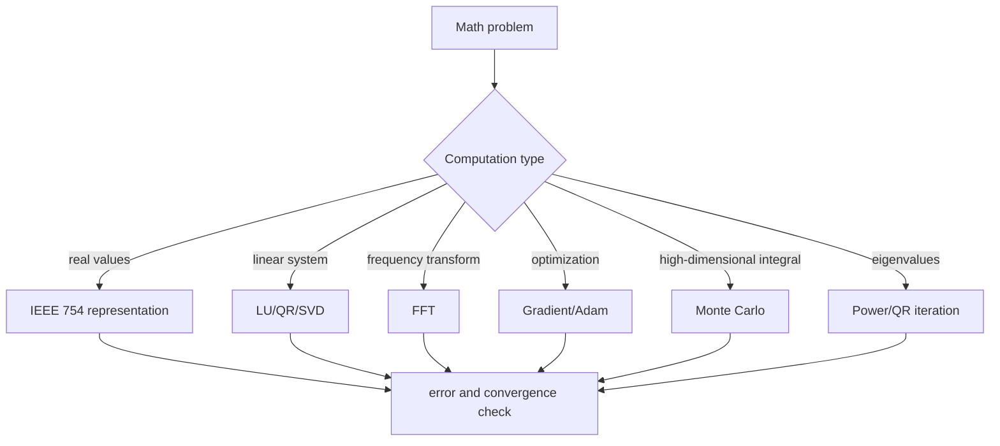
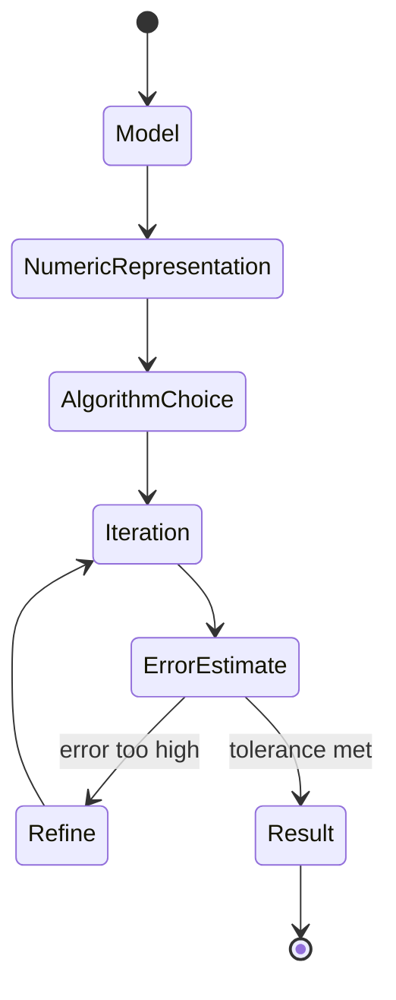

# Mathematical Computing Internals 학습 및 기록 노트

## Scope, Assumptions, and Numerical Validation

This document connects mathematical algorithms to representative implementations. A theorem, an asymptotic bound, and an observed runtime are different kinds of claims and are evaluated separately.

- **Scope:** Results apply only to the stated arithmetic model, matrix structure, norm, convergence criterion, and algorithm variant. Dense and sparse costs are not interchangeable.
- **Numeric assumptions:** Record data type, rounding mode, scaling, dimensions, sparsity, conditioning, initialization, tolerance, and iteration limit. Constants and iteration counts without these inputs are illustrative.
- **Guarantees and uncertainty:** A convergence or error guarantee is valid only when its hypotheses hold. Finite precision adds rounding, overflow, cancellation, and stopping-error terms that exact arithmetic omits.
- **Evidence:** Report residuals, backward and forward error where meaningful, condition estimates, iteration histories, and a higher-precision or independently derived reference result.
- **Failure and completion:** Treat NaN/Inf, stagnation, divergence, violated constraints, unstable pivots, or tolerance exhaustion as explicit failures. A computation is complete only when its stopping rule and error budget are both satisfied.

## 1. 왜 필요한가? (Pain Point & Motivation)

Mathematical computing is not just translating formulas into code. Floating-point arithmetic loses precision, matrix factorizations amplify or control conditioning, FFT depends on butterfly state transitions, and Monte Carlo estimates require variance management. The same mathematical expression can be stable or unstable depending on representation and algorithm order.

This note rewrites the original mathematical computing reference into the common learning template, focusing on numerical state, error, and algorithm choice.

## 2. 현재 나의 상태 (Baseline)

- IEEE 754, LU/QR/SVD, FFT, gradient descent, Adam, Monte Carlo, and condition number are familiar names.
- Catastrophic cancellation and pivoting are understood conceptually but not always used as design criteria.
- Exact, approximate, randomized, and iterative algorithms need clearer decision boundaries.
- BLAS levels, cache blocking, sparse layouts, and mixed precision should be connected to algorithmic structure.
- Numerical results should be reported with error or confidence, not only a final value.

## 3. 도달하고 싶은 목표 (Target State)

- Explain why floating-point arithmetic differs from real-number arithmetic.
- Choose LU, QR, or SVD based on stability, cost, and rank behavior.
- Explain how an FFT variant suited to the factorization of `N` reduces direct DFT work from `O(N^2)` to `O(N log N)`; butterfly and ordering details depend on the variant.
- Track gradient, moment, sample, residual, and eigenvector state in iterative methods.
- Use condition number and error estimates to decide when an implementation must be refactored.

## 4. 시스템 번역 (Data Flow)



Mathematical computing turns an exact model into finite state and then repeatedly checks whether the numerical state is still trustworthy.

## 5. 핵심 구성요소 (Building Blocks)

| Building block | Internal state | Key question |
| --- | --- | --- |
| IEEE 754 | sign, exponent, mantissa | Is range and precision enough? |
| Catastrophic cancellation | subtracting nearby values | Are significant digits lost? |
| LU factorization | `PA = LU` | Is pivoting needed? |
| QR factorization | orthogonal `Q`, triangular `R` | Is least squares solved stably? |
| SVD | singular values/vectors | Is rank deficiency handled? |
| FFT | bit-reversal, butterfly passes | Are twiddle factors and ordering correct? |
| Quadrature | local error estimate | Does the interval need refinement? |
| Adam | gradient, first/second moments | Is the update stable? |
| Monte Carlo | samples and variance | Is the standard error acceptable? |
| Condition number | `sigma_max / sigma_min` | How much is input error amplified? |

## 6. 상태 전이 (State Transition)



FFT iterations are butterfly passes, gradient descent iterations are parameter updates, and Monte Carlo iterations are sample accumulations. Each transition must update both the result and the uncertainty around it.

## 7. 불변식 (Invariant: 절대 깨지면 안 되는 규칙)

- Floating-point operations include rounding and cannot be treated as exact real arithmetic.
- Numerically equivalent formulas can have very different stability.
- LU factorization should use pivoting when small pivots can amplify error.
- Least squares via normal equations squares the condition number; QR or SVD is safer.
- FFT index order, input length strategy, and twiddle factor signs must be consistent.
- Gradient methods can diverge when the learning rate is too large.
- Monte Carlo estimates need standard error or confidence intervals justified by their sampling assumptions; the usual `O(1/sqrt(N))` standard error requires independent finite-variance sampling.
- Ill-conditioned problems need preconditioning, higher precision, or a more stable formulation.

## 8. 가장 작은 예제 (Minimal Viable Example)

```python
def kahan_sum(values):
    total = 0.0
    correction = 0.0

    for value in values:
        adjusted = value - correction
        next_total = total + adjusted
        correction = (next_total - total) - adjusted
        total = next_total

    return total
```

Kahan summation keeps a correction term for lost low-order bits. The mathematical sum is the same, but the computational state preserves more precision.

## 9. 실패 사례 (What could go wrong?)

- Treating `0.1 + 0.2` as exactly equal to `0.3`.
- Using the naive quadratic formula where cancellation destroys significant digits.
- Solving `A^T A x = A^T b` directly when QR or SVD is needed.
- Assuming FFT is always fast without considering non-power-of-two lengths and memory ordering.
- Using a learning rate that makes gradient descent diverge.
- Reporting a Monte Carlo mean without standard error.
- Running FP16 training without loss scaling and losing gradients to underflow.

## 10. 뇌 확장하기 (Evolution & Variants)

- Linear algebra expands into BLAS levels, sparse CSR/CSC, cache blocking, and iterative solvers.
- Integration expands into trapezoidal, Simpson, Gaussian, and adaptive quadrature.
- Optimization expands into SGD, Adam, L-BFGS, Newton methods, and learning-rate schedules.
- Eigenvalue algorithms expand into power iteration, QR, Lanczos, and Arnoldi.
- Monte Carlo expands through importance sampling, control variates, and quasi-Monte Carlo.
- Mixed precision combines FP16/BF16 compute with FP32 accumulation and loss scaling.

## 11. 최종 체크리스트 (Definition of Done)

- [x] Floating point, matrix factorizations, FFT, optimization, Monte Carlo, and conditioning are organized by state.
- [x] Kahan summation provides a minimal example of numerical error control.
- [x] Stability failures such as cancellation and normal equations are documented.
- [x] Accuracy, convergence, memory, and performance trade-offs are included.
- [x] The original English mathematical computing reference is rewritten into the 12-section template.

## 12. 뇌에 새기는 복습 문장 (TL;DR Blank)

Mathematical computing is trustworthy only when representation, conditioning, state transitions, and error estimates all agree with the problem being solved.
