# Mathematical Computing Internals: Numerical Methods, Linear Algebra & Optimization

> Under the Hood: How floating-point arithmetic loses precision, how matrix decompositions factor linear systems, how gradient descent navigates loss landscapes, how FFT reduces O(N²) to O(N log N), how numerical integration accumulates error — the exact algorithms, mathematical guarantees, and computational mechanics.

---

## 1. Floating-Point Arithmetic: IEEE 754 Internals

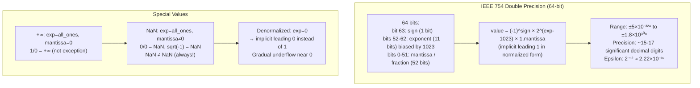

### Catastrophic Cancellation

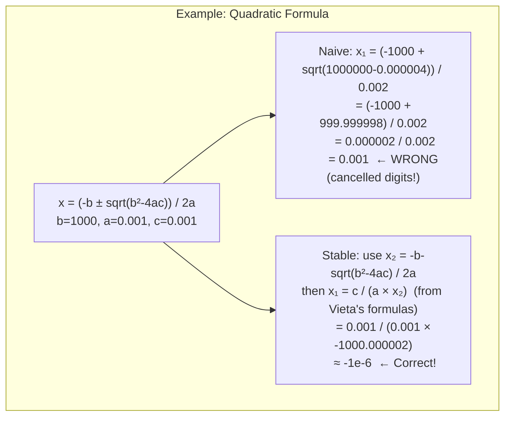

**Machine epsilon**: The smallest ε such that `1.0 + ε ≠ 1.0` in floating point. For doubles, ε ≈ 2.22×10⁻¹⁶. Adding 1e16 to 1.0 gives 1e16 (the 1 is lost!).

---

## 2. Matrix Decompositions: LU, QR, SVD

### LU Decomposition (Gaussian Elimination)

Factors matrix A = L × U where L is lower triangular, U is upper triangular. Used to solve Ax = b via forward/back substitution in O(N³).

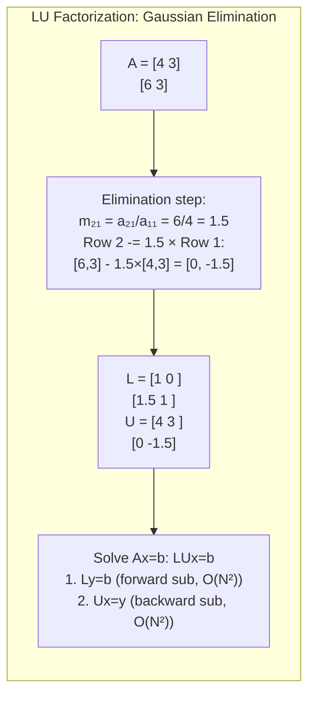

### Partial Pivoting: Numerical Stability

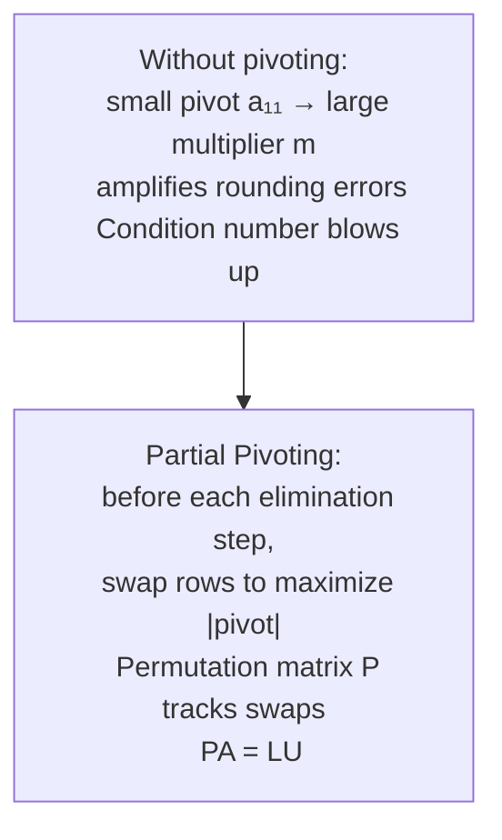

### SVD: Singular Value Decomposition

A = U × Σ × Vᵀ — the fundamental matrix decomposition:

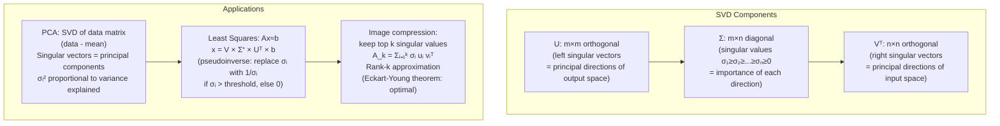

---

## 3. Fast Fourier Transform: Butterfly Network

DFT: `X[k] = Σₙ₌₀ᴺ⁻¹ x[n] × e^(-2πi×k×n/N)` — naively O(N²).

FFT (Cooley-Tukey) reduces to O(N log N) by **divide and conquer**:

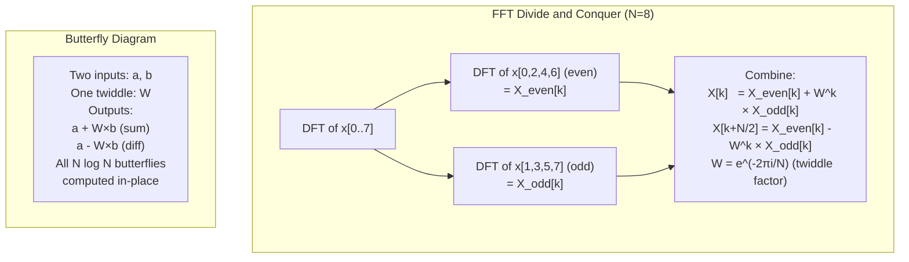

### FFT Memory Access Pattern

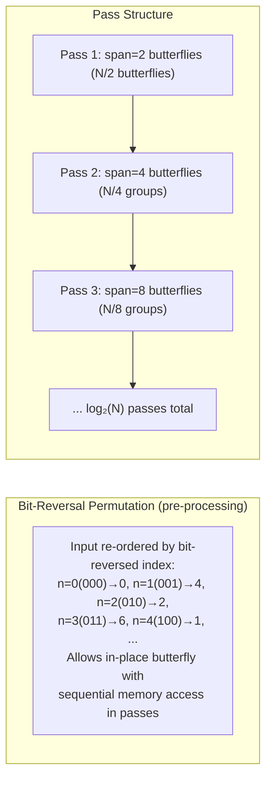

---

## 4. Numerical Integration: Error Analysis

### Trapezoidal Rule vs Simpson's Rule

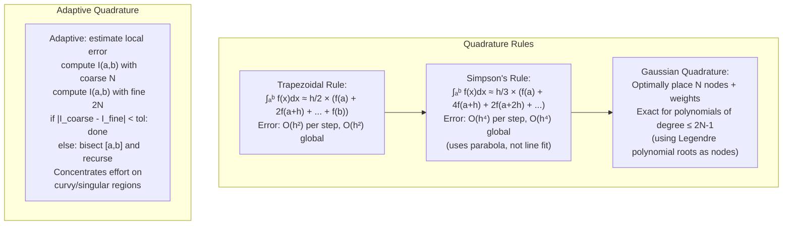

---

## 5. Linear Programming: Simplex Method Internals

Optimize `cᵀx` subject to `Ax ≤ b, x ≥ 0`.

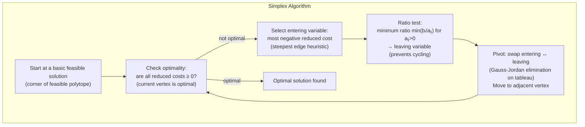

**Worst case vs average case**: Simplex is exponential in the worst case (Klee-Minty cube) but polynomial in practice. Interior-point methods (IPM) are polynomial O(N³·⁵) in theory but simplex often faster in practice for sparse LP.

---

## 6. Gradient Descent: Loss Landscape Navigation

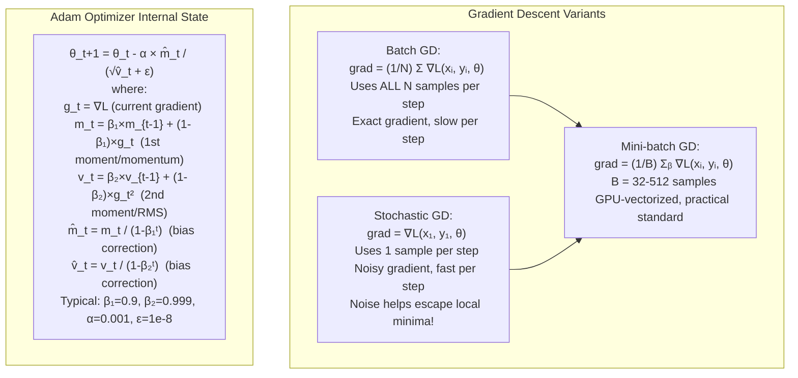

### Learning Rate Scheduling

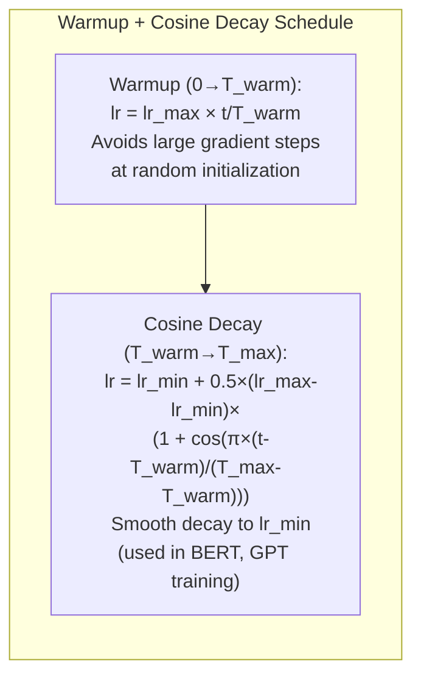

---

## 7. Monte Carlo Methods: Convergence and Variance Reduction

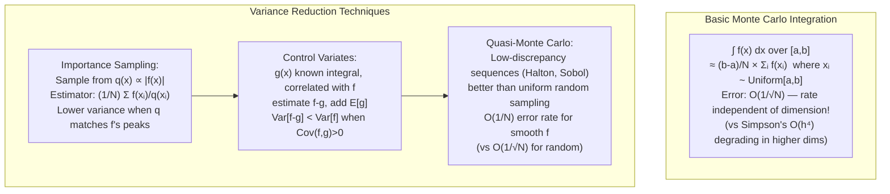

---

## 8. Graph Algorithms: Mathematical Foundations

### Shortest Path: Dijkstra and Bellman-Ford

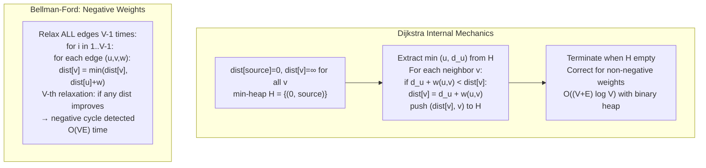

### Maximum Flow: Ford-Fulkerson and Augmenting Paths

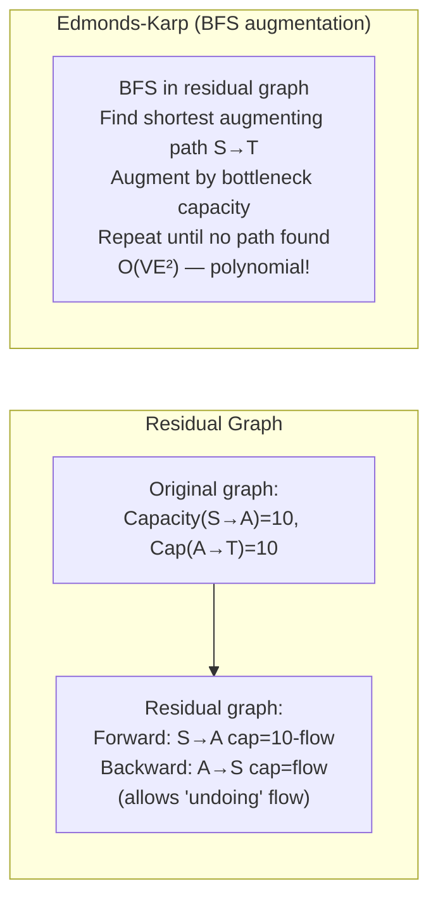

---

## 9. Eigenvalues: Power Iteration and QR Algorithm

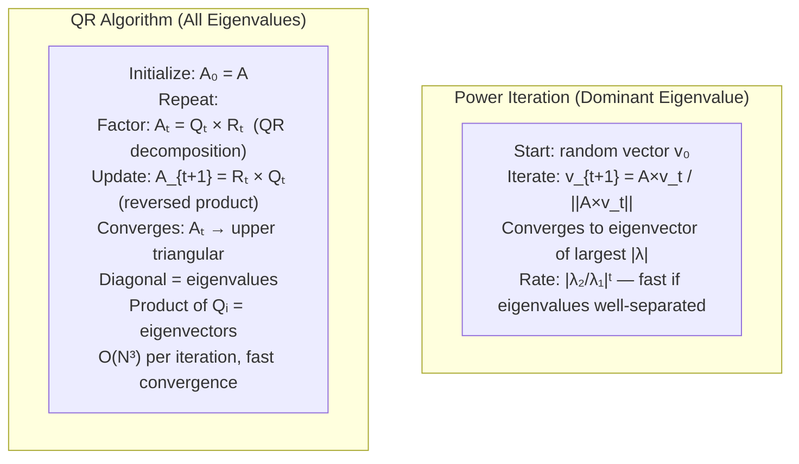

---

## 10. Information Theory Foundations

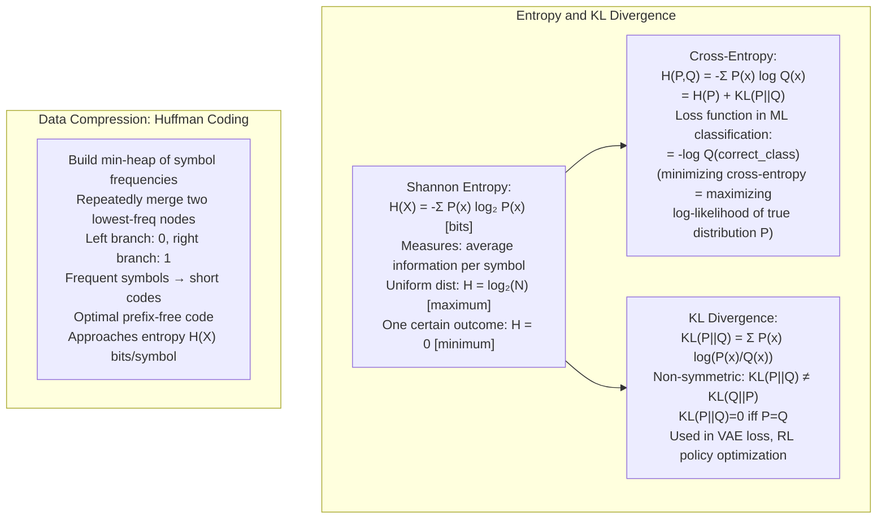

---

## 11. Numerical Stability: Condition Numbers

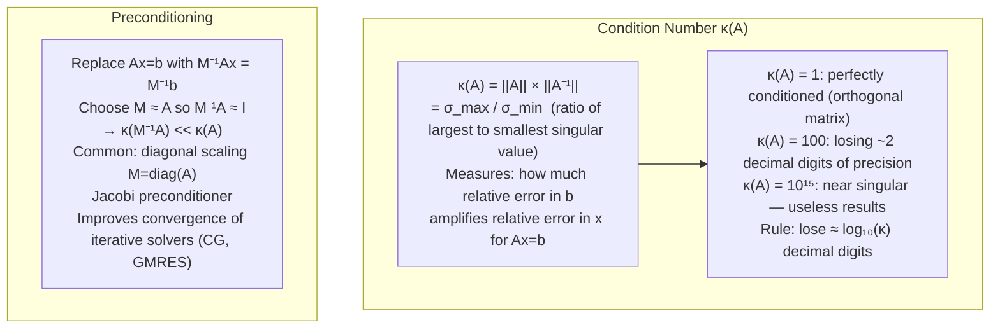

---

## Summary: Mathematical Computing Properties

| Algorithm | Complexity | Numerical Issues | Mitigation |
|---|---|---|---|
| Gaussian elimination | O(N³) | Pivot blowup | Partial pivoting |
| FFT | O(N log N) | Round-off accumulation | Double precision |
| Conjugate Gradient | O(N√κ) iterations | κ large → slow convergence | Preconditioning |
| Power iteration | O(N² per iter) | Slow if λ₁≈λ₂ | Deflation |
| QR eigenvalue | O(N³ per iter) | Non-Hermitian → complex eig | Hessenberg reduction |
| Monte Carlo | O(1/√N) | Variance proportional to f² | Importance sampling |
| Backprop | O(N params) | Vanishing/exploding gradients | Layer norm, gradient clip |
