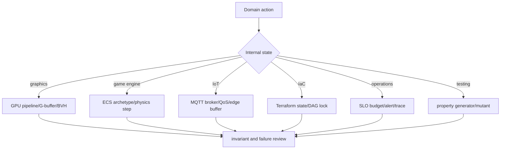
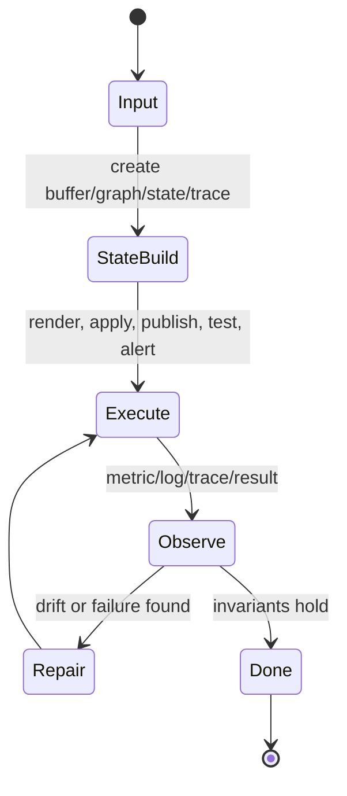
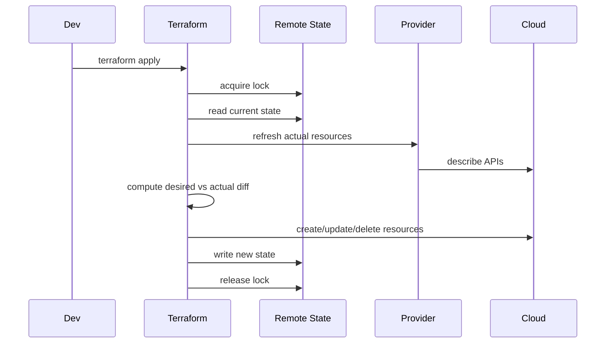

# Miscellaneous CS Internals 학습 및 기록 노트

## 1. 왜 필요한가? (Pain Point & Motivation)

This reference combines topics that look unrelated: graphics, game engines, IoT, infrastructure as code, SRE, testing, shader compilation, database execution, CI/CD, and OS scheduling. The common thread is internal state. Each domain has buffers, queues, graphs, state files, trace contexts, or cache lines whose invariants determine correctness and performance.

This note rewrites the original miscellaneous CS reference into the same learning template, keeping the focus on internal mechanisms rather than tool usage.

## 2. 현재 나의 상태 (Baseline)

- GPU pipelines, ECS, MQTT, Terraform, Ansible, SLOs, OpenTelemetry, and mutation testing are individually familiar.
- The internal state behind each tool is not yet connected into one model.
- Idempotency, locking, error budget burn, trace propagation, and mutation score need explicit invariants.
- Graphics/game/IoT and DevOps/SRE/testing should be read through the same state-machine lens.

## 3. 도달하고 싶은 목표 (Target State)

- Explain GPU rendering, ECS, MQTT QoS, Terraform state, Ansible idempotency, and SLO burn rate as state transitions.
- Separate user-facing commands from internal data structures.
- Evaluate tests by properties and mutation survival, not only line coverage.
- Trace observability data through metric windows, alert fingerprints, and trace context propagation.
- Debug complex systems by locating the broken buffer, graph, queue, state file, or context boundary.

## 4. 시스템 번역 (Data Flow)

Each topic turns an external action into internal state, mutates it, and then exposes the result through output, metrics, or persisted state.

## 5. 핵심 구성요소 (Building Blocks)

| Building block | Internal state | Rule to check |
| --- | --- | --- |
| GPU pipeline | vertex, fragment, depth, color buffers | Shader and depth-test ordering affects cost. |
| Deferred rendering | G-buffer | Trades memory for lighting scalability. |
| ECS | archetype tables and component arrays | System traversal should be cache-friendly. |
| Physics loop | fixed timestep and accumulator | Physics must be decoupled from render FPS. |
| MQTT | broker session, packet id, QoS state | QoS changes duplicate and handshake behavior. |
| Terraform | state file, lock, resource DAG | Desired, actual, and recorded state must align. |
| Ansible | module result and changed flag | Repeated application should be idempotent. |
| SRE | error budget and burn rate | Alerts should reflect budget consumption. |
| OpenTelemetry | traceId, spanId, parentSpanId | Context must cross service boundaries. |
| Mutation testing | killed and survived mutants | Survived mutants expose test gaps. |

## 6. 상태 전이 (State Transition)

Terraform turns desired state into a resource graph. SRE turns raw events into budget burn. GPU rendering turns vertices into fragments and layers. The shape differs, but the workflow is the same.

## 7. 불변식 (Invariant: 절대 깨지면 안 되는 규칙)

- Depth and blending order must preserve the intended rendered result.
- ECS systems rely on components being laid out by archetype.
- MQTT QoS 1 handlers must be idempotent because duplicates are allowed.
- Terraform apply must protect remote state with a lock.
- Ansible modules should return `changed=false` when the target already matches desired state.
- Error-budget alerts need a window strategy that avoids both noise and late detection.
- Trace context must be propagated over every service boundary.
- Property-based tests need generators and shrinkers that produce meaningful counterexamples.
- Survived mutants require review even when line coverage is high.

## 8. 가장 작은 예제 (Minimal Viable Example)

IaC is not just declarative text. It is a state reconciliation system that compares desired configuration, remote state, and actual cloud resources.

## 9. 실패 사례 (What could go wrong?)

- A shader uses `discard` and disables Early-Z, increasing overdraw cost.
- ECS components move between archetypes too often and spend time copying rows.
- MQTT QoS 1 events are applied non-idempotently and duplicate state changes.
- Terraform state is edited manually or applied concurrently without locking.
- Ansible tasks always report `changed=true`, making deployments noisy.
- Alerts depend on a single short window and page on transient spikes.
- Trace headers are dropped at a service boundary and traces fragment.
- Mutation survivors reveal that tests execute code but do not assert behavior.

## 10. 뇌 확장하기 (Evolution & Variants)

- Graphics expands through rasterization, deferred rendering, ray tracing, and compute shaders.
- Game engines expand through ECS, physics solvers, asset streaming, and job systems.
- IoT expands through MQTT, CoAP, DTLS, edge inference, and offline buffering.
- IaC expands through Terraform, Pulumi, CloudFormation, and Ansible state models.
- SRE expands through SLI/SLO design, error-budget policy, incident response, canary, and rollback.
- Testing expands through example-based tests, property-based testing, fuzzing, and mutation testing.

## 11. 최종 체크리스트 (Definition of Done)

- [x] Graphics, game engines, IoT, IaC, SRE, testing, database execution, and CI/CD are organized by internal state.
- [x] Terraform apply provides a minimal reconciliation example.
- [x] Idempotency, state locks, trace context, and error-budget invariants are documented.
- [x] Property-based and mutation testing are included as test-quality mechanisms.
- [x] The original English miscellaneous CS reference is rewritten into the 12-section template.

## 12. 뇌에 새기는 복습 문장 (TL;DR Blank)

Different CS tools become comparable when their internal state is inspected. Buffers, graphs, queues, state files, and trace contexts explain where correctness and performance are won or lost.
